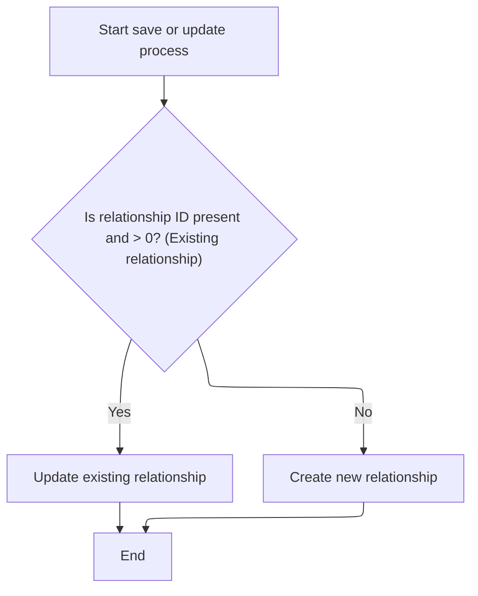

This document describes how product relationship groups are activated for a merchant store. All relationships in the group are set to active and their changes are saved. New products are added and indexed for immediate searchability.

# Activating a Product Relationship Group

<SwmSnippet path="/shopizer/sm-core/src/main/java/com/salesmanager/core/business/catalog/product/service/relationship/ProductRelationshipServiceImpl.java" line="78">

---

ActivateGroup fetches all relationships in a group, marks them active, and saves each one right away to make sure the change sticks.

```java
	public void activateGroup(MerchantStore store, String groupName) throws ServiceException {
		List<ProductRelationship> entities = this.getByGroup(store, groupName);
		for(ProductRelationship relation : entities) {
			relation.setActive(true);
			this.saveOrUpdate(relation);
		}
	}
```

---

</SwmSnippet>

# Persisting Relationship Changes



<SwmSnippet path="/shopizer/sm-core/src/main/java/com/salesmanager/core/business/catalog/product/service/relationship/ProductRelationshipServiceImpl.java" line="33">

---

SaveOrUpdate handles whether a <SwmToken path="shopizer/sm-core/src/main/java/com/salesmanager/core/business/catalog/product/service/relationship/ProductRelationshipServiceImpl.java" pos="33:7:7" line-data="	public void saveOrUpdate(ProductRelationship relationship) throws ServiceException {">`ProductRelationship`</SwmToken> gets updated or created based on its ID. After this, if a new product is involved, we need to call ProductServiceImpl.create to actually add the product and trigger further steps like indexing.

```java
	public void saveOrUpdate(ProductRelationship relationship) throws ServiceException {
		
		if(relationship.getId()!=null && relationship.getId()>0) {
			
			this.update(relationship);
			
		} else {
			this.create(relationship);
		}
		
	}
```

---

</SwmSnippet>

# Creating and Indexing a Product

<SwmSnippet path="/shopizer/sm-core/src/main/java/com/salesmanager/core/business/catalog/product/service/ProductServiceImpl.java" line="233">

---

Create in <SwmToken path="shopizer/sm-core/src/main/java/com/salesmanager/core/business/catalog/product/service/ProductServiceImpl.java" pos="45:4:4" line-data="public class ProductServiceImpl extends SalesManagerEntityServiceImpl&lt;Long, Product&gt; implements ProductService {">`ProductServiceImpl`</SwmToken> adds the product to the database and then immediately calls <SwmToken path="shopizer/sm-core/src/main/java/com/salesmanager/core/business/catalog/product/service/ProductServiceImpl.java" pos="235:1:3" line-data="		searchService.index(product.getMerchantStore(), product);">`searchService.index`</SwmToken> to make it searchable. This indexing step isn't obvious from the method signature, but it's needed so the product shows up in search right after it's created.

```java
	public void create(Product product) throws ServiceException {
		super.create(product);
		searchService.index(product.getMerchantStore(), product);
	}
```

---

</SwmSnippet>

<SwmSnippet path="/shopizer/sm-core/src/main/java/com/salesmanager/core/business/search/service/SearchServiceImpl.java" line="65">

---

Index in <SwmToken path="shopizer/sm-core/src/main/java/com/salesmanager/core/business/search/service/SearchServiceImpl.java" pos="40:4:4" line-data="public class SearchServiceImpl implements SearchService {">`SearchServiceImpl`</SwmToken> transforms each product description into an <SwmToken path="shopizer/sm-core/src/main/java/com/salesmanager/core/business/search/service/SearchServiceImpl.java" pos="90:17:17" line-data="		 * A copy of properies between Product to IndexProduct">`IndexProduct`</SwmToken>, builds a language- and store-specific index name, and serializes everything to JSON for the search index. This way, each language version of the product is searchable, and the index structure supports multi-store setups.

```java
	public void index(MerchantStore store, Product product)
			throws ServiceException {
		
		/**
		 * When a product is saved or updated the indexing process occurs
		 * 
		 * A product entity will have to be transformed to a bean ProductIndex
		 * which contains the indices as described in product.json
		 * 
		 * {"product": {
						"properties" :  {
							"name" : {"type":"string","index":"analyzed"},
							"price" : {"type":"string","index":"not_analyzed"},
							"category" : {"type":"string","index":"not_analyzed"},
							"lang" : {"type":"string","index":"not_analyzed"},
							"available" : {"type":"string","index":"not_analyzed"},
							"description" : {"type":"string","index":"analyzed","index_analyzer":"english"}, 
							"tags" : {"type":"string","index":"not_analyzed"} 
						 } 
			            }
			}
		 *
		 * productService saveOrUpdate as well as create and update will invoke
		 * productSearchService.index	
		 * 
		 * A copy of properies between Product to IndexProduct
		 * Then IndexProduct will be transformed to a json representation by the invocation
		 * of .toJSONString on IndexProduct
		 * 
		 * Then index product
		 * searchService.index(json, "product_<LANGUAGE_CODE>_<MERCHANT_CODE>", "product");
		 * 
		 * example ...index(json,"product_en_default",product)
		 * 
		 */
		
		if(configuration.getProperty(INDEX_PRODUCTS)==null || configuration.getProperty(INDEX_PRODUCTS).equals(Constants.FALSE)) {
			return;
		}
		
		FinalPrice price = pricingService.calculateProductPrice(product);

		
		Set<ProductDescription> descriptions = product.getDescriptions();
		for(ProductDescription description : descriptions) {
			
			StringBuilder collectionName = new StringBuilder();
			collectionName.append(PRODUCT_INDEX_NAME).append(UNDERSCORE).append(description.getLanguage().getCode()).append(UNDERSCORE).append(store.getCode().toLowerCase());
			
			IndexProduct index = new IndexProduct();

			index.setId(String.valueOf(product.getId()));
			index.setStore(store.getCode().toLowerCase());
			index.setLang(description.getLanguage().getCode());
			index.setAvailable(product.isAvailable());
			index.setDescription(description.getDescription());
			index.setName(description.getName());
			if(product.getManufacturer()!=null) {
				index.setManufacturer(String.valueOf(product.getManufacturer().getId()));
			}
			if(price!=null) {
				index.setPrice(price.getFinalPrice().doubleValue());
			}
			index.setHighlight(description.getProductHighlight());
			if(!StringUtils.isBlank(description.getMetatagKeywords())){
				String[] tags = description.getMetatagKeywords().split(",");
				@SuppressWarnings("unchecked")
				List<String> tagsList = new ArrayList(Arrays.asList(tags));
				index.setTags(tagsList);
			}

			
			Set<Category> categories = product.getCategories();
			if(!CollectionUtils.isEmpty(categories)) {
				List<String> categoryList = new ArrayList<String>();
				for(Category category : categories) {
					categoryList.add(category.getCode());
				}
				index.setCategories(categoryList);
			}
			
			String jsonString = index.toJSONString();
			try {
				searchService.index(jsonString, collectionName.toString(), new StringBuilder().append(PRODUCT_INDEX_NAME).append(UNDERSCORE).append(description.getLanguage().getCode()).toString());
			} catch (Exception e) {
				throw new ServiceException("Cannot index product id [" + product.getId() + "], " + e.getMessage() ,e);
			}
		}
```

---

</SwmSnippet>

&nbsp;

*This is an auto-generated document by Swimm 🌊 and has not yet been verified by a human*

<SwmMeta version="3.0.0" repo-id="Z2l0aHViJTNBJTNBU2hvcGl6ZXIlM0ElM0F1bWFsaW5nYXN3YW1p" repo-name="Shopizer"><sup>Powered by [Swimm](https://app.swimm.io/)</sup></SwmMeta>
