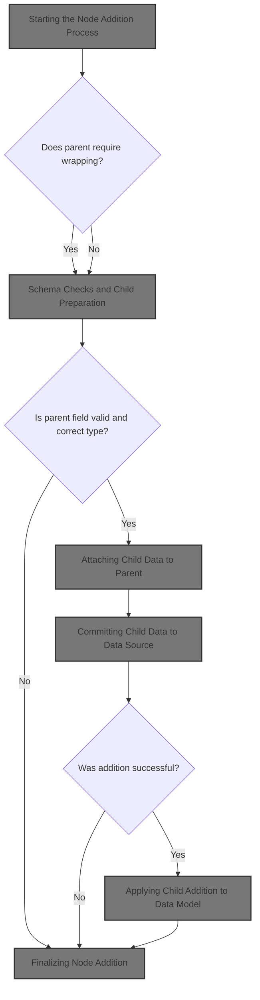
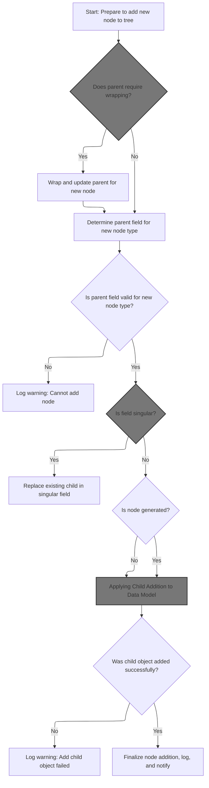
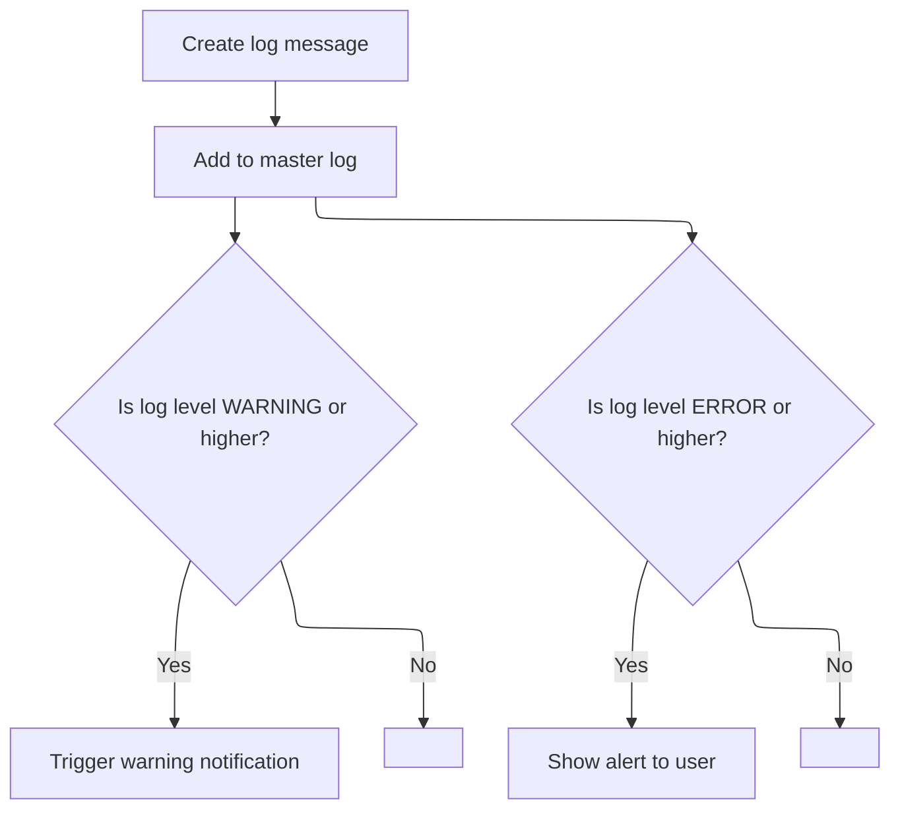
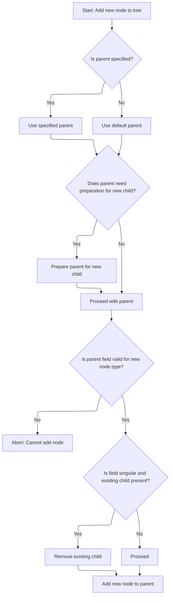
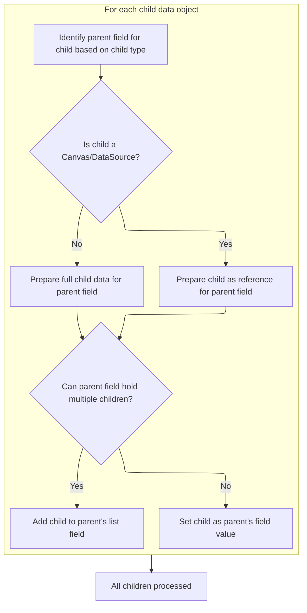
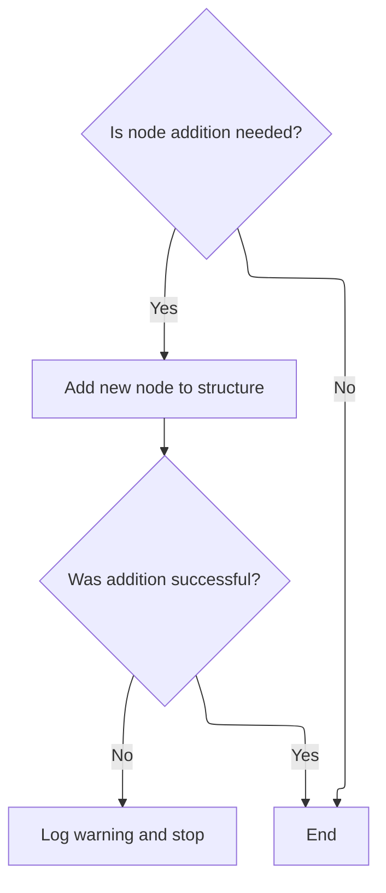
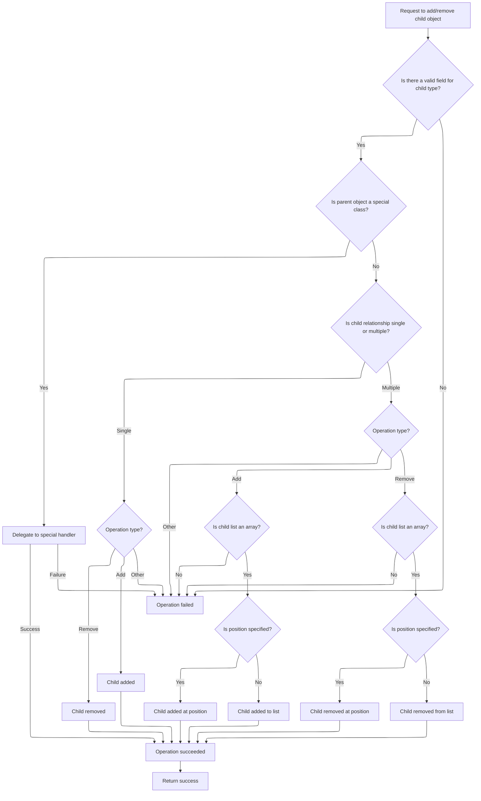
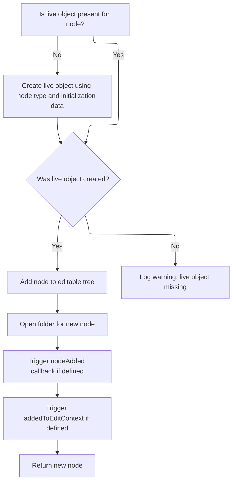

This flow enables users to add new elements to editable hierarchical structures. The system determines the appropriate parent, applies schema rules, attaches the new element, and updates both the data model and the user interface.



# Where is this flow used?

This flow is used multiple times in the codebase as represented in the following diagram:

(Note - these are only some of the entry points of this flow)

```mermaid
graph TD;
      bf12d9fc9f82ac0ae01056324f24cf99b4116fe7205d4ddea1a47f4acaaceeaa(ISC_DataBinding.js::editModeDrop) --> fba9b8d96428ef2d31ff310ffce1b079ab8a1189d80255bf691364cf41ad99a6(ISC_DataBinding.js::itemDrop)

bf12d9fc9f82ac0ae01056324f24cf99b4116fe7205d4ddea1a47f4acaaceeaa(ISC_DataBinding.js::editModeDrop) --> e28ba995537820dd8dead0a7d62a397e20adffecdfe6e621afa9c105fd6fafea(ISC_DataBinding.js::modifyFormOnDrop)

fba9b8d96428ef2d31ff310ffce1b079ab8a1189d80255bf691364cf41ad99a6(ISC_DataBinding.js::itemDrop) --> c92f3b4fec1c2db0cdf80f79ab97fb905b929b9253b35c01c3553b4cfcaf704b(ISC_DataBinding.js::addNode):::mainFlowStyle

fba9b8d96428ef2d31ff310ffce1b079ab8a1189d80255bf691364cf41ad99a6(ISC_DataBinding.js::itemDrop) --> 14eb65f924649a3e959419b3350aa90ddeb6355e2610163e759e4dd01ab1ceef(ISC_DataBinding.js::completeItemDrop)

fba9b8d96428ef2d31ff310ffce1b079ab8a1189d80255bf691364cf41ad99a6(ISC_DataBinding.js::itemDrop) --> af414bb0b5907d3c1480278d04b1c988f06acb69ec75425602da10b13b44e4c1(ISC_DataBinding.js::itemDropping)

14eb65f924649a3e959419b3350aa90ddeb6355e2610163e759e4dd01ab1ceef(ISC_DataBinding.js::completeItemDrop) --> 35aa2432fbfd5922cb499107af3dae2c22da9c9816a536f08bac85bc3f8e5042(ISC_DataBinding.js::addComponent)

14eb65f924649a3e959419b3350aa90ddeb6355e2610163e759e4dd01ab1ceef(ISC_DataBinding.js::completeItemDrop) --> af414bb0b5907d3c1480278d04b1c988f06acb69ec75425602da10b13b44e4c1(ISC_DataBinding.js::itemDropping)

35aa2432fbfd5922cb499107af3dae2c22da9c9816a536f08bac85bc3f8e5042(ISC_DataBinding.js::addComponent) --> c92f3b4fec1c2db0cdf80f79ab97fb905b929b9253b35c01c3553b4cfcaf704b(ISC_DataBinding.js::addNode):::mainFlowStyle

af414bb0b5907d3c1480278d04b1c988f06acb69ec75425602da10b13b44e4c1(ISC_DataBinding.js::itemDropping) --> 35aa2432fbfd5922cb499107af3dae2c22da9c9816a536f08bac85bc3f8e5042(ISC_DataBinding.js::addComponent)

e28ba995537820dd8dead0a7d62a397e20adffecdfe6e621afa9c105fd6fafea(ISC_DataBinding.js::modifyFormOnDrop) --> fba9b8d96428ef2d31ff310ffce1b079ab8a1189d80255bf691364cf41ad99a6(ISC_DataBinding.js::itemDrop)

e28ba995537820dd8dead0a7d62a397e20adffecdfe6e621afa9c105fd6fafea(ISC_DataBinding.js::modifyFormOnDrop) --> 35aa2432fbfd5922cb499107af3dae2c22da9c9816a536f08bac85bc3f8e5042(ISC_DataBinding.js::addComponent)

e28ba995537820dd8dead0a7d62a397e20adffecdfe6e621afa9c105fd6fafea(ISC_DataBinding.js::modifyFormOnDrop) --> 90fecc09b822d8018c060f2458d5580062ce336f7e90ccd25058d0ede15b3c0f(ISC_DataBinding.js::setNodeProperties)

90fecc09b822d8018c060f2458d5580062ce336f7e90ccd25058d0ede15b3c0f(ISC_DataBinding.js::setNodeProperties) --> 35aa2432fbfd5922cb499107af3dae2c22da9c9816a536f08bac85bc3f8e5042(ISC_DataBinding.js::addComponent)

374fd5926685af6fce28c1d76bf491de745cdecde478016317304478502a7b18(ISC_DataBinding.js::isc_DynamicForm_editModeDrop) --> fba9b8d96428ef2d31ff310ffce1b079ab8a1189d80255bf691364cf41ad99a6(ISC_DataBinding.js::itemDrop)

374fd5926685af6fce28c1d76bf491de745cdecde478016317304478502a7b18(ISC_DataBinding.js::isc_DynamicForm_editModeDrop) --> e28ba995537820dd8dead0a7d62a397e20adffecdfe6e621afa9c105fd6fafea(ISC_DataBinding.js::modifyFormOnDrop)

bf12d9fc9f82ac0ae01056324f24cf99b4116fe7205d4ddea1a47f4acaaceeaa(ISC_DataBinding.js::editModeDrop) --> c92f3b4fec1c2db0cdf80f79ab97fb905b929b9253b35c01c3553b4cfcaf704b(ISC_DataBinding.js::addNode):::mainFlowStyle

bf12d9fc9f82ac0ae01056324f24cf99b4116fe7205d4ddea1a47f4acaaceeaa(ISC_DataBinding.js::editModeDrop) --> 35aa2432fbfd5922cb499107af3dae2c22da9c9816a536f08bac85bc3f8e5042(ISC_DataBinding.js::addComponent)

bf12d9fc9f82ac0ae01056324f24cf99b4116fe7205d4ddea1a47f4acaaceeaa(ISC_DataBinding.js::editModeDrop) --> 73e9631072fb7f4c405b2d190f891f8d1d1d3a61e289149bda2e58e1aa27310c(ISC_DataBinding.js::addWithWrapper)

73e9631072fb7f4c405b2d190f891f8d1d1d3a61e289149bda2e58e1aa27310c(ISC_DataBinding.js::addWithWrapper) --> 35aa2432fbfd5922cb499107af3dae2c22da9c9816a536f08bac85bc3f8e5042(ISC_DataBinding.js::addComponent)

d6a4c251849873356bf20dfb883fbfd399d64ec08375d5010de2fede6d31c6b5(ISC_DataBinding.js::isc_Layout_editModeDrop) --> c92f3b4fec1c2db0cdf80f79ab97fb905b929b9253b35c01c3553b4cfcaf704b(ISC_DataBinding.js::addNode):::mainFlowStyle

d6a4c251849873356bf20dfb883fbfd399d64ec08375d5010de2fede6d31c6b5(ISC_DataBinding.js::isc_Layout_editModeDrop) --> 35aa2432fbfd5922cb499107af3dae2c22da9c9816a536f08bac85bc3f8e5042(ISC_DataBinding.js::addComponent)

d6a4c251849873356bf20dfb883fbfd399d64ec08375d5010de2fede6d31c6b5(ISC_DataBinding.js::isc_Layout_editModeDrop) --> 73e9631072fb7f4c405b2d190f891f8d1d1d3a61e289149bda2e58e1aa27310c(ISC_DataBinding.js::addWithWrapper)

bf12d9fc9f82ac0ae01056324f24cf99b4116fe7205d4ddea1a47f4acaaceeaa(ISC_DataBinding.js::editModeDrop) --> 14eb65f924649a3e959419b3350aa90ddeb6355e2610163e759e4dd01ab1ceef(ISC_DataBinding.js::completeItemDrop)

bf12d9fc9f82ac0ae01056324f24cf99b4116fe7205d4ddea1a47f4acaaceeaa(ISC_DataBinding.js::editModeDrop) --> 73e9631072fb7f4c405b2d190f891f8d1d1d3a61e289149bda2e58e1aa27310c(ISC_DataBinding.js::addWithWrapper)

14eb65f924649a3e959419b3350aa90ddeb6355e2610163e759e4dd01ab1ceef(ISC_DataBinding.js::completeItemDrop) --> 35aa2432fbfd5922cb499107af3dae2c22da9c9816a536f08bac85bc3f8e5042(ISC_DataBinding.js::addComponent)

14eb65f924649a3e959419b3350aa90ddeb6355e2610163e759e4dd01ab1ceef(ISC_DataBinding.js::completeItemDrop) --> 73e9631072fb7f4c405b2d190f891f8d1d1d3a61e289149bda2e58e1aa27310c(ISC_DataBinding.js::addWithWrapper)


classDef mainFlowStyle color:#000000,fill:#7CB9F4
classDef rootsStyle color:#000000,fill:#00FFF4
classDef Style1 color:#000000,fill:#00FFAA
classDef Style2 color:#000000,fill:#FFFF00
classDef Style3 color:#000000,fill:#AA7CB9
```



# Starting the Node Addition Process



<SwmSnippet path="/shopizer/sm-shop/src/main/webapp/resources/smart-client/system/modules/ISC_DataBinding.js" line="2172">

---

In `addNode`, we make sure the parent is set and get its live object. If the parent can wrap the child, we let it do that, which might change or block the addition. Then we log the action before moving on.

```javascript
);isc.B._maxIndex=isc.C+16;isc.EditContext.addInterfaceMethods({addNode:function(_1,_2,_3,_4,_5){var _6=this.getEditNodeTree();if(_2==null)_2=this.getDefaultParent(_1);var _7=this.getLiveObject(_2);this.logInfo("addComponent will add newNode of type: "+_1.type+" to: "+this.echoLeaf(_7),"editing");if(_7.wrapChildNode){_2=_7.wrapChildNode(this,_1,_2,_3);if(!_2)return;_7=this.getLiveObject(_2)}
```

---

</SwmSnippet>

## Logging Node Addition Intent

<SwmSnippet path="/shopizer/sm-shop/src/main/webapp/resources/smart-client/system/modules/ISC_Core.js" line="939">

---

`logInfo` is called here to record that we're about to add a new node, including its type and where it's going. This log entry is for tracking and debugging, so if something goes wrong, we know what was supposed to happen. Next, logInfo delegates to logMessage to actually handle the log entry.

```javascript
if(!_3)_3=this.Class;_5.log(_1,_2,_3,this.ID,this,_4)},logDebug:function(_1,_2){return this.logMessage(isc.Log.DEBUG,_1,_2)},logInfo:function(_1,_2){return this.logMessage(isc.Log.INFO,_1,_2)},logWarn:function(_1,_2){return this.logMessage(isc.Log.WARN,_1,_2)},logError:function(_1,_2){return this.logMessage(isc.Log.ERROR,_1,_2)},logFatal:function(_1,_2){return this.logMessage(isc.Log.FATAL,_1,_2)},logIsEnabledFor:function(_1,_2){return(isc.Log.isEnabledFor&&isc.Log.isEnabledFor((_2?_2:this.Class),_1,this))},logIsDebugEnabled:function(_1){return this.logIsEnabledFor(isc.Log.DEBUG,_1)},logIsInfoEnabled:function(_1){return this.logIsEnabledFor(isc.Log.INFO,_1)},logIsWarnEnabled:function(_1){return this.logIsEnabledFor(isc.Log.WARN,_1)},logIsErrorEnabled:function(_1){return this.logIsEnabledFor(isc.Log.ERROR,_1)},setLogPriority:function(_1,_2){isc.Log.setPriority(_1,_2,this)},setDefaultLogPriority:function(_1){isc.Log.setDefaultPriority(_1,this)},getDefaultLogPriority:function(){return isc.Log.getDefaultPriority(this)},clearLogPriority:function(_1){isc.Log.clearPriority(_1,this)}};isc.Class.addMethods(isc.$fk)
```

---

</SwmSnippet>

## Processing the Log Entry

<SwmSnippet path="/shopizer/sm-shop/src/main/webapp/resources/smart-client/system/modules/ISC_Core.js" line="938">

---

`logMessage` takes the log info, checks if it needs to add a stack trace, and then passes everything to the main log handler. This is where the log entry is actually built and sent off. Next, it calls the log function to handle the log output.

```javascript
isc.$fk={logMessage:function(_1,_2,_3,_4){var _5=isc.Log;if(!_5)return;if(_1==null)_1=_5.defaultPriority;if(_1<=_5.stackTracePriority&&this.getStackTrace!=null){_2+="\nStack trace:\n"+this.getStackTrace(arguments,2)}
if(!_3)_3=this.Class;_5.log(_1,_2,_3,this.ID,this,_4)},logDebug:function(_1,_2){return this.logMessage(isc.Log.DEBUG,_1,_2)},logInfo:function(_1,_2){return this.logMessage(isc.Log.INFO,_1,_2)},logWarn:function(_1,_2){return this.logMessage(isc.Log.WARN,_1,_2)},logError:function(_1,_2){return this.logMessage(isc.Log.ERROR,_1,_2)},logFatal:function(_1,_2){return this.logMessage(isc.Log.FATAL,_1,_2)},logIsEnabledFor:function(_1,_2){return(isc.Log.isEnabledFor&&isc.Log.isEnabledFor((_2?_2:this.Class),_1,this))},logIsDebugEnabled:function(_1){return this.logIsEnabledFor(isc.Log.DEBUG,_1)},logIsInfoEnabled:function(_1){return this.logIsEnabledFor(isc.Log.INFO,_1)},logIsWarnEnabled:function(_1){return this.logIsEnabledFor(isc.Log.WARN,_1)},logIsErrorEnabled:function(_1){return this.logIsEnabledFor(isc.Log.ERROR,_1)},setLogPriority:function(_1,_2){isc.Log.setPriority(_1,_2,this)},setDefaultLogPriority:function(_1){isc.Log.setDefaultPriority(_1,this)},getDefaultLogPriority:function(){return isc.Log.getDefaultPriority(this)},clearLogPriority:function(_1){isc.Log.clearPriority(_1,this)}};isc.Class.addMethods(isc.$fk)
```

---

</SwmSnippet>

## Dispatching the Log Message

<SwmSnippet path="/shopizer/sm-shop/src/main/webapp/resources/smart-client/system/modules/ISC_Core.js" line="958">

---

`log` checks if the log message should be recorded based on the current log settings. If logging is enabled for this category and level, it adds the message; otherwise, it might log a warning about suppressed logs. Next, it calls addLogMessage to actually store the log entry.

```javascript
,isc.A.log=function isc_c_Log_log(_1,_2,_3,_4,_5,_6){if(this.isEnabledFor(_3,_1,_5))
this.addLogMessage(_1,_2,_3,_4,_6);else if(this.reportSuppressedLogs){this.logWarn("suppressed log, category: "+_3+": "+_2)}}
```

---

</SwmSnippet>

## Storing and Handling Log Messages



<SwmSnippet path="/shopizer/sm-shop/src/main/webapp/resources/smart-client/system/modules/ISC_Core.js" line="969">

---

`addLogMessage` formats the log entry using $fc, stores it in the master log, and triggers callbacks or alerts if the severity is high enough. Next, it calls addToMasterLog to actually store the message in the log buffer.

```javascript
,isc.A.addLogMessage=function isc_c_Log_addLogMessage(_1,_2,_3,_4,_5){var _6=this.$fc(_1,_2,_3,_4,_5);this.addToMasterLog(_6);if(this.warningLogged!=null&&_1!=null&&_1<=this.WARN){this.warningLogged(_6)}
if(_1!=null&&_1<=this.ERROR){alert(_2)}}
```

---

</SwmSnippet>

<SwmSnippet path="/shopizer/sm-shop/src/main/webapp/resources/smart-client/system/modules/ISC_Core.js" line="971">

---

`addToMasterLog` puts the log in a circular buffer and updates inline logs if needed.

```javascript
,isc.A.addToMasterLog=function(message){this.$fp[this.$fo]=message;this.$fo++;if(this.$fo>this.$fn){this.$fo=0}
if(this.showInlineLogs){this.updateInlineLogResults()}}
```

---

</SwmSnippet>

## Schema Checks and Child Preparation



<SwmSnippet path="/shopizer/sm-shop/src/main/webapp/resources/smart-client/system/modules/ISC_DataBinding.js" line="2172">

---

Back in `addNode`, after logging, we check the schema to find the right field for the child. If the field is singular and already has a child, we remove the old one. For generated types, we prep the data by copying initData and adding any child data. Next, we call addChildData to actually attach the child data to the parent object.

```javascript
);isc.B._maxIndex=isc.C+16;isc.EditContext.addInterfaceMethods({addNode:function(_1,_2,_3,_4,_5){var _6=this.getEditNodeTree();if(_2==null)_2=this.getDefaultParent(_1);var _7=this.getLiveObject(_2);this.logInfo("addComponent will add newNode of type: "+_1.type+" to: "+this.echoLeaf(_7),"editing");if(_7.wrapChildNode){_2=_7.wrapChildNode(this,_1,_2,_3);if(!_2)return;_7=this.getLiveObject(_2)}
var _8=_4||isc.DS.getObjectField(_7,_1.type);var _9=isc.DS.getSchemaField(_7,_8);if(!_9){this.logWarn("can't addComponent: can't find a field in parent: "+_7+" for a new child of type: "+_1.type+", parent property:"+_8+", newNode is: "+this.echo(_1));return}
if(!_9.multiple){var _10=isc.DS.getChildObject(_7,_1.type,_4);if(_10){var _11=_6.getChildren(_2).find("ID",isc.DS.getAutoId(_10));this.logWarn("destroying existing child: "+this.echoLeaf(_10)+" in singular field: "+_8);_6.remove(_11);if(isc.isA.Class(_10)&&!isc.isA.DataSource(_10))_10.destroy()}}
var _12;if(_1.generatedType){_12=isc.addProperties({},_1.initData);this.addChildData(_12,_6.getChildren(_1))}else{_12=_1.liveObject}
```

---

</SwmSnippet>

## Attaching Child Data to Parent



<SwmSnippet path="/shopizer/sm-shop/src/main/webapp/resources/smart-client/system/modules/ISC_DataBinding.js" line="2270">

---

In `addChildData`, we loop through each child, figure out which field in the parent it should go to (using metadata and parentProperty), and serialize the child differently depending on its type. Then we add it to the parent, either as an array element or a direct property, based on the field's multiplicity.

```javascript
,isc.A.addChildData=function isc_EditTree_addChildData(_1,_2){var _3=isc.DS.get(_1._constructor);for(var i=0;i<_2.length;i++){var _5=_2[i],_6=_5.initData._constructor,_7=isc.addProperties({},_5.initData),_8=_7.parentProperty||_3.getObjectField(_6),_9=_3.getField(_8);this.logInfo("serializing: child of type: "+_6+" goes in parent field: "+_8,"editing");if((isc.isA.Canvas(_5.liveObject)&&!_5.liveObject._generated)||isc.isA.DataSource(_5.liveObject))
{_7="ref:"+_7.ID;this.getSerializeableTree(_5)}else{_7=this.getSerializeableTree(_5,true)}
var _10=_1[_8];if(_9.multiple){if(!_10)_10=_1[_8]=[];_10.add(_7)}else{_1[_8]=_7}}}
```

---

</SwmSnippet>

<SwmSnippet path="/shopizer/sm-shop/src/main/webapp/resources/smart-client/system/modules/ISC_DataBinding.js" line="2272">

---

After `addChildData` runs, the parent object has its child fields updated—arrays get new elements, single fields get replaced. The function modifies the parent in place, so the updated structure is ready for the next step.

```javascript
var _10=_1[_8];if(_9.multiple){if(!_10)_10=_1[_8]=[];_10.add(_7)}else{_1[_8]=_7}}}
```

---

</SwmSnippet>

## Committing Child Data to Data Source



<SwmSnippet path="/shopizer/sm-shop/src/main/webapp/resources/smart-client/system/modules/ISC_DataBinding.js" line="2176">

---

After returning from `addChildData`, `addNode` checks if it should update the data source. If so, it calls addChildObject to actually add the child to the parent in the data source. If this fails, it logs a warning and stops.

```javascript
if(!_5){var _13=isc.DS.addChildObject(_7,_1.type,_12,_3,_4);if(!_13){this.logWarn("addChildObject failed, returning");return}}
```

---

</SwmSnippet>

## Applying Child Addition to Data Model



<SwmSnippet path="/shopizer/sm-shop/src/main/webapp/resources/smart-client/system/modules/ISC_DataBinding.js" line="1941">

---

`addChildObject` just delegates to $40k, passing all the relevant info so the actual add logic can run. $40k is where the data structure gets updated based on the schema and operation type.

```javascript
,isc.A.addChildObject=function isc_c_DataSource_addChildObject(_1,_2,_3,_4,_5){return this.$40k(_1,"add",_2,_3,_4,_5)}
```

---

</SwmSnippet>

<SwmSnippet path="/shopizer/sm-shop/src/main/webapp/resources/smart-client/system/modules/ISC_DataBinding.js" line="1943">

---

`$40k` figures out which field in the parent to update (using schema helpers), checks if it's an array or single value, and adds or removes the child accordingly. If the parent is a class, it lets the class handle it. This keeps the data model consistent with the schema.

```javascript
,isc.A.$40k=function isc_c_DataSource__doVerbToChild(_1,_2,_3,_4,_5,_6){var _7=_6||isc.DS.getObjectField(_1,_3);if(_7==null){this.logWarn("No field for child of type "+_3);return false}
this.logInfo(_2+" object "+this.echoLeaf(_4)+" in field: "+_7+" of parentObject: "+this.echoLeaf(_1),"editing");var _8=isc.DS.getSchemaField(_1,_7);if(isc.isA.Class(_1)){if(_1.$40k(_2,_3,_4,_5,_6))return true}
if(!_8.multiple){if(_2=="add")_1[_7]=_4;else if(_2=="remove"){if(_1[_7]!=null)delete _1[_7]}else{this.logWarn("unrecognized verb: "+_2);return false}
return true}
this.logInfo("using direct Array manipulation for field '"+_7+"'","editing");var _9=_1[_7];if(_2=="add"){if(_9!=null&&!isc.isAn.Array(_9)){this.logWarn("unexpected field value: "+this.echoLeaf(_9)+" in field '"+_7+"' when trying to add child: "+this.echoLeaf(_4));return false}
if(_9==null)_1[_7]=_9=[];if(_5!=null)_9.addAt(_4,_5);else _9.add(_4)}else if(_2=="remove"){if(!isc.isAn.Array(_9))return false;if(_5!=null)_9.removeAt(_4,_5);else _9.remove(_4)}else{this.logWarn("unrecognized verb: "+_2);return false}
return true}
```

---

</SwmSnippet>

## Finalizing Node Addition



<SwmSnippet path="/shopizer/sm-shop/src/main/webapp/resources/smart-client/system/modules/ISC_DataBinding.js" line="2177">

---

After returning from addChildObject, `addNode` checks if the node has a liveObject—if not, it fetches it from the data source. Then it adds the node to the edit tree, opens the folder, and calls any hooks for post-addition logic. This ties the node into both the data and UI layers.

```javascript
if(!_1.liveObject)_1.liveObject=isc.DS.getChildObject(_7,_1.type,isc.DS.getAutoId(_1.initData),_4);this.logDebug("for new node: "+this.echoLeaf(_1)+" liveObject is now: "+this.echoLeaf(_1.liveObject),"editing");if(_1.liveObject==null){this.logWarn("wasn't able to retrieve live object after adding node of type: "+_1.type+" to liveParent: "+_7+", does liveParent have an appropriate getter() method?")}
_6.add(_1,_2,_3);_6.openFolder(_1);this.logInfo("added node "+this.echoLeaf(_1)+" to EditTree at path: "+_6.getPath(_1)+" with live object: "+this.echoLeaf(_1.liveObject),"editing");if(this.nodeAdded)this.nodeAdded(_1);if(_1.liveObject.addedToEditContext)_1.liveObject.addedToEditContext(this,_1,_2,_3);return _1},addComponent:function(_1,_2,_3,_4,_5){return this.addNode(_1,_2,_3,_4,_5)},nodeAdded:function(_1){},getDefaultParent:isc.ClassFactory.TARGET_IMPLEMENTS,addFromPaletteNode:function(_1,_2){var _3=this.makeEditNode(_1,_2);return this.addNode(_3,_2)},makeEditNode:function(_1){var _2=this.getDefaultPalette();return _2.makeEditNode(_1)},getDefaultPalette:function(){if(this.defaultPalette)return this.defaultPalette;return(this.defaultPalette=isc.HiddenPalette.create())},getLiveObject:function(_1){var _2=this.getEditNodeTree();var _3=_2.getParent(_1);if(_3==null)return _1.liveObject;var _4=_3.liveObject;var _5=isc.DS.getChildObject(_4,_1.type,isc.DS.getAutoId(_1));if(_5)_1.liveObject=_5;return _1.liveObject},requestLiveObject:function(_1,_2,_3){var _4=this;if(_1.loadData&&!_1.isLoaded){_1.loadData(_1,function(_6){_6=_6||_1
```

---

</SwmSnippet>

&nbsp;

*This is an auto-generated document by Swimm 🌊 and has not yet been verified by a human*

<SwmMeta version="3.0.0" repo-id="Z2l0aHViJTNBJTNBU2hvcGl6ZXIlM0ElM0F1bWFsaW5nYXN3YW1p" repo-name="Shopizer"><sup>Powered by [Swimm](https://app.swimm.io/)</sup></SwmMeta>
