This document describes how an item is added to a user's shopping cart. The flow ensures that users always have a valid cart, merges duplicate items, creates new entries for virtual products, recalculates totals, and returns the updated cart.

# Handling cart retrieval and session state

This section ensures that every user interaction with the shopping cart—whether logged in, anonymous, or new—results in a valid cart context. It guarantees that the cart is always available and correctly reflects the user's session, locale, and store.

| Category        | Rule Name                            | Description                                                                                                                                   |
| --------------- | ------------------------------------ | --------------------------------------------------------------------------------------------------------------------------------------------- |
| Data validation | Locale and store context enforcement | The cart data must always reflect the correct locale and store context based on the user's session and request attributes.                    |
| Data validation | Unique cart code generation          | If all retrieval attempts fail, a new cart must be initialized with a randomly generated code that is unique and does not contain dashes.     |
| Business logic  | Logged-in customer cart retrieval    | If a customer is logged in, their existing shopping cart must be retrieved and used as the primary cart context.                              |
| Business logic  | Fallback to item code cart retrieval | If no cart is found for the logged-in customer, but an item code is provided, attempt to retrieve the cart using the item code as a fallback. |
| Business logic  | Create new cart if none found        | If no cart can be found by customer or item code, a new cart must be created and assigned a unique code.                                      |

<SwmSnippet path="/shopizer/sm-shop/src/main/java/com/salesmanager/web/shop/controller/shoppingCart/ShoppingCartController.java" line="131">

---

We check for a customer and try to get their cart, fall back to the item code if needed, and create a new cart if nothing is found. This sets up the context for the facade to handle cart data.

```java
	ShoppingCartData addShoppingCartItem(@RequestBody final ShoppingCartItem item, final HttpServletRequest request, final HttpServletResponse response, final Locale locale) throws Exception {


		ShoppingCartData shoppingCart=null;


		//Look in the HttpSession to see if a customer is logged in
	    MerchantStore store = getSessionAttribute(Constants.MERCHANT_STORE, request);
	    Language language = (Language)request.getAttribute(Constants.LANGUAGE);
	    Customer customer = getSessionAttribute(  Constants.CUSTOMER, request );


		if(customer != null) {
			com.salesmanager.core.business.shoppingcart.model.ShoppingCart customerCart = shoppingCartService.getByCustomer(customer);
			if(customerCart!=null) {
				shoppingCart = shoppingCartFacade.getShoppingCartData( customerCart);


				//TODO if shoppingCart != null ?? merge
				//TODO maybe they have the same code
				//TODO what if codes are different (-- merge carts, keep the latest one, delete the oldest, switch codes --)
			}
		}

		
```

---

</SwmSnippet>

<SwmSnippet path="/shopizer/sm-shop/src/main/java/com/salesmanager/web/shop/controller/shoppingCart/facade/ShoppingCartFacadeImpl.java" line="311">

---

<SwmToken path="shopizer/sm-shop/src/main/java/com/salesmanager/web/shop/controller/shoppingCart/facade/ShoppingCartFacadeImpl.java" pos="311:5:5" line-data="    public ShoppingCartData getShoppingCartData( final ShoppingCart shoppingCartModel )">`getShoppingCartData`</SwmToken> grabs the language and store from a shared context, sets up the populator with calculation and pricing services, and converts the internal cart model to a web-friendly data object. This makes sure the cart reflects the right locale and store info.

```java
    public ShoppingCartData getShoppingCartData( final ShoppingCart shoppingCartModel )
        throws Exception
    {

        ShoppingCartDataPopulator shoppingCartDataPopulator = new ShoppingCartDataPopulator();
        shoppingCartDataPopulator.setShoppingCartCalculationService( shoppingCartCalculationService );
        shoppingCartDataPopulator.setPricingService( pricingService );
        Language language = (Language) getKeyValue( Constants.LANGUAGE );
        MerchantStore merchantStore = (MerchantStore) getKeyValue( Constants.MERCHANT_STORE );
        return shoppingCartDataPopulator.populate( shoppingCartModel, merchantStore, language );
    }
```

---

</SwmSnippet>

<SwmSnippet path="/shopizer/sm-shop/src/main/java/com/salesmanager/web/shop/controller/shoppingCart/ShoppingCartController.java" line="157">

---

Back in <SwmToken path="shopizer/sm-shop/src/main/java/com/salesmanager/web/shop/controller/shoppingCart/ShoppingCartController.java" pos="131:3:3" line-data="	ShoppingCartData addShoppingCartItem(@RequestBody final ShoppingCartItem item, final HttpServletRequest request, final HttpServletResponse response, final Locale locale) throws Exception {">`addShoppingCartItem`</SwmToken>, after getting cart data from the facade, we check if we still don't have a cart and try to get one by the item's code. If that's still null, we create a new cart. This covers all cases—logged-in, anonymous, or new user—before adding the item.

```java
		if(shoppingCart==null && !StringUtils.isBlank(item.getCode())) {
			shoppingCart = shoppingCartFacade.getShoppingCartData(item.getCode(), store);
		}


		//if shoppingCart is null create a new one
		if(shoppingCart==null) {
			shoppingCart = new ShoppingCartData();
			String code = UUID.randomUUID().toString().replaceAll("-", "");
			shoppingCart.setCode(code);
		}

		shoppingCart=shoppingCartFacade.addItemsToShoppingCart( shoppingCart, item, store,language,customer );
```

---

</SwmSnippet>

## Adding and merging cart items

```mermaid
%%{init: {"flowchart": {"defaultRenderer": "elk"}} }%%
flowchart TD
    node1["Retrieve or create shopping cart"]
    click node1 openCode "shopizer/sm-shop/src/main/java/com/salesmanager/web/shop/controller/shoppingCart/facade/ShoppingCartFacadeImpl.java:97:117"
    node1 --> node2["Create cart item"]
    click node2 openCode "shopizer/sm-shop/src/main/java/com/salesmanager/web/shop/controller/shoppingCart/facade/ShoppingCartFacadeImpl.java:117:118"
    node2 --> node3["Process cart items"]
    click node3 openCode "shopizer/sm-shop/src/main/java/com/salesmanager/web/shop/controller/shoppingCart/facade/ShoppingCartFacadeImpl.java:123:136"
    subgraph loop1["For each item in cart"]
      node3 --> node4{"Same product and attributes?"}
      click node4 openCode "shopizer/sm-shop/src/main/java/com/salesmanager/web/shop/controller/shoppingCart/facade/ShoppingCartFacadeImpl.java:125:127"
      node4 -->|"Yes"| node5{"Is product virtual?"}
      click node5 openCode "shopizer/sm-shop/src/main/java/com/salesmanager/web/shop/controller/shoppingCart/facade/ShoppingCartFacadeImpl.java:128:129"
      node5 -->|"No"| node6["Increment quantity"]
      click node6 openCode "shopizer/sm-shop/src/main/java/com/salesmanager/web/shop/controller/shoppingCart/facade/ShoppingCartFacadeImpl.java:129:130"
      node6 --> node7["Mark duplicate found"]
      click node7 openCode "shopizer/sm-shop/src/main/java/com/salesmanager/web/shop/controller/shoppingCart/facade/ShoppingCartFacadeImpl.java:131:132"
      node5 -->|"Yes"| node8["Skip quantity update"]
      click node8 openCode "shopizer/sm-shop/src/main/java/com/salesmanager/web/shop/controller/shoppingCart/facade/ShoppingCartFacadeImpl.java:130:131"
      node8 --> node7
      node4 -->|"No"| node9["Continue"]
      click node9 openCode "shopizer/sm-shop/src/main/java/com/salesmanager/web/shop/controller/shoppingCart/facade/ShoppingCartFacadeImpl.java:134:135"
    end
    node7 --> node10{"Duplicate found?"}
    click node10 openCode "shopizer/sm-shop/src/main/java/com/salesmanager/web/shop/controller/shoppingCart/facade/ShoppingCartFacadeImpl.java:139:141"
    node10 -->|"No"| node11["Add new item to cart"]
    click node11 openCode "shopizer/sm-shop/src/main/java/com/salesmanager/web/shop/controller/shoppingCart/facade/ShoppingCartFacadeImpl.java:140:141"
    node10 -->|"Yes"| node12["Skip adding new item"]
    click node12 openCode "shopizer/sm-shop/src/main/java/com/salesmanager/web/shop/controller/shoppingCart/facade/ShoppingCartFacadeImpl.java:141:142"
    node11 --> node13["Update cart in database"]
    click node13 openCode "shopizer/sm-shop/src/main/java/com/salesmanager/web/shop/controller/shoppingCart/facade/ShoppingCartFacadeImpl.java:144:147"
    node12 --> node13
    node13 --> node14["Recalculate cart totals"]
    click node14 openCode "shopizer/sm-shop/src/main/java/com/salesmanager/web/shop/controller/shoppingCart/facade/ShoppingCartFacadeImpl.java:149:153"
    node14 --> node15["Return updated cart data"]
    click node15 openCode "shopizer/sm-shop/src/main/java/com/salesmanager/web/shop/controller/shoppingCart/facade/ShoppingCartFacadeImpl.java:155:156"

classDef HeadingStyle fill:#777777,stroke:#333,stroke-width:2px;

%% Swimm:
%% %%{init: {"flowchart": {"defaultRenderer": "elk"}} }%%
%% flowchart TD
%%     node1["Retrieve or create shopping cart"]
%%     click node1 openCode "<SwmPath>[shopizer/…/facade/ShoppingCartFacadeImpl.java](shopizer/sm-shop/src/main/java/com/salesmanager/web/shop/controller/shoppingCart/facade/ShoppingCartFacadeImpl.java)</SwmPath>:97:117"
%%     node1 --> node2["Create cart item"]
%%     click node2 openCode "<SwmPath>[shopizer/…/facade/ShoppingCartFacadeImpl.java](shopizer/sm-shop/src/main/java/com/salesmanager/web/shop/controller/shoppingCart/facade/ShoppingCartFacadeImpl.java)</SwmPath>:117:118"
%%     node2 --> node3["Process cart items"]
%%     click node3 openCode "<SwmPath>[shopizer/…/facade/ShoppingCartFacadeImpl.java](shopizer/sm-shop/src/main/java/com/salesmanager/web/shop/controller/shoppingCart/facade/ShoppingCartFacadeImpl.java)</SwmPath>:123:136"
%%     subgraph loop1["For each item in cart"]
%%       node3 --> node4{"Same product and attributes?"}
%%       click node4 openCode "<SwmPath>[shopizer/…/facade/ShoppingCartFacadeImpl.java](shopizer/sm-shop/src/main/java/com/salesmanager/web/shop/controller/shoppingCart/facade/ShoppingCartFacadeImpl.java)</SwmPath>:125:127"
%%       node4 -->|"Yes"| node5{"Is product virtual?"}
%%       click node5 openCode "<SwmPath>[shopizer/…/facade/ShoppingCartFacadeImpl.java](shopizer/sm-shop/src/main/java/com/salesmanager/web/shop/controller/shoppingCart/facade/ShoppingCartFacadeImpl.java)</SwmPath>:128:129"
%%       node5 -->|"No"| node6["Increment quantity"]
%%       click node6 openCode "<SwmPath>[shopizer/…/facade/ShoppingCartFacadeImpl.java](shopizer/sm-shop/src/main/java/com/salesmanager/web/shop/controller/shoppingCart/facade/ShoppingCartFacadeImpl.java)</SwmPath>:129:130"
%%       node6 --> node7["Mark duplicate found"]
%%       click node7 openCode "<SwmPath>[shopizer/…/facade/ShoppingCartFacadeImpl.java](shopizer/sm-shop/src/main/java/com/salesmanager/web/shop/controller/shoppingCart/facade/ShoppingCartFacadeImpl.java)</SwmPath>:131:132"
%%       node5 -->|"Yes"| node8["Skip quantity update"]
%%       click node8 openCode "<SwmPath>[shopizer/…/facade/ShoppingCartFacadeImpl.java](shopizer/sm-shop/src/main/java/com/salesmanager/web/shop/controller/shoppingCart/facade/ShoppingCartFacadeImpl.java)</SwmPath>:130:131"
%%       node8 --> node7
%%       node4 -->|"No"| node9["Continue"]
%%       click node9 openCode "<SwmPath>[shopizer/…/facade/ShoppingCartFacadeImpl.java](shopizer/sm-shop/src/main/java/com/salesmanager/web/shop/controller/shoppingCart/facade/ShoppingCartFacadeImpl.java)</SwmPath>:134:135"
%%     end
%%     node7 --> node10{"Duplicate found?"}
%%     click node10 openCode "<SwmPath>[shopizer/…/facade/ShoppingCartFacadeImpl.java](shopizer/sm-shop/src/main/java/com/salesmanager/web/shop/controller/shoppingCart/facade/ShoppingCartFacadeImpl.java)</SwmPath>:139:141"
%%     node10 -->|"No"| node11["Add new item to cart"]
%%     click node11 openCode "<SwmPath>[shopizer/…/facade/ShoppingCartFacadeImpl.java](shopizer/sm-shop/src/main/java/com/salesmanager/web/shop/controller/shoppingCart/facade/ShoppingCartFacadeImpl.java)</SwmPath>:140:141"
%%     node10 -->|"Yes"| node12["Skip adding new item"]
%%     click node12 openCode "<SwmPath>[shopizer/…/facade/ShoppingCartFacadeImpl.java](shopizer/sm-shop/src/main/java/com/salesmanager/web/shop/controller/shoppingCart/facade/ShoppingCartFacadeImpl.java)</SwmPath>:141:142"
%%     node11 --> node13["Update cart in database"]
%%     click node13 openCode "<SwmPath>[shopizer/…/facade/ShoppingCartFacadeImpl.java](shopizer/sm-shop/src/main/java/com/salesmanager/web/shop/controller/shoppingCart/facade/ShoppingCartFacadeImpl.java)</SwmPath>:144:147"
%%     node12 --> node13
%%     node13 --> node14["Recalculate cart totals"]
%%     click node14 openCode "<SwmPath>[shopizer/…/facade/ShoppingCartFacadeImpl.java](shopizer/sm-shop/src/main/java/com/salesmanager/web/shop/controller/shoppingCart/facade/ShoppingCartFacadeImpl.java)</SwmPath>:149:153"
%%     node14 --> node15["Return updated cart data"]
%%     click node15 openCode "<SwmPath>[shopizer/…/facade/ShoppingCartFacadeImpl.java](shopizer/sm-shop/src/main/java/com/salesmanager/web/shop/controller/shoppingCart/facade/ShoppingCartFacadeImpl.java)</SwmPath>:155:156"
%% 
%% classDef HeadingStyle fill:#777777,stroke:#333,stroke-width:2px;
```



This section governs how items are added to a customer's shopping cart, including logic for merging duplicate items, handling virtual products, and ensuring the cart totals and pricing are recalculated and returned to the client.

| Category       | Rule Name                        | Description                                                                                                                                                                              |
| -------------- | -------------------------------- | ---------------------------------------------------------------------------------------------------------------------------------------------------------------------------------------- |
| Business logic | Merge duplicate physical items   | If an item with the same product and no attributes already exists in the cart, and the product is not virtual, increment the quantity of the existing item instead of adding a new line. |
| Business logic | Separate virtual product entries | Virtual products are always added as new entries in the cart, even if a duplicate exists.                                                                                                |
| Business logic | Add new cart item                | If no duplicate is found for the item being added, create a new cart line for the item.                                                                                                  |
| Business logic | Recalculate cart totals          | After any change to the cart, recalculate the cart totals and pricing to ensure accuracy before returning the updated cart data.                                                         |
| Business logic | Create new cart if missing       | If the cart model cannot be found by code, a new cart model must be created for the customer.                                                                                            |

<SwmSnippet path="/shopizer/sm-shop/src/main/java/com/salesmanager/web/shop/controller/shoppingCart/facade/ShoppingCartFacadeImpl.java" line="92">

---

In <SwmToken path="shopizer/sm-shop/src/main/java/com/salesmanager/web/shop/controller/shoppingCart/facade/ShoppingCartFacadeImpl.java" pos="92:5:5" line-data="    public ShoppingCartData addItemsToShoppingCart( final ShoppingCartData shoppingCartData,">`addItemsToShoppingCart`</SwmToken>, we figure out which cart model to use—either by item code or by creating a new one. Then, we check for duplicates: if the product isn't virtual and matches an existing item with no attributes, we bump the quantity instead of adding a new line. Virtual products always get a new entry.

```java
    public ShoppingCartData addItemsToShoppingCart( final ShoppingCartData shoppingCartData,
                                                    final ShoppingCartItem item, final MerchantStore store, final Language language,final Customer customer )
        throws Exception
    {

        ShoppingCart cartModel = null;
        if ( !StringUtils.isBlank( item.getCode() ) )
        {
            // get it from the db
            cartModel = getShoppingCartModel( item.getCode(), store );
            if ( cartModel == null )
            {
                cartModel = createCartModel( shoppingCartData.getCode(), store,customer );
            }

        }

        if ( cartModel == null )
        {

            final String shoppingCartCode =
                StringUtils.isNotBlank( shoppingCartData.getCode() ) ? shoppingCartData.getCode() : null;
            cartModel = createCartModel( shoppingCartCode, store,customer );

        }
        com.salesmanager.core.business.shoppingcart.model.ShoppingCartItem shoppingCartItem =
            createCartItem( cartModel, item, store );
        
        boolean duplicateFound = false;
        if(CollectionUtils.isEmpty(item.getShoppingCartAttributes())) {//increment quantity
        	//get duplicate item from the cart
        	Set<com.salesmanager.core.business.shoppingcart.model.ShoppingCartItem> cartModelItems = cartModel.getLineItems();
        	for(com.salesmanager.core.business.shoppingcart.model.ShoppingCartItem cartItem : cartModelItems) {
        		if(cartItem.getProduct().getId().longValue()==shoppingCartItem.getProduct().getId().longValue()) {
        			if(CollectionUtils.isEmpty(cartItem.getAttributes())) {
        				if(!duplicateFound) {
        					if(!shoppingCartItem.isProductVirtual()) {
	        					cartItem.setQuantity(cartItem.getQuantity() + shoppingCartItem.getQuantity());
        					}
        					duplicateFound = true;
        					break;
        				}
        			}
        		}
        	}
```

---

</SwmSnippet>

<SwmSnippet path="/shopizer/sm-shop/src/main/java/com/salesmanager/web/shop/controller/shoppingCart/facade/ShoppingCartFacadeImpl.java" line="139">

---

After updating the cart model and saving it, we refresh it from the database and recalculate totals. Then, we use the populator to turn it into <SwmToken path="shopizer/sm-shop/src/main/java/com/salesmanager/web/shop/controller/shoppingCart/ShoppingCartController.java" pos="131:1:1" line-data="	ShoppingCartData addShoppingCartItem(@RequestBody final ShoppingCartItem item, final HttpServletRequest request, final HttpServletResponse response, final Locale locale) throws Exception {">`ShoppingCartData`</SwmToken> for the client, so everything's up-to-date.

```java
        if(!duplicateFound) {
        	cartModel.getLineItems().add( shoppingCartItem );
        }
        
        /** Update cart in database with line items **/
        shoppingCartService.saveOrUpdate( cartModel );

        //refresh cart
        cartModel = shoppingCartService.getById(cartModel.getId(), store);

        shoppingCartCalculationService.calculate( cartModel, store, language );

        ShoppingCartDataPopulator shoppingCartDataPopulator = new ShoppingCartDataPopulator();
        shoppingCartDataPopulator.setShoppingCartCalculationService( shoppingCartCalculationService );
        shoppingCartDataPopulator.setPricingService( pricingService );

        return shoppingCartDataPopulator.populate( cartModel, store, language );
    }
```

---

</SwmSnippet>

## Finalizing cart and session sync

```mermaid
%%{init: {"flowchart": {"defaultRenderer": "elk"}} }%%
flowchart TD
  node1["Start: Add item to shopping cart"]
  click node1 openCode "shopizer/sm-shop/src/main/java/com/salesmanager/web/shop/controller/shoppingCart/ShoppingCartController.java:170:176"
  node1 --> node2{"Is customer in session?"}
  click node2 openCode "shopizer/sm-shop/src/main/java/com/salesmanager/web/shop/controller/shoppingCart/ShoppingCartController.java:176:182"
  node2 -->|"Yes"| node3{"Is cart in session?"}
  node2 -->|"No"| node6{"Is cart in session?"}
  click node3 openCode "shopizer/sm-shop/src/main/java/com/salesmanager/web/shop/controller/shoppingCart/ShoppingCartController.java:177:181"
  node3 -->|"No"| node4{"Is cart in database?"}
  node3 -->|"Yes"| node5["Add item to session cart"]
  click node4 openCode "shopizer/sm-shop/src/main/java/com/salesmanager/web/shop/controller/shoppingCart/ShoppingCartController.java:178:180"
  node4 -->|"Yes"| node7["Add item to database cart, put in session"]
  node4 -->|"No"| node8["Create new cart, set customer, put in session"]
  click node5 openCode "shopizer/sm-shop/src/main/java/com/salesmanager/web/shop/controller/shoppingCart/ShoppingCartController.java:181:185"
  click node7 openCode "shopizer/sm-shop/src/main/java/com/salesmanager/web/shop/controller/shoppingCart/ShoppingCartController.java:179:180"
  click node8 openCode "shopizer/sm-shop/src/main/java/com/salesmanager/web/shop/controller/shoppingCart/ShoppingCartController.java:180:181"
  node6 -->|"No"| node9["Create new cart, put in session"]
  node6 -->|"Yes"| node10["Add item to session cart"]
  click node9 openCode "shopizer/sm-shop/src/main/java/com/salesmanager/web/shop/controller/shoppingCart/ShoppingCartController.java:184:185"
  click node10 openCode "shopizer/sm-shop/src/main/java/com/salesmanager/web/shop/controller/shoppingCart/ShoppingCartController.java:185:186"
  node5 --> node11{"Is cart synchronization needed?"}
  node7 --> node11
  node8 --> node11
  node9 --> node11
  node10 --> node11
  click node11 openCode "shopizer/sm-shop/src/main/java/com/salesmanager/web/shop/controller/shoppingCart/ShoppingCartController.java:190:194"
  node11 -->|"Yes"| node12["Synchronize carts: database cart supercedes session cart"]
  node11 -->|"No"| node13["Proceed with current cart"]
  click node12 openCode "shopizer/sm-shop/src/main/java/com/salesmanager/web/shop/controller/shoppingCart/ShoppingCartController.java:192:194"
  click node13 openCode "shopizer/sm-shop/src/main/java/com/salesmanager/web/shop/controller/shoppingCart/ShoppingCartController.java:194:197"
  subgraph loop1["For each product in cart"]
    node12 --> node14["Calculate final price and set in cart item"]
    node13 --> node14
    click node14 openCode "shopizer/sm-shop/src/main/java/com/salesmanager/web/shop/controller/shoppingCart/ShoppingCartController.java:198:202"
    node14 --> node15["Add new item to cart"]
    click node15 openCode "shopizer/sm-shop/src/main/java/com/salesmanager/web/shop/controller/shoppingCart/ShoppingCartController.java:204:205"
  end
  node15 --> node16["Return updated cart as JSON"]
  click node16 openCode "shopizer/sm-shop/src/main/java/com/salesmanager/web/shop/controller/shoppingCart/ShoppingCartController.java:206:214"
classDef HeadingStyle fill:#777777,stroke:#333,stroke-width:2px;

%% Swimm:
%% %%{init: {"flowchart": {"defaultRenderer": "elk"}} }%%
%% flowchart TD
%%   node1["Start: Add item to shopping cart"]
%%   click node1 openCode "<SwmPath>[shopizer/…/shoppingCart/ShoppingCartController.java](shopizer/sm-shop/src/main/java/com/salesmanager/web/shop/controller/shoppingCart/ShoppingCartController.java)</SwmPath>:170:176"
%%   node1 --> node2{"Is customer in session?"}
%%   click node2 openCode "<SwmPath>[shopizer/…/shoppingCart/ShoppingCartController.java](shopizer/sm-shop/src/main/java/com/salesmanager/web/shop/controller/shoppingCart/ShoppingCartController.java)</SwmPath>:176:182"
%%   node2 -->|"Yes"| node3{"Is cart in session?"}
%%   node2 -->|"No"| node6{"Is cart in session?"}
%%   click node3 openCode "<SwmPath>[shopizer/…/shoppingCart/ShoppingCartController.java](shopizer/sm-shop/src/main/java/com/salesmanager/web/shop/controller/shoppingCart/ShoppingCartController.java)</SwmPath>:177:181"
%%   node3 -->|"No"| node4{"Is cart in database?"}
%%   node3 -->|"Yes"| node5["Add item to session cart"]
%%   click node4 openCode "<SwmPath>[shopizer/…/shoppingCart/ShoppingCartController.java](shopizer/sm-shop/src/main/java/com/salesmanager/web/shop/controller/shoppingCart/ShoppingCartController.java)</SwmPath>:178:180"
%%   node4 -->|"Yes"| node7["Add item to database cart, put in session"]
%%   node4 -->|"No"| node8["Create new cart, set customer, put in session"]
%%   click node5 openCode "<SwmPath>[shopizer/…/shoppingCart/ShoppingCartController.java](shopizer/sm-shop/src/main/java/com/salesmanager/web/shop/controller/shoppingCart/ShoppingCartController.java)</SwmPath>:181:185"
%%   click node7 openCode "<SwmPath>[shopizer/…/shoppingCart/ShoppingCartController.java](shopizer/sm-shop/src/main/java/com/salesmanager/web/shop/controller/shoppingCart/ShoppingCartController.java)</SwmPath>:179:180"
%%   click node8 openCode "<SwmPath>[shopizer/…/shoppingCart/ShoppingCartController.java](shopizer/sm-shop/src/main/java/com/salesmanager/web/shop/controller/shoppingCart/ShoppingCartController.java)</SwmPath>:180:181"
%%   node6 -->|"No"| node9["Create new cart, put in session"]
%%   node6 -->|"Yes"| node10["Add item to session cart"]
%%   click node9 openCode "<SwmPath>[shopizer/…/shoppingCart/ShoppingCartController.java](shopizer/sm-shop/src/main/java/com/salesmanager/web/shop/controller/shoppingCart/ShoppingCartController.java)</SwmPath>:184:185"
%%   click node10 openCode "<SwmPath>[shopizer/…/shoppingCart/ShoppingCartController.java](shopizer/sm-shop/src/main/java/com/salesmanager/web/shop/controller/shoppingCart/ShoppingCartController.java)</SwmPath>:185:186"
%%   node5 --> node11{"Is cart synchronization needed?"}
%%   node7 --> node11
%%   node8 --> node11
%%   node9 --> node11
%%   node10 --> node11
%%   click node11 openCode "<SwmPath>[shopizer/…/shoppingCart/ShoppingCartController.java](shopizer/sm-shop/src/main/java/com/salesmanager/web/shop/controller/shoppingCart/ShoppingCartController.java)</SwmPath>:190:194"
%%   node11 -->|"Yes"| node12["Synchronize carts: database cart supercedes session cart"]
%%   node11 -->|"No"| node13["Proceed with current cart"]
%%   click node12 openCode "<SwmPath>[shopizer/…/shoppingCart/ShoppingCartController.java](shopizer/sm-shop/src/main/java/com/salesmanager/web/shop/controller/shoppingCart/ShoppingCartController.java)</SwmPath>:192:194"
%%   click node13 openCode "<SwmPath>[shopizer/…/shoppingCart/ShoppingCartController.java](shopizer/sm-shop/src/main/java/com/salesmanager/web/shop/controller/shoppingCart/ShoppingCartController.java)</SwmPath>:194:197"
%%   subgraph loop1["For each product in cart"]
%%     node12 --> node14["Calculate final price and set in cart item"]
%%     node13 --> node14
%%     click node14 openCode "<SwmPath>[shopizer/…/shoppingCart/ShoppingCartController.java](shopizer/sm-shop/src/main/java/com/salesmanager/web/shop/controller/shoppingCart/ShoppingCartController.java)</SwmPath>:198:202"
%%     node14 --> node15["Add new item to cart"]
%%     click node15 openCode "<SwmPath>[shopizer/…/shoppingCart/ShoppingCartController.java](shopizer/sm-shop/src/main/java/com/salesmanager/web/shop/controller/shoppingCart/ShoppingCartController.java)</SwmPath>:204:205"
%%   end
%%   node15 --> node16["Return updated cart as JSON"]
%%   click node16 openCode "<SwmPath>[shopizer/…/shoppingCart/ShoppingCartController.java](shopizer/sm-shop/src/main/java/com/salesmanager/web/shop/controller/shoppingCart/ShoppingCartController.java)</SwmPath>:206:214"
%% classDef HeadingStyle fill:#777777,stroke:#333,stroke-width:2px;
```



<SwmSnippet path="/shopizer/sm-shop/src/main/java/com/salesmanager/web/shop/controller/shoppingCart/ShoppingCartController.java" line="170">

---

After returning from the facade's <SwmToken path="shopizer/sm-shop/src/main/java/com/salesmanager/web/shop/controller/shoppingCart/ShoppingCartController.java" pos="169:5:5" line-data="		shoppingCart=shoppingCartFacade.addItemsToShoppingCart( shoppingCart, item, store,language,customer );">`addItemsToShoppingCart`</SwmToken>, we update the session with the cart code and run through logic (with TODOs) for syncing carts between session and database, especially when users log in after shopping anonymously. The comments lay out the merge scenarios and which cart should win.

```java
		request.getSession().setAttribute(Constants.SHOPPING_CART, shoppingCart.getCode());


		/******************************************************/
		//TODO validate all of this

		//if a customer exists in http session
			//if a cart does not exist in httpsession
				//get cart from database
					//if a cart exist in the database add the item to the cart and put cart in httpsession and save to the database
					//else a cart does not exist in the database, create a new one, set the customer id, set the cart in the httpsession
			//else a cart exist in the httpsession, add item to httpsession cart and save to the database
		//else no customer in httpsession
			//if a cart does not exist in httpsession
				//create a new one, set the cart in the httpsession
			//else a cart exist in the httpsession, add item to httpsession cart and save to the database


		/**
		 * my concern is with the following :
		 * 	what if you add item in the shopping cart as an anonymous user
		 *  later on you log in to process with checkout but the system retrieves a previous shopping cart saved in the database for that customer
		 *  in that case we need to synchronize both carts and the original one (the one with the customer id) supercedes the current cart in session
		 *  the system will have to deal with the original one and remove the latest
		 */


		//**more implementation details
		//calculate the price of each item by using ProductPriceUtils in sm-core
		//for each product in the shopping cart get the product
		//invoke productPriceUtils.getFinalProductPrice
		//from FinalPrice get final price which is the calculated price given attributes and discounts
		//set each item price in ShoppingCartItem.price

		//add new item shoppingCartService.create

		//create JSON representation of the shopping cart

		//return the JSON structure in AjaxResponse

		

		//AjaxResponse resp = new AjaxResponse();
		//resp.setStatus(AjaxResponse.RESPONSE_STATUS_SUCCESS);
		return shoppingCart;

	}
```

---

</SwmSnippet>

&nbsp;

*This is an auto-generated document by Swimm 🌊 and has not yet been verified by a human*

<SwmMeta version="3.0.0" repo-id="Z2l0aHViJTNBJTNBU2hvcGl6ZXIlM0ElM0F1bWFsaW5nYXN3YW1p" repo-name="Shopizer"><sup>Powered by [Swimm](https://app.swimm.io/)</sup></SwmMeta>
