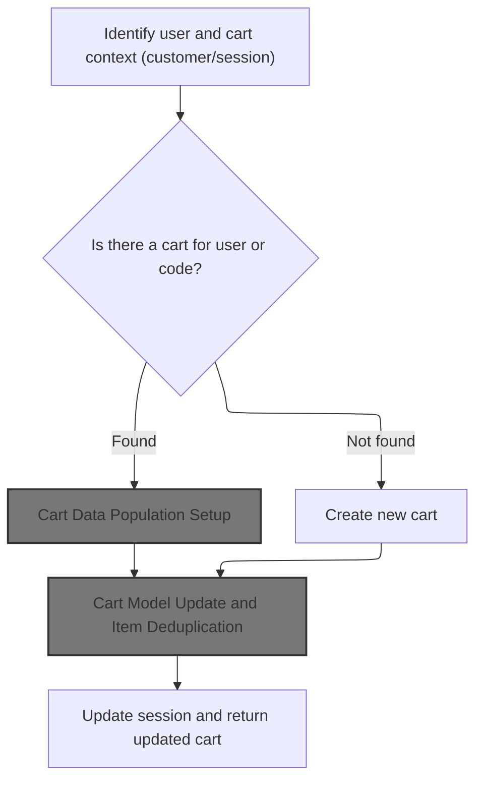
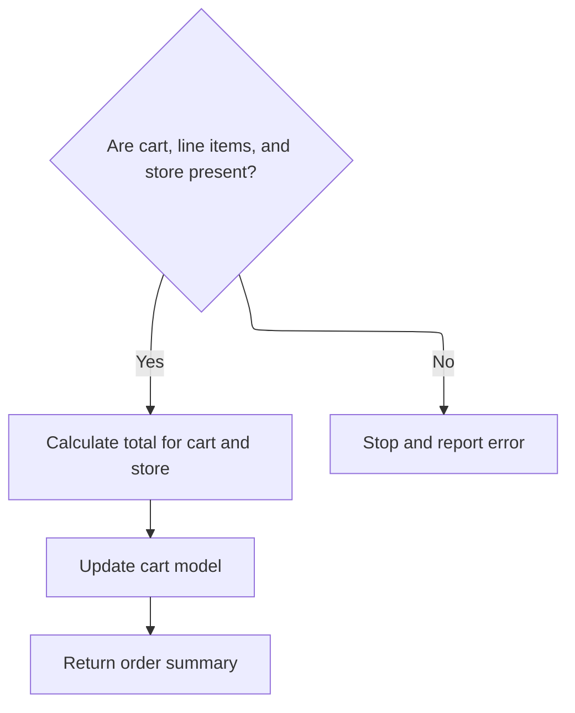
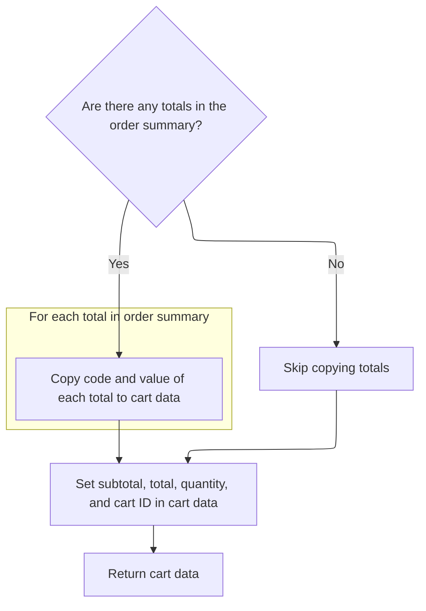
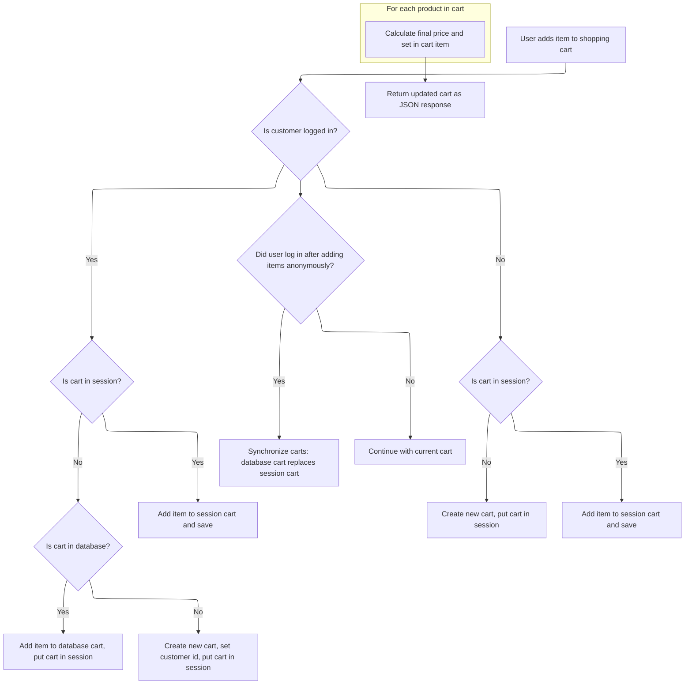

This document describes how an item is added to a user's shopping cart, supporting seamless shopping for both logged-in and anonymous users. The flow receives a shopping cart item and user/session context, ensures the cart is correctly associated, adds the item, recalculates totals, and returns the updated cart data for client use.

# Session Cart Lookup and Initialization



This section ensures that every user interaction with the shopping cart is associated with the correct cart instance, whether the user is logged in or anonymous. It guarantees that a valid cart is always available for the session, supporting seamless shopping experiences.

| Category        | Rule Name                         | Description                                                                                                                                                                                                   |
| --------------- | --------------------------------- | ------------------------------------------------------------------------------------------------------------------------------------------------------------------------------------------------------------- |
| Data validation | Cart Model Consistency            | The cart model returned to the user must always reflect the latest state, including any deduplication of items and updates from the current session.                                                          |
| Business logic  | Customer Cart Priority            | If a customer is logged in, the system must attempt to retrieve the shopping cart associated with that customer before considering other cart identification methods.                                         |
| Business logic  | Cart Code Fallback                | If no cart is found for the customer, the system must check for an existing cart using a cart code (e.g., from session or request).                                                                           |
| Business logic  | Cart Creation Guarantee           | If neither a customer cart nor a cart code cart is found, a new cart must be created and associated with the current session or customer.                                                                     |
| Business logic  | Multiple Cart Conflict Resolution | If multiple carts are detected for a single user (e.g., by customer and by code), the system must resolve the conflict according to business policy (e.g., merge carts, keep the latest, or prompt the user). |

<SwmSnippet path="/shopizer/sm-shop/src/main/java/com/salesmanager/web/shop/controller/shoppingCart/ShoppingCartController.java" line="131">

---

We check for a customer and their cart, fallback to cart code, or create a new cart if needed. Then we call the facade to get the actual cart data.

```java
	ShoppingCartData addShoppingCartItem(@RequestBody final ShoppingCartItem item, final HttpServletRequest request, final HttpServletResponse response, final Locale locale) throws Exception {


		ShoppingCartData shoppingCart=null;


		//Look in the HttpSession to see if a customer is logged in
	    MerchantStore store = getSessionAttribute(Constants.MERCHANT_STORE, request);
	    Language language = (Language)request.getAttribute(Constants.LANGUAGE);
	    Customer customer = getSessionAttribute(  Constants.CUSTOMER, request );


		if(customer != null) {
			com.salesmanager.core.business.shoppingcart.model.ShoppingCart customerCart = shoppingCartService.getByCustomer(customer);
			if(customerCart!=null) {
				shoppingCart = shoppingCartFacade.getShoppingCartData( customerCart);


				//TODO if shoppingCart != null ?? merge
				//TODO maybe they have the same code
				//TODO what if codes are different (-- merge carts, keep the latest one, delete the oldest, switch codes --)
			}
		}

		
```

---

</SwmSnippet>

## Cart Data Population Setup

This section is responsible for transforming the internal shopping cart model into a client-facing data object, ensuring that all calculations, pricing, and localization are correctly applied.

| Category       | Rule Name                 | Description                                                                                                                                                              |
| -------------- | ------------------------- | ------------------------------------------------------------------------------------------------------------------------------------------------------------------------ |
| Business logic | Accurate Cart Calculation | The shopping cart data must reflect the latest pricing and calculations based on the current cart contents, merchant store, and language context.                        |
| Business logic | Localization Compliance   | The cart data must be localized according to the language context provided, ensuring all labels, currency formats, and messages are appropriate for the user's language. |
| Business logic | Store Context Adherence   | The cart data must be specific to the merchant store context, reflecting store-specific pricing, rules, and configurations.                                              |

<SwmSnippet path="/shopizer/sm-shop/src/main/java/com/salesmanager/web/shop/controller/shoppingCart/facade/ShoppingCartFacadeImpl.java" line="311">

---

<SwmToken path="shopizer/sm-shop/src/main/java/com/salesmanager/web/shop/controller/shoppingCart/facade/ShoppingCartFacadeImpl.java" pos="311:5:5" line-data="    public ShoppingCartData getShoppingCartData( final ShoppingCart shoppingCartModel )">`getShoppingCartData`</SwmToken> sets up a <SwmToken path="shopizer/sm-shop/src/main/java/com/salesmanager/web/shop/controller/shoppingCart/facade/ShoppingCartFacadeImpl.java" pos="315:1:1" line-data="        ShoppingCartDataPopulator shoppingCartDataPopulator = new ShoppingCartDataPopulator();">`ShoppingCartDataPopulator`</SwmToken>, wires in calculation and pricing services, grabs language and store from a key-value context, and then delegates to the populator to build the cart data. Next, we call the populator to actually transform the cart model into a data object for the client.

```java
    public ShoppingCartData getShoppingCartData( final ShoppingCart shoppingCartModel )
        throws Exception
    {

        ShoppingCartDataPopulator shoppingCartDataPopulator = new ShoppingCartDataPopulator();
        shoppingCartDataPopulator.setShoppingCartCalculationService( shoppingCartCalculationService );
        shoppingCartDataPopulator.setPricingService( pricingService );
        Language language = (Language) getKeyValue( Constants.LANGUAGE );
        MerchantStore merchantStore = (MerchantStore) getKeyValue( Constants.MERCHANT_STORE );
        return shoppingCartDataPopulator.populate( shoppingCartModel, merchantStore, language );
    }
```

---

</SwmSnippet>

## Cart Item Mapping and Attribute Extraction

This section is responsible for mapping shopping cart items into a structured cart data format, extracting product attributes and images, and ensuring all pricing and totals are accurately calculated for display and order processing.

| Category        | Rule Name                    | Description                                                                                                                                                                                                                                                                                                                                                               |
| --------------- | ---------------------------- | ------------------------------------------------------------------------------------------------------------------------------------------------------------------------------------------------------------------------------------------------------------------------------------------------------------------------------------------------------------------------- |
| Data validation | Cart Item Data Completeness  | Each cart item must include the product SKU, name, price, quantity, and subtotal in the mapped cart data.                                                                                                                                                                                                                                                                 |
| Business logic  | Product Image Inclusion      | If a product image exists for a cart item, the image path must be included in the cart item data.                                                                                                                                                                                                                                                                         |
| Business logic  | Product Attribute Extraction | All product attributes (such as options and option values) must be extracted and included for each cart item, with their names and IDs.                                                                                                                                                                                                                                   |
| Business logic  | Cart Quantity Calculation    | The total quantity of items in the cart must be calculated and reflected in the cart data.                                                                                                                                                                                                                                                                                |
| Business logic  | Order Summary Preparation    | After mapping cart items, an <SwmToken path="shopizer/sm-shop/src/main/java/com/salesmanager/web/populator/shoppingCart/ShoppingCartDataPopulator.java" pos="133:1:1" line-data="            OrderSummary summary = new OrderSummary();">`OrderSummary`</SwmToken> must be prepared with all products and passed to the calculation service to update totals and pricing. |

<SwmSnippet path="/shopizer/sm-shop/src/main/java/com/salesmanager/web/populator/shoppingCart/ShoppingCartDataPopulator.java" line="73">

---

We extract product info, attributes, and images for each cart item and build up the cart data list.

```java
    public ShoppingCartData populate(final ShoppingCart shoppingCart,
                                     final ShoppingCartData cart, final MerchantStore store, final Language language) {

    	int cartQuantity = 0;
        cart.setCode(shoppingCart.getShoppingCartCode());
        Set<com.salesmanager.core.business.shoppingcart.model.ShoppingCartItem> items = shoppingCart.getLineItems();
        List<ShoppingCartItem> shoppingCartItemsList=Collections.emptyList();
        try{
            if(items!=null) {
                shoppingCartItemsList=new ArrayList<ShoppingCartItem>();
                for(com.salesmanager.core.business.shoppingcart.model.ShoppingCartItem item : items) {

                    ShoppingCartItem shoppingCartItem = new ShoppingCartItem();
                    shoppingCartItem.setCode(cart.getCode());
                    shoppingCartItem.setProductCode(item.getProduct().getSku());
                    shoppingCartItem.setProductVirtual(item.isProductVirtual());

                    shoppingCartItem.setProductId(item.getProductId());
                    shoppingCartItem.setId(item.getId());
                    shoppingCartItem.setName(item.getProduct().getProductDescription().getName());

                    shoppingCartItem.setPrice(pricingService.getDisplayAmount(item.getItemPrice(),store));
                    shoppingCartItem.setQuantity(item.getQuantity());
                    
                    
                    cartQuantity = cartQuantity + item.getQuantity();
                    
                    shoppingCartItem.setProductPrice(item.getItemPrice());
                    shoppingCartItem.setSubTotal(pricingService.getDisplayAmount(item.getSubTotal(), store));
                    ProductImage image = item.getProduct().getProductImage();
                    if(image!=null) {
                        String imagePath = ImageFilePathUtils.buildProductImageFilePath(store, item.getProduct().getSku(), image.getProductImage());
                        shoppingCartItem.setImage(imagePath);
                    }
                    Set<com.salesmanager.core.business.shoppingcart.model.ShoppingCartAttributeItem> attributes = item.getAttributes();
                    if(attributes!=null) {
                        List<ShoppingCartAttribute> cartAttributes = new ArrayList<ShoppingCartAttribute>();
                        for(com.salesmanager.core.business.shoppingcart.model.ShoppingCartAttributeItem attribute : attributes) {
                            ShoppingCartAttribute cartAttribute = new ShoppingCartAttribute();
                            cartAttribute.setId(attribute.getId());
                            cartAttribute.setAttributeId(attribute.getProductAttributeId());
                            cartAttribute.setOptionId(attribute.getProductAttribute().getProductOption().getId());
                            cartAttribute.setOptionValueId(attribute.getProductAttribute().getProductOptionValue().getId());
                            List<ProductOptionDescription> optionDescriptions = attribute.getProductAttribute().getProductOption().getDescriptionsSettoList();
                            List<ProductOptionValueDescription> optionValueDescriptions = attribute.getProductAttribute().getProductOptionValue().getDescriptionsSettoList();
                            if(!CollectionUtils.isEmpty(optionDescriptions) && !CollectionUtils.isEmpty(optionValueDescriptions)) {
                            	cartAttribute.setOptionName(optionDescriptions.get(0).getName());
                            	cartAttribute.setOptionValue(optionValueDescriptions.get(0).getName());
                            	cartAttributes.add(cartAttribute);
                            }
                        }
                        shoppingCartItem.setShoppingCartAttributes(cartAttributes);
                    }
                    shoppingCartItemsList.add(shoppingCartItem);
                }
```

---

</SwmSnippet>

<SwmSnippet path="/shopizer/sm-shop/src/main/java/com/salesmanager/web/populator/shoppingCart/ShoppingCartDataPopulator.java" line="129">

---

After mapping items, we set them on the cart and prep an <SwmToken path="shopizer/sm-shop/src/main/java/com/salesmanager/web/populator/shoppingCart/ShoppingCartDataPopulator.java" pos="133:1:1" line-data="            OrderSummary summary = new OrderSummary();">`OrderSummary`</SwmToken> with the products. Then we call the calculation service to get updated totals and pricing, which is needed for the next step in building the cart data.

```java
            if(CollectionUtils.isNotEmpty(shoppingCartItemsList)){
                cart.setShoppingCartItems(shoppingCartItemsList);
            }

            OrderSummary summary = new OrderSummary();
            List<com.salesmanager.core.business.shoppingcart.model.ShoppingCartItem> productsList = new ArrayList<com.salesmanager.core.business.shoppingcart.model.ShoppingCartItem>();
            productsList.addAll(shoppingCart.getLineItems());
            summary.setProducts(productsList);
            OrderTotalSummary orderSummary = shoppingCartCalculationService.calculate(shoppingCart,store, language );

```

---

</SwmSnippet>

### Cart Total Calculation and Delegation



This section is responsible for calculating the total value of a shopping cart for a given store and language, ensuring all required inputs are present, delegating the calculation to the order service, and updating the cart model before returning the summary.

| Category        | Rule Name                           | Description                                                                                                                                    |
| --------------- | ----------------------------------- | ---------------------------------------------------------------------------------------------------------------------------------------------- |
| Data validation | Cart presence validation            | If the shopping cart is missing, the calculation must not proceed and an error must be reported.                                               |
| Data validation | Line items presence validation      | If the shopping cart does not contain any line items, the calculation must not proceed and an error must be reported.                          |
| Data validation | Store presence validation           | If the merchant store is missing, the calculation must not proceed and an error must be reported.                                              |
| Business logic  | Delegated total calculation         | The calculation of cart totals must be delegated to the order service, which is responsible for applying all pricing, tax, and discount rules. |
| Business logic  | Cart model update after calculation | After receiving the calculated totals, the cart model must be updated to reflect the latest calculation before returning the summary.          |

<SwmSnippet path="/shopizer/sm-core/src/main/java/com/salesmanager/core/business/shoppingcart/service/ShoppingCartCalculationServiceImpl.java" line="95">

---

In <SwmToken path="shopizer/sm-core/src/main/java/com/salesmanager/core/business/shoppingcart/service/ShoppingCartCalculationServiceImpl.java" pos="95:5:5" line-data="    public OrderTotalSummary calculate( final ShoppingCart cartModel , final MerchantStore store, final Language language ) throws ServiceException">`calculate`</SwmToken>, we validate the cart and store, then delegate the actual total calculation to the order service. Next, we call the order service to reuse its logic for computing totals and prices.

```java
    public OrderTotalSummary calculate( final ShoppingCart cartModel , final MerchantStore store, final Language language ) throws ServiceException
    {

        Validate.notNull(cartModel,"cart cannot be null");
        Validate.notNull(cartModel.getLineItems(),"Cart should have line items.");
        Validate.notNull(store,"MerchantStore cannot be null");
        OrderTotalSummary orderTotalSummary=orderService.calculateShoppingCartTotal( cartModel, store, language );
```

---

</SwmSnippet>

<SwmSnippet path="/shopizer/sm-core/src/main/java/com/salesmanager/core/business/order/service/OrderServiceImpl.java" line="423">

---

<SwmToken path="shopizer/sm-core/src/main/java/com/salesmanager/core/business/order/service/OrderServiceImpl.java" pos="423:5:5" line-data="    public OrderTotalSummary calculateShoppingCartTotal(">`calculateShoppingCartTotal`</SwmToken> just validates inputs and calls <SwmToken path="shopizer/sm-core/src/main/java/com/salesmanager/core/business/order/service/OrderServiceImpl.java" pos="430:3:3" line-data="            return caculateShoppingCart(shoppingCart, null, store, language);">`caculateShoppingCart`</SwmToken> with a null second parameter, relying on that method to handle it safely and return the totals.

```java
    public OrderTotalSummary calculateShoppingCartTotal(
                                                        final ShoppingCart shoppingCart, final MerchantStore store, final Language language)
                                                                        throws ServiceException {
        Validate.notNull(shoppingCart,"Order summary cannot be null");
        Validate.notNull(store,"MerchantStore cannot be null");

        try {
            return caculateShoppingCart(shoppingCart, null, store, language);
        } catch (Exception e) {
            LOGGER.error( "Error while calculating shopping cart total" +e );
            throw new ServiceException(e);
        }
    }
```

---

</SwmSnippet>

<SwmSnippet path="/shopizer/sm-core/src/main/java/com/salesmanager/core/business/shoppingcart/service/ShoppingCartCalculationServiceImpl.java" line="102">

---

We just got the totals from the order service, so in `ShoppingCartCalculationServiceImpl.calculate`, we update the cart model and return the summary for further use.

```java
        updateCartModel(cartModel);
        return orderTotalSummary;


    }
```

---

</SwmSnippet>

### Totals Mapping and Final Cart Assembly



<SwmSnippet path="/shopizer/sm-shop/src/main/java/com/salesmanager/web/populator/shoppingCart/ShoppingCartDataPopulator.java" line="139">

---

We just got back from the calculation service, so in <SwmToken path="shopizer/sm-shop/src/main/java/com/salesmanager/web/shop/controller/shoppingCart/facade/ShoppingCartFacadeImpl.java" pos="155:5:5" line-data="        return shoppingCartDataPopulator.populate( cartModel, store, language );">`populate`</SwmToken>, we map the calculated totals into the cart data, prepping it for client consumption.

```java
            if(CollectionUtils.isNotEmpty(orderSummary.getTotals())) {
            	List<OrderTotal> totals = new ArrayList<OrderTotal>();
            	for(com.salesmanager.core.business.order.model.OrderTotal t : orderSummary.getTotals()) {
            		OrderTotal total = new OrderTotal();
            		total.setCode(t.getOrderTotalCode());
            		total.setValue(t.getValue());
            		totals.add(total);
            	}
```

---

</SwmSnippet>

<SwmSnippet path="/shopizer/sm-shop/src/main/java/com/salesmanager/web/populator/shoppingCart/ShoppingCartDataPopulator.java" line="147">

---

We return the fully populated <SwmToken path="shopizer/sm-shop/src/main/java/com/salesmanager/web/shop/controller/shoppingCart/ShoppingCartController.java" pos="131:1:1" line-data="	ShoppingCartData addShoppingCartItem(@RequestBody final ShoppingCartItem item, final HttpServletRequest request, final HttpServletResponse response, final Locale locale) throws Exception {">`ShoppingCartData`</SwmToken>, complete with items, totals, prices, and quantities, ready for the client.

```java
            	cart.setTotals(totals);
            }
            
            cart.setSubTotal(pricingService.getDisplayAmount(orderSummary.getSubTotal(), store));
            cart.setTotal(pricingService.getDisplayAmount(orderSummary.getTotal(), store));
            cart.setQuantity(cartQuantity);
            cart.setId(shoppingCart.getId());
        }
        catch(ServiceException ex){
            LOG.error( "Error while converting cart Model to cart Data.."+ex );
            throw new ConversionException( "Unable to create cart data", ex );
        }
        return cart;


    };
```

---

</SwmSnippet>

## Cart Creation, Item Addition, and Session Update

```mermaid
%%{init: {"flowchart": {"defaultRenderer": "elk"}} }%%
flowchart TD
    node1["Start: Check if shopping cart exists"] --> node2{"Is shopping cart null and item code provided?"}
    click node1 openCode "shopizer/sm-shop/src/main/java/com/salesmanager/web/shop/controller/shoppingCart/ShoppingCartController.java:157:158"
    node2 -->|"Yes"| node3["Retrieve shopping cart using item code and store"]
    click node2 openCode "shopizer/sm-shop/src/main/java/com/salesmanager/web/shop/controller/shoppingCart/ShoppingCartController.java:157:159"
    node2 -->|"No"| node4{"Is shopping cart still null?"}
    node3 --> node4
    click node3 openCode "shopizer/sm-shop/src/main/java/com/salesmanager/web/shop/controller/shoppingCart/ShoppingCartController.java:158:159"
    node4 -->|"Yes"| node5["Create new shopping cart and assign code"]
    click node4 openCode "shopizer/sm-shop/src/main/java/com/salesmanager/web/shop/controller/shoppingCart/ShoppingCartController.java:163:167"
    node4 -->|"No"| node6["Add item to shopping cart for customer and store"]
    node5 --> node6
    node6["Add item to shopping cart for customer and store"]
    click node6 openCode "shopizer/sm-shop/src/main/java/com/salesmanager/web/shop/controller/shoppingCart/ShoppingCartController.java:169:169"
classDef HeadingStyle fill:#777777,stroke:#333,stroke-width:2px;

%% Swimm:
%% %%{init: {"flowchart": {"defaultRenderer": "elk"}} }%%
%% flowchart TD
%%     node1["Start: Check if shopping cart exists"] --> node2{"Is shopping cart null and item code provided?"}
%%     click node1 openCode "<SwmPath>[shopizer/…/shoppingCart/ShoppingCartController.java](shopizer/sm-shop/src/main/java/com/salesmanager/web/shop/controller/shoppingCart/ShoppingCartController.java)</SwmPath>:157:158"
%%     node2 -->|"Yes"| node3["Retrieve shopping cart using item code and store"]
%%     click node2 openCode "<SwmPath>[shopizer/…/shoppingCart/ShoppingCartController.java](shopizer/sm-shop/src/main/java/com/salesmanager/web/shop/controller/shoppingCart/ShoppingCartController.java)</SwmPath>:157:159"
%%     node2 -->|"No"| node4{"Is shopping cart still null?"}
%%     node3 --> node4
%%     click node3 openCode "<SwmPath>[shopizer/…/shoppingCart/ShoppingCartController.java](shopizer/sm-shop/src/main/java/com/salesmanager/web/shop/controller/shoppingCart/ShoppingCartController.java)</SwmPath>:158:159"
%%     node4 -->|"Yes"| node5["Create new shopping cart and assign code"]
%%     click node4 openCode "<SwmPath>[shopizer/…/shoppingCart/ShoppingCartController.java](shopizer/sm-shop/src/main/java/com/salesmanager/web/shop/controller/shoppingCart/ShoppingCartController.java)</SwmPath>:163:167"
%%     node4 -->|"No"| node6["Add item to shopping cart for customer and store"]
%%     node5 --> node6
%%     node6["Add item to shopping cart for customer and store"]
%%     click node6 openCode "<SwmPath>[shopizer/…/shoppingCart/ShoppingCartController.java](shopizer/sm-shop/src/main/java/com/salesmanager/web/shop/controller/shoppingCart/ShoppingCartController.java)</SwmPath>:169:169"
%% classDef HeadingStyle fill:#777777,stroke:#333,stroke-width:2px;
```



<SwmSnippet path="/shopizer/sm-shop/src/main/java/com/salesmanager/web/shop/controller/shoppingCart/ShoppingCartController.java" line="157">

---

We just got cart data from the facade, so in <SwmToken path="shopizer/sm-shop/src/main/java/com/salesmanager/web/shop/controller/shoppingCart/ShoppingCartController.java" pos="131:3:3" line-data="	ShoppingCartData addShoppingCartItem(@RequestBody final ShoppingCartItem item, final HttpServletRequest request, final HttpServletResponse response, final Locale locale) throws Exception {">`addShoppingCartItem`</SwmToken>, we check if the cart exists, fallback to code lookup, or create a new cart. Then we call the facade again to add the item and update the session with the cart code.

```java
		if(shoppingCart==null && !StringUtils.isBlank(item.getCode())) {
			shoppingCart = shoppingCartFacade.getShoppingCartData(item.getCode(), store);
		}


		//if shoppingCart is null create a new one
		if(shoppingCart==null) {
			shoppingCart = new ShoppingCartData();
			String code = UUID.randomUUID().toString().replaceAll("-", "");
			shoppingCart.setCode(code);
		}

		shoppingCart=shoppingCartFacade.addItemsToShoppingCart( shoppingCart, item, store,language,customer );
```

---

</SwmSnippet>

## Cart Model Update and Item Deduplication

```mermaid
%%{init: {"flowchart": {"defaultRenderer": "elk"}} }%%
flowchart TD
    node1["Start: Add item to cart"]
    click node1 openCode "shopizer/sm-shop/src/main/java/com/salesmanager/web/shop/controller/shoppingCart/facade/ShoppingCartFacadeImpl.java:92:97"
    node1 --> node2{"Is cart found by code?"}
    click node2 openCode "shopizer/sm-shop/src/main/java/com/salesmanager/web/shop/controller/shoppingCart/facade/ShoppingCartFacadeImpl.java:98:106"
    node2 -->|"Yes"| node3["Retrieve cart"]
    click node3 openCode "shopizer/sm-shop/src/main/java/com/salesmanager/web/shop/controller/shoppingCart/facade/ShoppingCartFacadeImpl.java:101:102"
    node2 -->|"No"| node4["Create new cart"]
    click node4 openCode "shopizer/sm-shop/src/main/java/com/salesmanager/web/shop/controller/shoppingCart/facade/ShoppingCartFacadeImpl.java:104:115"
    node3 --> node5["Create cart item"]
    click node5 openCode "shopizer/sm-shop/src/main/java/com/salesmanager/web/shop/controller/shoppingCart/facade/ShoppingCartFacadeImpl.java:117:118"
    node4 --> node5
    
    subgraph loop1["For each item in cart"]
        node5 --> node6{"Same product id?"}
        click node6 openCode "shopizer/sm-shop/src/main/java/com/salesmanager/web/shop/controller/shoppingCart/facade/ShoppingCartFacadeImpl.java:124:125"
        node6 -->|"Yes"| node7{"Attributes empty?"}
        click node7 openCode "shopizer/sm-shop/src/main/java/com/salesmanager/web/shop/controller/shoppingCart/facade/ShoppingCartFacadeImpl.java:126:127"
        node7 -->|"Yes"| node8{"Is product virtual?"}
        click node8 openCode "shopizer/sm-shop/src/main/java/com/salesmanager/web/shop/controller/shoppingCart/facade/ShoppingCartFacadeImpl.java:128:129"
        node8 -->|"No"| node9["Increment quantity"]
        click node9 openCode "shopizer/sm-shop/src/main/java/com/salesmanager/web/shop/controller/shoppingCart/facade/ShoppingCartFacadeImpl.java:129:132"
        node8 -->|"Yes"| node10["Skip increment"]
        click node10 openCode "shopizer/sm-shop/src/main/java/com/salesmanager/web/shop/controller/shoppingCart/facade/ShoppingCartFacadeImpl.java:130:133"
        node7 -->|"No"| node10
        node6 -->|"No"| node10
    end
    node9 --> node11["Mark duplicate found"]
    click node11 openCode "shopizer/sm-shop/src/main/java/com/salesmanager/web/shop/controller/shoppingCart/facade/ShoppingCartFacadeImpl.java:131:132"
    node10 --> node12["Continue checking"]
    click node12 openCode "shopizer/sm-shop/src/main/java/com/salesmanager/web/shop/controller/shoppingCart/facade/ShoppingCartFacadeImpl.java:133:136"
    node11 --> node13{"Duplicate found?"}
    click node13 openCode "shopizer/sm-shop/src/main/java/com/salesmanager/web/shop/controller/shoppingCart/facade/ShoppingCartFacadeImpl.java:139:141"
    node12 --> node13
    node13 -->|"No"| node14["Add item as new"]
    click node14 openCode "shopizer/sm-shop/src/main/java/com/salesmanager/web/shop/controller/shoppingCart/facade/ShoppingCartFacadeImpl.java:140:141"
    node13 -->|"Yes"| node15["Skip add"]
    click node15 openCode "shopizer/sm-shop/src/main/java/com/salesmanager/web/shop/controller/shoppingCart/facade/ShoppingCartFacadeImpl.java:139:141"
    node14 --> node16["Update cart"]
    click node16 openCode "shopizer/sm-shop/src/main/java/com/salesmanager/web/shop/controller/shoppingCart/facade/ShoppingCartFacadeImpl.java:144:147"
    node15 --> node16
    node16 --> node17["Recalculate and prepare cart data"]
    click node17 openCode "shopizer/sm-shop/src/main/java/com/salesmanager/web/shop/controller/shoppingCart/facade/ShoppingCartFacadeImpl.java:149:155"

classDef HeadingStyle fill:#777777,stroke:#333,stroke-width:2px;

%% Swimm:
%% %%{init: {"flowchart": {"defaultRenderer": "elk"}} }%%
%% flowchart TD
%%     node1["Start: Add item to cart"]
%%     click node1 openCode "<SwmPath>[shopizer/…/facade/ShoppingCartFacadeImpl.java](shopizer/sm-shop/src/main/java/com/salesmanager/web/shop/controller/shoppingCart/facade/ShoppingCartFacadeImpl.java)</SwmPath>:92:97"
%%     node1 --> node2{"Is cart found by code?"}
%%     click node2 openCode "<SwmPath>[shopizer/…/facade/ShoppingCartFacadeImpl.java](shopizer/sm-shop/src/main/java/com/salesmanager/web/shop/controller/shoppingCart/facade/ShoppingCartFacadeImpl.java)</SwmPath>:98:106"
%%     node2 -->|"Yes"| node3["Retrieve cart"]
%%     click node3 openCode "<SwmPath>[shopizer/…/facade/ShoppingCartFacadeImpl.java](shopizer/sm-shop/src/main/java/com/salesmanager/web/shop/controller/shoppingCart/facade/ShoppingCartFacadeImpl.java)</SwmPath>:101:102"
%%     node2 -->|"No"| node4["Create new cart"]
%%     click node4 openCode "<SwmPath>[shopizer/…/facade/ShoppingCartFacadeImpl.java](shopizer/sm-shop/src/main/java/com/salesmanager/web/shop/controller/shoppingCart/facade/ShoppingCartFacadeImpl.java)</SwmPath>:104:115"
%%     node3 --> node5["Create cart item"]
%%     click node5 openCode "<SwmPath>[shopizer/…/facade/ShoppingCartFacadeImpl.java](shopizer/sm-shop/src/main/java/com/salesmanager/web/shop/controller/shoppingCart/facade/ShoppingCartFacadeImpl.java)</SwmPath>:117:118"
%%     node4 --> node5
%%     
%%     subgraph loop1["For each item in cart"]
%%         node5 --> node6{"Same product id?"}
%%         click node6 openCode "<SwmPath>[shopizer/…/facade/ShoppingCartFacadeImpl.java](shopizer/sm-shop/src/main/java/com/salesmanager/web/shop/controller/shoppingCart/facade/ShoppingCartFacadeImpl.java)</SwmPath>:124:125"
%%         node6 -->|"Yes"| node7{"Attributes empty?"}
%%         click node7 openCode "<SwmPath>[shopizer/…/facade/ShoppingCartFacadeImpl.java](shopizer/sm-shop/src/main/java/com/salesmanager/web/shop/controller/shoppingCart/facade/ShoppingCartFacadeImpl.java)</SwmPath>:126:127"
%%         node7 -->|"Yes"| node8{"Is product virtual?"}
%%         click node8 openCode "<SwmPath>[shopizer/…/facade/ShoppingCartFacadeImpl.java](shopizer/sm-shop/src/main/java/com/salesmanager/web/shop/controller/shoppingCart/facade/ShoppingCartFacadeImpl.java)</SwmPath>:128:129"
%%         node8 -->|"No"| node9["Increment quantity"]
%%         click node9 openCode "<SwmPath>[shopizer/…/facade/ShoppingCartFacadeImpl.java](shopizer/sm-shop/src/main/java/com/salesmanager/web/shop/controller/shoppingCart/facade/ShoppingCartFacadeImpl.java)</SwmPath>:129:132"
%%         node8 -->|"Yes"| node10["Skip increment"]
%%         click node10 openCode "<SwmPath>[shopizer/…/facade/ShoppingCartFacadeImpl.java](shopizer/sm-shop/src/main/java/com/salesmanager/web/shop/controller/shoppingCart/facade/ShoppingCartFacadeImpl.java)</SwmPath>:130:133"
%%         node7 -->|"No"| node10
%%         node6 -->|"No"| node10
%%     end
%%     node9 --> node11["Mark duplicate found"]
%%     click node11 openCode "<SwmPath>[shopizer/…/facade/ShoppingCartFacadeImpl.java](shopizer/sm-shop/src/main/java/com/salesmanager/web/shop/controller/shoppingCart/facade/ShoppingCartFacadeImpl.java)</SwmPath>:131:132"
%%     node10 --> node12["Continue checking"]
%%     click node12 openCode "<SwmPath>[shopizer/…/facade/ShoppingCartFacadeImpl.java](shopizer/sm-shop/src/main/java/com/salesmanager/web/shop/controller/shoppingCart/facade/ShoppingCartFacadeImpl.java)</SwmPath>:133:136"
%%     node11 --> node13{"Duplicate found?"}
%%     click node13 openCode "<SwmPath>[shopizer/…/facade/ShoppingCartFacadeImpl.java](shopizer/sm-shop/src/main/java/com/salesmanager/web/shop/controller/shoppingCart/facade/ShoppingCartFacadeImpl.java)</SwmPath>:139:141"
%%     node12 --> node13
%%     node13 -->|"No"| node14["Add item as new"]
%%     click node14 openCode "<SwmPath>[shopizer/…/facade/ShoppingCartFacadeImpl.java](shopizer/sm-shop/src/main/java/com/salesmanager/web/shop/controller/shoppingCart/facade/ShoppingCartFacadeImpl.java)</SwmPath>:140:141"
%%     node13 -->|"Yes"| node15["Skip add"]
%%     click node15 openCode "<SwmPath>[shopizer/…/facade/ShoppingCartFacadeImpl.java](shopizer/sm-shop/src/main/java/com/salesmanager/web/shop/controller/shoppingCart/facade/ShoppingCartFacadeImpl.java)</SwmPath>:139:141"
%%     node14 --> node16["Update cart"]
%%     click node16 openCode "<SwmPath>[shopizer/…/facade/ShoppingCartFacadeImpl.java](shopizer/sm-shop/src/main/java/com/salesmanager/web/shop/controller/shoppingCart/facade/ShoppingCartFacadeImpl.java)</SwmPath>:144:147"
%%     node15 --> node16
%%     node16 --> node17["Recalculate and prepare cart data"]
%%     click node17 openCode "<SwmPath>[shopizer/…/facade/ShoppingCartFacadeImpl.java](shopizer/sm-shop/src/main/java/com/salesmanager/web/shop/controller/shoppingCart/facade/ShoppingCartFacadeImpl.java)</SwmPath>:149:155"
%% 
%% classDef HeadingStyle fill:#777777,stroke:#333,stroke-width:2px;
```



This section manages the process of adding items to a shopping cart, ensuring that duplicate items are handled by incrementing quantity rather than creating new entries, and that the cart is always up-to-date and accurate for the customer.

| Category       | Rule Name                                 | Description                                                                                                                                                                                                                                   |
| -------------- | ----------------------------------------- | --------------------------------------------------------------------------------------------------------------------------------------------------------------------------------------------------------------------------------------------- |
| Business logic | Cart retrieval or creation                | If a shopping cart with the provided code exists, it must be retrieved and used for the operation; if not, a new cart must be created for the customer.                                                                                       |
| Business logic | Item deduplication and quantity increment | If an item with the same product ID and empty attributes already exists in the cart, and the product is not virtual, the quantity of the existing item must be incremented by the quantity of the new item instead of adding a new line item. |
| Business logic | Virtual product and attribute distinction | If the product is virtual or the attributes are not empty, a new line item must be added to the cart, even if the product ID matches an existing item.                                                                                        |
| Business logic | Cart recalculation after update           | After any change to the cart, the cart totals and pricing must be recalculated to reflect the latest state before returning data to the client.                                                                                               |
| Business logic | Add new item if no duplicate              | If no duplicate is found after checking all items, the new item must be added as a new line item in the cart.                                                                                                                                 |

<SwmSnippet path="/shopizer/sm-shop/src/main/java/com/salesmanager/web/shop/controller/shoppingCart/facade/ShoppingCartFacadeImpl.java" line="92">

---

In <SwmToken path="shopizer/sm-shop/src/main/java/com/salesmanager/web/shop/controller/shoppingCart/facade/ShoppingCartFacadeImpl.java" pos="92:5:5" line-data="    public ShoppingCartData addItemsToShoppingCart( final ShoppingCartData shoppingCartData,">`addItemsToShoppingCart`</SwmToken>, we fetch or create the cart model, map the incoming item, and check for duplicates. If a duplicate is found, we increment quantity; otherwise, we add the new item.

```java
    public ShoppingCartData addItemsToShoppingCart( final ShoppingCartData shoppingCartData,
                                                    final ShoppingCartItem item, final MerchantStore store, final Language language,final Customer customer )
        throws Exception
    {

        ShoppingCart cartModel = null;
        if ( !StringUtils.isBlank( item.getCode() ) )
        {
            // get it from the db
            cartModel = getShoppingCartModel( item.getCode(), store );
            if ( cartModel == null )
            {
                cartModel = createCartModel( shoppingCartData.getCode(), store,customer );
            }

        }

        if ( cartModel == null )
        {

            final String shoppingCartCode =
                StringUtils.isNotBlank( shoppingCartData.getCode() ) ? shoppingCartData.getCode() : null;
            cartModel = createCartModel( shoppingCartCode, store,customer );

        }
        com.salesmanager.core.business.shoppingcart.model.ShoppingCartItem shoppingCartItem =
            createCartItem( cartModel, item, store );
        
        boolean duplicateFound = false;
        if(CollectionUtils.isEmpty(item.getShoppingCartAttributes())) {//increment quantity
        	//get duplicate item from the cart
        	Set<com.salesmanager.core.business.shoppingcart.model.ShoppingCartItem> cartModelItems = cartModel.getLineItems();
        	for(com.salesmanager.core.business.shoppingcart.model.ShoppingCartItem cartItem : cartModelItems) {
        		if(cartItem.getProduct().getId().longValue()==shoppingCartItem.getProduct().getId().longValue()) {
        			if(CollectionUtils.isEmpty(cartItem.getAttributes())) {
        				if(!duplicateFound) {
        					if(!shoppingCartItem.isProductVirtual()) {
	        					cartItem.setQuantity(cartItem.getQuantity() + shoppingCartItem.getQuantity());
        					}
        					duplicateFound = true;
        					break;
        				}
        			}
        		}
        	}
```

---

</SwmSnippet>

<SwmSnippet path="/shopizer/sm-shop/src/main/java/com/salesmanager/web/shop/controller/shoppingCart/facade/ShoppingCartFacadeImpl.java" line="139">

---

After updating the cart model and saving, we reload the cart from the database and recalculate totals to make sure everything is up-to-date before returning data.

```java
        if(!duplicateFound) {
        	cartModel.getLineItems().add( shoppingCartItem );
        }
        
        /** Update cart in database with line items **/
        shoppingCartService.saveOrUpdate( cartModel );

        //refresh cart
        cartModel = shoppingCartService.getById(cartModel.getId(), store);

        shoppingCartCalculationService.calculate( cartModel, store, language );

```

---

</SwmSnippet>

<SwmSnippet path="/shopizer/sm-shop/src/main/java/com/salesmanager/web/shop/controller/shoppingCart/facade/ShoppingCartFacadeImpl.java" line="151">

---

After recalculating the cart, <SwmToken path="shopizer/sm-shop/src/main/java/com/salesmanager/web/shop/controller/shoppingCart/ShoppingCartController.java" pos="169:5:5" line-data="		shoppingCart=shoppingCartFacade.addItemsToShoppingCart( shoppingCart, item, store,language,customer );">`addItemsToShoppingCart`</SwmToken> sets up the populator again and repopulates the cart data to make sure the client gets the latest version.

```java
        ShoppingCartDataPopulator shoppingCartDataPopulator = new ShoppingCartDataPopulator();
        shoppingCartDataPopulator.setShoppingCartCalculationService( shoppingCartCalculationService );
        shoppingCartDataPopulator.setPricingService( pricingService );

        return shoppingCartDataPopulator.populate( cartModel, store, language );
    }
```

---

</SwmSnippet>

## Session Sync and Final Response



<SwmSnippet path="/shopizer/sm-shop/src/main/java/com/salesmanager/web/shop/controller/shoppingCart/ShoppingCartController.java" line="170">

---

After adding the item and updating the cart, <SwmToken path="shopizer/sm-shop/src/main/java/com/salesmanager/web/shop/controller/shoppingCart/ShoppingCartController.java" pos="131:3:3" line-data="	ShoppingCartData addShoppingCartItem(@RequestBody final ShoppingCartItem item, final HttpServletRequest request, final HttpServletResponse response, final Locale locale) throws Exception {">`addShoppingCartItem`</SwmToken> syncs the session with the new cart code and returns the cart data. The comments highlight open issues with cart merging when users log in after shopping anonymously.

```java
		request.getSession().setAttribute(Constants.SHOPPING_CART, shoppingCart.getCode());


		/******************************************************/
		//TODO validate all of this

		//if a customer exists in http session
			//if a cart does not exist in httpsession
				//get cart from database
					//if a cart exist in the database add the item to the cart and put cart in httpsession and save to the database
					//else a cart does not exist in the database, create a new one, set the customer id, set the cart in the httpsession
			//else a cart exist in the httpsession, add item to httpsession cart and save to the database
		//else no customer in httpsession
			//if a cart does not exist in httpsession
				//create a new one, set the cart in the httpsession
			//else a cart exist in the httpsession, add item to httpsession cart and save to the database


		/**
		 * my concern is with the following :
		 * 	what if you add item in the shopping cart as an anonymous user
		 *  later on you log in to process with checkout but the system retrieves a previous shopping cart saved in the database for that customer
		 *  in that case we need to synchronize both carts and the original one (the one with the customer id) supercedes the current cart in session
		 *  the system will have to deal with the original one and remove the latest
		 */


		//**more implementation details
		//calculate the price of each item by using ProductPriceUtils in sm-core
		//for each product in the shopping cart get the product
		//invoke productPriceUtils.getFinalProductPrice
		//from FinalPrice get final price which is the calculated price given attributes and discounts
		//set each item price in ShoppingCartItem.price

		//add new item shoppingCartService.create

		//create JSON representation of the shopping cart

		//return the JSON structure in AjaxResponse

		

		//AjaxResponse resp = new AjaxResponse();
		//resp.setStatus(AjaxResponse.RESPONSE_STATUS_SUCCESS);
		return shoppingCart;

	}
```

---

</SwmSnippet>

&nbsp;

*This is an auto-generated document by Swimm 🌊 and has not yet been verified by a human*

<SwmMeta version="3.0.0" repo-id="Z2l0aHViJTNBJTNBU2hvcGl6ZXIlM0ElM0F1bWFsaW5nYXN3YW1p" repo-name="Shopizer"><sup>Powered by [Swimm](https://app.swimm.io/)</sup></SwmMeta>
