This document describes how an item is added to a shopping cart. The system selects or creates the correct cart, adds the item with logic for duplicates and product attributes, updates and recalculates the cart, and synchronizes the session to return an accurate cart to the user.

# Handling Cart Retrieval and Initialization

This section ensures that when a customer adds an item to their cart, the system selects the correct cart context—either by retrieving an existing cart or initializing a new one—before proceeding to add the item.

| Category        | Rule Name                  | Description                                                                                                                                   |
| --------------- | -------------------------- | --------------------------------------------------------------------------------------------------------------------------------------------- |
| Data validation | Unique Cart Code           | A unique cart code must be generated for every new cart, ensuring no two carts share the same code.                                           |
| Business logic  | Use Existing Customer Cart | If a customer is logged in and already has a shopping cart, that cart must be used for adding the new item.                                   |
| Business logic  | Use Cart by Code           | If no cart is found for the logged-in customer, but the incoming item specifies a cart code, the cart associated with that code must be used. |
| Business logic  | Create New Cart            | If neither a customer cart nor a cart code is available, a new cart must be created and assigned a unique code.                               |

<SwmSnippet path="/shopizer/sm-shop/src/main/java/com/salesmanager/web/shop/controller/shoppingCart/ShoppingCartController.java" line="131">

---

In <SwmToken path="shopizer/sm-shop/src/main/java/com/salesmanager/web/shop/controller/shoppingCart/ShoppingCartController.java" pos="131:3:3" line-data="	ShoppingCartData addShoppingCartItem(@RequestBody final ShoppingCartItem item, final HttpServletRequest request, final HttpServletResponse response, final Locale locale) throws Exception {">`addShoppingCartItem`</SwmToken>, we start by figuring out which cart to use—either from the session (if the customer is logged in), from the incoming item's code, or by creating a new one if neither exists. This sets up the context for adding an item. We call the facade next because that's where the logic for actually adding the item to the cart (handling duplicates, merging, etc.) lives.

```java
	ShoppingCartData addShoppingCartItem(@RequestBody final ShoppingCartItem item, final HttpServletRequest request, final HttpServletResponse response, final Locale locale) throws Exception {


		ShoppingCartData shoppingCart=null;


		//Look in the HttpSession to see if a customer is logged in
	    MerchantStore store = getSessionAttribute(Constants.MERCHANT_STORE, request);
	    Language language = (Language)request.getAttribute(Constants.LANGUAGE);
	    Customer customer = getSessionAttribute(  Constants.CUSTOMER, request );


		if(customer != null) {
			com.salesmanager.core.business.shoppingcart.model.ShoppingCart customerCart = shoppingCartService.getByCustomer(customer);
			if(customerCart!=null) {
				shoppingCart = shoppingCartFacade.getShoppingCartData( customerCart);


				//TODO if shoppingCart != null ?? merge
				//TODO maybe they have the same code
				//TODO what if codes are different (-- merge carts, keep the latest one, delete the oldest, switch codes --)
			}
		}

		
		if(shoppingCart==null && !StringUtils.isBlank(item.getCode())) {
			shoppingCart = shoppingCartFacade.getShoppingCartData(item.getCode(), store);
		}


		//if shoppingCart is null create a new one
		if(shoppingCart==null) {
			shoppingCart = new ShoppingCartData();
			String code = UUID.randomUUID().toString().replaceAll("-", "");
			shoppingCart.setCode(code);
		}

		shoppingCart=shoppingCartFacade.addItemsToShoppingCart( shoppingCart, item, store,language,customer );
```

---

</SwmSnippet>

## Adding Items and Handling Duplicates

```mermaid
%%{init: {"flowchart": {"defaultRenderer": "elk"}} }%%
flowchart TD
    node2{"Is cart found in DB?"}
    click node2 openCode "shopizer/sm-shop/src/main/java/com/salesmanager/web/shop/controller/shoppingCart/facade/ShoppingCartFacadeImpl.java:98:107"
    node2 -->|"Yes"| node3["Use existing cart"]
    click node3 openCode "shopizer/sm-shop/src/main/java/com/salesmanager/web/shop/controller/shoppingCart/facade/ShoppingCartFacadeImpl.java:101:105"
    node2 -->|"No"| node4["Create new cart"]
    click node4 openCode "shopizer/sm-shop/src/main/java/com/salesmanager/web/shop/controller/shoppingCart/facade/ShoppingCartFacadeImpl.java:112:115"
    node3 --> node5["Create cart item"]
    click node5 openCode "shopizer/sm-shop/src/main/java/com/salesmanager/web/shop/controller/shoppingCart/facade/ShoppingCartFacadeImpl.java:117:118"
    node4 --> node5
    node5 --> node6{"Does item have attributes?"}
    click node6 openCode "shopizer/sm-shop/src/main/java/com/salesmanager/web/shop/controller/shoppingCart/facade/ShoppingCartFacadeImpl.java:121:121"
    node6 -->|"No"| loop1
    node6 -->|"Yes"| node9["Add new item to cart"]
    click node9 openCode "shopizer/sm-shop/src/main/java/com/salesmanager/web/shop/controller/shoppingCart/facade/ShoppingCartFacadeImpl.java:140:140"
    subgraph loop1["For each item in cart"]
        node7["Check for duplicate"]
        click node7 openCode "shopizer/sm-shop/src/main/java/com/salesmanager/web/shop/controller/shoppingCart/facade/ShoppingCartFacadeImpl.java:124:128"
        node7 --> node8{"Is duplicate found?"}
        click node8 openCode "shopizer/sm-shop/src/main/java/com/salesmanager/web/shop/controller/shoppingCart/facade/ShoppingCartFacadeImpl.java:139:139"
        node8 -->|"Yes"| node10["Increment quantity"]
        click node10 openCode "shopizer/sm-shop/src/main/java/com/salesmanager/web/shop/controller/shoppingCart/facade/ShoppingCartFacadeImpl.java:129:132"
        node8 -->|"No"| node9
    end
    node10 --> node11["Update cart in DB"]
    click node11 openCode "shopizer/sm-shop/src/main/java/com/salesmanager/web/shop/controller/shoppingCart/facade/ShoppingCartFacadeImpl.java:144:144"
    node9 --> node11
    node11 --> node12["Refresh cart"]
    click node12 openCode "shopizer/sm-shop/src/main/java/com/salesmanager/web/shop/controller/shoppingCart/facade/ShoppingCartFacadeImpl.java:147:147"
    node12 --> node13["Recalculate cart totals"]
    click node13 openCode "shopizer/sm-shop/src/main/java/com/salesmanager/web/shop/controller/shoppingCart/facade/ShoppingCartFacadeImpl.java:149:149"
    node13 --> node14["Return updated cart"]
    click node14 openCode "shopizer/sm-shop/src/main/java/com/salesmanager/web/shop/controller/shoppingCart/facade/ShoppingCartFacadeImpl.java:155:155"

classDef HeadingStyle fill:#777777,stroke:#333,stroke-width:2px;

%% Swimm:
%% %%{init: {"flowchart": {"defaultRenderer": "elk"}} }%%
%% flowchart TD
%%     node2{"Is cart found in DB?"}
%%     click node2 openCode "<SwmPath>[shopizer/…/facade/ShoppingCartFacadeImpl.java](shopizer/sm-shop/src/main/java/com/salesmanager/web/shop/controller/shoppingCart/facade/ShoppingCartFacadeImpl.java)</SwmPath>:98:107"
%%     node2 -->|"Yes"| node3["Use existing cart"]
%%     click node3 openCode "<SwmPath>[shopizer/…/facade/ShoppingCartFacadeImpl.java](shopizer/sm-shop/src/main/java/com/salesmanager/web/shop/controller/shoppingCart/facade/ShoppingCartFacadeImpl.java)</SwmPath>:101:105"
%%     node2 -->|"No"| node4["Create new cart"]
%%     click node4 openCode "<SwmPath>[shopizer/…/facade/ShoppingCartFacadeImpl.java](shopizer/sm-shop/src/main/java/com/salesmanager/web/shop/controller/shoppingCart/facade/ShoppingCartFacadeImpl.java)</SwmPath>:112:115"
%%     node3 --> node5["Create cart item"]
%%     click node5 openCode "<SwmPath>[shopizer/…/facade/ShoppingCartFacadeImpl.java](shopizer/sm-shop/src/main/java/com/salesmanager/web/shop/controller/shoppingCart/facade/ShoppingCartFacadeImpl.java)</SwmPath>:117:118"
%%     node4 --> node5
%%     node5 --> node6{"Does item have attributes?"}
%%     click node6 openCode "<SwmPath>[shopizer/…/facade/ShoppingCartFacadeImpl.java](shopizer/sm-shop/src/main/java/com/salesmanager/web/shop/controller/shoppingCart/facade/ShoppingCartFacadeImpl.java)</SwmPath>:121:121"
%%     node6 -->|"No"| loop1
%%     node6 -->|"Yes"| node9["Add new item to cart"]
%%     click node9 openCode "<SwmPath>[shopizer/…/facade/ShoppingCartFacadeImpl.java](shopizer/sm-shop/src/main/java/com/salesmanager/web/shop/controller/shoppingCart/facade/ShoppingCartFacadeImpl.java)</SwmPath>:140:140"
%%     subgraph loop1["For each item in cart"]
%%         node7["Check for duplicate"]
%%         click node7 openCode "<SwmPath>[shopizer/…/facade/ShoppingCartFacadeImpl.java](shopizer/sm-shop/src/main/java/com/salesmanager/web/shop/controller/shoppingCart/facade/ShoppingCartFacadeImpl.java)</SwmPath>:124:128"
%%         node7 --> node8{"Is duplicate found?"}
%%         click node8 openCode "<SwmPath>[shopizer/…/facade/ShoppingCartFacadeImpl.java](shopizer/sm-shop/src/main/java/com/salesmanager/web/shop/controller/shoppingCart/facade/ShoppingCartFacadeImpl.java)</SwmPath>:139:139"
%%         node8 -->|"Yes"| node10["Increment quantity"]
%%         click node10 openCode "<SwmPath>[shopizer/…/facade/ShoppingCartFacadeImpl.java](shopizer/sm-shop/src/main/java/com/salesmanager/web/shop/controller/shoppingCart/facade/ShoppingCartFacadeImpl.java)</SwmPath>:129:132"
%%         node8 -->|"No"| node9
%%     end
%%     node10 --> node11["Update cart in DB"]
%%     click node11 openCode "<SwmPath>[shopizer/…/facade/ShoppingCartFacadeImpl.java](shopizer/sm-shop/src/main/java/com/salesmanager/web/shop/controller/shoppingCart/facade/ShoppingCartFacadeImpl.java)</SwmPath>:144:144"
%%     node9 --> node11
%%     node11 --> node12["Refresh cart"]
%%     click node12 openCode "<SwmPath>[shopizer/…/facade/ShoppingCartFacadeImpl.java](shopizer/sm-shop/src/main/java/com/salesmanager/web/shop/controller/shoppingCart/facade/ShoppingCartFacadeImpl.java)</SwmPath>:147:147"
%%     node12 --> node13["Recalculate cart totals"]
%%     click node13 openCode "<SwmPath>[shopizer/…/facade/ShoppingCartFacadeImpl.java](shopizer/sm-shop/src/main/java/com/salesmanager/web/shop/controller/shoppingCart/facade/ShoppingCartFacadeImpl.java)</SwmPath>:149:149"
%%     node13 --> node14["Return updated cart"]
%%     click node14 openCode "<SwmPath>[shopizer/…/facade/ShoppingCartFacadeImpl.java](shopizer/sm-shop/src/main/java/com/salesmanager/web/shop/controller/shoppingCart/facade/ShoppingCartFacadeImpl.java)</SwmPath>:155:155"
%% 
%% classDef HeadingStyle fill:#777777,stroke:#333,stroke-width:2px;
```



This section governs how items are added to a shopping cart, ensuring that duplicate items are handled appropriately, the cart is kept up to date, and the returned cart data is accurate for the client.

| Category       | Rule Name                         | Description                                                                                                                                                                                              |
| -------------- | --------------------------------- | -------------------------------------------------------------------------------------------------------------------------------------------------------------------------------------------------------- |
| Business logic | Cart existence check              | If a shopping cart already exists for the provided code and store, use the existing cart; otherwise, create a new cart for the customer.                                                                 |
| Business logic | Duplicate item quantity increment | If the item being added has no attributes and an identical product already exists in the cart (and is not a virtual product), increment the quantity of the existing item instead of adding a new entry. |
| Business logic | Attribute-based item uniqueness   | If the item being added has attributes, always add it as a new cart item, regardless of other items in the cart.                                                                                         |
| Business logic | Cart update and recalculation     | After adding or updating an item, the cart must be saved, refreshed, and all totals and pricing must be recalculated before returning the updated cart data.                                             |
| Business logic | Virtual product uniqueness        | Virtual products are never merged as duplicates; each addition of a virtual product creates a new cart item, even if the product is the same.                                                            |

<SwmSnippet path="/shopizer/sm-shop/src/main/java/com/salesmanager/web/shop/controller/shoppingCart/facade/ShoppingCartFacadeImpl.java" line="92">

---

In <SwmToken path="shopizer/sm-shop/src/main/java/com/salesmanager/web/shop/controller/shoppingCart/facade/ShoppingCartFacadeImpl.java" pos="92:5:5" line-data="    public ShoppingCartData addItemsToShoppingCart( final ShoppingCartData shoppingCartData,">`addItemsToShoppingCart`</SwmToken>, we either fetch or create the cart model, build the cart item, and check for duplicates (only if the item has no attributes). If a duplicate is found and it's not a virtual product, we bump the quantity; otherwise, we add the item as new. This keeps the cart clean and avoids duplicate entries for simple products.

```java
    public ShoppingCartData addItemsToShoppingCart( final ShoppingCartData shoppingCartData,
                                                    final ShoppingCartItem item, final MerchantStore store, final Language language,final Customer customer )
        throws Exception
    {

        ShoppingCart cartModel = null;
        if ( !StringUtils.isBlank( item.getCode() ) )
        {
            // get it from the db
            cartModel = getShoppingCartModel( item.getCode(), store );
            if ( cartModel == null )
            {
                cartModel = createCartModel( shoppingCartData.getCode(), store,customer );
            }

        }

        if ( cartModel == null )
        {

            final String shoppingCartCode =
                StringUtils.isNotBlank( shoppingCartData.getCode() ) ? shoppingCartData.getCode() : null;
            cartModel = createCartModel( shoppingCartCode, store,customer );

        }
        com.salesmanager.core.business.shoppingcart.model.ShoppingCartItem shoppingCartItem =
            createCartItem( cartModel, item, store );
        
        boolean duplicateFound = false;
        if(CollectionUtils.isEmpty(item.getShoppingCartAttributes())) {//increment quantity
        	//get duplicate item from the cart
        	Set<com.salesmanager.core.business.shoppingcart.model.ShoppingCartItem> cartModelItems = cartModel.getLineItems();
        	for(com.salesmanager.core.business.shoppingcart.model.ShoppingCartItem cartItem : cartModelItems) {
        		if(cartItem.getProduct().getId().longValue()==shoppingCartItem.getProduct().getId().longValue()) {
        			if(CollectionUtils.isEmpty(cartItem.getAttributes())) {
        				if(!duplicateFound) {
        					if(!shoppingCartItem.isProductVirtual()) {
	        					cartItem.setQuantity(cartItem.getQuantity() + shoppingCartItem.getQuantity());
        					}
        					duplicateFound = true;
        					break;
        				}
        			}
        		}
        	}
```

---

</SwmSnippet>

<SwmSnippet path="/shopizer/sm-shop/src/main/java/com/salesmanager/web/shop/controller/shoppingCart/facade/ShoppingCartFacadeImpl.java" line="139">

---

After adding or updating the item, we save the cart, reload it, recalculate totals and pricing, and then repopulate the <SwmToken path="shopizer/sm-shop/src/main/java/com/salesmanager/web/shop/controller/shoppingCart/ShoppingCartController.java" pos="131:1:1" line-data="	ShoppingCartData addShoppingCartItem(@RequestBody final ShoppingCartItem item, final HttpServletRequest request, final HttpServletResponse response, final Locale locale) throws Exception {">`ShoppingCartData`</SwmToken> object. This makes sure the returned cart reflects all changes and is ready for the client.

```java
        if(!duplicateFound) {
        	cartModel.getLineItems().add( shoppingCartItem );
        }
        
        /** Update cart in database with line items **/
        shoppingCartService.saveOrUpdate( cartModel );

        //refresh cart
        cartModel = shoppingCartService.getById(cartModel.getId(), store);

        shoppingCartCalculationService.calculate( cartModel, store, language );

        ShoppingCartDataPopulator shoppingCartDataPopulator = new ShoppingCartDataPopulator();
        shoppingCartDataPopulator.setShoppingCartCalculationService( shoppingCartCalculationService );
        shoppingCartDataPopulator.setPricingService( pricingService );

        return shoppingCartDataPopulator.populate( cartModel, store, language );
    }
```

---

</SwmSnippet>

## Finalizing Cart and Session State

```mermaid
%%{init: {"flowchart": {"defaultRenderer": "elk"}} }%%
flowchart TD
    node1["Start: Add item to shopping cart"]
    click node1 openCode "shopizer/sm-shop/src/main/java/com/salesmanager/web/shop/controller/shoppingCart/ShoppingCartController.java:170:171"
    node1 --> node2{"Is customer in session?"}
    click node2 openCode "shopizer/sm-shop/src/main/java/com/salesmanager/web/shop/controller/shoppingCart/ShoppingCartController.java:176:182"
    node2 -->|"Yes"| node3{"Is cart in session?"}
    node2 -->|"No"| node6{"Is cart in session?"}
    click node3 openCode "shopizer/sm-shop/src/main/java/com/salesmanager/web/shop/controller/shoppingCart/ShoppingCartController.java:177:181"
    click node6 openCode "shopizer/sm-shop/src/main/java/com/salesmanager/web/shop/controller/shoppingCart/ShoppingCartController.java:183:185"
    node3 -->|"No"| node4{"Is cart in database?"}
    click node4 openCode "shopizer/sm-shop/src/main/java/com/salesmanager/web/shop/controller/shoppingCart/ShoppingCartController.java:178:180"
    node3 -->|"Yes"| node5["Add item to session cart"]
    click node5 openCode "shopizer/sm-shop/src/main/java/com/salesmanager/web/shop/controller/shoppingCart/ShoppingCartController.java:181:181"
    node4 -->|"Yes"| node7["Add item to database cart, set in session"]
    click node7 openCode "shopizer/sm-shop/src/main/java/com/salesmanager/web/shop/controller/shoppingCart/ShoppingCartController.java:179:179"
    node4 -->|"No"| node8["Create new cart, set customer, set in session"]
    click node8 openCode "shopizer/sm-shop/src/main/java/com/salesmanager/web/shop/controller/shoppingCart/ShoppingCartController.java:180:180"
    node6 -->|"No"| node9["Create new cart, set in session"]
    click node9 openCode "shopizer/sm-shop/src/main/java/com/salesmanager/web/shop/controller/shoppingCart/ShoppingCartController.java:184:184"
    node6 -->|"Yes"| node10["Add item to session cart"]
    click node10 openCode "shopizer/sm-shop/src/main/java/com/salesmanager/web/shop/controller/shoppingCart/ShoppingCartController.java:185:185"
    node5 --> node14{"Is cart synchronization needed?"}
    node7 --> node14
    node8 --> node14
    node9 --> node14
    node10 --> node14
    click node14 openCode "shopizer/sm-shop/src/main/java/com/salesmanager/web/shop/controller/shoppingCart/ShoppingCartController.java:190:193"
    node14 -->|"Yes"| node15["Synchronize carts: use original customer cart"]
    click node15 openCode "shopizer/sm-shop/src/main/java/com/salesmanager/web/shop/controller/shoppingCart/ShoppingCartController.java:192:193"
    node15 --> node11
    node14 -->|"No"| node11
    subgraph loop1["For each product in cart"]
      node11["Calculate final price for each item"]
      click node11 openCode "shopizer/sm-shop/src/main/java/com/salesmanager/web/shop/controller/shoppingCart/ShoppingCartController.java:198:202"
    end
    node11 --> node12["Add new item to cart"]
    click node12 openCode "shopizer/sm-shop/src/main/java/com/salesmanager/web/shop/controller/shoppingCart/ShoppingCartController.java:204:204"
    node12 --> node13["Return cart as JSON response"]
    click node13 openCode "shopizer/sm-shop/src/main/java/com/salesmanager/web/shop/controller/shoppingCart/ShoppingCartController.java:206:208"
classDef HeadingStyle fill:#777777,stroke:#333,stroke-width:2px;

%% Swimm:
%% %%{init: {"flowchart": {"defaultRenderer": "elk"}} }%%
%% flowchart TD
%%     node1["Start: Add item to shopping cart"]
%%     click node1 openCode "<SwmPath>[shopizer/…/shoppingCart/ShoppingCartController.java](shopizer/sm-shop/src/main/java/com/salesmanager/web/shop/controller/shoppingCart/ShoppingCartController.java)</SwmPath>:170:171"
%%     node1 --> node2{"Is customer in session?"}
%%     click node2 openCode "<SwmPath>[shopizer/…/shoppingCart/ShoppingCartController.java](shopizer/sm-shop/src/main/java/com/salesmanager/web/shop/controller/shoppingCart/ShoppingCartController.java)</SwmPath>:176:182"
%%     node2 -->|"Yes"| node3{"Is cart in session?"}
%%     node2 -->|"No"| node6{"Is cart in session?"}
%%     click node3 openCode "<SwmPath>[shopizer/…/shoppingCart/ShoppingCartController.java](shopizer/sm-shop/src/main/java/com/salesmanager/web/shop/controller/shoppingCart/ShoppingCartController.java)</SwmPath>:177:181"
%%     click node6 openCode "<SwmPath>[shopizer/…/shoppingCart/ShoppingCartController.java](shopizer/sm-shop/src/main/java/com/salesmanager/web/shop/controller/shoppingCart/ShoppingCartController.java)</SwmPath>:183:185"
%%     node3 -->|"No"| node4{"Is cart in database?"}
%%     click node4 openCode "<SwmPath>[shopizer/…/shoppingCart/ShoppingCartController.java](shopizer/sm-shop/src/main/java/com/salesmanager/web/shop/controller/shoppingCart/ShoppingCartController.java)</SwmPath>:178:180"
%%     node3 -->|"Yes"| node5["Add item to session cart"]
%%     click node5 openCode "<SwmPath>[shopizer/…/shoppingCart/ShoppingCartController.java](shopizer/sm-shop/src/main/java/com/salesmanager/web/shop/controller/shoppingCart/ShoppingCartController.java)</SwmPath>:181:181"
%%     node4 -->|"Yes"| node7["Add item to database cart, set in session"]
%%     click node7 openCode "<SwmPath>[shopizer/…/shoppingCart/ShoppingCartController.java](shopizer/sm-shop/src/main/java/com/salesmanager/web/shop/controller/shoppingCart/ShoppingCartController.java)</SwmPath>:179:179"
%%     node4 -->|"No"| node8["Create new cart, set customer, set in session"]
%%     click node8 openCode "<SwmPath>[shopizer/…/shoppingCart/ShoppingCartController.java](shopizer/sm-shop/src/main/java/com/salesmanager/web/shop/controller/shoppingCart/ShoppingCartController.java)</SwmPath>:180:180"
%%     node6 -->|"No"| node9["Create new cart, set in session"]
%%     click node9 openCode "<SwmPath>[shopizer/…/shoppingCart/ShoppingCartController.java](shopizer/sm-shop/src/main/java/com/salesmanager/web/shop/controller/shoppingCart/ShoppingCartController.java)</SwmPath>:184:184"
%%     node6 -->|"Yes"| node10["Add item to session cart"]
%%     click node10 openCode "<SwmPath>[shopizer/…/shoppingCart/ShoppingCartController.java](shopizer/sm-shop/src/main/java/com/salesmanager/web/shop/controller/shoppingCart/ShoppingCartController.java)</SwmPath>:185:185"
%%     node5 --> node14{"Is cart synchronization needed?"}
%%     node7 --> node14
%%     node8 --> node14
%%     node9 --> node14
%%     node10 --> node14
%%     click node14 openCode "<SwmPath>[shopizer/…/shoppingCart/ShoppingCartController.java](shopizer/sm-shop/src/main/java/com/salesmanager/web/shop/controller/shoppingCart/ShoppingCartController.java)</SwmPath>:190:193"
%%     node14 -->|"Yes"| node15["Synchronize carts: use original customer cart"]
%%     click node15 openCode "<SwmPath>[shopizer/…/shoppingCart/ShoppingCartController.java](shopizer/sm-shop/src/main/java/com/salesmanager/web/shop/controller/shoppingCart/ShoppingCartController.java)</SwmPath>:192:193"
%%     node15 --> node11
%%     node14 -->|"No"| node11
%%     subgraph loop1["For each product in cart"]
%%       node11["Calculate final price for each item"]
%%       click node11 openCode "<SwmPath>[shopizer/…/shoppingCart/ShoppingCartController.java](shopizer/sm-shop/src/main/java/com/salesmanager/web/shop/controller/shoppingCart/ShoppingCartController.java)</SwmPath>:198:202"
%%     end
%%     node11 --> node12["Add new item to cart"]
%%     click node12 openCode "<SwmPath>[shopizer/…/shoppingCart/ShoppingCartController.java](shopizer/sm-shop/src/main/java/com/salesmanager/web/shop/controller/shoppingCart/ShoppingCartController.java)</SwmPath>:204:204"
%%     node12 --> node13["Return cart as JSON response"]
%%     click node13 openCode "<SwmPath>[shopizer/…/shoppingCart/ShoppingCartController.java](shopizer/sm-shop/src/main/java/com/salesmanager/web/shop/controller/shoppingCart/ShoppingCartController.java)</SwmPath>:206:208"
%% classDef HeadingStyle fill:#777777,stroke:#333,stroke-width:2px;
```



<SwmSnippet path="/shopizer/sm-shop/src/main/java/com/salesmanager/web/shop/controller/shoppingCart/ShoppingCartController.java" line="170">

---

Back in <SwmToken path="shopizer/sm-shop/src/main/java/com/salesmanager/web/shop/controller/shoppingCart/ShoppingCartController.java" pos="131:3:3" line-data="	ShoppingCartData addShoppingCartItem(@RequestBody final ShoppingCartItem item, final HttpServletRequest request, final HttpServletResponse response, final Locale locale) throws Exception {">`addShoppingCartItem`</SwmToken>, we take the updated cart from the facade, set its code in the session, and prep for returning the cart data. The comments outline edge cases for cart/session sync, especially when users log in or switch between anonymous and authenticated states.

```java
		request.getSession().setAttribute(Constants.SHOPPING_CART, shoppingCart.getCode());


		/******************************************************/
		//TODO validate all of this

		//if a customer exists in http session
			//if a cart does not exist in httpsession
				//get cart from database
					//if a cart exist in the database add the item to the cart and put cart in httpsession and save to the database
					//else a cart does not exist in the database, create a new one, set the customer id, set the cart in the httpsession
			//else a cart exist in the httpsession, add item to httpsession cart and save to the database
		//else no customer in httpsession
			//if a cart does not exist in httpsession
				//create a new one, set the cart in the httpsession
			//else a cart exist in the httpsession, add item to httpsession cart and save to the database


		/**
		 * my concern is with the following :
		 * 	what if you add item in the shopping cart as an anonymous user
		 *  later on you log in to process with checkout but the system retrieves a previous shopping cart saved in the database for that customer
		 *  in that case we need to synchronize both carts and the original one (the one with the customer id) supercedes the current cart in session
		 *  the system will have to deal with the original one and remove the latest
		 */


		//**more implementation details
		//calculate the price of each item by using ProductPriceUtils in sm-core
		//for each product in the shopping cart get the product
		//invoke productPriceUtils.getFinalProductPrice
		//from FinalPrice get final price which is the calculated price given attributes and discounts
		//set each item price in ShoppingCartItem.price

		//add new item shoppingCartService.create

		//create JSON representation of the shopping cart

		//return the JSON structure in AjaxResponse

		

		//AjaxResponse resp = new AjaxResponse();
		//resp.setStatus(AjaxResponse.RESPONSE_STATUS_SUCCESS);
		return shoppingCart;

	}
```

---

</SwmSnippet>

&nbsp;

*This is an auto-generated document by Swimm 🌊 and has not yet been verified by a human*

<SwmMeta version="3.0.0" repo-id="Z2l0aHViJTNBJTNBU2hvcGl6ZXIlM0ElM0F1bWFsaW5nYXN3YW1p" repo-name="Shopizer"><sup>Powered by [Swimm](https://app.swimm.io/)</sup></SwmMeta>
