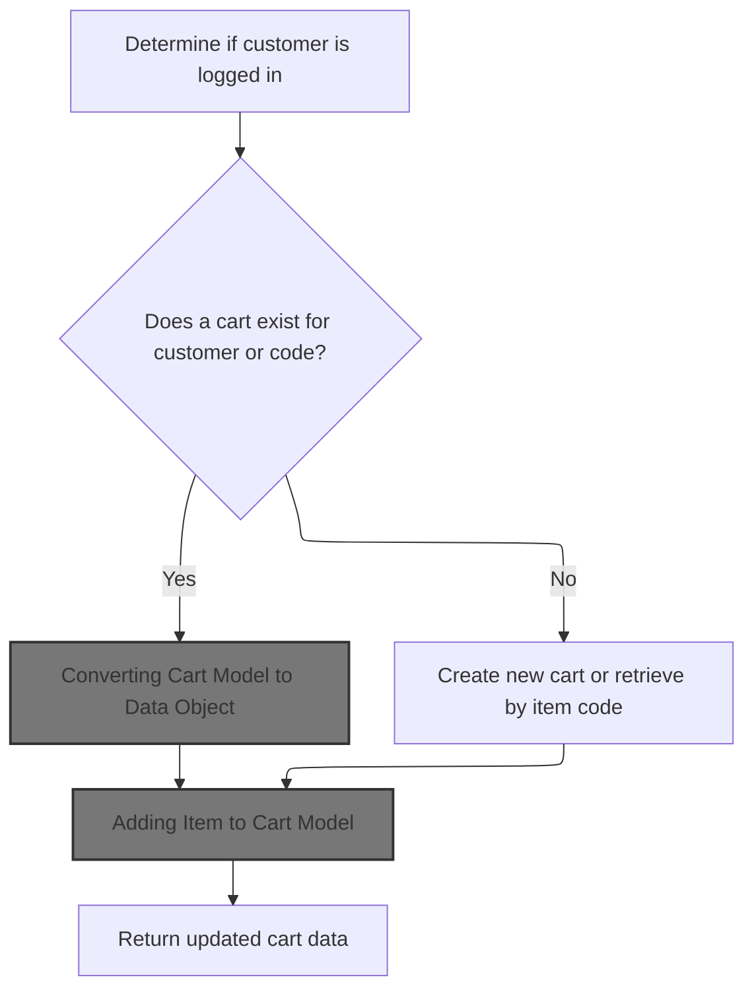
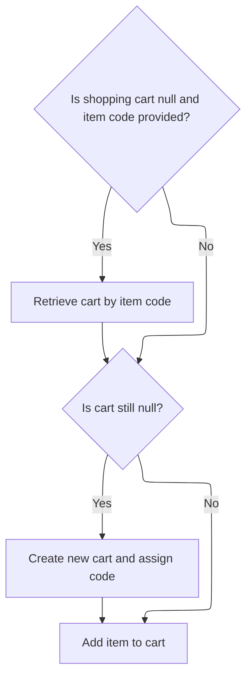

This document describes how users can add items to their shopping cart, whether logged in or anonymous. The flow retrieves or creates the appropriate cart, adds the item (updating quantity for duplicates), recalculates totals, and synchronizes carts when users log in. The result is an updated cart ready for display or checkout.

# Handling Cart Retrieval and Session Context



<SwmSnippet path="/shopizer/sm-shop/src/main/java/com/salesmanager/web/shop/controller/shoppingCart/ShoppingCartController.java" line="131">

---

In <SwmToken path="shopizer/sm-shop/src/main/java/com/salesmanager/web/shop/controller/shoppingCart/ShoppingCartController.java" pos="131:3:3" line-data="	ShoppingCartData addShoppingCartItem(@RequestBody final ShoppingCartItem item, final HttpServletRequest request, final HttpServletResponse response, final Locale locale) throws Exception {">`addShoppingCartItem`</SwmToken>, we start by pulling store, language, and customer info from the session/request. If a customer is logged in, we try to get their cart from the database and convert it to a data object. This is all about making sure we're working with the right cart, whether the user is logged in or not. Next, we need to call the facade to get a unified <SwmToken path="shopizer/sm-shop/src/main/java/com/salesmanager/web/shop/controller/shoppingCart/ShoppingCartController.java" pos="131:1:1" line-data="	ShoppingCartData addShoppingCartItem(@RequestBody final ShoppingCartItem item, final HttpServletRequest request, final HttpServletResponse response, final Locale locale) throws Exception {">`ShoppingCartData`</SwmToken> object, since the controller doesn't handle the conversion or merging logic itself.

```java
	ShoppingCartData addShoppingCartItem(@RequestBody final ShoppingCartItem item, final HttpServletRequest request, final HttpServletResponse response, final Locale locale) throws Exception {


		ShoppingCartData shoppingCart=null;


		//Look in the HttpSession to see if a customer is logged in
	    MerchantStore store = getSessionAttribute(Constants.MERCHANT_STORE, request);
	    Language language = (Language)request.getAttribute(Constants.LANGUAGE);
	    Customer customer = getSessionAttribute(  Constants.CUSTOMER, request );


		if(customer != null) {
			com.salesmanager.core.business.shoppingcart.model.ShoppingCart customerCart = shoppingCartService.getByCustomer(customer);
			if(customerCart!=null) {
				shoppingCart = shoppingCartFacade.getShoppingCartData( customerCart);


				//TODO if shoppingCart != null ?? merge
				//TODO maybe they have the same code
				//TODO what if codes are different (-- merge carts, keep the latest one, delete the oldest, switch codes --)
			}
		}

		
```

---

</SwmSnippet>

## Converting Cart Model to Data Object

<SwmSnippet path="/shopizer/sm-shop/src/main/java/com/salesmanager/web/shop/controller/shoppingCart/facade/ShoppingCartFacadeImpl.java" line="311">

---

<SwmToken path="shopizer/sm-shop/src/main/java/com/salesmanager/web/shop/controller/shoppingCart/facade/ShoppingCartFacadeImpl.java" pos="311:5:5" line-data="    public ShoppingCartData getShoppingCartData( final ShoppingCart shoppingCartModel )">`getShoppingCartData`</SwmToken> just sets up the populator with calculation and pricing services, grabs store and language from context, and delegates the heavy lifting to the populator. We need to call the populator next because that's where the actual mapping from the cart model to the data object happens.

```java
    public ShoppingCartData getShoppingCartData( final ShoppingCart shoppingCartModel )
        throws Exception
    {

        ShoppingCartDataPopulator shoppingCartDataPopulator = new ShoppingCartDataPopulator();
        shoppingCartDataPopulator.setShoppingCartCalculationService( shoppingCartCalculationService );
        shoppingCartDataPopulator.setPricingService( pricingService );
        Language language = (Language) getKeyValue( Constants.LANGUAGE );
        MerchantStore merchantStore = (MerchantStore) getKeyValue( Constants.MERCHANT_STORE );
        return shoppingCartDataPopulator.populate( shoppingCartModel, merchantStore, language );
    }
```

---

</SwmSnippet>

## Mapping Cart Items and Attributes

<SwmSnippet path="/shopizer/sm-shop/src/main/java/com/salesmanager/web/populator/shoppingCart/ShoppingCartDataPopulator.java" line="73">

---

In <SwmToken path="shopizer/sm-shop/src/main/java/com/salesmanager/web/populator/shoppingCart/ShoppingCartDataPopulator.java" pos="73:5:5" line-data="    public ShoppingCartData populate(final ShoppingCart shoppingCart,">`populate`</SwmToken>, we loop through the cart's line items, build up <SwmToken path="shopizer/sm-shop/src/main/java/com/salesmanager/web/populator/shoppingCart/ShoppingCartDataPopulator.java" pos="78:15:15" line-data="        Set&lt;com.salesmanager.core.business.shoppingcart.model.ShoppingCartItem&gt; items = shoppingCart.getLineItems();">`ShoppingCartItem`</SwmToken> data objects with product and attribute info, and collect them into the cart data. This sets up all the details needed for the UI or API. Next, we need to calculate totals, so we call the calculation service.

```java
    public ShoppingCartData populate(final ShoppingCart shoppingCart,
                                     final ShoppingCartData cart, final MerchantStore store, final Language language) {

    	int cartQuantity = 0;
        cart.setCode(shoppingCart.getShoppingCartCode());
        Set<com.salesmanager.core.business.shoppingcart.model.ShoppingCartItem> items = shoppingCart.getLineItems();
        List<ShoppingCartItem> shoppingCartItemsList=Collections.emptyList();
        try{
            if(items!=null) {
                shoppingCartItemsList=new ArrayList<ShoppingCartItem>();
                for(com.salesmanager.core.business.shoppingcart.model.ShoppingCartItem item : items) {

                    ShoppingCartItem shoppingCartItem = new ShoppingCartItem();
                    shoppingCartItem.setCode(cart.getCode());
                    shoppingCartItem.setProductCode(item.getProduct().getSku());
                    shoppingCartItem.setProductVirtual(item.isProductVirtual());

                    shoppingCartItem.setProductId(item.getProductId());
                    shoppingCartItem.setId(item.getId());
                    shoppingCartItem.setName(item.getProduct().getProductDescription().getName());

                    shoppingCartItem.setPrice(pricingService.getDisplayAmount(item.getItemPrice(),store));
                    shoppingCartItem.setQuantity(item.getQuantity());
                    
                    
                    cartQuantity = cartQuantity + item.getQuantity();
                    
                    shoppingCartItem.setProductPrice(item.getItemPrice());
                    shoppingCartItem.setSubTotal(pricingService.getDisplayAmount(item.getSubTotal(), store));
                    ProductImage image = item.getProduct().getProductImage();
                    if(image!=null) {
                        String imagePath = ImageFilePathUtils.buildProductImageFilePath(store, item.getProduct().getSku(), image.getProductImage());
                        shoppingCartItem.setImage(imagePath);
                    }
                    Set<com.salesmanager.core.business.shoppingcart.model.ShoppingCartAttributeItem> attributes = item.getAttributes();
                    if(attributes!=null) {
                        List<ShoppingCartAttribute> cartAttributes = new ArrayList<ShoppingCartAttribute>();
                        for(com.salesmanager.core.business.shoppingcart.model.ShoppingCartAttributeItem attribute : attributes) {
                            ShoppingCartAttribute cartAttribute = new ShoppingCartAttribute();
                            cartAttribute.setId(attribute.getId());
                            cartAttribute.setAttributeId(attribute.getProductAttributeId());
                            cartAttribute.setOptionId(attribute.getProductAttribute().getProductOption().getId());
                            cartAttribute.setOptionValueId(attribute.getProductAttribute().getProductOptionValue().getId());
                            List<ProductOptionDescription> optionDescriptions = attribute.getProductAttribute().getProductOption().getDescriptionsSettoList();
                            List<ProductOptionValueDescription> optionValueDescriptions = attribute.getProductAttribute().getProductOptionValue().getDescriptionsSettoList();
                            if(!CollectionUtils.isEmpty(optionDescriptions) && !CollectionUtils.isEmpty(optionValueDescriptions)) {
                            	cartAttribute.setOptionName(optionDescriptions.get(0).getName());
                            	cartAttribute.setOptionValue(optionValueDescriptions.get(0).getName());
                            	cartAttributes.add(cartAttribute);
                            }
                        }
                        shoppingCartItem.setShoppingCartAttributes(cartAttributes);
                    }
                    shoppingCartItemsList.add(shoppingCartItem);
                }
```

---

</SwmSnippet>

<SwmSnippet path="/shopizer/sm-shop/src/main/java/com/salesmanager/web/populator/shoppingCart/ShoppingCartDataPopulator.java" line="129">

---

We prep the summary and call the calculation service to get current totals.

```java
            if(CollectionUtils.isNotEmpty(shoppingCartItemsList)){
                cart.setShoppingCartItems(shoppingCartItemsList);
            }

            OrderSummary summary = new OrderSummary();
            List<com.salesmanager.core.business.shoppingcart.model.ShoppingCartItem> productsList = new ArrayList<com.salesmanager.core.business.shoppingcart.model.ShoppingCartItem>();
            productsList.addAll(shoppingCart.getLineItems());
            summary.setProducts(productsList);
            OrderTotalSummary orderSummary = shoppingCartCalculationService.calculate(shoppingCart,store, language );

```

---

</SwmSnippet>

### Calculating Cart Totals

See <SwmLink doc-title="Calculating shopping cart total">[Calculating shopping cart total](.swm%5Ccalculating-shopping-cart-total.8dm468jb.sw.md)</SwmLink>

### Mapping Calculated Totals to Cart Data

```mermaid
%%{init: {"flowchart": {"defaultRenderer": "elk"}} }%%
flowchart TD
    node1{"Are there totals in the order summary?"}
    click node1 openCode "shopizer/sm-shop/src/main/java/com/salesmanager/web/populator/shoppingCart/ShoppingCartDataPopulator.java:139:148"
    node1 -->|"Yes"| loop1
    node1 -->|"No"| node4["Set cart subtotal"]
    
    subgraph loop1["For each total in order summary"]
      node2["Copy total code and value to cart totals"]
      click node2 openCode "shopizer/sm-shop/src/main/java/com/salesmanager/web/populator/shoppingCart/ShoppingCartDataPopulator.java:141:146"
    end
    loop1 --> node4["Set cart subtotal"]
    click node4 openCode "shopizer/sm-shop/src/main/java/com/salesmanager/web/populator/shoppingCart/ShoppingCartDataPopulator.java:150:150"
    node4 --> node5["Set cart total"]
    click node5 openCode "shopizer/sm-shop/src/main/java/com/salesmanager/web/populator/shoppingCart/ShoppingCartDataPopulator.java:151:151"
    node5 --> node6["Set cart quantity"]
    click node6 openCode "shopizer/sm-shop/src/main/java/com/salesmanager/web/populator/shoppingCart/ShoppingCartDataPopulator.java:152:152"
    node6 --> node7["Set cart ID"]
    click node7 openCode "shopizer/sm-shop/src/main/java/com/salesmanager/web/populator/shoppingCart/ShoppingCartDataPopulator.java:153:153"
    node7 --> node8["Return populated cart"]
    click node8 openCode "shopizer/sm-shop/src/main/java/com/salesmanager/web/populator/shoppingCart/ShoppingCartDataPopulator.java:159:159"

classDef HeadingStyle fill:#777777,stroke:#333,stroke-width:2px;

%% Swimm:
%% %%{init: {"flowchart": {"defaultRenderer": "elk"}} }%%
%% flowchart TD
%%     node1{"Are there totals in the order summary?"}
%%     click node1 openCode "<SwmPath>[shopizer/…/shoppingCart/ShoppingCartDataPopulator.java](shopizer/sm-shop/src/main/java/com/salesmanager/web/populator/shoppingCart/ShoppingCartDataPopulator.java)</SwmPath>:139:148"
%%     node1 -->|"Yes"| loop1
%%     node1 -->|"No"| node4["Set cart subtotal"]
%%     
%%     subgraph loop1["For each total in order summary"]
%%       node2["Copy total code and value to cart totals"]
%%       click node2 openCode "<SwmPath>[shopizer/…/shoppingCart/ShoppingCartDataPopulator.java](shopizer/sm-shop/src/main/java/com/salesmanager/web/populator/shoppingCart/ShoppingCartDataPopulator.java)</SwmPath>:141:146"
%%     end
%%     loop1 --> node4["Set cart subtotal"]
%%     click node4 openCode "<SwmPath>[shopizer/…/shoppingCart/ShoppingCartDataPopulator.java](shopizer/sm-shop/src/main/java/com/salesmanager/web/populator/shoppingCart/ShoppingCartDataPopulator.java)</SwmPath>:150:150"
%%     node4 --> node5["Set cart total"]
%%     click node5 openCode "<SwmPath>[shopizer/…/shoppingCart/ShoppingCartDataPopulator.java](shopizer/sm-shop/src/main/java/com/salesmanager/web/populator/shoppingCart/ShoppingCartDataPopulator.java)</SwmPath>:151:151"
%%     node5 --> node6["Set cart quantity"]
%%     click node6 openCode "<SwmPath>[shopizer/…/shoppingCart/ShoppingCartDataPopulator.java](shopizer/sm-shop/src/main/java/com/salesmanager/web/populator/shoppingCart/ShoppingCartDataPopulator.java)</SwmPath>:152:152"
%%     node6 --> node7["Set cart ID"]
%%     click node7 openCode "<SwmPath>[shopizer/…/shoppingCart/ShoppingCartDataPopulator.java](shopizer/sm-shop/src/main/java/com/salesmanager/web/populator/shoppingCart/ShoppingCartDataPopulator.java)</SwmPath>:153:153"
%%     node7 --> node8["Return populated cart"]
%%     click node8 openCode "<SwmPath>[shopizer/…/shoppingCart/ShoppingCartDataPopulator.java](shopizer/sm-shop/src/main/java/com/salesmanager/web/populator/shoppingCart/ShoppingCartDataPopulator.java)</SwmPath>:159:159"
%% 
%% classDef HeadingStyle fill:#777777,stroke:#333,stroke-width:2px;
```



<SwmSnippet path="/shopizer/sm-shop/src/main/java/com/salesmanager/web/populator/shoppingCart/ShoppingCartDataPopulator.java" line="139">

---

We just got totals back from the calculation service. Now, in <SwmToken path="shopizer/sm-shop/src/main/java/com/salesmanager/web/shop/controller/shoppingCart/facade/ShoppingCartFacadeImpl.java" pos="155:5:5" line-data="        return shoppingCartDataPopulator.populate( cartModel, store, language );">`populate`</SwmToken>, we map those totals into the cart data object so the UI can show them.

```java
            if(CollectionUtils.isNotEmpty(orderSummary.getTotals())) {
            	List<OrderTotal> totals = new ArrayList<OrderTotal>();
            	for(com.salesmanager.core.business.order.model.OrderTotal t : orderSummary.getTotals()) {
            		OrderTotal total = new OrderTotal();
            		total.setCode(t.getOrderTotalCode());
            		total.setValue(t.getValue());
            		totals.add(total);
            	}
```

---

</SwmSnippet>

<SwmSnippet path="/shopizer/sm-shop/src/main/java/com/salesmanager/web/populator/shoppingCart/ShoppingCartDataPopulator.java" line="147">

---

After mapping totals, we set subtotal, total, quantity, and cart ID in the <SwmToken path="shopizer/sm-shop/src/main/java/com/salesmanager/web/shop/controller/shoppingCart/ShoppingCartController.java" pos="131:1:1" line-data="	ShoppingCartData addShoppingCartItem(@RequestBody final ShoppingCartItem item, final HttpServletRequest request, final HttpServletResponse response, final Locale locale) throws Exception {">`ShoppingCartData`</SwmToken> and return it. This object is ready for the UI or API to consume.

```java
            	cart.setTotals(totals);
            }
            
            cart.setSubTotal(pricingService.getDisplayAmount(orderSummary.getSubTotal(), store));
            cart.setTotal(pricingService.getDisplayAmount(orderSummary.getTotal(), store));
            cart.setQuantity(cartQuantity);
            cart.setId(shoppingCart.getId());
        }
        catch(ServiceException ex){
            LOG.error( "Error while converting cart Model to cart Data.."+ex );
            throw new ConversionException( "Unable to create cart data", ex );
        }
        return cart;


    };
```

---

</SwmSnippet>

## Fallback Cart Retrieval and Creation



<SwmSnippet path="/shopizer/sm-shop/src/main/java/com/salesmanager/web/shop/controller/shoppingCart/ShoppingCartController.java" line="157">

---

We just got back from the facade. If there's still no cart and the item has a code, we try to fetch the cart by code. If that fails, we create a new cart with a random code. Then we call the facade again to add the item to the cart, since the controller doesn't handle item addition directly.

```java
		if(shoppingCart==null && !StringUtils.isBlank(item.getCode())) {
			shoppingCart = shoppingCartFacade.getShoppingCartData(item.getCode(), store);
		}


		//if shoppingCart is null create a new one
		if(shoppingCart==null) {
			shoppingCart = new ShoppingCartData();
			String code = UUID.randomUUID().toString().replaceAll("-", "");
			shoppingCart.setCode(code);
		}

		shoppingCart=shoppingCartFacade.addItemsToShoppingCart( shoppingCart, item, store,language,customer );
```

---

</SwmSnippet>

## Adding Item to Cart Model

```mermaid
%%{init: {"flowchart": {"defaultRenderer": "elk"}} }%%
flowchart TD
    node1["Start: Add item to cart"]
    click node1 openCode "shopizer/sm-shop/src/main/java/com/salesmanager/web/shop/controller/shoppingCart/facade/ShoppingCartFacadeImpl.java:92:156"
    node1 --> node2{"Does cart exist for code?"}
    click node2 openCode "shopizer/sm-shop/src/main/java/com/salesmanager/web/shop/controller/shoppingCart/facade/ShoppingCartFacadeImpl.java:98:117"
    node2 -->|"Yes"| node3["Use existing cart"]
    click node3 openCode "shopizer/sm-shop/src/main/java/com/salesmanager/web/shop/controller/shoppingCart/facade/ShoppingCartFacadeImpl.java:101:102"
    node2 -->|"No"| node4["Create new cart"]
    click node4 openCode "shopizer/sm-shop/src/main/java/com/salesmanager/web/shop/controller/shoppingCart/facade/ShoppingCartFacadeImpl.java:104:115"
    node3 --> node5["Create cart item"]
    node4 --> node5
    click node5 openCode "shopizer/sm-shop/src/main/java/com/salesmanager/web/shop/controller/shoppingCart/facade/ShoppingCartFacadeImpl.java:117:118"
    
    subgraph loop1["For each item in cart"]
      node5 --> node6{"Same product and attributes?"}
      click node6 openCode "shopizer/sm-shop/src/main/java/com/salesmanager/web/shop/controller/shoppingCart/facade/ShoppingCartFacadeImpl.java:124:127"
      node6 -->|"Yes"| node7{"Is item virtual?"}
      click node7 openCode "shopizer/sm-shop/src/main/java/com/salesmanager/web/shop/controller/shoppingCart/facade/ShoppingCartFacadeImpl.java:128:129"
      node7 -->|"No"| node8["Increment quantity"]
      click node8 openCode "shopizer/sm-shop/src/main/java/com/salesmanager/web/shop/controller/shoppingCart/facade/ShoppingCartFacadeImpl.java:129:130"
      node7 -->|"Yes"| node10["Skip increment"]
      click node10 openCode "shopizer/sm-shop/src/main/java/com/salesmanager/web/shop/controller/shoppingCart/facade/ShoppingCartFacadeImpl.java:130:132"
      node8 --> node11["Mark duplicate found and exit loop"]
      node10 --> node11
      node6 -->|"No"| node9["Continue checking next item"]
      click node9 openCode "shopizer/sm-shop/src/main/java/com/salesmanager/web/shop/controller/shoppingCart/facade/ShoppingCartFacadeImpl.java:133:134"
      node9 --> node5
    end
    node11 --> node12{"Duplicate found?"}
    click node12 openCode "shopizer/sm-shop/src/main/java/com/salesmanager/web/shop/controller/shoppingCart/facade/ShoppingCartFacadeImpl.java:139:141"
    node12 -->|"No"| node13["Add new item to cart"]
    click node13 openCode "shopizer/sm-shop/src/main/java/com/salesmanager/web/shop/controller/shoppingCart/facade/ShoppingCartFacadeImpl.java:140:141"
    node12 -->|"Yes"| node14["Skip adding new item"]
    click node14 openCode "shopizer/sm-shop/src/main/java/com/salesmanager/web/shop/controller/shoppingCart/facade/ShoppingCartFacadeImpl.java:141:142"
    node13 --> node15["Update cart, recalculate totals, and prepare response"]
    node14 --> node15
    click node15 openCode "shopizer/sm-shop/src/main/java/com/salesmanager/web/shop/controller/shoppingCart/facade/ShoppingCartFacadeImpl.java:144:155"
    node15 --> node16["Return updated cart"]
    click node16 openCode "shopizer/sm-shop/src/main/java/com/salesmanager/web/shop/controller/shoppingCart/facade/ShoppingCartFacadeImpl.java:155:156"

classDef HeadingStyle fill:#777777,stroke:#333,stroke-width:2px;

%% Swimm:
%% %%{init: {"flowchart": {"defaultRenderer": "elk"}} }%%
%% flowchart TD
%%     node1["Start: Add item to cart"]
%%     click node1 openCode "<SwmPath>[shopizer/…/facade/ShoppingCartFacadeImpl.java](shopizer/sm-shop/src/main/java/com/salesmanager/web/shop/controller/shoppingCart/facade/ShoppingCartFacadeImpl.java)</SwmPath>:92:156"
%%     node1 --> node2{"Does cart exist for code?"}
%%     click node2 openCode "<SwmPath>[shopizer/…/facade/ShoppingCartFacadeImpl.java](shopizer/sm-shop/src/main/java/com/salesmanager/web/shop/controller/shoppingCart/facade/ShoppingCartFacadeImpl.java)</SwmPath>:98:117"
%%     node2 -->|"Yes"| node3["Use existing cart"]
%%     click node3 openCode "<SwmPath>[shopizer/…/facade/ShoppingCartFacadeImpl.java](shopizer/sm-shop/src/main/java/com/salesmanager/web/shop/controller/shoppingCart/facade/ShoppingCartFacadeImpl.java)</SwmPath>:101:102"
%%     node2 -->|"No"| node4["Create new cart"]
%%     click node4 openCode "<SwmPath>[shopizer/…/facade/ShoppingCartFacadeImpl.java](shopizer/sm-shop/src/main/java/com/salesmanager/web/shop/controller/shoppingCart/facade/ShoppingCartFacadeImpl.java)</SwmPath>:104:115"
%%     node3 --> node5["Create cart item"]
%%     node4 --> node5
%%     click node5 openCode "<SwmPath>[shopizer/…/facade/ShoppingCartFacadeImpl.java](shopizer/sm-shop/src/main/java/com/salesmanager/web/shop/controller/shoppingCart/facade/ShoppingCartFacadeImpl.java)</SwmPath>:117:118"
%%     
%%     subgraph loop1["For each item in cart"]
%%       node5 --> node6{"Same product and attributes?"}
%%       click node6 openCode "<SwmPath>[shopizer/…/facade/ShoppingCartFacadeImpl.java](shopizer/sm-shop/src/main/java/com/salesmanager/web/shop/controller/shoppingCart/facade/ShoppingCartFacadeImpl.java)</SwmPath>:124:127"
%%       node6 -->|"Yes"| node7{"Is item virtual?"}
%%       click node7 openCode "<SwmPath>[shopizer/…/facade/ShoppingCartFacadeImpl.java](shopizer/sm-shop/src/main/java/com/salesmanager/web/shop/controller/shoppingCart/facade/ShoppingCartFacadeImpl.java)</SwmPath>:128:129"
%%       node7 -->|"No"| node8["Increment quantity"]
%%       click node8 openCode "<SwmPath>[shopizer/…/facade/ShoppingCartFacadeImpl.java](shopizer/sm-shop/src/main/java/com/salesmanager/web/shop/controller/shoppingCart/facade/ShoppingCartFacadeImpl.java)</SwmPath>:129:130"
%%       node7 -->|"Yes"| node10["Skip increment"]
%%       click node10 openCode "<SwmPath>[shopizer/…/facade/ShoppingCartFacadeImpl.java](shopizer/sm-shop/src/main/java/com/salesmanager/web/shop/controller/shoppingCart/facade/ShoppingCartFacadeImpl.java)</SwmPath>:130:132"
%%       node8 --> node11["Mark duplicate found and exit loop"]
%%       node10 --> node11
%%       node6 -->|"No"| node9["Continue checking next item"]
%%       click node9 openCode "<SwmPath>[shopizer/…/facade/ShoppingCartFacadeImpl.java](shopizer/sm-shop/src/main/java/com/salesmanager/web/shop/controller/shoppingCart/facade/ShoppingCartFacadeImpl.java)</SwmPath>:133:134"
%%       node9 --> node5
%%     end
%%     node11 --> node12{"Duplicate found?"}
%%     click node12 openCode "<SwmPath>[shopizer/…/facade/ShoppingCartFacadeImpl.java](shopizer/sm-shop/src/main/java/com/salesmanager/web/shop/controller/shoppingCart/facade/ShoppingCartFacadeImpl.java)</SwmPath>:139:141"
%%     node12 -->|"No"| node13["Add new item to cart"]
%%     click node13 openCode "<SwmPath>[shopizer/…/facade/ShoppingCartFacadeImpl.java](shopizer/sm-shop/src/main/java/com/salesmanager/web/shop/controller/shoppingCart/facade/ShoppingCartFacadeImpl.java)</SwmPath>:140:141"
%%     node12 -->|"Yes"| node14["Skip adding new item"]
%%     click node14 openCode "<SwmPath>[shopizer/…/facade/ShoppingCartFacadeImpl.java](shopizer/sm-shop/src/main/java/com/salesmanager/web/shop/controller/shoppingCart/facade/ShoppingCartFacadeImpl.java)</SwmPath>:141:142"
%%     node13 --> node15["Update cart, recalculate totals, and prepare response"]
%%     node14 --> node15
%%     click node15 openCode "<SwmPath>[shopizer/…/facade/ShoppingCartFacadeImpl.java](shopizer/sm-shop/src/main/java/com/salesmanager/web/shop/controller/shoppingCart/facade/ShoppingCartFacadeImpl.java)</SwmPath>:144:155"
%%     node15 --> node16["Return updated cart"]
%%     click node16 openCode "<SwmPath>[shopizer/…/facade/ShoppingCartFacadeImpl.java](shopizer/sm-shop/src/main/java/com/salesmanager/web/shop/controller/shoppingCart/facade/ShoppingCartFacadeImpl.java)</SwmPath>:155:156"
%% 
%% classDef HeadingStyle fill:#777777,stroke:#333,stroke-width:2px;
```



<SwmSnippet path="/shopizer/sm-shop/src/main/java/com/salesmanager/web/shop/controller/shoppingCart/facade/ShoppingCartFacadeImpl.java" line="92">

---

In <SwmToken path="shopizer/sm-shop/src/main/java/com/salesmanager/web/shop/controller/shoppingCart/facade/ShoppingCartFacadeImpl.java" pos="92:5:5" line-data="    public ShoppingCartData addItemsToShoppingCart( final ShoppingCartData shoppingCartData,">`addItemsToShoppingCart`</SwmToken>, we either fetch or create the cart model, then build the cart item. If the item is a duplicate (same product, no attributes), we just increment the quantity. Otherwise, we add it as a new line item.

```java
    public ShoppingCartData addItemsToShoppingCart( final ShoppingCartData shoppingCartData,
                                                    final ShoppingCartItem item, final MerchantStore store, final Language language,final Customer customer )
        throws Exception
    {

        ShoppingCart cartModel = null;
        if ( !StringUtils.isBlank( item.getCode() ) )
        {
            // get it from the db
            cartModel = getShoppingCartModel( item.getCode(), store );
            if ( cartModel == null )
            {
                cartModel = createCartModel( shoppingCartData.getCode(), store,customer );
            }

        }

        if ( cartModel == null )
        {

            final String shoppingCartCode =
                StringUtils.isNotBlank( shoppingCartData.getCode() ) ? shoppingCartData.getCode() : null;
            cartModel = createCartModel( shoppingCartCode, store,customer );

        }
        com.salesmanager.core.business.shoppingcart.model.ShoppingCartItem shoppingCartItem =
            createCartItem( cartModel, item, store );
        
        boolean duplicateFound = false;
        if(CollectionUtils.isEmpty(item.getShoppingCartAttributes())) {//increment quantity
        	//get duplicate item from the cart
        	Set<com.salesmanager.core.business.shoppingcart.model.ShoppingCartItem> cartModelItems = cartModel.getLineItems();
        	for(com.salesmanager.core.business.shoppingcart.model.ShoppingCartItem cartItem : cartModelItems) {
        		if(cartItem.getProduct().getId().longValue()==shoppingCartItem.getProduct().getId().longValue()) {
        			if(CollectionUtils.isEmpty(cartItem.getAttributes())) {
        				if(!duplicateFound) {
        					if(!shoppingCartItem.isProductVirtual()) {
	        					cartItem.setQuantity(cartItem.getQuantity() + shoppingCartItem.getQuantity());
        					}
        					duplicateFound = true;
        					break;
        				}
        			}
        		}
        	}
```

---

</SwmSnippet>

<SwmSnippet path="/shopizer/sm-shop/src/main/java/com/salesmanager/web/shop/controller/shoppingCart/facade/ShoppingCartFacadeImpl.java" line="139">

---

After adding the item, we save and reload the cart to make sure we're working with the latest state. Then we call the calculation service to update totals based on the new cart contents. Next, we need to convert the updated cart model back to a data object for the UI.

```java
        if(!duplicateFound) {
        	cartModel.getLineItems().add( shoppingCartItem );
        }
        
        /** Update cart in database with line items **/
        shoppingCartService.saveOrUpdate( cartModel );

        //refresh cart
        cartModel = shoppingCartService.getById(cartModel.getId(), store);

        shoppingCartCalculationService.calculate( cartModel, store, language );

```

---

</SwmSnippet>

<SwmSnippet path="/shopizer/sm-shop/src/main/java/com/salesmanager/web/shop/controller/shoppingCart/facade/ShoppingCartFacadeImpl.java" line="151">

---

We just finished recalculating totals. Now, in <SwmToken path="shopizer/sm-shop/src/main/java/com/salesmanager/web/shop/controller/shoppingCart/ShoppingCartController.java" pos="169:5:5" line-data="		shoppingCart=shoppingCartFacade.addItemsToShoppingCart( shoppingCart, item, store,language,customer );">`addItemsToShoppingCart`</SwmToken>, we convert the updated cart model back to a data object using the populator, so the UI gets the latest cart state.

```java
        ShoppingCartDataPopulator shoppingCartDataPopulator = new ShoppingCartDataPopulator();
        shoppingCartDataPopulator.setShoppingCartCalculationService( shoppingCartCalculationService );
        shoppingCartDataPopulator.setPricingService( pricingService );

        return shoppingCartDataPopulator.populate( cartModel, store, language );
    }
```

---

</SwmSnippet>

## Finalizing Cart and Session State

```mermaid
%%{init: {"flowchart": {"defaultRenderer": "elk"}} }%%
flowchart TD
    node1["Start: Add item to shopping cart"]
    click node1 openCode "shopizer/sm-shop/src/main/java/com/salesmanager/web/shop/controller/shoppingCart/ShoppingCartController.java:170:216"
    node1 --> node2{"Customer in session?"}
    click node2 openCode "shopizer/sm-shop/src/main/java/com/salesmanager/web/shop/controller/shoppingCart/ShoppingCartController.java:176:182"
    node2 -->|"Yes"| node3{"Cart in session?"}
    click node3 openCode "shopizer/sm-shop/src/main/java/com/salesmanager/web/shop/controller/shoppingCart/ShoppingCartController.java:177:181"
    node2 -->|"No"| node6{"Cart in session?"}
    click node6 openCode "shopizer/sm-shop/src/main/java/com/salesmanager/web/shop/controller/shoppingCart/ShoppingCartController.java:183:185"
    node3 -->|"No"| node4{"Cart in database?"}
    click node4 openCode "shopizer/sm-shop/src/main/java/com/salesmanager/web/shop/controller/shoppingCart/ShoppingCartController.java:178:180"
    node3 -->|"Yes"| node8["Add item to session cart and save"]
    click node8 openCode "shopizer/sm-shop/src/main/java/com/salesmanager/web/shop/controller/shoppingCart/ShoppingCartController.java:181:181"
    node4 -->|"Yes"| node5["Add item to database cart, put in session, save"]
    click node5 openCode "shopizer/sm-shop/src/main/java/com/salesmanager/web/shop/controller/shoppingCart/ShoppingCartController.java:179:179"
    node4 -->|"No"| node7["Create new cart, set customer, put in session"]
    click node7 openCode "shopizer/sm-shop/src/main/java/com/salesmanager/web/shop/controller/shoppingCart/ShoppingCartController.java:180:180"
    node6 -->|"No"| node9["Create new cart, put in session"]
    click node9 openCode "shopizer/sm-shop/src/main/java/com/salesmanager/web/shop/controller/shoppingCart/ShoppingCartController.java:184:184"
    node6 -->|"Yes"| node10["Add item to session cart and save"]
    click node10 openCode "shopizer/sm-shop/src/main/java/com/salesmanager/web/shop/controller/shoppingCart/ShoppingCartController.java:185:185"
    node5 --> node11{"User logs in after adding as anonymous?"}
    click node11 openCode "shopizer/sm-shop/src/main/java/com/salesmanager/web/shop/controller/shoppingCart/ShoppingCartController.java:190:193"
    node8 --> node11
    node7 --> node11
    node9 --> node11
    node10 --> node11
    node11 -->|"Yes"| node12["Sync carts: Use customer cart, remove session cart"]
    click node12 openCode "shopizer/sm-shop/src/main/java/com/salesmanager/web/shop/controller/shoppingCart/ShoppingCartController.java:192:193"
    node11 -->|"No"| node13["Continue with current cart"]
    click node13 openCode "shopizer/sm-shop/src/main/java/com/salesmanager/web/shop/controller/shoppingCart/ShoppingCartController.java:194:194"
    
    subgraph loop1["For each product in cart"]
      node12 --> node14["Calculate and set final price (with discounts)"]
      click node14 openCode "shopizer/sm-shop/src/main/java/com/salesmanager/web/shop/controller/shoppingCart/ShoppingCartController.java:198:202"
      node13 --> node14
      node14 --> node15["Add new item to cart"]
      click node15 openCode "shopizer/sm-shop/src/main/java/com/salesmanager/web/shop/controller/shoppingCart/ShoppingCartController.java:204:204"
    end
    node15 --> node16["Return cart summary as JSON"]
    click node16 openCode "shopizer/sm-shop/src/main/java/com/salesmanager/web/shop/controller/shoppingCart/ShoppingCartController.java:206:208"

classDef HeadingStyle fill:#777777,stroke:#333,stroke-width:2px;

%% Swimm:
%% %%{init: {"flowchart": {"defaultRenderer": "elk"}} }%%
%% flowchart TD
%%     node1["Start: Add item to shopping cart"]
%%     click node1 openCode "<SwmPath>[shopizer/…/shoppingCart/ShoppingCartController.java](shopizer/sm-shop/src/main/java/com/salesmanager/web/shop/controller/shoppingCart/ShoppingCartController.java)</SwmPath>:170:216"
%%     node1 --> node2{"Customer in session?"}
%%     click node2 openCode "<SwmPath>[shopizer/…/shoppingCart/ShoppingCartController.java](shopizer/sm-shop/src/main/java/com/salesmanager/web/shop/controller/shoppingCart/ShoppingCartController.java)</SwmPath>:176:182"
%%     node2 -->|"Yes"| node3{"Cart in session?"}
%%     click node3 openCode "<SwmPath>[shopizer/…/shoppingCart/ShoppingCartController.java](shopizer/sm-shop/src/main/java/com/salesmanager/web/shop/controller/shoppingCart/ShoppingCartController.java)</SwmPath>:177:181"
%%     node2 -->|"No"| node6{"Cart in session?"}
%%     click node6 openCode "<SwmPath>[shopizer/…/shoppingCart/ShoppingCartController.java](shopizer/sm-shop/src/main/java/com/salesmanager/web/shop/controller/shoppingCart/ShoppingCartController.java)</SwmPath>:183:185"
%%     node3 -->|"No"| node4{"Cart in database?"}
%%     click node4 openCode "<SwmPath>[shopizer/…/shoppingCart/ShoppingCartController.java](shopizer/sm-shop/src/main/java/com/salesmanager/web/shop/controller/shoppingCart/ShoppingCartController.java)</SwmPath>:178:180"
%%     node3 -->|"Yes"| node8["Add item to session cart and save"]
%%     click node8 openCode "<SwmPath>[shopizer/…/shoppingCart/ShoppingCartController.java](shopizer/sm-shop/src/main/java/com/salesmanager/web/shop/controller/shoppingCart/ShoppingCartController.java)</SwmPath>:181:181"
%%     node4 -->|"Yes"| node5["Add item to database cart, put in session, save"]
%%     click node5 openCode "<SwmPath>[shopizer/…/shoppingCart/ShoppingCartController.java](shopizer/sm-shop/src/main/java/com/salesmanager/web/shop/controller/shoppingCart/ShoppingCartController.java)</SwmPath>:179:179"
%%     node4 -->|"No"| node7["Create new cart, set customer, put in session"]
%%     click node7 openCode "<SwmPath>[shopizer/…/shoppingCart/ShoppingCartController.java](shopizer/sm-shop/src/main/java/com/salesmanager/web/shop/controller/shoppingCart/ShoppingCartController.java)</SwmPath>:180:180"
%%     node6 -->|"No"| node9["Create new cart, put in session"]
%%     click node9 openCode "<SwmPath>[shopizer/…/shoppingCart/ShoppingCartController.java](shopizer/sm-shop/src/main/java/com/salesmanager/web/shop/controller/shoppingCart/ShoppingCartController.java)</SwmPath>:184:184"
%%     node6 -->|"Yes"| node10["Add item to session cart and save"]
%%     click node10 openCode "<SwmPath>[shopizer/…/shoppingCart/ShoppingCartController.java](shopizer/sm-shop/src/main/java/com/salesmanager/web/shop/controller/shoppingCart/ShoppingCartController.java)</SwmPath>:185:185"
%%     node5 --> node11{"User logs in after adding as anonymous?"}
%%     click node11 openCode "<SwmPath>[shopizer/…/shoppingCart/ShoppingCartController.java](shopizer/sm-shop/src/main/java/com/salesmanager/web/shop/controller/shoppingCart/ShoppingCartController.java)</SwmPath>:190:193"
%%     node8 --> node11
%%     node7 --> node11
%%     node9 --> node11
%%     node10 --> node11
%%     node11 -->|"Yes"| node12["Sync carts: Use customer cart, remove session cart"]
%%     click node12 openCode "<SwmPath>[shopizer/…/shoppingCart/ShoppingCartController.java](shopizer/sm-shop/src/main/java/com/salesmanager/web/shop/controller/shoppingCart/ShoppingCartController.java)</SwmPath>:192:193"
%%     node11 -->|"No"| node13["Continue with current cart"]
%%     click node13 openCode "<SwmPath>[shopizer/…/shoppingCart/ShoppingCartController.java](shopizer/sm-shop/src/main/java/com/salesmanager/web/shop/controller/shoppingCart/ShoppingCartController.java)</SwmPath>:194:194"
%%     
%%     subgraph loop1["For each product in cart"]
%%       node12 --> node14["Calculate and set final price (with discounts)"]
%%       click node14 openCode "<SwmPath>[shopizer/…/shoppingCart/ShoppingCartController.java](shopizer/sm-shop/src/main/java/com/salesmanager/web/shop/controller/shoppingCart/ShoppingCartController.java)</SwmPath>:198:202"
%%       node13 --> node14
%%       node14 --> node15["Add new item to cart"]
%%       click node15 openCode "<SwmPath>[shopizer/…/shoppingCart/ShoppingCartController.java](shopizer/sm-shop/src/main/java/com/salesmanager/web/shop/controller/shoppingCart/ShoppingCartController.java)</SwmPath>:204:204"
%%     end
%%     node15 --> node16["Return cart summary as JSON"]
%%     click node16 openCode "<SwmPath>[shopizer/…/shoppingCart/ShoppingCartController.java](shopizer/sm-shop/src/main/java/com/salesmanager/web/shop/controller/shoppingCart/ShoppingCartController.java)</SwmPath>:206:208"
%% 
%% classDef HeadingStyle fill:#777777,stroke:#333,stroke-width:2px;
```



<SwmSnippet path="/shopizer/sm-shop/src/main/java/com/salesmanager/web/shop/controller/shoppingCart/ShoppingCartController.java" line="170">

---

We just got the updated cart data back from the facade. Now, in <SwmToken path="shopizer/sm-shop/src/main/java/com/salesmanager/web/shop/controller/shoppingCart/ShoppingCartController.java" pos="131:3:3" line-data="	ShoppingCartData addShoppingCartItem(@RequestBody final ShoppingCartItem item, final HttpServletRequest request, final HttpServletResponse response, final Locale locale) throws Exception {">`addShoppingCartItem`</SwmToken>, we update the session with the latest cart code and return the cart data. The comments outline all the edge cases for syncing carts between session and DB, especially when users log in or out.

```java
		request.getSession().setAttribute(Constants.SHOPPING_CART, shoppingCart.getCode());


		/******************************************************/
		//TODO validate all of this

		//if a customer exists in http session
			//if a cart does not exist in httpsession
				//get cart from database
					//if a cart exist in the database add the item to the cart and put cart in httpsession and save to the database
					//else a cart does not exist in the database, create a new one, set the customer id, set the cart in the httpsession
			//else a cart exist in the httpsession, add item to httpsession cart and save to the database
		//else no customer in httpsession
			//if a cart does not exist in httpsession
				//create a new one, set the cart in the httpsession
			//else a cart exist in the httpsession, add item to httpsession cart and save to the database


		/**
		 * my concern is with the following :
		 * 	what if you add item in the shopping cart as an anonymous user
		 *  later on you log in to process with checkout but the system retrieves a previous shopping cart saved in the database for that customer
		 *  in that case we need to synchronize both carts and the original one (the one with the customer id) supercedes the current cart in session
		 *  the system will have to deal with the original one and remove the latest
		 */


		//**more implementation details
		//calculate the price of each item by using ProductPriceUtils in sm-core
		//for each product in the shopping cart get the product
		//invoke productPriceUtils.getFinalProductPrice
		//from FinalPrice get final price which is the calculated price given attributes and discounts
		//set each item price in ShoppingCartItem.price

		//add new item shoppingCartService.create

		//create JSON representation of the shopping cart

		//return the JSON structure in AjaxResponse

		

		//AjaxResponse resp = new AjaxResponse();
		//resp.setStatus(AjaxResponse.RESPONSE_STATUS_SUCCESS);
		return shoppingCart;

	}
```

---

</SwmSnippet>

&nbsp;

*This is an auto-generated document by Swimm 🌊 and has not yet been verified by a human*

<SwmMeta version="3.0.0" repo-id="Z2l0aHViJTNBJTNBU2hvcGl6ZXIlM0ElM0F1bWFsaW5nYXN3YW1p" repo-name="Shopizer"><sup>Powered by [Swimm](https://app.swimm.io/)</sup></SwmMeta>
