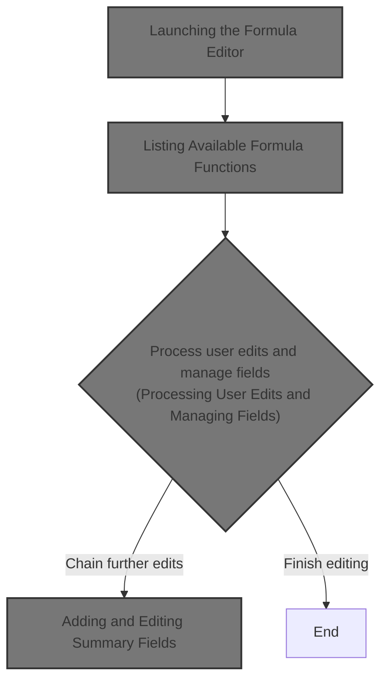
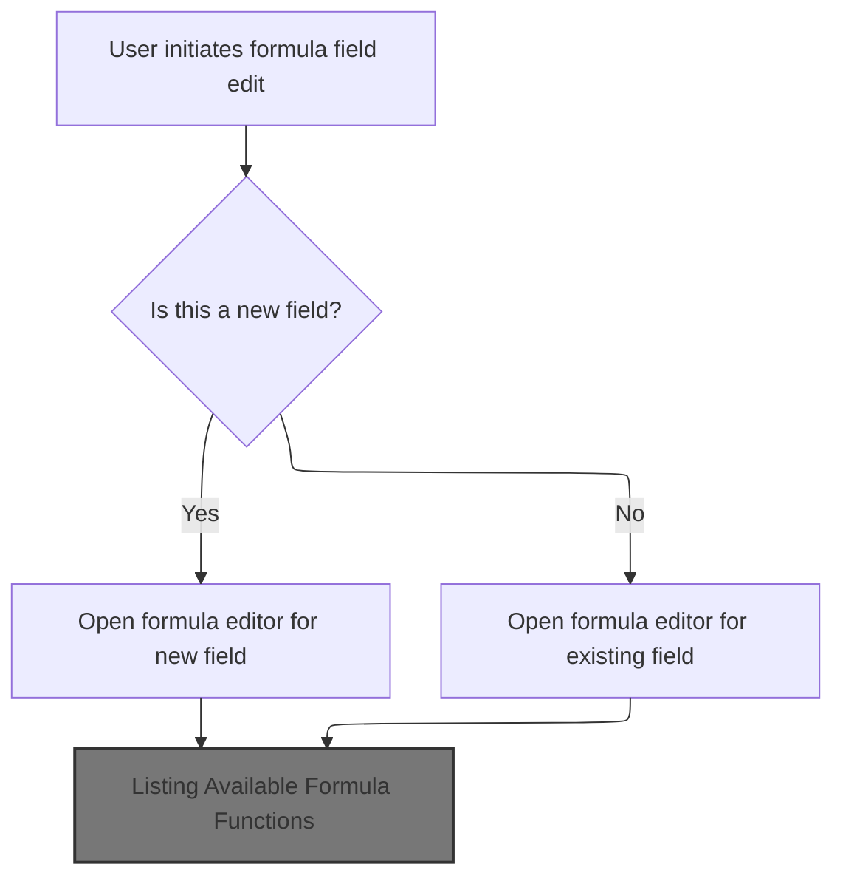
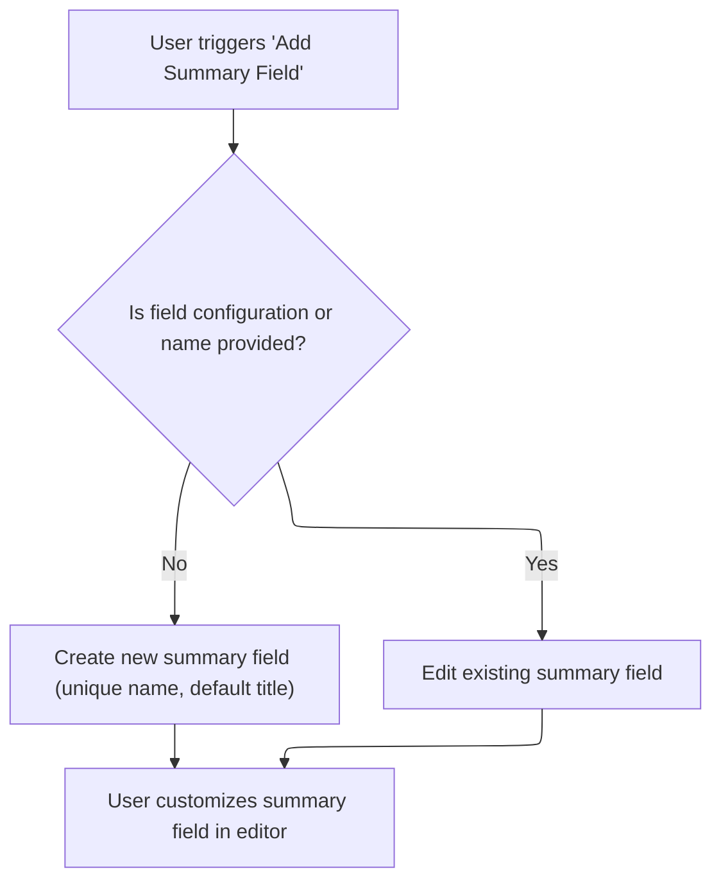

This document describes how users can add or edit formula fields within a data grid. Users launch the formula editor to create or modify fields, select from available formula functions, and update the field list. The flow supports chaining further field additions, including summary fields, for streamlined customization.



# Where is this flow used?

This flow is used multiple times in the codebase as represented in the following diagram:

(Note - these are only some of the entry points of this flow)

```mermaid
graph TD;
      fc4f97628503abd6d9e46b5d93b9e51f6cbc96244080239fc09084071b33bed4(shopizer/…/modules/ISC_Core.js::isc_Canvas_editFormulaField) --> e77c08859ad64bdd6687726cdad78ebdea5fe7791eb8ee336ae754e17e31a59a(shopizer/…/modules/ISC_Core.js::userFieldCallback):::mainFlowStyle

e77c08859ad64bdd6687726cdad78ebdea5fe7791eb8ee336ae754e17e31a59a(shopizer/…/modules/ISC_Core.js::userFieldCallback):::mainFlowStyle --> 6719f75262301d0f7dc7a94e1305a1fbdc7aacf5226b115e6fb42c53821f70f1(shopizer/…/modules/ISC_Core.js::addFormulaField):::mainFlowStyle

e77c08859ad64bdd6687726cdad78ebdea5fe7791eb8ee336ae754e17e31a59a(shopizer/…/modules/ISC_Core.js::userFieldCallback):::mainFlowStyle --> c27f2f572feee88d504c2418821ea275fdb30f43079868ab89681c4a027bfe3f(shopizer/…/modules/ISC_Core.js::addSummaryField):::mainFlowStyle

6719f75262301d0f7dc7a94e1305a1fbdc7aacf5226b115e6fb42c53821f70f1(shopizer/…/modules/ISC_Core.js::addFormulaField):::mainFlowStyle --> 30ce8498687d8b1c7da4fc5fa7615442ab2cff5c4c3722c81d4ac5d2869fe468(shopizer/…/modules/ISC_Core.js::editFormulaField):::mainFlowStyle

c27f2f572feee88d504c2418821ea275fdb30f43079868ab89681c4a027bfe3f(shopizer/…/modules/ISC_Core.js::addSummaryField):::mainFlowStyle --> 34329a9d7397905bb35bd0b749ea13123e89f4f15a50523be5af83a1d4c63174(shopizer/…/modules/ISC_Core.js::editSummaryField):::mainFlowStyle

34329a9d7397905bb35bd0b749ea13123e89f4f15a50523be5af83a1d4c63174(shopizer/…/modules/ISC_Core.js::editSummaryField):::mainFlowStyle --> e77c08859ad64bdd6687726cdad78ebdea5fe7791eb8ee336ae754e17e31a59a(shopizer/…/modules/ISC_Core.js::userFieldCallback):::mainFlowStyle

b0e1c8c1b994180c2331b9ca76168321737caf3605e18f0cd4df76813b8df301(shopizer/…/modules/ISC_Core.js::isc_Canvas_editSummaryField) --> e77c08859ad64bdd6687726cdad78ebdea5fe7791eb8ee336ae754e17e31a59a(shopizer/…/modules/ISC_Core.js::userFieldCallback):::mainFlowStyle

de5dd06c5fa1c5e292b4b3c93fda41eed12de9d01bd7e6489f634df9486fda6e(shopizer/…/modules/ISC_Core.js::fireOnClose) --> e77c08859ad64bdd6687726cdad78ebdea5fe7791eb8ee336ae754e17e31a59a(shopizer/…/modules/ISC_Core.js::userFieldCallback):::mainFlowStyle

de5dd06c5fa1c5e292b4b3c93fda41eed12de9d01bd7e6489f634df9486fda6e(shopizer/…/modules/ISC_Core.js::fireOnClose) --> e77c08859ad64bdd6687726cdad78ebdea5fe7791eb8ee336ae754e17e31a59a(shopizer/…/modules/ISC_Core.js::userFieldCallback):::mainFlowStyle

30c9533e46b53c5d33a1a2d65e212274c6d322a05e52dcb1dadde9d941eaaf0e(shopizer/…/modules/ISC_Core.js::isc_Canvas_userFieldCallback) --> 6719f75262301d0f7dc7a94e1305a1fbdc7aacf5226b115e6fb42c53821f70f1(shopizer/…/modules/ISC_Core.js::addFormulaField):::mainFlowStyle

30c9533e46b53c5d33a1a2d65e212274c6d322a05e52dcb1dadde9d941eaaf0e(shopizer/…/modules/ISC_Core.js::isc_Canvas_userFieldCallback) --> c27f2f572feee88d504c2418821ea275fdb30f43079868ab89681c4a027bfe3f(shopizer/…/modules/ISC_Core.js::addSummaryField):::mainFlowStyle


classDef mainFlowStyle color:#000000,fill:#7CB9F4
classDef rootsStyle color:#000000,fill:#00FFF4
classDef Style1 color:#000000,fill:#00FFAA
classDef Style2 color:#000000,fill:#FFFF00
classDef Style3 color:#000000,fill:#AA7CB9

%% Swimm:
%% graph TD;
%%       fc4f97628503abd6d9e46b5d93b9e51f6cbc96244080239fc09084071b33bed4(<SwmPath>[shopizer/…/modules/ISC_Core.js](shopizer/sm-shop/src/main/webapp/resources/smart-client/system/modules/ISC_Core.js)</SwmPath>::<SwmToken path="shopizer/sm-shop/src/main/webapp/resources/smart-client/system/modules/ISC_Core.js" pos="3790:9:9" line-data=",isc.A.editFormulaField=function isc_Canvas_editFormulaField(_1){if(isc.FormulaBuilder==null)return;var _2=this,_3=!_1?false:true;if(!_3){_1={name:_2.getUniqueFieldName(this.formulaFieldNamePrefix),title:&quot;New Field&quot;,width:&quot;50&quot;,canFilter:false,canExport:false,canSortClientOnly:true}}">`isc_Canvas_editFormulaField`</SwmToken>) --> e77c08859ad64bdd6687726cdad78ebdea5fe7791eb8ee336ae754e17e31a59a(<SwmPath>[shopizer/…/modules/ISC_Core.js](shopizer/sm-shop/src/main/webapp/resources/smart-client/system/modules/ISC_Core.js)</SwmPath>::<SwmToken path="shopizer/sm-shop/src/main/webapp/resources/smart-client/system/modules/ISC_Core.js" pos="3791:164:164" line-data="this.$65y=isc.Window.create({title:&quot;Formula Editor [&quot;+_1.title+&quot;]&quot;,showMinimizeButton:false,showMaximizeButton:false,isModal:true,showModalMask:true,autoSize:true,autoCenter:true,autoDraw:true,headerIconProperties:{padding:1,src:&quot;[SKINIMG]ListGrid/formula_menuItem.png&quot;},closeClick:function(){this.items.get(0).completeEditing(true);return this.Super(&#39;closeClick&#39;,arguments)},items:[isc.FormulaBuilder.create({width:300,component:_2,dataSource:_2.getDataSource(),editMode:_3,field:_1,mathFunctions:isc.MathFunction.getDefaultFunctionNames(),fireOnClose:function(){_2.userFieldCallback(this)}},this.formulaBuilderProperties)]},this.formulaBuilderProperties)}">`userFieldCallback`</SwmToken>):::mainFlowStyle
%% 
%% e77c08859ad64bdd6687726cdad78ebdea5fe7791eb8ee336ae754e17e31a59a(<SwmPath>[shopizer/…/modules/ISC_Core.js](shopizer/sm-shop/src/main/webapp/resources/smart-client/system/modules/ISC_Core.js)</SwmPath>::<SwmToken path="shopizer/sm-shop/src/main/webapp/resources/smart-client/system/modules/ISC_Core.js" pos="3791:164:164" line-data="this.$65y=isc.Window.create({title:&quot;Formula Editor [&quot;+_1.title+&quot;]&quot;,showMinimizeButton:false,showMaximizeButton:false,isModal:true,showModalMask:true,autoSize:true,autoCenter:true,autoDraw:true,headerIconProperties:{padding:1,src:&quot;[SKINIMG]ListGrid/formula_menuItem.png&quot;},closeClick:function(){this.items.get(0).completeEditing(true);return this.Super(&#39;closeClick&#39;,arguments)},items:[isc.FormulaBuilder.create({width:300,component:_2,dataSource:_2.getDataSource(),editMode:_3,field:_1,mathFunctions:isc.MathFunction.getDefaultFunctionNames(),fireOnClose:function(){_2.userFieldCallback(this)}},this.formulaBuilderProperties)]},this.formulaBuilderProperties)}">`userFieldCallback`</SwmToken>):::mainFlowStyle --> 6719f75262301d0f7dc7a94e1305a1fbdc7aacf5226b115e6fb42c53821f70f1(<SwmPath>[shopizer/…/modules/ISC_Core.js](shopizer/sm-shop/src/main/webapp/resources/smart-client/system/modules/ISC_Core.js)</SwmPath>::<SwmToken path="shopizer/sm-shop/src/main/webapp/resources/smart-client/system/modules/ISC_Core.js" pos="3789:5:5" line-data=",isc.A.addFormulaField=function isc_Canvas_addFormulaField(){this.editFormulaField()}">`addFormulaField`</SwmToken>):::mainFlowStyle
%% 
%% e77c08859ad64bdd6687726cdad78ebdea5fe7791eb8ee336ae754e17e31a59a(<SwmPath>[shopizer/…/modules/ISC_Core.js](shopizer/sm-shop/src/main/webapp/resources/smart-client/system/modules/ISC_Core.js)</SwmPath>::<SwmToken path="shopizer/sm-shop/src/main/webapp/resources/smart-client/system/modules/ISC_Core.js" pos="3791:164:164" line-data="this.$65y=isc.Window.create({title:&quot;Formula Editor [&quot;+_1.title+&quot;]&quot;,showMinimizeButton:false,showMaximizeButton:false,isModal:true,showModalMask:true,autoSize:true,autoCenter:true,autoDraw:true,headerIconProperties:{padding:1,src:&quot;[SKINIMG]ListGrid/formula_menuItem.png&quot;},closeClick:function(){this.items.get(0).completeEditing(true);return this.Super(&#39;closeClick&#39;,arguments)},items:[isc.FormulaBuilder.create({width:300,component:_2,dataSource:_2.getDataSource(),editMode:_3,field:_1,mathFunctions:isc.MathFunction.getDefaultFunctionNames(),fireOnClose:function(){_2.userFieldCallback(this)}},this.formulaBuilderProperties)]},this.formulaBuilderProperties)}">`userFieldCallback`</SwmToken>):::mainFlowStyle --> c27f2f572feee88d504c2418821ea275fdb30f43079868ab89681c4a027bfe3f(<SwmPath>[shopizer/…/modules/ISC_Core.js](shopizer/sm-shop/src/main/webapp/resources/smart-client/system/modules/ISC_Core.js)</SwmPath>::<SwmToken path="shopizer/sm-shop/src/main/webapp/resources/smart-client/system/modules/ISC_Core.js" pos="3794:5:5" line-data=",isc.A.addSummaryField=function isc_Canvas_addSummaryField(){this.editSummaryField()}">`addSummaryField`</SwmToken>):::mainFlowStyle
%% 
%% 6719f75262301d0f7dc7a94e1305a1fbdc7aacf5226b115e6fb42c53821f70f1(<SwmPath>[shopizer/…/modules/ISC_Core.js](shopizer/sm-shop/src/main/webapp/resources/smart-client/system/modules/ISC_Core.js)</SwmPath>::<SwmToken path="shopizer/sm-shop/src/main/webapp/resources/smart-client/system/modules/ISC_Core.js" pos="3789:5:5" line-data=",isc.A.addFormulaField=function isc_Canvas_addFormulaField(){this.editFormulaField()}">`addFormulaField`</SwmToken>):::mainFlowStyle --> 30ce8498687d8b1c7da4fc5fa7615442ab2cff5c4c3722c81d4ac5d2869fe468(<SwmPath>[shopizer/…/modules/ISC_Core.js](shopizer/sm-shop/src/main/webapp/resources/smart-client/system/modules/ISC_Core.js)</SwmPath>::<SwmToken path="shopizer/sm-shop/src/main/webapp/resources/smart-client/system/modules/ISC_Core.js" pos="3789:15:15" line-data=",isc.A.addFormulaField=function isc_Canvas_addFormulaField(){this.editFormulaField()}">`editFormulaField`</SwmToken>):::mainFlowStyle
%% 
%% c27f2f572feee88d504c2418821ea275fdb30f43079868ab89681c4a027bfe3f(<SwmPath>[shopizer/…/modules/ISC_Core.js](shopizer/sm-shop/src/main/webapp/resources/smart-client/system/modules/ISC_Core.js)</SwmPath>::<SwmToken path="shopizer/sm-shop/src/main/webapp/resources/smart-client/system/modules/ISC_Core.js" pos="3794:5:5" line-data=",isc.A.addSummaryField=function isc_Canvas_addSummaryField(){this.editSummaryField()}">`addSummaryField`</SwmToken>):::mainFlowStyle --> 34329a9d7397905bb35bd0b749ea13123e89f4f15a50523be5af83a1d4c63174(<SwmPath>[shopizer/…/modules/ISC_Core.js](shopizer/sm-shop/src/main/webapp/resources/smart-client/system/modules/ISC_Core.js)</SwmPath>::<SwmToken path="shopizer/sm-shop/src/main/webapp/resources/smart-client/system/modules/ISC_Core.js" pos="3794:15:15" line-data=",isc.A.addSummaryField=function isc_Canvas_addSummaryField(){this.editSummaryField()}">`editSummaryField`</SwmToken>):::mainFlowStyle
%% 
%% 34329a9d7397905bb35bd0b749ea13123e89f4f15a50523be5af83a1d4c63174(<SwmPath>[shopizer/…/modules/ISC_Core.js](shopizer/sm-shop/src/main/webapp/resources/smart-client/system/modules/ISC_Core.js)</SwmPath>::<SwmToken path="shopizer/sm-shop/src/main/webapp/resources/smart-client/system/modules/ISC_Core.js" pos="3794:15:15" line-data=",isc.A.addSummaryField=function isc_Canvas_addSummaryField(){this.editSummaryField()}">`editSummaryField`</SwmToken>):::mainFlowStyle --> e77c08859ad64bdd6687726cdad78ebdea5fe7791eb8ee336ae754e17e31a59a(<SwmPath>[shopizer/…/modules/ISC_Core.js](shopizer/sm-shop/src/main/webapp/resources/smart-client/system/modules/ISC_Core.js)</SwmPath>::<SwmToken path="shopizer/sm-shop/src/main/webapp/resources/smart-client/system/modules/ISC_Core.js" pos="3791:164:164" line-data="this.$65y=isc.Window.create({title:&quot;Formula Editor [&quot;+_1.title+&quot;]&quot;,showMinimizeButton:false,showMaximizeButton:false,isModal:true,showModalMask:true,autoSize:true,autoCenter:true,autoDraw:true,headerIconProperties:{padding:1,src:&quot;[SKINIMG]ListGrid/formula_menuItem.png&quot;},closeClick:function(){this.items.get(0).completeEditing(true);return this.Super(&#39;closeClick&#39;,arguments)},items:[isc.FormulaBuilder.create({width:300,component:_2,dataSource:_2.getDataSource(),editMode:_3,field:_1,mathFunctions:isc.MathFunction.getDefaultFunctionNames(),fireOnClose:function(){_2.userFieldCallback(this)}},this.formulaBuilderProperties)]},this.formulaBuilderProperties)}">`userFieldCallback`</SwmToken>):::mainFlowStyle
%% 
%% b0e1c8c1b994180c2331b9ca76168321737caf3605e18f0cd4df76813b8df301(<SwmPath>[shopizer/…/modules/ISC_Core.js](shopizer/sm-shop/src/main/webapp/resources/smart-client/system/modules/ISC_Core.js)</SwmPath>::<SwmToken path="shopizer/sm-shop/src/main/webapp/resources/smart-client/system/modules/ISC_Core.js" pos="3795:9:9" line-data=",isc.A.editSummaryField=function isc_Canvas_editSummaryField(_1){if(isc.FormulaBuilder==null)return;var _2=this,_3=!_1?false:true;if(isc.isA.String(_1)){_1=this.getField(_1)}">`isc_Canvas_editSummaryField`</SwmToken>) --> e77c08859ad64bdd6687726cdad78ebdea5fe7791eb8ee336ae754e17e31a59a(<SwmPath>[shopizer/…/modules/ISC_Core.js](shopizer/sm-shop/src/main/webapp/resources/smart-client/system/modules/ISC_Core.js)</SwmPath>::<SwmToken path="shopizer/sm-shop/src/main/webapp/resources/smart-client/system/modules/ISC_Core.js" pos="3791:164:164" line-data="this.$65y=isc.Window.create({title:&quot;Formula Editor [&quot;+_1.title+&quot;]&quot;,showMinimizeButton:false,showMaximizeButton:false,isModal:true,showModalMask:true,autoSize:true,autoCenter:true,autoDraw:true,headerIconProperties:{padding:1,src:&quot;[SKINIMG]ListGrid/formula_menuItem.png&quot;},closeClick:function(){this.items.get(0).completeEditing(true);return this.Super(&#39;closeClick&#39;,arguments)},items:[isc.FormulaBuilder.create({width:300,component:_2,dataSource:_2.getDataSource(),editMode:_3,field:_1,mathFunctions:isc.MathFunction.getDefaultFunctionNames(),fireOnClose:function(){_2.userFieldCallback(this)}},this.formulaBuilderProperties)]},this.formulaBuilderProperties)}">`userFieldCallback`</SwmToken>):::mainFlowStyle
%% 
%% de5dd06c5fa1c5e292b4b3c93fda41eed12de9d01bd7e6489f634df9486fda6e(<SwmPath>[shopizer/…/modules/ISC_Core.js](shopizer/sm-shop/src/main/webapp/resources/smart-client/system/modules/ISC_Core.js)</SwmPath>::<SwmToken path="shopizer/sm-shop/src/main/webapp/resources/smart-client/system/modules/ISC_Core.js" pos="3791:156:156" line-data="this.$65y=isc.Window.create({title:&quot;Formula Editor [&quot;+_1.title+&quot;]&quot;,showMinimizeButton:false,showMaximizeButton:false,isModal:true,showModalMask:true,autoSize:true,autoCenter:true,autoDraw:true,headerIconProperties:{padding:1,src:&quot;[SKINIMG]ListGrid/formula_menuItem.png&quot;},closeClick:function(){this.items.get(0).completeEditing(true);return this.Super(&#39;closeClick&#39;,arguments)},items:[isc.FormulaBuilder.create({width:300,component:_2,dataSource:_2.getDataSource(),editMode:_3,field:_1,mathFunctions:isc.MathFunction.getDefaultFunctionNames(),fireOnClose:function(){_2.userFieldCallback(this)}},this.formulaBuilderProperties)]},this.formulaBuilderProperties)}">`fireOnClose`</SwmToken>) --> e77c08859ad64bdd6687726cdad78ebdea5fe7791eb8ee336ae754e17e31a59a(<SwmPath>[shopizer/…/modules/ISC_Core.js](shopizer/sm-shop/src/main/webapp/resources/smart-client/system/modules/ISC_Core.js)</SwmPath>::<SwmToken path="shopizer/sm-shop/src/main/webapp/resources/smart-client/system/modules/ISC_Core.js" pos="3791:164:164" line-data="this.$65y=isc.Window.create({title:&quot;Formula Editor [&quot;+_1.title+&quot;]&quot;,showMinimizeButton:false,showMaximizeButton:false,isModal:true,showModalMask:true,autoSize:true,autoCenter:true,autoDraw:true,headerIconProperties:{padding:1,src:&quot;[SKINIMG]ListGrid/formula_menuItem.png&quot;},closeClick:function(){this.items.get(0).completeEditing(true);return this.Super(&#39;closeClick&#39;,arguments)},items:[isc.FormulaBuilder.create({width:300,component:_2,dataSource:_2.getDataSource(),editMode:_3,field:_1,mathFunctions:isc.MathFunction.getDefaultFunctionNames(),fireOnClose:function(){_2.userFieldCallback(this)}},this.formulaBuilderProperties)]},this.formulaBuilderProperties)}">`userFieldCallback`</SwmToken>):::mainFlowStyle
%% 
%% de5dd06c5fa1c5e292b4b3c93fda41eed12de9d01bd7e6489f634df9486fda6e(<SwmPath>[shopizer/…/modules/ISC_Core.js](shopizer/sm-shop/src/main/webapp/resources/smart-client/system/modules/ISC_Core.js)</SwmPath>::<SwmToken path="shopizer/sm-shop/src/main/webapp/resources/smart-client/system/modules/ISC_Core.js" pos="3791:156:156" line-data="this.$65y=isc.Window.create({title:&quot;Formula Editor [&quot;+_1.title+&quot;]&quot;,showMinimizeButton:false,showMaximizeButton:false,isModal:true,showModalMask:true,autoSize:true,autoCenter:true,autoDraw:true,headerIconProperties:{padding:1,src:&quot;[SKINIMG]ListGrid/formula_menuItem.png&quot;},closeClick:function(){this.items.get(0).completeEditing(true);return this.Super(&#39;closeClick&#39;,arguments)},items:[isc.FormulaBuilder.create({width:300,component:_2,dataSource:_2.getDataSource(),editMode:_3,field:_1,mathFunctions:isc.MathFunction.getDefaultFunctionNames(),fireOnClose:function(){_2.userFieldCallback(this)}},this.formulaBuilderProperties)]},this.formulaBuilderProperties)}">`fireOnClose`</SwmToken>) --> e77c08859ad64bdd6687726cdad78ebdea5fe7791eb8ee336ae754e17e31a59a(<SwmPath>[shopizer/…/modules/ISC_Core.js](shopizer/sm-shop/src/main/webapp/resources/smart-client/system/modules/ISC_Core.js)</SwmPath>::<SwmToken path="shopizer/sm-shop/src/main/webapp/resources/smart-client/system/modules/ISC_Core.js" pos="3791:164:164" line-data="this.$65y=isc.Window.create({title:&quot;Formula Editor [&quot;+_1.title+&quot;]&quot;,showMinimizeButton:false,showMaximizeButton:false,isModal:true,showModalMask:true,autoSize:true,autoCenter:true,autoDraw:true,headerIconProperties:{padding:1,src:&quot;[SKINIMG]ListGrid/formula_menuItem.png&quot;},closeClick:function(){this.items.get(0).completeEditing(true);return this.Super(&#39;closeClick&#39;,arguments)},items:[isc.FormulaBuilder.create({width:300,component:_2,dataSource:_2.getDataSource(),editMode:_3,field:_1,mathFunctions:isc.MathFunction.getDefaultFunctionNames(),fireOnClose:function(){_2.userFieldCallback(this)}},this.formulaBuilderProperties)]},this.formulaBuilderProperties)}">`userFieldCallback`</SwmToken>):::mainFlowStyle
%% 
%% 30c9533e46b53c5d33a1a2d65e212274c6d322a05e52dcb1dadde9d941eaaf0e(<SwmPath>[shopizer/…/modules/ISC_Core.js](shopizer/sm-shop/src/main/webapp/resources/smart-client/system/modules/ISC_Core.js)</SwmPath>::<SwmToken path="shopizer/sm-shop/src/main/webapp/resources/smart-client/system/modules/ISC_Core.js" pos="3798:9:9" line-data=",isc.A.userFieldCallback=function isc_Canvas_userFieldCallback(_1){if(!_1)return;var _2=this.$65y;if(_1.cancelled){_2.destroy();return}">`isc_Canvas_userFieldCallback`</SwmToken>) --> 6719f75262301d0f7dc7a94e1305a1fbdc7aacf5226b115e6fb42c53821f70f1(<SwmPath>[shopizer/…/modules/ISC_Core.js](shopizer/sm-shop/src/main/webapp/resources/smart-client/system/modules/ISC_Core.js)</SwmPath>::<SwmToken path="shopizer/sm-shop/src/main/webapp/resources/smart-client/system/modules/ISC_Core.js" pos="3789:5:5" line-data=",isc.A.addFormulaField=function isc_Canvas_addFormulaField(){this.editFormulaField()}">`addFormulaField`</SwmToken>):::mainFlowStyle
%% 
%% 30c9533e46b53c5d33a1a2d65e212274c6d322a05e52dcb1dadde9d941eaaf0e(<SwmPath>[shopizer/…/modules/ISC_Core.js](shopizer/sm-shop/src/main/webapp/resources/smart-client/system/modules/ISC_Core.js)</SwmPath>::<SwmToken path="shopizer/sm-shop/src/main/webapp/resources/smart-client/system/modules/ISC_Core.js" pos="3798:9:9" line-data=",isc.A.userFieldCallback=function isc_Canvas_userFieldCallback(_1){if(!_1)return;var _2=this.$65y;if(_1.cancelled){_2.destroy();return}">`isc_Canvas_userFieldCallback`</SwmToken>) --> c27f2f572feee88d504c2418821ea275fdb30f43079868ab89681c4a027bfe3f(<SwmPath>[shopizer/…/modules/ISC_Core.js](shopizer/sm-shop/src/main/webapp/resources/smart-client/system/modules/ISC_Core.js)</SwmPath>::<SwmToken path="shopizer/sm-shop/src/main/webapp/resources/smart-client/system/modules/ISC_Core.js" pos="3794:5:5" line-data=",isc.A.addSummaryField=function isc_Canvas_addSummaryField(){this.editSummaryField()}">`addSummaryField`</SwmToken>):::mainFlowStyle
%% 
%% 
%% classDef mainFlowStyle color:#000000,fill:#7CB9F4
%% classDef rootsStyle color:#000000,fill:#00FFF4
%% classDef Style1 color:#000000,fill:#00FFAA
%% classDef Style2 color:#000000,fill:#FFFF00
%% classDef Style3 color:#000000,fill:#AA7CB9
```

# Launching the Formula Editor



<SwmSnippet path="/shopizer/sm-shop/src/main/webapp/resources/smart-client/system/modules/ISC_Core.js" line="3790">

---

In <SwmToken path="shopizer/sm-shop/src/main/webapp/resources/smart-client/system/modules/ISC_Core.js" pos="3790:5:5" line-data=",isc.A.editFormulaField=function isc_Canvas_editFormulaField(_1){if(isc.FormulaBuilder==null)return;var _2=this,_3=!_1?false:true;if(!_3){_1={name:_2.getUniqueFieldName(this.formulaFieldNamePrefix),title:&quot;New Field&quot;,width:&quot;50&quot;,canFilter:false,canExport:false,canSortClientOnly:true}}">`editFormulaField`</SwmToken>, we kick things off by checking if <SwmToken path="shopizer/sm-shop/src/main/webapp/resources/smart-client/system/modules/ISC_Core.js" pos="3790:18:18" line-data=",isc.A.editFormulaField=function isc_Canvas_editFormulaField(_1){if(isc.FormulaBuilder==null)return;var _2=this,_3=!_1?false:true;if(!_3){_1={name:_2.getUniqueFieldName(this.formulaFieldNamePrefix),title:&quot;New Field&quot;,width:&quot;50&quot;,canFilter:false,canExport:false,canSortClientOnly:true}}">`FormulaBuilder`</SwmToken> is available and prepping the field object if needed. We then set up the modal Formula Editor window, passing in the list of default math function names. We need to call <SwmToken path="shopizer/sm-shop/src/main/webapp/resources/smart-client/system/modules/ISC_Core.js" pos="3791:152:152" line-data="this.$65y=isc.Window.create({title:&quot;Formula Editor [&quot;+_1.title+&quot;]&quot;,showMinimizeButton:false,showMaximizeButton:false,isModal:true,showModalMask:true,autoSize:true,autoCenter:true,autoDraw:true,headerIconProperties:{padding:1,src:&quot;[SKINIMG]ListGrid/formula_menuItem.png&quot;},closeClick:function(){this.items.get(0).completeEditing(true);return this.Super(&#39;closeClick&#39;,arguments)},items:[isc.FormulaBuilder.create({width:300,component:_2,dataSource:_2.getDataSource(),editMode:_3,field:_1,mathFunctions:isc.MathFunction.getDefaultFunctionNames(),fireOnClose:function(){_2.userFieldCallback(this)}},this.formulaBuilderProperties)]},this.formulaBuilderProperties)}">`getDefaultFunctionNames`</SwmToken> here so the <SwmToken path="shopizer/sm-shop/src/main/webapp/resources/smart-client/system/modules/ISC_Core.js" pos="3790:18:18" line-data=",isc.A.editFormulaField=function isc_Canvas_editFormulaField(_1){if(isc.FormulaBuilder==null)return;var _2=this,_3=!_1?false:true;if(!_3){_1={name:_2.getUniqueFieldName(this.formulaFieldNamePrefix),title:&quot;New Field&quot;,width:&quot;50&quot;,canFilter:false,canExport:false,canSortClientOnly:true}}">`FormulaBuilder`</SwmToken> UI can show users which functions they can use in their formulas.

```javascript
,isc.A.editFormulaField=function isc_Canvas_editFormulaField(_1){if(isc.FormulaBuilder==null)return;var _2=this,_3=!_1?false:true;if(!_3){_1={name:_2.getUniqueFieldName(this.formulaFieldNamePrefix),title:"New Field",width:"50",canFilter:false,canExport:false,canSortClientOnly:true}}
this.$65y=isc.Window.create({title:"Formula Editor ["+_1.title+"]",showMinimizeButton:false,showMaximizeButton:false,isModal:true,showModalMask:true,autoSize:true,autoCenter:true,autoDraw:true,headerIconProperties:{padding:1,src:"[SKINIMG]ListGrid/formula_menuItem.png"},closeClick:function(){this.items.get(0).completeEditing(true);return this.Super('closeClick',arguments)},items:[isc.FormulaBuilder.create({width:300,component:_2,dataSource:_2.getDataSource(),editMode:_3,field:_1,mathFunctions:isc.MathFunction.getDefaultFunctionNames(),fireOnClose:function(){_2.userFieldCallback(this)}},this.formulaBuilderProperties)]},this.formulaBuilderProperties)}
```

---

</SwmSnippet>

## Listing Available Formula Functions

<SwmSnippet path="/shopizer/sm-shop/src/main/webapp/resources/smart-client/system/modules/ISC_Core.js" line="3950">

---

<SwmToken path="shopizer/sm-shop/src/main/webapp/resources/smart-client/system/modules/ISC_Core.js" pos="3950:5:5" line-data=",isc.A.getDefaultFunctionNames=function isc_c_MathFunction_getDefaultFunctionNames(){var _1=this.getDefaultFunctions(),_2=_1.makeIndex(&quot;name&quot;,false);return isc.getKeys(_2)}">`getDefaultFunctionNames`</SwmToken> grabs the filtered and sorted list of default functions, then extracts just their names. We call <SwmToken path="shopizer/sm-shop/src/main/webapp/resources/smart-client/system/modules/ISC_Core.js" pos="3950:19:19" line-data=",isc.A.getDefaultFunctionNames=function isc_c_MathFunction_getDefaultFunctionNames(){var _1=this.getDefaultFunctions(),_2=_1.makeIndex(&quot;name&quot;,false);return isc.getKeys(_2)}">`getDefaultFunctions`</SwmToken> first to make sure we're only showing the right set of functions to the user.

```javascript
,isc.A.getDefaultFunctionNames=function isc_c_MathFunction_getDefaultFunctionNames(){var _1=this.getDefaultFunctions(),_2=_1.makeIndex("name",false);return isc.getKeys(_2)}
```

---

</SwmSnippet>

## Filtering and Sorting Formula Functions

<SwmSnippet path="/shopizer/sm-shop/src/main/webapp/resources/smart-client/system/modules/ISC_Core.js" line="3952">

---

In <SwmToken path="shopizer/sm-shop/src/main/webapp/resources/smart-client/system/modules/ISC_Core.js" pos="3952:5:5" line-data=",isc.A.getDefaultFunctions=function isc_c_MathFunction_getDefaultFunctions(){var _1=this.getRegisteredFunctions(),_2=_1.findAll(&quot;defaultSortPosition&quot;,-1)||[];for(var i=0;i&lt;_2.length;i++){var _4=_2[i];_1.remove(_4)}">`getDefaultFunctions`</SwmToken>, we grab all registered functions and filter out any with <SwmToken path="shopizer/sm-shop/src/main/webapp/resources/smart-client/system/modules/ISC_Core.js" pos="3952:30:30" line-data=",isc.A.getDefaultFunctions=function isc_c_MathFunction_getDefaultFunctions(){var _1=this.getRegisteredFunctions(),_2=_1.findAll(&quot;defaultSortPosition&quot;,-1)||[];for(var i=0;i&lt;_2.length;i++){var _4=_2[i];_1.remove(_4)}">`defaultSortPosition`</SwmToken> == -1 using <SwmToken path="shopizer/sm-shop/src/main/webapp/resources/smart-client/system/modules/ISC_Core.js" pos="3952:27:27" line-data=",isc.A.getDefaultFunctions=function isc_c_MathFunction_getDefaultFunctions(){var _1=this.getRegisteredFunctions(),_2=_1.findAll(&quot;defaultSortPosition&quot;,-1)||[];for(var i=0;i&lt;_2.length;i++){var _4=_2[i];_1.remove(_4)}">`findAll`</SwmToken>. This keeps hidden or internal functions out of the list before we sort and return them.

```javascript
,isc.A.getDefaultFunctions=function isc_c_MathFunction_getDefaultFunctions(){var _1=this.getRegisteredFunctions(),_2=_1.findAll("defaultSortPosition",-1)||[];for(var i=0;i<_2.length;i++){var _4=_2[i];_1.remove(_4)}
```

---

</SwmSnippet>

### Filtering Arrays by Property or Predicate

```mermaid
%%{init: {"flowchart": {"defaultRenderer": "elk"}} }%%
flowchart TD
  node1["Start: Retrieve all items matching condition"]
  click node1 openCode "shopizer/sm-shop/src/main/webapp/resources/smart-client/system/modules/ISC_Core.js:576:578"
  node1 --> node10{"Is property name provided?"}
  click node10 openCode "shopizer/sm-shop/src/main/webapp/resources/smart-client/system/modules/ISC_Core.js:576:578"
  node10 -->|"No"| node11["Return null"]
  click node11 openCode "shopizer/sm-shop/src/main/webapp/resources/smart-client/system/modules/ISC_Core.js:576:578"
  node10 -->|"Yes"| node2{"Is condition a property name?"}
  click node2 openCode "shopizer/sm-shop/src/main/webapp/resources/smart-client/system/modules/ISC_Core.js:576:578"
  node2 -->|"Yes"| node3{"Is value an array?"}
  click node3 openCode "shopizer/sm-shop/src/main/webapp/resources/smart-client/system/modules/ISC_Core.js:576:578"
  subgraph loop1["For each item in collection"]
    node3 -->|"Yes"| node4["Add item if its property is in the array of values"]
    click node4 openCode "shopizer/sm-shop/src/main/webapp/resources/smart-client/system/modules/ISC_Core.js:576:578"
    node3 -->|"No"| node5["Add item if its property equals the value"]
    click node5 openCode "shopizer/sm-shop/src/main/webapp/resources/smart-client/system/modules/ISC_Core.js:576:578"
  end
  node2 -->|"No"| node6{"Is condition a function?"}
  click node6 openCode "shopizer/sm-shop/src/main/webapp/resources/smart-client/system/modules/ISC_Core.js:576:578"
  subgraph loop2["For each item in collection"]
    node6 -->|"Yes"| node7["Add item if function returns true"]
    click node7 openCode "shopizer/sm-shop/src/main/webapp/resources/smart-client/system/modules/ISC_Core.js:576:578"
  end
  node6 -->|"No"| node8["Use default matching method"]
  click node8 openCode "shopizer/sm-shop/src/main/webapp/resources/smart-client/system/modules/ISC_Core.js:576:578"
  node4 --> node9["Return all matching items"]
  node5 --> node9
  node7 --> node9
  node8 --> node9
  click node9 openCode "shopizer/sm-shop/src/main/webapp/resources/smart-client/system/modules/ISC_Core.js:576:578"
classDef HeadingStyle fill:#777777,stroke:#333,stroke-width:2px;

%% Swimm:
%% %%{init: {"flowchart": {"defaultRenderer": "elk"}} }%%
%% flowchart TD
%%   node1["Start: Retrieve all items matching condition"]
%%   click node1 openCode "<SwmPath>[shopizer/…/modules/ISC_Core.js](shopizer/sm-shop/src/main/webapp/resources/smart-client/system/modules/ISC_Core.js)</SwmPath>:576:578"
%%   node1 --> node10{"Is property name provided?"}
%%   click node10 openCode "<SwmPath>[shopizer/…/modules/ISC_Core.js](shopizer/sm-shop/src/main/webapp/resources/smart-client/system/modules/ISC_Core.js)</SwmPath>:576:578"
%%   node10 -->|"No"| node11["Return null"]
%%   click node11 openCode "<SwmPath>[shopizer/…/modules/ISC_Core.js](shopizer/sm-shop/src/main/webapp/resources/smart-client/system/modules/ISC_Core.js)</SwmPath>:576:578"
%%   node10 -->|"Yes"| node2{"Is condition a property name?"}
%%   click node2 openCode "<SwmPath>[shopizer/…/modules/ISC_Core.js](shopizer/sm-shop/src/main/webapp/resources/smart-client/system/modules/ISC_Core.js)</SwmPath>:576:578"
%%   node2 -->|"Yes"| node3{"Is value an array?"}
%%   click node3 openCode "<SwmPath>[shopizer/…/modules/ISC_Core.js](shopizer/sm-shop/src/main/webapp/resources/smart-client/system/modules/ISC_Core.js)</SwmPath>:576:578"
%%   subgraph loop1["For each item in collection"]
%%     node3 -->|"Yes"| node4["Add item if its property is in the array of values"]
%%     click node4 openCode "<SwmPath>[shopizer/…/modules/ISC_Core.js](shopizer/sm-shop/src/main/webapp/resources/smart-client/system/modules/ISC_Core.js)</SwmPath>:576:578"
%%     node3 -->|"No"| node5["Add item if its property equals the value"]
%%     click node5 openCode "<SwmPath>[shopizer/…/modules/ISC_Core.js](shopizer/sm-shop/src/main/webapp/resources/smart-client/system/modules/ISC_Core.js)</SwmPath>:576:578"
%%   end
%%   node2 -->|"No"| node6{"Is condition a function?"}
%%   click node6 openCode "<SwmPath>[shopizer/…/modules/ISC_Core.js](shopizer/sm-shop/src/main/webapp/resources/smart-client/system/modules/ISC_Core.js)</SwmPath>:576:578"
%%   subgraph loop2["For each item in collection"]
%%     node6 -->|"Yes"| node7["Add item if function returns true"]
%%     click node7 openCode "<SwmPath>[shopizer/…/modules/ISC_Core.js](shopizer/sm-shop/src/main/webapp/resources/smart-client/system/modules/ISC_Core.js)</SwmPath>:576:578"
%%   end
%%   node6 -->|"No"| node8["Use default matching method"]
%%   click node8 openCode "<SwmPath>[shopizer/…/modules/ISC_Core.js](shopizer/sm-shop/src/main/webapp/resources/smart-client/system/modules/ISC_Core.js)</SwmPath>:576:578"
%%   node4 --> node9["Return all matching items"]
%%   node5 --> node9
%%   node7 --> node9
%%   node8 --> node9
%%   click node9 openCode "<SwmPath>[shopizer/…/modules/ISC_Core.js](shopizer/sm-shop/src/main/webapp/resources/smart-client/system/modules/ISC_Core.js)</SwmPath>:576:578"
%% classDef HeadingStyle fill:#777777,stroke:#333,stroke-width:<SwmToken path="shopizer/sm-shop/src/main/webapp/resources/smart-client/system/modules/ISC_Core.js" pos="1005:95:95" line-data=",isc.A.showHiliteCanvas=function isc_c_Log_showHiliteCanvas(_1){var _2=this._hiliteCanvas;if(!_2){_2=this._hiliteCanvas=isc.Canvas.create({ID:&quot;logHiliteCanvas&quot;,autoDraw:false,overflow:&quot;hidden&quot;,hide:function(){this.Super(&quot;hide&quot;,arguments);this.resizeTo(1,1);this.setTop(-20)},border1:&quot;2px dotted red&quot;,border2:&quot;2px dotted white&quot;})}">`2px`</SwmToken>;
```



<SwmSnippet path="/shopizer/sm-shop/src/main/webapp/resources/smart-client/system/modules/ISC_Core.js" line="576">

---

In <SwmToken path="shopizer/sm-shop/src/main/webapp/resources/smart-client/system/modules/ISC_Core.js" pos="576:5:5" line-data=",isc.A.findAll=function isc_Arra_findAll(_1,_2){if(_1==null)return null;if(isc.isA.String(_1)){var _3=null,l=this.length;var _5=isc.isAn.Array(_2);for(var i=0;i&lt;l;i++){var _7=this[i];if(_7&amp;&amp;(_5?_2.contains(_7[_1]):_7[_1]==_2)){if(_3==null)_3=[];_3.add(_7)}}">`findAll`</SwmToken>, we start by handling property-based filtering if the first argument is a string, supporting both direct value matches and containment in an array. This lets us filter arrays by property or by a set of values.

```javascript
,isc.A.findAll=function isc_Arra_findAll(_1,_2){if(_1==null)return null;if(isc.isA.String(_1)){var _3=null,l=this.length;var _5=isc.isAn.Array(_2);for(var i=0;i<l;i++){var _7=this[i];if(_7&&(_5?_2.contains(_7[_1]):_7[_1]==_2)){if(_3==null)_3=[];_3.add(_7)}}
```

---

</SwmSnippet>

<SwmSnippet path="/shopizer/sm-shop/src/main/webapp/resources/smart-client/system/modules/ISC_Core.js" line="576">

---

After handling property-based filtering, <SwmToken path="shopizer/sm-shop/src/main/webapp/resources/smart-client/system/modules/ISC_Core.js" pos="576:5:5" line-data=",isc.A.findAll=function isc_Arra_findAll(_1,_2){if(_1==null)return null;if(isc.isA.String(_1)){var _3=null,l=this.length;var _5=isc.isAn.Array(_2);for(var i=0;i&lt;l;i++){var _7=this[i];if(_7&amp;&amp;(_5?_2.contains(_7[_1]):_7[_1]==_2)){if(_3==null)_3=[];_3.add(_7)}}">`findAll`</SwmToken> moves on to function-based filtering if the first argument is a function. If neither, it delegates to <SwmToken path="shopizer/sm-shop/src/main/webapp/resources/smart-client/system/modules/ISC_Core.js" pos="578:10:10" line-data="return _3}else{return this.findAllMatches(_1)}}">`findAllMatches`</SwmToken> for more generic matching. This covers all the main filtering cases.

```javascript
,isc.A.findAll=function isc_Arra_findAll(_1,_2){if(_1==null)return null;if(isc.isA.String(_1)){var _3=null,l=this.length;var _5=isc.isAn.Array(_2);for(var i=0;i<l;i++){var _7=this[i];if(_7&&(_5?_2.contains(_7[_1]):_7[_1]==_2)){if(_3==null)_3=[];_3.add(_7)}}
return _3}else if(isc.isA.Function(_1)){var _3=null,l=this.length,_8=_1,_9=_2;for(var i=0;i<l;i++){var _7=this[i];if(_8(_7,_9)){if(_3==null)_3=[];_3.add(_7)}}
```

---

</SwmSnippet>

<SwmSnippet path="/shopizer/sm-shop/src/main/webapp/resources/smart-client/system/modules/ISC_Core.js" line="577">

---

Finally, <SwmToken path="shopizer/sm-shop/src/main/webapp/resources/smart-client/system/modules/ISC_Core.js" pos="576:5:5" line-data=",isc.A.findAll=function isc_Arra_findAll(_1,_2){if(_1==null)return null;if(isc.isA.String(_1)){var _3=null,l=this.length;var _5=isc.isAn.Array(_2);for(var i=0;i&lt;l;i++){var _7=this[i];if(_7&amp;&amp;(_5?_2.contains(_7[_1]):_7[_1]==_2)){if(_3==null)_3=[];_3.add(_7)}}">`findAll`</SwmToken> returns the filtered array or null if nothing matched. If the first parameter isn't a string or function, it falls back to <SwmToken path="shopizer/sm-shop/src/main/webapp/resources/smart-client/system/modules/ISC_Core.js" pos="578:10:10" line-data="return _3}else{return this.findAllMatches(_1)}}">`findAllMatches`</SwmToken> for generic matching.

```javascript
return _3}else if(isc.isA.Function(_1)){var _3=null,l=this.length,_8=_1,_9=_2;for(var i=0;i<l;i++){var _7=this[i];if(_8(_7,_9)){if(_3==null)_3=[];_3.add(_7)}}
return _3}else{return this.findAllMatches(_1)}}
```

---

</SwmSnippet>

### Sorting and Returning Filtered Functions

<SwmSnippet path="/shopizer/sm-shop/src/main/webapp/resources/smart-client/system/modules/ISC_Core.js" line="3953">

---

Back in <SwmToken path="shopizer/sm-shop/src/main/webapp/resources/smart-client/system/modules/ISC_Core.js" pos="3950:19:19" line-data=",isc.A.getDefaultFunctionNames=function isc_c_MathFunction_getDefaultFunctionNames(){var _1=this.getDefaultFunctions(),_2=_1.makeIndex(&quot;name&quot;,false);return isc.getKeys(_2)}">`getDefaultFunctions`</SwmToken>, after filtering out hidden functions, we sort the remaining ones by <SwmToken path="shopizer/sm-shop/src/main/webapp/resources/smart-client/system/modules/ISC_Core.js" pos="3953:6:6" line-data="_1.sortByProperties([&quot;defaultSortPosition&quot;],[&quot;true&quot;]);return _1}">`defaultSortPosition`</SwmToken> and return the sorted list. This makes sure the UI shows functions in a consistent order.

```javascript
_1.sortByProperties(["defaultSortPosition"],["true"]);return _1}
```

---

</SwmSnippet>

## Displaying the Formula Editor and Handling User Actions

<SwmSnippet path="/shopizer/sm-shop/src/main/webapp/resources/smart-client/system/modules/ISC_Core.js" line="3791">

---

After getting the function names, <SwmToken path="shopizer/sm-shop/src/main/webapp/resources/smart-client/system/modules/ISC_Core.js" pos="3789:15:15" line-data=",isc.A.addFormulaField=function isc_Canvas_addFormulaField(){this.editFormulaField()}">`editFormulaField`</SwmToken> finishes by launching the Formula Editor window. The <SwmToken path="shopizer/sm-shop/src/main/webapp/resources/smart-client/system/modules/ISC_Core.js" pos="3791:156:156" line-data="this.$65y=isc.Window.create({title:&quot;Formula Editor [&quot;+_1.title+&quot;]&quot;,showMinimizeButton:false,showMaximizeButton:false,isModal:true,showModalMask:true,autoSize:true,autoCenter:true,autoDraw:true,headerIconProperties:{padding:1,src:&quot;[SKINIMG]ListGrid/formula_menuItem.png&quot;},closeClick:function(){this.items.get(0).completeEditing(true);return this.Super(&#39;closeClick&#39;,arguments)},items:[isc.FormulaBuilder.create({width:300,component:_2,dataSource:_2.getDataSource(),editMode:_3,field:_1,mathFunctions:isc.MathFunction.getDefaultFunctionNames(),fireOnClose:function(){_2.userFieldCallback(this)}},this.formulaBuilderProperties)]},this.formulaBuilderProperties)}">`fireOnClose`</SwmToken> callback is set up so when the user finishes or cancels, <SwmToken path="shopizer/sm-shop/src/main/webapp/resources/smart-client/system/modules/ISC_Core.js" pos="3791:164:164" line-data="this.$65y=isc.Window.create({title:&quot;Formula Editor [&quot;+_1.title+&quot;]&quot;,showMinimizeButton:false,showMaximizeButton:false,isModal:true,showModalMask:true,autoSize:true,autoCenter:true,autoDraw:true,headerIconProperties:{padding:1,src:&quot;[SKINIMG]ListGrid/formula_menuItem.png&quot;},closeClick:function(){this.items.get(0).completeEditing(true);return this.Super(&#39;closeClick&#39;,arguments)},items:[isc.FormulaBuilder.create({width:300,component:_2,dataSource:_2.getDataSource(),editMode:_3,field:_1,mathFunctions:isc.MathFunction.getDefaultFunctionNames(),fireOnClose:function(){_2.userFieldCallback(this)}},this.formulaBuilderProperties)]},this.formulaBuilderProperties)}">`userFieldCallback`</SwmToken> is triggered to handle the result.

```javascript
this.$65y=isc.Window.create({title:"Formula Editor ["+_1.title+"]",showMinimizeButton:false,showMaximizeButton:false,isModal:true,showModalMask:true,autoSize:true,autoCenter:true,autoDraw:true,headerIconProperties:{padding:1,src:"[SKINIMG]ListGrid/formula_menuItem.png"},closeClick:function(){this.items.get(0).completeEditing(true);return this.Super('closeClick',arguments)},items:[isc.FormulaBuilder.create({width:300,component:_2,dataSource:_2.getDataSource(),editMode:_3,field:_1,mathFunctions:isc.MathFunction.getDefaultFunctionNames(),fireOnClose:function(){_2.userFieldCallback(this)}},this.formulaBuilderProperties)]},this.formulaBuilderProperties)}
```

---

</SwmSnippet>

# Processing User Edits and Managing Fields

```mermaid
%%{init: {"flowchart": {"defaultRenderer": "elk"}} }%%
flowchart TD
  node1["Receive user field operation result"]
  click node1 openCode "shopizer/sm-shop/src/main/webapp/resources/smart-client/system/modules/ISC_Core.js:3798:3801"
  node1 --> node2{"Was operation cancelled?"}
  click node2 openCode "shopizer/sm-shop/src/main/webapp/resources/smart-client/system/modules/ISC_Core.js:3798:3799"
  node2 -->|"Yes"| node3["End operation"]
  click node3 openCode "shopizer/sm-shop/src/main/webapp/resources/smart-client/system/modules/ISC_Core.js:3798:3799"
  node2 -->|"No"| node4{"Should updated field be added?"}
  click node4 openCode "shopizer/sm-shop/src/main/webapp/resources/smart-client/system/modules/ISC_Core.js:3799:3800"
  node4 -->|"No"| node3
  node4 -->|"Yes"| node5{"Should used fields be hidden?"}
  click node5 openCode "shopizer/sm-shop/src/main/webapp/resources/smart-client/system/modules/ISC_Core.js:3800:3801"
  node5 -->|"Yes"| loop1
  node5 -->|"No"| node6["Update field list and redraw UI"]
  click node6 openCode "shopizer/sm-shop/src/main/webapp/resources/smart-client/system/modules/ISC_Core.js:3801:3801"
  subgraph loop1["For each used field"]
    node7["Hide field"]
    click node7 openCode "shopizer/sm-shop/src/main/webapp/resources/smart-client/system/modules/ISC_Core.js:3800:3801"
    node7 --> node6
  end
  node6 -->|"Fields updated"| node8{"Restart builder?"}
  click node8 openCode "shopizer/sm-shop/src/main/webapp/resources/smart-client/system/modules/ISC_Core.js:3801:3801"
  node8 -->|"No"| node3
  node8 -->|"Yes"| node9{"Builder type?"}
  click node9 openCode "shopizer/sm-shop/src/main/webapp/resources/smart-client/system/modules/ISC_Core.js:3801:3801"
  node9 -->|"Formula"| node10["Restart as Formula"]
  click node10 openCode "shopizer/sm-shop/src/main/webapp/resources/smart-client/system/modules/ISC_Core.js:3789:3789"
  node9 -->|"Summary"| node11["Restart as Summary"]
  click node11 openCode "shopizer/sm-shop/src/main/webapp/resources/smart-client/system/modules/ISC_Core.js:3801:3801"
  node10 --> node3
  node11 --> node3

classDef HeadingStyle fill:#777777,stroke:#333,stroke-width:2px;

%% Swimm:
%% %%{init: {"flowchart": {"defaultRenderer": "elk"}} }%%
%% flowchart TD
%%   node1["Receive user field operation result"]
%%   click node1 openCode "<SwmPath>[shopizer/…/modules/ISC_Core.js](shopizer/sm-shop/src/main/webapp/resources/smart-client/system/modules/ISC_Core.js)</SwmPath>:3798:3801"
%%   node1 --> node2{"Was operation cancelled?"}
%%   click node2 openCode "<SwmPath>[shopizer/…/modules/ISC_Core.js](shopizer/sm-shop/src/main/webapp/resources/smart-client/system/modules/ISC_Core.js)</SwmPath>:3798:3799"
%%   node2 -->|"Yes"| node3["End operation"]
%%   click node3 openCode "<SwmPath>[shopizer/…/modules/ISC_Core.js](shopizer/sm-shop/src/main/webapp/resources/smart-client/system/modules/ISC_Core.js)</SwmPath>:3798:3799"
%%   node2 -->|"No"| node4{"Should updated field be added?"}
%%   click node4 openCode "<SwmPath>[shopizer/…/modules/ISC_Core.js](shopizer/sm-shop/src/main/webapp/resources/smart-client/system/modules/ISC_Core.js)</SwmPath>:3799:3800"
%%   node4 -->|"No"| node3
%%   node4 -->|"Yes"| node5{"Should used fields be hidden?"}
%%   click node5 openCode "<SwmPath>[shopizer/…/modules/ISC_Core.js](shopizer/sm-shop/src/main/webapp/resources/smart-client/system/modules/ISC_Core.js)</SwmPath>:3800:3801"
%%   node5 -->|"Yes"| loop1
%%   node5 -->|"No"| node6["Update field list and redraw UI"]
%%   click node6 openCode "<SwmPath>[shopizer/…/modules/ISC_Core.js](shopizer/sm-shop/src/main/webapp/resources/smart-client/system/modules/ISC_Core.js)</SwmPath>:3801:3801"
%%   subgraph loop1["For each used field"]
%%     node7["Hide field"]
%%     click node7 openCode "<SwmPath>[shopizer/…/modules/ISC_Core.js](shopizer/sm-shop/src/main/webapp/resources/smart-client/system/modules/ISC_Core.js)</SwmPath>:3800:3801"
%%     node7 --> node6
%%   end
%%   node6 -->|"Fields updated"| node8{"Restart builder?"}
%%   click node8 openCode "<SwmPath>[shopizer/…/modules/ISC_Core.js](shopizer/sm-shop/src/main/webapp/resources/smart-client/system/modules/ISC_Core.js)</SwmPath>:3801:3801"
%%   node8 -->|"No"| node3
%%   node8 -->|"Yes"| node9{"Builder type?"}
%%   click node9 openCode "<SwmPath>[shopizer/…/modules/ISC_Core.js](shopizer/sm-shop/src/main/webapp/resources/smart-client/system/modules/ISC_Core.js)</SwmPath>:3801:3801"
%%   node9 -->|"Formula"| node10["Restart as Formula"]
%%   click node10 openCode "<SwmPath>[shopizer/…/modules/ISC_Core.js](shopizer/sm-shop/src/main/webapp/resources/smart-client/system/modules/ISC_Core.js)</SwmPath>:3789:3789"
%%   node9 -->|"Summary"| node11["Restart as Summary"]
%%   click node11 openCode "<SwmPath>[shopizer/…/modules/ISC_Core.js](shopizer/sm-shop/src/main/webapp/resources/smart-client/system/modules/ISC_Core.js)</SwmPath>:3801:3801"
%%   node10 --> node3
%%   node11 --> node3
%% 
%% classDef HeadingStyle fill:#777777,stroke:#333,stroke-width:<SwmToken path="shopizer/sm-shop/src/main/webapp/resources/smart-client/system/modules/ISC_Core.js" pos="1005:95:95" line-data=",isc.A.showHiliteCanvas=function isc_c_Log_showHiliteCanvas(_1){var _2=this._hiliteCanvas;if(!_2){_2=this._hiliteCanvas=isc.Canvas.create({ID:&quot;logHiliteCanvas&quot;,autoDraw:false,overflow:&quot;hidden&quot;,hide:function(){this.Super(&quot;hide&quot;,arguments);this.resizeTo(1,1);this.setTop(-20)},border1:&quot;2px dotted red&quot;,border2:&quot;2px dotted white&quot;})}">`2px`</SwmToken>;
```



<SwmSnippet path="/shopizer/sm-shop/src/main/webapp/resources/smart-client/system/modules/ISC_Core.js" line="3798">

---

In <SwmToken path="shopizer/sm-shop/src/main/webapp/resources/smart-client/system/modules/ISC_Core.js" pos="3798:5:5" line-data=",isc.A.userFieldCallback=function isc_Canvas_userFieldCallback(_1){if(!_1)return;var _2=this.$65y;if(_1.cancelled){_2.destroy();return}">`userFieldCallback`</SwmToken>, we handle the result from the editor. If the user cancels or the <SwmToken path="shopizer/sm-shop/src/main/webapp/resources/smart-client/system/modules/ISC_Core.js" pos="3799:14:14" line-data="var _3=_1.getUpdatedFieldObject();if(this.userAddedField&amp;&amp;this.userAddedField(_3)==false){_2.destroy();return}">`userAddedField`</SwmToken> callback returns false, we destroy the modal and bail. If not, we might hide used fields depending on the builder's state.

```javascript
,isc.A.userFieldCallback=function isc_Canvas_userFieldCallback(_1){if(!_1)return;var _2=this.$65y;if(_1.cancelled){_2.destroy();return}
var _3=_1.getUpdatedFieldObject();if(this.userAddedField&&this.userAddedField(_3)==false){_2.destroy();return}
if(this.hideField&&_1.shouldHideUsedFields()){var _4=_1.getUsedFields();for(var i=0;i<_4.length;i++){var _6=_4.get(i);this.hideField(_6.name)}}
```

---

</SwmSnippet>

<SwmSnippet path="/shopizer/sm-shop/src/main/webapp/resources/smart-client/system/modules/ISC_Core.js" line="3800">

---

After handling field updates and UI redraw, if <SwmToken path="shopizer/sm-shop/src/main/webapp/resources/smart-client/system/modules/ISC_Core.js" pos="3801:86:86" line-data="var _7=this.getAllFields();var _8=isc.Class.getArrayItemIndex(_3.name,_7,this.fieldIdProperty);if(_8&gt;=0)_7[_8]=_3;else _7.addAt(_3,this.getFields().length);this.setFields(_7);if(this.markForRedraw)this.markForRedraw();var _9=_1.restartBuilder,_10=_1.builderTypeText;_2.destroy();if(_9){if(_10==&quot;Formula&quot;)this.addFormulaField();else this.addSummaryField()}}">`restartBuilder`</SwmToken> is set, we destroy the modal and call <SwmToken path="shopizer/sm-shop/src/main/webapp/resources/smart-client/system/modules/ISC_Core.js" pos="3801:115:115" line-data="var _7=this.getAllFields();var _8=isc.Class.getArrayItemIndex(_3.name,_7,this.fieldIdProperty);if(_8&gt;=0)_7[_8]=_3;else _7.addAt(_3,this.getFields().length);this.setFields(_7);if(this.markForRedraw)this.markForRedraw();var _9=_1.restartBuilder,_10=_1.builderTypeText;_2.destroy();if(_9){if(_10==&quot;Formula&quot;)this.addFormulaField();else this.addSummaryField()}}">`addFormulaField`</SwmToken> or <SwmToken path="shopizer/sm-shop/src/main/webapp/resources/smart-client/system/modules/ISC_Core.js" pos="3801:123:123" line-data="var _7=this.getAllFields();var _8=isc.Class.getArrayItemIndex(_3.name,_7,this.fieldIdProperty);if(_8&gt;=0)_7[_8]=_3;else _7.addAt(_3,this.getFields().length);this.setFields(_7);if(this.markForRedraw)this.markForRedraw();var _9=_1.restartBuilder,_10=_1.builderTypeText;_2.destroy();if(_9){if(_10==&quot;Formula&quot;)this.addFormulaField();else this.addSummaryField()}}">`addSummaryField`</SwmToken> depending on the builder type. This lets users chain field additions without leaving the flow.

```javascript
if(this.hideField&&_1.shouldHideUsedFields()){var _4=_1.getUsedFields();for(var i=0;i<_4.length;i++){var _6=_4.get(i);this.hideField(_6.name)}}
var _7=this.getAllFields();var _8=isc.Class.getArrayItemIndex(_3.name,_7,this.fieldIdProperty);if(_8>=0)_7[_8]=_3;else _7.addAt(_3,this.getFields().length);this.setFields(_7);if(this.markForRedraw)this.markForRedraw();var _9=_1.restartBuilder,_10=_1.builderTypeText;_2.destroy();if(_9){if(_10=="Formula")this.addFormulaField();else this.addSummaryField()}}
```

---

</SwmSnippet>

<SwmSnippet path="/shopizer/sm-shop/src/main/webapp/resources/smart-client/system/modules/ISC_Core.js" line="3789">

---

<SwmToken path="shopizer/sm-shop/src/main/webapp/resources/smart-client/system/modules/ISC_Core.js" pos="3789:5:5" line-data=",isc.A.addFormulaField=function isc_Canvas_addFormulaField(){this.editFormulaField()}">`addFormulaField`</SwmToken> just calls <SwmToken path="shopizer/sm-shop/src/main/webapp/resources/smart-client/system/modules/ISC_Core.js" pos="3789:15:15" line-data=",isc.A.addFormulaField=function isc_Canvas_addFormulaField(){this.editFormulaField()}">`editFormulaField`</SwmToken> again, so the user can immediately start editing a new formula field if needed.

```javascript
,isc.A.addFormulaField=function isc_Canvas_addFormulaField(){this.editFormulaField()}
```

---

</SwmSnippet>

<SwmSnippet path="/shopizer/sm-shop/src/main/webapp/resources/smart-client/system/modules/ISC_Core.js" line="3801">

---

After returning from <SwmToken path="shopizer/sm-shop/src/main/webapp/resources/smart-client/system/modules/ISC_Core.js" pos="3801:115:115" line-data="var _7=this.getAllFields();var _8=isc.Class.getArrayItemIndex(_3.name,_7,this.fieldIdProperty);if(_8&gt;=0)_7[_8]=_3;else _7.addAt(_3,this.getFields().length);this.setFields(_7);if(this.markForRedraw)this.markForRedraw();var _9=_1.restartBuilder,_10=_1.builderTypeText;_2.destroy();if(_9){if(_10==&quot;Formula&quot;)this.addFormulaField();else this.addSummaryField()}}">`addFormulaField`</SwmToken>, <SwmToken path="shopizer/sm-shop/src/main/webapp/resources/smart-client/system/modules/ISC_Core.js" pos="3791:164:164" line-data="this.$65y=isc.Window.create({title:&quot;Formula Editor [&quot;+_1.title+&quot;]&quot;,showMinimizeButton:false,showMaximizeButton:false,isModal:true,showModalMask:true,autoSize:true,autoCenter:true,autoDraw:true,headerIconProperties:{padding:1,src:&quot;[SKINIMG]ListGrid/formula_menuItem.png&quot;},closeClick:function(){this.items.get(0).completeEditing(true);return this.Super(&#39;closeClick&#39;,arguments)},items:[isc.FormulaBuilder.create({width:300,component:_2,dataSource:_2.getDataSource(),editMode:_3,field:_1,mathFunctions:isc.MathFunction.getDefaultFunctionNames(),fireOnClose:function(){_2.userFieldCallback(this)}},this.formulaBuilderProperties)]},this.formulaBuilderProperties)}">`userFieldCallback`</SwmToken> checks if the next field to add is a summary field. If so, it calls <SwmToken path="shopizer/sm-shop/src/main/webapp/resources/smart-client/system/modules/ISC_Core.js" pos="3801:123:123" line-data="var _7=this.getAllFields();var _8=isc.Class.getArrayItemIndex(_3.name,_7,this.fieldIdProperty);if(_8&gt;=0)_7[_8]=_3;else _7.addAt(_3,this.getFields().length);this.setFields(_7);if(this.markForRedraw)this.markForRedraw();var _9=_1.restartBuilder,_10=_1.builderTypeText;_2.destroy();if(_9){if(_10==&quot;Formula&quot;)this.addFormulaField();else this.addSummaryField()}}">`addSummaryField`</SwmToken>, letting the user keep adding fields of the right type.

```javascript
var _7=this.getAllFields();var _8=isc.Class.getArrayItemIndex(_3.name,_7,this.fieldIdProperty);if(_8>=0)_7[_8]=_3;else _7.addAt(_3,this.getFields().length);this.setFields(_7);if(this.markForRedraw)this.markForRedraw();var _9=_1.restartBuilder,_10=_1.builderTypeText;_2.destroy();if(_9){if(_10=="Formula")this.addFormulaField();else this.addSummaryField()}}
```

---

</SwmSnippet>

# Adding and Editing Summary Fields



<SwmSnippet path="/shopizer/sm-shop/src/main/webapp/resources/smart-client/system/modules/ISC_Core.js" line="3794">

---

<SwmToken path="shopizer/sm-shop/src/main/webapp/resources/smart-client/system/modules/ISC_Core.js" pos="3794:5:5" line-data=",isc.A.addSummaryField=function isc_Canvas_addSummaryField(){this.editSummaryField()}">`addSummaryField`</SwmToken> just calls <SwmToken path="shopizer/sm-shop/src/main/webapp/resources/smart-client/system/modules/ISC_Core.js" pos="3794:15:15" line-data=",isc.A.addSummaryField=function isc_Canvas_addSummaryField(){this.editSummaryField()}">`editSummaryField`</SwmToken>, so the user can start editing or creating a summary field right away. The name is a bit misleading since it doesn't add anything directly.

```javascript
,isc.A.addSummaryField=function isc_Canvas_addSummaryField(){this.editSummaryField()}
```

---

</SwmSnippet>

<SwmSnippet path="/shopizer/sm-shop/src/main/webapp/resources/smart-client/system/modules/ISC_Core.js" line="3795">

---

<SwmToken path="shopizer/sm-shop/src/main/webapp/resources/smart-client/system/modules/ISC_Core.js" pos="3795:5:5" line-data=",isc.A.editSummaryField=function isc_Canvas_editSummaryField(_1){if(isc.FormulaBuilder==null)return;var _2=this,_3=!_1?false:true;if(isc.isA.String(_1)){_1=this.getField(_1)}">`editSummaryField`</SwmToken> either loads an existing field or creates a new one, then launches the Summary Editor window. The <SwmToken path="shopizer/sm-shop/src/main/webapp/resources/smart-client/system/modules/ISC_Core.js" pos="3797:146:146" line-data="this.$65y=isc.Window.create({title:&quot;Summary Editor [&quot;+_1.title+&quot;]&quot;,showMinimizeButton:false,showMaximizeButton:false,isModal:true,showModalMask:true,autoSize:true,autoCenter:true,autoDraw:true,headerIconProperties:{padding:1,src:&quot;[SKINIMG]ListGrid/formula_menuItem.png&quot;},closeClick:function(){this.items.get(0).completeEditing(true);return this.Super(&#39;closeClick&#39;,arguments)},items:[isc.SummaryBuilder.create({width:300,component:_2,dataSource:_2.getDataSource(),editMode:_3,field:_1,fireOnClose:function(){_2.userFieldCallback(this)}},this.summaryBuilderProperties)]},this.summaryEditorProperties)}">`fireOnClose`</SwmToken> callback is set so <SwmToken path="shopizer/sm-shop/src/main/webapp/resources/smart-client/system/modules/ISC_Core.js" pos="3797:154:154" line-data="this.$65y=isc.Window.create({title:&quot;Summary Editor [&quot;+_1.title+&quot;]&quot;,showMinimizeButton:false,showMaximizeButton:false,isModal:true,showModalMask:true,autoSize:true,autoCenter:true,autoDraw:true,headerIconProperties:{padding:1,src:&quot;[SKINIMG]ListGrid/formula_menuItem.png&quot;},closeClick:function(){this.items.get(0).completeEditing(true);return this.Super(&#39;closeClick&#39;,arguments)},items:[isc.SummaryBuilder.create({width:300,component:_2,dataSource:_2.getDataSource(),editMode:_3,field:_1,fireOnClose:function(){_2.userFieldCallback(this)}},this.summaryBuilderProperties)]},this.summaryEditorProperties)}">`userFieldCallback`</SwmToken> will handle the result when the user is done.

```javascript
,isc.A.editSummaryField=function isc_Canvas_editSummaryField(_1){if(isc.FormulaBuilder==null)return;var _2=this,_3=!_1?false:true;if(isc.isA.String(_1)){_1=this.getField(_1)}
if(!_3){_1={name:_2.getUniqueFieldName(this.summaryFieldNamePrefix),title:"New Field",width:"50",canFilter:false,canExport:false,canSortClientOnly:true}}
this.$65y=isc.Window.create({title:"Summary Editor ["+_1.title+"]",showMinimizeButton:false,showMaximizeButton:false,isModal:true,showModalMask:true,autoSize:true,autoCenter:true,autoDraw:true,headerIconProperties:{padding:1,src:"[SKINIMG]ListGrid/formula_menuItem.png"},closeClick:function(){this.items.get(0).completeEditing(true);return this.Super('closeClick',arguments)},items:[isc.SummaryBuilder.create({width:300,component:_2,dataSource:_2.getDataSource(),editMode:_3,field:_1,fireOnClose:function(){_2.userFieldCallback(this)}},this.summaryBuilderProperties)]},this.summaryEditorProperties)}
```

---

</SwmSnippet>

&nbsp;

*This is an auto-generated document by Swimm 🌊 and has not yet been verified by a human*

<SwmMeta version="3.0.0" repo-id="Z2l0aHViJTNBJTNBU2hvcGl6ZXIlM0ElM0F1bWFsaW5nYXN3YW1p" repo-name="Shopizer"><sup>Powered by [Swimm](https://app.swimm.io/)</sup></SwmMeta>
