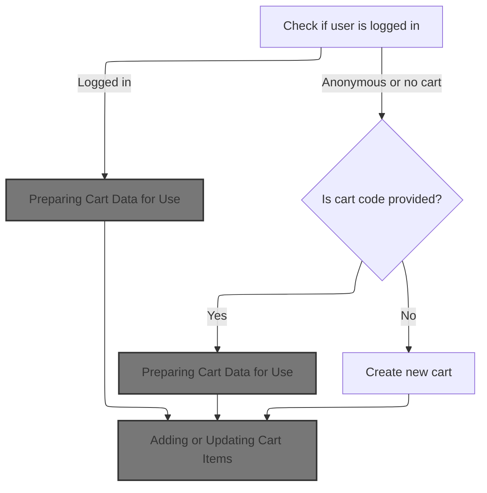

This document describes how users add items to their shopping cart, whether logged in or anonymous. The flow manages cart retrieval or creation, adds or updates items, recalculates totals, and returns the updated cart for display or further actions.

# Handling Cart Retrieval and Session State



<SwmSnippet path="/shopizer/sm-shop/src/main/java/com/salesmanager/web/shop/controller/shoppingCart/ShoppingCartController.java" line="131">

---

In <SwmToken path="shopizer/sm-shop/src/main/java/com/salesmanager/web/shop/controller/shoppingCart/ShoppingCartController.java" pos="131:3:3" line-data="	ShoppingCartData addShoppingCartItem(@RequestBody final ShoppingCartItem item, final HttpServletRequest request, final HttpServletResponse response, final Locale locale) throws Exception {">`addShoppingCartItem`</SwmToken>, we start by figuring out if the user is logged in and if there's already a cart for them. If not, we try to get a cart by code from the item itself. If that fails, we prep a new cart. This setup is needed before we can actually add anything, and that's why we call the facade next—to get the cart data in a consistent way, whether it's new or existing.

```java
	ShoppingCartData addShoppingCartItem(@RequestBody final ShoppingCartItem item, final HttpServletRequest request, final HttpServletResponse response, final Locale locale) throws Exception {


		ShoppingCartData shoppingCart=null;


		//Look in the HttpSession to see if a customer is logged in
	    MerchantStore store = getSessionAttribute(Constants.MERCHANT_STORE, request);
	    Language language = (Language)request.getAttribute(Constants.LANGUAGE);
	    Customer customer = getSessionAttribute(  Constants.CUSTOMER, request );


		if(customer != null) {
			com.salesmanager.core.business.shoppingcart.model.ShoppingCart customerCart = shoppingCartService.getByCustomer(customer);
			if(customerCart!=null) {
				shoppingCart = shoppingCartFacade.getShoppingCartData( customerCart);


				//TODO if shoppingCart != null ?? merge
				//TODO maybe they have the same code
				//TODO what if codes are different (-- merge carts, keep the latest one, delete the oldest, switch codes --)
			}
		}

		
```

---

</SwmSnippet>

## Preparing Cart Data for Use

<SwmSnippet path="/shopizer/sm-shop/src/main/java/com/salesmanager/web/shop/controller/shoppingCart/facade/ShoppingCartFacadeImpl.java" line="311">

---

<SwmToken path="shopizer/sm-shop/src/main/java/com/salesmanager/web/shop/controller/shoppingCart/facade/ShoppingCartFacadeImpl.java" pos="311:5:5" line-data="    public ShoppingCartData getShoppingCartData( final ShoppingCart shoppingCartModel )">`getShoppingCartData`</SwmToken> just sets up the populator with calculation and pricing services, grabs the language and store from context, and then calls the populator to turn the cart model into a data object. We need to call the populator next because that's where the actual mapping and calculation happens.

```java
    public ShoppingCartData getShoppingCartData( final ShoppingCart shoppingCartModel )
        throws Exception
    {

        ShoppingCartDataPopulator shoppingCartDataPopulator = new ShoppingCartDataPopulator();
        shoppingCartDataPopulator.setShoppingCartCalculationService( shoppingCartCalculationService );
        shoppingCartDataPopulator.setPricingService( pricingService );
        Language language = (Language) getKeyValue( Constants.LANGUAGE );
        MerchantStore merchantStore = (MerchantStore) getKeyValue( Constants.MERCHANT_STORE );
        return shoppingCartDataPopulator.populate( shoppingCartModel, merchantStore, language );
    }
```

---

</SwmSnippet>

## Mapping Cart Model to Data Object

```mermaid
%%{init: {"flowchart": {"defaultRenderer": "elk"}} }%%
flowchart TD
    node1["Start populating shopping cart data"] --> node2{"Are there items in the cart?"}
    click node1 openCode "shopizer/sm-shop/src/main/java/com/salesmanager/web/populator/shoppingCart/ShoppingCartDataPopulator.java:73:76"
    node2 -->|"Yes"| node3["Build ShoppingCartItems"]
    click node2 openCode "shopizer/sm-shop/src/main/java/com/salesmanager/web/populator/shoppingCart/ShoppingCartDataPopulator.java:81:82"
    node2 -->|"No"| node4["Continue to totals"]
    click node4 openCode "shopizer/sm-shop/src/main/java/com/salesmanager/web/populator/shoppingCart/ShoppingCartDataPopulator.java:129:130"

    subgraph loop1["For each item in cart"]
        node3 --> node5["Set product details, price, quantity"]
        click node5 openCode "shopizer/sm-shop/src/main/java/com/salesmanager/web/populator/shoppingCart/ShoppingCartDataPopulator.java:85:101"
        node5 --> node6{"Does item have attributes?"}
        click node6 openCode "shopizer/sm-shop/src/main/java/com/salesmanager/web/populator/shoppingCart/ShoppingCartDataPopulator.java:107:108"
        node6 -->|"Yes"| node7["Build ShoppingCartAttributes"]
        click node7 openCode "shopizer/sm-shop/src/main/java/com/salesmanager/web/populator/shoppingCart/ShoppingCartDataPopulator.java:109:125"
        subgraph loop2["For each attribute in item"]
            node7 --> node19["Set attribute details"]
            click node19 openCode "shopizer/sm-shop/src/main/java/com/salesmanager/web/populator/shoppingCart/ShoppingCartDataPopulator.java:111:122"
        end
        node6 -->|"No"| node8["Continue"]
        click node8 openCode "shopizer/sm-shop/src/main/java/com/salesmanager/web/populator/shoppingCart/ShoppingCartDataPopulator.java:126:127"
        node7 --> node8
        node8 --> node9{"Does item have image?"}
        click node9 openCode "shopizer/sm-shop/src/main/java/com/salesmanager/web/populator/shoppingCart/ShoppingCartDataPopulator.java:102:106"
        node9 -->|"Yes"| node10["Set product image"]
        click node10 openCode "shopizer/sm-shop/src/main/java/com/salesmanager/web/populator/shoppingCart/ShoppingCartDataPopulator.java:104:105"
        node9 -->|"No"| node11["Continue"]
        click node11 openCode "shopizer/sm-shop/src/main/java/com/salesmanager/web/populator/shoppingCart/ShoppingCartDataPopulator.java:106:107"
        node10 --> node11
        node11 --> node12["Add item to cart display list"]
        click node12 openCode "shopizer/sm-shop/src/main/java/com/salesmanager/web/populator/shoppingCart/ShoppingCartDataPopulator.java:126:127"
    end

    node3 --> node13["Calculate order summary"]
    click node13 openCode "shopizer/sm-shop/src/main/java/com/salesmanager/web/populator/shoppingCart/ShoppingCartDataPopulator.java:133:137"
    node4 --> node13
    node13 --> node14{"Are there order totals?"}
    click node14 openCode "shopizer/sm-shop/src/main/java/com/salesmanager/web/populator/shoppingCart/ShoppingCartDataPopulator.java:139:140"
    node14 -->|"Yes"| node15["Build OrderTotal list"]
    click node15 openCode "shopizer/sm-shop/src/main/java/com/salesmanager/web/populator/shoppingCart/ShoppingCartDataPopulator.java:141:146"
    subgraph loop3["For each order total"]
        node15 --> node20["Set order total details"]
        click node20 openCode "shopizer/sm-shop/src/main/java/com/salesmanager/web/populator/shoppingCart/ShoppingCartDataPopulator.java:143:145"
    end
    node14 -->|"No"| node16["Continue"]
    click node16 openCode "shopizer/sm-shop/src/main/java/com/salesmanager/web/populator/shoppingCart/ShoppingCartDataPopulator.java:147:148"

    node15 --> node17["Set cart totals and quantities"]
    click node17 openCode "shopizer/sm-shop/src/main/java/com/salesmanager/web/populator/shoppingCart/ShoppingCartDataPopulator.java:150:153"
    node16 --> node17
    node17 --> node18["Return populated cart data"]
    click node18 openCode "shopizer/sm-shop/src/main/java/com/salesmanager/web/populator/shoppingCart/ShoppingCartDataPopulator.java:159:160"

classDef HeadingStyle fill:#777777,stroke:#333,stroke-width:2px;

%% Swimm:
%% %%{init: {"flowchart": {"defaultRenderer": "elk"}} }%%
%% flowchart TD
%%     node1["Start populating shopping cart data"] --> node2{"Are there items in the cart?"}
%%     click node1 openCode "<SwmPath>[shopizer/…/shoppingCart/ShoppingCartDataPopulator.java](shopizer/sm-shop/src/main/java/com/salesmanager/web/populator/shoppingCart/ShoppingCartDataPopulator.java)</SwmPath>:73:76"
%%     node2 -->|"Yes"| node3["Build ShoppingCartItems"]
%%     click node2 openCode "<SwmPath>[shopizer/…/shoppingCart/ShoppingCartDataPopulator.java](shopizer/sm-shop/src/main/java/com/salesmanager/web/populator/shoppingCart/ShoppingCartDataPopulator.java)</SwmPath>:81:82"
%%     node2 -->|"No"| node4["Continue to totals"]
%%     click node4 openCode "<SwmPath>[shopizer/…/shoppingCart/ShoppingCartDataPopulator.java](shopizer/sm-shop/src/main/java/com/salesmanager/web/populator/shoppingCart/ShoppingCartDataPopulator.java)</SwmPath>:129:130"
%% 
%%     subgraph loop1["For each item in cart"]
%%         node3 --> node5["Set product details, price, quantity"]
%%         click node5 openCode "<SwmPath>[shopizer/…/shoppingCart/ShoppingCartDataPopulator.java](shopizer/sm-shop/src/main/java/com/salesmanager/web/populator/shoppingCart/ShoppingCartDataPopulator.java)</SwmPath>:85:101"
%%         node5 --> node6{"Does item have attributes?"}
%%         click node6 openCode "<SwmPath>[shopizer/…/shoppingCart/ShoppingCartDataPopulator.java](shopizer/sm-shop/src/main/java/com/salesmanager/web/populator/shoppingCart/ShoppingCartDataPopulator.java)</SwmPath>:107:108"
%%         node6 -->|"Yes"| node7["Build ShoppingCartAttributes"]
%%         click node7 openCode "<SwmPath>[shopizer/…/shoppingCart/ShoppingCartDataPopulator.java](shopizer/sm-shop/src/main/java/com/salesmanager/web/populator/shoppingCart/ShoppingCartDataPopulator.java)</SwmPath>:109:125"
%%         subgraph loop2["For each attribute in item"]
%%             node7 --> node19["Set attribute details"]
%%             click node19 openCode "<SwmPath>[shopizer/…/shoppingCart/ShoppingCartDataPopulator.java](shopizer/sm-shop/src/main/java/com/salesmanager/web/populator/shoppingCart/ShoppingCartDataPopulator.java)</SwmPath>:111:122"
%%         end
%%         node6 -->|"No"| node8["Continue"]
%%         click node8 openCode "<SwmPath>[shopizer/…/shoppingCart/ShoppingCartDataPopulator.java](shopizer/sm-shop/src/main/java/com/salesmanager/web/populator/shoppingCart/ShoppingCartDataPopulator.java)</SwmPath>:126:127"
%%         node7 --> node8
%%         node8 --> node9{"Does item have image?"}
%%         click node9 openCode "<SwmPath>[shopizer/…/shoppingCart/ShoppingCartDataPopulator.java](shopizer/sm-shop/src/main/java/com/salesmanager/web/populator/shoppingCart/ShoppingCartDataPopulator.java)</SwmPath>:102:106"
%%         node9 -->|"Yes"| node10["Set product image"]
%%         click node10 openCode "<SwmPath>[shopizer/…/shoppingCart/ShoppingCartDataPopulator.java](shopizer/sm-shop/src/main/java/com/salesmanager/web/populator/shoppingCart/ShoppingCartDataPopulator.java)</SwmPath>:104:105"
%%         node9 -->|"No"| node11["Continue"]
%%         click node11 openCode "<SwmPath>[shopizer/…/shoppingCart/ShoppingCartDataPopulator.java](shopizer/sm-shop/src/main/java/com/salesmanager/web/populator/shoppingCart/ShoppingCartDataPopulator.java)</SwmPath>:106:107"
%%         node10 --> node11
%%         node11 --> node12["Add item to cart display list"]
%%         click node12 openCode "<SwmPath>[shopizer/…/shoppingCart/ShoppingCartDataPopulator.java](shopizer/sm-shop/src/main/java/com/salesmanager/web/populator/shoppingCart/ShoppingCartDataPopulator.java)</SwmPath>:126:127"
%%     end
%% 
%%     node3 --> node13["Calculate order summary"]
%%     click node13 openCode "<SwmPath>[shopizer/…/shoppingCart/ShoppingCartDataPopulator.java](shopizer/sm-shop/src/main/java/com/salesmanager/web/populator/shoppingCart/ShoppingCartDataPopulator.java)</SwmPath>:133:137"
%%     node4 --> node13
%%     node13 --> node14{"Are there order totals?"}
%%     click node14 openCode "<SwmPath>[shopizer/…/shoppingCart/ShoppingCartDataPopulator.java](shopizer/sm-shop/src/main/java/com/salesmanager/web/populator/shoppingCart/ShoppingCartDataPopulator.java)</SwmPath>:139:140"
%%     node14 -->|"Yes"| node15["Build <SwmToken path="shopizer/sm-shop/src/main/java/com/salesmanager/web/populator/shoppingCart/ShoppingCartDataPopulator.java" pos="140:3:3" line-data="            	List&lt;OrderTotal&gt; totals = new ArrayList&lt;OrderTotal&gt;();">`OrderTotal`</SwmToken> list"]
%%     click node15 openCode "<SwmPath>[shopizer/…/shoppingCart/ShoppingCartDataPopulator.java](shopizer/sm-shop/src/main/java/com/salesmanager/web/populator/shoppingCart/ShoppingCartDataPopulator.java)</SwmPath>:141:146"
%%     subgraph loop3["For each order total"]
%%         node15 --> node20["Set order total details"]
%%         click node20 openCode "<SwmPath>[shopizer/…/shoppingCart/ShoppingCartDataPopulator.java](shopizer/sm-shop/src/main/java/com/salesmanager/web/populator/shoppingCart/ShoppingCartDataPopulator.java)</SwmPath>:143:145"
%%     end
%%     node14 -->|"No"| node16["Continue"]
%%     click node16 openCode "<SwmPath>[shopizer/…/shoppingCart/ShoppingCartDataPopulator.java](shopizer/sm-shop/src/main/java/com/salesmanager/web/populator/shoppingCart/ShoppingCartDataPopulator.java)</SwmPath>:147:148"
%% 
%%     node15 --> node17["Set cart totals and quantities"]
%%     click node17 openCode "<SwmPath>[shopizer/…/shoppingCart/ShoppingCartDataPopulator.java](shopizer/sm-shop/src/main/java/com/salesmanager/web/populator/shoppingCart/ShoppingCartDataPopulator.java)</SwmPath>:150:153"
%%     node16 --> node17
%%     node17 --> node18["Return populated cart data"]
%%     click node18 openCode "<SwmPath>[shopizer/…/shoppingCart/ShoppingCartDataPopulator.java](shopizer/sm-shop/src/main/java/com/salesmanager/web/populator/shoppingCart/ShoppingCartDataPopulator.java)</SwmPath>:159:160"
%% 
%% classDef HeadingStyle fill:#777777,stroke:#333,stroke-width:2px;
```



<SwmSnippet path="/shopizer/sm-shop/src/main/java/com/salesmanager/web/populator/shoppingCart/ShoppingCartDataPopulator.java" line="73">

---

We map each cart line item to a data object, including product details and attributes, and get ready for totals calculation.

```java
    public ShoppingCartData populate(final ShoppingCart shoppingCart,
                                     final ShoppingCartData cart, final MerchantStore store, final Language language) {

    	int cartQuantity = 0;
        cart.setCode(shoppingCart.getShoppingCartCode());
        Set<com.salesmanager.core.business.shoppingcart.model.ShoppingCartItem> items = shoppingCart.getLineItems();
        List<ShoppingCartItem> shoppingCartItemsList=Collections.emptyList();
        try{
            if(items!=null) {
                shoppingCartItemsList=new ArrayList<ShoppingCartItem>();
                for(com.salesmanager.core.business.shoppingcart.model.ShoppingCartItem item : items) {

                    ShoppingCartItem shoppingCartItem = new ShoppingCartItem();
                    shoppingCartItem.setCode(cart.getCode());
                    shoppingCartItem.setProductCode(item.getProduct().getSku());
                    shoppingCartItem.setProductVirtual(item.isProductVirtual());

                    shoppingCartItem.setProductId(item.getProductId());
                    shoppingCartItem.setId(item.getId());
                    shoppingCartItem.setName(item.getProduct().getProductDescription().getName());

                    shoppingCartItem.setPrice(pricingService.getDisplayAmount(item.getItemPrice(),store));
                    shoppingCartItem.setQuantity(item.getQuantity());
                    
                    
                    cartQuantity = cartQuantity + item.getQuantity();
                    
                    shoppingCartItem.setProductPrice(item.getItemPrice());
                    shoppingCartItem.setSubTotal(pricingService.getDisplayAmount(item.getSubTotal(), store));
                    ProductImage image = item.getProduct().getProductImage();
                    if(image!=null) {
                        String imagePath = ImageFilePathUtils.buildProductImageFilePath(store, item.getProduct().getSku(), image.getProductImage());
                        shoppingCartItem.setImage(imagePath);
                    }
                    Set<com.salesmanager.core.business.shoppingcart.model.ShoppingCartAttributeItem> attributes = item.getAttributes();
                    if(attributes!=null) {
                        List<ShoppingCartAttribute> cartAttributes = new ArrayList<ShoppingCartAttribute>();
                        for(com.salesmanager.core.business.shoppingcart.model.ShoppingCartAttributeItem attribute : attributes) {
                            ShoppingCartAttribute cartAttribute = new ShoppingCartAttribute();
                            cartAttribute.setId(attribute.getId());
                            cartAttribute.setAttributeId(attribute.getProductAttributeId());
                            cartAttribute.setOptionId(attribute.getProductAttribute().getProductOption().getId());
                            cartAttribute.setOptionValueId(attribute.getProductAttribute().getProductOptionValue().getId());
                            List<ProductOptionDescription> optionDescriptions = attribute.getProductAttribute().getProductOption().getDescriptionsSettoList();
                            List<ProductOptionValueDescription> optionValueDescriptions = attribute.getProductAttribute().getProductOptionValue().getDescriptionsSettoList();
                            if(!CollectionUtils.isEmpty(optionDescriptions) && !CollectionUtils.isEmpty(optionValueDescriptions)) {
                            	cartAttribute.setOptionName(optionDescriptions.get(0).getName());
                            	cartAttribute.setOptionValue(optionValueDescriptions.get(0).getName());
                            	cartAttributes.add(cartAttribute);
                            }
                        }
                        shoppingCartItem.setShoppingCartAttributes(cartAttributes);
                    }
                    shoppingCartItemsList.add(shoppingCartItem);
                }
```

---

</SwmSnippet>

<SwmSnippet path="/shopizer/sm-shop/src/main/java/com/salesmanager/web/populator/shoppingCart/ShoppingCartDataPopulator.java" line="129">

---

After building the item list, we attach it to the cart if it's not empty, then prep an order summary and run the calculation service to get up-to-date totals. We map those totals into the cart data, so the next step can use the latest pricing.

```java
            if(CollectionUtils.isNotEmpty(shoppingCartItemsList)){
                cart.setShoppingCartItems(shoppingCartItemsList);
            }

            OrderSummary summary = new OrderSummary();
            List<com.salesmanager.core.business.shoppingcart.model.ShoppingCartItem> productsList = new ArrayList<com.salesmanager.core.business.shoppingcart.model.ShoppingCartItem>();
            productsList.addAll(shoppingCart.getLineItems());
            summary.setProducts(productsList);
            OrderTotalSummary orderSummary = shoppingCartCalculationService.calculate(shoppingCart,store, language );

            if(CollectionUtils.isNotEmpty(orderSummary.getTotals())) {
            	List<OrderTotal> totals = new ArrayList<OrderTotal>();
            	for(com.salesmanager.core.business.order.model.OrderTotal t : orderSummary.getTotals()) {
            		OrderTotal total = new OrderTotal();
            		total.setCode(t.getOrderTotalCode());
            		total.setValue(t.getValue());
            		totals.add(total);
            	}
```

---

</SwmSnippet>

<SwmSnippet path="/shopizer/sm-shop/src/main/java/com/salesmanager/web/populator/shoppingCart/ShoppingCartDataPopulator.java" line="147">

---

Finally, we set the totals, subtotal, total, quantity, and cart ID on the cart data, then return it. This object is now ready for the UI or API response, with all calculations and mappings done.

```java
            	cart.setTotals(totals);
            }
            
            cart.setSubTotal(pricingService.getDisplayAmount(orderSummary.getSubTotal(), store));
            cart.setTotal(pricingService.getDisplayAmount(orderSummary.getTotal(), store));
            cart.setQuantity(cartQuantity);
            cart.setId(shoppingCart.getId());
        }
        catch(ServiceException ex){
            LOG.error( "Error while converting cart Model to cart Data.."+ex );
            throw new ConversionException( "Unable to create cart data", ex );
        }
        return cart;


    };
```

---

</SwmSnippet>

## Fallback Cart Retrieval and Item Addition

```mermaid
%%{init: {"flowchart": {"defaultRenderer": "elk"}} }%%
flowchart TD
  node1["Start: Add item to cart"] --> node2{"Does shopping cart exist?"}
  click node1 openCode "shopizer/sm-shop/src/main/java/com/salesmanager/web/shop/controller/shoppingCart/ShoppingCartController.java:157:157"
  node2 -->|"Yes"| node6["Add item to cart"]
  click node2 openCode "shopizer/sm-shop/src/main/java/com/salesmanager/web/shop/controller/shoppingCart/ShoppingCartController.java:157:157"
  node2 -->|"No"| node3{"Is item code provided?"}
  click node3 openCode "shopizer/sm-shop/src/main/java/com/salesmanager/web/shop/controller/shoppingCart/ShoppingCartController.java:157:158"
  node3 -->|"Yes"| node4["Retrieve cart by code"]
  click node4 openCode "shopizer/sm-shop/src/main/java/com/salesmanager/web/shop/controller/shoppingCart/ShoppingCartController.java:158:159"
  node3 -->|"No"| node5["Create new cart and assign code"]
  click node5 openCode "shopizer/sm-shop/src/main/java/com/salesmanager/web/shop/controller/shoppingCart/ShoppingCartController.java:163:167"
  node4 --> node7{"Was cart found?"}
  click node7 openCode "shopizer/sm-shop/src/main/java/com/salesmanager/web/shop/controller/shoppingCart/ShoppingCartController.java:159:163"
  node7 -->|"Yes"| node6
  node7 -->|"No"| node5
  node5 --> node6
  node6["Add item to cart"]
  click node6 openCode "shopizer/sm-shop/src/main/java/com/salesmanager/web/shop/controller/shoppingCart/ShoppingCartController.java:169:169"
classDef HeadingStyle fill:#777777,stroke:#333,stroke-width:2px;

%% Swimm:
%% %%{init: {"flowchart": {"defaultRenderer": "elk"}} }%%
%% flowchart TD
%%   node1["Start: Add item to cart"] --> node2{"Does shopping cart exist?"}
%%   click node1 openCode "<SwmPath>[shopizer/…/shoppingCart/ShoppingCartController.java](shopizer/sm-shop/src/main/java/com/salesmanager/web/shop/controller/shoppingCart/ShoppingCartController.java)</SwmPath>:157:157"
%%   node2 -->|"Yes"| node6["Add item to cart"]
%%   click node2 openCode "<SwmPath>[shopizer/…/shoppingCart/ShoppingCartController.java](shopizer/sm-shop/src/main/java/com/salesmanager/web/shop/controller/shoppingCart/ShoppingCartController.java)</SwmPath>:157:157"
%%   node2 -->|"No"| node3{"Is item code provided?"}
%%   click node3 openCode "<SwmPath>[shopizer/…/shoppingCart/ShoppingCartController.java](shopizer/sm-shop/src/main/java/com/salesmanager/web/shop/controller/shoppingCart/ShoppingCartController.java)</SwmPath>:157:158"
%%   node3 -->|"Yes"| node4["Retrieve cart by code"]
%%   click node4 openCode "<SwmPath>[shopizer/…/shoppingCart/ShoppingCartController.java](shopizer/sm-shop/src/main/java/com/salesmanager/web/shop/controller/shoppingCart/ShoppingCartController.java)</SwmPath>:158:159"
%%   node3 -->|"No"| node5["Create new cart and assign code"]
%%   click node5 openCode "<SwmPath>[shopizer/…/shoppingCart/ShoppingCartController.java](shopizer/sm-shop/src/main/java/com/salesmanager/web/shop/controller/shoppingCart/ShoppingCartController.java)</SwmPath>:163:167"
%%   node4 --> node7{"Was cart found?"}
%%   click node7 openCode "<SwmPath>[shopizer/…/shoppingCart/ShoppingCartController.java](shopizer/sm-shop/src/main/java/com/salesmanager/web/shop/controller/shoppingCart/ShoppingCartController.java)</SwmPath>:159:163"
%%   node7 -->|"Yes"| node6
%%   node7 -->|"No"| node5
%%   node5 --> node6
%%   node6["Add item to cart"]
%%   click node6 openCode "<SwmPath>[shopizer/…/shoppingCart/ShoppingCartController.java](shopizer/sm-shop/src/main/java/com/salesmanager/web/shop/controller/shoppingCart/ShoppingCartController.java)</SwmPath>:169:169"
%% classDef HeadingStyle fill:#777777,stroke:#333,stroke-width:2px;
```



<SwmSnippet path="/shopizer/sm-shop/src/main/java/com/salesmanager/web/shop/controller/shoppingCart/ShoppingCartController.java" line="157">

---

Back in <SwmToken path="shopizer/sm-shop/src/main/java/com/salesmanager/web/shop/controller/shoppingCart/ShoppingCartController.java" pos="131:3:3" line-data="	ShoppingCartData addShoppingCartItem(@RequestBody final ShoppingCartItem item, final HttpServletRequest request, final HttpServletResponse response, final Locale locale) throws Exception {">`addShoppingCartItem`</SwmToken>, if we didn't get a cart from the previous step and the item has a code, we try to fetch the cart by code. If that's still a miss, we spin up a new cart with a unique code. Then we call the facade again to actually add the item to the cart, since that's where the logic for item addition and cart updates lives.

```java
		if(shoppingCart==null && !StringUtils.isBlank(item.getCode())) {
			shoppingCart = shoppingCartFacade.getShoppingCartData(item.getCode(), store);
		}


		//if shoppingCart is null create a new one
		if(shoppingCart==null) {
			shoppingCart = new ShoppingCartData();
			String code = UUID.randomUUID().toString().replaceAll("-", "");
			shoppingCart.setCode(code);
		}

		shoppingCart=shoppingCartFacade.addItemsToShoppingCart( shoppingCart, item, store,language,customer );
```

---

</SwmSnippet>

## Adding or Updating Cart Items

```mermaid
%%{init: {"flowchart": {"defaultRenderer": "elk"}} }%%
flowchart TD
    node1["Start: Add item to cart"] --> node2{"Is cart code provided?"}
    click node1 openCode "shopizer/sm-shop/src/main/java/com/salesmanager/web/shop/controller/shoppingCart/facade/ShoppingCartFacadeImpl.java:92:97"
    node2 -->|"Yes"| node3["Retrieve cart by code"]
    click node2 openCode "shopizer/sm-shop/src/main/java/com/salesmanager/web/shop/controller/shoppingCart/facade/ShoppingCartFacadeImpl.java:98:101"
    node2 -->|"No"| node4["Create new cart"]
    click node4 openCode "shopizer/sm-shop/src/main/java/com/salesmanager/web/shop/controller/shoppingCart/facade/ShoppingCartFacadeImpl.java:104:115"
    node3 --> node5["Create cart item"]
    click node3 openCode "shopizer/sm-shop/src/main/java/com/salesmanager/web/shop/controller/shoppingCart/facade/ShoppingCartFacadeImpl.java:117:118"
    node4 --> node5
    
    subgraph loop1["For each item in cart"]
        node5 --> node6{"Is duplicate (same product, no attributes)?"}
        click node5 openCode "shopizer/sm-shop/src/main/java/com/salesmanager/web/shop/controller/shoppingCart/facade/ShoppingCartFacadeImpl.java:123:135"
        node6 -->|"Yes"| node7{"Is product virtual?"}
        click node6 openCode "shopizer/sm-shop/src/main/java/com/salesmanager/web/shop/controller/shoppingCart/facade/ShoppingCartFacadeImpl.java:128:129"
        node7 -->|"No"| node8["Increment quantity"]
        click node8 openCode "shopizer/sm-shop/src/main/java/com/salesmanager/web/shop/controller/shoppingCart/facade/ShoppingCartFacadeImpl.java:129:130"
        node7 -->|"Yes"| node9["Do not increment quantity"]
        click node9 openCode "shopizer/sm-shop/src/main/java/com/salesmanager/web/shop/controller/shoppingCart/facade/ShoppingCartFacadeImpl.java:130:131"
        node8 --> node10["Mark duplicate found"]
        node9 --> node10
        node10 --> node11["Break loop"]
        node11 --> node13
        node6 -->|"No"| node12["Continue to next item"]
        node12 --> node5
    end
    node5 --> node13{"Was duplicate found?"}
    click node13 openCode "shopizer/sm-shop/src/main/java/com/salesmanager/web/shop/controller/shoppingCart/facade/ShoppingCartFacadeImpl.java:139:141"
    node13 -->|"No"| node14["Add item as new line"]
    click node14 openCode "shopizer/sm-shop/src/main/java/com/salesmanager/web/shop/controller/shoppingCart/facade/ShoppingCartFacadeImpl.java:140:141"
    node13 -->|"Yes"| node15["Skip adding new item"]
    click node15 openCode "shopizer/sm-shop/src/main/java/com/salesmanager/web/shop/controller/shoppingCart/facade/ShoppingCartFacadeImpl.java:141:142"
    node14 --> node16["Update cart"]
    node15 --> node16
    click node16 openCode "shopizer/sm-shop/src/main/java/com/salesmanager/web/shop/controller/shoppingCart/facade/ShoppingCartFacadeImpl.java:144:147"
    node16 --> node17["Recalculate totals"]
    click node17 openCode "shopizer/sm-shop/src/main/java/com/salesmanager/web/shop/controller/shoppingCart/facade/ShoppingCartFacadeImpl.java:149:149"
    node17 --> node18["Return refreshed cart data"]
    click node18 openCode "shopizer/sm-shop/src/main/java/com/salesmanager/web/shop/controller/shoppingCart/facade/ShoppingCartFacadeImpl.java:155:156"

classDef HeadingStyle fill:#777777,stroke:#333,stroke-width:2px;

%% Swimm:
%% %%{init: {"flowchart": {"defaultRenderer": "elk"}} }%%
%% flowchart TD
%%     node1["Start: Add item to cart"] --> node2{"Is cart code provided?"}
%%     click node1 openCode "<SwmPath>[shopizer/…/facade/ShoppingCartFacadeImpl.java](shopizer/sm-shop/src/main/java/com/salesmanager/web/shop/controller/shoppingCart/facade/ShoppingCartFacadeImpl.java)</SwmPath>:92:97"
%%     node2 -->|"Yes"| node3["Retrieve cart by code"]
%%     click node2 openCode "<SwmPath>[shopizer/…/facade/ShoppingCartFacadeImpl.java](shopizer/sm-shop/src/main/java/com/salesmanager/web/shop/controller/shoppingCart/facade/ShoppingCartFacadeImpl.java)</SwmPath>:98:101"
%%     node2 -->|"No"| node4["Create new cart"]
%%     click node4 openCode "<SwmPath>[shopizer/…/facade/ShoppingCartFacadeImpl.java](shopizer/sm-shop/src/main/java/com/salesmanager/web/shop/controller/shoppingCart/facade/ShoppingCartFacadeImpl.java)</SwmPath>:104:115"
%%     node3 --> node5["Create cart item"]
%%     click node3 openCode "<SwmPath>[shopizer/…/facade/ShoppingCartFacadeImpl.java](shopizer/sm-shop/src/main/java/com/salesmanager/web/shop/controller/shoppingCart/facade/ShoppingCartFacadeImpl.java)</SwmPath>:117:118"
%%     node4 --> node5
%%     
%%     subgraph loop1["For each item in cart"]
%%         node5 --> node6{"Is duplicate (same product, no attributes)?"}
%%         click node5 openCode "<SwmPath>[shopizer/…/facade/ShoppingCartFacadeImpl.java](shopizer/sm-shop/src/main/java/com/salesmanager/web/shop/controller/shoppingCart/facade/ShoppingCartFacadeImpl.java)</SwmPath>:123:135"
%%         node6 -->|"Yes"| node7{"Is product virtual?"}
%%         click node6 openCode "<SwmPath>[shopizer/…/facade/ShoppingCartFacadeImpl.java](shopizer/sm-shop/src/main/java/com/salesmanager/web/shop/controller/shoppingCart/facade/ShoppingCartFacadeImpl.java)</SwmPath>:128:129"
%%         node7 -->|"No"| node8["Increment quantity"]
%%         click node8 openCode "<SwmPath>[shopizer/…/facade/ShoppingCartFacadeImpl.java](shopizer/sm-shop/src/main/java/com/salesmanager/web/shop/controller/shoppingCart/facade/ShoppingCartFacadeImpl.java)</SwmPath>:129:130"
%%         node7 -->|"Yes"| node9["Do not increment quantity"]
%%         click node9 openCode "<SwmPath>[shopizer/…/facade/ShoppingCartFacadeImpl.java](shopizer/sm-shop/src/main/java/com/salesmanager/web/shop/controller/shoppingCart/facade/ShoppingCartFacadeImpl.java)</SwmPath>:130:131"
%%         node8 --> node10["Mark duplicate found"]
%%         node9 --> node10
%%         node10 --> node11["Break loop"]
%%         node11 --> node13
%%         node6 -->|"No"| node12["Continue to next item"]
%%         node12 --> node5
%%     end
%%     node5 --> node13{"Was duplicate found?"}
%%     click node13 openCode "<SwmPath>[shopizer/…/facade/ShoppingCartFacadeImpl.java](shopizer/sm-shop/src/main/java/com/salesmanager/web/shop/controller/shoppingCart/facade/ShoppingCartFacadeImpl.java)</SwmPath>:139:141"
%%     node13 -->|"No"| node14["Add item as new line"]
%%     click node14 openCode "<SwmPath>[shopizer/…/facade/ShoppingCartFacadeImpl.java](shopizer/sm-shop/src/main/java/com/salesmanager/web/shop/controller/shoppingCart/facade/ShoppingCartFacadeImpl.java)</SwmPath>:140:141"
%%     node13 -->|"Yes"| node15["Skip adding new item"]
%%     click node15 openCode "<SwmPath>[shopizer/…/facade/ShoppingCartFacadeImpl.java](shopizer/sm-shop/src/main/java/com/salesmanager/web/shop/controller/shoppingCart/facade/ShoppingCartFacadeImpl.java)</SwmPath>:141:142"
%%     node14 --> node16["Update cart"]
%%     node15 --> node16
%%     click node16 openCode "<SwmPath>[shopizer/…/facade/ShoppingCartFacadeImpl.java](shopizer/sm-shop/src/main/java/com/salesmanager/web/shop/controller/shoppingCart/facade/ShoppingCartFacadeImpl.java)</SwmPath>:144:147"
%%     node16 --> node17["Recalculate totals"]
%%     click node17 openCode "<SwmPath>[shopizer/…/facade/ShoppingCartFacadeImpl.java](shopizer/sm-shop/src/main/java/com/salesmanager/web/shop/controller/shoppingCart/facade/ShoppingCartFacadeImpl.java)</SwmPath>:149:149"
%%     node17 --> node18["Return refreshed cart data"]
%%     click node18 openCode "<SwmPath>[shopizer/…/facade/ShoppingCartFacadeImpl.java](shopizer/sm-shop/src/main/java/com/salesmanager/web/shop/controller/shoppingCart/facade/ShoppingCartFacadeImpl.java)</SwmPath>:155:156"
%% 
%% classDef HeadingStyle fill:#777777,stroke:#333,stroke-width:2px;
```



<SwmSnippet path="/shopizer/sm-shop/src/main/java/com/salesmanager/web/shop/controller/shoppingCart/facade/ShoppingCartFacadeImpl.java" line="92">

---

In <SwmToken path="shopizer/sm-shop/src/main/java/com/salesmanager/web/shop/controller/shoppingCart/facade/ShoppingCartFacadeImpl.java" pos="92:5:5" line-data="    public ShoppingCartData addItemsToShoppingCart( final ShoppingCartData shoppingCartData,">`addItemsToShoppingCart`</SwmToken>, we either fetch or create the cart model, then check if the item is a duplicate (same product, no attributes). If so, we just bump the quantity. If not, we'll add it as a new line item. This keeps the cart from filling up with redundant entries.

```java
    public ShoppingCartData addItemsToShoppingCart( final ShoppingCartData shoppingCartData,
                                                    final ShoppingCartItem item, final MerchantStore store, final Language language,final Customer customer )
        throws Exception
    {

        ShoppingCart cartModel = null;
        if ( !StringUtils.isBlank( item.getCode() ) )
        {
            // get it from the db
            cartModel = getShoppingCartModel( item.getCode(), store );
            if ( cartModel == null )
            {
                cartModel = createCartModel( shoppingCartData.getCode(), store,customer );
            }

        }

        if ( cartModel == null )
        {

            final String shoppingCartCode =
                StringUtils.isNotBlank( shoppingCartData.getCode() ) ? shoppingCartData.getCode() : null;
            cartModel = createCartModel( shoppingCartCode, store,customer );

        }
        com.salesmanager.core.business.shoppingcart.model.ShoppingCartItem shoppingCartItem =
            createCartItem( cartModel, item, store );
        
        boolean duplicateFound = false;
        if(CollectionUtils.isEmpty(item.getShoppingCartAttributes())) {//increment quantity
        	//get duplicate item from the cart
        	Set<com.salesmanager.core.business.shoppingcart.model.ShoppingCartItem> cartModelItems = cartModel.getLineItems();
        	for(com.salesmanager.core.business.shoppingcart.model.ShoppingCartItem cartItem : cartModelItems) {
        		if(cartItem.getProduct().getId().longValue()==shoppingCartItem.getProduct().getId().longValue()) {
        			if(CollectionUtils.isEmpty(cartItem.getAttributes())) {
        				if(!duplicateFound) {
        					if(!shoppingCartItem.isProductVirtual()) {
	        					cartItem.setQuantity(cartItem.getQuantity() + shoppingCartItem.getQuantity());
        					}
        					duplicateFound = true;
        					break;
        				}
        			}
        		}
        	}
```

---

</SwmSnippet>

<SwmSnippet path="/shopizer/sm-shop/src/main/java/com/salesmanager/web/shop/controller/shoppingCart/facade/ShoppingCartFacadeImpl.java" line="139">

---

If the item wasn't a duplicate, we add it to the cart, save the cart, refresh it from the DB, and recalculate totals. Then we use the populator again to turn the updated cart model into a data object for the response.

```java
        if(!duplicateFound) {
        	cartModel.getLineItems().add( shoppingCartItem );
        }
        
        /** Update cart in database with line items **/
        shoppingCartService.saveOrUpdate( cartModel );

        //refresh cart
        cartModel = shoppingCartService.getById(cartModel.getId(), store);

        shoppingCartCalculationService.calculate( cartModel, store, language );

        ShoppingCartDataPopulator shoppingCartDataPopulator = new ShoppingCartDataPopulator();
        shoppingCartDataPopulator.setShoppingCartCalculationService( shoppingCartCalculationService );
        shoppingCartDataPopulator.setPricingService( pricingService );

        return shoppingCartDataPopulator.populate( cartModel, store, language );
    }
```

---

</SwmSnippet>

## Session Update and Final Response

```mermaid
%%{init: {"flowchart": {"defaultRenderer": "elk"}} }%%
flowchart TD
    node1["User adds item to shopping cart"]
    click node1 openCode "shopizer/sm-shop/src/main/java/com/salesmanager/web/shop/controller/shoppingCart/ShoppingCartController.java:170:171"
    node1 --> node2{"Is user logged in?"}
    click node2 openCode "shopizer/sm-shop/src/main/java/com/salesmanager/web/shop/controller/shoppingCart/ShoppingCartController.java:176:177"
    node2 -->|"Yes"| node3{"Is cart available?"}
    node2 -->|"No"| node6{"Is cart available?"}
    click node3 openCode "shopizer/sm-shop/src/main/java/com/salesmanager/web/shop/controller/shoppingCart/ShoppingCartController.java:177:181"
    node3 -->|"No"| node4{"Is cart in database?"}
    node3 -->|"Yes"| node5["Add item to cart"]
    click node4 openCode "shopizer/sm-shop/src/main/java/com/salesmanager/web/shop/controller/shoppingCart/ShoppingCartController.java:178:180"
    node4 -->|"Yes"| node7["Add item to database cart, update session"]
    node4 -->|"No"| node8["Create new cart for user"]
    click node5 openCode "shopizer/sm-shop/src/main/java/com/salesmanager/web/shop/controller/shoppingCart/ShoppingCartController.java:181:181"
    click node7 openCode "shopizer/sm-shop/src/main/java/com/salesmanager/web/shop/controller/shoppingCart/ShoppingCartController.java:179:179"
    click node8 openCode "shopizer/sm-shop/src/main/java/com/salesmanager/web/shop/controller/shoppingCart/ShoppingCartController.java:180:180"
    node6 -->|"No"| node9["Create new cart"]
    node6 -->|"Yes"| node10["Add item to cart"]
    click node9 openCode "shopizer/sm-shop/src/main/java/com/salesmanager/web/shop/controller/shoppingCart/ShoppingCartController.java:184:184"
    click node10 openCode "shopizer/sm-shop/src/main/java/com/salesmanager/web/shop/controller/shoppingCart/ShoppingCartController.java:185:185"
    subgraph loop1["For each item in cart"]
        node11["Calculate and set item price using product attributes and discounts"]
        click node11 openCode "shopizer/sm-shop/src/main/java/com/salesmanager/web/shop/controller/shoppingCart/ShoppingCartController.java:198:202"
    end
    node5 --> node11
    node7 --> node11
    node8 --> node11
    node9 --> node11
    node10 --> node11
    node11 --> node12{"Did user just log in after adding items anonymously?"}
    click node12 openCode "shopizer/sm-shop/src/main/java/com/salesmanager/web/shop/controller/shoppingCart/ShoppingCartController.java:190:193"
    node12 -->|"Yes"| node13["Synchronize carts: database cart replaces session cart"]
    click node13 openCode "shopizer/sm-shop/src/main/java/com/salesmanager/web/shop/controller/shoppingCart/ShoppingCartController.java:192:193"
    node13 --> node11
    node12 -->|"No"| node14["Proceed with current cart"]
    click node14 openCode "shopizer/sm-shop/src/main/java/com/salesmanager/web/shop/controller/shoppingCart/ShoppingCartController.java:194:195"
    node14 --> node15["Create JSON response"]
    node11 --> node15
    click node15 openCode "shopizer/sm-shop/src/main/java/com/salesmanager/web/shop/controller/shoppingCart/ShoppingCartController.java:206:208"
    node15 --> node16["Return JSON cart response"]
    click node16 openCode "shopizer/sm-shop/src/main/java/com/salesmanager/web/shop/controller/shoppingCart/ShoppingCartController.java:214:215"
classDef HeadingStyle fill:#777777,stroke:#333,stroke-width:2px;

%% Swimm:
%% %%{init: {"flowchart": {"defaultRenderer": "elk"}} }%%
%% flowchart TD
%%     node1["User adds item to shopping cart"]
%%     click node1 openCode "<SwmPath>[shopizer/…/shoppingCart/ShoppingCartController.java](shopizer/sm-shop/src/main/java/com/salesmanager/web/shop/controller/shoppingCart/ShoppingCartController.java)</SwmPath>:170:171"
%%     node1 --> node2{"Is user logged in?"}
%%     click node2 openCode "<SwmPath>[shopizer/…/shoppingCart/ShoppingCartController.java](shopizer/sm-shop/src/main/java/com/salesmanager/web/shop/controller/shoppingCart/ShoppingCartController.java)</SwmPath>:176:177"
%%     node2 -->|"Yes"| node3{"Is cart available?"}
%%     node2 -->|"No"| node6{"Is cart available?"}
%%     click node3 openCode "<SwmPath>[shopizer/…/shoppingCart/ShoppingCartController.java](shopizer/sm-shop/src/main/java/com/salesmanager/web/shop/controller/shoppingCart/ShoppingCartController.java)</SwmPath>:177:181"
%%     node3 -->|"No"| node4{"Is cart in database?"}
%%     node3 -->|"Yes"| node5["Add item to cart"]
%%     click node4 openCode "<SwmPath>[shopizer/…/shoppingCart/ShoppingCartController.java](shopizer/sm-shop/src/main/java/com/salesmanager/web/shop/controller/shoppingCart/ShoppingCartController.java)</SwmPath>:178:180"
%%     node4 -->|"Yes"| node7["Add item to database cart, update session"]
%%     node4 -->|"No"| node8["Create new cart for user"]
%%     click node5 openCode "<SwmPath>[shopizer/…/shoppingCart/ShoppingCartController.java](shopizer/sm-shop/src/main/java/com/salesmanager/web/shop/controller/shoppingCart/ShoppingCartController.java)</SwmPath>:181:181"
%%     click node7 openCode "<SwmPath>[shopizer/…/shoppingCart/ShoppingCartController.java](shopizer/sm-shop/src/main/java/com/salesmanager/web/shop/controller/shoppingCart/ShoppingCartController.java)</SwmPath>:179:179"
%%     click node8 openCode "<SwmPath>[shopizer/…/shoppingCart/ShoppingCartController.java](shopizer/sm-shop/src/main/java/com/salesmanager/web/shop/controller/shoppingCart/ShoppingCartController.java)</SwmPath>:180:180"
%%     node6 -->|"No"| node9["Create new cart"]
%%     node6 -->|"Yes"| node10["Add item to cart"]
%%     click node9 openCode "<SwmPath>[shopizer/…/shoppingCart/ShoppingCartController.java](shopizer/sm-shop/src/main/java/com/salesmanager/web/shop/controller/shoppingCart/ShoppingCartController.java)</SwmPath>:184:184"
%%     click node10 openCode "<SwmPath>[shopizer/…/shoppingCart/ShoppingCartController.java](shopizer/sm-shop/src/main/java/com/salesmanager/web/shop/controller/shoppingCart/ShoppingCartController.java)</SwmPath>:185:185"
%%     subgraph loop1["For each item in cart"]
%%         node11["Calculate and set item price using product attributes and discounts"]
%%         click node11 openCode "<SwmPath>[shopizer/…/shoppingCart/ShoppingCartController.java](shopizer/sm-shop/src/main/java/com/salesmanager/web/shop/controller/shoppingCart/ShoppingCartController.java)</SwmPath>:198:202"
%%     end
%%     node5 --> node11
%%     node7 --> node11
%%     node8 --> node11
%%     node9 --> node11
%%     node10 --> node11
%%     node11 --> node12{"Did user just log in after adding items anonymously?"}
%%     click node12 openCode "<SwmPath>[shopizer/…/shoppingCart/ShoppingCartController.java](shopizer/sm-shop/src/main/java/com/salesmanager/web/shop/controller/shoppingCart/ShoppingCartController.java)</SwmPath>:190:193"
%%     node12 -->|"Yes"| node13["Synchronize carts: database cart replaces session cart"]
%%     click node13 openCode "<SwmPath>[shopizer/…/shoppingCart/ShoppingCartController.java](shopizer/sm-shop/src/main/java/com/salesmanager/web/shop/controller/shoppingCart/ShoppingCartController.java)</SwmPath>:192:193"
%%     node13 --> node11
%%     node12 -->|"No"| node14["Proceed with current cart"]
%%     click node14 openCode "<SwmPath>[shopizer/…/shoppingCart/ShoppingCartController.java](shopizer/sm-shop/src/main/java/com/salesmanager/web/shop/controller/shoppingCart/ShoppingCartController.java)</SwmPath>:194:195"
%%     node14 --> node15["Create JSON response"]
%%     node11 --> node15
%%     click node15 openCode "<SwmPath>[shopizer/…/shoppingCart/ShoppingCartController.java](shopizer/sm-shop/src/main/java/com/salesmanager/web/shop/controller/shoppingCart/ShoppingCartController.java)</SwmPath>:206:208"
%%     node15 --> node16["Return JSON cart response"]
%%     click node16 openCode "<SwmPath>[shopizer/…/shoppingCart/ShoppingCartController.java](shopizer/sm-shop/src/main/java/com/salesmanager/web/shop/controller/shoppingCart/ShoppingCartController.java)</SwmPath>:214:215"
%% classDef HeadingStyle fill:#777777,stroke:#333,stroke-width:2px;
```



<SwmSnippet path="/shopizer/sm-shop/src/main/java/com/salesmanager/web/shop/controller/shoppingCart/ShoppingCartController.java" line="170">

---

After coming back from the facade, we update the session with the latest cart code so the user's cart can be tracked in future requests. The rest is mostly comments and TODOs about edge cases like merging carts for users who log in after shopping anonymously. Finally, we return the updated cart data from <SwmToken path="shopizer/sm-shop/src/main/java/com/salesmanager/web/shop/controller/shoppingCart/ShoppingCartController.java" pos="131:3:3" line-data="	ShoppingCartData addShoppingCartItem(@RequestBody final ShoppingCartItem item, final HttpServletRequest request, final HttpServletResponse response, final Locale locale) throws Exception {">`addShoppingCartItem`</SwmToken>.

```java
		request.getSession().setAttribute(Constants.SHOPPING_CART, shoppingCart.getCode());


		/******************************************************/
		//TODO validate all of this

		//if a customer exists in http session
			//if a cart does not exist in httpsession
				//get cart from database
					//if a cart exist in the database add the item to the cart and put cart in httpsession and save to the database
					//else a cart does not exist in the database, create a new one, set the customer id, set the cart in the httpsession
			//else a cart exist in the httpsession, add item to httpsession cart and save to the database
		//else no customer in httpsession
			//if a cart does not exist in httpsession
				//create a new one, set the cart in the httpsession
			//else a cart exist in the httpsession, add item to httpsession cart and save to the database


		/**
		 * my concern is with the following :
		 * 	what if you add item in the shopping cart as an anonymous user
		 *  later on you log in to process with checkout but the system retrieves a previous shopping cart saved in the database for that customer
		 *  in that case we need to synchronize both carts and the original one (the one with the customer id) supercedes the current cart in session
		 *  the system will have to deal with the original one and remove the latest
		 */


		//**more implementation details
		//calculate the price of each item by using ProductPriceUtils in sm-core
		//for each product in the shopping cart get the product
		//invoke productPriceUtils.getFinalProductPrice
		//from FinalPrice get final price which is the calculated price given attributes and discounts
		//set each item price in ShoppingCartItem.price

		//add new item shoppingCartService.create

		//create JSON representation of the shopping cart

		//return the JSON structure in AjaxResponse

		

		//AjaxResponse resp = new AjaxResponse();
		//resp.setStatus(AjaxResponse.RESPONSE_STATUS_SUCCESS);
		return shoppingCart;

	}
```

---

</SwmSnippet>

&nbsp;

*This is an auto-generated document by Swimm 🌊 and has not yet been verified by a human*

<SwmMeta version="3.0.0" repo-id="Z2l0aHViJTNBJTNBU2hvcGl6ZXIlM0ElM0F1bWFsaW5nYXN3YW1p" repo-name="Shopizer"><sup>Powered by [Swimm](https://app.swimm.io/)</sup></SwmMeta>
