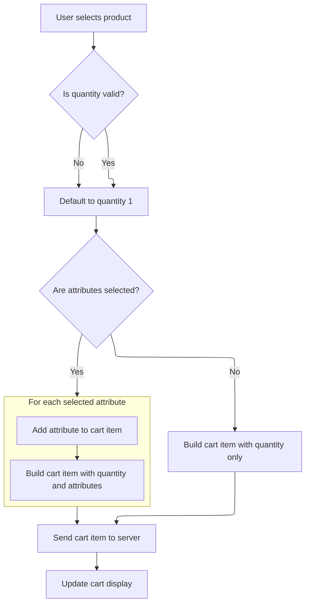

This document describes how users interact with cart-related UI elements to add products to their shopping cart and view the updated cart contents. The flow starts when a user clicks an add-to-cart button, triggering the process to build and send cart data to the backend. The cart display is refreshed to show the latest items and totals, and users can open the mini cart to view current cart contents.

# Wiring Up Cart UI Events

This section ensures that users can add products to their shopping cart by clicking designated UI elements. It governs the interaction between the user interface and the shopping cart functionality, ensuring that only products with valid identifiers can be added.

| Category        | Rule Name                      | Description                                                                                                                                                                                                                                                                                                                                                                                                                                      |
| --------------- | ------------------------------ | ------------------------------------------------------------------------------------------------------------------------------------------------------------------------------------------------------------------------------------------------------------------------------------------------------------------------------------------------------------------------------------------------------------------------------------------------ |
| Data validation | Eligible Cart Trigger Elements | Only UI elements with the <SwmToken path="shopizer/sm-shop/src/main/webapp/resources/js/shopping-cart.js" pos="33:5:5" line-data="		$(&quot;.addToCart&quot;).click(function(){">`addToCart`</SwmToken> class are eligible to trigger the add-to-cart action when clicked.                                                                                                                                                                         |
| Data validation | Product Identifier Requirement | Each <SwmToken path="shopizer/sm-shop/src/main/webapp/resources/js/shopping-cart.js" pos="33:5:5" line-data="		$(&quot;.addToCart&quot;).click(function(){">`addToCart`</SwmToken> button must have a valid <SwmToken path="shopizer/sm-shop/src/main/webapp/resources/js/shopping-cart.js" pos="34:11:11" line-data="			addToCart($(this).attr(&quot;productId&quot;));">`productId`</SwmToken> attribute to successfully add a product to the cart. |
| Business logic  | Cart Addition Trigger          | Clicking an eligible <SwmToken path="shopizer/sm-shop/src/main/webapp/resources/js/shopping-cart.js" pos="33:5:5" line-data="		$(&quot;.addToCart&quot;).click(function(){">`addToCart`</SwmToken> button initiates the process to add the corresponding product to the shopping cart.                                                                                                                                                             |

<SwmSnippet path="/shopizer/sm-shop/src/main/webapp/resources/js/shopping-cart.js" line="30">

---

In <SwmToken path="shopizer/sm-shop/src/main/webapp/resources/js/shopping-cart.js" pos="30:3:3" line-data="	function initBindings() {">`initBindings`</SwmToken> we're kicking things off by wiring up click handlers to all elements with the <SwmToken path="shopizer/sm-shop/src/main/webapp/resources/js/shopping-cart.js" pos="33:5:5" line-data="		$(&quot;.addToCart&quot;).click(function(){">`addToCart`</SwmToken> class. When any of these are clicked, we grab their <SwmToken path="shopizer/sm-shop/src/main/webapp/resources/js/shopping-cart.js" pos="34:11:11" line-data="			addToCart($(this).attr(&quot;productId&quot;));">`productId`</SwmToken> attribute and pass it to <SwmToken path="shopizer/sm-shop/src/main/webapp/resources/js/shopping-cart.js" pos="33:5:5" line-data="		$(&quot;.addToCart&quot;).click(function(){">`addToCart`</SwmToken>. This means every <SwmToken path="shopizer/sm-shop/src/main/webapp/resources/js/shopping-cart.js" pos="33:5:5" line-data="		$(&quot;.addToCart&quot;).click(function(){">`addToCart`</SwmToken> button in the HTML must have a <SwmToken path="shopizer/sm-shop/src/main/webapp/resources/js/shopping-cart.js" pos="34:11:11" line-data="			addToCart($(this).attr(&quot;productId&quot;));">`productId`</SwmToken> attribute, or nothing will work. We need to call <SwmToken path="shopizer/sm-shop/src/main/webapp/resources/js/shopping-cart.js" pos="33:5:5" line-data="		$(&quot;.addToCart&quot;).click(function(){">`addToCart`</SwmToken> next because that's what actually processes the product addition when the user interacts with the UI.

```javascript
	function initBindings() {
		
		/** add to cart **/
		$(".addToCart").click(function(){
			addToCart($(this).attr("productId"));
	    });
		
```

---

</SwmSnippet>

## Building and Sending Cart Data



This section governs how cart data is built and sent when a user adds a product to their cart, ensuring the correct quantity, product, and attributes are captured and the cart UI is updated accordingly.

| Category        | Rule Name                    | Description                                                                                                                                                               |
| --------------- | ---------------------------- | ------------------------------------------------------------------------------------------------------------------------------------------------------------------------- |
| Data validation | Default quantity enforcement | If the user does not specify a valid quantity (null, empty, or zero), the system defaults the quantity to 1 for the cart item.                                            |
| Business logic  | Attribute inclusion          | Only selected product attributes are included in the cart item. If no attributes are selected, the cart item is built with quantity only.                                 |
| Business logic  | Immediate cart refresh       | After a successful add-to-cart operation, the cart display is immediately refreshed to show the latest items and totals, ensuring the user sees up-to-date cart contents. |
| Business logic  | Empty cart indication        | If the cart contains no items after an update, an empty cart label is displayed to the user.                                                                              |

<SwmSnippet path="/shopizer/sm-shop/src/main/webapp/resources/js/shopping-cart.js" line="47">

---

In <SwmToken path="shopizer/sm-shop/src/main/webapp/resources/js/shopping-cart.js" pos="47:3:3" line-data="	function addToCart(sku) {">`addToCart`</SwmToken>, we grab the quantity and any selected product attributes from the DOM, assuming specific IDs and classes are present. We then build up a JSON string (not an object) that includes the cart code, quantity, <SwmToken path="shopizer/sm-shop/src/main/webapp/resources/js/shopping-cart.js" pos="49:11:11" line-data="		var qty = &#39;#qty-productId-&#39;+ sku;">`productId`</SwmToken>, and any selected attributes. This structure is what the backend expects, so any changes here need to match the API.

```javascript
	function addToCart(sku) {
		$('#pageContainer').showLoading();
		var qty = '#qty-productId-'+ sku;
		var quantity = $(qty).val();
		if(!quantity || quantity==null || quantity==0) {
			quantity = 1;
		}

		var formId = '#input-' + sku;
		//var $inputs = $(formId); 
		var $inputs = $(formId).find(':input');
		
		var values = new Array();
		if($inputs.length>0) {//check for attributes
			i = 0;
			$inputs.each(function() { //attributes
				if($(this).hasClass('attribute')) {
				    //if($(this).hasClass('required') && !$(this).is(':checked')) {
					//   		$(this).parent().css('border', '1px solid red'); 
				    //}
			        if($(this).is(':checkbox')) {
			        	var checkboxSelected = $(this).is(':checked');
			        	if(checkboxSelected==true) {
							values[i] = $(this).val();
							//console.log('checkbox ' + values[i]);
							i++;
						}
			        	
					} else if ($(this).is(':radio')) {
						var radioChecked = $(this).is(':checked');
						if(radioChecked==true) {
							values[i] = $(this).val(); 
							//console.log('radio ' + values[i]);
							i++;
						}
					} else {
					   if($(this).val()) {
					       values[i] = $(this).val(); 
					       //console.log('select ' + values[i]);
					       i++;
				       }
					}
				}
			});
		}

		var cartCode = getCartCode();

		
		/**
		 * shopping cart code identifier is <cart>_<storeId>
		 * need to check if the cookie is for the appropriate store
		 */
		
		//cart item
		var prefix = "{";
		var suffix = "}";
		var shoppingCartItem = '';

		if(cartCode!=null && cartCode != '') {
			shoppingCartItem = '"code":' + '"' + cartCode + '"'+',';
		}
		var shoppingCartItem = shoppingCartItem + '"quantity":' + quantity + ',';
		var shoppingCartItem = shoppingCartItem + '"productId":' + sku;
		
		
		var attributes = null;
		//cart attributes
		if(values.length>0) {
			attributes = '[';
			for (var i = 0; i < values.length; i++) {
				var shoppingAttribute= prefix + '"attributeId":' + values[i] + suffix ;
				if(values.length>1 && i < values.length-1){
					shoppingAttribute = shoppingAttribute + ',';
				}
				attributes = attributes + shoppingAttribute;
			}
```

---

</SwmSnippet>

<SwmSnippet path="/shopizer/sm-shop/src/main/webapp/resources/js/shopping-cart.js" line="124">

---

After sending the cart item to the backend, we handle the response by saving the cart code and checking for any error messages. If all is good, we call <SwmToken path="shopizer/sm-shop/src/main/webapp/resources/js/shopping-cart.js" pos="159:1:1" line-data="				 displayShoppigCartItems(cart,&#39;#shoppingcartProducts&#39;);">`displayShoppigCartItems`</SwmToken> to update the cart UI with the latest data, so the user sees the changes right away.

```javascript
			attributes = attributes + ']';
		}
		
		if(attributes!=null) {
			shoppingCartItem = shoppingCartItem + ',"shoppingCartAttributes":' + attributes;
		}
		
		var scItem = prefix + shoppingCartItem + suffix;

		/** debug add to cart **/
		//console.log(scItem);

		
		$.ajax({  
			 type: 'POST',  
			 url: getContextPath() + '/shop/cart/addShoppingCartItem.html',  
			 data: scItem, 
			 contentType: 'application/json;charset=utf-8',
			 dataType: 'json', 
			 cache:false,
			 error: function(e) { 
				console.log('Error while adding to cart');
				$('#pageContainer').hideLoading();
				alert('failure'); 
				 
			 },
			 success: function(cart) {

			     saveCart(cart.code);
			     
			     if(cart.message!=null) { 
			    	 //TODO error message
			    	 console.log('Error while adding to cart ' + cart.message);
			     }
				 
				 displayShoppigCartItems(cart,'#shoppingcartProducts');
				 displayTotals(cart);
				 $('#pageContainer').hideLoading();
			 } 
		});
		
	}
```

---

</SwmSnippet>

<SwmSnippet path="/shopizer/sm-shop/src/main/webapp/resources/js/shopping-cart.js" line="331">

---

<SwmToken path="shopizer/sm-shop/src/main/webapp/resources/js/shopping-cart.js" pos="331:2:2" line-data="function displayShoppigCartItems(cart, div) {">`displayShoppigCartItems`</SwmToken> sets up the cart context path, checks if there are any items, and if not, shows an empty cart label. Otherwise, it compiles the Hogan.js template and renders the cart data into the UI. The context path is set directly on the cart object for use in the template.

```javascript
function displayShoppigCartItems(cart, div) {
	
	 
	//set cart contextPath
	cart.contextPath=getContextPath(); 
	var template = Hogan.compile(document.getElementById("miniShoppingCartTemplate").innerHTML);
	
    
	 $(div).html('');
	 if(cart.shoppingCartItems==null) {
		 emptyCartLabel();
		 return;
	 }
	 
	 $('#cartMessage').hide();
	 $('#shoppingcart').show();

	 //call template defined in template directory
	 $(div).append(template.render(cart));


}
```

---

</SwmSnippet>

## Hooking Up Mini Cart Display

<SwmSnippet path="/shopizer/sm-shop/src/main/webapp/resources/js/shopping-cart.js" line="37">

---

Back in <SwmToken path="shopizer/sm-shop/src/main/webapp/resources/js/shopping-cart.js" pos="30:3:3" line-data="	function initBindings() {">`initBindings`</SwmToken>, after setting up add-to-cart, we bind a click handler to the <SwmToken path="shopizer/sm-shop/src/main/webapp/resources/js/shopping-cart.js" pos="37:5:7" line-data="    	$(&quot;#open-cart&quot;).click(function(e) {">`open-cart`</SwmToken> element. When clicked, it calls <SwmToken path="shopizer/sm-shop/src/main/webapp/resources/js/shopping-cart.js" pos="39:1:1" line-data="    		displayMiniCart();">`displayMiniCart`</SwmToken> to show the current cart contents. This keeps the cart UI interactive and always up to date.

```javascript
    	$("#open-cart").click(function(e) {
    		log('Open cart');
    		displayMiniCart();
    	});
		
	}
```

---

</SwmSnippet>

<SwmSnippet path="/shopizer/sm-shop/src/main/webapp/resources/js/shopping-cart.js" line="227">

---

<SwmToken path="shopizer/sm-shop/src/main/webapp/resources/js/shopping-cart.js" pos="227:2:2" line-data="function displayMiniCart(){">`displayMiniCart`</SwmToken> grabs the latest cart data from the backend using AJAX, shows loading indicators, and then either renders the cart with <SwmToken path="shopizer/sm-shop/src/main/webapp/resources/js/shopping-cart.js" pos="255:1:1" line-data="				 displayShoppigCartItems(miniCart,&#39;#shoppingcartProducts&#39;);//cart content">`displayShoppigCartItems`</SwmToken> or shows an empty cart label. This keeps the mini cart in sync with the backend.

```javascript
function displayMiniCart(){
	var cartCode = getCartCode();
	
	log('Display cart content');
	
	
	
	
	$('#shoppingcartProducts').html('');
	$('#cart-box').addClass('loading-indicator-overlay');/** manage manually cart loading**/
	$('#cartShowLoading').show();

	$.ajax({  
		 type: 'GET',  
		 url: getContextPath() + '/shop/cart/displayMiniCartByCode.html?shoppingCartCode='+cartCode,  
		 cache:false,
		 error: function(e) { 
			 $('#cart-box').removeClass('loading-indicator-overlay');/** manage manually cart loading**/
			 $('#cartShowLoading').hide();
			 console.log('error ' + e);
			 //nothing
			 
		 },
		 success: function(miniCart) {
			 if($.isEmptyObject(miniCart)){
				 emptyCartLabel();
			 }
			 else{
				 displayShoppigCartItems(miniCart,'#shoppingcartProducts');//cart content
				 displayTotals(miniCart);//header
			 }
			 $('#cart-box').removeClass('loading-indicator-overlay');/** manage manually cart loading**/
			 $('#cartShowLoading').hide();
		} 
	});
}
```

---

</SwmSnippet>

&nbsp;

*This is an auto-generated document by Swimm 🌊 and has not yet been verified by a human*

<SwmMeta version="3.0.0" repo-id="Z2l0aHViJTNBJTNBU2hvcGl6ZXIlM0ElM0F1bWFsaW5nYXN3YW1p" repo-name="Shopizer"><sup>Powered by [Swimm](https://app.swimm.io/)</sup></SwmMeta>
