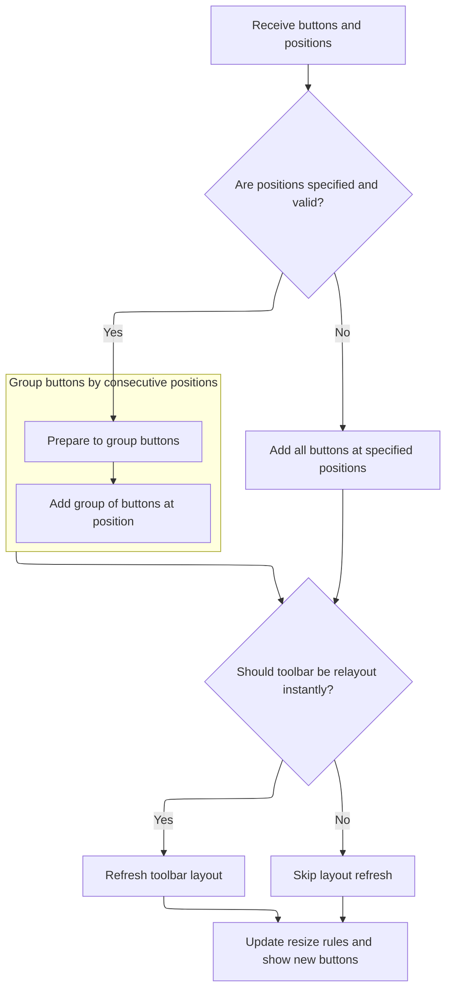

# Where is this flow used?

This flow is used multiple times in the codebase as represented in the following diagram:

(Note - these are only some of the entry points of this flow)

```mermaid
graph TD;
      4aff1405ccfef561ef3890bce55dffd81e34bc44844a5af5c8a1272527676c87(shopizer/…/modules/ISC_Forms.js::fetchDataByPK) --> 26984b7cff22d447b5c1a65310569a9db52312aaa779cd1eea0c26e9396fc312(shopizer/…/modules/ISC_Forms.js::fetchDataReply)

26984b7cff22d447b5c1a65310569a9db52312aaa779cd1eea0c26e9396fc312(shopizer/…/modules/ISC_Forms.js::fetchDataReply) --> 625052a5e29738ee73da1c3bae37e6561b541b0cfd716cd77dc2e8819443199e(shopizer/…/modules/ISC_Forms.js::showEntity)

625052a5e29738ee73da1c3bae37e6561b541b0cfd716cd77dc2e8819443199e(shopizer/…/modules/ISC_Forms.js::showEntity) --> 0e97468bccae07168b983a4ce782ba1bc45dc3fee081425aac50328140757b06(shopizer/…/modules/ISC_Forms.js::addEditor)

625052a5e29738ee73da1c3bae37e6561b541b0cfd716cd77dc2e8819443199e(shopizer/…/modules/ISC_Forms.js::showEntity) --> f45e426147d7c6e710a470ea79d5b23aec5334c6aa010f63f426b361b8e7b63b(shopizer/…/modules/ISC_Forms.js::addGrid)

0e97468bccae07168b983a4ce782ba1bc45dc3fee081425aac50328140757b06(shopizer/…/modules/ISC_Forms.js::addEditor) --> 798cb66ce0f4c0390d611cb33814496d296e10ab1d5dae7c476b8b40e61cc150(shopizer/…/modules/ISC_Forms.js::addEntityLink)

798cb66ce0f4c0390d611cb33814496d296e10ab1d5dae7c476b8b40e61cc150(shopizer/…/modules/ISC_Forms.js::addEntityLink) --> 65a88d2f92bf3c068a0268502ac0b0dc438dbb894617aca237c71569d502b453(shopizer/…/modules/ISC_Forms.js::addEntityTab)

65a88d2f92bf3c068a0268502ac0b0dc438dbb894617aca237c71569d502b453(shopizer/…/modules/ISC_Forms.js::addEntityTab) --> 40eaf1e969d7a0709805dd177330e1e92704436cf6a28f6a3b6934afccde1d23(shopizer/…/modules/ISC_Containers.js::addTab)

40eaf1e969d7a0709805dd177330e1e92704436cf6a28f6a3b6934afccde1d23(shopizer/…/modules/ISC_Containers.js::addTab) --> cfde734dea927dc59de4e618664f35f8a63f080ef8fe274394ea81fb25dd5813(shopizer/…/modules/ISC_Containers.js::addTabs):::mainFlowStyle

f45e426147d7c6e710a470ea79d5b23aec5334c6aa010f63f426b361b8e7b63b(shopizer/…/modules/ISC_Forms.js::addGrid) --> 798cb66ce0f4c0390d611cb33814496d296e10ab1d5dae7c476b8b40e61cc150(shopizer/…/modules/ISC_Forms.js::addEntityLink)

e173c4418689507f175bef89043a373a64a0deec51f3b9a269e43034024d56dd(shopizer/…/modules/ISC_Forms.js::isc_EntityEditor_fetchDataByPK) --> 26984b7cff22d447b5c1a65310569a9db52312aaa779cd1eea0c26e9396fc312(shopizer/…/modules/ISC_Forms.js::fetchDataReply)

883b783e62d9d880dd505c43c4d1987052cf58df4cfc2acbbe31a9256ac5addb(shopizer/…/modules/ISC_Forms.js::isc_EntityEditor_fetchDataReply) --> 625052a5e29738ee73da1c3bae37e6561b541b0cfd716cd77dc2e8819443199e(shopizer/…/modules/ISC_Forms.js::showEntity)

77f18dbe72fb2d952f083feddb62a158ec9c1b6a4d4925b7edfa957472a3e31a(shopizer/…/modules/ISC_Forms.js::isc_EntityEditor_showEntity) --> 0e97468bccae07168b983a4ce782ba1bc45dc3fee081425aac50328140757b06(shopizer/…/modules/ISC_Forms.js::addEditor)

77f18dbe72fb2d952f083feddb62a158ec9c1b6a4d4925b7edfa957472a3e31a(shopizer/…/modules/ISC_Forms.js::isc_EntityEditor_showEntity) --> f45e426147d7c6e710a470ea79d5b23aec5334c6aa010f63f426b361b8e7b63b(shopizer/…/modules/ISC_Forms.js::addGrid)

0981e7e760b5b33d80684570f509b38dab86526da7c36f3b5e05f0554f1d875d(shopizer/…/modules/ISC_Forms.js::isc_EntityEditor_addEditor) --> 798cb66ce0f4c0390d611cb33814496d296e10ab1d5dae7c476b8b40e61cc150(shopizer/…/modules/ISC_Forms.js::addEntityLink)


classDef mainFlowStyle color:#000000,fill:#7CB9F4
classDef rootsStyle color:#000000,fill:#00FFF4
classDef Style1 color:#000000,fill:#00FFAA
classDef Style2 color:#000000,fill:#FFFF00
classDef Style3 color:#000000,fill:#AA7CB9

%% Swimm:
%% graph TD;
%%       4aff1405ccfef561ef3890bce55dffd81e34bc44844a5af5c8a1272527676c87(<SwmPath>[shopizer/…/modules/ISC_Forms.js](shopizer/sm-shop/src/main/webapp/resources/smart-client/system/modules/ISC_Forms.js)</SwmPath>::fetchDataByPK) --> 26984b7cff22d447b5c1a65310569a9db52312aaa779cd1eea0c26e9396fc312(<SwmPath>[shopizer/…/modules/ISC_Forms.js](shopizer/sm-shop/src/main/webapp/resources/smart-client/system/modules/ISC_Forms.js)</SwmPath>::fetchDataReply)
%% 
%% 26984b7cff22d447b5c1a65310569a9db52312aaa779cd1eea0c26e9396fc312(<SwmPath>[shopizer/…/modules/ISC_Forms.js](shopizer/sm-shop/src/main/webapp/resources/smart-client/system/modules/ISC_Forms.js)</SwmPath>::fetchDataReply) --> 625052a5e29738ee73da1c3bae37e6561b541b0cfd716cd77dc2e8819443199e(<SwmPath>[shopizer/…/modules/ISC_Forms.js](shopizer/sm-shop/src/main/webapp/resources/smart-client/system/modules/ISC_Forms.js)</SwmPath>::showEntity)
%% 
%% 625052a5e29738ee73da1c3bae37e6561b541b0cfd716cd77dc2e8819443199e(<SwmPath>[shopizer/…/modules/ISC_Forms.js](shopizer/sm-shop/src/main/webapp/resources/smart-client/system/modules/ISC_Forms.js)</SwmPath>::showEntity) --> 0e97468bccae07168b983a4ce782ba1bc45dc3fee081425aac50328140757b06(<SwmPath>[shopizer/…/modules/ISC_Forms.js](shopizer/sm-shop/src/main/webapp/resources/smart-client/system/modules/ISC_Forms.js)</SwmPath>::addEditor)
%% 
%% 625052a5e29738ee73da1c3bae37e6561b541b0cfd716cd77dc2e8819443199e(<SwmPath>[shopizer/…/modules/ISC_Forms.js](shopizer/sm-shop/src/main/webapp/resources/smart-client/system/modules/ISC_Forms.js)</SwmPath>::showEntity) --> f45e426147d7c6e710a470ea79d5b23aec5334c6aa010f63f426b361b8e7b63b(<SwmPath>[shopizer/…/modules/ISC_Forms.js](shopizer/sm-shop/src/main/webapp/resources/smart-client/system/modules/ISC_Forms.js)</SwmPath>::addGrid)
%% 
%% 0e97468bccae07168b983a4ce782ba1bc45dc3fee081425aac50328140757b06(<SwmPath>[shopizer/…/modules/ISC_Forms.js](shopizer/sm-shop/src/main/webapp/resources/smart-client/system/modules/ISC_Forms.js)</SwmPath>::addEditor) --> 798cb66ce0f4c0390d611cb33814496d296e10ab1d5dae7c476b8b40e61cc150(<SwmPath>[shopizer/…/modules/ISC_Forms.js](shopizer/sm-shop/src/main/webapp/resources/smart-client/system/modules/ISC_Forms.js)</SwmPath>::addEntityLink)
%% 
%% 798cb66ce0f4c0390d611cb33814496d296e10ab1d5dae7c476b8b40e61cc150(<SwmPath>[shopizer/…/modules/ISC_Forms.js](shopizer/sm-shop/src/main/webapp/resources/smart-client/system/modules/ISC_Forms.js)</SwmPath>::addEntityLink) --> 65a88d2f92bf3c068a0268502ac0b0dc438dbb894617aca237c71569d502b453(<SwmPath>[shopizer/…/modules/ISC_Forms.js](shopizer/sm-shop/src/main/webapp/resources/smart-client/system/modules/ISC_Forms.js)</SwmPath>::addEntityTab)
%% 
%% 65a88d2f92bf3c068a0268502ac0b0dc438dbb894617aca237c71569d502b453(<SwmPath>[shopizer/…/modules/ISC_Forms.js](shopizer/sm-shop/src/main/webapp/resources/smart-client/system/modules/ISC_Forms.js)</SwmPath>::addEntityTab) --> 40eaf1e969d7a0709805dd177330e1e92704436cf6a28f6a3b6934afccde1d23(<SwmPath>[shopizer/…/modules/ISC_Containers.js](shopizer/sm-shop/src/main/webapp/resources/smart-client/system/modules/ISC_Containers.js)</SwmPath>::<SwmToken path="shopizer/sm-shop/src/main/webapp/resources/smart-client/system/modules/ISC_Containers.js" pos="463:5:5" line-data=",isc.A.addTab=function isc_TabSet_addTab(_1,_2){return this.addTabs(_1,_2)}">`addTab`</SwmToken>)
%% 
%% 40eaf1e969d7a0709805dd177330e1e92704436cf6a28f6a3b6934afccde1d23(<SwmPath>[shopizer/…/modules/ISC_Containers.js](shopizer/sm-shop/src/main/webapp/resources/smart-client/system/modules/ISC_Containers.js)</SwmPath>::<SwmToken path="shopizer/sm-shop/src/main/webapp/resources/smart-client/system/modules/ISC_Containers.js" pos="463:5:5" line-data=",isc.A.addTab=function isc_TabSet_addTab(_1,_2){return this.addTabs(_1,_2)}">`addTab`</SwmToken>) --> cfde734dea927dc59de4e618664f35f8a63f080ef8fe274394ea81fb25dd5813(<SwmPath>[shopizer/…/modules/ISC_Containers.js](shopizer/sm-shop/src/main/webapp/resources/smart-client/system/modules/ISC_Containers.js)</SwmPath>::<SwmToken path="shopizer/sm-shop/src/main/webapp/resources/smart-client/system/modules/ISC_Containers.js" pos="33:5:5" line-data=",isc.A.addTabs=function isc_TabBar_addTabs(_1,_2){if(!_2&amp;&amp;this.tabBarPosition==isc.Canvas.LEFT)_2=0;this.addButtons(_1,_2);if(isc.Browser.isSGWT){var _3=this.getMembers();for(var i=0;i&lt;_3.length;i++){_3[i].__ref=null}}">`addTabs`</SwmToken>):::mainFlowStyle
%% 
%% f45e426147d7c6e710a470ea79d5b23aec5334c6aa010f63f426b361b8e7b63b(<SwmPath>[shopizer/…/modules/ISC_Forms.js](shopizer/sm-shop/src/main/webapp/resources/smart-client/system/modules/ISC_Forms.js)</SwmPath>::addGrid) --> 798cb66ce0f4c0390d611cb33814496d296e10ab1d5dae7c476b8b40e61cc150(<SwmPath>[shopizer/…/modules/ISC_Forms.js](shopizer/sm-shop/src/main/webapp/resources/smart-client/system/modules/ISC_Forms.js)</SwmPath>::addEntityLink)
%% 
%% e173c4418689507f175bef89043a373a64a0deec51f3b9a269e43034024d56dd(<SwmPath>[shopizer/…/modules/ISC_Forms.js](shopizer/sm-shop/src/main/webapp/resources/smart-client/system/modules/ISC_Forms.js)</SwmPath>::isc_EntityEditor_fetchDataByPK) --> 26984b7cff22d447b5c1a65310569a9db52312aaa779cd1eea0c26e9396fc312(<SwmPath>[shopizer/…/modules/ISC_Forms.js](shopizer/sm-shop/src/main/webapp/resources/smart-client/system/modules/ISC_Forms.js)</SwmPath>::fetchDataReply)
%% 
%% 883b783e62d9d880dd505c43c4d1987052cf58df4cfc2acbbe31a9256ac5addb(<SwmPath>[shopizer/…/modules/ISC_Forms.js](shopizer/sm-shop/src/main/webapp/resources/smart-client/system/modules/ISC_Forms.js)</SwmPath>::isc_EntityEditor_fetchDataReply) --> 625052a5e29738ee73da1c3bae37e6561b541b0cfd716cd77dc2e8819443199e(<SwmPath>[shopizer/…/modules/ISC_Forms.js](shopizer/sm-shop/src/main/webapp/resources/smart-client/system/modules/ISC_Forms.js)</SwmPath>::showEntity)
%% 
%% 77f18dbe72fb2d952f083feddb62a158ec9c1b6a4d4925b7edfa957472a3e31a(<SwmPath>[shopizer/…/modules/ISC_Forms.js](shopizer/sm-shop/src/main/webapp/resources/smart-client/system/modules/ISC_Forms.js)</SwmPath>::isc_EntityEditor_showEntity) --> 0e97468bccae07168b983a4ce782ba1bc45dc3fee081425aac50328140757b06(<SwmPath>[shopizer/…/modules/ISC_Forms.js](shopizer/sm-shop/src/main/webapp/resources/smart-client/system/modules/ISC_Forms.js)</SwmPath>::addEditor)
%% 
%% 77f18dbe72fb2d952f083feddb62a158ec9c1b6a4d4925b7edfa957472a3e31a(<SwmPath>[shopizer/…/modules/ISC_Forms.js](shopizer/sm-shop/src/main/webapp/resources/smart-client/system/modules/ISC_Forms.js)</SwmPath>::isc_EntityEditor_showEntity) --> f45e426147d7c6e710a470ea79d5b23aec5334c6aa010f63f426b361b8e7b63b(<SwmPath>[shopizer/…/modules/ISC_Forms.js](shopizer/sm-shop/src/main/webapp/resources/smart-client/system/modules/ISC_Forms.js)</SwmPath>::addGrid)
%% 
%% 0981e7e760b5b33d80684570f509b38dab86526da7c36f3b5e05f0554f1d875d(<SwmPath>[shopizer/…/modules/ISC_Forms.js](shopizer/sm-shop/src/main/webapp/resources/smart-client/system/modules/ISC_Forms.js)</SwmPath>::isc_EntityEditor_addEditor) --> 798cb66ce0f4c0390d611cb33814496d296e10ab1d5dae7c476b8b40e61cc150(<SwmPath>[shopizer/…/modules/ISC_Forms.js](shopizer/sm-shop/src/main/webapp/resources/smart-client/system/modules/ISC_Forms.js)</SwmPath>::addEntityLink)
%% 
%% 
%% classDef mainFlowStyle color:#000000,fill:#7CB9F4
%% classDef rootsStyle color:#000000,fill:#00FFF4
%% classDef Style1 color:#000000,fill:#00FFAA
%% classDef Style2 color:#000000,fill:#FFFF00
%% classDef Style3 color:#000000,fill:#AA7CB9
```



# Setting Up Tab Bar Buttons

<SwmSnippet path="/shopizer/sm-shop/src/main/webapp/resources/smart-client/system/modules/ISC_Containers.js" line="33">

---

In <SwmToken path="shopizer/sm-shop/src/main/webapp/resources/smart-client/system/modules/ISC_Containers.js" pos="33:5:5" line-data=",isc.A.addTabs=function isc_TabBar_addTabs(_1,_2){if(!_2&amp;&amp;this.tabBarPosition==isc.Canvas.LEFT)_2=0;this.addButtons(_1,_2);if(isc.Browser.isSGWT){var _3=this.getMembers();for(var i=0;i&lt;_3.length;i++){_3[i].__ref=null}}">`addTabs`</SwmToken>, we kick off the process by prepping the position for new tabs and delegating the actual button addition to <SwmToken path="shopizer/sm-shop/src/main/webapp/resources/smart-client/system/modules/ISC_Containers.js" pos="33:37:37" line-data=",isc.A.addTabs=function isc_TabBar_addTabs(_1,_2){if(!_2&amp;&amp;this.tabBarPosition==isc.Canvas.LEFT)_2=0;this.addButtons(_1,_2);if(isc.Browser.isSGWT){var _3=this.getMembers();for(var i=0;i&lt;_3.length;i++){_3[i].__ref=null}}">`addButtons`</SwmToken>. We call into <SwmPath>[shopizer/…/modules/ISC_Foundation.js](shopizer/sm-shop/src/main/webapp/resources/smart-client/system/modules/ISC_Foundation.js)</SwmPath> next because that's where the logic for adding and organizing buttons lives, so we need it to handle the details.

```javascript
,isc.A.addTabs=function isc_TabBar_addTabs(_1,_2){if(!_2&&this.tabBarPosition==isc.Canvas.LEFT)_2=0;this.addButtons(_1,_2);if(isc.Browser.isSGWT){var _3=this.getMembers();for(var i=0;i<_3.length;i++){_3[i].__ref=null}}
```

---

</SwmSnippet>

## Preparing and Grouping Toolbar Buttons



<SwmSnippet path="/shopizer/sm-shop/src/main/webapp/resources/smart-client/system/modules/ISC_Foundation.js" line="803">

---

In <SwmToken path="shopizer/sm-shop/src/main/webapp/resources/smart-client/system/modules/ISC_Foundation.js" pos="803:5:5" line-data=",isc.A.addButtons=function isc_Toolbar_addButtons(_1,_2){if(_1==null)return;if(!isc.isAn.Array(_1))_1=[_1];if(!this.$6c)this.setButtons();_1.removeEvery(null);var _3;if(isc.isAn.Array(_2)){if(_2.length!=_1.length){this.logWarn(&quot;addButtons passed &quot;+_1.length+&quot; buttons with &quot;+_2.length+&quot; discrete positions specified. Ignoring.&quot;);return}">`addButtons`</SwmToken>, we sanitize the input buttons, make sure they're in an array, and check for valid positions. If the positions don't line up, we bail out to avoid messing up the toolbar layout.

```javascript
,isc.A.addButtons=function isc_Toolbar_addButtons(_1,_2){if(_1==null)return;if(!isc.isAn.Array(_1))_1=[_1];if(!this.$6c)this.setButtons();_1.removeEvery(null);var _3;if(isc.isAn.Array(_2)){if(_2.length!=_1.length){this.logWarn("addButtons passed "+_1.length+" buttons with "+_2.length+" discrete positions specified. Ignoring.");return}
var _4={};for(var i=0;i<_2.length;i++){_4[_2[i]]=_1[i]}
```

---

</SwmSnippet>

<SwmSnippet path="/shopizer/sm-shop/src/main/webapp/resources/smart-client/system/modules/ISC_Foundation.js" line="804">

---

We organize buttons by position so we can add them in logical groups.

```javascript
var _4={};for(var i=0;i<_2.length;i++){_4[_2[i]]=_1[i]}
_2.sort();_3=[];var _6={buttons:[],position:_2[0]},_7=0;for(var i=0;i<_2.length;i++){var _8=_2[i],_9=_4[_8];_6.buttons.add(_9);var _10=_2[i+1]
if(_10==null||_10!=_8+1){_3[_7]=_6;_7++
if(_10!=null)_6={buttons:[],position:_10}}}
```

---

</SwmSnippet>

<SwmSnippet path="/shopizer/sm-shop/src/main/webapp/resources/smart-client/system/modules/ISC_Foundation.js" line="807">

---

Now we actually add the grouped buttons to the toolbar at their calculated positions. If there are no groups, we just add the buttons directly at the given positions.

```javascript
if(_10!=null)_6={buttons:[],position:_10}}}
for(var i=0;i<_3.length;i++){this.buttons.addListAt(_3[i].buttons,_3[i].position)}}else{this.buttons.addListAt(_1,_2)}
```

---

</SwmSnippet>

<SwmSnippet path="/shopizer/sm-shop/src/main/webapp/resources/smart-client/system/modules/ISC_Foundation.js" line="808">

---

Here we add the actual button widgets to the toolbar, making sure layout recalculation is paused until all buttons are in. Then we re-enable layout and show the new buttons.

```javascript
for(var i=0;i<_3.length;i++){this.buttons.addListAt(_3[i].buttons,_3[i].position)}}else{this.buttons.addListAt(_1,_2)}
var _11=this.instantRelayout;this.instantRelayout=false;var _12;if(_3==null){_12=this.$82x(_1);this.addMembers(_12,_2)}else{for(var i=0;i<_3.length;i++){var _13=this.$82x(_3[i].buttons);this.addMembers(_13,_3[i].position);if(_12==null)_12=_13;else _12.addList(_13)}}
```

---

</SwmSnippet>

<SwmSnippet path="/shopizer/sm-shop/src/main/webapp/resources/smart-client/system/modules/ISC_Foundation.js" line="809">

---

Finally we trigger a layout update, apply resize rules if needed, and make sure all new buttons are visible.

```javascript
var _11=this.instantRelayout;this.instantRelayout=false;var _12;if(_3==null){_12=this.$82x(_1);this.addMembers(_12,_2)}else{for(var i=0;i<_3.length;i++){var _13=this.$82x(_3[i].buttons);this.addMembers(_13,_3[i].position);if(_12==null)_12=_13;else _12.addList(_13)}}
if(_11){this.instantRelayout=true;if(this.$3n)this.$3n=false;this.reflow("addButtons")}
if(this.canResizeItems)this.setResizeRules();_12.map("show")}
```

---

</SwmSnippet>

## Managing Overflow and Tab Visibility

```mermaid
%%{init: {"flowchart": {"defaultRenderer": "elk"}} }%%
flowchart TD
    node1{"Are 'More' tab features enabled and present?"}
    click node1 openCode "shopizer/sm-shop/src/main/webapp/resources/smart-client/system/modules/ISC_Containers.js:34:36"
    node1 -->|"Yes"| node2{"Are there more tabs than allowed? (moreTabCount)"}
    click node2 openCode "shopizer/sm-shop/src/main/webapp/resources/smart-client/system/modules/ISC_Containers.js:34:36"
    node1 -->|"No"| node5["End"]
    click node5 openCode "shopizer/sm-shop/src/main/webapp/resources/smart-client/system/modules/ISC_Containers.js:36:36"
    node2 -->|"Yes"| loop1
    node2 -->|"No"| node6["End"]
    click node6 openCode "shopizer/sm-shop/src/main/webapp/resources/smart-client/system/modules/ISC_Containers.js:36:36"
    subgraph loop1["For each tab from moreTabCount to last"]
      node3["Hide tab"]
      click node3 openCode "shopizer/sm-shop/src/main/webapp/resources/smart-client/system/modules/ISC_Containers.js:34:35"
    end
    loop1 --> node4["Show 'More' tab"]
    click node4 openCode "shopizer/sm-shop/src/main/webapp/resources/smart-client/system/modules/ISC_Containers.js:35:35"
    node4 --> node7{"Is baseline present?"}
    click node7 openCode "shopizer/sm-shop/src/main/webapp/resources/smart-client/system/modules/ISC_Containers.js:36:36"
    node7 -->|"Yes"| node8["Bring baseline and selected tab to front"]
    click node8 openCode "shopizer/sm-shop/src/main/webapp/resources/smart-client/system/modules/ISC_Containers.js:36:36"
    node7 -->|"No"| node9["End"]
    click node9 openCode "shopizer/sm-shop/src/main/webapp/resources/smart-client/system/modules/ISC_Containers.js:36:36"

classDef HeadingStyle fill:#777777,stroke:#333,stroke-width:2px;

%% Swimm:
%% %%{init: {"flowchart": {"defaultRenderer": "elk"}} }%%
%% flowchart TD
%%     node1{"Are 'More' tab features enabled and present?"}
%%     click node1 openCode "<SwmPath>[shopizer/…/modules/ISC_Containers.js](shopizer/sm-shop/src/main/webapp/resources/smart-client/system/modules/ISC_Containers.js)</SwmPath>:34:36"
%%     node1 -->|"Yes"| node2{"Are there more tabs than allowed? (<SwmToken path="shopizer/sm-shop/src/main/webapp/resources/smart-client/system/modules/ISC_Containers.js" pos="34:31:31" line-data="if(this.showMoreTab&amp;&amp;this.moreTab){var _5=this.getMembers();if(_5.length-1&gt;this.moreTabCount){for(var i=this.moreTabCount-1;i&lt;_5.length;i++){_5[i].hide()}">`moreTabCount`</SwmToken>)"}
%%     click node2 openCode "<SwmPath>[shopizer/…/modules/ISC_Containers.js](shopizer/sm-shop/src/main/webapp/resources/smart-client/system/modules/ISC_Containers.js)</SwmPath>:34:36"
%%     node1 -->|"No"| node5["End"]
%%     click node5 openCode "<SwmPath>[shopizer/…/modules/ISC_Containers.js](shopizer/sm-shop/src/main/webapp/resources/smart-client/system/modules/ISC_Containers.js)</SwmPath>:36:36"
%%     node2 -->|"Yes"| loop1
%%     node2 -->|"No"| node6["End"]
%%     click node6 openCode "<SwmPath>[shopizer/…/modules/ISC_Containers.js](shopizer/sm-shop/src/main/webapp/resources/smart-client/system/modules/ISC_Containers.js)</SwmPath>:36:36"
%%     subgraph loop1["For each tab from <SwmToken path="shopizer/sm-shop/src/main/webapp/resources/smart-client/system/modules/ISC_Containers.js" pos="34:31:31" line-data="if(this.showMoreTab&amp;&amp;this.moreTab){var _5=this.getMembers();if(_5.length-1&gt;this.moreTabCount){for(var i=this.moreTabCount-1;i&lt;_5.length;i++){_5[i].hide()}">`moreTabCount`</SwmToken> to last"]
%%       node3["Hide tab"]
%%       click node3 openCode "<SwmPath>[shopizer/…/modules/ISC_Containers.js](shopizer/sm-shop/src/main/webapp/resources/smart-client/system/modules/ISC_Containers.js)</SwmPath>:34:35"
%%     end
%%     loop1 --> node4["Show 'More' tab"]
%%     click node4 openCode "<SwmPath>[shopizer/…/modules/ISC_Containers.js](shopizer/sm-shop/src/main/webapp/resources/smart-client/system/modules/ISC_Containers.js)</SwmPath>:35:35"
%%     node4 --> node7{"Is baseline present?"}
%%     click node7 openCode "<SwmPath>[shopizer/…/modules/ISC_Containers.js](shopizer/sm-shop/src/main/webapp/resources/smart-client/system/modules/ISC_Containers.js)</SwmPath>:36:36"
%%     node7 -->|"Yes"| node8["Bring baseline and selected tab to front"]
%%     click node8 openCode "<SwmPath>[shopizer/…/modules/ISC_Containers.js](shopizer/sm-shop/src/main/webapp/resources/smart-client/system/modules/ISC_Containers.js)</SwmPath>:36:36"
%%     node7 -->|"No"| node9["End"]
%%     click node9 openCode "<SwmPath>[shopizer/…/modules/ISC_Containers.js](shopizer/sm-shop/src/main/webapp/resources/smart-client/system/modules/ISC_Containers.js)</SwmPath>:36:36"
%% 
%% classDef HeadingStyle fill:#777777,stroke:#333,stroke-width:2px;
```



<SwmSnippet path="/shopizer/sm-shop/src/main/webapp/resources/smart-client/system/modules/ISC_Containers.js" line="34">

---

Back in <SwmToken path="shopizer/sm-shop/src/main/webapp/resources/smart-client/system/modules/ISC_Containers.js" pos="33:5:5" line-data=",isc.A.addTabs=function isc_TabBar_addTabs(_1,_2){if(!_2&amp;&amp;this.tabBarPosition==isc.Canvas.LEFT)_2=0;this.addButtons(_1,_2);if(isc.Browser.isSGWT){var _3=this.getMembers();for(var i=0;i&lt;_3.length;i++){_3[i].__ref=null}}">`addTabs`</SwmToken>, after adding buttons, we check if there are too many tabs and hide the extras, only showing the overflow tab if needed.

```javascript
if(this.showMoreTab&&this.moreTab){var _5=this.getMembers();if(_5.length-1>this.moreTabCount){for(var i=this.moreTabCount-1;i<_5.length;i++){_5[i].hide()}
```

---

</SwmSnippet>

<SwmSnippet path="/shopizer/sm-shop/src/main/webapp/resources/smart-client/system/modules/ISC_Containers.js" line="34">

---

We wrap up <SwmToken path="shopizer/sm-shop/src/main/webapp/resources/smart-client/system/modules/ISC_Containers.js" pos="33:5:5" line-data=",isc.A.addTabs=function isc_TabBar_addTabs(_1,_2){if(!_2&amp;&amp;this.tabBarPosition==isc.Canvas.LEFT)_2=0;this.addButtons(_1,_2);if(isc.Browser.isSGWT){var _3=this.getMembers();for(var i=0;i&lt;_3.length;i++){_3[i].__ref=null}}">`addTabs`</SwmToken> by making sure the baseline and selected tab are visually on top, then call show to make the tab bar visible and interactive.

```javascript
if(this.showMoreTab&&this.moreTab){var _5=this.getMembers();if(_5.length-1>this.moreTabCount){for(var i=this.moreTabCount-1;i<_5.length;i++){_5[i].hide()}
this.$79t=_5.length-1;_5[this.$79t].show()}}
if(this._baseLine!=null){this._baseLine.bringToFront();var _6=this.getButton(this.getSelectedTab());if(_6)_6.bringToFront()}}
```

---

</SwmSnippet>

<SwmSnippet path="/shopizer/sm-shop/src/main/webapp/resources/smart-client/system/modules/ISC_Containers.js" line="136">

---

<SwmToken path="shopizer/sm-shop/src/main/webapp/resources/smart-client/system/modules/ISC_Containers.js" pos="136:5:5" line-data=",isc.A.show=function isc_Window_show(_1,_2,_3,_4){if(isc.$cv)arguments.$cw=this;if(this.isModal){if(this.modalTarget){if(!isc.isA.Canvas(this.modalTarget)||this.modalTarget.contains(this)){this.logWarn(&quot;Invalid modalTarget:&quot;+this.modalTarget+&quot;. Should be a canvas, and not an ancestor of this Window.&quot;);delete this.modalTarget;this.isModal=false}else{this.modalTarget.showComponentMask(this.showModalMask?{styleName:this.modalMaskStyle,opacity:this.modalMaskOpacity}:null);this.observeModalTarget()}}else if(this.topElement!=null){this.logWarn(&quot;Window specified with &#39;isModal&#39; set to true, but this window has a &quot;+&quot;parentElement. Only top level Windows can be shown modally.&quot;);this.isModal=false}else{this.showClickMask(this.getID()+(this.dismissOnOutsideClick?&quot;.handleCloseClick()&quot;:&quot;.flash()&quot;),false,[this]);this.makeModalMask()}}">`show`</SwmToken> handles making the window visible, managing modal overlays, centering if needed, and making sure it's on top of other UI elements.

```javascript
,isc.A.show=function isc_Window_show(_1,_2,_3,_4){if(isc.$cv)arguments.$cw=this;if(this.isModal){if(this.modalTarget){if(!isc.isA.Canvas(this.modalTarget)||this.modalTarget.contains(this)){this.logWarn("Invalid modalTarget:"+this.modalTarget+". Should be a canvas, and not an ancestor of this Window.");delete this.modalTarget;this.isModal=false}else{this.modalTarget.showComponentMask(this.showModalMask?{styleName:this.modalMaskStyle,opacity:this.modalMaskOpacity}:null);this.observeModalTarget()}}else if(this.topElement!=null){this.logWarn("Window specified with 'isModal' set to true, but this window has a "+"parentElement. Only top level Windows can be shown modally.");this.isModal=false}else{this.showClickMask(this.getID()+(this.dismissOnOutsideClick?".handleCloseClick()":".flash()"),false,[this]);this.makeModalMask()}}
if(this.autoCenter&&!this.parentElement){this.$7j=true;this.moveTo(0,-1000);this.$7j=false}
this.invokeSuper(isc.Window,"show",_1,_2,_3,_4);if(this.autoCenter){this.centerInPage();if(!this.parentElement){isc.Page.setEvent(this.$nx,this,null,"parentResized")}}
this.bringToFront(true)}
```

---

</SwmSnippet>

&nbsp;

*This is an* <SwmToken path="shopizer/sm-shop/src/main/webapp/resources/smart-client/system/modules/ISC_Foundation.js" pos="940:52:54" line-data="if(_13!=_10){this.logWarn(&quot;Specified name for section:&quot;+_13+&quot; collided with name for &quot;+&quot;existing section in this stack. Replacing with auto-generated name:&quot;+_10)}">`auto-generated`</SwmToken> *document by Swimm 🌊 and has not yet been verified by a human*

<SwmMeta version="3.0.0" repo-id="Z2l0aHViJTNBJTNBU2hvcGl6ZXIlM0ElM0F1bWFsaW5nYXN3YW1p" repo-name="Shopizer"><sup>Powered by [Swimm](https://app.swimm.io/)</sup></SwmMeta>
