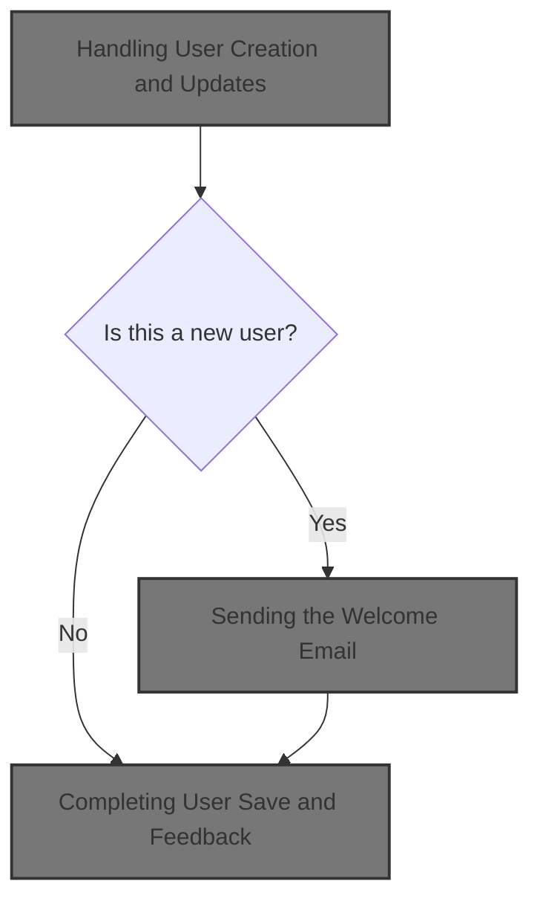
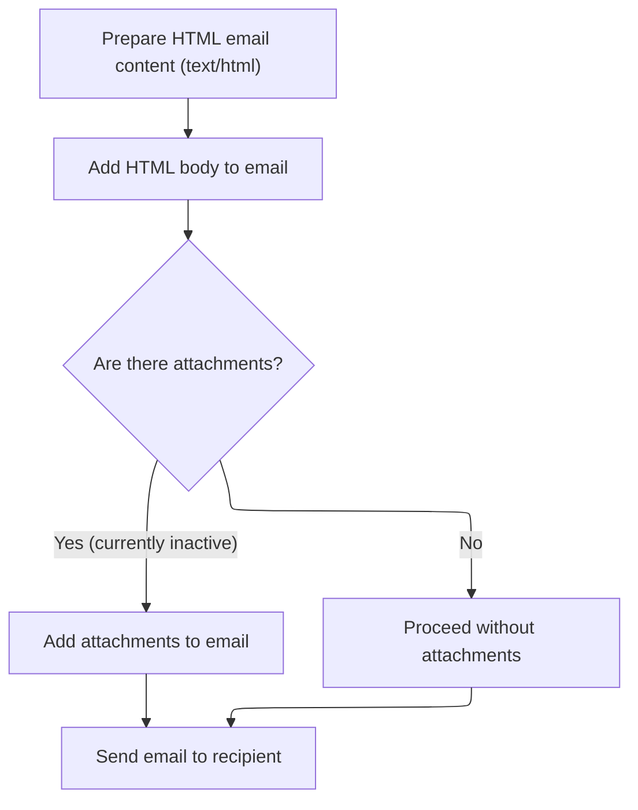

This document outlines how admin users are created or updated. The system validates input, manages group assignments, handles password security, and sends a welcome email to new users. The admin receives feedback on the result.



# Handling User Creation and Updates

This section governs the creation and update of admin users in the Shopizer platform. It ensures that user data is validated, group assignments are managed according to business rules, passwords are handled securely, and appropriate notifications are sent to users upon account creation.

| Category        | Rule Name                     | Description                                                                                                                                                                                                         |
| --------------- | ----------------------------- | ------------------------------------------------------------------------------------------------------------------------------------------------------------------------------------------------------------------- |
| Data validation | Form Validation Enforcement   | If the user creation or update form contains validation errors, the process must halt and the user must be shown the profile page to correct the errors.                                                            |
| Business logic  | SUPERADMIN Group Protection   | When creating or updating a user, the user's assigned groups must always include SUPERADMIN if the user previously had SUPERADMIN privileges. SUPERADMIN group membership cannot be revoked through this interface. |
| Business logic  | Password Encoding Requirement | When creating a new user, the user's password must be encoded before saving. For existing users, the password remains unchanged unless explicitly updated.                                                          |
| Business logic  | New User Email Notification   | Upon successful creation of a new user, a welcome email containing login credentials and relevant information must be sent to the user's registered email address.                                                  |
| Business logic  | Valid Group Assignment        | User group assignments must be based on the submitted group IDs, and only valid groups should be assigned to the user.                                                                                              |

<SwmSnippet path="/shopizer/sm-shop/src/main/java/com/salesmanager/web/admin/controller/user/UserController.java" line="472">

---

In <SwmToken path="shopizer/sm-shop/src/main/java/com/salesmanager/web/admin/controller/user/UserController.java" pos="472:5:5" line-data="	public String saveUser(@Valid @ModelAttribute(&quot;user&quot;) User user, BindingResult result, Model model, HttpServletRequest request, Locale locale) throws Exception {">`saveUser`</SwmToken>, we kick off by setting up the admin menu, loading the merchant store, and populating user-related objects for the UI. We also fetch and set the user's language, and if we're editing, we grab the original user from the DB. The function starts prepping for group assignment and validation, laying the groundwork for all the extra logic that follows (security questions, group handling, password encoding, and email notification).

```java
	public String saveUser(@Valid @ModelAttribute("user") User user, BindingResult result, Model model, HttpServletRequest request, Locale locale) throws Exception {


		setMenu(model,request);
		
		MerchantStore store = (MerchantStore)request.getAttribute(Constants.ADMIN_STORE);

		
		this.populateUserObjects(user, store, model, locale);
		
		Language language = user.getDefaultLanguage();
		
		Language l = languageService.getById(language.getId());
		
		user.setDefaultLanguage(l);
		
		Locale userLocale = LocaleUtils.getLocale(l);
		
		
		
		User dbUser = null;
		
		//edit mode, need to get original user important information
		if(user.getId()!=null) {
			dbUser = userService.getByUserName(user.getAdminName());
			if(dbUser==null) {
				return "redirect://admin/users/displayUser.html";
			}
		}

		List<Group> submitedGroups = user.getGroups();
		Set<Integer> ids = new HashSet<Integer>();
		for(Group group : submitedGroups) {
			ids.add(Integer.parseInt(group.getGroupName()));
		}
```

---

</SwmSnippet>

<SwmSnippet path="/shopizer/sm-shop/src/main/java/com/salesmanager/web/admin/controller/user/UserController.java" line="537">

---

Next in <SwmToken path="shopizer/sm-shop/src/main/java/com/salesmanager/web/admin/controller/user/UserController.java" pos="472:5:5" line-data="	public String saveUser(@Valid @ModelAttribute(&quot;user&quot;) User user, BindingResult result, Model model, HttpServletRequest request, Locale locale) throws Exception {">`saveUser`</SwmToken>, we check if the user is being edited and make sure the SUPERADMIN group can't be removed. If the user had SUPERADMIN before, we keep it in their group list. This ties into the earlier setup and leads into the actual group assignment and validation that follows.

```java
		Group superAdmin = null;
		
		if(user.getId()!=null && user.getId()>0) {
			if(user.getId().longValue()!=dbUser.getId().longValue()) {
				return "redirect://admin/users/displayUser.html";
			}
			
			List<Group> groups = dbUser.getGroups();
			//boolean removeSuperAdmin = true;
			for(Group group : groups) {
				//can't revoke super admin
				if(group.getGroupName().equals("SUPERADMIN")) {
					superAdmin = group;
				}
			}
```

---

</SwmSnippet>

<SwmSnippet path="/shopizer/sm-shop/src/main/java/com/salesmanager/web/admin/controller/user/UserController.java" line="562">

---

Here we finalize the user's group assignments, validate the form, and handle password encoding based on whether the user is new or existing. If it's a new user, we save them and build a welcome email with credentials, then call the email service to send it. For updates, we just save the user. The next step is calling the email service to actually deliver the notification.

```java
		if(superAdmin!=null) {
			ids.add(superAdmin.getId());
		}

		
		List<Group> newGroups = groupService.listGroupByIds(ids);

		//set actual user groups
		user.setGroups(newGroups);
		
		if (result.hasErrors()) {
			return ControllerConstants.Tiles.User.profile;
		}
		
		String decodedPassword = user.getAdminPassword();
		if(user.getId()!=null && user.getId()>0) {
			user.setAdminPassword(dbUser.getAdminPassword());
		} else {
			String encoded = passwordEncoder.encodePassword(user.getAdminPassword(),null);
			user.setAdminPassword(encoded);
		}
		
		
		if(user.getId()==null || user.getId().longValue()==0) {
			
			//save or update user
			userService.saveOrUpdate(user);
			
			try {

				//creation of a user, send an email
				String userName = user.getFirstName();
				if(StringUtils.isBlank(userName)) {
					userName = user.getAdminName();
				}
				String[] userNameArg = {userName};
				
				
				Map<String, String> templateTokens = EmailUtils.createEmailObjectsMap(request.getContextPath(), store, messages, userLocale);
				templateTokens.put(EmailConstants.EMAIL_NEW_USER_TEXT, messages.getMessage("email.greeting", userNameArg, userLocale));
				templateTokens.put(EmailConstants.EMAIL_USER_FIRSTNAME, user.getFirstName());
				templateTokens.put(EmailConstants.EMAIL_USER_LASTNAME, user.getLastName());
				templateTokens.put(EmailConstants.EMAIL_ADMIN_USERNAME_LABEL, messages.getMessage("label.generic.username",userLocale));
				templateTokens.put(EmailConstants.EMAIL_ADMIN_NAME, user.getAdminName());
				templateTokens.put(EmailConstants.EMAIL_TEXT_NEW_USER_CREATED, messages.getMessage("email.newuser.text",userLocale));
				templateTokens.put(EmailConstants.EMAIL_ADMIN_PASSWORD_LABEL, messages.getMessage("label.generic.password",userLocale));
				templateTokens.put(EmailConstants.EMAIL_ADMIN_PASSWORD, decodedPassword);
				templateTokens.put(EmailConstants.EMAIL_ADMIN_URL_LABEL, messages.getMessage("label.adminurl",userLocale));
				templateTokens.put(EmailConstants.EMAIL_ADMIN_URL, FilePathUtils.buildAdminUri(store, request));
	
				
				Email email = new Email();
				email.setFrom(store.getStorename());
				email.setFromEmail(store.getStoreEmailAddress());
				email.setSubject(messages.getMessage("email.newuser.title",userLocale));
				email.setTo(user.getAdminEmail());
				email.setTemplateName(NEW_USER_TMPL);
				email.setTemplateTokens(templateTokens);
	
	
				
				emailService.sendHtmlEmail(store, email);
			
			} catch (Exception e) {
				LOGGER.error("Cannot send email to user",e);
			}
			
		} else {
			//save or update user
			userService.saveOrUpdate(user);
		}

```

---

</SwmSnippet>

## Sending the Welcome Email

This section is responsible for sending a welcome email to a customer using the store's specific email configuration. It ensures that the correct configuration is applied before the email is sent, maintaining separation between configuration and sending logic.

| Category        | Rule Name                          | Description                                                                                                                       |
| --------------- | ---------------------------------- | --------------------------------------------------------------------------------------------------------------------------------- |
| Data validation | Configuration validation           | If the email configuration for the store is missing or invalid, the welcome email must not be sent and an error should be raised. |
| Business logic  | Store-specific email configuration | The welcome email must be sent using the email configuration specific to the merchant store from which the request originated.    |
| Business logic  | HTML email format                  | The welcome email must be sent in HTML format to ensure proper branding and formatting.                                           |

<SwmSnippet path="/shopizer/sm-core/src/main/java/com/salesmanager/core/business/system/service/EmailServiceImpl.java" line="25">

---

<SwmToken path="shopizer/sm-core/src/main/java/com/salesmanager/core/business/system/service/EmailServiceImpl.java" pos="25:5:5" line-data="	public void sendHtmlEmail(MerchantStore store, Email email) throws ServiceException, Exception {">`sendHtmlEmail`</SwmToken> grabs the store's email config, sets it on the sender, and hands off the email to <SwmToken path="shopizer/sm-core/src/main/java/com/salesmanager/core/modules/email/HtmlEmailSenderImpl.java" pos="83:5:5" line-data="				freemarkerMailConfiguration.setClassForTemplateLoading(HtmlEmailSenderImpl.class, &quot;/&quot;);">`HtmlEmailSenderImpl`</SwmToken> for actual delivery. This keeps config logic separate from sending logic, so next we need to call the sender to format and send the email.

```java
	public void sendHtmlEmail(MerchantStore store, Email email) throws ServiceException, Exception {

		EmailConfig emailConfig = getEmailConfiguration(store);
		
		sender.setEmailConfig(emailConfig);
		sender.send(email);
	}
```

---

</SwmSnippet>

## Formatting and Delivering the Email

This section ensures that emails sent from the system are properly formatted, personalized, and include all necessary information, supporting both plain text and HTML formats for compatibility and user experience.

| Category        | Rule Name                   | Description                                                                                                                                                                 |
| --------------- | --------------------------- | --------------------------------------------------------------------------------------------------------------------------------------------------------------------------- |
| Data validation | Accurate addressing         | The sender and recipient information must be correctly extracted and set in the email to ensure proper delivery and compliance with email standards.                        |
| Business logic  | Multi-format email support  | The email must include both a plain text and an HTML version to ensure compatibility with all email clients.                                                                |
| Business logic  | Template-driven content     | The email content must be generated using the specified template and populated with the provided tokens to ensure personalization and relevance.                            |
| Business logic  | Order information inclusion | If the email requires order-related information, the system must retrieve and include the relevant order data before sending the email.                                     |
| Business logic  | Dynamic email configuration | If email configuration is present in the database, it must be used to set the email sending parameters (protocol, host, port, authentication, etc.) for the outgoing email. |

<SwmSnippet path="/shopizer/sm-core/src/main/java/com/salesmanager/core/modules/email/HtmlEmailSenderImpl.java" line="40">

---

In <SwmToken path="shopizer/sm-core/src/main/java/com/salesmanager/core/modules/email/HtmlEmailSenderImpl.java" pos="40:5:5" line-data="	public void send(Email email)">`send`</SwmToken>, we prep the email by extracting sender/recipient info, loading templates, and building both text and HTML parts using Freemarker and the provided tokens. If the flow requires order-related info, we call OrderServiceImpl next to fetch or process that data before finishing the email.

```java
	public void send(Email email)
			throws Exception {
		
		final String eml = email.getFrom();
		final String from = email.getFromEmail();
		final String to = email.getTo();
		final String subject = email.getSubject();
		final String tmpl = email.getTemplateName();
		final Map<String,String> templateTokens = email.getTemplateTokens();

		MimeMessagePreparator preparator = new MimeMessagePreparator() {
			public void prepare(MimeMessage mimeMessage)
					throws MessagingException, IOException {
				
				JavaMailSenderImpl impl = (JavaMailSenderImpl)mailSender;
				// if email configuration is present in Database, use the same
				if(emailConfig != null) {
					impl.setProtocol(emailConfig.getProtocol());
					impl.setHost(emailConfig.getHost());
					impl.setPort(Integer.parseInt(emailConfig.getPort()));
					impl.setUsername(emailConfig.getUsername());
					impl.setPassword(emailConfig.getPassword());
					
					Properties prop = new Properties();
					prop.put("mail.smtp.auth", emailConfig.isSmtpAuth());
					prop.put("mail.smtp.starttls.enable", emailConfig.isStarttls());
					impl.setJavaMailProperties(prop);
				}
				
				mimeMessage.setRecipient(Message.RecipientType.TO, new InternetAddress(to));

				InternetAddress inetAddress = new InternetAddress();

				inetAddress.setPersonal(eml);
				inetAddress.setAddress(from);

				mimeMessage.setFrom(inetAddress);
				mimeMessage.setSubject(subject);

				Multipart mp = new MimeMultipart("alternative");

				// Create a "text" Multipart message
				BodyPart textPart = new MimeBodyPart();
				freemarkerMailConfiguration.setClassForTemplateLoading(HtmlEmailSenderImpl.class, "/");
				Template textTemplate = freemarkerMailConfiguration.getTemplate(new StringBuilder(TEMPLATE_PATH).append("").append("/").append(tmpl).toString());
				final StringWriter textWriter = new StringWriter();
				try {
					textTemplate.process(templateTokens, textWriter);
				} catch (TemplateException e) {
					throw new MailPreparationException(
							"Can't generate text mail", e);
				}
				textPart.setDataHandler(new javax.activation.DataHandler(
						new javax.activation.DataSource() {
							public InputStream getInputStream()
									throws IOException {
								//return new StringBufferInputStream(textWriter
								//		.toString());
								return new ByteArrayInputStream(textWriter
										.toString().getBytes(CHARSET));
							}

							public OutputStream getOutputStream()
									throws IOException {
								throw new IOException("Read-only data");
							}

							public String getContentType() {
								return "text/plain";
							}

							public String getName() {
								return "main";
							}
						}));
				mp.addBodyPart(textPart);

				// Create a "HTML" Multipart message
				Multipart htmlContent = new MimeMultipart("related");
				BodyPart htmlPage = new MimeBodyPart();
				freemarkerMailConfiguration.setClassForTemplateLoading(HtmlEmailSenderImpl.class, "/");
				Template htmlTemplate = freemarkerMailConfiguration.getTemplate(new StringBuilder(TEMPLATE_PATH).append("").append("/").append(tmpl).toString());
				final StringWriter htmlWriter = new StringWriter();
				try {
					htmlTemplate.process(templateTokens, htmlWriter);
				} catch (TemplateException e) {
					throw new MailPreparationException(
							"Can't generate HTML mail", e);
				}
```

---

</SwmSnippet>

### Processing Order Data for Email

This section is responsible for processing order data in preparation for sending order-related emails to customers. It ensures that all relevant order information is correctly formatted and included in the email content, supporting communication about order status, confirmation, and details.

| Category        | Rule Name                         | Description                                                                                                          |
| --------------- | --------------------------------- | -------------------------------------------------------------------------------------------------------------------- |
| Data validation | Customer Email Targeting          | Order emails must be sent to the email address associated with the customer account that placed the order.           |
| Business logic  | Order Confirmation Content        | Order confirmation emails must include the order number, customer name, order summary, and total amount.             |
| Business logic  | Digital Product Delivery          | If the order contains digital products, the email must include download links for those products.                    |
| Business logic  | Order Failure Notification        | If the order status is 'failed' or 'cancelled', the email must clearly state the reason for failure or cancellation. |
| Business logic  | Physical Product Shipping Details | If the order contains physical products, the email must include shipping address and estimated delivery date.        |

See <SwmLink doc-title="Order Processing Flow">[Order Processing Flow](.swm%5Corder-processing-flow.tvmfgik6.sw.md)</SwmLink>

### Finalizing and Sending the Email



<SwmSnippet path="/shopizer/sm-core/src/main/java/com/salesmanager/core/modules/email/HtmlEmailSenderImpl.java" line="129">

---

After getting order data, we wrap up the email and send it out.

```java
				htmlPage.setDataHandler(new javax.activation.DataHandler(
						new javax.activation.DataSource() {
							public InputStream getInputStream()
									throws IOException {
								//return new StringBufferInputStream(htmlWriter
								//		.toString());
								return new ByteArrayInputStream(textWriter
										.toString().getBytes(CHARSET));
							}

							public OutputStream getOutputStream()
									throws IOException {
								throw new IOException("Read-only data");
							}

							public String getContentType() {
								return "text/html";
							}

							public String getName() {
								return "main";
							}
						}));
				htmlContent.addBodyPart(htmlPage);
				BodyPart htmlPart = new MimeBodyPart();
				htmlPart.setContent(htmlContent);
				mp.addBodyPart(htmlPart);

				mimeMessage.setContent(mp);

				// if(attachment!=null) {
				// MimeMessageHelper messageHelper = new
				// MimeMessageHelper(mimeMessage, true);
				// messageHelper.addAttachment(attachmentFileName, attachment);
				// }

			}
		};

		mailSender.send(preparator);
	}
```

---

</SwmSnippet>

## Completing User Save and Feedback

<SwmSnippet path="/shopizer/sm-shop/src/main/java/com/salesmanager/web/admin/controller/user/UserController.java" line="634">

---

Back in `UserController.saveUser`, after the email service returns, we mark the operation as successful and send the admin back to the user profile page. This wraps up all the earlier steps: user creation/update, group handling, password logic, and notification.

```java
		model.addAttribute("success","success");
		return ControllerConstants.Tiles.User.profile;
	}
```

---

</SwmSnippet>

&nbsp;

*This is an auto-generated document by Swimm 🌊 and has not yet been verified by a human*

<SwmMeta version="3.0.0" repo-id="Z2l0aHViJTNBJTNBU2hvcGl6ZXIlM0ElM0F1bWFsaW5nYXN3YW1p" repo-name="Shopizer"><sup>Powered by [Swimm](https://app.swimm.io/)</sup></SwmMeta>
