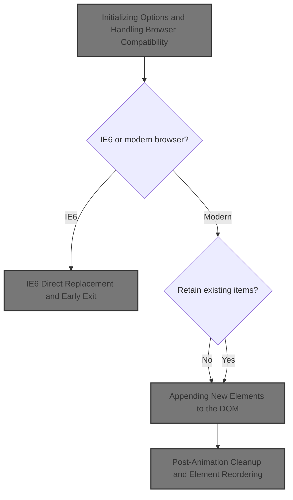
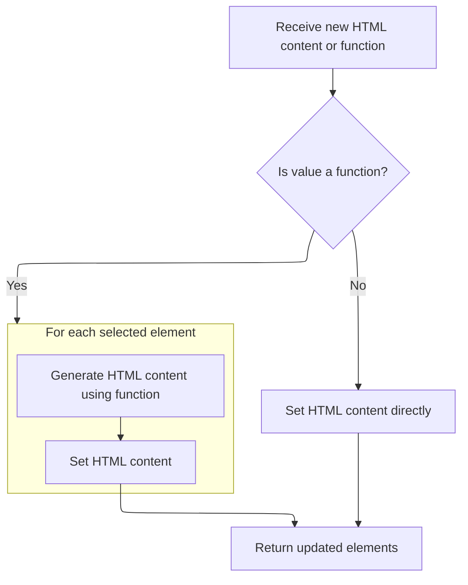
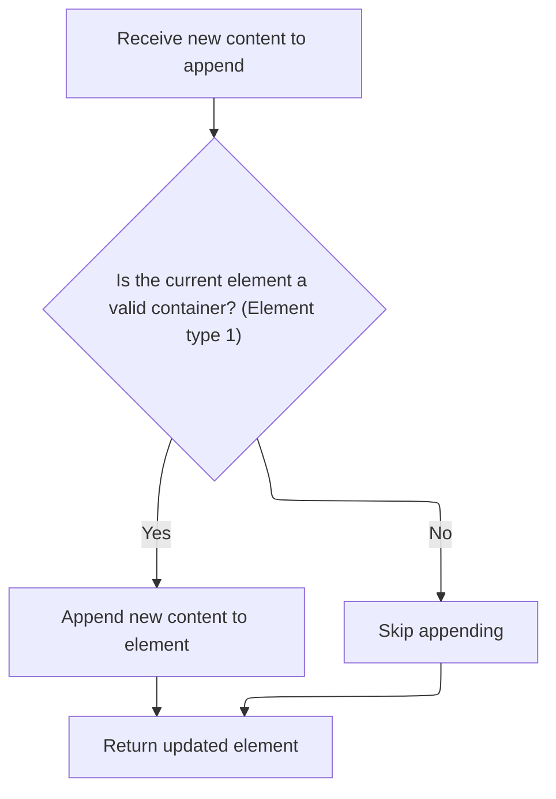
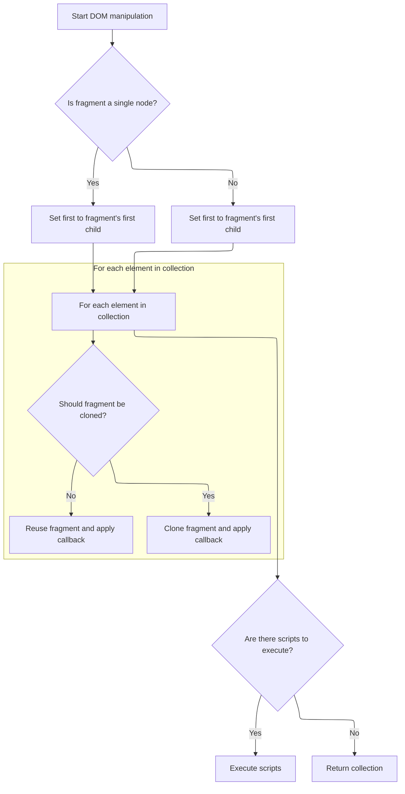

This document describes how the quicksand plugin updates a container's DOM elements to match a new collection, animating changes for a smooth user experience and maintaining compatibility with older browsers. The flow receives a new collection of elements and configuration options, then updates the DOM by either replacing all items or retaining and animating existing items, depending on the chosen settings.



# Initializing Options and Handling Browser Compatibility

```mermaid
%%{init: {"flowchart": {"defaultRenderer": "elk"}} }%%
flowchart TD
  node1["Initialize options and check browser"] --> node2{"Is browser IE6?"}
  click node1 openCode "shopizer/sm-shop/src/main/webapp/resources/js/jquery.quicksand.js:20:41"
  node2 -->|"Yes"| node3["Replace items without animation"]
  click node2 openCode "shopizer/sm-shop/src/main/webapp/resources/js/jquery.quicksand.js:41:43"
  click node3 openCode "shopizer/sm-shop/src/main/webapp/resources/js/jquery.quicksand.js:75:77"
  node3 --> node2a["Getting and Setting HTML Content"]
  
  node2a --> node2b["Done"]
  node2 -->|"No"| node4{"Retain existing items?"}
  node4 -->|"No"| node5["Appending New Elements to the DOM"]
  click node4 openCode "shopizer/sm-shop/src/main/webapp/resources/js/jquery.quicksand.js:91:93"
  
  node5 --> node6["Manipulating the DOM Structure"]
  
  node4 -->|"Yes"| node7["Re-sequence and animate items"]
  click node7 openCode "shopizer/sm-shop/src/main/webapp/resources/js/jquery.quicksand.js:97:127"
  subgraph loop1["For each item in collection"]
    node7 --> node8["Queue animation for item (useScaling?)"]
    click node8 openCode "shopizer/sm-shop/src/main/webapp/resources/js/jquery.quicksand.js:271:345"
  end
  node8 --> node9["Update container after animation"]
  click node9 openCode "shopizer/sm-shop/src/main/webapp/resources/js/jquery.quicksand.js:410:441"

classDef HeadingStyle fill:#777777,stroke:#333,stroke-width:2px;
click node2a goToHeading "Getting and Setting HTML Content"
node2a:::HeadingStyle
click node5 goToHeading "Appending New Elements to the DOM"
node5:::HeadingStyle
click node6 goToHeading "Manipulating the DOM Structure"
node6:::HeadingStyle

%% Swimm:
%% %%{init: {"flowchart": {"defaultRenderer": "elk"}} }%%
%% flowchart TD
%%   node1["Initialize options and check browser"] --> node2{"Is browser <SwmToken path="shopizer/sm-shop/src/main/webapp/resources/js/jquery.quicksand.js" pos="73:15:15" line-data="      // Replace the collection and quit if IE6">`IE6`</SwmToken>?"}
%%   click node1 openCode "<SwmPath>[shopizer/…/js/jquery.quicksand.js](shopizer/sm-shop/src/main/webapp/resources/js/jquery.quicksand.js)</SwmPath>:20:41"
%%   node2 -->|"Yes"| node3["Replace items without animation"]
%%   click node2 openCode "<SwmPath>[shopizer/…/js/jquery.quicksand.js](shopizer/sm-shop/src/main/webapp/resources/js/jquery.quicksand.js)</SwmPath>:41:43"
%%   click node3 openCode "<SwmPath>[shopizer/…/js/jquery.quicksand.js](shopizer/sm-shop/src/main/webapp/resources/js/jquery.quicksand.js)</SwmPath>:75:77"
%%   node3 --> node2a["Getting and Setting HTML Content"]
%%   
%%   node2a --> node2b["Done"]
%%   node2 -->|"No"| node4{"Retain existing items?"}
%%   node4 -->|"No"| node5["Appending New Elements to the DOM"]
%%   click node4 openCode "<SwmPath>[shopizer/…/js/jquery.quicksand.js](shopizer/sm-shop/src/main/webapp/resources/js/jquery.quicksand.js)</SwmPath>:91:93"
%%   
%%   node5 --> node6["Manipulating the DOM Structure"]
%%   
%%   node4 -->|"Yes"| node7["Re-sequence and animate items"]
%%   click node7 openCode "<SwmPath>[shopizer/…/js/jquery.quicksand.js](shopizer/sm-shop/src/main/webapp/resources/js/jquery.quicksand.js)</SwmPath>:97:127"
%%   subgraph loop1["For each item in collection"]
%%     node7 --> node8["Queue animation for item (<SwmToken path="shopizer/sm-shop/src/main/webapp/resources/js/jquery.quicksand.js" pos="29:1:1" line-data="      useScaling : false,           // enable it if you&#39;re using scaling effect">`useScaling`</SwmToken>?)"]
%%     click node8 openCode "<SwmPath>[shopizer/…/js/jquery.quicksand.js](shopizer/sm-shop/src/main/webapp/resources/js/jquery.quicksand.js)</SwmPath>:271:345"
%%   end
%%   node8 --> node9["Update container after animation"]
%%   click node9 openCode "<SwmPath>[shopizer/…/js/jquery.quicksand.js](shopizer/sm-shop/src/main/webapp/resources/js/jquery.quicksand.js)</SwmPath>:410:441"
%% 
%% classDef HeadingStyle fill:#777777,stroke:#333,stroke-width:<SwmToken path="shopizer/sm-shop/src/main/webapp/resources/js/bootstrap/jquery.js" pos="1470:10:10" line-data="		div.style.width = &quot;2px&quot;;">`2px`</SwmToken>;
%% click node2a goToHeading "Getting and Setting HTML Content"
%% node2a:::HeadingStyle
%% click node5 goToHeading "Appending New Elements to the DOM"
%% node5:::HeadingStyle
%% click node6 goToHeading "Manipulating the DOM Structure"
%% node6:::HeadingStyle
```



This section governs how the quicksand plugin initializes its options, handles browser quirks, and determines the logic for updating the DOM with new or existing items. It ensures that the correct elements are animated, replaced, or retained, and that compatibility with older browsers (like <SwmToken path="shopizer/sm-shop/src/main/webapp/resources/js/jquery.quicksand.js" pos="73:15:15" line-data="      // Replace the collection and quit if IE6">`IE6`</SwmToken>) is maintained.

| Category        | Rule Name                    | Description                                                                                                                                                                                                                                                                                                                                                                                                                                                                                                                                                                                                                                                                                                              |
| --------------- | ---------------------------- | ------------------------------------------------------------------------------------------------------------------------------------------------------------------------------------------------------------------------------------------------------------------------------------------------------------------------------------------------------------------------------------------------------------------------------------------------------------------------------------------------------------------------------------------------------------------------------------------------------------------------------------------------------------------------------------------------------------------------ |
| Data validation | Item Matching Logic          | Items in the collection must be matched using either a specified attribute (default: <SwmToken path="shopizer/sm-shop/src/main/webapp/resources/js/jquery.quicksand.js" pos="24:6:8" line-data="      attribute : &#39;data-id&#39;,        // attribute to recognize same items within source and dest">`data-id`</SwmToken>) or a custom matching function, to determine which items are the same between source and destination.                                                                                                                                                                                                                                                                                      |
| Business logic  | Replace Existing Items       | If the <SwmToken path="shopizer/sm-shop/src/main/webapp/resources/js/jquery.quicksand.js" pos="36:1:1" line-data="      retainExisting : true         // disable if you want the collection of items to be replaced completely by incoming items.">`retainExisting`</SwmToken> option is set to false, the existing items in the DOM must be completely replaced by the incoming collection.                                                                                                                                                                                                                                                                                                                             |
| Business logic  | Retain and Animate Items     | If the <SwmToken path="shopizer/sm-shop/src/main/webapp/resources/js/jquery.quicksand.js" pos="36:1:1" line-data="      retainExisting : true         // disable if you want the collection of items to be replaced completely by incoming items.">`retainExisting`</SwmToken> option is true, the plugin must <SwmToken path="shopizer/sm-shop/src/main/webapp/resources/js/jquery.quicksand.js" pos="97:23:25" line-data="              // But $dest holds the correct ordering. So we must re-sequence items in $sourceParent to match.">`re-sequence`</SwmToken> and animate items between the source and destination collections, using the matching logic to determine which items move, are removed, or inserted. |
| Business logic  | Animation Timing and Easing  | The duration of animations must be set according to the 'duration' option (default: 750 milliseconds), and the easing function must be set according to the 'easing' option (default: 'swing').                                                                                                                                                                                                                                                                                                                                                                                                                                                                                                                          |
| Business logic  | Dimension Adjustment Options | Height and width adjustments during animation must follow the <SwmToken path="shopizer/sm-shop/src/main/webapp/resources/js/jquery.quicksand.js" pos="25:1:1" line-data="      adjustHeight : &#39;auto&#39;,        // &#39;dynamic&#39; animates height during shuffling (slow), &#39;auto&#39; adjusts it">`adjustHeight`</SwmToken> and <SwmToken path="shopizer/sm-shop/src/main/webapp/resources/js/jquery.quicksand.js" pos="27:1:1" line-data="      adjustWidth : &#39;auto&#39;,         // &#39;dynamic&#39; animates width during shuffling (slow), ">`adjustWidth`</SwmToken> options, which can be set to 'auto', 'dynamic', or false.                                                                     |

<SwmSnippet path="/shopizer/sm-shop/src/main/webapp/resources/js/jquery.quicksand.js" line="20">

---

In <SwmToken path="shopizer/sm-shop/src/main/webapp/resources/js/jquery.quicksand.js" pos="20:4:4" line-data="  $.fn.quicksand = function(collection, customOptions) {">`quicksand`</SwmToken>, we set up all the options and check for browser quirks like <SwmToken path="shopizer/sm-shop/src/main/webapp/resources/js/jquery.quicksand.js" pos="73:15:15" line-data="      // Replace the collection and quit if IE6">`IE6`</SwmToken> and scaling support. The matching logic for elements (by attribute or function) is established here, which is key for later animations and DOM updates. We need to call <SwmToken path="shopizer/sm-shop/src/main/webapp/resources/js/jquery.quicksand.js" pos="87:21:23" line-data="            // hack: used to be: $sourceParent.html($dest.html()); ">`html()`</SwmToken> and `append()` next to actually update the DOM with the new collection, using the matching logic to decide which elements move, get removed, or inserted.

```javascript
  $.fn.quicksand = function(collection, customOptions) {
    var options = {
      duration : 750,
      easing : 'swing',
      attribute : 'data-id',        // attribute to recognize same items within source and dest
      adjustHeight : 'auto',        // 'dynamic' animates height during shuffling (slow), 'auto' adjusts it
                                    // before or after the animation, false leaves height constant
      adjustWidth : 'auto',         // 'dynamic' animates width during shuffling (slow), 
                                    // 'auto' adjusts it before or after the animation, false leaves width constant
      useScaling : false,           // enable it if you're using scaling effect
      enhancement : function(c) {}, // Visual enhacement (eg. font replacement) function for cloned elements
      selector : '> *',
      atomic : false,
      dx : 0,
      dy : 0,
      maxWidth : 0,
      retainExisting : true         // disable if you want the collection of items to be replaced completely by incoming items.
    };
    $.extend(options, customOptions);

    // Got IE and want scaling effect? Kiss my ass.
    if (navigator.userAgent.match(/msie [6]/i) || (typeof ($.fn.scale) == 'undefined')) {
      options.useScaling = false;
    }

    var callbackFunction;
    if (typeof (arguments[1]) == 'function') {
      callbackFunction = arguments[1];
    } else if (typeof (arguments[2] == 'function')) {
      callbackFunction = arguments[2];
    }

    return this.each(function(i) {
      var val;
      var animationQueue = []; // used to store all the animation params before starting the animation;
      // solves initial animation slowdowns
      var $collection;
      if (typeof(options.attribute) == 'function') {
        $collection = $(collection);
      } else {
        $collection = $(collection).filter('[' + options.attribute + ']').clone(); // destination (target) collection
      }
      var $sourceParent = $(this); // source, the visible container of source collection
      var sourceHeight = $(this).css('height'); // used to keep height and document flow during the animation
      var sourceWidth = $(this).css('width'); // used to keep  width and document flow during the animation
      var destHeight, destWidth;
      var adjustHeightOnCallback = false;
      var adjustWidthOnCallback = false;
      var offset = $($sourceParent).offset(); // offset of visible container, used in animation calculations
      var offsets = []; // coordinates of every source collection item
      var $source = $(this).find(options.selector); // source collection items
      var width = $($source).innerWidth(); // need for the responsive design

      // Replace the collection and quit if IE6
      if (navigator.userAgent.match(/msie [6]/i) && parseInt($.browser.version, 10) < 7) {
        $sourceParent.html('').append($collection);
```

---

</SwmSnippet>

## Getting and Setting HTML Content

This section manages the retrieval and assignment of HTML content for DOM elements, ensuring that content is safely updated and memory leaks are prevented.

| Category        | Rule Name                 | Description                                                                                                                                                                                                                                                                                      |
| --------------- | ------------------------- | ------------------------------------------------------------------------------------------------------------------------------------------------------------------------------------------------------------------------------------------------------------------------------------------------ |
| Data validation | HTML Structure Validation | When setting HTML, ensure that certain tags and whitespace are validated to avoid invalid HTML structures.                                                                                                                                                                                       |
| Business logic  | HTML Content Retrieval    | If no value is provided, return the HTML content of the first element in the collection, or null if the element is not valid.                                                                                                                                                                    |
| Business logic  | Direct HTML Assignment    | When setting HTML content, if the input is a string and passes validation checks, update the <SwmToken path="shopizer/sm-shop/src/main/webapp/resources/js/jquery.quicksand.js" pos="222:3:3" line-data="      rawDest.innerHTML = &#39;&#39;;">`innerHTML`</SwmToken> of each element directly. |

<SwmSnippet path="/shopizer/sm-shop/src/main/webapp/resources/js/bootstrap/jquery.js" line="5829">

---

In <SwmToken path="shopizer/sm-shop/src/main/webapp/resources/js/bootstrap/jquery.js" pos="5829:1:1" line-data="	html: function( value ) {">`html`</SwmToken>, we either get the HTML content or set it, depending on the arguments. If we're setting HTML, we clean up child element data to avoid memory leaks, then try to set <SwmToken path="shopizer/sm-shop/src/main/webapp/resources/js/bootstrap/jquery.js" pos="5832:6:6" line-data="				this[0].innerHTML.replace(rinlinejQuery, &quot;&quot;) :">`innerHTML`</SwmToken> directly. If that fails, we fall back to emptying and appending. Next, we call `append()` to actually insert new elements into the DOM.

```javascript
	html: function( value ) {
		if ( value === undefined ) {
			return this[0] && this[0].nodeType === 1 ?
				this[0].innerHTML.replace(rinlinejQuery, "") :
				null;

		// See if we can take a shortcut and just use innerHTML
		} else if ( typeof value === "string" && !rnoInnerhtml.test( value ) &&
			(jQuery.support.leadingWhitespace || !rleadingWhitespace.test( value )) &&
			!wrapMap[ (rtagName.exec( value ) || ["", ""])[1].toLowerCase() ] ) {

			value = value.replace(rxhtmlTag, "<$1></$2>");

			try {
				for ( var i = 0, l = this.length; i < l; i++ ) {
					// Remove element nodes and prevent memory leaks
					if ( this[i].nodeType === 1 ) {
						jQuery.cleanData( this[i].getElementsByTagName("*") );
						this[i].innerHTML = value;
					}
				}

```

---

</SwmSnippet>

### Cleaning Up Element Data

This section is responsible for ensuring that all element data within the Shopizer system is properly cleaned and standardized before further processing or storage. The main product role is to guarantee data integrity and consistency for downstream business operations.

| Category        | Rule Name                       | Description                                                                                                                                                                                                                                                                                                                                              |
| --------------- | ------------------------------- | -------------------------------------------------------------------------------------------------------------------------------------------------------------------------------------------------------------------------------------------------------------------------------------------------------------------------------------------------------- |
| Data validation | Whitespace Removal              | All element data must be free of leading and trailing whitespace before being accepted for further processing.                                                                                                                                                                                                                                           |
| Data validation | Unsupported Character Rejection | Any element data containing unsupported or special characters must be flagged and rejected from further processing.                                                                                                                                                                                                                                      |
| Business logic  | Data Standardization            | Element data must be standardized to a consistent format (<SwmToken path="shopizer/sm-shop/src/main/webapp/resources/js/bootstrap/jquery.js" pos="3116:20:22" line-data="			// Only add window if we got to document (e.g., not plain obj or detached DOM)">`e.g`</SwmToken>., date formats, capitalization) before being stored or used in business logic. |

See <SwmLink doc-title="Cleaning Up DOM Elements">[Cleaning Up DOM Elements](.swm%5Ccleaning-up-dom-elements.wiup4l85.sw.md)</SwmLink>

### Fallbacks and Dynamic HTML Updates



<SwmSnippet path="/shopizer/sm-shop/src/main/webapp/resources/js/bootstrap/jquery.js" line="5851">

---

Back in the <SwmToken path="shopizer/sm-shop/src/main/webapp/resources/js/bootstrap/jquery.js" pos="5860:3:3" line-data="				self.html( value.call(this, i, self.html()) );">`html`</SwmToken> function, after cleaning up child data, we try to set <SwmToken path="shopizer/sm-shop/src/main/webapp/resources/js/bootstrap/jquery.js" pos="5851:7:7" line-data="			// If using innerHTML throws an exception, use the fallback method">`innerHTML`</SwmToken>. If that fails, we empty and append. If 'value' is a function, we call it for each element to set HTML dynamically. Otherwise, we just append whatever is passed. This keeps updates flexible and robust.

```javascript
			// If using innerHTML throws an exception, use the fallback method
			} catch(e) {
				this.empty().append( value );
			}

		} else if ( jQuery.isFunction( value ) ) {
			this.each(function(i){
				var self = jQuery( this );

				self.html( value.call(this, i, self.html()) );
			});

		} else {
			this.empty().append( value );
		}

		return this;
	},
```

---

</SwmSnippet>

## <SwmToken path="shopizer/sm-shop/src/main/webapp/resources/js/jquery.quicksand.js" pos="73:15:15" line-data="      // Replace the collection and quit if IE6">`IE6`</SwmToken> Direct Replacement and Early Exit

<SwmSnippet path="/shopizer/sm-shop/src/main/webapp/resources/js/jquery.quicksand.js" line="75">

---

After returning from <SwmToken path="shopizer/sm-shop/src/main/webapp/resources/js/jquery.quicksand.js" pos="75:4:4" line-data="        $sourceParent.html(&#39;&#39;).append($collection);">`html`</SwmToken> in quicksand, if we're in <SwmToken path="shopizer/sm-shop/src/main/webapp/resources/js/jquery.quicksand.js" pos="73:15:15" line-data="      // Replace the collection and quit if IE6">`IE6`</SwmToken>, we skip all animation logic and just replace the collection with `append()`. This is a compatibility shortcut for old browsers.

```javascript
        $sourceParent.html('').append($collection);
        return;
      }

```

---

</SwmSnippet>

## Appending New Elements to the DOM



This section governs how new elements are appended to the DOM, ensuring that only valid container elements are modified and that the DOM structure remains consistent and correct.

| Category        | Rule Name                   | Description                                                                                                                    |
| --------------- | --------------------------- | ------------------------------------------------------------------------------------------------------------------------------ |
| Data validation | Valid container enforcement | New content must only be appended to elements that are valid containers, specifically elements of node type 1 (element nodes). |
| Business logic  | Return updated element      | After appending new content, the updated element must be returned so that further operations can be performed if needed.       |

<SwmSnippet path="/shopizer/sm-shop/src/main/webapp/resources/js/bootstrap/jquery.js" line="5746">

---

<SwmToken path="shopizer/sm-shop/src/main/webapp/resources/js/bootstrap/jquery.js" pos="5746:1:1" line-data="	append: function() {">`append`</SwmToken> uses <SwmToken path="shopizer/sm-shop/src/main/webapp/resources/js/bootstrap/jquery.js" pos="5747:5:5" line-data="		return this.domManip(arguments, true, function( elem ) {">`domManip`</SwmToken> to insert new elements into the DOM, handling special cases like scripts and table rows. Next, we call <SwmToken path="shopizer/sm-shop/src/main/webapp/resources/js/bootstrap/jquery.js" pos="5747:5:5" line-data="		return this.domManip(arguments, true, function( elem ) {">`domManip`</SwmToken> to actually perform the insertion.

```javascript
	append: function() {
		return this.domManip(arguments, true, function( elem ) {
			if ( this.nodeType === 1 ) {
				this.appendChild( elem );
			}
		});
	},
```

---

</SwmSnippet>

## Manipulating the DOM Structure

This section is responsible for preparing and manipulating DOM structures before insertion, ensuring that dynamic and static content is handled correctly and efficiently.

| Category       | Rule Name                        | Description                                                                                                                                                                                                      |
| -------------- | -------------------------------- | ---------------------------------------------------------------------------------------------------------------------------------------------------------------------------------------------------------------- |
| Business logic | Dynamic content evaluation       | If the input value is a function, the function must be called for each element in the set, passing the element index and current HTML (if applicable), and the result must be used as the new content to insert. |
| Business logic | Checked element compatibility    | If the input is a string containing checked elements and the browser does not support cloning checked states, each element must be processed individually to preserve the checked state.                         |
| Business logic | Fragment reuse optimization      | If the input value has a parent node that is a document fragment and its child count matches the number of elements being processed, the existing fragment must be reused instead of creating a new one.         |
| Business logic | Script handling during insertion | All scripts found during fragment building must be collected and handled separately to ensure they are not executed unintentionally during DOM insertion.                                                        |

<SwmSnippet path="/shopizer/sm-shop/src/main/webapp/resources/js/bootstrap/jquery.js" line="5908">

---

In <SwmToken path="shopizer/sm-shop/src/main/webapp/resources/js/bootstrap/jquery.js" pos="5908:1:1" line-data="	domManip: function( args, table, callback ) {">`domManip`</SwmToken>, we handle different types of input, including dynamic content via functions, and prepare fragments for insertion. Next, we call <SwmToken path="shopizer/sm-shop/src/main/webapp/resources/js/bootstrap/jquery.js" pos="5936:7:7" line-data="				results = jQuery.buildFragment( args, this, scripts );">`buildFragment`</SwmToken> to construct the actual DOM nodes to be inserted.

```javascript
	domManip: function( args, table, callback ) {
		var results, first, fragment, parent,
			value = args[0],
			scripts = [];

		// We can't cloneNode fragments that contain checked, in WebKit
		if ( !jQuery.support.checkClone && arguments.length === 3 && typeof value === "string" && rchecked.test( value ) ) {
			return this.each(function() {
				jQuery(this).domManip( args, table, callback, true );
			});
		}

		if ( jQuery.isFunction(value) ) {
			return this.each(function(i) {
				var self = jQuery(this);
				args[0] = value.call(this, i, table ? self.html() : undefined);
				self.domManip( args, table, callback );
			});
		}

		if ( this[0] ) {
			parent = value && value.parentNode;

			// If we're in a fragment, just use that instead of building a new one
			if ( jQuery.support.parentNode && parent && parent.nodeType === 11 && parent.childNodes.length === this.length ) {
				results = { fragment: parent };

			} else {
				results = jQuery.buildFragment( args, this, scripts );
			}

```

---

</SwmSnippet>

### Building DOM Fragments

This section is responsible for assembling reusable DOM fragments based on provided data and configuration, enabling dynamic and flexible page composition.

| Category        | Rule Name                     | Description                                                                                                                             |
| --------------- | ----------------------------- | --------------------------------------------------------------------------------------------------------------------------------------- |
| Data validation | Valid HTML Fragment           | Each DOM fragment must represent a complete and valid HTML structure suitable for insertion into the parent document.                   |
| Business logic  | Input-driven Fragment Content | DOM fragments must only include content and elements specified by the input data and configuration, without adding extraneous markup.   |
| Business logic  | Reusable Fragment Design      | Fragments must be constructed in a way that allows them to be reused across different sections of the application without modification. |

See <SwmLink doc-title="Creating and Caching Document Fragments">[Creating and Caching Document Fragments](.swm%5Ccreating-and-caching-document-fragments.oib0i4fh.sw.md)</SwmLink>

### Inserting Fragments and Running Callbacks



<SwmSnippet path="/shopizer/sm-shop/src/main/webapp/resources/js/bootstrap/jquery.js" line="5939">

---

After returning from <SwmToken path="shopizer/sm-shop/src/main/webapp/resources/js/bootstrap/jquery.js" pos="5936:7:7" line-data="				results = jQuery.buildFragment( args, this, scripts );">`buildFragment`</SwmToken> in <SwmToken path="shopizer/sm-shop/src/main/webapp/resources/js/bootstrap/jquery.js" pos="5747:5:5" line-data="		return this.domManip(arguments, true, function( elem ) {">`domManip`</SwmToken>, we insert the fragments into each target, cloning as needed for multiple insertions. The callback runs for each node, handling special cases like tables. Scripts are run after insertion if present.

```javascript
			fragment = results.fragment;

			if ( fragment.childNodes.length === 1 ) {
				first = fragment = fragment.firstChild;
			} else {
				first = fragment.firstChild;
			}

			if ( first ) {
				table = table && jQuery.nodeName( first, "tr" );

				for ( var i = 0, l = this.length, lastIndex = l - 1; i < l; i++ ) {
					callback.call(
						table ?
							root(this[i], first) :
							this[i],
						// Make sure that we do not leak memory by inadvertently discarding
						// the original fragment (which might have attached data) instead of
						// using it; in addition, use the original fragment object for the last
						// item instead of first because it can end up being emptied incorrectly
						// in certain situations (Bug #8070).
						// Fragments from the fragment cache must always be cloned and never used
						// in place.
						results.cacheable || ( l > 1 && i < lastIndex ) ?
							jQuery.clone( fragment, true, true ) :
							fragment
					);
				}
```

---

</SwmSnippet>

<SwmSnippet path="/shopizer/sm-shop/src/main/webapp/resources/js/bootstrap/jquery.js" line="5969">

---

After all insertions and script executions, <SwmToken path="shopizer/sm-shop/src/main/webapp/resources/js/bootstrap/jquery.js" pos="5747:5:5" line-data="		return this.domManip(arguments, true, function( elem ) {">`domManip`</SwmToken> returns the <SwmToken path="shopizer/sm-shop/src/main/webapp/resources/js/bootstrap/jquery.js" pos="5970:1:1" line-data="				jQuery.each( scripts, evalScript );">`jQuery`</SwmToken> object so you can keep chaining methods.

```javascript
			if ( scripts.length ) {
				jQuery.each( scripts, evalScript );
			}
		}

		return this;
	}
```

---

</SwmSnippet>

## Post-Animation Cleanup and Element Reordering

```mermaid
%%{init: {"flowchart": {"defaultRenderer": "elk"}} }%%
flowchart TD
    node1["Start quicksand animation"] --> node2{"Retain existing items?"}
    click node1 openCode "shopizer/sm-shop/src/main/webapp/resources/js/jquery.quicksand.js:79:80"
    click node2 openCode "shopizer/sm-shop/src/main/webapp/resources/js/jquery.quicksand.js:91:92"
    node2 -->|"No"| node3["Replace source items with destination items"]
    click node3 openCode "shopizer/sm-shop/src/main/webapp/resources/js/jquery.quicksand.js:92:93"
    node2 -->|"Yes"| node4["Reorder source items to match destination"]
    click node4 openCode "shopizer/sm-shop/src/main/webapp/resources/js/jquery.quicksand.js:97:126"

    subgraph loop1["For each item in destination"]
      node4 --> node5{"Match by attribute/function?"}
      click node5 openCode "shopizer/sm-shop/src/main/webapp/resources/js/jquery.quicksand.js:101:113"
      node5 -->|"Matched"| node6["Sequence item in source"]
      click node6 openCode "shopizer/sm-shop/src/main/webapp/resources/js/jquery.quicksand.js:114:123"
      node5 -->|"Not matched"| node7["Remove item from source"]
      click node7 openCode "shopizer/sm-shop/src/main/webapp/resources/js/jquery.quicksand.js:127:127"
    end

    node3 --> node8{"Adjust container height/width?"}
    node7 --> node8
    node6 --> node8
    click node8 openCode "shopizer/sm-shop/src/main/webapp/resources/js/jquery.quicksand.js:130:135"
    node8 -->|"Auto/Dynamic"| node9["Adjust container dimensions"]
    click node9 openCode "shopizer/sm-shop/src/main/webapp/resources/js/jquery.quicksand.js:239:263"
    node8 -->|"No"| node10["Keep container dimensions"]
    click node10 openCode "shopizer/sm-shop/src/main/webapp/resources/js/jquery.quicksand.js:143:149"
    node9 --> node11["Determine animation actions"]
    node10 --> node11
    click node11 openCode "shopizer/sm-shop/src/main/webapp/resources/js/jquery.quicksand.js:269:345"

    subgraph loop2["For each item in source"]
      node11 --> node12{"Use scaling for animation?"}
      click node12 openCode "shopizer/sm-shop/src/main/webapp/resources/js/jquery.quicksand.js:286:315"
      node12 -->|"Yes"| node13["Animate with scaling"]
      click node13 openCode "shopizer/sm-shop/src/main/webapp/resources/js/jquery.quicksand.js:301:315"
      node12 -->|"No"| node14["Animate with standard movement"]
      click node14 openCode "shopizer/sm-shop/src/main/webapp/resources/js/jquery.quicksand.js:287:300"
    end

    subgraph loop3["For each item in animation queue"]
      node13 --> node15["Execute animation"]
      node14 --> node15
      click node15 openCode "shopizer/sm-shop/src/main/webapp/resources/js/jquery.quicksand.js:411:437"
    end

    node15 --> node16["Perform visual enhancements"]
    click node16 openCode "shopizer/sm-shop/src/main/webapp/resources/js/jquery.quicksand.js:137:137"
    node16 --> node17["Finish animation"]
    click node17 openCode "shopizer/sm-shop/src/main/webapp/resources/js/jquery.quicksand.js:141:141"

classDef HeadingStyle fill:#777777,stroke:#333,stroke-width:2px;

%% Swimm:
%% %%{init: {"flowchart": {"defaultRenderer": "elk"}} }%%
%% flowchart TD
%%     node1["Start quicksand animation"] --> node2{"Retain existing items?"}
%%     click node1 openCode "<SwmPath>[shopizer/…/js/jquery.quicksand.js](shopizer/sm-shop/src/main/webapp/resources/js/jquery.quicksand.js)</SwmPath>:79:80"
%%     click node2 openCode "<SwmPath>[shopizer/…/js/jquery.quicksand.js](shopizer/sm-shop/src/main/webapp/resources/js/jquery.quicksand.js)</SwmPath>:91:92"
%%     node2 -->|"No"| node3["Replace source items with destination items"]
%%     click node3 openCode "<SwmPath>[shopizer/…/js/jquery.quicksand.js](shopizer/sm-shop/src/main/webapp/resources/js/jquery.quicksand.js)</SwmPath>:92:93"
%%     node2 -->|"Yes"| node4["Reorder source items to match destination"]
%%     click node4 openCode "<SwmPath>[shopizer/…/js/jquery.quicksand.js](shopizer/sm-shop/src/main/webapp/resources/js/jquery.quicksand.js)</SwmPath>:97:126"
%% 
%%     subgraph loop1["For each item in destination"]
%%       node4 --> node5{"Match by attribute/function?"}
%%       click node5 openCode "<SwmPath>[shopizer/…/js/jquery.quicksand.js](shopizer/sm-shop/src/main/webapp/resources/js/jquery.quicksand.js)</SwmPath>:101:113"
%%       node5 -->|"Matched"| node6["Sequence item in source"]
%%       click node6 openCode "<SwmPath>[shopizer/…/js/jquery.quicksand.js](shopizer/sm-shop/src/main/webapp/resources/js/jquery.quicksand.js)</SwmPath>:114:123"
%%       node5 -->|"Not matched"| node7["Remove item from source"]
%%       click node7 openCode "<SwmPath>[shopizer/…/js/jquery.quicksand.js](shopizer/sm-shop/src/main/webapp/resources/js/jquery.quicksand.js)</SwmPath>:127:127"
%%     end
%% 
%%     node3 --> node8{"Adjust container <SwmToken path="shopizer/sm-shop/src/main/webapp/resources/js/bootstrap/jquery.js" pos="8383:17:19" line-data="					// Set display property to inline-block for height/width">`height/width`</SwmToken>?"}
%%     node7 --> node8
%%     node6 --> node8
%%     click node8 openCode "<SwmPath>[shopizer/…/js/jquery.quicksand.js](shopizer/sm-shop/src/main/webapp/resources/js/jquery.quicksand.js)</SwmPath>:130:135"
%%     node8 -->|"Auto/Dynamic"| node9["Adjust container dimensions"]
%%     click node9 openCode "<SwmPath>[shopizer/…/js/jquery.quicksand.js](shopizer/sm-shop/src/main/webapp/resources/js/jquery.quicksand.js)</SwmPath>:239:263"
%%     node8 -->|"No"| node10["Keep container dimensions"]
%%     click node10 openCode "<SwmPath>[shopizer/…/js/jquery.quicksand.js](shopizer/sm-shop/src/main/webapp/resources/js/jquery.quicksand.js)</SwmPath>:143:149"
%%     node9 --> node11["Determine animation actions"]
%%     node10 --> node11
%%     click node11 openCode "<SwmPath>[shopizer/…/js/jquery.quicksand.js](shopizer/sm-shop/src/main/webapp/resources/js/jquery.quicksand.js)</SwmPath>:269:345"
%% 
%%     subgraph loop2["For each item in source"]
%%       node11 --> node12{"Use scaling for animation?"}
%%       click node12 openCode "<SwmPath>[shopizer/…/js/jquery.quicksand.js](shopizer/sm-shop/src/main/webapp/resources/js/jquery.quicksand.js)</SwmPath>:286:315"
%%       node12 -->|"Yes"| node13["Animate with scaling"]
%%       click node13 openCode "<SwmPath>[shopizer/…/js/jquery.quicksand.js](shopizer/sm-shop/src/main/webapp/resources/js/jquery.quicksand.js)</SwmPath>:301:315"
%%       node12 -->|"No"| node14["Animate with standard movement"]
%%       click node14 openCode "<SwmPath>[shopizer/…/js/jquery.quicksand.js](shopizer/sm-shop/src/main/webapp/resources/js/jquery.quicksand.js)</SwmPath>:287:300"
%%     end
%% 
%%     subgraph loop3["For each item in animation queue"]
%%       node13 --> node15["Execute animation"]
%%       node14 --> node15
%%       click node15 openCode "<SwmPath>[shopizer/…/js/jquery.quicksand.js](shopizer/sm-shop/src/main/webapp/resources/js/jquery.quicksand.js)</SwmPath>:411:437"
%%     end
%% 
%%     node15 --> node16["Perform visual enhancements"]
%%     click node16 openCode "<SwmPath>[shopizer/…/js/jquery.quicksand.js](shopizer/sm-shop/src/main/webapp/resources/js/jquery.quicksand.js)</SwmPath>:137:137"
%%     node16 --> node17["Finish animation"]
%%     click node17 openCode "<SwmPath>[shopizer/…/js/jquery.quicksand.js](shopizer/sm-shop/src/main/webapp/resources/js/jquery.quicksand.js)</SwmPath>:141:141"
%% 
%% classDef HeadingStyle fill:#777777,stroke:#333,stroke-width:<SwmToken path="shopizer/sm-shop/src/main/webapp/resources/js/bootstrap/jquery.js" pos="1470:10:10" line-data="		div.style.width = &quot;2px&quot;;">`2px`</SwmToken>;
```



<SwmSnippet path="/shopizer/sm-shop/src/main/webapp/resources/js/jquery.quicksand.js" line="79">

---

After returning from <SwmToken path="shopizer/sm-shop/src/main/webapp/resources/js/jquery.quicksand.js" pos="75:10:10" line-data="        $sourceParent.html(&#39;&#39;).append($collection);">`append`</SwmToken> in quicksand, we handle post-animation cleanup and reordering. Depending on the atomic option, we either replace all elements or just reorder and remove as needed. Next, we call <SwmToken path="shopizer/sm-shop/src/main/webapp/resources/js/jquery.quicksand.js" pos="92:4:4" line-data="              $sourceParent.prepend($dest.find(options.selector));">`prepend`</SwmToken> to insert new elements in the correct order.

```javascript
      // Gets called when any animation is finished
      var postCallbackPerformed = 0; // prevents the function from being called more than one time
      var postCallback = function() {
        $(this).css('margin', '').css('position', '').css('top', '').css('left', '').css('opacity', '');
        if (!postCallbackPerformed) {
          postCallbackPerformed = 1;

          if (!options.atomic) {
            // hack: used to be: $sourceParent.html($dest.html()); 
            // put target HTML into visible source container  
            // but new webkit builds cause flickering when replacing the collections
            var $toDelete = $sourceParent.find(options.selector);
            if (!options.retainExisting) {
              $sourceParent.prepend($dest.find(options.selector));
              $toDelete.remove();
            } else {
              // Avoid replacing elements because we may have already altered items in significant
              // ways and it would be bad to have to do it again. (i.e. lazy load images) 
              // But $dest holds the correct ordering. So we must re-sequence items in $sourceParent to match.
              var $keepElements = $([]);
              $dest.find(options.selector).each(function(i) {
                var $matchedElement = $([]);
                if (typeof (options.attribute) == 'function') {
                  var val = options.attribute($(this));
                  $toDelete.each(function() {
                    if (options.attribute(this) == val) {
                      $matchedElement = $(this);
                      return false;
                    }
                  });
                } else {
                  $matchedElement = $toDelete.filter(
                    '[' + options.attribute + '="'+ 
                    $(this).attr(options.attribute) + '"]');
                }
                if ($matchedElement.length > 0) {
                  // There is a matching element in the $toDelete list and in $dest
                  // list, so make sure it is in the right location within $sourceParent
                  // and put it in the list of elements we need to not delete.
                  $keepElements = $keepElements.add($matchedElement);
                  if (i === 0) {
                    $sourceParent.prepend($matchedElement);
                  } else {
                    $matchedElement.insertAfter($sourceParent.find(options.selector).get(i - 1));
                  }
                }
              });
              // Remove whatever is remaining from the DOM
              $toDelete.not($keepElements).remove();
            }

```

---

</SwmSnippet>

<SwmSnippet path="/shopizer/sm-shop/src/main/webapp/resources/js/bootstrap/jquery.js" line="5754">

---

<SwmToken path="shopizer/sm-shop/src/main/webapp/resources/js/bootstrap/jquery.js" pos="5754:1:1" line-data="	prepend: function() {">`prepend`</SwmToken> uses <SwmToken path="shopizer/sm-shop/src/main/webapp/resources/js/bootstrap/jquery.js" pos="5755:5:5" line-data="		return this.domManip(arguments, true, function( elem ) {">`domManip`</SwmToken> to insert elements at the start of the container, handling special cases. Next, we call <SwmToken path="shopizer/sm-shop/src/main/webapp/resources/js/bootstrap/jquery.js" pos="5755:5:5" line-data="		return this.domManip(arguments, true, function( elem ) {">`domManip`</SwmToken> to actually perform the insertion.

```javascript
	prepend: function() {
		return this.domManip(arguments, true, function( elem ) {
			if ( this.nodeType === 1 ) {
				this.insertBefore( elem, this.firstChild );
			}
		});
	},
```

---

</SwmSnippet>

<SwmSnippet path="/shopizer/sm-shop/src/main/webapp/resources/js/jquery.quicksand.js" line="130">

---

We set up offsets and container size, then build the animation queue and insert destination elements for animation.

```javascript
            if (adjustHeightOnCallback) {
              $sourceParent.css('height', destHeight);
            }
            if (adjustWidthOnCallback) {
              $sourceParent.css('width', sourceWidth);
            }
          }
          options.enhancement($sourceParent); // Perform custom visual enhancements on a newly replaced collection
          if (typeof callbackFunction == 'function') {
            callbackFunction.call(this);
          }
        }

        if (false === options.adjustHeight) {
          $sourceParent.css('height', 'auto');
        }

        if (false === options.adjustWidth) {
          $sourceParent.css('width', 'auto');
        }
      };

      // Position: relative situations
      var $correctionParent = $sourceParent.offsetParent();
      var correctionOffset = $correctionParent.offset();
      if ($correctionParent.css('position') == 'relative') {
        if ($correctionParent.get(0).nodeName.toLowerCase() != 'body') {
          correctionOffset.top += (parseFloat($correctionParent.css('border-top-width')) || 0);
          correctionOffset.left += (parseFloat($correctionParent.css('border-left-width')) || 0);
        }
      } else {
        correctionOffset.top -= (parseFloat($correctionParent.css('border-top-width')) || 0);
        correctionOffset.left -= (parseFloat($correctionParent.css('border-left-width')) || 0);
        correctionOffset.top -= (parseFloat($correctionParent.css('margin-top')) || 0);
        correctionOffset.left -= (parseFloat($correctionParent.css('margin-left')) || 0);
      }

      // perform custom corrections from options (use when Quicksand fails to detect proper correction)
      if (isNaN(correctionOffset.left)) {
        correctionOffset.left = 0;
      }
      if (isNaN(correctionOffset.top)) {
        correctionOffset.top = 0;
      }

      correctionOffset.left -= options.dx;
      correctionOffset.top -= options.dy;

      // keeps nodes after source container, holding their position
      $sourceParent.css('height', $(this).height());
      $sourceParent.css('width', $(this).width());

      // get positions of source collections
      $source.each(function(i) {
        offsets[i] = $(this).offset();
      });

      // stops previous animations on source container
      $(this).stop();
      var dx = 0;
      var dy = 0;
      $source.each(function(i) {
        $(this).stop(); // stop animation of collection items
        var rawObj = $(this).get(0);
        if (rawObj.style.position == 'absolute') {
          dx = -options.dx;
          dy = -options.dy;
        } else {
          dx = options.dx;
          dy = options.dy;
        }

        rawObj.style.position = 'absolute';
        rawObj.style.margin = '0';

        if (!options.adjustWidth) {
          rawObj.style.width = (width + 'px'); // sets the width to the current element
          // with even if it has been changed
          // by a responsive design
        }

        rawObj.style.top = (offsets[i].top- parseFloat(rawObj.style.marginTop) - correctionOffset.top + dy) + 'px';
        rawObj.style.left = (offsets[i].left- parseFloat(rawObj.style.marginLeft) - correctionOffset.left + dx) + 'px';

        if (options.maxWidth > 0 && offsets[i].left > options.maxWidth) {
          rawObj.style.display = 'none';
        }
      });

      // create temporary container with destination collection
      var $dest = $($sourceParent).clone();
      var rawDest = $dest.get(0);
      rawDest.innerHTML = '';
      rawDest.setAttribute('id', '');
      rawDest.style.height = 'auto';
      rawDest.style.width = $sourceParent.width() + 'px';
      $dest.append($collection);
```

---

</SwmSnippet>

<SwmSnippet path="/shopizer/sm-shop/src/main/webapp/resources/js/jquery.quicksand.js" line="227">

---

After returning from <SwmToken path="shopizer/sm-shop/src/main/webapp/resources/js/jquery.quicksand.js" pos="75:10:10" line-data="        $sourceParent.html(&#39;&#39;).append($collection);">`append`</SwmToken> in quicksand, we adjust container height and width based on the chosen mode, then build and process the animation queue to animate moves, removals, and insertions. This makes the shuffle look smooth and keeps the layout stable.

```javascript
      // Inserts node into HTML. Note that the node is under visible source container in the exactly same position
      // The browser render all the items without showing them (opacity: 0.0) No offset calculations are needed, 
      // the browser just extracts position from underlayered destination items and sets animation to destination positions.
      $dest.insertBefore($sourceParent);
      $dest.css('opacity', 0.0);
      rawDest.style.zIndex = -1;

      rawDest.style.margin = '0';
      rawDest.style.position = 'absolute';
      rawDest.style.top = offset.top - correctionOffset.top + 'px';
      rawDest.style.left = offset.left - correctionOffset.left + 'px';

      if (options.adjustHeight === 'dynamic') {
        // If destination container has different height than source container the height can be animated,
        // adjusting it to destination height
        $sourceParent.animate({ height : $dest.height() }, options.duration, options.easing);
      } else if (options.adjustHeight === 'auto') {
        destHeight = $dest.height();
        if (parseFloat(sourceHeight) < parseFloat(destHeight)) {
          // Adjust the height now so that the items don't move out of the container
          $sourceParent.css('height', destHeight);
        } else {
          // Adjust later, on callback
          adjustHeightOnCallback = true;
        }
      }

      if (options.adjustWidth === 'dynamic') {
        // If destination container has different width than source container the width can be animated, 
        // adjusting it to destination width
        $sourceParent.animate({ width : $dest.width() }, options.duration, options.easing);
      } else if (options.adjustWidth === 'auto') {
        destWidth = $dest.width();
        if (parseFloat(sourceWidth) < parseFloat(destWidth)) {
          // Adjust the height now so that the items don't move out of the container
          $sourceParent.css('width', destWidth);
        } else {
          // Adjust later, on callback
          adjustWidthOnCallback = true;
        }
      }

      // Now it's time to do shuffling animation. First of all, we need to identify same elements within
      // source and destination collections
      $source.each(function(i) {
        var destElement = [];
        if (typeof (options.attribute) == 'function') {
          val = options.attribute($(this));
          $collection.each(function() {
            if (options.attribute(this) == val) {
              destElement = $(this);
              return false;
            }
          });
        } else {
          destElement = $collection.filter('[' + options.attribute + '="' + $(this).attr(options.attribute) + '"]');
        }
        if (destElement.length) {
          // The item is both in source and destination collections. It it's under different position, let's move it
          if (!options.useScaling) {
            animationQueue.push({
              element : $(this), dest : destElement,
              style : {
                top : $(this).offset().top,
                left : $(this).offset().left,
                opacity : ""
              },
              animation : {
                top : destElement.offset().top - correctionOffset.top,
                left : destElement.offset().left - correctionOffset.left,
                opacity : 1.0
              }
            });
          } else {
            animationQueue.push({
              element : $(this), dest : destElement,
              style : {
                top : $(this).offset().top,
                left : $(this).offset().left,
                opacity : ""
              },
              animation : {
                top : destElement.offset().top - correctionOffset.top,
                left : destElement.offset().left - correctionOffset.left,
                opacity : 1.0,
                scale : '1.0'
              }
            });
          }
        } else {
          // The item from source collection is not present in destination collections.  Let's remove it
          if (!options.useScaling) {
            animationQueue.push({
              element : $(this),
              style : {
                top : $(this).offset().top,
                left : $(this).offset().left,
                opacity : ""
              },
              animation : {
                opacity : '0.0'
              }
            });
          } else {
            animationQueue.push({
              element : $(this),
              animation : {
                opacity : '0.0',
                style : {
                  top : $(this).offset().top,
                  left : $(this).offset().left,
                  opacity : ""
                },
                scale : '0.0'
              }
            });
          }
        }
      });

      $collection.each(function(i) {
        // Grab all items from target collection not present in visible source collection
        var sourceElement = [];
        var destElement = [];
        if (typeof (options.attribute) == 'function') {
          val = options.attribute($(this));
          $source.each(function() {
            if (options.attribute(this) == val) {
              sourceElement = $(this);
              return false;
            }
          });

          $collection.each(function() {
            if (options.attribute(this) == val) {
              destElement = $(this);
              return false;
            }
          });
        } else {
          sourceElement = $source.filter('[' + options.attribute + '="' + $(this).attr(options.attribute) + '"]');
          destElement = $collection.filter('[' + options.attribute + '="' + $(this).attr(options.attribute) + '"]');
        }

        var animationOptions;
        if (sourceElement.length === 0 && destElement.length > 0) {

          // No such element in source collection...
          if (!options.useScaling) {
            animationOptions = {opacity : '1.0'};
          } else {
            animationOptions = {opacity : '1.0', scale : '1.0'};
          }

          // Let's create it
          var d = destElement.clone();
          var rawDestElement = d.get(0);
          rawDestElement.style.position = 'absolute';
          rawDestElement.style.margin = '0';

          if (!options.adjustWidth) {
            // sets the width to the current element with even if it has been changed by a responsive design
            rawDestElement.style.width = width + 'px'; 
          }

          rawDestElement.style.top = destElement.offset().top - correctionOffset.top + 'px';
          rawDestElement.style.left = destElement.offset().left - correctionOffset.left + 'px';

          d.css('opacity', 0.0); // IE

          if (options.useScaling) {
            d.css('transform', 'scale(0.0)');
          }
          d.appendTo($sourceParent);

          if (options.maxWidth === 0 || destElement.offset().left < options.maxWidth) {
            animationQueue.push({element : $(d), dest : destElement,animation : animationOptions});
          }
        }
      });

      $dest.remove();
      if (!options.atomic) {
        options.enhancement($sourceParent); // Perform custom visual enhancements during the animation
        for (i = 0; i < animationQueue.length; i++) {
          animationQueue[i].element.animate(animationQueue[i].animation, options.duration, options.easing, postCallback);
        }
```

---

</SwmSnippet>

<SwmSnippet path="/shopizer/sm-shop/src/main/webapp/resources/js/jquery.quicksand.js" line="415">

---

Here we find elements to delete and prepend new ones from the destination collection, making sure the final DOM order matches what we want. This sets up the last step before cleanup.

```javascript
        $toDelete = $sourceParent.find(options.selector);
        $sourceParent.prepend($dest.find(options.selector));
```

---

</SwmSnippet>

<SwmSnippet path="/shopizer/sm-shop/src/main/webapp/resources/js/jquery.quicksand.js" line="417">

---

We animate each element to its new spot, using offsets for accuracy.

```javascript
        for (i = 0; i < animationQueue.length; i++) {
          if (animationQueue[i].dest && animationQueue[i].style) {
            var destElement = animationQueue[i].dest;
            var destOffset = destElement.offset();

            destElement.css({
              position : 'relative',
              top : (animationQueue[i].style.top - destOffset.top),
              left : (animationQueue[i].style.left - destOffset.left)
            });

            destElement.animate({top : "0", left : "0"}, 
                                options.duration, 
                                options.easing, 
                                postCallback);
          } else {
            animationQueue[i].element.animate(animationQueue[i].animation, 
                                              options.duration, 
                                              options.easing,
                                              postCallback);
          }
        }
```

---

</SwmSnippet>

<SwmSnippet path="/shopizer/sm-shop/src/main/webapp/resources/js/jquery.quicksand.js" line="439">

---

Finally, quicksand finishes by removing any leftover elements and running the post-animation callback, leaving the DOM updated and clean.

```javascript
        $toDelete.remove();
      }
    });
  };
```

---

</SwmSnippet>

&nbsp;

*This is an auto-generated document by Swimm 🌊 and has not yet been verified by a human*

<SwmMeta version="3.0.0" repo-id="Z2l0aHViJTNBJTNBU2hvcGl6ZXIlM0ElM0F1bWFsaW5nYXN3YW1p" repo-name="Shopizer"><sup>Powered by [Swimm](https://app.swimm.io/)</sup></SwmMeta>
