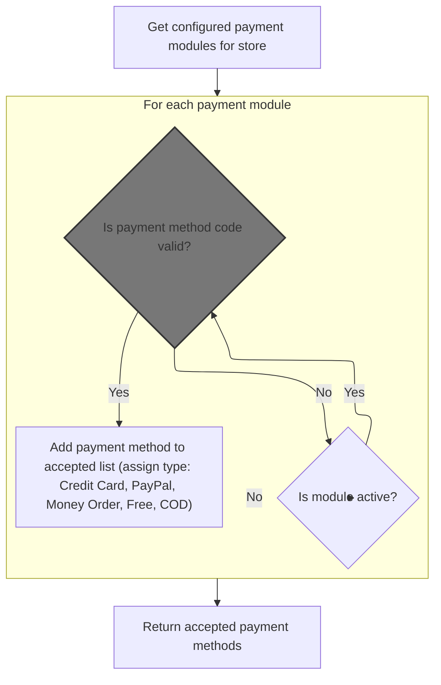
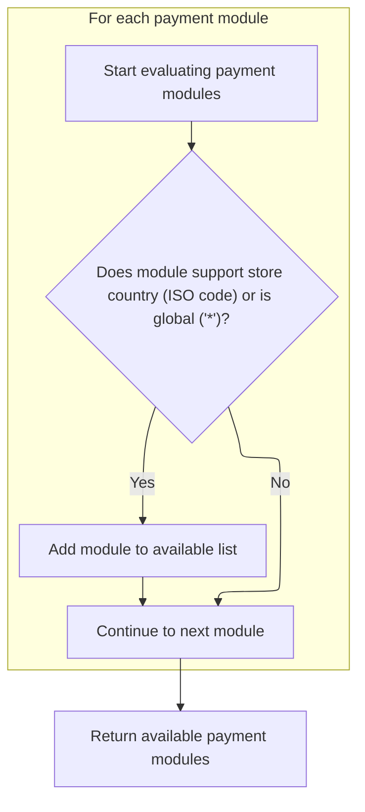
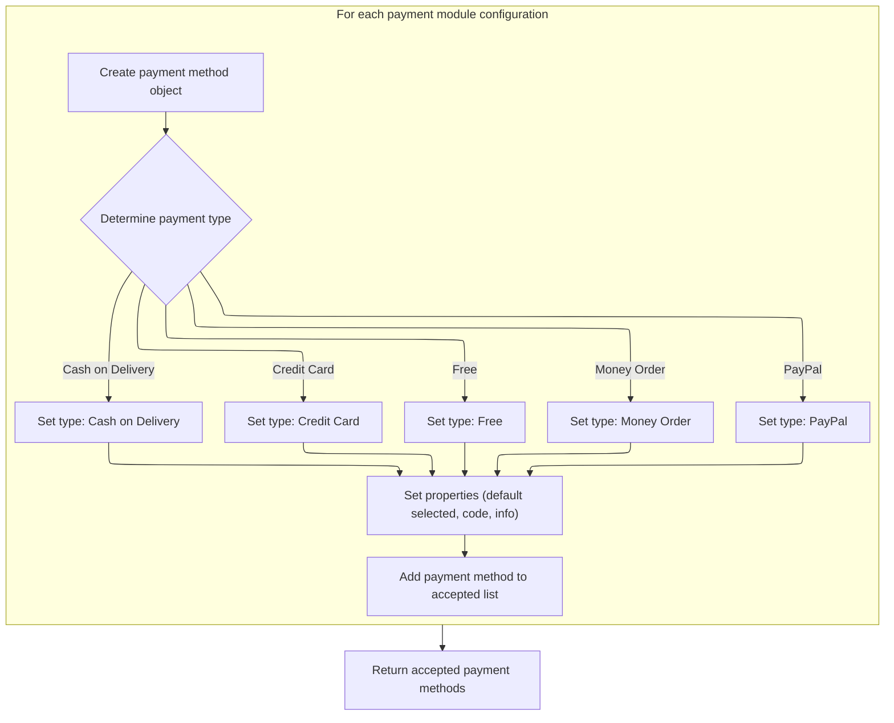

This document explains how the system assembles the list of payment methods a store can offer to customers. By evaluating the store's configuration and available payment modules, the flow filters out ineligible options and constructs a tailored list of accepted payment methods for use during checkout.

# Filtering and assembling accepted payment methods



<SwmSnippet path="/shopizer/sm-core/src/main/java/com/salesmanager/core/business/payments/service/PaymentServiceImpl.java" line="92">

---

In <SwmToken path="shopizer/sm-core/src/main/java/com/salesmanager/core/business/payments/service/PaymentServiceImpl.java" pos="92:8:8" line-data="	public List&lt;PaymentMethod&gt; getAcceptedPaymentMethods(MerchantStore store) throws ServiceException {">`getAcceptedPaymentMethods`</SwmToken>, we start by grabbing all configured payment modules for the store and loop through them. For each active module, we need to fetch its full definition using <SwmToken path="shopizer/sm-core/src/main/java/com/salesmanager/core/business/payments/service/PaymentServiceImpl.java" pos="102:9:9" line-data="				IntegrationModule md = this.getPaymentMethodByCode(store, config.getModuleCode());">`getPaymentMethodByCode`</SwmToken>, since the config alone doesn't have all the info we need to build the <SwmToken path="shopizer/sm-core/src/main/java/com/salesmanager/core/business/payments/service/PaymentServiceImpl.java" pos="92:5:5" line-data="	public List&lt;PaymentMethod&gt; getAcceptedPaymentMethods(MerchantStore store) throws ServiceException {">`PaymentMethod`</SwmToken> objects. If the module isn't found, we skip it.

```java
	public List<PaymentMethod> getAcceptedPaymentMethods(MerchantStore store) throws ServiceException {
		
		Map<String,IntegrationConfiguration> modules =  this.getPaymentModulesConfigured(store);

		List<PaymentMethod> returnModules = new ArrayList<PaymentMethod>();
		
		for(String module : modules.keySet()) {
			IntegrationConfiguration config = modules.get(module);
			if(config.isActive()) {
				
				IntegrationModule md = this.getPaymentMethodByCode(store, config.getModuleCode());
				if(md==null) {
					continue;
				}
```

---

</SwmSnippet>

## Looking up payment module details by code

<SwmSnippet path="/shopizer/sm-core/src/main/java/com/salesmanager/core/business/payments/service/PaymentServiceImpl.java" line="147">

---

<SwmToken path="shopizer/sm-core/src/main/java/com/salesmanager/core/business/payments/service/PaymentServiceImpl.java" pos="147:5:5" line-data="	public IntegrationModule getPaymentMethodByCode(MerchantStore store,">`getPaymentMethodByCode`</SwmToken> loads all payment modules for the store and then searches for the one matching the given code. We need to call <SwmToken path="shopizer/sm-core/src/main/java/com/salesmanager/core/business/payments/service/PaymentServiceImpl.java" pos="149:10:10" line-data="		List&lt;IntegrationModule&gt; modules =  getPaymentMethods(store);">`getPaymentMethods`</SwmToken> first because that's the only way to get the full list of modules to search through.

```java
	public IntegrationModule getPaymentMethodByCode(MerchantStore store,
			String code) throws ServiceException {
		List<IntegrationModule> modules =  getPaymentMethods(store);

		for(IntegrationModule module : modules) {
			if(module.getCode().equals(code)) {
				
				return module;
			}
		}
		
		return null;
	}
```

---

</SwmSnippet>

## Filtering payment modules by region

<SwmSnippet path="/shopizer/sm-core/src/main/java/com/salesmanager/core/business/payments/service/PaymentServiceImpl.java" line="75">

---

In <SwmToken path="shopizer/sm-core/src/main/java/com/salesmanager/core/business/payments/service/PaymentServiceImpl.java" pos="75:8:8" line-data="	public List&lt;IntegrationModule&gt; getPaymentMethods(MerchantStore store) throws ServiceException {">`getPaymentMethods`</SwmToken>, we start by fetching all payment modules from <SwmToken path="shopizer/sm-core/src/main/java/com/salesmanager/core/business/system/service/ModuleConfigurationServiceImpl.java" pos="22:4:4" line-data="public class ModuleConfigurationServiceImpl extends">`ModuleConfigurationServiceImpl`</SwmToken>. This is needed because we have to filter them by region later, and the service gives us the full list with all the details.

```java
	public List<IntegrationModule> getPaymentMethods(MerchantStore store) throws ServiceException {
		
		List<IntegrationModule> modules =  moduleConfigurationService.getIntegrationModules(PAYMENT_MODULES);
```

---

</SwmSnippet>

### Loading and parsing payment module configurations

```mermaid
%%{init: {"flowchart": {"defaultRenderer": "elk"}} }%%
flowchart TD
    node1["Request integration modules for type"]
    click node1 openCode "shopizer/sm-core/src/main/java/com/salesmanager/core/business/system/service/ModuleConfigurationServiceImpl.java:50:53"
    node1 --> node2{"Are modules in cache?"}
    click node2 openCode "shopizer/sm-core/src/main/java/com/salesmanager/core/business/system/service/ModuleConfigurationServiceImpl.java:57:58"
    node2 -->|"Yes"| node3["Return cached modules"]
    click node3 openCode "shopizer/sm-core/src/main/java/com/salesmanager/core/business/system/service/ModuleConfigurationServiceImpl.java:57:58"
    node2 -->|"No"| node4["Load modules from database"]
    click node4 openCode "shopizer/sm-core/src/main/java/com/salesmanager/core/business/system/service/ModuleConfigurationServiceImpl.java:59:59"
    node4 --> node5["Enrich modules"]
    click node5 openCode "shopizer/sm-core/src/main/java/com/salesmanager/core/business/system/service/ModuleConfigurationServiceImpl.java:61:126"
    subgraph loop1["For each module"]
      node5 --> node6{"Does module have regions?"}
      click node6 openCode "shopizer/sm-core/src/main/java/com/salesmanager/core/business/system/service/ModuleConfigurationServiceImpl.java:63:71"
      node6 -->|"Yes"| node7["Parse regions"]
      click node7 openCode "shopizer/sm-core/src/main/java/com/salesmanager/core/business/system/service/ModuleConfigurationServiceImpl.java:65:70"
      subgraph loop2["For each region"]
        node7 --> node8["Add region to module"]
        click node8 openCode "shopizer/sm-core/src/main/java/com/salesmanager/core/business/system/service/ModuleConfigurationServiceImpl.java:69:70"
      end
      node6 -->|"No"| node9["Skip regions"]
      click node9 openCode "shopizer/sm-core/src/main/java/com/salesmanager/core/business/system/service/ModuleConfigurationServiceImpl.java:71:71"
      node7 --> node10{"Does module have details?"}
      node9 --> node10
      click node10 openCode "shopizer/sm-core/src/main/java/com/salesmanager/core/business/system/service/ModuleConfigurationServiceImpl.java:74:83"
      node10 -->|"Yes"| node11["Parse and set details"]
      click node11 openCode "shopizer/sm-core/src/main/java/com/salesmanager/core/business/system/service/ModuleConfigurationServiceImpl.java:79:80"
      node10 -->|"No"| node12["Skip details"]
      click node12 openCode "shopizer/sm-core/src/main/java/com/salesmanager/core/business/system/service/ModuleConfigurationServiceImpl.java:83:83"
      node11 --> node13{"Does module have configuration?"}
      node12 --> node13
      click node13 openCode "shopizer/sm-core/src/main/java/com/salesmanager/core/business/system/service/ModuleConfigurationServiceImpl.java:86:123"
      node13 -->|"Yes"| node14["Parse configuration"]
      click node14 openCode "shopizer/sm-core/src/main/java/com/salesmanager/core/business/system/service/ModuleConfigurationServiceImpl.java:91:120"
      subgraph loop3["For each configuration entry"]
        node14 --> node15["Add configuration to module"]
        click node15 openCode "shopizer/sm-core/src/main/java/com/salesmanager/core/business/system/service/ModuleConfigurationServiceImpl.java:99:114"
      end
      node13 -->|"No"| node16["Skip configuration"]
      click node16 openCode "shopizer/sm-core/src/main/java/com/salesmanager/core/business/system/service/ModuleConfigurationServiceImpl.java:123:123"
    end
    node5 --> node17["Store enriched modules in cache"]
    click node17 openCode "shopizer/sm-core/src/main/java/com/salesmanager/core/business/system/service/ModuleConfigurationServiceImpl.java:127:127"
    node17 --> node18["Return enriched modules"]
    click node18 openCode "shopizer/sm-core/src/main/java/com/salesmanager/core/business/system/service/ModuleConfigurationServiceImpl.java:133:133"

classDef HeadingStyle fill:#777777,stroke:#333,stroke-width:2px;

%% Swimm:
%% %%{init: {"flowchart": {"defaultRenderer": "elk"}} }%%
%% flowchart TD
%%     node1["Request integration modules for type"]
%%     click node1 openCode "<SwmPath>[shopizer/…/service/ModuleConfigurationServiceImpl.java](shopizer/sm-core/src/main/java/com/salesmanager/core/business/system/service/ModuleConfigurationServiceImpl.java)</SwmPath>:50:53"
%%     node1 --> node2{"Are modules in cache?"}
%%     click node2 openCode "<SwmPath>[shopizer/…/service/ModuleConfigurationServiceImpl.java](shopizer/sm-core/src/main/java/com/salesmanager/core/business/system/service/ModuleConfigurationServiceImpl.java)</SwmPath>:57:58"
%%     node2 -->|"Yes"| node3["Return cached modules"]
%%     click node3 openCode "<SwmPath>[shopizer/…/service/ModuleConfigurationServiceImpl.java](shopizer/sm-core/src/main/java/com/salesmanager/core/business/system/service/ModuleConfigurationServiceImpl.java)</SwmPath>:57:58"
%%     node2 -->|"No"| node4["Load modules from database"]
%%     click node4 openCode "<SwmPath>[shopizer/…/service/ModuleConfigurationServiceImpl.java](shopizer/sm-core/src/main/java/com/salesmanager/core/business/system/service/ModuleConfigurationServiceImpl.java)</SwmPath>:59:59"
%%     node4 --> node5["Enrich modules"]
%%     click node5 openCode "<SwmPath>[shopizer/…/service/ModuleConfigurationServiceImpl.java](shopizer/sm-core/src/main/java/com/salesmanager/core/business/system/service/ModuleConfigurationServiceImpl.java)</SwmPath>:61:126"
%%     subgraph loop1["For each module"]
%%       node5 --> node6{"Does module have regions?"}
%%       click node6 openCode "<SwmPath>[shopizer/…/service/ModuleConfigurationServiceImpl.java](shopizer/sm-core/src/main/java/com/salesmanager/core/business/system/service/ModuleConfigurationServiceImpl.java)</SwmPath>:63:71"
%%       node6 -->|"Yes"| node7["Parse regions"]
%%       click node7 openCode "<SwmPath>[shopizer/…/service/ModuleConfigurationServiceImpl.java](shopizer/sm-core/src/main/java/com/salesmanager/core/business/system/service/ModuleConfigurationServiceImpl.java)</SwmPath>:65:70"
%%       subgraph loop2["For each region"]
%%         node7 --> node8["Add region to module"]
%%         click node8 openCode "<SwmPath>[shopizer/…/service/ModuleConfigurationServiceImpl.java](shopizer/sm-core/src/main/java/com/salesmanager/core/business/system/service/ModuleConfigurationServiceImpl.java)</SwmPath>:69:70"
%%       end
%%       node6 -->|"No"| node9["Skip regions"]
%%       click node9 openCode "<SwmPath>[shopizer/…/service/ModuleConfigurationServiceImpl.java](shopizer/sm-core/src/main/java/com/salesmanager/core/business/system/service/ModuleConfigurationServiceImpl.java)</SwmPath>:71:71"
%%       node7 --> node10{"Does module have details?"}
%%       node9 --> node10
%%       click node10 openCode "<SwmPath>[shopizer/…/service/ModuleConfigurationServiceImpl.java](shopizer/sm-core/src/main/java/com/salesmanager/core/business/system/service/ModuleConfigurationServiceImpl.java)</SwmPath>:74:83"
%%       node10 -->|"Yes"| node11["Parse and set details"]
%%       click node11 openCode "<SwmPath>[shopizer/…/service/ModuleConfigurationServiceImpl.java](shopizer/sm-core/src/main/java/com/salesmanager/core/business/system/service/ModuleConfigurationServiceImpl.java)</SwmPath>:79:80"
%%       node10 -->|"No"| node12["Skip details"]
%%       click node12 openCode "<SwmPath>[shopizer/…/service/ModuleConfigurationServiceImpl.java](shopizer/sm-core/src/main/java/com/salesmanager/core/business/system/service/ModuleConfigurationServiceImpl.java)</SwmPath>:83:83"
%%       node11 --> node13{"Does module have configuration?"}
%%       node12 --> node13
%%       click node13 openCode "<SwmPath>[shopizer/…/service/ModuleConfigurationServiceImpl.java](shopizer/sm-core/src/main/java/com/salesmanager/core/business/system/service/ModuleConfigurationServiceImpl.java)</SwmPath>:86:123"
%%       node13 -->|"Yes"| node14["Parse configuration"]
%%       click node14 openCode "<SwmPath>[shopizer/…/service/ModuleConfigurationServiceImpl.java](shopizer/sm-core/src/main/java/com/salesmanager/core/business/system/service/ModuleConfigurationServiceImpl.java)</SwmPath>:91:120"
%%       subgraph loop3["For each configuration entry"]
%%         node14 --> node15["Add configuration to module"]
%%         click node15 openCode "<SwmPath>[shopizer/…/service/ModuleConfigurationServiceImpl.java](shopizer/sm-core/src/main/java/com/salesmanager/core/business/system/service/ModuleConfigurationServiceImpl.java)</SwmPath>:99:114"
%%       end
%%       node13 -->|"No"| node16["Skip configuration"]
%%       click node16 openCode "<SwmPath>[shopizer/…/service/ModuleConfigurationServiceImpl.java](shopizer/sm-core/src/main/java/com/salesmanager/core/business/system/service/ModuleConfigurationServiceImpl.java)</SwmPath>:123:123"
%%     end
%%     node5 --> node17["Store enriched modules in cache"]
%%     click node17 openCode "<SwmPath>[shopizer/…/service/ModuleConfigurationServiceImpl.java](shopizer/sm-core/src/main/java/com/salesmanager/core/business/system/service/ModuleConfigurationServiceImpl.java)</SwmPath>:127:127"
%%     node17 --> node18["Return enriched modules"]
%%     click node18 openCode "<SwmPath>[shopizer/…/service/ModuleConfigurationServiceImpl.java](shopizer/sm-core/src/main/java/com/salesmanager/core/business/system/service/ModuleConfigurationServiceImpl.java)</SwmPath>:133:133"
%% 
%% classDef HeadingStyle fill:#777777,stroke:#333,stroke-width:2px;
```



<SwmSnippet path="/shopizer/sm-core/src/main/java/com/salesmanager/core/business/system/service/ModuleConfigurationServiceImpl.java" line="50">

---

In <SwmToken path="shopizer/sm-core/src/main/java/com/salesmanager/core/business/system/service/ModuleConfigurationServiceImpl.java" pos="50:8:8" line-data="	public List&lt;IntegrationModule&gt; getIntegrationModules(String module) {">`getIntegrationModules`</SwmToken>, we load modules from cache or DB, then parse their regions, details, and config JSON strings to populate extra fields. This makes sure each module has all the info needed for filtering and later use. The cache key is just '<SwmToken path="shopizer/sm-core/src/main/java/com/salesmanager/core/business/system/service/ModuleConfigurationServiceImpl.java" pos="57:17:17" line-data="			modules = (List&lt;IntegrationModule&gt;) cache.getFromCache(&quot;INTEGRATION_M)&quot; + module);">`INTEGRATION_M`</SwmToken>)' plus the module name, which is arbitrary but used for lookup.

```java
	public List<IntegrationModule> getIntegrationModules(String module) {
		
		
		List<IntegrationModule> modules = null;
		try {
			
			//CacheUtils cacheUtils = CacheUtils.getInstance();
			modules = (List<IntegrationModule>) cache.getFromCache("INTEGRATION_M)" + module);
			if(modules==null) {
				modules = integrationModuleDao.getModulesConfiguration(module);
				//set json objects
				for(IntegrationModule mod : modules) {
					
					String regions = mod.getRegions();
					if(regions!=null) {
						Object objRegions=JSONValue.parse(regions); 
						JSONArray arrayRegions=(JSONArray)objRegions;
						Iterator i = arrayRegions.iterator();
						while(i.hasNext()) {
							mod.getRegionsSet().add((String)i.next());
						}
					}
					
					
					String details = mod.getConfigDetails();
					if(details!=null) {
						
						//Map objects = mapper.readValue(config, Map.class);

						Map<String,String> objDetails= (Map<String, String>) JSONValue.parse(details); 
						mod.setDetails(objDetails);

						
					}
					
					
					String configs = mod.getConfiguration();
					if(configs!=null) {
						
						//Map objects = mapper.readValue(config, Map.class);

						Object objConfigs=JSONValue.parse(configs); 
						JSONArray arrayConfigs=(JSONArray)objConfigs;
						
						Map<String,ModuleConfig> moduleConfigs = new HashMap<String,ModuleConfig>();
						
						Iterator i = arrayConfigs.iterator();
						while(i.hasNext()) {
							
							Map values = (Map)i.next();
							String env = (String)values.get("env");
		            		ModuleConfig config = new ModuleConfig();
		            		config.setScheme((String)values.get("scheme"));
		            		config.setHost((String)values.get("host"));
		            		config.setPort((String)values.get("port"));
		            		config.setUri((String)values.get("uri"));
		            		config.setEnv((String)values.get("env"));
		            		if((String)values.get("config1")!=null) {
		            			config.setConfig1((String)values.get("config1"));
		            		}
		            		if((String)values.get("config2")!=null) {
		            			config.setConfig1((String)values.get("config2"));
		            		}
		            		
		            		moduleConfigs.put(env, config);
		            		
		            		
							
						}
						
						mod.setModuleConfigs(moduleConfigs);
						

					}


				}
```

---

</SwmSnippet>

<SwmSnippet path="/shopizer/sm-core/src/main/java/com/salesmanager/core/business/system/service/ModuleConfigurationServiceImpl.java" line="127">

---

GetIntegrationModules returns a list of <SwmToken path="shopizer/sm-core/src/main/java/com/salesmanager/core/business/payments/service/PaymentServiceImpl.java" pos="75:5:5" line-data="	public List&lt;IntegrationModule&gt; getPaymentMethods(MerchantStore store) throws ServiceException {">`IntegrationModule`</SwmToken> objects with their regions, details, and configs parsed from JSON, and caches the result for next time.

```java
				cache.putInCache(modules, "INTEGRATION_M)" + module);
			}

		} catch (Exception e) {
			LOGGER.error("getIntegrationModules()", e);
		}
		return modules;
		
		
	}
```

---

</SwmSnippet>

### Filtering modules by store country or wildcard



<SwmSnippet path="/shopizer/sm-core/src/main/java/com/salesmanager/core/business/payments/service/PaymentServiceImpl.java" line="78">

---

Back in <SwmToken path="shopizer/sm-core/src/main/java/com/salesmanager/core/business/payments/service/PaymentServiceImpl.java" pos="75:8:8" line-data="	public List&lt;IntegrationModule&gt; getPaymentMethods(MerchantStore store) throws ServiceException {">`getPaymentMethods`</SwmToken>, after getting the modules from <SwmToken path="shopizer/sm-core/src/main/java/com/salesmanager/core/business/system/service/ModuleConfigurationServiceImpl.java" pos="22:4:4" line-data="public class ModuleConfigurationServiceImpl extends">`ModuleConfigurationServiceImpl`</SwmToken>, we filter them by checking if their regions include the store's country ISO code or '\*'. Only those modules get added to the return list.

```java
		List<IntegrationModule> returnModules = new ArrayList<IntegrationModule>();
		
		for(IntegrationModule module : modules) {
			if(module.getRegionsSet().contains(store.getCountry().getIsoCode())
					|| module.getRegionsSet().contains("*")) {
				
				returnModules.add(module);
			}
		}
```

---

</SwmSnippet>

## Building the final accepted payment methods list



<SwmSnippet path="/shopizer/sm-core/src/main/java/com/salesmanager/core/business/payments/service/PaymentServiceImpl.java" line="106">

---

After returning from <SwmToken path="shopizer/sm-core/src/main/java/com/salesmanager/core/business/payments/service/PaymentServiceImpl.java" pos="102:9:9" line-data="				IntegrationModule md = this.getPaymentMethodByCode(store, config.getModuleCode());">`getPaymentMethodByCode`</SwmToken>, <SwmToken path="shopizer/sm-core/src/main/java/com/salesmanager/core/business/payments/service/PaymentServiceImpl.java" pos="92:8:8" line-data="	public List&lt;PaymentMethod&gt; getAcceptedPaymentMethods(MerchantStore store) throws ServiceException {">`getAcceptedPaymentMethods`</SwmToken> builds the <SwmToken path="shopizer/sm-core/src/main/java/com/salesmanager/core/business/payments/service/PaymentServiceImpl.java" pos="106:1:1" line-data="				PaymentMethod paymentMethod = new PaymentMethod();">`PaymentMethod`</SwmToken> objects, sets their type based on the module, and adds them to the final list to return.

```java
				PaymentMethod paymentMethod = new PaymentMethod();
				
				paymentMethod.setDefaultSelected(config.isDefaultSelected());
				paymentMethod.setPaymentMethodCode(config.getModuleCode());
				paymentMethod.setModule(md);
				paymentMethod.setInformations(config);
				PaymentType type = PaymentType.COD;
				if(md.getType().equalsIgnoreCase(PaymentType.CREDITCARD.name())) {
					type = PaymentType.CREDITCARD;
				} else 	if(md.getType().equalsIgnoreCase(PaymentType.FREE.name())) {
					type = PaymentType.FREE;
				} else 	if(md.getType().equalsIgnoreCase(PaymentType.MONEYORDER.name())) {
					type = PaymentType.MONEYORDER;
				} else 	if(md.getType().equalsIgnoreCase(PaymentType.PAYPAL.name())) {
					type = PaymentType.PAYPAL;
				}
				paymentMethod.setPaymentType(type);
				returnModules.add(paymentMethod);
			}
		}
		
		return returnModules;
		
		
	}
```

---

</SwmSnippet>

&nbsp;

*This is an auto-generated document by Swimm 🌊 and has not yet been verified by a human*

<SwmMeta version="3.0.0" repo-id="Z2l0aHViJTNBJTNBU2hvcGl6ZXIlM0ElM0F1bWFsaW5nYXN3YW1p" repo-name="Shopizer"><sup>Powered by [Swimm](https://app.swimm.io/)</sup></SwmMeta>
