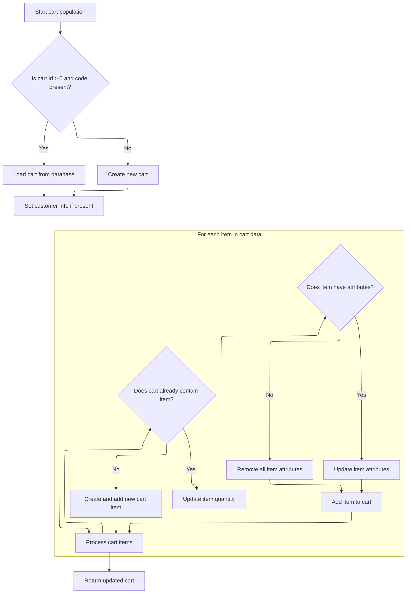

This document describes how users are presented with a list of products when browsing a specific category. When a user selects a category, the system validates the store and category, gathers all relevant products (including those in subcategories), formats them for display with pricing, and synchronizes the user's cart state so that cart details are included in the response.

# Fetching Products for a Category

This section governs how products are fetched and prepared for display when a user browses a specific category. It ensures that only valid merchant stores and categories are used, collects all relevant products, and formats them for the client, including pricing and cart information.

| Category        | Rule Name                      | Description                                                                                                                                                |
| --------------- | ------------------------------ | ---------------------------------------------------------------------------------------------------------------------------------------------------------- |
| Data validation | Valid Merchant Store Required  | A valid merchant store code must be provided in the request. If the merchant store does not exist, the request is rejected with an error.                  |
| Data validation | Valid Category Required        | A valid category identifier (friendly URL) must be provided. If the category does not exist for the merchant store, the request is rejected with an error. |
| Business logic  | Include Subcategory Products   | Products must be fetched for the specified category and all its subcategories, ensuring comprehensive product listings for the user's browsing context.    |
| Business logic  | Product Pricing Display        | Product data returned to the client must include pricing information, formatted for display.                                                               |
| Business logic  | Client-Friendly Product Format | The product list returned must be formatted in a client-friendly structure, including all necessary product details for display.                           |

<SwmSnippet path="/shopizer/sm-shop/src/main/java/com/salesmanager/web/shop/controller/category/ShoppingCategoryController.java" line="454">

---

In <SwmToken path="shopizer/sm-shop/src/main/java/com/salesmanager/web/shop/controller/category/ShoppingCategoryController.java" pos="454:5:5" line-data="	public ProductList getProducts(@PathVariable final String store, @PathVariable final String language, @PathVariable final String category, Model model, HttpServletRequest request, HttpServletResponse response) throws Exception {">`getProducts`</SwmToken>, we start by validating and loading the merchant store and category based on the request parameters. If either is missing, we bail out with an error. Then, we build a lineage string to fetch all related categories, collect their IDs, and prep for product retrieval. This sets up the context for which products will be shown.

```java
	public ProductList getProducts(@PathVariable final String store, @PathVariable final String language, @PathVariable final String category, Model model, HttpServletRequest request, HttpServletResponse response) throws Exception {
		
		//http://localhost:8080/sm-shop/services/public/products/DEFAULT/en/book.html

		try {

		
			/**
			 * How to Spring MVC Rest web service - ajax / jquery
			 * http://codetutr.com/2013/04/09/spring-mvc-easy-rest-based-json-services-with-responsebody/
			 */
			
			MerchantStore merchantStore = (MerchantStore)request.getAttribute(Constants.MERCHANT_STORE);
			Map<String,Language> langs = languageService.getLanguagesMap();

			if(merchantStore!=null) {
				if(!merchantStore.getCode().equals(store)) {
					merchantStore = null; //reset for the current request
				}
			}
			
			if(merchantStore== null) {
				merchantStore = merchantStoreService.getByCode(store);
			}
			
			if(merchantStore==null) {
				LOGGER.error("Merchant store is null for code " + store);
				response.sendError(503, "Merchant store is null for code " + store);//TODO localized message
				return null;
			}
			
			//get the category by code
			Category cat = categoryService.getBySeUrl(merchantStore, category);

			if(cat==null) {
				LOGGER.error("Category with friendly url " + category + " is null");
				response.sendError(503, "Category is null");//TODO localized message
			}
			
			String lineage = new StringBuilder().append(cat.getLineage()).append(cat.getId()).append("/").toString();
			
			List<Category> categories = categoryService.listByLineage(store, lineage);
			
			List<Long> ids = new ArrayList<Long>();
			if(categories!=null && categories.size()>0) {
				for(Category c : categories) {
					ids.add(c.getId());
				}
```

---

</SwmSnippet>

<SwmSnippet path="/shopizer/sm-shop/src/main/java/com/salesmanager/web/shop/controller/category/ShoppingCategoryController.java" line="503">

---

After gathering category IDs and fetching products, we use a populator to convert each product into a client-friendly format, including pricing. This prepares the product list for the response. The next step is to handle cart data, so we call the <SwmToken path="shopizer/sm-shop/src/main/java/com/salesmanager/web/populator/shoppingCart/ShoppingCartModelPopulator.java" pos="37:4:4" line-data="public class ShoppingCartModelPopulator">`ShoppingCartModelPopulator`</SwmToken> to sync cart state before finalizing the response.

```java
			ids.add(cat.getId());
			
			Language lang = langs.get(language);
			if(lang==null) {
				lang = langs.get(Constants.DEFAULT_LANGUAGE);
			}
			
			List<com.salesmanager.core.business.catalog.product.model.Product> products = productService.getProducts(ids, lang);
			
			ProductList productList = new ProductList();
			
			ReadableProductPopulator populator = new ReadableProductPopulator();
			populator.setPricingService(pricingService);

			for(Product product : products) {
				//create new proxy product
				ReadableProduct  p = populator.populate(product, new ReadableProduct(), merchantStore, lang);
				productList.getProducts().add(p);
	
			}
			
```

---

</SwmSnippet>

## Synchronizing Cart State



This section governs how the <SwmToken path="shopizer/sm-shop/src/main/java/com/salesmanager/web/populator/shoppingCart/ShoppingCartModelPopulator.java" pos="85:3:3" line-data="    public ShoppingCart populate(ShoppingCartData shoppingCart,ShoppingCart cartMdel,final MerchantStore store, Language language)">`ShoppingCart`</SwmToken> model is synchronized with incoming cart data, ensuring that the cart state in the system matches the user's intended cart contents, including items and their attributes.

| Category       | Rule Name                      | Description                                                                                                                                                                                                                             |
| -------------- | ------------------------------ | --------------------------------------------------------------------------------------------------------------------------------------------------------------------------------------------------------------------------------------- |
| Business logic | Cart existence check           | If the incoming cart data contains both a cart id greater than zero and a non-empty cart code, attempt to load the corresponding cart from the database. If not found, create a new cart using the provided code and store information. |
| Business logic | Cart initialization            | When creating a new cart, assign the provided cart code, store, and customer information if available.                                                                                                                                  |
| Business logic | Item quantity synchronization  | For each item in the incoming cart data, if the cart already contains the item (matched by id), update its quantity to match the incoming data.                                                                                         |
| Business logic | Item attribute synchronization | If an existing cart item has attributes in the incoming data, update the item's attributes to match. If no attributes are present, remove all attributes from the item.                                                                 |
| Business logic | New item addition              | If an item in the incoming cart data does not exist in the current cart, create a new cart item and add it to the cart.                                                                                                                 |

<SwmSnippet path="/shopizer/sm-shop/src/main/java/com/salesmanager/web/populator/shoppingCart/ShoppingCartModelPopulator.java" line="85">

---

In <SwmToken path="shopizer/sm-shop/src/main/java/com/salesmanager/web/populator/shoppingCart/ShoppingCartModelPopulator.java" pos="85:5:5" line-data="    public ShoppingCart populate(ShoppingCartData shoppingCart,ShoppingCart cartMdel,final MerchantStore store, Language language)">`populate`</SwmToken>, we check if the cart data has a valid id and code. If so, we try to fetch the cart from the DB; if not found, we create a new one and set its code, store, and customer (from hidden context). Then, we sync the cart items and their attributes by matching ids, updating quantities, or creating new items as needed. This keeps the cart model aligned with the incoming data.

```java
    public ShoppingCart populate(ShoppingCartData shoppingCart,ShoppingCart cartMdel,final MerchantStore store, Language language)
    {


        // if id >0 get the original from the database, override products
       try{
        if ( shoppingCart.getId() > 0  && StringUtils.isNotBlank( shoppingCart.getCode()))
        {
            cartMdel = shoppingCartService.getByCode( shoppingCart.getCode(), store );
            if(cartMdel==null){
                cartMdel=new ShoppingCart();
                cartMdel.setShoppingCartCode( shoppingCart.getCode() );
                cartMdel.setMerchantStore( store );
                if ( customer != null )
                {
                    cartMdel.setCustomerId( customer.getId() );
                }
                shoppingCartService.create( cartMdel );
            }
        }
        else
        {
            cartMdel.setShoppingCartCode( shoppingCart.getCode() );
            cartMdel.setMerchantStore( store );
            if ( customer != null )
            {
                cartMdel.setCustomerId( customer.getId() );
            }
            shoppingCartService.create( cartMdel );
        }

        List<ShoppingCartItem> items = shoppingCart.getShoppingCartItems();
        Set<com.salesmanager.core.business.shoppingcart.model.ShoppingCartItem> newItems =
            new HashSet<com.salesmanager.core.business.shoppingcart.model.ShoppingCartItem>();
        if ( items != null && items.size() > 0 )
        {
            for ( ShoppingCartItem item : items )
            {

                Set<com.salesmanager.core.business.shoppingcart.model.ShoppingCartItem> cartItems = cartMdel.getLineItems();
                if ( cartItems != null && cartItems.size() > 0 )
                {

                    for ( com.salesmanager.core.business.shoppingcart.model.ShoppingCartItem dbItem : cartItems )
                    {
                        if ( dbItem.getId().longValue() == item.getId() )
                        {
                            dbItem.setQuantity( item.getQuantity() );
                            // compare attributes
                            Set<com.salesmanager.core.business.shoppingcart.model.ShoppingCartAttributeItem> attributes =
                                dbItem.getAttributes();
                            Set<com.salesmanager.core.business.shoppingcart.model.ShoppingCartAttributeItem> newAttributes =
                                new HashSet<com.salesmanager.core.business.shoppingcart.model.ShoppingCartAttributeItem>();
                            List<ShoppingCartAttribute> cartAttributes = item.getShoppingCartAttributes();
                            if ( !CollectionUtils.isEmpty( cartAttributes ) )
                            {
                                for ( ShoppingCartAttribute attribute : cartAttributes )
                                {
                                    for ( com.salesmanager.core.business.shoppingcart.model.ShoppingCartAttributeItem dbAttribute : attributes )
                                    {
                                        if ( dbAttribute.getId().longValue() == attribute.getId() )
                                        {
                                            newAttributes.add( dbAttribute );
                                        }
                                    }
                                }
                                
                                dbItem.setAttributes( newAttributes );
                            }
                            else
                            {
                                dbItem.removeAllAttributes();
                            }
                            newItems.add( dbItem );
                        }
                    }
                }
                else
                {// create new item
                    com.salesmanager.core.business.shoppingcart.model.ShoppingCartItem cartItem =
                        createCartItem( cartMdel, item, store );
                    Set<com.salesmanager.core.business.shoppingcart.model.ShoppingCartItem> lineItems =
                        cartMdel.getLineItems();
                    if ( lineItems == null )
                    {
                        lineItems = new HashSet<com.salesmanager.core.business.shoppingcart.model.ShoppingCartItem>();
                        cartMdel.setLineItems( lineItems );
                    }
                    lineItems.add( cartItem );
                    shoppingCartService.update( cartMdel );
                }
            }// end for
```

---

</SwmSnippet>

<SwmSnippet path="/shopizer/sm-shop/src/main/java/com/salesmanager/web/populator/shoppingCart/ShoppingCartModelPopulator.java" line="176">

---

We return the updated <SwmToken path="shopizer/sm-shop/src/main/java/com/salesmanager/web/populator/shoppingCart/ShoppingCartModelPopulator.java" pos="85:3:3" line-data="    public ShoppingCart populate(ShoppingCartData shoppingCart,ShoppingCart cartMdel,final MerchantStore store, Language language)">`ShoppingCart`</SwmToken> model, which now reflects all changes from the incoming cart data, unless an error was thrown.

```java
            }// end for
        }// end if
       }catch(ServiceException se){
           LOG.error( "Error while converting cart data to cart model.."+se );
           throw new ConversionException( "Unable to create cart model", se ); 
       }
       catch (Exception ex){
           LOG.error( "Error while converting cart data to cart model.."+ex );
           throw new ConversionException( "Unable to create cart model", ex );  
       }

        return cartMdel;
    }
```

---

</SwmSnippet>

## Finalizing Product List Response

<SwmSnippet path="/shopizer/sm-shop/src/main/java/com/salesmanager/web/shop/controller/category/ShoppingCategoryController.java" line="524">

---

Back in <SwmToken path="shopizer/sm-shop/src/main/java/com/salesmanager/web/shop/controller/category/ShoppingCategoryController.java" pos="524:7:7" line-data="			productList.setProductCount(productList.getProducts().size());">`getProducts`</SwmToken>, after syncing the cart state, we finalize the product list by setting the count and returning it. If anything failed, we log and send an error response.

```java
			productList.setProductCount(productList.getProducts().size());
			return productList;
			
		
		} catch (Exception e) {
			LOGGER.error("Error while getting category",e);
			response.sendError(503, "Error while getting category");
		}
		
		return null;
	}
```

---

</SwmSnippet>

&nbsp;

*This is an auto-generated document by Swimm 🌊 and has not yet been verified by a human*

<SwmMeta version="3.0.0" repo-id="Z2l0aHViJTNBJTNBU2hvcGl6ZXIlM0ElM0F1bWFsaW5nYXN3YW1p" repo-name="Shopizer"><sup>Powered by [Swimm](https://app.swimm.io/)</sup></SwmMeta>
