This document describes how the system calculates a product price based on user-selected attributes and store context, and updates the shopping cart to reflect the user's latest selections. The flow ensures users see accurate pricing and their cart remains consistent with their choices.

# Calculating Product Price with Context and Attributes

```mermaid
%%{init: {"flowchart": {"defaultRenderer": "elk"}} }%%
flowchart TD
    node1["Start: User selects product and attributes"] --> node2["Fetch product and attributes"]
    click node1 openCode "shopizer/sm-shop/src/main/java/com/salesmanager/web/shop/controller/product/ShopProductController.java:321:323"
    click node2 openCode "shopizer/sm-shop/src/main/java/com/salesmanager/web/shop/controller/product/ShopProductController.java:324:333"
    
    subgraph loop1["For each selected attribute"]
      node2 --> node3{"Does attribute belong to product?"}
      click node3 openCode "shopizer/sm-shop/src/main/java/com/salesmanager/web/shop/controller/product/ShopProductController.java:334:338"
      node3 -->|"No"| node7["Return no price (invalid selection)"]
      click node7 openCode "shopizer/sm-shop/src/main/java/com/salesmanager/web/shop/controller/product/ShopProductController.java:336:337"
      node3 -->|"Yes"| node4["Check next attribute"]
      click node4 openCode "shopizer/sm-shop/src/main/java/com/salesmanager/web/shop/controller/product/ShopProductController.java:334:338"
      node4 --> node3
    end
    node3 -->|"All attributes valid"| node5["Calculate price based on attributes"]
    click node5 openCode "shopizer/sm-shop/src/main/java/com/salesmanager/web/shop/controller/product/ShopProductController.java:340:341"
    node5 --> node6["Convert price to user-friendly format"]
    click node6 openCode "shopizer/sm-shop/src/main/java/com/salesmanager/web/shop/controller/product/ShopProductController.java:342:344"
    node6 --> node8["Return readable price"]
    click node8 openCode "shopizer/sm-shop/src/main/java/com/salesmanager/web/shop/controller/product/ShopProductController.java:345:345"

classDef HeadingStyle fill:#777777,stroke:#333,stroke-width:2px;

%% Swimm:
%% %%{init: {"flowchart": {"defaultRenderer": "elk"}} }%%
%% flowchart TD
%%     node1["Start: User selects product and attributes"] --> node2["Fetch product and attributes"]
%%     click node1 openCode "<SwmPath>[shopizer/…/product/ShopProductController.java](shopizer/sm-shop/src/main/java/com/salesmanager/web/shop/controller/product/ShopProductController.java)</SwmPath>:321:323"
%%     click node2 openCode "<SwmPath>[shopizer/…/product/ShopProductController.java](shopizer/sm-shop/src/main/java/com/salesmanager/web/shop/controller/product/ShopProductController.java)</SwmPath>:324:333"
%%     
%%     subgraph loop1["For each selected attribute"]
%%       node2 --> node3{"Does attribute belong to product?"}
%%       click node3 openCode "<SwmPath>[shopizer/…/product/ShopProductController.java](shopizer/sm-shop/src/main/java/com/salesmanager/web/shop/controller/product/ShopProductController.java)</SwmPath>:334:338"
%%       node3 -->|"No"| node7["Return no price (invalid selection)"]
%%       click node7 openCode "<SwmPath>[shopizer/…/product/ShopProductController.java](shopizer/sm-shop/src/main/java/com/salesmanager/web/shop/controller/product/ShopProductController.java)</SwmPath>:336:337"
%%       node3 -->|"Yes"| node4["Check next attribute"]
%%       click node4 openCode "<SwmPath>[shopizer/…/product/ShopProductController.java](shopizer/sm-shop/src/main/java/com/salesmanager/web/shop/controller/product/ShopProductController.java)</SwmPath>:334:338"
%%       node4 --> node3
%%     end
%%     node3 -->|"All attributes valid"| node5["Calculate price based on attributes"]
%%     click node5 openCode "<SwmPath>[shopizer/…/product/ShopProductController.java](shopizer/sm-shop/src/main/java/com/salesmanager/web/shop/controller/product/ShopProductController.java)</SwmPath>:340:341"
%%     node5 --> node6["Convert price to user-friendly format"]
%%     click node6 openCode "<SwmPath>[shopizer/…/product/ShopProductController.java](shopizer/sm-shop/src/main/java/com/salesmanager/web/shop/controller/product/ShopProductController.java)</SwmPath>:342:344"
%%     node6 --> node8["Return readable price"]
%%     click node8 openCode "<SwmPath>[shopizer/…/product/ShopProductController.java](shopizer/sm-shop/src/main/java/com/salesmanager/web/shop/controller/product/ShopProductController.java)</SwmPath>:345:345"
%% 
%% classDef HeadingStyle fill:#777777,stroke:#333,stroke-width:2px;
```



This section governs how Shopizer calculates and returns a product price based on user-selected attributes and contextual <SwmPath>[shopizer/…/reference/language/](shopizer/sm-core-model/src/main/java/com/salesmanager/core/business/reference/language/)</SwmPath> information. It ensures only valid attribute selections are priced and presented to the user in a readable format.

| Category        | Rule Name                         | Description                                                                                                                                                            |
| --------------- | --------------------------------- | ---------------------------------------------------------------------------------------------------------------------------------------------------------------------- |
| Data validation | Attribute Ownership Validation    | The product price must be calculated using only attributes that belong to the selected product. If any attribute does not belong to the product, no price is returned. |
| Business logic  | Attribute-Based Price Calculation | The product price calculation must factor in all selected valid attributes, reflecting any attribute-specific price adjustments.                                       |
| Business logic  | Localized Price Formatting        | The returned price must be formatted in a user-friendly way, using the store's currency and language settings.                                                         |
| Business logic  | Contextual Price Calculation      | The product price calculation must use the current store context and language settings to ensure consistency with the user's shopping experience.                      |

<SwmSnippet path="/shopizer/sm-shop/src/main/java/com/salesmanager/web/shop/controller/product/ShopProductController.java" line="321">

---

<SwmToken path="shopizer/sm-shop/src/main/java/com/salesmanager/web/shop/controller/product/ShopProductController.java" pos="321:3:3" line-data="	ReadableProductPrice calculatePrice(@RequestParam(value=&quot;attributeIds[]&quot;) Long[] attributeIds, @PathVariable final Long productId, final HttpServletRequest request, final HttpServletResponse response, final Locale locale) throws Exception {">`calculatePrice`</SwmToken> kicks off by pulling <SwmToken path="shopizer/sm-shop/src/main/java/com/salesmanager/web/shop/controller/product/ShopProductController.java" pos="324:1:1" line-data="    	MerchantStore store = (MerchantStore)request.getAttribute(Constants.MERCHANT_STORE);">`MerchantStore`</SwmToken> and Language from the request attributes, which isn't obvious from the method signature. It then fetches the product and its attributes, making sure every attribute actually belongs to the product—otherwise, it bails out with null. After validating, it calculates the price using <SwmToken path="shopizer/sm-shop/src/main/java/com/salesmanager/web/shop/controller/product/ShopProductController.java" pos="340:7:7" line-data="		FinalPrice price = pricingService.calculateProductPrice(product, attributes);">`pricingService`</SwmToken>, then uses a populator to convert the internal price object into a DTO for the response. Next, we need to call <SwmToken path="shopizer/sm-shop/src/main/java/com/salesmanager/web/populator/shoppingCart/ShoppingCartModelPopulator.java" pos="37:4:4" line-data="public class ShoppingCartModelPopulator">`ShoppingCartModelPopulator`</SwmToken> to update the cart with the calculated price and selected attributes, keeping the cart state in sync with the user's selections.

```java
	ReadableProductPrice calculatePrice(@RequestParam(value="attributeIds[]") Long[] attributeIds, @PathVariable final Long productId, final HttpServletRequest request, final HttpServletResponse response, final Locale locale) throws Exception {

    	
    	MerchantStore store = (MerchantStore)request.getAttribute(Constants.MERCHANT_STORE);
		Language language = (Language)request.getAttribute("LANGUAGE");
		
		
		Product product = productService.getById(productId);
		
		@SuppressWarnings("unchecked")
		List<Long> ids = new ArrayList<Long>(Arrays.asList(attributeIds));
		List<ProductAttribute> attributes = productAttributeService.getByAttributeIds(store, ids);
		
		for(ProductAttribute attribute : attributes) {
			if(attribute.getProduct().getId().longValue()!=productId.longValue()) {
				return null;
			}
		}
		
		FinalPrice price = pricingService.calculateProductPrice(product, attributes);
    	ReadableProductPrice readablePrice = new ReadableProductPrice();
    	ReadableProductPricePopulator populator = new ReadableProductPricePopulator();
    	populator.setPricingService(pricingService);
    	populator.populate(price, readablePrice, store, language);
    	return readablePrice;
    	
    }
```

---

</SwmSnippet>

# Updating and Persisting Shopping Cart State

```mermaid
%%{init: {"flowchart": {"defaultRenderer": "elk"}} }%%
flowchart TD
    node1["Start cart population"] --> node2{"Is cart id > 0 and code present?"}
    click node1 openCode "shopizer/sm-shop/src/main/java/com/salesmanager/web/populator/shoppingCart/ShoppingCartModelPopulator.java:85:90"
    node2 -->|"Yes"| node3["Retrieve cart from database"]
    click node2 openCode "shopizer/sm-shop/src/main/java/com/salesmanager/web/populator/shoppingCart/ShoppingCartModelPopulator.java:91:94"
    node2 -->|"No"| node4["Create new cart"]
    click node4 openCode "shopizer/sm-shop/src/main/java/com/salesmanager/web/populator/shoppingCart/ShoppingCartModelPopulator.java:95:114"
    node3 --> node5["Associate cart with merchant store and customer"]
    click node3 openCode "shopizer/sm-shop/src/main/java/com/salesmanager/web/populator/shoppingCart/ShoppingCartModelPopulator.java:97:101"
    node4 --> node5
    subgraph loop1["For each item in shopping cart data"]
        node5 --> node6{"Does item exist in cart model?"}
        click node5 openCode "shopizer/sm-shop/src/main/java/com/salesmanager/web/populator/shoppingCart/ShoppingCartModelPopulator.java:116:124"
        node6 -->|"Yes"| node7{"Does item have attributes?"}
        click node6 openCode "shopizer/sm-shop/src/main/java/com/salesmanager/web/populator/shoppingCart/ShoppingCartModelPopulator.java:125:130"
        node7 -->|"Yes"| node8["Update item quantity and attributes"]
        click node8 openCode "shopizer/sm-shop/src/main/java/com/salesmanager/web/populator/shoppingCart/ShoppingCartModelPopulator.java:132:152"
        node7 -->|"No"| node9["Update item quantity and remove attributes"]
        click node9 openCode "shopizer/sm-shop/src/main/java/com/salesmanager/web/populator/shoppingCart/ShoppingCartModelPopulator.java:156:157"
        node8 --> node5
        node9 --> node5
        node6 -->|"No"| node11["Create and add new cart item"]
        click node11 openCode "shopizer/sm-shop/src/main/java/com/salesmanager/web/populator/shoppingCart/ShoppingCartModelPopulator.java:164:174"
        node11 --> node5
    end
    node5 --> node12["Return updated cart model"]
    click node12 openCode "shopizer/sm-shop/src/main/java/com/salesmanager/web/populator/shoppingCart/ShoppingCartModelPopulator.java:187:188"
classDef HeadingStyle fill:#777777,stroke:#333,stroke-width:2px;

%% Swimm:
%% %%{init: {"flowchart": {"defaultRenderer": "elk"}} }%%
%% flowchart TD
%%     node1["Start cart population"] --> node2{"Is cart id > 0 and code present?"}
%%     click node1 openCode "<SwmPath>[shopizer/…/shoppingCart/ShoppingCartModelPopulator.java](shopizer/sm-shop/src/main/java/com/salesmanager/web/populator/shoppingCart/ShoppingCartModelPopulator.java)</SwmPath>:85:90"
%%     node2 -->|"Yes"| node3["Retrieve cart from database"]
%%     click node2 openCode "<SwmPath>[shopizer/…/shoppingCart/ShoppingCartModelPopulator.java](shopizer/sm-shop/src/main/java/com/salesmanager/web/populator/shoppingCart/ShoppingCartModelPopulator.java)</SwmPath>:91:94"
%%     node2 -->|"No"| node4["Create new cart"]
%%     click node4 openCode "<SwmPath>[shopizer/…/shoppingCart/ShoppingCartModelPopulator.java](shopizer/sm-shop/src/main/java/com/salesmanager/web/populator/shoppingCart/ShoppingCartModelPopulator.java)</SwmPath>:95:114"
%%     node3 --> node5["Associate cart with merchant store and customer"]
%%     click node3 openCode "<SwmPath>[shopizer/…/shoppingCart/ShoppingCartModelPopulator.java](shopizer/sm-shop/src/main/java/com/salesmanager/web/populator/shoppingCart/ShoppingCartModelPopulator.java)</SwmPath>:97:101"
%%     node4 --> node5
%%     subgraph loop1["For each item in shopping cart data"]
%%         node5 --> node6{"Does item exist in cart model?"}
%%         click node5 openCode "<SwmPath>[shopizer/…/shoppingCart/ShoppingCartModelPopulator.java](shopizer/sm-shop/src/main/java/com/salesmanager/web/populator/shoppingCart/ShoppingCartModelPopulator.java)</SwmPath>:116:124"
%%         node6 -->|"Yes"| node7{"Does item have attributes?"}
%%         click node6 openCode "<SwmPath>[shopizer/…/shoppingCart/ShoppingCartModelPopulator.java](shopizer/sm-shop/src/main/java/com/salesmanager/web/populator/shoppingCart/ShoppingCartModelPopulator.java)</SwmPath>:125:130"
%%         node7 -->|"Yes"| node8["Update item quantity and attributes"]
%%         click node8 openCode "<SwmPath>[shopizer/…/shoppingCart/ShoppingCartModelPopulator.java](shopizer/sm-shop/src/main/java/com/salesmanager/web/populator/shoppingCart/ShoppingCartModelPopulator.java)</SwmPath>:132:152"
%%         node7 -->|"No"| node9["Update item quantity and remove attributes"]
%%         click node9 openCode "<SwmPath>[shopizer/…/shoppingCart/ShoppingCartModelPopulator.java](shopizer/sm-shop/src/main/java/com/salesmanager/web/populator/shoppingCart/ShoppingCartModelPopulator.java)</SwmPath>:156:157"
%%         node8 --> node5
%%         node9 --> node5
%%         node6 -->|"No"| node11["Create and add new cart item"]
%%         click node11 openCode "<SwmPath>[shopizer/…/shoppingCart/ShoppingCartModelPopulator.java](shopizer/sm-shop/src/main/java/com/salesmanager/web/populator/shoppingCart/ShoppingCartModelPopulator.java)</SwmPath>:164:174"
%%         node11 --> node5
%%     end
%%     node5 --> node12["Return updated cart model"]
%%     click node12 openCode "<SwmPath>[shopizer/…/shoppingCart/ShoppingCartModelPopulator.java](shopizer/sm-shop/src/main/java/com/salesmanager/web/populator/shoppingCart/ShoppingCartModelPopulator.java)</SwmPath>:187:188"
%% classDef HeadingStyle fill:#777777,stroke:#333,stroke-width:2px;
```



This section governs how the shopping cart state is updated and persisted. It ensures that the cart is correctly retrieved or created, items are updated or added, and attributes are managed according to the latest input data.

| Category       | Rule Name                      | Description                                                                                                                                                                                                                                                                                                                                                                                                                                                                                                                                  |
| -------------- | ------------------------------ | -------------------------------------------------------------------------------------------------------------------------------------------------------------------------------------------------------------------------------------------------------------------------------------------------------------------------------------------------------------------------------------------------------------------------------------------------------------------------------------------------------------------------------------------- |
| Business logic | Cart Retrieval by ID and Code  | If the incoming <SwmToken path="shopizer/sm-shop/src/main/java/com/salesmanager/web/populator/shoppingCart/ShoppingCartModelPopulator.java" pos="85:7:7" line-data="    public ShoppingCart populate(ShoppingCartData shoppingCart,ShoppingCart cartMdel,final MerchantStore store, Language language)">`ShoppingCartData`</SwmToken> contains a valid cart ID (greater than 0) and a non-empty code, the system must attempt to retrieve the corresponding cart from the database using the provided code and store.                        |
| Business logic | Cart Creation                  | If no cart is found in the database for the provided code, or if the incoming <SwmToken path="shopizer/sm-shop/src/main/java/com/salesmanager/web/populator/shoppingCart/ShoppingCartModelPopulator.java" pos="85:7:7" line-data="    public ShoppingCart populate(ShoppingCartData shoppingCart,ShoppingCart cartMdel,final MerchantStore store, Language language)">`ShoppingCartData`</SwmToken> does not have a valid ID and code, a new cart must be created and associated with the provided code, store, and customer (if available). |
| Business logic | Item Quantity Update           | For each item in the incoming <SwmToken path="shopizer/sm-shop/src/main/java/com/salesmanager/web/populator/shoppingCart/ShoppingCartModelPopulator.java" pos="85:7:7" line-data="    public ShoppingCart populate(ShoppingCartData shoppingCart,ShoppingCart cartMdel,final MerchantStore store, Language language)">`ShoppingCartData`</SwmToken>, if the item already exists in the cart model (matched by item ID), its quantity must be updated to match the incoming data.                                                             |
| Business logic | Item Attribute Synchronization | If an existing cart item has attributes in the incoming data, those attributes must be updated in the cart model to match the latest selection. If no attributes are present, all attributes must be removed from the cart item.                                                                                                                                                                                                                                                                                                             |
| Business logic | New Item Addition              | If an item in the incoming <SwmToken path="shopizer/sm-shop/src/main/java/com/salesmanager/web/populator/shoppingCart/ShoppingCartModelPopulator.java" pos="85:7:7" line-data="    public ShoppingCart populate(ShoppingCartData shoppingCart,ShoppingCart cartMdel,final MerchantStore store, Language language)">`ShoppingCartData`</SwmToken> does not exist in the cart model, a new cart item must be created and added to the cart, including its quantity and attributes.                                                             |

<SwmSnippet path="/shopizer/sm-shop/src/main/java/com/salesmanager/web/populator/shoppingCart/ShoppingCartModelPopulator.java" line="85">

---

In <SwmToken path="shopizer/sm-shop/src/main/java/com/salesmanager/web/populator/shoppingCart/ShoppingCartModelPopulator.java" pos="85:5:5" line-data="    public ShoppingCart populate(ShoppingCartData shoppingCart,ShoppingCart cartMdel,final MerchantStore store, Language language)">`populate`</SwmToken>, we check if the incoming <SwmToken path="shopizer/sm-shop/src/main/java/com/salesmanager/web/populator/shoppingCart/ShoppingCartModelPopulator.java" pos="85:7:7" line-data="    public ShoppingCart populate(ShoppingCartData shoppingCart,ShoppingCart cartMdel,final MerchantStore store, Language language)">`ShoppingCartData`</SwmToken> has a valid ID and code. If so, we try to fetch the cart from the database; if not found, we create a new one and set its code, store, and customer (if available). Then we loop through the items, updating quantities and attributes for existing items or creating new ones if needed. This sets up the cart for persistence and further updates.

```java
    public ShoppingCart populate(ShoppingCartData shoppingCart,ShoppingCart cartMdel,final MerchantStore store, Language language)
    {


        // if id >0 get the original from the database, override products
       try{
        if ( shoppingCart.getId() > 0  && StringUtils.isNotBlank( shoppingCart.getCode()))
        {
            cartMdel = shoppingCartService.getByCode( shoppingCart.getCode(), store );
            if(cartMdel==null){
                cartMdel=new ShoppingCart();
                cartMdel.setShoppingCartCode( shoppingCart.getCode() );
                cartMdel.setMerchantStore( store );
                if ( customer != null )
                {
                    cartMdel.setCustomerId( customer.getId() );
                }
                shoppingCartService.create( cartMdel );
            }
        }
        else
        {
            cartMdel.setShoppingCartCode( shoppingCart.getCode() );
            cartMdel.setMerchantStore( store );
            if ( customer != null )
            {
                cartMdel.setCustomerId( customer.getId() );
            }
            shoppingCartService.create( cartMdel );
        }

        List<ShoppingCartItem> items = shoppingCart.getShoppingCartItems();
        Set<com.salesmanager.core.business.shoppingcart.model.ShoppingCartItem> newItems =
            new HashSet<com.salesmanager.core.business.shoppingcart.model.ShoppingCartItem>();
        if ( items != null && items.size() > 0 )
        {
            for ( ShoppingCartItem item : items )
            {

                Set<com.salesmanager.core.business.shoppingcart.model.ShoppingCartItem> cartItems = cartMdel.getLineItems();
                if ( cartItems != null && cartItems.size() > 0 )
                {

                    for ( com.salesmanager.core.business.shoppingcart.model.ShoppingCartItem dbItem : cartItems )
                    {
                        if ( dbItem.getId().longValue() == item.getId() )
                        {
                            dbItem.setQuantity( item.getQuantity() );
                            // compare attributes
                            Set<com.salesmanager.core.business.shoppingcart.model.ShoppingCartAttributeItem> attributes =
                                dbItem.getAttributes();
                            Set<com.salesmanager.core.business.shoppingcart.model.ShoppingCartAttributeItem> newAttributes =
                                new HashSet<com.salesmanager.core.business.shoppingcart.model.ShoppingCartAttributeItem>();
                            List<ShoppingCartAttribute> cartAttributes = item.getShoppingCartAttributes();
                            if ( !CollectionUtils.isEmpty( cartAttributes ) )
                            {
                                for ( ShoppingCartAttribute attribute : cartAttributes )
                                {
                                    for ( com.salesmanager.core.business.shoppingcart.model.ShoppingCartAttributeItem dbAttribute : attributes )
                                    {
                                        if ( dbAttribute.getId().longValue() == attribute.getId() )
                                        {
                                            newAttributes.add( dbAttribute );
                                        }
                                    }
                                }
                                
                                dbItem.setAttributes( newAttributes );
                            }
                            else
                            {
                                dbItem.removeAllAttributes();
                            }
                            newItems.add( dbItem );
                        }
                    }
                }
                else
                {// create new item
                    com.salesmanager.core.business.shoppingcart.model.ShoppingCartItem cartItem =
                        createCartItem( cartMdel, item, store );
                    Set<com.salesmanager.core.business.shoppingcart.model.ShoppingCartItem> lineItems =
                        cartMdel.getLineItems();
                    if ( lineItems == null )
                    {
                        lineItems = new HashSet<com.salesmanager.core.business.shoppingcart.model.ShoppingCartItem>();
                        cartMdel.setLineItems( lineItems );
                    }
                    lineItems.add( cartItem );
                    shoppingCartService.update( cartMdel );
                }
            }// end for
```

---

</SwmSnippet>

<SwmSnippet path="/shopizer/sm-shop/src/main/java/com/salesmanager/web/populator/shoppingCart/ShoppingCartModelPopulator.java" line="176">

---

Finally, the function returns the <SwmToken path="shopizer/sm-shop/src/main/java/com/salesmanager/web/populator/shoppingCart/ShoppingCartModelPopulator.java" pos="85:3:3" line-data="    public ShoppingCart populate(ShoppingCartData shoppingCart,ShoppingCart cartMdel,final MerchantStore store, Language language)">`ShoppingCart`</SwmToken> model with all items and attributes updated or added, reflecting the latest state after database operations and error handling.

```java
            }// end for
        }// end if
       }catch(ServiceException se){
           LOG.error( "Error while converting cart data to cart model.."+se );
           throw new ConversionException( "Unable to create cart model", se ); 
       }
       catch (Exception ex){
           LOG.error( "Error while converting cart data to cart model.."+ex );
           throw new ConversionException( "Unable to create cart model", ex );  
       }

        return cartMdel;
    }
```

---

</SwmSnippet>

&nbsp;

*This is an auto-generated document by Swimm 🌊 and has not yet been verified by a human*

<SwmMeta version="3.0.0" repo-id="Z2l0aHViJTNBJTNBU2hvcGl6ZXIlM0ElM0F1bWFsaW5nYXN3YW1p" repo-name="Shopizer"><sup>Powered by [Swimm](https://app.swimm.io/)</sup></SwmMeta>
