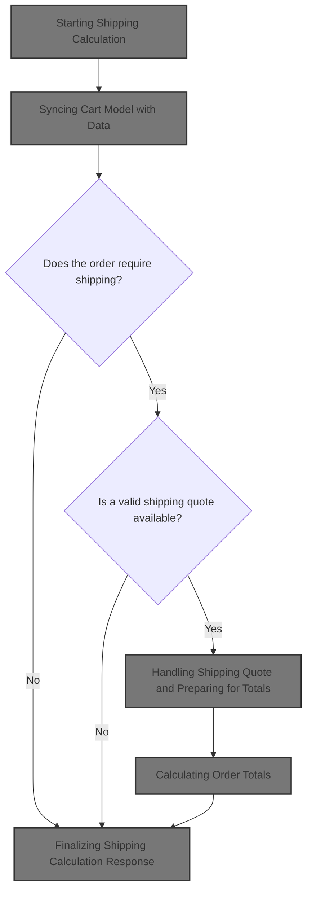
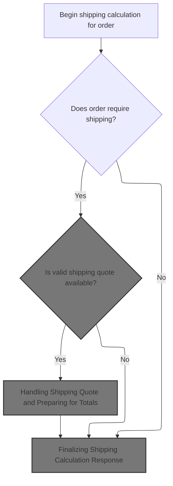
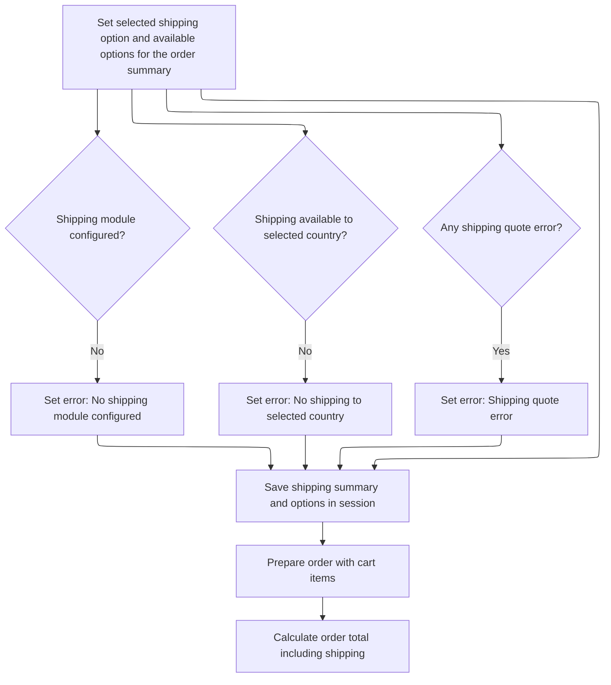
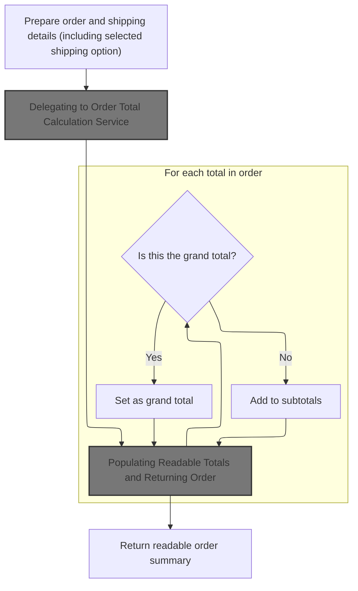
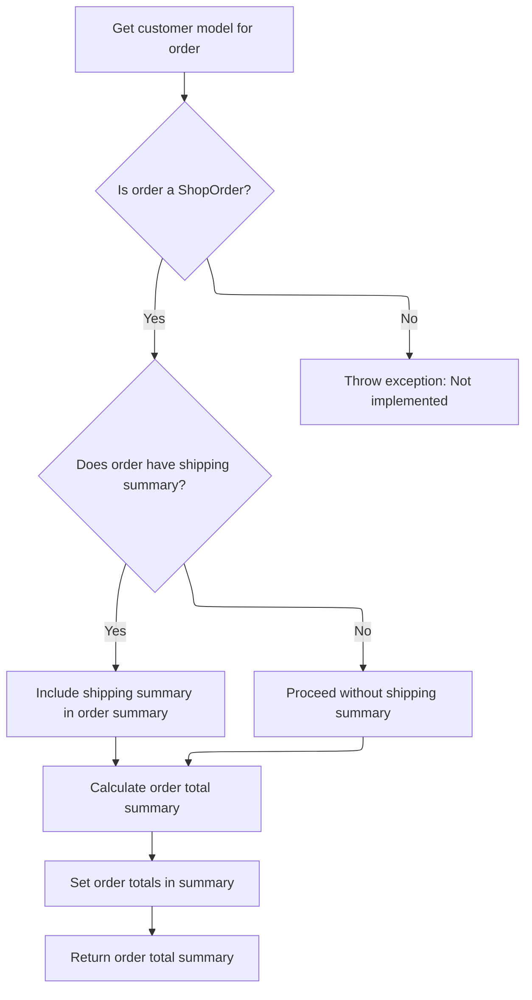
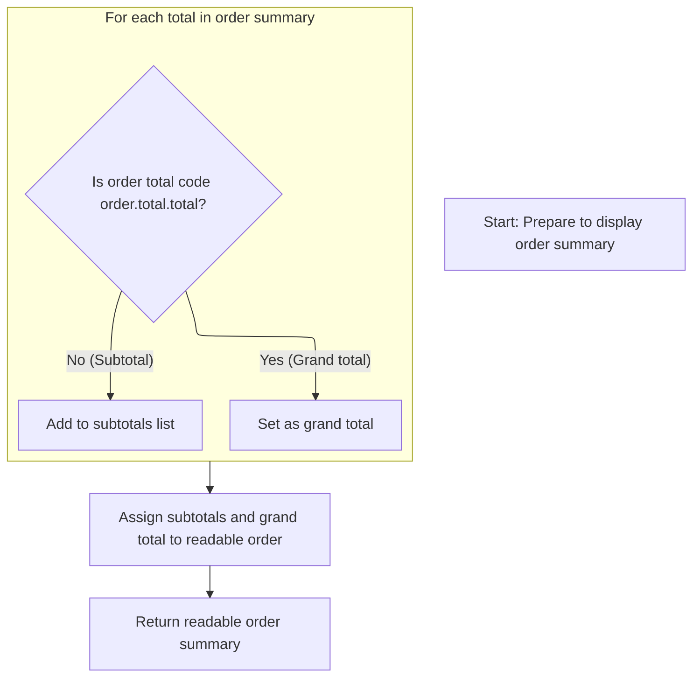
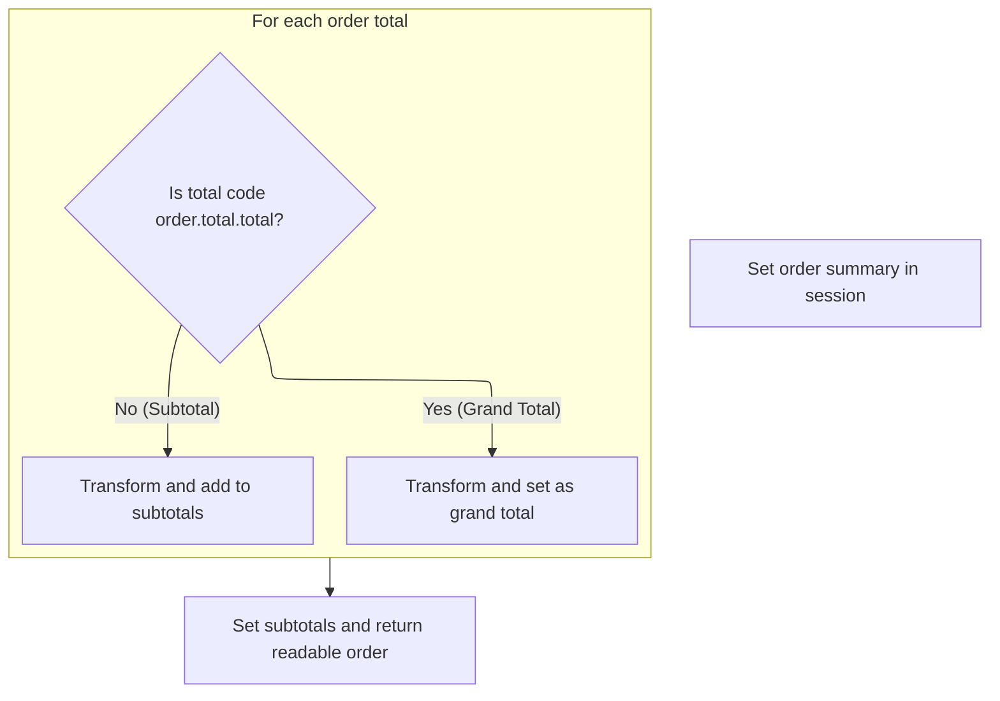

This document explains how shipping options and costs are calculated during checkout. The process synchronizes the cart model, checks if shipping is needed, retrieves shipping options and costs, and updates the order summary with shipping details and the final total.



# Starting Shipping Calculation



This section governs the business logic for determining whether shipping is required for an order, obtaining a shipping quote if needed, and preparing the shipping summary for the order. It ensures that only orders requiring shipping are processed for shipping quotes and that only valid quotes are used in the order summary.

| Category        | Rule Name                              | Description                                                                                                                                                |
| --------------- | -------------------------------------- | ---------------------------------------------------------------------------------------------------------------------------------------------------------- |
| Data validation | Synchronize Cart Before Shipping       | The latest cart state must be retrieved and synchronized with the order before any shipping calculation is performed.                                      |
| Business logic  | Skip Shipping for Non-shippable Orders | If the order does not require shipping, the shipping calculation process is skipped and the response is finalized without shipping details.                |
| Business logic  | Include Valid Shipping Quote           | If the order requires shipping and a valid shipping quote is available, the shipping summary is prepared and included in the order for further processing. |

<SwmSnippet path="/shopizer/sm-shop/src/main/java/com/salesmanager/web/shop/controller/order/ShoppingOrderController.java" line="722">

---

In <SwmToken path="shopizer/sm-shop/src/main/java/com/salesmanager/web/shop/controller/order/ShoppingOrderController.java" pos="722:8:8" line-data="	public @ResponseBody ReadableShopOrder calculateShipping(@ModelAttribute(value=&quot;order&quot;) ShopOrder order, HttpServletRequest request, HttpServletResponse response, Locale locale) throws Exception {">`calculateShipping`</SwmToken>, we grab the latest cart and sync the order state, then move on to update the cart model using <SwmToken path="shopizer/sm-shop/src/main/java/com/salesmanager/web/populator/shoppingCart/ShoppingCartModelPopulator.java" pos="37:4:4" line-data="public class ShoppingCartModelPopulator">`ShoppingCartModelPopulator`</SwmToken> so everything's current before shipping logic.

```java
	public @ResponseBody ReadableShopOrder calculateShipping(@ModelAttribute(value="order") ShopOrder order, HttpServletRequest request, HttpServletResponse response, Locale locale) throws Exception {
		
		Language language = (Language)request.getAttribute("LANGUAGE");
		MerchantStore store = (MerchantStore)request.getAttribute(Constants.MERCHANT_STORE);
		String shoppingCartCode  = getSessionAttribute(Constants.SHOPPING_CART, request);
		
		Validate.notNull(shoppingCartCode,"shoppingCartCode does not exist in the session");
		
		ReadableShopOrder readableOrder = new ReadableShopOrder();
		try {

			//re-generate cart
			com.salesmanager.core.business.shoppingcart.model.ShoppingCart cart = shoppingCartFacade.getShoppingCartModel(shoppingCartCode, store);
	
			
			
			ReadableShopOrderPopulator populator = new ReadableShopOrderPopulator();
			populator.populate(order, readableOrder, store, language);
			
			boolean requiresShipping = shoppingCartService.requiresShipping(cart);
			
			/** shipping **/
			ShippingQuote quote = null;
			if(requiresShipping) {
				quote = orderFacade.getShippingQuote(order.getCustomer(), cart, order, store, language);
			}

			if(quote!=null) {
				if(StringUtils.isBlank(quote.getShippingReturnCode())) {
					ShippingSummary summary = orderFacade.getShippingSummary(quote, store, language);
					order.setShippingSummary(summary);//for total calculation
					
					
					ReadableShippingSummary readableSummary = new ReadableShippingSummary();
					ReadableShippingSummaryPopulator readableSummaryPopulator = new ReadableShippingSummaryPopulator();
					readableSummaryPopulator.setPricingService(pricingService);
					readableSummaryPopulator.populate(summary, readableSummary, store, language);
					
```

---

</SwmSnippet>

## Syncing Cart Model with Data

```mermaid
%%{init: {"flowchart": {"defaultRenderer": "elk"}} }%%
flowchart TD
    node1["Start cart population"] --> node2{"Is cart id > 0 and code present?"}
    click node1 openCode "shopizer/sm-shop/src/main/java/com/salesmanager/web/populator/shoppingCart/ShoppingCartModelPopulator.java:85:91"
    node2 -->|"Yes"| node3["Load cart from database"]
    click node2 openCode "shopizer/sm-shop/src/main/java/com/salesmanager/web/populator/shoppingCart/ShoppingCartModelPopulator.java:91:94"
    node2 -->|"No"| node4["Create new cart"]
    click node4 openCode "shopizer/sm-shop/src/main/java/com/salesmanager/web/populator/shoppingCart/ShoppingCartModelPopulator.java:106:114"
    node3 --> node5["Update cart properties"]
    click node3 openCode "shopizer/sm-shop/src/main/java/com/salesmanager/web/populator/shoppingCart/ShoppingCartModelPopulator.java:95:102"
    node4 --> node5
    node5 --> node6{"Are there items in cart data?"}
    click node5 openCode "shopizer/sm-shop/src/main/java/com/salesmanager/web/populator/shoppingCart/ShoppingCartModelPopulator.java:116:117"
    node6 -->|"Yes"| node7["Process cart items"]
    click node6 openCode "shopizer/sm-shop/src/main/java/com/salesmanager/web/populator/shoppingCart/ShoppingCartModelPopulator.java:121:176"
    node6 -->|"No"| node13["Return cart model"]
    click node13 openCode "shopizer/sm-shop/src/main/java/com/salesmanager/web/populator/shoppingCart/ShoppingCartModelPopulator.java:187:188"

    subgraph loop1["For each item in cart data"]
        node7 --> node8{"Does item exist in cart model?"}
        click node8 openCode "shopizer/sm-shop/src/main/java/com/salesmanager/web/populator/shoppingCart/ShoppingCartModelPopulator.java:124:126"
        node8 -->|"Yes"| node9["Update item quantity"]
        click node9 openCode "shopizer/sm-shop/src/main/java/com/salesmanager/web/populator/shoppingCart/ShoppingCartModelPopulator.java:132:133"
        node9 --> node10{"Does item have attributes?"}
        click node10 openCode "shopizer/sm-shop/src/main/java/com/salesmanager/web/populator/shoppingCart/ShoppingCartModelPopulator.java:139:140"
        node10 -->|"Yes"| node11["Update item attributes"]
        click node11 openCode "shopizer/sm-shop/src/main/java/com/salesmanager/web/populator/shoppingCart/ShoppingCartModelPopulator.java:141:152"
        node10 -->|"No"| node12["Remove all attributes"]
        click node12 openCode "shopizer/sm-shop/src/main/java/com/salesmanager/web/populator/shoppingCart/ShoppingCartModelPopulator.java:156:157"
        node11 --> node15["Add item to updated set"]
        click node15 openCode "shopizer/sm-shop/src/main/java/com/salesmanager/web/populator/shoppingCart/ShoppingCartModelPopulator.java:158:159"
        node12 --> node15
        node8 -->|"No"| node14["Create new item"]
        click node14 openCode "shopizer/sm-shop/src/main/java/com/salesmanager/web/populator/shoppingCart/ShoppingCartModelPopulator.java:164:173"
        node14 --> node15
        node15 --> node7
    end
    node7 --> node13["Return cart model"]
    click node13 openCode "shopizer/sm-shop/src/main/java/com/salesmanager/web/populator/shoppingCart/ShoppingCartModelPopulator.java:187:188"

classDef HeadingStyle fill:#777777,stroke:#333,stroke-width:2px;

%% Swimm:
%% %%{init: {"flowchart": {"defaultRenderer": "elk"}} }%%
%% flowchart TD
%%     node1["Start cart population"] --> node2{"Is cart id > 0 and code present?"}
%%     click node1 openCode "<SwmPath>[shopizer/…/shoppingCart/ShoppingCartModelPopulator.java](shopizer/sm-shop/src/main/java/com/salesmanager/web/populator/shoppingCart/ShoppingCartModelPopulator.java)</SwmPath>:85:91"
%%     node2 -->|"Yes"| node3["Load cart from database"]
%%     click node2 openCode "<SwmPath>[shopizer/…/shoppingCart/ShoppingCartModelPopulator.java](shopizer/sm-shop/src/main/java/com/salesmanager/web/populator/shoppingCart/ShoppingCartModelPopulator.java)</SwmPath>:91:94"
%%     node2 -->|"No"| node4["Create new cart"]
%%     click node4 openCode "<SwmPath>[shopizer/…/shoppingCart/ShoppingCartModelPopulator.java](shopizer/sm-shop/src/main/java/com/salesmanager/web/populator/shoppingCart/ShoppingCartModelPopulator.java)</SwmPath>:106:114"
%%     node3 --> node5["Update cart properties"]
%%     click node3 openCode "<SwmPath>[shopizer/…/shoppingCart/ShoppingCartModelPopulator.java](shopizer/sm-shop/src/main/java/com/salesmanager/web/populator/shoppingCart/ShoppingCartModelPopulator.java)</SwmPath>:95:102"
%%     node4 --> node5
%%     node5 --> node6{"Are there items in cart data?"}
%%     click node5 openCode "<SwmPath>[shopizer/…/shoppingCart/ShoppingCartModelPopulator.java](shopizer/sm-shop/src/main/java/com/salesmanager/web/populator/shoppingCart/ShoppingCartModelPopulator.java)</SwmPath>:116:117"
%%     node6 -->|"Yes"| node7["Process cart items"]
%%     click node6 openCode "<SwmPath>[shopizer/…/shoppingCart/ShoppingCartModelPopulator.java](shopizer/sm-shop/src/main/java/com/salesmanager/web/populator/shoppingCart/ShoppingCartModelPopulator.java)</SwmPath>:121:176"
%%     node6 -->|"No"| node13["Return cart model"]
%%     click node13 openCode "<SwmPath>[shopizer/…/shoppingCart/ShoppingCartModelPopulator.java](shopizer/sm-shop/src/main/java/com/salesmanager/web/populator/shoppingCart/ShoppingCartModelPopulator.java)</SwmPath>:187:188"
%% 
%%     subgraph loop1["For each item in cart data"]
%%         node7 --> node8{"Does item exist in cart model?"}
%%         click node8 openCode "<SwmPath>[shopizer/…/shoppingCart/ShoppingCartModelPopulator.java](shopizer/sm-shop/src/main/java/com/salesmanager/web/populator/shoppingCart/ShoppingCartModelPopulator.java)</SwmPath>:124:126"
%%         node8 -->|"Yes"| node9["Update item quantity"]
%%         click node9 openCode "<SwmPath>[shopizer/…/shoppingCart/ShoppingCartModelPopulator.java](shopizer/sm-shop/src/main/java/com/salesmanager/web/populator/shoppingCart/ShoppingCartModelPopulator.java)</SwmPath>:132:133"
%%         node9 --> node10{"Does item have attributes?"}
%%         click node10 openCode "<SwmPath>[shopizer/…/shoppingCart/ShoppingCartModelPopulator.java](shopizer/sm-shop/src/main/java/com/salesmanager/web/populator/shoppingCart/ShoppingCartModelPopulator.java)</SwmPath>:139:140"
%%         node10 -->|"Yes"| node11["Update item attributes"]
%%         click node11 openCode "<SwmPath>[shopizer/…/shoppingCart/ShoppingCartModelPopulator.java](shopizer/sm-shop/src/main/java/com/salesmanager/web/populator/shoppingCart/ShoppingCartModelPopulator.java)</SwmPath>:141:152"
%%         node10 -->|"No"| node12["Remove all attributes"]
%%         click node12 openCode "<SwmPath>[shopizer/…/shoppingCart/ShoppingCartModelPopulator.java](shopizer/sm-shop/src/main/java/com/salesmanager/web/populator/shoppingCart/ShoppingCartModelPopulator.java)</SwmPath>:156:157"
%%         node11 --> node15["Add item to updated set"]
%%         click node15 openCode "<SwmPath>[shopizer/…/shoppingCart/ShoppingCartModelPopulator.java](shopizer/sm-shop/src/main/java/com/salesmanager/web/populator/shoppingCart/ShoppingCartModelPopulator.java)</SwmPath>:158:159"
%%         node12 --> node15
%%         node8 -->|"No"| node14["Create new item"]
%%         click node14 openCode "<SwmPath>[shopizer/…/shoppingCart/ShoppingCartModelPopulator.java](shopizer/sm-shop/src/main/java/com/salesmanager/web/populator/shoppingCart/ShoppingCartModelPopulator.java)</SwmPath>:164:173"
%%         node14 --> node15
%%         node15 --> node7
%%     end
%%     node7 --> node13["Return cart model"]
%%     click node13 openCode "<SwmPath>[shopizer/…/shoppingCart/ShoppingCartModelPopulator.java](shopizer/sm-shop/src/main/java/com/salesmanager/web/populator/shoppingCart/ShoppingCartModelPopulator.java)</SwmPath>:187:188"
%% 
%% classDef HeadingStyle fill:#777777,stroke:#333,stroke-width:2px;
```



This section ensures that the cart model in the system is accurately updated to match the incoming cart data, including handling cart creation, item updates, and attribute synchronization. It guarantees that the cart model is always consistent with the user's latest cart actions.

| Category       | Rule Name              | Description                                                                                                                                                                                      |
| -------------- | ---------------------- | ------------------------------------------------------------------------------------------------------------------------------------------------------------------------------------------------ |
| Business logic | Cart Retrieval by Code | If the incoming cart data contains a valid cart id (greater than 0) and a non-empty cart code, the system must attempt to load the corresponding cart from the database using the provided code. |
| Business logic | Cart Creation          | If no valid cart is found in the database, or if the cart data does not contain a valid id and code, a new cart must be created and initialized with the provided code and merchant store.       |
| Business logic | Customer Association   | If a customer object is available, the cart must be associated with the customer's id to ensure cart ownership and personalization.                                                              |
| Business logic | Item Synchronization   | For each item in the incoming cart data, if the item already exists in the cart model (matched by id), its quantity and attributes must be updated to reflect the latest state.                  |
| Business logic | New Item Addition      | If an item in the cart data does not exist in the cart model, a new item must be created and added to the cart model.                                                                            |
| Business logic | Attribute Removal      | If an item in the cart data has no attributes, all attributes must be removed from the corresponding item in the cart model.                                                                     |

<SwmSnippet path="/shopizer/sm-shop/src/main/java/com/salesmanager/web/populator/shoppingCart/ShoppingCartModelPopulator.java" line="85">

---

In <SwmToken path="shopizer/sm-shop/src/main/java/com/salesmanager/web/populator/shoppingCart/ShoppingCartModelPopulator.java" pos="85:5:5" line-data="    public ShoppingCart populate(ShoppingCartData shoppingCart,ShoppingCart cartMdel,final MerchantStore store, Language language)">`populate`</SwmToken>, we check if the cart data has a valid id and code. If so, we try to fetch the cart from the DB; if not found, or if the data is invalid, we create a new cart and persist it. Then, for each item in the cart data, we either update the existing cart item (matching by id and syncing attributes) or add a new one. The function also relies on a hidden 'customer' object to set the customer id, which isn't obvious from the signature.

```java
    public ShoppingCart populate(ShoppingCartData shoppingCart,ShoppingCart cartMdel,final MerchantStore store, Language language)
    {


        // if id >0 get the original from the database, override products
       try{
        if ( shoppingCart.getId() > 0  && StringUtils.isNotBlank( shoppingCart.getCode()))
        {
            cartMdel = shoppingCartService.getByCode( shoppingCart.getCode(), store );
            if(cartMdel==null){
                cartMdel=new ShoppingCart();
                cartMdel.setShoppingCartCode( shoppingCart.getCode() );
                cartMdel.setMerchantStore( store );
                if ( customer != null )
                {
                    cartMdel.setCustomerId( customer.getId() );
                }
                shoppingCartService.create( cartMdel );
            }
        }
        else
        {
            cartMdel.setShoppingCartCode( shoppingCart.getCode() );
            cartMdel.setMerchantStore( store );
            if ( customer != null )
            {
                cartMdel.setCustomerId( customer.getId() );
            }
            shoppingCartService.create( cartMdel );
        }

        List<ShoppingCartItem> items = shoppingCart.getShoppingCartItems();
        Set<com.salesmanager.core.business.shoppingcart.model.ShoppingCartItem> newItems =
            new HashSet<com.salesmanager.core.business.shoppingcart.model.ShoppingCartItem>();
        if ( items != null && items.size() > 0 )
        {
            for ( ShoppingCartItem item : items )
            {

                Set<com.salesmanager.core.business.shoppingcart.model.ShoppingCartItem> cartItems = cartMdel.getLineItems();
                if ( cartItems != null && cartItems.size() > 0 )
                {

                    for ( com.salesmanager.core.business.shoppingcart.model.ShoppingCartItem dbItem : cartItems )
                    {
                        if ( dbItem.getId().longValue() == item.getId() )
                        {
                            dbItem.setQuantity( item.getQuantity() );
                            // compare attributes
                            Set<com.salesmanager.core.business.shoppingcart.model.ShoppingCartAttributeItem> attributes =
                                dbItem.getAttributes();
                            Set<com.salesmanager.core.business.shoppingcart.model.ShoppingCartAttributeItem> newAttributes =
                                new HashSet<com.salesmanager.core.business.shoppingcart.model.ShoppingCartAttributeItem>();
                            List<ShoppingCartAttribute> cartAttributes = item.getShoppingCartAttributes();
                            if ( !CollectionUtils.isEmpty( cartAttributes ) )
                            {
                                for ( ShoppingCartAttribute attribute : cartAttributes )
                                {
                                    for ( com.salesmanager.core.business.shoppingcart.model.ShoppingCartAttributeItem dbAttribute : attributes )
                                    {
                                        if ( dbAttribute.getId().longValue() == attribute.getId() )
                                        {
                                            newAttributes.add( dbAttribute );
                                        }
                                    }
                                }
                                
                                dbItem.setAttributes( newAttributes );
                            }
                            else
                            {
                                dbItem.removeAllAttributes();
                            }
                            newItems.add( dbItem );
                        }
                    }
                }
                else
                {// create new item
                    com.salesmanager.core.business.shoppingcart.model.ShoppingCartItem cartItem =
                        createCartItem( cartMdel, item, store );
                    Set<com.salesmanager.core.business.shoppingcart.model.ShoppingCartItem> lineItems =
                        cartMdel.getLineItems();
                    if ( lineItems == null )
                    {
                        lineItems = new HashSet<com.salesmanager.core.business.shoppingcart.model.ShoppingCartItem>();
                        cartMdel.setLineItems( lineItems );
                    }
                    lineItems.add( cartItem );
                    shoppingCartService.update( cartMdel );
                }
            }// end for
```

---

</SwmSnippet>

<SwmSnippet path="/shopizer/sm-shop/src/main/java/com/salesmanager/web/populator/shoppingCart/ShoppingCartModelPopulator.java" line="176">

---

The function returns the updated cart model, fully synced with the input data.

```java
            }// end for
        }// end if
       }catch(ServiceException se){
           LOG.error( "Error while converting cart data to cart model.."+se );
           throw new ConversionException( "Unable to create cart model", se ); 
       }
       catch (Exception ex){
           LOG.error( "Error while converting cart data to cart model.."+ex );
           throw new ConversionException( "Unable to create cart model", ex );  
       }

        return cartMdel;
    }
```

---

</SwmSnippet>

## Handling Shipping Quote and Preparing for Totals



<SwmSnippet path="/shopizer/sm-shop/src/main/java/com/salesmanager/web/shop/controller/order/ShoppingOrderController.java" line="760">

---

Back in <SwmToken path="shopizer/sm-shop/src/main/java/com/salesmanager/web/shop/controller/order/ShoppingOrderController.java" pos="722:8:8" line-data="	public @ResponseBody ReadableShopOrder calculateShipping(@ModelAttribute(value=&quot;order&quot;) ShopOrder order, HttpServletRequest request, HttpServletResponse response, Locale locale) throws Exception {">`calculateShipping`</SwmToken>, after syncing the cart model, we process the shipping quote, update the order and session with shipping details, and handle any shipping errors. With shipping info set, we then call <SwmToken path="shopizer/sm-shop/src/main/java/com/salesmanager/web/shop/controller/order/ShoppingOrderController.java" pos="794:9:9" line-data="			OrderTotalSummary orderTotalSummary = orderFacade.calculateOrderTotal(store, order, language);">`calculateOrderTotal`</SwmToken> to update the order totals based on the latest shipping and cart state.

```java
					readableSummary.setSelectedShippingOption(quote.getSelectedShippingOption());

					//save quotes in HttpSession
					List<ShippingOption> options = quote.getShippingOptions();
					readableSummary.setShippingOptions(options);
					
					readableOrder.setShippingSummary(readableSummary);
					request.getSession().setAttribute(Constants.SHIPPING_SUMMARY, summary);
					request.getSession().setAttribute(Constants.SHIPPING_OPTIONS, options);
				
				}

				if(quote.getShippingReturnCode()!=null && quote.getShippingReturnCode().equals(ShippingQuote.NO_SHIPPING_MODULE_CONFIGURED)) {
					LOGGER.error("Shipping quote error " + quote.getShippingReturnCode());
					readableOrder.setErrorMessage(messages.getMessage("message.noshipping", locale));
				}
				
				if(quote.getShippingReturnCode()!=null && quote.getShippingReturnCode().equals(ShippingQuote.NO_SHIPPING_TO_SELECTED_COUNTRY)) {
					LOGGER.error("Shipping quote error " + quote.getShippingReturnCode());
					readableOrder.setErrorMessage(messages.getMessage("message.noshipping", locale));
				}
				
				if(!StringUtils.isBlank(quote.getQuoteError())) {
					LOGGER.error("Shipping quote error " + quote.getQuoteError());
					readableOrder.setErrorMessage(messages.getMessage("message.noshippingerror", locale));
				}
				
				
			}
			
			//set list of shopping cart items for core price calculation
			List<ShoppingCartItem> items = new ArrayList<ShoppingCartItem>(cart.getLineItems());
			order.setShoppingCartItems(items);
			
			OrderTotalSummary orderTotalSummary = orderFacade.calculateOrderTotal(store, order, language);
```

---

</SwmSnippet>

## Calculating Order Totals



This section is responsible for calculating the complete order total, including subtotals, shipping costs, and the grand total, and returning a readable summary of the order for display or further processing.

| Category        | Rule Name                       | Description                                                                                                                                                                   |
| --------------- | ------------------------------- | ----------------------------------------------------------------------------------------------------------------------------------------------------------------------------- |
| Data validation | Cart Code Required              | If the shopping cart code is missing from the session, the order total calculation cannot proceed and an error must be raised.                                                |
| Data validation | Valid Shipping Option Selection | The selected shipping option must be one of the available shipping options for the order. If the selected option is not found, the first available option is used by default. |
| Business logic  | Shipping Summary Accuracy       | The shipping summary must reflect the selected shipping option, including its price and identifier, in the order summary.                                                     |
| Business logic  | Include All Cart Items          | All items in the shopping cart must be included in the order for price calculation, ensuring the order total reflects all selected products.                                  |
| Business logic  | Grand Total Identification      | The order summary must distinguish between subtotals and the grand total, with the grand total representing the final amount payable by the customer.                         |

<SwmSnippet path="/shopizer/sm-shop/src/main/java/com/salesmanager/web/shop/controller/order/ShoppingOrderController.java" line="836">

---

We re-fetch the cart and order, handle shipping, and prep everything for the order total calculation.

```java
	public @ResponseBody ReadableShopOrder calculateOrderTotal(@ModelAttribute(value="order") ShopOrder order, HttpServletRequest request, HttpServletResponse response, Locale locale) throws Exception {
		
		Language language = (Language)request.getAttribute("LANGUAGE");
		MerchantStore store = (MerchantStore)request.getAttribute(Constants.MERCHANT_STORE);
		String shoppingCartCode  = getSessionAttribute(Constants.SHOPPING_CART, request);
		
		Validate.notNull(shoppingCartCode,"shoppingCartCode does not exist in the session");
		
		ReadableShopOrder readableOrder = new ReadableShopOrder();
		try {

			//re-generate cart
			com.salesmanager.core.business.shoppingcart.model.ShoppingCart cart = shoppingCartFacade.getShoppingCartModel(shoppingCartCode, store);

			ReadableShopOrderPopulator populator = new ReadableShopOrderPopulator();
			populator.populate(order, readableOrder, store, language);

			if(order.getSelectedShippingOption()!=null) {
						ShippingSummary summary = (ShippingSummary)request.getSession().getAttribute(Constants.SHIPPING_SUMMARY);
						@SuppressWarnings("unchecked")
						List<ShippingOption> options = (List<ShippingOption>)request.getSession().getAttribute(Constants.SHIPPING_OPTIONS);
						
						
						order.setShippingSummary(summary);//for total calculation
						
						
						ReadableShippingSummary readableSummary = new ReadableShippingSummary();
						ReadableShippingSummaryPopulator readableSummaryPopulator = new ReadableShippingSummaryPopulator();
						readableSummaryPopulator.setPricingService(pricingService);
						readableSummaryPopulator.populate(summary, readableSummary, store, language);
						
						
						if(!CollectionUtils.isEmpty(options)) {
						
							//get submitted shipping option
							ShippingOption quoteOption = null;
							ShippingOption selectedOption = order.getSelectedShippingOption();

							
							
							//check if selectedOption exist
							for(ShippingOption shipOption : options) {
								if(!StringUtils.isBlank(shipOption.getOptionId()) && shipOption.getOptionId().equals(selectedOption.getOptionId())) {
									quoteOption = shipOption;
								}
							}
```

---

</SwmSnippet>

<SwmSnippet path="/shopizer/sm-shop/src/main/java/com/salesmanager/web/shop/controller/order/ShoppingOrderController.java" line="883">

---

Here we finalize the shipping summary and selected option, making sure they're set on the order and readable summary. With shipping costs locked in, we call the order facade to calculate the full order total.

```java
							if(quoteOption==null) {
								quoteOption = options.get(0);
							}
							
							
							readableSummary.setSelectedShippingOption(quoteOption);
							readableSummary.setShippingOptions(options);
							

							summary.setShippingOption(quoteOption.getOptionId());
							summary.setShipping(quoteOption.getOptionPrice());
						
						}

						
						readableOrder.setShippingSummary(readableSummary);

			}
			
			//set list of shopping cart items for core price calculation
			List<ShoppingCartItem> items = new ArrayList<ShoppingCartItem>(cart.getLineItems());
			order.setShoppingCartItems(items);
			
			OrderTotalSummary orderTotalSummary = orderFacade.calculateOrderTotal(store, order, language);
```

---

</SwmSnippet>

### Delegating to Order Total Calculation Service



This section ensures that order totals are accurately calculated by delegating to the order service, using all relevant order and customer data, and handling only <SwmToken path="shopizer/sm-shop/src/main/java/com/salesmanager/web/shop/controller/order/ShoppingOrderController.java" pos="722:20:20" line-data="	public @ResponseBody ReadableShopOrder calculateShipping(@ModelAttribute(value=&quot;order&quot;) ShopOrder order, HttpServletRequest request, HttpServletResponse response, Locale locale) throws Exception {">`ShopOrder`</SwmToken> types. It updates the order with the latest totals for downstream use.

| Category       | Rule Name                    | Description                                                                                                                                                                                                                                                                                                                                                                                                                                                                                                                        |
| -------------- | ---------------------------- | ---------------------------------------------------------------------------------------------------------------------------------------------------------------------------------------------------------------------------------------------------------------------------------------------------------------------------------------------------------------------------------------------------------------------------------------------------------------------------------------------------------------------------------- |
| Business logic | Shipping summary inclusion   | If a <SwmToken path="shopizer/sm-shop/src/main/java/com/salesmanager/web/shop/controller/order/ShoppingOrderController.java" pos="722:20:20" line-data="	public @ResponseBody ReadableShopOrder calculateShipping(@ModelAttribute(value=&quot;order&quot;) ShopOrder order, HttpServletRequest request, HttpServletResponse response, Locale locale) throws Exception {">`ShopOrder`</SwmToken> contains a shipping summary, this shipping information must be included in the order summary before calculating totals.             |
| Business logic | No shipping summary handling | If a <SwmToken path="shopizer/sm-shop/src/main/java/com/salesmanager/web/shop/controller/order/ShoppingOrderController.java" pos="722:20:20" line-data="	public @ResponseBody ReadableShopOrder calculateShipping(@ModelAttribute(value=&quot;order&quot;) ShopOrder order, HttpServletRequest request, HttpServletResponse response, Locale locale) throws Exception {">`ShopOrder`</SwmToken> does not have a shipping summary, the order summary is prepared without shipping information and totals are calculated accordingly. |
| Business logic | Order totals update          | After calculating the order totals, the order object must be updated with the latest totals before returning the summary.                                                                                                                                                                                                                                                                                                                                                                                                          |

<SwmSnippet path="/shopizer/sm-shop/src/main/java/com/salesmanager/web/shop/controller/order/facade/OrderFacadeImpl.java" line="155">

---

In <SwmToken path="shopizer/sm-shop/src/main/java/com/salesmanager/web/shop/controller/order/facade/OrderFacadeImpl.java" pos="155:5:5" line-data="	public OrderTotalSummary calculateOrderTotal(MerchantStore store,">`calculateOrderTotal`</SwmToken> (<SwmToken path="shopizer/sm-shop/src/main/java/com/salesmanager/web/shop/controller/order/facade/OrderFacadeImpl.java" pos="87:4:4" line-data="public class OrderFacadeImpl implements OrderFacade {">`OrderFacadeImpl`</SwmToken>), we first get the customer model, then delegate to the overloaded method that does the actual calculation using all the relevant order and customer data.

```java
	public OrderTotalSummary calculateOrderTotal(MerchantStore store,
			ShopOrder order, Language language) throws Exception {
		

		Customer customer = customerFacade.getCustomerModel(order.getCustomer(), store, language);
		OrderTotalSummary summary = this.calculateOrderTotal(store, customer, order, language);
```

---

</SwmSnippet>

<SwmSnippet path="/shopizer/sm-shop/src/main/java/com/salesmanager/web/shop/controller/order/facade/OrderFacadeImpl.java" line="190">

---

<SwmToken path="shopizer/sm-shop/src/main/java/com/salesmanager/web/shop/controller/order/facade/OrderFacadeImpl.java" pos="190:5:5" line-data="	private OrderTotalSummary calculateOrderTotal(MerchantStore store, Customer customer, PersistableOrder order, Language language) throws Exception {">`calculateOrderTotal`</SwmToken> here checks if the order is a <SwmToken path="shopizer/sm-shop/src/main/java/com/salesmanager/web/shop/controller/order/facade/OrderFacadeImpl.java" pos="197:7:7" line-data="		if(order instanceof ShopOrder) {">`ShopOrder`</SwmToken>, builds an <SwmToken path="shopizer/sm-shop/src/main/java/com/salesmanager/web/shop/controller/order/facade/OrderFacadeImpl.java" pos="194:1:1" line-data="		OrderSummary summary = new OrderSummary();">`OrderSummary`</SwmToken> from its items and shipping, and delegates the calculation to the order service. If it's not a <SwmToken path="shopizer/sm-shop/src/main/java/com/salesmanager/web/shop/controller/order/facade/OrderFacadeImpl.java" pos="197:7:7" line-data="		if(order instanceof ShopOrder) {">`ShopOrder`</SwmToken>, it just throws an exception—no support for other types yet.

```java
	private OrderTotalSummary calculateOrderTotal(MerchantStore store, Customer customer, PersistableOrder order, Language language) throws Exception {
		
		OrderTotalSummary orderTotalSummary = null;
		
		OrderSummary summary = new OrderSummary();
		
		
		if(order instanceof ShopOrder) {
			ShopOrder o = (ShopOrder)order;
			summary.setProducts(o.getShoppingCartItems());
			
			if(o.getShippingSummary()!=null) {
				summary.setShippingSummary(o.getShippingSummary());
			}
			orderTotalSummary = orderService.caculateOrderTotal(summary, customer, store, language);
		} else {
			//need Set of ShoppingCartItem
			//PersistableOrder not implemented
			throw new Exception("calculateOrderTotal not yet implemented for PersistableOrder");
		}

		return orderTotalSummary;
		
	}
```

---

</SwmSnippet>

<SwmSnippet path="/shopizer/sm-shop/src/main/java/com/salesmanager/web/shop/controller/order/facade/OrderFacadeImpl.java" line="161">

---

After getting the calculated summary from the order service, we update the order object with the totals and return the summary. This makes sure the order has all the latest totals for downstream use.

```java
		this.setOrderTotals(order, summary);
		return summary;
	}
```

---

</SwmSnippet>

### Populating Readable Totals and Returning Order



<SwmSnippet path="/shopizer/sm-shop/src/main/java/com/salesmanager/web/shop/controller/order/ShoppingOrderController.java" line="907">

---

After returning from the order facade, <SwmToken path="shopizer/sm-shop/src/main/java/com/salesmanager/web/shop/controller/order/ShoppingOrderController.java" pos="794:9:9" line-data="			OrderTotalSummary orderTotalSummary = orderFacade.calculateOrderTotal(store, order, language);">`calculateOrderTotal`</SwmToken> stores the summary in the session, then loops through the totals to split out subtotals and the grand total based on the total code. This sets up the readable order for the client.

```java
			super.setSessionAttribute(Constants.ORDER_SUMMARY, orderTotalSummary, request);
			
			
			ReadableOrderTotalPopulator totalPopulator = new ReadableOrderTotalPopulator();
			totalPopulator.setMessages(messages);
			totalPopulator.setPricingService(pricingService);

			List<ReadableOrderTotal> subtotals = new ArrayList<ReadableOrderTotal>();
			for(OrderTotal total : orderTotalSummary.getTotals()) {
				if(!total.getOrderTotalCode().equals("order.total.total")) {
					ReadableOrderTotal t = new ReadableOrderTotal();
					totalPopulator.populate(total, t, store, language);
					subtotals.add(t);
				} else {//grand total
					ReadableOrderTotal ot = new ReadableOrderTotal();
					totalPopulator.populate(total, ot, store, language);
					readableOrder.setGrandTotal(ot.getTotal());
				}
			}
```

---

</SwmSnippet>

<SwmSnippet path="/shopizer/sm-shop/src/main/java/com/salesmanager/web/shop/controller/order/ShoppingOrderController.java" line="928">

---

At the end of <SwmToken path="shopizer/sm-shop/src/main/java/com/salesmanager/web/shop/controller/order/ShoppingOrderController.java" pos="794:9:9" line-data="			OrderTotalSummary orderTotalSummary = orderFacade.calculateOrderTotal(store, order, language);">`calculateOrderTotal`</SwmToken>, we return a <SwmToken path="shopizer/sm-shop/src/main/java/com/salesmanager/web/shop/controller/order/ShoppingOrderController.java" pos="722:6:6" line-data="	public @ResponseBody ReadableShopOrder calculateShipping(@ModelAttribute(value=&quot;order&quot;) ShopOrder order, HttpServletRequest request, HttpServletResponse response, Locale locale) throws Exception {">`ReadableShopOrder`</SwmToken> with all subtotals, grand total, and error messages if needed—basically everything the UI needs to show the order summary.

```java
			readableOrder.setSubTotals(subtotals);
		
		} catch(Exception e) {
			LOGGER.error("Error while getting shipping quotes",e);
			readableOrder.setErrorMessage(messages.getMessage("message.error", locale));
		}
		
		return readableOrder;
	}
```

---

</SwmSnippet>

## Finalizing Shipping Calculation Response



<SwmSnippet path="/shopizer/sm-shop/src/main/java/com/salesmanager/web/shop/controller/order/ShoppingOrderController.java" line="795">

---

After coming back from <SwmToken path="shopizer/sm-shop/src/main/java/com/salesmanager/web/shop/controller/order/ShoppingOrderController.java" pos="794:9:9" line-data="			OrderTotalSummary orderTotalSummary = orderFacade.calculateOrderTotal(store, order, language);">`calculateOrderTotal`</SwmToken>, we loop through the new totals and update the readable order with subtotals and grand total, making sure the response reflects all the latest calculations.

```java
			super.setSessionAttribute(Constants.ORDER_SUMMARY, orderTotalSummary, request);
			
			
			ReadableOrderTotalPopulator totalPopulator = new ReadableOrderTotalPopulator();
			totalPopulator.setMessages(messages);
			totalPopulator.setPricingService(pricingService);

			List<ReadableOrderTotal> subtotals = new ArrayList<ReadableOrderTotal>();
			for(OrderTotal total : orderTotalSummary.getTotals()) {
				if(!total.getOrderTotalCode().equals("order.total.total")) {
					ReadableOrderTotal t = new ReadableOrderTotal();
					totalPopulator.populate(total, t, store, language);
					subtotals.add(t);
				} else {//grand total
					ReadableOrderTotal ot = new ReadableOrderTotal();
					totalPopulator.populate(total, ot, store, language);
					readableOrder.setGrandTotal(ot.getTotal());
				}
			}
			
			
```

---

</SwmSnippet>

<SwmSnippet path="/shopizer/sm-shop/src/main/java/com/salesmanager/web/shop/controller/order/ShoppingOrderController.java" line="816">

---

At the end of <SwmToken path="shopizer/sm-shop/src/main/java/com/salesmanager/web/shop/controller/order/ShoppingOrderController.java" pos="722:8:8" line-data="	public @ResponseBody ReadableShopOrder calculateShipping(@ModelAttribute(value=&quot;order&quot;) ShopOrder order, HttpServletRequest request, HttpServletResponse response, Locale locale) throws Exception {">`calculateShipping`</SwmToken>, we return the readable order with all the latest cart, shipping, and totals info, or an error message if something went wrong.

```java
			readableOrder.setSubTotals(subtotals);
		
		} catch(Exception e) {
			LOGGER.error("Error while getting shipping quotes",e);
			readableOrder.setErrorMessage(messages.getMessage("message.error", locale));
		}
		
		return readableOrder;
	}
```

---

</SwmSnippet>

&nbsp;

*This is an auto-generated document by Swimm 🌊 and has not yet been verified by a human*

<SwmMeta version="3.0.0" repo-id="Z2l0aHViJTNBJTNBU2hvcGl6ZXIlM0ElM0F1bWFsaW5nYXN3YW1p" repo-name="Shopizer"><sup>Powered by [Swimm](https://app.swimm.io/)</sup></SwmMeta>
