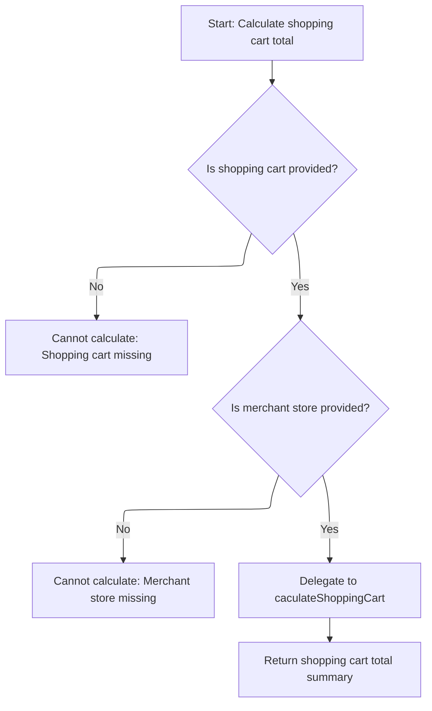

This document describes how the system calculates the total cost for a shopping cart. When a user reviews their cart, the system validates the cart and store, prepares an order summary from the cart items, and calculates all relevant charges including item prices, shipping, handling, and taxes. The result is a summary of the cart's total, which can be displayed to the user or used for checkout.

# Starting the cart total calculation

<SwmSnippet path="/shopizer/sm-core/src/main/java/com/salesmanager/core/business/shoppingcart/service/ShoppingCartCalculationServiceImpl.java" line="95">

---

In `calculate`, we kick off the flow by validating the cart, its items, and the store. Then we hand off the actual total calculation to OrderServiceImpl, which centralizes all the pricing, shipping, and tax logic. This keeps the cart service lean and lets us reuse the calculation logic elsewhere. We need to call OrderServiceImpl next because that's where all the heavy lifting for totals happens.

```java
    public OrderTotalSummary calculate( final ShoppingCart cartModel , final MerchantStore store, final Language language ) throws ServiceException
    {

        Validate.notNull(cartModel,"cart cannot be null");
        Validate.notNull(cartModel.getLineItems(),"Cart should have line items.");
        Validate.notNull(store,"MerchantStore cannot be null");
        OrderTotalSummary orderTotalSummary=orderService.calculateShoppingCartTotal( cartModel, store, language );
```

---

</SwmSnippet>

## Delegating to order total calculation



<SwmSnippet path="/shopizer/sm-core/src/main/java/com/salesmanager/core/business/order/service/OrderServiceImpl.java" line="423">

---

`calculateShoppingCartTotal` checks inputs and hands off to caculateShoppingCart, which does the actual work.

```java
    public OrderTotalSummary calculateShoppingCartTotal(
                                                        final ShoppingCart shoppingCart, final MerchantStore store, final Language language)
                                                                        throws ServiceException {
        Validate.notNull(shoppingCart,"Order summary cannot be null");
        Validate.notNull(store,"MerchantStore cannot be null");

        try {
            return caculateShoppingCart(shoppingCart, null, store, language);
        } catch (Exception e) {
            LOGGER.error( "Error while calculating shopping cart total" +e );
            throw new ServiceException(e);
        }
    }
```

---

</SwmSnippet>

## Preparing order summary for calculation

<SwmSnippet path="/shopizer/sm-core/src/main/java/com/salesmanager/core/business/order/service/OrderServiceImpl.java" line="363">

---

`caculateShoppingCart` takes the cart's line items and wraps them in an OrderSummary, which is the format needed for the next calculation step. We call caculateOrder next because that's where the actual totals are computed based on this summary.

```java
    private OrderTotalSummary caculateShoppingCart( final ShoppingCart shoppingCart, final Customer customer, final MerchantStore store, final Language language) throws Exception {

        
    	
    	
    	
    	OrderSummary orderSummary = new OrderSummary();
    	
    	List<ShoppingCartItem> itemsSet = new ArrayList<ShoppingCartItem>(shoppingCart.getLineItems());
    	orderSummary.setProducts(itemsSet);
    	
    	
    	return this.caculateOrder(orderSummary, customer, store, language);

    }
```

---

</SwmSnippet>

## Calculating item prices and additional charges

```mermaid
%%{init: {"flowchart": {"defaultRenderer": "elk"}} }%%
flowchart TD
    node1["Start order calculation"] --> node2["Initialize subtotal and grand total"]
    click node1 openCode "shopizer/sm-core/src/main/java/com/salesmanager/core/business/order/service/OrderServiceImpl.java:166:168"
    click node2 openCode "shopizer/sm-core/src/main/java/com/salesmanager/core/business/order/service/OrderServiceImpl.java:168:176"
    subgraph loop1["For each product in order"]
        node2 --> node3["Calculate item subtotal"]
        click node3 openCode "shopizer/sm-core/src/main/java/com/salesmanager/core/business/order/service/OrderServiceImpl.java:184:188"
        node3 --> node4{"Does item have additional prices?"}
        click node4 openCode "shopizer/sm-core/src/main/java/com/salesmanager/core/business/order/service/OrderServiceImpl.java:191:223"
        node4 -->|"Yes"| node5["Add additional prices to subtotal"]
        click node5 openCode "shopizer/sm-core/src/main/java/com/salesmanager/core/business/order/service/OrderServiceImpl.java:194:219"
        node4 -->|"No"| node6["No additional prices"]
        click node6 openCode "shopizer/sm-core/src/main/java/com/salesmanager/core/business/order/service/OrderServiceImpl.java:223:225"
        node5 --> node6
        node6 --> node2
    end
    node2 --> node7["Add subtotal to order totals"]
    click node7 openCode "shopizer/sm-core/src/main/java/com/salesmanager/core/business/order/service/OrderServiceImpl.java:228:243"
    node7 --> node8{"Is shipping required?"}
    click node8 openCode "shopizer/sm-core/src/main/java/com/salesmanager/core/business/order/service/OrderServiceImpl.java:247:284"
    node8 -->|"Yes"| node9["Add shipping cost"]
    click node9 openCode "shopizer/sm-core/src/main/java/com/salesmanager/core/business/order/service/OrderServiceImpl.java:250:258"
    node8 -->|"No"| node10["Set shipping cost to $0"]
    click node10 openCode "shopizer/sm-core/src/main/java/com/salesmanager/core/business/order/service/OrderServiceImpl.java:264:266"
    node9 --> node11{"Are handling fees required?"}
    node10 --> node11
    click node11 openCode "shopizer/sm-core/src/main/java/com/salesmanager/core/business/order/service/OrderServiceImpl.java:269:283"
    node11 -->|"Yes"| node12["Add handling fee"]
    click node12 openCode "shopizer/sm-core/src/main/java/com/salesmanager/core/business/order/service/OrderServiceImpl.java:272:281"
    node11 -->|"No"| node13["No handling fee"]
    click node13 openCode "shopizer/sm-core/src/main/java/com/salesmanager/core/business/order/service/OrderServiceImpl.java:283:284"
    node12 --> node13
    node13 --> node14{"Are taxes applied?"}
    click node14 openCode "shopizer/sm-core/src/main/java/com/salesmanager/core/business/order/service/OrderServiceImpl.java:287:312"
    node14 -->|"Yes"| node15["Add taxes"]
    click node15 openCode "shopizer/sm-core/src/main/java/com/salesmanager/core/business/order/service/OrderServiceImpl.java:292:309"
    node14 -->|"No"| node16["No taxes"]
    click node16 openCode "shopizer/sm-core/src/main/java/com/salesmanager/core/business/order/service/OrderServiceImpl.java:312:313"
    node15 --> node17["Update grand total with taxes"]
    click node17 openCode "shopizer/sm-core/src/main/java/com/salesmanager/core/business/order/service/OrderServiceImpl.java:310:311"
    node16 --> node18["Calculate grand total"]
    node17 --> node18
    click node18 openCode "shopizer/sm-core/src/main/java/com/salesmanager/core/business/order/service/OrderServiceImpl.java:315:325"
    node18 --> node19["Return order summary"]
    click node19 openCode "shopizer/sm-core/src/main/java/com/salesmanager/core/business/order/service/OrderServiceImpl.java:326:327"
    subgraph loop2["For each tax item"]
        node15 --> node20["Add tax line to order totals"]
        click node20 openCode "shopizer/sm-core/src/main/java/com/salesmanager/core/business/order/service/OrderServiceImpl.java:294:305"
        node20 --> node15
    end
classDef HeadingStyle fill:#777777,stroke:#333,stroke-width:2px;
```



<SwmSnippet path="/shopizer/sm-core/src/main/java/com/salesmanager/core/business/order/service/OrderServiceImpl.java" line="166">

---

In `caculateOrder`, we loop through each item, calculate its subtotal, and handle any extra prices (like one-time fees) by adding them to the subtotal and tracking them by code. This sets up all the item-level charges before moving on to shipping and taxes.

```java
    private OrderTotalSummary caculateOrder(final OrderSummary summary, final Customer customer, final MerchantStore store, final Language language) throws Exception {

        OrderTotalSummary totalSummary = new OrderTotalSummary();
        List<OrderTotal> orderTotals = new ArrayList<OrderTotal>();
        Map<String,OrderTotal> otherPricesTotals = new HashMap<String,OrderTotal>();

        ShippingConfiguration shippingConfiguration = null;

        BigDecimal grandTotal = new BigDecimal(0);
        grandTotal.setScale(2, RoundingMode.HALF_UP);

        //price by item
        /**
         * qty * price
         * subtotal
         */
        BigDecimal subTotal = new BigDecimal(0);
        subTotal.setScale(2, RoundingMode.HALF_UP);
        for(ShoppingCartItem item : summary.getProducts()) {

            BigDecimal st = item.getItemPrice().multiply(new BigDecimal(item.getQuantity()));
            item.setSubTotal(st);
            subTotal = subTotal.add(st);
            //Other prices
            FinalPrice finalPrice = item.getFinalPrice();
            if(finalPrice!=null) {
                List<FinalPrice> otherPrices = finalPrice.getAdditionalPrices();
                if(otherPrices!=null) {
                    for(FinalPrice price : otherPrices) {
                        if(!price.isDefaultPrice()) {
                            OrderTotal itemSubTotal = otherPricesTotals.get(price.getProductPrice().getCode());

                            if(itemSubTotal==null) {
                                itemSubTotal = new OrderTotal();
                                itemSubTotal.setModule(Constants.OT_ITEM_PRICE_MODULE_CODE);
                                itemSubTotal.setText(Constants.OT_ITEM_PRICE_MODULE_CODE);
                                itemSubTotal.setTitle(Constants.OT_ITEM_PRICE_MODULE_CODE);
                                itemSubTotal.setOrderTotalCode(price.getProductPrice().getCode());
                                itemSubTotal.setOrderTotalType(OrderTotalType.PRODUCT);
                                itemSubTotal.setSortOrder(0);
                                otherPricesTotals.put(price.getProductPrice().getCode(), itemSubTotal);
                            }

                            BigDecimal orderTotalValue = itemSubTotal.getValue();
                            if(orderTotalValue==null) {
                                orderTotalValue = new BigDecimal(0);
                                orderTotalValue.setScale(2, RoundingMode.HALF_UP);
                            }

                            orderTotalValue = orderTotalValue.add(price.getFinalPrice());
                            itemSubTotal.setValue(orderTotalValue);
                            if(price.getProductPrice().getProductPriceType().name().equals(OrderValueType.ONE_TIME)) {
                                subTotal = subTotal.add(price.getFinalPrice());
                            }
                        }
                    }
                }
            }

        }
```

---

</SwmSnippet>

<SwmSnippet path="/shopizer/sm-core/src/main/java/com/salesmanager/core/business/order/service/OrderServiceImpl.java" line="228">

---

After item prices, we build up the OrderTotal list for subtotal, shipping, and handling, using constants and sort orders to keep everything organized. Then we call the taxService to get tax lines, add those to the totals, and update the grand total. This sets up all the main charges before finalizing the summary.

```java
        totalSummary.setSubTotal(subTotal);
        grandTotal=grandTotal.add(subTotal);

        OrderTotal orderTotalSubTotal = new OrderTotal();
        orderTotalSubTotal.setModule(Constants.OT_SUBTOTAL_MODULE_CODE);
        orderTotalSubTotal.setOrderTotalType(OrderTotalType.SUBTOTAL);
        orderTotalSubTotal.setOrderTotalCode("order.total.subtotal");
        orderTotalSubTotal.setTitle(Constants.OT_SUBTOTAL_MODULE_CODE);
        orderTotalSubTotal.setText("order.total.subtotal");
        orderTotalSubTotal.setSortOrder(5);
        orderTotalSubTotal.setValue(subTotal);

        //TODO autowire a list of post processing modules for price calculation - drools, custom modules
        //may affect the sub total

        orderTotals.add(orderTotalSubTotal);


        //shipping
        if(summary.getShippingSummary()!=null) {


	            OrderTotal shippingSubTotal = new OrderTotal();
	            shippingSubTotal.setModule(Constants.OT_SHIPPING_MODULE_CODE);
	            shippingSubTotal.setOrderTotalType(OrderTotalType.SHIPPING);
	            shippingSubTotal.setOrderTotalCode("order.total.shipping");
	            shippingSubTotal.setTitle(Constants.OT_SHIPPING_MODULE_CODE);
	            shippingSubTotal.setText("order.total.shipping");
	            shippingSubTotal.setSortOrder(10);
	
	            orderTotals.add(shippingSubTotal);

            if(!summary.getShippingSummary().isFreeShipping()) {
                shippingSubTotal.setValue(summary.getShippingSummary().getShipping());
                grandTotal=grandTotal.add(summary.getShippingSummary().getShipping());
            } else {
                shippingSubTotal.setValue(new BigDecimal(0));
                grandTotal=grandTotal.add(new BigDecimal(0));
            }

            //check handling fees
            shippingConfiguration = shippingService.getShippingConfiguration(store);
            if(summary.getShippingSummary().getHandling()!=null && summary.getShippingSummary().getHandling().doubleValue()>0) {
                if(shippingConfiguration.getHandlingFees()!=null && shippingConfiguration.getHandlingFees().doubleValue()>0) {
                    OrderTotal handlingubTotal = new OrderTotal();
                    handlingubTotal.setModule(Constants.OT_HANDLING_MODULE_CODE);
                    handlingubTotal.setOrderTotalType(OrderTotalType.HANDLING);
                    handlingubTotal.setOrderTotalCode("order.total.handling");
                    handlingubTotal.setTitle(Constants.OT_HANDLING_MODULE_CODE);
                    handlingubTotal.setText("order.total.handling");
                    handlingubTotal.setSortOrder(12);
                    handlingubTotal.setValue(summary.getShippingSummary().getHandling());
                    orderTotals.add(handlingubTotal);
                    grandTotal=grandTotal.add(summary.getShippingSummary().getHandling());
                }
            }
        }

        //tax
        List<TaxItem> taxes = taxService.calculateTax(summary, customer, store, language);
        if(taxes!=null && taxes.size()>0) {
        	BigDecimal totalTaxes = new BigDecimal(0);
        	totalTaxes.setScale(2, RoundingMode.HALF_UP);
            int taxCount = 20;
            for(TaxItem tax : taxes) {

                OrderTotal taxLine = new OrderTotal();
                taxLine.setModule(Constants.OT_TAX_MODULE_CODE);
                taxLine.setOrderTotalType(OrderTotalType.TAX);
                taxLine.setOrderTotalCode(tax.getLabel());
                taxLine.setSortOrder(taxCount);
                taxLine.setTitle(Constants.OT_TAX_MODULE_CODE);
                taxLine.setText(tax.getLabel());
                taxLine.setValue(tax.getItemPrice());

                totalTaxes = totalTaxes.add(tax.getItemPrice());
                orderTotals.add(taxLine);
                //grandTotal=grandTotal.add(tax.getItemPrice());

                taxCount ++;

            }
```

---

</SwmSnippet>

<SwmSnippet path="/shopizer/sm-core/src/main/java/com/salesmanager/core/business/order/service/OrderServiceImpl.java" line="310">

---

Finally, we wrap up by adding the grand total to the OrderTotal list, set all the totals (subtotal, tax, grand total), and return the OrderTotalSummary. Everything is labeled and ordered for downstream use.

```java
            grandTotal = grandTotal.add(totalTaxes);
            totalSummary.setTaxTotal(totalTaxes);
        }

        // grand total
        OrderTotal orderTotal = new OrderTotal();
        orderTotal.setModule(Constants.OT_TOTAL_MODULE_CODE);
        orderTotal.setOrderTotalType(OrderTotalType.TOTAL);
        orderTotal.setOrderTotalCode("order.total.total");
        orderTotal.setTitle(Constants.OT_TOTAL_MODULE_CODE);
        orderTotal.setText("order.total.total");
        orderTotal.setSortOrder(300);
        orderTotal.setValue(grandTotal);
        orderTotals.add(orderTotal);

        totalSummary.setTotal(grandTotal);
        totalSummary.setTotals(orderTotals);
        return totalSummary;

    }
```

---

</SwmSnippet>

## Finalizing the cart after calculation

<SwmSnippet path="/shopizer/sm-core/src/main/java/com/salesmanager/core/business/shoppingcart/service/ShoppingCartCalculationServiceImpl.java" line="102">

---

Back in ShoppingCartCalculationServiceImpl.calculate, we just got the OrderTotalSummary from OrderServiceImpl, so now we update the cart model to sync any changes and return the summary to the caller.

```java
        updateCartModel(cartModel);
        return orderTotalSummary;


    }
```

---

</SwmSnippet>

&nbsp;

*This is an auto-generated document by Swimm 🌊 and has not yet been verified by a human*

<SwmMeta version="3.0.0" repo-id="Z2l0aHViJTNBJTNBU2hvcGl6ZXIlM0ElM0F1bWFsaW5nYXN3YW1p" repo-name="Shopizer"><sup>Powered by [Swimm](https://app.swimm.io/)</sup></SwmMeta>
