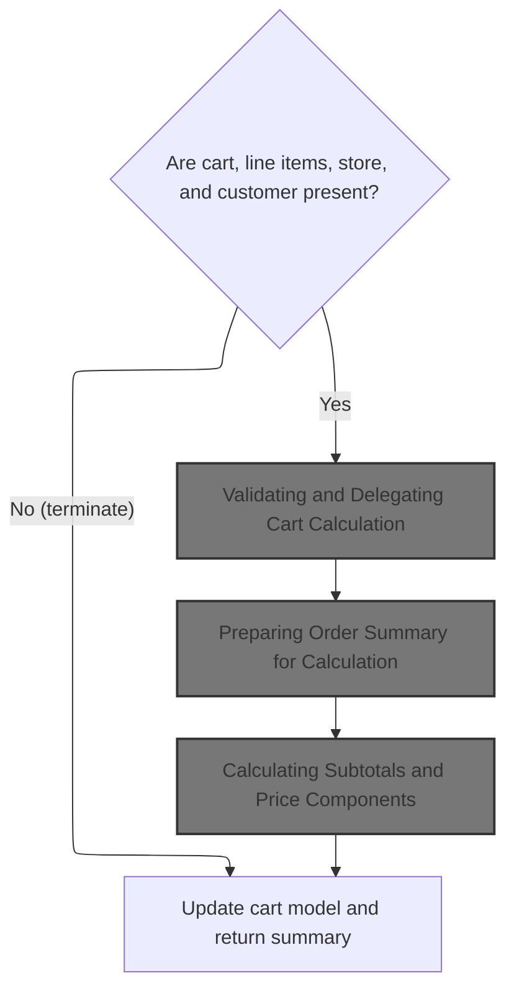
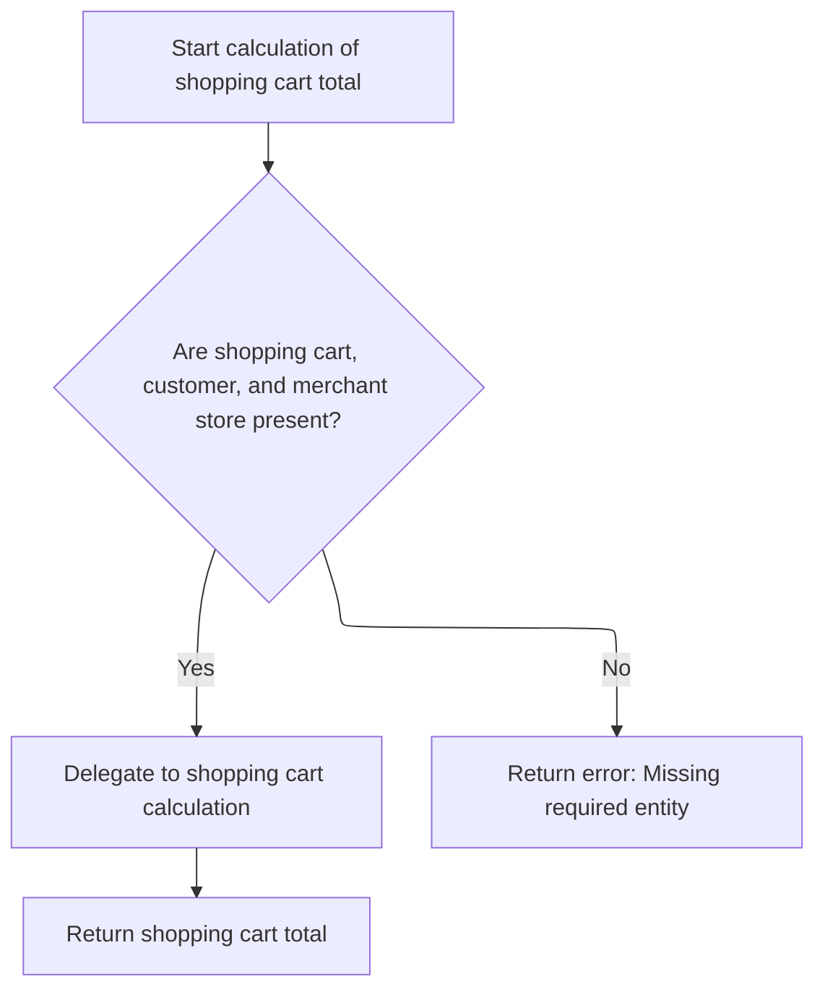

This document describes how the system calculates the total cost for a shopping cart during checkout. It validates required data, computes all price components, and returns a summary for order review and payment.

# Starting the Cart Total Calculation



This section is responsible for initiating the calculation of the shopping cart total. It ensures all necessary data is present and valid, then delegates the calculation to a dedicated service, returning a summary of the cart totals.

| Category        | Rule Name                  | Description                                                                                                                                                                                                                                                                                                                                                                                                                                                                                            |
| --------------- | -------------------------- | ------------------------------------------------------------------------------------------------------------------------------------------------------------------------------------------------------------------------------------------------------------------------------------------------------------------------------------------------------------------------------------------------------------------------------------------------------------------------------------------------------ |
| Data validation | Required Inputs Validation | If any of the following are missing: cart, cart line items, store, or customer, the calculation must not proceed and the process should terminate early.                                                                                                                                                                                                                                                                                                                                               |
| Business logic  | Delegated Cart Calculation | Once all required inputs are validated, the calculation of the cart total must be delegated to the order calculation service, ensuring consistency and reuse of business logic.                                                                                                                                                                                                                                                                                                                        |
| Business logic  | Order Summary Output       | The output of the calculation must be an <SwmToken path="shopizer/sm-core/src/main/java/com/salesmanager/core/business/shoppingcart/service/ShoppingCartCalculationServiceImpl.java" pos="63:3:3" line-data="    public OrderTotalSummary calculate( final ShoppingCart cartModel ,final Customer customer, final MerchantStore store, final Language language ) throws ServiceException">`OrderTotalSummary`</SwmToken> object that accurately reflects the totals and price components for the cart. |

<SwmSnippet path="/shopizer/sm-core/src/main/java/com/salesmanager/core/business/shoppingcart/service/ShoppingCartCalculationServiceImpl.java" line="63">

---

In <SwmToken path="shopizer/sm-core/src/main/java/com/salesmanager/core/business/shoppingcart/service/ShoppingCartCalculationServiceImpl.java" pos="63:5:5" line-data="    public OrderTotalSummary calculate( final ShoppingCart cartModel ,final Customer customer, final MerchantStore store, final Language language ) throws ServiceException">`calculate`</SwmToken>, we start by validating the cart, its items, the store, and the customer to make sure we aren't passing garbage downstream. Once that's done, we hand off the actual calculation to <SwmToken path="shopizer/sm-core/src/main/java/com/salesmanager/core/business/shoppingcart/service/ShoppingCartCalculationServiceImpl.java" pos="70:5:7" line-data="        OrderTotalSummary orderTotalSummary=orderService.calculateShoppingCartTotal( cartModel, customer,store, language );">`orderService.calculateShoppingCartTotal`</SwmToken>, which does the heavy lifting. This keeps the calculation logic out of this service and lets us reuse the calculation elsewhere.

```java
    public OrderTotalSummary calculate( final ShoppingCart cartModel ,final Customer customer, final MerchantStore store, final Language language ) throws ServiceException
    {

        Validate.notNull(cartModel,"cart cannot be null");
        Validate.notNull(cartModel.getLineItems(),"Cart should have line items.");
        Validate.notNull(store,"MerchantStore cannot be null");
        Validate.notNull(customer,"Customer cannot be null");
        OrderTotalSummary orderTotalSummary=orderService.calculateShoppingCartTotal( cartModel, customer,store, language );
```

---

</SwmSnippet>

## Validating and Delegating Cart Calculation



This section ensures that all required entities (shopping cart, customer, and merchant store) are present before calculating the shopping cart total. It separates validation and error handling from the calculation logic, delegating the actual calculation to a dedicated process.

| Category        | Rule Name                 | Description                                                                                                                                                                |
| --------------- | ------------------------- | -------------------------------------------------------------------------------------------------------------------------------------------------------------------------- |
| Data validation | Required entities present | A shopping cart, customer, and merchant store must all be provided before the cart total can be calculated. If any of these are missing, the calculation will not proceed. |

<SwmSnippet path="/shopizer/sm-core/src/main/java/com/salesmanager/core/business/order/service/OrderServiceImpl.java" line="393">

---

<SwmToken path="shopizer/sm-core/src/main/java/com/salesmanager/core/business/order/service/OrderServiceImpl.java" pos="393:5:5" line-data="    public OrderTotalSummary calculateShoppingCartTotal(">`calculateShoppingCartTotal`</SwmToken> just double-checks that the cart, customer, and store aren't null, then passes everything to <SwmToken path="shopizer/sm-core/src/main/java/com/salesmanager/core/business/order/service/OrderServiceImpl.java" pos="400:3:3" line-data="            return caculateShoppingCart(shoppingCart, customer, store, language);">`caculateShoppingCart`</SwmToken>. If anything blows up, it logs the error and throws a <SwmToken path="shopizer/sm-core/src/main/java/com/salesmanager/core/business/order/service/OrderServiceImpl.java" pos="395:10:10" line-data="                                                        final Language language) throws ServiceException {">`ServiceException`</SwmToken>. This keeps error handling and input validation separate from the calculation logic.

```java
    public OrderTotalSummary calculateShoppingCartTotal(
                                                        final ShoppingCart shoppingCart, final Customer customer, final MerchantStore store,
                                                        final Language language) throws ServiceException {
        Validate.notNull(shoppingCart,"Order summary cannot be null");
        Validate.notNull(customer,"Customery cannot be null");
        Validate.notNull(store,"MerchantStore cannot be null.");
        try {
            return caculateShoppingCart(shoppingCart, customer, store, language);
        } catch (Exception e) {
            LOGGER.error( "Error while calculating shopping cart total" +e );
            throw new ServiceException(e);
        }

    }
```

---

</SwmSnippet>

## Preparing Order Summary for Calculation

This section prepares the order summary by copying shopping cart items into a new <SwmToken path="shopizer/sm-core/src/main/java/com/salesmanager/core/business/order/service/OrderServiceImpl.java" pos="166:9:9" line-data="    private OrderTotalSummary caculateOrder(final OrderSummary summary, final Customer customer, final MerchantStore store, final Language language) throws Exception {">`OrderSummary`</SwmToken> object, ensuring that the calculation logic receives a consistent input format before proceeding to calculate the order totals.

| Category       | Rule Name                      | Description                                                                                                                                                                                                                                                                                                                                                                                                                                                   |
| -------------- | ------------------------------ | ------------------------------------------------------------------------------------------------------------------------------------------------------------------------------------------------------------------------------------------------------------------------------------------------------------------------------------------------------------------------------------------------------------------------------------------------------------- |
| Business logic | Include all cart items         | All items present in the shopping cart must be included in the <SwmToken path="shopizer/sm-core/src/main/java/com/salesmanager/core/business/order/service/OrderServiceImpl.java" pos="166:9:9" line-data="    private OrderTotalSummary caculateOrder(final OrderSummary summary, final Customer customer, final MerchantStore store, final Language language) throws Exception {">`OrderSummary`</SwmToken> for calculation.                                |
| Business logic | Standardized calculation input | The calculation process must use a standardized input format (<SwmToken path="shopizer/sm-core/src/main/java/com/salesmanager/core/business/order/service/OrderServiceImpl.java" pos="166:9:9" line-data="    private OrderTotalSummary caculateOrder(final OrderSummary summary, final Customer customer, final MerchantStore store, final Language language) throws Exception {">`OrderSummary`</SwmToken>) regardless of the original source of the items. |
| Business logic | Pass context information       | Customer, store, and language information must be passed along with the order summary to ensure accurate pricing, localization, and business rules application.                                                                                                                                                                                                                                                                                               |

<SwmSnippet path="/shopizer/sm-core/src/main/java/com/salesmanager/core/business/order/service/OrderServiceImpl.java" line="363">

---

<SwmToken path="shopizer/sm-core/src/main/java/com/salesmanager/core/business/order/service/OrderServiceImpl.java" pos="363:5:5" line-data="    private OrderTotalSummary caculateShoppingCart( final ShoppingCart shoppingCart, final Customer customer, final MerchantStore store, final Language language) throws Exception {">`caculateShoppingCart`</SwmToken> takes the cart and customer info, copies the cart items into a new <SwmToken path="shopizer/sm-core/src/main/java/com/salesmanager/core/business/order/service/OrderServiceImpl.java" pos="369:1:1" line-data="    	OrderSummary orderSummary = new OrderSummary();">`OrderSummary`</SwmToken>, and then hands that off to <SwmToken path="shopizer/sm-core/src/main/java/com/salesmanager/core/business/order/service/OrderServiceImpl.java" pos="375:5:5" line-data="    	return this.caculateOrder(orderSummary, customer, store, language);">`caculateOrder`</SwmToken> for the actual calculation. This keeps the calculation logic working with a consistent input type.

```java
    private OrderTotalSummary caculateShoppingCart( final ShoppingCart shoppingCart, final Customer customer, final MerchantStore store, final Language language) throws Exception {

        
    	
    	
    	
    	OrderSummary orderSummary = new OrderSummary();
    	
    	List<ShoppingCartItem> itemsSet = new ArrayList<ShoppingCartItem>(shoppingCart.getLineItems());
    	orderSummary.setProducts(itemsSet);
    	
    	
    	return this.caculateOrder(orderSummary, customer, store, language);

    }
```

---

</SwmSnippet>

## Calculating Subtotals and Price Components

```mermaid
%%{init: {"flowchart": {"defaultRenderer": "elk"}} }%%
flowchart TD
    node1["Start order calculation"]
    click node1 openCode "shopizer/sm-core/src/main/java/com/salesmanager/core/business/order/service/OrderServiceImpl.java:166:168"
    subgraph loop1["For each product in order"]
        node1 --> node2["Calculate item subtotal"]
        click node2 openCode "shopizer/sm-core/src/main/java/com/salesmanager/core/business/order/service/OrderServiceImpl.java:184:189"
        node2 --> node3{"Does item have additional prices?"}
        click node3 openCode "shopizer/sm-core/src/main/java/com/salesmanager/core/business/order/service/OrderServiceImpl.java:190:223"
        node3 -->|"Yes"| node4["Add additional prices to subtotal"]
        click node4 openCode "shopizer/sm-core/src/main/java/com/salesmanager/core/business/order/service/OrderServiceImpl.java:192:221"
        node3 -->|"No"| node5["No additional prices"]
        click node5 openCode "shopizer/sm-core/src/main/java/com/salesmanager/core/business/order/service/OrderServiceImpl.java:224:225"
        node4 --> node6["Update subtotal"]
        click node6 openCode "shopizer/sm-core/src/main/java/com/salesmanager/core/business/order/service/OrderServiceImpl.java:218:219"
        node5 --> node6
        node6 --> node7["Next item"]
        click node7 openCode "shopizer/sm-core/src/main/java/com/salesmanager/core/business/order/service/OrderServiceImpl.java:225:228"
    end
    node7 --> node8["Add subtotal to order"]
    click node8 openCode "shopizer/sm-core/src/main/java/com/salesmanager/core/business/order/service/OrderServiceImpl.java:228:243"
    node8 --> node9{"Is shipping required?"}
    click node9 openCode "shopizer/sm-core/src/main/java/com/salesmanager/core/business/order/service/OrderServiceImpl.java:247:284"
    node9 -->|"Yes"| node10{"Is shipping free?"}
    click node10 openCode "shopizer/sm-core/src/main/java/com/salesmanager/core/business/order/service/OrderServiceImpl.java:260:266"
    node10 -->|"Yes"| node11["Add free shipping (shipping cost = $0)"]
    click node11 openCode "shopizer/sm-core/src/main/java/com/salesmanager/core/business/order/service/OrderServiceImpl.java:264:265"
    node10 -->|"No"| node12["Add shipping cost"]
    click node12 openCode "shopizer/sm-core/src/main/java/com/salesmanager/core/business/order/service/OrderServiceImpl.java:261:262"
    node9 -->|"No"| node13["No shipping added"]
    click node13 openCode "shopizer/sm-core/src/main/java/com/salesmanager/core/business/order/service/OrderServiceImpl.java:285:286"
    node11 --> node14{"Are handling fees applicable?"}
    node12 --> node14
    node13 --> node14
    click node14 openCode "shopizer/sm-core/src/main/java/com/salesmanager/core/business/order/service/OrderServiceImpl.java:269:283"
    node14 -->|"Yes"| node15["Add handling fee"]
    click node15 openCode "shopizer/sm-core/src/main/java/com/salesmanager/core/business/order/service/OrderServiceImpl.java:272:281"
    node14 -->|"No"| node16["No handling fee"]
    click node16 openCode "shopizer/sm-core/src/main/java/com/salesmanager/core/business/order/service/OrderServiceImpl.java:284:285"
    node15 --> node17{"Are taxes applicable?"}
    node16 --> node17
    click node17 openCode "shopizer/sm-core/src/main/java/com/salesmanager/core/business/order/service/OrderServiceImpl.java:287:312"
    subgraph loop2["For each tax item"]
        node17 --> node18["Add tax line to order"]
        click node18 openCode "shopizer/sm-core/src/main/java/com/salesmanager/core/business/order/service/OrderServiceImpl.java:292:305"
        node18 --> node19["Sum tax amount"]
        click node19 openCode "shopizer/sm-core/src/main/java/com/salesmanager/core/business/order/service/OrderServiceImpl.java:303:304"
        node19 --> node17
    end
    node17 --> node20["Add taxes to total"]
    click node20 openCode "shopizer/sm-core/src/main/java/com/salesmanager/core/business/order/service/OrderServiceImpl.java:310:311"
    node20 --> node21["Calculate grand total"]
    click node21 openCode "shopizer/sm-core/src/main/java/com/salesmanager/core/business/order/service/OrderServiceImpl.java:315:323"
    node21 --> node22["Return order summary"]
    click node22 openCode "shopizer/sm-core/src/main/java/com/salesmanager/core/business/order/service/OrderServiceImpl.java:325:327"

classDef HeadingStyle fill:#777777,stroke:#333,stroke-width:2px;

%% Swimm:
%% %%{init: {"flowchart": {"defaultRenderer": "elk"}} }%%
%% flowchart TD
%%     node1["Start order calculation"]
%%     click node1 openCode "<SwmPath>[shopizer/…/service/OrderServiceImpl.java](shopizer/sm-core/src/main/java/com/salesmanager/core/business/order/service/OrderServiceImpl.java)</SwmPath>:166:168"
%%     subgraph loop1["For each product in order"]
%%         node1 --> node2["Calculate item subtotal"]
%%         click node2 openCode "<SwmPath>[shopizer/…/service/OrderServiceImpl.java](shopizer/sm-core/src/main/java/com/salesmanager/core/business/order/service/OrderServiceImpl.java)</SwmPath>:184:189"
%%         node2 --> node3{"Does item have additional prices?"}
%%         click node3 openCode "<SwmPath>[shopizer/…/service/OrderServiceImpl.java](shopizer/sm-core/src/main/java/com/salesmanager/core/business/order/service/OrderServiceImpl.java)</SwmPath>:190:223"
%%         node3 -->|"Yes"| node4["Add additional prices to subtotal"]
%%         click node4 openCode "<SwmPath>[shopizer/…/service/OrderServiceImpl.java](shopizer/sm-core/src/main/java/com/salesmanager/core/business/order/service/OrderServiceImpl.java)</SwmPath>:192:221"
%%         node3 -->|"No"| node5["No additional prices"]
%%         click node5 openCode "<SwmPath>[shopizer/…/service/OrderServiceImpl.java](shopizer/sm-core/src/main/java/com/salesmanager/core/business/order/service/OrderServiceImpl.java)</SwmPath>:224:225"
%%         node4 --> node6["Update subtotal"]
%%         click node6 openCode "<SwmPath>[shopizer/…/service/OrderServiceImpl.java](shopizer/sm-core/src/main/java/com/salesmanager/core/business/order/service/OrderServiceImpl.java)</SwmPath>:218:219"
%%         node5 --> node6
%%         node6 --> node7["Next item"]
%%         click node7 openCode "<SwmPath>[shopizer/…/service/OrderServiceImpl.java](shopizer/sm-core/src/main/java/com/salesmanager/core/business/order/service/OrderServiceImpl.java)</SwmPath>:225:228"
%%     end
%%     node7 --> node8["Add subtotal to order"]
%%     click node8 openCode "<SwmPath>[shopizer/…/service/OrderServiceImpl.java](shopizer/sm-core/src/main/java/com/salesmanager/core/business/order/service/OrderServiceImpl.java)</SwmPath>:228:243"
%%     node8 --> node9{"Is shipping required?"}
%%     click node9 openCode "<SwmPath>[shopizer/…/service/OrderServiceImpl.java](shopizer/sm-core/src/main/java/com/salesmanager/core/business/order/service/OrderServiceImpl.java)</SwmPath>:247:284"
%%     node9 -->|"Yes"| node10{"Is shipping free?"}
%%     click node10 openCode "<SwmPath>[shopizer/…/service/OrderServiceImpl.java](shopizer/sm-core/src/main/java/com/salesmanager/core/business/order/service/OrderServiceImpl.java)</SwmPath>:260:266"
%%     node10 -->|"Yes"| node11["Add free shipping (shipping cost = $0)"]
%%     click node11 openCode "<SwmPath>[shopizer/…/service/OrderServiceImpl.java](shopizer/sm-core/src/main/java/com/salesmanager/core/business/order/service/OrderServiceImpl.java)</SwmPath>:264:265"
%%     node10 -->|"No"| node12["Add shipping cost"]
%%     click node12 openCode "<SwmPath>[shopizer/…/service/OrderServiceImpl.java](shopizer/sm-core/src/main/java/com/salesmanager/core/business/order/service/OrderServiceImpl.java)</SwmPath>:261:262"
%%     node9 -->|"No"| node13["No shipping added"]
%%     click node13 openCode "<SwmPath>[shopizer/…/service/OrderServiceImpl.java](shopizer/sm-core/src/main/java/com/salesmanager/core/business/order/service/OrderServiceImpl.java)</SwmPath>:285:286"
%%     node11 --> node14{"Are handling fees applicable?"}
%%     node12 --> node14
%%     node13 --> node14
%%     click node14 openCode "<SwmPath>[shopizer/…/service/OrderServiceImpl.java](shopizer/sm-core/src/main/java/com/salesmanager/core/business/order/service/OrderServiceImpl.java)</SwmPath>:269:283"
%%     node14 -->|"Yes"| node15["Add handling fee"]
%%     click node15 openCode "<SwmPath>[shopizer/…/service/OrderServiceImpl.java](shopizer/sm-core/src/main/java/com/salesmanager/core/business/order/service/OrderServiceImpl.java)</SwmPath>:272:281"
%%     node14 -->|"No"| node16["No handling fee"]
%%     click node16 openCode "<SwmPath>[shopizer/…/service/OrderServiceImpl.java](shopizer/sm-core/src/main/java/com/salesmanager/core/business/order/service/OrderServiceImpl.java)</SwmPath>:284:285"
%%     node15 --> node17{"Are taxes applicable?"}
%%     node16 --> node17
%%     click node17 openCode "<SwmPath>[shopizer/…/service/OrderServiceImpl.java](shopizer/sm-core/src/main/java/com/salesmanager/core/business/order/service/OrderServiceImpl.java)</SwmPath>:287:312"
%%     subgraph loop2["For each tax item"]
%%         node17 --> node18["Add tax line to order"]
%%         click node18 openCode "<SwmPath>[shopizer/…/service/OrderServiceImpl.java](shopizer/sm-core/src/main/java/com/salesmanager/core/business/order/service/OrderServiceImpl.java)</SwmPath>:292:305"
%%         node18 --> node19["Sum tax amount"]
%%         click node19 openCode "<SwmPath>[shopizer/…/service/OrderServiceImpl.java](shopizer/sm-core/src/main/java/com/salesmanager/core/business/order/service/OrderServiceImpl.java)</SwmPath>:303:304"
%%         node19 --> node17
%%     end
%%     node17 --> node20["Add taxes to total"]
%%     click node20 openCode "<SwmPath>[shopizer/…/service/OrderServiceImpl.java](shopizer/sm-core/src/main/java/com/salesmanager/core/business/order/service/OrderServiceImpl.java)</SwmPath>:310:311"
%%     node20 --> node21["Calculate grand total"]
%%     click node21 openCode "<SwmPath>[shopizer/…/service/OrderServiceImpl.java](shopizer/sm-core/src/main/java/com/salesmanager/core/business/order/service/OrderServiceImpl.java)</SwmPath>:315:323"
%%     node21 --> node22["Return order summary"]
%%     click node22 openCode "<SwmPath>[shopizer/…/service/OrderServiceImpl.java](shopizer/sm-core/src/main/java/com/salesmanager/core/business/order/service/OrderServiceImpl.java)</SwmPath>:325:327"
%% 
%% classDef HeadingStyle fill:#777777,stroke:#333,stroke-width:2px;
```



This section is responsible for calculating the detailed price breakdown for an order, including subtotals for each item, additional price components, shipping, handling fees, taxes, and the final grand total. The breakdown is used for order review, payment, and reporting.

| Category       | Rule Name                     | Description                                                                                                                                                           |
| -------------- | ----------------------------- | --------------------------------------------------------------------------------------------------------------------------------------------------------------------- |
| Business logic | Product subtotal calculation  | The subtotal for each product is calculated by multiplying the item's unit price by its quantity.                                                                     |
| Business logic | One-time price inclusion      | Any additional prices marked as one-time charges for a product are added to the subtotal for that product.                                                            |
| Business logic | Order subtotal aggregation    | The order subtotal is the sum of all product subtotals, including any one-time additional prices.                                                                     |
| Business logic | Shipping cost application     | If shipping is required, a shipping cost is added to the order total. If shipping is free, the shipping cost is set to $0.                                            |
| Business logic | Handling fee condition        | Handling fees are added to the order total only if both the shipping summary and store configuration specify a non-zero handling fee.                                 |
| Business logic | Tax calculation and breakdown | Taxes are calculated for the order and each tax item is added as a separate line in the order breakdown. The total tax amount is summed and added to the grand total. |
| Business logic | Grand total calculation       | The grand total is calculated by summing the order subtotal, shipping cost, handling fee, and total taxes.                                                            |
| Business logic | Cost component breakdown      | Each cost component (subtotal, shipping, handling, taxes, grand total) is tracked separately in the order summary for display and reporting purposes.                 |

<SwmSnippet path="/shopizer/sm-core/src/main/java/com/salesmanager/core/business/order/service/OrderServiceImpl.java" line="166">

---

In <SwmToken path="shopizer/sm-core/src/main/java/com/salesmanager/core/business/order/service/OrderServiceImpl.java" pos="166:5:5" line-data="    private OrderTotalSummary caculateOrder(final OrderSummary summary, final Customer customer, final MerchantStore store, final Language language) throws Exception {">`caculateOrder`</SwmToken>, we loop through each cart item, calculate its subtotal, and add any extra prices if they're one-time charges. All these get rolled into the subtotal, which is then used for the rest of the order total calculation.

```java
    private OrderTotalSummary caculateOrder(final OrderSummary summary, final Customer customer, final MerchantStore store, final Language language) throws Exception {

        OrderTotalSummary totalSummary = new OrderTotalSummary();
        List<OrderTotal> orderTotals = new ArrayList<OrderTotal>();
        Map<String,OrderTotal> otherPricesTotals = new HashMap<String,OrderTotal>();

        ShippingConfiguration shippingConfiguration = null;

        BigDecimal grandTotal = new BigDecimal(0);
        grandTotal.setScale(2, RoundingMode.HALF_UP);

        //price by item
        /**
         * qty * price
         * subtotal
         */
        BigDecimal subTotal = new BigDecimal(0);
        subTotal.setScale(2, RoundingMode.HALF_UP);
        for(ShoppingCartItem item : summary.getProducts()) {

            BigDecimal st = item.getItemPrice().multiply(new BigDecimal(item.getQuantity()));
            item.setSubTotal(st);
            subTotal = subTotal.add(st);
            //Other prices
            FinalPrice finalPrice = item.getFinalPrice();
            if(finalPrice!=null) {
                List<FinalPrice> otherPrices = finalPrice.getAdditionalPrices();
                if(otherPrices!=null) {
                    for(FinalPrice price : otherPrices) {
                        if(!price.isDefaultPrice()) {
                            OrderTotal itemSubTotal = otherPricesTotals.get(price.getProductPrice().getCode());

                            if(itemSubTotal==null) {
                                itemSubTotal = new OrderTotal();
                                itemSubTotal.setModule(Constants.OT_ITEM_PRICE_MODULE_CODE);
                                itemSubTotal.setText(Constants.OT_ITEM_PRICE_MODULE_CODE);
                                itemSubTotal.setTitle(Constants.OT_ITEM_PRICE_MODULE_CODE);
                                itemSubTotal.setOrderTotalCode(price.getProductPrice().getCode());
                                itemSubTotal.setOrderTotalType(OrderTotalType.PRODUCT);
                                itemSubTotal.setSortOrder(0);
                                otherPricesTotals.put(price.getProductPrice().getCode(), itemSubTotal);
                            }

                            BigDecimal orderTotalValue = itemSubTotal.getValue();
                            if(orderTotalValue==null) {
                                orderTotalValue = new BigDecimal(0);
                                orderTotalValue.setScale(2, RoundingMode.HALF_UP);
                            }

                            orderTotalValue = orderTotalValue.add(price.getFinalPrice());
                            itemSubTotal.setValue(orderTotalValue);
                            if(price.getProductPrice().getProductPriceType().name().equals(OrderValueType.ONE_TIME)) {
                                subTotal = subTotal.add(price.getFinalPrice());
                            }
                        }
                    }
                }
            }

        }
```

---

</SwmSnippet>

<SwmSnippet path="/shopizer/sm-core/src/main/java/com/salesmanager/core/business/order/service/OrderServiceImpl.java" line="228">

---

After calculating subtotals, we build <SwmToken path="shopizer/sm-core/src/main/java/com/salesmanager/core/business/order/service/OrderServiceImpl.java" pos="231:1:1" line-data="        OrderTotal orderTotalSubTotal = new OrderTotal();">`OrderTotal`</SwmToken> objects for each cost part—subtotal, shipping, handling, and taxes. These get added to the summary so each piece is tracked and can be displayed separately.

```java
        totalSummary.setSubTotal(subTotal);
        grandTotal=grandTotal.add(subTotal);

        OrderTotal orderTotalSubTotal = new OrderTotal();
        orderTotalSubTotal.setModule(Constants.OT_SUBTOTAL_MODULE_CODE);
        orderTotalSubTotal.setOrderTotalType(OrderTotalType.SUBTOTAL);
        orderTotalSubTotal.setOrderTotalCode("order.total.subtotal");
        orderTotalSubTotal.setTitle(Constants.OT_SUBTOTAL_MODULE_CODE);
        orderTotalSubTotal.setText("order.total.subtotal");
        orderTotalSubTotal.setSortOrder(5);
        orderTotalSubTotal.setValue(subTotal);

        //TODO autowire a list of post processing modules for price calculation - drools, custom modules
        //may affect the sub total

        orderTotals.add(orderTotalSubTotal);


        //shipping
        if(summary.getShippingSummary()!=null) {


	            OrderTotal shippingSubTotal = new OrderTotal();
	            shippingSubTotal.setModule(Constants.OT_SHIPPING_MODULE_CODE);
	            shippingSubTotal.setOrderTotalType(OrderTotalType.SHIPPING);
	            shippingSubTotal.setOrderTotalCode("order.total.shipping");
	            shippingSubTotal.setTitle(Constants.OT_SHIPPING_MODULE_CODE);
	            shippingSubTotal.setText("order.total.shipping");
	            shippingSubTotal.setSortOrder(10);
	
	            orderTotals.add(shippingSubTotal);

            if(!summary.getShippingSummary().isFreeShipping()) {
                shippingSubTotal.setValue(summary.getShippingSummary().getShipping());
                grandTotal=grandTotal.add(summary.getShippingSummary().getShipping());
            } else {
                shippingSubTotal.setValue(new BigDecimal(0));
                grandTotal=grandTotal.add(new BigDecimal(0));
            }

            //check handling fees
            shippingConfiguration = shippingService.getShippingConfiguration(store);
            if(summary.getShippingSummary().getHandling()!=null && summary.getShippingSummary().getHandling().doubleValue()>0) {
                if(shippingConfiguration.getHandlingFees()!=null && shippingConfiguration.getHandlingFees().doubleValue()>0) {
                    OrderTotal handlingubTotal = new OrderTotal();
                    handlingubTotal.setModule(Constants.OT_HANDLING_MODULE_CODE);
                    handlingubTotal.setOrderTotalType(OrderTotalType.HANDLING);
                    handlingubTotal.setOrderTotalCode("order.total.handling");
                    handlingubTotal.setTitle(Constants.OT_HANDLING_MODULE_CODE);
                    handlingubTotal.setText("order.total.handling");
                    handlingubTotal.setSortOrder(12);
                    handlingubTotal.setValue(summary.getShippingSummary().getHandling());
                    orderTotals.add(handlingubTotal);
                    grandTotal=grandTotal.add(summary.getShippingSummary().getHandling());
                }
            }
        }

        //tax
        List<TaxItem> taxes = taxService.calculateTax(summary, customer, store, language);
        if(taxes!=null && taxes.size()>0) {
        	BigDecimal totalTaxes = new BigDecimal(0);
        	totalTaxes.setScale(2, RoundingMode.HALF_UP);
            int taxCount = 20;
            for(TaxItem tax : taxes) {

                OrderTotal taxLine = new OrderTotal();
                taxLine.setModule(Constants.OT_TAX_MODULE_CODE);
                taxLine.setOrderTotalType(OrderTotalType.TAX);
                taxLine.setOrderTotalCode(tax.getLabel());
                taxLine.setSortOrder(taxCount);
                taxLine.setTitle(Constants.OT_TAX_MODULE_CODE);
                taxLine.setText(tax.getLabel());
                taxLine.setValue(tax.getItemPrice());

                totalTaxes = totalTaxes.add(tax.getItemPrice());
                orderTotals.add(taxLine);
                //grandTotal=grandTotal.add(tax.getItemPrice());

                taxCount ++;

            }
```

---

</SwmSnippet>

<SwmSnippet path="/shopizer/sm-core/src/main/java/com/salesmanager/core/business/order/service/OrderServiceImpl.java" line="310">

---

We return an <SwmToken path="shopizer/sm-core/src/main/java/com/salesmanager/core/business/shoppingcart/service/ShoppingCartCalculationServiceImpl.java" pos="63:3:3" line-data="    public OrderTotalSummary calculate( final ShoppingCart cartModel ,final Customer customer, final MerchantStore store, final Language language ) throws ServiceException">`OrderTotalSummary`</SwmToken> with all the breakdowns and the grand total.

```java
            grandTotal = grandTotal.add(totalTaxes);
            totalSummary.setTaxTotal(totalTaxes);
        }

        // grand total
        OrderTotal orderTotal = new OrderTotal();
        orderTotal.setModule(Constants.OT_TOTAL_MODULE_CODE);
        orderTotal.setOrderTotalType(OrderTotalType.TOTAL);
        orderTotal.setOrderTotalCode("order.total.total");
        orderTotal.setTitle(Constants.OT_TOTAL_MODULE_CODE);
        orderTotal.setText("order.total.total");
        orderTotal.setSortOrder(300);
        orderTotal.setValue(grandTotal);
        orderTotals.add(orderTotal);

        totalSummary.setTotal(grandTotal);
        totalSummary.setTotals(orderTotals);
        return totalSummary;

    }
```

---

</SwmSnippet>

## Updating Cart Model and Returning Summary

<SwmSnippet path="/shopizer/sm-core/src/main/java/com/salesmanager/core/business/shoppingcart/service/ShoppingCartCalculationServiceImpl.java" line="71">

---

Back in `ShoppingCartCalculationServiceImpl.calculate`, after getting the summary from the order service, we update the cart model to sync its state with the calculation, then return the summary. This keeps the cart consistent with what was just calculated.

```java
        updateCartModel(cartModel);
        return orderTotalSummary;


    }
```

---

</SwmSnippet>

&nbsp;

*This is an auto-generated document by Swimm 🌊 and has not yet been verified by a human*

<SwmMeta version="3.0.0" repo-id="Z2l0aHViJTNBJTNBU2hvcGl6ZXIlM0ElM0F1bWFsaW5nYXN3YW1p" repo-name="Shopizer"><sup>Powered by [Swimm](https://app.swimm.io/)</sup></SwmMeta>
