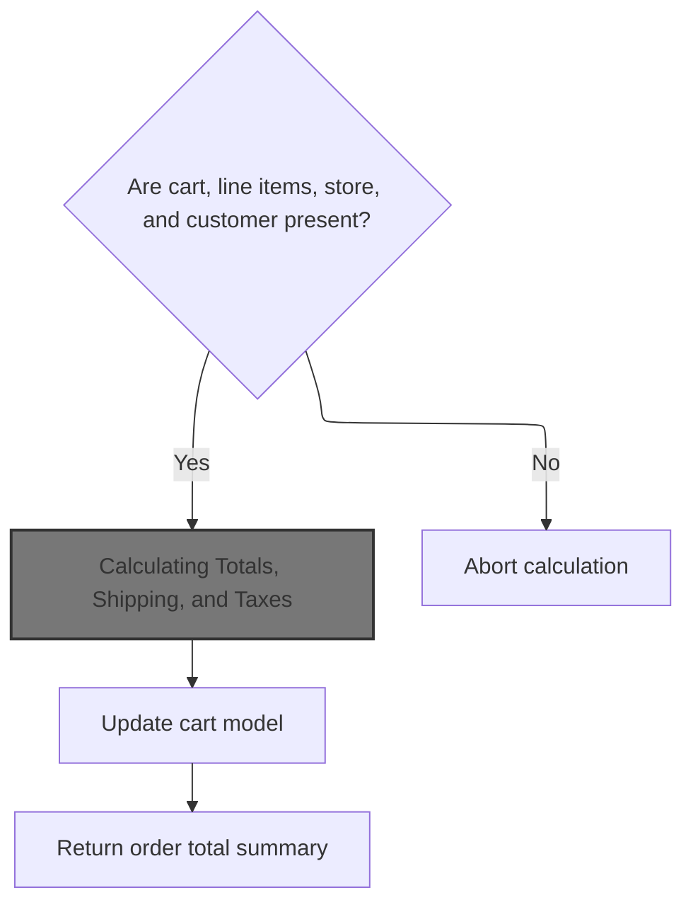
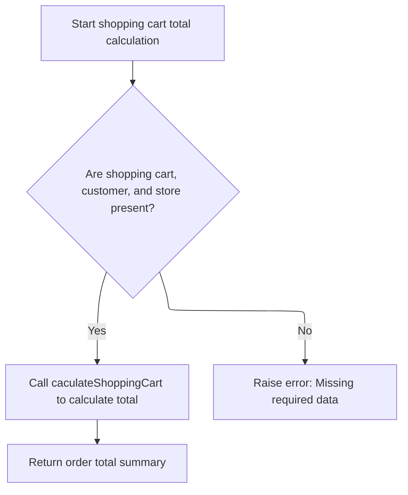

This document describes how the system calculates the financial breakdown of a shopping cart during checkout. The flow validates required data, prepares an order summary, calculates all relevant costs, and returns a complete order total summary for the customer and store.

# Validating Cart and Delegating Calculation



This section ensures that all necessary data for a shopping cart calculation is present and valid before delegating the calculation of totals, shipping, and taxes to a dedicated service. It separates validation from calculation to maintain data integrity and prevent errors.

| Category        | Rule Name                  | Description                                                                                                                                                            |
| --------------- | -------------------------- | ---------------------------------------------------------------------------------------------------------------------------------------------------------------------- |
| Data validation | Cart Presence Required     | If the shopping cart is missing, the calculation must be aborted and no totals are calculated.                                                                         |
| Data validation | Line Items Required        | If the cart does not contain any line items, the calculation must be aborted and no totals are calculated.                                                             |
| Data validation | Store Presence Required    | If the merchant store information is missing, the calculation must be aborted and no totals are calculated.                                                            |
| Data validation | Customer Presence Required | If the customer information is missing, the calculation must be aborted and no totals are calculated.                                                                  |
| Business logic  | Delegate Calculation       | When all required data is present, the calculation of totals, shipping, and taxes must be delegated to the order service, which returns a summary of the order totals. |

<SwmSnippet path="/shopizer/sm-core/src/main/java/com/salesmanager/core/business/shoppingcart/service/ShoppingCartCalculationServiceImpl.java" line="63">

---

In `ShoppingCartCalculationServiceImpl.calculate`, we start by validating the cart, its line items, the store, and the customer to avoid null pointer issues. Once that's done, we hand off the actual calculation to <SwmToken path="shopizer/sm-core/src/main/java/com/salesmanager/core/business/shoppingcart/service/ShoppingCartCalculationServiceImpl.java" pos="70:5:7" line-data="        OrderTotalSummary orderTotalSummary=orderService.calculateShoppingCartTotal( cartModel, customer,store, language );">`orderService.calculateShoppingCartTotal`</SwmToken>, which is where the main business logic for totals lives. This keeps validation and calculation separate.

```java
    public OrderTotalSummary calculate( final ShoppingCart cartModel ,final Customer customer, final MerchantStore store, final Language language ) throws ServiceException
    {

        Validate.notNull(cartModel,"cart cannot be null");
        Validate.notNull(cartModel.getLineItems(),"Cart should have line items.");
        Validate.notNull(store,"MerchantStore cannot be null");
        Validate.notNull(customer,"Customer cannot be null");
        OrderTotalSummary orderTotalSummary=orderService.calculateShoppingCartTotal( cartModel, customer,store, language );
```

---

</SwmSnippet>

## Validating and Wrapping Cart Calculation



This section is responsible for validating the presence of required data before calculating the shopping cart total, and for ensuring consistent error handling during the calculation process.

| Category        | Rule Name               | Description                                                                                                                 |
| --------------- | ----------------------- | --------------------------------------------------------------------------------------------------------------------------- |
| Data validation | Required data presence  | If the shopping cart, customer, or merchant store is missing, the calculation must not proceed and an error must be raised. |
| Business logic  | Conditional calculation | The shopping cart total must be calculated only if all required data is present.                                            |

<SwmSnippet path="/shopizer/sm-core/src/main/java/com/salesmanager/core/business/order/service/OrderServiceImpl.java" line="393">

---

<SwmToken path="shopizer/sm-core/src/main/java/com/salesmanager/core/business/order/service/OrderServiceImpl.java" pos="393:5:5" line-data="    public OrderTotalSummary calculateShoppingCartTotal(">`calculateShoppingCartTotal`</SwmToken> does another round of input validation, then delegates the actual calculation to <SwmToken path="shopizer/sm-core/src/main/java/com/salesmanager/core/business/order/service/OrderServiceImpl.java" pos="400:3:3" line-data="            return caculateShoppingCart(shoppingCart, customer, store, language);">`caculateShoppingCart`</SwmToken>. Any exceptions from that call get wrapped in a <SwmToken path="shopizer/sm-core/src/main/java/com/salesmanager/core/business/order/service/OrderServiceImpl.java" pos="395:10:10" line-data="                                                        final Language language) throws ServiceException {">`ServiceException`</SwmToken> for consistent error handling.

```java
    public OrderTotalSummary calculateShoppingCartTotal(
                                                        final ShoppingCart shoppingCart, final Customer customer, final MerchantStore store,
                                                        final Language language) throws ServiceException {
        Validate.notNull(shoppingCart,"Order summary cannot be null");
        Validate.notNull(customer,"Customery cannot be null");
        Validate.notNull(store,"MerchantStore cannot be null.");
        try {
            return caculateShoppingCart(shoppingCart, customer, store, language);
        } catch (Exception e) {
            LOGGER.error( "Error while calculating shopping cart total" +e );
            throw new ServiceException(e);
        }

    }
```

---

</SwmSnippet>

## Preparing Order Summary from Cart

This section is responsible for preparing an order summary from the contents of a shopping cart, ensuring that all selected items are included and that the summary is ready for further order calculations.

| Category       | Rule Name                   | Description                                                                                                                                                   |
| -------------- | --------------------------- | ------------------------------------------------------------------------------------------------------------------------------------------------------------- |
| Business logic | Include all cart items      | All line items present in the shopping cart must be included in the order summary.                                                                            |
| Business logic | Contextual order summary    | The order summary must be prepared using the current customer, store, and language context to ensure correct pricing, localization, and store-specific rules. |
| Business logic | Order summary extensibility | The order summary must be constructed in a way that allows further calculations, such as discounts, taxes, and shipping, to be applied in subsequent steps.   |

<SwmSnippet path="/shopizer/sm-core/src/main/java/com/salesmanager/core/business/order/service/OrderServiceImpl.java" line="363">

---

<SwmToken path="shopizer/sm-core/src/main/java/com/salesmanager/core/business/order/service/OrderServiceImpl.java" pos="363:5:5" line-data="    private OrderTotalSummary caculateShoppingCart( final ShoppingCart shoppingCart, final Customer customer, final MerchantStore store, final Language language) throws Exception {">`caculateShoppingCart`</SwmToken> builds an <SwmToken path="shopizer/sm-core/src/main/java/com/salesmanager/core/business/order/service/OrderServiceImpl.java" pos="369:1:1" line-data="    	OrderSummary orderSummary = new OrderSummary();">`OrderSummary`</SwmToken> from the cart's line items, then hands off the calculation to <SwmToken path="shopizer/sm-core/src/main/java/com/salesmanager/core/business/order/service/OrderServiceImpl.java" pos="375:5:5" line-data="    	return this.caculateOrder(orderSummary, customer, store, language);">`caculateOrder`</SwmToken>. This keeps the cart and order logic separate and reusable.

```java
    private OrderTotalSummary caculateShoppingCart( final ShoppingCart shoppingCart, final Customer customer, final MerchantStore store, final Language language) throws Exception {

        
    	
    	
    	
    	OrderSummary orderSummary = new OrderSummary();
    	
    	List<ShoppingCartItem> itemsSet = new ArrayList<ShoppingCartItem>(shoppingCart.getLineItems());
    	orderSummary.setProducts(itemsSet);
    	
    	
    	return this.caculateOrder(orderSummary, customer, store, language);

    }
```

---

</SwmSnippet>

## Calculating Totals, Shipping, and Taxes

```mermaid
%%{init: {"flowchart": {"defaultRenderer": "elk"}} }%%
flowchart TD
    node1["Start order calculation"] --> node2["Initialize totals"]
    click node1 openCode "shopizer/sm-core/src/main/java/com/salesmanager/core/business/order/service/OrderServiceImpl.java:166:168"
    click node2 openCode "shopizer/sm-core/src/main/java/com/salesmanager/core/business/order/service/OrderServiceImpl.java:168:174"
    node2 --> node3["Process products"]
    click node3 openCode "shopizer/sm-core/src/main/java/com/salesmanager/core/business/order/service/OrderServiceImpl.java:184:225"
    subgraph loop1["For each product in order"]
        node3 --> node4["Calculate item subtotal"]
        click node4 openCode "shopizer/sm-core/src/main/java/com/salesmanager/core/business/order/service/OrderServiceImpl.java:186:188"
        node4 --> node5{"Has additional prices?"}
        click node5 openCode "shopizer/sm-core/src/main/java/com/salesmanager/core/business/order/service/OrderServiceImpl.java:190:223"
        node5 -->|"Yes"| node6["Process additional prices"]
        node5 -->|"No"| node7["Continue"]
        subgraph loop1a["For each additional price"]
            node6 --> node8{"Is price default?"}
            click node8 openCode "shopizer/sm-core/src/main/java/com/salesmanager/core/business/order/service/OrderServiceImpl.java:195:220"
            node8 -->|"No"| node9["Add special price to totals"]
            click node9 openCode "shopizer/sm-core/src/main/java/com/salesmanager/core/business/order/service/OrderServiceImpl.java:196:217"
            node8 -->|"Yes"| node7
            node9 --> node7
        end
        node7 --> node3
    end
    node3 --> node10{"Is shipping required?"}
    click node10 openCode "shopizer/sm-core/src/main/java/com/salesmanager/core/business/order/service/OrderServiceImpl.java:247:284"
    node10 -->|"Yes"| node11{"Is shipping free?"}
    click node11 openCode "shopizer/sm-core/src/main/java/com/salesmanager/core/business/order/service/OrderServiceImpl.java:260:266"
    node11 -->|"Yes"| node12["Add free shipping"]
    click node12 openCode "shopizer/sm-core/src/main/java/com/salesmanager/core/business/order/service/OrderServiceImpl.java:264:265"
    node11 -->|"No"| node13["Add shipping cost"]
    click node13 openCode "shopizer/sm-core/src/main/java/com/salesmanager/core/business/order/service/OrderServiceImpl.java:261:262"
    node12 --> node14{"Add handling fee?"}
    node13 --> node14
    click node14 openCode "shopizer/sm-core/src/main/java/com/salesmanager/core/business/order/service/OrderServiceImpl.java:270:282"
    node14 -->|"Yes"| node16["Add handling fee"]
    click node16 openCode "shopizer/sm-core/src/main/java/com/salesmanager/core/business/order/service/OrderServiceImpl.java:272:281"
    node14 -->|"No"| node17["Continue"]
    node16 --> node17
    node17 --> node18["Calculate taxes"]
    click node18 openCode "shopizer/sm-core/src/main/java/com/salesmanager/core/business/order/service/OrderServiceImpl.java:287:309"
    subgraph loop2["For each tax item"]
        node18 --> node19["Add tax to totals"]
        click node19 openCode "shopizer/sm-core/src/main/java/com/salesmanager/core/business/order/service/OrderServiceImpl.java:292:305"
        node19 --> node18
    end
    node18 --> node20["Calculate grand total"]
    click node20 openCode "shopizer/sm-core/src/main/java/com/salesmanager/core/business/order/service/OrderServiceImpl.java:310:325"
    node20 --> node21["Return order summary"]
    click node21 openCode "shopizer/sm-core/src/main/java/com/salesmanager/core/business/order/service/OrderServiceImpl.java:326:327"

classDef HeadingStyle fill:#777777,stroke:#333,stroke-width:2px;

%% Swimm:
%% %%{init: {"flowchart": {"defaultRenderer": "elk"}} }%%
%% flowchart TD
%%     node1["Start order calculation"] --> node2["Initialize totals"]
%%     click node1 openCode "<SwmPath>[shopizer/…/service/OrderServiceImpl.java](shopizer/sm-core/src/main/java/com/salesmanager/core/business/order/service/OrderServiceImpl.java)</SwmPath>:166:168"
%%     click node2 openCode "<SwmPath>[shopizer/…/service/OrderServiceImpl.java](shopizer/sm-core/src/main/java/com/salesmanager/core/business/order/service/OrderServiceImpl.java)</SwmPath>:168:174"
%%     node2 --> node3["Process products"]
%%     click node3 openCode "<SwmPath>[shopizer/…/service/OrderServiceImpl.java](shopizer/sm-core/src/main/java/com/salesmanager/core/business/order/service/OrderServiceImpl.java)</SwmPath>:184:225"
%%     subgraph loop1["For each product in order"]
%%         node3 --> node4["Calculate item subtotal"]
%%         click node4 openCode "<SwmPath>[shopizer/…/service/OrderServiceImpl.java](shopizer/sm-core/src/main/java/com/salesmanager/core/business/order/service/OrderServiceImpl.java)</SwmPath>:186:188"
%%         node4 --> node5{"Has additional prices?"}
%%         click node5 openCode "<SwmPath>[shopizer/…/service/OrderServiceImpl.java](shopizer/sm-core/src/main/java/com/salesmanager/core/business/order/service/OrderServiceImpl.java)</SwmPath>:190:223"
%%         node5 -->|"Yes"| node6["Process additional prices"]
%%         node5 -->|"No"| node7["Continue"]
%%         subgraph loop1a["For each additional price"]
%%             node6 --> node8{"Is price default?"}
%%             click node8 openCode "<SwmPath>[shopizer/…/service/OrderServiceImpl.java](shopizer/sm-core/src/main/java/com/salesmanager/core/business/order/service/OrderServiceImpl.java)</SwmPath>:195:220"
%%             node8 -->|"No"| node9["Add special price to totals"]
%%             click node9 openCode "<SwmPath>[shopizer/…/service/OrderServiceImpl.java](shopizer/sm-core/src/main/java/com/salesmanager/core/business/order/service/OrderServiceImpl.java)</SwmPath>:196:217"
%%             node8 -->|"Yes"| node7
%%             node9 --> node7
%%         end
%%         node7 --> node3
%%     end
%%     node3 --> node10{"Is shipping required?"}
%%     click node10 openCode "<SwmPath>[shopizer/…/service/OrderServiceImpl.java](shopizer/sm-core/src/main/java/com/salesmanager/core/business/order/service/OrderServiceImpl.java)</SwmPath>:247:284"
%%     node10 -->|"Yes"| node11{"Is shipping free?"}
%%     click node11 openCode "<SwmPath>[shopizer/…/service/OrderServiceImpl.java](shopizer/sm-core/src/main/java/com/salesmanager/core/business/order/service/OrderServiceImpl.java)</SwmPath>:260:266"
%%     node11 -->|"Yes"| node12["Add free shipping"]
%%     click node12 openCode "<SwmPath>[shopizer/…/service/OrderServiceImpl.java](shopizer/sm-core/src/main/java/com/salesmanager/core/business/order/service/OrderServiceImpl.java)</SwmPath>:264:265"
%%     node11 -->|"No"| node13["Add shipping cost"]
%%     click node13 openCode "<SwmPath>[shopizer/…/service/OrderServiceImpl.java](shopizer/sm-core/src/main/java/com/salesmanager/core/business/order/service/OrderServiceImpl.java)</SwmPath>:261:262"
%%     node12 --> node14{"Add handling fee?"}
%%     node13 --> node14
%%     click node14 openCode "<SwmPath>[shopizer/…/service/OrderServiceImpl.java](shopizer/sm-core/src/main/java/com/salesmanager/core/business/order/service/OrderServiceImpl.java)</SwmPath>:270:282"
%%     node14 -->|"Yes"| node16["Add handling fee"]
%%     click node16 openCode "<SwmPath>[shopizer/…/service/OrderServiceImpl.java](shopizer/sm-core/src/main/java/com/salesmanager/core/business/order/service/OrderServiceImpl.java)</SwmPath>:272:281"
%%     node14 -->|"No"| node17["Continue"]
%%     node16 --> node17
%%     node17 --> node18["Calculate taxes"]
%%     click node18 openCode "<SwmPath>[shopizer/…/service/OrderServiceImpl.java](shopizer/sm-core/src/main/java/com/salesmanager/core/business/order/service/OrderServiceImpl.java)</SwmPath>:287:309"
%%     subgraph loop2["For each tax item"]
%%         node18 --> node19["Add tax to totals"]
%%         click node19 openCode "<SwmPath>[shopizer/…/service/OrderServiceImpl.java](shopizer/sm-core/src/main/java/com/salesmanager/core/business/order/service/OrderServiceImpl.java)</SwmPath>:292:305"
%%         node19 --> node18
%%     end
%%     node18 --> node20["Calculate grand total"]
%%     click node20 openCode "<SwmPath>[shopizer/…/service/OrderServiceImpl.java](shopizer/sm-core/src/main/java/com/salesmanager/core/business/order/service/OrderServiceImpl.java)</SwmPath>:310:325"
%%     node20 --> node21["Return order summary"]
%%     click node21 openCode "<SwmPath>[shopizer/…/service/OrderServiceImpl.java](shopizer/sm-core/src/main/java/com/salesmanager/core/business/order/service/OrderServiceImpl.java)</SwmPath>:326:327"
%% 
%% classDef HeadingStyle fill:#777777,stroke:#333,stroke-width:2px;
```



This section is responsible for calculating the complete financial breakdown of an order, including product subtotals, additional prices, shipping and handling fees, applicable taxes, and the final grand total. The result is used to display or process the order summary for the customer and store.

| Category       | Rule Name                     | Description                                                                                                                                                   |
| -------------- | ----------------------------- | ------------------------------------------------------------------------------------------------------------------------------------------------------------- |
| Business logic | Product subtotal calculation  | The subtotal for each product is calculated by multiplying the product price by the quantity ordered.                                                         |
| Business logic | Additional price inclusion    | If a product has additional prices (such as special or promotional prices), these are added to the subtotal only if they are not marked as the default price. |
| Business logic | Shipping cost application     | Shipping costs are added to the order total only if shipping is required and not marked as free shipping.                                                     |
| Business logic | Handling fee application      | If a handling fee is present and configured for the store, it is added to the order total.                                                                    |
| Business logic | Tax calculation and inclusion | Taxes are calculated for the order and each tax item is added to the order total breakdown. The total tax amount is summed and added to the grand total.      |
| Business logic | Grand total calculation       | The grand total is calculated by summing the subtotal, shipping, handling, and tax amounts.                                                                   |
| Business logic | Free shipping handling        | If shipping is marked as free, the shipping cost is set to zero in the order total breakdown.                                                                 |
| Business logic | Order total breakdown         | Each component of the order total (subtotal, shipping, handling, taxes, grand total) is represented as a separate item in the order summary breakdown.        |

<SwmSnippet path="/shopizer/sm-core/src/main/java/com/salesmanager/core/business/order/service/OrderServiceImpl.java" line="166">

---

In <SwmToken path="shopizer/sm-core/src/main/java/com/salesmanager/core/business/order/service/OrderServiceImpl.java" pos="166:5:5" line-data="    private OrderTotalSummary caculateOrder(final OrderSummary summary, final Customer customer, final MerchantStore store, final Language language) throws Exception {">`caculateOrder`</SwmToken>, we loop through each product to calculate subtotals, handle extra prices, and then add shipping, handling, and taxes. All these pieces get summed up for the grand total.

```java
    private OrderTotalSummary caculateOrder(final OrderSummary summary, final Customer customer, final MerchantStore store, final Language language) throws Exception {

        OrderTotalSummary totalSummary = new OrderTotalSummary();
        List<OrderTotal> orderTotals = new ArrayList<OrderTotal>();
        Map<String,OrderTotal> otherPricesTotals = new HashMap<String,OrderTotal>();

        ShippingConfiguration shippingConfiguration = null;

        BigDecimal grandTotal = new BigDecimal(0);
        grandTotal.setScale(2, RoundingMode.HALF_UP);

        //price by item
        /**
         * qty * price
         * subtotal
         */
        BigDecimal subTotal = new BigDecimal(0);
        subTotal.setScale(2, RoundingMode.HALF_UP);
        for(ShoppingCartItem item : summary.getProducts()) {

            BigDecimal st = item.getItemPrice().multiply(new BigDecimal(item.getQuantity()));
            item.setSubTotal(st);
            subTotal = subTotal.add(st);
            //Other prices
            FinalPrice finalPrice = item.getFinalPrice();
            if(finalPrice!=null) {
                List<FinalPrice> otherPrices = finalPrice.getAdditionalPrices();
                if(otherPrices!=null) {
                    for(FinalPrice price : otherPrices) {
                        if(!price.isDefaultPrice()) {
                            OrderTotal itemSubTotal = otherPricesTotals.get(price.getProductPrice().getCode());

                            if(itemSubTotal==null) {
                                itemSubTotal = new OrderTotal();
                                itemSubTotal.setModule(Constants.OT_ITEM_PRICE_MODULE_CODE);
                                itemSubTotal.setText(Constants.OT_ITEM_PRICE_MODULE_CODE);
                                itemSubTotal.setTitle(Constants.OT_ITEM_PRICE_MODULE_CODE);
                                itemSubTotal.setOrderTotalCode(price.getProductPrice().getCode());
                                itemSubTotal.setOrderTotalType(OrderTotalType.PRODUCT);
                                itemSubTotal.setSortOrder(0);
                                otherPricesTotals.put(price.getProductPrice().getCode(), itemSubTotal);
                            }

                            BigDecimal orderTotalValue = itemSubTotal.getValue();
                            if(orderTotalValue==null) {
                                orderTotalValue = new BigDecimal(0);
                                orderTotalValue.setScale(2, RoundingMode.HALF_UP);
                            }

                            orderTotalValue = orderTotalValue.add(price.getFinalPrice());
                            itemSubTotal.setValue(orderTotalValue);
                            if(price.getProductPrice().getProductPriceType().name().equals(OrderValueType.ONE_TIME)) {
                                subTotal = subTotal.add(price.getFinalPrice());
                            }
                        }
                    }
                }
            }

        }
```

---

</SwmSnippet>

<SwmSnippet path="/shopizer/sm-core/src/main/java/com/salesmanager/core/business/order/service/OrderServiceImpl.java" line="228">

---

After calculating subtotals and extra prices, we build <SwmToken path="shopizer/sm-core/src/main/java/com/salesmanager/core/business/order/service/OrderServiceImpl.java" pos="231:1:1" line-data="        OrderTotal orderTotalSubTotal = new OrderTotal();">`OrderTotal`</SwmToken> objects for each part—subtotal, shipping, handling, and taxes—and add them to the totals list. This sets up the breakdown for the final summary.

```java
        totalSummary.setSubTotal(subTotal);
        grandTotal=grandTotal.add(subTotal);

        OrderTotal orderTotalSubTotal = new OrderTotal();
        orderTotalSubTotal.setModule(Constants.OT_SUBTOTAL_MODULE_CODE);
        orderTotalSubTotal.setOrderTotalType(OrderTotalType.SUBTOTAL);
        orderTotalSubTotal.setOrderTotalCode("order.total.subtotal");
        orderTotalSubTotal.setTitle(Constants.OT_SUBTOTAL_MODULE_CODE);
        orderTotalSubTotal.setText("order.total.subtotal");
        orderTotalSubTotal.setSortOrder(5);
        orderTotalSubTotal.setValue(subTotal);

        //TODO autowire a list of post processing modules for price calculation - drools, custom modules
        //may affect the sub total

        orderTotals.add(orderTotalSubTotal);


        //shipping
        if(summary.getShippingSummary()!=null) {


	            OrderTotal shippingSubTotal = new OrderTotal();
	            shippingSubTotal.setModule(Constants.OT_SHIPPING_MODULE_CODE);
	            shippingSubTotal.setOrderTotalType(OrderTotalType.SHIPPING);
	            shippingSubTotal.setOrderTotalCode("order.total.shipping");
	            shippingSubTotal.setTitle(Constants.OT_SHIPPING_MODULE_CODE);
	            shippingSubTotal.setText("order.total.shipping");
	            shippingSubTotal.setSortOrder(10);
	
	            orderTotals.add(shippingSubTotal);

            if(!summary.getShippingSummary().isFreeShipping()) {
                shippingSubTotal.setValue(summary.getShippingSummary().getShipping());
                grandTotal=grandTotal.add(summary.getShippingSummary().getShipping());
            } else {
                shippingSubTotal.setValue(new BigDecimal(0));
                grandTotal=grandTotal.add(new BigDecimal(0));
            }

            //check handling fees
            shippingConfiguration = shippingService.getShippingConfiguration(store);
            if(summary.getShippingSummary().getHandling()!=null && summary.getShippingSummary().getHandling().doubleValue()>0) {
                if(shippingConfiguration.getHandlingFees()!=null && shippingConfiguration.getHandlingFees().doubleValue()>0) {
                    OrderTotal handlingubTotal = new OrderTotal();
                    handlingubTotal.setModule(Constants.OT_HANDLING_MODULE_CODE);
                    handlingubTotal.setOrderTotalType(OrderTotalType.HANDLING);
                    handlingubTotal.setOrderTotalCode("order.total.handling");
                    handlingubTotal.setTitle(Constants.OT_HANDLING_MODULE_CODE);
                    handlingubTotal.setText("order.total.handling");
                    handlingubTotal.setSortOrder(12);
                    handlingubTotal.setValue(summary.getShippingSummary().getHandling());
                    orderTotals.add(handlingubTotal);
                    grandTotal=grandTotal.add(summary.getShippingSummary().getHandling());
                }
            }
        }

        //tax
        List<TaxItem> taxes = taxService.calculateTax(summary, customer, store, language);
        if(taxes!=null && taxes.size()>0) {
        	BigDecimal totalTaxes = new BigDecimal(0);
        	totalTaxes.setScale(2, RoundingMode.HALF_UP);
            int taxCount = 20;
            for(TaxItem tax : taxes) {

                OrderTotal taxLine = new OrderTotal();
                taxLine.setModule(Constants.OT_TAX_MODULE_CODE);
                taxLine.setOrderTotalType(OrderTotalType.TAX);
                taxLine.setOrderTotalCode(tax.getLabel());
                taxLine.setSortOrder(taxCount);
                taxLine.setTitle(Constants.OT_TAX_MODULE_CODE);
                taxLine.setText(tax.getLabel());
                taxLine.setValue(tax.getItemPrice());

                totalTaxes = totalTaxes.add(tax.getItemPrice());
                orderTotals.add(taxLine);
                //grandTotal=grandTotal.add(tax.getItemPrice());

                taxCount ++;

            }
```

---

</SwmSnippet>

<SwmSnippet path="/shopizer/sm-core/src/main/java/com/salesmanager/core/business/order/service/OrderServiceImpl.java" line="310">

---

Finally, we set the subtotal, tax total, and grand total in the <SwmToken path="shopizer/sm-core/src/main/java/com/salesmanager/core/business/shoppingcart/service/ShoppingCartCalculationServiceImpl.java" pos="63:3:3" line-data="    public OrderTotalSummary calculate( final ShoppingCart cartModel ,final Customer customer, final MerchantStore store, final Language language ) throws ServiceException">`OrderTotalSummary`</SwmToken>, add all the <SwmToken path="shopizer/sm-core/src/main/java/com/salesmanager/core/business/order/service/OrderServiceImpl.java" pos="315:1:1" line-data="        OrderTotal orderTotal = new OrderTotal();">`OrderTotal`</SwmToken> breakdowns, and return the summary for use by the caller.

```java
            grandTotal = grandTotal.add(totalTaxes);
            totalSummary.setTaxTotal(totalTaxes);
        }

        // grand total
        OrderTotal orderTotal = new OrderTotal();
        orderTotal.setModule(Constants.OT_TOTAL_MODULE_CODE);
        orderTotal.setOrderTotalType(OrderTotalType.TOTAL);
        orderTotal.setOrderTotalCode("order.total.total");
        orderTotal.setTitle(Constants.OT_TOTAL_MODULE_CODE);
        orderTotal.setText("order.total.total");
        orderTotal.setSortOrder(300);
        orderTotal.setValue(grandTotal);
        orderTotals.add(orderTotal);

        totalSummary.setTotal(grandTotal);
        totalSummary.setTotals(orderTotals);
        return totalSummary;

    }
```

---

</SwmSnippet>

## Updating Cart Model After Calculation

<SwmSnippet path="/shopizer/sm-core/src/main/java/com/salesmanager/core/business/shoppingcart/service/ShoppingCartCalculationServiceImpl.java" line="71">

---

Back in `ShoppingCartCalculationServiceImpl.calculate`, after getting the total summary from the order service, we update the cart model to keep it in sync, then return the summary.

```java
        updateCartModel(cartModel);
        return orderTotalSummary;


    }
```

---

</SwmSnippet>

&nbsp;

*This is an auto-generated document by Swimm 🌊 and has not yet been verified by a human*

<SwmMeta version="3.0.0" repo-id="Z2l0aHViJTNBJTNBU2hvcGl6ZXIlM0ElM0F1bWFsaW5nYXN3YW1p" repo-name="Shopizer"><sup>Powered by [Swimm](https://app.swimm.io/)</sup></SwmMeta>
