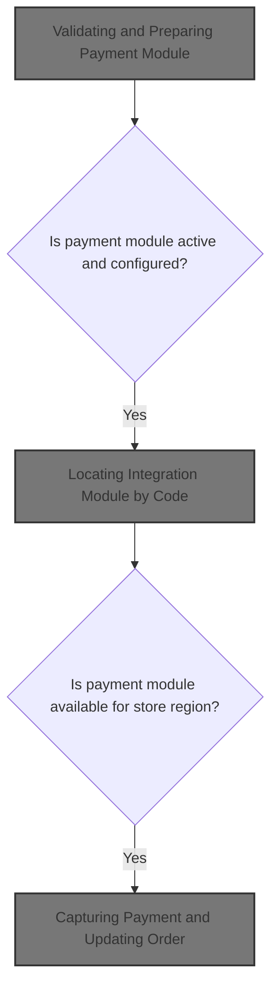
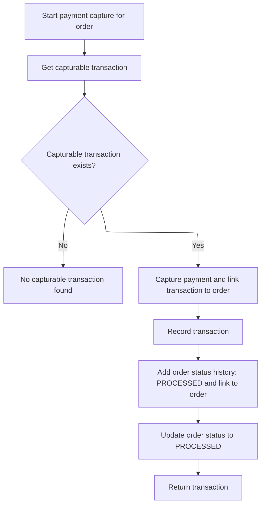

This document describes how the system captures payment for an order and updates its status. The flow ensures only active and properly configured payment modules are used, locates the correct integration, filters modules by region, loads configuration, and captures the payment. The flow receives an order, customer, and store as input, and produces a transaction record and an updated order status.



# Validating and Preparing Payment Module

<SwmSnippet path="/shopizer/sm-core/src/main/java/com/salesmanager/core/business/payments/service/PaymentServiceImpl.java" line="393">

---

We validate all inputs and make sure the payment module is configured and active before moving on to fetch its integration details.

```java
	public Transaction processCapturePayment(Order order, Customer customer,
			MerchantStore store)
			throws ServiceException {


		Validate.notNull(customer);
		Validate.notNull(store);
		Validate.notNull(order);

		

		//must have a shipping module configured
		Map<String, IntegrationConfiguration> modules = this.getPaymentModulesConfigured(store);
		if(modules==null){
			throw new ServiceException("No payment module configured");
		}
		
		IntegrationConfiguration configuration = modules.get(order.getPaymentModuleCode());
		
		if(configuration==null) {
			throw new ServiceException("Payment module " + order.getPaymentModuleCode() + " is not configured");
		}
		
		if(!configuration.isActive()) {
			throw new ServiceException("Payment module " + order.getPaymentModuleCode() + " is not active");
		}
		
		
		PaymentModule module = this.paymentModules.get(order.getPaymentModuleCode());
		
		if(module==null) {
			throw new ServiceException("Payment module " + order.getPaymentModuleCode() + " does not exist");
		}
		

		IntegrationModule integrationModule = getPaymentMethodByCode(store,order.getPaymentModuleCode());
		
```

---

</SwmSnippet>

## Locating Integration Module by Code

<SwmSnippet path="/shopizer/sm-core/src/main/java/com/salesmanager/core/business/payments/service/PaymentServiceImpl.java" line="147">

---

<SwmToken path="shopizer/sm-core/src/main/java/com/salesmanager/core/business/payments/service/PaymentServiceImpl.java" pos="147:5:5" line-data="	public IntegrationModule getPaymentMethodByCode(MerchantStore store,">`getPaymentMethodByCode`</SwmToken> grabs all payment methods for the store and scans for the one matching the given code. We need to call <SwmToken path="shopizer/sm-core/src/main/java/com/salesmanager/core/business/payments/service/PaymentServiceImpl.java" pos="149:10:10" line-data="		List&lt;IntegrationModule&gt; modules =  getPaymentMethods(store);">`getPaymentMethods`</SwmToken> first to get the full list to search through.

```java
	public IntegrationModule getPaymentMethodByCode(MerchantStore store,
			String code) throws ServiceException {
		List<IntegrationModule> modules =  getPaymentMethods(store);

		for(IntegrationModule module : modules) {
			if(module.getCode().equals(code)) {
				
				return module;
			}
		}
		
		return null;
	}
```

---

</SwmSnippet>

## Filtering Payment Modules by Store Region

<SwmSnippet path="/shopizer/sm-core/src/main/java/com/salesmanager/core/business/payments/service/PaymentServiceImpl.java" line="75">

---

In <SwmToken path="shopizer/sm-core/src/main/java/com/salesmanager/core/business/payments/service/PaymentServiceImpl.java" pos="75:8:8" line-data="	public List&lt;IntegrationModule&gt; getPaymentMethods(MerchantStore store) throws ServiceException {">`getPaymentMethods`</SwmToken>, we pull all payment modules from the module configuration service. Next, we need to call into that service to get the raw list before we can filter by region.

```java
	public List<IntegrationModule> getPaymentMethods(MerchantStore store) throws ServiceException {
		
		List<IntegrationModule> modules =  moduleConfigurationService.getIntegrationModules(PAYMENT_MODULES);
```

---

</SwmSnippet>

### Loading and Parsing Payment Module Configurations

```mermaid
%%{init: {"flowchart": {"defaultRenderer": "elk"}} }%%
flowchart TD
    node1["Check cache for integration modules"] --> node2{"Modules found in cache?"}
    click node1 openCode "shopizer/sm-core/src/main/java/com/salesmanager/core/business/system/service/ModuleConfigurationServiceImpl.java:57:58"
    node2 -->|"Yes"| node3["Return cached modules"]
    click node2 openCode "shopizer/sm-core/src/main/java/com/salesmanager/core/business/system/service/ModuleConfigurationServiceImpl.java:58:58"
    click node3 openCode "shopizer/sm-core/src/main/java/com/salesmanager/core/business/system/service/ModuleConfigurationServiceImpl.java:133:134"
    node2 -->|"No"| node4["Retrieve modules from database"]
    click node4 openCode "shopizer/sm-core/src/main/java/com/salesmanager/core/business/system/service/ModuleConfigurationServiceImpl.java:59:59"
    node4 --> node5["Process modules"]
    click node5 openCode "shopizer/sm-core/src/main/java/com/salesmanager/core/business/system/service/ModuleConfigurationServiceImpl.java:61:126"
    
    subgraph loop1["For each module"]
        node5 --> node6{"Has regions?"}
        click node6 openCode "shopizer/sm-core/src/main/java/com/salesmanager/core/business/system/service/ModuleConfigurationServiceImpl.java:63:71"
        node6 -->|"Yes"| node7["Parse regions and add to module"]
        click node7 openCode "shopizer/sm-core/src/main/java/com/salesmanager/core/business/system/service/ModuleConfigurationServiceImpl.java:65:70"
        node6 -->|"No"| node8{"Has details?"}
        node7 --> node8
        click node8 openCode "shopizer/sm-core/src/main/java/com/salesmanager/core/business/system/service/ModuleConfigurationServiceImpl.java:74:83"
        node8 -->|"Yes"| node9["Parse details and add to module"]
        click node9 openCode "shopizer/sm-core/src/main/java/com/salesmanager/core/business/system/service/ModuleConfigurationServiceImpl.java:79:80"
        node8 -->|"No"| node10{"Has configuration?"}
        node9 --> node10
        click node10 openCode "shopizer/sm-core/src/main/java/com/salesmanager/core/business/system/service/ModuleConfigurationServiceImpl.java:86:123"
        node10 -->|"Yes"| node11["Parse configuration list"]
        click node11 openCode "shopizer/sm-core/src/main/java/com/salesmanager/core/business/system/service/ModuleConfigurationServiceImpl.java:91:93"
        node10 -->|"No"| node14
        node11 --> node12["Build configuration map"]
        click node12 openCode "shopizer/sm-core/src/main/java/com/salesmanager/core/business/system/service/ModuleConfigurationServiceImpl.java:94:120"
        subgraph loop2["For each configuration entry"]
            node12 --> node13["Map fields to configuration object"]
            click node13 openCode "shopizer/sm-core/src/main/java/com/salesmanager/core/business/system/service/ModuleConfigurationServiceImpl.java:99:114"
            node13 --> node12
        end
        node12 --> node14["Add configuration map to module"]
        click node14 openCode "shopizer/sm-core/src/main/java/com/salesmanager/core/business/system/service/ModuleConfigurationServiceImpl.java:120:121"
    end
    node14 --> node15["Store processed modules in cache"]
    click node15 openCode "shopizer/sm-core/src/main/java/com/salesmanager/core/business/system/service/ModuleConfigurationServiceImpl.java:127:127"
    node15 --> node16["Return processed modules"]
    click node16 openCode "shopizer/sm-core/src/main/java/com/salesmanager/core/business/system/service/ModuleConfigurationServiceImpl.java:133:134"

classDef HeadingStyle fill:#777777,stroke:#333,stroke-width:2px;

%% Swimm:
%% %%{init: {"flowchart": {"defaultRenderer": "elk"}} }%%
%% flowchart TD
%%     node1["Check cache for integration modules"] --> node2{"Modules found in cache?"}
%%     click node1 openCode "<SwmPath>[shopizer/…/service/ModuleConfigurationServiceImpl.java](shopizer/sm-core/src/main/java/com/salesmanager/core/business/system/service/ModuleConfigurationServiceImpl.java)</SwmPath>:57:58"
%%     node2 -->|"Yes"| node3["Return cached modules"]
%%     click node2 openCode "<SwmPath>[shopizer/…/service/ModuleConfigurationServiceImpl.java](shopizer/sm-core/src/main/java/com/salesmanager/core/business/system/service/ModuleConfigurationServiceImpl.java)</SwmPath>:58:58"
%%     click node3 openCode "<SwmPath>[shopizer/…/service/ModuleConfigurationServiceImpl.java](shopizer/sm-core/src/main/java/com/salesmanager/core/business/system/service/ModuleConfigurationServiceImpl.java)</SwmPath>:133:134"
%%     node2 -->|"No"| node4["Retrieve modules from database"]
%%     click node4 openCode "<SwmPath>[shopizer/…/service/ModuleConfigurationServiceImpl.java](shopizer/sm-core/src/main/java/com/salesmanager/core/business/system/service/ModuleConfigurationServiceImpl.java)</SwmPath>:59:59"
%%     node4 --> node5["Process modules"]
%%     click node5 openCode "<SwmPath>[shopizer/…/service/ModuleConfigurationServiceImpl.java](shopizer/sm-core/src/main/java/com/salesmanager/core/business/system/service/ModuleConfigurationServiceImpl.java)</SwmPath>:61:126"
%%     
%%     subgraph loop1["For each module"]
%%         node5 --> node6{"Has regions?"}
%%         click node6 openCode "<SwmPath>[shopizer/…/service/ModuleConfigurationServiceImpl.java](shopizer/sm-core/src/main/java/com/salesmanager/core/business/system/service/ModuleConfigurationServiceImpl.java)</SwmPath>:63:71"
%%         node6 -->|"Yes"| node7["Parse regions and add to module"]
%%         click node7 openCode "<SwmPath>[shopizer/…/service/ModuleConfigurationServiceImpl.java](shopizer/sm-core/src/main/java/com/salesmanager/core/business/system/service/ModuleConfigurationServiceImpl.java)</SwmPath>:65:70"
%%         node6 -->|"No"| node8{"Has details?"}
%%         node7 --> node8
%%         click node8 openCode "<SwmPath>[shopizer/…/service/ModuleConfigurationServiceImpl.java](shopizer/sm-core/src/main/java/com/salesmanager/core/business/system/service/ModuleConfigurationServiceImpl.java)</SwmPath>:74:83"
%%         node8 -->|"Yes"| node9["Parse details and add to module"]
%%         click node9 openCode "<SwmPath>[shopizer/…/service/ModuleConfigurationServiceImpl.java](shopizer/sm-core/src/main/java/com/salesmanager/core/business/system/service/ModuleConfigurationServiceImpl.java)</SwmPath>:79:80"
%%         node8 -->|"No"| node10{"Has configuration?"}
%%         node9 --> node10
%%         click node10 openCode "<SwmPath>[shopizer/…/service/ModuleConfigurationServiceImpl.java](shopizer/sm-core/src/main/java/com/salesmanager/core/business/system/service/ModuleConfigurationServiceImpl.java)</SwmPath>:86:123"
%%         node10 -->|"Yes"| node11["Parse configuration list"]
%%         click node11 openCode "<SwmPath>[shopizer/…/service/ModuleConfigurationServiceImpl.java](shopizer/sm-core/src/main/java/com/salesmanager/core/business/system/service/ModuleConfigurationServiceImpl.java)</SwmPath>:91:93"
%%         node10 -->|"No"| node14
%%         node11 --> node12["Build configuration map"]
%%         click node12 openCode "<SwmPath>[shopizer/…/service/ModuleConfigurationServiceImpl.java](shopizer/sm-core/src/main/java/com/salesmanager/core/business/system/service/ModuleConfigurationServiceImpl.java)</SwmPath>:94:120"
%%         subgraph loop2["For each configuration entry"]
%%             node12 --> node13["Map fields to configuration object"]
%%             click node13 openCode "<SwmPath>[shopizer/…/service/ModuleConfigurationServiceImpl.java](shopizer/sm-core/src/main/java/com/salesmanager/core/business/system/service/ModuleConfigurationServiceImpl.java)</SwmPath>:99:114"
%%             node13 --> node12
%%         end
%%         node12 --> node14["Add configuration map to module"]
%%         click node14 openCode "<SwmPath>[shopizer/…/service/ModuleConfigurationServiceImpl.java](shopizer/sm-core/src/main/java/com/salesmanager/core/business/system/service/ModuleConfigurationServiceImpl.java)</SwmPath>:120:121"
%%     end
%%     node14 --> node15["Store processed modules in cache"]
%%     click node15 openCode "<SwmPath>[shopizer/…/service/ModuleConfigurationServiceImpl.java](shopizer/sm-core/src/main/java/com/salesmanager/core/business/system/service/ModuleConfigurationServiceImpl.java)</SwmPath>:127:127"
%%     node15 --> node16["Return processed modules"]
%%     click node16 openCode "<SwmPath>[shopizer/…/service/ModuleConfigurationServiceImpl.java](shopizer/sm-core/src/main/java/com/salesmanager/core/business/system/service/ModuleConfigurationServiceImpl.java)</SwmPath>:133:134"
%% 
%% classDef HeadingStyle fill:#777777,stroke:#333,stroke-width:2px;
```



<SwmSnippet path="/shopizer/sm-core/src/main/java/com/salesmanager/core/business/system/service/ModuleConfigurationServiceImpl.java" line="50">

---

In <SwmToken path="shopizer/sm-core/src/main/java/com/salesmanager/core/business/system/service/ModuleConfigurationServiceImpl.java" pos="50:8:8" line-data="	public List&lt;IntegrationModule&gt; getIntegrationModules(String module) {">`getIntegrationModules`</SwmToken>, we first try to load the payment module configs from cache using a specific key. If not cached, we fetch from the database and parse JSON fields for regions, config details, and environment-specific configs into Java objects and collections.

```java
	public List<IntegrationModule> getIntegrationModules(String module) {
		
		
		List<IntegrationModule> modules = null;
		try {
			
			//CacheUtils cacheUtils = CacheUtils.getInstance();
			modules = (List<IntegrationModule>) cache.getFromCache("INTEGRATION_M)" + module);
			if(modules==null) {
				modules = integrationModuleDao.getModulesConfiguration(module);
				//set json objects
				for(IntegrationModule mod : modules) {
					
					String regions = mod.getRegions();
					if(regions!=null) {
						Object objRegions=JSONValue.parse(regions); 
						JSONArray arrayRegions=(JSONArray)objRegions;
						Iterator i = arrayRegions.iterator();
						while(i.hasNext()) {
							mod.getRegionsSet().add((String)i.next());
						}
					}
					
					
					String details = mod.getConfigDetails();
					if(details!=null) {
						
						//Map objects = mapper.readValue(config, Map.class);

						Map<String,String> objDetails= (Map<String, String>) JSONValue.parse(details); 
						mod.setDetails(objDetails);

						
					}
					
					
					String configs = mod.getConfiguration();
					if(configs!=null) {
						
						//Map objects = mapper.readValue(config, Map.class);

						Object objConfigs=JSONValue.parse(configs); 
						JSONArray arrayConfigs=(JSONArray)objConfigs;
						
						Map<String,ModuleConfig> moduleConfigs = new HashMap<String,ModuleConfig>();
						
						Iterator i = arrayConfigs.iterator();
						while(i.hasNext()) {
							
							Map values = (Map)i.next();
							String env = (String)values.get("env");
		            		ModuleConfig config = new ModuleConfig();
		            		config.setScheme((String)values.get("scheme"));
		            		config.setHost((String)values.get("host"));
		            		config.setPort((String)values.get("port"));
		            		config.setUri((String)values.get("uri"));
		            		config.setEnv((String)values.get("env"));
		            		if((String)values.get("config1")!=null) {
		            			config.setConfig1((String)values.get("config1"));
		            		}
		            		if((String)values.get("config2")!=null) {
		            			config.setConfig1((String)values.get("config2"));
		            		}
		            		
		            		moduleConfigs.put(env, config);
		            		
		            		
							
						}
						
						mod.setModuleConfigs(moduleConfigs);
						

					}


				}
```

---

</SwmSnippet>

<SwmSnippet path="/shopizer/sm-core/src/main/java/com/salesmanager/core/business/system/service/ModuleConfigurationServiceImpl.java" line="127">

---

We cache the parsed module list and return it.

```java
				cache.putInCache(modules, "INTEGRATION_M)" + module);
			}

		} catch (Exception e) {
			LOGGER.error("getIntegrationModules()", e);
		}
		return modules;
		
		
	}
```

---

</SwmSnippet>

### Filtering Modules by Country and Wildcard

<SwmSnippet path="/shopizer/sm-core/src/main/java/com/salesmanager/core/business/payments/service/PaymentServiceImpl.java" line="78">

---

We filter the modules list to only include those for the store's country or all regions.

```java
		List<IntegrationModule> returnModules = new ArrayList<IntegrationModule>();
		
		for(IntegrationModule module : modules) {
			if(module.getRegionsSet().contains(store.getCountry().getIsoCode())
					|| module.getRegionsSet().contains("*")) {
				
				returnModules.add(module);
			}
		}
```

---

</SwmSnippet>

## Capturing Payment and Updating Order



<SwmSnippet path="/shopizer/sm-core/src/main/java/com/salesmanager/core/business/payments/service/PaymentServiceImpl.java" line="430">

---

Back in <SwmToken path="shopizer/sm-core/src/main/java/com/salesmanager/core/business/payments/service/PaymentServiceImpl.java" pos="393:5:5" line-data="	public Transaction processCapturePayment(Order order, Customer customer,">`processCapturePayment`</SwmToken>, after getting the integration module, we fetch a capturable transaction for the order. If none exists, we throw an exception. Then we perform the capture, create the transaction record, update the order status to PROCESSED, add a status history entry, and save everything.

```java
		//TransactionType transactionType = payment.getTransactionType();

			//get the previous transaction
		Transaction trx = transactionService.getCapturableTransaction(order);
		if(trx==null) {
			throw new ServiceException("No capturable transaction for order id " + order.getId());
		}
		Transaction transaction = module.capture(store, customer, order, trx, configuration, integrationModule);
		transaction.setOrder(order);
		
		

		transactionService.create(transaction);
		
		
		OrderStatusHistory orderHistory = new OrderStatusHistory();
		orderHistory.setOrder(order);
		orderHistory.setStatus(OrderStatus.PROCESSED);
		orderHistory.setDateAdded(new Date());
		
		orderService.addOrderStatusHistory(order, orderHistory);
		
		order.setStatus(OrderStatus.PROCESSED);
		orderService.saveOrUpdate(order);

		return transaction;

		

	}
```

---

</SwmSnippet>

&nbsp;

*This is an auto-generated document by Swimm 🌊 and has not yet been verified by a human*

<SwmMeta version="3.0.0" repo-id="Z2l0aHViJTNBJTNBU2hvcGl6ZXIlM0ElM0F1bWFsaW5nYXN3YW1p" repo-name="Shopizer"><sup>Powered by [Swimm](https://app.swimm.io/)</sup></SwmMeta>
