This document describes the flow for handling payment actions during checkout. The system validates the user's order, calculates the total including shipping, and, if PayPal is chosen, initializes a transaction and provides a redirect URL tailored to the user's device and environment. The response informs the user whether payment can proceed or highlights any validation issues.

# Order Validation and Cart Preparation

<SwmSnippet path="/shopizer/sm-shop/src/main/java/com/salesmanager/web/shop/controller/order/ShoppingOrderPaymentController.java" line="124">

---

We grab the cart and its items, attach them to the order, and validate. If validation fails, we return errors right away.

```java
	public @ResponseBody String paymentAction(@Valid @ModelAttribute(value="order") ShopOrder order, @PathVariable String action, @PathVariable String paymentmethod, Device device, HttpServletRequest request, HttpServletResponse response, Locale locale) throws Exception {
		
		
		
		Language language = (Language)request.getAttribute("LANGUAGE");
		MerchantStore store = (MerchantStore)request.getAttribute(Constants.MERCHANT_STORE);
		String shoppingCartCode  = getSessionAttribute(Constants.SHOPPING_CART, request);
		
		Validate.notNull(shoppingCartCode,"shoppingCartCode does not exist in the session");
		AjaxResponse ajaxResponse = new AjaxResponse();

		try {
			
			com.salesmanager.core.business.shoppingcart.model.ShoppingCart cart = shoppingCartFacade.getShoppingCartModel(shoppingCartCode, store);
			
			Set<ShoppingCartItem> items = cart.getLineItems();
			List<ShoppingCartItem> cartItems = new ArrayList<ShoppingCartItem>(items);
			order.setShoppingCartItems(cartItems);
			
			//validate order first
			Map<String,String> messages = new TreeMap<String,String>();
			orderFacade.validateOrder(order, new BeanPropertyBindingResult(order,"order"), messages, store, locale);
			
			if(CollectionUtils.isNotEmpty(messages.values())) {
				for(String key : messages.keySet()) {
					String value = messages.get(key);
					ajaxResponse.addValidationMessage(key, value);
				}
```

---

</SwmSnippet>

<SwmSnippet path="/shopizer/sm-shop/src/main/java/com/salesmanager/web/shop/controller/order/ShoppingOrderPaymentController.java" line="152">

---

If the order total isn't cached, we calculate it and store it for later use.

```java
				ajaxResponse.setStatus(AjaxResponse.RESPONSE_STATUS_VALIDATION_FAILED);
				return ajaxResponse.toJSONString();
			}
			
			
			IntegrationConfiguration config = paymentService.getPaymentConfiguration(order.getPaymentModule(), store);
			IntegrationModule integrationModule = paymentService.getPaymentMethodByCode(store, order.getPaymentModule());

			
			//OrderTotalSummary orderTotalSummary = orderFacade.calculateOrderTotal(store, order, language);
			OrderTotalSummary orderTotalSummary = super.getSessionAttribute(Constants.ORDER_SUMMARY, request);
			if(orderTotalSummary==null) {
				orderTotalSummary = orderFacade.calculateOrderTotal(store, order, language);
				super.setSessionAttribute(Constants.ORDER_SUMMARY, orderTotalSummary, request);
			}
			
```

---

</SwmSnippet>

## Order Total Calculation Logic

```mermaid
%%{init: {"flowchart": {"defaultRenderer": "elk"}} }%%
flowchart TD
    node1["Get customer for order"]
    click node1 openCode "shopizer/sm-shop/src/main/java/com/salesmanager/web/shop/controller/order/facade/OrderFacadeImpl.java:159:159"
    node1 --> node2["Calculate order total with customer"]
    click node2 openCode "shopizer/sm-shop/src/main/java/com/salesmanager/web/shop/controller/order/facade/OrderFacadeImpl.java:160:160"
    node2 --> node3{"Is order a ShopOrder?"}
    click node3 openCode "shopizer/sm-shop/src/main/java/com/salesmanager/web/shop/controller/order/facade/OrderFacadeImpl.java:197:205"
    node3 -->|ShopOrder| node4["Prepare order summary with products"]
    click node4 openCode "shopizer/sm-shop/src/main/java/com/salesmanager/web/shop/controller/order/facade/OrderFacadeImpl.java:199:199"
    node4 --> node5{"Does order have shipping summary?"}
    click node5 openCode "shopizer/sm-shop/src/main/java/com/salesmanager/web/shop/controller/order/facade/OrderFacadeImpl.java:201:203"
    node5 -->|"Has shipping"| node6["Include shipping summary"]
    click node6 openCode "shopizer/sm-shop/src/main/java/com/salesmanager/web/shop/controller/order/facade/OrderFacadeImpl.java:202:203"
    node6 --> node7["Calculate order total"]
    click node7 openCode "shopizer/sm-shop/src/main/java/com/salesmanager/web/shop/controller/order/facade/OrderFacadeImpl.java:204:204"
    node5 -->|"No shipping"| node7
    node7 --> node8["Finalize order total summary"]
    click node8 openCode "shopizer/sm-shop/src/main/java/com/salesmanager/web/shop/controller/order/facade/OrderFacadeImpl.java:161:161"
    node8 --> node9["Return order total summary"]
    click node9 openCode "shopizer/sm-shop/src/main/java/com/salesmanager/web/shop/controller/order/facade/OrderFacadeImpl.java:162:162"
    node3 -->|"Other"| node10["Throw not implemented exception"]
    click node10 openCode "shopizer/sm-shop/src/main/java/com/salesmanager/web/shop/controller/order/facade/OrderFacadeImpl.java:208:209"
classDef HeadingStyle fill:#777777,stroke:#333,stroke-width:2px;

%% Swimm:
%% %%{init: {"flowchart": {"defaultRenderer": "elk"}} }%%
%% flowchart TD
%%     node1["Get customer for order"]
%%     click node1 openCode "<SwmPath>[shopizer/…/facade/OrderFacadeImpl.java](shopizer/sm-shop/src/main/java/com/salesmanager/web/shop/controller/order/facade/OrderFacadeImpl.java)</SwmPath>:159:159"
%%     node1 --> node2["Calculate order total with customer"]
%%     click node2 openCode "<SwmPath>[shopizer/…/facade/OrderFacadeImpl.java](shopizer/sm-shop/src/main/java/com/salesmanager/web/shop/controller/order/facade/OrderFacadeImpl.java)</SwmPath>:160:160"
%%     node2 --> node3{"Is order a <SwmToken path="shopizer/sm-shop/src/main/java/com/salesmanager/web/shop/controller/order/ShoppingOrderPaymentController.java" pos="124:23:23" line-data="	public @ResponseBody String paymentAction(@Valid @ModelAttribute(value=&quot;order&quot;) ShopOrder order, @PathVariable String action, @PathVariable String paymentmethod, Device device, HttpServletRequest request, HttpServletResponse response, Locale locale) throws Exception {">`ShopOrder`</SwmToken>?"}
%%     click node3 openCode "<SwmPath>[shopizer/…/facade/OrderFacadeImpl.java](shopizer/sm-shop/src/main/java/com/salesmanager/web/shop/controller/order/facade/OrderFacadeImpl.java)</SwmPath>:197:205"
%%     node3 -->|<SwmToken path="shopizer/sm-shop/src/main/java/com/salesmanager/web/shop/controller/order/ShoppingOrderPaymentController.java" pos="124:23:23" line-data="	public @ResponseBody String paymentAction(@Valid @ModelAttribute(value=&quot;order&quot;) ShopOrder order, @PathVariable String action, @PathVariable String paymentmethod, Device device, HttpServletRequest request, HttpServletResponse response, Locale locale) throws Exception {">`ShopOrder`</SwmToken>| node4["Prepare order summary with products"]
%%     click node4 openCode "<SwmPath>[shopizer/…/facade/OrderFacadeImpl.java](shopizer/sm-shop/src/main/java/com/salesmanager/web/shop/controller/order/facade/OrderFacadeImpl.java)</SwmPath>:199:199"
%%     node4 --> node5{"Does order have shipping summary?"}
%%     click node5 openCode "<SwmPath>[shopizer/…/facade/OrderFacadeImpl.java](shopizer/sm-shop/src/main/java/com/salesmanager/web/shop/controller/order/facade/OrderFacadeImpl.java)</SwmPath>:201:203"
%%     node5 -->|"Has shipping"| node6["Include shipping summary"]
%%     click node6 openCode "<SwmPath>[shopizer/…/facade/OrderFacadeImpl.java](shopizer/sm-shop/src/main/java/com/salesmanager/web/shop/controller/order/facade/OrderFacadeImpl.java)</SwmPath>:202:203"
%%     node6 --> node7["Calculate order total"]
%%     click node7 openCode "<SwmPath>[shopizer/…/facade/OrderFacadeImpl.java](shopizer/sm-shop/src/main/java/com/salesmanager/web/shop/controller/order/facade/OrderFacadeImpl.java)</SwmPath>:204:204"
%%     node5 -->|"No shipping"| node7
%%     node7 --> node8["Finalize order total summary"]
%%     click node8 openCode "<SwmPath>[shopizer/…/facade/OrderFacadeImpl.java](shopizer/sm-shop/src/main/java/com/salesmanager/web/shop/controller/order/facade/OrderFacadeImpl.java)</SwmPath>:161:161"
%%     node8 --> node9["Return order total summary"]
%%     click node9 openCode "<SwmPath>[shopizer/…/facade/OrderFacadeImpl.java](shopizer/sm-shop/src/main/java/com/salesmanager/web/shop/controller/order/facade/OrderFacadeImpl.java)</SwmPath>:162:162"
%%     node3 -->|"Other"| node10["Throw not implemented exception"]
%%     click node10 openCode "<SwmPath>[shopizer/…/facade/OrderFacadeImpl.java](shopizer/sm-shop/src/main/java/com/salesmanager/web/shop/controller/order/facade/OrderFacadeImpl.java)</SwmPath>:208:209"
%% classDef HeadingStyle fill:#777777,stroke:#333,stroke-width:2px;
```



<SwmSnippet path="/shopizer/sm-shop/src/main/java/com/salesmanager/web/shop/controller/order/facade/OrderFacadeImpl.java" line="155">

---

We get the customer model and pass everything to the next calculation step.

```java
	public OrderTotalSummary calculateOrderTotal(MerchantStore store,
			ShopOrder order, Language language) throws Exception {
		

		Customer customer = customerFacade.getCustomerModel(order.getCustomer(), store, language);
		OrderTotalSummary summary = this.calculateOrderTotal(store, customer, order, language);
```

---

</SwmSnippet>

<SwmSnippet path="/shopizer/sm-shop/src/main/java/com/salesmanager/web/shop/controller/order/facade/OrderFacadeImpl.java" line="190">

---

<SwmToken path="shopizer/sm-shop/src/main/java/com/salesmanager/web/shop/controller/order/facade/OrderFacadeImpl.java" pos="190:5:5" line-data="	private OrderTotalSummary calculateOrderTotal(MerchantStore store, Customer customer, PersistableOrder order, Language language) throws Exception {">`calculateOrderTotal`</SwmToken> checks if the order is a <SwmToken path="shopizer/sm-shop/src/main/java/com/salesmanager/web/shop/controller/order/facade/OrderFacadeImpl.java" pos="197:7:7" line-data="		if(order instanceof ShopOrder) {">`ShopOrder`</SwmToken>. If so, it pulls out the cart items and shipping summary, builds an <SwmToken path="shopizer/sm-shop/src/main/java/com/salesmanager/web/shop/controller/order/facade/OrderFacadeImpl.java" pos="194:1:1" line-data="		OrderSummary summary = new OrderSummary();">`OrderSummary`</SwmToken>, and hands it off to <SwmToken path="shopizer/sm-shop/src/main/java/com/salesmanager/web/shop/controller/order/facade/OrderFacadeImpl.java" pos="204:5:5" line-data="			orderTotalSummary = orderService.caculateOrderTotal(summary, customer, store, language);">`orderService`</SwmToken> for the actual calculation. If the order isn't a <SwmToken path="shopizer/sm-shop/src/main/java/com/salesmanager/web/shop/controller/order/facade/OrderFacadeImpl.java" pos="197:7:7" line-data="		if(order instanceof ShopOrder) {">`ShopOrder`</SwmToken>, it just throws—no support for other types yet.

```java
	private OrderTotalSummary calculateOrderTotal(MerchantStore store, Customer customer, PersistableOrder order, Language language) throws Exception {
		
		OrderTotalSummary orderTotalSummary = null;
		
		OrderSummary summary = new OrderSummary();
		
		
		if(order instanceof ShopOrder) {
			ShopOrder o = (ShopOrder)order;
			summary.setProducts(o.getShoppingCartItems());
			
			if(o.getShippingSummary()!=null) {
				summary.setShippingSummary(o.getShippingSummary());
			}
			orderTotalSummary = orderService.caculateOrderTotal(summary, customer, store, language);
		} else {
			//need Set of ShoppingCartItem
			//PersistableOrder not implemented
			throw new Exception("calculateOrderTotal not yet implemented for PersistableOrder");
		}

		return orderTotalSummary;
		
	}
```

---

</SwmSnippet>

<SwmSnippet path="/shopizer/sm-shop/src/main/java/com/salesmanager/web/shop/controller/order/facade/OrderFacadeImpl.java" line="161">

---

Back in `OrderFacadeImpl.calculateOrderTotal`, after getting the summary, we update the order with the calculated totals before returning the summary. This keeps the order in sync for whatever comes next.

```java
		this.setOrderTotals(order, summary);
		return summary;
	}
```

---

</SwmSnippet>

## PayPal Payment Initialization

```mermaid
%%{init: {"flowchart": {"defaultRenderer": "elk"}} }%%
flowchart TD
  node1["Start payment action"] --> node2{"Shipping summary exists?"}
  click node1 openCode "shopizer/sm-shop/src/main/java/com/salesmanager/web/shop/controller/order/ShoppingOrderPaymentController.java:168:169"
  node2 -->|"Yes"| node3["Attach shipping summary to order"]
  click node2 openCode "shopizer/sm-shop/src/main/java/com/salesmanager/web/shop/controller/order/ShoppingOrderPaymentController.java:170:172"
  node2 -->|"No"| node4{"Is action INIT_ACTION?"}
  node3 --> node4
  click node3 openCode "shopizer/sm-shop/src/main/java/com/salesmanager/web/shop/controller/order/ShoppingOrderPaymentController.java:171:172"
  node4 -->|"Yes"| node5{"Payment method is PayPal?"}
  click node4 openCode "shopizer/sm-shop/src/main/java/com/salesmanager/web/shop/controller/order/ShoppingOrderPaymentController.java:176:177"
  node4 -->|"No"| node12["Return Ajax response"]
  click node12 openCode "shopizer/sm-shop/src/main/java/com/salesmanager/web/shop/controller/order/ShoppingOrderPaymentController.java:242:243"
  node5 -->|"Yes"| node6["Initialize PayPal transaction"]
  click node5 openCode "shopizer/sm-shop/src/main/java/com/salesmanager/web/shop/controller/order/ShoppingOrderPaymentController.java:177:186"
  node5 -->|"No"| node12
  node6 --> node7{"Device type?"}
  click node6 openCode "shopizer/sm-shop/src/main/java/com/salesmanager/web/shop/controller/order/ShoppingOrderPaymentController.java:186:211"
  node7 -->|"Desktop/Tablet"| node8["Build regular PayPal URL"]
  click node7 openCode "shopizer/sm-shop/src/main/java/com/salesmanager/web/shop/controller/order/ShoppingOrderPaymentController.java:197:203"
  node7 -->|"Mobile"| node9["Build mobile PayPal URL"]
  click node9 openCode "shopizer/sm-shop/src/main/java/com/salesmanager/web/shop/controller/order/ShoppingOrderPaymentController.java:204:206"
  node8 --> node10{"Environment?"}
  node9 --> node10
  click node8 openCode "shopizer/sm-shop/src/main/java/com/salesmanager/web/shop/controller/order/ShoppingOrderPaymentController.java:199:203"
  node10 -->|"Production"| node11["Return Ajax response with production URL"]
  click node10 openCode "shopizer/sm-shop/src/main/java/com/salesmanager/web/shop/controller/order/ShoppingOrderPaymentController.java:215:217"
  node10 -->|"Sandbox"| node13["Return Ajax response with sandbox URL"]
  click node13 openCode "shopizer/sm-shop/src/main/java/com/salesmanager/web/shop/controller/order/ShoppingOrderPaymentController.java:218:220"
  node11 --> node14["Set order in session"]
  click node11 openCode "shopizer/sm-shop/src/main/java/com/salesmanager/web/shop/controller/order/ShoppingOrderPaymentController.java:224:225"
  node14 --> node15["Return Ajax response"]
  click node14 openCode "shopizer/sm-shop/src/main/java/com/salesmanager/web/shop/controller/order/ShoppingOrderPaymentController.java:225:226"
  node13 --> node15
  click node15 openCode "shopizer/sm-shop/src/main/java/com/salesmanager/web/shop/controller/order/ShoppingOrderPaymentController.java:242:243"
  node6 --> node16{"Did payment initialization fail?"}
  click node16 openCode "shopizer/sm-shop/src/main/java/com/salesmanager/web/shop/controller/order/ShoppingOrderPaymentController.java:227:229"
  node16 -->|"Yes"| node17["Set Ajax response to failure"]
  click node17 openCode "shopizer/sm-shop/src/main/java/com/salesmanager/web/shop/controller/order/ShoppingOrderPaymentController.java:227:229"
  node17 --> node15
classDef HeadingStyle fill:#777777,stroke:#333,stroke-width:2px;

%% Swimm:
%% %%{init: {"flowchart": {"defaultRenderer": "elk"}} }%%
%% flowchart TD
%%   node1["Start payment action"] --> node2{"Shipping summary exists?"}
%%   click node1 openCode "<SwmPath>[shopizer/…/order/ShoppingOrderPaymentController.java](shopizer/sm-shop/src/main/java/com/salesmanager/web/shop/controller/order/ShoppingOrderPaymentController.java)</SwmPath>:168:169"
%%   node2 -->|"Yes"| node3["Attach shipping summary to order"]
%%   click node2 openCode "<SwmPath>[shopizer/…/order/ShoppingOrderPaymentController.java](shopizer/sm-shop/src/main/java/com/salesmanager/web/shop/controller/order/ShoppingOrderPaymentController.java)</SwmPath>:170:172"
%%   node2 -->|"No"| node4{"Is action <SwmToken path="shopizer/sm-shop/src/main/java/com/salesmanager/web/shop/controller/order/ShoppingOrderPaymentController.java" pos="176:7:7" line-data="			if(action.equals(INIT_ACTION)) {">`INIT_ACTION`</SwmToken>?"}
%%   node3 --> node4
%%   click node3 openCode "<SwmPath>[shopizer/…/order/ShoppingOrderPaymentController.java](shopizer/sm-shop/src/main/java/com/salesmanager/web/shop/controller/order/ShoppingOrderPaymentController.java)</SwmPath>:171:172"
%%   node4 -->|"Yes"| node5{"Payment method is PayPal?"}
%%   click node4 openCode "<SwmPath>[shopizer/…/order/ShoppingOrderPaymentController.java](shopizer/sm-shop/src/main/java/com/salesmanager/web/shop/controller/order/ShoppingOrderPaymentController.java)</SwmPath>:176:177"
%%   node4 -->|"No"| node12["Return Ajax response"]
%%   click node12 openCode "<SwmPath>[shopizer/…/order/ShoppingOrderPaymentController.java](shopizer/sm-shop/src/main/java/com/salesmanager/web/shop/controller/order/ShoppingOrderPaymentController.java)</SwmPath>:242:243"
%%   node5 -->|"Yes"| node6["Initialize PayPal transaction"]
%%   click node5 openCode "<SwmPath>[shopizer/…/order/ShoppingOrderPaymentController.java](shopizer/sm-shop/src/main/java/com/salesmanager/web/shop/controller/order/ShoppingOrderPaymentController.java)</SwmPath>:177:186"
%%   node5 -->|"No"| node12
%%   node6 --> node7{"Device type?"}
%%   click node6 openCode "<SwmPath>[shopizer/…/order/ShoppingOrderPaymentController.java](shopizer/sm-shop/src/main/java/com/salesmanager/web/shop/controller/order/ShoppingOrderPaymentController.java)</SwmPath>:186:211"
%%   node7 -->|"Desktop/Tablet"| node8["Build regular PayPal URL"]
%%   click node7 openCode "<SwmPath>[shopizer/…/order/ShoppingOrderPaymentController.java](shopizer/sm-shop/src/main/java/com/salesmanager/web/shop/controller/order/ShoppingOrderPaymentController.java)</SwmPath>:197:203"
%%   node7 -->|"Mobile"| node9["Build mobile PayPal URL"]
%%   click node9 openCode "<SwmPath>[shopizer/…/order/ShoppingOrderPaymentController.java](shopizer/sm-shop/src/main/java/com/salesmanager/web/shop/controller/order/ShoppingOrderPaymentController.java)</SwmPath>:204:206"
%%   node8 --> node10{"Environment?"}
%%   node9 --> node10
%%   click node8 openCode "<SwmPath>[shopizer/…/order/ShoppingOrderPaymentController.java](shopizer/sm-shop/src/main/java/com/salesmanager/web/shop/controller/order/ShoppingOrderPaymentController.java)</SwmPath>:199:203"
%%   node10 -->|"Production"| node11["Return Ajax response with production URL"]
%%   click node10 openCode "<SwmPath>[shopizer/…/order/ShoppingOrderPaymentController.java](shopizer/sm-shop/src/main/java/com/salesmanager/web/shop/controller/order/ShoppingOrderPaymentController.java)</SwmPath>:215:217"
%%   node10 -->|"Sandbox"| node13["Return Ajax response with sandbox URL"]
%%   click node13 openCode "<SwmPath>[shopizer/…/order/ShoppingOrderPaymentController.java](shopizer/sm-shop/src/main/java/com/salesmanager/web/shop/controller/order/ShoppingOrderPaymentController.java)</SwmPath>:218:220"
%%   node11 --> node14["Set order in session"]
%%   click node11 openCode "<SwmPath>[shopizer/…/order/ShoppingOrderPaymentController.java](shopizer/sm-shop/src/main/java/com/salesmanager/web/shop/controller/order/ShoppingOrderPaymentController.java)</SwmPath>:224:225"
%%   node14 --> node15["Return Ajax response"]
%%   click node14 openCode "<SwmPath>[shopizer/…/order/ShoppingOrderPaymentController.java](shopizer/sm-shop/src/main/java/com/salesmanager/web/shop/controller/order/ShoppingOrderPaymentController.java)</SwmPath>:225:226"
%%   node13 --> node15
%%   click node15 openCode "<SwmPath>[shopizer/…/order/ShoppingOrderPaymentController.java](shopizer/sm-shop/src/main/java/com/salesmanager/web/shop/controller/order/ShoppingOrderPaymentController.java)</SwmPath>:242:243"
%%   node6 --> node16{"Did payment initialization fail?"}
%%   click node16 openCode "<SwmPath>[shopizer/…/order/ShoppingOrderPaymentController.java](shopizer/sm-shop/src/main/java/com/salesmanager/web/shop/controller/order/ShoppingOrderPaymentController.java)</SwmPath>:227:229"
%%   node16 -->|"Yes"| node17["Set Ajax response to failure"]
%%   click node17 openCode "<SwmPath>[shopizer/…/order/ShoppingOrderPaymentController.java](shopizer/sm-shop/src/main/java/com/salesmanager/web/shop/controller/order/ShoppingOrderPaymentController.java)</SwmPath>:227:229"
%%   node17 --> node15
%% classDef HeadingStyle fill:#777777,stroke:#333,stroke-width:2px;
```



<SwmSnippet path="/shopizer/sm-shop/src/main/java/com/salesmanager/web/shop/controller/order/ShoppingOrderPaymentController.java" line="168">

---

Back in `ShoppingOrderPaymentController.paymentAction`, after getting the order total, if we're starting a PayPal payment, we set up the PayPal transaction, store it, and build the right redirect URL based on device and environment. The client gets this URL to send the user to PayPal. If anything fails, we set an error status in the response.

```java
			ShippingSummary summary = (ShippingSummary)request.getSession().getAttribute("SHIPPING_SUMMARY");

			if(summary!=null) {
				order.setShippingSummary(summary);
			}


			
			if(action.equals(INIT_ACTION)) {
				if(paymentmethod.equals("PAYPAL")) {
					try {
						

					
						PaymentModule module = paymentService.getPaymentModule("paypal-express-checkout");
						PayPalExpressCheckoutPayment p = (PayPalExpressCheckoutPayment)module;
						PaypalPayment payment = new PaypalPayment();
						payment.setCurrency(store.getCurrency());
						Transaction transaction = p.initPaypalTransaction(store, cartItems, orderTotalSummary, payment, config, integrationModule);
						transactionService.create(transaction);
						
						super.setSessionAttribute(Constants.INIT_TRANSACTION_KEY, transaction, request);
						
						//https://www.paypal.com/cgi-bin/webscr?cmd=_express-checkout-mobile&token=tokenValueReturnedFromSetExpressCheckoutCall
						//For Desktop use
						//https://www.paypal.com/cgi-bin/webscr?cmd=_express-checkout&token=tokenValueReturnedFromSetExpressCheckoutCall
						
						StringBuilder urlAppender = new StringBuilder();
						
						if(device!=null) {
							if(device.isNormal()) {
								urlAppender.append(coreConfiguration.getProperty("PAYPAL_EXPRESSCHECKOUT_REGULAR"));
							}
							if(device.isTablet()) {
								urlAppender.append(coreConfiguration.getProperty("PAYPAL_EXPRESSCHECKOUT_REGULAR"));
							}
							if(device.isMobile()) {
								urlAppender.append(coreConfiguration.getProperty("PAYPAL_EXPRESSCHECKOUT_MOBILE"));
							}
						} else {
							urlAppender.append(coreConfiguration.getProperty("PAYPAL_EXPRESSCHECKOUT_REGULAR"));
						}
						
						urlAppender.append(transaction.getTransactionDetails().get("TOKEN"));
						
						
						
						if(config.getEnvironment().equals(com.salesmanager.core.constants.Constants.PRODUCTION_ENVIRONMENT)) {
							StringBuilder url = new StringBuilder().append(coreConfiguration.getProperty("PAYPAL_EXPRESSCHECKOUT_PRODUCTION")).append(urlAppender.toString());
							ajaxResponse.addEntry("url", url.toString());
						} else {
							StringBuilder url = new StringBuilder().append(coreConfiguration.getProperty("PAYPAL_EXPRESSCHECKOUT_SANDBOX")).append(urlAppender.toString());
							ajaxResponse.addEntry("url", url.toString());
						}

						//keep order in session when user comes back from pp
						super.setSessionAttribute(Constants.ORDER, order, request);
						ajaxResponse.setStatus(AjaxResponse.RESPONSE_OPERATION_COMPLETED);
					
					} catch(Exception e) {
						ajaxResponse.setStatus(AjaxResponse.RESPONSE_STATUS_FAIURE);
					}
							
					
				}
			}
		
		} catch(Exception e) {
			LOGGER.error("Error while performing payment action " + action + " for payment method " + paymentmethod ,e);
			ajaxResponse.setErrorMessage(e);
			ajaxResponse.setStatus(AjaxResponse.RESPONSE_STATUS_FAIURE);

		}
		
		return ajaxResponse.toJSONString();
	}
```

---

</SwmSnippet>

&nbsp;

*This is an auto-generated document by Swimm 🌊 and has not yet been verified by a human*

<SwmMeta version="3.0.0" repo-id="Z2l0aHViJTNBJTNBU2hvcGl6ZXIlM0ElM0F1bWFsaW5nYXN3YW1p" repo-name="Shopizer"><sup>Powered by [Swimm](https://app.swimm.io/)</sup></SwmMeta>
