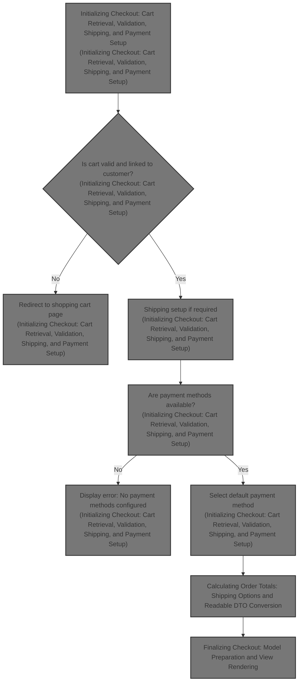

This document explains the checkout preparation flow that validates the shopping cart and customer linkage, initializes the order, determines shipping needs, selects payment methods, converts cart data for display, calculates order totals, and prepares the checkout page model for rendering. It takes shopping cart and customer data as input and outputs a prepared checkout page.



# Initializing Checkout: Cart Retrieval, Validation, Shipping, and Payment Setup

This section handles the initialization of the checkout process by retrieving and validating the shopping cart, setting up shipping options, and preparing payment methods for the checkout page.

| Category        | Rule Name                          | Description                                                                                                                                       |
| --------------- | ---------------------------------- | ------------------------------------------------------------------------------------------------------------------------------------------------- |
| Data validation | Cart Ownership Validation          | The shopping cart must belong to the current store to proceed with checkout.                                                                      |
| Data validation | Customer-Cart Link Verification    | If a customer is logged in, the cart must be linked to that customer; otherwise, redirect to the shopping cart page.                              |
| Data validation | Empty Cart Redirect                | If the shopping cart is empty, redirect the user to the shopping cart page.                                                                       |
| Data validation | Payment Method Availability        | If the cart is not free and no payment methods are configured, display an error message indicating no payments are configured.                    |
| Business logic  | Anonymous Customer Billing Prefill | For anonymous customers, prefill billing information from anonymous customer data if available.                                                   |
| Business logic  | Order Initialization               | If no existing order is found in the session, initialize a new order with the current store, customer, cart, and language.                        |
| Business logic  | Shipping Requirement Check         | Determine if the cart requires shipping and if so, obtain shipping quotes and set shipping options in the order and session.                      |
| Business logic  | Default Payment Method Selection   | Select a default payment method if one is marked as default; otherwise, select the first available payment method and mark it as default.         |
| Business logic  | Cart Data Preparation for Checkout | Convert the internal shopping cart model into a readable data object tailored to the current language and store for display in the order summary. |
| Business logic  | Order Total Calculation            | Calculate the total order amount including all applicable charges to present accurate pricing at checkout.                                        |

<SwmSnippet path="/shopizer/sm-shop/src/main/java/com/salesmanager/web/shop/controller/order/ShoppingOrderController.java" line="136">

---

In this snippet, we start the checkout by trying to find the shopping cart either in the session or from a cookie, making sure the cart belongs to the current store. We then verify the customer-cart link to avoid mismatches. Next, we handle shipping by getting quotes and setting shipping options in the order and session. Finally, we prepare payment methods, selecting a default one if available, setting up everything needed for the checkout page.

```java
	public String displayCheckout(@CookieValue("cart") String cookie, Model model, HttpServletRequest request, HttpServletResponse response, Locale locale) throws Exception {

		Language language = (Language)request.getAttribute("LANGUAGE");
		MerchantStore store = (MerchantStore)request.getAttribute(Constants.MERCHANT_STORE);
		Customer customer = (Customer)request.getSession().getAttribute(Constants.CUSTOMER);

		
		/**
		 * Shopping cart
		 * 
		 * ShoppingCart should be in the HttpSession
		 * Otherwise the cart id is in the cookie
		 * Otherwise the customer is in the session and a cart exist in the DB
		 * Else -> Nothing to display
		 */
		
		//check if an existing order exist
		ShopOrder order = null;
		order = super.getSessionAttribute(Constants.ORDER, request);
	
		//Get the cart from the DB
		String shoppingCartCode  = (String)request.getSession().getAttribute(Constants.SHOPPING_CART);
		com.salesmanager.core.business.shoppingcart.model.ShoppingCart cart = null;
	
	    if(StringUtils.isBlank(shoppingCartCode)) {
				
			if(cookie==null) {//session expired and cookie null, nothing to do
				return "redirect:/shop/cart/shoppingCart.html";
			}
			String merchantCookie[] = cookie.split("_");
			String merchantStoreCode = merchantCookie[0];
			if(!merchantStoreCode.equals(store.getCode())) {
				return "redirect:/shop/cart/shoppingCart.html";
			}
			shoppingCartCode = merchantCookie[1];
	    	
	    } 
	    
	    cart = shoppingCartFacade.getShoppingCartModel(shoppingCartCode, store);
	
	    if(cart==null && customer!=null) {
				cart=shoppingCartFacade.getShoppingCartModel(customer, store);
	    }
	    
	    super.setSessionAttribute(Constants.SHOPPING_CART, cart.getShoppingCartCode(), request);
	
	    if(shoppingCartCode==null && cart==null) {//error
				return "redirect:/shop/cart/shoppingCart.html";
	    }
			
	
	    if(customer!=null) {
			if(cart.getCustomerId()!=customer.getId().longValue()) {
					return "redirect:/shop/shoppingCart.html";
			}
	     } else {
				customer = orderFacade.initEmptyCustomer(store);
				AnonymousCustomer anonymousCustomer = (AnonymousCustomer)request.getAttribute(Constants.ANONYMOUS_CUSTOMER);
				if(anonymousCustomer!=null && anonymousCustomer.getBilling()!=null) {
					Billing billing = customer.getBilling();
					billing.setCity(anonymousCustomer.getBilling().getCity());
					Map<String,Country> countriesMap = countryService.getCountriesMap(language);
					Country anonymousCountry = countriesMap.get(anonymousCustomer.getBilling().getCountry());
					if(anonymousCountry!=null) {
						billing.setCountry(anonymousCountry);
					}
					Map<String,Zone> zonesMap = zoneService.getZones(language);
					Zone anonymousZone = zonesMap.get(anonymousCustomer.getBilling().getZone());
					if(anonymousZone!=null) {
						billing.setZone(anonymousZone);
					}
					if(anonymousCustomer.getBilling().getPostalCode()!=null) {
						billing.setPostalCode(anonymousCustomer.getBilling().getPostalCode());
					}
					customer.setBilling(billing);
				}
	     }
	
	     Set<ShoppingCartItem> items = cart.getLineItems();
	     if(CollectionUtils.isEmpty(items)) {
				return "redirect:/shop/shoppingCart.html";
	     }
		
	     if(order==null) {
			order = orderFacade.initializeOrder(store, customer, cart, language);
		  }

		boolean freeShoppingCart = shoppingCartService.isFreeShoppingCart(cart);
		boolean requiresShipping = shoppingCartService.requiresShipping(cart);
		
		/** shipping **/
		ShippingQuote quote = null;
		if(requiresShipping) {
			quote = orderFacade.getShippingQuote(customer, cart, order, store, language);
			model.addAttribute("shippingQuote", quote);
		}

		if(quote!=null) {

			if(StringUtils.isBlank(quote.getShippingReturnCode())) {
			
				if(order.getShippingSummary()==null) {
					ShippingSummary summary = orderFacade.getShippingSummary(quote, store, language);
					order.setShippingSummary(summary);
					request.getSession().setAttribute(Constants.SHIPPING_SUMMARY, summary);
				}
				if(order.getSelectedShippingOption()==null) {
					order.setSelectedShippingOption(quote.getSelectedShippingOption());
				}
				
				//save quotes in HttpSession
				List<ShippingOption> options = quote.getShippingOptions();
				request.getSession().setAttribute(Constants.SHIPPING_OPTIONS, options);
			
			}
			
			
			//get shipping countries
			List<Country> shippingCountriesList = orderFacade.getShipToCountry(store, language);
			model.addAttribute("countries", shippingCountriesList);
		} else {
			//get all countries
			List<Country> countries = countryService.getCountries(language);
			model.addAttribute("countries", countries);
		}
		
		if(quote!=null && quote.getShippingReturnCode()!=null && quote.getShippingReturnCode().equals(ShippingQuote.NO_SHIPPING_MODULE_CONFIGURED)) {
			LOGGER.error("Shipping quote error " + quote.getShippingReturnCode());
			model.addAttribute("errorMessages", quote.getShippingReturnCode());
		}
		
		if(quote!=null && !StringUtils.isBlank(quote.getQuoteError())) {
			LOGGER.error("Shipping quote error " + quote.getQuoteError());
			model.addAttribute("errorMessages", quote.getQuoteError());
		}
		
		if(quote!=null && quote.getShippingReturnCode()!=null && quote.getShippingReturnCode().equals(ShippingQuote.NO_SHIPPING_TO_SELECTED_COUNTRY)) {
			LOGGER.error("Shipping quote error " + quote.getShippingReturnCode());
			model.addAttribute("errorMessages", quote.getShippingReturnCode());
		}
		/** end shipping **/

		//get payment methods
		List<PaymentMethod> paymentMethods = paymentService.getAcceptedPaymentMethods(store);

		//not free and no payment methods
		if(CollectionUtils.isEmpty(paymentMethods) && !freeShoppingCart) {
			LOGGER.error("No payment method configured");
			model.addAttribute("errorMessages", "No payments configured");
		}
		
		if(!CollectionUtils.isEmpty(paymentMethods)) {//select default payment method
			PaymentMethod defaultPaymentSelected = null;
			for(PaymentMethod paymentMethod : paymentMethods) {
				if(paymentMethod.isDefaultSelected()) {
					defaultPaymentSelected = paymentMethod;
					break;
				}
			}
```

---

</SwmSnippet>

<SwmSnippet path="/shopizer/sm-shop/src/main/java/com/salesmanager/web/shop/controller/order/ShoppingOrderController.java" line="296">

---

After setting up payment methods, we convert the internal shopping cart model into a readable data object using <SwmToken path="shopizer/sm-shop/src/main/java/com/salesmanager/web/shop/controller/order/ShoppingOrderController.java" pos="75:16:16" line-data="import com.salesmanager.web.shop.controller.shoppingCart.facade.ShoppingCartFacade;">`ShoppingCartFacade`</SwmToken>. This prepares the cart data for the order summary box in the checkout page.

```java
			if(defaultPaymentSelected==null) {//forced default selection
				defaultPaymentSelected = paymentMethods.get(0);
				defaultPaymentSelected.setDefaultSelected(true);
			}
			
			
		}
		
		//readable shopping cart items for order summary box
        ShoppingCartData shoppingCart = shoppingCartFacade.getShoppingCartData(cart);
```

---

</SwmSnippet>

<SwmSnippet path="/shopizer/sm-shop/src/main/java/com/salesmanager/web/shop/controller/shoppingCart/facade/ShoppingCartFacadeImpl.java" line="311">

---

Here <SwmToken path="shopizer/sm-shop/src/main/java/com/salesmanager/web/shop/controller/shoppingCart/facade/ShoppingCartFacadeImpl.java" pos="311:5:5" line-data="    public ShoppingCartData getShoppingCartData( final ShoppingCart shoppingCartModel )">`getShoppingCartData`</SwmToken> creates a populator, sets calculation and pricing services on it, then uses it to convert the shopping cart model into a data transfer object. It pulls Language and <SwmToken path="shopizer/sm-shop/src/main/java/com/salesmanager/web/shop/controller/shoppingCart/facade/ShoppingCartFacadeImpl.java" pos="319:1:1" line-data="        MerchantStore merchantStore = (MerchantStore) getKeyValue( Constants.MERCHANT_STORE );">`MerchantStore`</SwmToken> from a key-value store, assuming they exist, to tailor the data correctly.

```java
    public ShoppingCartData getShoppingCartData( final ShoppingCart shoppingCartModel )
        throws Exception
    {

        ShoppingCartDataPopulator shoppingCartDataPopulator = new ShoppingCartDataPopulator();
        shoppingCartDataPopulator.setShoppingCartCalculationService( shoppingCartCalculationService );
        shoppingCartDataPopulator.setPricingService( pricingService );
        Language language = (Language) getKeyValue( Constants.LANGUAGE );
        MerchantStore merchantStore = (MerchantStore) getKeyValue( Constants.MERCHANT_STORE );
        return shoppingCartDataPopulator.populate( shoppingCartModel, merchantStore, language );
    }
```

---

</SwmSnippet>

<SwmSnippet path="/shopizer/sm-shop/src/main/java/com/salesmanager/web/shop/controller/order/ShoppingOrderController.java" line="306">

---

The gist is we add cart data to the model and then calculate the order total to prepare accurate pricing for checkout.

```java
        model.addAttribute( "cart", shoppingCart );
		


		//order total
		OrderTotalSummary orderTotalSummary = orderFacade.calculateOrderTotal(store, order, language);
```

---

</SwmSnippet>

## Calculating Order Totals: Shipping Options and Readable DTO Conversion

```mermaid
%%{init: {"flowchart": {"defaultRenderer": "elk"}} }%%
flowchart TD
    node1["Start calculate order total"] --> node2["Regenerate shopping cart from session"]
    click node1 openCode "shopizer/sm-shop/src/main/java/com/salesmanager/web/shop/controller/order/ShoppingOrderController.java:836:848"
    node2 --> node3["Populate readable order from ShopOrder"]
    click node2 openCode "shopizer/sm-shop/src/main/java/com/salesmanager/web/shop/controller/order/ShoppingOrderController.java:849:852"
    node3 --> node4{"Is shipping option selected?"}
    click node3 openCode "shopizer/sm-shop/src/main/java/com/salesmanager/web/shop/controller/order/ShoppingOrderController.java:853:854"
    node4 -->|"Yes"| node5["Get shipping summary and options from session"]
    click node4 openCode "shopizer/sm-shop/src/main/java/com/salesmanager/web/shop/controller/order/ShoppingOrderController.java:855:868"
    node4 -->|"No"| node19["Skip shipping selection"]
    click node19 openCode "shopizer/sm-shop/src/main/java/com/salesmanager/web/shop/controller/order/ShoppingOrderController.java:902:904"
    node5 --> node6{"Is selected shipping option valid?"}
    click node5 openCode "shopizer/sm-shop/src/main/java/com/salesmanager/web/shop/controller/order/ShoppingOrderController.java:869:880"
    node6 -->|"Yes"| node7["Set selected shipping option in summary"]
    click node6 openCode "shopizer/sm-shop/src/main/java/com/salesmanager/web/shop/controller/order/ShoppingOrderController.java:881:892"
    node6 -->|"No"| node8["Set default shipping option"]
    click node8 openCode "shopizer/sm-shop/src/main/java/com/salesmanager/web/shop/controller/order/ShoppingOrderController.java:883:885"
    node7 --> node9["Update shipping summary in readable order"]
    click node7 openCode "shopizer/sm-shop/src/main/java/com/salesmanager/web/shop/controller/order/ShoppingOrderController.java:888:899"
    node8 --> node9
    node9 --> node10["Set shopping cart items in order"]
    click node9 openCode "shopizer/sm-shop/src/main/java/com/salesmanager/web/shop/controller/order/ShoppingOrderController.java:900:905"
    node10 --> node11["Calculate order total"]
    click node10 openCode "shopizer/sm-shop/src/main/java/com/salesmanager/web/shop/controller/order/ShoppingOrderController.java:906:906"
    node11 --> node12["Store order total summary in session"]
    click node11 openCode "shopizer/sm-shop/src/main/java/com/salesmanager/web/shop/controller/order/ShoppingOrderController.java:907:907"
    node12 --> node13["Initialize readable order total populator"]
    click node12 openCode "shopizer/sm-shop/src/main/java/com/salesmanager/web/shop/controller/order/ShoppingOrderController.java:910:912"
    node13 --> loop1
    click node13 openCode "shopizer/sm-shop/src/main/java/com/salesmanager/web/shop/controller/order/ShoppingOrderController.java:913:914"

    subgraph loop1["For each order total in summary"]
        node14{"Is order total code grand total?"}
        click node14 openCode "shopizer/sm-shop/src/main/java/com/salesmanager/web/shop/controller/order/ShoppingOrderController.java:915:917"
        node14 -->|"No"| node15["Populate and add to subtotals"]
        click node15 openCode "shopizer/sm-shop/src/main/java/com/salesmanager/web/shop/controller/order/ShoppingOrderController.java:918:920"
        node14 -->|"Yes"| node16["Populate and set grand total"]
        click node16 openCode "shopizer/sm-shop/src/main/java/com/salesmanager/web/shop/controller/order/ShoppingOrderController.java:921:923"
        node15 --> node14
    end
    node16 --> node17["Set subtotals in readable order"]
    click node17 openCode "shopizer/sm-shop/src/main/java/com/salesmanager/web/shop/controller/order/ShoppingOrderController.java:928:929"
    node19 --> node10
    node17 --> node18["Return readable order"]
    click node18 openCode "shopizer/sm-shop/src/main/java/com/salesmanager/web/shop/controller/order/ShoppingOrderController.java:935:936"
classDef HeadingStyle fill:#777777,stroke:#333,stroke-width:2px;

%% Swimm:
%% %%{init: {"flowchart": {"defaultRenderer": "elk"}} }%%
%% flowchart TD
%%     node1["Start calculate order total"] --> node2["Regenerate shopping cart from session"]
%%     click node1 openCode "<SwmPath>[shopizer/…/order/ShoppingOrderController.java](shopizer/sm-shop/src/main/java/com/salesmanager/web/shop/controller/order/ShoppingOrderController.java)</SwmPath>:836:848"
%%     node2 --> node3["Populate readable order from <SwmToken path="shopizer/sm-shop/src/main/java/com/salesmanager/web/shop/controller/order/ShoppingOrderController.java" pos="153:1:1" line-data="		ShopOrder order = null;">`ShopOrder`</SwmToken>"]
%%     click node2 openCode "<SwmPath>[shopizer/…/order/ShoppingOrderController.java](shopizer/sm-shop/src/main/java/com/salesmanager/web/shop/controller/order/ShoppingOrderController.java)</SwmPath>:849:852"
%%     node3 --> node4{"Is shipping option selected?"}
%%     click node3 openCode "<SwmPath>[shopizer/…/order/ShoppingOrderController.java](shopizer/sm-shop/src/main/java/com/salesmanager/web/shop/controller/order/ShoppingOrderController.java)</SwmPath>:853:854"
%%     node4 -->|"Yes"| node5["Get shipping summary and options from session"]
%%     click node4 openCode "<SwmPath>[shopizer/…/order/ShoppingOrderController.java](shopizer/sm-shop/src/main/java/com/salesmanager/web/shop/controller/order/ShoppingOrderController.java)</SwmPath>:855:868"
%%     node4 -->|"No"| node19["Skip shipping selection"]
%%     click node19 openCode "<SwmPath>[shopizer/…/order/ShoppingOrderController.java](shopizer/sm-shop/src/main/java/com/salesmanager/web/shop/controller/order/ShoppingOrderController.java)</SwmPath>:902:904"
%%     node5 --> node6{"Is selected shipping option valid?"}
%%     click node5 openCode "<SwmPath>[shopizer/…/order/ShoppingOrderController.java](shopizer/sm-shop/src/main/java/com/salesmanager/web/shop/controller/order/ShoppingOrderController.java)</SwmPath>:869:880"
%%     node6 -->|"Yes"| node7["Set selected shipping option in summary"]
%%     click node6 openCode "<SwmPath>[shopizer/…/order/ShoppingOrderController.java](shopizer/sm-shop/src/main/java/com/salesmanager/web/shop/controller/order/ShoppingOrderController.java)</SwmPath>:881:892"
%%     node6 -->|"No"| node8["Set default shipping option"]
%%     click node8 openCode "<SwmPath>[shopizer/…/order/ShoppingOrderController.java](shopizer/sm-shop/src/main/java/com/salesmanager/web/shop/controller/order/ShoppingOrderController.java)</SwmPath>:883:885"
%%     node7 --> node9["Update shipping summary in readable order"]
%%     click node7 openCode "<SwmPath>[shopizer/…/order/ShoppingOrderController.java](shopizer/sm-shop/src/main/java/com/salesmanager/web/shop/controller/order/ShoppingOrderController.java)</SwmPath>:888:899"
%%     node8 --> node9
%%     node9 --> node10["Set shopping cart items in order"]
%%     click node9 openCode "<SwmPath>[shopizer/…/order/ShoppingOrderController.java](shopizer/sm-shop/src/main/java/com/salesmanager/web/shop/controller/order/ShoppingOrderController.java)</SwmPath>:900:905"
%%     node10 --> node11["Calculate order total"]
%%     click node10 openCode "<SwmPath>[shopizer/…/order/ShoppingOrderController.java](shopizer/sm-shop/src/main/java/com/salesmanager/web/shop/controller/order/ShoppingOrderController.java)</SwmPath>:906:906"
%%     node11 --> node12["Store order total summary in session"]
%%     click node11 openCode "<SwmPath>[shopizer/…/order/ShoppingOrderController.java](shopizer/sm-shop/src/main/java/com/salesmanager/web/shop/controller/order/ShoppingOrderController.java)</SwmPath>:907:907"
%%     node12 --> node13["Initialize readable order total populator"]
%%     click node12 openCode "<SwmPath>[shopizer/…/order/ShoppingOrderController.java](shopizer/sm-shop/src/main/java/com/salesmanager/web/shop/controller/order/ShoppingOrderController.java)</SwmPath>:910:912"
%%     node13 --> loop1
%%     click node13 openCode "<SwmPath>[shopizer/…/order/ShoppingOrderController.java](shopizer/sm-shop/src/main/java/com/salesmanager/web/shop/controller/order/ShoppingOrderController.java)</SwmPath>:913:914"
%% 
%%     subgraph loop1["For each order total in summary"]
%%         node14{"Is order total code grand total?"}
%%         click node14 openCode "<SwmPath>[shopizer/…/order/ShoppingOrderController.java](shopizer/sm-shop/src/main/java/com/salesmanager/web/shop/controller/order/ShoppingOrderController.java)</SwmPath>:915:917"
%%         node14 -->|"No"| node15["Populate and add to subtotals"]
%%         click node15 openCode "<SwmPath>[shopizer/…/order/ShoppingOrderController.java](shopizer/sm-shop/src/main/java/com/salesmanager/web/shop/controller/order/ShoppingOrderController.java)</SwmPath>:918:920"
%%         node14 -->|"Yes"| node16["Populate and set grand total"]
%%         click node16 openCode "<SwmPath>[shopizer/…/order/ShoppingOrderController.java](shopizer/sm-shop/src/main/java/com/salesmanager/web/shop/controller/order/ShoppingOrderController.java)</SwmPath>:921:923"
%%         node15 --> node14
%%     end
%%     node16 --> node17["Set subtotals in readable order"]
%%     click node17 openCode "<SwmPath>[shopizer/…/order/ShoppingOrderController.java](shopizer/sm-shop/src/main/java/com/salesmanager/web/shop/controller/order/ShoppingOrderController.java)</SwmPath>:928:929"
%%     node19 --> node10
%%     node17 --> node18["Return readable order"]
%%     click node18 openCode "<SwmPath>[shopizer/…/order/ShoppingOrderController.java](shopizer/sm-shop/src/main/java/com/salesmanager/web/shop/controller/order/ShoppingOrderController.java)</SwmPath>:935:936"
%% classDef HeadingStyle fill:#777777,stroke:#333,stroke-width:2px;
```



This section handles the calculation of order totals including shipping options and conversion of order data into readable DTOs for presentation.

| Category        | Rule Name                           | Description                                                                                                                                                                                                                              |
| --------------- | ----------------------------------- | ---------------------------------------------------------------------------------------------------------------------------------------------------------------------------------------------------------------------------------------- |
| Data validation | Shipping option validation          | If a shipping option is selected in the order, it must be validated against the available shipping options stored in the session. If the selected option is invalid or missing, the default shipping option is applied.                  |
| Data validation | Session attribute dependency        | The calculation process depends on the presence of specific session attributes such as shopping cart code, shipping summary, and shipping options. Missing attributes should prevent calculation and trigger appropriate error handling. |
| Business logic  | Shipping summary inclusion          | The order total calculation must include the shipping summary and selected shipping option to accurately reflect shipping costs in the final order total.                                                                                |
| Business logic  | Order total calculation             | The system must calculate the order total by aggregating item prices, shipping costs, taxes, and other applicable fees to produce a comprehensive total summary.                                                                         |
| Business logic  | Subtotal and grand total separation | The order total summary must separate subtotals from the grand total to provide clear and understandable pricing details to the customer.                                                                                                |

<SwmSnippet path="/shopizer/sm-shop/src/main/java/com/salesmanager/web/shop/controller/order/ShoppingOrderController.java" line="836">

---

In <SwmToken path="shopizer/sm-shop/src/main/java/com/salesmanager/web/shop/controller/order/ShoppingOrderController.java" pos="836:8:8" line-data="	public @ResponseBody ReadableShopOrder calculateOrderTotal(@ModelAttribute(value=&quot;order&quot;) ShopOrder order, HttpServletRequest request, HttpServletResponse response, Locale locale) throws Exception {">`calculateOrderTotal`</SwmToken>, we start by fetching shipping summary and options from the session. We then use populators to convert order and shipping data into readable DTOs. The function assumes these session attributes exist and that the order has a selected shipping option to validate.

```java
	public @ResponseBody ReadableShopOrder calculateOrderTotal(@ModelAttribute(value="order") ShopOrder order, HttpServletRequest request, HttpServletResponse response, Locale locale) throws Exception {
		
		Language language = (Language)request.getAttribute("LANGUAGE");
		MerchantStore store = (MerchantStore)request.getAttribute(Constants.MERCHANT_STORE);
		String shoppingCartCode  = getSessionAttribute(Constants.SHOPPING_CART, request);
		
		Validate.notNull(shoppingCartCode,"shoppingCartCode does not exist in the session");
		
		ReadableShopOrder readableOrder = new ReadableShopOrder();
		try {

			//re-generate cart
			com.salesmanager.core.business.shoppingcart.model.ShoppingCart cart = shoppingCartFacade.getShoppingCartModel(shoppingCartCode, store);

			ReadableShopOrderPopulator populator = new ReadableShopOrderPopulator();
			populator.populate(order, readableOrder, store, language);

			if(order.getSelectedShippingOption()!=null) {
						ShippingSummary summary = (ShippingSummary)request.getSession().getAttribute(Constants.SHIPPING_SUMMARY);
						@SuppressWarnings("unchecked")
						List<ShippingOption> options = (List<ShippingOption>)request.getSession().getAttribute(Constants.SHIPPING_OPTIONS);
						
						
						order.setShippingSummary(summary);//for total calculation
						
						
						ReadableShippingSummary readableSummary = new ReadableShippingSummary();
						ReadableShippingSummaryPopulator readableSummaryPopulator = new ReadableShippingSummaryPopulator();
						readableSummaryPopulator.setPricingService(pricingService);
						readableSummaryPopulator.populate(summary, readableSummary, store, language);
						
						
						if(!CollectionUtils.isEmpty(options)) {
						
							//get submitted shipping option
							ShippingOption quoteOption = null;
							ShippingOption selectedOption = order.getSelectedShippingOption();

							
							
							//check if selectedOption exist
							for(ShippingOption shipOption : options) {
								if(!StringUtils.isBlank(shipOption.getOptionId()) && shipOption.getOptionId().equals(selectedOption.getOptionId())) {
									quoteOption = shipOption;
								}
							}
```

---

</SwmSnippet>

<SwmSnippet path="/shopizer/sm-shop/src/main/java/com/salesmanager/web/shop/controller/order/ShoppingOrderController.java" line="883">

---

Here we finalize shipping option selection and call <SwmToken path="shopizer/sm-shop/src/main/java/com/salesmanager/web/shop/controller/order/ShoppingOrderController.java" pos="906:7:9" line-data="			OrderTotalSummary orderTotalSummary = orderFacade.calculateOrderTotal(store, order, language);">`orderFacade.calculateOrderTotal`</SwmToken> to compute totals. Then we separate subtotals from the grand total for clear presentation in the order summary.

```java
							if(quoteOption==null) {
								quoteOption = options.get(0);
							}
							
							
							readableSummary.setSelectedShippingOption(quoteOption);
							readableSummary.setShippingOptions(options);
							

							summary.setShippingOption(quoteOption.getOptionId());
							summary.setShipping(quoteOption.getOptionPrice());
						
						}

						
						readableOrder.setShippingSummary(readableSummary);

			}
			
			//set list of shopping cart items for core price calculation
			List<ShoppingCartItem> items = new ArrayList<ShoppingCartItem>(cart.getLineItems());
			order.setShoppingCartItems(items);
			
			OrderTotalSummary orderTotalSummary = orderFacade.calculateOrderTotal(store, order, language);
```

---

</SwmSnippet>

<SwmSnippet path="/shopizer/sm-shop/src/main/java/com/salesmanager/web/shop/controller/order/facade/OrderFacadeImpl.java" line="155">

---

In this function, we get the full Customer model from the facade using the order's customer reference. Then we delegate the main total calculation to another method and update the order with the results before returning the summary.

```java
	public OrderTotalSummary calculateOrderTotal(MerchantStore store,
			ShopOrder order, Language language) throws Exception {
		

		Customer customer = customerFacade.getCustomerModel(order.getCustomer(), store, language);
		OrderTotalSummary summary = this.calculateOrderTotal(store, customer, order, language);
		this.setOrderTotals(order, summary);
		return summary;
	}
```

---

</SwmSnippet>

<SwmSnippet path="/shopizer/sm-shop/src/main/java/com/salesmanager/web/shop/controller/order/ShoppingOrderController.java" line="907">

---

After getting the order total summary from the facade, we convert each total into readable DTOs using populators. We separate subtotals from the grand total for clear UI display. Errors are caught and logged, with a generic error message set.

```java
			super.setSessionAttribute(Constants.ORDER_SUMMARY, orderTotalSummary, request);
			
			
			ReadableOrderTotalPopulator totalPopulator = new ReadableOrderTotalPopulator();
			totalPopulator.setMessages(messages);
			totalPopulator.setPricingService(pricingService);

			List<ReadableOrderTotal> subtotals = new ArrayList<ReadableOrderTotal>();
			for(OrderTotal total : orderTotalSummary.getTotals()) {
				if(!total.getOrderTotalCode().equals("order.total.total")) {
					ReadableOrderTotal t = new ReadableOrderTotal();
					totalPopulator.populate(total, t, store, language);
					subtotals.add(t);
				} else {//grand total
					ReadableOrderTotal ot = new ReadableOrderTotal();
					totalPopulator.populate(total, ot, store, language);
					readableOrder.setGrandTotal(ot.getTotal());
				}
			}
```

---

</SwmSnippet>

<SwmSnippet path="/shopizer/sm-shop/src/main/java/com/salesmanager/web/shop/controller/order/ShoppingOrderController.java" line="928">

---

This function returns a <SwmToken path="shopizer/sm-shop/src/main/java/com/salesmanager/web/shop/controller/order/ShoppingOrderController.java" pos="836:6:6" line-data="	public @ResponseBody ReadableShopOrder calculateOrderTotal(@ModelAttribute(value=&quot;order&quot;) ShopOrder order, HttpServletRequest request, HttpServletResponse response, Locale locale) throws Exception {">`ReadableShopOrder`</SwmToken> DTO with all order details and totals, or an error message if something went wrong.

```java
			readableOrder.setSubTotals(subtotals);
		
		} catch(Exception e) {
			LOGGER.error("Error while getting shipping quotes",e);
			readableOrder.setErrorMessage(messages.getMessage("message.error", locale));
		}
		
		return readableOrder;
	}
```

---

</SwmSnippet>

## Finalizing Checkout: Model Preparation and View Rendering

<SwmSnippet path="/shopizer/sm-shop/src/main/java/com/salesmanager/web/shop/controller/order/ShoppingOrderController.java" line="312">

---

After calculating order totals, we set the summary on the order and session, add order and payment methods to the model, and return the checkout view template based on the store's configuration.

```java
		order.setOrderTotalSummary(orderTotalSummary);
		//if order summary has to be re-used
		super.setSessionAttribute(Constants.ORDER_SUMMARY, orderTotalSummary, request);

		model.addAttribute("order",order);
		model.addAttribute("paymentMethods", paymentMethods);
		
		/** template **/
		StringBuilder template = new StringBuilder().append(ControllerConstants.Tiles.Checkout.checkout).append(".").append(store.getStoreTemplate());
		return template.toString();

		
	}
```

---

</SwmSnippet>

&nbsp;

*This is an auto-generated document by Swimm 🌊 and has not yet been verified by a human*

<SwmMeta version="3.0.0" repo-id="Z2l0aHViJTNBJTNBU2hvcGl6ZXIlM0ElM0F1bWFsaW5nYXN3YW1p" repo-name="Shopizer"><sup>Powered by [Swimm](https://app.swimm.io/)</sup></SwmMeta>
