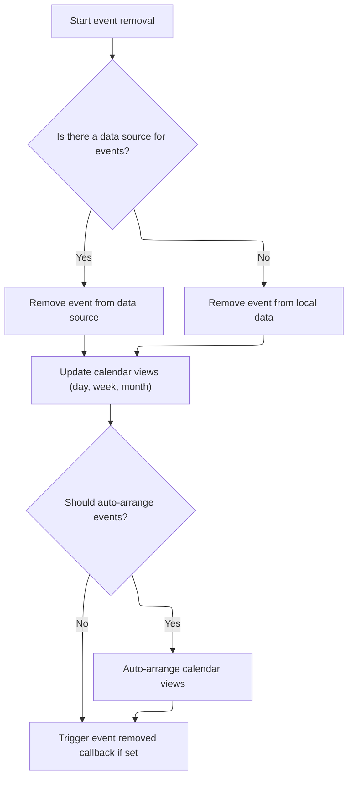
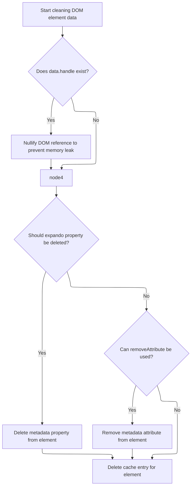

This document describes how DOM elements and calendar events are cleaned up to keep the user interface consistent and performant. The flow determines which elements and events should be processed, removes their event handlers and cached data, and refreshes calendar views as needed.

# Preparing DOM Elements for Cleanup

This section governs which DOM elements are eligible for cleanup by filtering out elements that should not be processed, identifying their cache IDs, and preparing them for event handler removal. The rules ensure that only valid elements are cleaned, maintaining UI stability and performance.

| Category        | Rule Name                   | Description                                                                                                                 |
| --------------- | --------------------------- | --------------------------------------------------------------------------------------------------------------------------- |
| Data validation | NoData Element Exclusion    | DOM elements with node names listed in the noData registry must not be cleaned or have their event handlers removed.        |
| Data validation | Cache ID Requirement        | Only DOM elements with a valid cache ID are eligible for event handler removal and data cleanup.                            |
| Business logic  | Event Handler Removal       | All event handlers associated with eligible DOM elements must be removed to prevent memory leaks and ensure UI consistency. |
| Business logic  | Special Event Type Handling | Special event types must be removed using their designated removal process to ensure correct cleanup behavior.              |

<SwmSnippet path="/shopizer/sm-shop/src/main/webapp/resources/js/bootstrap/jquery.js" line="6365">

---

In `cleanData`, we filter out elements that shouldn't be cleaned, grab their jQuery cache IDs, and prep for event handler removal. This leads into the calendar module for UI updates.

```javascript
	cleanData: function( elems ) {
		var data, id,
			cache = jQuery.cache,
			special = jQuery.event.special,
			deleteExpando = jQuery.support.deleteExpando;

		for ( var i = 0, elem; (elem = elems[i]) != null; i++ ) {
			if ( elem.nodeName && jQuery.noData[elem.nodeName.toLowerCase()] ) {
				continue;
			}

			id = elem[ jQuery.expando ];

			if ( id ) {
				data = cache[ id ];

				if ( data && data.events ) {
					for ( var type in data.events ) {
						if ( special[ type ] ) {
							jQuery.event.remove( elem, type );

						// This is a shortcut to avoid jQuery.event.remove's overhead
						} else {
							jQuery.removeEvent( elem, type, data.handle );
						}
					}

```

---

</SwmSnippet>

## Removing and Refreshing Calendar Events



This section governs how calendar events are removed and how the calendar UI is refreshed to ensure consistency and accuracy after an event is deleted. It ensures that all relevant views are updated and that any custom business logic related to event removal is executed.

| Category       | Rule Name                      | Description                                                                                                                                                                               |
| -------------- | ------------------------------ | ----------------------------------------------------------------------------------------------------------------------------------------------------------------------------------------- |
| Business logic | Data source removal precedence | If a data source is configured for calendar events, the event must be removed from the data source. If no data source is configured, the event must be removed from the local data store. |
| Business logic | Calendar view consistency      | After an event is removed, all calendar views (day, week, month) that display the event must be updated to reflect its removal.                                                           |
| Business logic | Auto-arrange enforcement       | If the auto-arrange setting is enabled, the calendar must automatically rearrange events in the day and week views after an event is removed.                                             |
| Business logic | Custom removal callback        | If a custom event removal callback is configured, it must be triggered after the event is removed and the views are updated.                                                              |

<SwmSnippet path="/shopizer/sm-shop/src/main/webapp/resources/smart-client/system/modules/ISC_Calendar.js" line="66">

---

`removeEvent` checks the event's start and end dates against day, week, and month views using repo-specific helpers. It then removes or refreshes events in those views as needed, and triggers any custom event removal logic. This keeps the calendar UI consistent after data cleanup.

```javascript
,isc.A.removeEvent=function isc_Calendar_removeEvent(_1,_2){if(_2==null)_2=true;var _3=_1[this.startDateField],_4=_1[this.endDateField];var _5=this;var _6=function(){if(_5.$53b(_3,_4)){_5.dayView.removeEvent(_1)}
if(_5.$53c(_3,_4)){_5.weekView.removeEvent(_1)}
if(_5.$53d(_3,_4)){_5.monthView.refreshEvents()}
if(_5.eventAutoArrange){if(_5.dayView)_5.dayView.refreshEvents();if(_5.weekView)_5.weekView.refreshEvents()}
if(_5.eventRemoved)_5.eventRemoved(_1)}
if(_2)this.$53e=true;if(this.dataSource){isc.DataSource.get(this.dataSource).removeData(_1,_6,{componentId:this.ID,oldValues:_1});return}else{this.data.remove(_1);_6()}}
```

---

</SwmSnippet>

<SwmSnippet path="/shopizer/sm-shop/src/main/webapp/resources/smart-client/system/modules/ISC_Calendar.js" line="66">

---

`removeEvent` checks which calendar views the event touches and updates them so the UI matches the data.

```javascript
,isc.A.removeEvent=function isc_Calendar_removeEvent(_1,_2){if(_2==null)_2=true;var _3=_1[this.startDateField],_4=_1[this.endDateField];var _5=this;var _6=function(){if(_5.$53b(_3,_4)){_5.dayView.removeEvent(_1)}
if(_5.$53c(_3,_4)){_5.weekView.removeEvent(_1)}
if(_5.$53d(_3,_4)){_5.monthView.refreshEvents()}
if(_5.eventAutoArrange){if(_5.dayView)_5.dayView.refreshEvents();if(_5.weekView)_5.weekView.refreshEvents()}
if(_5.eventRemoved)_5.eventRemoved(_1)}
```

---

</SwmSnippet>

## Finalizing Cleanup and Memory Management



<SwmSnippet path="/shopizer/sm-shop/src/main/webapp/resources/js/bootstrap/jquery.js" line="6392">

---

After updating the calendar, `cleanData` clears out any leftover references and cached data to prevent leaks and keep things tidy.

```javascript
					// Null the DOM reference to avoid IE6/7/8 leak (#7054)
					if ( data.handle ) {
						data.handle.elem = null;
					}
				}

				if ( deleteExpando ) {
					delete elem[ jQuery.expando ];

				} else if ( elem.removeAttribute ) {
					elem.removeAttribute( jQuery.expando );
				}

				delete cache[ id ];
			}
		}
	}
```

---

</SwmSnippet>

&nbsp;

*This is an auto-generated document by Swimm 🌊 and has not yet been verified by a human*

<SwmMeta version="3.0.0" repo-id="Z2l0aHViJTNBJTNBU2hvcGl6ZXIlM0ElM0F1bWFsaW5nYXN3YW1p" repo-name="Shopizer"><sup>Powered by [Swimm](https://app.swimm.io/)</sup></SwmMeta>
