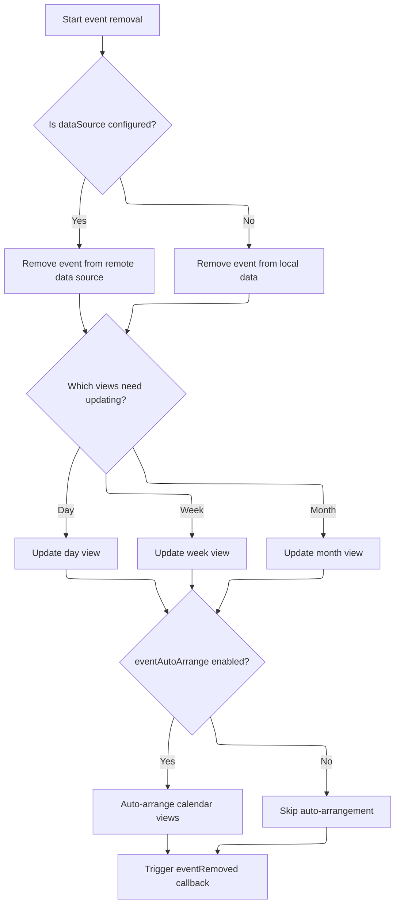
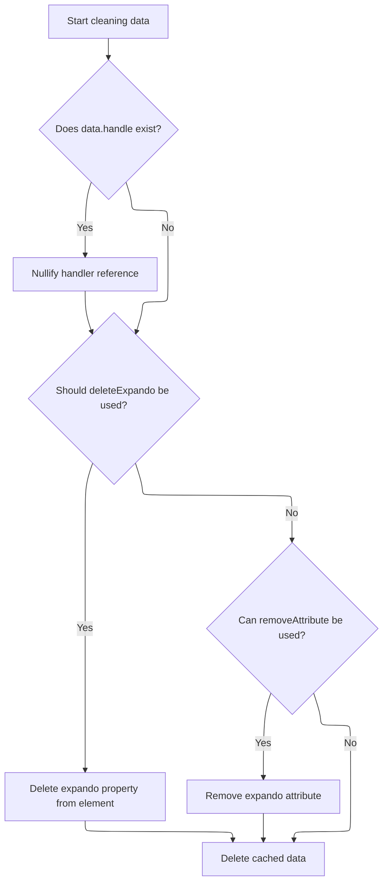

This document outlines the process for cleaning up DOM elements by removing all associated data, event handlers, and references. The flow receives a collection of DOM elements as input and outputs elements that are fully cleaned and safe for removal.

# Preparing for DOM Cleanup

<SwmSnippet path="/shopizer/sm-shop/src/main/webapp/resources/js/bootstrap/jquery.js" line="6365">

---

In `cleanData`, we start by iterating through elements, skipping those that shouldn't have data cleaned. If events are attached, we remove them to prevent memory leaks, which is why the next step is to handle calendar-specific event removal.

```javascript
	cleanData: function( elems ) {
		var data, id,
			cache = jQuery.cache,
			special = jQuery.event.special,
			deleteExpando = jQuery.support.deleteExpando;

		for ( var i = 0, elem; (elem = elems[i]) != null; i++ ) {
			if ( elem.nodeName && jQuery.noData[elem.nodeName.toLowerCase()] ) {
				continue;
			}

			id = elem[ jQuery.expando ];

			if ( id ) {
				data = cache[ id ];

				if ( data && data.events ) {
					for ( var type in data.events ) {
						if ( special[ type ] ) {
							jQuery.event.remove( elem, type );

						// This is a shortcut to avoid jQuery.event.remove's overhead
						} else {
							jQuery.removeEvent( elem, type, data.handle );
						}
					}

```

---

</SwmSnippet>

## Removing Calendar Events and Updating Views



<SwmSnippet path="/shopizer/sm-shop/src/main/webapp/resources/smart-client/system/modules/ISC_Calendar.js" line="66">

---

`removeEvent` removes the event from all calendar views and the data source or collection, then refreshes the UI and triggers callbacks as needed.

```javascript
,isc.A.removeEvent=function isc_Calendar_removeEvent(_1,_2){if(_2==null)_2=true;var _3=_1[this.startDateField],_4=_1[this.endDateField];var _5=this;var _6=function(){if(_5.$53b(_3,_4)){_5.dayView.removeEvent(_1)}
if(_5.$53c(_3,_4)){_5.weekView.removeEvent(_1)}
if(_5.$53d(_3,_4)){_5.monthView.refreshEvents()}
if(_5.eventAutoArrange){if(_5.dayView)_5.dayView.refreshEvents();if(_5.weekView)_5.weekView.refreshEvents()}
if(_5.eventRemoved)_5.eventRemoved(_1)}
if(_2)this.$53e=true;if(this.dataSource){isc.DataSource.get(this.dataSource).removeData(_1,_6,{componentId:this.ID,oldValues:_1});return}else{this.data.remove(_1);_6()}}
```

---

</SwmSnippet>

<SwmSnippet path="/shopizer/sm-shop/src/main/webapp/resources/smart-client/system/modules/ISC_Calendar.js" line="66">

---

`removeEvent` checks which calendar views the event affects using internal methods, updates or refreshes those views, and runs a callback if defined.

```javascript
,isc.A.removeEvent=function isc_Calendar_removeEvent(_1,_2){if(_2==null)_2=true;var _3=_1[this.startDateField],_4=_1[this.endDateField];var _5=this;var _6=function(){if(_5.$53b(_3,_4)){_5.dayView.removeEvent(_1)}
if(_5.$53c(_3,_4)){_5.weekView.removeEvent(_1)}
if(_5.$53d(_3,_4)){_5.monthView.refreshEvents()}
if(_5.eventAutoArrange){if(_5.dayView)_5.dayView.refreshEvents();if(_5.weekView)_5.weekView.refreshEvents()}
if(_5.eventRemoved)_5.eventRemoved(_1)}
```

---

</SwmSnippet>

## Finalizing Data and Reference Cleanup



<SwmSnippet path="/shopizer/sm-shop/src/main/webapp/resources/js/bootstrap/jquery.js" line="6392">

---

Back in `cleanData`, after removing calendar events, we clear out any leftover references and cached data for the element to avoid leaks.

```javascript
					// Null the DOM reference to avoid IE6/7/8 leak (#7054)
					if ( data.handle ) {
						data.handle.elem = null;
					}
				}

				if ( deleteExpando ) {
					delete elem[ jQuery.expando ];

				} else if ( elem.removeAttribute ) {
					elem.removeAttribute( jQuery.expando );
				}

				delete cache[ id ];
			}
		}
	}
```

---

</SwmSnippet>

&nbsp;

*This is an auto-generated document by Swimm 🌊 and has not yet been verified by a human*

<SwmMeta version="3.0.0" repo-id="Z2l0aHViJTNBJTNBU2hvcGl6ZXIlM0ElM0F1bWFsaW5nYXN3YW1p" repo-name="Shopizer"><sup>Powered by [Swimm](https://app.swimm.io/)</sup></SwmMeta>
