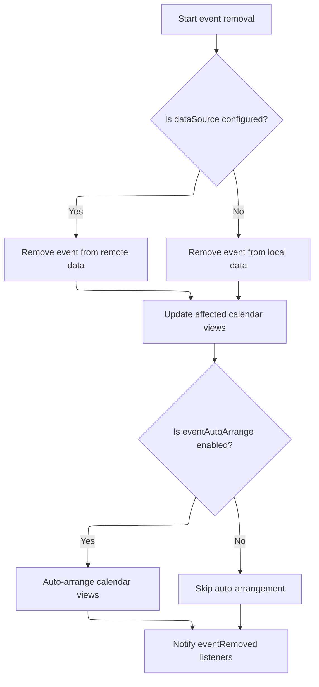
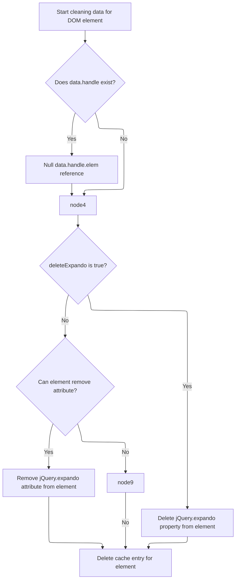

This document outlines the process of cleaning up DOM elements by removing event handlers and cached data. Eligible elements are processed, calendar views are updated if needed, and listeners are notified, ensuring the application remains stable and free from memory leaks.

# Preparing for Event Handler Cleanup

This section ensures that all eligible DOM elements in the provided array have their event handlers removed, preventing memory leaks and unintended behavior. It distinguishes between special and regular events, applying the appropriate removal logic for each.

| Category        | Rule Name                         | Description                                                                                                                                                                  |
| --------------- | --------------------------------- | ---------------------------------------------------------------------------------------------------------------------------------------------------------------------------- |
| Data validation | Eligible Element Filtering        | Only DOM elements that are not explicitly marked as unsafe for data operations (according to jQuery.noData) are eligible for event handler cleanup.                          |
| Data validation | No Event Handler Bypass           | If an element does not have any associated event handlers, no cleanup action is required for that element.                                                                   |
| Business logic  | Event Handler Removal Requirement | All event handlers associated with eligible DOM elements must be removed to prevent memory leaks and unintended interactions after the elements are cleaned up.              |
| Business logic  | Special Event Handling            | Special event types, as defined by jQuery.event.special, must be removed using the specialized removal logic to ensure correct cleanup of custom or complex event behaviors. |

<SwmSnippet path="/shopizer/sm-shop/src/main/webapp/resources/js/bootstrap/jquery.js" line="6365">

---

In `cleanData`, we kick off by looping through each DOM element in the input array, checking if it's safe to clean (using jQuery.noData). For each valid element, we grab its jQuery expando id and look up any cached data. If event handlers are present, we start removing them—using jQuery.event.remove for special events and jQuery.removeEvent for others. This sets up the context for calling ISC_Calendar.js next, since that module handles more complex event removal logic across calendar views, which is needed for thorough cleanup.

```javascript
	cleanData: function( elems ) {
		var data, id,
			cache = jQuery.cache,
			special = jQuery.event.special,
			deleteExpando = jQuery.support.deleteExpando;

		for ( var i = 0, elem; (elem = elems[i]) != null; i++ ) {
			if ( elem.nodeName && jQuery.noData[elem.nodeName.toLowerCase()] ) {
				continue;
			}

			id = elem[ jQuery.expando ];

			if ( id ) {
				data = cache[ id ];

				if ( data && data.events ) {
					for ( var type in data.events ) {
						if ( special[ type ] ) {
							jQuery.event.remove( elem, type );

						// This is a shortcut to avoid jQuery.event.remove's overhead
						} else {
							jQuery.removeEvent( elem, type, data.handle );
						}
					}

```

---

</SwmSnippet>

## Removing Events from Calendar Views



This section governs how events are removed from calendar views, ensuring that the event is deleted from the correct data source, all affected calendar views are updated, and any necessary notifications or auto-arrangements are performed.

| Category       | Rule Name                    | Description                                                                                                                                                                                   |
| -------------- | ---------------------------- | --------------------------------------------------------------------------------------------------------------------------------------------------------------------------------------------- |
| Business logic | Data source removal decision | If a data source is configured for the calendar, the event must be removed from the remote data source. If no data source is configured, the event must be removed from the local data store. |
| Business logic | Update affected views        | When an event is removed, all calendar views (day, week, month) that display the event must be updated to reflect the removal.                                                                |
| Business logic | Auto-arrange on removal      | If the eventAutoArrange setting is enabled, the calendar views must be automatically rearranged after an event is removed to maintain optimal layout.                                         |
| Business logic | Notify removal listeners     | After an event is removed, any registered eventRemoved listeners must be notified with the details of the removed event.                                                                      |

<SwmSnippet path="/shopizer/sm-shop/src/main/webapp/resources/smart-client/system/modules/ISC_Calendar.js" line="66">

---

`isc_Calendar_removeEvent` checks which calendar views the event belongs to and removes or refreshes it in each, using a callback to keep the UI updated after the event is deleted.

```javascript
,isc.A.removeEvent=function isc_Calendar_removeEvent(_1,_2){if(_2==null)_2=true;var _3=_1[this.startDateField],_4=_1[this.endDateField];var _5=this;var _6=function(){if(_5.$53b(_3,_4)){_5.dayView.removeEvent(_1)}
if(_5.$53c(_3,_4)){_5.weekView.removeEvent(_1)}
if(_5.$53d(_3,_4)){_5.monthView.refreshEvents()}
if(_5.eventAutoArrange){if(_5.dayView)_5.dayView.refreshEvents();if(_5.weekView)_5.weekView.refreshEvents()}
if(_5.eventRemoved)_5.eventRemoved(_1)}
if(_2)this.$53e=true;if(this.dataSource){isc.DataSource.get(this.dataSource).removeData(_1,_6,{componentId:this.ID,oldValues:_1});return}else{this.data.remove(_1);_6()}}
```

---

</SwmSnippet>

<SwmSnippet path="/shopizer/sm-shop/src/main/webapp/resources/smart-client/system/modules/ISC_Calendar.js" line="66">

---

`isc_Calendar_removeEvent` uses internal date range checks to decide which calendar views need to be updated when an event is removed. It refreshes or removes events from day, week, and month views as needed, and optionally triggers a callback if defined.

```javascript
,isc.A.removeEvent=function isc_Calendar_removeEvent(_1,_2){if(_2==null)_2=true;var _3=_1[this.startDateField],_4=_1[this.endDateField];var _5=this;var _6=function(){if(_5.$53b(_3,_4)){_5.dayView.removeEvent(_1)}
if(_5.$53c(_3,_4)){_5.weekView.removeEvent(_1)}
if(_5.$53d(_3,_4)){_5.monthView.refreshEvents()}
if(_5.eventAutoArrange){if(_5.dayView)_5.dayView.refreshEvents();if(_5.weekView)_5.weekView.refreshEvents()}
if(_5.eventRemoved)_5.eventRemoved(_1)}
```

---

</SwmSnippet>

## Finalizing Cleanup and Cache Removal



<SwmSnippet path="/shopizer/sm-shop/src/main/webapp/resources/js/bootstrap/jquery.js" line="6392">

---

Back in `cleanData`, after handling event removal, we clear DOM references and delete all cached data and expando properties for each element to finish the cleanup.

```javascript
					// Null the DOM reference to avoid IE6/7/8 leak (#7054)
					if ( data.handle ) {
						data.handle.elem = null;
					}
				}

				if ( deleteExpando ) {
					delete elem[ jQuery.expando ];

				} else if ( elem.removeAttribute ) {
					elem.removeAttribute( jQuery.expando );
				}

				delete cache[ id ];
			}
		}
	}
```

---

</SwmSnippet>

&nbsp;

*This is an auto-generated document by Swimm 🌊 and has not yet been verified by a human*

<SwmMeta version="3.0.0" repo-id="Z2l0aHViJTNBJTNBU2hvcGl6ZXIlM0ElM0F1bWFsaW5nYXN3YW1p" repo-name="Shopizer"><sup>Powered by [Swimm](https://app.swimm.io/)</sup></SwmMeta>
