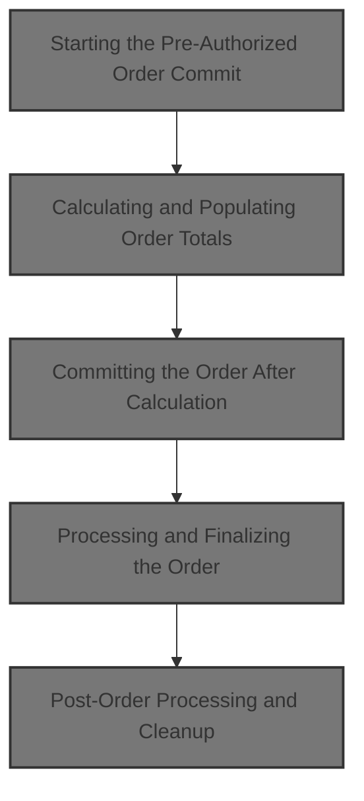
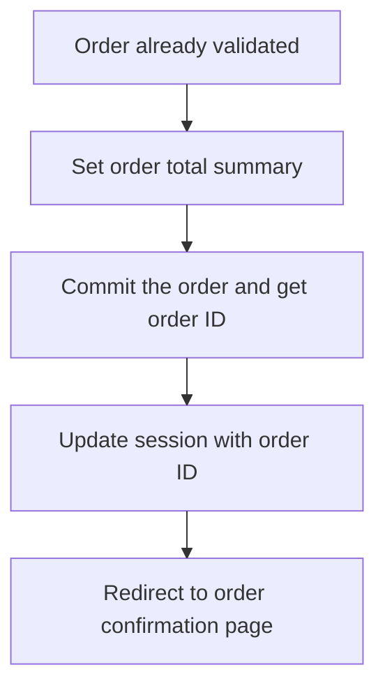

This document describes how a customer's pre-authorized order is finalized and committed. During checkout, the system validates the order, calculates totals, manages customer authentication and addresses, and completes the order for fulfillment. Confirmation and registration emails are sent, and the customer receives access to their order.



# Starting the Pre-Authorized Order Commit

This section governs the process of committing a pre-authorized order, ensuring that only valid orders are processed and that the order total summary is current before proceeding.

| Category        | Rule Name                       | Description                                                                                                                                            |
| --------------- | ------------------------------- | ------------------------------------------------------------------------------------------------------------------------------------------------------ |
| Data validation | Session order presence required | If there is no order present in the session, the user is redirected to a timeout page specific to the merchant store template.                         |
| Data validation | Order total summary freshness   | The order total summary must be present and up-to-date in the session before committing the order. If it is missing, a fresh calculation is performed. |

<SwmSnippet path="/shopizer/sm-shop/src/main/java/com/salesmanager/web/shop/controller/order/ShoppingOrderController.java" line="328">

---

In <SwmToken path="shopizer/sm-shop/src/main/java/com/salesmanager/web/shop/controller/order/ShoppingOrderController.java" pos="328:5:5" line-data="	public String commitPreAuthorizedOrder(Model model, HttpServletRequest request, HttpServletResponse response, Locale locale) throws Exception {">`commitPreAuthorizedOrder`</SwmToken>, we check for an order in the session and ensure we have a fresh order total summary by calling <SwmToken path="shopizer/sm-shop/src/main/java/com/salesmanager/web/shop/controller/order/ShoppingOrderController.java" pos="345:7:7" line-data="				totalSummary = orderFacade.calculateOrderTotal(store, order, language);">`calculateOrderTotal`</SwmToken> if needed.

```java
	public String commitPreAuthorizedOrder(Model model, HttpServletRequest request, HttpServletResponse response, Locale locale) throws Exception {
		
		MerchantStore store = (MerchantStore)request.getAttribute(Constants.MERCHANT_STORE);
		Language language = (Language)request.getAttribute("LANGUAGE");
		ShopOrder order = super.getSessionAttribute(Constants.ORDER, request);
		if(order==null) {
			StringBuilder template = new StringBuilder().append(ControllerConstants.Tiles.Pages.timeout).append(".").append(store.getStoreTemplate());
			return template.toString();	
		}
		

		
		try {
			
			OrderTotalSummary totalSummary = super.getSessionAttribute(Constants.ORDER_SUMMARY, request);
			
			if(totalSummary==null) {
				totalSummary = orderFacade.calculateOrderTotal(store, order, language);
				super.setSessionAttribute(Constants.ORDER_SUMMARY, totalSummary, request);
			}
			
			
```

---

</SwmSnippet>

## Calculating and Populating Order Totals

```mermaid
%%{init: {"flowchart": {"defaultRenderer": "elk"}} }%%
flowchart TD
    node1["Start order total calculation"] --> node2{"Is shipping option selected?"}
    click node1 openCode "shopizer/sm-shop/src/main/java/com/salesmanager/web/shop/controller/order/ShoppingOrderController.java:836:845"
    node2 -->|"Yes"| node3{"Is selected option valid?"}
    click node2 openCode "shopizer/sm-shop/src/main/java/com/salesmanager/web/shop/controller/order/ShoppingOrderController.java:853:854"
    node3 -->|"Yes"| node4["Set selected shipping option"]
    click node3 openCode "shopizer/sm-shop/src/main/java/com/salesmanager/web/shop/controller/order/ShoppingOrderController.java:878:880"
    node3 -->|"No"| node5["Set default shipping option"]
    click node5 openCode "shopizer/sm-shop/src/main/java/com/salesmanager/web/shop/controller/order/ShoppingOrderController.java:883:885"
    node4 --> node6["Populate shipping summary"]
    click node4 openCode "shopizer/sm-shop/src/main/java/com/salesmanager/web/shop/controller/order/ShoppingOrderController.java:888:893"
    node5 --> node6
    node2 -->|"No"| node7["Skip shipping summary"]
    click node7 openCode "shopizer/sm-shop/src/main/java/com/salesmanager/web/shop/controller/order/ShoppingOrderController.java:900:900"
    node6 --> node8["Calculate order total"]
    click node6 openCode "shopizer/sm-shop/src/main/java/com/salesmanager/web/shop/controller/order/ShoppingOrderController.java:906:906"
    node7 --> node8
    node8 --> node9["Summarize order totals"]
    click node8 openCode "shopizer/sm-shop/src/main/java/com/salesmanager/web/shop/controller/order/ShoppingOrderController.java:910:913"
    
    subgraph loop1["For each order total line"]
        node9 --> node10{"Is this a subtotal?"}
        click node10 openCode "shopizer/sm-shop/src/main/java/com/salesmanager/web/shop/controller/order/ShoppingOrderController.java:916:917"
        node10 -->|"Yes"| node11["Add to subtotals"]
        click node11 openCode "shopizer/sm-shop/src/main/java/com/salesmanager/web/shop/controller/order/ShoppingOrderController.java:918:919"
        node10 -->|"No (Grand total)"| node12["Set grand total"]
        click node12 openCode "shopizer/sm-shop/src/main/java/com/salesmanager/web/shop/controller/order/ShoppingOrderController.java:922:923"
    end
    node9 --> node13["Return readable order summary"]
    click node13 openCode "shopizer/sm-shop/src/main/java/com/salesmanager/web/shop/controller/order/ShoppingOrderController.java:928:935"

classDef HeadingStyle fill:#777777,stroke:#333,stroke-width:2px;

%% Swimm:
%% %%{init: {"flowchart": {"defaultRenderer": "elk"}} }%%
%% flowchart TD
%%     node1["Start order total calculation"] --> node2{"Is shipping option selected?"}
%%     click node1 openCode "<SwmPath>[shopizer/…/order/ShoppingOrderController.java](shopizer/sm-shop/src/main/java/com/salesmanager/web/shop/controller/order/ShoppingOrderController.java)</SwmPath>:836:845"
%%     node2 -->|"Yes"| node3{"Is selected option valid?"}
%%     click node2 openCode "<SwmPath>[shopizer/…/order/ShoppingOrderController.java](shopizer/sm-shop/src/main/java/com/salesmanager/web/shop/controller/order/ShoppingOrderController.java)</SwmPath>:853:854"
%%     node3 -->|"Yes"| node4["Set selected shipping option"]
%%     click node3 openCode "<SwmPath>[shopizer/…/order/ShoppingOrderController.java](shopizer/sm-shop/src/main/java/com/salesmanager/web/shop/controller/order/ShoppingOrderController.java)</SwmPath>:878:880"
%%     node3 -->|"No"| node5["Set default shipping option"]
%%     click node5 openCode "<SwmPath>[shopizer/…/order/ShoppingOrderController.java](shopizer/sm-shop/src/main/java/com/salesmanager/web/shop/controller/order/ShoppingOrderController.java)</SwmPath>:883:885"
%%     node4 --> node6["Populate shipping summary"]
%%     click node4 openCode "<SwmPath>[shopizer/…/order/ShoppingOrderController.java](shopizer/sm-shop/src/main/java/com/salesmanager/web/shop/controller/order/ShoppingOrderController.java)</SwmPath>:888:893"
%%     node5 --> node6
%%     node2 -->|"No"| node7["Skip shipping summary"]
%%     click node7 openCode "<SwmPath>[shopizer/…/order/ShoppingOrderController.java](shopizer/sm-shop/src/main/java/com/salesmanager/web/shop/controller/order/ShoppingOrderController.java)</SwmPath>:900:900"
%%     node6 --> node8["Calculate order total"]
%%     click node6 openCode "<SwmPath>[shopizer/…/order/ShoppingOrderController.java](shopizer/sm-shop/src/main/java/com/salesmanager/web/shop/controller/order/ShoppingOrderController.java)</SwmPath>:906:906"
%%     node7 --> node8
%%     node8 --> node9["Summarize order totals"]
%%     click node8 openCode "<SwmPath>[shopizer/…/order/ShoppingOrderController.java](shopizer/sm-shop/src/main/java/com/salesmanager/web/shop/controller/order/ShoppingOrderController.java)</SwmPath>:910:913"
%%     
%%     subgraph loop1["For each order total line"]
%%         node9 --> node10{"Is this a subtotal?"}
%%         click node10 openCode "<SwmPath>[shopizer/…/order/ShoppingOrderController.java](shopizer/sm-shop/src/main/java/com/salesmanager/web/shop/controller/order/ShoppingOrderController.java)</SwmPath>:916:917"
%%         node10 -->|"Yes"| node11["Add to subtotals"]
%%         click node11 openCode "<SwmPath>[shopizer/…/order/ShoppingOrderController.java](shopizer/sm-shop/src/main/java/com/salesmanager/web/shop/controller/order/ShoppingOrderController.java)</SwmPath>:918:919"
%%         node10 -->|"No (Grand total)"| node12["Set grand total"]
%%         click node12 openCode "<SwmPath>[shopizer/…/order/ShoppingOrderController.java](shopizer/sm-shop/src/main/java/com/salesmanager/web/shop/controller/order/ShoppingOrderController.java)</SwmPath>:922:923"
%%     end
%%     node9 --> node13["Return readable order summary"]
%%     click node13 openCode "<SwmPath>[shopizer/…/order/ShoppingOrderController.java](shopizer/sm-shop/src/main/java/com/salesmanager/web/shop/controller/order/ShoppingOrderController.java)</SwmPath>:928:935"
%% 
%% classDef HeadingStyle fill:#777777,stroke:#333,stroke-width:2px;
```



This section is responsible for calculating the order totals, including subtotals and grand total, based on the current shopping cart and selected shipping options. It ensures that the correct shipping option is applied, calculates the totals, and returns a summary suitable for display to the customer.

| Category        | Rule Name                               | Description                                                                                                                                                             |
| --------------- | --------------------------------------- | ----------------------------------------------------------------------------------------------------------------------------------------------------------------------- |
| Data validation | Validate selected shipping option       | If a shipping option is selected by the customer, the system must verify that the selected option is valid and available among the current shipping options.            |
| Business logic  | Default shipping option assignment      | If the selected shipping option is not valid or not found, the system must automatically assign the default (first available) shipping option to the order.             |
| Business logic  | Calculate order subtotals               | The system must calculate the order subtotal(s) by summing the prices of all items in the shopping cart, excluding shipping and taxes.                                  |
| Business logic  | Calculate grand total                   | The system must calculate the grand total by adding all applicable charges (subtotals, shipping, taxes, discounts) to present the final amount payable by the customer. |
| Business logic  | Skip shipping summary if not applicable | If no shipping option is selected or available, the system must skip the shipping summary and proceed with order total calculation based only on the items in the cart. |

<SwmSnippet path="/shopizer/sm-shop/src/main/java/com/salesmanager/web/shop/controller/order/ShoppingOrderController.java" line="836">

---

In <SwmToken path="shopizer/sm-shop/src/main/java/com/salesmanager/web/shop/controller/order/ShoppingOrderController.java" pos="836:8:8" line-data="	public @ResponseBody ReadableShopOrder calculateOrderTotal(@ModelAttribute(value=&quot;order&quot;) ShopOrder order, HttpServletRequest request, HttpServletResponse response, Locale locale) throws Exception {">`calculateOrderTotal`</SwmToken>, we grab session data, rebuild the cart, handle shipping options, and prep everything for order total calculation and UI rendering.

```java
	public @ResponseBody ReadableShopOrder calculateOrderTotal(@ModelAttribute(value="order") ShopOrder order, HttpServletRequest request, HttpServletResponse response, Locale locale) throws Exception {
		
		Language language = (Language)request.getAttribute("LANGUAGE");
		MerchantStore store = (MerchantStore)request.getAttribute(Constants.MERCHANT_STORE);
		String shoppingCartCode  = getSessionAttribute(Constants.SHOPPING_CART, request);
		
		Validate.notNull(shoppingCartCode,"shoppingCartCode does not exist in the session");
		
		ReadableShopOrder readableOrder = new ReadableShopOrder();
		try {

			//re-generate cart
			com.salesmanager.core.business.shoppingcart.model.ShoppingCart cart = shoppingCartFacade.getShoppingCartModel(shoppingCartCode, store);

			ReadableShopOrderPopulator populator = new ReadableShopOrderPopulator();
			populator.populate(order, readableOrder, store, language);

			if(order.getSelectedShippingOption()!=null) {
						ShippingSummary summary = (ShippingSummary)request.getSession().getAttribute(Constants.SHIPPING_SUMMARY);
						@SuppressWarnings("unchecked")
						List<ShippingOption> options = (List<ShippingOption>)request.getSession().getAttribute(Constants.SHIPPING_OPTIONS);
						
						
						order.setShippingSummary(summary);//for total calculation
						
						
						ReadableShippingSummary readableSummary = new ReadableShippingSummary();
						ReadableShippingSummaryPopulator readableSummaryPopulator = new ReadableShippingSummaryPopulator();
						readableSummaryPopulator.setPricingService(pricingService);
						readableSummaryPopulator.populate(summary, readableSummary, store, language);
						
						
						if(!CollectionUtils.isEmpty(options)) {
						
							//get submitted shipping option
							ShippingOption quoteOption = null;
							ShippingOption selectedOption = order.getSelectedShippingOption();

							
							
							//check if selectedOption exist
							for(ShippingOption shipOption : options) {
								if(!StringUtils.isBlank(shipOption.getOptionId()) && shipOption.getOptionId().equals(selectedOption.getOptionId())) {
									quoteOption = shipOption;
								}
							}
```

---

</SwmSnippet>

<SwmSnippet path="/shopizer/sm-shop/src/main/java/com/salesmanager/web/shop/controller/order/ShoppingOrderController.java" line="883">

---

We validate the shipping option, update summaries, set cart items, and split out subtotals and grand total after calculating order totals.

```java
							if(quoteOption==null) {
								quoteOption = options.get(0);
							}
							
							
							readableSummary.setSelectedShippingOption(quoteOption);
							readableSummary.setShippingOptions(options);
							

							summary.setShippingOption(quoteOption.getOptionId());
							summary.setShipping(quoteOption.getOptionPrice());
						
						}

						
						readableOrder.setShippingSummary(readableSummary);

			}
			
			//set list of shopping cart items for core price calculation
			List<ShoppingCartItem> items = new ArrayList<ShoppingCartItem>(cart.getLineItems());
			order.setShoppingCartItems(items);
			
			OrderTotalSummary orderTotalSummary = orderFacade.calculateOrderTotal(store, order, language);
			super.setSessionAttribute(Constants.ORDER_SUMMARY, orderTotalSummary, request);
			
			
			ReadableOrderTotalPopulator totalPopulator = new ReadableOrderTotalPopulator();
			totalPopulator.setMessages(messages);
			totalPopulator.setPricingService(pricingService);

			List<ReadableOrderTotal> subtotals = new ArrayList<ReadableOrderTotal>();
			for(OrderTotal total : orderTotalSummary.getTotals()) {
				if(!total.getOrderTotalCode().equals("order.total.total")) {
					ReadableOrderTotal t = new ReadableOrderTotal();
					totalPopulator.populate(total, t, store, language);
					subtotals.add(t);
				} else {//grand total
					ReadableOrderTotal ot = new ReadableOrderTotal();
					totalPopulator.populate(total, ot, store, language);
					readableOrder.setGrandTotal(ot.getTotal());
				}
			}
```

---

</SwmSnippet>

<SwmSnippet path="/shopizer/sm-shop/src/main/java/com/salesmanager/web/shop/controller/order/ShoppingOrderController.java" line="928">

---

We return a <SwmToken path="shopizer/sm-shop/src/main/java/com/salesmanager/web/shop/controller/order/ShoppingOrderController.java" pos="836:6:6" line-data="	public @ResponseBody ReadableShopOrder calculateOrderTotal(@ModelAttribute(value=&quot;order&quot;) ShopOrder order, HttpServletRequest request, HttpServletResponse response, Locale locale) throws Exception {">`ReadableShopOrder`</SwmToken> with totals, shipping info, and errors if any.

```java
			readableOrder.setSubTotals(subtotals);
		
		} catch(Exception e) {
			LOGGER.error("Error while getting shipping quotes",e);
			readableOrder.setErrorMessage(messages.getMessage("message.error", locale));
		}
		
		return readableOrder;
	}
```

---

</SwmSnippet>

## Committing the Order After Calculation



<SwmSnippet path="/shopizer/sm-shop/src/main/java/com/salesmanager/web/shop/controller/order/ShoppingOrderController.java" line="350">

---

After calculating totals, we call <SwmToken path="shopizer/sm-shop/src/main/java/com/salesmanager/web/shop/controller/order/ShoppingOrderController.java" pos="353:9:9" line-data="			Order orderModel = this.commitOrder(order, request, locale);">`commitOrder`</SwmToken> to process and save the order, then redirect to confirmation.

```java
			order.setOrderTotalSummary(totalSummary);
			
			//already validated, proceed with commit
			Order orderModel = this.commitOrder(order, request, locale);
			super.setSessionAttribute(Constants.ORDER_ID, orderModel.getId(), request);
			
			return "redirect://shop/order/confirmation.html";
			
		} catch(Exception e) {
			LOGGER.error("Error while commiting order",e);
			throw e;		
			
		}

	}
```

---

</SwmSnippet>

# Processing and Finalizing the Order

This section is responsible for processing and finalizing a customer's order, ensuring that customer data, addresses, and payment information are correctly handled before the order is saved and ready for fulfillment.

| Category       | Rule Name                            | Description                                                                                                                              |
| -------------- | ------------------------------------ | ---------------------------------------------------------------------------------------------------------------------------------------- |
| Business logic | Authenticated customer account usage | If the customer is authenticated, their existing account information (username, password, ID) must be used for the order.                |
| Business logic | New customer password generation     | If the customer is new (no ID or ID is zero), a random password must be generated and securely encoded for their account.                |
| Business logic | Ship to billing address              | If the customer chooses to ship to their billing address, the delivery address must be set to the billing address.                       |
| Business logic | Volatile customer creation           | If the customer is not authenticated, a new customer record must be created and persisted before processing the order.                   |
| Business logic | Initial transaction inclusion        | If an initial transaction exists in the session, it must be included when processing the order; otherwise, process the order without it. |

<SwmSnippet path="/shopizer/sm-shop/src/main/java/com/salesmanager/web/shop/controller/order/ShoppingOrderController.java" line="367">

---

We prep the customer, handle addresses, then call <SwmToken path="shopizer/sm-shop/src/main/java/com/salesmanager/web/shop/controller/order/ShoppingOrderController.java" pos="427:3:5" line-data="	        	modelOrder=orderFacade.processOrder(order, modelCustomer, initialTransaction, store, language);">`orderFacade.processOrder`</SwmToken> to build and save the order.

```java
	private Order commitOrder(ShopOrder order, HttpServletRequest request, Locale locale) throws Exception, ServiceException {
		
		
			MerchantStore store = (MerchantStore)request.getAttribute(Constants.MERCHANT_STORE);
			Language language = (Language)request.getAttribute("LANGUAGE");
			
			
			String userName = null;
			String password = null;
			
			PersistableCustomer customer = order.getCustomer();
			
	        /** set username and password to persistable object **/
			Authentication auth = SecurityContextHolder.getContext().getAuthentication();
			Customer authCustomer = null;
        	if(auth != null &&
	        		 request.isUserInRole("AUTH_CUSTOMER")) {
        		authCustomer = customerFacade.getCustomerByUserName(auth.getName(), store);
        		//set id and authentication information
        		customer.setUserName(authCustomer.getNick());
        		customer.setEncodedPassword(authCustomer.getPassword());
        		customer.setId(authCustomer.getId());
	        } else {
	        	//set customer id to null
	        	customer.setId(null);
	        }
		
	        //if the customer is new, generate a password
	        if(customer.getId()==null || customer.getId()==0) {//new customer
	        	password = UserReset.generateRandomString();
	        	String encodedPassword = passwordEncoder.encodePassword(password, null);
	        	customer.setEncodedPassword(encodedPassword);
	        }
	        
	        if(order.isShipToBillingAdress()) {
	        	customer.setDelivery(customer.getBilling());
	        }
	        


			Customer modelCustomer = null;
			try {//set groups
				if(authCustomer==null) {//not authenticated, create a new volatile user
					modelCustomer = customerFacade.getCustomerModel(customer, store, language);
					customerFacade.setCustomerModelDefaultProperties(modelCustomer, store);
					userName = modelCustomer.getNick();
					LOGGER.debug( "About to persist volatile customer to database." );
			        customerService.saveOrUpdate( modelCustomer );
				} else {//use existing customer
					modelCustomer = customerFacade.populateCustomerModel(authCustomer, customer, store, language);
				}
			} catch(Exception e) {
				throw new ServiceException(e);
			}
	        
           
	        
	        Order modelOrder = null;
	        Transaction initialTransaction = (Transaction)super.getSessionAttribute(Constants.INIT_TRANSACTION_KEY, request);
	        if(initialTransaction!=null) {
	        	modelOrder=orderFacade.processOrder(order, modelCustomer, initialTransaction, store, language);
	        } else {
	        	modelOrder=orderFacade.processOrder(order, modelCustomer, store, language);
	        }
	        
```

---

</SwmSnippet>

## Delegating Order Processing to the Facade

This section describes the business rules governing the delegation of order processing within Shopizer. The <SwmToken path="shopizer/sm-shop/src/main/java/com/salesmanager/web/shop/controller/order/ShoppingOrderController.java" pos="427:5:5" line-data="	        	modelOrder=orderFacade.processOrder(order, modelCustomer, initialTransaction, store, language);">`processOrder`</SwmToken> method is responsible for initiating order processing by passing the relevant order, customer, store, and language information to the underlying order processing logic.

| Category        | Rule Name              | Description                                                                                                                                                                                                                                                                                                                                                                                                                                                                                                                                                                                                                                                                 |
| --------------- | ---------------------- | --------------------------------------------------------------------------------------------------------------------------------------------------------------------------------------------------------------------------------------------------------------------------------------------------------------------------------------------------------------------------------------------------------------------------------------------------------------------------------------------------------------------------------------------------------------------------------------------------------------------------------------------------------------------------- |
| Data validation | Required Order Inputs  | Order processing must be initiated using the provided <SwmToken path="shopizer/sm-shop/src/main/java/com/salesmanager/web/shop/controller/order/ShoppingOrderController.java" pos="332:1:1" line-data="		ShopOrder order = super.getSessionAttribute(Constants.ORDER, request);">`ShopOrder`</SwmToken>, Customer, <SwmToken path="shopizer/sm-shop/src/main/java/com/salesmanager/web/shop/controller/order/ShoppingOrderController.java" pos="330:1:1" line-data="		MerchantStore store = (MerchantStore)request.getAttribute(Constants.MERCHANT_STORE);">`MerchantStore`</SwmToken>, and Language information. All four inputs are required for successful order processing. |
| Business logic  | No Transaction Context | Order processing must be delegated to the underlying order processing logic without a transaction context when initiated through this method.                                                                                                                                                                                                                                                                                                                                                                                                                                                                                                                               |

<SwmSnippet path="/shopizer/sm-shop/src/main/java/com/salesmanager/web/shop/controller/order/facade/OrderFacadeImpl.java" line="252">

---

<SwmToken path="shopizer/sm-shop/src/main/java/com/salesmanager/web/shop/controller/order/facade/OrderFacadeImpl.java" pos="252:5:5" line-data="	public Order processOrder(ShopOrder order, Customer customer, MerchantStore store,">`processOrder`</SwmToken> just delegates to <SwmToken path="shopizer/sm-shop/src/main/java/com/salesmanager/web/shop/controller/order/facade/OrderFacadeImpl.java" pos="255:5:5" line-data="		return this.processOrderModel(order, customer, null, store, language);">`processOrderModel`</SwmToken> with transaction as null.

```java
	public Order processOrder(ShopOrder order, Customer customer, MerchantStore store,
			Language language) throws ServiceException {
				
		return this.processOrderModel(order, customer, null, store, language);

	}
```

---

</SwmSnippet>

## Building the Order Domain Model

```mermaid
%%{init: {"flowchart": {"defaultRenderer": "elk"}} }%%
flowchart TD
    node1["Start order processing"]
    click node1 openCode "shopizer/sm-shop/src/main/java/com/salesmanager/web/shop/controller/order/facade/OrderFacadeImpl.java:267:270"
    node1 --> node2{"Ship to billing address?"}
    click node2 openCode "shopizer/sm-shop/src/main/java/com/salesmanager/web/shop/controller/order/facade/OrderFacadeImpl.java:272:276"
    node2 -->|"Yes"| node3["Set delivery address to billing address"]
    click node3 openCode "shopizer/sm-shop/src/main/java/com/salesmanager/web/shop/controller/order/facade/OrderFacadeImpl.java:273:275"
    node2 -->|"No"| node4["Keep delivery address as is"]
    click node4 openCode "shopizer/sm-shop/src/main/java/com/salesmanager/web/shop/controller/order/facade/OrderFacadeImpl.java:284:284"
    node3 --> node5["Create order model (merchant, currency, payment module)"]
    node4 --> node5
    click node5 openCode "shopizer/sm-shop/src/main/java/com/salesmanager/web/shop/controller/order/facade/OrderFacadeImpl.java:281:288"
    subgraph loop1["For each item in cart"]
      node5 --> node6["Populate order product and add to order"]
      click node6 openCode "shopizer/sm-shop/src/main/java/com/salesmanager/web/shop/controller/order/facade/OrderFacadeImpl.java:298:303"
      node6 --> node5
    end
    node5 --> node7["Sort order totals"]
    click node7 openCode "shopizer/sm-shop/src/main/java/com/salesmanager/web/shop/controller/order/facade/OrderFacadeImpl.java:311:320"
    subgraph loop2["For each order total"]
      node7 --> node8["Associate total with order"]
      click node8 openCode "shopizer/sm-shop/src/main/java/com/salesmanager/web/shop/controller/order/facade/OrderFacadeImpl.java:323:325"
      node8 --> node7
    end
    node7 --> node9["Set payment details"]
    click node9 openCode "shopizer/sm-shop/src/main/java/com/salesmanager/web/shop/controller/order/facade/OrderFacadeImpl.java:345:388"
    node9 --> node10{"Payment method?"}
    click node10 openCode "shopizer/sm-shop/src/main/java/com/salesmanager/web/shop/controller/order/facade/OrderFacadeImpl.java:348:392"
    node10 -->|"Credit Card"| node11["Set credit card type and mask number"]
    click node11 openCode "shopizer/sm-shop/src/main/java/com/salesmanager/web/shop/controller/order/facade/OrderFacadeImpl.java:359:387"
    node10 -->|"PayPal"| node12["Set PayPal payer and token"]
    click node12 openCode "shopizer/sm-shop/src/main/java/com/salesmanager/web/shop/controller/order/facade/OrderFacadeImpl.java:401:402"
    node11 --> node13{"Transaction present?"}
    node12 --> node13
    node10 -->|"Other"| node13
    click node13 openCode "shopizer/sm-shop/src/main/java/com/salesmanager/web/shop/controller/order/facade/OrderFacadeImpl.java:411:415"
    node13 -->|"Yes"| node14["Process order"]
    click node14 openCode "shopizer/sm-shop/src/main/java/com/salesmanager/web/shop/controller/order/facade/OrderFacadeImpl.java:412:412"
    node13 -->|"No"| node15["Process order with transaction"]
    click node15 openCode "shopizer/sm-shop/src/main/java/com/salesmanager/web/shop/controller/order/facade/OrderFacadeImpl.java:414:414"
    node14 --> node16["Return finalized order"]
    click node16 openCode "shopizer/sm-shop/src/main/java/com/salesmanager/web/shop/controller/order/facade/OrderFacadeImpl.java:419:419"
    node15 --> node16
classDef HeadingStyle fill:#777777,stroke:#333,stroke-width:2px;

%% Swimm:
%% %%{init: {"flowchart": {"defaultRenderer": "elk"}} }%%
%% flowchart TD
%%     node1["Start order processing"]
%%     click node1 openCode "<SwmPath>[shopizer/…/facade/OrderFacadeImpl.java](shopizer/sm-shop/src/main/java/com/salesmanager/web/shop/controller/order/facade/OrderFacadeImpl.java)</SwmPath>:267:270"
%%     node1 --> node2{"Ship to billing address?"}
%%     click node2 openCode "<SwmPath>[shopizer/…/facade/OrderFacadeImpl.java](shopizer/sm-shop/src/main/java/com/salesmanager/web/shop/controller/order/facade/OrderFacadeImpl.java)</SwmPath>:272:276"
%%     node2 -->|"Yes"| node3["Set delivery address to billing address"]
%%     click node3 openCode "<SwmPath>[shopizer/…/facade/OrderFacadeImpl.java](shopizer/sm-shop/src/main/java/com/salesmanager/web/shop/controller/order/facade/OrderFacadeImpl.java)</SwmPath>:273:275"
%%     node2 -->|"No"| node4["Keep delivery address as is"]
%%     click node4 openCode "<SwmPath>[shopizer/…/facade/OrderFacadeImpl.java](shopizer/sm-shop/src/main/java/com/salesmanager/web/shop/controller/order/facade/OrderFacadeImpl.java)</SwmPath>:284:284"
%%     node3 --> node5["Create order model (merchant, currency, payment module)"]
%%     node4 --> node5
%%     click node5 openCode "<SwmPath>[shopizer/…/facade/OrderFacadeImpl.java](shopizer/sm-shop/src/main/java/com/salesmanager/web/shop/controller/order/facade/OrderFacadeImpl.java)</SwmPath>:281:288"
%%     subgraph loop1["For each item in cart"]
%%       node5 --> node6["Populate order product and add to order"]
%%       click node6 openCode "<SwmPath>[shopizer/…/facade/OrderFacadeImpl.java](shopizer/sm-shop/src/main/java/com/salesmanager/web/shop/controller/order/facade/OrderFacadeImpl.java)</SwmPath>:298:303"
%%       node6 --> node5
%%     end
%%     node5 --> node7["Sort order totals"]
%%     click node7 openCode "<SwmPath>[shopizer/…/facade/OrderFacadeImpl.java](shopizer/sm-shop/src/main/java/com/salesmanager/web/shop/controller/order/facade/OrderFacadeImpl.java)</SwmPath>:311:320"
%%     subgraph loop2["For each order total"]
%%       node7 --> node8["Associate total with order"]
%%       click node8 openCode "<SwmPath>[shopizer/…/facade/OrderFacadeImpl.java](shopizer/sm-shop/src/main/java/com/salesmanager/web/shop/controller/order/facade/OrderFacadeImpl.java)</SwmPath>:323:325"
%%       node8 --> node7
%%     end
%%     node7 --> node9["Set payment details"]
%%     click node9 openCode "<SwmPath>[shopizer/…/facade/OrderFacadeImpl.java](shopizer/sm-shop/src/main/java/com/salesmanager/web/shop/controller/order/facade/OrderFacadeImpl.java)</SwmPath>:345:388"
%%     node9 --> node10{"Payment method?"}
%%     click node10 openCode "<SwmPath>[shopizer/…/facade/OrderFacadeImpl.java](shopizer/sm-shop/src/main/java/com/salesmanager/web/shop/controller/order/facade/OrderFacadeImpl.java)</SwmPath>:348:392"
%%     node10 -->|"Credit Card"| node11["Set credit card type and mask number"]
%%     click node11 openCode "<SwmPath>[shopizer/…/facade/OrderFacadeImpl.java](shopizer/sm-shop/src/main/java/com/salesmanager/web/shop/controller/order/facade/OrderFacadeImpl.java)</SwmPath>:359:387"
%%     node10 -->|"PayPal"| node12["Set PayPal payer and token"]
%%     click node12 openCode "<SwmPath>[shopizer/…/facade/OrderFacadeImpl.java](shopizer/sm-shop/src/main/java/com/salesmanager/web/shop/controller/order/facade/OrderFacadeImpl.java)</SwmPath>:401:402"
%%     node11 --> node13{"Transaction present?"}
%%     node12 --> node13
%%     node10 -->|"Other"| node13
%%     click node13 openCode "<SwmPath>[shopizer/…/facade/OrderFacadeImpl.java](shopizer/sm-shop/src/main/java/com/salesmanager/web/shop/controller/order/facade/OrderFacadeImpl.java)</SwmPath>:411:415"
%%     node13 -->|"Yes"| node14["Process order"]
%%     click node14 openCode "<SwmPath>[shopizer/…/facade/OrderFacadeImpl.java](shopizer/sm-shop/src/main/java/com/salesmanager/web/shop/controller/order/facade/OrderFacadeImpl.java)</SwmPath>:412:412"
%%     node13 -->|"No"| node15["Process order with transaction"]
%%     click node15 openCode "<SwmPath>[shopizer/…/facade/OrderFacadeImpl.java](shopizer/sm-shop/src/main/java/com/salesmanager/web/shop/controller/order/facade/OrderFacadeImpl.java)</SwmPath>:414:414"
%%     node14 --> node16["Return finalized order"]
%%     click node16 openCode "<SwmPath>[shopizer/…/facade/OrderFacadeImpl.java](shopizer/sm-shop/src/main/java/com/salesmanager/web/shop/controller/order/facade/OrderFacadeImpl.java)</SwmPath>:419:419"
%%     node15 --> node16
%% classDef HeadingStyle fill:#777777,stroke:#333,stroke-width:2px;
```



This section governs how an order is constructed from a customer's shopping cart, including address handling, product population, total calculation, and payment details, ensuring the order is complete and valid for processing.

| Category        | Rule Name                          | Description                                                                                                                     |
| --------------- | ---------------------------------- | ------------------------------------------------------------------------------------------------------------------------------- |
| Data validation | Credit Card Masking                | For credit card payments, the card type must be set and the card number must be masked before storing in the order.             |
| Data validation | PayPal Transaction Validation      | For PayPal payments, a valid transaction must be present and the payer ID and token must be stored in the order.                |
| Business logic  | Ship to Billing Address            | If the customer chooses to ship to their billing address, the delivery address must be set to match the billing address.        |
| Business logic  | Cart Item Conversion               | Every item in the shopping cart must be converted into an order product and added to the order.                                 |
| Business logic  | Order Total Sorting                | Order totals must be sorted by their defined sort order before being associated with the order.                                 |
| Business logic  | Associate Totals with Order        | Each order total must be associated with the finalized order for accurate calculation and reporting.                            |
| Business logic  | Payment Method Handling            | The payment method selected by the customer determines which payment details are required and how they are stored in the order. |
| Business logic  | Transaction-Based Order Processing | If a transaction is present, the order must be processed with the transaction; otherwise, process the order without it.         |

<SwmSnippet path="/shopizer/sm-shop/src/main/java/com/salesmanager/web/shop/controller/order/facade/OrderFacadeImpl.java" line="267">

---

We copy billing to delivery if needed, then turn cart items into order products for the order.

```java
	private Order processOrderModel(ShopOrder order, Customer customer, Transaction transaction, MerchantStore store,
			Language language) throws ServiceException {
		
		try {
			
			if(order.isShipToBillingAdress()) {//customer shipping is billing
				PersistableCustomer orderCustomer = order.getCustomer();
				Address billing = orderCustomer.getBilling();
				orderCustomer.setDelivery(billing);
			}

 

			
			Order modelOrder = new Order();
			modelOrder.setDatePurchased(new Date());
			modelOrder.setBilling(customer.getBilling());
			modelOrder.setDelivery(customer.getDelivery());
			modelOrder.setPaymentModuleCode(order.getPaymentModule());
			modelOrder.setPaymentType(PaymentType.valueOf(order.getPaymentMethodType()));
			modelOrder.setShippingModuleCode(order.getShippingModule());
			modelOrder.setLocale(LocaleUtils.getLocale(store));//set the store locale based on the country for order $ formatting
	
			List<ShoppingCartItem> shoppingCartItems = order.getShoppingCartItems();
			Set<OrderProduct> orderProducts = new LinkedHashSet<OrderProduct>();
			
			OrderProductPopulator orderProductPopulator = new OrderProductPopulator();
			orderProductPopulator.setDigitalProductService(digitalProductService);
			orderProductPopulator.setProductAttributeService(productAttributeService);
			orderProductPopulator.setProductService(productService);
			
			for(ShoppingCartItem item : shoppingCartItems) {
				OrderProduct orderProduct = new OrderProduct();
				orderProduct = orderProductPopulator.populate(item, orderProduct , store, language);
				orderProduct.setOrder(modelOrder);
				orderProducts.add(orderProduct);
			}
```

---

</SwmSnippet>

<SwmSnippet path="/shopizer/sm-shop/src/main/java/com/salesmanager/web/shop/controller/order/facade/OrderFacadeImpl.java" line="305">

---

We sort the order totals and attach them to the order for consistent processing.

```java
			modelOrder.setOrderProducts(orderProducts);
			
			OrderTotalSummary summary = order.getOrderTotalSummary();
			List<com.salesmanager.core.business.order.model.OrderTotal> totals = summary.getTotals();

			//re-order totals
			Collections.sort(
					totals,
					new Comparator<com.salesmanager.core.business.order.model.OrderTotal>() {
					       public int compare(com.salesmanager.core.business.order.model.OrderTotal x, com.salesmanager.core.business.order.model.OrderTotal y) {
					            if(x.getSortOrder()==y.getSortOrder())
					            	return 0;
					            return x.getSortOrder() < y.getSortOrder() ? -1 : 1;
					        }
				
			});
			
			Set<com.salesmanager.core.business.order.model.OrderTotal> modelTotals = new LinkedHashSet<com.salesmanager.core.business.order.model.OrderTotal>();
			for(com.salesmanager.core.business.order.model.OrderTotal total : totals) {
				total.setOrder(modelOrder);
				modelTotals.add(total);
			}
```

---

</SwmSnippet>

<SwmSnippet path="/shopizer/sm-shop/src/main/java/com/salesmanager/web/shop/controller/order/facade/OrderFacadeImpl.java" line="328">

---

We handle payment details, call <SwmToken path="shopizer/sm-shop/src/main/java/com/salesmanager/web/shop/controller/order/facade/OrderFacadeImpl.java" pos="412:1:1" line-data="				orderService.processOrder(modelOrder, customer, order.getShoppingCartItems(), summary, payment, store);">`orderService`</SwmToken> to process the order, and return the finalized order.

```java
			modelOrder.setOrderTotal(modelTotals);
			modelOrder.setTotal(order.getOrderTotalSummary().getTotal());
	
			//order misc objects
			modelOrder.setCurrency(store.getCurrency());
			modelOrder.setMerchant(store);

			
			
			//customer object
			orderCustomer(customer, modelOrder, language);
			
			//populate shipping information
			if(!StringUtils.isBlank(order.getShippingModule())) {
				modelOrder.setShippingModuleCode(order.getShippingModule());
			}
			
			String paymentType = order.getPaymentMethodType();
			Payment payment = new Payment();
			payment.setPaymentType(PaymentType.valueOf(paymentType));
			if(PaymentType.CREDITCARD.name().equals(paymentType)) {
				
				
				
				payment = new CreditCardPayment();
				((CreditCardPayment)payment).setCardOwner(order.getPayment().get("creditcard_card_holder"));
				((CreditCardPayment)payment).setCredidCardValidationNumber(order.getPayment().get("creditcard_card_cvv"));
				((CreditCardPayment)payment).setCreditCardNumber(order.getPayment().get("creditcard_card_number"));
				((CreditCardPayment)payment).setExpirationMonth(order.getPayment().get("creditcard_card_expirationmonth"));
				((CreditCardPayment)payment).setExpirationYear(order.getPayment().get("creditcard_card_expirationyear"));
				
				CreditCardType creditCardType =null;
				String cardType = order.getPayment().get("creditcard_card_type");
				
				if(cardType.equalsIgnoreCase(CreditCardType.AMEX.name())) {
					creditCardType = CreditCardType.AMEX;
				} else if(cardType.equalsIgnoreCase(CreditCardType.VISA.name())) {
					creditCardType = CreditCardType.VISA;
				} else if(cardType.equalsIgnoreCase(CreditCardType.MASTERCARD.name())) {
					creditCardType = CreditCardType.MASTERCARD;
				} else if(cardType.equalsIgnoreCase(CreditCardType.DINERS.name())) {
					creditCardType = CreditCardType.DINERS;
				} else if(cardType.equalsIgnoreCase(CreditCardType.DISCOVERY.name())) {
					creditCardType = CreditCardType.DISCOVERY;
				}
				

				
				
				((CreditCardPayment)payment).setCreditCard(creditCardType);
			
				CreditCard cc = new CreditCard();
				cc.setCardType(creditCardType);
				cc.setCcCvv(((CreditCardPayment)payment).getCredidCardValidationNumber());
				cc.setCcOwner(((CreditCardPayment)payment).getCardOwner());
				cc.setCcExpires(((CreditCardPayment)payment).getExpirationMonth() + "-" + ((CreditCardPayment)payment).getExpirationYear());
			
				//hash credit card number
				String maskedNumber = CreditCardUtils.maskCardNumber(order.getPayment().get("creditcard_card_number"));
				cc.setCcNumber(maskedNumber);
				modelOrder.setCreditCard(cc);

			}
			
			if(PaymentType.PAYPAL.name().equals(paymentType)) {
				
				//check for previous transaction
				if(transaction==null) {
					throw new ServiceException("payment.error");
				}
				
				payment = new com.salesmanager.core.business.payments.model.PaypalPayment();
				
				((com.salesmanager.core.business.payments.model.PaypalPayment)payment).setPayerId(transaction.getTransactionDetails().get("PAYERID"));
				((com.salesmanager.core.business.payments.model.PaypalPayment)payment).setPaymentToken(transaction.getTransactionDetails().get("TOKEN"));
				
				
			}
			

			modelOrder.setPaymentModuleCode(order.getPaymentModule());
			payment.setModuleName(order.getPaymentModule());

			if(transaction!=null) {
				orderService.processOrder(modelOrder, customer, order.getShoppingCartItems(), summary, payment, store);
			} else {
				orderService.processOrder(modelOrder, customer, order.getShoppingCartItems(), summary, payment, transaction, store);
			}
			

			
			return modelOrder;
		
		} catch(ServiceException se) {//may be invalid credit card
			throw se;
		} catch(Exception e) {
			throw new ServiceException(e);
		}
		
	}
```

---

</SwmSnippet>

## Post-Order Processing and Cleanup

```mermaid
%%{init: {"flowchart": {"defaultRenderer": "elk"}} }%%
flowchart TD
    node1["Save order ID and confirmation token in session"]
    click node1 openCode "shopizer/sm-shop/src/main/java/com/salesmanager/web/shop/controller/order/ShoppingOrderController.java:432:435"
    node1 --> node2{"Is there a shopping cart to delete?"}
    click node2 openCode "shopizer/sm-shop/src/main/java/com/salesmanager/web/shop/controller/order/ShoppingOrderController.java:438:447"
    node2 -->|"Yes"| node3["Delete shopping cart"]
    click node3 openCode "shopizer/sm-shop/src/main/java/com/salesmanager/web/shop/controller/order/ShoppingOrderController.java:442:443"
    node2 -->|"No"| node4["Clean up session data"]
    node3 --> node4
    node4 --> node5["Clean up session data"]
    click node4 openCode "shopizer/sm-shop/src/main/java/com/salesmanager/web/shop/controller/order/ShoppingOrderController.java:451:456"
    node5 --> node6["Refresh customer data"]
    click node5 openCode "shopizer/sm-shop/src/main/java/com/salesmanager/web/shop/controller/order/ShoppingOrderController.java:463:463"
    node6 --> node7{"Does order contain downloadable products?"}
    click node6 openCode "shopizer/sm-shop/src/main/java/com/salesmanager/web/shop/controller/order/ShoppingOrderController.java:468:469"
    node7 -->|"Yes"| node8{"Is customer authenticated?"}
    click node7 openCode "shopizer/sm-shop/src/main/java/com/salesmanager/web/shop/controller/order/ShoppingOrderController.java:472:473"
    node8 -->|"No"| node9["Authenticate customer"]
    click node8 openCode "shopizer/sm-shop/src/main/java/com/salesmanager/web/shop/controller/order/ShoppingOrderController.java:477:478"
    node8 -->|"Yes"| node10{"Is customer new?"}
    node9 --> node10
    node10 -->|"Yes"| node11["Send registration email"]
    click node10 openCode "shopizer/sm-shop/src/main/java/com/salesmanager/web/utils/EmailTemplatesUtils.java:273:312"
    node10 -->|"No"| node12["Send order confirmation email"]
    node11 --> node12
    node7 -->|"No"| node12
    node12 --> node13{"Does order have downloadable files?"}
    click node12 openCode "shopizer/sm-shop/src/main/java/com/salesmanager/web/shop/controller/order/ShoppingOrderController.java:492:493"
    node13 -->|"Yes"| node14["Send order download email"]
    click node13 openCode "shopizer/sm-shop/src/main/java/com/salesmanager/web/shop/controller/order/ShoppingOrderController.java:493:493"
    node13 -->|"No"| node15["Return finalized order"]
    node14 --> node15
    node15["Return finalized order"]
    click node15 openCode "shopizer/sm-shop/src/main/java/com/salesmanager/web/shop/controller/order/ShoppingOrderController.java:505:505"
classDef HeadingStyle fill:#777777,stroke:#333,stroke-width:2px;

%% Swimm:
%% %%{init: {"flowchart": {"defaultRenderer": "elk"}} }%%
%% flowchart TD
%%     node1["Save order ID and confirmation token in session"]
%%     click node1 openCode "<SwmPath>[shopizer/…/order/ShoppingOrderController.java](shopizer/sm-shop/src/main/java/com/salesmanager/web/shop/controller/order/ShoppingOrderController.java)</SwmPath>:432:435"
%%     node1 --> node2{"Is there a shopping cart to delete?"}
%%     click node2 openCode "<SwmPath>[shopizer/…/order/ShoppingOrderController.java](shopizer/sm-shop/src/main/java/com/salesmanager/web/shop/controller/order/ShoppingOrderController.java)</SwmPath>:438:447"
%%     node2 -->|"Yes"| node3["Delete shopping cart"]
%%     click node3 openCode "<SwmPath>[shopizer/…/order/ShoppingOrderController.java](shopizer/sm-shop/src/main/java/com/salesmanager/web/shop/controller/order/ShoppingOrderController.java)</SwmPath>:442:443"
%%     node2 -->|"No"| node4["Clean up session data"]
%%     node3 --> node4
%%     node4 --> node5["Clean up session data"]
%%     click node4 openCode "<SwmPath>[shopizer/…/order/ShoppingOrderController.java](shopizer/sm-shop/src/main/java/com/salesmanager/web/shop/controller/order/ShoppingOrderController.java)</SwmPath>:451:456"
%%     node5 --> node6["Refresh customer data"]
%%     click node5 openCode "<SwmPath>[shopizer/…/order/ShoppingOrderController.java](shopizer/sm-shop/src/main/java/com/salesmanager/web/shop/controller/order/ShoppingOrderController.java)</SwmPath>:463:463"
%%     node6 --> node7{"Does order contain downloadable products?"}
%%     click node6 openCode "<SwmPath>[shopizer/…/order/ShoppingOrderController.java](shopizer/sm-shop/src/main/java/com/salesmanager/web/shop/controller/order/ShoppingOrderController.java)</SwmPath>:468:469"
%%     node7 -->|"Yes"| node8{"Is customer authenticated?"}
%%     click node7 openCode "<SwmPath>[shopizer/…/order/ShoppingOrderController.java](shopizer/sm-shop/src/main/java/com/salesmanager/web/shop/controller/order/ShoppingOrderController.java)</SwmPath>:472:473"
%%     node8 -->|"No"| node9["Authenticate customer"]
%%     click node8 openCode "<SwmPath>[shopizer/…/order/ShoppingOrderController.java](shopizer/sm-shop/src/main/java/com/salesmanager/web/shop/controller/order/ShoppingOrderController.java)</SwmPath>:477:478"
%%     node8 -->|"Yes"| node10{"Is customer new?"}
%%     node9 --> node10
%%     node10 -->|"Yes"| node11["Send registration email"]
%%     click node10 openCode "<SwmPath>[shopizer/…/utils/EmailTemplatesUtils.java](shopizer/sm-shop/src/main/java/com/salesmanager/web/utils/EmailTemplatesUtils.java)</SwmPath>:273:312"
%%     node10 -->|"No"| node12["Send order confirmation email"]
%%     node11 --> node12
%%     node7 -->|"No"| node12
%%     node12 --> node13{"Does order have downloadable files?"}
%%     click node12 openCode "<SwmPath>[shopizer/…/order/ShoppingOrderController.java](shopizer/sm-shop/src/main/java/com/salesmanager/web/shop/controller/order/ShoppingOrderController.java)</SwmPath>:492:493"
%%     node13 -->|"Yes"| node14["Send order download email"]
%%     click node13 openCode "<SwmPath>[shopizer/…/order/ShoppingOrderController.java](shopizer/sm-shop/src/main/java/com/salesmanager/web/shop/controller/order/ShoppingOrderController.java)</SwmPath>:493:493"
%%     node13 -->|"No"| node15["Return finalized order"]
%%     node14 --> node15
%%     node15["Return finalized order"]
%%     click node15 openCode "<SwmPath>[shopizer/…/order/ShoppingOrderController.java](shopizer/sm-shop/src/main/java/com/salesmanager/web/shop/controller/order/ShoppingOrderController.java)</SwmPath>:505:505"
%% classDef HeadingStyle fill:#777777,stroke:#333,stroke-width:2px;
```



<SwmSnippet path="/shopizer/sm-shop/src/main/java/com/salesmanager/web/shop/controller/order/ShoppingOrderController.java" line="432">

---

After processing the order, we clean up session data and send a registration email for new customers if needed.

```java
	        //save order id in session
	        super.setSessionAttribute(Constants.ORDER_ID, modelOrder.getId(), request);
	        //set a unique token for confirmation
	        super.setSessionAttribute(Constants.ORDER_ID_TOKEN, modelOrder.getId(), request);
	        

			//get cart
			String cartCode = super.getSessionAttribute(Constants.SHOPPING_CART, request);
			if(StringUtils.isNotBlank(cartCode)) {
				try {
					shoppingCartFacade.deleteShoppingCart(cartCode, store);
				} catch(Exception e) {
					LOGGER.error("Cannot delete cart " + cartCode, e);
					throw new ServiceException(e);
				}
			}

			
	        //cleanup the order objects
	        super.removeAttribute(Constants.ORDER, request);
	        super.removeAttribute(Constants.ORDER_SUMMARY, request);
	        super.removeAttribute(Constants.INIT_TRANSACTION_KEY, request);
	        super.removeAttribute(Constants.SHIPPING_OPTIONS, request);
	        super.removeAttribute(Constants.SHIPPING_SUMMARY, request);
	        super.removeAttribute(Constants.SHOPPING_CART, request);
	        
	        
	        

	        try {
		        //refresh customer --
	        	modelCustomer = customerFacade.getCustomerByUserName(modelCustomer.getNick(), store);
		        
	        	//if has downloads, authenticate
	        	
	        	//check if any downloads exist for this order6
	    		List<OrderProductDownload> orderProductDownloads = orderProdctDownloadService.getByOrderId(modelOrder.getId());
	    		if(CollectionUtils.isNotEmpty(orderProductDownloads)) {

		        	LOGGER.debug("Is user authenticated ? ",auth.isAuthenticated());
		        	if(auth != null &&
			        		 request.isUserInRole("AUTH_CUSTOMER")) {
			        	//already authenticated
			        } else {
				        //authenticate
				        customerFacade.authenticate(modelCustomer, userName, password);
				        super.setSessionAttribute(Constants.CUSTOMER, modelCustomer, request);
			        }
		        	//send new user registration template
					if(order.getCustomer().getId()==null || order.getCustomer().getId().longValue()==0) {
						//send email for new customer
						customer.setClearPassword(password);//set clear password for email
						customer.setUserName(userName);
						emailTemplatesUtils.sendRegistrationEmail( customer, store, locale, request.getContextPath() );
					}
	    		}
	    		
```

---

</SwmSnippet>

<SwmSnippet path="/shopizer/sm-shop/src/main/java/com/salesmanager/web/utils/EmailTemplatesUtils.java" line="273">

---

We build template tokens from <SwmPath>[shopizer/…/controller/store/](shopizer/sm-shop/src/main/java/com/salesmanager/web/services/controller/store/)</SwmPath> data and send a personalized registration email.

```java
	public void sendRegistrationEmail(
		PersistableCustomer customer, MerchantStore merchantStore,
			Locale customerLocale, String contextPath) {
		   /** issue with putting that elsewhere **/ 
	       LOGGER.info( "Sending welcome email to customer" );
	       try {

	           Map<String, String> templateTokens = EmailUtils.createEmailObjectsMap(contextPath, merchantStore, messages, customerLocale);
	           templateTokens.put(EmailConstants.LABEL_HI, messages.getMessage("label.generic.hi", customerLocale));
	           templateTokens.put(EmailConstants.EMAIL_CUSTOMER_FIRSTNAME, customer.getBilling().getFirstName());
	           templateTokens.put(EmailConstants.EMAIL_CUSTOMER_LASTNAME, customer.getBilling().getLastName());
	           String[] greetingMessage = {merchantStore.getStorename(),FilePathUtils.buildCustomerUri(merchantStore,contextPath),merchantStore.getStoreEmailAddress()};
	           templateTokens.put(EmailConstants.EMAIL_CUSTOMER_GREETING, messages.getMessage("email.customer.greeting", greetingMessage, customerLocale));
	           templateTokens.put(EmailConstants.EMAIL_USERNAME_LABEL, messages.getMessage("label.generic.username",customerLocale));
	           templateTokens.put(EmailConstants.EMAIL_PASSWORD_LABEL, messages.getMessage("label.generic.password",customerLocale));
	           templateTokens.put(EmailConstants.CUSTOMER_ACCESS_LABEL, messages.getMessage("label.customer.accessportal",customerLocale));
	           templateTokens.put(EmailConstants.ACCESS_NOW_LABEL, messages.getMessage("label.customer.accessnow",customerLocale));
	           templateTokens.put(EmailConstants.EMAIL_USER_NAME, customer.getUserName());
	           templateTokens.put(EmailConstants.EMAIL_CUSTOMER_PASSWORD, customer.getClearPassword());

	           //shop url
	           String customerUrl = FilePathUtils.buildStoreUri(merchantStore, contextPath);
	           templateTokens.put(EmailConstants.CUSTOMER_ACCESS_URL, customerUrl);

	           Email email = new Email();
	           email.setFrom(merchantStore.getStorename());
	           email.setFromEmail(merchantStore.getStoreEmailAddress());
	           email.setSubject(messages.getMessage("email.newuser.title",customerLocale));
	           email.setTo(customer.getEmailAddress());
	           email.setTemplateName(EmailConstants.EMAIL_CUSTOMER_TPL);
	           email.setTemplateTokens(templateTokens);

	           LOGGER.debug( "Sending email to {} on their  registered email id {} ",customer.getBilling().getFirstName(),customer.getEmailAddress() );
	           emailService.sendHtmlEmail(merchantStore, email);

	       } catch (Exception e) {
	           LOGGER.error("Error occured while sending welcome email ",e);
	       }
		
	}
```

---

</SwmSnippet>

<SwmSnippet path="/shopizer/sm-shop/src/main/java/com/salesmanager/web/shop/controller/order/ShoppingOrderController.java" line="489">

---

After registration email, we send order confirmation and download emails if needed, then return the order.

```java
				//send order confirmation email
				emailTemplatesUtils.sendOrderEmail(modelCustomer, modelOrder, locale, language, store, request.getContextPath());
		        
		        if(orderService.hasDownloadFiles(modelOrder)) {
		        	emailTemplatesUtils.sendOrderDownloadEmail(modelCustomer, modelOrder, store, locale, request.getContextPath());
		
		        }
	    		
	    		
	        } catch(Exception e) {
	        	LOGGER.error("Error while post processing order",e);
	        }


			
			
	        return modelOrder;
		
		
	}
```

---

</SwmSnippet>

&nbsp;

*This is an auto-generated document by Swimm 🌊 and has not yet been verified by a human*

<SwmMeta version="3.0.0" repo-id="Z2l0aHViJTNBJTNBU2hvcGl6ZXIlM0ElM0F1bWFsaW5nYXN3YW1p" repo-name="Shopizer"><sup>Powered by [Swimm](https://app.swimm.io/)</sup></SwmMeta>
