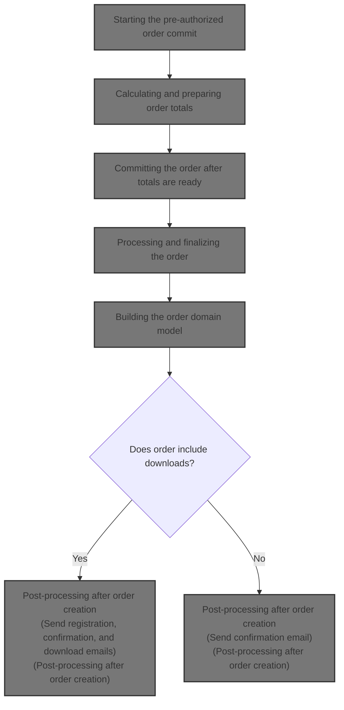

This document outlines the flow for completing a pre-authorized order during checkout. The process validates the order, calculates totals, commits the order, and finalizes customer communication, ensuring a smooth transition from shopping cart to order confirmation.



# Starting the pre-authorized order commit

This section governs the initial steps for committing a pre-authorized order, ensuring that only valid and up-to-date orders are processed.

| Category        | Rule Name                | Description                                                                                                                  |
| --------------- | ------------------------ | ---------------------------------------------------------------------------------------------------------------------------- |
| Data validation | Active order required    | If there is no active order in the session, the user is redirected to a timeout page and the order commit process is halted. |
| Business logic  | Order summary up-to-date | If the order summary is not present in the session, the system must calculate the current order totals before proceeding.    |

<SwmSnippet path="/shopizer/sm-shop/src/main/java/com/salesmanager/web/shop/controller/order/ShoppingOrderController.java" line="328">

---

In <SwmToken path="shopizer/sm-shop/src/main/java/com/salesmanager/web/shop/controller/order/ShoppingOrderController.java" pos="328:5:5" line-data="	public String commitPreAuthorizedOrder(Model model, HttpServletRequest request, HttpServletResponse response, Locale locale) throws Exception {">`commitPreAuthorizedOrder`</SwmToken>, we check for an active order and make sure the order summary is present. If not, we call <SwmToken path="shopizer/sm-shop/src/main/java/com/salesmanager/web/shop/controller/order/ShoppingOrderController.java" pos="345:7:7" line-data="				totalSummary = orderFacade.calculateOrderTotal(store, order, language);">`calculateOrderTotal`</SwmToken> to get current totals before continuing.

```java
	public String commitPreAuthorizedOrder(Model model, HttpServletRequest request, HttpServletResponse response, Locale locale) throws Exception {
		
		MerchantStore store = (MerchantStore)request.getAttribute(Constants.MERCHANT_STORE);
		Language language = (Language)request.getAttribute("LANGUAGE");
		ShopOrder order = super.getSessionAttribute(Constants.ORDER, request);
		if(order==null) {
			StringBuilder template = new StringBuilder().append(ControllerConstants.Tiles.Pages.timeout).append(".").append(store.getStoreTemplate());
			return template.toString();	
		}
		

		
		try {
			
			OrderTotalSummary totalSummary = super.getSessionAttribute(Constants.ORDER_SUMMARY, request);
			
			if(totalSummary==null) {
				totalSummary = orderFacade.calculateOrderTotal(store, order, language);
				super.setSessionAttribute(Constants.ORDER_SUMMARY, totalSummary, request);
			}
			
			
```

---

</SwmSnippet>

## Calculating and preparing order totals

```mermaid
%%{init: {"flowchart": {"defaultRenderer": "elk"}} }%%
flowchart TD
    node1["Start: Retrieve cart and store context"]
    click node1 openCode "shopizer/sm-shop/src/main/java/com/salesmanager/web/shop/controller/order/ShoppingOrderController.java:838:841"
    node1 --> node2{"Is a shipping option selected?"}
    click node2 openCode "shopizer/sm-shop/src/main/java/com/salesmanager/web/shop/controller/order/ShoppingOrderController.java:853:900"
    node2 -->|"Yes"| node3["Find selected shipping option among available options"]
    click node3 openCode "shopizer/sm-shop/src/main/java/com/salesmanager/web/shop/controller/order/ShoppingOrderController.java:871:881"
    node2 -->|"No"| node4["Continue without shipping option"]
    click node4 openCode "shopizer/sm-shop/src/main/java/com/salesmanager/web/shop/controller/order/ShoppingOrderController.java:900:902"
    node3 --> node5["Set shipping summary and options"]
    click node5 openCode "shopizer/sm-shop/src/main/java/com/salesmanager/web/shop/controller/order/ShoppingOrderController.java:888:899"
    node4 --> node5
    node5 --> node6["Set shopping cart items for price calculation"]
    click node6 openCode "shopizer/sm-shop/src/main/java/com/salesmanager/web/shop/controller/order/ShoppingOrderController.java:903:904"
    node6 --> node7["Calculate order total"]
    click node7 openCode "shopizer/sm-shop/src/main/java/com/salesmanager/web/shop/controller/order/ShoppingOrderController.java:906:907"
    node7 --> node8["Populate readable order and shipping summary"]
    click node8 openCode "shopizer/sm-shop/src/main/java/com/salesmanager/web/shop/controller/order/ShoppingOrderController.java:910:913"
    node8 --> node9["Process order totals"]
    click node9 openCode "shopizer/sm-shop/src/main/java/com/salesmanager/web/shop/controller/order/ShoppingOrderController.java:915:925"
    
    subgraph loop1["For each order total"]
        node9 --> node11{"Is this the grand total?"}
        click node11 openCode "shopizer/sm-shop/src/main/java/com/salesmanager/web/shop/controller/order/ShoppingOrderController.java:916:924"
        node11 -->|"No"| node12["Add to subtotals"]
        click node12 openCode "shopizer/sm-shop/src/main/java/com/salesmanager/web/shop/controller/order/ShoppingOrderController.java:917:919"
        node11 -->|"Yes"| node13["Set as grand total"]
        click node13 openCode "shopizer/sm-shop/src/main/java/com/salesmanager/web/shop/controller/order/ShoppingOrderController.java:921:923"
    end
    node9 --> node14["Return readable order"]
    click node14 openCode "shopizer/sm-shop/src/main/java/com/salesmanager/web/shop/controller/order/ShoppingOrderController.java:928:935"

classDef HeadingStyle fill:#777777,stroke:#333,stroke-width:2px;

%% Swimm:
%% %%{init: {"flowchart": {"defaultRenderer": "elk"}} }%%
%% flowchart TD
%%     node1["Start: Retrieve cart and store context"]
%%     click node1 openCode "<SwmPath>[shopizer/…/order/ShoppingOrderController.java](shopizer/sm-shop/src/main/java/com/salesmanager/web/shop/controller/order/ShoppingOrderController.java)</SwmPath>:838:841"
%%     node1 --> node2{"Is a shipping option selected?"}
%%     click node2 openCode "<SwmPath>[shopizer/…/order/ShoppingOrderController.java](shopizer/sm-shop/src/main/java/com/salesmanager/web/shop/controller/order/ShoppingOrderController.java)</SwmPath>:853:900"
%%     node2 -->|"Yes"| node3["Find selected shipping option among available options"]
%%     click node3 openCode "<SwmPath>[shopizer/…/order/ShoppingOrderController.java](shopizer/sm-shop/src/main/java/com/salesmanager/web/shop/controller/order/ShoppingOrderController.java)</SwmPath>:871:881"
%%     node2 -->|"No"| node4["Continue without shipping option"]
%%     click node4 openCode "<SwmPath>[shopizer/…/order/ShoppingOrderController.java](shopizer/sm-shop/src/main/java/com/salesmanager/web/shop/controller/order/ShoppingOrderController.java)</SwmPath>:900:902"
%%     node3 --> node5["Set shipping summary and options"]
%%     click node5 openCode "<SwmPath>[shopizer/…/order/ShoppingOrderController.java](shopizer/sm-shop/src/main/java/com/salesmanager/web/shop/controller/order/ShoppingOrderController.java)</SwmPath>:888:899"
%%     node4 --> node5
%%     node5 --> node6["Set shopping cart items for price calculation"]
%%     click node6 openCode "<SwmPath>[shopizer/…/order/ShoppingOrderController.java](shopizer/sm-shop/src/main/java/com/salesmanager/web/shop/controller/order/ShoppingOrderController.java)</SwmPath>:903:904"
%%     node6 --> node7["Calculate order total"]
%%     click node7 openCode "<SwmPath>[shopizer/…/order/ShoppingOrderController.java](shopizer/sm-shop/src/main/java/com/salesmanager/web/shop/controller/order/ShoppingOrderController.java)</SwmPath>:906:907"
%%     node7 --> node8["Populate readable order and shipping summary"]
%%     click node8 openCode "<SwmPath>[shopizer/…/order/ShoppingOrderController.java](shopizer/sm-shop/src/main/java/com/salesmanager/web/shop/controller/order/ShoppingOrderController.java)</SwmPath>:910:913"
%%     node8 --> node9["Process order totals"]
%%     click node9 openCode "<SwmPath>[shopizer/…/order/ShoppingOrderController.java](shopizer/sm-shop/src/main/java/com/salesmanager/web/shop/controller/order/ShoppingOrderController.java)</SwmPath>:915:925"
%%     
%%     subgraph loop1["For each order total"]
%%         node9 --> node11{"Is this the grand total?"}
%%         click node11 openCode "<SwmPath>[shopizer/…/order/ShoppingOrderController.java](shopizer/sm-shop/src/main/java/com/salesmanager/web/shop/controller/order/ShoppingOrderController.java)</SwmPath>:916:924"
%%         node11 -->|"No"| node12["Add to subtotals"]
%%         click node12 openCode "<SwmPath>[shopizer/…/order/ShoppingOrderController.java](shopizer/sm-shop/src/main/java/com/salesmanager/web/shop/controller/order/ShoppingOrderController.java)</SwmPath>:917:919"
%%         node11 -->|"Yes"| node13["Set as grand total"]
%%         click node13 openCode "<SwmPath>[shopizer/…/order/ShoppingOrderController.java](shopizer/sm-shop/src/main/java/com/salesmanager/web/shop/controller/order/ShoppingOrderController.java)</SwmPath>:921:923"
%%     end
%%     node9 --> node14["Return readable order"]
%%     click node14 openCode "<SwmPath>[shopizer/…/order/ShoppingOrderController.java](shopizer/sm-shop/src/main/java/com/salesmanager/web/shop/controller/order/ShoppingOrderController.java)</SwmPath>:928:935"
%% 
%% classDef HeadingStyle fill:#777777,stroke:#333,stroke-width:2px;
```



This section is responsible for calculating and preparing the order totals, including subtotals, grand total, and shipping summary, so that the user can see a detailed breakdown of their order before checkout.

| Category        | Rule Name                           | Description                                                                                                                                                                                                                                                                                                                                                                    |
| --------------- | ----------------------------------- | ------------------------------------------------------------------------------------------------------------------------------------------------------------------------------------------------------------------------------------------------------------------------------------------------------------------------------------------------------------------------------ |
| Data validation | Cart existence validation           | If no shopping cart code exists in the session, the calculation cannot proceed and an error message must be returned.                                                                                                                                                                                                                                                          |
| Business logic  | Shipping option selection           | If a shipping option is selected, the selected option must be matched against available shipping options. If the selected option is not found, the first available option is used by default.                                                                                                                                                                                  |
| Business logic  | Subtotal and grand total separation | The order totals must be separated into subtotals and a grand total, using the constant <SwmToken path="shopizer/sm-shop/src/main/java/com/salesmanager/web/shop/controller/order/ShoppingOrderController.java" pos="916:13:17" line-data="				if(!total.getOrderTotalCode().equals(&quot;order.total.total&quot;)) {">`order.total.total`</SwmToken> to identify the grand total. |
| Business logic  | Complete order summary output       | The returned order summary must include all relevant information: subtotals, grand total, shipping summary, and any error messages, so the frontend can display a complete order breakdown.                                                                                                                                                                                    |

<SwmSnippet path="/shopizer/sm-shop/src/main/java/com/salesmanager/web/shop/controller/order/ShoppingOrderController.java" line="836">

---

In <SwmToken path="shopizer/sm-shop/src/main/java/com/salesmanager/web/shop/controller/order/ShoppingOrderController.java" pos="836:8:8" line-data="	public @ResponseBody ReadableShopOrder calculateOrderTotal(@ModelAttribute(value=&quot;order&quot;) ShopOrder order, HttpServletRequest request, HttpServletResponse response, Locale locale) throws Exception {">`calculateOrderTotal`</SwmToken>, we grab language, store, and cart code from the session, then rebuild the shopping cart model. We populate a readable order DTO, and if a shipping option is picked, we fetch shipping summary/options, match the selected option, and update the order and summary. Cart items are set, then we call the facade to get totals, storing the summary in session and populating subtotals/grand total for the frontend.

```java
	public @ResponseBody ReadableShopOrder calculateOrderTotal(@ModelAttribute(value="order") ShopOrder order, HttpServletRequest request, HttpServletResponse response, Locale locale) throws Exception {
		
		Language language = (Language)request.getAttribute("LANGUAGE");
		MerchantStore store = (MerchantStore)request.getAttribute(Constants.MERCHANT_STORE);
		String shoppingCartCode  = getSessionAttribute(Constants.SHOPPING_CART, request);
		
		Validate.notNull(shoppingCartCode,"shoppingCartCode does not exist in the session");
		
		ReadableShopOrder readableOrder = new ReadableShopOrder();
		try {

			//re-generate cart
			com.salesmanager.core.business.shoppingcart.model.ShoppingCart cart = shoppingCartFacade.getShoppingCartModel(shoppingCartCode, store);

			ReadableShopOrderPopulator populator = new ReadableShopOrderPopulator();
			populator.populate(order, readableOrder, store, language);

			if(order.getSelectedShippingOption()!=null) {
						ShippingSummary summary = (ShippingSummary)request.getSession().getAttribute(Constants.SHIPPING_SUMMARY);
						@SuppressWarnings("unchecked")
						List<ShippingOption> options = (List<ShippingOption>)request.getSession().getAttribute(Constants.SHIPPING_OPTIONS);
						
						
						order.setShippingSummary(summary);//for total calculation
						
						
						ReadableShippingSummary readableSummary = new ReadableShippingSummary();
						ReadableShippingSummaryPopulator readableSummaryPopulator = new ReadableShippingSummaryPopulator();
						readableSummaryPopulator.setPricingService(pricingService);
						readableSummaryPopulator.populate(summary, readableSummary, store, language);
						
						
						if(!CollectionUtils.isEmpty(options)) {
						
							//get submitted shipping option
							ShippingOption quoteOption = null;
							ShippingOption selectedOption = order.getSelectedShippingOption();

							
							
							//check if selectedOption exist
							for(ShippingOption shipOption : options) {
								if(!StringUtils.isBlank(shipOption.getOptionId()) && shipOption.getOptionId().equals(selectedOption.getOptionId())) {
									quoteOption = shipOption;
								}
							}
```

---

</SwmSnippet>

<SwmSnippet path="/shopizer/sm-shop/src/main/java/com/salesmanager/web/shop/controller/order/ShoppingOrderController.java" line="883">

---

We separate subtotals from the grand total using a string constant, so the frontend gets both breakdowns and the final amount.

```java
							if(quoteOption==null) {
								quoteOption = options.get(0);
							}
							
							
							readableSummary.setSelectedShippingOption(quoteOption);
							readableSummary.setShippingOptions(options);
							

							summary.setShippingOption(quoteOption.getOptionId());
							summary.setShipping(quoteOption.getOptionPrice());
						
						}

						
						readableOrder.setShippingSummary(readableSummary);

			}
			
			//set list of shopping cart items for core price calculation
			List<ShoppingCartItem> items = new ArrayList<ShoppingCartItem>(cart.getLineItems());
			order.setShoppingCartItems(items);
			
			OrderTotalSummary orderTotalSummary = orderFacade.calculateOrderTotal(store, order, language);
			super.setSessionAttribute(Constants.ORDER_SUMMARY, orderTotalSummary, request);
			
			
			ReadableOrderTotalPopulator totalPopulator = new ReadableOrderTotalPopulator();
			totalPopulator.setMessages(messages);
			totalPopulator.setPricingService(pricingService);

			List<ReadableOrderTotal> subtotals = new ArrayList<ReadableOrderTotal>();
			for(OrderTotal total : orderTotalSummary.getTotals()) {
				if(!total.getOrderTotalCode().equals("order.total.total")) {
					ReadableOrderTotal t = new ReadableOrderTotal();
					totalPopulator.populate(total, t, store, language);
					subtotals.add(t);
				} else {//grand total
					ReadableOrderTotal ot = new ReadableOrderTotal();
					totalPopulator.populate(total, ot, store, language);
					readableOrder.setGrandTotal(ot.getTotal());
				}
			}
```

---

</SwmSnippet>

<SwmSnippet path="/shopizer/sm-shop/src/main/java/com/salesmanager/web/shop/controller/order/ShoppingOrderController.java" line="928">

---

Finally, we return a <SwmToken path="shopizer/sm-shop/src/main/java/com/salesmanager/web/shop/controller/order/ShoppingOrderController.java" pos="836:6:6" line-data="	public @ResponseBody ReadableShopOrder calculateOrderTotal(@ModelAttribute(value=&quot;order&quot;) ShopOrder order, HttpServletRequest request, HttpServletResponse response, Locale locale) throws Exception {">`ReadableShopOrder`</SwmToken> with all subtotals, grand total, shipping summary, and error info if needed. This object is ready for the frontend to show the user a complete order breakdown.

```java
			readableOrder.setSubTotals(subtotals);
		
		} catch(Exception e) {
			LOGGER.error("Error while getting shipping quotes",e);
			readableOrder.setErrorMessage(messages.getMessage("message.error", locale));
		}
		
		return readableOrder;
	}
```

---

</SwmSnippet>

## Committing the order after totals are ready

<SwmSnippet path="/shopizer/sm-shop/src/main/java/com/salesmanager/web/shop/controller/order/ShoppingOrderController.java" line="350">

---

Back in <SwmToken path="shopizer/sm-shop/src/main/java/com/salesmanager/web/shop/controller/order/ShoppingOrderController.java" pos="328:5:5" line-data="	public String commitPreAuthorizedOrder(Model model, HttpServletRequest request, HttpServletResponse response, Locale locale) throws Exception {">`commitPreAuthorizedOrder`</SwmToken>, after getting the totals, we attach them to the order and call <SwmToken path="shopizer/sm-shop/src/main/java/com/salesmanager/web/shop/controller/order/ShoppingOrderController.java" pos="353:9:9" line-data="			Order orderModel = this.commitOrder(order, request, locale);">`commitOrder`</SwmToken> to actually process and save the order. Once that's done, we store the order ID in the session and redirect to the confirmation page.

```java
			order.setOrderTotalSummary(totalSummary);
			
			//already validated, proceed with commit
			Order orderModel = this.commitOrder(order, request, locale);
			super.setSessionAttribute(Constants.ORDER_ID, orderModel.getId(), request);
			
			return "redirect://shop/order/confirmation.html";
			
		} catch(Exception e) {
			LOGGER.error("Error while commiting order",e);
			throw e;		
			
		}

	}
```

---

</SwmSnippet>

# Processing and finalizing the order

This section governs the business rules for processing and finalizing a customer's order, including customer authentication, address handling, and order creation.

| Category       | Rule Name                            | Description                                                                                                                            |
| -------------- | ------------------------------------ | -------------------------------------------------------------------------------------------------------------------------------------- |
| Business logic | Authenticated customer account usage | If the customer is authenticated, their existing account information (username, password, ID) must be used for the order.              |
| Business logic | New customer password generation     | If the customer is new (no ID or ID is zero), a random password must be generated and securely encoded for the new account.            |
| Business logic | Ship to billing address              | If the customer chooses to ship to their billing address, the delivery address must be set to match the billing address.               |
| Business logic | Volatile customer account creation   | If the customer is not authenticated, a new customer account must be created and persisted before processing the order.                |
| Business logic | Initial transaction inclusion        | If an initial transaction exists in the session, it must be included in the order processing; otherwise, process the order without it. |

<SwmSnippet path="/shopizer/sm-shop/src/main/java/com/salesmanager/web/shop/controller/order/ShoppingOrderController.java" line="367">

---

In <SwmToken path="shopizer/sm-shop/src/main/java/com/salesmanager/web/shop/controller/order/ShoppingOrderController.java" pos="367:5:5" line-data="	private Order commitOrder(ShopOrder order, HttpServletRequest request, Locale locale) throws Exception, ServiceException {">`commitOrder`</SwmToken>, we prep the customer object, handle authentication, and set up billing/delivery info. Then we call <SwmToken path="shopizer/sm-shop/src/main/java/com/salesmanager/web/shop/controller/order/ShoppingOrderController.java" pos="427:3:5" line-data="	        	modelOrder=orderFacade.processOrder(order, modelCustomer, initialTransaction, store, language);">`orderFacade.processOrder`</SwmToken> to actually create and process the order, passing all the necessary data.

```java
	private Order commitOrder(ShopOrder order, HttpServletRequest request, Locale locale) throws Exception, ServiceException {
		
		
			MerchantStore store = (MerchantStore)request.getAttribute(Constants.MERCHANT_STORE);
			Language language = (Language)request.getAttribute("LANGUAGE");
			
			
			String userName = null;
			String password = null;
			
			PersistableCustomer customer = order.getCustomer();
			
	        /** set username and password to persistable object **/
			Authentication auth = SecurityContextHolder.getContext().getAuthentication();
			Customer authCustomer = null;
        	if(auth != null &&
	        		 request.isUserInRole("AUTH_CUSTOMER")) {
        		authCustomer = customerFacade.getCustomerByUserName(auth.getName(), store);
        		//set id and authentication information
        		customer.setUserName(authCustomer.getNick());
        		customer.setEncodedPassword(authCustomer.getPassword());
        		customer.setId(authCustomer.getId());
	        } else {
	        	//set customer id to null
	        	customer.setId(null);
	        }
		
	        //if the customer is new, generate a password
	        if(customer.getId()==null || customer.getId()==0) {//new customer
	        	password = UserReset.generateRandomString();
	        	String encodedPassword = passwordEncoder.encodePassword(password, null);
	        	customer.setEncodedPassword(encodedPassword);
	        }
	        
	        if(order.isShipToBillingAdress()) {
	        	customer.setDelivery(customer.getBilling());
	        }
	        


			Customer modelCustomer = null;
			try {//set groups
				if(authCustomer==null) {//not authenticated, create a new volatile user
					modelCustomer = customerFacade.getCustomerModel(customer, store, language);
					customerFacade.setCustomerModelDefaultProperties(modelCustomer, store);
					userName = modelCustomer.getNick();
					LOGGER.debug( "About to persist volatile customer to database." );
			        customerService.saveOrUpdate( modelCustomer );
				} else {//use existing customer
					modelCustomer = customerFacade.populateCustomerModel(authCustomer, customer, store, language);
				}
			} catch(Exception e) {
				throw new ServiceException(e);
			}
	        
           
	        
	        Order modelOrder = null;
	        Transaction initialTransaction = (Transaction)super.getSessionAttribute(Constants.INIT_TRANSACTION_KEY, request);
	        if(initialTransaction!=null) {
	        	modelOrder=orderFacade.processOrder(order, modelCustomer, initialTransaction, store, language);
	        } else {
	        	modelOrder=orderFacade.processOrder(order, modelCustomer, store, language);
	        }
	        
```

---

</SwmSnippet>

## Delegating order processing to the facade

This section is responsible for delegating the order processing request to the main order processing logic, ensuring that all necessary information is passed along for the order to be processed correctly.

| Category        | Rule Name                        | Description                                                                                                              |
| --------------- | -------------------------------- | ------------------------------------------------------------------------------------------------------------------------ |
| Data validation | Customer association requirement | An order must be associated with a valid customer before it can be processed.                                            |
| Data validation | Store association requirement    | An order must be linked to a valid merchant store to ensure correct inventory, pricing, and fulfillment.                 |
| Data validation | Language context enforcement     | The language context must be specified to ensure that order communications and processing are localized appropriately.   |
| Business logic  | Delegation to main logic         | Order processing must be delegated to the main order processing logic to ensure consistency and reuse of business rules. |

<SwmSnippet path="/shopizer/sm-shop/src/main/java/com/salesmanager/web/shop/controller/order/facade/OrderFacadeImpl.java" line="252">

---

This method just delegates to the main order processing logic.

```java
	public Order processOrder(ShopOrder order, Customer customer, MerchantStore store,
			Language language) throws ServiceException {
				
		return this.processOrderModel(order, customer, null, store, language);

	}
```

---

</SwmSnippet>

## Building the order domain model

```mermaid
%%{init: {"flowchart": {"defaultRenderer": "elk"}} }%%
flowchart TD
    node1["Start order processing"]
    click node1 openCode "shopizer/sm-shop/src/main/java/com/salesmanager/web/shop/controller/order/facade/OrderFacadeImpl.java:267:272"
    node1 --> node2{"Ship to billing address?"}
    click node2 openCode "shopizer/sm-shop/src/main/java/com/salesmanager/web/shop/controller/order/facade/OrderFacadeImpl.java:272:276"
    node2 -->|"Yes"| node3["Set delivery address to billing address"]
    click node3 openCode "shopizer/sm-shop/src/main/java/com/salesmanager/web/shop/controller/order/facade/OrderFacadeImpl.java:272:276"
    node2 -->|"No"| node4["Use provided delivery address"]
    click node4 openCode "shopizer/sm-shop/src/main/java/com/salesmanager/web/shop/controller/order/facade/OrderFacadeImpl.java:277:281"
    node3 --> node5["Create order and set details"]
    node4 --> node5
    click node5 openCode "shopizer/sm-shop/src/main/java/com/salesmanager/web/shop/controller/order/facade/OrderFacadeImpl.java:281:289"
    
    subgraph loop1["For each item in shopping cart"]
      node5 --> node6["Add item as order product"]
      click node6 openCode "shopizer/sm-shop/src/main/java/com/salesmanager/web/shop/controller/order/facade/OrderFacadeImpl.java:298:303"
      node6 --> node7["Continue for next item"]
      click node7 openCode "shopizer/sm-shop/src/main/java/com/salesmanager/web/shop/controller/order/facade/OrderFacadeImpl.java:298:303"
    end
    node7 --> node8["Set all order products in order"]
    click node8 openCode "shopizer/sm-shop/src/main/java/com/salesmanager/web/shop/controller/order/facade/OrderFacadeImpl.java:305:305"
    node8 --> node9["Sort and associate order totals"]
    click node9 openCode "shopizer/sm-shop/src/main/java/com/salesmanager/web/shop/controller/order/facade/OrderFacadeImpl.java:307:326"
    
    subgraph loop2["For each order total"]
      node9 --> node10["Associate total with order"]
      click node10 openCode "shopizer/sm-shop/src/main/java/com/salesmanager/web/shop/controller/order/facade/OrderFacadeImpl.java:323:326"
      node10 --> node11["Continue for next total"]
      click node11 openCode "shopizer/sm-shop/src/main/java/com/salesmanager/web/shop/controller/order/facade/OrderFacadeImpl.java:323:326"
    end
    node11 --> node12["Set totals and summary in order"]
    click node12 openCode "shopizer/sm-shop/src/main/java/com/salesmanager/web/shop/controller/order/facade/OrderFacadeImpl.java:328:329"
    node12 --> node13["Set currency, merchant, customer info"]
    click node13 openCode "shopizer/sm-shop/src/main/java/com/salesmanager/web/shop/controller/order/facade/OrderFacadeImpl.java:332:338"
    node13 --> node14{"Payment method?"}
    click node14 openCode "shopizer/sm-shop/src/main/java/com/salesmanager/web/shop/controller/order/facade/OrderFacadeImpl.java:345:348"
    node14 -->|"Credit Card"| node15{"Credit card type?"}
    click node15 openCode "shopizer/sm-shop/src/main/java/com/salesmanager/web/shop/controller/order/facade/OrderFacadeImpl.java:360:372"
    node15 -->|"AMEX/VISA/MC/etc."| node16["Set credit card details and mask number"]
    click node16 openCode "shopizer/sm-shop/src/main/java/com/salesmanager/web/shop/controller/order/facade/OrderFacadeImpl.java:353:388"
    node14 -->|"PayPal"| node17{"Transaction present?"}
    click node17 openCode "shopizer/sm-shop/src/main/java/com/salesmanager/web/shop/controller/order/facade/OrderFacadeImpl.java:395:397"
    node17 -->|"Yes"| node18["Set PayPal details"]
    click node18 openCode "shopizer/sm-shop/src/main/java/com/salesmanager/web/shop/controller/order/facade/OrderFacadeImpl.java:399:402"
    node14 -->|"Other"| node19["Set payment module"]
    click node19 openCode "shopizer/sm-shop/src/main/java/com/salesmanager/web/shop/controller/order/facade/OrderFacadeImpl.java:408:409"
    node16 --> node20{"Transaction present?"}
    node18 --> node20
    node19 --> node20
    click node20 openCode "shopizer/sm-shop/src/main/java/com/salesmanager/web/shop/controller/order/facade/OrderFacadeImpl.java:411:415"
    node20 -->|"Yes"| node21["Process order (with transaction)"]
    click node21 openCode "shopizer/sm-shop/src/main/java/com/salesmanager/web/shop/controller/order/facade/OrderFacadeImpl.java:412:412"
    node20 -->|"No"| node22["Process order (without transaction)"]
    click node22 openCode "shopizer/sm-shop/src/main/java/com/salesmanager/web/shop/controller/order/facade/OrderFacadeImpl.java:414:414"
    node21 --> node23["Return finalized order"]
    click node23 openCode "shopizer/sm-shop/src/main/java/com/salesmanager/web/shop/controller/order/facade/OrderFacadeImpl.java:419:419"
    node22 --> node23

classDef HeadingStyle fill:#777777,stroke:#333,stroke-width:2px;

%% Swimm:
%% %%{init: {"flowchart": {"defaultRenderer": "elk"}} }%%
%% flowchart TD
%%     node1["Start order processing"]
%%     click node1 openCode "<SwmPath>[shopizer/…/facade/OrderFacadeImpl.java](shopizer/sm-shop/src/main/java/com/salesmanager/web/shop/controller/order/facade/OrderFacadeImpl.java)</SwmPath>:267:272"
%%     node1 --> node2{"Ship to billing address?"}
%%     click node2 openCode "<SwmPath>[shopizer/…/facade/OrderFacadeImpl.java](shopizer/sm-shop/src/main/java/com/salesmanager/web/shop/controller/order/facade/OrderFacadeImpl.java)</SwmPath>:272:276"
%%     node2 -->|"Yes"| node3["Set delivery address to billing address"]
%%     click node3 openCode "<SwmPath>[shopizer/…/facade/OrderFacadeImpl.java](shopizer/sm-shop/src/main/java/com/salesmanager/web/shop/controller/order/facade/OrderFacadeImpl.java)</SwmPath>:272:276"
%%     node2 -->|"No"| node4["Use provided delivery address"]
%%     click node4 openCode "<SwmPath>[shopizer/…/facade/OrderFacadeImpl.java](shopizer/sm-shop/src/main/java/com/salesmanager/web/shop/controller/order/facade/OrderFacadeImpl.java)</SwmPath>:277:281"
%%     node3 --> node5["Create order and set details"]
%%     node4 --> node5
%%     click node5 openCode "<SwmPath>[shopizer/…/facade/OrderFacadeImpl.java](shopizer/sm-shop/src/main/java/com/salesmanager/web/shop/controller/order/facade/OrderFacadeImpl.java)</SwmPath>:281:289"
%%     
%%     subgraph loop1["For each item in shopping cart"]
%%       node5 --> node6["Add item as order product"]
%%       click node6 openCode "<SwmPath>[shopizer/…/facade/OrderFacadeImpl.java](shopizer/sm-shop/src/main/java/com/salesmanager/web/shop/controller/order/facade/OrderFacadeImpl.java)</SwmPath>:298:303"
%%       node6 --> node7["Continue for next item"]
%%       click node7 openCode "<SwmPath>[shopizer/…/facade/OrderFacadeImpl.java](shopizer/sm-shop/src/main/java/com/salesmanager/web/shop/controller/order/facade/OrderFacadeImpl.java)</SwmPath>:298:303"
%%     end
%%     node7 --> node8["Set all order products in order"]
%%     click node8 openCode "<SwmPath>[shopizer/…/facade/OrderFacadeImpl.java](shopizer/sm-shop/src/main/java/com/salesmanager/web/shop/controller/order/facade/OrderFacadeImpl.java)</SwmPath>:305:305"
%%     node8 --> node9["Sort and associate order totals"]
%%     click node9 openCode "<SwmPath>[shopizer/…/facade/OrderFacadeImpl.java](shopizer/sm-shop/src/main/java/com/salesmanager/web/shop/controller/order/facade/OrderFacadeImpl.java)</SwmPath>:307:326"
%%     
%%     subgraph loop2["For each order total"]
%%       node9 --> node10["Associate total with order"]
%%       click node10 openCode "<SwmPath>[shopizer/…/facade/OrderFacadeImpl.java](shopizer/sm-shop/src/main/java/com/salesmanager/web/shop/controller/order/facade/OrderFacadeImpl.java)</SwmPath>:323:326"
%%       node10 --> node11["Continue for next total"]
%%       click node11 openCode "<SwmPath>[shopizer/…/facade/OrderFacadeImpl.java](shopizer/sm-shop/src/main/java/com/salesmanager/web/shop/controller/order/facade/OrderFacadeImpl.java)</SwmPath>:323:326"
%%     end
%%     node11 --> node12["Set totals and summary in order"]
%%     click node12 openCode "<SwmPath>[shopizer/…/facade/OrderFacadeImpl.java](shopizer/sm-shop/src/main/java/com/salesmanager/web/shop/controller/order/facade/OrderFacadeImpl.java)</SwmPath>:328:329"
%%     node12 --> node13["Set currency, merchant, customer info"]
%%     click node13 openCode "<SwmPath>[shopizer/…/facade/OrderFacadeImpl.java](shopizer/sm-shop/src/main/java/com/salesmanager/web/shop/controller/order/facade/OrderFacadeImpl.java)</SwmPath>:332:338"
%%     node13 --> node14{"Payment method?"}
%%     click node14 openCode "<SwmPath>[shopizer/…/facade/OrderFacadeImpl.java](shopizer/sm-shop/src/main/java/com/salesmanager/web/shop/controller/order/facade/OrderFacadeImpl.java)</SwmPath>:345:348"
%%     node14 -->|"Credit Card"| node15{"Credit card type?"}
%%     click node15 openCode "<SwmPath>[shopizer/…/facade/OrderFacadeImpl.java](shopizer/sm-shop/src/main/java/com/salesmanager/web/shop/controller/order/facade/OrderFacadeImpl.java)</SwmPath>:360:372"
%%     node15 -->|"AMEX/VISA/MC/etc."| node16["Set credit card details and mask number"]
%%     click node16 openCode "<SwmPath>[shopizer/…/facade/OrderFacadeImpl.java](shopizer/sm-shop/src/main/java/com/salesmanager/web/shop/controller/order/facade/OrderFacadeImpl.java)</SwmPath>:353:388"
%%     node14 -->|"PayPal"| node17{"Transaction present?"}
%%     click node17 openCode "<SwmPath>[shopizer/…/facade/OrderFacadeImpl.java](shopizer/sm-shop/src/main/java/com/salesmanager/web/shop/controller/order/facade/OrderFacadeImpl.java)</SwmPath>:395:397"
%%     node17 -->|"Yes"| node18["Set PayPal details"]
%%     click node18 openCode "<SwmPath>[shopizer/…/facade/OrderFacadeImpl.java](shopizer/sm-shop/src/main/java/com/salesmanager/web/shop/controller/order/facade/OrderFacadeImpl.java)</SwmPath>:399:402"
%%     node14 -->|"Other"| node19["Set payment module"]
%%     click node19 openCode "<SwmPath>[shopizer/…/facade/OrderFacadeImpl.java](shopizer/sm-shop/src/main/java/com/salesmanager/web/shop/controller/order/facade/OrderFacadeImpl.java)</SwmPath>:408:409"
%%     node16 --> node20{"Transaction present?"}
%%     node18 --> node20
%%     node19 --> node20
%%     click node20 openCode "<SwmPath>[shopizer/…/facade/OrderFacadeImpl.java](shopizer/sm-shop/src/main/java/com/salesmanager/web/shop/controller/order/facade/OrderFacadeImpl.java)</SwmPath>:411:415"
%%     node20 -->|"Yes"| node21["Process order (with transaction)"]
%%     click node21 openCode "<SwmPath>[shopizer/…/facade/OrderFacadeImpl.java](shopizer/sm-shop/src/main/java/com/salesmanager/web/shop/controller/order/facade/OrderFacadeImpl.java)</SwmPath>:412:412"
%%     node20 -->|"No"| node22["Process order (without transaction)"]
%%     click node22 openCode "<SwmPath>[shopizer/…/facade/OrderFacadeImpl.java](shopizer/sm-shop/src/main/java/com/salesmanager/web/shop/controller/order/facade/OrderFacadeImpl.java)</SwmPath>:414:414"
%%     node21 --> node23["Return finalized order"]
%%     click node23 openCode "<SwmPath>[shopizer/…/facade/OrderFacadeImpl.java](shopizer/sm-shop/src/main/java/com/salesmanager/web/shop/controller/order/facade/OrderFacadeImpl.java)</SwmPath>:419:419"
%%     node22 --> node23
%% 
%% classDef HeadingStyle fill:#777777,stroke:#333,stroke-width:2px;
```



This section is responsible for building the order domain model from the provided shopping cart and customer data, ensuring all relevant details are correctly set and validated before finalizing the order.

| Category        | Rule Name                      | Description                                                                                                                      |
| --------------- | ------------------------------ | -------------------------------------------------------------------------------------------------------------------------------- |
| Data validation | Credit Card Masking            | If the payment method is credit card, the order must include masked credit card details and card type.                           |
| Data validation | PayPal Transaction Requirement | If the payment method is PayPal, a valid transaction must be present; otherwise, the order cannot be processed.                  |
| Business logic  | Ship to Billing Address        | If the customer chooses to ship to their billing address, the delivery address for the order must be set to the billing address. |
| Business logic  | Cart Item Conversion           | Each item in the shopping cart must be converted into an order product and associated with the order.                            |
| Business logic  | Order Total Sorting            | Order totals must be sorted by their defined sort order before being associated with the order.                                  |
| Business logic  | Order Summary Details          | The order must include the total amount, currency, merchant, and customer information as provided.                               |
| Business logic  | Payment Module Selection       | The order must be processed using the selected payment module and method, with all relevant details passed for finalization.     |

<SwmSnippet path="/shopizer/sm-shop/src/main/java/com/salesmanager/web/shop/controller/order/facade/OrderFacadeImpl.java" line="267">

---

In <SwmToken path="shopizer/sm-shop/src/main/java/com/salesmanager/web/shop/controller/order/facade/OrderFacadeImpl.java" pos="267:5:5" line-data="	private Order processOrderModel(ShopOrder order, Customer customer, Transaction transaction, MerchantStore store,">`processOrderModel`</SwmToken>, if shipping is set to billing, we copy the address. Then we build the order object, convert cart items to order products using a populator, and link them to the order. This sets up all the products for the order domain model.

```java
	private Order processOrderModel(ShopOrder order, Customer customer, Transaction transaction, MerchantStore store,
			Language language) throws ServiceException {
		
		try {
			
			if(order.isShipToBillingAdress()) {//customer shipping is billing
				PersistableCustomer orderCustomer = order.getCustomer();
				Address billing = orderCustomer.getBilling();
				orderCustomer.setDelivery(billing);
			}

 

			
			Order modelOrder = new Order();
			modelOrder.setDatePurchased(new Date());
			modelOrder.setBilling(customer.getBilling());
			modelOrder.setDelivery(customer.getDelivery());
			modelOrder.setPaymentModuleCode(order.getPaymentModule());
			modelOrder.setPaymentType(PaymentType.valueOf(order.getPaymentMethodType()));
			modelOrder.setShippingModuleCode(order.getShippingModule());
			modelOrder.setLocale(LocaleUtils.getLocale(store));//set the store locale based on the country for order $ formatting
	
			List<ShoppingCartItem> shoppingCartItems = order.getShoppingCartItems();
			Set<OrderProduct> orderProducts = new LinkedHashSet<OrderProduct>();
			
			OrderProductPopulator orderProductPopulator = new OrderProductPopulator();
			orderProductPopulator.setDigitalProductService(digitalProductService);
			orderProductPopulator.setProductAttributeService(productAttributeService);
			orderProductPopulator.setProductService(productService);
			
			for(ShoppingCartItem item : shoppingCartItems) {
				OrderProduct orderProduct = new OrderProduct();
				orderProduct = orderProductPopulator.populate(item, orderProduct , store, language);
				orderProduct.setOrder(modelOrder);
				orderProducts.add(orderProduct);
			}
```

---

</SwmSnippet>

<SwmSnippet path="/shopizer/sm-shop/src/main/java/com/salesmanager/web/shop/controller/order/facade/OrderFacadeImpl.java" line="305">

---

We sort and attach order totals so they're always in the right order.

```java
			modelOrder.setOrderProducts(orderProducts);
			
			OrderTotalSummary summary = order.getOrderTotalSummary();
			List<com.salesmanager.core.business.order.model.OrderTotal> totals = summary.getTotals();

			//re-order totals
			Collections.sort(
					totals,
					new Comparator<com.salesmanager.core.business.order.model.OrderTotal>() {
					       public int compare(com.salesmanager.core.business.order.model.OrderTotal x, com.salesmanager.core.business.order.model.OrderTotal y) {
					            if(x.getSortOrder()==y.getSortOrder())
					            	return 0;
					            return x.getSortOrder() < y.getSortOrder() ? -1 : 1;
					        }
				
			});
			
			Set<com.salesmanager.core.business.order.model.OrderTotal> modelTotals = new LinkedHashSet<com.salesmanager.core.business.order.model.OrderTotal>();
			for(com.salesmanager.core.business.order.model.OrderTotal total : totals) {
				total.setOrder(modelOrder);
				modelTotals.add(total);
			}
```

---

</SwmSnippet>

<SwmSnippet path="/shopizer/sm-shop/src/main/java/com/salesmanager/web/shop/controller/order/facade/OrderFacadeImpl.java" line="328">

---

After setting totals, we set payment details based on the method (credit card or PayPal), mask sensitive info, and call <SwmToken path="shopizer/sm-shop/src/main/java/com/salesmanager/web/shop/controller/order/facade/OrderFacadeImpl.java" pos="412:1:1" line-data="				orderService.processOrder(modelOrder, customer, order.getShoppingCartItems(), summary, payment, store);">`orderService`</SwmToken> to process everything. The fully built order model is returned for further use.

```java
			modelOrder.setOrderTotal(modelTotals);
			modelOrder.setTotal(order.getOrderTotalSummary().getTotal());
	
			//order misc objects
			modelOrder.setCurrency(store.getCurrency());
			modelOrder.setMerchant(store);

			
			
			//customer object
			orderCustomer(customer, modelOrder, language);
			
			//populate shipping information
			if(!StringUtils.isBlank(order.getShippingModule())) {
				modelOrder.setShippingModuleCode(order.getShippingModule());
			}
			
			String paymentType = order.getPaymentMethodType();
			Payment payment = new Payment();
			payment.setPaymentType(PaymentType.valueOf(paymentType));
			if(PaymentType.CREDITCARD.name().equals(paymentType)) {
				
				
				
				payment = new CreditCardPayment();
				((CreditCardPayment)payment).setCardOwner(order.getPayment().get("creditcard_card_holder"));
				((CreditCardPayment)payment).setCredidCardValidationNumber(order.getPayment().get("creditcard_card_cvv"));
				((CreditCardPayment)payment).setCreditCardNumber(order.getPayment().get("creditcard_card_number"));
				((CreditCardPayment)payment).setExpirationMonth(order.getPayment().get("creditcard_card_expirationmonth"));
				((CreditCardPayment)payment).setExpirationYear(order.getPayment().get("creditcard_card_expirationyear"));
				
				CreditCardType creditCardType =null;
				String cardType = order.getPayment().get("creditcard_card_type");
				
				if(cardType.equalsIgnoreCase(CreditCardType.AMEX.name())) {
					creditCardType = CreditCardType.AMEX;
				} else if(cardType.equalsIgnoreCase(CreditCardType.VISA.name())) {
					creditCardType = CreditCardType.VISA;
				} else if(cardType.equalsIgnoreCase(CreditCardType.MASTERCARD.name())) {
					creditCardType = CreditCardType.MASTERCARD;
				} else if(cardType.equalsIgnoreCase(CreditCardType.DINERS.name())) {
					creditCardType = CreditCardType.DINERS;
				} else if(cardType.equalsIgnoreCase(CreditCardType.DISCOVERY.name())) {
					creditCardType = CreditCardType.DISCOVERY;
				}
				

				
				
				((CreditCardPayment)payment).setCreditCard(creditCardType);
			
				CreditCard cc = new CreditCard();
				cc.setCardType(creditCardType);
				cc.setCcCvv(((CreditCardPayment)payment).getCredidCardValidationNumber());
				cc.setCcOwner(((CreditCardPayment)payment).getCardOwner());
				cc.setCcExpires(((CreditCardPayment)payment).getExpirationMonth() + "-" + ((CreditCardPayment)payment).getExpirationYear());
			
				//hash credit card number
				String maskedNumber = CreditCardUtils.maskCardNumber(order.getPayment().get("creditcard_card_number"));
				cc.setCcNumber(maskedNumber);
				modelOrder.setCreditCard(cc);

			}
			
			if(PaymentType.PAYPAL.name().equals(paymentType)) {
				
				//check for previous transaction
				if(transaction==null) {
					throw new ServiceException("payment.error");
				}
				
				payment = new com.salesmanager.core.business.payments.model.PaypalPayment();
				
				((com.salesmanager.core.business.payments.model.PaypalPayment)payment).setPayerId(transaction.getTransactionDetails().get("PAYERID"));
				((com.salesmanager.core.business.payments.model.PaypalPayment)payment).setPaymentToken(transaction.getTransactionDetails().get("TOKEN"));
				
				
			}
			

			modelOrder.setPaymentModuleCode(order.getPaymentModule());
			payment.setModuleName(order.getPaymentModule());

			if(transaction!=null) {
				orderService.processOrder(modelOrder, customer, order.getShoppingCartItems(), summary, payment, store);
			} else {
				orderService.processOrder(modelOrder, customer, order.getShoppingCartItems(), summary, payment, transaction, store);
			}
			

			
			return modelOrder;
		
		} catch(ServiceException se) {//may be invalid credit card
			throw se;
		} catch(Exception e) {
			throw new ServiceException(e);
		}
		
	}
```

---

</SwmSnippet>

## Post-processing after order creation

```mermaid
%%{init: {"flowchart": {"defaultRenderer": "elk"}} }%%
flowchart TD
    node1["Set order ID and token in session, clean up cart and session"] --> node2{"Does order include downloads?"}
    click node1 openCode "shopizer/sm-shop/src/main/java/com/salesmanager/web/shop/controller/order/ShoppingOrderController.java:432:457"
    node2 -->|"No"| node4["Send order confirmation email"]
    click node4 openCode "shopizer/sm-shop/src/main/java/com/salesmanager/web/shop/controller/order/ShoppingOrderController.java:489:490"
    node2 -->|"Yes"| node3{"Is customer authenticated?"}
    node3 -->|"Yes"| node5{"Is customer new?"}
    node3 -->|"No"| node6["Authenticate customer"]
    click node6 openCode "shopizer/sm-shop/src/main/java/com/salesmanager/web/shop/controller/order/ShoppingOrderController.java:477:478"
    node6 --> node5
    node5 -->|"Yes"| node7["Send registration email"]
    click node7 openCode "shopizer/sm-shop/src/main/java/com/salesmanager/web/utils/EmailTemplatesUtils.java:273:312"
    node5 -->|"No"| node4
    node4 --> node8{"Does order have downloadable files?"}
    click node8 openCode "shopizer/sm-shop/src/main/java/com/salesmanager/web/shop/controller/order/ShoppingOrderController.java:492:493"
    node8 -->|"Yes"| node9["Send download email"]
    click node9 openCode "shopizer/sm-shop/src/main/java/com/salesmanager/web/utils/EmailTemplatesUtils.java:416:453"
    node8 -->|"No"| node10["Return order"]
    node9 --> node10
    click node10 openCode "shopizer/sm-shop/src/main/java/com/salesmanager/web/shop/controller/order/ShoppingOrderController.java:505:508"

classDef HeadingStyle fill:#777777,stroke:#333,stroke-width:2px;

%% Swimm:
%% %%{init: {"flowchart": {"defaultRenderer": "elk"}} }%%
%% flowchart TD
%%     node1["Set order ID and token in session, clean up cart and session"] --> node2{"Does order include downloads?"}
%%     click node1 openCode "<SwmPath>[shopizer/…/order/ShoppingOrderController.java](shopizer/sm-shop/src/main/java/com/salesmanager/web/shop/controller/order/ShoppingOrderController.java)</SwmPath>:432:457"
%%     node2 -->|"No"| node4["Send order confirmation email"]
%%     click node4 openCode "<SwmPath>[shopizer/…/order/ShoppingOrderController.java](shopizer/sm-shop/src/main/java/com/salesmanager/web/shop/controller/order/ShoppingOrderController.java)</SwmPath>:489:490"
%%     node2 -->|"Yes"| node3{"Is customer authenticated?"}
%%     node3 -->|"Yes"| node5{"Is customer new?"}
%%     node3 -->|"No"| node6["Authenticate customer"]
%%     click node6 openCode "<SwmPath>[shopizer/…/order/ShoppingOrderController.java](shopizer/sm-shop/src/main/java/com/salesmanager/web/shop/controller/order/ShoppingOrderController.java)</SwmPath>:477:478"
%%     node6 --> node5
%%     node5 -->|"Yes"| node7["Send registration email"]
%%     click node7 openCode "<SwmPath>[shopizer/…/utils/EmailTemplatesUtils.java](shopizer/sm-shop/src/main/java/com/salesmanager/web/utils/EmailTemplatesUtils.java)</SwmPath>:273:312"
%%     node5 -->|"No"| node4
%%     node4 --> node8{"Does order have downloadable files?"}
%%     click node8 openCode "<SwmPath>[shopizer/…/order/ShoppingOrderController.java](shopizer/sm-shop/src/main/java/com/salesmanager/web/shop/controller/order/ShoppingOrderController.java)</SwmPath>:492:493"
%%     node8 -->|"Yes"| node9["Send download email"]
%%     click node9 openCode "<SwmPath>[shopizer/…/utils/EmailTemplatesUtils.java](shopizer/sm-shop/src/main/java/com/salesmanager/web/utils/EmailTemplatesUtils.java)</SwmPath>:416:453"
%%     node8 -->|"No"| node10["Return order"]
%%     node9 --> node10
%%     click node10 openCode "<SwmPath>[shopizer/…/order/ShoppingOrderController.java](shopizer/sm-shop/src/main/java/com/salesmanager/web/shop/controller/order/ShoppingOrderController.java)</SwmPath>:505:508"
%% 
%% classDef HeadingStyle fill:#777777,stroke:#333,stroke-width:2px;
```



<SwmSnippet path="/shopizer/sm-shop/src/main/java/com/salesmanager/web/shop/controller/order/ShoppingOrderController.java" line="432">

---

After returning from the facade, in <SwmToken path="shopizer/sm-shop/src/main/java/com/salesmanager/web/shop/controller/order/ShoppingOrderController.java" pos="353:9:9" line-data="			Order orderModel = this.commitOrder(order, request, locale);">`commitOrder`</SwmToken> we clean up session data, delete the cart, and check for downloadable products. If the customer is new, we send a registration email with their credentials using <SwmToken path="shopizer/sm-shop/src/main/java/com/salesmanager/web/shop/controller/order/ShoppingOrderController.java" pos="76:10:10" line-data="import com.salesmanager.web.utils.EmailTemplatesUtils;">`EmailTemplatesUtils`</SwmToken>.

```java
	        //save order id in session
	        super.setSessionAttribute(Constants.ORDER_ID, modelOrder.getId(), request);
	        //set a unique token for confirmation
	        super.setSessionAttribute(Constants.ORDER_ID_TOKEN, modelOrder.getId(), request);
	        

			//get cart
			String cartCode = super.getSessionAttribute(Constants.SHOPPING_CART, request);
			if(StringUtils.isNotBlank(cartCode)) {
				try {
					shoppingCartFacade.deleteShoppingCart(cartCode, store);
				} catch(Exception e) {
					LOGGER.error("Cannot delete cart " + cartCode, e);
					throw new ServiceException(e);
				}
			}

			
	        //cleanup the order objects
	        super.removeAttribute(Constants.ORDER, request);
	        super.removeAttribute(Constants.ORDER_SUMMARY, request);
	        super.removeAttribute(Constants.INIT_TRANSACTION_KEY, request);
	        super.removeAttribute(Constants.SHIPPING_OPTIONS, request);
	        super.removeAttribute(Constants.SHIPPING_SUMMARY, request);
	        super.removeAttribute(Constants.SHOPPING_CART, request);
	        
	        
	        

	        try {
		        //refresh customer --
	        	modelCustomer = customerFacade.getCustomerByUserName(modelCustomer.getNick(), store);
		        
	        	//if has downloads, authenticate
	        	
	        	//check if any downloads exist for this order6
	    		List<OrderProductDownload> orderProductDownloads = orderProdctDownloadService.getByOrderId(modelOrder.getId());
	    		if(CollectionUtils.isNotEmpty(orderProductDownloads)) {

		        	LOGGER.debug("Is user authenticated ? ",auth.isAuthenticated());
		        	if(auth != null &&
			        		 request.isUserInRole("AUTH_CUSTOMER")) {
			        	//already authenticated
			        } else {
				        //authenticate
				        customerFacade.authenticate(modelCustomer, userName, password);
				        super.setSessionAttribute(Constants.CUSTOMER, modelCustomer, request);
			        }
		        	//send new user registration template
					if(order.getCustomer().getId()==null || order.getCustomer().getId().longValue()==0) {
						//send email for new customer
						customer.setClearPassword(password);//set clear password for email
						customer.setUserName(userName);
						emailTemplatesUtils.sendRegistrationEmail( customer, store, locale, request.getContextPath() );
					}
	    		}
	    		
```

---

</SwmSnippet>

<SwmSnippet path="/shopizer/sm-shop/src/main/java/com/salesmanager/web/utils/EmailTemplatesUtils.java" line="273">

---

<SwmToken path="shopizer/sm-shop/src/main/java/com/salesmanager/web/utils/EmailTemplatesUtils.java" pos="273:5:5" line-data="	public void sendRegistrationEmail(">`sendRegistrationEmail`</SwmToken> builds a map of tokens from customer and store info, including name, username, and password, then sends a templated email using repository-specific utilities and constants.

```java
	public void sendRegistrationEmail(
		PersistableCustomer customer, MerchantStore merchantStore,
			Locale customerLocale, String contextPath) {
		   /** issue with putting that elsewhere **/ 
	       LOGGER.info( "Sending welcome email to customer" );
	       try {

	           Map<String, String> templateTokens = EmailUtils.createEmailObjectsMap(contextPath, merchantStore, messages, customerLocale);
	           templateTokens.put(EmailConstants.LABEL_HI, messages.getMessage("label.generic.hi", customerLocale));
	           templateTokens.put(EmailConstants.EMAIL_CUSTOMER_FIRSTNAME, customer.getBilling().getFirstName());
	           templateTokens.put(EmailConstants.EMAIL_CUSTOMER_LASTNAME, customer.getBilling().getLastName());
	           String[] greetingMessage = {merchantStore.getStorename(),FilePathUtils.buildCustomerUri(merchantStore,contextPath),merchantStore.getStoreEmailAddress()};
	           templateTokens.put(EmailConstants.EMAIL_CUSTOMER_GREETING, messages.getMessage("email.customer.greeting", greetingMessage, customerLocale));
	           templateTokens.put(EmailConstants.EMAIL_USERNAME_LABEL, messages.getMessage("label.generic.username",customerLocale));
	           templateTokens.put(EmailConstants.EMAIL_PASSWORD_LABEL, messages.getMessage("label.generic.password",customerLocale));
	           templateTokens.put(EmailConstants.CUSTOMER_ACCESS_LABEL, messages.getMessage("label.customer.accessportal",customerLocale));
	           templateTokens.put(EmailConstants.ACCESS_NOW_LABEL, messages.getMessage("label.customer.accessnow",customerLocale));
	           templateTokens.put(EmailConstants.EMAIL_USER_NAME, customer.getUserName());
	           templateTokens.put(EmailConstants.EMAIL_CUSTOMER_PASSWORD, customer.getClearPassword());

	           //shop url
	           String customerUrl = FilePathUtils.buildStoreUri(merchantStore, contextPath);
	           templateTokens.put(EmailConstants.CUSTOMER_ACCESS_URL, customerUrl);

	           Email email = new Email();
	           email.setFrom(merchantStore.getStorename());
	           email.setFromEmail(merchantStore.getStoreEmailAddress());
	           email.setSubject(messages.getMessage("email.newuser.title",customerLocale));
	           email.setTo(customer.getEmailAddress());
	           email.setTemplateName(EmailConstants.EMAIL_CUSTOMER_TPL);
	           email.setTemplateTokens(templateTokens);

	           LOGGER.debug( "Sending email to {} on their  registered email id {} ",customer.getBilling().getFirstName(),customer.getEmailAddress() );
	           emailService.sendHtmlEmail(merchantStore, email);

	       } catch (Exception e) {
	           LOGGER.error("Error occured while sending welcome email ",e);
	       }
		
	}
```

---

</SwmSnippet>

<SwmSnippet path="/shopizer/sm-shop/src/main/java/com/salesmanager/web/shop/controller/order/ShoppingOrderController.java" line="489">

---

After sending the registration email, <SwmToken path="shopizer/sm-shop/src/main/java/com/salesmanager/web/shop/controller/order/ShoppingOrderController.java" pos="353:9:9" line-data="			Order orderModel = this.commitOrder(order, request, locale);">`commitOrder`</SwmToken> sends an order confirmation email and, if there are downloads, a download email. This keeps the customer informed and gives them access to their products.

```java
				//send order confirmation email
				emailTemplatesUtils.sendOrderEmail(modelCustomer, modelOrder, locale, language, store, request.getContextPath());
		        
		        if(orderService.hasDownloadFiles(modelOrder)) {
		        	emailTemplatesUtils.sendOrderDownloadEmail(modelCustomer, modelOrder, store, locale, request.getContextPath());
		
		        }
	    		
	    		
	        } catch(Exception e) {
	        	LOGGER.error("Error while post processing order",e);
	        }


			
			
	        return modelOrder;
		
		
	}
```

---

</SwmSnippet>

<SwmSnippet path="/shopizer/sm-shop/src/main/java/com/salesmanager/web/utils/EmailTemplatesUtils.java" line="416">

---

<SwmToken path="shopizer/sm-shop/src/main/java/com/salesmanager/web/utils/EmailTemplatesUtils.java" pos="416:5:5" line-data="	public void sendOrderDownloadEmail(">`sendOrderDownloadEmail`</SwmToken> builds template tokens with download days, order ID, and <SwmPath>[shopizer/…/controller/store/](shopizer/sm-shop/src/main/java/com/salesmanager/web/services/controller/store/)</SwmPath> info, then sends a localized email using Shopizer-specific utilities and constants.

```java
	public void sendOrderDownloadEmail(
			Customer customer, Order order, MerchantStore merchantStore,
			Locale customerLocale, String contextPath) {
		   /** issue with putting that elsewhere **/ 
	       LOGGER.info( "Sending download email to customer" );
	       try {

	           Map<String, String> templateTokens = EmailUtils.createEmailObjectsMap(contextPath, merchantStore, messages, customerLocale);
	           templateTokens.put(EmailConstants.LABEL_HI, messages.getMessage("label.generic.hi", customerLocale));
	           templateTokens.put(EmailConstants.EMAIL_CUSTOMER_FIRSTNAME, customer.getBilling().getFirstName());
	           templateTokens.put(EmailConstants.EMAIL_CUSTOMER_LASTNAME, customer.getBilling().getLastName());
	           String[] downloadMessage = {String.valueOf(ApplicationConstants.MAX_DOWNLOAD_DAYS), String.valueOf(order.getId()), FilePathUtils.buildCustomerUri(merchantStore, contextPath), merchantStore.getStoreEmailAddress()};
	           templateTokens.put(EmailConstants.EMAIL_ORDER_DOWNLOAD, messages.getMessage("email.order.download.text", downloadMessage, customerLocale));
	           templateTokens.put(EmailConstants.CUSTOMER_ACCESS_LABEL, messages.getMessage("label.customer.accessportal",customerLocale));
	           templateTokens.put(EmailConstants.ACCESS_NOW_LABEL, messages.getMessage("label.customer.accessnow",customerLocale));

	           //shop url
	           String customerUrl = FilePathUtils.buildStoreUri(merchantStore, contextPath);
	           templateTokens.put(EmailConstants.CUSTOMER_ACCESS_URL, customerUrl);

	           String[] orderInfo = {String.valueOf(order.getId())};
	           
	           Email email = new Email();
	           email.setFrom(merchantStore.getStorename());
	           email.setFromEmail(merchantStore.getStoreEmailAddress());
	           email.setSubject(messages.getMessage("email.order.download.title", orderInfo, customerLocale));
	           email.setTo(customer.getEmailAddress());
	           email.setTemplateName(EmailConstants.EMAIL_ORDER_DOWNLOAD_TPL);
	           email.setTemplateTokens(templateTokens);

	           LOGGER.debug( "Sending email to {} with download info",customer.getEmailAddress() );
	           emailService.sendHtmlEmail(merchantStore, email);

	       } catch (Exception e) {
	           LOGGER.error("Error occured while sending order download email ",e);
	       }
		
	}
```

---

</SwmSnippet>

&nbsp;

*This is an auto-generated document by Swimm 🌊 and has not yet been verified by a human*

<SwmMeta version="3.0.0" repo-id="Z2l0aHViJTNBJTNBU2hvcGl6ZXIlM0ElM0F1bWFsaW5nYXN3YW1p" repo-name="Shopizer"><sup>Powered by [Swimm](https://app.swimm.io/)</sup></SwmMeta>
