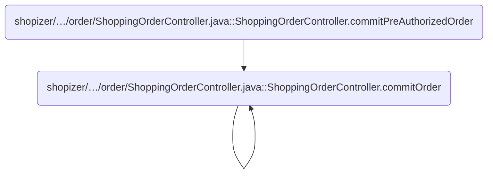

This document describes how a customer's shopping cart is committed as a finalized order. The flow manages customer authentication, address selection, payment processing, and order creation, followed by post-processing actions like session cleanup and confirmation emails.

# Where is this flow used?

This flow is used multiple times in the codebase as represented in the following diagram:



# Preparing Customer and Order Data

This section ensures that customer and order data are properly validated, prepared, and associated before an order is committed. It handles both new and existing customers, manages address information, and guarantees that the order is processed with accurate customer and transaction details.

| Category       | Rule Name                         | Description                                                                                                                                                           |
| -------------- | --------------------------------- | --------------------------------------------------------------------------------------------------------------------------------------------------------------------- |
| Business logic | Authenticated Customer Handling   | If the customer is authenticated, use their existing username, password, and ID for the order. If not, set the customer ID to null and treat them as a new customer.  |
| Business logic | New Customer Password Generation  | For new customers (no ID or ID is zero), generate a random password and encode it before associating it with the customer record.                                     |
| Business logic | Ship to Billing Address           | If the order specifies shipping to the billing address, set the customer's delivery address to match their billing address.                                           |
| Business logic | Volatile Customer Creation        | If the customer is not authenticated, create a new customer model and persist it to the database with default properties.                                             |
| Business logic | Order Processing with Transaction | If a transaction is present in the session, process the order using both the customer and transaction data; otherwise, process the order with just the customer data. |

<SwmSnippet path="/shopizer/sm-shop/src/main/java/com/salesmanager/web/shop/controller/order/ShoppingOrderController.java" line="367">

---

In <SwmToken path="shopizer/sm-shop/src/main/java/com/salesmanager/web/shop/controller/order/ShoppingOrderController.java" pos="367:5:5" line-data="	private Order commitOrder(ShopOrder order, HttpServletRequest request, Locale locale) throws Exception, ServiceException {">`commitOrder`</SwmToken>, we prep the customer object by checking authentication, setting IDs and passwords, and handling delivery/billing addresses. Then we either update or create the customer model. The next step is calling <SwmToken path="shopizer/sm-shop/src/main/java/com/salesmanager/web/shop/controller/order/ShoppingOrderController.java" pos="427:3:5" line-data="	        	modelOrder=orderFacade.processOrder(order, modelCustomer, initialTransaction, store, language);">`orderFacade.processOrder`</SwmToken>, which actually builds and processes the order using the customer and transaction data we've just set up.

```java
	private Order commitOrder(ShopOrder order, HttpServletRequest request, Locale locale) throws Exception, ServiceException {
		
		
			MerchantStore store = (MerchantStore)request.getAttribute(Constants.MERCHANT_STORE);
			Language language = (Language)request.getAttribute("LANGUAGE");
			
			
			String userName = null;
			String password = null;
			
			PersistableCustomer customer = order.getCustomer();
			
	        /** set username and password to persistable object **/
			Authentication auth = SecurityContextHolder.getContext().getAuthentication();
			Customer authCustomer = null;
        	if(auth != null &&
	        		 request.isUserInRole("AUTH_CUSTOMER")) {
        		authCustomer = customerFacade.getCustomerByUserName(auth.getName(), store);
        		//set id and authentication information
        		customer.setUserName(authCustomer.getNick());
        		customer.setEncodedPassword(authCustomer.getPassword());
        		customer.setId(authCustomer.getId());
	        } else {
	        	//set customer id to null
	        	customer.setId(null);
	        }
		
	        //if the customer is new, generate a password
	        if(customer.getId()==null || customer.getId()==0) {//new customer
	        	password = UserReset.generateRandomString();
	        	String encodedPassword = passwordEncoder.encodePassword(password, null);
	        	customer.setEncodedPassword(encodedPassword);
	        }
	        
	        if(order.isShipToBillingAdress()) {
	        	customer.setDelivery(customer.getBilling());
	        }
	        


			Customer modelCustomer = null;
			try {//set groups
				if(authCustomer==null) {//not authenticated, create a new volatile user
					modelCustomer = customerFacade.getCustomerModel(customer, store, language);
					customerFacade.setCustomerModelDefaultProperties(modelCustomer, store);
					userName = modelCustomer.getNick();
					LOGGER.debug( "About to persist volatile customer to database." );
			        customerService.saveOrUpdate( modelCustomer );
				} else {//use existing customer
					modelCustomer = customerFacade.populateCustomerModel(authCustomer, customer, store, language);
				}
			} catch(Exception e) {
				throw new ServiceException(e);
			}
	        
           
	        
	        Order modelOrder = null;
	        Transaction initialTransaction = (Transaction)super.getSessionAttribute(Constants.INIT_TRANSACTION_KEY, request);
	        if(initialTransaction!=null) {
	        	modelOrder=orderFacade.processOrder(order, modelCustomer, initialTransaction, store, language);
	        } else {
	        	modelOrder=orderFacade.processOrder(order, modelCustomer, store, language);
	        }
	        
```

---

</SwmSnippet>

## Delegating Order Processing

This section ensures that order processing is handled through a single, centralized method, maintaining consistency and reducing duplication in business logic for order handling.

<SwmSnippet path="/shopizer/sm-shop/src/main/java/com/salesmanager/web/shop/controller/order/facade/OrderFacadeImpl.java" line="260">

---

<SwmToken path="shopizer/sm-shop/src/main/java/com/salesmanager/web/shop/controller/order/facade/OrderFacadeImpl.java" pos="260:5:5" line-data="	public Order processOrder(ShopOrder order, Customer customer, Transaction transaction, MerchantStore store,">`processOrder`</SwmToken> just hands off all the parameters to <SwmToken path="shopizer/sm-shop/src/main/java/com/salesmanager/web/shop/controller/order/facade/OrderFacadeImpl.java" pos="263:5:5" line-data="		return this.processOrderModel(order, customer, transaction, store, language);">`processOrderModel`</SwmToken>, keeping the main logic in one place. This lets us handle both cases (with or without a transaction) using a single core implementation.

```java
	public Order processOrder(ShopOrder order, Customer customer, Transaction transaction, MerchantStore store,
			Language language) throws ServiceException {
				
		return this.processOrderModel(order, customer, transaction, store, language);

	}
```

---

</SwmSnippet>

## Building the Order Model

```mermaid
%%{init: {"flowchart": {"defaultRenderer": "elk"}} }%%
flowchart TD
    node1["Start order processing"]
    click node1 openCode "shopizer/sm-shop/src/main/java/com/salesmanager/web/shop/controller/order/facade/OrderFacadeImpl.java:267:427"
    node1 --> node2{"Ship to billing address?"}
    click node2 openCode "shopizer/sm-shop/src/main/java/com/salesmanager/web/shop/controller/order/facade/OrderFacadeImpl.java:272:276"
    node2 -->|"Yes"| node3["Set delivery address to billing address"]
    click node3 openCode "shopizer/sm-shop/src/main/java/com/salesmanager/web/shop/controller/order/facade/OrderFacadeImpl.java:273:275"
    node2 -->|"No"| node4["Continue with provided delivery address"]
    click node4 openCode "shopizer/sm-shop/src/main/java/com/salesmanager/web/shop/controller/order/facade/OrderFacadeImpl.java:284:284"
    node3 --> node5["Create order object and set details"]
    node4 --> node5
    click node5 openCode "shopizer/sm-shop/src/main/java/com/salesmanager/web/shop/controller/order/facade/OrderFacadeImpl.java:281:288"

    subgraph loop1["For each item in cart"]
      node5 --> node6["Add item as order product"]
      click node6 openCode "shopizer/sm-shop/src/main/java/com/salesmanager/web/shop/controller/order/facade/OrderFacadeImpl.java:298:303"
    end
    node6 --> node8["Set order products"]
    click node8 openCode "shopizer/sm-shop/src/main/java/com/salesmanager/web/shop/controller/order/facade/OrderFacadeImpl.java:305:305"

    subgraph loop2["For each order total"]
      node8 --> node9["Associate total with order"]
      click node9 openCode "shopizer/sm-shop/src/main/java/com/salesmanager/web/shop/controller/order/facade/OrderFacadeImpl.java:323:326"
    end
    node9 --> node11["Set order totals and summary"]
    click node11 openCode "shopizer/sm-shop/src/main/java/com/salesmanager/web/shop/controller/order/facade/OrderFacadeImpl.java:328:329"
    node11 --> node12["Set customer and merchant info"]
    click node12 openCode "shopizer/sm-shop/src/main/java/com/salesmanager/web/shop/controller/order/facade/OrderFacadeImpl.java:332:338"
    node12 --> node13{"Payment method?"}
    click node13 openCode "shopizer/sm-shop/src/main/java/com/salesmanager/web/shop/controller/order/facade/OrderFacadeImpl.java:345:390"
    node13 -->|"Credit Card"| node14{"Credit card type?"}
    click node14 openCode "shopizer/sm-shop/src/main/java/com/salesmanager/web/shop/controller/order/facade/OrderFacadeImpl.java:360:377"
    node14 -->|"AMEX/VISA/MC/etc."| node15["Set credit card details"]
    click node15 openCode "shopizer/sm-shop/src/main/java/com/salesmanager/web/shop/controller/order/facade/OrderFacadeImpl.java:353:388"
    node15 --> node18["Finalize payment"]
    node13 -->|"PayPal"| node16{"Transaction present?"}
    click node16 openCode "shopizer/sm-shop/src/main/java/com/salesmanager/web/shop/controller/order/facade/OrderFacadeImpl.java:395:405"
    node16 -->|"Yes"| node17["Set PayPal payment details"]
    click node17 openCode "shopizer/sm-shop/src/main/java/com/salesmanager/web/shop/controller/order/facade/OrderFacadeImpl.java:399:402"
    node17 --> node18
    node16 -->|"No"| node19["Abort: Payment not possible"]
    click node19 openCode "shopizer/sm-shop/src/main/java/com/salesmanager/web/shop/controller/order/facade/OrderFacadeImpl.java:396:397"
    node13 -->|"Other"| node18["Finalize payment"]
    click node18 openCode "shopizer/sm-shop/src/main/java/com/salesmanager/web/shop/controller/order/facade/OrderFacadeImpl.java:408:409"
    node18 --> node21["Process order"]
    click node21 openCode "shopizer/sm-shop/src/main/java/com/salesmanager/web/shop/controller/order/facade/OrderFacadeImpl.java:411:415"
    node21 --> node22["Return finalized order"]
    click node22 openCode "shopizer/sm-shop/src/main/java/com/salesmanager/web/shop/controller/order/facade/OrderFacadeImpl.java:419:419"

classDef HeadingStyle fill:#777777,stroke:#333,stroke-width:2px;

%% Swimm:
%% %%{init: {"flowchart": {"defaultRenderer": "elk"}} }%%
%% flowchart TD
%%     node1["Start order processing"]
%%     click node1 openCode "<SwmPath>[shopizer/…/facade/OrderFacadeImpl.java](shopizer/sm-shop/src/main/java/com/salesmanager/web/shop/controller/order/facade/OrderFacadeImpl.java)</SwmPath>:267:427"
%%     node1 --> node2{"Ship to billing address?"}
%%     click node2 openCode "<SwmPath>[shopizer/…/facade/OrderFacadeImpl.java](shopizer/sm-shop/src/main/java/com/salesmanager/web/shop/controller/order/facade/OrderFacadeImpl.java)</SwmPath>:272:276"
%%     node2 -->|"Yes"| node3["Set delivery address to billing address"]
%%     click node3 openCode "<SwmPath>[shopizer/…/facade/OrderFacadeImpl.java](shopizer/sm-shop/src/main/java/com/salesmanager/web/shop/controller/order/facade/OrderFacadeImpl.java)</SwmPath>:273:275"
%%     node2 -->|"No"| node4["Continue with provided delivery address"]
%%     click node4 openCode "<SwmPath>[shopizer/…/facade/OrderFacadeImpl.java](shopizer/sm-shop/src/main/java/com/salesmanager/web/shop/controller/order/facade/OrderFacadeImpl.java)</SwmPath>:284:284"
%%     node3 --> node5["Create order object and set details"]
%%     node4 --> node5
%%     click node5 openCode "<SwmPath>[shopizer/…/facade/OrderFacadeImpl.java](shopizer/sm-shop/src/main/java/com/salesmanager/web/shop/controller/order/facade/OrderFacadeImpl.java)</SwmPath>:281:288"
%% 
%%     subgraph loop1["For each item in cart"]
%%       node5 --> node6["Add item as order product"]
%%       click node6 openCode "<SwmPath>[shopizer/…/facade/OrderFacadeImpl.java](shopizer/sm-shop/src/main/java/com/salesmanager/web/shop/controller/order/facade/OrderFacadeImpl.java)</SwmPath>:298:303"
%%     end
%%     node6 --> node8["Set order products"]
%%     click node8 openCode "<SwmPath>[shopizer/…/facade/OrderFacadeImpl.java](shopizer/sm-shop/src/main/java/com/salesmanager/web/shop/controller/order/facade/OrderFacadeImpl.java)</SwmPath>:305:305"
%% 
%%     subgraph loop2["For each order total"]
%%       node8 --> node9["Associate total with order"]
%%       click node9 openCode "<SwmPath>[shopizer/…/facade/OrderFacadeImpl.java](shopizer/sm-shop/src/main/java/com/salesmanager/web/shop/controller/order/facade/OrderFacadeImpl.java)</SwmPath>:323:326"
%%     end
%%     node9 --> node11["Set order totals and summary"]
%%     click node11 openCode "<SwmPath>[shopizer/…/facade/OrderFacadeImpl.java](shopizer/sm-shop/src/main/java/com/salesmanager/web/shop/controller/order/facade/OrderFacadeImpl.java)</SwmPath>:328:329"
%%     node11 --> node12["Set customer and merchant info"]
%%     click node12 openCode "<SwmPath>[shopizer/…/facade/OrderFacadeImpl.java](shopizer/sm-shop/src/main/java/com/salesmanager/web/shop/controller/order/facade/OrderFacadeImpl.java)</SwmPath>:332:338"
%%     node12 --> node13{"Payment method?"}
%%     click node13 openCode "<SwmPath>[shopizer/…/facade/OrderFacadeImpl.java](shopizer/sm-shop/src/main/java/com/salesmanager/web/shop/controller/order/facade/OrderFacadeImpl.java)</SwmPath>:345:390"
%%     node13 -->|"Credit Card"| node14{"Credit card type?"}
%%     click node14 openCode "<SwmPath>[shopizer/…/facade/OrderFacadeImpl.java](shopizer/sm-shop/src/main/java/com/salesmanager/web/shop/controller/order/facade/OrderFacadeImpl.java)</SwmPath>:360:377"
%%     node14 -->|"AMEX/VISA/MC/etc."| node15["Set credit card details"]
%%     click node15 openCode "<SwmPath>[shopizer/…/facade/OrderFacadeImpl.java](shopizer/sm-shop/src/main/java/com/salesmanager/web/shop/controller/order/facade/OrderFacadeImpl.java)</SwmPath>:353:388"
%%     node15 --> node18["Finalize payment"]
%%     node13 -->|"PayPal"| node16{"Transaction present?"}
%%     click node16 openCode "<SwmPath>[shopizer/…/facade/OrderFacadeImpl.java](shopizer/sm-shop/src/main/java/com/salesmanager/web/shop/controller/order/facade/OrderFacadeImpl.java)</SwmPath>:395:405"
%%     node16 -->|"Yes"| node17["Set PayPal payment details"]
%%     click node17 openCode "<SwmPath>[shopizer/…/facade/OrderFacadeImpl.java](shopizer/sm-shop/src/main/java/com/salesmanager/web/shop/controller/order/facade/OrderFacadeImpl.java)</SwmPath>:399:402"
%%     node17 --> node18
%%     node16 -->|"No"| node19["Abort: Payment not possible"]
%%     click node19 openCode "<SwmPath>[shopizer/…/facade/OrderFacadeImpl.java](shopizer/sm-shop/src/main/java/com/salesmanager/web/shop/controller/order/facade/OrderFacadeImpl.java)</SwmPath>:396:397"
%%     node13 -->|"Other"| node18["Finalize payment"]
%%     click node18 openCode "<SwmPath>[shopizer/…/facade/OrderFacadeImpl.java](shopizer/sm-shop/src/main/java/com/salesmanager/web/shop/controller/order/facade/OrderFacadeImpl.java)</SwmPath>:408:409"
%%     node18 --> node21["Process order"]
%%     click node21 openCode "<SwmPath>[shopizer/…/facade/OrderFacadeImpl.java](shopizer/sm-shop/src/main/java/com/salesmanager/web/shop/controller/order/facade/OrderFacadeImpl.java)</SwmPath>:411:415"
%%     node21 --> node22["Return finalized order"]
%%     click node22 openCode "<SwmPath>[shopizer/…/facade/OrderFacadeImpl.java](shopizer/sm-shop/src/main/java/com/salesmanager/web/shop/controller/order/facade/OrderFacadeImpl.java)</SwmPath>:419:419"
%% 
%% classDef HeadingStyle fill:#777777,stroke:#333,stroke-width:2px;
```



This section governs the business rules for constructing an order from a customer's shopping cart, including address handling, product and total population, payment processing, and error management. The goal is to ensure that all necessary order information is correctly assembled and validated before finalizing the order.

| Category        | Rule Name                                 | Description                                                                                                                                                            |
| --------------- | ----------------------------------------- | ---------------------------------------------------------------------------------------------------------------------------------------------------------------------- |
| Data validation | Credit Card Payment Validation            | If the payment method is credit card, the order must include masked credit card details and the card type must be one of AMEX, VISA, MASTERCARD, DINERS, or DISCOVERY. |
| Data validation | PayPal Transaction Requirement            | If the payment method is PayPal, a valid transaction must be present; otherwise, the order cannot proceed and an error is raised.                                      |
| Business logic  | Ship to Billing Address Option            | If the customer chooses to ship to their billing address, the delivery address must be set to match the billing address.                                               |
| Business logic  | Cart Item to Order Product Transformation | Each item in the shopping cart must be converted into an order product and associated with the order.                                                                  |
| Business logic  | Order Totals Sorting                      | Order totals must be sorted by their defined sort order before being attached to the order.                                                                            |
| Business logic  | Order Summary Population                  | The order must include customer, merchant, and currency information as part of its summary details.                                                                    |

<SwmSnippet path="/shopizer/sm-shop/src/main/java/com/salesmanager/web/shop/controller/order/facade/OrderFacadeImpl.java" line="267">

---

In <SwmToken path="shopizer/sm-shop/src/main/java/com/salesmanager/web/shop/controller/order/facade/OrderFacadeImpl.java" pos="267:5:5" line-data="	private Order processOrderModel(ShopOrder order, Customer customer, Transaction transaction, MerchantStore store,">`processOrderModel`</SwmToken>, we handle the shipping-to-billing logic by copying the billing address if needed, then build the order model and populate its products from the shopping cart using a populator. This step transforms cart items into order products and links them to the order.

```java
	private Order processOrderModel(ShopOrder order, Customer customer, Transaction transaction, MerchantStore store,
			Language language) throws ServiceException {
		
		try {
			
			if(order.isShipToBillingAdress()) {//customer shipping is billing
				PersistableCustomer orderCustomer = order.getCustomer();
				Address billing = orderCustomer.getBilling();
				orderCustomer.setDelivery(billing);
			}

 

			
			Order modelOrder = new Order();
			modelOrder.setDatePurchased(new Date());
			modelOrder.setBilling(customer.getBilling());
			modelOrder.setDelivery(customer.getDelivery());
			modelOrder.setPaymentModuleCode(order.getPaymentModule());
			modelOrder.setPaymentType(PaymentType.valueOf(order.getPaymentMethodType()));
			modelOrder.setShippingModuleCode(order.getShippingModule());
			modelOrder.setLocale(LocaleUtils.getLocale(store));//set the store locale based on the country for order $ formatting
	
			List<ShoppingCartItem> shoppingCartItems = order.getShoppingCartItems();
			Set<OrderProduct> orderProducts = new LinkedHashSet<OrderProduct>();
			
			OrderProductPopulator orderProductPopulator = new OrderProductPopulator();
			orderProductPopulator.setDigitalProductService(digitalProductService);
			orderProductPopulator.setProductAttributeService(productAttributeService);
			orderProductPopulator.setProductService(productService);
			
			for(ShoppingCartItem item : shoppingCartItems) {
				OrderProduct orderProduct = new OrderProduct();
				orderProduct = orderProductPopulator.populate(item, orderProduct , store, language);
				orderProduct.setOrder(modelOrder);
				orderProducts.add(orderProduct);
			}
```

---

</SwmSnippet>

<SwmSnippet path="/shopizer/sm-shop/src/main/java/com/salesmanager/web/shop/controller/order/facade/OrderFacadeImpl.java" line="305">

---

We sort the totals and set them on the order so everything's in the right order for what comes next.

```java
			modelOrder.setOrderProducts(orderProducts);
			
			OrderTotalSummary summary = order.getOrderTotalSummary();
			List<com.salesmanager.core.business.order.model.OrderTotal> totals = summary.getTotals();

			//re-order totals
			Collections.sort(
					totals,
					new Comparator<com.salesmanager.core.business.order.model.OrderTotal>() {
					       public int compare(com.salesmanager.core.business.order.model.OrderTotal x, com.salesmanager.core.business.order.model.OrderTotal y) {
					            if(x.getSortOrder()==y.getSortOrder())
					            	return 0;
					            return x.getSortOrder() < y.getSortOrder() ? -1 : 1;
					        }
				
			});
			
			Set<com.salesmanager.core.business.order.model.OrderTotal> modelTotals = new LinkedHashSet<com.salesmanager.core.business.order.model.OrderTotal>();
			for(com.salesmanager.core.business.order.model.OrderTotal total : totals) {
				total.setOrder(modelOrder);
				modelTotals.add(total);
			}
```

---

</SwmSnippet>

<SwmSnippet path="/shopizer/sm-shop/src/main/java/com/salesmanager/web/shop/controller/order/facade/OrderFacadeImpl.java" line="328">

---

Here we finish setting up the order by attaching sorted totals, currency, merchant, and customer info. Then we handle payment specifics—credit card or PayPal—masking sensitive data and checking for required transaction info. Finally, we call <SwmToken path="shopizer/sm-shop/src/main/java/com/salesmanager/web/shop/controller/order/facade/OrderFacadeImpl.java" pos="412:1:3" line-data="				orderService.processOrder(modelOrder, customer, order.getShoppingCartItems(), summary, payment, store);">`orderService.processOrder`</SwmToken> to persist everything.

```java
			modelOrder.setOrderTotal(modelTotals);
			modelOrder.setTotal(order.getOrderTotalSummary().getTotal());
	
			//order misc objects
			modelOrder.setCurrency(store.getCurrency());
			modelOrder.setMerchant(store);

			
			
			//customer object
			orderCustomer(customer, modelOrder, language);
			
			//populate shipping information
			if(!StringUtils.isBlank(order.getShippingModule())) {
				modelOrder.setShippingModuleCode(order.getShippingModule());
			}
			
			String paymentType = order.getPaymentMethodType();
			Payment payment = new Payment();
			payment.setPaymentType(PaymentType.valueOf(paymentType));
			if(PaymentType.CREDITCARD.name().equals(paymentType)) {
				
				
				
				payment = new CreditCardPayment();
				((CreditCardPayment)payment).setCardOwner(order.getPayment().get("creditcard_card_holder"));
				((CreditCardPayment)payment).setCredidCardValidationNumber(order.getPayment().get("creditcard_card_cvv"));
				((CreditCardPayment)payment).setCreditCardNumber(order.getPayment().get("creditcard_card_number"));
				((CreditCardPayment)payment).setExpirationMonth(order.getPayment().get("creditcard_card_expirationmonth"));
				((CreditCardPayment)payment).setExpirationYear(order.getPayment().get("creditcard_card_expirationyear"));
				
				CreditCardType creditCardType =null;
				String cardType = order.getPayment().get("creditcard_card_type");
				
				if(cardType.equalsIgnoreCase(CreditCardType.AMEX.name())) {
					creditCardType = CreditCardType.AMEX;
				} else if(cardType.equalsIgnoreCase(CreditCardType.VISA.name())) {
					creditCardType = CreditCardType.VISA;
				} else if(cardType.equalsIgnoreCase(CreditCardType.MASTERCARD.name())) {
					creditCardType = CreditCardType.MASTERCARD;
				} else if(cardType.equalsIgnoreCase(CreditCardType.DINERS.name())) {
					creditCardType = CreditCardType.DINERS;
				} else if(cardType.equalsIgnoreCase(CreditCardType.DISCOVERY.name())) {
					creditCardType = CreditCardType.DISCOVERY;
				}
				

				
				
				((CreditCardPayment)payment).setCreditCard(creditCardType);
			
				CreditCard cc = new CreditCard();
				cc.setCardType(creditCardType);
				cc.setCcCvv(((CreditCardPayment)payment).getCredidCardValidationNumber());
				cc.setCcOwner(((CreditCardPayment)payment).getCardOwner());
				cc.setCcExpires(((CreditCardPayment)payment).getExpirationMonth() + "-" + ((CreditCardPayment)payment).getExpirationYear());
			
				//hash credit card number
				String maskedNumber = CreditCardUtils.maskCardNumber(order.getPayment().get("creditcard_card_number"));
				cc.setCcNumber(maskedNumber);
				modelOrder.setCreditCard(cc);

			}
			
			if(PaymentType.PAYPAL.name().equals(paymentType)) {
				
				//check for previous transaction
				if(transaction==null) {
					throw new ServiceException("payment.error");
				}
				
				payment = new com.salesmanager.core.business.payments.model.PaypalPayment();
				
				((com.salesmanager.core.business.payments.model.PaypalPayment)payment).setPayerId(transaction.getTransactionDetails().get("PAYERID"));
				((com.salesmanager.core.business.payments.model.PaypalPayment)payment).setPaymentToken(transaction.getTransactionDetails().get("TOKEN"));
				
				
			}
			

			modelOrder.setPaymentModuleCode(order.getPaymentModule());
			payment.setModuleName(order.getPaymentModule());

			if(transaction!=null) {
				orderService.processOrder(modelOrder, customer, order.getShoppingCartItems(), summary, payment, store);
			} else {
				orderService.processOrder(modelOrder, customer, order.getShoppingCartItems(), summary, payment, transaction, store);
			}
			

			
			return modelOrder;
		
```

---

</SwmSnippet>

<SwmSnippet path="/shopizer/sm-shop/src/main/java/com/salesmanager/web/shop/controller/order/facade/OrderFacadeImpl.java" line="252">

---

<SwmToken path="shopizer/sm-shop/src/main/java/com/salesmanager/web/shop/controller/order/facade/OrderFacadeImpl.java" pos="252:5:5" line-data="	public Order processOrder(ShopOrder order, Customer customer, MerchantStore store,">`processOrder`</SwmToken> (no transaction) just calls <SwmToken path="shopizer/sm-shop/src/main/java/com/salesmanager/web/shop/controller/order/facade/OrderFacadeImpl.java" pos="255:5:5" line-data="		return this.processOrderModel(order, customer, null, store, language);">`processOrderModel`</SwmToken> with a null transaction, so we don't have to duplicate logic for orders without payment transactions.

```java
	public Order processOrder(ShopOrder order, Customer customer, MerchantStore store,
			Language language) throws ServiceException {
				
		return this.processOrderModel(order, customer, null, store, language);

	}
```

---

</SwmSnippet>

<SwmSnippet path="/shopizer/sm-shop/src/main/java/com/salesmanager/web/shop/controller/order/facade/OrderFacadeImpl.java" line="421">

---

Back in <SwmToken path="shopizer/sm-shop/src/main/java/com/salesmanager/web/shop/controller/order/facade/OrderFacadeImpl.java" pos="255:5:5" line-data="		return this.processOrderModel(order, customer, null, store, language);">`processOrderModel`</SwmToken>, if anything goes wrong (like invalid payment), we throw a <SwmToken path="shopizer/sm-shop/src/main/java/com/salesmanager/web/shop/controller/order/facade/OrderFacadeImpl.java" pos="421:5:5" line-data="		} catch(ServiceException se) {//may be invalid credit card">`ServiceException`</SwmToken> so the caller can handle it. This keeps error handling uniform for the controller.

```java
		} catch(ServiceException se) {//may be invalid credit card
			throw se;
		} catch(Exception e) {
			throw new ServiceException(e);
		}
		
	}
```

---

</SwmSnippet>

## Finalizing Order and Post-Processing

```mermaid
%%{init: {"flowchart": {"defaultRenderer": "elk"}} }%%
flowchart TD
    node1["Finalize order: Save order ID and token in session"]
    click node1 openCode "shopizer/sm-shop/src/main/java/com/salesmanager/web/shop/controller/order/ShoppingOrderController.java:432:435"
    node1 --> node2{"Is there a shopping cart?"}
    click node2 openCode "shopizer/sm-shop/src/main/java/com/salesmanager/web/shop/controller/order/ShoppingOrderController.java:438:447"
    node2 -->|"Yes"| node3["Delete shopping cart"]
    click node3 openCode "shopizer/sm-shop/src/main/java/com/salesmanager/web/shop/controller/order/ShoppingOrderController.java:442:447"
    node2 -->|"No"| node4["Cleanup session attributes"]
    node3 --> node4
    click node4 openCode "shopizer/sm-shop/src/main/java/com/salesmanager/web/shop/controller/order/ShoppingOrderController.java:451:456"
    node4 --> node5["Refresh customer information"]
    click node5 openCode "shopizer/sm-shop/src/main/java/com/salesmanager/web/shop/controller/order/ShoppingOrderController.java:463:468"
    node5 --> node6{"Are there downloadable products in the order?"}
    click node6 openCode "shopizer/sm-shop/src/main/java/com/salesmanager/web/shop/controller/order/ShoppingOrderController.java:469:487"
    node6 -->|"Yes"| node7{"Is customer authenticated?"}
    node6 -->|"No"| node10["Send order confirmation email"]
    node7 -->|"Yes"| node8{"Is customer new?"}
    node7 -->|"No"| node9["Authenticate customer"]
    node8 -->|"Yes"| node11["Send registration email"]
    node8 -->|"No"| node10
    node9 --> node10
    node11 --> node10
    click node10 openCode "shopizer/sm-shop/src/main/java/com/salesmanager/web/shop/controller/order/ShoppingOrderController.java:490:491"
    node10 --> node12{"Does order have downloadable files?"}
    click node12 openCode "shopizer/sm-shop/src/main/java/com/salesmanager/web/shop/controller/order/ShoppingOrderController.java:492:493"
    node12 -->|"Yes"| node13["Send download email"]
    node12 -->|"No"| node14["Return order"]
    node13 --> node14
    click node14 openCode "shopizer/sm-shop/src/main/java/com/salesmanager/web/shop/controller/order/ShoppingOrderController.java:505:505"
classDef HeadingStyle fill:#777777,stroke:#333,stroke-width:2px;

%% Swimm:
%% %%{init: {"flowchart": {"defaultRenderer": "elk"}} }%%
%% flowchart TD
%%     node1["Finalize order: Save order ID and token in session"]
%%     click node1 openCode "<SwmPath>[shopizer/…/order/ShoppingOrderController.java](shopizer/sm-shop/src/main/java/com/salesmanager/web/shop/controller/order/ShoppingOrderController.java)</SwmPath>:432:435"
%%     node1 --> node2{"Is there a shopping cart?"}
%%     click node2 openCode "<SwmPath>[shopizer/…/order/ShoppingOrderController.java](shopizer/sm-shop/src/main/java/com/salesmanager/web/shop/controller/order/ShoppingOrderController.java)</SwmPath>:438:447"
%%     node2 -->|"Yes"| node3["Delete shopping cart"]
%%     click node3 openCode "<SwmPath>[shopizer/…/order/ShoppingOrderController.java](shopizer/sm-shop/src/main/java/com/salesmanager/web/shop/controller/order/ShoppingOrderController.java)</SwmPath>:442:447"
%%     node2 -->|"No"| node4["Cleanup session attributes"]
%%     node3 --> node4
%%     click node4 openCode "<SwmPath>[shopizer/…/order/ShoppingOrderController.java](shopizer/sm-shop/src/main/java/com/salesmanager/web/shop/controller/order/ShoppingOrderController.java)</SwmPath>:451:456"
%%     node4 --> node5["Refresh customer information"]
%%     click node5 openCode "<SwmPath>[shopizer/…/order/ShoppingOrderController.java](shopizer/sm-shop/src/main/java/com/salesmanager/web/shop/controller/order/ShoppingOrderController.java)</SwmPath>:463:468"
%%     node5 --> node6{"Are there downloadable products in the order?"}
%%     click node6 openCode "<SwmPath>[shopizer/…/order/ShoppingOrderController.java](shopizer/sm-shop/src/main/java/com/salesmanager/web/shop/controller/order/ShoppingOrderController.java)</SwmPath>:469:487"
%%     node6 -->|"Yes"| node7{"Is customer authenticated?"}
%%     node6 -->|"No"| node10["Send order confirmation email"]
%%     node7 -->|"Yes"| node8{"Is customer new?"}
%%     node7 -->|"No"| node9["Authenticate customer"]
%%     node8 -->|"Yes"| node11["Send registration email"]
%%     node8 -->|"No"| node10
%%     node9 --> node10
%%     node11 --> node10
%%     click node10 openCode "<SwmPath>[shopizer/…/order/ShoppingOrderController.java](shopizer/sm-shop/src/main/java/com/salesmanager/web/shop/controller/order/ShoppingOrderController.java)</SwmPath>:490:491"
%%     node10 --> node12{"Does order have downloadable files?"}
%%     click node12 openCode "<SwmPath>[shopizer/…/order/ShoppingOrderController.java](shopizer/sm-shop/src/main/java/com/salesmanager/web/shop/controller/order/ShoppingOrderController.java)</SwmPath>:492:493"
%%     node12 -->|"Yes"| node13["Send download email"]
%%     node12 -->|"No"| node14["Return order"]
%%     node13 --> node14
%%     click node14 openCode "<SwmPath>[shopizer/…/order/ShoppingOrderController.java](shopizer/sm-shop/src/main/java/com/salesmanager/web/shop/controller/order/ShoppingOrderController.java)</SwmPath>:505:505"
%% classDef HeadingStyle fill:#777777,stroke:#333,stroke-width:2px;
```



<SwmSnippet path="/shopizer/sm-shop/src/main/java/com/salesmanager/web/shop/controller/order/ShoppingOrderController.java" line="432">

---

After returning from `OrderFacadeImpl.processOrder`, <SwmToken path="shopizer/sm-shop/src/main/java/com/salesmanager/web/shop/controller/order/ShoppingOrderController.java" pos="367:5:5" line-data="	private Order commitOrder(ShopOrder order, HttpServletRequest request, Locale locale) throws Exception, ServiceException {">`commitOrder`</SwmToken> saves the order ID, cleans up session and cart data, refreshes the customer, and sends out emails for registration, order confirmation, and downloads if needed. This wraps up the order flow and resets the session for the next action.

```java
	        //save order id in session
	        super.setSessionAttribute(Constants.ORDER_ID, modelOrder.getId(), request);
	        //set a unique token for confirmation
	        super.setSessionAttribute(Constants.ORDER_ID_TOKEN, modelOrder.getId(), request);
	        

			//get cart
			String cartCode = super.getSessionAttribute(Constants.SHOPPING_CART, request);
			if(StringUtils.isNotBlank(cartCode)) {
				try {
					shoppingCartFacade.deleteShoppingCart(cartCode, store);
				} catch(Exception e) {
					LOGGER.error("Cannot delete cart " + cartCode, e);
					throw new ServiceException(e);
				}
			}

			
	        //cleanup the order objects
	        super.removeAttribute(Constants.ORDER, request);
	        super.removeAttribute(Constants.ORDER_SUMMARY, request);
	        super.removeAttribute(Constants.INIT_TRANSACTION_KEY, request);
	        super.removeAttribute(Constants.SHIPPING_OPTIONS, request);
	        super.removeAttribute(Constants.SHIPPING_SUMMARY, request);
	        super.removeAttribute(Constants.SHOPPING_CART, request);
	        
	        
	        

	        try {
		        //refresh customer --
	        	modelCustomer = customerFacade.getCustomerByUserName(modelCustomer.getNick(), store);
		        
	        	//if has downloads, authenticate
	        	
	        	//check if any downloads exist for this order6
	    		List<OrderProductDownload> orderProductDownloads = orderProdctDownloadService.getByOrderId(modelOrder.getId());
	    		if(CollectionUtils.isNotEmpty(orderProductDownloads)) {

		        	LOGGER.debug("Is user authenticated ? ",auth.isAuthenticated());
		        	if(auth != null &&
			        		 request.isUserInRole("AUTH_CUSTOMER")) {
			        	//already authenticated
			        } else {
				        //authenticate
				        customerFacade.authenticate(modelCustomer, userName, password);
				        super.setSessionAttribute(Constants.CUSTOMER, modelCustomer, request);
			        }
		        	//send new user registration template
					if(order.getCustomer().getId()==null || order.getCustomer().getId().longValue()==0) {
						//send email for new customer
						customer.setClearPassword(password);//set clear password for email
						customer.setUserName(userName);
						emailTemplatesUtils.sendRegistrationEmail( customer, store, locale, request.getContextPath() );
					}
	    		}
	    		
				//send order confirmation email
				emailTemplatesUtils.sendOrderEmail(modelCustomer, modelOrder, locale, language, store, request.getContextPath());
		        
		        if(orderService.hasDownloadFiles(modelOrder)) {
		        	emailTemplatesUtils.sendOrderDownloadEmail(modelCustomer, modelOrder, store, locale, request.getContextPath());
		
		        }
	    		
	    		
	        } catch(Exception e) {
	        	LOGGER.error("Error while post processing order",e);
	        }


			
			
	        return modelOrder;
		
		
	}
```

---

</SwmSnippet>

&nbsp;

*This is an auto-generated document by Swimm 🌊 and has not yet been verified by a human*

<SwmMeta version="3.0.0" repo-id="Z2l0aHViJTNBJTNBU2hvcGl6ZXIlM0ElM0F1bWFsaW5nYXN3YW1p" repo-name="Shopizer"><sup>Powered by [Swimm](https://app.swimm.io/)</sup></SwmMeta>
