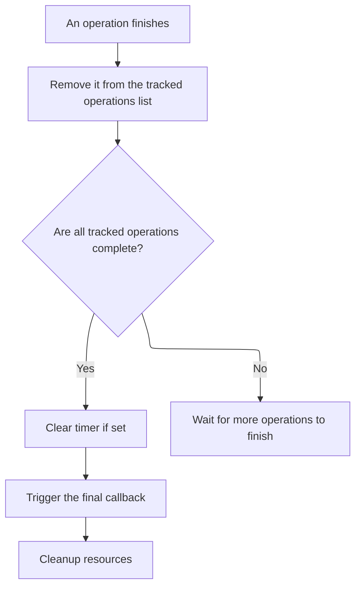

This document describes how the system coordinates the completion of multiple asynchronous operations and ensures proper resource cleanup before signaling completion. The flow receives a set of operations and a callback, removes each operation as it finishes, and triggers the callback only after all operations are complete and resources have been cleaned up.

# Where is this flow used?

This flow is used multiple times in the codebase as represented in the following diagram:

```mermaid
graph TD;
      589c95bccd4577a1273056e1fb31eefb0e6035f4411ecfbef5dd1a3ceaec5ce0(shopizer/…/modules/ISC_Core.js::isc_c_Page_waitForMultiple) --> bd522944660b5caeeeeae194e097af8d94b5dd81ee31a0a42cecc2e9d56e4598(shopizer/…/modules/ISC_Core.js::$59n):::mainFlowStyle

8faf4cb18e3e8616d40dd46016b84b1ede994504ac9d1454522928f37458b391(shopizer/…/modules/ISC_Core.js::waitForMultiple) --> bd522944660b5caeeeeae194e097af8d94b5dd81ee31a0a42cecc2e9d56e4598(shopizer/…/modules/ISC_Core.js::$59n):::mainFlowStyle

cc78d6d47e46b15af0bbc4e549ef713678c5340e115e7bdd55aeac355d314380(shopizer/…/modules/ISC_Core.js::_fired) --> bd522944660b5caeeeeae194e097af8d94b5dd81ee31a0a42cecc2e9d56e4598(shopizer/…/modules/ISC_Core.js::$59n):::mainFlowStyle


classDef mainFlowStyle color:#000000,fill:#7CB9F4
classDef rootsStyle color:#000000,fill:#00FFF4
classDef Style1 color:#000000,fill:#00FFAA
classDef Style2 color:#000000,fill:#FFFF00
classDef Style3 color:#000000,fill:#AA7CB9

%% Swimm:
%% graph TD;
%%       589c95bccd4577a1273056e1fb31eefb0e6035f4411ecfbef5dd1a3ceaec5ce0(<SwmPath>[shopizer/…/modules/ISC_Core.js](shopizer/sm-shop/src/main/webapp/resources/smart-client/system/modules/ISC_Core.js)</SwmPath>::<SwmToken path="shopizer/sm-shop/src/main/webapp/resources/smart-client/system/modules/ISC_Core.js" pos="1238:9:9" line-data=",isc.A.waitForMultiple=function isc_c_Page_waitForMultiple(_1,_2,_3,_4){var _5=true;var _6=isc.Class.create({$59l:_1,$59m:[],$547:_2,$59n:function(_9){this.$59m.remove(_9);if(this.$59m.isEmpty()){if(this.$59i){isc.Timer.clear(this.$59i)}">`isc_c_Page_waitForMultiple`</SwmToken>) --> bd522944660b5caeeeeae194e097af8d94b5dd81ee31a0a42cecc2e9d56e4598(<SwmPath>[shopizer/…/modules/ISC_Core.js](shopizer/sm-shop/src/main/webapp/resources/smart-client/system/modules/ISC_Core.js)</SwmPath>::$59n):::mainFlowStyle
%% 
%% 8faf4cb18e3e8616d40dd46016b84b1ede994504ac9d1454522928f37458b391(<SwmPath>[shopizer/…/modules/ISC_Core.js](shopizer/sm-shop/src/main/webapp/resources/smart-client/system/modules/ISC_Core.js)</SwmPath>::<SwmToken path="shopizer/sm-shop/src/main/webapp/resources/smart-client/system/modules/ISC_Core.js" pos="1238:5:5" line-data=",isc.A.waitForMultiple=function isc_c_Page_waitForMultiple(_1,_2,_3,_4){var _5=true;var _6=isc.Class.create({$59l:_1,$59m:[],$547:_2,$59n:function(_9){this.$59m.remove(_9);if(this.$59m.isEmpty()){if(this.$59i){isc.Timer.clear(this.$59i)}">`waitForMultiple`</SwmToken>) --> bd522944660b5caeeeeae194e097af8d94b5dd81ee31a0a42cecc2e9d56e4598(<SwmPath>[shopizer/…/modules/ISC_Core.js](shopizer/sm-shop/src/main/webapp/resources/smart-client/system/modules/ISC_Core.js)</SwmPath>::$59n):::mainFlowStyle
%% 
%% cc78d6d47e46b15af0bbc4e549ef713678c5340e115e7bdd55aeac355d314380(<SwmPath>[shopizer/…/modules/ISC_Core.js](shopizer/sm-shop/src/main/webapp/resources/smart-client/system/modules/ISC_Core.js)</SwmPath>::_fired) --> bd522944660b5caeeeeae194e097af8d94b5dd81ee31a0a42cecc2e9d56e4598(<SwmPath>[shopizer/…/modules/ISC_Core.js](shopizer/sm-shop/src/main/webapp/resources/smart-client/system/modules/ISC_Core.js)</SwmPath>::$59n):::mainFlowStyle
%% 
%% 
%% classDef mainFlowStyle color:#000000,fill:#7CB9F4
%% classDef rootsStyle color:#000000,fill:#00FFF4
%% classDef Style1 color:#000000,fill:#00FFAA
%% classDef Style2 color:#000000,fill:#FFFF00
%% classDef Style3 color:#000000,fill:#AA7CB9
```



# Handling Completion of Multiple Objects

This section ensures that when waiting for multiple asynchronous objects to complete, the system only signals completion once, and all related background processes are properly terminated.

| Category        | Rule Name                   | Description                                                                                                                                          |
| --------------- | --------------------------- | ---------------------------------------------------------------------------------------------------------------------------------------------------- |
| Data validation | Completion Check on Removal | If an object is removed from the tracking array, the system must check if the array is empty to determine if completion actions should be triggered. |
| Business logic  | Single Completion Callback  | The system must only trigger the completion callback once, after all tracked objects have finished processing.                                       |
| Business logic  | Resource Cleanup            | All background timers associated with the tracked objects must be cleared immediately after all objects have completed.                              |
| Business logic  | Deferred Completion Actions | No callback or resource cleanup should occur until all tracked objects have been removed from the tracking array.                                    |

<SwmSnippet path="/shopizer/sm-shop/src/main/webapp/resources/smart-client/system/modules/ISC_Core.js" line="1238">

---

In <SwmToken path="shopizer/sm-shop/src/main/webapp/resources/smart-client/system/modules/ISC_Core.js" pos="1238:5:5" line-data=",isc.A.waitForMultiple=function isc_c_Page_waitForMultiple(_1,_2,_3,_4){var _5=true;var _6=isc.Class.create({$59l:_1,$59m:[],$547:_2,$59n:function(_9){this.$59m.remove(_9);if(this.$59m.isEmpty()){if(this.$59i){isc.Timer.clear(this.$59i)}">`waitForMultiple`</SwmToken>, we set up a class instance to track a set of objects and a callback. As each object completes, `$59n` removes it from the tracking array. When the array is empty, we call <SwmToken path="shopizer/sm-shop/src/main/webapp/resources/smart-client/system/modules/ISC_Core.js" pos="1238:89:89" line-data=",isc.A.waitForMultiple=function isc_c_Page_waitForMultiple(_1,_2,_3,_4){var _5=true;var _6=isc.Class.create({$59l:_1,$59m:[],$547:_2,$59n:function(_9){this.$59m.remove(_9);if(this.$59m.isEmpty()){if(this.$59i){isc.Timer.clear(this.$59i)}">`clear`</SwmToken> to stop any active timers, making sure we don't leave background processes running. This is necessary to avoid firing the callback multiple times or leaking resources.

```javascript
,isc.A.waitForMultiple=function isc_c_Page_waitForMultiple(_1,_2,_3,_4){var _5=true;var _6=isc.Class.create({$59l:_1,$59m:[],$547:_2,$59n:function(_9){this.$59m.remove(_9);if(this.$59m.isEmpty()){if(this.$59i){isc.Timer.clear(this.$59i)}
```

---

</SwmSnippet>

## Clearing Timers and Internal References

This section ensures that timers and internal resource references are properly cleared, maintaining a clean internal state and preventing memory leaks in the application.

| Category       | Rule Name                  | Description                                                                                                              |
| -------------- | -------------------------- | ------------------------------------------------------------------------------------------------------------------------ |
| Business logic | Array Resource Clearing    | If the input is an array of timer/resource identifiers, each item in the array must be cleared individually.             |
| Business logic | Internal Reference Removal | All internal references to a timer/resource must be removed from internal mappings before the timer/resource is cleared. |

<SwmSnippet path="/shopizer/sm-shop/src/main/webapp/resources/smart-client/system/modules/ISC_Core.js" line="1285">

---

In <SwmToken path="shopizer/sm-shop/src/main/webapp/resources/smart-client/system/modules/ISC_Core.js" pos="1285:5:5" line-data=",isc.A.clear=function isc_c_Timer_clear(_1){if(isc.isAn.Array(_1))">`clear`</SwmToken>, we handle either a single timer/resource or an array of them. If it's an array, we recursively clear each one. Otherwise, we use internal mappings ($ip and $614) to find and remove all references to the resource, then call <SwmToken path="shopizer/sm-shop/src/main/webapp/resources/smart-client/system/modules/ISC_Core.js" pos="1288:0:0" line-data="clearTimeout(_1)}">`clearTimeout`</SwmToken> to stop it. This keeps the internal state clean and avoids leaks.

```javascript
,isc.A.clear=function isc_c_Timer_clear(_1){if(isc.isAn.Array(_1))
for(var i=0;i<_1.length;i++)this.clear(_1[i]);else{var _3=this.$ip[_1];delete this[_3]
```

---

</SwmSnippet>

<SwmSnippet path="/shopizer/sm-shop/src/main/webapp/resources/smart-client/system/modules/ISC_Core.js" line="1286">

---

After clearing the timer/resource and deleting all internal references, <SwmToken path="shopizer/sm-shop/src/main/webapp/resources/smart-client/system/modules/ISC_Core.js" pos="1286:19:19" line-data="for(var i=0;i&lt;_1.length;i++)this.clear(_1[i]);else{var _3=this.$ip[_1];delete this[_3]">`clear`</SwmToken> just returns null. There's no result to report; the work is all in the cleanup.

```javascript
for(var i=0;i<_1.length;i++)this.clear(_1[i]);else{var _3=this.$ip[_1];delete this[_3]
delete this.$ip[_1];if(this.$614&&this.$614[_3]){_1=this.$614[_3];delete this.$614[_3]}
clearTimeout(_1)}
return null}
```

---

</SwmSnippet>

## Firing the Callback After Cleanup



<SwmSnippet path="/shopizer/sm-shop/src/main/webapp/resources/smart-client/system/modules/ISC_Core.js" line="1238">

---

Back in `$59n`, after clearing timers, we immediately call <SwmToken path="shopizer/sm-shop/src/main/webapp/resources/smart-client/system/modules/ISC_Core.js" pos="1239:2:2" line-data="this.fireCallback(this.$547);this.destroy()}},$59j:function(){var _7=this.$59m;for(var i=0;i&lt;_7.length;i++){_7[i].ignore(_7[i].$545,_7[i].$546);_7[i].destroy()}">`fireCallback`</SwmToken> with the stored callback. This signals that all objects are done, and then we destroy the instance to finish cleanup.

```javascript
,isc.A.waitForMultiple=function isc_c_Page_waitForMultiple(_1,_2,_3,_4){var _5=true;var _6=isc.Class.create({$59l:_1,$59m:[],$547:_2,$59n:function(_9){this.$59m.remove(_9);if(this.$59m.isEmpty()){if(this.$59i){isc.Timer.clear(this.$59i)}
this.fireCallback(this.$547);this.destroy()}},$59j:function(){var _7=this.$59m;for(var i=0;i<_7.length;i++){_7[i].ignore(_7[i].$545,_7[i].$546);_7[i].destroy()}
```

---

</SwmSnippet>

# Resolving and Preparing the Callback

```mermaid
%%{init: {"flowchart": {"defaultRenderer": "elk"}} }%%
flowchart TD
    node1{"Is callback provided?"}
    click node1 openCode "shopizer/sm-shop/src/main/webapp/resources/smart-client/system/modules/ISC_Core.js:295:302"
    node1 -->|"No"| node2["Do nothing"]
    click node2 openCode "shopizer/sm-shop/src/main/webapp/resources/smart-client/system/modules/ISC_Core.js:295:302"
    node1 -->|"Yes"| node3{"Can callback be resolved to a function?"}
    click node3 openCode "shopizer/sm-shop/src/main/webapp/resources/smart-client/system/modules/ISC_Core.js:295:302"
    node3 -->|"No"| node4["Abort: Callback not executable"]
    click node4 openCode "shopizer/sm-shop/src/main/webapp/resources/smart-client/system/modules/ISC_Core.js:297:297"
    node3 -->|"Yes"| node5{"Is target context valid?"}
    click node5 openCode "shopizer/sm-shop/src/main/webapp/resources/smart-client/system/modules/ISC_Core.js:298:299"
    node5 -->|"No"| node6["Abort: Target destroyed"]
    click node6 openCode "shopizer/sm-shop/src/main/webapp/resources/smart-client/system/modules/ISC_Core.js:298:299"
    node5 -->|"Yes"| node7{"Is cross-window callback in IE?"}
    click node7 openCode "shopizer/sm-shop/src/main/webapp/resources/smart-client/system/modules/ISC_Core.js:300:300"
    node7 -->|"Yes"| loop1["Copy arguments for IE"]
    click loop1 openCode "shopizer/sm-shop/src/main/webapp/resources/smart-client/system/modules/ISC_Core.js:300:300"
    loop1 --> node8["Execute callback"]
    click node8 openCode "shopizer/sm-shop/src/main/webapp/resources/smart-client/system/modules/ISC_Core.js:301:302"
    node7 -->|"No"| node8
    node8 --> node9["Return result"]
    click node9 openCode "shopizer/sm-shop/src/main/webapp/resources/smart-client/system/modules/ISC_Core.js:302:302"
    subgraph loop1["For each argument, copy to new array (IE only)"]
    end
classDef HeadingStyle fill:#777777,stroke:#333,stroke-width:2px;

%% Swimm:
%% %%{init: {"flowchart": {"defaultRenderer": "elk"}} }%%
%% flowchart TD
%%     node1{"Is callback provided?"}
%%     click node1 openCode "<SwmPath>[shopizer/…/modules/ISC_Core.js](shopizer/sm-shop/src/main/webapp/resources/smart-client/system/modules/ISC_Core.js)</SwmPath>:295:302"
%%     node1 -->|"No"| node2["Do nothing"]
%%     click node2 openCode "<SwmPath>[shopizer/…/modules/ISC_Core.js](shopizer/sm-shop/src/main/webapp/resources/smart-client/system/modules/ISC_Core.js)</SwmPath>:295:302"
%%     node1 -->|"Yes"| node3{"Can callback be resolved to a function?"}
%%     click node3 openCode "<SwmPath>[shopizer/…/modules/ISC_Core.js](shopizer/sm-shop/src/main/webapp/resources/smart-client/system/modules/ISC_Core.js)</SwmPath>:295:302"
%%     node3 -->|"No"| node4["Abort: Callback not executable"]
%%     click node4 openCode "<SwmPath>[shopizer/…/modules/ISC_Core.js](shopizer/sm-shop/src/main/webapp/resources/smart-client/system/modules/ISC_Core.js)</SwmPath>:297:297"
%%     node3 -->|"Yes"| node5{"Is target context valid?"}
%%     click node5 openCode "<SwmPath>[shopizer/…/modules/ISC_Core.js](shopizer/sm-shop/src/main/webapp/resources/smart-client/system/modules/ISC_Core.js)</SwmPath>:298:299"
%%     node5 -->|"No"| node6["Abort: Target destroyed"]
%%     click node6 openCode "<SwmPath>[shopizer/…/modules/ISC_Core.js](shopizer/sm-shop/src/main/webapp/resources/smart-client/system/modules/ISC_Core.js)</SwmPath>:298:299"
%%     node5 -->|"Yes"| node7{"Is cross-window callback in IE?"}
%%     click node7 openCode "<SwmPath>[shopizer/…/modules/ISC_Core.js](shopizer/sm-shop/src/main/webapp/resources/smart-client/system/modules/ISC_Core.js)</SwmPath>:300:300"
%%     node7 -->|"Yes"| loop1["Copy arguments for IE"]
%%     click loop1 openCode "<SwmPath>[shopizer/…/modules/ISC_Core.js](shopizer/sm-shop/src/main/webapp/resources/smart-client/system/modules/ISC_Core.js)</SwmPath>:300:300"
%%     loop1 --> node8["Execute callback"]
%%     click node8 openCode "<SwmPath>[shopizer/…/modules/ISC_Core.js](shopizer/sm-shop/src/main/webapp/resources/smart-client/system/modules/ISC_Core.js)</SwmPath>:301:302"
%%     node7 -->|"No"| node8
%%     node8 --> node9["Return result"]
%%     click node9 openCode "<SwmPath>[shopizer/…/modules/ISC_Core.js](shopizer/sm-shop/src/main/webapp/resources/smart-client/system/modules/ISC_Core.js)</SwmPath>:302:302"
%%     subgraph loop1["For each argument, copy to new array (IE only)"]
%%     end
%% classDef HeadingStyle fill:#777777,stroke:#333,stroke-width:<SwmToken path="shopizer/sm-shop/src/main/webapp/resources/smart-client/system/modules/ISC_Core.js" pos="1005:95:95" line-data=",isc.A.showHiliteCanvas=function isc_c_Log_showHiliteCanvas(_1){var _2=this._hiliteCanvas;if(!_2){_2=this._hiliteCanvas=isc.Canvas.create({ID:&quot;logHiliteCanvas&quot;,autoDraw:false,overflow:&quot;hidden&quot;,hide:function(){this.Super(&quot;hide&quot;,arguments);this.resizeTo(1,1);this.setTop(-20)},border1:&quot;2px dotted red&quot;,border2:&quot;2px dotted white&quot;})}">`2px`</SwmToken>;
```

This section governs how callbacks are resolved, validated, and executed within the Shopizer smart-client system. It ensures that only valid, executable callbacks are run, handles context and browser-specific requirements, and provides error handling and logging for failed executions.

| Category        | Rule Name                            | Description                                                                                                                                                 |
| --------------- | ------------------------------------ | ----------------------------------------------------------------------------------------------------------------------------------------------------------- |
| Data validation | No Callback Provided                 | If no callback is provided, the process must terminate immediately without attempting any further action.                                                   |
| Data validation | Callback Must Be Executable          | If the callback cannot be resolved to a valid function, the process must abort and a warning must be logged indicating the failure to convert the callback. |
| Data validation | Valid Target Context Required        | If the target context for the callback is destroyed or invalid, the process must abort and an informational log entry must be created.                      |
| Business logic  | IE Cross-Window Compatibility        | For cross-window callbacks in Internet Explorer, all arguments must be copied into a new array before execution to ensure compatibility.                    |
| Business logic  | Callback Execution and Result Return | The callback must be executed with the resolved context and arguments, and the result must be returned to the caller.                                       |

<SwmSnippet path="/shopizer/sm-shop/src/main/webapp/resources/smart-client/system/modules/ISC_Core.js" line="295">

---

In <SwmToken path="shopizer/sm-shop/src/main/webapp/resources/smart-client/system/modules/ISC_Core.js" pos="295:5:5" line-data=",isc.A.fireCallback=function isc_c_Class_fireCallback(_1,_2,_3,_4,_5){arguments.$cw=this;if(_1==null)return;var _6;if(_2==null)_2=_6;var _7=_1;if(isc.isA.String(_1)){if(_4!=null&amp;&amp;isc.isA.Function(_4[_1]))_7=_4[_1];else _7=this.$c5(_1,_2)}else if(isc.isAn.Object(_1)&amp;&amp;!isc.isA.Function(_1)){if(_1.caller!=null)_4=_1.caller;else if(_1.target!=null)_4=_1.target;if(_1.args)_3=_1.args;if(_1.argNames)_2=_1.argNames;if(_1.method)_7=_1.method;else if(_1.methodName&amp;&amp;_4!=null)_7=_4[_1.methodName];else if(_1.action)">`fireCallback`</SwmToken>, we figure out what the callback actually is—it could be a function, a string name, or an object with method info. We also make sure the target isn't destroyed, and handle some IE-specific quirks for cross-window calls. If we can't resolve a valid function, we log a warning and bail.

```javascript
,isc.A.fireCallback=function isc_c_Class_fireCallback(_1,_2,_3,_4,_5){arguments.$cw=this;if(_1==null)return;var _6;if(_2==null)_2=_6;var _7=_1;if(isc.isA.String(_1)){if(_4!=null&&isc.isA.Function(_4[_1]))_7=_4[_1];else _7=this.$c5(_1,_2)}else if(isc.isAn.Object(_1)&&!isc.isA.Function(_1)){if(_1.caller!=null)_4=_1.caller;else if(_1.target!=null)_4=_1.target;if(_1.args)_3=_1.args;if(_1.argNames)_2=_1.argNames;if(_1.method)_7=_1.method;else if(_1.methodName&&_4!=null)_7=_4[_1.methodName];else if(_1.action)
_7=this.$c5(_1.action,_2)}
if(!isc.isA.Function(_7)){this.logWarn("fireCallback() unable to convert callback: "+this.echo(_1)+" to a function.  target: "+_4+", argNames: "+_2+", args: "+_3);return}
if(_4==null)_4=window;else if(_4.destroyed){if(this.logIsInfoEnabled("callbacks")){this.logInfo("aborting attempt to fire callback on destroyed target:"+_4+". Callback:"+isc.Log.echo(_1)+",\n stack:"+this.getStackTrace())}
return}
_7.$c6=true;if(_3==null)_3=[];if(isc.enableCrossWindowCallbacks&&isc.Browser.isIE){var _8=_4.constructor?_4.constructor.$ch:_4;if(_8&&_8!=window&&_8.isc){var _9=_8.Array.newInstance();for(var i=0;i<_3.length;i++)_9[i]=_3[i];_3=_9}}
```

---

</SwmSnippet>

<SwmSnippet path="/shopizer/sm-shop/src/main/webapp/resources/smart-client/system/modules/ISC_Core.js" line="300">

---

After prepping everything, <SwmToken path="shopizer/sm-shop/src/main/webapp/resources/smart-client/system/modules/ISC_Core.js" pos="295:5:5" line-data=",isc.A.fireCallback=function isc_c_Class_fireCallback(_1,_2,_3,_4,_5){arguments.$cw=this;if(_1==null)return;var _6;if(_2==null)_2=_6;var _7=_1;if(isc.isA.String(_1)){if(_4!=null&amp;&amp;isc.isA.Function(_4[_1]))_7=_4[_1];else _7=this.$c5(_1,_2)}else if(isc.isAn.Object(_1)&amp;&amp;!isc.isA.Function(_1)){if(_1.caller!=null)_4=_1.caller;else if(_1.target!=null)_4=_1.target;if(_1.args)_3=_1.args;if(_1.argNames)_2=_1.argNames;if(_1.method)_7=_1.method;else if(_1.methodName&amp;&amp;_4!=null)_7=_4[_1.methodName];else if(_1.action)">`fireCallback`</SwmToken> just calls the resolved function with the right context and arguments. If error handling is needed, it wraps the call in a try-catch and logs any exceptions. The return value is whatever the callback returns.

```javascript
_7.$c6=true;if(_3==null)_3=[];if(isc.enableCrossWindowCallbacks&&isc.Browser.isIE){var _8=_4.constructor?_4.constructor.$ch:_4;if(_8&&_8!=window&&_8.isc){var _9=_8.Array.newInstance();for(var i=0;i<_3.length;i++)_9[i]=_3[i];_3=_9}}
var _11;if(!_5||isc.Log.supportsOnError){_11=_7.apply(_4,_3)}else{try{_11=_7.apply(_4,_3)}catch(e){isc.Log.$am(e);throw e;}}
return _11}
```

---

</SwmSnippet>

&nbsp;

*This is an auto-generated document by Swimm 🌊 and has not yet been verified by a human*

<SwmMeta version="3.0.0" repo-id="Z2l0aHViJTNBJTNBU2hvcGl6ZXIlM0ElM0F1bWFsaW5nYXN3YW1p" repo-name="Shopizer"><sup>Powered by [Swimm](https://app.swimm.io/)</sup></SwmMeta>
