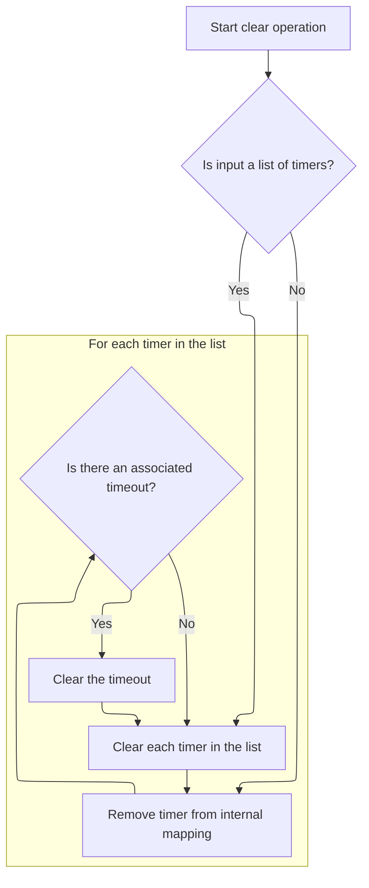
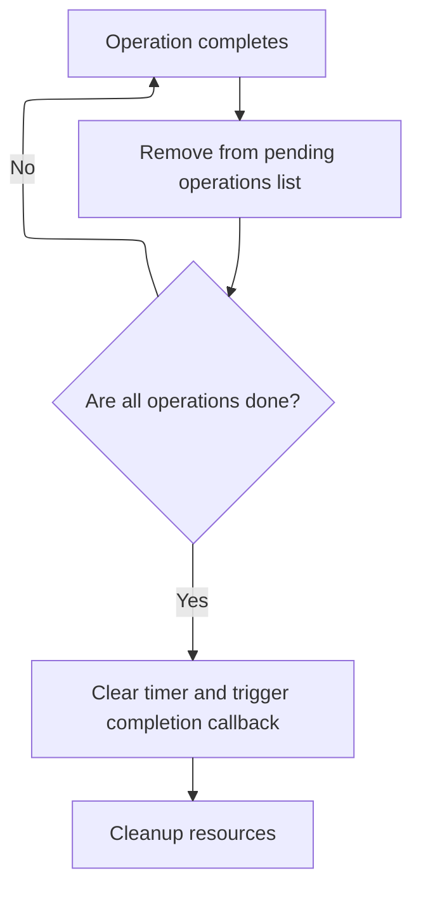

This document explains how multiple asynchronous operations are coordinated and finalized. The flow tracks a group of async tasks, clears any active timers when all are complete, and triggers a completion callback to signal that the group has finished.

# Where is this flow used?

This flow is used multiple times in the codebase as represented in the following diagram:

```mermaid
graph TD;
      589c95bccd4577a1273056e1fb31eefb0e6035f4411ecfbef5dd1a3ceaec5ce0(shopizer/…/modules/ISC_Core.js::isc_c_Page_waitForMultiple) --> bd522944660b5caeeeeae194e097af8d94b5dd81ee31a0a42cecc2e9d56e4598(shopizer/…/modules/ISC_Core.js::$59n):::mainFlowStyle

8faf4cb18e3e8616d40dd46016b84b1ede994504ac9d1454522928f37458b391(shopizer/…/modules/ISC_Core.js::waitForMultiple) --> bd522944660b5caeeeeae194e097af8d94b5dd81ee31a0a42cecc2e9d56e4598(shopizer/…/modules/ISC_Core.js::$59n):::mainFlowStyle

cc78d6d47e46b15af0bbc4e549ef713678c5340e115e7bdd55aeac355d314380(shopizer/…/modules/ISC_Core.js::_fired) --> bd522944660b5caeeeeae194e097af8d94b5dd81ee31a0a42cecc2e9d56e4598(shopizer/…/modules/ISC_Core.js::$59n):::mainFlowStyle


classDef mainFlowStyle color:#000000,fill:#7CB9F4
classDef rootsStyle color:#000000,fill:#00FFF4
classDef Style1 color:#000000,fill:#00FFAA
classDef Style2 color:#000000,fill:#FFFF00
classDef Style3 color:#000000,fill:#AA7CB9

%% Swimm:
%% graph TD;
%%       589c95bccd4577a1273056e1fb31eefb0e6035f4411ecfbef5dd1a3ceaec5ce0(<SwmPath>[shopizer/…/modules/ISC_Core.js](shopizer/sm-shop/src/main/webapp/resources/smart-client/system/modules/ISC_Core.js)</SwmPath>::<SwmToken path="shopizer/sm-shop/src/main/webapp/resources/smart-client/system/modules/ISC_Core.js" pos="1238:9:9" line-data=",isc.A.waitForMultiple=function isc_c_Page_waitForMultiple(_1,_2,_3,_4){var _5=true;var _6=isc.Class.create({$59l:_1,$59m:[],$547:_2,$59n:function(_9){this.$59m.remove(_9);if(this.$59m.isEmpty()){if(this.$59i){isc.Timer.clear(this.$59i)}">`isc_c_Page_waitForMultiple`</SwmToken>) --> bd522944660b5caeeeeae194e097af8d94b5dd81ee31a0a42cecc2e9d56e4598(<SwmPath>[shopizer/…/modules/ISC_Core.js](shopizer/sm-shop/src/main/webapp/resources/smart-client/system/modules/ISC_Core.js)</SwmPath>::$59n):::mainFlowStyle
%% 
%% 8faf4cb18e3e8616d40dd46016b84b1ede994504ac9d1454522928f37458b391(<SwmPath>[shopizer/…/modules/ISC_Core.js](shopizer/sm-shop/src/main/webapp/resources/smart-client/system/modules/ISC_Core.js)</SwmPath>::<SwmToken path="shopizer/sm-shop/src/main/webapp/resources/smart-client/system/modules/ISC_Core.js" pos="1238:5:5" line-data=",isc.A.waitForMultiple=function isc_c_Page_waitForMultiple(_1,_2,_3,_4){var _5=true;var _6=isc.Class.create({$59l:_1,$59m:[],$547:_2,$59n:function(_9){this.$59m.remove(_9);if(this.$59m.isEmpty()){if(this.$59i){isc.Timer.clear(this.$59i)}">`waitForMultiple`</SwmToken>) --> bd522944660b5caeeeeae194e097af8d94b5dd81ee31a0a42cecc2e9d56e4598(<SwmPath>[shopizer/…/modules/ISC_Core.js](shopizer/sm-shop/src/main/webapp/resources/smart-client/system/modules/ISC_Core.js)</SwmPath>::$59n):::mainFlowStyle
%% 
%% cc78d6d47e46b15af0bbc4e549ef713678c5340e115e7bdd55aeac355d314380(<SwmPath>[shopizer/…/modules/ISC_Core.js](shopizer/sm-shop/src/main/webapp/resources/smart-client/system/modules/ISC_Core.js)</SwmPath>::_fired) --> bd522944660b5caeeeeae194e097af8d94b5dd81ee31a0a42cecc2e9d56e4598(<SwmPath>[shopizer/…/modules/ISC_Core.js](shopizer/sm-shop/src/main/webapp/resources/smart-client/system/modules/ISC_Core.js)</SwmPath>::$59n):::mainFlowStyle
%% 
%% 
%% classDef mainFlowStyle color:#000000,fill:#7CB9F4
%% classDef rootsStyle color:#000000,fill:#00FFF4
%% classDef Style1 color:#000000,fill:#00FFAA
%% classDef Style2 color:#000000,fill:#FFFF00
%% classDef Style3 color:#000000,fill:#AA7CB9
```



# Managing Completion of Multiple Async Items

<SwmSnippet path="/shopizer/sm-shop/src/main/webapp/resources/smart-client/system/modules/ISC_Core.js" line="1238">

---

In <SwmToken path="shopizer/sm-shop/src/main/webapp/resources/smart-client/system/modules/ISC_Core.js" pos="1238:9:9" line-data=",isc.A.waitForMultiple=function isc_c_Page_waitForMultiple(_1,_2,_3,_4){var _5=true;var _6=isc.Class.create({$59l:_1,$59m:[],$547:_2,$59n:function(_9){this.$59m.remove(_9);if(this.$59m.isEmpty()){if(this.$59i){isc.Timer.clear(this.$59i)}">`isc_c_Page_waitForMultiple`</SwmToken>, we set up a class instance to track multiple async items. The $59n method handles removing an item from the list and checks if all are done. If so, we clear any active timer to avoid leftover timeouts before moving on. This is more than a simple wait—it manages a group of async events and their cleanup.

```javascript
,isc.A.waitForMultiple=function isc_c_Page_waitForMultiple(_1,_2,_3,_4){var _5=true;var _6=isc.Class.create({$59l:_1,$59m:[],$547:_2,$59n:function(_9){this.$59m.remove(_9);if(this.$59m.isEmpty()){if(this.$59i){isc.Timer.clear(this.$59i)}
```

---

</SwmSnippet>

## Cleaning Up Timers



<SwmSnippet path="/shopizer/sm-shop/src/main/webapp/resources/smart-client/system/modules/ISC_Core.js" line="1285">

---

In <SwmToken path="shopizer/sm-shop/src/main/webapp/resources/smart-client/system/modules/ISC_Core.js" pos="1285:9:9" line-data=",isc.A.clear=function isc_c_Timer_clear(_1){if(isc.isAn.Array(_1))">`isc_c_Timer_clear`</SwmToken>, we handle both single and multiple timer ids. If an array is passed, we recursively clear each timer. For single ids, we use internal mappings to find and clean up references before clearing the actual browser timer.

```javascript
,isc.A.clear=function isc_c_Timer_clear(_1){if(isc.isAn.Array(_1))
for(var i=0;i<_1.length;i++)this.clear(_1[i]);else{var _3=this.$ip[_1];delete this[_3]
```

---

</SwmSnippet>

<SwmSnippet path="/shopizer/sm-shop/src/main/webapp/resources/smart-client/system/modules/ISC_Core.js" line="1286">

---

After clearing timers and cleaning up internal mappings, <SwmToken path="shopizer/sm-shop/src/main/webapp/resources/smart-client/system/modules/ISC_Core.js" pos="1285:9:9" line-data=",isc.A.clear=function isc_c_Timer_clear(_1){if(isc.isAn.Array(_1))">`isc_c_Timer_clear`</SwmToken> just returns null. No status or result is given; it's purely for cleanup.

```javascript
for(var i=0;i<_1.length;i++)this.clear(_1[i]);else{var _3=this.$ip[_1];delete this[_3]
delete this.$ip[_1];if(this.$614&&this.$614[_3]){_1=this.$614[_3];delete this.$614[_3]}
clearTimeout(_1)}
return null}
```

---

</SwmSnippet>

## Triggering Completion Callback



<SwmSnippet path="/shopizer/sm-shop/src/main/webapp/resources/smart-client/system/modules/ISC_Core.js" line="1238">

---

Back in $59n, after clearing timers, we immediately fire the callback to signal completion to the client, then destroy the instance to clean up. This wraps up the async waiting logic.

```javascript
,isc.A.waitForMultiple=function isc_c_Page_waitForMultiple(_1,_2,_3,_4){var _5=true;var _6=isc.Class.create({$59l:_1,$59m:[],$547:_2,$59n:function(_9){this.$59m.remove(_9);if(this.$59m.isEmpty()){if(this.$59i){isc.Timer.clear(this.$59i)}
this.fireCallback(this.$547);this.destroy()}},$59j:function(){var _7=this.$59m;for(var i=0;i<_7.length;i++){_7[i].ignore(_7[i].$545,_7[i].$546);_7[i].destroy()}
```

---

</SwmSnippet>

# Resolving and Invoking the Callback

```mermaid
%%{init: {"flowchart": {"defaultRenderer": "elk"}} }%%
flowchart TD
  node1{"Is a callback provided?"}
  click node1 openCode "shopizer/sm-shop/src/main/webapp/resources/smart-client/system/modules/ISC_Core.js:295:302"
  node1 -->|"No"| node2["Do nothing"]
  click node2 openCode "shopizer/sm-shop/src/main/webapp/resources/smart-client/system/modules/ISC_Core.js:295:302"
  node1 -->|"Yes"| node3{"Can callback be resolved to a function?"}
  click node3 openCode "shopizer/sm-shop/src/main/webapp/resources/smart-client/system/modules/ISC_Core.js:295:302"
  node3 -->|"No"| node4["Log warning and exit"]
  click node4 openCode "shopizer/sm-shop/src/main/webapp/resources/smart-client/system/modules/ISC_Core.js:297:297"
  node3 -->|"Yes"| node5{"Is target valid (not destroyed)?"}
  click node5 openCode "shopizer/sm-shop/src/main/webapp/resources/smart-client/system/modules/ISC_Core.js:298:299"
  node5 -->|"No"| node6["Log info and exit"]
  click node6 openCode "shopizer/sm-shop/src/main/webapp/resources/smart-client/system/modules/ISC_Core.js:298:299"
  node5 -->|"Yes"| node7["Prepare arguments for callback"]
  click node7 openCode "shopizer/sm-shop/src/main/webapp/resources/smart-client/system/modules/ISC_Core.js:300:300"
  node7 --> node8{"IE cross-window callback?"}
  click node8 openCode "shopizer/sm-shop/src/main/webapp/resources/smart-client/system/modules/ISC_Core.js:300:300"
  node8 -->|"No"| node11
  subgraph loop1["For each argument (IE cross-window)"]
    node8 -->|"Yes"| node9["Copy argument to new array"]
    click node9 openCode "shopizer/sm-shop/src/main/webapp/resources/smart-client/system/modules/ISC_Core.js:300:300"
    node9 --> node10["All arguments copied"]
    click node10 openCode "shopizer/sm-shop/src/main/webapp/resources/smart-client/system/modules/ISC_Core.js:300:300"
    node10 --> node11["Execute callback (with or without error handling)"]
    click node11 openCode "shopizer/sm-shop/src/main/webapp/resources/smart-client/system/modules/ISC_Core.js:301:302"
  end
  node8 -->|"No"| node11["Execute callback (with or without error handling)"]
  click node11 openCode "shopizer/sm-shop/src/main/webapp/resources/smart-client/system/modules/ISC_Core.js:301:302"
  node11 --> node12["Return result"]
  click node12 openCode "shopizer/sm-shop/src/main/webapp/resources/smart-client/system/modules/ISC_Core.js:302:302"

classDef HeadingStyle fill:#777777,stroke:#333,stroke-width:2px;

%% Swimm:
%% %%{init: {"flowchart": {"defaultRenderer": "elk"}} }%%
%% flowchart TD
%%   node1{"Is a callback provided?"}
%%   click node1 openCode "<SwmPath>[shopizer/…/modules/ISC_Core.js](shopizer/sm-shop/src/main/webapp/resources/smart-client/system/modules/ISC_Core.js)</SwmPath>:295:302"
%%   node1 -->|"No"| node2["Do nothing"]
%%   click node2 openCode "<SwmPath>[shopizer/…/modules/ISC_Core.js](shopizer/sm-shop/src/main/webapp/resources/smart-client/system/modules/ISC_Core.js)</SwmPath>:295:302"
%%   node1 -->|"Yes"| node3{"Can callback be resolved to a function?"}
%%   click node3 openCode "<SwmPath>[shopizer/…/modules/ISC_Core.js](shopizer/sm-shop/src/main/webapp/resources/smart-client/system/modules/ISC_Core.js)</SwmPath>:295:302"
%%   node3 -->|"No"| node4["Log warning and exit"]
%%   click node4 openCode "<SwmPath>[shopizer/…/modules/ISC_Core.js](shopizer/sm-shop/src/main/webapp/resources/smart-client/system/modules/ISC_Core.js)</SwmPath>:297:297"
%%   node3 -->|"Yes"| node5{"Is target valid (not destroyed)?"}
%%   click node5 openCode "<SwmPath>[shopizer/…/modules/ISC_Core.js](shopizer/sm-shop/src/main/webapp/resources/smart-client/system/modules/ISC_Core.js)</SwmPath>:298:299"
%%   node5 -->|"No"| node6["Log info and exit"]
%%   click node6 openCode "<SwmPath>[shopizer/…/modules/ISC_Core.js](shopizer/sm-shop/src/main/webapp/resources/smart-client/system/modules/ISC_Core.js)</SwmPath>:298:299"
%%   node5 -->|"Yes"| node7["Prepare arguments for callback"]
%%   click node7 openCode "<SwmPath>[shopizer/…/modules/ISC_Core.js](shopizer/sm-shop/src/main/webapp/resources/smart-client/system/modules/ISC_Core.js)</SwmPath>:300:300"
%%   node7 --> node8{"IE cross-window callback?"}
%%   click node8 openCode "<SwmPath>[shopizer/…/modules/ISC_Core.js](shopizer/sm-shop/src/main/webapp/resources/smart-client/system/modules/ISC_Core.js)</SwmPath>:300:300"
%%   node8 -->|"No"| node11
%%   subgraph loop1["For each argument (IE cross-window)"]
%%     node8 -->|"Yes"| node9["Copy argument to new array"]
%%     click node9 openCode "<SwmPath>[shopizer/…/modules/ISC_Core.js](shopizer/sm-shop/src/main/webapp/resources/smart-client/system/modules/ISC_Core.js)</SwmPath>:300:300"
%%     node9 --> node10["All arguments copied"]
%%     click node10 openCode "<SwmPath>[shopizer/…/modules/ISC_Core.js](shopizer/sm-shop/src/main/webapp/resources/smart-client/system/modules/ISC_Core.js)</SwmPath>:300:300"
%%     node10 --> node11["Execute callback (with or without error handling)"]
%%     click node11 openCode "<SwmPath>[shopizer/…/modules/ISC_Core.js](shopizer/sm-shop/src/main/webapp/resources/smart-client/system/modules/ISC_Core.js)</SwmPath>:301:302"
%%   end
%%   node8 -->|"No"| node11["Execute callback (with or without error handling)"]
%%   click node11 openCode "<SwmPath>[shopizer/…/modules/ISC_Core.js](shopizer/sm-shop/src/main/webapp/resources/smart-client/system/modules/ISC_Core.js)</SwmPath>:301:302"
%%   node11 --> node12["Return result"]
%%   click node12 openCode "<SwmPath>[shopizer/…/modules/ISC_Core.js](shopizer/sm-shop/src/main/webapp/resources/smart-client/system/modules/ISC_Core.js)</SwmPath>:302:302"
%% 
%% classDef HeadingStyle fill:#777777,stroke:#333,stroke-width:<SwmToken path="shopizer/sm-shop/src/main/webapp/resources/smart-client/system/modules/ISC_Core.js" pos="1005:95:95" line-data=",isc.A.showHiliteCanvas=function isc_c_Log_showHiliteCanvas(_1){var _2=this._hiliteCanvas;if(!_2){_2=this._hiliteCanvas=isc.Canvas.create({ID:&quot;logHiliteCanvas&quot;,autoDraw:false,overflow:&quot;hidden&quot;,hide:function(){this.Super(&quot;hide&quot;,arguments);this.resizeTo(1,1);this.setTop(-20)},border1:&quot;2px dotted red&quot;,border2:&quot;2px dotted white&quot;})}">`2px`</SwmToken>;
```



<SwmSnippet path="/shopizer/sm-shop/src/main/webapp/resources/smart-client/system/modules/ISC_Core.js" line="295">

---

In <SwmToken path="shopizer/sm-shop/src/main/webapp/resources/smart-client/system/modules/ISC_Core.js" pos="295:9:9" line-data=",isc.A.fireCallback=function isc_c_Class_fireCallback(_1,_2,_3,_4,_5){arguments.$cw=this;if(_1==null)return;var _6;if(_2==null)_2=_6;var _7=_1;if(isc.isA.String(_1)){if(_4!=null&amp;&amp;isc.isA.Function(_4[_1]))_7=_4[_1];else _7=this.$c5(_1,_2)}else if(isc.isAn.Object(_1)&amp;&amp;!isc.isA.Function(_1)){if(_1.caller!=null)_4=_1.caller;else if(_1.target!=null)_4=_1.target;if(_1.args)_3=_1.args;if(_1.argNames)_2=_1.argNames;if(_1.method)_7=_1.method;else if(_1.methodName&amp;&amp;_4!=null)_7=_4[_1.methodName];else if(_1.action)">`isc_c_Class_fireCallback`</SwmToken>, we resolve the callback from various formats (string, object, function), set up the target context, and handle special cases like destroyed targets and IE quirks for cross-window calls.

```javascript
,isc.A.fireCallback=function isc_c_Class_fireCallback(_1,_2,_3,_4,_5){arguments.$cw=this;if(_1==null)return;var _6;if(_2==null)_2=_6;var _7=_1;if(isc.isA.String(_1)){if(_4!=null&&isc.isA.Function(_4[_1]))_7=_4[_1];else _7=this.$c5(_1,_2)}else if(isc.isAn.Object(_1)&&!isc.isA.Function(_1)){if(_1.caller!=null)_4=_1.caller;else if(_1.target!=null)_4=_1.target;if(_1.args)_3=_1.args;if(_1.argNames)_2=_1.argNames;if(_1.method)_7=_1.method;else if(_1.methodName&&_4!=null)_7=_4[_1.methodName];else if(_1.action)
_7=this.$c5(_1.action,_2)}
if(!isc.isA.Function(_7)){this.logWarn("fireCallback() unable to convert callback: "+this.echo(_1)+" to a function.  target: "+_4+", argNames: "+_2+", args: "+_3);return}
if(_4==null)_4=window;else if(_4.destroyed){if(this.logIsInfoEnabled("callbacks")){this.logInfo("aborting attempt to fire callback on destroyed target:"+_4+". Callback:"+isc.Log.echo(_1)+",\n stack:"+this.getStackTrace())}
return}
_7.$c6=true;if(_3==null)_3=[];if(isc.enableCrossWindowCallbacks&&isc.Browser.isIE){var _8=_4.constructor?_4.constructor.$ch:_4;if(_8&&_8!=window&&_8.isc){var _9=_8.Array.newInstance();for(var i=0;i<_3.length;i++)_9[i]=_3[i];_3=_9}}
```

---

</SwmSnippet>

<SwmSnippet path="/shopizer/sm-shop/src/main/webapp/resources/smart-client/system/modules/ISC_Core.js" line="300">

---

After prepping the callback and handling IE quirks, <SwmToken path="shopizer/sm-shop/src/main/webapp/resources/smart-client/system/modules/ISC_Core.js" pos="295:9:9" line-data=",isc.A.fireCallback=function isc_c_Class_fireCallback(_1,_2,_3,_4,_5){arguments.$cw=this;if(_1==null)return;var _6;if(_2==null)_2=_6;var _7=_1;if(isc.isA.String(_1)){if(_4!=null&amp;&amp;isc.isA.Function(_4[_1]))_7=_4[_1];else _7=this.$c5(_1,_2)}else if(isc.isAn.Object(_1)&amp;&amp;!isc.isA.Function(_1)){if(_1.caller!=null)_4=_1.caller;else if(_1.target!=null)_4=_1.target;if(_1.args)_3=_1.args;if(_1.argNames)_2=_1.argNames;if(_1.method)_7=_1.method;else if(_1.methodName&amp;&amp;_4!=null)_7=_4[_1.methodName];else if(_1.action)">`isc_c_Class_fireCallback`</SwmToken> calls the function and returns its result, passing through any value from the callback.

```javascript
_7.$c6=true;if(_3==null)_3=[];if(isc.enableCrossWindowCallbacks&&isc.Browser.isIE){var _8=_4.constructor?_4.constructor.$ch:_4;if(_8&&_8!=window&&_8.isc){var _9=_8.Array.newInstance();for(var i=0;i<_3.length;i++)_9[i]=_3[i];_3=_9}}
var _11;if(!_5||isc.Log.supportsOnError){_11=_7.apply(_4,_3)}else{try{_11=_7.apply(_4,_3)}catch(e){isc.Log.$am(e);throw e;}}
return _11}
```

---

</SwmSnippet>

&nbsp;

*This is an auto-generated document by Swimm 🌊 and has not yet been verified by a human*

<SwmMeta version="3.0.0" repo-id="Z2l0aHViJTNBJTNBU2hvcGl6ZXIlM0ElM0F1bWFsaW5nYXN3YW1p" repo-name="Shopizer"><sup>Powered by [Swimm](https://app.swimm.io/)</sup></SwmMeta>
