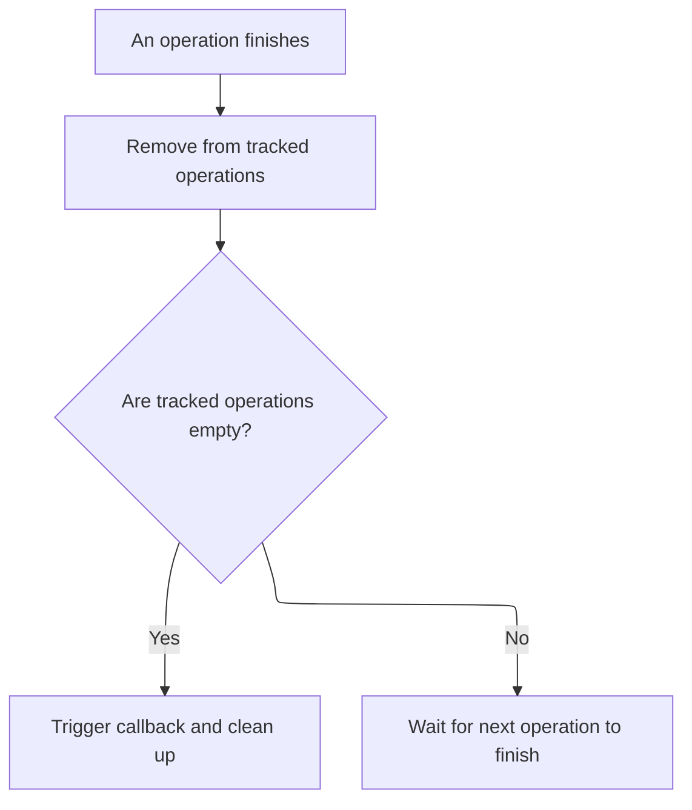

This document describes how the system coordinates the completion of multiple asynchronous operations, ensuring a callback is executed only when all tracked operations have finished. The flow also cleans up timers and internal references to prevent memory leaks.

# Where is this flow used?

This flow is used multiple times in the codebase as represented in the following diagram:

```mermaid
graph TD;
      589c95bccd4577a1273056e1fb31eefb0e6035f4411ecfbef5dd1a3ceaec5ce0(shopizer/…/modules/ISC_Core.js::isc_c_Page_waitForMultiple) --> bd522944660b5caeeeeae194e097af8d94b5dd81ee31a0a42cecc2e9d56e4598(shopizer/…/modules/ISC_Core.js::$59n):::mainFlowStyle

8faf4cb18e3e8616d40dd46016b84b1ede994504ac9d1454522928f37458b391(shopizer/…/modules/ISC_Core.js::waitForMultiple) --> bd522944660b5caeeeeae194e097af8d94b5dd81ee31a0a42cecc2e9d56e4598(shopizer/…/modules/ISC_Core.js::$59n):::mainFlowStyle

cc78d6d47e46b15af0bbc4e549ef713678c5340e115e7bdd55aeac355d314380(shopizer/…/modules/ISC_Core.js::_fired) --> bd522944660b5caeeeeae194e097af8d94b5dd81ee31a0a42cecc2e9d56e4598(shopizer/…/modules/ISC_Core.js::$59n):::mainFlowStyle


classDef mainFlowStyle color:#000000,fill:#7CB9F4
classDef rootsStyle color:#000000,fill:#00FFF4
classDef Style1 color:#000000,fill:#00FFAA
classDef Style2 color:#000000,fill:#FFFF00
classDef Style3 color:#000000,fill:#AA7CB9

%% Swimm:
%% graph TD;
%%       589c95bccd4577a1273056e1fb31eefb0e6035f4411ecfbef5dd1a3ceaec5ce0(<SwmPath>[shopizer/…/modules/ISC_Core.js](shopizer/sm-shop/src/main/webapp/resources/smart-client/system/modules/ISC_Core.js)</SwmPath>::<SwmToken path="shopizer/sm-shop/src/main/webapp/resources/smart-client/system/modules/ISC_Core.js" pos="1238:9:9" line-data=",isc.A.waitForMultiple=function isc_c_Page_waitForMultiple(_1,_2,_3,_4){var _5=true;var _6=isc.Class.create({$59l:_1,$59m:[],$547:_2,$59n:function(_9){this.$59m.remove(_9);if(this.$59m.isEmpty()){if(this.$59i){isc.Timer.clear(this.$59i)}">`isc_c_Page_waitForMultiple`</SwmToken>) --> bd522944660b5caeeeeae194e097af8d94b5dd81ee31a0a42cecc2e9d56e4598(<SwmPath>[shopizer/…/modules/ISC_Core.js](shopizer/sm-shop/src/main/webapp/resources/smart-client/system/modules/ISC_Core.js)</SwmPath>::$59n):::mainFlowStyle
%% 
%% 8faf4cb18e3e8616d40dd46016b84b1ede994504ac9d1454522928f37458b391(<SwmPath>[shopizer/…/modules/ISC_Core.js](shopizer/sm-shop/src/main/webapp/resources/smart-client/system/modules/ISC_Core.js)</SwmPath>::<SwmToken path="shopizer/sm-shop/src/main/webapp/resources/smart-client/system/modules/ISC_Core.js" pos="1238:5:5" line-data=",isc.A.waitForMultiple=function isc_c_Page_waitForMultiple(_1,_2,_3,_4){var _5=true;var _6=isc.Class.create({$59l:_1,$59m:[],$547:_2,$59n:function(_9){this.$59m.remove(_9);if(this.$59m.isEmpty()){if(this.$59i){isc.Timer.clear(this.$59i)}">`waitForMultiple`</SwmToken>) --> bd522944660b5caeeeeae194e097af8d94b5dd81ee31a0a42cecc2e9d56e4598(<SwmPath>[shopizer/…/modules/ISC_Core.js](shopizer/sm-shop/src/main/webapp/resources/smart-client/system/modules/ISC_Core.js)</SwmPath>::$59n):::mainFlowStyle
%% 
%% cc78d6d47e46b15af0bbc4e549ef713678c5340e115e7bdd55aeac355d314380(<SwmPath>[shopizer/…/modules/ISC_Core.js](shopizer/sm-shop/src/main/webapp/resources/smart-client/system/modules/ISC_Core.js)</SwmPath>::_fired) --> bd522944660b5caeeeeae194e097af8d94b5dd81ee31a0a42cecc2e9d56e4598(<SwmPath>[shopizer/…/modules/ISC_Core.js](shopizer/sm-shop/src/main/webapp/resources/smart-client/system/modules/ISC_Core.js)</SwmPath>::$59n):::mainFlowStyle
%% 
%% 
%% classDef mainFlowStyle color:#000000,fill:#7CB9F4
%% classDef rootsStyle color:#000000,fill:#00FFF4
%% classDef Style1 color:#000000,fill:#00FFAA
%% classDef Style2 color:#000000,fill:#FFFF00
%% classDef Style3 color:#000000,fill:#AA7CB9
```



# Handling completion of multiple async events

This section ensures that asynchronous events are tracked and that timeout logic is only active while there are pending events. It provides a mechanism to stop waiting once all events have completed.

<SwmSnippet path="/shopizer/sm-shop/src/main/webapp/resources/smart-client/system/modules/ISC_Core.js" line="1238">

---

In `$59n`, we remove the completed item from the pending list. If nothing is left to wait for, we clear the timer to stop any further timeout logic. This relies on the assumption that the objects in the list have specific event properties and methods, which isn't obvious from the function signature.

```javascript
,isc.A.waitForMultiple=function isc_c_Page_waitForMultiple(_1,_2,_3,_4){var _5=true;var _6=isc.Class.create({$59l:_1,$59m:[],$547:_2,$59n:function(_9){this.$59m.remove(_9);if(this.$59m.isEmpty()){if(this.$59i){isc.Timer.clear(this.$59i)}
```

---

</SwmSnippet>

## Clearing timers and internal references

This section ensures that timers and their associated internal references are properly cleared from the system, maintaining a clean timer registry and preventing memory leaks.

| Category       | Rule Name                  | Description                                                                                                       |
| -------------- | -------------------------- | ----------------------------------------------------------------------------------------------------------------- |
| Business logic | Batch timer clearing       | If the input is an array of timer identifiers, each timer in the array must be cleared individually.              |
| Business logic | Internal reference cleanup | For each timer identifier, all associated internal references must be removed before the timer itself is cleared. |

<SwmSnippet path="/shopizer/sm-shop/src/main/webapp/resources/smart-client/system/modules/ISC_Core.js" line="1285">

---

In <SwmToken path="shopizer/sm-shop/src/main/webapp/resources/smart-client/system/modules/ISC_Core.js" pos="1285:5:5" line-data=",isc.A.clear=function isc_c_Timer_clear(_1){if(isc.isAn.Array(_1))">`clear`</SwmToken>, we check if the input is an array and recursively clear each timer. For single identifiers, we use internal mappings to find and delete associated references before clearing the actual timer. This keeps the timer registry clean and avoids leaks.

```javascript
,isc.A.clear=function isc_c_Timer_clear(_1){if(isc.isAn.Array(_1))
for(var i=0;i<_1.length;i++)this.clear(_1[i]);else{var _3=this.$ip[_1];delete this[_3]
```

---

</SwmSnippet>

<SwmSnippet path="/shopizer/sm-shop/src/main/webapp/resources/smart-client/system/modules/ISC_Core.js" line="1286">

---

After clearing the timer and cleaning up internal mappings, <SwmToken path="shopizer/sm-shop/src/main/webapp/resources/smart-client/system/modules/ISC_Core.js" pos="1286:19:19" line-data="for(var i=0;i&lt;_1.length;i++)this.clear(_1[i]);else{var _3=this.$ip[_1];delete this[_3]">`clear`</SwmToken> just returns null to indicate it's done. No result is expected or needed.

```javascript
for(var i=0;i<_1.length;i++)this.clear(_1[i]);else{var _3=this.$ip[_1];delete this[_3]
delete this.$ip[_1];if(this.$614&&this.$614[_3]){_1=this.$614[_3];delete this.$614[_3]}
clearTimeout(_1)}
return null}
```

---

</SwmSnippet>

## Finalizing and firing completion callback



<SwmSnippet path="/shopizer/sm-shop/src/main/webapp/resources/smart-client/system/modules/ISC_Core.js" line="1238">

---

In <SwmToken path="shopizer/sm-shop/src/main/webapp/resources/smart-client/system/modules/ISC_Core.js" pos="1239:2:2" line-data="this.fireCallback(this.$547);this.destroy()}},$59j:function(){var _7=this.$59m;for(var i=0;i&lt;_7.length;i++){_7[i].ignore(_7[i].$545,_7[i].$546);_7[i].destroy()}">`fireCallback`</SwmToken>, we figure out what function to call based on the type and properties of the first argument, and set up the right target context. If the target is destroyed, we bail out. For IE, we handle cross-window argument arrays specially.

```javascript
,isc.A.waitForMultiple=function isc_c_Page_waitForMultiple(_1,_2,_3,_4){var _5=true;var _6=isc.Class.create({$59l:_1,$59m:[],$547:_2,$59n:function(_9){this.$59m.remove(_9);if(this.$59m.isEmpty()){if(this.$59i){isc.Timer.clear(this.$59i)}
this.fireCallback(this.$547);this.destroy()}},$59j:function(){var _7=this.$59m;for(var i=0;i<_7.length;i++){_7[i].ignore(_7[i].$545,_7[i].$546);_7[i].destroy()}
```

---

</SwmSnippet>

# Resolving and executing the callback

```mermaid
%%{init: {"flowchart": {"defaultRenderer": "elk"}} }%%
flowchart TD
  node1{"Is callback provided?"}
  click node1 openCode "shopizer/sm-shop/src/main/webapp/resources/smart-client/system/modules/ISC_Core.js:295:296"
  node1 -->|"No"| node2["Return"]
  click node2 openCode "shopizer/sm-shop/src/main/webapp/resources/smart-client/system/modules/ISC_Core.js:295:296"
  node1 -->|"Yes"| node3{"Callback type?"}
  click node3 openCode "shopizer/sm-shop/src/main/webapp/resources/smart-client/system/modules/ISC_Core.js:295:296"
  node3 -->|"String"| node4["Resolve callback from string"]
  click node4 openCode "shopizer/sm-shop/src/main/webapp/resources/smart-client/system/modules/ISC_Core.js:295:296"
  node3 -->|"Object"| node5["Resolve callback from object"]
  click node5 openCode "shopizer/sm-shop/src/main/webapp/resources/smart-client/system/modules/ISC_Core.js:295:296"
  node3 -->|"Function"| node6["Use callback directly"]
  click node6 openCode "shopizer/sm-shop/src/main/webapp/resources/smart-client/system/modules/ISC_Core.js:295:296"
  node4 --> node7{"Is resolved callback a function?"}
  node5 --> node7
  node6 --> node7
  click node7 openCode "shopizer/sm-shop/src/main/webapp/resources/smart-client/system/modules/ISC_Core.js:297:297"
  node7 -->|"No"| node8["Abort and log"]
  click node8 openCode "shopizer/sm-shop/src/main/webapp/resources/smart-client/system/modules/ISC_Core.js:297:297"
  node7 -->|"Yes"| node9{"Is target valid?"}
  click node9 openCode "shopizer/sm-shop/src/main/webapp/resources/smart-client/system/modules/ISC_Core.js:298:299"
  node9 -->|"No"| node8
  node9 -->|"Yes"| node10["Prepare arguments"]
  click node10 openCode "shopizer/sm-shop/src/main/webapp/resources/smart-client/system/modules/ISC_Core.js:300:300"
  node10 --> node11{"IE cross-window callback?"}
  click node11 openCode "shopizer/sm-shop/src/main/webapp/resources/smart-client/system/modules/ISC_Core.js:300:301"
  subgraph loop1["Copy each argument for IE cross-window"]
    node11 -->|"Yes"| node12["Copy arguments in loop"]
    click node12 openCode "shopizer/sm-shop/src/main/webapp/resources/smart-client/system/modules/ISC_Core.js:300:301"
    node12 --> node13{"Should errors be caught?"}
    click node13 openCode "shopizer/sm-shop/src/main/webapp/resources/smart-client/system/modules/ISC_Core.js:301:302"
    node13 -->|"Yes"| node14["Try to execute callback, catch and log errors"]
    click node14 openCode "shopizer/sm-shop/src/main/webapp/resources/smart-client/system/modules/ISC_Core.js:301:302"
    node13 -->|"No"| node15["Execute callback"]
    click node15 openCode "shopizer/sm-shop/src/main/webapp/resources/smart-client/system/modules/ISC_Core.js:301:302"
    node14 --> node16["Return result"]
    node15 --> node16
    click node16 openCode "shopizer/sm-shop/src/main/webapp/resources/smart-client/system/modules/ISC_Core.js:302:302"
  end
  node11 -->|"No"| node13

classDef HeadingStyle fill:#777777,stroke:#333,stroke-width:2px;

%% Swimm:
%% %%{init: {"flowchart": {"defaultRenderer": "elk"}} }%%
%% flowchart TD
%%   node1{"Is callback provided?"}
%%   click node1 openCode "<SwmPath>[shopizer/…/modules/ISC_Core.js](shopizer/sm-shop/src/main/webapp/resources/smart-client/system/modules/ISC_Core.js)</SwmPath>:295:296"
%%   node1 -->|"No"| node2["Return"]
%%   click node2 openCode "<SwmPath>[shopizer/…/modules/ISC_Core.js](shopizer/sm-shop/src/main/webapp/resources/smart-client/system/modules/ISC_Core.js)</SwmPath>:295:296"
%%   node1 -->|"Yes"| node3{"Callback type?"}
%%   click node3 openCode "<SwmPath>[shopizer/…/modules/ISC_Core.js](shopizer/sm-shop/src/main/webapp/resources/smart-client/system/modules/ISC_Core.js)</SwmPath>:295:296"
%%   node3 -->|"String"| node4["Resolve callback from string"]
%%   click node4 openCode "<SwmPath>[shopizer/…/modules/ISC_Core.js](shopizer/sm-shop/src/main/webapp/resources/smart-client/system/modules/ISC_Core.js)</SwmPath>:295:296"
%%   node3 -->|"Object"| node5["Resolve callback from object"]
%%   click node5 openCode "<SwmPath>[shopizer/…/modules/ISC_Core.js](shopizer/sm-shop/src/main/webapp/resources/smart-client/system/modules/ISC_Core.js)</SwmPath>:295:296"
%%   node3 -->|"Function"| node6["Use callback directly"]
%%   click node6 openCode "<SwmPath>[shopizer/…/modules/ISC_Core.js](shopizer/sm-shop/src/main/webapp/resources/smart-client/system/modules/ISC_Core.js)</SwmPath>:295:296"
%%   node4 --> node7{"Is resolved callback a function?"}
%%   node5 --> node7
%%   node6 --> node7
%%   click node7 openCode "<SwmPath>[shopizer/…/modules/ISC_Core.js](shopizer/sm-shop/src/main/webapp/resources/smart-client/system/modules/ISC_Core.js)</SwmPath>:297:297"
%%   node7 -->|"No"| node8["Abort and log"]
%%   click node8 openCode "<SwmPath>[shopizer/…/modules/ISC_Core.js](shopizer/sm-shop/src/main/webapp/resources/smart-client/system/modules/ISC_Core.js)</SwmPath>:297:297"
%%   node7 -->|"Yes"| node9{"Is target valid?"}
%%   click node9 openCode "<SwmPath>[shopizer/…/modules/ISC_Core.js](shopizer/sm-shop/src/main/webapp/resources/smart-client/system/modules/ISC_Core.js)</SwmPath>:298:299"
%%   node9 -->|"No"| node8
%%   node9 -->|"Yes"| node10["Prepare arguments"]
%%   click node10 openCode "<SwmPath>[shopizer/…/modules/ISC_Core.js](shopizer/sm-shop/src/main/webapp/resources/smart-client/system/modules/ISC_Core.js)</SwmPath>:300:300"
%%   node10 --> node11{"IE cross-window callback?"}
%%   click node11 openCode "<SwmPath>[shopizer/…/modules/ISC_Core.js](shopizer/sm-shop/src/main/webapp/resources/smart-client/system/modules/ISC_Core.js)</SwmPath>:300:301"
%%   subgraph loop1["Copy each argument for IE cross-window"]
%%     node11 -->|"Yes"| node12["Copy arguments in loop"]
%%     click node12 openCode "<SwmPath>[shopizer/…/modules/ISC_Core.js](shopizer/sm-shop/src/main/webapp/resources/smart-client/system/modules/ISC_Core.js)</SwmPath>:300:301"
%%     node12 --> node13{"Should errors be caught?"}
%%     click node13 openCode "<SwmPath>[shopizer/…/modules/ISC_Core.js](shopizer/sm-shop/src/main/webapp/resources/smart-client/system/modules/ISC_Core.js)</SwmPath>:301:302"
%%     node13 -->|"Yes"| node14["Try to execute callback, catch and log errors"]
%%     click node14 openCode "<SwmPath>[shopizer/…/modules/ISC_Core.js](shopizer/sm-shop/src/main/webapp/resources/smart-client/system/modules/ISC_Core.js)</SwmPath>:301:302"
%%     node13 -->|"No"| node15["Execute callback"]
%%     click node15 openCode "<SwmPath>[shopizer/…/modules/ISC_Core.js](shopizer/sm-shop/src/main/webapp/resources/smart-client/system/modules/ISC_Core.js)</SwmPath>:301:302"
%%     node14 --> node16["Return result"]
%%     node15 --> node16
%%     click node16 openCode "<SwmPath>[shopizer/…/modules/ISC_Core.js](shopizer/sm-shop/src/main/webapp/resources/smart-client/system/modules/ISC_Core.js)</SwmPath>:302:302"
%%   end
%%   node11 -->|"No"| node13
%% 
%% classDef HeadingStyle fill:#777777,stroke:#333,stroke-width:<SwmToken path="shopizer/sm-shop/src/main/webapp/resources/smart-client/system/modules/ISC_Core.js" pos="1005:95:95" line-data=",isc.A.showHiliteCanvas=function isc_c_Log_showHiliteCanvas(_1){var _2=this._hiliteCanvas;if(!_2){_2=this._hiliteCanvas=isc.Canvas.create({ID:&quot;logHiliteCanvas&quot;,autoDraw:false,overflow:&quot;hidden&quot;,hide:function(){this.Super(&quot;hide&quot;,arguments);this.resizeTo(1,1);this.setTop(-20)},border1:&quot;2px dotted red&quot;,border2:&quot;2px dotted white&quot;})}">`2px`</SwmToken>;
```



This section governs how callbacks are resolved from various input types and executed in the correct context, ensuring robust error handling and compatibility with cross-window scenarios in Internet Explorer.

| Category        | Rule Name                     | Description                                                                                                                                                       |
| --------------- | ----------------------------- | ----------------------------------------------------------------------------------------------------------------------------------------------------------------- |
| Data validation | No callback provided          | If no callback is provided, the process must return immediately without attempting to resolve or execute any function.                                            |
| Business logic  | String callback resolution    | If the callback is provided as a string, the system must resolve the function by looking up the string in the target context or using a named resolver.           |
| Business logic  | Object callback resolution    | If the callback is provided as an object, the system must extract the function, arguments, argument names, and target from the object properties.                 |
| Business logic  | Direct function callback      | If the callback is provided as a function, the system must use it directly without further resolution.                                                            |
| Business logic  | Return callback result        | The result of the callback execution must be returned to the caller, regardless of the callback type or context.                                                  |
| Technical step  | IE cross-window argument copy | For Internet Explorer cross-window scenarios, arguments must be copied into a new array instance compatible with the target window before executing the callback. |

<SwmSnippet path="/shopizer/sm-shop/src/main/webapp/resources/smart-client/system/modules/ISC_Core.js" line="295">

---

In <SwmToken path="shopizer/sm-shop/src/main/webapp/resources/smart-client/system/modules/ISC_Core.js" pos="295:5:5" line-data=",isc.A.fireCallback=function isc_c_Class_fireCallback(_1,_2,_3,_4,_5){arguments.$cw=this;if(_1==null)return;var _6;if(_2==null)_2=_6;var _7=_1;if(isc.isA.String(_1)){if(_4!=null&amp;&amp;isc.isA.Function(_4[_1]))_7=_4[_1];else _7=this.$c5(_1,_2)}else if(isc.isAn.Object(_1)&amp;&amp;!isc.isA.Function(_1)){if(_1.caller!=null)_4=_1.caller;else if(_1.target!=null)_4=_1.target;if(_1.args)_3=_1.args;if(_1.argNames)_2=_1.argNames;if(_1.method)_7=_1.method;else if(_1.methodName&amp;&amp;_4!=null)_7=_4[_1.methodName];else if(_1.action)">`fireCallback`</SwmToken>, we figure out what function to call based on the type and properties of the first argument, and set up the right target context. If the target is destroyed, we bail out. For IE, we handle cross-window argument arrays specially.

```javascript
,isc.A.fireCallback=function isc_c_Class_fireCallback(_1,_2,_3,_4,_5){arguments.$cw=this;if(_1==null)return;var _6;if(_2==null)_2=_6;var _7=_1;if(isc.isA.String(_1)){if(_4!=null&&isc.isA.Function(_4[_1]))_7=_4[_1];else _7=this.$c5(_1,_2)}else if(isc.isAn.Object(_1)&&!isc.isA.Function(_1)){if(_1.caller!=null)_4=_1.caller;else if(_1.target!=null)_4=_1.target;if(_1.args)_3=_1.args;if(_1.argNames)_2=_1.argNames;if(_1.method)_7=_1.method;else if(_1.methodName&&_4!=null)_7=_4[_1.methodName];else if(_1.action)
_7=this.$c5(_1.action,_2)}
if(!isc.isA.Function(_7)){this.logWarn("fireCallback() unable to convert callback: "+this.echo(_1)+" to a function.  target: "+_4+", argNames: "+_2+", args: "+_3);return}
if(_4==null)_4=window;else if(_4.destroyed){if(this.logIsInfoEnabled("callbacks")){this.logInfo("aborting attempt to fire callback on destroyed target:"+_4+". Callback:"+isc.Log.echo(_1)+",\n stack:"+this.getStackTrace())}
return}
_7.$c6=true;if(_3==null)_3=[];if(isc.enableCrossWindowCallbacks&&isc.Browser.isIE){var _8=_4.constructor?_4.constructor.$ch:_4;if(_8&&_8!=window&&_8.isc){var _9=_8.Array.newInstance();for(var i=0;i<_3.length;i++)_9[i]=_3[i];_3=_9}}
```

---

</SwmSnippet>

<SwmSnippet path="/shopizer/sm-shop/src/main/webapp/resources/smart-client/system/modules/ISC_Core.js" line="300">

---

After resolving and calling the callback, <SwmToken path="shopizer/sm-shop/src/main/webapp/resources/smart-client/system/modules/ISC_Core.js" pos="295:5:5" line-data=",isc.A.fireCallback=function isc_c_Class_fireCallback(_1,_2,_3,_4,_5){arguments.$cw=this;if(_1==null)return;var _6;if(_2==null)_2=_6;var _7=_1;if(isc.isA.String(_1)){if(_4!=null&amp;&amp;isc.isA.Function(_4[_1]))_7=_4[_1];else _7=this.$c5(_1,_2)}else if(isc.isAn.Object(_1)&amp;&amp;!isc.isA.Function(_1)){if(_1.caller!=null)_4=_1.caller;else if(_1.target!=null)_4=_1.target;if(_1.args)_3=_1.args;if(_1.argNames)_2=_1.argNames;if(_1.method)_7=_1.method;else if(_1.methodName&amp;&amp;_4!=null)_7=_4[_1.methodName];else if(_1.action)">`fireCallback`</SwmToken> returns whatever the callback function returns. If error logging is enabled, it catches and logs errors before rethrowing.

```javascript
_7.$c6=true;if(_3==null)_3=[];if(isc.enableCrossWindowCallbacks&&isc.Browser.isIE){var _8=_4.constructor?_4.constructor.$ch:_4;if(_8&&_8!=window&&_8.isc){var _9=_8.Array.newInstance();for(var i=0;i<_3.length;i++)_9[i]=_3[i];_3=_9}}
var _11;if(!_5||isc.Log.supportsOnError){_11=_7.apply(_4,_3)}else{try{_11=_7.apply(_4,_3)}catch(e){isc.Log.$am(e);throw e;}}
return _11}
```

---

</SwmSnippet>

&nbsp;

*This is an auto-generated document by Swimm 🌊 and has not yet been verified by a human*

<SwmMeta version="3.0.0" repo-id="Z2l0aHViJTNBJTNBU2hvcGl6ZXIlM0ElM0F1bWFsaW5nYXN3YW1p" repo-name="Shopizer"><sup>Powered by [Swimm](https://app.swimm.io/)</sup></SwmMeta>
