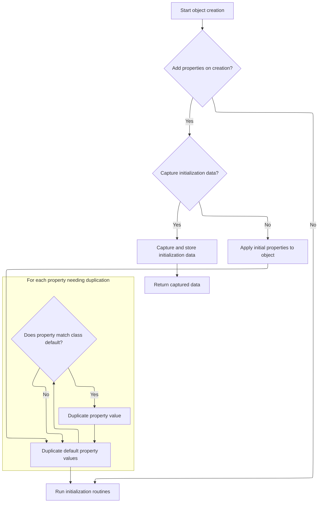
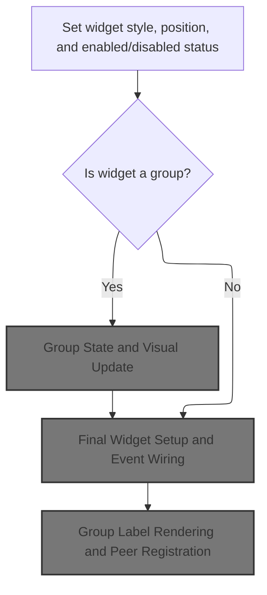
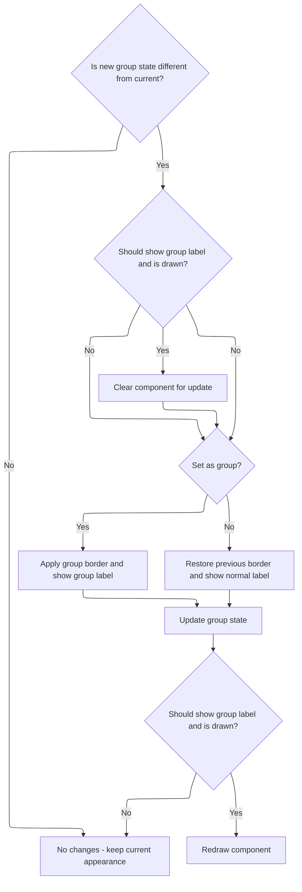
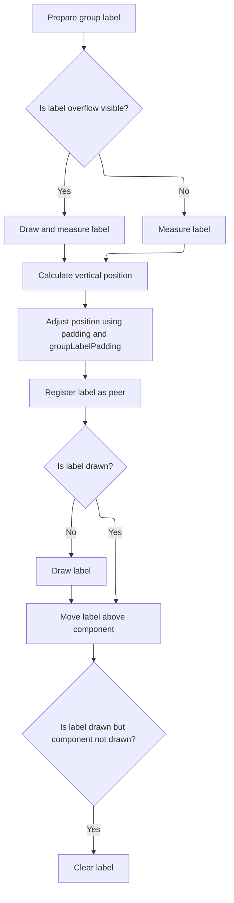

# Where is this flow used?

This flow is used multiple times in the codebase as represented in the following diagram:

(Note - these are only some of the entry points of this flow)

```mermaid
graph TD;
      f0a2189e6566812e71abe501d55a584be6e31eb15a19178cc2d902191d5d2548(ISC_Core.js::isc_Canvas_transferDragData) --> e768318b88d9245e49c7783e5a3cadf34d519a61494d6d03fc7da34512fa27c3(ISC_Core.js::transferRecords)

f0a2189e6566812e71abe501d55a584be6e31eb15a19178cc2d902191d5d2548(ISC_Core.js::isc_Canvas_transferDragData) --> 658b567d70d8d12a63e33433c4e99b8127d709c22b71e8234f16dba7d2a722c3(ISC_Grids.js::transferNodes)

f0a2189e6566812e71abe501d55a584be6e31eb15a19178cc2d902191d5d2548(ISC_Core.js::isc_Canvas_transferDragData) --> 5534d7e148c5a60a6b0ed205241c1dbfb65f09aeb12e098eab7d969f6fbdf7f1(ISC_Core.js::removeData)

f0a2189e6566812e71abe501d55a584be6e31eb15a19178cc2d902191d5d2548(ISC_Core.js::isc_Canvas_transferDragData) --> 0e27544a1832e0c1dbdb551488fce6a1cd12c58c825cdff5f55f0fd7845d3ea9(ISC_DataBinding.js::sendQueue)

f0a2189e6566812e71abe501d55a584be6e31eb15a19178cc2d902191d5d2548(ISC_Core.js::isc_Canvas_transferDragData) --> d82559d87bd667d9e0d713e3fe5c87c053af7046d226448f8a3d00b63744c154(ISC_Core.js::fireCallback)

f0a2189e6566812e71abe501d55a584be6e31eb15a19178cc2d902191d5d2548(ISC_Core.js::isc_Canvas_transferDragData) --> 1eb8482825d735c9900455c7f2873659e4584c5981a001d4223c9910ec8b78de(ISC_Grids.js::deselectList)

f0a2189e6566812e71abe501d55a584be6e31eb15a19178cc2d902191d5d2548(ISC_Core.js::isc_Canvas_transferDragData) --> d9ba04ce4c127de4ca0ba2b1e4c332798a26da76124027e1dcb09acf9d415e5e(ISC_Core.js::find)

f0a2189e6566812e71abe501d55a584be6e31eb15a19178cc2d902191d5d2548(ISC_Core.js::isc_Canvas_transferDragData) --> a5df8f95cbfc603da230bec69f83d5fd423990c833db48386aeb35a9b4cc4ed0(ISC_Core.js::getDragData)

f0a2189e6566812e71abe501d55a584be6e31eb15a19178cc2d902191d5d2548(ISC_Core.js::isc_Canvas_transferDragData) --> f08c302ab5e50618a0745166d620ef2f5712ee00c0bde6bc2ee801e5e47a3226(ISC_Core.js::add)

f0a2189e6566812e71abe501d55a584be6e31eb15a19178cc2d902191d5d2548(ISC_Core.js::isc_Canvas_transferDragData) --> 96b0dee96efbf484be01bd45e4bacd4f07b37356a6c5e033d3126dff5906a5dc(ISC_Core.js::setTimeout)

e768318b88d9245e49c7783e5a3cadf34d519a61494d6d03fc7da34512fa27c3(ISC_Core.js::transferRecords) --> f6a1614499338b22356a9cef94c6e2641dbac3fe81ee9a365d5c56a5ebed0496(ISC_Core.js::$61d)

e768318b88d9245e49c7783e5a3cadf34d519a61494d6d03fc7da34512fa27c3(ISC_Core.js::transferRecords) --> 4ab240359f9e59dcdcb70ab227332f5bc8ec2af98cf3091461b37824b19ffd49(ISC_Core.js::transferDragData)

e768318b88d9245e49c7783e5a3cadf34d519a61494d6d03fc7da34512fa27c3(ISC_Core.js::transferRecords) --> 8e62d13cd21d367088bf0d5951ce01ca514447227266d15060ba66ab7f6b1bcf(ISC_Core.js::updateDataViaDataSource)

e768318b88d9245e49c7783e5a3cadf34d519a61494d6d03fc7da34512fa27c3(ISC_Core.js::transferRecords) --> 0e27544a1832e0c1dbdb551488fce6a1cd12c58c825cdff5f55f0fd7845d3ea9(ISC_DataBinding.js::sendQueue)

e768318b88d9245e49c7783e5a3cadf34d519a61494d6d03fc7da34512fa27c3(ISC_Core.js::transferRecords) --> 7bdf854d0e2d299eaf391e99e6aaaaaf6f773bfc9fc1b55e656fb79f4f2aa2b5(ISC_Grids.js::$52u)

e768318b88d9245e49c7783e5a3cadf34d519a61494d6d03fc7da34512fa27c3(ISC_Core.js::transferRecords) --> 6f3f14edbcc08a406ec42f40b80f5e59cf580ed8da5bcc69e83f59e2a74fda61(ISC_Core.js::$61e)

e768318b88d9245e49c7783e5a3cadf34d519a61494d6d03fc7da34512fa27c3(ISC_Core.js::transferRecords) --> 19cc2252b5f89fc9fa1608a167d6b74a867a0a4c3df834ceb98bc73101f5c592(ISC_Core.js::getDropValues)

e768318b88d9245e49c7783e5a3cadf34d519a61494d6d03fc7da34512fa27c3(ISC_Core.js::transferRecords) --> 497aa1db40f996f8c280dc9ac2d564cdb76e5e17fb846c35e78e9ee1d8da99fd(ISC_Core.js::fetchData)

e768318b88d9245e49c7783e5a3cadf34d519a61494d6d03fc7da34512fa27c3(ISC_Core.js::transferRecords) --> 069f30ce7f71ca6ce7f46ffceae0196442ceece3333be0612dafe7e445e28b05(ISC_Core.js::logDebug)

e768318b88d9245e49c7783e5a3cadf34d519a61494d6d03fc7da34512fa27c3(ISC_Core.js::transferRecords) --> 651e531a8910a0930ead12e595bdb7543f5116b8e9b52f84891f44493f60c2c5(ISC_DataBinding.js::getPrimaryKeyFields)

e768318b88d9245e49c7783e5a3cadf34d519a61494d6d03fc7da34512fa27c3(ISC_Core.js::transferRecords) --> dac4cb80754055d02229910844c04d15420de1314825914fe76e2dfcde919740(ISC_DataBinding.js::getPrimaryKeyFieldNames)

e768318b88d9245e49c7783e5a3cadf34d519a61494d6d03fc7da34512fa27c3(ISC_Core.js::transferRecords) --> 9b2e8896ada920c9496d7552f09b93e3aed35c097c22df1df4afaa5fd372c5d6(ISC_DataBinding.js::getPrimaryKeyField)

e768318b88d9245e49c7783e5a3cadf34d519a61494d6d03fc7da34512fa27c3(ISC_Core.js::transferRecords) --> d16c73c890bbbd864c876a716340273b7935fa56ef8f3792ac69a995b180eba2(ISC_DataBinding.js::getForeignKeysByRelation)

e768318b88d9245e49c7783e5a3cadf34d519a61494d6d03fc7da34512fa27c3(ISC_Core.js::transferRecords) --> d54c2d6724190efcb4c230d7a0946a2cf8d5fcaa51c105fafa61f0f9754f142e(ISC_Grids.js::$60z)

e768318b88d9245e49c7783e5a3cadf34d519a61494d6d03fc7da34512fa27c3(ISC_Core.js::transferRecords) --> bcaf2ce50cffacef5a67fc7acf2f31a61d3c417e0037182a5bba75834cdbe059(ISC_Grids.js::selectList)

e768318b88d9245e49c7783e5a3cadf34d519a61494d6d03fc7da34512fa27c3(ISC_Core.js::transferRecords) --> d59426d39f81933c1fbf3a447b215ad9063ea7323700c3656fe2881e1d676872(ISC_Grids.js::deselectAll)

e768318b88d9245e49c7783e5a3cadf34d519a61494d6d03fc7da34512fa27c3(ISC_Core.js::transferRecords) --> cd5ab3fdeb68f89a7839a135762aa0e1a79f0d6fa443862c8efe7a88305f0711(ISC_Grids.js::selectSingle)

e768318b88d9245e49c7783e5a3cadf34d519a61494d6d03fc7da34512fa27c3(ISC_Core.js::transferRecords) --> f64fd3334c6699360b514b298d5bfc5fa34866d8dddf3d4e3a64295ddfcdfe1d(ISC_Core.js::getField)

e768318b88d9245e49c7783e5a3cadf34d519a61494d6d03fc7da34512fa27c3(ISC_Core.js::transferRecords) --> f08c302ab5e50618a0745166d620ef2f5712ee00c0bde6bc2ee801e5e47a3226(ISC_Core.js::add)

e768318b88d9245e49c7783e5a3cadf34d519a61494d6d03fc7da34512fa27c3(ISC_Core.js::transferRecords) --> 3179d02b786bebd78861d38659d8395c61782db9ae544909eab15f084c738a0b(ISC_Core.js::$67u)

e768318b88d9245e49c7783e5a3cadf34d519a61494d6d03fc7da34512fa27c3(ISC_Core.js::transferRecords) --> 383e62d7bb5d3941994b7500cded6419816eeba012f157a24b2292d307e7b28d(ISC_Core.js::slideList)

f6a1614499338b22356a9cef94c6e2641dbac3fe81ee9a365d5c56a5ebed0496(ISC_Core.js::$61d) --> 0bb899c4d44f2cb7da1e3207537f3eb7aed68dc645a00dce7153568a28be3fdb(ISC_Core.js::addData)

f6a1614499338b22356a9cef94c6e2641dbac3fe81ee9a365d5c56a5ebed0496(ISC_Core.js::$61d) --> 4ab240359f9e59dcdcb70ab227332f5bc8ec2af98cf3091461b37824b19ffd49(ISC_Core.js::transferDragData)

f6a1614499338b22356a9cef94c6e2641dbac3fe81ee9a365d5c56a5ebed0496(ISC_Core.js::$61d) --> 0e27544a1832e0c1dbdb551488fce6a1cd12c58c825cdff5f55f0fd7845d3ea9(ISC_DataBinding.js::sendQueue)

f6a1614499338b22356a9cef94c6e2641dbac3fe81ee9a365d5c56a5ebed0496(ISC_Core.js::$61d) --> 6f3f14edbcc08a406ec42f40b80f5e59cf580ed8da5bcc69e83f59e2a74fda61(ISC_Core.js::$61e)

f6a1614499338b22356a9cef94c6e2641dbac3fe81ee9a365d5c56a5ebed0496(ISC_Core.js::$61d) --> 497aa1db40f996f8c280dc9ac2d564cdb76e5e17fb846c35e78e9ee1d8da99fd(ISC_Core.js::fetchData)

f6a1614499338b22356a9cef94c6e2641dbac3fe81ee9a365d5c56a5ebed0496(ISC_Core.js::$61d) --> 069f30ce7f71ca6ce7f46ffceae0196442ceece3333be0612dafe7e445e28b05(ISC_Core.js::logDebug)

f6a1614499338b22356a9cef94c6e2641dbac3fe81ee9a365d5c56a5ebed0496(ISC_Core.js::$61d) --> 2d9b02841147960d98aa7dbc95e26a103c95b5fd19a83c42befa2644f17dbf32(ISC_Core.js::$67w)

f6a1614499338b22356a9cef94c6e2641dbac3fe81ee9a365d5c56a5ebed0496(ISC_Core.js::$61d) --> fb1830f8611c97836808beac0500f597c28910f89364ef868392cc61379f4bf5(ISC_Core.js::getCriteria)

f6a1614499338b22356a9cef94c6e2641dbac3fe81ee9a365d5c56a5ebed0496(ISC_Core.js::$61d) --> 651e531a8910a0930ead12e595bdb7543f5116b8e9b52f84891f44493f60c2c5(ISC_DataBinding.js::getPrimaryKeyFields)

f6a1614499338b22356a9cef94c6e2641dbac3fe81ee9a365d5c56a5ebed0496(ISC_Core.js::$61d) --> f08c302ab5e50618a0745166d620ef2f5712ee00c0bde6bc2ee801e5e47a3226(ISC_Core.js::add)

0bb899c4d44f2cb7da1e3207537f3eb7aed68dc645a00dce7153568a28be3fdb(ISC_Core.js::addData) --> ecd58843a1dc2477573da249e3acdfd99fa584b25018c37eae67af27792981ec(ISC_Core.js::$wp)

ecd58843a1dc2477573da249e3acdfd99fa584b25018c37eae67af27792981ec(ISC_Core.js::$wp) --> 704b7008db022242daf8b6d5a7f1ab1fb8fa49cbdd2b452bb261b2004091b952(ISC_DataBinding.js::performDSOperation)

ecd58843a1dc2477573da249e3acdfd99fa584b25018c37eae67af27792981ec(ISC_Core.js::$wp) --> bac34f60fa2ec6078d0591a15e862bbdf71f38a816f184fae867bc5ff3c3b569(ISC_Core.js::findByKeys)

ecd58843a1dc2477573da249e3acdfd99fa584b25018c37eae67af27792981ec(ISC_Core.js::$wp) --> f08c302ab5e50618a0745166d620ef2f5712ee00c0bde6bc2ee801e5e47a3226(ISC_Core.js::add)

704b7008db022242daf8b6d5a7f1ab1fb8fa49cbdd2b452bb261b2004091b952(ISC_DataBinding.js::performDSOperation) --> ae9773d5901be562172454a45c8c4660248016395db01cd875d6bda95be4f4f0(ISC_DataBinding.js::sendDSRequest)

704b7008db022242daf8b6d5a7f1ab1fb8fa49cbdd2b452bb261b2004091b952(ISC_DataBinding.js::performDSOperation) --> 7106bf252fc579dd06399d7a09e64147ee2f45bb4c9dcd2df12775c116d5256d(ISC_DataBinding.js::getField)

704b7008db022242daf8b6d5a7f1ab1fb8fa49cbdd2b452bb261b2004091b952(ISC_DataBinding.js::performDSOperation) --> 5af9ed804c3c9d87d18e82912efd4ec937c0c0194329fa56f150b536c6062712(ISC_DataBinding.js::$625)

704b7008db022242daf8b6d5a7f1ab1fb8fa49cbdd2b452bb261b2004091b952(ISC_DataBinding.js::performDSOperation) --> 412b183b8cf8d402d221b04a75b0cc993b451b2aa2aea07beb7cfb92f3185e3d(ISC_Core.js::removeEmpty)

ae9773d5901be562172454a45c8c4660248016395db01cd875d6bda95be4f4f0(ISC_DataBinding.js::sendDSRequest) --> 4ec18508c69e9272cfe3c88abb351ac44be9b585833e7eba27c43144de2ff16d(ISC_DataBinding.js::$378)

ae9773d5901be562172454a45c8c4660248016395db01cd875d6bda95be4f4f0(ISC_DataBinding.js::sendDSRequest) --> 9924f102c8c570bda9428bb7a697571712e73bc9870346fc81ff20fa5e6eb631(ISC_DataBinding.js::fetchingClientOnlyData)

ae9773d5901be562172454a45c8c4660248016395db01cd875d6bda95be4f4f0(ISC_DataBinding.js::sendDSRequest) --> 2a91cd4245c4e85c2ca1cadff2d825df47933850167f0554cc2c64fbde8f622c(ISC_DataBinding.js::parseXML)

ae9773d5901be562172454a45c8c4660248016395db01cd875d6bda95be4f4f0(ISC_DataBinding.js::sendDSRequest) --> b36de7c9395befb89891cf6f7a6895d74bd99f21aac5f241d7b2fa41c215f934(ISC_DataBinding.js::getXMLResponse)

ae9773d5901be562172454a45c8c4660248016395db01cd875d6bda95be4f4f0(ISC_DataBinding.js::sendDSRequest) --> 2148718f9c578583034268c8252606f48ca63c9d021e5d60d8f393ede9d4ab6a(ISC_DataBinding.js::sendProxied)

ae9773d5901be562172454a45c8c4660248016395db01cd875d6bda95be4f4f0(ISC_DataBinding.js::sendDSRequest) --> 064b664c28fc4e920554095859d520ef188b952a6cd87126397ca7477e1d2850(ISC_DataBinding.js::sendRequest)

ae9773d5901be562172454a45c8c4660248016395db01cd875d6bda95be4f4f0(ISC_DataBinding.js::sendDSRequest) --> b7f5216daf1b5ea8cdbdf289a2d34e3916d335ed03d9acef0ab2c3d979f97fab(ISC_DataBinding.js::getServiceInputs)

ae9773d5901be562172454a45c8c4660248016395db01cd875d6bda95be4f4f0(ISC_DataBinding.js::sendDSRequest) --> ed669f556b7d514202e7149d0f84b5198a4e1363c9274567cd8b79e01d3b5e30(ISC_DataBinding.js::convertRelativeDates)

ae9773d5901be562172454a45c8c4660248016395db01cd875d6bda95be4f4f0(ISC_DataBinding.js::sendDSRequest) --> 877b6e83036f58284bcd44286a541b1d9246b193df8426a7c134b000126937c8(ISC_DataBinding.js::addDefaultCriteria)

ae9773d5901be562172454a45c8c4660248016395db01cd875d6bda95be4f4f0(ISC_DataBinding.js::sendDSRequest) --> 91d21caabbb5365f421d078a9fcdd2a2aee7ea2fed486f0f0294d6ba207117bd(ISC_DataBinding.js::echo)

ae9773d5901be562172454a45c8c4660248016395db01cd875d6bda95be4f4f0(ISC_DataBinding.js::sendDSRequest) --> 3a9eeb41bbb1bca56034b36180dcc0318063e6e6d352dbee40cd4b9a7e2d2fa4(ISC_DataBinding.js::performSCServerOperation)

ae9773d5901be562172454a45c8c4660248016395db01cd875d6bda95be4f4f0(ISC_DataBinding.js::sendDSRequest) --> 77aea948cf3f0a28707043701d6df4db1785f54d675bc0ac73a04773fbd257c9(ISC_DataBinding.js::$708)

ae9773d5901be562172454a45c8c4660248016395db01cd875d6bda95be4f4f0(ISC_DataBinding.js::sendDSRequest) --> 247cc05d7e8323981b4a6d0df1eb7975fb0164f9eebfc3602d64d78cdfeabac9(ISC_DataBinding.js::applySendExtraFields)

ae9773d5901be562172454a45c8c4660248016395db01cd875d6bda95be4f4f0(ISC_DataBinding.js::sendDSRequest) --> d3b8ee9073f8acd51cf2710183de9054f11f8c9957ab7b09c3eb831d745e591c(ISC_DataBinding.js::$79c)

ae9773d5901be562172454a45c8c4660248016395db01cd875d6bda95be4f4f0(ISC_DataBinding.js::sendDSRequest) --> 8e5311ac58d9523e98f36b07e213bc314517e3cb6bc9658bedc57769510ff0eb(ISC_Core.js::logInfo)

ae9773d5901be562172454a45c8c4660248016395db01cd875d6bda95be4f4f0(ISC_DataBinding.js::sendDSRequest) --> 813eb71ad0cddd2448633848a1c52144bfe69993c6a9ec190c7d5bfe9473d46e(ISC_DataBinding.js::getDataProtocol)

4ec18508c69e9272cfe3c88abb351ac44be9b585833e7eba27c43144de2ff16d(ISC_DataBinding.js::$378) --> 37b082c4d57a49767c46331b319670141fc3f3f4dade85d6491c5549ea69b2a5(ISC_DataBinding.js::$38b)

4ec18508c69e9272cfe3c88abb351ac44be9b585833e7eba27c43144de2ff16d(ISC_DataBinding.js::$378) --> b119c09d99568dcd8a94b2aaf8436c9e1ba8444db1e74bcc031835507b1a1144(ISC_DataBinding.js::dsResponseFromXML)

4ec18508c69e9272cfe3c88abb351ac44be9b585833e7eba27c43144de2ff16d(ISC_DataBinding.js::$378) --> b3be9dcbf1aa9a22cf784e84409e28e854421097d9cb14d0daf3633b5b586171(ISC_DataBinding.js::getOutputNamespaces)

4ec18508c69e9272cfe3c88abb351ac44be9b585833e7eba27c43144de2ff16d(ISC_DataBinding.js::$378) --> 17e4c02a0fd2e3067813de7cbca390141ac07c2cef00def6dacb416db38d2764(ISC_DataBinding.js::addNamespaces)

4ec18508c69e9272cfe3c88abb351ac44be9b585833e7eba27c43144de2ff16d(ISC_DataBinding.js::$378) --> 0ae1612444a0be7997b2e0c0b320a853956894ba3227c41b9836a51b6f0b2cb2(ISC_DataBinding.js::getWebService)

37b082c4d57a49767c46331b319670141fc3f3f4dade85d6491c5549ea69b2a5(ISC_DataBinding.js::$38b) --> be5c45ddf24b93828047b934a8067da661cd92af5bb5a94f7ca2eb353cf15337(ISC_DataBinding.js::storeResponse)

37b082c4d57a49767c46331b319670141fc3f3f4dade85d6491c5549ea69b2a5(ISC_DataBinding.js::$38b) --> d7df35f6dc0d3d9e7955a0e14018b01b5970b0b970f5fb9f0dda98af08014332(ISC_DataBinding.js::fireResponseCallbacks)

37b082c4d57a49767c46331b319670141fc3f3f4dade85d6491c5549ea69b2a5(ISC_DataBinding.js::$38b) --> 91d21caabbb5365f421d078a9fcdd2a2aee7ea2fed486f0f0294d6ba207117bd(ISC_DataBinding.js::echo)

37b082c4d57a49767c46331b319670141fc3f3f4dade85d6491c5549ea69b2a5(ISC_DataBinding.js::$38b) --> 07a37b11060d744e776ac2e38ba94e5d6c15bcdf8970444e6239bc516e92668c(ISC_DataBinding.js::cacheResponse)

37b082c4d57a49767c46331b319670141fc3f3f4dade85d6491c5549ea69b2a5(ISC_DataBinding.js::$38b) --> 7fdaab4222a145059b5548bfc8265855c8cd5754d86e2f52d3dc16eaeb6a18bb(ISC_DataBinding.js::updateCaches)

37b082c4d57a49767c46331b319670141fc3f3f4dade85d6491c5549ea69b2a5(ISC_DataBinding.js::$38b) --> 8e5311ac58d9523e98f36b07e213bc314517e3cb6bc9658bedc57769510ff0eb(ISC_Core.js::logInfo)

be5c45ddf24b93828047b934a8067da661cd92af5bb5a94f7ca2eb353cf15337(ISC_DataBinding.js::storeResponse) --> 6c09072678853cde641606121d9c777c033835190984ca0372c475cebec387a6(ISC_DataBinding.js::put)

be5c45ddf24b93828047b934a8067da661cd92af5bb5a94f7ca2eb353cf15337(ISC_DataBinding.js::storeResponse) --> 324499928e853764290f69e8f388ad8ba52af0ce4d88463012bec3cfee631b64(ISC_DataBinding.js::removeOldestEntry)

be5c45ddf24b93828047b934a8067da661cd92af5bb5a94f7ca2eb353cf15337(ISC_DataBinding.js::storeResponse) --> 4291f7554fc04dca4fa565f13c62b14e74cd4be4bef7d45cb617b36d7d7a5f4c(ISC_DataBinding.js::serialize)

6c09072678853cde641606121d9c777c033835190984ca0372c475cebec387a6(ISC_DataBinding.js::put) --> d684d5a7a420e0576625877dc116c9a5cf69fce6e3a87847868abc1f9d765bb0(ISC_DataBinding.js::$788)

6c09072678853cde641606121d9c777c033835190984ca0372c475cebec387a6(ISC_DataBinding.js::put) --> 46409e4cbe6697a0f55ed42d89e922670535b37d584a2b3fdd920e91b9cf28fd(ISC_DataBinding.js::addToPriorityQueue)

6c09072678853cde641606121d9c777c033835190984ca0372c475cebec387a6(ISC_DataBinding.js::put) --> 7e2106805135afb3405e8a6ed37d602cdc481720b5c9f366dc1db62713812da5(ISC_DataBinding.js::removeFromPriorityQueue)

6c09072678853cde641606121d9c777c033835190984ca0372c475cebec387a6(ISC_DataBinding.js::put) --> 324499928e853764290f69e8f388ad8ba52af0ce4d88463012bec3cfee631b64(ISC_DataBinding.js::removeOldestEntry)

6c09072678853cde641606121d9c777c033835190984ca0372c475cebec387a6(ISC_DataBinding.js::put) --> 476825f7afe15703caf000dc09f543a8c1a0e8bf0aefa41c240375c676939742(ISC_DataBinding.js::$786)

6c09072678853cde641606121d9c777c033835190984ca0372c475cebec387a6(ISC_DataBinding.js::put) --> 9ba544bf10016d4396f2193f8bc0a90d1f4c2a6e1ff3d0e33de7ffc37f912fc3(ISC_DataBinding.js::isStorageException)

6c09072678853cde641606121d9c777c033835190984ca0372c475cebec387a6(ISC_DataBinding.js::put) --> 6c43b113b6dd2c43a76de617c0997cd36dd3d6a8aa64a700e64ba486f1e808aa(ISC_DataBinding.js::updateMetrics)

6c09072678853cde641606121d9c777c033835190984ca0372c475cebec387a6(ISC_DataBinding.js::put) --> 2362902e11e8fe2a87073e7a564181083ff56b5eaae021802788efcb82ec9e94(ISC_DataBinding.js::rebuildMetrics)

6c09072678853cde641606121d9c777c033835190984ca0372c475cebec387a6(ISC_DataBinding.js::put) --> 84fa3da415696dce3271c70c2764aa7a35df0d4a8d20bf2401c393c9e9d6f72d(ISC_DataBinding.js::echoLeaf)

d684d5a7a420e0576625877dc116c9a5cf69fce6e3a87847868abc1f9d765bb0(ISC_DataBinding.js::$788) --> fdf8664287a613941b20b0285c8b71b7526e38b1389af2b94b2d8c7d177ccbd5(ISC_DataBinding.js::putValue)

d684d5a7a420e0576625877dc116c9a5cf69fce6e3a87847868abc1f9d765bb0(ISC_DataBinding.js::$788) --> d2c86631aef262fb12fa690795934b3abd38c46e2b112d88ba75752a19ff9034(ISC_DataBinding.js::localStorageType)

fdf8664287a613941b20b0285c8b71b7526e38b1389af2b94b2d8c7d177ccbd5(ISC_DataBinding.js::putValue) --> 9d2d086023b6f3f8847db5f145bb480e20e9ee01dff658966c5f000e8af1301e(ISC_DataBinding.js::save)

fdf8664287a613941b20b0285c8b71b7526e38b1389af2b94b2d8c7d177ccbd5(ISC_DataBinding.js::putValue) --> f15c87513c57a827ecff29ee5e7c66b62f65f486a3aa50b2be2af10f1d8ffc04(ISC_DataBinding.js::addToKeyIndex)

fdf8664287a613941b20b0285c8b71b7526e38b1389af2b94b2d8c7d177ccbd5(ISC_DataBinding.js::putValue) --> e7ff0865ab638f655d0273bb46415360c9bd0b003d69c9b35c0b33c84d036da3(ISC_DataBinding.js::removeFromKeyIndex)

fdf8664287a613941b20b0285c8b71b7526e38b1389af2b94b2d8c7d177ccbd5(ISC_DataBinding.js::putValue) --> 9ba544bf10016d4396f2193f8bc0a90d1f4c2a6e1ff3d0e33de7ffc37f912fc3(ISC_DataBinding.js::isStorageException)

9d2d086023b6f3f8847db5f145bb480e20e9ee01dff658966c5f000e8af1301e(ISC_DataBinding.js::save) --> e5478b8bad5e229d370997ba36c032af0b447492371e7039464d8b6b8a0df31e(ISC_DataBinding.js::saveData)

e5478b8bad5e229d370997ba36c032af0b447492371e7039464d8b6b8a0df31e(ISC_DataBinding.js::saveData) --> 08d784c0a376e578ba6d014289171d38f307f3788086d1c27ac2ab3e989d1a06(ISC_Grids.js::setRecordValues)

e5478b8bad5e229d370997ba36c032af0b447492371e7039464d8b6b8a0df31e(ISC_DataBinding.js::saveData) --> d14577aa0a1f0244cc365c1c18a6346e3133da4e02aaf319fcb5e6637b07b7da(ISC_DataBinding.js::saveEditorValues)

e5478b8bad5e229d370997ba36c032af0b447492371e7039464d8b6b8a0df31e(ISC_DataBinding.js::saveData) --> 099c2ab9506401356ca85b26e8392e36b5fd7d00ccc7d7030375557f8e5e1eb5(ISC_DataBinding.js::submitEditorValues)

e5478b8bad5e229d370997ba36c032af0b447492371e7039464d8b6b8a0df31e(ISC_DataBinding.js::saveData) --> 689c2e286b6ef38cfe5efaa722ba2f02721cbbfb95ba8a25d3d2279d40a54a9b(ISC_Forms.js::clearErrors)

e5478b8bad5e229d370997ba36c032af0b447492371e7039464d8b6b8a0df31e(ISC_DataBinding.js::saveData) --> 49267478504d54c01b313537d843b9253a9db6b82651abfb1ad4590572bbf35d(ISC_DataBinding.js::processSubmit)

e5478b8bad5e229d370997ba36c032af0b447492371e7039464d8b6b8a0df31e(ISC_DataBinding.js::saveData) --> e0404b203e1520f57300ef4eddb8d566204fda5469ae78c414d287d9d870e3b3(ISC_Forms.js::$10y)

e5478b8bad5e229d370997ba36c032af0b447492371e7039464d8b6b8a0df31e(ISC_DataBinding.js::saveData) --> fa5ad6f909a425b5f820ddf187dea4f0c0841a58ecffa6cfdcb6c5238c7225b7(ISC_DataBinding.js::updateFileItemForm)

e5478b8bad5e229d370997ba36c032af0b447492371e7039464d8b6b8a0df31e(ISC_DataBinding.js::saveData) --> ef810371291e8c3079eeeafb5258f95e417a076e3fd63884b026bb579830cfc4(ISC_DataBinding.js::getSaveOperationType)

e5478b8bad5e229d370997ba36c032af0b447492371e7039464d8b6b8a0df31e(ISC_DataBinding.js::saveData) --> 930004c9d2ee7879f1cbc79eaa3e3bf665b0384626def76ca20a61a2475dda62(ISC_DataBinding.js::getFields)

e5478b8bad5e229d370997ba36c032af0b447492371e7039464d8b6b8a0df31e(ISC_DataBinding.js::saveData) --> 11b4bb1a0e3eda45bd62f60d1447c1ed87505622b0cca43472f9dc5d5d7296f4(ISC_DataBinding.js::validateData)

e5478b8bad5e229d370997ba36c032af0b447492371e7039464d8b6b8a0df31e(ISC_DataBinding.js::saveData) --> 75cf9a7a1b8c11991e709206e37fc8e187f6c5ce5fe1c1497458f81ca0b3b061(ISC_DataBinding.js::validate)

e5478b8bad5e229d370997ba36c032af0b447492371e7039464d8b6b8a0df31e(ISC_DataBinding.js::saveData) --> e5478b8bad5e229d370997ba36c032af0b447492371e7039464d8b6b8a0df31e(ISC_DataBinding.js::saveData)

e5478b8bad5e229d370997ba36c032af0b447492371e7039464d8b6b8a0df31e(ISC_DataBinding.js::saveData) --> 1919d55b452ba6966bbd0f8321c05e311a21a869eac702b873bc027b2f51081b(ISC_Forms.js::getID)

e5478b8bad5e229d370997ba36c032af0b447492371e7039464d8b6b8a0df31e(ISC_DataBinding.js::saveData) --> f172139b2d18f23ee3e1fca89a2034a1c0c5ea86f4efad10bf8cfa9fa026f5a1(ISC_DataBinding.js::getValues)

e5478b8bad5e229d370997ba36c032af0b447492371e7039464d8b6b8a0df31e(ISC_DataBinding.js::saveData) --> 9e389f8ed1c60c3fbd32ac551c6f7b57ba676fc2fbfe350884668f6c7798e308(ISC_Drawing.js::isDrawn)

08d784c0a376e578ba6d014289171d38f307f3788086d1c27ac2ab3e989d1a06(ISC_Grids.js::setRecordValues) --> 6079df078431bdb998d59dbf7b1f5883fdc4a6842b4a6cc538acdda6b259d94b(ISC_Grids.js::calculateRecordSummaries)

08d784c0a376e578ba6d014289171d38f307f3788086d1c27ac2ab3e989d1a06(ISC_Grids.js::setRecordValues) --> 9370f0c81720e6c761ce085fc6dd2be6951ef686939d924e79d601d1e849d673(ISC_Grids.js::refreshCell)

08d784c0a376e578ba6d014289171d38f307f3788086d1c27ac2ab3e989d1a06(ISC_Grids.js::setRecordValues) --> 0686d22ac14739d67bd8229992b48ac3b112c1318bda5e83e2583b686cebfe29(ISC_Grids.js::refreshRow)

08d784c0a376e578ba6d014289171d38f307f3788086d1c27ac2ab3e989d1a06(ISC_Grids.js::setRecordValues) --> 3f7d05052fdab5420c59c46df996a185d93d2ee3b71f5c4d1bb46d8f44ba8170(ISC_Forms.js::$71e)

08d784c0a376e578ba6d014289171d38f307f3788086d1c27ac2ab3e989d1a06(ISC_Grids.js::setRecordValues) --> fc6fc9831d11ef94fd7310717d25f39b991b0472cc0c305f723117cfceea33b0(ISC_Core.js::$70o)

08d784c0a376e578ba6d014289171d38f307f3788086d1c27ac2ab3e989d1a06(ISC_Grids.js::setRecordValues) --> d966023628019b725d36b5e83a12b9151990b332c9b7693c882ea292320c3a9e(ISC_Grids.js::get)

6079df078431bdb998d59dbf7b1f5883fdc4a6842b4a6cc538acdda6b259d94b(ISC_Grids.js::calculateRecordSummaries) --> 6dc43e82d7ad6e157a166f34274caedeb7d043dbe78cd6bb81342509a8ee5dd7(ISC_Grids.js::getEditValues)

6079df078431bdb998d59dbf7b1f5883fdc4a6842b4a6cc538acdda6b259d94b(ISC_Grids.js::calculateRecordSummaries) --> 8f0fc2aa67bdf5e7dba08b83017f6ed7db0930d5fa439ed7b4833b668ba6fbb1(ISC_Grids.js::$855)

6079df078431bdb998d59dbf7b1f5883fdc4a6842b4a6cc538acdda6b259d94b(ISC_Grids.js::calculateRecordSummaries) --> fc90728d8cca11e3859ba8139ee787e5a93f4eb8855b133530cd4e0b0e58ce50(ISC_Grids.js::getRecordSummary)

6079df078431bdb998d59dbf7b1f5883fdc4a6842b4a6cc538acdda6b259d94b(ISC_Grids.js::calculateRecordSummaries) --> e027ee40652ac34ee993aeaefc32d65fa95983a535ca5f2dc618f81f06df8e06(ISC_Grids.js::getField)

6079df078431bdb998d59dbf7b1f5883fdc4a6842b4a6cc538acdda6b259d94b(ISC_Grids.js::calculateRecordSummaries) --> 952a51e73e8d83a803c58340cd04211b7d74e97226336b85492061a5f6a93440(ISC_Grids.js::getLength)

6079df078431bdb998d59dbf7b1f5883fdc4a6842b4a6cc538acdda6b259d94b(ISC_Grids.js::calculateRecordSummaries) --> d966023628019b725d36b5e83a12b9151990b332c9b7693c882ea292320c3a9e(ISC_Grids.js::get)

6079df078431bdb998d59dbf7b1f5883fdc4a6842b4a6cc538acdda6b259d94b(ISC_Grids.js::calculateRecordSummaries) --> fd192b5aa219ac7487dd9f0cf421b81e8e1ea55f96177176e8437b0e8ac2b841(ISC_Grids.js::addProperties)

6079df078431bdb998d59dbf7b1f5883fdc4a6842b4a6cc538acdda6b259d94b(ISC_Grids.js::calculateRecordSummaries) --> 40c415d0c5f7e0484a3aedc19e3caa1f8b3519f4a341ca6bda337ff33a02b8df(ISC_Grids.js::isDirty)

6dc43e82d7ad6e157a166f34274caedeb7d043dbe78cd6bb81342509a8ee5dd7(ISC_Grids.js::getEditValues) --> ef8d50228e3825e9860e1d3f875a4c1fa4931be9fc7465de8a816227b47978ac(ISC_Grids.js::storeUpdatedEditorValue)

6dc43e82d7ad6e157a166f34274caedeb7d043dbe78cd6bb81342509a8ee5dd7(ISC_Grids.js::getEditValues) --> 1d3e9ba9a64a65f817c4e07b0eeafbdf9b622ae2c59afef2236b75f0a5de995e(ISC_Grids.js::getEditSessionRowNum)

6dc43e82d7ad6e157a166f34274caedeb7d043dbe78cd6bb81342509a8ee5dd7(ISC_Grids.js::getEditValues) --> 0051a58f7f0d764df8bb79ae6c0c2ad157a886c748f75301f07de76c93d947f7(ISC_Grids.js::$300)

6dc43e82d7ad6e157a166f34274caedeb7d043dbe78cd6bb81342509a8ee5dd7(ISC_Grids.js::getEditValues) --> fd192b5aa219ac7487dd9f0cf421b81e8e1ea55f96177176e8437b0e8ac2b841(ISC_Grids.js::addProperties)

6dc43e82d7ad6e157a166f34274caedeb7d043dbe78cd6bb81342509a8ee5dd7(ISC_Grids.js::getEditValues) --> 9f4a373dc43378dfacd47c78d0b3a55fba78f32dc2d0b4efad74db5a0095e300(ISC_Core.js::getStackTrace)

ef8d50228e3825e9860e1d3f875a4c1fa4931be9fc7465de8a816227b47978ac(ISC_Grids.js::storeUpdatedEditorValue) --> 0b4885d7a61a24182189836ee28a971694bcb82c916ddfa5ea4001a064d2cc09(ISC_Grids.js::setEditValue)

ef8d50228e3825e9860e1d3f875a4c1fa4931be9fc7465de8a816227b47978ac(ISC_Grids.js::storeUpdatedEditorValue) --> a495c8b193ae48f2a5673824638e61b3b84234354c919a2a71fbe10fbb0e1cf6(ISC_Grids.js::$30y)

ef8d50228e3825e9860e1d3f875a4c1fa4931be9fc7465de8a816227b47978ac(ISC_Grids.js::storeUpdatedEditorValue) --> baaa534b9af7fc50f135239b077f3d023ed89f4ca66f8c1d95b19e45e98826fa(ISC_RichTextEditor.js::updateValue)

ef8d50228e3825e9860e1d3f875a4c1fa4931be9fc7465de8a816227b47978ac(ISC_Grids.js::storeUpdatedEditorValue) --> 6b93bf597ae0d66e4309df366d04755566d4667e1028c66083226ce8dc0c0e26(ISC_Grids.js::getEditFormItem)

ef8d50228e3825e9860e1d3f875a4c1fa4931be9fc7465de8a816227b47978ac(ISC_Grids.js::storeUpdatedEditorValue) --> e027ee40652ac34ee993aeaefc32d65fa95983a535ca5f2dc618f81f06df8e06(ISC_Grids.js::getField)

ef8d50228e3825e9860e1d3f875a4c1fa4931be9fc7465de8a816227b47978ac(ISC_Grids.js::storeUpdatedEditorValue) --> adc34d1b330c385b6e2d35be20d94da713269bbf328aec8f8b3d2f698c48c840(ISC_Grids.js::$33y)

ef8d50228e3825e9860e1d3f875a4c1fa4931be9fc7465de8a816227b47978ac(ISC_Grids.js::storeUpdatedEditorValue) --> 9e389f8ed1c60c3fbd32ac551c6f7b57ba676fc2fbfe350884668f6c7798e308(ISC_Drawing.js::isDrawn)

0b4885d7a61a24182189836ee28a971694bcb82c916ddfa5ea4001a064d2cc09(ISC_Grids.js::setEditValue) --> ce23401880073e9f6a63a294db5b3b99f080dfa9ca1b4ccd90a7ed8e6980a98e(ISC_Grids.js::$33l)

0b4885d7a61a24182189836ee28a971694bcb82c916ddfa5ea4001a064d2cc09(ISC_Grids.js::setEditValue) --> 0b4885d7a61a24182189836ee28a971694bcb82c916ddfa5ea4001a064d2cc09(ISC_Grids.js::setEditValue)

0b4885d7a61a24182189836ee28a971694bcb82c916ddfa5ea4001a064d2cc09(ISC_Grids.js::setEditValue) --> 8f0fc2aa67bdf5e7dba08b83017f6ed7db0930d5fa439ed7b4833b668ba6fbb1(ISC_Grids.js::$855)

0b4885d7a61a24182189836ee28a971694bcb82c916ddfa5ea4001a064d2cc09(ISC_Grids.js::setEditValue) --> 797c4b17016b828c091fdaecc6c5e73587d46167dbd84c94c256619327cf4c2e(ISC_Grids.js::$840)

0b4885d7a61a24182189836ee28a971694bcb82c916ddfa5ea4001a064d2cc09(ISC_Grids.js::setEditValue) --> 1d3e9ba9a64a65f817c4e07b0eeafbdf9b622ae2c59afef2236b75f0a5de995e(ISC_Grids.js::getEditSessionRowNum)

0b4885d7a61a24182189836ee28a971694bcb82c916ddfa5ea4001a064d2cc09(ISC_Grids.js::setEditValue) --> 4b24272e44456fd73b530234ccb555dc369c336fc1a37899b9efb3ce1126d9dc(ISC_Grids.js::getEditSessionColNum)

0b4885d7a61a24182189836ee28a971694bcb82c916ddfa5ea4001a064d2cc09(ISC_Grids.js::setEditValue) --> 338f14dd076f736cd199b218cebfd3bc374d98650d0da3422a9b08ef713d9b39(ISC_Grids.js::setRowEditFieldName)

0b4885d7a61a24182189836ee28a971694bcb82c916ddfa5ea4001a064d2cc09(ISC_Grids.js::setEditValue) --> f8069479a9ad86c9159f44024b2d2e70f997a79091638e3fb9b252db822d56e2(ISC_Grids.js::find)

0b4885d7a61a24182189836ee28a971694bcb82c916ddfa5ea4001a064d2cc09(ISC_Grids.js::setEditValue) --> 4e3ae0efdf5090adaf58f029489ac970789614fa5eb1233220c715a4cd3d1b2a(ISC_Grids.js::getEditorName)

0b4885d7a61a24182189836ee28a971694bcb82c916ddfa5ea4001a064d2cc09(ISC_Grids.js::setEditValue) --> e027ee40652ac34ee993aeaefc32d65fa95983a535ca5f2dc618f81f06df8e06(ISC_Grids.js::getField)

0b4885d7a61a24182189836ee28a971694bcb82c916ddfa5ea4001a064d2cc09(ISC_Grids.js::setEditValue) --> c966399df4c3be97442c598322520a6b745faeb0599f0858d9c9baf267a9d20b(ISC_Grids.js::$425)

0b4885d7a61a24182189836ee28a971694bcb82c916ddfa5ea4001a064d2cc09(ISC_Grids.js::setEditValue) --> d966023628019b725d36b5e83a12b9151990b332c9b7693c882ea292320c3a9e(ISC_Grids.js::get)

0b4885d7a61a24182189836ee28a971694bcb82c916ddfa5ea4001a064d2cc09(ISC_Grids.js::setEditValue) --> 33c5a36f5880adb024fcb49f70b32dceae6cfa23cd8a9b9f9a784f9af7d3b662(ISC_Core.js::getFieldNum)

0b4885d7a61a24182189836ee28a971694bcb82c916ddfa5ea4001a064d2cc09(ISC_Grids.js::setEditValue) --> fc81142f9fdebaecbb4e5f4225044183eee5427ee3f8a3ddda4a10f8e5a34b75(ISC_Grids.js::getItem)

0b4885d7a61a24182189836ee28a971694bcb82c916ddfa5ea4001a064d2cc09(ISC_Grids.js::setEditValue) --> d0e45dc910564ac44179d57915accc15a069654f8b78d4cddf90ee98fb080a6c(ISC_Grids.js::$50r)

0b4885d7a61a24182189836ee28a971694bcb82c916ddfa5ea4001a064d2cc09(ISC_Grids.js::setEditValue) --> 764ff7d4743485364e7f1693309221b793eeb2cd1a26a05031d3945286861a91(ISC_RichTextEditor.js::mapValueToDisplay)

ce23401880073e9f6a63a294db5b3b99f080dfa9ca1b4ccd90a7ed8e6980a98e(ISC_Grids.js::$33l) --> 1ec10bb65392611349f50b6c1536a7acc1e36d8e9feb99198d6f4f87ddd1622e(ISC_Grids.js::initializeEditValues)

ce23401880073e9f6a63a294db5b3b99f080dfa9ca1b4ccd90a7ed8e6980a98e(ISC_Grids.js::$33l) --> 7885488d644ac1f72e35318a3a392e826ffe377f54dac94e14381258a678f883(ISC_Grids.js::$33m)

ce23401880073e9f6a63a294db5b3b99f080dfa9ca1b4ccd90a7ed8e6980a98e(ISC_Grids.js::$33l) --> a637d883b616f55f062b54f4d38786b88656bf8850e967372f1d9101e99ea4c3(ISC_Grids.js::getEditSession)

ce23401880073e9f6a63a294db5b3b99f080dfa9ca1b4ccd90a7ed8e6980a98e(ISC_Grids.js::$33l) --> e027ee40652ac34ee993aeaefc32d65fa95983a535ca5f2dc618f81f06df8e06(ISC_Grids.js::getField)

ce23401880073e9f6a63a294db5b3b99f080dfa9ca1b4ccd90a7ed8e6980a98e(ISC_Grids.js::$33l) --> a482c16f366a6f2c8f84b4af94a0cc6216a725cfe60e002d04454676b8c6af50(ISC_Core.js::$70m)

ce23401880073e9f6a63a294db5b3b99f080dfa9ca1b4ccd90a7ed8e6980a98e(ISC_Grids.js::$33l) --> a6c854004929caa59dc0065a67615ddadce2d53dc3931d7ef38b1f653de20f91(ISC_Core.js::$70n)

ce23401880073e9f6a63a294db5b3b99f080dfa9ca1b4ccd90a7ed8e6980a98e(ISC_Grids.js::$33l) --> fc6fc9831d11ef94fd7310717d25f39b991b0472cc0c305f723117cfceea33b0(ISC_Core.js::$70o)

ce23401880073e9f6a63a294db5b3b99f080dfa9ca1b4ccd90a7ed8e6980a98e(ISC_Grids.js::$33l) --> 8e5311ac58d9523e98f36b07e213bc314517e3cb6bc9658bedc57769510ff0eb(ISC_Core.js::logInfo)

1ec10bb65392611349f50b6c1536a7acc1e36d8e9feb99198d6f4f87ddd1622e(ISC_Grids.js::initializeEditValues) --> 70ef0b8681ec86bbd2515624e1aacd854645eaab7f7844fd5e4769bf07e77bfb(ISC_Grids.js::setEditValues)

1ec10bb65392611349f50b6c1536a7acc1e36d8e9feb99198d6f4f87ddd1622e(ISC_Grids.js::initializeEditValues) --> 0051a58f7f0d764df8bb79ae6c0c2ad157a886c748f75301f07de76c93d947f7(ISC_Grids.js::$300)

70ef0b8681ec86bbd2515624e1aacd854645eaab7f7844fd5e4769bf07e77bfb(ISC_Grids.js::setEditValues) --> d0e45dc910564ac44179d57915accc15a069654f8b78d4cddf90ee98fb080a6c(ISC_Grids.js::$50r)

70ef0b8681ec86bbd2515624e1aacd854645eaab7f7844fd5e4769bf07e77bfb(ISC_Grids.js::setEditValues) --> 8f0fc2aa67bdf5e7dba08b83017f6ed7db0930d5fa439ed7b4833b668ba6fbb1(ISC_Grids.js::$855)

70ef0b8681ec86bbd2515624e1aacd854645eaab7f7844fd5e4769bf07e77bfb(ISC_Grids.js::setEditValues) --> 84c7a825bd513e8fb3d19cc3a26190631072339582bd02577285c223c0563fd1(ISC_Grids.js::$33g)

70ef0b8681ec86bbd2515624e1aacd854645eaab7f7844fd5e4769bf07e77bfb(ISC_Grids.js::setEditValues) --> c0614dc9ca5cfa5de45df7a66fafd92c93723832aaf0665aa6b834e7eb230e42(ISC_Grids.js::recordMarkedAsRemoved)

70ef0b8681ec86bbd2515624e1aacd854645eaab7f7844fd5e4769bf07e77bfb(ISC_Grids.js::setEditValues) --> 91d21caabbb5365f421d078a9fcdd2a2aee7ea2fed486f0f0294d6ba207117bd(ISC_DataBinding.js::echo)

70ef0b8681ec86bbd2515624e1aacd854645eaab7f7844fd5e4769bf07e77bfb(ISC_Grids.js::setEditValues) --> 78db46a5c139a8aa682a7be2b53baaca808c4cd0bf530340b360d6457b042f21(ISC_Grids.js::$33f)

70ef0b8681ec86bbd2515624e1aacd854645eaab7f7844fd5e4769bf07e77bfb(ISC_Grids.js::setEditValues) --> 952a51e73e8d83a803c58340cd04211b7d74e97226336b85492061a5f6a93440(ISC_Grids.js::getLength)

70ef0b8681ec86bbd2515624e1aacd854645eaab7f7844fd5e4769bf07e77bfb(ISC_Grids.js::setEditValues) --> d966023628019b725d36b5e83a12b9151990b332c9b7693c882ea292320c3a9e(ISC_Grids.js::get)

70ef0b8681ec86bbd2515624e1aacd854645eaab7f7844fd5e4769bf07e77bfb(ISC_Grids.js::setEditValues) --> 8e5311ac58d9523e98f36b07e213bc314517e3cb6bc9658bedc57769510ff0eb(ISC_Core.js::logInfo)

70ef0b8681ec86bbd2515624e1aacd854645eaab7f7844fd5e4769bf07e77bfb(ISC_Grids.js::setEditValues) --> 6079df078431bdb998d59dbf7b1f5883fdc4a6842b4a6cc538acdda6b259d94b(ISC_Grids.js::calculateRecordSummaries)

70ef0b8681ec86bbd2515624e1aacd854645eaab7f7844fd5e4769bf07e77bfb(ISC_Grids.js::setEditValues) --> 6dc43e82d7ad6e157a166f34274caedeb7d043dbe78cd6bb81342509a8ee5dd7(ISC_Grids.js::getEditValues)

70ef0b8681ec86bbd2515624e1aacd854645eaab7f7844fd5e4769bf07e77bfb(ISC_Grids.js::setEditValues) --> 9e389f8ed1c60c3fbd32ac551c6f7b57ba676fc2fbfe350884668f6c7798e308(ISC_Drawing.js::isDrawn)

70ef0b8681ec86bbd2515624e1aacd854645eaab7f7844fd5e4769bf07e77bfb(ISC_Grids.js::setEditValues) --> fd192b5aa219ac7487dd9f0cf421b81e8e1ea55f96177176e8437b0e8ac2b841(ISC_Grids.js::addProperties)

70ef0b8681ec86bbd2515624e1aacd854645eaab7f7844fd5e4769bf07e77bfb(ISC_Grids.js::setEditValues) --> 40c415d0c5f7e0484a3aedc19e3caa1f8b3519f4a341ca6bda337ff33a02b8df(ISC_Grids.js::isDirty)

d0e45dc910564ac44179d57915accc15a069654f8b78d4cddf90ee98fb080a6c(ISC_Grids.js::$50r) --> 1e997805a96ab77fdd9062c471bc583f7d5def93cc033b4ff2a94a7597ab22a4(ISC_Grids.js::showCellErrors)

d0e45dc910564ac44179d57915accc15a069654f8b78d4cddf90ee98fb080a6c(ISC_Grids.js::$50r) --> 9370f0c81720e6c761ce085fc6dd2be6951ef686939d924e79d601d1e849d673(ISC_Grids.js::refreshCell)

d0e45dc910564ac44179d57915accc15a069654f8b78d4cddf90ee98fb080a6c(ISC_Grids.js::$50r) --> cd84fc572022edda01c8f97f096a2ad7444bf823d932835d814ae64d7b27c55c(ISC_Grids.js::refreshGroupSummary)

d0e45dc910564ac44179d57915accc15a069654f8b78d4cddf90ee98fb080a6c(ISC_Grids.js::$50r) --> 8f0fc2aa67bdf5e7dba08b83017f6ed7db0930d5fa439ed7b4833b668ba6fbb1(ISC_Grids.js::$855)

d0e45dc910564ac44179d57915accc15a069654f8b78d4cddf90ee98fb080a6c(ISC_Grids.js::$50r) --> 576cfde82f6e4eaa4f252c96f5cab3891dcc1a99947ca5e1a8d7c92092e638f6(ISC_Grids.js::canEditCell)

d0e45dc910564ac44179d57915accc15a069654f8b78d4cddf90ee98fb080a6c(ISC_Grids.js::$50r) --> e314b57b75e7c5602f093bd84d1efd05ec3d8aa6002da2068ec34afa27563012(ISC_Grids.js::getColNum)

d0e45dc910564ac44179d57915accc15a069654f8b78d4cddf90ee98fb080a6c(ISC_Grids.js::$50r) --> fc81142f9fdebaecbb4e5f4225044183eee5427ee3f8a3ddda4a10f8e5a34b75(ISC_Grids.js::getItem)

1e997805a96ab77fdd9062c471bc583f7d5def93cc033b4ff2a94a7597ab22a4(ISC_Grids.js::showCellErrors) --> 9370f0c81720e6c761ce085fc6dd2be6951ef686939d924e79d601d1e849d673(ISC_Grids.js::refreshCell)

1e997805a96ab77fdd9062c471bc583f7d5def93cc033b4ff2a94a7597ab22a4(ISC_Grids.js::showCellErrors) --> dae481edafbaf049ddb5cc1bf031bd8470b33cd0c19d185e7b5954ff12c926bd(ISC_Grids.js::$29h)

1e997805a96ab77fdd9062c471bc583f7d5def93cc033b4ff2a94a7597ab22a4(ISC_Grids.js::showCellErrors) --> 4e3ae0efdf5090adaf58f029489ac970789614fa5eb1233220c715a4cd3d1b2a(ISC_Grids.js::getEditorName)

1e997805a96ab77fdd9062c471bc583f7d5def93cc033b4ff2a94a7597ab22a4(ISC_Grids.js::showCellErrors) --> e314b57b75e7c5602f093bd84d1efd05ec3d8aa6002da2068ec34afa27563012(ISC_Grids.js::getColNum)

9370f0c81720e6c761ce085fc6dd2be6951ef686939d924e79d601d1e849d673(ISC_Grids.js::refreshCell) --> 9a32faa14ba451fc89ab8d1ecfb0a8056a1dbbaecd47b653bb8d683608c05be7(ISC_Grids.js::refreshCellValue)

9370f0c81720e6c761ce085fc6dd2be6951ef686939d924e79d601d1e849d673(ISC_Grids.js::refreshCell) --> d82952ebfdd6e85d70fdc327e97daf27dcef37729ef26afc3f61bbf9476ca436(ISC_Grids.js::refreshCellStyle)

9370f0c81720e6c761ce085fc6dd2be6951ef686939d924e79d601d1e849d673(ISC_Grids.js::refreshCell) --> 000bf5420de8bf9f563736d9dd491620029cec5d54abd44d2c12df1f85dc4a6d(ISC_Drawing.js::redraw)

9370f0c81720e6c761ce085fc6dd2be6951ef686939d924e79d601d1e849d673(ISC_Grids.js::refreshCell) --> 069f30ce7f71ca6ce7f46ffceae0196442ceece3333be0612dafe7e445e28b05(ISC_Core.js::logDebug)

9370f0c81720e6c761ce085fc6dd2be6951ef686939d924e79d601d1e849d673(ISC_Grids.js::refreshCell) --> f7ef8463e0510182f3e34cee568f6b26a880198e2054ef10714abe154259f05e(ISC_Grids.js::$69l)

9370f0c81720e6c761ce085fc6dd2be6951ef686939d924e79d601d1e849d673(ISC_Grids.js::refreshCell) --> e027ee40652ac34ee993aeaefc32d65fa95983a535ca5f2dc618f81f06df8e06(ISC_Grids.js::getField)

9370f0c81720e6c761ce085fc6dd2be6951ef686939d924e79d601d1e849d673(ISC_Grids.js::refreshCell) --> 6356df92bdc9ab3ebc38927f6ef7674605aca0d41a4fb073b0f81b8f41a50f98(ISC_Grids.js::getFieldBody)

9370f0c81720e6c761ce085fc6dd2be6951ef686939d924e79d601d1e849d673(ISC_Grids.js::refreshCell) --> 881ee5c2b967084419714c6637d9cbdffb5c5df68596dafb5d3eb19b8c92d908(ISC_Grids.js::getLocalFieldNum)

9370f0c81720e6c761ce085fc6dd2be6951ef686939d924e79d601d1e849d673(ISC_Grids.js::refreshCell) --> 9e389f8ed1c60c3fbd32ac551c6f7b57ba676fc2fbfe350884668f6c7798e308(ISC_Drawing.js::isDrawn)

9370f0c81720e6c761ce085fc6dd2be6951ef686939d924e79d601d1e849d673(ISC_Grids.js::refreshCell) --> 40c415d0c5f7e0484a3aedc19e3caa1f8b3519f4a341ca6bda337ff33a02b8df(ISC_Grids.js::isDirty)

9a32faa14ba451fc89ab8d1ecfb0a8056a1dbbaecd47b653bb8d683608c05be7(ISC_Grids.js::refreshCellValue) --> 9a32faa14ba451fc89ab8d1ecfb0a8056a1dbbaecd47b653bb8d683608c05be7(ISC_Grids.js::refreshCellValue)

9a32faa14ba451fc89ab8d1ecfb0a8056a1dbbaecd47b653bb8d683608c05be7(ISC_Grids.js::refreshCellValue) --> a9cff98ff6088496e19bfd4b08d2eb2bf7a6c128c7e1575e4274f814ba73c3fb(ISC_Forms.js::redrawing)

9a32faa14ba451fc89ab8d1ecfb0a8056a1dbbaecd47b653bb8d683608c05be7(ISC_Grids.js::refreshCellValue) --> 98cd71a4a1b612a1766c764d4b448e3fab1334bd5ee7a90fb5756675e3f3b508(ISC_Forms.js::$11b)

9a32faa14ba451fc89ab8d1ecfb0a8056a1dbbaecd47b653bb8d683608c05be7(ISC_Grids.js::refreshCellValue) --> d093b781970c022b4d0f981ce60e279bb8abdab0e682a40c7d8f01c4b9ae3617(ISC_Grids.js::getEditDisplayValue)

9a32faa14ba451fc89ab8d1ecfb0a8056a1dbbaecd47b653bb8d683608c05be7(ISC_Grids.js::refreshCellValue) --> 623ff6e6164d86313e4076c9a3c95cd4ac1e86da93dffb7800ceea5eec84322c(ISC_Grids.js::getUpdatedEditorValue)

9a32faa14ba451fc89ab8d1ecfb0a8056a1dbbaecd47b653bb8d683608c05be7(ISC_Grids.js::refreshCellValue) --> 226698aeb644a0a7f2a18d5340d197d17b49a7b6d25de53ff8f040457f88fb13(ISC_Grids.js::$30b)

9a32faa14ba451fc89ab8d1ecfb0a8056a1dbbaecd47b653bb8d683608c05be7(ISC_Grids.js::refreshCellValue) --> 576cfde82f6e4eaa4f252c96f5cab3891dcc1a99947ca5e1a8d7c92092e638f6(ISC_Grids.js::canEditCell)

9a32faa14ba451fc89ab8d1ecfb0a8056a1dbbaecd47b653bb8d683608c05be7(ISC_Grids.js::refreshCellValue) --> 0461dc9ca74d5373bbe2feb70593f4d74be531de860c48c8d2aa833660ef9f90(ISC_Grids.js::$29l)

9a32faa14ba451fc89ab8d1ecfb0a8056a1dbbaecd47b653bb8d683608c05be7(ISC_Grids.js::refreshCellValue) --> 4e3ae0efdf5090adaf58f029489ac970789614fa5eb1233220c715a4cd3d1b2a(ISC_Grids.js::getEditorName)

9a32faa14ba451fc89ab8d1ecfb0a8056a1dbbaecd47b653bb8d683608c05be7(ISC_Grids.js::refreshCellValue) --> 4be9141087fdc72c43e53a30f8f6cf7791daa27df822cc3dbe61a193e27a102d(ISC_Grids.js::getFieldName)

9a32faa14ba451fc89ab8d1ecfb0a8056a1dbbaecd47b653bb8d683608c05be7(ISC_Grids.js::refreshCellValue) --> 6356df92bdc9ab3ebc38927f6ef7674605aca0d41a4fb073b0f81b8f41a50f98(ISC_Grids.js::getFieldBody)

9a32faa14ba451fc89ab8d1ecfb0a8056a1dbbaecd47b653bb8d683608c05be7(ISC_Grids.js::refreshCellValue) --> 881ee5c2b967084419714c6637d9cbdffb5c5df68596dafb5d3eb19b8c92d908(ISC_Grids.js::getLocalFieldNum)

9a32faa14ba451fc89ab8d1ecfb0a8056a1dbbaecd47b653bb8d683608c05be7(ISC_Grids.js::refreshCellValue) --> fc81142f9fdebaecbb4e5f4225044183eee5427ee3f8a3ddda4a10f8e5a34b75(ISC_Grids.js::getItem)

9a32faa14ba451fc89ab8d1ecfb0a8056a1dbbaecd47b653bb8d683608c05be7(ISC_Grids.js::refreshCellValue) --> 80a308f57cf2b5f890c362b6c3bc6e7c30c40b5d534d7ebde466d7fb86b3b686(ISC_Forms.js::$106)

9a32faa14ba451fc89ab8d1ecfb0a8056a1dbbaecd47b653bb8d683608c05be7(ISC_Grids.js::refreshCellValue) --> 05f79e58fe26ceded9f37cb888702786aa891b68d0ff1ea28d143489521f5424(ISC_Forms.js::blurItem)

9a32faa14ba451fc89ab8d1ecfb0a8056a1dbbaecd47b653bb8d683608c05be7(ISC_Grids.js::refreshCellValue) --> 9e389f8ed1c60c3fbd32ac551c6f7b57ba676fc2fbfe350884668f6c7798e308(ISC_Drawing.js::isDrawn)

9a32faa14ba451fc89ab8d1ecfb0a8056a1dbbaecd47b653bb8d683608c05be7(ISC_Grids.js::refreshCellValue) --> a146e3fbf565d2c83fb664fdfda32a63c6ec074f77b53a1783a03d0b11e354f2(ISC_Core.js::delayCall)

9a32faa14ba451fc89ab8d1ecfb0a8056a1dbbaecd47b653bb8d683608c05be7(ISC_Grids.js::refreshCellValue) --> 17061f04fafd3b506ef26be8613150dab1135ea9ffc2cc65625b44b772086f6b(ISC_Grids.js::$22k)

9a32faa14ba451fc89ab8d1ecfb0a8056a1dbbaecd47b653bb8d683608c05be7(ISC_Grids.js::refreshCellValue) --> 0461dc9ca74d5373bbe2feb70593f4d74be531de860c48c8d2aa833660ef9f90(ISC_Grids.js::$29l)

9a32faa14ba451fc89ab8d1ecfb0a8056a1dbbaecd47b653bb8d683608c05be7(ISC_Grids.js::refreshCellValue) --> 3b3e5a06b0115b5413593e03cf38d47bb897bbe6a2de1358a0accb7a46bdfd5f(ISC_Grids.js::$280)

9a32faa14ba451fc89ab8d1ecfb0a8056a1dbbaecd47b653bb8d683608c05be7(ISC_Grids.js::refreshCellValue) --> 1ec9c8747fbb3a7f98ccf764b8a322d68fd57674b794ce01ebe12b70be3260d2(ISC_Grids.js::getCellStyle)

9a32faa14ba451fc89ab8d1ecfb0a8056a1dbbaecd47b653bb8d683608c05be7(ISC_Grids.js::refreshCellValue) --> e412046e16490dd4ab38bc8daee23064bdc0565227ceafa74d893fafaf6aa12a(ISC_Grids.js::getRowHeight)

9a32faa14ba451fc89ab8d1ecfb0a8056a1dbbaecd47b653bb8d683608c05be7(ISC_Grids.js::refreshCellValue) --> ce14b27ed2e992df06988f23461fd3bb59243a028b56b7a3ae09f6ebf160e547(ISC_Grids.js::getTableElement)

9a32faa14ba451fc89ab8d1ecfb0a8056a1dbbaecd47b653bb8d683608c05be7(ISC_Grids.js::refreshCellValue) --> a146e3fbf565d2c83fb664fdfda32a63c6ec074f77b53a1783a03d0b11e354f2(ISC_Core.js::delayCall)

17061f04fafd3b506ef26be8613150dab1135ea9ffc2cc65625b44b772086f6b(ISC_Grids.js::$22k) --> 31b2e6a0eb5bf9d12c6806438ac3eb8f0833d8f869145f92f06274c3e23c661a(ISC_Grids.js::getCellValue)

17061f04fafd3b506ef26be8613150dab1135ea9ffc2cc65625b44b772086f6b(ISC_Grids.js::$22k) --> 9d28e1b8b36b7655c06b5ee2a8a7a47c78139cd59a82b8f11ecd32493a18416f(ISC_Core.js::spacerHTML)

17061f04fafd3b506ef26be8613150dab1135ea9ffc2cc65625b44b772086f6b(ISC_Grids.js::$22k) --> 37e1f31fbc531eeef6d2625c2af5beb06edbdd80691a630da9e16b102fb31804(ISC_Grids.js::$667)

31b2e6a0eb5bf9d12c6806438ac3eb8f0833d8f869145f92f06274c3e23c661a(ISC_Grids.js::getCellValue) --> d5c58a22632c07152539889bda389c543cf25b026440e3aa4cf2a260f8b25f70(ISC_Grids.js::isSelected)

31b2e6a0eb5bf9d12c6806438ac3eb8f0833d8f869145f92f06274c3e23c661a(ISC_Grids.js::getCellValue) --> 31b2e6a0eb5bf9d12c6806438ac3eb8f0833d8f869145f92f06274c3e23c661a(ISC_Grids.js::getCellValue)

31b2e6a0eb5bf9d12c6806438ac3eb8f0833d8f869145f92f06274c3e23c661a(ISC_Grids.js::getCellValue) --> 90260a3c8214e9565b2ca1f6fbef19a00864c9cc1dac5838ec76f47c15627877(ISC_Grids.js::getRawCellValue)

31b2e6a0eb5bf9d12c6806438ac3eb8f0833d8f869145f92f06274c3e23c661a(ISC_Grids.js::getCellValue) --> 3212ee16824f37caf53d0d0e1d4107ec540768f84e22f8f71cdcdb669cca82ef(ISC_Grids.js::getInactiveEditorCellValue)

31b2e6a0eb5bf9d12c6806438ac3eb8f0833d8f869145f92f06274c3e23c661a(ISC_Grids.js::getCellValue) --> 3f9e0c9224dede2e475c64a3bd22b74c16784dea813aa912905ce1a76ecaafec(ISC_Grids.js::getEditItemCellValue)

31b2e6a0eb5bf9d12c6806438ac3eb8f0833d8f869145f92f06274c3e23c661a(ISC_Grids.js::getCellValue) --> 9d28e1b8b36b7655c06b5ee2a8a7a47c78139cd59a82b8f11ecd32493a18416f(ISC_Core.js::spacerHTML)

31b2e6a0eb5bf9d12c6806438ac3eb8f0833d8f869145f92f06274c3e23c661a(ISC_Grids.js::getCellValue) --> d58338c1b2b9233562b9115fb40a48fb0124818cf910bd665f0ce3b0cc923928(ISC_Grids.js::getErrorIconHTML)

31b2e6a0eb5bf9d12c6806438ac3eb8f0833d8f869145f92f06274c3e23c661a(ISC_Grids.js::getCellValue) --> d6fc4e2d63eda69771f14c07d7b612bf6a8d48cf30bf7f29a44cba1342283a95(ISC_Grids.js::getGroupNodeHTML)

31b2e6a0eb5bf9d12c6806438ac3eb8f0833d8f869145f92f06274c3e23c661a(ISC_Grids.js::getCellValue) --> 4ba20e3c12b5e6b7eed7ecdee2777e0278317eabca5a1d9be803ecdc14d1dd61(ISC_Grids.js::getValueIconHTML)

31b2e6a0eb5bf9d12c6806438ac3eb8f0833d8f869145f92f06274c3e23c661a(ISC_Grids.js::getCellValue) --> a90b9d337f040c8cd6f0882778bfee70a1d35ec5eb8a71bc54a487b741dbbbce(ISC_Grids.js::getValueIcon)

31b2e6a0eb5bf9d12c6806438ac3eb8f0833d8f869145f92f06274c3e23c661a(ISC_Grids.js::getCellValue) --> 89c446f0cf8ea755ab173286514310539d76be2f7762b93abed4a16e25713c6e(ISC_Core.js::getFieldHilites)

31b2e6a0eb5bf9d12c6806438ac3eb8f0833d8f869145f92f06274c3e23c661a(ISC_Grids.js::getCellValue) --> bbf46bfe41fdcfcc3539bee49023738dc792f9d52309ee2a3e886987f3b743f9(ISC_Core.js::applyHiliteHTML)

31b2e6a0eb5bf9d12c6806438ac3eb8f0833d8f869145f92f06274c3e23c661a(ISC_Grids.js::getCellValue) --> 576cfde82f6e4eaa4f252c96f5cab3891dcc1a99947ca5e1a8d7c92092e638f6(ISC_Grids.js::canEditCell)

31b2e6a0eb5bf9d12c6806438ac3eb8f0833d8f869145f92f06274c3e23c661a(ISC_Grids.js::getCellValue) --> 6a41d40fdb4c39bef1b0412370fe2a882d7f978fd8a14d87b369f245a9512e9e(ISC_Grids.js::$315)

31b2e6a0eb5bf9d12c6806438ac3eb8f0833d8f869145f92f06274c3e23c661a(ISC_Grids.js::getCellValue) --> 0051a58f7f0d764df8bb79ae6c0c2ad157a886c748f75301f07de76c93d947f7(ISC_Grids.js::$300)

31b2e6a0eb5bf9d12c6806438ac3eb8f0833d8f869145f92f06274c3e23c661a(ISC_Grids.js::getCellValue) --> c9e0b6725939bb558e8770ff42316f18a74491ae877248be3441d99c53f32b96(ISC_Grids.js::cellHasErrors)

31b2e6a0eb5bf9d12c6806438ac3eb8f0833d8f869145f92f06274c3e23c661a(ISC_Grids.js::getCellValue) --> a7ae834cc1ff45e85b7318d23271dc7a82e3e14bcb26740b7607ecee0a1cae6a(ISC_Grids.js::showValueIconOnly)

31b2e6a0eb5bf9d12c6806438ac3eb8f0833d8f869145f92f06274c3e23c661a(ISC_Grids.js::getCellValue) --> 6356df92bdc9ab3ebc38927f6ef7674605aca0d41a4fb073b0f81b8f41a50f98(ISC_Grids.js::getFieldBody)

31b2e6a0eb5bf9d12c6806438ac3eb8f0833d8f869145f92f06274c3e23c661a(ISC_Grids.js::getCellValue) --> c966399df4c3be97442c598322520a6b745faeb0599f0858d9c9baf267a9d20b(ISC_Grids.js::$425)

31b2e6a0eb5bf9d12c6806438ac3eb8f0833d8f869145f92f06274c3e23c661a(ISC_Grids.js::getCellValue) --> 10bd4d15411140f792ab12a50e4a9b029134cca55aa905737336b471af6634f7(ISC_Core.js::replaceWithMethod)

31b2e6a0eb5bf9d12c6806438ac3eb8f0833d8f869145f92f06274c3e23c661a(ISC_Grids.js::getCellValue) --> 19080b8f77736e842f33bc6ca65723568d39414be27aebcd779c14ef71d988cc(ISC_Grids.js::shouldShowGridSummary)

31b2e6a0eb5bf9d12c6806438ac3eb8f0833d8f869145f92f06274c3e23c661a(ISC_Grids.js::getCellValue) --> 33987ccc1ab44386a7067c3c0c7173abf37d307c8b523d35ac7d549d595c4924(ISC_Grids.js::shouldShowGroupSummary)

d5c58a22632c07152539889bda389c543cf25b026440e3aa4cf2a260f8b25f70(ISC_Grids.js::isSelected) --> 40338e036df5ddcb650a6644ff645182d40c6eb7a5a2e104163dae0bb0663b67(ISC_Grids.js::cacheSelection)

40338e036df5ddcb650a6644ff645182d40c6eb7a5a2e104163dae0bb0663b67(ISC_Grids.js::cacheSelection) --> a6147c5defe9df24db64c360a4b535f5425f01a0c78f9ea77bd89d6b558d3fd9(ISC_Grids.js::setSelected)

40338e036df5ddcb650a6644ff645182d40c6eb7a5a2e104163dae0bb0663b67(ISC_Grids.js::cacheSelection) --> 952a51e73e8d83a803c58340cd04211b7d74e97226336b85492061a5f6a93440(ISC_Grids.js::getLength)

40338e036df5ddcb650a6644ff645182d40c6eb7a5a2e104163dae0bb0663b67(ISC_Grids.js::cacheSelection) --> d966023628019b725d36b5e83a12b9151990b332c9b7693c882ea292320c3a9e(ISC_Grids.js::get)

40338e036df5ddcb650a6644ff645182d40c6eb7a5a2e104163dae0bb0663b67(ISC_Grids.js::cacheSelection) --> dd75b66a45627458ba2220ca8a66644f1a61d2c1e49f9274215962a1cd396e69(ISC_Grids.js::getItemList)

40338e036df5ddcb650a6644ff645182d40c6eb7a5a2e104163dae0bb0663b67(ISC_Grids.js::cacheSelection) --> d5c58a22632c07152539889bda389c543cf25b026440e3aa4cf2a260f8b25f70(ISC_Grids.js::isSelected)

40338e036df5ddcb650a6644ff645182d40c6eb7a5a2e104163dae0bb0663b67(ISC_Grids.js::cacheSelection) --> 2feb49931d62658ddfa041bb19c026b1bd4b6bfd1bb24dd7e7c6183960124234(ISC_Grids.js::isPartiallySelected)

a6147c5defe9df24db64c360a4b535f5425f01a0c78f9ea77bd89d6b558d3fd9(ISC_Grids.js::setSelected) --> 9be6d0ed1f23a490abde9e9443d88be5be8a09b8e068c9b3f27f53ac55dc77b4(ISC_Grids.js::selectionChange)

a6147c5defe9df24db64c360a4b535f5425f01a0c78f9ea77bd89d6b558d3fd9(ISC_Grids.js::setSelected) --> bcaf2ce50cffacef5a67fc7acf2f31a61d3c417e0037182a5bba75834cdbe059(ISC_Grids.js::selectList)

a6147c5defe9df24db64c360a4b535f5425f01a0c78f9ea77bd89d6b558d3fd9(ISC_Grids.js::setSelected) --> d966023628019b725d36b5e83a12b9151990b332c9b7693c882ea292320c3a9e(ISC_Grids.js::get)

a6147c5defe9df24db64c360a4b535f5425f01a0c78f9ea77bd89d6b558d3fd9(ISC_Grids.js::setSelected) --> d5c58a22632c07152539889bda389c543cf25b026440e3aa4cf2a260f8b25f70(ISC_Grids.js::isSelected)

a6147c5defe9df24db64c360a4b535f5425f01a0c78f9ea77bd89d6b558d3fd9(ISC_Grids.js::setSelected) --> a6147c5defe9df24db64c360a4b535f5425f01a0c78f9ea77bd89d6b558d3fd9(ISC_Grids.js::setSelected)

9be6d0ed1f23a490abde9e9443d88be5be8a09b8e068c9b3f27f53ac55dc77b4(ISC_Grids.js::selectionChange) --> dc8b3e420c8aa4dbd4af1bce08a2efd21672aa49a54ac4f7c6bb7a2697727147(ISC_Grids.js::selectionChanged)

9be6d0ed1f23a490abde9e9443d88be5be8a09b8e068c9b3f27f53ac55dc77b4(ISC_Grids.js::selectionChange) --> a311f03195e3a7c6153aaa1ee95958094baa09de0389bf18335125c0818b2d63(ISC_Grids.js::getTileID)

9be6d0ed1f23a490abde9e9443d88be5be8a09b8e068c9b3f27f53ac55dc77b4(ISC_Grids.js::selectionChange) --> a6147c5defe9df24db64c360a4b535f5425f01a0c78f9ea77bd89d6b558d3fd9(ISC_Grids.js::setSelected)

dc8b3e420c8aa4dbd4af1bce08a2efd21672aa49a54ac4f7c6bb7a2697727147(ISC_Grids.js::selectionChanged) --> 21f588834e530051c43f8c520a8e23983047a9ef197bec82a0d115fbc0a26d30(ISC_Grids.js::nodeSelected)

21f588834e530051c43f8c520a8e23983047a9ef197bec82a0d115fbc0a26d30(ISC_Grids.js::nodeSelected) --> f826435568d1c70661743336593700920e21766c70a8d404a08dd17c5c46cbd0(ISC_Grids.js::openFolder)

21f588834e530051c43f8c520a8e23983047a9ef197bec82a0d115fbc0a26d30(ISC_Grids.js::nodeSelected) --> 29bbae8ff8ae19e004e8bd0093103a51f03db9096f81c3de08e50cd1b0ab3b9e(ISC_Grids.js::slideTransition)

21f588834e530051c43f8c520a8e23983047a9ef197bec82a0d115fbc0a26d30(ISC_Grids.js::nodeSelected) --> b3823edc2f55b6cb88cdeb1a08ee749afc9eb0abac97002b8c111873f9bf28e0(ISC_Grids.js::show)

21f588834e530051c43f8c520a8e23983047a9ef197bec82a0d115fbc0a26d30(ISC_Grids.js::nodeSelected) --> a6dc490c05e37f162990663ede89b2bb4275169698ebb16576c8a889578fb51c(ISC_Forms.js::setDisabled)

21f588834e530051c43f8c520a8e23983047a9ef197bec82a0d115fbc0a26d30(ISC_Grids.js::nodeSelected) --> 3e8d2b846dc181e8acdc76ac84b1d3b66c7cd782204468898ce66fcbcee95ea1(ISC_Grids.js::deselectAllRecords)

21f588834e530051c43f8c520a8e23983047a9ef197bec82a0d115fbc0a26d30(ISC_Grids.js::nodeSelected) --> b56b2e3774ddaa62b5bdee4ade952ec0e33d0329f9f24f066f7a4d5203bfe06b(ISC_Grids.js::hideColumnsToRight)

21f588834e530051c43f8c520a8e23983047a9ef197bec82a0d115fbc0a26d30(ISC_Grids.js::nodeSelected) --> 35d0c2206b0035a8ab6f3e9c5873f382ad99448eb24b4da4d68bd6d14c0280a0(ISC_Grids.js::setShowHeader)

21f588834e530051c43f8c520a8e23983047a9ef197bec82a0d115fbc0a26d30(ISC_Grids.js::nodeSelected) --> b498e4e7cd7eefc233941204fe25e5fe118b35280f5cfe0e81c36f99f03b68d1(ISC_Grids.js::setFieldProperties)

21f588834e530051c43f8c520a8e23983047a9ef197bec82a0d115fbc0a26d30(ISC_Grids.js::nodeSelected) --> a556b5d8caa628825409e9051137fbe1d23b4efb97711a55f48c1eae1dfa6e64(ISC_Grids.js::updateHeadingNodeCount)

21f588834e530051c43f8c520a8e23983047a9ef197bec82a0d115fbc0a26d30(ISC_Grids.js::nodeSelected) --> 952a51e73e8d83a803c58340cd04211b7d74e97226336b85492061a5f6a93440(ISC_Grids.js::getLength)

21f588834e530051c43f8c520a8e23983047a9ef197bec82a0d115fbc0a26d30(ISC_Grids.js::nodeSelected) --> 1b8dfb2a58b7717ad2cf2838a1d83df45131148754b9d1b85d8fd823e8e34240(ISC_Grids.js::getChildren)

21f588834e530051c43f8c520a8e23983047a9ef197bec82a0d115fbc0a26d30(ISC_Grids.js::nodeSelected) --> 17114aa97667b33249ff678271bda8fc7d3b8291edd73303d2d96e88394c2931(ISC_Grids.js::setData)

21f588834e530051c43f8c520a8e23983047a9ef197bec82a0d115fbc0a26d30(ISC_Grids.js::nodeSelected) --> 770cc0ef7d58f781c21755977dd9b30dff06c6db84c0babcfb23257e890d864c(ISC_Grids.js::addColumn)

21f588834e530051c43f8c520a8e23983047a9ef197bec82a0d115fbc0a26d30(ISC_Grids.js::nodeSelected) --> fbe8fb74ff80d576adde37add5ac67c7c3b4cbebd79cf1046e0c2ee93d1beae2(ISC_Drawing.js::bringToFront)

21f588834e530051c43f8c520a8e23983047a9ef197bec82a0d115fbc0a26d30(ISC_Grids.js::nodeSelected) --> 397769125e111b3aef22755a5b81f389c68d615560d1ffd1130c0fa06cedd42c(ISC_Core.js::createAutoChild)

f826435568d1c70661743336593700920e21766c70a8d404a08dd17c5c46cbd0(ISC_Grids.js::openFolder) --> 286a372f082b1d9fd05e10b0bcaa86300afd576b20376ac85c309e0653d28858(ISC_Grids.js::animateOpen)

f826435568d1c70661743336593700920e21766c70a8d404a08dd17c5c46cbd0(ISC_Grids.js::openFolder) --> f826435568d1c70661743336593700920e21766c70a8d404a08dd17c5c46cbd0(ISC_Grids.js::openFolder)

f826435568d1c70661743336593700920e21766c70a8d404a08dd17c5c46cbd0(ISC_Grids.js::openFolder) --> 706208c29336593707c4974e9df6d06bcc97bac2516c4b2cd6011a10e527493d(ISC_Core.js::convertToMethod)

286a372f082b1d9fd05e10b0bcaa86300afd576b20376ac85c309e0653d28858(ISC_Grids.js::animateOpen) --> 538e9aeb36eac63ecabe0739fb88f392e89e2d84d12c2da5ed0dfa3a2465abef(ISC_Grids.js::$340)

286a372f082b1d9fd05e10b0bcaa86300afd576b20376ac85c309e0653d28858(ISC_Grids.js::animateOpen) --> f826435568d1c70661743336593700920e21766c70a8d404a08dd17c5c46cbd0(ISC_Grids.js::openFolder)

538e9aeb36eac63ecabe0739fb88f392e89e2d84d12c2da5ed0dfa3a2465abef(ISC_Grids.js::$340) --> ba6052aebbcbcc838a92996bb65b9df97d84de83ce50ec792c2f2a2262ef10c0(ISC_Grids.js::startRowAnimation)

538e9aeb36eac63ecabe0739fb88f392e89e2d84d12c2da5ed0dfa3a2465abef(ISC_Grids.js::$340) --> 3e5b425bb1567ff918fd7cf947dd32bc47d9f8e9daa3affa97b929e95fae2980(ISC_Grids.js::shouldAnimateFolder)

538e9aeb36eac63ecabe0739fb88f392e89e2d84d12c2da5ed0dfa3a2465abef(ISC_Grids.js::$340) --> 3b89267a884a94e029f2b3cf31ba7616d840fb9d3a5888c45140b1b934b9e989(ISC_Grids.js::getOpenList)

538e9aeb36eac63ecabe0739fb88f392e89e2d84d12c2da5ed0dfa3a2465abef(ISC_Grids.js::$340) --> 952a51e73e8d83a803c58340cd04211b7d74e97226336b85492061a5f6a93440(ISC_Grids.js::getLength)

ba6052aebbcbcc838a92996bb65b9df97d84de83ce50ec792c2f2a2262ef10c0(ISC_Grids.js::startRowAnimation) --> 66af262b4962e304cd8b2d2007f52f3eb1478b221cc88ecaa6bea57e463cc949(ISC_Grids.js::finishRowAnimation)

ba6052aebbcbcc838a92996bb65b9df97d84de83ce50ec792c2f2a2262ef10c0(ISC_Grids.js::startRowAnimation) --> ed6f909bc824cffdc9e00be41709e44743400f60166dd46627a3ea998e93f626(ISC_Grids.js::$28b)

ba6052aebbcbcc838a92996bb65b9df97d84de83ce50ec792c2f2a2262ef10c0(ISC_Grids.js::startRowAnimation) --> 8e51e3c13fcb1d61519e0cc89f6bf2c9ef3b754869efaa8a82a8edbb5340c2a0(ISC_Grids.js::animateRowHeight)

ba6052aebbcbcc838a92996bb65b9df97d84de83ce50ec792c2f2a2262ef10c0(ISC_Grids.js::startRowAnimation) --> af4892f47cea0bf9c1139b1ea1004e46ec8cf2f5bc9f61f7f1b0646c63106277(ISC_Core.js::readyToRedraw)

ba6052aebbcbcc838a92996bb65b9df97d84de83ce50ec792c2f2a2262ef10c0(ISC_Grids.js::startRowAnimation) --> d82559d87bd667d9e0d713e3fe5c87c053af7046d226448f8a3d00b63744c154(ISC_Core.js::fireCallback)

ba6052aebbcbcc838a92996bb65b9df97d84de83ce50ec792c2f2a2262ef10c0(ISC_Grids.js::startRowAnimation) --> 9e389f8ed1c60c3fbd32ac551c6f7b57ba676fc2fbfe350884668f6c7798e308(ISC_Drawing.js::isDrawn)

66af262b4962e304cd8b2d2007f52f3eb1478b221cc88ecaa6bea57e463cc949(ISC_Grids.js::finishRowAnimation) --> febbcf0d47b425312adb45ba542d980e30dd127564e4424a6cc87607aefa1b03(ISC_Grids.js::finishAnimateRowHeight)

66af262b4962e304cd8b2d2007f52f3eb1478b221cc88ecaa6bea57e463cc949(ISC_Grids.js::finishRowAnimation) --> b91e6ebfadc04f30f2a8edaf9256f66629cae4f93679e59798f9d31839e91b8f(ISC_Core.js::clearTimeout)

66af262b4962e304cd8b2d2007f52f3eb1478b221cc88ecaa6bea57e463cc949(ISC_Grids.js::finishRowAnimation) --> ed6f909bc824cffdc9e00be41709e44743400f60166dd46627a3ea998e93f626(ISC_Grids.js::$28b)

66af262b4962e304cd8b2d2007f52f3eb1478b221cc88ecaa6bea57e463cc949(ISC_Grids.js::finishRowAnimation) --> af4892f47cea0bf9c1139b1ea1004e46ec8cf2f5bc9f61f7f1b0646c63106277(ISC_Core.js::readyToRedraw)

66af262b4962e304cd8b2d2007f52f3eb1478b221cc88ecaa6bea57e463cc949(ISC_Grids.js::finishRowAnimation) --> d82559d87bd667d9e0d713e3fe5c87c053af7046d226448f8a3d00b63744c154(ISC_Core.js::fireCallback)

66af262b4962e304cd8b2d2007f52f3eb1478b221cc88ecaa6bea57e463cc949(ISC_Grids.js::finishRowAnimation) --> 6f52a9ce5d970a224f6a53352c8795188d0242e860eb31687d06f18c91b81f33(ISC_Grids.js::$28d)

febbcf0d47b425312adb45ba542d980e30dd127564e4424a6cc87607aefa1b03(ISC_Grids.js::finishAnimateRowHeight) --> ced0827fd1a3d5e3ec53451544e3f83da04b398aedb58df14e36e09f01871f1e(ISC_Grids.js::$28n)

ced0827fd1a3d5e3ec53451544e3f83da04b398aedb58df14e36e09f01871f1e(ISC_Grids.js::$28n) --> b0b768803f7045b4f1e16509a8ea1beab8533da5776f5b34ef81b5b7ec97e5dc(ISC_Grids.js::setRowHeight)

ced0827fd1a3d5e3ec53451544e3f83da04b398aedb58df14e36e09f01871f1e(ISC_Grids.js::$28n) --> ce14b27ed2e992df06988f23461fd3bb59243a028b56b7a3ae09f6ebf160e547(ISC_Grids.js::getTableElement)

b0b768803f7045b4f1e16509a8ea1beab8533da5776f5b34ef81b5b7ec97e5dc(ISC_Grids.js::setRowHeight) --> 955abf7b145ceef5200f1ff838b0c835990050672d9d4375525742666cd8f63c(ISC_Grids.js::adjustOverflow)

b0b768803f7045b4f1e16509a8ea1beab8533da5776f5b34ef81b5b7ec97e5dc(ISC_Grids.js::setRowHeight) --> af7f00ffa90d03767cf192e82b196571d625e1e2519b0091e84ac9e7e8841fc5(ISC_Core.js::$t6)

b0b768803f7045b4f1e16509a8ea1beab8533da5776f5b34ef81b5b7ec97e5dc(ISC_Grids.js::setRowHeight) --> 1ec9c8747fbb3a7f98ccf764b8a322d68fd57674b794ce01ebe12b70be3260d2(ISC_Grids.js::getCellStyle)

b0b768803f7045b4f1e16509a8ea1beab8533da5776f5b34ef81b5b7ec97e5dc(ISC_Grids.js::setRowHeight) --> ce14b27ed2e992df06988f23461fd3bb59243a028b56b7a3ae09f6ebf160e547(ISC_Grids.js::getTableElement)

b0b768803f7045b4f1e16509a8ea1beab8533da5776f5b34ef81b5b7ec97e5dc(ISC_Grids.js::setRowHeight) --> fe7400be90e6a8a977b2814e5f75a84b8c5363944435b7bd8beaf851185419a6(ISC_Core.js::$yo)

b0b768803f7045b4f1e16509a8ea1beab8533da5776f5b34ef81b5b7ec97e5dc(ISC_Grids.js::setRowHeight) --> 0d8c46409d0043d406be007d58628ae105c7b590d4141ddc72a6590afd8b428c(ISC_Core.js::$ym)

955abf7b145ceef5200f1ff838b0c835990050672d9d4375525742666cd8f63c(ISC_Grids.js::adjustOverflow) --> dcd632a52ee7b6a917ca16a8e989a4f2ec995aacd62214b74d72a675bf143406(ISC_Grids.js::$45m)

955abf7b145ceef5200f1ff838b0c835990050672d9d4375525742666cd8f63c(ISC_Grids.js::adjustOverflow) --> 8ea8b72c330d28f5afb04e86f2a665277a95090ed90b945a8ef56e051280577c(ISC_Grids.js::bodyOverflowed)

955abf7b145ceef5200f1ff838b0c835990050672d9d4375525742666cd8f63c(ISC_Grids.js::adjustOverflow) --> 131bc1474b610d07a9f0f1e5b956640dfd4c75e2b4d2382fecb191196f226b2c(ISC_Forms.js::getInnerWidth)

955abf7b145ceef5200f1ff838b0c835990050672d9d4375525742666cd8f63c(ISC_Grids.js::adjustOverflow) --> db2a8e24ddf26933a2614254ca7b488f70dd489397433ee59e7ab3316374b3f4(ISC_Grids.js::$26b)

955abf7b145ceef5200f1ff838b0c835990050672d9d4375525742666cd8f63c(ISC_Grids.js::adjustOverflow) --> 955abf7b145ceef5200f1ff838b0c835990050672d9d4375525742666cd8f63c(ISC_Grids.js::adjustOverflow)

955abf7b145ceef5200f1ff838b0c835990050672d9d4375525742666cd8f63c(ISC_Grids.js::adjustOverflow) --> e412046e16490dd4ab38bc8daee23064bdc0565227ceafa74d893fafaf6aa12a(ISC_Grids.js::getRowHeight)

955abf7b145ceef5200f1ff838b0c835990050672d9d4375525742666cd8f63c(ISC_Grids.js::adjustOverflow) --> 632ccca9ec0978ca6666ebf15b7a210622100494d92913e321edfb65f6ef01cf(ISC_Forms.js::getScrollHeight)

955abf7b145ceef5200f1ff838b0c835990050672d9d4375525742666cd8f63c(ISC_Grids.js::adjustOverflow) --> 4ac96da27087b7fb79f86924833511770226dab441b4b2f69b1d1fcb0b86e591(ISC_Forms.js::getScrollWidth)

955abf7b145ceef5200f1ff838b0c835990050672d9d4375525742666cd8f63c(ISC_Grids.js::adjustOverflow) --> d6ac4b8e9475be7903183cf033cac7d617c6ed94ed0e9291dbe47059979a126a(ISC_Foundation.js::getScrollbarSize)

955abf7b145ceef5200f1ff838b0c835990050672d9d4375525742666cd8f63c(ISC_Grids.js::adjustOverflow) --> c8cbd370c52342f592f616f1c52de88bc2c3f9c900dbec3f1624d694184e77ef(ISC_Grids.js::getColumnSizes)

955abf7b145ceef5200f1ff838b0c835990050672d9d4375525742666cd8f63c(ISC_Grids.js::adjustOverflow) --> 46c830984bfd175be3e631e92cde8ee7ee691c3fc4b6119ab0e60d8619440ca1(ISC_Grids.js::getAutoFitMaxHeight)

955abf7b145ceef5200f1ff838b0c835990050672d9d4375525742666cd8f63c(ISC_Grids.js::adjustOverflow) --> bf2d1408d9671ae4798c292ab196a0472290489aba6be25fcb2fce2d8625ef78(ISC_Grids.js::getAutoFitMinBodyHeight)

955abf7b145ceef5200f1ff838b0c835990050672d9d4375525742666cd8f63c(ISC_Grids.js::adjustOverflow) --> 075c45d70ba8c89e4eabf3363ab6057361bb1f4d17678f9a70a4d26b610feb1c(ISC_Core.js::getVBorderPad)

955abf7b145ceef5200f1ff838b0c835990050672d9d4375525742666cd8f63c(ISC_Grids.js::adjustOverflow) --> 88d2fd3381e2afd83146cdc5b75239fcfe1d596c59cbec5d74be203a85470a7a(ISC_Core.js::getHBorderPad)

955abf7b145ceef5200f1ff838b0c835990050672d9d4375525742666cd8f63c(ISC_Grids.js::adjustOverflow) --> 57457f518826a860695d65824c3c563e24c5d2831eb9f1df5a06b0cf6dce32e6(ISC_Core.js::getDelta)

955abf7b145ceef5200f1ff838b0c835990050672d9d4375525742666cd8f63c(ISC_Grids.js::adjustOverflow) --> ebec8ed5b4b5104c50693da21637d1468d69af144833cfd945cf6741b0a12d1c(ISC_Core.js::getVMarginSize)

955abf7b145ceef5200f1ff838b0c835990050672d9d4375525742666cd8f63c(ISC_Grids.js::adjustOverflow) --> 2b701ad22da62e55f1653c4ac897abc42975b30c9356419d8a9a39d1bb03fa6e(ISC_Core.js::getHMarginSize)

955abf7b145ceef5200f1ff838b0c835990050672d9d4375525742666cd8f63c(ISC_Grids.js::adjustOverflow) --> 9e389f8ed1c60c3fbd32ac551c6f7b57ba676fc2fbfe350884668f6c7798e308(ISC_Drawing.js::isDrawn)

955abf7b145ceef5200f1ff838b0c835990050672d9d4375525742666cd8f63c(ISC_Grids.js::adjustOverflow) --> ef13c9833e38b7e0e77bb98651c5fb4b1f9faa289f9c5f1060540d469d8d66ce(ISC_Drawing.js::setWidth)

955abf7b145ceef5200f1ff838b0c835990050672d9d4375525742666cd8f63c(ISC_Grids.js::adjustOverflow) --> a06fb20c8b27651b5a8ab9c1bb098321add88e1a810fce140c68d6d210cdbb72(ISC_Drawing.js::resizeTo)

955abf7b145ceef5200f1ff838b0c835990050672d9d4375525742666cd8f63c(ISC_Grids.js::adjustOverflow) --> 47b29df913885380b7310c19bed8867d3e74cf71f993adfb482df4debab59d5b(ISC_Core.js::Super)

955abf7b145ceef5200f1ff838b0c835990050672d9d4375525742666cd8f63c(ISC_Grids.js::adjustOverflow) --> 84099b97e29d421c53d0736c8bf77aa0234c4700c1c1bfbe36b654c436f3773f(ISC_Core.js::invokeSuper)

955abf7b145ceef5200f1ff838b0c835990050672d9d4375525742666cd8f63c(ISC_Grids.js::adjustOverflow) --> 826c8342ad9bf960c76cfa72f700659da523fcd51fc179284f599d2ca1cc00ee(ISC_Grids.js::resizeBy)

dcd632a52ee7b6a917ca16a8e989a4f2ec995aacd62214b74d72a675bf143406(ISC_Grids.js::$45m) --> de6f005090c3a1d66396622ae01e0cbfefbd9b2bdb38cccbab167a054e445301(ISC_Grids.js::getAutoFitValueWidths)

dcd632a52ee7b6a917ca16a8e989a4f2ec995aacd62214b74d72a675bf143406(ISC_Grids.js::$45m) --> 6f754bc2183a6b4ee695091a4b50e27ddd4de6dfb170b3b04b2586c49499a120(ISC_Grids.js::getFieldWidths)

dcd632a52ee7b6a917ca16a8e989a4f2ec995aacd62214b74d72a675bf143406(ISC_Grids.js::$45m) --> 8e0fac8017ec23200114f297bcb320a7406e9f2648c8fdc90423cb24ba3ce748(ISC_Grids.js::setBodyFieldWidths)

dcd632a52ee7b6a917ca16a8e989a4f2ec995aacd62214b74d72a675bf143406(ISC_Grids.js::$45m) --> fac6a8a620f733bae5b790ba4ea0a5df160b9765b57eb0463fc2e822eab86a1e(ISC_Grids.js::getAvailableFieldWidth)

dcd632a52ee7b6a917ca16a8e989a4f2ec995aacd62214b74d72a675bf143406(ISC_Grids.js::$45m) --> ed1aaccb0d076afa2c5ed6aa0f6b66ea6f409ee45c590cf76ec13fdfe305f713(ISC_Grids.js::$54u)

dcd632a52ee7b6a917ca16a8e989a4f2ec995aacd62214b74d72a675bf143406(ISC_Grids.js::$45m) --> af2ad8b073328f78a26f96a058f458998a4203fb0100508b95d5e6ad07c24331(ISC_Grids.js::updateSorter)

dcd632a52ee7b6a917ca16a8e989a4f2ec995aacd62214b74d72a675bf143406(ISC_Grids.js::$45m) --> c5a49e1bc455b6d3b9cdc28f363234df62d0c309d48cc361eb808d3df9be870b(ISC_Forms.js::getVisibleWidth)

dcd632a52ee7b6a917ca16a8e989a4f2ec995aacd62214b74d72a675bf143406(ISC_Grids.js::$45m) --> 069f30ce7f71ca6ce7f46ffceae0196442ceece3333be0612dafe7e445e28b05(ISC_Core.js::logDebug)

dcd632a52ee7b6a917ca16a8e989a4f2ec995aacd62214b74d72a675bf143406(ISC_Grids.js::$45m) --> d6ac4b8e9475be7903183cf033cac7d617c6ed94ed0e9291dbe47059979a126a(ISC_Foundation.js::getScrollbarSize)

dcd632a52ee7b6a917ca16a8e989a4f2ec995aacd62214b74d72a675bf143406(ISC_Grids.js::$45m) --> 6f354e2ef6d132aef13f7ad1792c6ea6436578553dd26e01988e241a3e13fd03(ISC_Grids.js::duplicate)

dcd632a52ee7b6a917ca16a8e989a4f2ec995aacd62214b74d72a675bf143406(ISC_Grids.js::$45m) --> 60adb943db329afca9f367947120593a52702588deaa7d1ad4041e98cb095bb0(ISC_Grids.js::getFieldHeaderButton)

dcd632a52ee7b6a917ca16a8e989a4f2ec995aacd62214b74d72a675bf143406(ISC_Grids.js::$45m) --> 4012faecb3e0e077b3829e17471f7921348804aa8fe142f5babb0ae0a24197f5(ISC_Containers.js::reflow)

dcd632a52ee7b6a917ca16a8e989a4f2ec995aacd62214b74d72a675bf143406(ISC_Grids.js::$45m) --> 9e389f8ed1c60c3fbd32ac551c6f7b57ba676fc2fbfe350884668f6c7798e308(ISC_Drawing.js::isDrawn)

dcd632a52ee7b6a917ca16a8e989a4f2ec995aacd62214b74d72a675bf143406(ISC_Grids.js::$45m) --> ef13c9833e38b7e0e77bb98651c5fb4b1f9faa289f9c5f1060540d469d8d66ce(ISC_Drawing.js::setWidth)

dcd632a52ee7b6a917ca16a8e989a4f2ec995aacd62214b74d72a675bf143406(ISC_Grids.js::$45m) --> a06fb20c8b27651b5a8ab9c1bb098321add88e1a810fce140c68d6d210cdbb72(ISC_Drawing.js::resizeTo)

dcd632a52ee7b6a917ca16a8e989a4f2ec995aacd62214b74d72a675bf143406(ISC_Grids.js::$45m) --> a68c1d8eb661873eef21e6e0b7bb967a03302d4b64a7278960a91a8b47db1f0a(ISC_Grids.js::draw)

de6f005090c3a1d66396622ae01e0cbfefbd9b2bdb38cccbab167a054e445301(ISC_Grids.js::getAutoFitValueWidths) --> 37d187cdf8999b742815500df7b0a3c67000336c2ef0032638ee64cfbe5afe87(ISC_Grids.js::getDefaultFieldWidth)

de6f005090c3a1d66396622ae01e0cbfefbd9b2bdb38cccbab167a054e445301(ISC_Grids.js::getAutoFitValueWidths) --> 33c5a36f5880adb024fcb49f70b32dceae6cfa23cd8a9b9f9a784f9af7d3b662(ISC_Core.js::getFieldNum)

37d187cdf8999b742815500df7b0a3c67000336c2ef0032638ee64cfbe5afe87(ISC_Grids.js::getDefaultFieldWidth) --> 25a0b96078f378edb4467e84c302161fb8c2c597a81a5e5d2a6822651af400d7(ISC_Grids.js::getColumnAutoSize)

37d187cdf8999b742815500df7b0a3c67000336c2ef0032638ee64cfbe5afe87(ISC_Grids.js::getDefaultFieldWidth) --> a7ae834cc1ff45e85b7318d23271dc7a82e3e14bcb26740b7607ecee0a1cae6a(ISC_Grids.js::showValueIconOnly)

37d187cdf8999b742815500df7b0a3c67000336c2ef0032638ee64cfbe5afe87(ISC_Grids.js::getDefaultFieldWidth) --> e9c2e78fe8418d012d72e413602678240da496515d2462a3b71f91670106071f(ISC_Grids.js::getValueIconWidth)

37d187cdf8999b742815500df7b0a3c67000336c2ef0032638ee64cfbe5afe87(ISC_Grids.js::getDefaultFieldWidth) --> 881ee5c2b967084419714c6637d9cbdffb5c5df68596dafb5d3eb19b8c92d908(ISC_Grids.js::getLocalFieldNum)

37d187cdf8999b742815500df7b0a3c67000336c2ef0032638ee64cfbe5afe87(ISC_Grids.js::getDefaultFieldWidth) --> 33c5a36f5880adb024fcb49f70b32dceae6cfa23cd8a9b9f9a784f9af7d3b662(ISC_Core.js::getFieldNum)

25a0b96078f378edb4467e84c302161fb8c2c597a81a5e5d2a6822651af400d7(ISC_Grids.js::getColumnAutoSize) --> 7d4eb301279ed80f161e10ad9b877ab4a841327a2331cdd1b242b1c20ae36aca(ISC_Grids.js::getTableHTML)

25a0b96078f378edb4467e84c302161fb8c2c597a81a5e5d2a6822651af400d7(ISC_Grids.js::getColumnAutoSize) --> 81d8552574c115d191387d529ff8716f704ddbf868170e62442ebf4976ae2c62(ISC_Grids.js::redraw)

25a0b96078f378edb4467e84c302161fb8c2c597a81a5e5d2a6822651af400d7(ISC_Grids.js::getColumnAutoSize) --> d8e25d8786e592ac20fc2a9f474fc6437468f7ca7cdab6f0b3d6156edf6700c3(ISC_Forms.js::getHandle)

25a0b96078f378edb4467e84c302161fb8c2c597a81a5e5d2a6822651af400d7(ISC_Grids.js::getColumnAutoSize) --> 4ac96da27087b7fb79f86924833511770226dab441b4b2f69b1d1fcb0b86e591(ISC_Forms.js::getScrollWidth)

25a0b96078f378edb4467e84c302161fb8c2c597a81a5e5d2a6822651af400d7(ISC_Grids.js::getColumnAutoSize) --> 97533f24742f1278ede323536e9e697d06a360e248c0f85adbf59e5e1d21c3f7(ISC_Core.js::setContents)

25a0b96078f378edb4467e84c302161fb8c2c597a81a5e5d2a6822651af400d7(ISC_Grids.js::getColumnAutoSize) --> fcce9e7f7ec2ed5f4e3e9aa2492f085547e52fe57d36a6d48caaf0d1b574e386(ISC_Forms.js::create)

25a0b96078f378edb4467e84c302161fb8c2c597a81a5e5d2a6822651af400d7(ISC_Grids.js::getColumnAutoSize) --> 03b312bac84b0a559f9aea1d64ddd90a4aa2ab4cb21d8acaaf476084453f90e1(ISC_Forms.js::adjustOverflow)

25a0b96078f378edb4467e84c302161fb8c2c597a81a5e5d2a6822651af400d7(ISC_Grids.js::getColumnAutoSize) --> 9e389f8ed1c60c3fbd32ac551c6f7b57ba676fc2fbfe350884668f6c7798e308(ISC_Drawing.js::isDrawn)

25a0b96078f378edb4467e84c302161fb8c2c597a81a5e5d2a6822651af400d7(ISC_Grids.js::getColumnAutoSize) --> a68c1d8eb661873eef21e6e0b7bb967a03302d4b64a7278960a91a8b47db1f0a(ISC_Grids.js::draw)

25a0b96078f378edb4467e84c302161fb8c2c597a81a5e5d2a6822651af400d7(ISC_Grids.js::getColumnAutoSize) --> 40c415d0c5f7e0484a3aedc19e3caa1f8b3519f4a341ca6bda337ff33a02b8df(ISC_Grids.js::isDirty)

7d4eb301279ed80f161e10ad9b877ab4a841327a2331cdd1b242b1c20ae36aca(ISC_Grids.js::getTableHTML) --> c1c94f9c2a749e6a9de97afb7574a101cbde8fdbd00190d625223c0be49b7b6b(ISC_Grids.js::getPrintHTML)

7d4eb301279ed80f161e10ad9b877ab4a841327a2331cdd1b242b1c20ae36aca(ISC_Grids.js::getTableHTML) --> 7d4eb301279ed80f161e10ad9b877ab4a841327a2331cdd1b242b1c20ae36aca(ISC_Grids.js::getTableHTML)

7d4eb301279ed80f161e10ad9b877ab4a841327a2331cdd1b242b1c20ae36aca(ISC_Grids.js::getTableHTML) --> da8efb8a4e39ce4a64f25b66de6843ab67635eada9d8cfd8fc58163bf5709486(ISC_Grids.js::$27w)

7d4eb301279ed80f161e10ad9b877ab4a841327a2331cdd1b242b1c20ae36aca(ISC_Grids.js::getTableHTML) --> e3b186c1e6d80f7288d28887c96a725e586da1d8d85f87ac415472aa63d6453a(ISC_Grids.js::getPrintHeaders)

7d4eb301279ed80f161e10ad9b877ab4a841327a2331cdd1b242b1c20ae36aca(ISC_Grids.js::getTableHTML) --> 4aa8a83b964e417af78cebfc66e65ec54b389edfe85c7d7860f04a53dac6b179(ISC_DataBinding.js::getRowAriaState)

7d4eb301279ed80f161e10ad9b877ab4a841327a2331cdd1b242b1c20ae36aca(ISC_Grids.js::getTableHTML) --> 17061f04fafd3b506ef26be8613150dab1135ea9ffc2cc65625b44b772086f6b(ISC_Grids.js::$22k)

7d4eb301279ed80f161e10ad9b877ab4a841327a2331cdd1b242b1c20ae36aca(ISC_Grids.js::getTableHTML) --> bee08a02a23c40cdb50f89e962551f1acb06d92968928c9bc0b90b45fc10f573(ISC_Grids.js::getPrintFooters)

7d4eb301279ed80f161e10ad9b877ab4a841327a2331cdd1b242b1c20ae36aca(ISC_Grids.js::getTableHTML) --> 8d96eb1bc6d6dc5f1eacaeb9ce13627a90f2f134bf20ea1eabd03d565d7758de(ISC_RichTextEditor.js::getTabIndex)

7d4eb301279ed80f161e10ad9b877ab4a841327a2331cdd1b242b1c20ae36aca(ISC_Grids.js::getTableHTML) --> 9d28e1b8b36b7655c06b5ee2a8a7a47c78139cd59a82b8f11ecd32493a18416f(ISC_Core.js::spacerHTML)

7d4eb301279ed80f161e10ad9b877ab4a841327a2331cdd1b242b1c20ae36aca(ISC_Grids.js::getTableHTML) --> 4563ee21f792de5868198317f99949e78c4c711cce4a017e0490089b66f06dbc(ISC_Grids.js::getCellCSSText)

7d4eb301279ed80f161e10ad9b877ab4a841327a2331cdd1b242b1c20ae36aca(ISC_Grids.js::getTableHTML) --> 1fec37c0f86295cb2235dbe8487039ef4a4474516deb9a492a274cebdc42dedb(ISC_Grids.js::$54p)

7d4eb301279ed80f161e10ad9b877ab4a841327a2331cdd1b242b1c20ae36aca(ISC_Grids.js::getTableHTML) --> fc945a1e24e16ce0c78b1735cf2f7a4a7a00d78d560c53b472e645a9a31cf416(ISC_Grids.js::$54q)

7d4eb301279ed80f161e10ad9b877ab4a841327a2331cdd1b242b1c20ae36aca(ISC_Grids.js::getTableHTML) --> 700f3958cbe96579d6f4e12de02bb55b8b8533e34e2b97626e9e356f52031b51(ISC_Grids.js::getNativeFocusRow)

7d4eb301279ed80f161e10ad9b877ab4a841327a2331cdd1b242b1c20ae36aca(ISC_Grids.js::getTableHTML) --> 301d66631e0ec191e27e139f78aea86869347e6d620d6b72405a3aa1bfd827b0(ISC_Grids.js::$50d)

7d4eb301279ed80f161e10ad9b877ab4a841327a2331cdd1b242b1c20ae36aca(ISC_Grids.js::getTableHTML) --> 1ec9c8747fbb3a7f98ccf764b8a322d68fd57674b794ce01ebe12b70be3260d2(ISC_Grids.js::getCellStyle)

7d4eb301279ed80f161e10ad9b877ab4a841327a2331cdd1b242b1c20ae36aca(ISC_Grids.js::getTableHTML) --> e412046e16490dd4ab38bc8daee23064bdc0565227ceafa74d893fafaf6aa12a(ISC_Grids.js::getRowHeight)

7d4eb301279ed80f161e10ad9b877ab4a841327a2331cdd1b242b1c20ae36aca(ISC_Grids.js::getTableHTML) --> 7974f967de1272a561154e7a80888f7bf801171d333d7f4bdfc0bcbcdc07b977(ISC_Grids.js::$281)

7d4eb301279ed80f161e10ad9b877ab4a841327a2331cdd1b242b1c20ae36aca(ISC_Grids.js::getTableHTML) --> 069f30ce7f71ca6ce7f46ffceae0196442ceece3333be0612dafe7e445e28b05(ISC_Core.js::logDebug)

7d4eb301279ed80f161e10ad9b877ab4a841327a2331cdd1b242b1c20ae36aca(ISC_Grids.js::getTableHTML) --> d82559d87bd667d9e0d713e3fe5c87c053af7046d226448f8a3d00b63744c154(ISC_Core.js::fireCallback)

7d4eb301279ed80f161e10ad9b877ab4a841327a2331cdd1b242b1c20ae36aca(ISC_Grids.js::getTableHTML) --> e0c33c6223378335ed2274de9f31174d86cab179c67b92d09c74fdec230fc32d(ISC_Core.js::getViewportHeight)

7d4eb301279ed80f161e10ad9b877ab4a841327a2331cdd1b242b1c20ae36aca(ISC_Grids.js::getTableHTML) --> fe7400be90e6a8a977b2814e5f75a84b8c5363944435b7bd8beaf851185419a6(ISC_Core.js::$yo)

7d4eb301279ed80f161e10ad9b877ab4a841327a2331cdd1b242b1c20ae36aca(ISC_Grids.js::getTableHTML) --> 0d8c46409d0043d406be007d58628ae105c7b590d4141ddc72a6590afd8b428c(ISC_Core.js::$ym)

7d4eb301279ed80f161e10ad9b877ab4a841327a2331cdd1b242b1c20ae36aca(ISC_Grids.js::getTableHTML) --> 1919d55b452ba6966bbd0f8321c05e311a21a869eac702b873bc027b2f51081b(ISC_Forms.js::getID)

c1c94f9c2a749e6a9de97afb7574a101cbde8fdbd00190d625223c0be49b7b6b(ISC_Grids.js::getPrintHTML) --> 750bd81830767ebf19734f052bc9a6b849270d772110f8e8ceb32befb4ee7660(ISC_Grids.js::createChildren)

c1c94f9c2a749e6a9de97afb7574a101cbde8fdbd00190d625223c0be49b7b6b(ISC_Grids.js::getPrintHTML) --> d5ed88bcbb8d49e661342433a4307392828e69b60ecec133e46a056918d9f868(ISC_Grids.js::getTablePrintHTML)

c1c94f9c2a749e6a9de97afb7574a101cbde8fdbd00190d625223c0be49b7b6b(ISC_Grids.js::getPrintHTML) --> 83c130b3db14e12517a10feede58519a24046312c2aa9d6111c6d2f6fb19b46d(ISC_Grids.js::getVisibleRows)

c1c94f9c2a749e6a9de97afb7574a101cbde8fdbd00190d625223c0be49b7b6b(ISC_Grids.js::getPrintHTML) --> 59bef4cec8a10c455f18dd2a0d11a4bf91dcebf4c318ef4d12e2b990f11d8b52(ISC_Foundation.js::applyStretchResizePolicy)

c1c94f9c2a749e6a9de97afb7574a101cbde8fdbd00190d625223c0be49b7b6b(ISC_Grids.js::getPrintHTML) --> c44c2811a749a9dba04e7b205b746b67ef4f7b8f78a73a0e41098d30f98e1994(ISC_Grids.js::getProperty)

c1c94f9c2a749e6a9de97afb7574a101cbde8fdbd00190d625223c0be49b7b6b(ISC_Grids.js::getPrintHTML) --> fd192b5aa219ac7487dd9f0cf421b81e8e1ea55f96177176e8437b0e8ac2b841(ISC_Grids.js::addProperties)

c1c94f9c2a749e6a9de97afb7574a101cbde8fdbd00190d625223c0be49b7b6b(ISC_Grids.js::getPrintHTML) --> 81d8552574c115d191387d529ff8716f704ddbf868170e62442ebf4976ae2c62(ISC_Grids.js::redraw)

c1c94f9c2a749e6a9de97afb7574a101cbde8fdbd00190d625223c0be49b7b6b(ISC_Grids.js::getPrintHTML) --> 40c415d0c5f7e0484a3aedc19e3caa1f8b3519f4a341ca6bda337ff33a02b8df(ISC_Grids.js::isDirty)

750bd81830767ebf19734f052bc9a6b849270d772110f8e8ceb32befb4ee7660(ISC_Grids.js::createChildren) --> dd3d16ed4740e2b294a5e28ec60faf19916b1417dffdb4bb3390fa9eb9be964f(ISC_Grids.js::updateGridComponents)

dd3d16ed4740e2b294a5e28ec60faf19916b1417dffdb4bb3390fa9eb9be964f(ISC_Grids.js::updateGridComponents) --> 96e1e30add40bc0e1f2f4525887c6fa44487388b3a837731e28e4d63eda42655(ISC_Grids.js::getGridMembers)

dd3d16ed4740e2b294a5e28ec60faf19916b1417dffdb4bb3390fa9eb9be964f(ISC_Grids.js::updateGridComponents) --> c48bcc57ee5186a26b88b03d8dc7379865828e0db0f9c9d51c288cd44d87e79c(ISC_Foundation.js::setMembers)

96e1e30add40bc0e1f2f4525887c6fa44487388b3a837731e28e4d63eda42655(ISC_Grids.js::getGridMembers) --> 617fdbf1c0febcff22e700d91f67080b6e41ebf45cc4469e19443d737b4c4ec6(ISC_Grids.js::makeHeader)

96e1e30add40bc0e1f2f4525887c6fa44487388b3a837731e28e4d63eda42655(ISC_Grids.js::getGridMembers) --> 91d32865b416a4f85a795b73e87d51626a80a55273821a956d58ae4f94c62695(ISC_Grids.js::makeFilterEditor)

96e1e30add40bc0e1f2f4525887c6fa44487388b3a837731e28e4d63eda42655(ISC_Grids.js::getGridMembers) --> 0b9e1d497d348d78b33da43fddf09988e935dfbdcee68975bec64e7d154c8ef5(ISC_Grids.js::getSummaryRow)

96e1e30add40bc0e1f2f4525887c6fa44487388b3a837731e28e4d63eda42655(ISC_Grids.js::getGridMembers) --> 3c1d2033ee07a6c92066b2648a6aed6f230f8497160cced922c87d774ed6b176(ISC_Grids.js::createBodies)

96e1e30add40bc0e1f2f4525887c6fa44487388b3a837731e28e4d63eda42655(ISC_Grids.js::getGridMembers) --> d9708e00a5ccb6426eb031489b6b110e1842a0cece4ff2a511a0c0791f23ead5(ISC_Core.js::createCanvas)

617fdbf1c0febcff22e700d91f67080b6e41ebf45cc4469e19443d737b4c4ec6(ISC_Grids.js::makeHeader) --> 442da2f8758780e7f0f81c476ee63c3af5ad477cd88847fc7c65ab328ce1b7d6(ISC_Grids.js::makeHeaderForFields)

617fdbf1c0febcff22e700d91f67080b6e41ebf45cc4469e19443d737b4c4ec6(ISC_Grids.js::makeHeader) --> dd3058808766d4e3a4977724b18f9bafc1abfe8394087372cfc003fb0234885f(ISC_Grids.js::makeCornerSortButton)

617fdbf1c0febcff22e700d91f67080b6e41ebf45cc4469e19443d737b4c4ec6(ISC_Grids.js::makeHeader) --> 6f354e2ef6d132aef13f7ad1792c6ea6436578553dd26e01988e241a3e13fd03(ISC_Grids.js::duplicate)

617fdbf1c0febcff22e700d91f67080b6e41ebf45cc4469e19443d737b4c4ec6(ISC_Grids.js::makeHeader) --> f34900b59b96e22e4b23ce1f55503e4423f43672036b84239f27690a77fd0b58(ISC_Core.js::observe)

617fdbf1c0febcff22e700d91f67080b6e41ebf45cc4469e19443d737b4c4ec6(ISC_Grids.js::makeHeader) --> 1919d55b452ba6966bbd0f8321c05e311a21a869eac702b873bc027b2f51081b(ISC_Forms.js::getID)

617fdbf1c0febcff22e700d91f67080b6e41ebf45cc4469e19443d737b4c4ec6(ISC_Grids.js::makeHeader) --> 397769125e111b3aef22755a5b81f389c68d615560d1ffd1130c0fa06cedd42c(ISC_Core.js::createAutoChild)

442da2f8758780e7f0f81c476ee63c3af5ad477cd88847fc7c65ab328ce1b7d6(ISC_Grids.js::makeHeaderForFields) --> 5cd77d5d5bf946e1d434384986551b375275cbd2a67601f36fee5f8615b936b2(ISC_Grids.js::createHeader)

442da2f8758780e7f0f81c476ee63c3af5ad477cd88847fc7c65ab328ce1b7d6(ISC_Grids.js::makeHeaderForFields) --> 6f354e2ef6d132aef13f7ad1792c6ea6436578553dd26e01988e241a3e13fd03(ISC_Grids.js::duplicate)

442da2f8758780e7f0f81c476ee63c3af5ad477cd88847fc7c65ab328ce1b7d6(ISC_Grids.js::makeHeaderForFields) --> f34900b59b96e22e4b23ce1f55503e4423f43672036b84239f27690a77fd0b58(ISC_Core.js::observe)

5cd77d5d5bf946e1d434384986551b375275cbd2a67601f36fee5f8615b936b2(ISC_Grids.js::createHeader) --> 1bec0cb861c9793412cbebf5add4893824ba7f1227c1a1be8d45dee4661cbb86(ISC_Grids.js::$60x)

5cd77d5d5bf946e1d434384986551b375275cbd2a67601f36fee5f8615b936b2(ISC_Grids.js::createHeader) --> dc5dde017aafac008e218c49e5fe5a17b7b161ce81eb982b6a32a97dc9044ca7(ISC_Grids.js::getHeaderButtonProperties)

5cd77d5d5bf946e1d434384986551b375275cbd2a67601f36fee5f8615b936b2(ISC_Grids.js::createHeader) --> b65afb584559b2239337e2f8b7227d3afc22ac5277513900c8804422f6289874(ISC_Grids.js::headerButtonResized)

5cd77d5d5bf946e1d434384986551b375275cbd2a67601f36fee5f8615b936b2(ISC_Grids.js::createHeader) --> f14507aa8bc3fe2c17ebd0ea653fd30fb2e8dbf33fe193145c89c2e260a3eae5(ISC_Forms.js::getLeft)

5cd77d5d5bf946e1d434384986551b375275cbd2a67601f36fee5f8615b936b2(ISC_Grids.js::createHeader) --> 7fe19e0508fbf770e2e6dbbc17dfcd89a0453f38e0e7cf8d243de0a4f4eba51f(ISC_Grids.js::$55i)

5cd77d5d5bf946e1d434384986551b375275cbd2a67601f36fee5f8615b936b2(ISC_Grids.js::createHeader) --> 1ee06f5c3a09db9583cc6eace3cbf8d7903d32a8d2231761613ca97b8e38c16b(ISC_Grids.js::$55g)

5cd77d5d5bf946e1d434384986551b375275cbd2a67601f36fee5f8615b936b2(ISC_Grids.js::createHeader) --> b84a5860d7becec2e20d4476876ba5cdf495ce7f07eaf2e2d084388aa10a06d7(ISC_Grids.js::$58r)

5cd77d5d5bf946e1d434384986551b375275cbd2a67601f36fee5f8615b936b2(ISC_Grids.js::createHeader) --> 1fa6c3c5dda9ed696ed8f82d11b33b6318afe01ca373a0ec5aa8a7b48851a6b0(ISC_Forms.js::getVisibleHeight)

5cd77d5d5bf946e1d434384986551b375275cbd2a67601f36fee5f8615b936b2(ISC_Grids.js::createHeader) --> c5a49e1bc455b6d3b9cdc28f363234df62d0c309d48cc361eb808d3df9be870b(ISC_Forms.js::getVisibleWidth)

5cd77d5d5bf946e1d434384986551b375275cbd2a67601f36fee5f8615b936b2(ISC_Grids.js::createHeader) --> 76e1b5ba69d4deb111a6ffc240552b072b69926681110a3feba598f11d645e7a(ISC_Foundation.js::setBaseStyle)

5cd77d5d5bf946e1d434384986551b375275cbd2a67601f36fee5f8615b936b2(ISC_Grids.js::createHeader) --> b5960dd0970928776c92fd5693deacdea4374e454e34a650f17707efe68fd6d1(ISC_Grids.js::addList)

5cd77d5d5bf946e1d434384986551b375275cbd2a67601f36fee5f8615b936b2(ISC_Grids.js::createHeader) --> 4be9141087fdc72c43e53a30f8f6cf7791daa27df822cc3dbe61a193e27a102d(ISC_Grids.js::getFieldName)

5cd77d5d5bf946e1d434384986551b375275cbd2a67601f36fee5f8615b936b2(ISC_Grids.js::createHeader) --> 09dcc1097ddce4ec72b357591fe06bba1dac29fc6c8e47e62a1150fa167ff87d(ISC_Grids.js::getFieldHeader)

5cd77d5d5bf946e1d434384986551b375275cbd2a67601f36fee5f8615b936b2(ISC_Grids.js::createHeader) --> 7fc6252c36f44aa11bac746be17c926ce81802b635797db97ade05fdde5b9260(ISC_Grids.js::getChildFromLocatorSubstring)

5cd77d5d5bf946e1d434384986551b375275cbd2a67601f36fee5f8615b936b2(ISC_Grids.js::createHeader) --> 881ee5c2b967084419714c6637d9cbdffb5c5df68596dafb5d3eb19b8c92d908(ISC_Grids.js::getLocalFieldNum)

5cd77d5d5bf946e1d434384986551b375275cbd2a67601f36fee5f8615b936b2(ISC_Grids.js::createHeader) --> 6cf2e3c26d584946f5fadab8172cbae3f9d533a8f49c45edc62a0ff772e6efbb(ISC_Core.js::createLocatorFallbackPath)

5cd77d5d5bf946e1d434384986551b375275cbd2a67601f36fee5f8615b936b2(ISC_Grids.js::createHeader) --> e6be3a342572f3347321e1544c9b5514d57b5d744801aa2c2869cd41732065d8(ISC_Grids.js::$82z)

5cd77d5d5bf946e1d434384986551b375275cbd2a67601f36fee5f8615b936b2(ISC_Grids.js::createHeader) --> f34900b59b96e22e4b23ce1f55503e4423f43672036b84239f27690a77fd0b58(ISC_Core.js::observe)

5cd77d5d5bf946e1d434384986551b375275cbd2a67601f36fee5f8615b936b2(ISC_Grids.js::createHeader) --> 848824f16fc5e15325b6b0ff0c3d7ac93362d37a2b347165e44a18ab61f546cc(ISC_Grids.js::$62l)

5cd77d5d5bf946e1d434384986551b375275cbd2a67601f36fee5f8615b936b2(ISC_Grids.js::createHeader) --> 33c5a36f5880adb024fcb49f70b32dceae6cfa23cd8a9b9f9a784f9af7d3b662(ISC_Core.js::getFieldNum)

5cd77d5d5bf946e1d434384986551b375275cbd2a67601f36fee5f8615b936b2(ISC_Grids.js::createHeader) --> fcce9e7f7ec2ed5f4e3e9aa2492f085547e52fe57d36a6d48caaf0d1b574e386(ISC_Forms.js::create)

5cd77d5d5bf946e1d434384986551b375275cbd2a67601f36fee5f8615b936b2(ISC_Grids.js::createHeader) --> ff3649ff23537ff45b7a1d536b85c6fd62c8fb8bab91e126f698ebe5cfd90ae5(ISC_Core.js::addChild)

5cd77d5d5bf946e1d434384986551b375275cbd2a67601f36fee5f8615b936b2(ISC_Grids.js::createHeader) --> 1b408b206553b6c5c7acf862b38111c6bcaa175f9a40c3914fb6044b3db2893e(ISC_Grids.js::hide)

5cd77d5d5bf946e1d434384986551b375275cbd2a67601f36fee5f8615b936b2(ISC_Grids.js::createHeader) --> 47b29df913885380b7310c19bed8867d3e74cf71f993adfb482df4debab59d5b(ISC_Core.js::Super)

5cd77d5d5bf946e1d434384986551b375275cbd2a67601f36fee5f8615b936b2(ISC_Grids.js::createHeader) --> 9e389f8ed1c60c3fbd32ac551c6f7b57ba676fc2fbfe350884668f6c7798e308(ISC_Drawing.js::isDrawn)

5cd77d5d5bf946e1d434384986551b375275cbd2a67601f36fee5f8615b936b2(ISC_Grids.js::createHeader) --> ef13c9833e38b7e0e77bb98651c5fb4b1f9faa289f9c5f1060540d469d8d66ce(ISC_Drawing.js::setWidth)

5cd77d5d5bf946e1d434384986551b375275cbd2a67601f36fee5f8615b936b2(ISC_Grids.js::createHeader) --> 829d715c42ed74ea60382c157663d6ccfb5eb42363f5719512546f3a12eb8221(ISC_Drawing.js::setHeight)

5cd77d5d5bf946e1d434384986551b375275cbd2a67601f36fee5f8615b936b2(ISC_Grids.js::createHeader) --> fbe8fb74ff80d576adde37add5ac67c7c3b4cbebd79cf1046e0c2ee93d1beae2(ISC_Drawing.js::bringToFront)

5cd77d5d5bf946e1d434384986551b375275cbd2a67601f36fee5f8615b936b2(ISC_Grids.js::createHeader) --> fd192b5aa219ac7487dd9f0cf421b81e8e1ea55f96177176e8437b0e8ac2b841(ISC_Grids.js::addProperties)

5cd77d5d5bf946e1d434384986551b375275cbd2a67601f36fee5f8615b936b2(ISC_Grids.js::createHeader) --> 629e8ac5fd6a1a9cd9bb547be48e85b8b408ba3303e9c463c2729acfd37870eb(ISC_Grids.js::$82w)

5cd77d5d5bf946e1d434384986551b375275cbd2a67601f36fee5f8615b936b2(ISC_Grids.js::createHeader) --> 97ff94770f7540d6a53dfaddf3c13356d2313a60ccf139e0a1dc37580eed0acc(ISC_Grids.js::setVisibility)

5cd77d5d5bf946e1d434384986551b375275cbd2a67601f36fee5f8615b936b2(ISC_Grids.js::createHeader) --> 397769125e111b3aef22755a5b81f389c68d615560d1ffd1130c0fa06cedd42c(ISC_Core.js::createAutoChild)

1bec0cb861c9793412cbebf5add4893824ba7f1227c1a1be8d45dee4661cbb86(ISC_Grids.js::$60x) --> 4837903694f8ff839da302ceb5b2dc20b42a449e4cb4381a55100b8f6a207fa3(ISC_Grids.js::headerSpanContextClick)

1bec0cb861c9793412cbebf5add4893824ba7f1227c1a1be8d45dee4661cbb86(ISC_Grids.js::$60x) --> 9e62327c1737e5531684ba1e78e90ca44017514d9b34db3e4507794084626b68(ISC_Grids.js::addSpan)

1bec0cb861c9793412cbebf5add4893824ba7f1227c1a1be8d45dee4661cbb86(ISC_Grids.js::$60x) --> c44c2811a749a9dba04e7b205b746b67ef4f7b8f78a73a0e41098d30f98e1994(ISC_Grids.js::getProperty)

1bec0cb861c9793412cbebf5add4893824ba7f1227c1a1be8d45dee4661cbb86(ISC_Grids.js::$60x) --> 30e6c613ebd35ce8c9a366e00beb4579d74dfc5a5bd624a40bee6493807a1527(ISC_Grids.js::getButtonProperties)

1bec0cb861c9793412cbebf5add4893824ba7f1227c1a1be8d45dee4661cbb86(ISC_Grids.js::$60x) --> fd192b5aa219ac7487dd9f0cf421b81e8e1ea55f96177176e8437b0e8ac2b841(ISC_Grids.js::addProperties)

1bec0cb861c9793412cbebf5add4893824ba7f1227c1a1be8d45dee4661cbb86(ISC_Grids.js::$60x) --> 397769125e111b3aef22755a5b81f389c68d615560d1ffd1130c0fa06cedd42c(ISC_Core.js::createAutoChild)

1bec0cb861c9793412cbebf5add4893824ba7f1227c1a1be8d45dee4661cbb86(ISC_Grids.js::$60x) --> b8db50a41ac5d195358ea172ec568f87af19fbb0ff742f05a32189b5895e7fc8(ISC_Core.js::intersect)

4837903694f8ff839da302ceb5b2dc20b42a449e4cb4381a55100b8f6a207fa3(ISC_Grids.js::headerSpanContextClick) --> 86ce19bbe560ddcc93fe330bbfc3af4cfcb02cdbe159a3550ec6270263289fe8(ISC_Grids.js::showContextMenu)

4837903694f8ff839da302ceb5b2dc20b42a449e4cb4381a55100b8f6a207fa3(ISC_Grids.js::headerSpanContextClick) --> ec51cb1847c32c8de09832376f56f168ee503b2b662a15939718dfc896420882(ISC_Grids.js::getHeaderSpanContextMenuItems)

4837903694f8ff839da302ceb5b2dc20b42a449e4cb4381a55100b8f6a207fa3(ISC_Grids.js::headerSpanContextClick) --> fcce9e7f7ec2ed5f4e3e9aa2492f085547e52fe57d36a6d48caaf0d1b574e386(ISC_Forms.js::create)

4837903694f8ff839da302ceb5b2dc20b42a449e4cb4381a55100b8f6a207fa3(ISC_Grids.js::headerSpanContextClick) --> 885e42bdb62332c327983bdc79e370f41424564c77da6b01a3f37907a962af1a(ISC_Grids.js::setItems)

86ce19bbe560ddcc93fe330bbfc3af4cfcb02cdbe159a3550ec6270263289fe8(ISC_Grids.js::showContextMenu) --> 79779cfc7751f38faf7fea2e0236a4620e4cf776d0279f31a7cb16bbd6ace709(ISC_Grids.js::cellContextClick)

86ce19bbe560ddcc93fe330bbfc3af4cfcb02cdbe159a3550ec6270263289fe8(ISC_Grids.js::showContextMenu) --> b507a56e2c937a0d56b2ded7a7e8e4e19f4aeeaee0f70955900eda5be4479682(ISC_Grids.js::getEventRow)

86ce19bbe560ddcc93fe330bbfc3af4cfcb02cdbe159a3550ec6270263289fe8(ISC_Grids.js::showContextMenu) --> 28e346f89382df279348ea4426c3492ca284a1e192e33d155758929a0feb6136(ISC_Grids.js::getEventColumn)

86ce19bbe560ddcc93fe330bbfc3af4cfcb02cdbe159a3550ec6270263289fe8(ISC_Grids.js::showContextMenu) --> 47b29df913885380b7310c19bed8867d3e74cf71f993adfb482df4debab59d5b(ISC_Core.js::Super)

79779cfc7751f38faf7fea2e0236a4620e4cf776d0279f31a7cb16bbd6ace709(ISC_Grids.js::cellContextClick) --> 3b39fa6d16a29e32f13ee3edde64b39c2c0513c27bceea1a3b923884e0d31a43(ISC_Grids.js::$298)

3b39fa6d16a29e32f13ee3edde64b39c2c0513c27bceea1a3b923884e0d31a43(ISC_Grids.js::$298) --> 86ce19bbe560ddcc93fe330bbfc3af4cfcb02cdbe159a3550ec6270263289fe8(ISC_Grids.js::showContextMenu)

3b39fa6d16a29e32f13ee3edde64b39c2c0513c27bceea1a3b923884e0d31a43(ISC_Grids.js::$298) --> 79779cfc7751f38faf7fea2e0236a4620e4cf776d0279f31a7cb16bbd6ace709(ISC_Grids.js::cellContextClick)

3b39fa6d16a29e32f13ee3edde64b39c2c0513c27bceea1a3b923884e0d31a43(ISC_Grids.js::$298) --> aa7265ac276ed10bea10aa8e0f8cae84203e0be11690a929aaad29d31cffb4de(ISC_Grids.js::makeCellContextItems)

3b39fa6d16a29e32f13ee3edde64b39c2c0513c27bceea1a3b923884e0d31a43(ISC_Grids.js::$298) --> 17114aa97667b33249ff678271bda8fc7d3b8291edd73303d2d96e88394c2931(ISC_Grids.js::setData)

3b39fa6d16a29e32f13ee3edde64b39c2c0513c27bceea1a3b923884e0d31a43(ISC_Grids.js::$298) --> fcce9e7f7ec2ed5f4e3e9aa2492f085547e52fe57d36a6d48caaf0d1b574e386(ISC_Forms.js::create)

86ce19bbe560ddcc93fe330bbfc3af4cfcb02cdbe159a3550ec6270263289fe8(ISC_Grids.js::showContextMenu) --> 188c2023d5dfed38c195d9a69d18285b43ffa706b2ffe6a4e31a5824428edaf2(ISC_Grids.js::positionContextMenu)

86ce19bbe560ddcc93fe330bbfc3af4cfcb02cdbe159a3550ec6270263289fe8(ISC_Grids.js::showContextMenu) --> b3823edc2f55b6cb88cdeb1a08ee749afc9eb0abac97002b8c111873f9bf28e0(ISC_Grids.js::show)

86ce19bbe560ddcc93fe330bbfc3af4cfcb02cdbe159a3550ec6270263289fe8(ISC_Grids.js::showContextMenu) --> b507a56e2c937a0d56b2ded7a7e8e4e19f4aeeaee0f70955900eda5be4479682(ISC_Grids.js::getEventRow)

86ce19bbe560ddcc93fe330bbfc3af4cfcb02cdbe159a3550ec6270263289fe8(ISC_Grids.js::showContextMenu) --> 28e346f89382df279348ea4426c3492ca284a1e192e33d155758929a0feb6136(ISC_Grids.js::getEventColumn)

188c2023d5dfed38c195d9a69d18285b43ffa706b2ffe6a4e31a5824428edaf2(ISC_Grids.js::positionContextMenu) --> 769e3a20dad06f65f6162824bcd3203bac7495305d4f1eaab061e02cb8d1e7ab(ISC_Core.js::placeNear)

188c2023d5dfed38c195d9a69d18285b43ffa706b2ffe6a4e31a5824428edaf2(ISC_Grids.js::positionContextMenu) --> 1a76f52715826b100a9f9889d08d107a1d7eca180357e297962a51621612dffa(ISC_Grids.js::$8h)

769e3a20dad06f65f6162824bcd3203bac7495305d4f1eaab061e02cb8d1e7ab(ISC_Core.js::placeNear) --> 2284a8fa20721c209d8c4a5f3435cfcd18099c8f7751ae3996b99948b0cc96b1(ISC_Core.js::setPageRect)

769e3a20dad06f65f6162824bcd3203bac7495305d4f1eaab061e02cb8d1e7ab(ISC_Core.js::placeNear) --> a6425973c14cecea21b0577d3362c7846ca6d4821188d9783945b42246afa7c6(ISC_Core.js::getPeerRect)

769e3a20dad06f65f6162824bcd3203bac7495305d4f1eaab061e02cb8d1e7ab(ISC_Core.js::placeNear) --> 8a70c5975c343a648161ff805379f0cb1fc93f27c6930478bad759c4ed2d9712(ISC_Core.js::$t7)

2284a8fa20721c209d8c4a5f3435cfcd18099c8f7751ae3996b99948b0cc96b1(ISC_Core.js::setPageRect) --> c118d5a4961631f372cee9b8e24e52205fb3e6d35ad32de20d7978b74c1d0a71(ISC_Core.js::redrawIfDirty)

2284a8fa20721c209d8c4a5f3435cfcd18099c8f7751ae3996b99948b0cc96b1(ISC_Core.js::setPageRect) --> 62eaa18951c93ac1cbc81ceaca8492a0572c31d7c86e90aa1bf43d10df76ab5c(ISC_Core.js::moveBy)

2284a8fa20721c209d8c4a5f3435cfcd18099c8f7751ae3996b99948b0cc96b1(ISC_Core.js::setPageRect) --> 786988bf332bcf3645a6f6d626467b50405c472b34ed9ca0fecba7e14dfdac59(ISC_Core.js::getVisibleHeight)

2284a8fa20721c209d8c4a5f3435cfcd18099c8f7751ae3996b99948b0cc96b1(ISC_Core.js::setPageRect) --> f9c5dad504f9246b3518e5b5bcc9aed40e7124219c0c99309b9eca6ec05d2664(ISC_Core.js::getParentPageRect)

2284a8fa20721c209d8c4a5f3435cfcd18099c8f7751ae3996b99948b0cc96b1(ISC_Core.js::setPageRect) --> 632ccca9ec0978ca6666ebf15b7a210622100494d92913e321edfb65f6ef01cf(ISC_Forms.js::getScrollHeight)

2284a8fa20721c209d8c4a5f3435cfcd18099c8f7751ae3996b99948b0cc96b1(ISC_Core.js::setPageRect) --> 4ac96da27087b7fb79f86924833511770226dab441b4b2f69b1d1fcb0b86e591(ISC_Forms.js::getScrollWidth)

2284a8fa20721c209d8c4a5f3435cfcd18099c8f7751ae3996b99948b0cc96b1(ISC_Core.js::setPageRect) --> 7ec5863f0f344ca12f0d0a6ceb6d897f2a50ed59dd50000cf8b00de753467f90(ISC_Core.js::getPageLeft)

2284a8fa20721c209d8c4a5f3435cfcd18099c8f7751ae3996b99948b0cc96b1(ISC_Core.js::setPageRect) --> 95faead3a833c7dac6d0b91d19514519030eff1583024298a5aaabf9b02e6983(ISC_Core.js::getViewportWidth)

2284a8fa20721c209d8c4a5f3435cfcd18099c8f7751ae3996b99948b0cc96b1(ISC_Core.js::setPageRect) --> e0c33c6223378335ed2274de9f31174d86cab179c67b92d09c74fdec230fc32d(ISC_Core.js::getViewportHeight)

2284a8fa20721c209d8c4a5f3435cfcd18099c8f7751ae3996b99948b0cc96b1(ISC_Core.js::setPageRect) --> 75135a400f43fc635c64dfb2fbc9ebae6a5af707b060e9e8c66f8b161a19cb74(ISC_Core.js::getVisibleWidth)

2284a8fa20721c209d8c4a5f3435cfcd18099c8f7751ae3996b99948b0cc96b1(ISC_Core.js::setPageRect) --> d1365c65784911e11ba06d5b1fc79ea8304f1d6da33b6778c1bbdb5b19ed3e29(ISC_Core.js::getPageTop)

2284a8fa20721c209d8c4a5f3435cfcd18099c8f7751ae3996b99948b0cc96b1(ISC_Core.js::setPageRect) --> 5c9ef130a80a395a6d3b6be19b92318d613ce6ee3bd68de64fd6726f2d4f1b77(ISC_Core.js::getScrollLeft)

2284a8fa20721c209d8c4a5f3435cfcd18099c8f7751ae3996b99948b0cc96b1(ISC_Core.js::setPageRect) --> 588819a76fa07ee133f745ce33251e9fdbf042d5d8897facdb4c1c9b8bcd7e56(ISC_Core.js::getScrollTop)

c118d5a4961631f372cee9b8e24e52205fb3e6d35ad32de20d7978b74c1d0a71(ISC_Core.js::redrawIfDirty) --> 2567a87b51537eafafc7069aed2d6ac9c604cd2de7c3b1727d516aac1e04e856(ISC_Core.js::redraw)

2567a87b51537eafafc7069aed2d6ac9c604cd2de7c3b1727d516aac1e04e856(ISC_Core.js::redraw) --> c1ba3b2d4838a2f831e8b56525e0d41a789e9a46418819f2b5200b48ec9f5fe2(ISC_Core.js::$ra)

2567a87b51537eafafc7069aed2d6ac9c604cd2de7c3b1727d516aac1e04e856(ISC_Core.js::redraw) --> af4892f47cea0bf9c1139b1ea1004e46ec8cf2f5bc9f61f7f1b0646c63106277(ISC_Core.js::readyToRedraw)

2567a87b51537eafafc7069aed2d6ac9c604cd2de7c3b1727d516aac1e04e856(ISC_Core.js::redraw) --> 9ac8bab0e53379ab62769f8750a7f43aac9a9302cb2f8f4b8e972eb57b797163(ISC_Core.js::$q9)

c1ba3b2d4838a2f831e8b56525e0d41a789e9a46418819f2b5200b48ec9f5fe2(ISC_Core.js::$ra) --> 31cb680d8891a064bf88e03e80e5f585ad71366e00edb9d537e7ac9da0582491(ISC_Core.js::$q5)

c1ba3b2d4838a2f831e8b56525e0d41a789e9a46418819f2b5200b48ec9f5fe2(ISC_Core.js::$ra) --> eac01feb2a9bb43133c91f1db26d49611df5f3edf9fbacce04ee924defe391d9(ISC_Core.js::$p9)

c1ba3b2d4838a2f831e8b56525e0d41a789e9a46418819f2b5200b48ec9f5fe2(ISC_Core.js::$ra) --> 24631f9fd512d91dce9c94b500554bca1de81fa88a7956a0ca383e1ca430ed48(ISC_Core.js::$rd)

c1ba3b2d4838a2f831e8b56525e0d41a789e9a46418819f2b5200b48ec9f5fe2(ISC_Core.js::$ra) --> 786988bf332bcf3645a6f6d626467b50405c472b34ed9ca0fecba7e14dfdac59(ISC_Core.js::getVisibleHeight)

c1ba3b2d4838a2f831e8b56525e0d41a789e9a46418819f2b5200b48ec9f5fe2(ISC_Core.js::$ra) --> 069f30ce7f71ca6ce7f46ffceae0196442ceece3333be0612dafe7e445e28b05(ISC_Core.js::logDebug)

c1ba3b2d4838a2f831e8b56525e0d41a789e9a46418819f2b5200b48ec9f5fe2(ISC_Core.js::$ra) --> b24cb6a804d63e12db99ae1d7c19c7b8da5319154529b450b52018428af6b1bd(ISC_Core.js::enforceScrollSize)

c1ba3b2d4838a2f831e8b56525e0d41a789e9a46418819f2b5200b48ec9f5fe2(ISC_Core.js::$ra) --> 8e5311ac58d9523e98f36b07e213bc314517e3cb6bc9658bedc57769510ff0eb(ISC_Core.js::logInfo)

c1ba3b2d4838a2f831e8b56525e0d41a789e9a46418819f2b5200b48ec9f5fe2(ISC_Core.js::$ra) --> f70aa30194da336b768ea40e03bd4e7895a4b730c04269c48bdceeb8d0945a61(ISC_Core.js::redrawChildren)

c1ba3b2d4838a2f831e8b56525e0d41a789e9a46418819f2b5200b48ec9f5fe2(ISC_Core.js::$ra) --> 0af50ba7ff3a3896c651d059faed2e5737797ab5295541b9341cf14ae4787006(ISC_Core.js::redrawPeers)

c1ba3b2d4838a2f831e8b56525e0d41a789e9a46418819f2b5200b48ec9f5fe2(ISC_Core.js::$ra) --> 75135a400f43fc635c64dfb2fbc9ebae6a5af707b060e9e8c66f8b161a19cb74(ISC_Core.js::getVisibleWidth)

c1ba3b2d4838a2f831e8b56525e0d41a789e9a46418819f2b5200b48ec9f5fe2(ISC_Core.js::$ra) --> 61f46ef45a9ee7a7b18bd1ba3890691787042bc8a229eabd30f1b31588af8774(ISC_Core.js::adjustOverflow)

c1ba3b2d4838a2f831e8b56525e0d41a789e9a46418819f2b5200b48ec9f5fe2(ISC_Core.js::$ra) --> ea6e5792f90aa14165f1a079e2897ac9fe1eb427b76e811194e181a51ab9bd44(ISC_Core.js::redrawPredrawnPeers)

c1ba3b2d4838a2f831e8b56525e0d41a789e9a46418819f2b5200b48ec9f5fe2(ISC_Core.js::$ra) --> 20855efd4ad451af6d5701eee6af472c0e94c3cd1d215a39faf508b56c35c7f7(ISC_Core.js::setUpEvents)

c1ba3b2d4838a2f831e8b56525e0d41a789e9a46418819f2b5200b48ec9f5fe2(ISC_Core.js::$ra) --> 2e87e74794adef26b3c7ed347bdd07b6abd3b1986e33f206b3efe1ee44deb948(ISC_Core.js::notifyAncestorsAboutToReflow)

c1ba3b2d4838a2f831e8b56525e0d41a789e9a46418819f2b5200b48ec9f5fe2(ISC_Core.js::$ra) --> f2b9bd051554dffba1970b1090879822022c53cbaa6885147f9e29c850e0b0ad(ISC_Core.js::notifyAncestorsReflowComplete)

31cb680d8891a064bf88e03e80e5f585ad71366e00edb9d537e7ac9da0582491(ISC_Core.js::$q5) --> 3607d5f3746c0449ec71c052b1f08edcdfccbff4ee7d80e54a22bf71f0124c16(ISC_Core.js::$sf)

31cb680d8891a064bf88e03e80e5f585ad71366e00edb9d537e7ac9da0582491(ISC_Core.js::$q5) --> 84684d820c9803d8422e75fc392573d6186f570205a970ecd52c9fc4f990018c(ISC_Core.js::getScrollbarSize)

31cb680d8891a064bf88e03e80e5f585ad71366e00edb9d537e7ac9da0582491(ISC_Core.js::$q5) --> 1199a56a60e28695b73387fb7c0c33f0d0a8a73817aa529895c1359923d3911c(ISC_Core.js::getStyleHandle)

3607d5f3746c0449ec71c052b1f08edcdfccbff4ee7d80e54a22bf71f0124c16(ISC_Core.js::$sf) --> 7a99149ebab92abe279f6386ceea93ed78dd4abaca0f47f7dbba5a4ee003044c(ISC_Core.js::$sd)

3607d5f3746c0449ec71c052b1f08edcdfccbff4ee7d80e54a22bf71f0124c16(ISC_Core.js::$sf) --> 84684d820c9803d8422e75fc392573d6186f570205a970ecd52c9fc4f990018c(ISC_Core.js::getScrollbarSize)

3607d5f3746c0449ec71c052b1f08edcdfccbff4ee7d80e54a22bf71f0124c16(ISC_Core.js::$sf) --> 8e5311ac58d9523e98f36b07e213bc314517e3cb6bc9658bedc57769510ff0eb(ISC_Core.js::logInfo)

3607d5f3746c0449ec71c052b1f08edcdfccbff4ee7d80e54a22bf71f0124c16(ISC_Core.js::$sf) --> fe7857461672d89f650e0d49f104756cbae4044c5fe04253968515c4dbdd350a(ISC_Core.js::getVBorderSize)

3607d5f3746c0449ec71c052b1f08edcdfccbff4ee7d80e54a22bf71f0124c16(ISC_Core.js::$sf) --> 075c45d70ba8c89e4eabf3363ab6057361bb1f4d17678f9a70a4d26b610feb1c(ISC_Core.js::getVBorderPad)

3607d5f3746c0449ec71c052b1f08edcdfccbff4ee7d80e54a22bf71f0124c16(ISC_Core.js::$sf) --> a4fbe2d191509a34a25c6f1647a797652bbd605f31024bdc3ab4944e09aed02d(ISC_Core.js::getHBorderSize)

3607d5f3746c0449ec71c052b1f08edcdfccbff4ee7d80e54a22bf71f0124c16(ISC_Core.js::$sf) --> 88d2fd3381e2afd83146cdc5b75239fcfe1d596c59cbec5d74be203a85470a7a(ISC_Core.js::getHBorderPad)

7a99149ebab92abe279f6386ceea93ed78dd4abaca0f47f7dbba5a4ee003044c(ISC_Core.js::$sd) --> dd2fae49b2b8236f463618972381d2b2e706f108d87c39f0dfae7dbe9851f038(ISC_Core.js::$pq)

7a99149ebab92abe279f6386ceea93ed78dd4abaca0f47f7dbba5a4ee003044c(ISC_Core.js::$sd) --> 1fa6c3c5dda9ed696ed8f82d11b33b6318afe01ca373a0ec5aa8a7b48851a6b0(ISC_Forms.js::getVisibleHeight)

7a99149ebab92abe279f6386ceea93ed78dd4abaca0f47f7dbba5a4ee003044c(ISC_Core.js::$sd) --> c5a49e1bc455b6d3b9cdc28f363234df62d0c309d48cc361eb808d3df9be870b(ISC_Forms.js::getVisibleWidth)

7a99149ebab92abe279f6386ceea93ed78dd4abaca0f47f7dbba5a4ee003044c(ISC_Core.js::$sd) --> b5b4439c856304d1bf202a59ab3be9e97a06fbea3dfcb677e9210a9845577e0a(ISC_Core.js::$s9)

7a99149ebab92abe279f6386ceea93ed78dd4abaca0f47f7dbba5a4ee003044c(ISC_Core.js::$sd) --> 3ebcdc1bd281ea06db45cc62453d102354dc7c61d896cbfd44faed4457a648dd(ISC_Core.js::$ta)

7a99149ebab92abe279f6386ceea93ed78dd4abaca0f47f7dbba5a4ee003044c(ISC_Core.js::$sd) --> b0d445d54ec8b32d480d1e0b8a6a74a45387ced214cd37d28ea2ab2f74eb5611(ISC_Core.js::addList)

7a99149ebab92abe279f6386ceea93ed78dd4abaca0f47f7dbba5a4ee003044c(ISC_Core.js::$sd) --> e1e348f3d16b66d657f6fdccee4a430aa95749ef401cd3e1164f68e4ae9cbf64(ISC_Core.js::$88x)

dd2fae49b2b8236f463618972381d2b2e706f108d87c39f0dfae7dbe9851f038(ISC_Core.js::$pq) --> 8021ffc3e75a2539b3d5f68414b5f80a888d47202d587a684b0fcc7a3b8ce44f(ISC_Core.js::$wn)

dd2fae49b2b8236f463618972381d2b2e706f108d87c39f0dfae7dbe9851f038(ISC_Core.js::$pq) --> ff3649ff23537ff45b7a1d536b85c6fd62c8fb8bab91e126f698ebe5cfd90ae5(ISC_Core.js::addChild)

dd2fae49b2b8236f463618972381d2b2e706f108d87c39f0dfae7dbe9851f038(ISC_Core.js::$pq) --> 64604c23a3764041f6bc2cc2853ff4ab0e31631fef63670ec1a83bc56856ea43(ISC_Core.js::sendToBack)

dd2fae49b2b8236f463618972381d2b2e706f108d87c39f0dfae7dbe9851f038(ISC_Core.js::$pq) --> ce006ec95b85319dd185c762081375d0ba67fbcba6bcf1603852e72620073841(ISC_Core.js::addPeer)

8021ffc3e75a2539b3d5f68414b5f80a888d47202d587a684b0fcc7a3b8ce44f(ISC_Core.js::$wn) --> ec61f972380b75172623a6286466d6f55d63edc4be87b07771f0a7431709816f(ISC_Core.js::completeCreation):::mainFlowStyle

8021ffc3e75a2539b3d5f68414b5f80a888d47202d587a684b0fcc7a3b8ce44f(ISC_Core.js::$wn) --> 17151ec5ba0385b9db4f4eed44001ea76ccfece0afbf3d177ed4abd7e06b554a(ISC_Core.js::getZIndex)

ec61f972380b75172623a6286466d6f55d63edc4be87b07771f0a7431709816f(ISC_Core.js::completeCreation):::mainFlowStyle --> 96b95c5c4a438b3b0d92ea96b17623cffa4b1fd1dd357992522003b42c43d1cf(ISC_Core.js::init):::mainFlowStyle

ec61f972380b75172623a6286466d6f55d63edc4be87b07771f0a7431709816f(ISC_Core.js::completeCreation):::mainFlowStyle --> e230a17c8b047133dc413c47e9c5150425d6053394db077ccca8d507977c431e(ISC_Core.js::addGlobalID)

ec61f972380b75172623a6286466d6f55d63edc4be87b07771f0a7431709816f(ISC_Core.js::completeCreation):::mainFlowStyle --> f08c302ab5e50618a0745166d620ef2f5712ee00c0bde6bc2ee801e5e47a3226(ISC_Core.js::add)

96b95c5c4a438b3b0d92ea96b17623cffa4b1fd1dd357992522003b42c43d1cf(ISC_Core.js::init):::mainFlowStyle --> 2c76643528e6c35a56c7a6da31aac430ee5e9ae92f77649383274697bcc7ac39(ISC_Core.js::setEvent)

96b95c5c4a438b3b0d92ea96b17623cffa4b1fd1dd357992522003b42c43d1cf(ISC_Core.js::init):::mainFlowStyle --> dd2fae49b2b8236f463618972381d2b2e706f108d87c39f0dfae7dbe9851f038(ISC_Core.js::$pq)

96b95c5c4a438b3b0d92ea96b17623cffa4b1fd1dd357992522003b42c43d1cf(ISC_Core.js::init):::mainFlowStyle --> 35a3773141dee97990cf19cbb23b78711061b24df70b2359e5d29c9f6e182ec7(ISC_Core.js::addAutoChildren)

96b95c5c4a438b3b0d92ea96b17623cffa4b1fd1dd357992522003b42c43d1cf(ISC_Core.js::init):::mainFlowStyle --> dc627d793f8518356fc14c748e0b2cfdb936c1de7acb8bf153f71ae5017d2820(ISC_Forms.js::refreshPanelControls)

96b95c5c4a438b3b0d92ea96b17623cffa4b1fd1dd357992522003b42c43d1cf(ISC_Core.js::init):::mainFlowStyle --> 771ad9be155c07c9d0a243054c79daae6012f07c2cccb3b5006f8f7bcaba94cb(ISC_Core.js::makeBackMask)

96b95c5c4a438b3b0d92ea96b17623cffa4b1fd1dd357992522003b42c43d1cf(ISC_Core.js::init):::mainFlowStyle --> ff3649ff23537ff45b7a1d536b85c6fd62c8fb8bab91e126f698ebe5cfd90ae5(ISC_Core.js::addChild)

96b95c5c4a438b3b0d92ea96b17623cffa4b1fd1dd357992522003b42c43d1cf(ISC_Core.js::init):::mainFlowStyle --> 00e1520117378cda3295b954afc94d73ea7235719891e7e18bbb18cc2d1acf1b(ISC_Core.js::$pt):::mainFlowStyle

96b95c5c4a438b3b0d92ea96b17623cffa4b1fd1dd357992522003b42c43d1cf(ISC_Core.js::init):::mainFlowStyle --> f71578d2c8b59653dca274d534625cffb6be1b140cd22ee795fbd0fab5619639(ISC_Core.js::$pr)

96b95c5c4a438b3b0d92ea96b17623cffa4b1fd1dd357992522003b42c43d1cf(ISC_Core.js::init):::mainFlowStyle --> e64965909f097f42e24899e5144bde7ea4e817ccd8699adb1029c596447cfc4d(ISC_Core.js::$ps)

96b95c5c4a438b3b0d92ea96b17623cffa4b1fd1dd357992522003b42c43d1cf(ISC_Core.js::init):::mainFlowStyle --> 86af6e1ea99e89838725852b38a9cc80f7c4322d05f9218bc1b6b51dd2ed46ad(ISC_Core.js::setIsGroup):::mainFlowStyle

96b95c5c4a438b3b0d92ea96b17623cffa4b1fd1dd357992522003b42c43d1cf(ISC_Core.js::init):::mainFlowStyle --> c2ec08c449a5056612a9f3f305abe54eac5e074939837d5efc8a424d0d9b1f8e(ISC_Forms.js::setupPanelHeader):::mainFlowStyle

96b95c5c4a438b3b0d92ea96b17623cffa4b1fd1dd357992522003b42c43d1cf(ISC_Core.js::init):::mainFlowStyle --> 8e5311ac58d9523e98f36b07e213bc314517e3cb6bc9658bedc57769510ff0eb(ISC_Core.js::logInfo)

96b95c5c4a438b3b0d92ea96b17623cffa4b1fd1dd357992522003b42c43d1cf(ISC_Core.js::init):::mainFlowStyle --> f34900b59b96e22e4b23ce1f55503e4423f43672036b84239f27690a77fd0b58(ISC_Core.js::observe)

96b95c5c4a438b3b0d92ea96b17623cffa4b1fd1dd357992522003b42c43d1cf(ISC_Core.js::init):::mainFlowStyle --> a274ef020c7fb1a9bf64742db0244d115c8da62273f82a9e8dedb0e4a706bb4d(ISC_Core.js::setPercentSource)

96b95c5c4a438b3b0d92ea96b17623cffa4b1fd1dd357992522003b42c43d1cf(ISC_Core.js::init):::mainFlowStyle --> e230a17c8b047133dc413c47e9c5150425d6053394db077ccca8d507977c431e(ISC_Core.js::addGlobalID)

96b95c5c4a438b3b0d92ea96b17623cffa4b1fd1dd357992522003b42c43d1cf(ISC_Core.js::init):::mainFlowStyle --> f08c302ab5e50618a0745166d620ef2f5712ee00c0bde6bc2ee801e5e47a3226(ISC_Core.js::add)

96b95c5c4a438b3b0d92ea96b17623cffa4b1fd1dd357992522003b42c43d1cf(ISC_Core.js::init):::mainFlowStyle --> 267020ce71fd9ca5dd0e311a3971f910de90fd5babf525a4a16edd4bb2810170(ISC_Core.js::draw)

96b95c5c4a438b3b0d92ea96b17623cffa4b1fd1dd357992522003b42c43d1cf(ISC_Core.js::init):::mainFlowStyle --> af626ccee205c70c3fc8cb83b607513469efd40b4e97f7821c175075b2a559b8(ISC_Core.js::setHtmlElement)

96b95c5c4a438b3b0d92ea96b17623cffa4b1fd1dd357992522003b42c43d1cf(ISC_Core.js::init):::mainFlowStyle --> 80669b3c83d16221af88def8b4994b1960d7c95d3e40be112e2484cf5807dff8(ISC_Core.js::_canvasList):::mainFlowStyle

96b95c5c4a438b3b0d92ea96b17623cffa4b1fd1dd357992522003b42c43d1cf(ISC_Core.js::init):::mainFlowStyle --> d4044b8d10d80c208315f5d0469fe7853cc69ac6dc144164508aeb6602a49dd2(ISC_Core.js::initializeValuesManager)

2c76643528e6c35a56c7a6da31aac430ee5e9ae92f77649383274697bcc7ac39(ISC_Core.js::setEvent) --> f08c302ab5e50618a0745166d620ef2f5712ee00c0bde6bc2ee801e5e47a3226(ISC_Core.js::add)

2c76643528e6c35a56c7a6da31aac430ee5e9ae92f77649383274697bcc7ac39(ISC_Core.js::setEvent) --> 069f30ce7f71ca6ce7f46ffceae0196442ceece3333be0612dafe7e445e28b05(ISC_Core.js::logDebug)

2c76643528e6c35a56c7a6da31aac430ee5e9ae92f77649383274697bcc7ac39(ISC_Core.js::setEvent) --> f211b6d9bee9fd741c88a8b380307d647cfdcb873bf949717fae129e9a36d5a5(ISC_Core.js::expressionToFunction)

2c76643528e6c35a56c7a6da31aac430ee5e9ae92f77649383274697bcc7ac39(ISC_Core.js::setEvent) --> e9838fbe22151b6b937d90ae6d540126f01ffcb7e8e9a62facfde679bf350c73(ISC_Core.js::startIdleTimer)

f08c302ab5e50618a0745166d620ef2f5712ee00c0bde6bc2ee801e5e47a3226(ISC_Core.js::add) --> f31c667a5740720b3a4cdf35ad7e5de1cc758190345906f36b7fe04066e287fc(ISC_Core.js::sortByProperties)

f31c667a5740720b3a4cdf35ad7e5de1cc758190345906f36b7fe04066e287fc(ISC_Core.js::sortByProperties) --> db059520b1389b6579b26c3e8b64ad819c2b2d51707a671fbdeb3c2f8887a02c(ISC_Calendar.js::_9)

f31c667a5740720b3a4cdf35ad7e5de1cc758190345906f36b7fe04066e287fc(ISC_Core.js::sortByProperties) --> 6e595437899076f932b4bc5f10f9f75ca578dc9bce3963a62326f47df5938dbe(ISC_Grids.js::sort)

db059520b1389b6579b26c3e8b64ad819c2b2d51707a671fbdeb3c2f8887a02c(ISC_Calendar.js::_9) --> 2b8277532218f85aff4cbab6f1d1d204fb06f6cab8b42ca801197bbf05e4e142(ISC_Calendar.js::refreshEvents)

db059520b1389b6579b26c3e8b64ad819c2b2d51707a671fbdeb3c2f8887a02c(ISC_Calendar.js::_9) --> 069f30ce7f71ca6ce7f46ffceae0196442ceece3333be0612dafe7e445e28b05(ISC_Core.js::logDebug)

db059520b1389b6579b26c3e8b64ad819c2b2d51707a671fbdeb3c2f8887a02c(ISC_Calendar.js::_9) --> 91d21caabbb5365f421d078a9fcdd2a2aee7ea2fed486f0f0294d6ba207117bd(ISC_DataBinding.js::echo)

db059520b1389b6579b26c3e8b64ad819c2b2d51707a671fbdeb3c2f8887a02c(ISC_Calendar.js::_9) --> 86137d49acb909b8dfa48b0c6f8438e3d153417aca2354e576e0387ed4063fbc(ISC_Calendar.js::$53c)

db059520b1389b6579b26c3e8b64ad819c2b2d51707a671fbdeb3c2f8887a02c(ISC_Calendar.js::_9) --> 27c702f50821ab03303e226977722df902966ed6e2717239edd2398d06f00c85(ISC_Calendar.js::addEvent)

2b8277532218f85aff4cbab6f1d1d204fb06f6cab8b42ca801197bbf05e4e142(ISC_Calendar.js::refreshEvents) --> 27c702f50821ab03303e226977722df902966ed6e2717239edd2398d06f00c85(ISC_Calendar.js::addEvent)

2b8277532218f85aff4cbab6f1d1d204fb06f6cab8b42ca801197bbf05e4e142(ISC_Calendar.js::refreshEvents) --> 069f30ce7f71ca6ce7f46ffceae0196442ceece3333be0612dafe7e445e28b05(ISC_Core.js::logDebug)

2b8277532218f85aff4cbab6f1d1d204fb06f6cab8b42ca801197bbf05e4e142(ISC_Calendar.js::refreshEvents) --> 2dd25e6c8ab386f747b59bf018c2734a1ef58ce253fbd116867210d00e9c61fa(ISC_Calendar.js::$53g)

2b8277532218f85aff4cbab6f1d1d204fb06f6cab8b42ca801197bbf05e4e142(ISC_Calendar.js::refreshEvents) --> 490cdbe32d03d51364c6b53e59545768d52aedbb3f5ea4b37019dce26930b3f3(ISC_Calendar.js::clearEvents)

27c702f50821ab03303e226977722df902966ed6e2717239edd2398d06f00c85(ISC_Calendar.js::addEvent) --> b08a5d2c8a9e6c2ae2547a03f2db0552189a7fe1e27ad652681df20817ad8ae2(ISC_Calendar.js::sizeEventWindow)

27c702f50821ab03303e226977722df902966ed6e2717239edd2398d06f00c85(ISC_Calendar.js::addEvent) --> 718a837c0e19f9ccf2004e82339a140245830a6ec144c52a378dc22dac5c9494(ISC_Calendar.js::clearSelection)

27c702f50821ab03303e226977722df902966ed6e2717239edd2398d06f00c85(ISC_Calendar.js::addEvent) --> ff3649ff23537ff45b7a1d536b85c6fd62c8fb8bab91e126f698ebe5cfd90ae5(ISC_Core.js::addChild)

27c702f50821ab03303e226977722df902966ed6e2717239edd2398d06f00c85(ISC_Calendar.js::addEvent) --> 9bf14d12ad3a2ff1561ceae4ec86a6b43e4b543de1ddced8cd961a6fd20fa9a4(ISC_Calendar.js::$53f)

b08a5d2c8a9e6c2ae2547a03f2db0552189a7fe1e27ad652681df20817ad8ae2(ISC_Calendar.js::sizeEventWindow) --> 121ca76ff5f945731ea58c5ba252e14474e76b23d79832d8a54b8c123aab25e6(ISC_Calendar.js::$64n)

b08a5d2c8a9e6c2ae2547a03f2db0552189a7fe1e27ad652681df20817ad8ae2(ISC_Calendar.js::sizeEventWindow) --> 15f9bb9cc7c8e83878fa42690b18d90d8d688ba69f474bc78e64c2cbef25e628(ISC_Calendar.js::getRowHeight)

b08a5d2c8a9e6c2ae2547a03f2db0552189a7fe1e27ad652681df20817ad8ae2(ISC_Calendar.js::sizeEventWindow) --> f3e17b5c4076ac897d8fe2144fdf79b7666089cf5c4f0ff428c19349c7614e3b(ISC_Calendar.js::getEventLeft)

b08a5d2c8a9e6c2ae2547a03f2db0552189a7fe1e27ad652681df20817ad8ae2(ISC_Calendar.js::sizeEventWindow) --> 6363553a2643989157c859e64f2239362c192d7979aa989a53446a332c6c3089(ISC_Calendar.js::renderEvent)

b08a5d2c8a9e6c2ae2547a03f2db0552189a7fe1e27ad652681df20817ad8ae2(ISC_Calendar.js::sizeEventWindow) --> cfda7c3e4d4af02493a40ead0ab2e82880ea54550cf73d84912ec282d7763272(ISC_Calendar.js::getHours)

121ca76ff5f945731ea58c5ba252e14474e76b23d79832d8a54b8c123aab25e6(ISC_Calendar.js::$64n) --> b171835686aa50854fa12ca41c36652f38188dce5c86864909e49232f1f649bd(ISC_Grids.js::unsort)

121ca76ff5f945731ea58c5ba252e14474e76b23d79832d8a54b8c123aab25e6(ISC_Calendar.js::$64n) --> f31c667a5740720b3a4cdf35ad7e5de1cc758190345906f36b7fe04066e287fc(ISC_Core.js::sortByProperties)

121ca76ff5f945731ea58c5ba252e14474e76b23d79832d8a54b8c123aab25e6(ISC_Calendar.js::$64n) --> 15f9bb9cc7c8e83878fa42690b18d90d8d688ba69f474bc78e64c2cbef25e628(ISC_Calendar.js::getRowHeight)

121ca76ff5f945731ea58c5ba252e14474e76b23d79832d8a54b8c123aab25e6(ISC_Calendar.js::$64n) --> f3e17b5c4076ac897d8fe2144fdf79b7666089cf5c4f0ff428c19349c7614e3b(ISC_Calendar.js::getEventLeft)

121ca76ff5f945731ea58c5ba252e14474e76b23d79832d8a54b8c123aab25e6(ISC_Calendar.js::$64n) --> 6363553a2643989157c859e64f2239362c192d7979aa989a53446a332c6c3089(ISC_Calendar.js::renderEvent)

121ca76ff5f945731ea58c5ba252e14474e76b23d79832d8a54b8c123aab25e6(ISC_Calendar.js::$64n) --> 409f8fca949ee684bee507ffca4d19aa76864b2fa5327fb84a255d1f58b526c9(ISC_Foundation.js::getLength)

121ca76ff5f945731ea58c5ba252e14474e76b23d79832d8a54b8c123aab25e6(ISC_Calendar.js::$64n) --> 9f52a5ed197a47fd5391bf0ac32cd11d1adb41b2718d8cf413aa91233bd9c5bd(ISC_Calendar.js::$64h)

121ca76ff5f945731ea58c5ba252e14474e76b23d79832d8a54b8c123aab25e6(ISC_Calendar.js::$64n) --> 3de3412a37ecd49b7dcf17e062b0aa074c0dcf0a2ff3307779b6e8f1445cdb33(ISC_Calendar.js::getTimeSlotsTouchedByEventRange)

121ca76ff5f945731ea58c5ba252e14474e76b23d79832d8a54b8c123aab25e6(ISC_Calendar.js::$64n) --> d3eac43b5a05546590f7b1bb7d10336ad4838bb975fea21e56a111067ad38e4d(ISC_Calendar.js::$64j)

121ca76ff5f945731ea58c5ba252e14474e76b23d79832d8a54b8c123aab25e6(ISC_Calendar.js::$64n) --> 865e0a662aab81c3ccc81924bf3f8bae38f083c1e775a9027c3a90dc6f4e414e(ISC_Calendar.js::$64i)

121ca76ff5f945731ea58c5ba252e14474e76b23d79832d8a54b8c123aab25e6(ISC_Calendar.js::$64n) --> 9e389f8ed1c60c3fbd32ac551c6f7b57ba676fc2fbfe350884668f6c7798e308(ISC_Drawing.js::isDrawn)

121ca76ff5f945731ea58c5ba252e14474e76b23d79832d8a54b8c123aab25e6(ISC_Calendar.js::$64n) --> cfda7c3e4d4af02493a40ead0ab2e82880ea54550cf73d84912ec282d7763272(ISC_Calendar.js::getHours)

b171835686aa50854fa12ca41c36652f38188dce5c86864909e49232f1f649bd(ISC_Grids.js::unsort) --> 4e3e17edf911c35ba2fda84ccc16f8a91a5389f09c2d91b73641f7c24127ac5f(ISC_Grids.js::setSort)

4e3e17edf911c35ba2fda84ccc16f8a91a5389f09c2d91b73641f7c24127ac5f(ISC_Grids.js::setSort) --> c1c7466d10256435708098787339b677f287754859997f1d872cef89db6aabe5(ISC_Grids.js::showLostEditsConfirmation)

4e3e17edf911c35ba2fda84ccc16f8a91a5389f09c2d91b73641f7c24127ac5f(ISC_Grids.js::setSort) --> 26b9bbf182d5eeb833e13f0123e4043dda272a8097487fc138fb150e733dcaf9(ISC_Grids.js::getHeaderButtonTitle)

4e3e17edf911c35ba2fda84ccc16f8a91a5389f09c2d91b73641f7c24127ac5f(ISC_Grids.js::setSort) --> 67c890bbfbe54c1381fc4f66ce70d9bc7dde31a391f50d7d7c2fca185745008d(ISC_Grids.js::handleSortChanged)

4e3e17edf911c35ba2fda84ccc16f8a91a5389f09c2d91b73641f7c24127ac5f(ISC_Grids.js::setSort) --> 963ca8261e6f5c39ef1234b97bffc69198f01bf3320a8c5e95fcf102f236da4a(ISC_Grids.js::getTitle)

4e3e17edf911c35ba2fda84ccc16f8a91a5389f09c2d91b73641f7c24127ac5f(ISC_Grids.js::setSort) --> e4de6bd6612ef236daae363a1be5a135154f638de0e0d99c362e6ee3162e66e3(ISC_Grids.js::invalidateCache)

4e3e17edf911c35ba2fda84ccc16f8a91a5389f09c2d91b73641f7c24127ac5f(ISC_Grids.js::setSort) --> 3154c0ef06b39e7b699446d913f4ae7a213aae1165e80f1e9335df19d7caff64(ISC_Grids.js::hasChanges)

4e3e17edf911c35ba2fda84ccc16f8a91a5389f09c2d91b73641f7c24127ac5f(ISC_Grids.js::setSort) --> cbfcaf5a5f8f00e544f83720cb14fe13c98bfee8b507bd4fb743fac4d1f230c6(ISC_Grids.js::getSortState)

4e3e17edf911c35ba2fda84ccc16f8a91a5389f09c2d91b73641f7c24127ac5f(ISC_Grids.js::setSort) --> 77fe65f149b7040b95718436a076cd7e481883af0c24ed189c978dcb45f8590e(ISC_Foundation.js::selectButton)

4e3e17edf911c35ba2fda84ccc16f8a91a5389f09c2d91b73641f7c24127ac5f(ISC_Grids.js::setSort) --> b5960dd0970928776c92fd5693deacdea4374e454e34a650f17707efe68fd6d1(ISC_Grids.js::addList)

4e3e17edf911c35ba2fda84ccc16f8a91a5389f09c2d91b73641f7c24127ac5f(ISC_Grids.js::setSort) --> 1f84fa4db2f83a5f9393ddbc255f7670003c4e6873097e69aec8b331f111d72f(ISC_Grids.js::$91k)

4e3e17edf911c35ba2fda84ccc16f8a91a5389f09c2d91b73641f7c24127ac5f(ISC_Grids.js::setSort) --> d3ed7548661007f2100f423d0194216d692947c5a63320cde8c299683d0addbf(ISC_Grids.js::getSpecifiedField)

4e3e17edf911c35ba2fda84ccc16f8a91a5389f09c2d91b73641f7c24127ac5f(ISC_Grids.js::setSort) --> f8069479a9ad86c9159f44024b2d2e70f997a79091638e3fb9b252db822d56e2(ISC_Grids.js::find)

4e3e17edf911c35ba2fda84ccc16f8a91a5389f09c2d91b73641f7c24127ac5f(ISC_Grids.js::setSort) --> 30e1d9b51b8c1d97dc7fe6016f80530d97e977a9c38773310d700aafcf3e3295(ISC_Grids.js::$600)

4e3e17edf911c35ba2fda84ccc16f8a91a5389f09c2d91b73641f7c24127ac5f(ISC_Grids.js::setSort) --> 60adb943db329afca9f367947120593a52702588deaa7d1ad4041e98cb095bb0(ISC_Grids.js::getFieldHeaderButton)

4e3e17edf911c35ba2fda84ccc16f8a91a5389f09c2d91b73641f7c24127ac5f(ISC_Grids.js::setSort) --> 09dcc1097ddce4ec72b357591fe06bba1dac29fc6c8e47e62a1150fa167ff87d(ISC_Grids.js::getFieldHeader)

4e3e17edf911c35ba2fda84ccc16f8a91a5389f09c2d91b73641f7c24127ac5f(ISC_Grids.js::setSort) --> 0de1188bfb03cacbdef0ad9cc41205f36fd67f7f4748f41f303aab48d39a14e5(ISC_Grids.js::getUnderlyingField)

4e3e17edf911c35ba2fda84ccc16f8a91a5389f09c2d91b73641f7c24127ac5f(ISC_Grids.js::setSort) --> e027ee40652ac34ee993aeaefc32d65fa95983a535ca5f2dc618f81f06df8e06(ISC_Grids.js::getField)

4e3e17edf911c35ba2fda84ccc16f8a91a5389f09c2d91b73641f7c24127ac5f(ISC_Grids.js::setSort) --> cf2259e8a29b4a0164390923bba0185831ff1eeed1ab4dccfba3c13e03028fd5(ISC_Grids.js::findAll)

4e3e17edf911c35ba2fda84ccc16f8a91a5389f09c2d91b73641f7c24127ac5f(ISC_Grids.js::setSort) --> bc0ee7703a3ad2579801a764baa1b38671939c85aacb70e8297c374a90c2454d(ISC_Grids.js::sortByProperty)

4e3e17edf911c35ba2fda84ccc16f8a91a5389f09c2d91b73641f7c24127ac5f(ISC_Grids.js::setSort) --> c44c2811a749a9dba04e7b205b746b67ef4f7b8f78a73a0e41098d30f98e1994(ISC_Grids.js::getProperty)

4e3e17edf911c35ba2fda84ccc16f8a91a5389f09c2d91b73641f7c24127ac5f(ISC_Grids.js::setSort) --> 8e5311ac58d9523e98f36b07e213bc314517e3cb6bc9658bedc57769510ff0eb(ISC_Core.js::logInfo)

4e3e17edf911c35ba2fda84ccc16f8a91a5389f09c2d91b73641f7c24127ac5f(ISC_Grids.js::setSort) --> 33c5a36f5880adb024fcb49f70b32dceae6cfa23cd8a9b9f9a784f9af7d3b662(ISC_Core.js::getFieldNum)

4e3e17edf911c35ba2fda84ccc16f8a91a5389f09c2d91b73641f7c24127ac5f(ISC_Grids.js::setSort) --> a8fbc6c451485ff2fd87d1d5948f57ff5e9ed4f3bc1811dc7c035b85d64f1601(ISC_Grids.js::deselect)

4e3e17edf911c35ba2fda84ccc16f8a91a5389f09c2d91b73641f7c24127ac5f(ISC_Grids.js::setSort) --> 7caff677eb34246ca5de5aae3d003719e75343ba82a062071c27d611542584d1(ISC_Core.js::removeUnless)

4e3e17edf911c35ba2fda84ccc16f8a91a5389f09c2d91b73641f7c24127ac5f(ISC_Grids.js::setSort) --> b171835686aa50854fa12ca41c36652f38188dce5c86864909e49232f1f649bd(ISC_Grids.js::unsort)

4e3e17edf911c35ba2fda84ccc16f8a91a5389f09c2d91b73641f7c24127ac5f(ISC_Grids.js::setSort) --> 4e3e17edf911c35ba2fda84ccc16f8a91a5389f09c2d91b73641f7c24127ac5f(ISC_Grids.js::setSort)

c1c7466d10256435708098787339b677f287754859997f1d872cef89db6aabe5(ISC_Grids.js::showLostEditsConfirmation) --> a210d365eeaa8fdaac945c6618cc40296c04f230e2d46de04733d01bdc27970b(ISC_Containers.js::confirm)

c1c7466d10256435708098787339b677f287754859997f1d872cef89db6aabe5(ISC_Grids.js::showLostEditsConfirmation) --> 1919d55b452ba6966bbd0f8321c05e311a21a869eac702b873bc027b2f51081b(ISC_Forms.js::getID)

a210d365eeaa8fdaac945c6618cc40296c04f230e2d46de04733d01bdc27970b(ISC_Containers.js::confirm) --> 793d5ae2f958db8c9afe1586e3ed67d94f56bf76b79287a4f7e9e40ebe523a01(ISC_Containers.js::showMessage)

793d5ae2f958db8c9afe1586e3ed67d94f56bf76b79287a4f7e9e40ebe523a01(ISC_Containers.js::showMessage) --> 4a8fe4fa997503cefc06416fd96433f318f68866de5f19af5cbe0d7fde023ff4(ISC_Containers.js::show)

793d5ae2f958db8c9afe1586e3ed67d94f56bf76b79287a4f7e9e40ebe523a01(ISC_Containers.js::showMessage) --> c751c28c3f643e510a9d77378b1fef9969b1d50a28c8e44afb379fb16403c241(ISC_Containers.js::createChildren)

793d5ae2f958db8c9afe1586e3ed67d94f56bf76b79287a4f7e9e40ebe523a01(ISC_Containers.js::showMessage) --> 97533f24742f1278ede323536e9e697d06a360e248c0f85adbf59e5e1d21c3f7(ISC_Core.js::setContents)

4a8fe4fa997503cefc06416fd96433f318f68866de5f19af5cbe0d7fde023ff4(ISC_Containers.js::show) --> 2fccc877a0affcdc1e323f6d91370dcd60c563cc41d9b26d3dcf98a202740873(ISC_Core.js::showClickMask)

4a8fe4fa997503cefc06416fd96433f318f68866de5f19af5cbe0d7fde023ff4(ISC_Containers.js::show) --> 951666bcfbdc1d04d4a81e4aebc7d2b8f999325541473efaf35ae2b8ee588a9d(ISC_Containers.js::makeModalMask)

4a8fe4fa997503cefc06416fd96433f318f68866de5f19af5cbe0d7fde023ff4(ISC_Containers.js::show) --> 2c76643528e6c35a56c7a6da31aac430ee5e9ae92f77649383274697bcc7ac39(ISC_Core.js::setEvent)

4a8fe4fa997503cefc06416fd96433f318f68866de5f19af5cbe0d7fde023ff4(ISC_Containers.js::show) --> df9bd5933e01c833dc61ca1a70d9a6410a618bb7258d9bac3e1d66fdb475645c(ISC_Core.js::showComponentMask)

4a8fe4fa997503cefc06416fd96433f318f68866de5f19af5cbe0d7fde023ff4(ISC_Containers.js::show) --> 69b75471f8908260f8796e1a7612be8f1504e191b17f7535b7338a208fc948af(ISC_Core.js::bringToFront)

4a8fe4fa997503cefc06416fd96433f318f68866de5f19af5cbe0d7fde023ff4(ISC_Containers.js::show) --> 94dff2eceed41b291f21025746f69be3f3edc236ca8d6550c68ba1bb9568fec2(ISC_Containers.js::centerInPage)

4a8fe4fa997503cefc06416fd96433f318f68866de5f19af5cbe0d7fde023ff4(ISC_Containers.js::show) --> 7daa554ce240b8796af33853d0bd352c5596bc6cc5e2e105606d1d200a08bea0(ISC_Containers.js::observeModalTarget)

4a8fe4fa997503cefc06416fd96433f318f68866de5f19af5cbe0d7fde023ff4(ISC_Containers.js::show) --> 1919d55b452ba6966bbd0f8321c05e311a21a869eac702b873bc027b2f51081b(ISC_Forms.js::getID)

4a8fe4fa997503cefc06416fd96433f318f68866de5f19af5cbe0d7fde023ff4(ISC_Containers.js::show) --> 84099b97e29d421c53d0736c8bf77aa0234c4700c1c1bfbe36b654c436f3773f(ISC_Core.js::invokeSuper)

4a8fe4fa997503cefc06416fd96433f318f68866de5f19af5cbe0d7fde023ff4(ISC_Containers.js::show) --> 99a6eb826e306079a8a3dd35244ac2ef948878dce3ee5da69e49fde835d31d79(ISC_Drawing.js::moveTo)

2fccc877a0affcdc1e323f6d91370dcd60c563cc41d9b26d3dcf98a202740873(ISC_Core.js::showClickMask) --> 2fccc877a0affcdc1e323f6d91370dcd60c563cc41d9b26d3dcf98a202740873(ISC_Core.js::showClickMask)

2fccc877a0affcdc1e323f6d91370dcd60c563cc41d9b26d3dcf98a202740873(ISC_Core.js::showClickMask) --> 48f39541db66f88d5966022b48b52f964b8336c880460550454e1e638560ac4b(ISC_Core.js::clickMaskUp)

2fccc877a0affcdc1e323f6d91370dcd60c563cc41d9b26d3dcf98a202740873(ISC_Core.js::showClickMask) --> 6a27272698778f65d8edeb5774644c541db0139b8e129ca6af8ab4692187453a(ISC_Core.js::updateEventMasks)

2fccc877a0affcdc1e323f6d91370dcd60c563cc41d9b26d3dcf98a202740873(ISC_Core.js::showClickMask) --> 83113bb9456a2d40ca74f4bb8ae63bbc05b0c14f1e86d4a8a629e6930c5905d8(ISC_Core.js::$mz)

2fccc877a0affcdc1e323f6d91370dcd60c563cc41d9b26d3dcf98a202740873(ISC_Core.js::showClickMask) --> eba48681ae29ce2be4211ee223967405d9f1fa6240edd2ac47d7f9bf51c16ac0(ISC_Core.js::blur)

2fccc877a0affcdc1e323f6d91370dcd60c563cc41d9b26d3dcf98a202740873(ISC_Core.js::showClickMask) --> 289d25bc8e605812c295f7c21c5d8ce891dbdd69ce0cccae19904709347c343b(ISC_Core.js::$m0)

2fccc877a0affcdc1e323f6d91370dcd60c563cc41d9b26d3dcf98a202740873(ISC_Core.js::showClickMask) --> 34f5ccfaf42ec3c2b377751dad9edb2f57c94111ac26feb35915d8371ac7b624(ISC_Core.js::showScreenSpan)

2fccc877a0affcdc1e323f6d91370dcd60c563cc41d9b26d3dcf98a202740873(ISC_Core.js::showClickMask) --> 2802414a25ce9385d5a6b8b4e90fbf3e46acc1d3a6aa67b2218aecf56dafc49a(ISC_Core.js::handleEvent)

2fccc877a0affcdc1e323f6d91370dcd60c563cc41d9b26d3dcf98a202740873(ISC_Core.js::showClickMask) --> 8e5311ac58d9523e98f36b07e213bc314517e3cb6bc9658bedc57769510ff0eb(ISC_Core.js::logInfo)

2fccc877a0affcdc1e323f6d91370dcd60c563cc41d9b26d3dcf98a202740873(ISC_Core.js::showClickMask) --> 583454f1366d37a67dd2e7845dd1d913fa304e071e9740bc4807867530a4da21(ISC_Core.js::isHardMask)

2fccc877a0affcdc1e323f6d91370dcd60c563cc41d9b26d3dcf98a202740873(ISC_Core.js::showClickMask) --> f08c302ab5e50618a0745166d620ef2f5712ee00c0bde6bc2ee801e5e47a3226(ISC_Core.js::add)

2fccc877a0affcdc1e323f6d91370dcd60c563cc41d9b26d3dcf98a202740873(ISC_Core.js::showClickMask) --> 93c0b5afdaa7b1ef6b7948ce7f7146e4fd09626f4b6cc00eb892fb9324be4d2c(ISC_Core.js::$my)

6a27272698778f65d8edeb5774644c541db0139b8e129ca6af8ab4692187453a(ISC_Core.js::updateEventMasks) --> 17413c93bacf97d8e6c8362e287a10831e04fd636bf15dc7477f4b131b6315ec(ISC_Core.js::showEventMasks)

6a27272698778f65d8edeb5774644c541db0139b8e129ca6af8ab4692187453a(ISC_Core.js::updateEventMasks) --> 8e4f275fcdc20cf26a226955ff45566b599799337d20991467aeeab31934191e(ISC_Core.js::hideEventMasks)

17413c93bacf97d8e6c8362e287a10831e04fd636bf15dc7477f4b131b6315ec(ISC_Core.js::showEventMasks) --> 5706d9cb53b36429aeff7f8d89851a2bb7f326de4889ad3ba4464097b334d7cf(ISC_Core.js::hide)

17413c93bacf97d8e6c8362e287a10831e04fd636bf15dc7477f4b131b6315ec(ISC_Core.js::showEventMasks) --> 13514ad80861ac99a33d6b0d5d1158a23732117981452ffe41129257cdcba64d(ISC_Core.js::show)

17413c93bacf97d8e6c8362e287a10831e04fd636bf15dc7477f4b131b6315ec(ISC_Core.js::showEventMasks) --> 886bb8bf6214fa4f2546f0f1ba78d4f2121778cc7dee0ee2d19acc314b71c788(ISC_Core.js::$mb)

17413c93bacf97d8e6c8362e287a10831e04fd636bf15dc7477f4b131b6315ec(ISC_Core.js::showEventMasks) --> 69b75471f8908260f8796e1a7612be8f1504e191b17f7535b7338a208fc948af(ISC_Core.js::bringToFront)

17413c93bacf97d8e6c8362e287a10831e04fd636bf15dc7477f4b131b6315ec(ISC_Core.js::showEventMasks) --> b8db50a41ac5d195358ea172ec568f87af19fbb0ff742f05a32189b5895e7fc8(ISC_Core.js::intersect)

17413c93bacf97d8e6c8362e287a10831e04fd636bf15dc7477f4b131b6315ec(ISC_Core.js::showEventMasks) --> 74999b0f4165c7a062a210aafd60cfea102fd43d319d4b4408af01a3a1960aea(ISC_Core.js::$mc)

17413c93bacf97d8e6c8362e287a10831e04fd636bf15dc7477f4b131b6315ec(ISC_Core.js::showEventMasks) --> 8458b69b307dcbc3a2a31dbdfed0e5c488a9ca628a405a00843dafce5dec4bab(ISC_Core.js::create):::mainFlowStyle

5706d9cb53b36429aeff7f8d89851a2bb7f326de4889ad3ba4464097b334d7cf(ISC_Core.js::hide) --> 8458b69b307dcbc3a2a31dbdfed0e5c488a9ca628a405a00843dafce5dec4bab(ISC_Core.js::create):::mainFlowStyle

5706d9cb53b36429aeff7f8d89851a2bb7f326de4889ad3ba4464097b334d7cf(ISC_Core.js::hide) --> 47b29df913885380b7310c19bed8867d3e74cf71f993adfb482df4debab59d5b(ISC_Core.js::Super)

47b29df913885380b7310c19bed8867d3e74cf71f993adfb482df4debab59d5b(ISC_Core.js::Super) --> 84099b97e29d421c53d0736c8bf77aa0234c4700c1c1bfbe36b654c436f3773f(ISC_Core.js::invokeSuper)

84099b97e29d421c53d0736c8bf77aa0234c4700c1c1bfbe36b654c436f3773f(ISC_Core.js::invokeSuper) --> 5ae775b0beb460c80a305d7ed089ef6008de52c47a3ed63259e6677ae990aed1(ISC_Core.js::$c2)

84099b97e29d421c53d0736c8bf77aa0234c4700c1c1bfbe36b654c436f3773f(ISC_Core.js::invokeSuper) --> 9f4a373dc43378dfacd47c78d0b3a55fba78f32dc2d0b4efad74db5a0095e300(ISC_Core.js::getStackTrace)

5ae775b0beb460c80a305d7ed089ef6008de52c47a3ed63259e6677ae990aed1(ISC_Core.js::$c2) --> f08c302ab5e50618a0745166d620ef2f5712ee00c0bde6bc2ee801e5e47a3226(ISC_Core.js::add)

9f4a373dc43378dfacd47c78d0b3a55fba78f32dc2d0b4efad74db5a0095e300(ISC_Core.js::getStackTrace) --> 78650f7d4350f896583188b29a84335a0c44bba2b7b5e3fcf946ed5003ce30fa(ISC_Core.js::$76x)

78650f7d4350f896583188b29a84335a0c44bba2b7b5e3fcf946ed5003ce30fa(ISC_Core.js::$76x) --> f08c302ab5e50618a0745166d620ef2f5712ee00c0bde6bc2ee801e5e47a3226(ISC_Core.js::add)

13514ad80861ac99a33d6b0d5d1158a23732117981452ffe41129257cdcba64d(ISC_Core.js::show) --> a29c02f07706d2b58321c0431dff85f94edafa2bb49841f2a34e1f4e74a1bfb4(ISC_Core.js::moveAbove)

13514ad80861ac99a33d6b0d5d1158a23732117981452ffe41129257cdcba64d(ISC_Core.js::show) --> 47b29df913885380b7310c19bed8867d3e74cf71f993adfb482df4debab59d5b(ISC_Core.js::Super)

a29c02f07706d2b58321c0431dff85f94edafa2bb49841f2a34e1f4e74a1bfb4(ISC_Core.js::moveAbove) --> 17151ec5ba0385b9db4f4eed44001ea76ccfece0afbf3d177ed4abd7e06b554a(ISC_Core.js::getZIndex)

a29c02f07706d2b58321c0431dff85f94edafa2bb49841f2a34e1f4e74a1bfb4(ISC_Core.js::moveAbove) --> c39dbf81adb79b71fff6d150aaa8fa94576c7146b35f476987438a8265f49905(ISC_Core.js::setZIndex)

17151ec5ba0385b9db4f4eed44001ea76ccfece0afbf3d177ed4abd7e06b554a(ISC_Core.js::getZIndex) --> c39dbf81adb79b71fff6d150aaa8fa94576c7146b35f476987438a8265f49905(ISC_Core.js::setZIndex)

17151ec5ba0385b9db4f4eed44001ea76ccfece0afbf3d177ed4abd7e06b554a(ISC_Core.js::getZIndex) --> 1199a56a60e28695b73387fb7c0c33f0d0a8a73817aa529895c1359923d3911c(ISC_Core.js::getStyleHandle)

c39dbf81adb79b71fff6d150aaa8fa94576c7146b35f476987438a8265f49905(ISC_Core.js::setZIndex) --> 7681839a77749db4a2f50e0958e7d96422ed9aa705a70288ec6af907fc707864(ISC_Core.js::$vo)

c39dbf81adb79b71fff6d150aaa8fa94576c7146b35f476987438a8265f49905(ISC_Core.js::setZIndex) --> a29c02f07706d2b58321c0431dff85f94edafa2bb49841f2a34e1f4e74a1bfb4(ISC_Core.js::moveAbove)

c39dbf81adb79b71fff6d150aaa8fa94576c7146b35f476987438a8265f49905(ISC_Core.js::setZIndex) --> d0833bf0d3e56a6454f3c316d8e2fd8251c9275704b53c71ced96ecfd5ae01ef(ISC_Core.js::$v6)

c39dbf81adb79b71fff6d150aaa8fa94576c7146b35f476987438a8265f49905(ISC_Core.js::setZIndex) --> 069f30ce7f71ca6ce7f46ffceae0196442ceece3333be0612dafe7e445e28b05(ISC_Core.js::logDebug)

c39dbf81adb79b71fff6d150aaa8fa94576c7146b35f476987438a8265f49905(ISC_Core.js::setZIndex) --> a146e3fbf565d2c83fb664fdfda32a63c6ec074f77b53a1783a03d0b11e354f2(ISC_Core.js::delayCall)

c39dbf81adb79b71fff6d150aaa8fa94576c7146b35f476987438a8265f49905(ISC_Core.js::setZIndex) --> 1199a56a60e28695b73387fb7c0c33f0d0a8a73817aa529895c1359923d3911c(ISC_Core.js::getStyleHandle)

c39dbf81adb79b71fff6d150aaa8fa94576c7146b35f476987438a8265f49905(ISC_Core.js::setZIndex) --> 1bcfbddc25f8f70a9350f49acc07757fa4bd69cb0dbe9eeb1df1df06ba3c9ba2(ISC_Core.js::getHandle)

7681839a77749db4a2f50e0958e7d96422ed9aa705a70288ec6af907fc707864(ISC_Core.js::$vo) --> 9b52dc4bc6b59c6730ea92c14fcfdb89812e4f9974c628276eccc8fc224e65ea(ISC_Core.js::setFocus)

9b52dc4bc6b59c6730ea92c14fcfdb89812e4f9974c628276eccc8fc224e65ea(ISC_Core.js::setFocus) --> fec35d34ec385513e13364b314f6e9679e449de6e1cddcd7955ad8f721e0e051(ISC_Core.js::focusInCanvas)

9b52dc4bc6b59c6730ea92c14fcfdb89812e4f9974c628276eccc8fc224e65ea(ISC_Core.js::setFocus) --> 977352b671576bd630fdaf69ce9c37b45c1d36fd1c19a5529a5f1e531a338606(ISC_Core.js::focus)

9b52dc4bc6b59c6730ea92c14fcfdb89812e4f9974c628276eccc8fc224e65ea(ISC_Core.js::setFocus) --> eba48681ae29ce2be4211ee223967405d9f1fa6240edd2ac47d7f9bf51c16ac0(ISC_Core.js::blur)

9b52dc4bc6b59c6730ea92c14fcfdb89812e4f9974c628276eccc8fc224e65ea(ISC_Core.js::setFocus) --> 24c355a82db7fe870108532b0b39ac64cddd363fefda28db996162760cc3cfd3(ISC_Core.js::blurFocusCanvas)

9b52dc4bc6b59c6730ea92c14fcfdb89812e4f9974c628276eccc8fc224e65ea(ISC_Core.js::setFocus) --> 8e5311ac58d9523e98f36b07e213bc314517e3cb6bc9658bedc57769510ff0eb(ISC_Core.js::logInfo)

9b52dc4bc6b59c6730ea92c14fcfdb89812e4f9974c628276eccc8fc224e65ea(ISC_Core.js::setFocus) --> 746071153cf2687943e74d1b3868704f8429cc41627ccbf03265c8041e98b49f(ISC_Core.js::getFocusHandle)

9b52dc4bc6b59c6730ea92c14fcfdb89812e4f9974c628276eccc8fc224e65ea(ISC_Core.js::setFocus) --> b71102c5f2c8570a2115eff683f11e6a52ab5f36733a988032549ab718f4b539(ISC_Core.js::$vl)

9b52dc4bc6b59c6730ea92c14fcfdb89812e4f9974c628276eccc8fc224e65ea(ISC_Core.js::setFocus) --> 9f4a373dc43378dfacd47c78d0b3a55fba78f32dc2d0b4efad74db5a0095e300(ISC_Core.js::getStackTrace)

fec35d34ec385513e13364b314f6e9679e449de6e1cddcd7955ad8f721e0e051(ISC_Core.js::focusInCanvas) --> 85014da286bbe48842f047166d332aac319bfde8cfd30bd8155455bb7d0eb8f4(ISC_Core.js::_focusInCanvas)

fec35d34ec385513e13364b314f6e9679e449de6e1cddcd7955ad8f721e0e051(ISC_Core.js::focusInCanvas) --> c1017c3eecd78b4fcf4d5ef62b933252a2b42184d8dfa815fc6571b35bb46a9a(ISC_Core.js::$la)

fec35d34ec385513e13364b314f6e9679e449de6e1cddcd7955ad8f721e0e051(ISC_Core.js::focusInCanvas) --> b69026787764b08b3b40402ae2f6c03b857453db444c505fc72fa44389930308(ISC_Core.js::setShowFocusOutline)

85014da286bbe48842f047166d332aac319bfde8cfd30bd8155455bb7d0eb8f4(ISC_Core.js::_focusInCanvas) --> 320d03c1ccff95501dca23721a78809b4e070ccea561abcea51edf71476b3f9a(ISC_Core.js::checkMaskedFocus)

85014da286bbe48842f047166d332aac319bfde8cfd30bd8155455bb7d0eb8f4(ISC_Core.js::_focusInCanvas) --> 66fa3ee100e73fc102490c024fe835eb3b1d7ed06be9ab67bae4d736db10a107(ISC_Core.js::$lh)

85014da286bbe48842f047166d332aac319bfde8cfd30bd8155455bb7d0eb8f4(ISC_Core.js::_focusInCanvas) --> 81c8cb9595e8bbc200af822d024b24feb840f40b074bfb2f12246135100c5214(ISC_Core.js::targetIsMasked)

85014da286bbe48842f047166d332aac319bfde8cfd30bd8155455bb7d0eb8f4(ISC_Core.js::_focusInCanvas) --> d3ff71b8263997f697b997068a7b2e005d48d00898b976854c4298a1ec05ee3e(ISC_Core.js::$lf)

320d03c1ccff95501dca23721a78809b4e070ccea561abcea51edf71476b3f9a(ISC_Core.js::checkMaskedFocus) --> fc07c0de5bcc063bd43fcd6f6af938487bac0c6f1334f11026cd99afd43efb20(ISC_Core.js::$lj)

320d03c1ccff95501dca23721a78809b4e070ccea561abcea51edf71476b3f9a(ISC_Core.js::checkMaskedFocus) --> 81c8cb9595e8bbc200af822d024b24feb840f40b074bfb2f12246135100c5214(ISC_Core.js::targetIsMasked)

320d03c1ccff95501dca23721a78809b4e070ccea561abcea51edf71476b3f9a(ISC_Core.js::checkMaskedFocus) --> 583454f1366d37a67dd2e7845dd1d913fa304e071e9740bc4807867530a4da21(ISC_Core.js::isHardMask)

320d03c1ccff95501dca23721a78809b4e070ccea561abcea51edf71476b3f9a(ISC_Core.js::checkMaskedFocus) --> 1bcfbddc25f8f70a9350f49acc07757fa4bd69cb0dbe9eeb1df1df06ba3c9ba2(ISC_Core.js::getHandle)

fc07c0de5bcc063bd43fcd6f6af938487bac0c6f1334f11026cd99afd43efb20(ISC_Core.js::$lj) --> 721f9dd07be4404336da86a8a0f687a4886d647c1f965bfc43a88e23f433dba7(ISC_Core.js::hideClickMask)

fc07c0de5bcc063bd43fcd6f6af938487bac0c6f1334f11026cd99afd43efb20(ISC_Core.js::$lj) --> d82559d87bd667d9e0d713e3fe5c87c053af7046d226448f8a3d00b63744c154(ISC_Core.js::fireCallback)

721f9dd07be4404336da86a8a0f687a4886d647c1f965bfc43a88e23f433dba7(ISC_Core.js::hideClickMask) --> e3378fbb011776a50ef11de5ad1445503f4182776c10c1b514ff43b121939a7e(ISC_Core.js::$nb)

721f9dd07be4404336da86a8a0f687a4886d647c1f965bfc43a88e23f433dba7(ISC_Core.js::hideClickMask) --> 977352b671576bd630fdaf69ce9c37b45c1d36fd1c19a5529a5f1e531a338606(ISC_Core.js::focus)

721f9dd07be4404336da86a8a0f687a4886d647c1f965bfc43a88e23f433dba7(ISC_Core.js::hideClickMask) --> 289d25bc8e605812c295f7c21c5d8ce891dbdd69ce0cccae19904709347c343b(ISC_Core.js::$m0)

721f9dd07be4404336da86a8a0f687a4886d647c1f965bfc43a88e23f433dba7(ISC_Core.js::hideClickMask) --> 81c8cb9595e8bbc200af822d024b24feb840f40b074bfb2f12246135100c5214(ISC_Core.js::targetIsMasked)

721f9dd07be4404336da86a8a0f687a4886d647c1f965bfc43a88e23f433dba7(ISC_Core.js::hideClickMask) --> 8e5311ac58d9523e98f36b07e213bc314517e3cb6bc9658bedc57769510ff0eb(ISC_Core.js::logInfo)

721f9dd07be4404336da86a8a0f687a4886d647c1f965bfc43a88e23f433dba7(ISC_Core.js::hideClickMask) --> 64604c23a3764041f6bc2cc2853ff4ab0e31631fef63670ec1a83bc56856ea43(ISC_Core.js::sendToBack)

721f9dd07be4404336da86a8a0f687a4886d647c1f965bfc43a88e23f433dba7(ISC_Core.js::hideClickMask) --> 721f9dd07be4404336da86a8a0f687a4886d647c1f965bfc43a88e23f433dba7(ISC_Core.js::hideClickMask)

721f9dd07be4404336da86a8a0f687a4886d647c1f965bfc43a88e23f433dba7(ISC_Core.js::hideClickMask) --> 583454f1366d37a67dd2e7845dd1d913fa304e071e9740bc4807867530a4da21(ISC_Core.js::isHardMask)

721f9dd07be4404336da86a8a0f687a4886d647c1f965bfc43a88e23f433dba7(ISC_Core.js::hideClickMask) --> ef5346c24a20a15051d321e0c442150b84d6a812951f7d552cb33c493f28ed79(ISC_Core.js::$na)

721f9dd07be4404336da86a8a0f687a4886d647c1f965bfc43a88e23f433dba7(ISC_Core.js::hideClickMask) --> 6790a60569cdfe41ddc2d53bd8b2c1f908e32855de0beb5918de2e6c5a60d589(ISC_Core.js::getClickMask)

721f9dd07be4404336da86a8a0f687a4886d647c1f965bfc43a88e23f433dba7(ISC_Core.js::hideClickMask) --> b0d445d54ec8b32d480d1e0b8a6a74a45387ced214cd37d28ea2ab2f74eb5611(ISC_Core.js::addList)

721f9dd07be4404336da86a8a0f687a4886d647c1f965bfc43a88e23f433dba7(ISC_Core.js::hideClickMask) --> 96b0dee96efbf484be01bd45e4bacd4f07b37356a6c5e033d3126dff5906a5dc(ISC_Core.js::setTimeout)

721f9dd07be4404336da86a8a0f687a4886d647c1f965bfc43a88e23f433dba7(ISC_Core.js::hideClickMask) --> 6a27272698778f65d8edeb5774644c541db0139b8e129ca6af8ab4692187453a(ISC_Core.js::updateEventMasks)

721f9dd07be4404336da86a8a0f687a4886d647c1f965bfc43a88e23f433dba7(ISC_Core.js::hideClickMask) --> 5706d9cb53b36429aeff7f8d89851a2bb7f326de4889ad3ba4464097b334d7cf(ISC_Core.js::hide)

e3378fbb011776a50ef11de5ad1445503f4182776c10c1b514ff43b121939a7e(ISC_Core.js::$nb) --> 0cb3935fad9d89d06aa2186a7c363c0730e378a82d8b9dd49f96bd582c6c1f89(ISC_Core.js::$m9)

e3378fbb011776a50ef11de5ad1445503f4182776c10c1b514ff43b121939a7e(ISC_Core.js::$nb) --> c39dbf81adb79b71fff6d150aaa8fa94576c7146b35f476987438a8265f49905(ISC_Core.js::setZIndex)

e3378fbb011776a50ef11de5ad1445503f4182776c10c1b514ff43b121939a7e(ISC_Core.js::$nb) --> 17151ec5ba0385b9db4f4eed44001ea76ccfece0afbf3d177ed4abd7e06b554a(ISC_Core.js::getZIndex)

e3378fbb011776a50ef11de5ad1445503f4182776c10c1b514ff43b121939a7e(ISC_Core.js::$nb) --> 069f30ce7f71ca6ce7f46ffceae0196442ceece3333be0612dafe7e445e28b05(ISC_Core.js::logDebug)

0cb3935fad9d89d06aa2186a7c363c0730e378a82d8b9dd49f96bd582c6c1f89(ISC_Core.js::$m9) --> 9798eeea0abbe31802783eaa9a0bf5159dd5f3e5d9e97397ba7813ca92d817d1(ISC_Core.js::makeFocusProxy)

0cb3935fad9d89d06aa2186a7c363c0730e378a82d8b9dd49f96bd582c6c1f89(ISC_Core.js::$m9) --> 6bb483a57c961ec52bec2bc30f53919d0ad0fa71a11e7fc1e0efcbab177a63f4(ISC_Core.js::$qu)

0cb3935fad9d89d06aa2186a7c363c0730e378a82d8b9dd49f96bd582c6c1f89(ISC_Core.js::$m9) --> 5188d74448219fcc045fc4232c41816112e17ac8c9e9d471b092282b027b3663(ISC_Core.js::$qp)

0cb3935fad9d89d06aa2186a7c363c0730e378a82d8b9dd49f96bd582c6c1f89(ISC_Core.js::$m9) --> 5e98df60f74f32f833962c4e290cdc41c4d55d90af2e2315802e3beba5a8bba5(ISC_Core.js::$sl)

0cb3935fad9d89d06aa2186a7c363c0730e378a82d8b9dd49f96bd582c6c1f89(ISC_Core.js::$m9) --> 10a5789dd73e77dd1b7fafe4d55509d45a5abe0ddf8dba7effb603a446f293a8(ISC_Core.js::$qd)

0cb3935fad9d89d06aa2186a7c363c0730e378a82d8b9dd49f96bd582c6c1f89(ISC_Core.js::$m9) --> 1bcfbddc25f8f70a9350f49acc07757fa4bd69cb0dbe9eeb1df1df06ba3c9ba2(ISC_Core.js::getHandle)

9798eeea0abbe31802783eaa9a0bf5159dd5f3e5d9e97397ba7813ca92d817d1(ISC_Core.js::makeFocusProxy) --> 8822b124207c1c8b5e3ebd549ec0206d007bfdf0451d074ca51919b6e67db015(ISC_Core.js::$qm)

8822b124207c1c8b5e3ebd549ec0206d007bfdf0451d074ca51919b6e67db015(ISC_Core.js::$qm) --> e0c33c6223378335ed2274de9f31174d86cab179c67b92d09c74fdec230fc32d(ISC_Core.js::getViewportHeight)

8822b124207c1c8b5e3ebd549ec0206d007bfdf0451d074ca51919b6e67db015(ISC_Core.js::$qm) --> 485ec21c87e57cfef34ddc741b1b86948d8005b249f74f476bd061f7e3d74df4(ISC_Core.js::getTabIndex)

8822b124207c1c8b5e3ebd549ec0206d007bfdf0451d074ca51919b6e67db015(ISC_Core.js::$qm) --> e4dcef9cb88e67229ca8bc4e50fcbf4ce1a10d2b63bc2340681a2848fe9771c3(ISC_Core.js::getOffsetLeft)

8822b124207c1c8b5e3ebd549ec0206d007bfdf0451d074ca51919b6e67db015(ISC_Core.js::$qm) --> 95faead3a833c7dac6d0b91d19514519030eff1583024298a5aaabf9b02e6983(ISC_Core.js::getViewportWidth)

8822b124207c1c8b5e3ebd549ec0206d007bfdf0451d074ca51919b6e67db015(ISC_Core.js::$qm) --> 05872d00fdb5684647f9e95b768337f488318d323b0cc56be54e5e36a34b2507(ISC_Core.js::getOffsetTop)

8822b124207c1c8b5e3ebd549ec0206d007bfdf0451d074ca51919b6e67db015(ISC_Core.js::$qm) --> 2c76643528e6c35a56c7a6da31aac430ee5e9ae92f77649383274697bcc7ac39(ISC_Core.js::setEvent)

8822b124207c1c8b5e3ebd549ec0206d007bfdf0451d074ca51919b6e67db015(ISC_Core.js::$qm) --> 0dd57b4598ecd4074d14925e9d5ae1e6544cd5dfd3c72a2cb97a4ba4fdfa3731(ISC_Core.js::getClipHandle)

e0c33c6223378335ed2274de9f31174d86cab179c67b92d09c74fdec230fc32d(ISC_Core.js::getViewportHeight) --> 786988bf332bcf3645a6f6d626467b50405c472b34ed9ca0fecba7e14dfdac59(ISC_Core.js::getVisibleHeight)

e0c33c6223378335ed2274de9f31174d86cab179c67b92d09c74fdec230fc32d(ISC_Core.js::getViewportHeight) --> 84684d820c9803d8422e75fc392573d6186f570205a970ecd52c9fc4f990018c(ISC_Core.js::getScrollbarSize)

e0c33c6223378335ed2274de9f31174d86cab179c67b92d09c74fdec230fc32d(ISC_Core.js::getViewportHeight) --> b4f35cf57bd96bb896836a5b738e7dbb2f9b69768cca9426b3096d674cebf03c(ISC_Core.js::getVMarginBorder)

786988bf332bcf3645a6f6d626467b50405c472b34ed9ca0fecba7e14dfdac59(ISC_Core.js::getVisibleHeight) --> fe7857461672d89f650e0d49f104756cbae4044c5fe04253968515c4dbdd350a(ISC_Core.js::getVBorderSize)

786988bf332bcf3645a6f6d626467b50405c472b34ed9ca0fecba7e14dfdac59(ISC_Core.js::getVisibleHeight) --> 8bff920dce6667efecc292a63707acc1367df2339850f6de5801d9b750dad6fa(ISC_Core.js::getComputedStyleAttribute)

786988bf332bcf3645a6f6d626467b50405c472b34ed9ca0fecba7e14dfdac59(ISC_Core.js::getVisibleHeight) --> ebec8ed5b4b5104c50693da21637d1468d69af144833cfd945cf6741b0a12d1c(ISC_Core.js::getVMarginSize)

fe7857461672d89f650e0d49f104756cbae4044c5fe04253968515c4dbdd350a(ISC_Core.js::getVBorderSize) --> 0b2c869d1a3ea8aed6bfb78601c6adbbc58a2b961fb6988490b5a15e2b7b3241(ISC_Core.js::getTopBorderSize)

fe7857461672d89f650e0d49f104756cbae4044c5fe04253968515c4dbdd350a(ISC_Core.js::getVBorderSize) --> faa11cfd923511d38b6518a12708d28fe4d6bc5118cd7bc46aaae7d63eccbaba(ISC_Core.js::getBottomBorderSize)

0b2c869d1a3ea8aed6bfb78601c6adbbc58a2b961fb6988490b5a15e2b7b3241(ISC_Core.js::getTopBorderSize) --> 8bff920dce6667efecc292a63707acc1367df2339850f6de5801d9b750dad6fa(ISC_Core.js::getComputedStyleAttribute)

8bff920dce6667efecc292a63707acc1367df2339850f6de5801d9b750dad6fa(ISC_Core.js::getComputedStyleAttribute) --> e7cbef5d2c47337c19690f241db134f44121d5bcd05b6f4f2d849fe322f68561(ISC_Core.js::getStyleEdges)

8bff920dce6667efecc292a63707acc1367df2339850f6de5801d9b750dad6fa(ISC_Core.js::getComputedStyleAttribute) --> f42443028af72e225a17e863bdbb83ad0fdf0ff95f8913b6d6c0db859a8244e3(ISC_Core.js::getComputedStyle)

e7cbef5d2c47337c19690f241db134f44121d5bcd05b6f4f2d849fe322f68561(ISC_Core.js::getStyleEdges) --> bdebf633a58560ba8e577a84543fa6909f91b38887372a11c2e8ca716fdcf348(ISC_Core.js::$x2)

e7cbef5d2c47337c19690f241db134f44121d5bcd05b6f4f2d849fe322f68561(ISC_Core.js::getStyleEdges) --> 7fc30bf3cfab4b40f73dd8f68359810788470942c4a09a6c425e79fd8e1677f7(ISC_Core.js::$x5)

bdebf633a58560ba8e577a84543fa6909f91b38887372a11c2e8ca716fdcf348(ISC_Core.js::$x2) --> 64ddc6fed3efa3423df06f2acf0725037b6f9f1c86caee17d679e650f9534e87(ISC_Core.js::clear)

bdebf633a58560ba8e577a84543fa6909f91b38887372a11c2e8ca716fdcf348(ISC_Core.js::$x2) --> 4feecd44d3d991da862993c22b69b5d27f0f650ea75a51bd6c2e641294330986(ISC_Core.js::createAbsoluteElement)

64ddc6fed3efa3423df06f2acf0725037b6f9f1c86caee17d679e650f9534e87(ISC_Core.js::clear) --> 64ddc6fed3efa3423df06f2acf0725037b6f9f1c86caee17d679e650f9534e87(ISC_Core.js::clear)

64ddc6fed3efa3423df06f2acf0725037b6f9f1c86caee17d679e650f9534e87(ISC_Core.js::clear) --> b91e6ebfadc04f30f2a8edaf9256f66629cae4f93679e59798f9d31839e91b8f(ISC_Core.js::clearTimeout)

64ddc6fed3efa3423df06f2acf0725037b6f9f1c86caee17d679e650f9534e87(ISC_Core.js::clear) --> 5188d74448219fcc045fc4232c41816112e17ac8c9e9d471b092282b027b3663(ISC_Core.js::$qp)

64ddc6fed3efa3423df06f2acf0725037b6f9f1c86caee17d679e650f9534e87(ISC_Core.js::clear) --> 5e06dbdad87df861252b4bc1759338c79544512c574355b7dadbda7bfb888a17(ISC_Core.js::$rk)

64ddc6fed3efa3423df06f2acf0725037b6f9f1c86caee17d679e650f9534e87(ISC_Core.js::clear) --> e080d57b758b380f77eec7c4a7957069673035ec3a10599b996cd1483754cd3f(ISC_Core.js::childCleared)

64ddc6fed3efa3423df06f2acf0725037b6f9f1c86caee17d679e650f9534e87(ISC_Core.js::clear) --> 8e5311ac58d9523e98f36b07e213bc314517e3cb6bc9658bedc57769510ff0eb(ISC_Core.js::logInfo)

64ddc6fed3efa3423df06f2acf0725037b6f9f1c86caee17d679e650f9534e87(ISC_Core.js::clear) --> 64ddc6fed3efa3423df06f2acf0725037b6f9f1c86caee17d679e650f9534e87(ISC_Core.js::clear)

64ddc6fed3efa3423df06f2acf0725037b6f9f1c86caee17d679e650f9534e87(ISC_Core.js::clear) --> c796118b5038ea8cea22578b8a08de5525251fda6d31ca24e196beb79ae3a239(ISC_Core.js::clearEvent)

64ddc6fed3efa3423df06f2acf0725037b6f9f1c86caee17d679e650f9534e87(ISC_Core.js::clear) --> 98c27dc83cabd51b40021f637a5f634ef8bc6aca3f52dea9d23d091bce2caf23(ISC_DataBinding.js::hideResizeThumbs)

64ddc6fed3efa3423df06f2acf0725037b6f9f1c86caee17d679e650f9534e87(ISC_Core.js::clear) --> 2d3bc0b09a112e592b5d36713da75efa1a76951d5c8e532ab01f2d557f15e89b(ISC_Core.js::clearHandle)

64ddc6fed3efa3423df06f2acf0725037b6f9f1c86caee17d679e650f9534e87(ISC_Core.js::clear) --> 9f4a373dc43378dfacd47c78d0b3a55fba78f32dc2d0b4efad74db5a0095e300(ISC_Core.js::getStackTrace)

64ddc6fed3efa3423df06f2acf0725037b6f9f1c86caee17d679e650f9534e87(ISC_Core.js::clear) --> 1bcfbddc25f8f70a9350f49acc07757fa4bd69cb0dbe9eeb1df1df06ba3c9ba2(ISC_Core.js::getHandle)

5188d74448219fcc045fc4232c41816112e17ac8c9e9d471b092282b027b3663(ISC_Core.js::$qp) --> c796118b5038ea8cea22578b8a08de5525251fda6d31ca24e196beb79ae3a239(ISC_Core.js::clearEvent)

5188d74448219fcc045fc4232c41816112e17ac8c9e9d471b092282b027b3663(ISC_Core.js::$qp) --> 99b51b42ee6beab13b398c39041746e13df5452875ad09c5083238f32d8ad22c(ISC_Core.js::$qq)

5188d74448219fcc045fc4232c41816112e17ac8c9e9d471b092282b027b3663(ISC_Core.js::$qp) --> d5c6c682567cac1956012215581cc5457ba7b9c378558dffa48f80630d6dc13f(ISC_Core.js::removeChild)

c796118b5038ea8cea22578b8a08de5525251fda6d31ca24e196beb79ae3a239(ISC_Core.js::clearEvent) --> 890c2edd1d19bbe280c19e4f91779baa95d89788bbe87a366588c4cb96030b99(ISC_Core.js::findIndex)

c796118b5038ea8cea22578b8a08de5525251fda6d31ca24e196beb79ae3a239(ISC_Core.js::clearEvent) --> bbf626c93e85de98394073e72214554edaf153c080fdf50bc41e5b250dfd4b3b(ISC_Core.js::removeWhere)

890c2edd1d19bbe280c19e4f91779baa95d89788bbe87a366588c4cb96030b99(ISC_Core.js::findIndex) --> a580161553ef253415878e26eb45a859335428156804ff7927547a381ed08fdb(ISC_Core.js::findNextIndex)

a580161553ef253415878e26eb45a859335428156804ff7927547a381ed08fdb(ISC_Core.js::findNextIndex) --> 0364bae38123d69a85ec15ee819a980a2cda254a24150af88f893d21c4a2dfaa(ISC_Core.js::findNextMatch)

a580161553ef253415878e26eb45a859335428156804ff7927547a381ed08fdb(ISC_Core.js::findNextIndex) --> a8b1d11e149d943ee85ada285bc3326a3b056830103ab6a31883cfc954c75d01(ISC_Foundation.js::_5)

a580161553ef253415878e26eb45a859335428156804ff7927547a381ed08fdb(ISC_Core.js::findNextIndex) --> d75ae79123bb3fec3e8036817d3cd6b2942d684eeb72c49429cbee931c2738ba(ISC_DataBinding.js::_2)

0364bae38123d69a85ec15ee819a980a2cda254a24150af88f893d21c4a2dfaa(ISC_Core.js::findNextMatch) --> 0cb746c588d4079b182a2e5244fd1209770ff5eae3dce740f242ddf2d8b2e3ec(ISC_DataBinding.js::_4)

0cb746c588d4079b182a2e5244fd1209770ff5eae3dce740f242ddf2d8b2e3ec(ISC_DataBinding.js::_4) --> f47f6b5e0e59cc3ce646ea283d77bf71b8e617af96ea183e180b4cdd4ad4ecba(ISC_DataBinding.js::$526)

0cb746c588d4079b182a2e5244fd1209770ff5eae3dce740f242ddf2d8b2e3ec(ISC_DataBinding.js::_4) --> 06ff5b45fe0ea2d8dfa5e9f08568f7c567d1bc75a18158f7000100b1efbcb000(ISC_DataBinding.js::$527)

f47f6b5e0e59cc3ce646ea283d77bf71b8e617af96ea183e180b4cdd4ad4ecba(ISC_DataBinding.js::$526) --> ff3649ff23537ff45b7a1d536b85c6fd62c8fb8bab91e126f698ebe5cfd90ae5(ISC_Core.js::addChild)

ff3649ff23537ff45b7a1d536b85c6fd62c8fb8bab91e126f698ebe5cfd90ae5(ISC_Core.js::addChild) --> a9aa1ebe4fc40c7895d38ba1069d407b6ea415f59110d361ee56b270c2581579(ISC_Core.js::$qw)

ff3649ff23537ff45b7a1d536b85c6fd62c8fb8bab91e126f698ebe5cfd90ae5(ISC_Core.js::addChild) --> 089a433ca3206e07f18d1fcd49271075f47a7ec8076b548fa36363f8daa00114(ISC_Core.js::maskTarget)

ff3649ff23537ff45b7a1d536b85c6fd62c8fb8bab91e126f698ebe5cfd90ae5(ISC_Core.js::addChild) --> f48019ce2e864fd9cb386ff47de74b0a51ea5241aaffe5f26d08c6922d96be96(ISC_Core.js::$sq)

ff3649ff23537ff45b7a1d536b85c6fd62c8fb8bab91e126f698ebe5cfd90ae5(ISC_Core.js::addChild) --> ac40faca1beb9889006585d0148e7f0531c5770d1534312c845a9f9eb70f9a37(ISC_Foundation.js::updateMemberTabIndex)

ff3649ff23537ff45b7a1d536b85c6fd62c8fb8bab91e126f698ebe5cfd90ae5(ISC_Core.js::addChild) --> b206b4498c83961b8765bbc122db780c8e10c303285e0490998de6fb480234e3(ISC_Core.js::addUnmaskedTarget)

ff3649ff23537ff45b7a1d536b85c6fd62c8fb8bab91e126f698ebe5cfd90ae5(ISC_Core.js::addChild) --> b660760eb2b13ad0c3c20e91176375193ef050e47ac5802b3d8145f7d7037521(ISC_Core.js::$sn)

ff3649ff23537ff45b7a1d536b85c6fd62c8fb8bab91e126f698ebe5cfd90ae5(ISC_Core.js::addChild) --> 81c8cb9595e8bbc200af822d024b24feb840f40b074bfb2f12246135100c5214(ISC_Core.js::targetIsMasked)

ff3649ff23537ff45b7a1d536b85c6fd62c8fb8bab91e126f698ebe5cfd90ae5(ISC_Core.js::addChild) --> 8e5311ac58d9523e98f36b07e213bc314517e3cb6bc9658bedc57769510ff0eb(ISC_Core.js::logInfo)

ff3649ff23537ff45b7a1d536b85c6fd62c8fb8bab91e126f698ebe5cfd90ae5(ISC_Core.js::addChild) --> 48f39541db66f88d5966022b48b52f964b8336c880460550454e1e638560ac4b(ISC_Core.js::clickMaskUp)

ff3649ff23537ff45b7a1d536b85c6fd62c8fb8bab91e126f698ebe5cfd90ae5(ISC_Core.js::addChild) --> ff3649ff23537ff45b7a1d536b85c6fd62c8fb8bab91e126f698ebe5cfd90ae5(ISC_Core.js::addChild)

ff3649ff23537ff45b7a1d536b85c6fd62c8fb8bab91e126f698ebe5cfd90ae5(ISC_Core.js::addChild) --> 61f46ef45a9ee7a7b18bd1ba3890691787042bc8a229eabd30f1b31588af8774(ISC_Core.js::adjustOverflow)

ff3649ff23537ff45b7a1d536b85c6fd62c8fb8bab91e126f698ebe5cfd90ae5(ISC_Core.js::addChild) --> f08c302ab5e50618a0745166d620ef2f5712ee00c0bde6bc2ee801e5e47a3226(ISC_Core.js::add)

ff3649ff23537ff45b7a1d536b85c6fd62c8fb8bab91e126f698ebe5cfd90ae5(ISC_Core.js::addChild) --> 267020ce71fd9ca5dd0e311a3971f910de90fd5babf525a4a16edd4bb2810170(ISC_Core.js::draw)

ff3649ff23537ff45b7a1d536b85c6fd62c8fb8bab91e126f698ebe5cfd90ae5(ISC_Core.js::addChild) --> 2ecc4b8f5a275c857d15a31cfb9489e8a3e00f3bca8f9ba1e31546702635f380(ISC_Core.js::deparent)

ff3649ff23537ff45b7a1d536b85c6fd62c8fb8bab91e126f698ebe5cfd90ae5(ISC_Core.js::addChild) --> d9708e00a5ccb6426eb031489b6b110e1842a0cece4ff2a511a0c0791f23ead5(ISC_Core.js::createCanvas)

a9aa1ebe4fc40c7895d38ba1069d407b6ea415f59110d361ee56b270c2581579(ISC_Core.js::$qw) --> af14f2ae7d98cfa34b5cd6f8cc6e748cdb1099dbd377fdbf003b695d50ab5cb8(ISC_Core.js::setRect)

a9aa1ebe4fc40c7895d38ba1069d407b6ea415f59110d361ee56b270c2581579(ISC_Core.js::$qw) --> a1c80e91d5eeee89fe280e662fb70efba00cb623502bae637616271bbc22e703(ISC_Core.js::snapToEdge)

af14f2ae7d98cfa34b5cd6f8cc6e748cdb1099dbd377fdbf003b695d50ab5cb8(ISC_Core.js::setRect) --> 3504df3713fdc401ceb7ccce556870e7208812064db21f5d9ee6a927ecb0922b(ISC_Core.js::moveTo)

af14f2ae7d98cfa34b5cd6f8cc6e748cdb1099dbd377fdbf003b695d50ab5cb8(ISC_Core.js::setRect) --> 28ce6b36a24ac8bc29d5bb1a0ccf03ebc874a3f0b72b8812c9510c7c56b3c9cf(ISC_Core.js::resizeTo)

af14f2ae7d98cfa34b5cd6f8cc6e748cdb1099dbd377fdbf003b695d50ab5cb8(ISC_Core.js::setRect) --> 069f30ce7f71ca6ce7f46ffceae0196442ceece3333be0612dafe7e445e28b05(ISC_Core.js::logDebug)

3504df3713fdc401ceb7ccce556870e7208812064db21f5d9ee6a927ecb0922b(ISC_Core.js::moveTo) --> 57457f518826a860695d65824c3c563e24c5d2831eb9f1df5a06b0cf6dce32e6(ISC_Core.js::getDelta)

3504df3713fdc401ceb7ccce556870e7208812064db21f5d9ee6a927ecb0922b(ISC_Core.js::moveTo) --> 62eaa18951c93ac1cbc81ceaca8492a0572c31d7c86e90aa1bf43d10df76ab5c(ISC_Core.js::moveBy)

3504df3713fdc401ceb7ccce556870e7208812064db21f5d9ee6a927ecb0922b(ISC_Core.js::moveTo) --> b9258f766e3ee916eb68f9104e8225d364f3b348dae39514c95beafea08b6a2a(ISC_Core.js::getLeft)

3504df3713fdc401ceb7ccce556870e7208812064db21f5d9ee6a927ecb0922b(ISC_Core.js::moveTo) --> 189e6fbbd7a2ff03e347194c65ed883af6f3be811e7c0ef7038c4255ca41984f(ISC_Core.js::getTop)

57457f518826a860695d65824c3c563e24c5d2831eb9f1df5a06b0cf6dce32e6(ISC_Core.js::getDelta) --> 8541c790267de769e7b30a16e92650abe57486f488173430d1c0d0b28dfe8a8d(ISC_Foundation.js::reflow)

57457f518826a860695d65824c3c563e24c5d2831eb9f1df5a06b0cf6dce32e6(ISC_Core.js::getDelta) --> 1fa6c3c5dda9ed696ed8f82d11b33b6318afe01ca373a0ec5aa8a7b48851a6b0(ISC_Forms.js::getVisibleHeight)

57457f518826a860695d65824c3c563e24c5d2831eb9f1df5a06b0cf6dce32e6(ISC_Core.js::getDelta) --> c5a49e1bc455b6d3b9cdc28f363234df62d0c309d48cc361eb808d3df9be870b(ISC_Forms.js::getVisibleWidth)

57457f518826a860695d65824c3c563e24c5d2831eb9f1df5a06b0cf6dce32e6(ISC_Core.js::getDelta) --> 95faead3a833c7dac6d0b91d19514519030eff1583024298a5aaabf9b02e6983(ISC_Core.js::getViewportWidth)

57457f518826a860695d65824c3c563e24c5d2831eb9f1df5a06b0cf6dce32e6(ISC_Core.js::getDelta) --> c0bb35ab0861bc387a8a3bd84c1764f98d5db59d01b599380419e0757c31d6b0(ISC_Core.js::getInnerHeight)

57457f518826a860695d65824c3c563e24c5d2831eb9f1df5a06b0cf6dce32e6(ISC_Core.js::getDelta) --> 421729af1569ebfb89430ebce1769fed9975cd3c8983b97546b4c092df916981(ISC_Core.js::getInnerWidth)

57457f518826a860695d65824c3c563e24c5d2831eb9f1df5a06b0cf6dce32e6(ISC_Core.js::getDelta) --> e0c33c6223378335ed2274de9f31174d86cab179c67b92d09c74fdec230fc32d(ISC_Core.js::getViewportHeight)

57457f518826a860695d65824c3c563e24c5d2831eb9f1df5a06b0cf6dce32e6(ISC_Core.js::getDelta) --> 61f46ef45a9ee7a7b18bd1ba3890691787042bc8a229eabd30f1b31588af8774(ISC_Core.js::adjustOverflow)

57457f518826a860695d65824c3c563e24c5d2831eb9f1df5a06b0cf6dce32e6(ISC_Core.js::getDelta) --> 2c76643528e6c35a56c7a6da31aac430ee5e9ae92f77649383274697bcc7ac39(ISC_Core.js::setEvent)

57457f518826a860695d65824c3c563e24c5d2831eb9f1df5a06b0cf6dce32e6(ISC_Core.js::getDelta) --> 9f4a373dc43378dfacd47c78d0b3a55fba78f32dc2d0b4efad74db5a0095e300(ISC_Core.js::getStackTrace)

8541c790267de769e7b30a16e92650abe57486f488173430d1c0d0b28dfe8a8d(ISC_Foundation.js::reflow) --> dd027ce7f90f446e10d736cbc84c3fbfc5476e95b9e768bfc39ad8bd38ad616a(ISC_Foundation.js::layoutChildren)

8541c790267de769e7b30a16e92650abe57486f488173430d1c0d0b28dfe8a8d(ISC_Foundation.js::reflow) --> 3c083294dcdb68b9d8297e7a5d7474459fdbe90c93742b5245b67ee5253805c2(ISC_Foundation.js::reflowNow)

8541c790267de769e7b30a16e92650abe57486f488173430d1c0d0b28dfe8a8d(ISC_Foundation.js::reflow) --> f95213a029acc67c44872339fa7a69f2e0bda2deeed717c02162defc46d120e2(ISC_Core.js::$ms)

8541c790267de769e7b30a16e92650abe57486f488173430d1c0d0b28dfe8a8d(ISC_Foundation.js::reflow) --> 9e389f8ed1c60c3fbd32ac551c6f7b57ba676fc2fbfe350884668f6c7798e308(ISC_Drawing.js::isDrawn)

dd027ce7f90f446e10d736cbc84c3fbfc5476e95b9e768bfc39ad8bd38ad616a(ISC_Foundation.js::layoutChildren) --> 32d210324149ff7bf9ac46a323ca423f3f86d6232aa62751775e5a4fa9fe9a86(ISC_Core.js::$qx)

dd027ce7f90f446e10d736cbc84c3fbfc5476e95b9e768bfc39ad8bd38ad616a(ISC_Foundation.js::layoutChildren) --> ac40faca1beb9889006585d0148e7f0531c5770d1534312c845a9f9eb70f9a37(ISC_Foundation.js::updateMemberTabIndex)

dd027ce7f90f446e10d736cbc84c3fbfc5476e95b9e768bfc39ad8bd38ad616a(ISC_Foundation.js::layoutChildren) --> 8487fa2565b56fe7e8099d3ac363334c10293e40a7d25b90d5bebd6bbb9476a7(ISC_Foundation.js::stackMembers)

dd027ce7f90f446e10d736cbc84c3fbfc5476e95b9e768bfc39ad8bd38ad616a(ISC_Foundation.js::layoutChildren) --> 18d294654fc6e308606a6d8459cb33193949900b1ac5c47be5f02947d74bc026(ISC_Foundation.js::getTotalMemberSpace)

dd027ce7f90f446e10d736cbc84c3fbfc5476e95b9e768bfc39ad8bd38ad616a(ISC_Foundation.js::layoutChildren) --> 409f8fca949ee684bee507ffca4d19aa76864b2fa5327fb84a255d1f58b526c9(ISC_Foundation.js::getLength)

dd027ce7f90f446e10d736cbc84c3fbfc5476e95b9e768bfc39ad8bd38ad616a(ISC_Foundation.js::layoutChildren) --> c2acabc72aba9e903950b928c065bd584cdfc16531ed2d5cea44a230fa1ac86e(ISC_Foundation.js::resizeMembers)

dd027ce7f90f446e10d736cbc84c3fbfc5476e95b9e768bfc39ad8bd38ad616a(ISC_Foundation.js::layoutChildren) --> 423f42e4ab2edef1c4a81454d1681a20796fb41b38f4040ce9b6cef4cd1889a6(ISC_Foundation.js::reportSizes)

dd027ce7f90f446e10d736cbc84c3fbfc5476e95b9e768bfc39ad8bd38ad616a(ISC_Foundation.js::layoutChildren) --> 851458970832b1470641319450adf0c7cc1e22c9c2cea4f8650a9c80280f2447(ISC_Foundation.js::$3j)

dd027ce7f90f446e10d736cbc84c3fbfc5476e95b9e768bfc39ad8bd38ad616a(ISC_Foundation.js::layoutChildren) --> c8fa2664d0e68236303557c555522ed6442605079ad0c8ac4ee19d04a8156cd9(ISC_Foundation.js::$3k)

dd027ce7f90f446e10d736cbc84c3fbfc5476e95b9e768bfc39ad8bd38ad616a(ISC_Foundation.js::layoutChildren) --> 2c63398915e08de99cc33a8010256cb41175b4e496f692dea346df2403172f09(ISC_Foundation.js::draw)

dd027ce7f90f446e10d736cbc84c3fbfc5476e95b9e768bfc39ad8bd38ad616a(ISC_Foundation.js::layoutChildren) --> 8e5311ac58d9523e98f36b07e213bc314517e3cb6bc9658bedc57769510ff0eb(ISC_Core.js::logInfo)

dd027ce7f90f446e10d736cbc84c3fbfc5476e95b9e768bfc39ad8bd38ad616a(ISC_Foundation.js::layoutChildren) --> 6d9d5e80a1c51519cb84ac00cebe9efafdbf0d53449e68edb97034faada522ef(ISC_Foundation.js::$60y)

dd027ce7f90f446e10d736cbc84c3fbfc5476e95b9e768bfc39ad8bd38ad616a(ISC_Foundation.js::layoutChildren) --> 9e389f8ed1c60c3fbd32ac551c6f7b57ba676fc2fbfe350884668f6c7798e308(ISC_Drawing.js::isDrawn)

32d210324149ff7bf9ac46a323ca423f3f86d6232aa62751775e5a4fa9fe9a86(ISC_Core.js::$qx) --> 61f46ef45a9ee7a7b18bd1ba3890691787042bc8a229eabd30f1b31588af8774(ISC_Core.js::adjustOverflow)

32d210324149ff7bf9ac46a323ca423f3f86d6232aa62751775e5a4fa9fe9a86(ISC_Core.js::$qx) --> b3beb76a949223190399e4b0dc2e9d4970ea8f063e49875ca7973a30746dbf15(ISC_Core.js::$qy)

61f46ef45a9ee7a7b18bd1ba3890691787042bc8a229eabd30f1b31588af8774(ISC_Core.js::adjustOverflow) --> c1259e141cd941281d6e35972088f4c52138f10d40bcd379eab8d0a0b748b76b(ISC_Core.js::$ut)

61f46ef45a9ee7a7b18bd1ba3890691787042bc8a229eabd30f1b31588af8774(ISC_Core.js::adjustOverflow) --> af7f00ffa90d03767cf192e82b196571d625e1e2519b0091e84ac9e7e8841fc5(ISC_Core.js::$t6)

61f46ef45a9ee7a7b18bd1ba3890691787042bc8a229eabd30f1b31588af8774(ISC_Core.js::adjustOverflow) --> 069f30ce7f71ca6ce7f46ffceae0196442ceece3333be0612dafe7e445e28b05(ISC_Core.js::logDebug)

61f46ef45a9ee7a7b18bd1ba3890691787042bc8a229eabd30f1b31588af8774(ISC_Core.js::adjustOverflow) --> 2c76643528e6c35a56c7a6da31aac430ee5e9ae92f77649383274697bcc7ac39(ISC_Core.js::setEvent)

61f46ef45a9ee7a7b18bd1ba3890691787042bc8a229eabd30f1b31588af8774(ISC_Core.js::adjustOverflow) --> 28d5ca8af0e91260389aec58c22901dacad8841f5dbb8703f93f28115beffa2f(ISC_Core.js::$uv)

61f46ef45a9ee7a7b18bd1ba3890691787042bc8a229eabd30f1b31588af8774(ISC_Core.js::adjustOverflow) --> b3beb76a949223190399e4b0dc2e9d4970ea8f063e49875ca7973a30746dbf15(ISC_Core.js::$qy)

61f46ef45a9ee7a7b18bd1ba3890691787042bc8a229eabd30f1b31588af8774(ISC_Core.js::adjustOverflow) --> 0dd57b4598ecd4074d14925e9d5ae1e6544cd5dfd3c72a2cb97a4ba4fdfa3731(ISC_Core.js::getClipHandle)

61f46ef45a9ee7a7b18bd1ba3890691787042bc8a229eabd30f1b31588af8774(ISC_Core.js::adjustOverflow) --> 1bcfbddc25f8f70a9350f49acc07757fa4bd69cb0dbe9eeb1df1df06ba3c9ba2(ISC_Core.js::getHandle)

c1259e141cd941281d6e35972088f4c52138f10d40bcd379eab8d0a0b748b76b(ISC_Core.js::$ut) --> 53cfcb2d64e0571c14ee6cd78cbfceb199213cba876067e34e9e502e7dbda5e2(ISC_Core.js::$ux)

53cfcb2d64e0571c14ee6cd78cbfceb199213cba876067e34e9e502e7dbda5e2(ISC_Core.js::$ux) --> 21d7a31e3c41f36f0ce27a629731b3b25746638d24deff7018affab5d5e27f2a(ISC_Core.js::$u1)

53cfcb2d64e0571c14ee6cd78cbfceb199213cba876067e34e9e502e7dbda5e2(ISC_Core.js::$ux) --> 6612ce332071a33b8f98f0148ea38b9aba836c06fd862c542fdc908deb484f7a(ISC_Core.js::$5y)

53cfcb2d64e0571c14ee6cd78cbfceb199213cba876067e34e9e502e7dbda5e2(ISC_Core.js::$ux) --> 84eb43b109efca19d94eaaadface620da498488a77dd66062cb22b74e9afc09b(ISC_Core.js::$ur)

53cfcb2d64e0571c14ee6cd78cbfceb199213cba876067e34e9e502e7dbda5e2(ISC_Core.js::$ux) --> 66fa3ee100e73fc102490c024fe835eb3b1d7ed06be9ab67bae4d736db10a107(ISC_Core.js::$lh)

53cfcb2d64e0571c14ee6cd78cbfceb199213cba876067e34e9e502e7dbda5e2(ISC_Core.js::$ux) --> 83839260a357c412a89c89056efb37a6460ce5577e3d474fb56e8c6213776f6b(ISC_Core.js::$u2)

53cfcb2d64e0571c14ee6cd78cbfceb199213cba876067e34e9e502e7dbda5e2(ISC_Core.js::$ux) --> 069f30ce7f71ca6ce7f46ffceae0196442ceece3333be0612dafe7e445e28b05(ISC_Core.js::logDebug)

53cfcb2d64e0571c14ee6cd78cbfceb199213cba876067e34e9e502e7dbda5e2(ISC_Core.js::$ux) --> 5ea1448baf5bf004a9a62c81f9364dca129f69fc8c64ead0c759314c9a4afcb6(ISC_Core.js::$51s)

53cfcb2d64e0571c14ee6cd78cbfceb199213cba876067e34e9e502e7dbda5e2(ISC_Core.js::$ux) --> c0bb35ab0861bc387a8a3bd84c1764f98d5db59d01b599380419e0757c31d6b0(ISC_Core.js::getInnerHeight)

53cfcb2d64e0571c14ee6cd78cbfceb199213cba876067e34e9e502e7dbda5e2(ISC_Core.js::$ux) --> 421729af1569ebfb89430ebce1769fed9975cd3c8983b97546b4c092df916981(ISC_Core.js::getInnerWidth)

53cfcb2d64e0571c14ee6cd78cbfceb199213cba876067e34e9e502e7dbda5e2(ISC_Core.js::$ux) --> 84684d820c9803d8422e75fc392573d6186f570205a970ecd52c9fc4f990018c(ISC_Core.js::getScrollbarSize)

53cfcb2d64e0571c14ee6cd78cbfceb199213cba876067e34e9e502e7dbda5e2(ISC_Core.js::$ux) --> 8e5311ac58d9523e98f36b07e213bc314517e3cb6bc9658bedc57769510ff0eb(ISC_Core.js::logInfo)

53cfcb2d64e0571c14ee6cd78cbfceb199213cba876067e34e9e502e7dbda5e2(ISC_Core.js::$ux) --> 786988bf332bcf3645a6f6d626467b50405c472b34ed9ca0fecba7e14dfdac59(ISC_Core.js::getVisibleHeight)

53cfcb2d64e0571c14ee6cd78cbfceb199213cba876067e34e9e502e7dbda5e2(ISC_Core.js::$ux) --> 75135a400f43fc635c64dfb2fbc9ebae6a5af707b060e9e8c66f8b161a19cb74(ISC_Core.js::getVisibleWidth)

53cfcb2d64e0571c14ee6cd78cbfceb199213cba876067e34e9e502e7dbda5e2(ISC_Core.js::$ux) --> fe7857461672d89f650e0d49f104756cbae4044c5fe04253968515c4dbdd350a(ISC_Core.js::getVBorderSize)

53cfcb2d64e0571c14ee6cd78cbfceb199213cba876067e34e9e502e7dbda5e2(ISC_Core.js::$ux) --> a4fbe2d191509a34a25c6f1647a797652bbd605f31024bdc3ab4944e09aed02d(ISC_Core.js::getHBorderSize)

53cfcb2d64e0571c14ee6cd78cbfceb199213cba876067e34e9e502e7dbda5e2(ISC_Core.js::$ux) --> b4f35cf57bd96bb896836a5b738e7dbb2f9b69768cca9426b3096d674cebf03c(ISC_Core.js::getVMarginBorder)

53cfcb2d64e0571c14ee6cd78cbfceb199213cba876067e34e9e502e7dbda5e2(ISC_Core.js::$ux) --> 345a20e64f9795b4c38b38e151e9b9bd71df4a3be2c02572e152d494cde5fede(ISC_Core.js::getHMarginBorder)

53cfcb2d64e0571c14ee6cd78cbfceb199213cba876067e34e9e502e7dbda5e2(ISC_Core.js::$ux) --> fa3b4e81620feaf88946e8094d77896a7383203f818dc1df4a8c24a92d76caa2(ISC_Core.js::innerSizeChanged)

53cfcb2d64e0571c14ee6cd78cbfceb199213cba876067e34e9e502e7dbda5e2(ISC_Core.js::$ux) --> a9aa1ebe4fc40c7895d38ba1069d407b6ea415f59110d361ee56b270c2581579(ISC_Core.js::$qw)

53cfcb2d64e0571c14ee6cd78cbfceb199213cba876067e34e9e502e7dbda5e2(ISC_Core.js::$ux) --> 31cb680d8891a064bf88e03e80e5f585ad71366e00edb9d537e7ac9da0582491(ISC_Core.js::$q5)

53cfcb2d64e0571c14ee6cd78cbfceb199213cba876067e34e9e502e7dbda5e2(ISC_Core.js::$ux) --> ebec8ed5b4b5104c50693da21637d1468d69af144833cfd945cf6741b0a12d1c(ISC_Core.js::getVMarginSize)

53cfcb2d64e0571c14ee6cd78cbfceb199213cba876067e34e9e502e7dbda5e2(ISC_Core.js::$ux) --> 2b701ad22da62e55f1653c4ac897abc42975b30c9356419d8a9a39d1bb03fa6e(ISC_Core.js::getHMarginSize)

53cfcb2d64e0571c14ee6cd78cbfceb199213cba876067e34e9e502e7dbda5e2(ISC_Core.js::$ux) --> 5c9ef130a80a395a6d3b6be19b92318d613ce6ee3bd68de64fd6726f2d4f1b77(ISC_Core.js::getScrollLeft)

53cfcb2d64e0571c14ee6cd78cbfceb199213cba876067e34e9e502e7dbda5e2(ISC_Core.js::$ux) --> 588819a76fa07ee133f745ce33251e9fdbf042d5d8897facdb4c1c9b8bcd7e56(ISC_Core.js::getScrollTop)

53cfcb2d64e0571c14ee6cd78cbfceb199213cba876067e34e9e502e7dbda5e2(ISC_Core.js::$ux) --> 53571e101cc0a51601b6742d76c3dbcd7d2dc1c135bbbafcfa2f2122554250a7(ISC_Core.js::getScrollHandle)

53cfcb2d64e0571c14ee6cd78cbfceb199213cba876067e34e9e502e7dbda5e2(ISC_Core.js::$ux) --> 66881d1567abbafe354224c0d18374b95ba64d6e014a97ebd0e26562f3768699(ISC_Core.js::setClip)

53cfcb2d64e0571c14ee6cd78cbfceb199213cba876067e34e9e502e7dbda5e2(ISC_Core.js::$ux) --> 0dd57b4598ecd4074d14925e9d5ae1e6544cd5dfd3c72a2cb97a4ba4fdfa3731(ISC_Core.js::getClipHandle)

53cfcb2d64e0571c14ee6cd78cbfceb199213cba876067e34e9e502e7dbda5e2(ISC_Core.js::$ux) --> 1bcfbddc25f8f70a9350f49acc07757fa4bd69cb0dbe9eeb1df1df06ba3c9ba2(ISC_Core.js::getHandle)

53cfcb2d64e0571c14ee6cd78cbfceb199213cba876067e34e9e502e7dbda5e2(ISC_Core.js::$ux) --> 5706d9cb53b36429aeff7f8d89851a2bb7f326de4889ad3ba4464097b334d7cf(ISC_Core.js::hide)

21d7a31e3c41f36f0ce27a629731b3b25746638d24deff7018affab5d5e27f2a(ISC_Core.js::$u1) --> ce006ec95b85319dd185c762081375d0ba67fbcba6bcf1603852e72620073841(ISC_Core.js::addPeer)

21d7a31e3c41f36f0ce27a629731b3b25746638d24deff7018affab5d5e27f2a(ISC_Core.js::$u1) --> 17151ec5ba0385b9db4f4eed44001ea76ccfece0afbf3d177ed4abd7e06b554a(ISC_Core.js::getZIndex)

21d7a31e3c41f36f0ce27a629731b3b25746638d24deff7018affab5d5e27f2a(ISC_Core.js::$u1) --> 13514ad80861ac99a33d6b0d5d1158a23732117981452ffe41129257cdcba64d(ISC_Core.js::show)

21d7a31e3c41f36f0ce27a629731b3b25746638d24deff7018affab5d5e27f2a(ISC_Core.js::$u1) --> e4dcef9cb88e67229ca8bc4e50fcbf4ce1a10d2b63bc2340681a2848fe9771c3(ISC_Core.js::getOffsetLeft)

21d7a31e3c41f36f0ce27a629731b3b25746638d24deff7018affab5d5e27f2a(ISC_Core.js::$u1) --> db45612309148873223c2ced85fda34cb2632f472722d2ce03b260a064b9e62a(ISC_Core.js::getOuterViewportWidth)

21d7a31e3c41f36f0ce27a629731b3b25746638d24deff7018affab5d5e27f2a(ISC_Core.js::$u1) --> e48cab63b087463e571da96cb2cfdba143807b826d3aae63b62d58624f2579b9(ISC_Core.js::getCustomScrollbarSize)

21d7a31e3c41f36f0ce27a629731b3b25746638d24deff7018affab5d5e27f2a(ISC_Core.js::$u1) --> 05872d00fdb5684647f9e95b768337f488318d323b0cc56be54e5e36a34b2507(ISC_Core.js::getOffsetTop)

21d7a31e3c41f36f0ce27a629731b3b25746638d24deff7018affab5d5e27f2a(ISC_Core.js::$u1) --> af14f2ae7d98cfa34b5cd6f8cc6e748cdb1099dbd377fdbf003b695d50ab5cb8(ISC_Core.js::setRect)

21d7a31e3c41f36f0ce27a629731b3b25746638d24deff7018affab5d5e27f2a(ISC_Core.js::$u1) --> 21d7a31e3c41f36f0ce27a629731b3b25746638d24deff7018affab5d5e27f2a(ISC_Core.js::$u1)

21d7a31e3c41f36f0ce27a629731b3b25746638d24deff7018affab5d5e27f2a(ISC_Core.js::$u1) --> e57ce4ba9cdbcb88f46855f98162eaa4d5becc38ff6bc6375fdcfea201aac114(ISC_Core.js::getLeftMargin)

21d7a31e3c41f36f0ce27a629731b3b25746638d24deff7018affab5d5e27f2a(ISC_Core.js::$u1) --> 650daab1d3b27f7c2c61283929c75ec06d04e15f7c8705a4803ba8382d75ab09(ISC_Core.js::getBottomMargin)

21d7a31e3c41f36f0ce27a629731b3b25746638d24deff7018affab5d5e27f2a(ISC_Core.js::$u1) --> 2c76643528e6c35a56c7a6da31aac430ee5e9ae92f77649383274697bcc7ac39(ISC_Core.js::setEvent)

ce006ec95b85319dd185c762081375d0ba67fbcba6bcf1603852e72620073841(ISC_Core.js::addPeer) --> c11a2dbbd3266edac43e92fb0af2a3e17ff3bc65ef6b1ceffa82952fb52d8946(ISC_Core.js::setOpacity)

ce006ec95b85319dd185c762081375d0ba67fbcba6bcf1603852e72620073841(ISC_Core.js::addPeer) --> ff3649ff23537ff45b7a1d536b85c6fd62c8fb8bab91e126f698ebe5cfd90ae5(ISC_Core.js::addChild)

ce006ec95b85319dd185c762081375d0ba67fbcba6bcf1603852e72620073841(ISC_Core.js::addPeer) --> 089a433ca3206e07f18d1fcd49271075f47a7ec8076b548fa36363f8daa00114(ISC_Core.js::maskTarget)

ce006ec95b85319dd185c762081375d0ba67fbcba6bcf1603852e72620073841(ISC_Core.js::addPeer) --> b206b4498c83961b8765bbc122db780c8e10c303285e0490998de6fb480234e3(ISC_Core.js::addUnmaskedTarget)

ce006ec95b85319dd185c762081375d0ba67fbcba6bcf1603852e72620073841(ISC_Core.js::addPeer) --> 84fb2ede31c85df26f0925c018266c88ea119381e54de70121c1e8261064ca0e(ISC_Core.js::setVisibility)

ce006ec95b85319dd185c762081375d0ba67fbcba6bcf1603852e72620073841(ISC_Core.js::addPeer) --> 81c8cb9595e8bbc200af822d024b24feb840f40b074bfb2f12246135100c5214(ISC_Core.js::targetIsMasked)

ce006ec95b85319dd185c762081375d0ba67fbcba6bcf1603852e72620073841(ISC_Core.js::addPeer) --> 48f39541db66f88d5966022b48b52f964b8336c880460550454e1e638560ac4b(ISC_Core.js::clickMaskUp)

ce006ec95b85319dd185c762081375d0ba67fbcba6bcf1603852e72620073841(ISC_Core.js::addPeer) --> a9aa1ebe4fc40c7895d38ba1069d407b6ea415f59110d361ee56b270c2581579(ISC_Core.js::$qw)

ce006ec95b85319dd185c762081375d0ba67fbcba6bcf1603852e72620073841(ISC_Core.js::addPeer) --> f08c302ab5e50618a0745166d620ef2f5712ee00c0bde6bc2ee801e5e47a3226(ISC_Core.js::add)

ce006ec95b85319dd185c762081375d0ba67fbcba6bcf1603852e72620073841(ISC_Core.js::addPeer) --> 267020ce71fd9ca5dd0e311a3971f910de90fd5babf525a4a16edd4bb2810170(ISC_Core.js::draw)

ce006ec95b85319dd185c762081375d0ba67fbcba6bcf1603852e72620073841(ISC_Core.js::addPeer) --> 2567a87b51537eafafc7069aed2d6ac9c604cd2de7c3b1727d516aac1e04e856(ISC_Core.js::redraw)

ce006ec95b85319dd185c762081375d0ba67fbcba6bcf1603852e72620073841(ISC_Core.js::addPeer) --> 2ecc4b8f5a275c857d15a31cfb9489e8a3e00f3bca8f9ba1e31546702635f380(ISC_Core.js::deparent)

ce006ec95b85319dd185c762081375d0ba67fbcba6bcf1603852e72620073841(ISC_Core.js::addPeer) --> d9708e00a5ccb6426eb031489b6b110e1842a0cece4ff2a511a0c0791f23ead5(ISC_Core.js::createCanvas)

c11a2dbbd3266edac43e92fb0af2a3e17ff3bc65ef6b1ceffa82952fb52d8946(ISC_Core.js::setOpacity) --> 14024123e84ae28efe7c77250122c47d29c9d0241febc4f3fbb70487aab90eca(ISC_Forms.js::setOpacity)

c11a2dbbd3266edac43e92fb0af2a3e17ff3bc65ef6b1ceffa82952fb52d8946(ISC_Core.js::setOpacity) --> 32d3d4141256aa92ec4551aa886843d69aaae82f5e4ce1835fc3114ddffe4306(ISC_Foundation.js::finishAnimation)

c11a2dbbd3266edac43e92fb0af2a3e17ff3bc65ef6b1ceffa82952fb52d8946(ISC_Core.js::setOpacity) --> c11a2dbbd3266edac43e92fb0af2a3e17ff3bc65ef6b1ceffa82952fb52d8946(ISC_Core.js::setOpacity)

c11a2dbbd3266edac43e92fb0af2a3e17ff3bc65ef6b1ceffa82952fb52d8946(ISC_Core.js::setOpacity) --> 844c6e63e148dde6dd44a421b523f8d1ef3952f4de6a4282733624d684259bd2(ISC_Core.js::$v7)

c11a2dbbd3266edac43e92fb0af2a3e17ff3bc65ef6b1ceffa82952fb52d8946(ISC_Core.js::setOpacity) --> 1199a56a60e28695b73387fb7c0c33f0d0a8a73817aa529895c1359923d3911c(ISC_Core.js::getStyleHandle)

14024123e84ae28efe7c77250122c47d29c9d0241febc4f3fbb70487aab90eca(ISC_Forms.js::setOpacity) --> 92c3ed201696240e76d676cac1acc8c5bfc48225a1fec8bb7a34778ff36f2150(ISC_Forms.js::$564)

92c3ed201696240e76d676cac1acc8c5bfc48225a1fec8bb7a34778ff36f2150(ISC_Forms.js::$564) --> fe65c43d0f1b6db0cf57a0064c7abe72ba08cbdd2010fc30b5e60952c018aaf4(ISC_Forms.js::$563)

92c3ed201696240e76d676cac1acc8c5bfc48225a1fec8bb7a34778ff36f2150(ISC_Forms.js::$564) --> 1ff558c4704a2a622092d6f4b182990ac13565e6a86d486d93cde39e95791649(ISC_Forms.js::setRed)

92c3ed201696240e76d676cac1acc8c5bfc48225a1fec8bb7a34778ff36f2150(ISC_Forms.js::$564) --> 9515f8720cfa68998faa9ac557df6f77f01a73f5733fd12d3cb12c431e98b3a3(ISC_Forms.js::setGreen)

92c3ed201696240e76d676cac1acc8c5bfc48225a1fec8bb7a34778ff36f2150(ISC_Forms.js::$564) --> 4e890a1c7b6faf2bbfdf7f673c7f3707d3d0b4e9cbb86f8bdfe14c6912faf717(ISC_Forms.js::setBlue)

92c3ed201696240e76d676cac1acc8c5bfc48225a1fec8bb7a34778ff36f2150(ISC_Forms.js::$564) --> 4ada1e49f9f78d6308214856125c49e4e112cb6d89b36831166005cf77862e33(ISC_Forms.js::setHue)

92c3ed201696240e76d676cac1acc8c5bfc48225a1fec8bb7a34778ff36f2150(ISC_Forms.js::$564) --> 7590cbe03ae0d7477730c9f4a6aac128e13938dcd5eb1265f958303f8e1923ca(ISC_Forms.js::setSaturation)

92c3ed201696240e76d676cac1acc8c5bfc48225a1fec8bb7a34778ff36f2150(ISC_Forms.js::$564) --> d07459d92e5daaa60a4b92abded1aa9c5eda6e3c95a2c6b2a40b73acb9167c03(ISC_Forms.js::setLuminosity)

92c3ed201696240e76d676cac1acc8c5bfc48225a1fec8bb7a34778ff36f2150(ISC_Forms.js::$564) --> 9f27832089fa64d9b07469538f92247550c9e0939f571bd270d965ce691c13d5(ISC_Forms.js::setHtmlColor)

92c3ed201696240e76d676cac1acc8c5bfc48225a1fec8bb7a34778ff36f2150(ISC_Forms.js::$564) --> 6d2fc022f6e5c828c01674b856832f9f7cb53b1f91d5a6c1c7775bee3042a61f(ISC_Forms.js::setValue)

92c3ed201696240e76d676cac1acc8c5bfc48225a1fec8bb7a34778ff36f2150(ISC_Forms.js::$564) --> af3a4e056b94e95a0551de454c8993b3536d0b61a5c13dd47ac1516c9563cd37(ISC_Foundation.js::setBackgroundColor)

92c3ed201696240e76d676cac1acc8c5bfc48225a1fec8bb7a34778ff36f2150(ISC_Forms.js::$564) --> aaa5c1efb59383c3d15dbaedecc25df0eb73ad523cc34473270ef284f9a5e186(ISC_Forms.js::$56h)

92c3ed201696240e76d676cac1acc8c5bfc48225a1fec8bb7a34778ff36f2150(ISC_Forms.js::$564) --> 14024123e84ae28efe7c77250122c47d29c9d0241febc4f3fbb70487aab90eca(ISC_Forms.js::setOpacity)

fe65c43d0f1b6db0cf57a0064c7abe72ba08cbdd2010fc30b5e60952c018aaf4(ISC_Forms.js::$563) --> 83abbe7506199023e49186033dd654dea2ab24ab99052573a31372b90cbba770(ISC_Forms.js::setLeft)

fe65c43d0f1b6db0cf57a0064c7abe72ba08cbdd2010fc30b5e60952c018aaf4(ISC_Forms.js::$563) --> 8dae39f8808b79dfa4f8c67738ad8ddde4c87b9a933899cac84c62cd7023d2cc(ISC_Forms.js::setTop)

83abbe7506199023e49186033dd654dea2ab24ab99052573a31372b90cbba770(ISC_Forms.js::setLeft) --> 352d91d8a594450a5f2b20625be71a3acc7d9109d663ee48df6a484c39c5066f(ISC_Forms.js::redraw)

352d91d8a594450a5f2b20625be71a3acc7d9109d663ee48df6a484c39c5066f(ISC_Forms.js::redraw) --> 80a308f57cf2b5f890c362b6c3bc6e7c30c40b5d534d7ebde466d7fb86b3b686(ISC_Forms.js::$106)

352d91d8a594450a5f2b20625be71a3acc7d9109d663ee48df6a484c39c5066f(ISC_Forms.js::redraw) --> 65167cdf8a52985fcd103bc425116398b03c88e1de9e7519f03e40574385594d(ISC_Forms.js::$107)

352d91d8a594450a5f2b20625be71a3acc7d9109d663ee48df6a484c39c5066f(ISC_Forms.js::redraw) --> 90ea31d0c759e7a5a0a3ea8edf1a32bd9493b167cfdebf15648c2a3352a9d645(ISC_Forms.js::$108)

352d91d8a594450a5f2b20625be71a3acc7d9109d663ee48df6a484c39c5066f(ISC_Forms.js::redraw) --> 7061d34983caeefc74d45a1c0c10c6926f2a32a81fc72d89a66636d8f8b5c0fb(ISC_Forms.js::setItemValues)

352d91d8a594450a5f2b20625be71a3acc7d9109d663ee48df6a484c39c5066f(ISC_Forms.js::redraw) --> 47b29df913885380b7310c19bed8867d3e74cf71f993adfb482df4debab59d5b(ISC_Core.js::Super)

352d91d8a594450a5f2b20625be71a3acc7d9109d663ee48df6a484c39c5066f(ISC_Forms.js::redraw) --> 0dd57b4598ecd4074d14925e9d5ae1e6544cd5dfd3c72a2cb97a4ba4fdfa3731(ISC_Core.js::getClipHandle)

80a308f57cf2b5f890c362b6c3bc6e7c30c40b5d534d7ebde466d7fb86b3b686(ISC_Forms.js::$106) --> 66e292a026ab5a5e453537ac5f00d593f9c113ca9a913ccd4794494bcdf990c8(ISC_Forms.js::$11r)

66e292a026ab5a5e453537ac5f00d593f9c113ca9a913ccd4794494bcdf990c8(ISC_Forms.js::$11r) --> 05f79e58fe26ceded9f37cb888702786aa891b68d0ff1ea28d143489521f5424(ISC_Forms.js::blurItem)

05f79e58fe26ceded9f37cb888702786aa891b68d0ff1ea28d143489521f5424(ISC_Forms.js::blurItem) --> d9f26febf7c33a25f8a9907d03c54fdd420f92d9113e5765caf9fb82c36bdbe2(ISC_Forms.js::blur)

05f79e58fe26ceded9f37cb888702786aa891b68d0ff1ea28d143489521f5424(ISC_Forms.js::blurItem) --> 2c042bccb8e150fd18163974e0fccf48409026623c9966c3a3f88eee3a0cf7c4(ISC_Forms.js::$166)

05f79e58fe26ceded9f37cb888702786aa891b68d0ff1ea28d143489521f5424(ISC_Forms.js::blurItem) --> 8e5311ac58d9523e98f36b07e213bc314517e3cb6bc9658bedc57769510ff0eb(ISC_Core.js::logInfo)

05f79e58fe26ceded9f37cb888702786aa891b68d0ff1ea28d143489521f5424(ISC_Forms.js::blurItem) --> 9f4a373dc43378dfacd47c78d0b3a55fba78f32dc2d0b4efad74db5a0095e300(ISC_Core.js::getStackTrace)

d9f26febf7c33a25f8a9907d03c54fdd420f92d9113e5765caf9fb82c36bdbe2(ISC_Forms.js::blur) --> 84c2c864267d46feb563e29044a39813519362960e1515404de88d27643efc8b(ISC_Forms.js::updateValue)

84c2c864267d46feb563e29044a39813519362960e1515404de88d27643efc8b(ISC_Forms.js::updateValue) --> e0404b203e1520f57300ef4eddb8d566204fda5469ae78c414d287d9d870e3b3(ISC_Forms.js::$10y)

84c2c864267d46feb563e29044a39813519362960e1515404de88d27643efc8b(ISC_Forms.js::updateValue) --> 62e962e227e549291714d44015ba04e551678f838389a588622774a41bf99b6f(ISC_Forms.js::getDataElement)

84c2c864267d46feb563e29044a39813519362960e1515404de88d27643efc8b(ISC_Forms.js::updateValue) --> 6456d8faaf406b61a9e5c96821a4a0cce8223116c2c813ada9d8f05d75fa879a(ISC_Forms.js::getElementValue)

e0404b203e1520f57300ef4eddb8d566204fda5469ae78c414d287d9d870e3b3(ISC_Forms.js::$10y) --> ba9319d186f9aab4ddd4734f98e389f34d95fdbb7f3b877407bc1014e7623316(ISC_Forms.js::storeValue)

e0404b203e1520f57300ef4eddb8d566204fda5469ae78c414d287d9d870e3b3(ISC_Forms.js::$10y) --> 37141f6bcdc53a299f81234e2277fdc061da22c0ea3cefd9032e58264f750562(ISC_Forms.js::mapDisplayToValue)

e0404b203e1520f57300ef4eddb8d566204fda5469ae78c414d287d9d870e3b3(ISC_Forms.js::$10y) --> bdcbe02de19d3058dcfeb1ac743819b8dcddfa2dac44307031c133bf639af649(ISC_Forms.js::$17l)

ba9319d186f9aab4ddd4734f98e389f34d95fdbb7f3b877407bc1014e7623316(ISC_Forms.js::storeValue) --> daf998058e8a50a9bac5a646a81c19aabb400171bda03a5076414a9dddf00a4e(ISC_Forms.js::handleChanged)

ba9319d186f9aab4ddd4734f98e389f34d95fdbb7f3b877407bc1014e7623316(ISC_Forms.js::storeValue) --> 3ebee1f3fc122237c8742cd8914c466ccd4fddc7093116f8379381c4883d14b7(ISC_Forms.js::handleChange)

ba9319d186f9aab4ddd4734f98e389f34d95fdbb7f3b877407bc1014e7623316(ISC_Forms.js::storeValue) --> 94b49a4b1dd0f675e063f3139cda5fbd5a043613161228d11595ca170723fe4e(ISC_Forms.js::updateAppearance)

ba9319d186f9aab4ddd4734f98e389f34d95fdbb7f3b877407bc1014e7623316(ISC_Forms.js::storeValue) --> 977472f0d0de31172798454d811a898e5f9aae7cfe022d65600ad50d3333d85b(ISC_Forms.js::saveValue)

daf998058e8a50a9bac5a646a81c19aabb400171bda03a5076414a9dddf00a4e(ISC_Forms.js::handleChanged) --> be41440242f094b958fb40326ec9c96344754124cee561a2d79567c5698c049c(ISC_Forms.js::checkForImplicitSave)

daf998058e8a50a9bac5a646a81c19aabb400171bda03a5076414a9dddf00a4e(ISC_Forms.js::handleChanged) --> 389000dffd682693fb0070f3c1440bf27f0c9d818977452137a5bed5726477d3(ISC_Forms.js::changed)

daf998058e8a50a9bac5a646a81c19aabb400171bda03a5076414a9dddf00a4e(ISC_Forms.js::handleChanged) --> a802e054ffe8fd5efbfd34998ac9dc71f1e2041ea1da6b301570ebf55ed0e863(ISC_DataBinding.js::processChanged)

daf998058e8a50a9bac5a646a81c19aabb400171bda03a5076414a9dddf00a4e(ISC_Forms.js::handleChanged) --> cf468320a4a58d4583e5834f92213a5ce0eb47c5e440258dec2084c33396a720(ISC_Forms.js::itemChanged)

be41440242f094b958fb40326ec9c96344754124cee561a2d79567c5698c049c(ISC_Forms.js::checkForImplicitSave) --> 1956d6588a62aea0dd9136f2b37833598a036fbd394d518c60272b754c011eff(ISC_Forms.js::performImplicitSave)

be41440242f094b958fb40326ec9c96344754124cee561a2d79567c5698c049c(ISC_Forms.js::checkForImplicitSave) --> e9c1564879a874cd435ee7d78a65c21705eff4b8a2e4ec2a43147e432505d6a6(ISC_Core.js::fireOnPause)

1956d6588a62aea0dd9136f2b37833598a036fbd394d518c60272b754c011eff(ISC_Forms.js::performImplicitSave) --> 201ae9dd15a3603862e8da057af6163e55139622d4cc110f2cfafae6d2c84046(ISC_Forms.js::saveData)

1956d6588a62aea0dd9136f2b37833598a036fbd394d518c60272b754c011eff(ISC_Forms.js::performImplicitSave) --> 64ddc6fed3efa3423df06f2acf0725037b6f9f1c86caee17d679e650f9534e87(ISC_Core.js::clear)

1956d6588a62aea0dd9136f2b37833598a036fbd394d518c60272b754c011eff(ISC_Forms.js::performImplicitSave) --> 84c2c864267d46feb563e29044a39813519362960e1515404de88d27643efc8b(ISC_Forms.js::updateValue)

1956d6588a62aea0dd9136f2b37833598a036fbd394d518c60272b754c011eff(ISC_Forms.js::performImplicitSave) --> 1919d55b452ba6966bbd0f8321c05e311a21a869eac702b873bc027b2f51081b(ISC_Forms.js::getID)

201ae9dd15a3603862e8da057af6163e55139622d4cc110f2cfafae6d2c84046(ISC_Forms.js::saveData) --> 14a47697b5e476561ee73e21b0d410d46df451212aeed2d761e9abb59513931c(ISC_Forms.js::removeUploadField)

201ae9dd15a3603862e8da057af6163e55139622d4cc110f2cfafae6d2c84046(ISC_Forms.js::saveData) --> 201ae9dd15a3603862e8da057af6163e55139622d4cc110f2cfafae6d2c84046(ISC_Forms.js::saveData)

201ae9dd15a3603862e8da057af6163e55139622d4cc110f2cfafae6d2c84046(ISC_Forms.js::saveData) --> 84b755bf8df3eafe05e9ef4eb67d9ec9e90d591cd914d384e4d033f8636d0405(ISC_Forms.js::clearData)

201ae9dd15a3603862e8da057af6163e55139622d4cc110f2cfafae6d2c84046(ISC_Forms.js::saveData) --> 71e1d28f4e78a6720ea5c7796bcb75b2829edc0761ba75d66cdb8063ed22ea57(ISC_Forms.js::addMember)

201ae9dd15a3603862e8da057af6163e55139622d4cc110f2cfafae6d2c84046(ISC_Forms.js::saveData) --> 6d2fc022f6e5c828c01674b856832f9f7cb53b1f91d5a6c1c7775bee3042a61f(ISC_Forms.js::setValue)

201ae9dd15a3603862e8da057af6163e55139622d4cc110f2cfafae6d2c84046(ISC_Forms.js::saveData) --> 74405602a5e44d923e2f39efc0e2e759f33373363f554d8d8b724f3ed1281fff(ISC_Forms.js::setTitle)

201ae9dd15a3603862e8da057af6163e55139622d4cc110f2cfafae6d2c84046(ISC_Forms.js::saveData) --> d82559d87bd667d9e0d713e3fe5c87c053af7046d226448f8a3d00b63744c154(ISC_Core.js::fireCallback)

201ae9dd15a3603862e8da057af6163e55139622d4cc110f2cfafae6d2c84046(ISC_Forms.js::saveData) --> 2dc804297ace828898b7aa919f2f7d748a6a40fa7e8fea750a5fc2705ba0dcce(ISC_Forms.js::hide)

201ae9dd15a3603862e8da057af6163e55139622d4cc110f2cfafae6d2c84046(ISC_Forms.js::saveData) --> 699740c7d1e6ef9c6321627ddf61b4f739b9e21a9ffdef8acdbd39d9b7f3cc59(ISC_Forms.js::hideProgressBar)

201ae9dd15a3603862e8da057af6163e55139622d4cc110f2cfafae6d2c84046(ISC_Forms.js::saveData) --> 55a85efeeb388b95772163c71107d3772004f90a6049ed51f4d3e645efa0fb92(ISC_Forms.js::show)

201ae9dd15a3603862e8da057af6163e55139622d4cc110f2cfafae6d2c84046(ISC_Forms.js::saveData) --> b06ee93eecf5c0f49df2a973b0a716fe88c83c87101a49ce60ca0dcc0b600bb3(ISC_Forms.js::setFileName)

201ae9dd15a3603862e8da057af6163e55139622d4cc110f2cfafae6d2c84046(ISC_Forms.js::saveData) --> 1919d55b452ba6966bbd0f8321c05e311a21a869eac702b873bc027b2f51081b(ISC_Forms.js::getID)

201ae9dd15a3603862e8da057af6163e55139622d4cc110f2cfafae6d2c84046(ISC_Forms.js::saveData) --> 36297dd5f62ec45fe273c1968942738dc08ba48d7e2ae2eb8e7a56f2c6fc377d(ISC_Forms.js::progressCheck)

201ae9dd15a3603862e8da057af6163e55139622d4cc110f2cfafae6d2c84046(ISC_Forms.js::saveData) --> cb7e2683a531ed9bae8c1f1fceb16b227df01e71e105edc3c01bbb928171b85e(ISC_Forms.js::validate)

201ae9dd15a3603862e8da057af6163e55139622d4cc110f2cfafae6d2c84046(ISC_Forms.js::saveData) --> 397769125e111b3aef22755a5b81f389c68d615560d1ffd1130c0fa06cedd42c(ISC_Core.js::createAutoChild)

14a47697b5e476561ee73e21b0d410d46df451212aeed2d761e9abb59513931c(ISC_Forms.js::removeUploadField) --> fcfdab03b1d57cb62f1b1c79b4256b1b744dc6f992b7ad107b82df9290806a70(ISC_DataBinding.js::cancelQueue)

14a47697b5e476561ee73e21b0d410d46df451212aeed2d761e9abb59513931c(ISC_Forms.js::removeUploadField) --> 029bce5d883adc62bd66b91df4771b3900d2e140288cf8e724df4cb846775d19(ISC_Forms.js::addUploadField)

14a47697b5e476561ee73e21b0d410d46df451212aeed2d761e9abb59513931c(ISC_Forms.js::removeUploadField) --> 2dc804297ace828898b7aa919f2f7d748a6a40fa7e8fea750a5fc2705ba0dcce(ISC_Forms.js::hide)

14a47697b5e476561ee73e21b0d410d46df451212aeed2d761e9abb59513931c(ISC_Forms.js::removeUploadField) --> 55a85efeeb388b95772163c71107d3772004f90a6049ed51f4d3e645efa0fb92(ISC_Forms.js::show)

14a47697b5e476561ee73e21b0d410d46df451212aeed2d761e9abb59513931c(ISC_Forms.js::removeUploadField) --> 3509098b21963d92142ee37692390e5bf3683018e1febedb141bb718dab05a14(ISC_Forms.js::destroy)

fcfdab03b1d57cb62f1b1c79b4256b1b744dc6f992b7ad107b82df9290806a70(ISC_DataBinding.js::cancelQueue) --> faa8c85f2728c2d59393d0702aa3f9adad32ab6adf71e896831f456a7de4c48b(ISC_DataBinding.js::clearTransaction)

fcfdab03b1d57cb62f1b1c79b4256b1b744dc6f992b7ad107b82df9290806a70(ISC_DataBinding.js::cancelQueue) --> 1b01ab849d3236c175bd6d1367156ac157fd0a6ad359f968843c81ae40627e57(ISC_DataBinding.js::doClearPrompt)

fcfdab03b1d57cb62f1b1c79b4256b1b744dc6f992b7ad107b82df9290806a70(ISC_DataBinding.js::cancelQueue) --> a6c505e94f037f6414496ac747276b21219f10679d7c3574382ed6c9b0ada960(ISC_DataBinding.js::getTransaction)

faa8c85f2728c2d59393d0702aa3f9adad32ab6adf71e896831f456a7de4c48b(ISC_DataBinding.js::clearTransaction) --> 3dda5d242b23436ca5c8743fbabc592d2b302656c388985f774775793e63874b(ISC_Core.js::getGlobalLogCookie)

faa8c85f2728c2d59393d0702aa3f9adad32ab6adf71e896831f456a7de4c48b(ISC_DataBinding.js::clearTransaction) --> 4243798dd73fd4df37d635aead7b502543b88cb66e1685610bf4214c48cde2c0(ISC_DataBinding.js::clearTransactionTimeout)

faa8c85f2728c2d59393d0702aa3f9adad32ab6adf71e896831f456a7de4c48b(ISC_DataBinding.js::clearTransaction) --> 91d21caabbb5365f421d078a9fcdd2a2aee7ea2fed486f0f0294d6ba207117bd(ISC_DataBinding.js::echo)

faa8c85f2728c2d59393d0702aa3f9adad32ab6adf71e896831f456a7de4c48b(ISC_DataBinding.js::clearTransaction) --> a6c505e94f037f6414496ac747276b21219f10679d7c3574382ed6c9b0ada960(ISC_DataBinding.js::getTransaction)

faa8c85f2728c2d59393d0702aa3f9adad32ab6adf71e896831f456a7de4c48b(ISC_DataBinding.js::clearTransaction) --> 066bbd26e71fc2d9b1cd7653463cffe76c9e0fc582f5ac0dada0ef9f6605cc39(ISC_DataBinding.js::setTrackRPC)

3dda5d242b23436ca5c8743fbabc592d2b302656c388985f774775793e63874b(ISC_Core.js::getGlobalLogCookie) --> d75ae79123bb3fec3e8036817d3cd6b2942d684eeb72c49429cbee931c2738ba(ISC_DataBinding.js::_2)

3dda5d242b23436ca5c8743fbabc592d2b302656c388985f774775793e63874b(ISC_Core.js::getGlobalLogCookie) --> 9f4a373dc43378dfacd47c78d0b3a55fba78f32dc2d0b4efad74db5a0095e300(ISC_Core.js::getStackTrace)

d75ae79123bb3fec3e8036817d3cd6b2942d684eeb72c49429cbee931c2738ba(ISC_DataBinding.js::_2) --> bc5b68a1c524f769550e664f0eb7b8fbbe858689b73dcd6676671d1a634b92a1(ISC_DataBinding.js::editNewRecord)

d75ae79123bb3fec3e8036817d3cd6b2942d684eeb72c49429cbee931c2738ba(ISC_DataBinding.js::_2) --> 3e8d2b846dc181e8acdc76ac84b1d3b66c7cd782204468898ce66fcbcee95ea1(ISC_Grids.js::deselectAllRecords)

d75ae79123bb3fec3e8036817d3cd6b2942d684eeb72c49429cbee931c2738ba(ISC_DataBinding.js::_2) --> b2a5d558c43eee488310bb6c96c41d522c9223e4d9313808fe8ac0897804d4cf(ISC_DataBinding.js::showForm)

bc5b68a1c524f769550e664f0eb7b8fbbe858689b73dcd6676671d1a634b92a1(ISC_DataBinding.js::editNewRecord) --> cdcecf949051716bba11c6b6243e414d5b260b621d0fe26c4be34e70b6a96250(ISC_DataBinding.js::$39m)

cdcecf949051716bba11c6b6243e414d5b260b621d0fe26c4be34e70b6a96250(ISC_DataBinding.js::$39m) --> ee03fd9dd0cff5bd647ae08159d65b08c571d8a201d0890f671060407cb227c3(ISC_DataBinding.js::setData)

cdcecf949051716bba11c6b6243e414d5b260b621d0fe26c4be34e70b6a96250(ISC_DataBinding.js::$39m) --> bc5b68a1c524f769550e664f0eb7b8fbbe858689b73dcd6676671d1a634b92a1(ISC_DataBinding.js::editNewRecord)

cdcecf949051716bba11c6b6243e414d5b260b621d0fe26c4be34e70b6a96250(ISC_DataBinding.js::$39m) --> 689c2e286b6ef38cfe5efaa722ba2f02721cbbfb95ba8a25d3d2279d40a54a9b(ISC_Forms.js::clearErrors)

ee03fd9dd0cff5bd647ae08159d65b08c571d8a201d0890f671060407cb227c3(ISC_DataBinding.js::setData) --> 0cfc478bb28601839a0a8486cac90c28f8e3e2c126289889d54beffb0130710e(ISC_DataBinding.js::setDataSource)

ee03fd9dd0cff5bd647ae08159d65b08c571d8a201d0890f671060407cb227c3(ISC_DataBinding.js::setData) --> 4b6555edb0c1cae7b99b82a833e3fcceadbda0b719833b35e21b6cb57792103f(ISC_Forms.js::clearValues)

ee03fd9dd0cff5bd647ae08159d65b08c571d8a201d0890f671060407cb227c3(ISC_DataBinding.js::setData) --> ee03fd9dd0cff5bd647ae08159d65b08c571d8a201d0890f671060407cb227c3(ISC_DataBinding.js::setData)

0cfc478bb28601839a0a8486cac90c28f8e3e2c126289889d54beffb0130710e(ISC_DataBinding.js::setDataSource) --> a8bb98b657b87c810dd93e01478a089d2c702ea0ce306656d412d7fab6c50d25(ISC_DataBinding.js::clearCriteria)

a8bb98b657b87c810dd93e01478a089d2c702ea0ce306656d412d7fab6c50d25(ISC_DataBinding.js::clearCriteria) --> 19cd825ee71140e15e8f806a832a3c4d97dfd788ae849a26977a798922e6973f(ISC_DataBinding.js::addNewClause)

a8bb98b657b87c810dd93e01478a089d2c702ea0ce306656d412d7fab6c50d25(ISC_DataBinding.js::clearCriteria) --> 87df8fa5cbb69964acf91af6e5dafacdde5c9914f5ca7b28817a7c99ddfd0734(ISC_DataBinding.js::removeClause)

19cd825ee71140e15e8f806a832a3c4d97dfd788ae849a26977a798922e6973f(ISC_DataBinding.js::addNewClause) --> 95f08ffb8ac9587bd77aab9156ad718c35f056c5e6d018ebcd932c6c49d015d6(ISC_DataBinding.js::$74e)

19cd825ee71140e15e8f806a832a3c4d97dfd788ae849a26977a798922e6973f(ISC_DataBinding.js::addNewClause) --> 87df8fa5cbb69964acf91af6e5dafacdde5c9914f5ca7b28817a7c99ddfd0734(ISC_DataBinding.js::removeClause)

19cd825ee71140e15e8f806a832a3c4d97dfd788ae849a26977a798922e6973f(ISC_DataBinding.js::addNewClause) --> 47b29df913885380b7310c19bed8867d3e74cf71f993adfb482df4debab59d5b(ISC_Core.js::Super)

19cd825ee71140e15e8f806a832a3c4d97dfd788ae849a26977a798922e6973f(ISC_DataBinding.js::addNewClause) --> 079fe08c8b520fbdce6501763d5feef494152dbea1f6fe2c6253105e296c259a(ISC_DataBinding.js::updateInlineTopOperator)

19cd825ee71140e15e8f806a832a3c4d97dfd788ae849a26977a798922e6973f(ISC_DataBinding.js::addNewClause) --> 397769125e111b3aef22755a5b81f389c68d615560d1ffd1130c0fa06cedd42c(ISC_Core.js::createAutoChild)

95f08ffb8ac9587bd77aab9156ad718c35f056c5e6d018ebcd932c6c49d015d6(ISC_DataBinding.js::$74e) --> c8e3c0ff151cffb838800a54b5c58bf0601da0c0208f5eefaf635f13ae01079e(ISC_DataBinding.js::updateFields)

95f08ffb8ac9587bd77aab9156ad718c35f056c5e6d018ebcd932c6c49d015d6(ISC_DataBinding.js::$74e) --> 5de22496da4c7291432af8347cd27c37053a4e209485475a07615a6506ba6c54(ISC_DataBinding.js::setDefaultFocus)

95f08ffb8ac9587bd77aab9156ad718c35f056c5e6d018ebcd932c6c49d015d6(ISC_DataBinding.js::$74e) --> 447fcdc43d9796a044ba4936b2f3b74be5469514d41bc1c157c707def24fc296(ISC_DataBinding.js::updateFirstRemoveButton)

95f08ffb8ac9587bd77aab9156ad718c35f056c5e6d018ebcd932c6c49d015d6(ISC_DataBinding.js::$74e) --> 987c09ca6b743508876623896ce10c5ab1157b58489226185fa32fde8fba40ee(ISC_Foundation.js::showMember)

95f08ffb8ac9587bd77aab9156ad718c35f056c5e6d018ebcd932c6c49d015d6(ISC_DataBinding.js::$74e) --> 125b9dd3cfa2a702685ca27cf0ab120f6f695e8652dfbbc47467407106e4ce74(ISC_DataBinding.js::max)

c8e3c0ff151cffb838800a54b5c58bf0601da0c0208f5eefaf635f13ae01079e(ISC_DataBinding.js::updateFields) --> 9ba9be18f47b29165bd3d1418bf6e68883b72f563b70f49fb96ecdf025f33fb8(ISC_Forms.js::getFirstOptionValue)

c8e3c0ff151cffb838800a54b5c58bf0601da0c0208f5eefaf635f13ae01079e(ISC_DataBinding.js::updateFields) --> fc593e5075d44f5d319f7cbad039ce7a351dd2db3850bf3c9f3250266f492c80(ISC_Containers.js::addItems)

c8e3c0ff151cffb838800a54b5c58bf0601da0c0208f5eefaf635f13ae01079e(ISC_DataBinding.js::updateFields) --> 6d2fc022f6e5c828c01674b856832f9f7cb53b1f91d5a6c1c7775bee3042a61f(ISC_Forms.js::setValue)

c8e3c0ff151cffb838800a54b5c58bf0601da0c0208f5eefaf635f13ae01079e(ISC_DataBinding.js::updateFields) --> f2785aded554c6a0f5985785bb480bd95a2570dfe6e13b915805edc9e3c72283(ISC_Forms.js::setValueMap)

c8e3c0ff151cffb838800a54b5c58bf0601da0c0208f5eefaf635f13ae01079e(ISC_DataBinding.js::updateFields) --> 771f9043c0d4dc2b868d734c452596ba50547dd37dbce1fada1c6874471bad16(ISC_RichTextEditor.js::setValue)

c8e3c0ff151cffb838800a54b5c58bf0601da0c0208f5eefaf635f13ae01079e(ISC_DataBinding.js::updateFields) --> 6d6ccbf47dd054f1ffcacfd0cc76739d992b39105b17d360c66680d2606fc289(ISC_DataBinding.js::buildValueItemList)

c8e3c0ff151cffb838800a54b5c58bf0601da0c0208f5eefaf635f13ae01079e(ISC_DataBinding.js::updateFields) --> adc463c661e33b6dcfa2aa3f55b7e9bc013a20067d7a933aab4584beae641df2(ISC_DataBinding.js::removeValueFields)

c8e3c0ff151cffb838800a54b5c58bf0601da0c0208f5eefaf635f13ae01079e(ISC_DataBinding.js::updateFields) --> c42485efa22a0fc29f37dd5d13131555bf6530a50365e467f1aa4f05579d4f19(ISC_DataBinding.js::getFieldOperatorMap)

c8e3c0ff151cffb838800a54b5c58bf0601da0c0208f5eefaf635f13ae01079e(ISC_DataBinding.js::updateFields) --> 9b51c0edddf9107d063d3275b1c6b73d54de6bbe3561ccf66cbdca079e71cb58(ISC_DataBinding.js::getSearchOperator)

c8e3c0ff151cffb838800a54b5c58bf0601da0c0208f5eefaf635f13ae01079e(ISC_DataBinding.js::updateFields) --> 7106bf252fc579dd06399d7a09e64147ee2f45bb4c9dcd2df12775c116d5256d(ISC_DataBinding.js::getField)

c8e3c0ff151cffb838800a54b5c58bf0601da0c0208f5eefaf635f13ae01079e(ISC_DataBinding.js::updateFields) --> e5c5971c4a183b775905dee10510ca0ebe91f612e91d7debf1bb41e6cff066d3(ISC_Forms.js::clearValue)

c8e3c0ff151cffb838800a54b5c58bf0601da0c0208f5eefaf635f13ae01079e(ISC_DataBinding.js::updateFields) --> fc81142f9fdebaecbb4e5f4225044183eee5427ee3f8a3ddda4a10f8e5a34b75(ISC_Grids.js::getItem)

c8e3c0ff151cffb838800a54b5c58bf0601da0c0208f5eefaf635f13ae01079e(ISC_DataBinding.js::updateFields) --> e5c5971c4a183b775905dee10510ca0ebe91f612e91d7debf1bb41e6cff066d3(ISC_Forms.js::clearValue)

9ba9be18f47b29165bd3d1418bf6e68883b72f563b70f49fb96ecdf025f33fb8(ISC_Forms.js::getFirstOptionValue) --> 799d504151e494eba9c698b0245af11764fb1d2c7b8d4e56936b8e0141de2226(ISC_Forms.js::fetchData)

9ba9be18f47b29165bd3d1418bf6e68883b72f563b70f49fb96ecdf025f33fb8(ISC_Forms.js::getFirstOptionValue) --> d90199f12687bf973728eb5afa35197e68b60e19403056cd543be5e42b8f91b8(ISC_Forms.js::$61x)

9ba9be18f47b29165bd3d1418bf6e68883b72f563b70f49fb96ecdf025f33fb8(ISC_Forms.js::getFirstOptionValue) --> 00459a75c7be87622ff0adf72bf3861e19cb3d65b57fd892c4f13368cf495118(ISC_Forms.js::getSharedPickList)

799d504151e494eba9c698b0245af11764fb1d2c7b8d4e56936b8e0141de2226(ISC_Forms.js::fetchData) --> 28aa07b8e9747f8a51877f7fd6218958319b7e5d748a22fce0dc933c2ae50054(ISC_Forms.js::filterDataBoundPickList)

799d504151e494eba9c698b0245af11764fb1d2c7b8d4e56936b8e0141de2226(ISC_Forms.js::fetchData) --> 7dc5e4331e6e2d4def35e15085204524eed16c57856d1b126b07f15a2f516be7(ISC_Forms.js::makePickList)

28aa07b8e9747f8a51877f7fd6218958319b7e5d748a22fce0dc933c2ae50054(ISC_Forms.js::filterDataBoundPickList) --> edc9937ffe8337918a8778e517500924203f7127091446e74ed5254ab0c1a9a9(ISC_DataBinding.js::filterData)

28aa07b8e9747f8a51877f7fd6218958319b7e5d748a22fce0dc933c2ae50054(ISC_Forms.js::filterDataBoundPickList) --> 61025c58bd5bdfdfbc19547cdba75590b5857a3989be624843a32cc7b9da1ec8(ISC_DataBinding.js::willFetchData)

28aa07b8e9747f8a51877f7fd6218958319b7e5d748a22fce0dc933c2ae50054(ISC_Forms.js::filterDataBoundPickList) --> 409f8fca949ee684bee507ffca4d19aa76864b2fa5327fb84a255d1f58b526c9(ISC_Foundation.js::getLength)

28aa07b8e9747f8a51877f7fd6218958319b7e5d748a22fce0dc933c2ae50054(ISC_Forms.js::filterDataBoundPickList) --> 11e8163af5b84d5f9fed877acd6e0e259ccc9d42b0ed49bebb1241ec7b3391bb(ISC_Forms.js::filterComplete)

28aa07b8e9747f8a51877f7fd6218958319b7e5d748a22fce0dc933c2ae50054(ISC_Forms.js::filterDataBoundPickList) --> f34900b59b96e22e4b23ce1f55503e4423f43672036b84239f27690a77fd0b58(ISC_Core.js::observe)

28aa07b8e9747f8a51877f7fd6218958319b7e5d748a22fce0dc933c2ae50054(ISC_Forms.js::filterDataBoundPickList) --> 8e5311ac58d9523e98f36b07e213bc314517e3cb6bc9658bedc57769510ff0eb(ISC_Core.js::logInfo)

28aa07b8e9747f8a51877f7fd6218958319b7e5d748a22fce0dc933c2ae50054(ISC_Forms.js::filterDataBoundPickList) --> 1919d55b452ba6966bbd0f8321c05e311a21a869eac702b873bc027b2f51081b(ISC_Forms.js::getID)

28aa07b8e9747f8a51877f7fd6218958319b7e5d748a22fce0dc933c2ae50054(ISC_Forms.js::filterDataBoundPickList) --> ae3273282db834dab692dea7e19db2a0c7273434386e6d1f9a5d0dac9a9b78b4(ISC_Forms.js::getPickListFilterCriteria)

edc9937ffe8337918a8778e517500924203f7127091446e74ed5254ab0c1a9a9(ISC_DataBinding.js::filterData) --> 704b7008db022242daf8b6d5a7f1ab1fb8fa49cbdd2b452bb261b2004091b952(ISC_DataBinding.js::performDSOperation)

61025c58bd5bdfdfbc19547cdba75590b5857a3989be624843a32cc7b9da1ec8(ISC_DataBinding.js::willFetchData) --> 94d85eb08eb956a8b6781ee52d3fb8d5f26766749c7d5ebbc1dc542a8c237934(ISC_DataBinding.js::$780)

94d85eb08eb956a8b6781ee52d3fb8d5f26766749c7d5ebbc1dc542a8c237934(ISC_DataBinding.js::$780) --> d72a1d11e1d809f98de9da9ee003d7975a34b10b1925b2450750a5f0e3595de1(ISC_DataBinding.js::isAdvancedCriteria)

94d85eb08eb956a8b6781ee52d3fb8d5f26766749c7d5ebbc1dc542a8c237934(ISC_DataBinding.js::$780) --> 5e566cea4866c7b2c5dd822677a991f3bdf1a1df9978c7aae09a296d0bff14f2(ISC_DataBinding.js::compareCriteria)

d72a1d11e1d809f98de9da9ee003d7975a34b10b1925b2450750a5f0e3595de1(ISC_DataBinding.js::isAdvancedCriteria) --> d72a1d11e1d809f98de9da9ee003d7975a34b10b1925b2450750a5f0e3595de1(ISC_DataBinding.js::isAdvancedCriteria)

d72a1d11e1d809f98de9da9ee003d7975a34b10b1925b2450750a5f0e3595de1(ISC_DataBinding.js::isAdvancedCriteria) --> 91d21caabbb5365f421d078a9fcdd2a2aee7ea2fed486f0f0294d6ba207117bd(ISC_DataBinding.js::echo)

d72a1d11e1d809f98de9da9ee003d7975a34b10b1925b2450750a5f0e3595de1(ISC_DataBinding.js::isAdvancedCriteria) --> 7106bf252fc579dd06399d7a09e64147ee2f45bb4c9dcd2df12775c116d5256d(ISC_DataBinding.js::getField)

91d21caabbb5365f421d078a9fcdd2a2aee7ea2fed486f0f0294d6ba207117bd(ISC_DataBinding.js::echo) --> 4291f7554fc04dca4fa565f13c62b14e74cd4be4bef7d45cb617b36d7d7a5f4c(ISC_DataBinding.js::serialize)

4291f7554fc04dca4fa565f13c62b14e74cd4be4bef7d45cb617b36d7d7a5f4c(ISC_DataBinding.js::serialize) --> ddb319e3689b394d51650b9307e4f37e0d66203db36f5015ea057de416094a34(ISC_Core.js::serialize)

ddb319e3689b394d51650b9307e4f37e0d66203db36f5015ea057de416094a34(ISC_Core.js::serialize) --> 6a8867c9c6d945d1723cb0a42dba6078df72da0d7bc6c45327899c32dbac6e1e(ISC_Core.js::encode)

6a8867c9c6d945d1723cb0a42dba6078df72da0d7bc6c45327899c32dbac6e1e(ISC_Core.js::encode) --> 6a8867c9c6d945d1723cb0a42dba6078df72da0d7bc6c45327899c32dbac6e1e(ISC_Core.js::encode)

6a8867c9c6d945d1723cb0a42dba6078df72da0d7bc6c45327899c32dbac6e1e(ISC_Core.js::encode) --> 8458b69b307dcbc3a2a31dbdfed0e5c488a9ca628a405a00843dafce5dec4bab(ISC_Core.js::create):::mainFlowStyle

6a8867c9c6d945d1723cb0a42dba6078df72da0d7bc6c45327899c32dbac6e1e(ISC_Core.js::encode) --> 001850020d3de9ff552fd1714e5608e6917301bd4232236f6d55aa2f30cd6b28(ISC_Core.js::$eu)

001850020d3de9ff552fd1714e5608e6917301bd4232236f6d55aa2f30cd6b28(ISC_Core.js::$eu) --> 0f2b80464f617a6cb08667a83948b6887cebacd401142d125364a87dcdec14f5(ISC_Core.js::getSerializeableFields)

001850020d3de9ff552fd1714e5608e6917301bd4232236f6d55aa2f30cd6b28(ISC_Core.js::$eu) --> 001850020d3de9ff552fd1714e5608e6917301bd4232236f6d55aa2f30cd6b28(ISC_Core.js::$eu)

001850020d3de9ff552fd1714e5608e6917301bd4232236f6d55aa2f30cd6b28(ISC_Core.js::$eu) --> 54572a58b7c1779c96f4630127059b468583b023c7f175b9b21e214407ff9612(ISC_Core.js::$zn)

001850020d3de9ff552fd1714e5608e6917301bd4232236f6d55aa2f30cd6b28(ISC_Core.js::$eu) --> 493e4dfd5d5df78a397b141cc2bdd316f20d17f0a5c1ca06061f60a2f4c47d41(ISC_Core.js::$zo)

001850020d3de9ff552fd1714e5608e6917301bd4232236f6d55aa2f30cd6b28(ISC_Core.js::$eu) --> 5823f3888574b07cc0d4dcb9e35b23b315cb49a47fab10a57a068818575e83de(ISC_Core.js::$zm)

001850020d3de9ff552fd1714e5608e6917301bd4232236f6d55aa2f30cd6b28(ISC_Core.js::$eu) --> f86874d9fd606229bd9137d543607b76b20bc7b61790212f2843fd4490543a39(ISC_Core.js::encodeDate)

0f2b80464f617a6cb08667a83948b6887cebacd401142d125364a87dcdec14f5(ISC_Core.js::getSerializeableFields) --> 069f30ce7f71ca6ce7f46ffceae0196442ceece3333be0612dafe7e445e28b05(ISC_Core.js::logDebug)

069f30ce7f71ca6ce7f46ffceae0196442ceece3333be0612dafe7e445e28b05(ISC_Core.js::logDebug) --> 842b94b9f16ba8155022fc692cd822b6c492637021fcfd54b68b369e1cabe14e(ISC_Core.js::logMessage)

842b94b9f16ba8155022fc692cd822b6c492637021fcfd54b68b369e1cabe14e(ISC_Core.js::logMessage) --> ceaa449a072a6bd6413622d3f576b37814623dce323f032009b1cb96c9d694de(ISC_Core.js::log)

842b94b9f16ba8155022fc692cd822b6c492637021fcfd54b68b369e1cabe14e(ISC_Core.js::logMessage) --> 9f4a373dc43378dfacd47c78d0b3a55fba78f32dc2d0b4efad74db5a0095e300(ISC_Core.js::getStackTrace)

ceaa449a072a6bd6413622d3f576b37814623dce323f032009b1cb96c9d694de(ISC_Core.js::log) --> 49937687486cf2461bc3e6862df78ae5d36a5f1e40aac1ee00cad51c987da3ee(ISC_Core.js::addLogMessage)

49937687486cf2461bc3e6862df78ae5d36a5f1e40aac1ee00cad51c987da3ee(ISC_Core.js::addLogMessage) --> b870fe1012c906e396ec72c96f9522ff13a3bae3b97df833fec6d9fc86d991e6(ISC_Core.js::addToMasterLog)

49937687486cf2461bc3e6862df78ae5d36a5f1e40aac1ee00cad51c987da3ee(ISC_Core.js::addLogMessage) --> 1294b574abf80847c64dc16c38e54babb98df50ce8db567626e44a6d6fbd0f45(ISC_Core.js::$fc)

b870fe1012c906e396ec72c96f9522ff13a3bae3b97df833fec6d9fc86d991e6(ISC_Core.js::addToMasterLog) --> ae7c88b74b7e3416266e90016b8deebb2e23526f38cfbcf2e566e3142b18af03(ISC_Core.js::updateInlineLogResults)

ae7c88b74b7e3416266e90016b8deebb2e23526f38cfbcf2e566e3142b18af03(ISC_Core.js::updateInlineLogResults) --> 69b75471f8908260f8796e1a7612be8f1504e191b17f7535b7338a208fc948af(ISC_Core.js::bringToFront)

ae7c88b74b7e3416266e90016b8deebb2e23526f38cfbcf2e566e3142b18af03(ISC_Core.js::updateInlineLogResults) --> 97533f24742f1278ede323536e9e697d06a360e248c0f85adbf59e5e1d21c3f7(ISC_Core.js::setContents)

ae7c88b74b7e3416266e90016b8deebb2e23526f38cfbcf2e566e3142b18af03(ISC_Core.js::updateInlineLogResults) --> 8458b69b307dcbc3a2a31dbdfed0e5c488a9ca628a405a00843dafce5dec4bab(ISC_Core.js::create):::mainFlowStyle

69b75471f8908260f8796e1a7612be8f1504e191b17f7535b7338a208fc948af(ISC_Core.js::bringToFront) --> c39dbf81adb79b71fff6d150aaa8fa94576c7146b35f476987438a8265f49905(ISC_Core.js::setZIndex)

69b75471f8908260f8796e1a7612be8f1504e191b17f7535b7338a208fc948af(ISC_Core.js::bringToFront) --> c8b1da124f089763cebb5fe7cff4f549ff0a8fded839b23dfe207ea0579cdfde(ISC_Core.js::unmask)

69b75471f8908260f8796e1a7612be8f1504e191b17f7535b7338a208fc948af(ISC_Core.js::bringToFront) --> 058a097298de93a26da3ada1c4bcf06bbcb048276a90489be4a556f2a17f5c3d(ISC_Core.js::$qf)

c8b1da124f089763cebb5fe7cff4f549ff0a8fded839b23dfe207ea0579cdfde(ISC_Core.js::unmask) --> b206b4498c83961b8765bbc122db780c8e10c303285e0490998de6fb480234e3(ISC_Core.js::addUnmaskedTarget)

b206b4498c83961b8765bbc122db780c8e10c303285e0490998de6fb480234e3(ISC_Core.js::addUnmaskedTarget) --> 37cf94cc2c162a46efba14d59106fd207b228a62f0d8eed4ce7ac7908f42672c(ISC_Core.js::addUnmaskedTargets)

37cf94cc2c162a46efba14d59106fd207b228a62f0d8eed4ce7ac7908f42672c(ISC_Core.js::addUnmaskedTargets) --> 069f30ce7f71ca6ce7f46ffceae0196442ceece3333be0612dafe7e445e28b05(ISC_Core.js::logDebug)

37cf94cc2c162a46efba14d59106fd207b228a62f0d8eed4ce7ac7908f42672c(ISC_Core.js::addUnmaskedTargets) --> 8e5311ac58d9523e98f36b07e213bc314517e3cb6bc9658bedc57769510ff0eb(ISC_Core.js::logInfo)

37cf94cc2c162a46efba14d59106fd207b228a62f0d8eed4ce7ac7908f42672c(ISC_Core.js::addUnmaskedTargets) --> e3378fbb011776a50ef11de5ad1445503f4182776c10c1b514ff43b121939a7e(ISC_Core.js::$nb)

37cf94cc2c162a46efba14d59106fd207b228a62f0d8eed4ce7ac7908f42672c(ISC_Core.js::addUnmaskedTargets) --> 583454f1366d37a67dd2e7845dd1d913fa304e071e9740bc4807867530a4da21(ISC_Core.js::isHardMask)

37cf94cc2c162a46efba14d59106fd207b228a62f0d8eed4ce7ac7908f42672c(ISC_Core.js::addUnmaskedTargets) --> 6790a60569cdfe41ddc2d53bd8b2c1f908e32855de0beb5918de2e6c5a60d589(ISC_Core.js::getClickMask)

37cf94cc2c162a46efba14d59106fd207b228a62f0d8eed4ce7ac7908f42672c(ISC_Core.js::addUnmaskedTargets) --> 89053c3405ce4aef7df3f07828d2e17dc803fc3422b16f6d5889abb67bd3d75c(ISC_Core.js::$m1)

8e5311ac58d9523e98f36b07e213bc314517e3cb6bc9658bedc57769510ff0eb(ISC_Core.js::logInfo) --> 842b94b9f16ba8155022fc692cd822b6c492637021fcfd54b68b369e1cabe14e(ISC_Core.js::logMessage)

583454f1366d37a67dd2e7845dd1d913fa304e071e9740bc4807867530a4da21(ISC_Core.js::isHardMask) --> 6790a60569cdfe41ddc2d53bd8b2c1f908e32855de0beb5918de2e6c5a60d589(ISC_Core.js::getClickMask)

6790a60569cdfe41ddc2d53bd8b2c1f908e32855de0beb5918de2e6c5a60d589(ISC_Core.js::getClickMask) --> d9ba04ce4c127de4ca0ba2b1e4c332798a26da76124027e1dcb09acf9d415e5e(ISC_Core.js::find)

d9ba04ce4c127de4ca0ba2b1e4c332798a26da76124027e1dcb09acf9d415e5e(ISC_Core.js::find) --> 890c2edd1d19bbe280c19e4f91779baa95d89788bbe87a366588c4cb96030b99(ISC_Core.js::findIndex)

89053c3405ce4aef7df3f07828d2e17dc803fc3422b16f6d5889abb67bd3d75c(ISC_Core.js::$m1) --> f08c302ab5e50618a0745166d620ef2f5712ee00c0bde6bc2ee801e5e47a3226(ISC_Core.js::add)

89053c3405ce4aef7df3f07828d2e17dc803fc3422b16f6d5889abb67bd3d75c(ISC_Core.js::$m1) --> 1e2a7c58811ed23f7ab873e2620990b3eb16f9b640e02ce91011fdb0f5fd6d65(ISC_Core.js::$m4)

89053c3405ce4aef7df3f07828d2e17dc803fc3422b16f6d5889abb67bd3d75c(ISC_Core.js::$m1) --> 6d920bb3e34c1d111ca31f1f2052bf23c1aa138f7f6baaf32a5dc8d7c8e8b725(ISC_Core.js::$m3)

1e2a7c58811ed23f7ab873e2620990b3eb16f9b640e02ce91011fdb0f5fd6d65(ISC_Core.js::$m4) --> 716c25eb885db268255639db15b2084fc0ca0bce1b30aa66e1c2c7c61b3380fc(ISC_Core.js::$m5)

716c25eb885db268255639db15b2084fc0ca0bce1b30aa66e1c2c7c61b3380fc(ISC_Core.js::$m5) --> f08c302ab5e50618a0745166d620ef2f5712ee00c0bde6bc2ee801e5e47a3226(ISC_Core.js::add)

716c25eb885db268255639db15b2084fc0ca0bce1b30aa66e1c2c7c61b3380fc(ISC_Core.js::$m5) --> 716c25eb885db268255639db15b2084fc0ca0bce1b30aa66e1c2c7c61b3380fc(ISC_Core.js::$m5)

6d920bb3e34c1d111ca31f1f2052bf23c1aa138f7f6baaf32a5dc8d7c8e8b725(ISC_Core.js::$m3) --> 28704bb059a9624708fb242cb428216179a09579ec0589dc9850a4cb989aaedc(ISC_Core.js::$m6)

28704bb059a9624708fb242cb428216179a09579ec0589dc9850a4cb989aaedc(ISC_Core.js::$m6) --> 716c25eb885db268255639db15b2084fc0ca0bce1b30aa66e1c2c7c61b3380fc(ISC_Core.js::$m5)

28704bb059a9624708fb242cb428216179a09579ec0589dc9850a4cb989aaedc(ISC_Core.js::$m6) --> 28704bb059a9624708fb242cb428216179a09579ec0589dc9850a4cb989aaedc(ISC_Core.js::$m6)

28704bb059a9624708fb242cb428216179a09579ec0589dc9850a4cb989aaedc(ISC_Core.js::$m6) --> f08c302ab5e50618a0745166d620ef2f5712ee00c0bde6bc2ee801e5e47a3226(ISC_Core.js::add)

058a097298de93a26da3ada1c4bcf06bbcb048276a90489be4a556f2a17f5c3d(ISC_Core.js::$qf) --> 00fc8b508fc3c79f167c7ac0f5c668b9f88e29bb3fe8b6e6fd9628a6396ea7be(ISC_Core.js::isMasked)

058a097298de93a26da3ada1c4bcf06bbcb048276a90489be4a556f2a17f5c3d(ISC_Core.js::$qf) --> 583454f1366d37a67dd2e7845dd1d913fa304e071e9740bc4807867530a4da21(ISC_Core.js::isHardMask)

00fc8b508fc3c79f167c7ac0f5c668b9f88e29bb3fe8b6e6fd9628a6396ea7be(ISC_Core.js::isMasked) --> 81c8cb9595e8bbc200af822d024b24feb840f40b074bfb2f12246135100c5214(ISC_Core.js::targetIsMasked)

81c8cb9595e8bbc200af822d024b24feb840f40b074bfb2f12246135100c5214(ISC_Core.js::targetIsMasked) --> 531d8e180b4f6d671eb1d1a43ec7587389b98e1f97833630586932ecdc1f8004(ISC_Forms.js::$ne)

81c8cb9595e8bbc200af822d024b24feb840f40b074bfb2f12246135100c5214(ISC_Core.js::targetIsMasked) --> d9ba04ce4c127de4ca0ba2b1e4c332798a26da76124027e1dcb09acf9d415e5e(ISC_Core.js::find)

531d8e180b4f6d671eb1d1a43ec7587389b98e1f97833630586932ecdc1f8004(ISC_Forms.js::$ne) --> 296937604f8a38626999481a451db84e09fda6a6571dc696ff56964746847b51(ISC_Forms.js::$mu)

296937604f8a38626999481a451db84e09fda6a6571dc696ff56964746847b51(ISC_Forms.js::$mu) --> 91d21caabbb5365f421d078a9fcdd2a2aee7ea2fed486f0f0294d6ba207117bd(ISC_DataBinding.js::echo)

296937604f8a38626999481a451db84e09fda6a6571dc696ff56964746847b51(ISC_Forms.js::$mu) --> 069f30ce7f71ca6ce7f46ffceae0196442ceece3333be0612dafe7e445e28b05(ISC_Core.js::logDebug)

296937604f8a38626999481a451db84e09fda6a6571dc696ff56964746847b51(ISC_Forms.js::$mu) --> 0dd57b4598ecd4074d14925e9d5ae1e6544cd5dfd3c72a2cb97a4ba4fdfa3731(ISC_Core.js::getClipHandle)

0dd57b4598ecd4074d14925e9d5ae1e6544cd5dfd3c72a2cb97a4ba4fdfa3731(ISC_Core.js::getClipHandle) --> 1bcfbddc25f8f70a9350f49acc07757fa4bd69cb0dbe9eeb1df1df06ba3c9ba2(ISC_Core.js::getHandle)

1bcfbddc25f8f70a9350f49acc07757fa4bd69cb0dbe9eeb1df1df06ba3c9ba2(ISC_Core.js::getHandle) --> 9f4a373dc43378dfacd47c78d0b3a55fba78f32dc2d0b4efad74db5a0095e300(ISC_Core.js::getStackTrace)

97533f24742f1278ede323536e9e697d06a360e248c0f85adbf59e5e1d21c3f7(ISC_Core.js::setContents) --> ec3c5ada06ec17dbb42b10fb8f63fed7fd0294d6a29cb09727ba600d72e6920b(ISC_Core.js::markForRedraw)

ec3c5ada06ec17dbb42b10fb8f63fed7fd0294d6a29cb09727ba600d72e6920b(ISC_Core.js::markForRedraw) --> 9ac8bab0e53379ab62769f8750a7f43aac9a9302cb2f8f4b8e972eb57b797163(ISC_Core.js::$q9)

ec3c5ada06ec17dbb42b10fb8f63fed7fd0294d6a29cb09727ba600d72e6920b(ISC_Core.js::markForRedraw) --> 9d904e6d87cdd9d8a5aa5d9b0bf70378b64606329d39276d5fda10b3a63fa766(ISC_Core.js::scheduleRedraw)

9ac8bab0e53379ab62769f8750a7f43aac9a9302cb2f8f4b8e972eb57b797163(ISC_Core.js::$q9) --> 8e5311ac58d9523e98f36b07e213bc314517e3cb6bc9658bedc57769510ff0eb(ISC_Core.js::logInfo)

9ac8bab0e53379ab62769f8750a7f43aac9a9302cb2f8f4b8e972eb57b797163(ISC_Core.js::$q9) --> 9f4a373dc43378dfacd47c78d0b3a55fba78f32dc2d0b4efad74db5a0095e300(ISC_Core.js::getStackTrace)

9d904e6d87cdd9d8a5aa5d9b0bf70378b64606329d39276d5fda10b3a63fa766(ISC_Core.js::scheduleRedraw) --> f08c302ab5e50618a0745166d620ef2f5712ee00c0bde6bc2ee801e5e47a3226(ISC_Core.js::add)

9d904e6d87cdd9d8a5aa5d9b0bf70378b64606329d39276d5fda10b3a63fa766(ISC_Core.js::scheduleRedraw) --> 96b0dee96efbf484be01bd45e4bacd4f07b37356a6c5e033d3126dff5906a5dc(ISC_Core.js::setTimeout)

96b0dee96efbf484be01bd45e4bacd4f07b37356a6c5e033d3126dff5906a5dc(ISC_Core.js::setTimeout) --> 9f4a373dc43378dfacd47c78d0b3a55fba78f32dc2d0b4efad74db5a0095e300(ISC_Core.js::getStackTrace)

1294b574abf80847c64dc16c38e54babb98df50ce8db567626e44a6d6fbd0f45(ISC_Core.js::$fc) --> 43e3eaa0403494b53d3079a8a62967bd36580adbecf9f53178fb600f31c08007(ISC_Core.js::getLogTimestamp)

43e3eaa0403494b53d3079a8a62967bd36580adbecf9f53178fb600f31c08007(ISC_Core.js::getLogTimestamp) --> cfda7c3e4d4af02493a40ead0ab2e82880ea54550cf73d84912ec282d7763272(ISC_Calendar.js::getHours)

cfda7c3e4d4af02493a40ead0ab2e82880ea54550cf73d84912ec282d7763272(ISC_Calendar.js::getHours) --> 397769125e111b3aef22755a5b81f389c68d615560d1ffd1130c0fa06cedd42c(ISC_Core.js::createAutoChild)

397769125e111b3aef22755a5b81f389c68d615560d1ffd1130c0fa06cedd42c(ISC_Core.js::createAutoChild) --> f08c302ab5e50618a0745166d620ef2f5712ee00c0bde6bc2ee801e5e47a3226(ISC_Core.js::add)

397769125e111b3aef22755a5b81f389c68d615560d1ffd1130c0fa06cedd42c(ISC_Core.js::createAutoChild) --> b0180e66f87297b72f53093e0164f8cd69ccbe596330a195c312d6872b8fc479(ISC_Core.js::applyBaseDefaults)

b0180e66f87297b72f53093e0164f8cd69ccbe596330a195c312d6872b8fc479(ISC_Core.js::applyBaseDefaults) --> 1d70c8402a4337044f52c5562c8062d8de0f873c613c58a545c914815e795bfd(ISC_Core.js::getNextGlobalID)

1d70c8402a4337044f52c5562c8062d8de0f873c613c58a545c914815e795bfd(ISC_Core.js::getNextGlobalID) --> 6f9747825c803958dccabfa6c4f74aea1175d2f26289c7cffeeaa6d4874aa1d4(ISC_Core.js::getNextGlobalIDForClass)

6f9747825c803958dccabfa6c4f74aea1175d2f26289c7cffeeaa6d4874aa1d4(ISC_Core.js::getNextGlobalIDForClass) --> 815e67a549b636d08cbb1f2676400967c44d77c5ec415d86f0baa6cbe1e4c0b2(ISC_Core.js::$bk)

815e67a549b636d08cbb1f2676400967c44d77c5ec415d86f0baa6cbe1e4c0b2(ISC_Core.js::$bk) --> 9f4a373dc43378dfacd47c78d0b3a55fba78f32dc2d0b4efad74db5a0095e300(ISC_Core.js::getStackTrace)

54572a58b7c1779c96f4630127059b468583b023c7f175b9b21e214407ff9612(ISC_Core.js::$zn) --> 001850020d3de9ff552fd1714e5608e6917301bd4232236f6d55aa2f30cd6b28(ISC_Core.js::$eu)

493e4dfd5d5df78a397b141cc2bdd316f20d17f0a5c1ca06061f60a2f4c47d41(ISC_Core.js::$zo) --> 001850020d3de9ff552fd1714e5608e6917301bd4232236f6d55aa2f30cd6b28(ISC_Core.js::$eu)

5823f3888574b07cc0d4dcb9e35b23b315cb49a47fab10a57a068818575e83de(ISC_Core.js::$zm) --> f08c302ab5e50618a0745166d620ef2f5712ee00c0bde6bc2ee801e5e47a3226(ISC_Core.js::add)

f86874d9fd606229bd9137d543607b76b20bc7b61790212f2843fd4490543a39(ISC_Core.js::encodeDate) --> 8e1701416183060d8a396c5cc90a79d5e33832440192984ba4eead4b6ccaf503(ISC_Core.js::toSchemaDate)

f86874d9fd606229bd9137d543607b76b20bc7b61790212f2843fd4490543a39(ISC_Core.js::encodeDate) --> 001850020d3de9ff552fd1714e5608e6917301bd4232236f6d55aa2f30cd6b28(ISC_Core.js::$eu)

8e1701416183060d8a396c5cc90a79d5e33832440192984ba4eead4b6ccaf503(ISC_Core.js::toSchemaDate) --> cfda7c3e4d4af02493a40ead0ab2e82880ea54550cf73d84912ec282d7763272(ISC_Calendar.js::getHours)

001850020d3de9ff552fd1714e5608e6917301bd4232236f6d55aa2f30cd6b28(ISC_Core.js::$eu) --> 150aae96f214a38ab5a6ecd4c3fa5eb0bc1578e4ec8cd88275ce6efea6d94527(ISC_Core.js::toDBDate)

150aae96f214a38ab5a6ecd4c3fa5eb0bc1578e4ec8cd88275ce6efea6d94527(ISC_Core.js::toDBDate) --> 1fd5003450aa460219b54d46d5eaeaf767443832deddad4b392e04c5ce241819(ISC_Core.js::toSerializeableDate)

1fd5003450aa460219b54d46d5eaeaf767443832deddad4b392e04c5ce241819(ISC_Core.js::toSerializeableDate) --> cfda7c3e4d4af02493a40ead0ab2e82880ea54550cf73d84912ec282d7763272(ISC_Calendar.js::getHours)

7106bf252fc579dd06399d7a09e64147ee2f45bb4c9dcd2df12775c116d5256d(ISC_DataBinding.js::getField) --> 930004c9d2ee7879f1cbc79eaa3e3bf665b0384626def76ca20a61a2475dda62(ISC_DataBinding.js::getFields)

930004c9d2ee7879f1cbc79eaa3e3bf665b0384626def76ca20a61a2475dda62(ISC_DataBinding.js::getFields) --> 4232aa8b5f89714bbfc483c0f33f413951579bf7436fc7aa29561c4150dd64a1(ISC_DataBinding.js::getLocalFields)

930004c9d2ee7879f1cbc79eaa3e3bf665b0384626def76ca20a61a2475dda62(ISC_DataBinding.js::getFields) --> 7bb56dc66f5131805062fedced3d90fce325079b0a71658b15294502b632ae97(ISC_DataBinding.js::getFieldNames)

930004c9d2ee7879f1cbc79eaa3e3bf665b0384626def76ca20a61a2475dda62(ISC_DataBinding.js::getFields) --> 7106bf252fc579dd06399d7a09e64147ee2f45bb4c9dcd2df12775c116d5256d(ISC_DataBinding.js::getField)

930004c9d2ee7879f1cbc79eaa3e3bf665b0384626def76ca20a61a2475dda62(ISC_DataBinding.js::getFields) --> 145d500cdf6b9fe11f216f001de3bbadc1f628e959562f935e4b99258b7f8ec5(ISC_Core.js::combineFieldData)

4232aa8b5f89714bbfc483c0f33f413951579bf7436fc7aa29561c4150dd64a1(ISC_DataBinding.js::getLocalFields) --> eb616f1358989285851ff8ef06c2ecaf3f919c48666ba6119314c3ef8630dad2(ISC_DataBinding.js::$38l)

eb616f1358989285851ff8ef06c2ecaf3f919c48666ba6119314c3ef8630dad2(ISC_DataBinding.js::$38l) --> 747669f1f40d5bd7962716b1cc42a5ab64e557cfcd7242d57b5d850c8f1ec842(ISC_DataBinding.js::$75f)

eb616f1358989285851ff8ef06c2ecaf3f919c48666ba6119314c3ef8630dad2(ISC_DataBinding.js::$38l) --> 3a0cfae1be6f716283b8e27c08db460b9399d2a5a68f14eb927306c18a1f2a22(ISC_Foundation.js::addTypeDefaults)

747669f1f40d5bd7962716b1cc42a5ab64e557cfcd7242d57b5d850c8f1ec842(ISC_DataBinding.js::$75f) --> 6f354e2ef6d132aef13f7ad1792c6ea6436578553dd26e01988e241a3e13fd03(ISC_Grids.js::duplicate)

6f354e2ef6d132aef13f7ad1792c6ea6436578553dd26e01988e241a3e13fd03(ISC_Grids.js::duplicate) --> b5960dd0970928776c92fd5693deacdea4374e454e34a650f17707efe68fd6d1(ISC_Grids.js::addList)

b5960dd0970928776c92fd5693deacdea4374e454e34a650f17707efe68fd6d1(ISC_Grids.js::addList) --> f8069479a9ad86c9159f44024b2d2e70f997a79091638e3fb9b252db822d56e2(ISC_Grids.js::find)

b5960dd0970928776c92fd5693deacdea4374e454e34a650f17707efe68fd6d1(ISC_Grids.js::addList) --> ca467dde79c533c1b2963727b9c0d35eac81c97f1b5ce0e3592dec0d0eb0d847(ISC_Grids.js::$27k)

f8069479a9ad86c9159f44024b2d2e70f997a79091638e3fb9b252db822d56e2(ISC_Grids.js::find) --> 59df86d799b67734852d0fae7d66e4f28af2e4cfc1d8c22f481591af47735881(ISC_Grids.js::getDescendants)

f8069479a9ad86c9159f44024b2d2e70f997a79091638e3fb9b252db822d56e2(ISC_Grids.js::find) --> a762e6d3f94d96b69c521d7ae2088c389d838f38e962ace1b34ef87a6285a649(ISC_Grids.js::$27j)

59df86d799b67734852d0fae7d66e4f28af2e4cfc1d8c22f481591af47735881(ISC_Grids.js::getDescendants) --> 1b8dfb2a58b7717ad2cf2838a1d83df45131148754b9d1b85d8fd823e8e34240(ISC_Grids.js::getChildren)

59df86d799b67734852d0fae7d66e4f28af2e4cfc1d8c22f481591af47735881(ISC_Grids.js::getDescendants) --> 59df86d799b67734852d0fae7d66e4f28af2e4cfc1d8c22f481591af47735881(ISC_Grids.js::getDescendants)

1b8dfb2a58b7717ad2cf2838a1d83df45131148754b9d1b85d8fd823e8e34240(ISC_Grids.js::getChildren) --> d82559d87bd667d9e0d713e3fe5c87c053af7046d226448f8a3d00b63744c154(ISC_Core.js::fireCallback)

1b8dfb2a58b7717ad2cf2838a1d83df45131148754b9d1b85d8fd823e8e34240(ISC_Grids.js::getChildren) --> bc0ee7703a3ad2579801a764baa1b38671939c85aacb70e8297c374a90c2454d(ISC_Grids.js::sortByProperty)

d82559d87bd667d9e0d713e3fe5c87c053af7046d226448f8a3d00b63744c154(ISC_Core.js::fireCallback) --> 8e5311ac58d9523e98f36b07e213bc314517e3cb6bc9658bedc57769510ff0eb(ISC_Core.js::logInfo)

d82559d87bd667d9e0d713e3fe5c87c053af7046d226448f8a3d00b63744c154(ISC_Core.js::fireCallback) --> 9f4a373dc43378dfacd47c78d0b3a55fba78f32dc2d0b4efad74db5a0095e300(ISC_Core.js::getStackTrace)

d82559d87bd667d9e0d713e3fe5c87c053af7046d226448f8a3d00b63744c154(ISC_Core.js::fireCallback) --> 48749c3b0f3b9e7cd79dd5a711d4b7b79ec8c990d547afbda2cde3af0d0a3894(ISC_Core.js::$am)

48749c3b0f3b9e7cd79dd5a711d4b7b79ec8c990d547afbda2cde3af0d0a3894(ISC_Core.js::$am) --> 4c4bba878fd5c8e4409eb806821783d2027390503b14216f67a79673b6907ad3(ISC_Core.js::fromNativeStack)

4c4bba878fd5c8e4409eb806821783d2027390503b14216f67a79673b6907ad3(ISC_Core.js::fromNativeStack) --> 8458b69b307dcbc3a2a31dbdfed0e5c488a9ca628a405a00843dafce5dec4bab(ISC_Core.js::create):::mainFlowStyle

bc0ee7703a3ad2579801a764baa1b38671939c85aacb70e8297c374a90c2454d(ISC_Grids.js::sortByProperty) --> b28e5f473b14fa6d637f95a2c5dec0520f3815e1ad684a222c44310b00248ba3(ISC_Grids.js::getRange)

bc0ee7703a3ad2579801a764baa1b38671939c85aacb70e8297c374a90c2454d(ISC_Grids.js::sortByProperty) --> bc0ee7703a3ad2579801a764baa1b38671939c85aacb70e8297c374a90c2454d(ISC_Grids.js::sortByProperty)

bc0ee7703a3ad2579801a764baa1b38671939c85aacb70e8297c374a90c2454d(ISC_Grids.js::sortByProperty) --> 952a51e73e8d83a803c58340cd04211b7d74e97226336b85492061a5f6a93440(ISC_Grids.js::getLength)

b28e5f473b14fa6d637f95a2c5dec0520f3815e1ad684a222c44310b00248ba3(ISC_Grids.js::getRange) --> 952a51e73e8d83a803c58340cd04211b7d74e97226336b85492061a5f6a93440(ISC_Grids.js::getLength)

b28e5f473b14fa6d637f95a2c5dec0520f3815e1ad684a222c44310b00248ba3(ISC_Grids.js::getRange) --> d966023628019b725d36b5e83a12b9151990b332c9b7693c882ea292320c3a9e(ISC_Grids.js::get)

952a51e73e8d83a803c58340cd04211b7d74e97226336b85492061a5f6a93440(ISC_Grids.js::getLength) --> 42ea34e57ebcb034032c42490848e2faa4c6f784915c6321baf882273e411836(ISC_Grids.js::$27l)

42ea34e57ebcb034032c42490848e2faa4c6f784915c6321baf882273e411836(ISC_Grids.js::$27l) --> 3b89267a884a94e029f2b3cf31ba7616d840fb9d3a5888c45140b1b934b9e989(ISC_Grids.js::getOpenList)

3b89267a884a94e029f2b3cf31ba7616d840fb9d3a5888c45140b1b934b9e989(ISC_Grids.js::getOpenList) --> 1b8dfb2a58b7717ad2cf2838a1d83df45131148754b9d1b85d8fd823e8e34240(ISC_Grids.js::getChildren)

3b89267a884a94e029f2b3cf31ba7616d840fb9d3a5888c45140b1b934b9e989(ISC_Grids.js::getOpenList) --> 3b89267a884a94e029f2b3cf31ba7616d840fb9d3a5888c45140b1b934b9e989(ISC_Grids.js::getOpenList)

d966023628019b725d36b5e83a12b9151990b332c9b7693c882ea292320c3a9e(ISC_Grids.js::get) --> 42ea34e57ebcb034032c42490848e2faa4c6f784915c6321baf882273e411836(ISC_Grids.js::$27l)

a762e6d3f94d96b69c521d7ae2088c389d838f38e962ace1b34ef87a6285a649(ISC_Grids.js::$27j) --> 93d75dee439ce2d83ac7df0f910ae148cc0b313f1c1bcf6ae6ee4ac6fdcb1643(ISC_Grids.js::findChildNum)

93d75dee439ce2d83ac7df0f910ae148cc0b313f1c1bcf6ae6ee4ac6fdcb1643(ISC_Grids.js::findChildNum) --> 952a51e73e8d83a803c58340cd04211b7d74e97226336b85492061a5f6a93440(ISC_Grids.js::getLength)

93d75dee439ce2d83ac7df0f910ae148cc0b313f1c1bcf6ae6ee4ac6fdcb1643(ISC_Grids.js::findChildNum) --> d966023628019b725d36b5e83a12b9151990b332c9b7693c882ea292320c3a9e(ISC_Grids.js::get)

93d75dee439ce2d83ac7df0f910ae148cc0b313f1c1bcf6ae6ee4ac6fdcb1643(ISC_Grids.js::findChildNum) --> 1b8dfb2a58b7717ad2cf2838a1d83df45131148754b9d1b85d8fd823e8e34240(ISC_Grids.js::getChildren)

ca467dde79c533c1b2963727b9c0d35eac81c97f1b5ce0e3592dec0d0eb0d847(ISC_Grids.js::$27k) --> bbe91dbb40d714fc31018e2a88acef4cd65cb5e1be1bf1a9de257703029908eb(ISC_Grids.js::$27e)

bbe91dbb40d714fc31018e2a88acef4cd65cb5e1be1bf1a9de257703029908eb(ISC_Grids.js::$27e) --> 04975db877dfee40fbee6f9f8337724d265bfd13e460c7f5d3eabb2151dc65fe(ISC_Grids.js::findById)

bbe91dbb40d714fc31018e2a88acef4cd65cb5e1be1bf1a9de257703029908eb(ISC_Grids.js::$27e) --> bbe91dbb40d714fc31018e2a88acef4cd65cb5e1be1bf1a9de257703029908eb(ISC_Grids.js::$27e)

bbe91dbb40d714fc31018e2a88acef4cd65cb5e1be1bf1a9de257703029908eb(ISC_Grids.js::$27e) --> ca467dde79c533c1b2963727b9c0d35eac81c97f1b5ce0e3592dec0d0eb0d847(ISC_Grids.js::$27k)

bbe91dbb40d714fc31018e2a88acef4cd65cb5e1be1bf1a9de257703029908eb(ISC_Grids.js::$27e) --> 60a37997e7072dd6f72daf05b71e82b3403da5062081537439b678b609de68a4(ISC_Grids.js::remove)

04975db877dfee40fbee6f9f8337724d265bfd13e460c7f5d3eabb2151dc65fe(ISC_Grids.js::findById) --> f8069479a9ad86c9159f44024b2d2e70f997a79091638e3fb9b252db822d56e2(ISC_Grids.js::find)

60a37997e7072dd6f72daf05b71e82b3403da5062081537439b678b609de68a4(ISC_Grids.js::remove) --> dffa49ad9b8f0460ad091825bed6df58621b3832be49e9f0c5e99b8b4ae0b66b(ISC_Grids.js::setLength)

60a37997e7072dd6f72daf05b71e82b3403da5062081537439b678b609de68a4(ISC_Grids.js::remove) --> 952a51e73e8d83a803c58340cd04211b7d74e97226336b85492061a5f6a93440(ISC_Grids.js::getLength)

60a37997e7072dd6f72daf05b71e82b3403da5062081537439b678b609de68a4(ISC_Grids.js::remove) --> d966023628019b725d36b5e83a12b9151990b332c9b7693c882ea292320c3a9e(ISC_Grids.js::get)

dffa49ad9b8f0460ad091825bed6df58621b3832be49e9f0c5e99b8b4ae0b66b(ISC_Grids.js::setLength) --> 952a51e73e8d83a803c58340cd04211b7d74e97226336b85492061a5f6a93440(ISC_Grids.js::getLength)

3a0cfae1be6f716283b8e27c08db460b9399d2a5a68f14eb927306c18a1f2a22(ISC_Foundation.js::addTypeDefaults) --> 66a7d4a7e8e775874ca549d4dd051a1bb7382337858f72a33cd2f07224c09f0a(ISC_Foundation.js::getType)

3a0cfae1be6f716283b8e27c08db460b9399d2a5a68f14eb927306c18a1f2a22(ISC_Foundation.js::addTypeDefaults) --> 3d0346a6e6abe11e22ea83b73c237db166745e49e7d7e9f0cff8bfafddae5bde(ISC_Foundation.js::getInheritedProperty)

3a0cfae1be6f716283b8e27c08db460b9399d2a5a68f14eb927306c18a1f2a22(ISC_Foundation.js::addTypeDefaults) --> 58150bb41292e6e338f58a2fe0fdb5fb44742055c41827329528943c4a260a5f(ISC_Foundation.js::getValidators)

3a0cfae1be6f716283b8e27c08db460b9399d2a5a68f14eb927306c18a1f2a22(ISC_Foundation.js::addTypeDefaults) --> e7c3ece8818a4d00200e195940d2bdabbf3e1b4db05367209e5b7016593765f2(ISC_Core.js::addAsList)

66a7d4a7e8e775874ca549d4dd051a1bb7382337858f72a33cd2f07224c09f0a(ISC_Foundation.js::getType) --> 93707ca4ba129c056650433c85201a1ef2949d5b5fb43a889e41743f26c71c60(ISC_DataBinding.js::getType)

93707ca4ba129c056650433c85201a1ef2949d5b5fb43a889e41743f26c71c60(ISC_DataBinding.js::getType) --> 0f051ff7f5c90518d2d74d04c4e2e39f57a3a873eb51f9fb210152b8aba10d05(ISC_DataBinding.js::getSimpleType)

93707ca4ba129c056650433c85201a1ef2949d5b5fb43a889e41743f26c71c60(ISC_DataBinding.js::getType) --> 93707ca4ba129c056650433c85201a1ef2949d5b5fb43a889e41743f26c71c60(ISC_DataBinding.js::getType)

0f051ff7f5c90518d2d74d04c4e2e39f57a3a873eb51f9fb210152b8aba10d05(ISC_DataBinding.js::getSimpleType) --> 3818ec7b8c176e25a67d602014e3343444c12246522f74abcb64260e74baf778(ISC_Grids.js::addMethods)

0f051ff7f5c90518d2d74d04c4e2e39f57a3a873eb51f9fb210152b8aba10d05(ISC_DataBinding.js::getSimpleType) --> 0f051ff7f5c90518d2d74d04c4e2e39f57a3a873eb51f9fb210152b8aba10d05(ISC_DataBinding.js::getSimpleType)

3818ec7b8c176e25a67d602014e3343444c12246522f74abcb64260e74baf778(ISC_Grids.js::addMethods) --> 47b29df913885380b7310c19bed8867d3e74cf71f993adfb482df4debab59d5b(ISC_Core.js::Super)

3818ec7b8c176e25a67d602014e3343444c12246522f74abcb64260e74baf778(ISC_Grids.js::addMethods) --> adaa7adf96280a84e2fd5857a699dc3b970c6eb4bbfb703717abd3d8a18d6aa3(ISC_Grids.js::addBodyPassthroughMethods)

adaa7adf96280a84e2fd5857a699dc3b970c6eb4bbfb703717abd3d8a18d6aa3(ISC_Grids.js::addBodyPassthroughMethods) --> 2a0f9c5f9a6024671147c796a9d86ebc5c376e16665252076472be91c0429ba9(ISC_Grids.js::$51e)

2a0f9c5f9a6024671147c796a9d86ebc5c376e16665252076472be91c0429ba9(ISC_Grids.js::$51e) --> 3818ec7b8c176e25a67d602014e3343444c12246522f74abcb64260e74baf778(ISC_Grids.js::addMethods)

3d0346a6e6abe11e22ea83b73c237db166745e49e7d7e9f0cff8bfafddae5bde(ISC_Foundation.js::getInheritedProperty) --> 66a7d4a7e8e775874ca549d4dd051a1bb7382337858f72a33cd2f07224c09f0a(ISC_Foundation.js::getType)

58150bb41292e6e338f58a2fe0fdb5fb44742055c41827329528943c4a260a5f(ISC_Foundation.js::getValidators) --> 66a7d4a7e8e775874ca549d4dd051a1bb7382337858f72a33cd2f07224c09f0a(ISC_Foundation.js::getType)

58150bb41292e6e338f58a2fe0fdb5fb44742055c41827329528943c4a260a5f(ISC_Foundation.js::getValidators) --> 58150bb41292e6e338f58a2fe0fdb5fb44742055c41827329528943c4a260a5f(ISC_Foundation.js::getValidators)

58150bb41292e6e338f58a2fe0fdb5fb44742055c41827329528943c4a260a5f(ISC_Foundation.js::getValidators) --> e7c3ece8818a4d00200e195940d2bdabbf3e1b4db05367209e5b7016593765f2(ISC_Core.js::addAsList)

e7c3ece8818a4d00200e195940d2bdabbf3e1b4db05367209e5b7016593765f2(ISC_Core.js::addAsList) --> b0d445d54ec8b32d480d1e0b8a6a74a45387ced214cd37d28ea2ab2f74eb5611(ISC_Core.js::addList)

b0d445d54ec8b32d480d1e0b8a6a74a45387ced214cd37d28ea2ab2f74eb5611(ISC_Core.js::addList) --> f08c302ab5e50618a0745166d620ef2f5712ee00c0bde6bc2ee801e5e47a3226(ISC_Core.js::add)

7bb56dc66f5131805062fedced3d90fce325079b0a71658b15294502b632ae97(ISC_DataBinding.js::getFieldNames) --> 78587c12c5730b44d03beffe193836b496d506452ec5ad0fd561fabf1b93b1ec(ISC_DataBinding.js::getCombinedDataSourceFields)

7bb56dc66f5131805062fedced3d90fce325079b0a71658b15294502b632ae97(ISC_DataBinding.js::getFieldNames) --> 7bb56dc66f5131805062fedced3d90fce325079b0a71658b15294502b632ae97(ISC_DataBinding.js::getFieldNames)

78587c12c5730b44d03beffe193836b496d506452ec5ad0fd561fabf1b93b1ec(ISC_DataBinding.js::getCombinedDataSourceFields) --> 930004c9d2ee7879f1cbc79eaa3e3bf665b0384626def76ca20a61a2475dda62(ISC_DataBinding.js::getFields)

78587c12c5730b44d03beffe193836b496d506452ec5ad0fd561fabf1b93b1ec(ISC_DataBinding.js::getCombinedDataSourceFields) --> 1919d55b452ba6966bbd0f8321c05e311a21a869eac702b873bc027b2f51081b(ISC_Forms.js::getID)

1919d55b452ba6966bbd0f8321c05e311a21a869eac702b873bc027b2f51081b(ISC_Forms.js::getID) --> e230a17c8b047133dc413c47e9c5150425d6053394db077ccca8d507977c431e(ISC_Core.js::addGlobalID)

e230a17c8b047133dc413c47e9c5150425d6053394db077ccca8d507977c431e(ISC_Core.js::addGlobalID) --> f08c302ab5e50618a0745166d620ef2f5712ee00c0bde6bc2ee801e5e47a3226(ISC_Core.js::add)

e230a17c8b047133dc413c47e9c5150425d6053394db077ccca8d507977c431e(ISC_Core.js::addGlobalID) --> 1d70c8402a4337044f52c5562c8062d8de0f873c613c58a545c914815e795bfd(ISC_Core.js::getNextGlobalID)

7bb56dc66f5131805062fedced3d90fce325079b0a71658b15294502b632ae97(ISC_DataBinding.js::getFieldNames) --> 930004c9d2ee7879f1cbc79eaa3e3bf665b0384626def76ca20a61a2475dda62(ISC_DataBinding.js::getFields)

145d500cdf6b9fe11f216f001de3bbadc1f628e959562f935e4b99258b7f8ec5(ISC_Core.js::combineFieldData) --> cdae350bc1b098373fed400a693901f289819c36655ede4b4198d4650ae2765d(ISC_DataBinding.js::combineFieldData)

145d500cdf6b9fe11f216f001de3bbadc1f628e959562f935e4b99258b7f8ec5(ISC_Core.js::combineFieldData) --> 145d500cdf6b9fe11f216f001de3bbadc1f628e959562f935e4b99258b7f8ec5(ISC_Core.js::combineFieldData)

145d500cdf6b9fe11f216f001de3bbadc1f628e959562f935e4b99258b7f8ec5(ISC_Core.js::combineFieldData) --> 780d0281fa8621b89b1055b61b10874d936e82048d6dc2a0976ea7682c361933(ISC_Core.js::$785)

145d500cdf6b9fe11f216f001de3bbadc1f628e959562f935e4b99258b7f8ec5(ISC_Core.js::combineFieldData) --> e8ea869d27efc9d94a4bda1a51097ef04cebf416a68d01892a9eda6288a4261d(ISC_Core.js::getDataPathField)

145d500cdf6b9fe11f216f001de3bbadc1f628e959562f935e4b99258b7f8ec5(ISC_Core.js::combineFieldData) --> f64fd3334c6699360b514b298d5bfc5fa34866d8dddf3d4e3a64295ddfcdfe1d(ISC_Core.js::getField)

cdae350bc1b098373fed400a693901f289819c36655ede4b4198d4650ae2765d(ISC_DataBinding.js::combineFieldData) --> 7106bf252fc579dd06399d7a09e64147ee2f45bb4c9dcd2df12775c116d5256d(ISC_DataBinding.js::getField)

cdae350bc1b098373fed400a693901f289819c36655ede4b4198d4650ae2765d(ISC_DataBinding.js::combineFieldData) --> cdae350bc1b098373fed400a693901f289819c36655ede4b4198d4650ae2765d(ISC_DataBinding.js::combineFieldData)

780d0281fa8621b89b1055b61b10874d936e82048d6dc2a0976ea7682c361933(ISC_Core.js::$785) --> 145d500cdf6b9fe11f216f001de3bbadc1f628e959562f935e4b99258b7f8ec5(ISC_Core.js::combineFieldData)

780d0281fa8621b89b1055b61b10874d936e82048d6dc2a0976ea7682c361933(ISC_Core.js::$785) --> f64fd3334c6699360b514b298d5bfc5fa34866d8dddf3d4e3a64295ddfcdfe1d(ISC_Core.js::getField)

f64fd3334c6699360b514b298d5bfc5fa34866d8dddf3d4e3a64295ddfcdfe1d(ISC_Core.js::getField) --> 4d588434a8941ec7def00db7de7d1efec26e0aed36dcc990223b841b3ff154c1(ISC_Core.js::getArrayItem)

4d588434a8941ec7def00db7de7d1efec26e0aed36dcc990223b841b3ff154c1(ISC_Core.js::getArrayItem) --> d9ba04ce4c127de4ca0ba2b1e4c332798a26da76124027e1dcb09acf9d415e5e(ISC_Core.js::find)

e8ea869d27efc9d94a4bda1a51097ef04cebf416a68d01892a9eda6288a4261d(ISC_Core.js::getDataPathField) --> f64fd3334c6699360b514b298d5bfc5fa34866d8dddf3d4e3a64295ddfcdfe1d(ISC_Core.js::getField)

5e566cea4866c7b2c5dd822677a991f3bdf1a1df9978c7aae09a296d0bff14f2(ISC_DataBinding.js::compareCriteria) --> d72a1d11e1d809f98de9da9ee003d7975a34b10b1925b2450750a5f0e3595de1(ISC_DataBinding.js::isAdvancedCriteria)

5e566cea4866c7b2c5dd822677a991f3bdf1a1df9978c7aae09a296d0bff14f2(ISC_DataBinding.js::compareCriteria) --> f4957d1762b7ee62f4f397e023a15732cb25505a38ce0c9865d2213d4458a13b(ISC_DataBinding.js::compareAdvancedCriteria)

5e566cea4866c7b2c5dd822677a991f3bdf1a1df9978c7aae09a296d0bff14f2(ISC_DataBinding.js::compareCriteria) --> 91d21caabbb5365f421d078a9fcdd2a2aee7ea2fed486f0f0294d6ba207117bd(ISC_DataBinding.js::echo)

5e566cea4866c7b2c5dd822677a991f3bdf1a1df9978c7aae09a296d0bff14f2(ISC_DataBinding.js::compareCriteria) --> d5e23a8e157996840f803c34b19f7a26be7cd2174a83466da54f3e765ce2d3f4(ISC_DataBinding.js::dropOnFieldChange)

5e566cea4866c7b2c5dd822677a991f3bdf1a1df9978c7aae09a296d0bff14f2(ISC_DataBinding.js::compareCriteria) --> ed5e3173709d1aad226e9f25c4deadd128e07fe5f17a0504a41d8428008d8eac(ISC_DataBinding.js::dropOnShortening)

5e566cea4866c7b2c5dd822677a991f3bdf1a1df9978c7aae09a296d0bff14f2(ISC_DataBinding.js::compareCriteria) --> a71260cb2174f45c376331d59772a8dbe3b0efe30d0719c7eec8c01e8219c81c(ISC_DataBinding.js::dropOnChange)

f4957d1762b7ee62f4f397e023a15732cb25505a38ce0c9865d2213d4458a13b(ISC_DataBinding.js::compareAdvancedCriteria) --> 5e566cea4866c7b2c5dd822677a991f3bdf1a1df9978c7aae09a296d0bff14f2(ISC_DataBinding.js::compareCriteria)

f4957d1762b7ee62f4f397e023a15732cb25505a38ce0c9865d2213d4458a13b(ISC_DataBinding.js::compareAdvancedCriteria) --> ee274316fb184632eb9e34aac4fc2aabba0b3cd6c66df91f7a7b8d15feed90e5(ISC_DataBinding.js::simplifyAdvancedCriteria)

ee274316fb184632eb9e34aac4fc2aabba0b3cd6c66df91f7a7b8d15feed90e5(ISC_DataBinding.js::simplifyAdvancedCriteria) --> d72a1d11e1d809f98de9da9ee003d7975a34b10b1925b2450750a5f0e3595de1(ISC_DataBinding.js::isAdvancedCriteria)

ee274316fb184632eb9e34aac4fc2aabba0b3cd6c66df91f7a7b8d15feed90e5(ISC_DataBinding.js::simplifyAdvancedCriteria) --> d48b643c199b8cf983779136b031e54fff554900c35be375393d07376a6c387d(ISC_DataBinding.js::$79a)

d48b643c199b8cf983779136b031e54fff554900c35be375393d07376a6c387d(ISC_DataBinding.js::$79a) --> b5960dd0970928776c92fd5693deacdea4374e454e34a650f17707efe68fd6d1(ISC_Grids.js::addList)

d48b643c199b8cf983779136b031e54fff554900c35be375393d07376a6c387d(ISC_DataBinding.js::$79a) --> d48b643c199b8cf983779136b031e54fff554900c35be375393d07376a6c387d(ISC_DataBinding.js::$79a)

d5e23a8e157996840f803c34b19f7a26be7cd2174a83466da54f3e765ce2d3f4(ISC_DataBinding.js::dropOnFieldChange) --> 7106bf252fc579dd06399d7a09e64147ee2f45bb4c9dcd2df12775c116d5256d(ISC_DataBinding.js::getField)

d5e23a8e157996840f803c34b19f7a26be7cd2174a83466da54f3e765ce2d3f4(ISC_DataBinding.js::dropOnFieldChange) --> e1b666e17c8d5f519a5f413a4f145c5f1baaddd9f86fe2561f657519d3eed1bc(ISC_Grids.js::removeList)

d5e23a8e157996840f803c34b19f7a26be7cd2174a83466da54f3e765ce2d3f4(ISC_DataBinding.js::dropOnFieldChange) --> b8db50a41ac5d195358ea172ec568f87af19fbb0ff742f05a32189b5895e7fc8(ISC_Core.js::intersect)

e1b666e17c8d5f519a5f413a4f145c5f1baaddd9f86fe2561f657519d3eed1bc(ISC_Grids.js::removeList) --> 952a51e73e8d83a803c58340cd04211b7d74e97226336b85492061a5f6a93440(ISC_Grids.js::getLength)

e1b666e17c8d5f519a5f413a4f145c5f1baaddd9f86fe2561f657519d3eed1bc(ISC_Grids.js::removeList) --> d966023628019b725d36b5e83a12b9151990b332c9b7693c882ea292320c3a9e(ISC_Grids.js::get)

b8db50a41ac5d195358ea172ec568f87af19fbb0ff742f05a32189b5895e7fc8(ISC_Core.js::intersect) --> f08c302ab5e50618a0745166d620ef2f5712ee00c0bde6bc2ee801e5e47a3226(ISC_Core.js::add)

ed5e3173709d1aad226e9f25c4deadd128e07fe5f17a0504a41d8428008d8eac(ISC_DataBinding.js::dropOnShortening) --> 7106bf252fc579dd06399d7a09e64147ee2f45bb4c9dcd2df12775c116d5256d(ISC_DataBinding.js::getField)

ed5e3173709d1aad226e9f25c4deadd128e07fe5f17a0504a41d8428008d8eac(ISC_DataBinding.js::dropOnShortening) --> e1b666e17c8d5f519a5f413a4f145c5f1baaddd9f86fe2561f657519d3eed1bc(ISC_Grids.js::removeList)

ed5e3173709d1aad226e9f25c4deadd128e07fe5f17a0504a41d8428008d8eac(ISC_DataBinding.js::dropOnShortening) --> b8db50a41ac5d195358ea172ec568f87af19fbb0ff742f05a32189b5895e7fc8(ISC_Core.js::intersect)

a71260cb2174f45c376331d59772a8dbe3b0efe30d0719c7eec8c01e8219c81c(ISC_DataBinding.js::dropOnChange) --> b8db50a41ac5d195358ea172ec568f87af19fbb0ff742f05a32189b5895e7fc8(ISC_Core.js::intersect)

409f8fca949ee684bee507ffca4d19aa76864b2fa5327fb84a255d1f58b526c9(ISC_Foundation.js::getLength) --> 131bc1474b610d07a9f0f1e5b956640dfd4c75e2b4d2382fecb191196f226b2c(ISC_Forms.js::getInnerWidth)

409f8fca949ee684bee507ffca4d19aa76864b2fa5327fb84a255d1f58b526c9(ISC_Foundation.js::getLength) --> 08e31ee35686531b195ff72387fb4d3e9738cff5530fdbc03b6b0ebe00115580(ISC_Forms.js::getInnerHeight)

409f8fca949ee684bee507ffca4d19aa76864b2fa5327fb84a255d1f58b526c9(ISC_Foundation.js::getLength) --> d6ac4b8e9475be7903183cf033cac7d617c6ed94ed0e9291dbe47059979a126a(ISC_Foundation.js::getScrollbarSize)

131bc1474b610d07a9f0f1e5b956640dfd4c75e2b4d2382fecb191196f226b2c(ISC_Forms.js::getInnerWidth) --> 088e6d0f5be8f76d6e5dc5f6cc52f5a4276b4767a9830ddf1b8f4d1a10081dfe(ISC_Forms.js::getPickerIconWidth)

131bc1474b610d07a9f0f1e5b956640dfd4c75e2b4d2382fecb191196f226b2c(ISC_Forms.js::getInnerWidth) --> 47b29df913885380b7310c19bed8867d3e74cf71f993adfb482df4debab59d5b(ISC_Core.js::Super)

088e6d0f5be8f76d6e5dc5f6cc52f5a4276b4767a9830ddf1b8f4d1a10081dfe(ISC_Forms.js::getPickerIconWidth) --> ecbef6bdac22ba9e357dc1bbd9c8b2131b6a6b273c3e187e1035ec885a989516(ISC_Forms.js::getPickerIconHeight)

ecbef6bdac22ba9e357dc1bbd9c8b2131b6a6b273c3e187e1035ec885a989516(ISC_Forms.js::getPickerIconHeight) --> 08e31ee35686531b195ff72387fb4d3e9738cff5530fdbc03b6b0ebe00115580(ISC_Forms.js::getInnerHeight)

ecbef6bdac22ba9e357dc1bbd9c8b2131b6a6b273c3e187e1035ec885a989516(ISC_Forms.js::getPickerIconHeight) --> 53003c8ffe65f71cfc130163b6e9a51b4ea26508e160fc10e2f42fa4592e9a05(ISC_Forms.js::$14z)

08e31ee35686531b195ff72387fb4d3e9738cff5530fdbc03b6b0ebe00115580(ISC_Forms.js::getInnerHeight) --> 64152a1f8f6bba407b4f11777b2305e108bf0015912074ea1df59b910925365e(ISC_Grids.js::sizeFormItem)

08e31ee35686531b195ff72387fb4d3e9738cff5530fdbc03b6b0ebe00115580(ISC_Forms.js::getInnerHeight) --> 710b5b810d5afced67d3eb4d70a4ada1175195f6aee836b707a634a19e29c4ec(ISC_Forms.js::$11p)

08e31ee35686531b195ff72387fb4d3e9738cff5530fdbc03b6b0ebe00115580(ISC_Forms.js::getInnerHeight) --> 365858b33b1111af6433a8c31cf87572a029bcd50bf7ca2b96ddc4fb6b3f39cb(ISC_Forms.js::$140)

64152a1f8f6bba407b4f11777b2305e108bf0015912074ea1df59b910925365e(ISC_Grids.js::sizeFormItem) --> db5bce51eb2f22d44bb155d0e01cf86cb9b27288d2f07db65cff0d280f524095(ISC_Grids.js::getEditFormItemFieldWidths)

64152a1f8f6bba407b4f11777b2305e108bf0015912074ea1df59b910925365e(ISC_Grids.js::sizeFormItem) --> 4be9141087fdc72c43e53a30f8f6cf7791daa27df822cc3dbe61a193e27a102d(ISC_Grids.js::getFieldName)

64152a1f8f6bba407b4f11777b2305e108bf0015912074ea1df59b910925365e(ISC_Grids.js::sizeFormItem) --> 33c5a36f5880adb024fcb49f70b32dceae6cfa23cd8a9b9f9a784f9af7d3b662(ISC_Core.js::getFieldNum)

db5bce51eb2f22d44bb155d0e01cf86cb9b27288d2f07db65cff0d280f524095(ISC_Grids.js::getEditFormItemFieldWidths) --> 7103760fc5d33a611e5bccdc8342e26ee17ee6bd399d74b9ad5bfcbbc088fec1(ISC_Grids.js::getInnerColumnWidth)

db5bce51eb2f22d44bb155d0e01cf86cb9b27288d2f07db65cff0d280f524095(ISC_Grids.js::getEditFormItemFieldWidths) --> 881ee5c2b967084419714c6637d9cbdffb5c5df68596dafb5d3eb19b8c92d908(ISC_Grids.js::getLocalFieldNum)

7103760fc5d33a611e5bccdc8342e26ee17ee6bd399d74b9ad5bfcbbc088fec1(ISC_Grids.js::getInnerColumnWidth) --> fc945a1e24e16ce0c78b1735cf2f7a4a7a00d78d560c53b472e645a9a31cf416(ISC_Grids.js::$54q)

fc945a1e24e16ce0c78b1735cf2f7a4a7a00d78d560c53b472e645a9a31cf416(ISC_Grids.js::$54q) --> 1fec37c0f86295cb2235dbe8487039ef4a4474516deb9a492a274cebdc42dedb(ISC_Grids.js::$54p)

fc945a1e24e16ce0c78b1735cf2f7a4a7a00d78d560c53b472e645a9a31cf416(ISC_Grids.js::$54q) --> c3c4c577b3b3d4816154bd8545336b52dc48f9160762d490484956f9abaa1e60(ISC_Core.js::$yn)

fc945a1e24e16ce0c78b1735cf2f7a4a7a00d78d560c53b472e645a9a31cf416(ISC_Grids.js::$54q) --> ea4f2af13d4a94103f3593d33c64889343c557d9661063aa59b987f0a53a3c1e(ISC_Core.js::$tr)

fc945a1e24e16ce0c78b1735cf2f7a4a7a00d78d560c53b472e645a9a31cf416(ISC_Grids.js::$54q) --> e7402176f5152b7c91823020d982e7330fe3f1b9a7fbff2e086f5577b3483898(ISC_Core.js::$ts)

1fec37c0f86295cb2235dbe8487039ef4a4474516deb9a492a274cebdc42dedb(ISC_Grids.js::$54p) --> 6a24d28c091320ab74c9997bcf305c0ed3324ebbb1988743ed8e1abf3a42add5(ISC_Grids.js::getBaseStyle)

6a24d28c091320ab74c9997bcf305c0ed3324ebbb1988743ed8e1abf3a42add5(ISC_Grids.js::getBaseStyle) --> 73d0bd43bd0d82ca3db9499a9d848053cff0e674d586f3b7a166b3c69bdf753b(ISC_Grids.js::cellHasChanges)

6a24d28c091320ab74c9997bcf305c0ed3324ebbb1988743ed8e1abf3a42add5(ISC_Grids.js::getBaseStyle) --> c9e0b6725939bb558e8770ff42316f18a74491ae877248be3441d99c53f32b96(ISC_Grids.js::cellHasErrors)

6a24d28c091320ab74c9997bcf305c0ed3324ebbb1988743ed8e1abf3a42add5(ISC_Grids.js::getBaseStyle) --> e027ee40652ac34ee993aeaefc32d65fa95983a535ca5f2dc618f81f06df8e06(ISC_Grids.js::getField)

73d0bd43bd0d82ca3db9499a9d848053cff0e674d586f3b7a166b3c69bdf753b(ISC_Grids.js::cellHasChanges) --> 797c4b17016b828c091fdaecc6c5e73587d46167dbd84c94c256619327cf4c2e(ISC_Grids.js::$840)

73d0bd43bd0d82ca3db9499a9d848053cff0e674d586f3b7a166b3c69bdf753b(ISC_Grids.js::cellHasChanges) --> 0051a58f7f0d764df8bb79ae6c0c2ad157a886c748f75301f07de76c93d947f7(ISC_Grids.js::$300)

73d0bd43bd0d82ca3db9499a9d848053cff0e674d586f3b7a166b3c69bdf753b(ISC_Grids.js::cellHasChanges) --> a0fcc8de121484aa4740eba4dc09ac13e9e2c4a7254cabf7a05a858bda2cd896(ISC_Grids.js::getSubmittedEditValues)

73d0bd43bd0d82ca3db9499a9d848053cff0e674d586f3b7a166b3c69bdf753b(ISC_Grids.js::cellHasChanges) --> 4e3ae0efdf5090adaf58f029489ac970789614fa5eb1233220c715a4cd3d1b2a(ISC_Grids.js::getEditorName)

73d0bd43bd0d82ca3db9499a9d848053cff0e674d586f3b7a166b3c69bdf753b(ISC_Grids.js::cellHasChanges) --> e027ee40652ac34ee993aeaefc32d65fa95983a535ca5f2dc618f81f06df8e06(ISC_Grids.js::getField)

73d0bd43bd0d82ca3db9499a9d848053cff0e674d586f3b7a166b3c69bdf753b(ISC_Grids.js::cellHasChanges) --> fc6fc9831d11ef94fd7310717d25f39b991b0472cc0c305f723117cfceea33b0(ISC_Core.js::$70o)

73d0bd43bd0d82ca3db9499a9d848053cff0e674d586f3b7a166b3c69bdf753b(ISC_Grids.js::cellHasChanges) --> 6dc43e82d7ad6e157a166f34274caedeb7d043dbe78cd6bb81342509a8ee5dd7(ISC_Grids.js::getEditValues)

797c4b17016b828c091fdaecc6c5e73587d46167dbd84c94c256619327cf4c2e(ISC_Grids.js::$840) --> f1522ceb1bed021e13a561fa287a6a4baa5b0190885a6179fac8647b87e00a6c(ISC_Forms.js::getFullDataPath)

f1522ceb1bed021e13a561fa287a6a4baa5b0190885a6179fac8647b87e00a6c(ISC_Forms.js::getFullDataPath) --> 91d21caabbb5365f421d078a9fcdd2a2aee7ea2fed486f0f0294d6ba207117bd(ISC_DataBinding.js::echo)

f1522ceb1bed021e13a561fa287a6a4baa5b0190885a6179fac8647b87e00a6c(ISC_Forms.js::getFullDataPath) --> f1522ceb1bed021e13a561fa287a6a4baa5b0190885a6179fac8647b87e00a6c(ISC_Forms.js::getFullDataPath)

0051a58f7f0d764df8bb79ae6c0c2ad157a886c748f75301f07de76c93d947f7(ISC_Grids.js::$300) --> a637d883b616f55f062b54f4d38786b88656bf8850e967372f1d9101e99ea4c3(ISC_Grids.js::getEditSession)

a637d883b616f55f062b54f4d38786b88656bf8850e967372f1d9101e99ea4c3(ISC_Grids.js::getEditSession) --> b3223213ff175946e083c39467a5346e92af30a7dd4b3478830d9e39ebca4291(ISC_Grids.js::getEditValuesID)

b3223213ff175946e083c39467a5346e92af30a7dd4b3478830d9e39ebca4291(ISC_Grids.js::getEditValuesID) --> 0ea6213e7bbeff30f5e1482cade461b790919c8e9eb847c5f36e0cbb59410648(ISC_Grids.js::comparePrimaryKeys)

0ea6213e7bbeff30f5e1482cade461b790919c8e9eb847c5f36e0cbb59410648(ISC_Grids.js::comparePrimaryKeys) --> 509b96f90869ffc85b8d6cba2c75de93ddc71bba73e147b98eabfb396c95244c(ISC_Grids.js::getPrimaryKeys)

509b96f90869ffc85b8d6cba2c75de93ddc71bba73e147b98eabfb396c95244c(ISC_Grids.js::getPrimaryKeys) --> dac4cb80754055d02229910844c04d15420de1314825914fe76e2dfcde919740(ISC_DataBinding.js::getPrimaryKeyFieldNames)

dac4cb80754055d02229910844c04d15420de1314825914fe76e2dfcde919740(ISC_DataBinding.js::getPrimaryKeyFieldNames) --> 651e531a8910a0930ead12e595bdb7543f5116b8e9b52f84891f44493f60c2c5(ISC_DataBinding.js::getPrimaryKeyFields)

651e531a8910a0930ead12e595bdb7543f5116b8e9b52f84891f44493f60c2c5(ISC_DataBinding.js::getPrimaryKeyFields) --> 688b3a00d0d377fc95f250cf8012c9056b33b54bd7794ff47bcd710912693573(ISC_DataBinding.js::getLocalPrimaryKeyFields)

651e531a8910a0930ead12e595bdb7543f5116b8e9b52f84891f44493f60c2c5(ISC_DataBinding.js::getPrimaryKeyFields) --> 651e531a8910a0930ead12e595bdb7543f5116b8e9b52f84891f44493f60c2c5(ISC_DataBinding.js::getPrimaryKeyFields)

688b3a00d0d377fc95f250cf8012c9056b33b54bd7794ff47bcd710912693573(ISC_DataBinding.js::getLocalPrimaryKeyFields) --> 930004c9d2ee7879f1cbc79eaa3e3bf665b0384626def76ca20a61a2475dda62(ISC_DataBinding.js::getFields)

a0fcc8de121484aa4740eba4dc09ac13e9e2c4a7254cabf7a05a858bda2cd896(ISC_Grids.js::getSubmittedEditValues) --> a637d883b616f55f062b54f4d38786b88656bf8850e967372f1d9101e99ea4c3(ISC_Grids.js::getEditSession)

4e3ae0efdf5090adaf58f029489ac970789614fa5eb1233220c715a4cd3d1b2a(ISC_Grids.js::getEditorName) --> e027ee40652ac34ee993aeaefc32d65fa95983a535ca5f2dc618f81f06df8e06(ISC_Grids.js::getField)

e027ee40652ac34ee993aeaefc32d65fa95983a535ca5f2dc618f81f06df8e06(ISC_Grids.js::getField) --> f8069479a9ad86c9159f44024b2d2e70f997a79091638e3fb9b252db822d56e2(ISC_Grids.js::find)

fc6fc9831d11ef94fd7310717d25f39b991b0472cc0c305f723117cfceea33b0(ISC_Core.js::$70o) --> 03c047ba3bc885b74bfce15a1334e7694e7c4201c131015dc86cf72e9e44c415(ISC_Core.js::$833)

03c047ba3bc885b74bfce15a1334e7694e7c4201c131015dc86cf72e9e44c415(ISC_Core.js::$833) --> 93c1ec1748d123669ab6d1f24c6fa6f1d63810750809c3656ab610a59300d624(ISC_Grids.js::getValues)

03c047ba3bc885b74bfce15a1334e7694e7c4201c131015dc86cf72e9e44c415(ISC_Core.js::$833) --> 03c047ba3bc885b74bfce15a1334e7694e7c4201c131015dc86cf72e9e44c415(ISC_Core.js::$833)

03c047ba3bc885b74bfce15a1334e7694e7c4201c131015dc86cf72e9e44c415(ISC_Core.js::$833) --> f08c302ab5e50618a0745166d620ef2f5712ee00c0bde6bc2ee801e5e47a3226(ISC_Core.js::add)

93c1ec1748d123669ab6d1f24c6fa6f1d63810750809c3656ab610a59300d624(ISC_Grids.js::getValues) --> aa0489e66b95f0c58fcadbf50c801147e0eadf34ed9db344193f18f6f888a979(ISC_Grids.js::getEditFieldName)

93c1ec1748d123669ab6d1f24c6fa6f1d63810750809c3656ab610a59300d624(ISC_Grids.js::getValues) --> 5b6ed0a9443b11a4ec333916a09930c4b4ff17d1fc9d0884f67ef15d8c2fb3a0(ISC_Grids.js::$74n)

93c1ec1748d123669ab6d1f24c6fa6f1d63810750809c3656ab610a59300d624(ISC_Grids.js::getValues) --> 0b4885d7a61a24182189836ee28a971694bcb82c916ddfa5ea4001a064d2cc09(ISC_Grids.js::setEditValue)

aa0489e66b95f0c58fcadbf50c801147e0eadf34ed9db344193f18f6f888a979(ISC_Grids.js::getEditFieldName) --> 4be9141087fdc72c43e53a30f8f6cf7791daa27df822cc3dbe61a193e27a102d(ISC_Grids.js::getFieldName)

4be9141087fdc72c43e53a30f8f6cf7791daa27df822cc3dbe61a193e27a102d(ISC_Grids.js::getFieldName) --> e027ee40652ac34ee993aeaefc32d65fa95983a535ca5f2dc618f81f06df8e06(ISC_Grids.js::getField)

5b6ed0a9443b11a4ec333916a09930c4b4ff17d1fc9d0884f67ef15d8c2fb3a0(ISC_Grids.js::$74n) --> 20cf450d87df01039f1964ee0ac74fb34ad131b2365a2662042efa6bc88c2720(ISC_Grids.js::getValuesAsCriteria)

20cf450d87df01039f1964ee0ac74fb34ad131b2365a2662042efa6bc88c2720(ISC_Grids.js::getValuesAsCriteria) --> aa0489e66b95f0c58fcadbf50c801147e0eadf34ed9db344193f18f6f888a979(ISC_Grids.js::getEditFieldName)

20cf450d87df01039f1964ee0ac74fb34ad131b2365a2662042efa6bc88c2720(ISC_Grids.js::getValuesAsCriteria) --> 5b6ed0a9443b11a4ec333916a09930c4b4ff17d1fc9d0884f67ef15d8c2fb3a0(ISC_Grids.js::$74n)

c9e0b6725939bb558e8770ff42316f18a74491ae877248be3441d99c53f32b96(ISC_Grids.js::cellHasErrors) --> a637d883b616f55f062b54f4d38786b88656bf8850e967372f1d9101e99ea4c3(ISC_Grids.js::getEditSession)

c9e0b6725939bb558e8770ff42316f18a74491ae877248be3441d99c53f32b96(ISC_Grids.js::cellHasErrors) --> 4e3ae0efdf5090adaf58f029489ac970789614fa5eb1233220c715a4cd3d1b2a(ISC_Grids.js::getEditorName)

c3c4c577b3b3d4816154bd8545336b52dc48f9160762d490484956f9abaa1e60(ISC_Core.js::$yn) --> 88841f9f1ef075b41d9b22b84c4a07d2b8621c79b0698e51ca9975297431898d(ISC_Core.js::$tl)

c3c4c577b3b3d4816154bd8545336b52dc48f9160762d490484956f9abaa1e60(ISC_Core.js::$yn) --> bf679869b695a6ce741bacbf340d182fbaaac111757a3387747d5187feab7a45(ISC_Core.js::$tm)

88841f9f1ef075b41d9b22b84c4a07d2b8621c79b0698e51ca9975297431898d(ISC_Core.js::$tl) --> d5e5e309f53172dc5cb2e1a31787efd5af6a8106df508996437db1a9d7f33a6f(ISC_Core.js::$tj)

d5e5e309f53172dc5cb2e1a31787efd5af6a8106df508996437db1a9d7f33a6f(ISC_Core.js::$tj) --> e7cbef5d2c47337c19690f241db134f44121d5bcd05b6f4f2d849fe322f68561(ISC_Core.js::getStyleEdges)

bf679869b695a6ce741bacbf340d182fbaaac111757a3387747d5187feab7a45(ISC_Core.js::$tm) --> d5e5e309f53172dc5cb2e1a31787efd5af6a8106df508996437db1a9d7f33a6f(ISC_Core.js::$tj)

ea4f2af13d4a94103f3593d33c64889343c557d9661063aa59b987f0a53a3c1e(ISC_Core.js::$tr) --> 50d0e01a9d06f650f13d16ce96f03c9b2e20ce0688961c9337573029c63647dc(ISC_Core.js::$tq)

50d0e01a9d06f650f13d16ce96f03c9b2e20ce0688961c9337573029c63647dc(ISC_Core.js::$tq) --> e7cbef5d2c47337c19690f241db134f44121d5bcd05b6f4f2d849fe322f68561(ISC_Core.js::getStyleEdges)

e7402176f5152b7c91823020d982e7330fe3f1b9a7fbff2e086f5577b3483898(ISC_Core.js::$ts) --> 50d0e01a9d06f650f13d16ce96f03c9b2e20ce0688961c9337573029c63647dc(ISC_Core.js::$tq)

881ee5c2b967084419714c6637d9cbdffb5c5df68596dafb5d3eb19b8c92d908(ISC_Grids.js::getLocalFieldNum) --> 3b1fca2c346d5ed4659a0bafa51eed1a5ec420a85ead27dc5fd56ac9b57c413d(ISC_Grids.js::fieldIsFrozen)

3b1fca2c346d5ed4659a0bafa51eed1a5ec420a85ead27dc5fd56ac9b57c413d(ISC_Grids.js::fieldIsFrozen) --> e027ee40652ac34ee993aeaefc32d65fa95983a535ca5f2dc618f81f06df8e06(ISC_Grids.js::getField)

33c5a36f5880adb024fcb49f70b32dceae6cfa23cd8a9b9f9a784f9af7d3b662(ISC_Core.js::getFieldNum) --> 72a3d380e0dc8fc94ecd86c292b479a4065ae959b1187c9bdbfde55c23ac00b6(ISC_Core.js::getArrayItemIndex)

72a3d380e0dc8fc94ecd86c292b479a4065ae959b1187c9bdbfde55c23ac00b6(ISC_Core.js::getArrayItemIndex) --> 4d588434a8941ec7def00db7de7d1efec26e0aed36dcc990223b841b3ff154c1(ISC_Core.js::getArrayItem)

710b5b810d5afced67d3eb4d70a4ada1175195f6aee836b707a634a19e29c4ec(ISC_Forms.js::$11p) --> 08e31ee35686531b195ff72387fb4d3e9738cff5530fdbc03b6b0ebe00115580(ISC_Forms.js::getInnerHeight)

710b5b810d5afced67d3eb4d70a4ada1175195f6aee836b707a634a19e29c4ec(ISC_Forms.js::$11p) --> 131bc1474b610d07a9f0f1e5b956640dfd4c75e2b4d2382fecb191196f226b2c(ISC_Forms.js::getInnerWidth)

365858b33b1111af6433a8c31cf87572a029bcd50bf7ca2b96ddc4fb6b3f39cb(ISC_Forms.js::$140) --> a0b214f5d52920f79cc666411f0d5567d39feeac5aef2c2d12279c66cda47fef(ISC_Forms.js::getCellStyle)

365858b33b1111af6433a8c31cf87572a029bcd50bf7ca2b96ddc4fb6b3f39cb(ISC_Forms.js::$140) --> 0d8c46409d0043d406be007d58628ae105c7b590d4141ddc72a6590afd8b428c(ISC_Core.js::$ym)

365858b33b1111af6433a8c31cf87572a029bcd50bf7ca2b96ddc4fb6b3f39cb(ISC_Forms.js::$140) --> 3aa656147bdc6e6ba5521e230c12092d6e66ee5bb7b00de461abd76437efbd92(ISC_Core.js::$tt)

365858b33b1111af6433a8c31cf87572a029bcd50bf7ca2b96ddc4fb6b3f39cb(ISC_Forms.js::$140) --> 0e09785ba019d3658a762599e06f0d9787348768c7f36e8e85869747c163479b(ISC_Core.js::$tu)

a0b214f5d52920f79cc666411f0d5567d39feeac5aef2c2d12279c66cda47fef(ISC_Forms.js::getCellStyle) --> 1b53b45f4102c63d94ed53ac55a090823a3fc75a4fe6d1fcd6d05edfff776faf(ISC_Forms.js::$15o)

1b53b45f4102c63d94ed53ac55a090823a3fc75a4fe6d1fcd6d05edfff776faf(ISC_Forms.js::$15o) --> 8e5311ac58d9523e98f36b07e213bc314517e3cb6bc9658bedc57769510ff0eb(ISC_Core.js::logInfo)

0d8c46409d0043d406be007d58628ae105c7b590d4141ddc72a6590afd8b428c(ISC_Core.js::$ym) --> 3b9e8c84ac820dbf2ca3c181f9ef225dfcd500872633e7d66162f38d1f6deaca(ISC_Core.js::$tn)

0d8c46409d0043d406be007d58628ae105c7b590d4141ddc72a6590afd8b428c(ISC_Core.js::$ym) --> 48331ae749549982edc100fccc3e8a2a0a644f4b9b39228324902b04ffe4b3f9(ISC_Core.js::$to)

3b9e8c84ac820dbf2ca3c181f9ef225dfcd500872633e7d66162f38d1f6deaca(ISC_Core.js::$tn) --> d5e5e309f53172dc5cb2e1a31787efd5af6a8106df508996437db1a9d7f33a6f(ISC_Core.js::$tj)

48331ae749549982edc100fccc3e8a2a0a644f4b9b39228324902b04ffe4b3f9(ISC_Core.js::$to) --> d5e5e309f53172dc5cb2e1a31787efd5af6a8106df508996437db1a9d7f33a6f(ISC_Core.js::$tj)

3aa656147bdc6e6ba5521e230c12092d6e66ee5bb7b00de461abd76437efbd92(ISC_Core.js::$tt) --> 50d0e01a9d06f650f13d16ce96f03c9b2e20ce0688961c9337573029c63647dc(ISC_Core.js::$tq)

0e09785ba019d3658a762599e06f0d9787348768c7f36e8e85869747c163479b(ISC_Core.js::$tu) --> 50d0e01a9d06f650f13d16ce96f03c9b2e20ce0688961c9337573029c63647dc(ISC_Core.js::$tq)

53003c8ffe65f71cfc130163b6e9a51b4ea26508e160fc10e2f42fa4592e9a05(ISC_Forms.js::$14z) --> fe7400be90e6a8a977b2814e5f75a84b8c5363944435b7bd8beaf851185419a6(ISC_Core.js::$yo)

fe7400be90e6a8a977b2814e5f75a84b8c5363944435b7bd8beaf851185419a6(ISC_Core.js::$yo) --> 0d8c46409d0043d406be007d58628ae105c7b590d4141ddc72a6590afd8b428c(ISC_Core.js::$ym)

fe7400be90e6a8a977b2814e5f75a84b8c5363944435b7bd8beaf851185419a6(ISC_Core.js::$yo) --> 572209f4459d86d8f8231b0dbe2cd7f63c09c160f5344a78e9c1ecad58ca6f44(ISC_Core.js::$s1)

572209f4459d86d8f8231b0dbe2cd7f63c09c160f5344a78e9c1ecad58ca6f44(ISC_Core.js::$s1) --> 3aa656147bdc6e6ba5521e230c12092d6e66ee5bb7b00de461abd76437efbd92(ISC_Core.js::$tt)

572209f4459d86d8f8231b0dbe2cd7f63c09c160f5344a78e9c1ecad58ca6f44(ISC_Core.js::$s1) --> 0e09785ba019d3658a762599e06f0d9787348768c7f36e8e85869747c163479b(ISC_Core.js::$tu)

d6ac4b8e9475be7903183cf033cac7d617c6ed94ed0e9291dbe47059979a126a(ISC_Foundation.js::getScrollbarSize) --> b1b61f328ebaadab35c60518c8ca3a7a0bc49fc75ac47e879a9cdbef1e0da02b(ISC_Core.js::getNativeScrollbarSize)

b1b61f328ebaadab35c60518c8ca3a7a0bc49fc75ac47e879a9cdbef1e0da02b(ISC_Core.js::getNativeScrollbarSize) --> 4feecd44d3d991da862993c22b69b5d27f0f650ea75a51bd6c2e641294330986(ISC_Core.js::createAbsoluteElement)

b1b61f328ebaadab35c60518c8ca3a7a0bc49fc75ac47e879a9cdbef1e0da02b(ISC_Core.js::getNativeScrollbarSize) --> 64ddc6fed3efa3423df06f2acf0725037b6f9f1c86caee17d679e650f9534e87(ISC_Core.js::clear)

4feecd44d3d991da862993c22b69b5d27f0f650ea75a51bd6c2e641294330986(ISC_Core.js::createAbsoluteElement) --> 77d7070d740ad14aaa49aae0af690393e7452d760332525ef6875c2f6b714426(ISC_Core.js::logError)

4feecd44d3d991da862993c22b69b5d27f0f650ea75a51bd6c2e641294330986(ISC_Core.js::createAbsoluteElement) --> 9be02a002b7d65e25142c26caa46372b6a9e4b743f951204175198f955944b75(ISC_Core.js::getInsertionMarker)

77d7070d740ad14aaa49aae0af690393e7452d760332525ef6875c2f6b714426(ISC_Core.js::logError) --> 842b94b9f16ba8155022fc692cd822b6c492637021fcfd54b68b369e1cabe14e(ISC_Core.js::logMessage)

9be02a002b7d65e25142c26caa46372b6a9e4b743f951204175198f955944b75(ISC_Core.js::getInsertionMarker) --> 41af757c8b462198aedfca94ce81d150c76f37eed2d5e0b0b4d5cf4ff9d088cd(ISC_DataBinding.js::getElementById)

41af757c8b462198aedfca94ce81d150c76f37eed2d5e0b0b4d5cf4ff9d088cd(ISC_DataBinding.js::getElementById) --> 3818ec7b8c176e25a67d602014e3343444c12246522f74abcb64260e74baf778(ISC_Grids.js::addMethods)

41af757c8b462198aedfca94ce81d150c76f37eed2d5e0b0b4d5cf4ff9d088cd(ISC_DataBinding.js::getElementById) --> 41af757c8b462198aedfca94ce81d150c76f37eed2d5e0b0b4d5cf4ff9d088cd(ISC_DataBinding.js::getElementById)

11e8163af5b84d5f9fed877acd6e0e259ccc9d42b0ed49bebb1241ec7b3391bb(ISC_Forms.js::filterComplete) --> 59219fb71a61fc3d8d33853aeb1212a366d12b2fe8bc6be7b896133f7c00a170(ISC_DataBinding.js::insertCacheData)

59219fb71a61fc3d8d33853aeb1212a366d12b2fe8bc6be7b896133f7c00a170(ISC_DataBinding.js::insertCacheData) --> 23c4ea4b2444b490b9c0c58b9e2d097856d1de072db27ad923b6bc3b47aff9f7(ISC_Grids.js::addListAt)

23c4ea4b2444b490b9c0c58b9e2d097856d1de072db27ad923b6bc3b47aff9f7(ISC_Grids.js::addListAt) --> 952a51e73e8d83a803c58340cd04211b7d74e97226336b85492061a5f6a93440(ISC_Grids.js::getLength)

23c4ea4b2444b490b9c0c58b9e2d097856d1de072db27ad923b6bc3b47aff9f7(ISC_Grids.js::addListAt) --> d966023628019b725d36b5e83a12b9151990b332c9b7693c882ea292320c3a9e(ISC_Grids.js::get)

f34900b59b96e22e4b23ce1f55503e4423f43672036b84239f27690a77fd0b58(ISC_Core.js::observe) --> 706208c29336593707c4974e9df6d06bcc97bac2516c4b2cd6011a10e527493d(ISC_Core.js::convertToMethod)

f34900b59b96e22e4b23ce1f55503e4423f43672036b84239f27690a77fd0b58(ISC_Core.js::observe) --> f34900b59b96e22e4b23ce1f55503e4423f43672036b84239f27690a77fd0b58(ISC_Core.js::observe)

f34900b59b96e22e4b23ce1f55503e4423f43672036b84239f27690a77fd0b58(ISC_Core.js::observe) --> 706208c29336593707c4974e9df6d06bcc97bac2516c4b2cd6011a10e527493d(ISC_Core.js::convertToMethod)

f34900b59b96e22e4b23ce1f55503e4423f43672036b84239f27690a77fd0b58(ISC_Core.js::observe) --> f08c302ab5e50618a0745166d620ef2f5712ee00c0bde6bc2ee801e5e47a3226(ISC_Core.js::add)

706208c29336593707c4974e9df6d06bcc97bac2516c4b2cd6011a10e527493d(ISC_Core.js::convertToMethod) --> 10bd4d15411140f792ab12a50e4a9b029134cca55aa905737336b471af6634f7(ISC_Core.js::replaceWithMethod)

10bd4d15411140f792ab12a50e4a9b029134cca55aa905737336b471af6634f7(ISC_Core.js::replaceWithMethod) --> f211b6d9bee9fd741c88a8b380307d647cfdcb873bf949717fae129e9a36d5a5(ISC_Core.js::expressionToFunction)

f211b6d9bee9fd741c88a8b380307d647cfdcb873bf949717fae129e9a36d5a5(ISC_Core.js::expressionToFunction) --> 8512e96b3fe40098a2928dd46d562447e5fe676557a89a5610d45ea1a8f4845b(ISC_Core.js::$eb)

8512e96b3fe40098a2928dd46d562447e5fe676557a89a5610d45ea1a8f4845b(ISC_Core.js::$eb) --> 8e5311ac58d9523e98f36b07e213bc314517e3cb6bc9658bedc57769510ff0eb(ISC_Core.js::logInfo)

f34900b59b96e22e4b23ce1f55503e4423f43672036b84239f27690a77fd0b58(ISC_Core.js::observe) --> f34900b59b96e22e4b23ce1f55503e4423f43672036b84239f27690a77fd0b58(ISC_Core.js::observe)

706208c29336593707c4974e9df6d06bcc97bac2516c4b2cd6011a10e527493d(ISC_Core.js::convertToMethod) --> 706208c29336593707c4974e9df6d06bcc97bac2516c4b2cd6011a10e527493d(ISC_Core.js::convertToMethod)

ae3273282db834dab692dea7e19db2a0c7273434386e6d1f9a5d0dac9a9b78b4(ISC_Forms.js::getPickListFilterCriteria) --> 5bbcf07b01d9a0f5ef76b941fbd40b2088d264ea3862a7690672816a32232591(ISC_DataBinding.js::combineCriteria)

5bbcf07b01d9a0f5ef76b941fbd40b2088d264ea3862a7690672816a32232591(ISC_DataBinding.js::combineCriteria) --> 701f3ae1daaf7de5a5c928f61e0d6adc9cfb00c19ed5da50d75a4f5411ca560c(ISC_Core.js::addAll)

701f3ae1daaf7de5a5c928f61e0d6adc9cfb00c19ed5da50d75a4f5411ca560c(ISC_Core.js::addAll) --> b0d445d54ec8b32d480d1e0b8a6a74a45387ced214cd37d28ea2ab2f74eb5611(ISC_Core.js::addList)

7dc5e4331e6e2d4def35e15085204524eed16c57856d1b126b07f15a2f516be7(ISC_Forms.js::makePickList) --> bb53291020de34f33fb0ff069de281f542ac1159da7f9140d7b16fae41b9e7ff(ISC_Forms.js::setUpPickList)

7dc5e4331e6e2d4def35e15085204524eed16c57856d1b126b07f15a2f516be7(ISC_Forms.js::makePickList) --> 8e5311ac58d9523e98f36b07e213bc314517e3cb6bc9658bedc57769510ff0eb(ISC_Core.js::logInfo)

7dc5e4331e6e2d4def35e15085204524eed16c57856d1b126b07f15a2f516be7(ISC_Forms.js::makePickList) --> fcce9e7f7ec2ed5f4e3e9aa2492f085547e52fe57d36a6d48caaf0d1b574e386(ISC_Forms.js::create)

7dc5e4331e6e2d4def35e15085204524eed16c57856d1b126b07f15a2f516be7(ISC_Forms.js::makePickList) --> 00459a75c7be87622ff0adf72bf3861e19cb3d65b57fd892c4f13368cf495118(ISC_Forms.js::getSharedPickList)

7dc5e4331e6e2d4def35e15085204524eed16c57856d1b126b07f15a2f516be7(ISC_Forms.js::makePickList) --> 12b56b0c7ba5bc92af758d6e67acb60ce063b20f909e220a7cafa6b6da466dea(ISC_Forms.js::storeSharedPickList)

bb53291020de34f33fb0ff069de281f542ac1159da7f9140d7b16fae41b9e7ff(ISC_Forms.js::setUpPickList) --> 5978d7484b143a73dc3a7ebd5fcbfaa931fadd195667df5ad7a926e7f9e846fd(ISC_Forms.js::$19n)

bb53291020de34f33fb0ff069de281f542ac1159da7f9140d7b16fae41b9e7ff(ISC_Forms.js::setUpPickList) --> 4311ef20c91d30e85839df8befb9d95e543bbba4296b74c2dfc95a0472689663(ISC_Forms.js::setUpPickListFields)

bb53291020de34f33fb0ff069de281f542ac1159da7f9140d7b16fae41b9e7ff(ISC_Forms.js::setUpPickList) --> 8c7c213bc229b5af79e6452e146bd0b99b0acbb4fb98d7b918c76fd2e2866e4b(ISC_Forms.js::setHeight)

bb53291020de34f33fb0ff069de281f542ac1159da7f9140d7b16fae41b9e7ff(ISC_Forms.js::setUpPickList) --> ccfaba7133f3bce6c9c466f8855f92d077eeb263b536735fdd4b419d3e991da0(ISC_Forms.js::setWidth)

bb53291020de34f33fb0ff069de281f542ac1159da7f9140d7b16fae41b9e7ff(ISC_Forms.js::setUpPickList) --> bac0e3118be4087daf1ace63977970a714f4a583cc5791f78ac77562af34ac94(ISC_Forms.js::filterPickList)

bb53291020de34f33fb0ff069de281f542ac1159da7f9140d7b16fae41b9e7ff(ISC_Forms.js::setUpPickList) --> 43356de8dc4156f2a6d8bd5e8666b91e1e28f50871eece0eba5cdd83f92ca944(ISC_Forms.js::getElementWidth)

bb53291020de34f33fb0ff069de281f542ac1159da7f9140d7b16fae41b9e7ff(ISC_Forms.js::setUpPickList) --> 81168015e4bba77909c73fb12c9956831c570868082e5193e0c83a52c9253390(ISC_Grids.js::setAutoFitData)

bb53291020de34f33fb0ff069de281f542ac1159da7f9140d7b16fae41b9e7ff(ISC_Forms.js::setUpPickList) --> 3c5a97439355e0589cffb7a2e9f6452fda9546d3456a9b2fe9b5feaabf05ed4e(ISC_Grids.js::setAutoFitMaxHeight)

bb53291020de34f33fb0ff069de281f542ac1159da7f9140d7b16fae41b9e7ff(ISC_Forms.js::setUpPickList) --> 1381fd139618597dc1925407ddb38e9aaee2fcf7c65fadf5faf6a92f8de85144(ISC_Grids.js::setAutoFitMaxWidth)

bb53291020de34f33fb0ff069de281f542ac1159da7f9140d7b16fae41b9e7ff(ISC_Forms.js::setUpPickList) --> d26e2d25d8f5ea89d05b1d43289a5705cb6892f12547f05aa8757d751e9f1ad0(ISC_Grids.js::setCellHeight)

5978d7484b143a73dc3a7ebd5fcbfaa931fadd195667df5ad7a926e7f9e846fd(ISC_Forms.js::$19n) --> 080fd2aa5e2685077263d9d0708bec724a008549c5ab027b52ffca290fd951cf(ISC_Forms.js::handleDataArrived)

5978d7484b143a73dc3a7ebd5fcbfaa931fadd195667df5ad7a926e7f9e846fd(ISC_Forms.js::$19n) --> f34900b59b96e22e4b23ce1f55503e4423f43672036b84239f27690a77fd0b58(ISC_Core.js::observe)

5978d7484b143a73dc3a7ebd5fcbfaa931fadd195667df5ad7a926e7f9e846fd(ISC_Forms.js::$19n) --> cffdb81a2c59daa14349cf8ef6288692799a60d991b2962748314ee4fca28482(ISC_Foundation.js::markForRedraw)

5978d7484b143a73dc3a7ebd5fcbfaa931fadd195667df5ad7a926e7f9e846fd(ISC_Forms.js::$19n) --> 1919d55b452ba6966bbd0f8321c05e311a21a869eac702b873bc027b2f51081b(ISC_Forms.js::getID)

5978d7484b143a73dc3a7ebd5fcbfaa931fadd195667df5ad7a926e7f9e846fd(ISC_Forms.js::$19n) --> 47b29df913885380b7310c19bed8867d3e74cf71f993adfb482df4debab59d5b(ISC_Core.js::Super)

080fd2aa5e2685077263d9d0708bec724a008549c5ab027b52ffca290fd951cf(ISC_Forms.js::handleDataArrived) --> 435d0b1f3f341d9e8be874f00d29a5726d18778b75aa0bddc14b6ab0445f9a92(ISC_Forms.js::$19v)

080fd2aa5e2685077263d9d0708bec724a008549c5ab027b52ffca290fd951cf(ISC_Forms.js::handleDataArrived) --> f4e3e65ecd6295c7a13984b07f8948ef0c4ea0ceb345598fba6b37bb081efa84(ISC_Forms.js::dataArrived)

080fd2aa5e2685077263d9d0708bec724a008549c5ab027b52ffca290fd951cf(ISC_Forms.js::handleDataArrived) --> 98a87c38bb295de49f12560d97e52fd8512e14a870e774e47b49a54293db87e1(ISC_Forms.js::setToDefaultValue)

435d0b1f3f341d9e8be874f00d29a5726d18778b75aa0bddc14b6ab0445f9a92(ISC_Forms.js::$19v) --> 84c2c864267d46feb563e29044a39813519362960e1515404de88d27643efc8b(ISC_Forms.js::updateValue)

435d0b1f3f341d9e8be874f00d29a5726d18778b75aa0bddc14b6ab0445f9a92(ISC_Forms.js::$19v) --> 37141f6bcdc53a299f81234e2277fdc061da22c0ea3cefd9032e58264f750562(ISC_Forms.js::mapDisplayToValue)

435d0b1f3f341d9e8be874f00d29a5726d18778b75aa0bddc14b6ab0445f9a92(ISC_Forms.js::$19v) --> fe3b5fbe401a20c89a0c530949a3a2717ae3dc91a6e1379a564f5be57f01ad45(ISC_Forms.js::mapValueToDisplay)

435d0b1f3f341d9e8be874f00d29a5726d18778b75aa0bddc14b6ab0445f9a92(ISC_Forms.js::$19v) --> 6456d8faaf406b61a9e5c96821a4a0cce8223116c2c813ada9d8f05d75fa879a(ISC_Forms.js::getElementValue)

435d0b1f3f341d9e8be874f00d29a5726d18778b75aa0bddc14b6ab0445f9a92(ISC_Forms.js::$19v) --> edb2ffa55dda39879078df648e18c6e569e4eeb116a6b7ce84b1bc9ff95642c9(ISC_Forms.js::setElementValue)

435d0b1f3f341d9e8be874f00d29a5726d18778b75aa0bddc14b6ab0445f9a92(ISC_Forms.js::$19v) --> a9daadeeed5e6002f15be13b546a7cda626ece03f2e05818e8b4eed34ab7f445(ISC_Forms.js::getSelectedRecord)

37141f6bcdc53a299f81234e2277fdc061da22c0ea3cefd9032e58264f750562(ISC_Forms.js::mapDisplayToValue) --> 3b6f523a43bc5c8161fd75fd719ec1bf6ddffa23dd7a892d68257937afb09062(ISC_Forms.js::$79d)

3b6f523a43bc5c8161fd75fd719ec1bf6ddffa23dd7a892d68257937afb09062(ISC_Forms.js::$79d) --> 07e8a2ec9427e85d592c361ca07348dfd7a515dcbae0ef480df617529e87f514(ISC_Core.js::parseInput)

3b6f523a43bc5c8161fd75fd719ec1bf6ddffa23dd7a892d68257937afb09062(ISC_Forms.js::$79d) --> 7d470f4d1182af725fe3602c0f4f09e08e09694001670efa18a94dce73abd908(ISC_Core.js::mapDisplayFormatToInputFormat)

3b6f523a43bc5c8161fd75fd719ec1bf6ddffa23dd7a892d68257937afb09062(ISC_Forms.js::$79d) --> e1a4f65ecc17f96b2bdd84c30cd9c706c21d3eda07b45f8ae5a2c05845bb9dd9(ISC_Forms.js::$851)

3b6f523a43bc5c8161fd75fd719ec1bf6ddffa23dd7a892d68257937afb09062(ISC_Forms.js::$79d) --> 8cf4ad6139d094f54a5a04b1541cfcead11f1d7cdd61cd10b240fde6b763d661(ISC_Forms.js::$45i)

3b6f523a43bc5c8161fd75fd719ec1bf6ddffa23dd7a892d68257937afb09062(ISC_Forms.js::$79d) --> a4a9a55e9d3f76def7b41a92e08662c7107a1c0254fb0832b21f12a0034197f2(ISC_Forms.js::getType)

3b6f523a43bc5c8161fd75fd719ec1bf6ddffa23dd7a892d68257937afb09062(ISC_Forms.js::$79d) --> 59a696fc2f8563921570835b2b3f7b3de8c29d5b91313ec01df577c7d6851403(ISC_Foundation.js::inheritsFrom)

07e8a2ec9427e85d592c361ca07348dfd7a515dcbae0ef480df617529e87f514(ISC_Core.js::parseInput) --> ae2b0bdd3c38896d4b67e2798c19ca28b1e3c18c47d8201a0cc97441b19ae6c3(ISC_Core.js::createLogicalDate)

07e8a2ec9427e85d592c361ca07348dfd7a515dcbae0ef480df617529e87f514(ISC_Core.js::parseInput) --> bd5bd4e7a91fe5a4eddbdb6083386e92d6a65afd3ce9da1da54398461cb2d2c5(ISC_Core.js::getInputFormat)

07e8a2ec9427e85d592c361ca07348dfd7a515dcbae0ef480df617529e87f514(ISC_Core.js::parseInput) --> d75ae79123bb3fec3e8036817d3cd6b2942d684eeb72c49429cbee931c2738ba(ISC_DataBinding.js::_2)

07e8a2ec9427e85d592c361ca07348dfd7a515dcbae0ef480df617529e87f514(ISC_Core.js::parseInput) --> 867e80a3c0f3bcd26bcf314aafdbd612a480901839273ced9aa7f6a3a1dc2274(ISC_Core.js::createDatetime)

ae2b0bdd3c38896d4b67e2798c19ca28b1e3c18c47d8201a0cc97441b19ae6c3(ISC_Core.js::createLogicalDate) --> 7f732916faa736ea9ea94a36a7c057bd2d0fa3f640da95fc2f4048a709846599(ISC_Calendar.js::setDate)

7f732916faa736ea9ea94a36a7c057bd2d0fa3f640da95fc2f4048a709846599(ISC_Calendar.js::setDate) --> 2adfa124ad17a1c3608b5f12ec5c59886bc8ddf34d26aea0bbd9a887620a7203(ISC_Foundation.js::setTitle)

7f732916faa736ea9ea94a36a7c057bd2d0fa3f640da95fc2f4048a709846599(ISC_Calendar.js::setDate) --> a22f74161050b2d5050560e670fe887e18a2fb7f4b34972f33cc082eff52d76b(ISC_Calendar.js::$53k)

7f732916faa736ea9ea94a36a7c057bd2d0fa3f640da95fc2f4048a709846599(ISC_Calendar.js::setDate) --> 771f9043c0d4dc2b868d734c452596ba50547dd37dbce1fada1c6874471bad16(ISC_RichTextEditor.js::setValue)

7f732916faa736ea9ea94a36a7c057bd2d0fa3f640da95fc2f4048a709846599(ISC_Calendar.js::setDate) --> fc81142f9fdebaecbb4e5f4225044183eee5427ee3f8a3ddda4a10f8e5a34b75(ISC_Grids.js::getItem)

7f732916faa736ea9ea94a36a7c057bd2d0fa3f640da95fc2f4048a709846599(ISC_Calendar.js::setDate) --> 397769125e111b3aef22755a5b81f389c68d615560d1ffd1130c0fa06cedd42c(ISC_Core.js::createAutoChild)

7f732916faa736ea9ea94a36a7c057bd2d0fa3f640da95fc2f4048a709846599(ISC_Calendar.js::setDate) --> cfda7c3e4d4af02493a40ead0ab2e82880ea54550cf73d84912ec282d7763272(ISC_Calendar.js::getHours)

2adfa124ad17a1c3608b5f12ec5c59886bc8ddf34d26aea0bbd9a887620a7203(ISC_Foundation.js::setTitle) --> cfaccf22bc1a124762f61332de16dfb9ac53821a296b7ca0b1fd8073e5ed6316(ISC_Foundation.js::makeLabel)

2adfa124ad17a1c3608b5f12ec5c59886bc8ddf34d26aea0bbd9a887620a7203(ISC_Foundation.js::setTitle) --> 8f2b2182a2775c21a4c0f4e4c3670ce436f0bca3737fc026c72b040d296a47f2(ISC_Foundation.js::setState)

2adfa124ad17a1c3608b5f12ec5c59886bc8ddf34d26aea0bbd9a887620a7203(ISC_Foundation.js::setTitle) --> 221ada4653b3dabfad16b8a14e93527a008ed9dc1f742d3a96208d3c1d95c259(ISC_Foundation.js::setSelected)

2adfa124ad17a1c3608b5f12ec5c59886bc8ddf34d26aea0bbd9a887620a7203(ISC_Foundation.js::setTitle) --> 97533f24742f1278ede323536e9e697d06a360e248c0f85adbf59e5e1d21c3f7(ISC_Core.js::setContents)

2adfa124ad17a1c3608b5f12ec5c59886bc8ddf34d26aea0bbd9a887620a7203(ISC_Foundation.js::setTitle) --> cffdb81a2c59daa14349cf8ef6288692799a60d991b2962748314ee4fca28482(ISC_Foundation.js::markForRedraw)

cfaccf22bc1a124762f61332de16dfb9ac53821a296b7ca0b1fd8073e5ed6316(ISC_Foundation.js::makeLabel) --> 17151ec5ba0385b9db4f4eed44001ea76ccfece0afbf3d177ed4abd7e06b554a(ISC_Core.js::getZIndex)

cfaccf22bc1a124762f61332de16dfb9ac53821a296b7ca0b1fd8073e5ed6316(ISC_Foundation.js::makeLabel) --> 65b21b1d2093bfcd9601d188ba548a54ae17d999f51e20f76f93d3bb65fe17b2(ISC_Foundation.js::$15)

cfaccf22bc1a124762f61332de16dfb9ac53821a296b7ca0b1fd8073e5ed6316(ISC_Foundation.js::makeLabel) --> 4731bb13cfd15774c046e1b12c2336906560dd87c7d5fd1cf7bccb84f4eb9ef6(ISC_Foundation.js::$16)

cfaccf22bc1a124762f61332de16dfb9ac53821a296b7ca0b1fd8073e5ed6316(ISC_Foundation.js::makeLabel) --> 7ff8863c0391562aeaed87b0c4a5bb4887909ca0d7cb2c2de657f60619da02aa(ISC_Foundation.js::$17)

cfaccf22bc1a124762f61332de16dfb9ac53821a296b7ca0b1fd8073e5ed6316(ISC_Foundation.js::makeLabel) --> 73afc640f0fadf4046801806e0447b323eb47a5cf45613e38b5976d354b2b7c7(ISC_Foundation.js::$18)

cfaccf22bc1a124762f61332de16dfb9ac53821a296b7ca0b1fd8073e5ed6316(ISC_Foundation.js::makeLabel) --> 221ada4653b3dabfad16b8a14e93527a008ed9dc1f742d3a96208d3c1d95c259(ISC_Foundation.js::setSelected)

cfaccf22bc1a124762f61332de16dfb9ac53821a296b7ca0b1fd8073e5ed6316(ISC_Foundation.js::makeLabel) --> ce006ec95b85319dd185c762081375d0ba67fbcba6bcf1603852e72620073841(ISC_Core.js::addPeer)

cfaccf22bc1a124762f61332de16dfb9ac53821a296b7ca0b1fd8073e5ed6316(ISC_Foundation.js::makeLabel) --> bcaae18d711ef2c23be8ca6e500c14b183ed63498b03f95b41f7c9a13b13be82(ISC_Core.js::$d3)

65b21b1d2093bfcd9601d188ba548a54ae17d999f51e20f76f93d3bb65fe17b2(ISC_Foundation.js::$15) --> 131bc1474b610d07a9f0f1e5b956640dfd4c75e2b4d2382fecb191196f226b2c(ISC_Forms.js::getInnerWidth)

65b21b1d2093bfcd9601d188ba548a54ae17d999f51e20f76f93d3bb65fe17b2(ISC_Foundation.js::$15) --> aacb3657cd11dead4a348232a984b13dd24df8d209aa0da17153b8c935feb5ec(ISC_Foundation.js::max)

aacb3657cd11dead4a348232a984b13dd24df8d209aa0da17153b8c935feb5ec(ISC_Foundation.js::max) --> 6f354e2ef6d132aef13f7ad1792c6ea6436578553dd26e01988e241a3e13fd03(ISC_Grids.js::duplicate)

4731bb13cfd15774c046e1b12c2336906560dd87c7d5fd1cf7bccb84f4eb9ef6(ISC_Foundation.js::$16) --> 08e31ee35686531b195ff72387fb4d3e9738cff5530fdbc03b6b0ebe00115580(ISC_Forms.js::getInnerHeight)

4731bb13cfd15774c046e1b12c2336906560dd87c7d5fd1cf7bccb84f4eb9ef6(ISC_Foundation.js::$16) --> aacb3657cd11dead4a348232a984b13dd24df8d209aa0da17153b8c935feb5ec(ISC_Foundation.js::max)

7ff8863c0391562aeaed87b0c4a5bb4887909ca0d7cb2c2de657f60619da02aa(ISC_Foundation.js::$17) --> f14507aa8bc3fe2c17ebd0ea653fd30fb2e8dbf33fe193145c89c2e260a3eae5(ISC_Forms.js::getLeft)

7ff8863c0391562aeaed87b0c4a5bb4887909ca0d7cb2c2de657f60619da02aa(ISC_Foundation.js::$17) --> e4dcef9cb88e67229ca8bc4e50fcbf4ce1a10d2b63bc2340681a2848fe9771c3(ISC_Core.js::getOffsetLeft)

7ff8863c0391562aeaed87b0c4a5bb4887909ca0d7cb2c2de657f60619da02aa(ISC_Foundation.js::$17) --> 9e389f8ed1c60c3fbd32ac551c6f7b57ba676fc2fbfe350884668f6c7798e308(ISC_Drawing.js::isDrawn)

7ff8863c0391562aeaed87b0c4a5bb4887909ca0d7cb2c2de657f60619da02aa(ISC_Foundation.js::$17) --> e7595bbc86fa7fb68bf5d53e28d170c270cd6a8c3db1a0bf25c90c43128f2fbb(ISC_Drawing.js::getPageLeft)

f14507aa8bc3fe2c17ebd0ea653fd30fb2e8dbf33fe193145c89c2e260a3eae5(ISC_Forms.js::getLeft) --> b4b5554d82463903abc31444a89963fcefe745f708e8a38ce50536fda946ff20(ISC_Forms.js::getOuterElement)

f14507aa8bc3fe2c17ebd0ea653fd30fb2e8dbf33fe193145c89c2e260a3eae5(ISC_Forms.js::getLeft) --> a9376fbc5902cd1a5a7a3a7953cc0a929ef00326820ac4bf57a178f1ed0e3ae6(ISC_Forms.js::$18k)

b4b5554d82463903abc31444a89963fcefe745f708e8a38ce50536fda946ff20(ISC_Forms.js::getOuterElement) --> d8e25d8786e592ac20fc2a9f474fc6437468f7ca7cdab6f0b3d6156edf6700c3(ISC_Forms.js::getHandle)

b4b5554d82463903abc31444a89963fcefe745f708e8a38ce50536fda946ff20(ISC_Forms.js::getOuterElement) --> cb9675d43862b73f161f2d07817103e003fd5f62e6afd555cdff6a57dfd0745e(ISC_Forms.js::$15h)

b4b5554d82463903abc31444a89963fcefe745f708e8a38ce50536fda946ff20(ISC_Forms.js::getOuterElement) --> 0320e6a0ac3def4f29df3d44ec886136c726e88e66e327be79f8b86935aea33b(ISC_Forms.js::getOuterTableElement)

b4b5554d82463903abc31444a89963fcefe745f708e8a38ce50536fda946ff20(ISC_Forms.js::getOuterElement) --> 03c1110150ed26041d906ab5f9db1dfe2f395d96a31a84eb782d67357f525e9c(ISC_Forms.js::$15f)

d8e25d8786e592ac20fc2a9f474fc6437468f7ca7cdab6f0b3d6156edf6700c3(ISC_Forms.js::getHandle) --> ad99b8c7abb21bed5354e97975c47991051e6e545de699f4bdecae6a3c16f039(ISC_Forms.js::$qs)

d8e25d8786e592ac20fc2a9f474fc6437468f7ca7cdab6f0b3d6156edf6700c3(ISC_Forms.js::getHandle) --> 4c5abe60a3b9b82ed849b41ee144a0563c3e5c46033b8c02466294a504c223e3(ISC_Forms.js::getFormCell)

d8e25d8786e592ac20fc2a9f474fc6437468f7ca7cdab6f0b3d6156edf6700c3(ISC_Forms.js::getHandle) --> aeb0b6f437e8464993876e500c84f15b20cb824a0ec1b583576d6c02b58728f4(ISC_Forms.js::getAbsDiv)

ad99b8c7abb21bed5354e97975c47991051e6e545de699f4bdecae6a3c16f039(ISC_Forms.js::$qs) --> 069f30ce7f71ca6ce7f46ffceae0196442ceece3333be0612dafe7e445e28b05(ISC_Core.js::logDebug)

4c5abe60a3b9b82ed849b41ee144a0563c3e5c46033b8c02466294a504c223e3(ISC_Forms.js::getFormCell) --> dd48f3c5c343977fd60b07c620a518a926aeea4df71547efdf76723f616a25e5(ISC_Forms.js::getFormCellID)

dd48f3c5c343977fd60b07c620a518a926aeea4df71547efdf76723f616a25e5(ISC_Forms.js::getFormCellID) --> ad99b8c7abb21bed5354e97975c47991051e6e545de699f4bdecae6a3c16f039(ISC_Forms.js::$qs)

aeb0b6f437e8464993876e500c84f15b20cb824a0ec1b583576d6c02b58728f4(ISC_Forms.js::getAbsDiv) --> 13bffb4f02ed20f359f5f6a980849aa96bcfcc26aea51b55b1131abfc74b452d(ISC_Forms.js::$146)

13bffb4f02ed20f359f5f6a980849aa96bcfcc26aea51b55b1131abfc74b452d(ISC_Forms.js::$146) --> ad99b8c7abb21bed5354e97975c47991051e6e545de699f4bdecae6a3c16f039(ISC_Forms.js::$qs)

cb9675d43862b73f161f2d07817103e003fd5f62e6afd555cdff6a57dfd0745e(ISC_Forms.js::$15h) --> 62e962e227e549291714d44015ba04e551678f838389a588622774a41bf99b6f(ISC_Forms.js::getDataElement)

cb9675d43862b73f161f2d07817103e003fd5f62e6afd555cdff6a57dfd0745e(ISC_Forms.js::$15h) --> 918638d4f2d7400ab7a7180d83255d59d9bd4a9ba23e26f419d185b0e99777ec(ISC_Forms.js::$15c)

62e962e227e549291714d44015ba04e551678f838389a588622774a41bf99b6f(ISC_Forms.js::getDataElement) --> 7997d0da7529467e753f414664df503172b4052babe75cfcd9016ad13bf1b5d7(ISC_Forms.js::getDataElementId)

62e962e227e549291714d44015ba04e551678f838389a588622774a41bf99b6f(ISC_Forms.js::getDataElement) --> 782bae72c1ff7c0dc80df84d550da02a75ae87a0191544414791cee77982bdb3(ISC_Forms.js::getItem)

7997d0da7529467e753f414664df503172b4052babe75cfcd9016ad13bf1b5d7(ISC_Forms.js::getDataElementId) --> ad99b8c7abb21bed5354e97975c47991051e6e545de699f4bdecae6a3c16f039(ISC_Forms.js::$qs)

782bae72c1ff7c0dc80df84d550da02a75ae87a0191544414791cee77982bdb3(ISC_Forms.js::getItem) --> 4d588434a8941ec7def00db7de7d1efec26e0aed36dcc990223b841b3ff154c1(ISC_Core.js::getArrayItem)

918638d4f2d7400ab7a7180d83255d59d9bd4a9ba23e26f419d185b0e99777ec(ISC_Forms.js::$15c) --> ad99b8c7abb21bed5354e97975c47991051e6e545de699f4bdecae6a3c16f039(ISC_Forms.js::$qs)

0320e6a0ac3def4f29df3d44ec886136c726e88e66e327be79f8b86935aea33b(ISC_Forms.js::getOuterTableElement) --> 918638d4f2d7400ab7a7180d83255d59d9bd4a9ba23e26f419d185b0e99777ec(ISC_Forms.js::$15c)

03c1110150ed26041d906ab5f9db1dfe2f395d96a31a84eb782d67357f525e9c(ISC_Forms.js::$15f) --> 918638d4f2d7400ab7a7180d83255d59d9bd4a9ba23e26f419d185b0e99777ec(ISC_Forms.js::$15c)

a9376fbc5902cd1a5a7a3a7953cc0a929ef00326820ac4bf57a178f1ed0e3ae6(ISC_Forms.js::$18k) --> d8e25d8786e592ac20fc2a9f474fc6437468f7ca7cdab6f0b3d6156edf6700c3(ISC_Forms.js::getHandle)

a9376fbc5902cd1a5a7a3a7953cc0a929ef00326820ac4bf57a178f1ed0e3ae6(ISC_Forms.js::$18k) --> e4dcef9cb88e67229ca8bc4e50fcbf4ce1a10d2b63bc2340681a2848fe9771c3(ISC_Core.js::getOffsetLeft)

a9376fbc5902cd1a5a7a3a7953cc0a929ef00326820ac4bf57a178f1ed0e3ae6(ISC_Forms.js::$18k) --> 8bff920dce6667efecc292a63707acc1367df2339850f6de5801d9b750dad6fa(ISC_Core.js::getComputedStyleAttribute)

e4dcef9cb88e67229ca8bc4e50fcbf4ce1a10d2b63bc2340681a2848fe9771c3(ISC_Core.js::getOffsetLeft) --> 8bff920dce6667efecc292a63707acc1367df2339850f6de5801d9b750dad6fa(ISC_Core.js::getComputedStyleAttribute)

e4dcef9cb88e67229ca8bc4e50fcbf4ce1a10d2b63bc2340681a2848fe9771c3(ISC_Core.js::getOffsetLeft) --> f42443028af72e225a17e863bdbb83ad0fdf0ff95f8913b6d6c0db859a8244e3(ISC_Core.js::getComputedStyle)

f42443028af72e225a17e863bdbb83ad0fdf0ff95f8913b6d6c0db859a8244e3(ISC_Core.js::getComputedStyle) --> 9f4a373dc43378dfacd47c78d0b3a55fba78f32dc2d0b4efad74db5a0095e300(ISC_Core.js::getStackTrace)

f42443028af72e225a17e863bdbb83ad0fdf0ff95f8913b6d6c0db859a8244e3(ISC_Core.js::getComputedStyle) --> f42443028af72e225a17e863bdbb83ad0fdf0ff95f8913b6d6c0db859a8244e3(ISC_Core.js::getComputedStyle)

e4dcef9cb88e67229ca8bc4e50fcbf4ce1a10d2b63bc2340681a2848fe9771c3(ISC_Core.js::getOffsetLeft) --> 84684d820c9803d8422e75fc392573d6186f570205a970ecd52c9fc4f990018c(ISC_Core.js::getScrollbarSize)

e4dcef9cb88e67229ca8bc4e50fcbf4ce1a10d2b63bc2340681a2848fe9771c3(ISC_Core.js::getOffsetLeft) --> 8e5311ac58d9523e98f36b07e213bc314517e3cb6bc9658bedc57769510ff0eb(ISC_Core.js::logInfo)

e4dcef9cb88e67229ca8bc4e50fcbf4ce1a10d2b63bc2340681a2848fe9771c3(ISC_Core.js::getOffsetLeft) --> e4dcef9cb88e67229ca8bc4e50fcbf4ce1a10d2b63bc2340681a2848fe9771c3(ISC_Core.js::getOffsetLeft)

e4dcef9cb88e67229ca8bc4e50fcbf4ce1a10d2b63bc2340681a2848fe9771c3(ISC_Core.js::getOffsetLeft) --> 0dd57b4598ecd4074d14925e9d5ae1e6544cd5dfd3c72a2cb97a4ba4fdfa3731(ISC_Core.js::getClipHandle)

84684d820c9803d8422e75fc392573d6186f570205a970ecd52c9fc4f990018c(ISC_Core.js::getScrollbarSize) --> b1b61f328ebaadab35c60518c8ca3a7a0bc49fc75ac47e879a9cdbef1e0da02b(ISC_Core.js::getNativeScrollbarSize)

84684d820c9803d8422e75fc392573d6186f570205a970ecd52c9fc4f990018c(ISC_Core.js::getScrollbarSize) --> e48cab63b087463e571da96cb2cfdba143807b826d3aae63b62d58624f2579b9(ISC_Core.js::getCustomScrollbarSize)

e48cab63b087463e571da96cb2cfdba143807b826d3aae63b62d58624f2579b9(ISC_Core.js::getCustomScrollbarSize) --> 84684d820c9803d8422e75fc392573d6186f570205a970ecd52c9fc4f990018c(ISC_Core.js::getScrollbarSize)

9e389f8ed1c60c3fbd32ac551c6f7b57ba676fc2fbfe350884668f6c7798e308(ISC_Drawing.js::isDrawn) --> fd192b5aa219ac7487dd9f0cf421b81e8e1ea55f96177176e8437b0e8ac2b841(ISC_Grids.js::addProperties)

fd192b5aa219ac7487dd9f0cf421b81e8e1ea55f96177176e8437b0e8ac2b841(ISC_Grids.js::addProperties) --> 47b29df913885380b7310c19bed8867d3e74cf71f993adfb482df4debab59d5b(ISC_Core.js::Super)

fd192b5aa219ac7487dd9f0cf421b81e8e1ea55f96177176e8437b0e8ac2b841(ISC_Grids.js::addProperties) --> adaa7adf96280a84e2fd5857a699dc3b970c6eb4bbfb703717abd3d8a18d6aa3(ISC_Grids.js::addBodyPassthroughMethods)

e7595bbc86fa7fb68bf5d53e28d170c270cd6a8c3db1a0bf25c90c43128f2fbb(ISC_Drawing.js::getPageLeft) --> a674a5a300552c8a06b26fffc4c6246cd1ff4efddb82f05b190e5a70f25ff78c(ISC_Drawing.js::getBoundingBox)

e7595bbc86fa7fb68bf5d53e28d170c270cd6a8c3db1a0bf25c90c43128f2fbb(ISC_Drawing.js::getPageLeft) --> fd192b5aa219ac7487dd9f0cf421b81e8e1ea55f96177176e8437b0e8ac2b841(ISC_Grids.js::addProperties)

a674a5a300552c8a06b26fffc4c6246cd1ff4efddb82f05b190e5a70f25ff78c(ISC_Drawing.js::getBoundingBox) --> fd192b5aa219ac7487dd9f0cf421b81e8e1ea55f96177176e8437b0e8ac2b841(ISC_Grids.js::addProperties)

73afc640f0fadf4046801806e0447b323eb47a5cf45613e38b5976d354b2b7c7(ISC_Foundation.js::$18) --> fec46b62615b8b4946ea4511e71c80fb87a28ba311faf8406cd3641090277887(ISC_Forms.js::getTop)

73afc640f0fadf4046801806e0447b323eb47a5cf45613e38b5976d354b2b7c7(ISC_Foundation.js::$18) --> 05872d00fdb5684647f9e95b768337f488318d323b0cc56be54e5e36a34b2507(ISC_Core.js::getOffsetTop)

73afc640f0fadf4046801806e0447b323eb47a5cf45613e38b5976d354b2b7c7(ISC_Foundation.js::$18) --> 9e389f8ed1c60c3fbd32ac551c6f7b57ba676fc2fbfe350884668f6c7798e308(ISC_Drawing.js::isDrawn)

73afc640f0fadf4046801806e0447b323eb47a5cf45613e38b5976d354b2b7c7(ISC_Foundation.js::$18) --> 4af226bbd6936123f75d3796daccb7a3c0b7264265b6857f34987b1826fa2c0b(ISC_Drawing.js::getPageTop)

fec46b62615b8b4946ea4511e71c80fb87a28ba311faf8406cd3641090277887(ISC_Forms.js::getTop) --> b4b5554d82463903abc31444a89963fcefe745f708e8a38ce50536fda946ff20(ISC_Forms.js::getOuterElement)

fec46b62615b8b4946ea4511e71c80fb87a28ba311faf8406cd3641090277887(ISC_Forms.js::getTop) --> 5ee63dc9523a1f5268ae01e260744efabf51490a6311df28caadfe24f101d2f8(ISC_Forms.js::$18l)

5ee63dc9523a1f5268ae01e260744efabf51490a6311df28caadfe24f101d2f8(ISC_Forms.js::$18l) --> d8e25d8786e592ac20fc2a9f474fc6437468f7ca7cdab6f0b3d6156edf6700c3(ISC_Forms.js::getHandle)

5ee63dc9523a1f5268ae01e260744efabf51490a6311df28caadfe24f101d2f8(ISC_Forms.js::$18l) --> 05872d00fdb5684647f9e95b768337f488318d323b0cc56be54e5e36a34b2507(ISC_Core.js::getOffsetTop)

5ee63dc9523a1f5268ae01e260744efabf51490a6311df28caadfe24f101d2f8(ISC_Forms.js::$18l) --> 8bff920dce6667efecc292a63707acc1367df2339850f6de5801d9b750dad6fa(ISC_Core.js::getComputedStyleAttribute)

05872d00fdb5684647f9e95b768337f488318d323b0cc56be54e5e36a34b2507(ISC_Core.js::getOffsetTop) --> 8bff920dce6667efecc292a63707acc1367df2339850f6de5801d9b750dad6fa(ISC_Core.js::getComputedStyleAttribute)

05872d00fdb5684647f9e95b768337f488318d323b0cc56be54e5e36a34b2507(ISC_Core.js::getOffsetTop) --> f42443028af72e225a17e863bdbb83ad0fdf0ff95f8913b6d6c0db859a8244e3(ISC_Core.js::getComputedStyle)

05872d00fdb5684647f9e95b768337f488318d323b0cc56be54e5e36a34b2507(ISC_Core.js::getOffsetTop) --> 05872d00fdb5684647f9e95b768337f488318d323b0cc56be54e5e36a34b2507(ISC_Core.js::getOffsetTop)

05872d00fdb5684647f9e95b768337f488318d323b0cc56be54e5e36a34b2507(ISC_Core.js::getOffsetTop) --> 0dd57b4598ecd4074d14925e9d5ae1e6544cd5dfd3c72a2cb97a4ba4fdfa3731(ISC_Core.js::getClipHandle)

4af226bbd6936123f75d3796daccb7a3c0b7264265b6857f34987b1826fa2c0b(ISC_Drawing.js::getPageTop) --> a674a5a300552c8a06b26fffc4c6246cd1ff4efddb82f05b190e5a70f25ff78c(ISC_Drawing.js::getBoundingBox)

4af226bbd6936123f75d3796daccb7a3c0b7264265b6857f34987b1826fa2c0b(ISC_Drawing.js::getPageTop) --> fd192b5aa219ac7487dd9f0cf421b81e8e1ea55f96177176e8437b0e8ac2b841(ISC_Grids.js::addProperties)

221ada4653b3dabfad16b8a14e93527a008ed9dc1f742d3a96208d3c1d95c259(ISC_Foundation.js::setSelected) --> f2a990242ec64590a359c668e5fa500502705d1c8b34366896d66ae6f977fb80(ISC_Foundation.js::stateChanged)

221ada4653b3dabfad16b8a14e93527a008ed9dc1f742d3a96208d3c1d95c259(ISC_Foundation.js::setSelected) --> 221ada4653b3dabfad16b8a14e93527a008ed9dc1f742d3a96208d3c1d95c259(ISC_Foundation.js::setSelected)

f2a990242ec64590a359c668e5fa500502705d1c8b34366896d66ae6f977fb80(ISC_Foundation.js::stateChanged) --> 069f30ce7f71ca6ce7f46ffceae0196442ceece3333be0612dafe7e445e28b05(ISC_Core.js::logDebug)

f2a990242ec64590a359c668e5fa500502705d1c8b34366896d66ae6f977fb80(ISC_Foundation.js::stateChanged) --> 8f2b2182a2775c21a4c0f4e4c3670ce436f0bca3737fc026c72b040d296a47f2(ISC_Foundation.js::setState)

f2a990242ec64590a359c668e5fa500502705d1c8b34366896d66ae6f977fb80(ISC_Foundation.js::stateChanged) --> 221ada4653b3dabfad16b8a14e93527a008ed9dc1f742d3a96208d3c1d95c259(ISC_Foundation.js::setSelected)

f2a990242ec64590a359c668e5fa500502705d1c8b34366896d66ae6f977fb80(ISC_Foundation.js::stateChanged) --> f0d185f4db369786ed8bfb42c33d446d414797b6790af031b6a8f387afe41fe9(ISC_Foundation.js::setCustomState)

f2a990242ec64590a359c668e5fa500502705d1c8b34366896d66ae6f977fb80(ISC_Foundation.js::stateChanged) --> 5297bd9fd979e8d4b2b5cbe8be6c99b14a3252dcecde6399612dfdb675b240ea(ISC_Core.js::setClassName)

f2a990242ec64590a359c668e5fa500502705d1c8b34366896d66ae6f977fb80(ISC_Foundation.js::stateChanged) --> cffdb81a2c59daa14349cf8ef6288692799a60d991b2962748314ee4fca28482(ISC_Foundation.js::markForRedraw)

8f2b2182a2775c21a4c0f4e4c3670ce436f0bca3737fc026c72b040d296a47f2(ISC_Foundation.js::setState) --> f2a990242ec64590a359c668e5fa500502705d1c8b34366896d66ae6f977fb80(ISC_Foundation.js::stateChanged)

f0d185f4db369786ed8bfb42c33d446d414797b6790af031b6a8f387afe41fe9(ISC_Foundation.js::setCustomState) --> f2a990242ec64590a359c668e5fa500502705d1c8b34366896d66ae6f977fb80(ISC_Foundation.js::stateChanged)

5297bd9fd979e8d4b2b5cbe8be6c99b14a3252dcecde6399612dfdb675b240ea(ISC_Core.js::setClassName) --> 8e5311ac58d9523e98f36b07e213bc314517e3cb6bc9658bedc57769510ff0eb(ISC_Core.js::logInfo)

5297bd9fd979e8d4b2b5cbe8be6c99b14a3252dcecde6399612dfdb675b240ea(ISC_Core.js::setClassName) --> 2291b842324fdd9c76ad8b58f1f759520054fbd92d535aac148060da0853a9ef(ISC_Core.js::setStyleName)

2291b842324fdd9c76ad8b58f1f759520054fbd92d535aac148060da0853a9ef(ISC_Core.js::setStyleName) --> 61f46ef45a9ee7a7b18bd1ba3890691787042bc8a229eabd30f1b31588af8774(ISC_Core.js::adjustOverflow)

2291b842324fdd9c76ad8b58f1f759520054fbd92d535aac148060da0853a9ef(ISC_Core.js::setStyleName) --> 0dd57b4598ecd4074d14925e9d5ae1e6544cd5dfd3c72a2cb97a4ba4fdfa3731(ISC_Core.js::getClipHandle)

cffdb81a2c59daa14349cf8ef6288692799a60d991b2962748314ee4fca28482(ISC_Foundation.js::markForRedraw) --> 8541c790267de769e7b30a16e92650abe57486f488173430d1c0d0b28dfe8a8d(ISC_Foundation.js::reflow)

cffdb81a2c59daa14349cf8ef6288692799a60d991b2962748314ee4fca28482(ISC_Foundation.js::markForRedraw) --> 47b29df913885380b7310c19bed8867d3e74cf71f993adfb482df4debab59d5b(ISC_Core.js::Super)

bcaae18d711ef2c23be8ca6e500c14b183ed63498b03f95b41f7c9a13b13be82(ISC_Core.js::$d3) --> ec61f972380b75172623a6286466d6f55d63edc4be87b07771f0a7431709816f(ISC_Core.js::completeCreation):::mainFlowStyle

bcaae18d711ef2c23be8ca6e500c14b183ed63498b03f95b41f7c9a13b13be82(ISC_Core.js::$d3) --> b0180e66f87297b72f53093e0164f8cd69ccbe596330a195c312d6872b8fc479(ISC_Core.js::applyBaseDefaults)

a22f74161050b2d5050560e670fe887e18a2fb7f4b34972f33cc082eff52d76b(ISC_Calendar.js::$53k) --> 30c044feca13598f0af1e9e8cd4e461abd458856eb417f029aa6fd1a5adecb9c(ISC_Core.js::getShortMonthNames)

a22f74161050b2d5050560e670fe887e18a2fb7f4b34972f33cc082eff52d76b(ISC_Calendar.js::$53k) --> b59dcce64230cd77690fb2f206dc76c2a67a067e0f1ae1e69c11243ec1beca9e(ISC_Core.js::getShortDayNames)

a22f74161050b2d5050560e670fe887e18a2fb7f4b34972f33cc082eff52d76b(ISC_Calendar.js::$53k) --> 3c84555a5f15e75e2faa072ce4552f12bb352b4d61f2be2ed1bfe9f2da2c9935(ISC_Core.js::toTime)

30c044feca13598f0af1e9e8cd4e461abd458856eb417f029aa6fd1a5adecb9c(ISC_Core.js::getShortMonthNames) --> ae2b0bdd3c38896d4b67e2798c19ca28b1e3c18c47d8201a0cc97441b19ae6c3(ISC_Core.js::createLogicalDate)

b59dcce64230cd77690fb2f206dc76c2a67a067e0f1ae1e69c11243ec1beca9e(ISC_Core.js::getShortDayNames) --> 7f732916faa736ea9ea94a36a7c057bd2d0fa3f640da95fc2f4048a709846599(ISC_Calendar.js::setDate)

3c84555a5f15e75e2faa072ce4552f12bb352b4d61f2be2ed1bfe9f2da2c9935(ISC_Core.js::toTime) --> 81fbbc2c21c4f09a4953bd807da575da5ead14dc1cf895a3ade19e20aa8818a6(ISC_Core.js::format)

81fbbc2c21c4f09a4953bd807da575da5ead14dc1cf895a3ade19e20aa8818a6(ISC_Core.js::format) --> d75ae79123bb3fec3e8036817d3cd6b2942d684eeb72c49429cbee931c2738ba(ISC_DataBinding.js::_2)

81fbbc2c21c4f09a4953bd807da575da5ead14dc1cf895a3ade19e20aa8818a6(ISC_Core.js::format) --> cfda7c3e4d4af02493a40ead0ab2e82880ea54550cf73d84912ec282d7763272(ISC_Calendar.js::getHours)

771f9043c0d4dc2b868d734c452596ba50547dd37dbce1fada1c6874471bad16(ISC_RichTextEditor.js::setValue) --> 972144d80aa7391f03fec8684b3dfcacc17cf13abc61f53410c040a00330c06f(ISC_RichTextEditor.js::setContents)

972144d80aa7391f03fec8684b3dfcacc17cf13abc61f53410c040a00330c06f(ISC_RichTextEditor.js::setContents) --> b7e963f7d29f2f603b6009b6526a015bf1d15ae1fc66d7f59cbe75aeb4a9d96f(ISC_RichTextEditor.js::$23j)

972144d80aa7391f03fec8684b3dfcacc17cf13abc61f53410c040a00330c06f(ISC_RichTextEditor.js::setContents) --> e61df8346e76223413f97142c7b88f3373cb141b5656ecfc32f2ab0c08328b1b(ISC_RichTextEditor.js::hiliteAndCount)

972144d80aa7391f03fec8684b3dfcacc17cf13abc61f53410c040a00330c06f(ISC_RichTextEditor.js::setContents) --> 9e389f8ed1c60c3fbd32ac551c6f7b57ba676fc2fbfe350884668f6c7798e308(ISC_Drawing.js::isDrawn)

b7e963f7d29f2f603b6009b6526a015bf1d15ae1fc66d7f59cbe75aeb4a9d96f(ISC_RichTextEditor.js::$23j) --> 955abf7b145ceef5200f1ff838b0c835990050672d9d4375525742666cd8f63c(ISC_Grids.js::adjustOverflow)

b7e963f7d29f2f603b6009b6526a015bf1d15ae1fc66d7f59cbe75aeb4a9d96f(ISC_RichTextEditor.js::$23j) --> d8e25d8786e592ac20fc2a9f474fc6437468f7ca7cdab6f0b3d6156edf6700c3(ISC_Forms.js::getHandle)

b7e963f7d29f2f603b6009b6526a015bf1d15ae1fc66d7f59cbe75aeb4a9d96f(ISC_RichTextEditor.js::$23j) --> 347d67c93e9eed4e09c4d7bbda705b823a578b4d48d62c089eb4570fad301b09(ISC_RichTextEditor.js::getContentBody)

b7e963f7d29f2f603b6009b6526a015bf1d15ae1fc66d7f59cbe75aeb4a9d96f(ISC_RichTextEditor.js::$23j) --> 9e389f8ed1c60c3fbd32ac551c6f7b57ba676fc2fbfe350884668f6c7798e308(ISC_Drawing.js::isDrawn)

955abf7b145ceef5200f1ff838b0c835990050672d9d4375525742666cd8f63c(ISC_Grids.js::adjustOverflow) --> 1fa6c3c5dda9ed696ed8f82d11b33b6318afe01ca373a0ec5aa8a7b48851a6b0(ISC_Forms.js::getVisibleHeight)

955abf7b145ceef5200f1ff838b0c835990050672d9d4375525742666cd8f63c(ISC_Grids.js::adjustOverflow) --> 829d715c42ed74ea60382c157663d6ccfb5eb42363f5719512546f3a12eb8221(ISC_Drawing.js::setHeight)

955abf7b145ceef5200f1ff838b0c835990050672d9d4375525742666cd8f63c(ISC_Grids.js::adjustOverflow) --> 47b29df913885380b7310c19bed8867d3e74cf71f993adfb482df4debab59d5b(ISC_Core.js::Super)

1fa6c3c5dda9ed696ed8f82d11b33b6318afe01ca373a0ec5aa8a7b48851a6b0(ISC_Forms.js::getVisibleHeight) --> b4b5554d82463903abc31444a89963fcefe745f708e8a38ce50536fda946ff20(ISC_Forms.js::getOuterElement)

1fa6c3c5dda9ed696ed8f82d11b33b6318afe01ca373a0ec5aa8a7b48851a6b0(ISC_Forms.js::getVisibleHeight) --> 8e5311ac58d9523e98f36b07e213bc314517e3cb6bc9658bedc57769510ff0eb(ISC_Core.js::logInfo)

829d715c42ed74ea60382c157663d6ccfb5eb42363f5719512546f3a12eb8221(ISC_Drawing.js::setHeight) --> a06fb20c8b27651b5a8ab9c1bb098321add88e1a810fce140c68d6d210cdbb72(ISC_Drawing.js::resizeTo)

a06fb20c8b27651b5a8ab9c1bb098321add88e1a810fce140c68d6d210cdbb72(ISC_Drawing.js::resizeTo) --> 644562474facb90add7ef62c44df1e561a1a305fd537f99872be079d4644fe3c(ISC_Drawing.js::resizeBy)

644562474facb90add7ef62c44df1e561a1a305fd537f99872be079d4644fe3c(ISC_Drawing.js::resizeBy) --> fd192b5aa219ac7487dd9f0cf421b81e8e1ea55f96177176e8437b0e8ac2b841(ISC_Grids.js::addProperties)

644562474facb90add7ef62c44df1e561a1a305fd537f99872be079d4644fe3c(ISC_Drawing.js::resizeBy) --> a674a5a300552c8a06b26fffc4c6246cd1ff4efddb82f05b190e5a70f25ff78c(ISC_Drawing.js::getBoundingBox)

347d67c93e9eed4e09c4d7bbda705b823a578b4d48d62c089eb4570fad301b09(ISC_RichTextEditor.js::getContentBody) --> c214a72dad3f9b0926c135fe3ac349b438611cb9bb6e9ecf69646e5cb22dec53(ISC_RichTextEditor.js::getContentDocument)

c214a72dad3f9b0926c135fe3ac349b438611cb9bb6e9ecf69646e5cb22dec53(ISC_RichTextEditor.js::getContentDocument) --> 757d4af2290aacaa750828172479fc741836602b014a8c79297d21b8d5e2bb04(ISC_RichTextEditor.js::getContentWindow)

757d4af2290aacaa750828172479fc741836602b014a8c79297d21b8d5e2bb04(ISC_RichTextEditor.js::getContentWindow) --> f9cb15dde6358af1bd0a1855da065de483bcacdaa7a63aaf4236e05c346c6f01(ISC_RichTextEditor.js::getContentFrame)

f9cb15dde6358af1bd0a1855da065de483bcacdaa7a63aaf4236e05c346c6f01(ISC_RichTextEditor.js::getContentFrame) --> cc4faf34f7f6aad34a328df164410a00ce8cee22709f1e80c3eb93ec64bd571a(ISC_RichTextEditor.js::getIFrameID)

f9cb15dde6358af1bd0a1855da065de483bcacdaa7a63aaf4236e05c346c6f01(ISC_RichTextEditor.js::getContentFrame) --> 9e389f8ed1c60c3fbd32ac551c6f7b57ba676fc2fbfe350884668f6c7798e308(ISC_Drawing.js::isDrawn)

cc4faf34f7f6aad34a328df164410a00ce8cee22709f1e80c3eb93ec64bd571a(ISC_RichTextEditor.js::getIFrameID) --> 1919d55b452ba6966bbd0f8321c05e311a21a869eac702b873bc027b2f51081b(ISC_Forms.js::getID)

e61df8346e76223413f97142c7b88f3373cb141b5656ecfc32f2ab0c08328b1b(ISC_RichTextEditor.js::hiliteAndCount) --> 1b2b4a804dc32dff06970193aaa9a8a513ca6494fdf2a5c20ada421b9cf8594f(ISC_RichTextEditor.js::$23w)

1b2b4a804dc32dff06970193aaa9a8a513ca6494fdf2a5c20ada421b9cf8594f(ISC_RichTextEditor.js::$23w) --> c7a476abf7d0af23c9fdb9d660c00de816422226027a55e12b75b8d2eaba2df0(ISC_RichTextEditor.js::$23u)

1b2b4a804dc32dff06970193aaa9a8a513ca6494fdf2a5c20ada421b9cf8594f(ISC_RichTextEditor.js::$23w) --> f43c1ffb36a0b76270c658e2018998fafe3286fb0495651bc41cd6eb82475ec2(ISC_RichTextEditor.js::$23s)

c7a476abf7d0af23c9fdb9d660c00de816422226027a55e12b75b8d2eaba2df0(ISC_RichTextEditor.js::$23u) --> 1919d55b452ba6966bbd0f8321c05e311a21a869eac702b873bc027b2f51081b(ISC_Forms.js::getID)

f43c1ffb36a0b76270c658e2018998fafe3286fb0495651bc41cd6eb82475ec2(ISC_RichTextEditor.js::$23s) --> 1919d55b452ba6966bbd0f8321c05e311a21a869eac702b873bc027b2f51081b(ISC_Forms.js::getID)

fc81142f9fdebaecbb4e5f4225044183eee5427ee3f8a3ddda4a10f8e5a34b75(ISC_Grids.js::getItem) --> 4d588434a8941ec7def00db7de7d1efec26e0aed36dcc990223b841b3ff154c1(ISC_Core.js::getArrayItem)

bd5bd4e7a91fe5a4eddbdb6083386e92d6a65afd3ce9da1da54398461cb2d2c5(ISC_Core.js::getInputFormat) --> 7d470f4d1182af725fe3602c0f4f09e08e09694001670efa18a94dce73abd908(ISC_Core.js::mapDisplayFormatToInputFormat)

7d470f4d1182af725fe3602c0f4f09e08e09694001670efa18a94dce73abd908(ISC_Core.js::mapDisplayFormatToInputFormat) --> 8e5311ac58d9523e98f36b07e213bc314517e3cb6bc9658bedc57769510ff0eb(ISC_Core.js::logInfo)

867e80a3c0f3bcd26bcf314aafdbd612a480901839273ced9aa7f6a3a1dc2274(ISC_Core.js::createDatetime) --> cfda7c3e4d4af02493a40ead0ab2e82880ea54550cf73d84912ec282d7763272(ISC_Calendar.js::getHours)

e1a4f65ecc17f96b2bdd84c30cd9c706c21d3eda07b45f8ae5a2c05845bb9dd9(ISC_Forms.js::$851) --> a4a9a55e9d3f76def7b41a92e08662c7107a1c0254fb0832b21f12a0034197f2(ISC_Forms.js::getType)

e1a4f65ecc17f96b2bdd84c30cd9c706c21d3eda07b45f8ae5a2c05845bb9dd9(ISC_Forms.js::$851) --> 59a696fc2f8563921570835b2b3f7b3de8c29d5b91313ec01df577c7d6851403(ISC_Foundation.js::inheritsFrom)

a4a9a55e9d3f76def7b41a92e08662c7107a1c0254fb0832b21f12a0034197f2(ISC_Forms.js::getType) --> b750ea174758e143b745963f9c6c4ed0b26001fe9922f3c1eb3d4f00150ba4fe(ISC_Forms.js::getField)

b750ea174758e143b745963f9c6c4ed0b26001fe9922f3c1eb3d4f00150ba4fe(ISC_Forms.js::getField) --> 782bae72c1ff7c0dc80df84d550da02a75ae87a0191544414791cee77982bdb3(ISC_Forms.js::getItem)

59a696fc2f8563921570835b2b3f7b3de8c29d5b91313ec01df577c7d6851403(ISC_Foundation.js::inheritsFrom) --> 66a7d4a7e8e775874ca549d4dd051a1bb7382337858f72a33cd2f07224c09f0a(ISC_Foundation.js::getType)

8cf4ad6139d094f54a5a04b1541cfcead11f1d7cdd61cd10b240fde6b763d661(ISC_Forms.js::$45i) --> a4a9a55e9d3f76def7b41a92e08662c7107a1c0254fb0832b21f12a0034197f2(ISC_Forms.js::getType)

8cf4ad6139d094f54a5a04b1541cfcead11f1d7cdd61cd10b240fde6b763d661(ISC_Forms.js::$45i) --> 59a696fc2f8563921570835b2b3f7b3de8c29d5b91313ec01df577c7d6851403(ISC_Foundation.js::inheritsFrom)

fe3b5fbe401a20c89a0c530949a3a2717ae3dc91a6e1379a564f5be57f01ad45(ISC_Forms.js::mapValueToDisplay) --> 473bf5e19d3dae43b1290c28b9e5f24b39effa6ca79aaf0901cca12b9fb4cefb(ISC_Forms.js::$17c)

fe3b5fbe401a20c89a0c530949a3a2717ae3dc91a6e1379a564f5be57f01ad45(ISC_Forms.js::mapValueToDisplay) --> f36d3b685f6155d8fb6d8066806b5d161b45e1ee54cbb70e96a51a3c92746bd4(ISC_Forms.js::$17b)

473bf5e19d3dae43b1290c28b9e5f24b39effa6ca79aaf0901cca12b9fb4cefb(ISC_Forms.js::$17c) --> 05a9a02612226eb525f1f7c7bbaa0fe59362049f0cd8a2f6ac69ae70cd9447ad(ISC_DataBinding.js::formatValue)

473bf5e19d3dae43b1290c28b9e5f24b39effa6ca79aaf0901cca12b9fb4cefb(ISC_Forms.js::$17c) --> a4a9a55e9d3f76def7b41a92e08662c7107a1c0254fb0832b21f12a0034197f2(ISC_Forms.js::getType)

473bf5e19d3dae43b1290c28b9e5f24b39effa6ca79aaf0901cca12b9fb4cefb(ISC_Forms.js::$17c) --> e1a4f65ecc17f96b2bdd84c30cd9c706c21d3eda07b45f8ae5a2c05845bb9dd9(ISC_Forms.js::$851)

473bf5e19d3dae43b1290c28b9e5f24b39effa6ca79aaf0901cca12b9fb4cefb(ISC_Forms.js::$17c) --> 8cf4ad6139d094f54a5a04b1541cfcead11f1d7cdd61cd10b240fde6b763d661(ISC_Forms.js::$45i)

473bf5e19d3dae43b1290c28b9e5f24b39effa6ca79aaf0901cca12b9fb4cefb(ISC_Forms.js::$17c) --> 3c84555a5f15e75e2faa072ce4552f12bb352b4d61f2be2ed1bfe9f2da2c9935(ISC_Core.js::toTime)

473bf5e19d3dae43b1290c28b9e5f24b39effa6ca79aaf0901cca12b9fb4cefb(ISC_Forms.js::$17c) --> 59a696fc2f8563921570835b2b3f7b3de8c29d5b91313ec01df577c7d6851403(ISC_Foundation.js::inheritsFrom)

473bf5e19d3dae43b1290c28b9e5f24b39effa6ca79aaf0901cca12b9fb4cefb(ISC_Forms.js::$17c) --> e4d84a3910ba1322402e2b5ef5eced5493ace8544c54babf03d43b74ee5f822f(ISC_Forms.js::$30o)

473bf5e19d3dae43b1290c28b9e5f24b39effa6ca79aaf0901cca12b9fb4cefb(ISC_Forms.js::$17c) --> ed4c3e106798d53d1a6547b8f3feeb5d1b2b9bc6e2f6cc5bebb7caa83acc97b7(ISC_Core.js::toShortDatetime)

473bf5e19d3dae43b1290c28b9e5f24b39effa6ca79aaf0901cca12b9fb4cefb(ISC_Forms.js::$17c) --> d11daa553aebef56d6b259d67bf2ba4cb257005e3f4a19d01403e763658ad11c(ISC_Core.js::toShortDate)

05a9a02612226eb525f1f7c7bbaa0fe59362049f0cd8a2f6ac69ae70cd9447ad(ISC_DataBinding.js::formatValue) --> f8a200d79404b69d6f0603379059a2f3019c3b0ede653e66b8ad8e73db32d578(ISC_Grids.js::getTextBoxStyle)

05a9a02612226eb525f1f7c7bbaa0fe59362049f0cd8a2f6ac69ae70cd9447ad(ISC_DataBinding.js::formatValue) --> 0e6dade315b517f6e97579c948123d2d16cae0a31600ee532d7dc7fa43eccd7b(ISC_DataBinding.js::encode)

f8a200d79404b69d6f0603379059a2f3019c3b0ede653e66b8ad8e73db32d578(ISC_Grids.js::getTextBoxStyle) --> 1ec9c8747fbb3a7f98ccf764b8a322d68fd57674b794ce01ebe12b70be3260d2(ISC_Grids.js::getCellStyle)

f8a200d79404b69d6f0603379059a2f3019c3b0ede653e66b8ad8e73db32d578(ISC_Grids.js::getTextBoxStyle) --> 47b29df913885380b7310c19bed8867d3e74cf71f993adfb482df4debab59d5b(ISC_Core.js::Super)

1ec9c8747fbb3a7f98ccf764b8a322d68fd57674b794ce01ebe12b70be3260d2(ISC_Grids.js::getCellStyle) --> 4c68224c3ac3098745740cc33101d958aac42aa75346986f4942f0f8647dbb0e(ISC_Grids.js::getCellStyleName)

1ec9c8747fbb3a7f98ccf764b8a322d68fd57674b794ce01ebe12b70be3260d2(ISC_Grids.js::getCellStyle) --> 88d0c7ac16917814e36333af83452ca59b7710bd8b014a204a52dcdb913d0a02(ISC_Grids.js::getCellStyleIndex)

4c68224c3ac3098745740cc33101d958aac42aa75346986f4942f0f8647dbb0e(ISC_Grids.js::getCellStyleName) --> 6a24d28c091320ab74c9997bcf305c0ed3324ebbb1988743ed8e1abf3a42add5(ISC_Grids.js::getBaseStyle)

88d0c7ac16917814e36333af83452ca59b7710bd8b014a204a52dcdb913d0a02(ISC_Grids.js::getCellStyleIndex) --> e027ee40652ac34ee993aeaefc32d65fa95983a535ca5f2dc618f81f06df8e06(ISC_Grids.js::getField)

88d0c7ac16917814e36333af83452ca59b7710bd8b014a204a52dcdb913d0a02(ISC_Grids.js::getCellStyleIndex) --> d5c58a22632c07152539889bda389c543cf25b026440e3aa4cf2a260f8b25f70(ISC_Grids.js::isSelected)

0e6dade315b517f6e97579c948123d2d16cae0a31600ee532d7dc7fa43eccd7b(ISC_DataBinding.js::encode) --> 27efc428ed60b82c6399e07b8f1efc843e3e02a322c026c60088a35a691cac9e(ISC_DataBinding.js::$eu)

27efc428ed60b82c6399e07b8f1efc843e3e02a322c026c60088a35a691cac9e(ISC_DataBinding.js::$eu) --> 234cb01974b5d355468821a5686fd5cc2f2ba5857375171c7b87e1caeb07ecbb(ISC_DataBinding.js::$zn)

27efc428ed60b82c6399e07b8f1efc843e3e02a322c026c60088a35a691cac9e(ISC_DataBinding.js::$eu) --> 27efc428ed60b82c6399e07b8f1efc843e3e02a322c026c60088a35a691cac9e(ISC_DataBinding.js::$eu)

27efc428ed60b82c6399e07b8f1efc843e3e02a322c026c60088a35a691cac9e(ISC_DataBinding.js::$eu) --> 0ad62cfefc844fa3b431b77f81bff3573a20200781629d7482a8aa6ddcbcbfec(ISC_DataBinding.js::$zo)

27efc428ed60b82c6399e07b8f1efc843e3e02a322c026c60088a35a691cac9e(ISC_DataBinding.js::$eu) --> 5a6cce923b90703ad63392fc2a1f76daf42903a3bdb083fc9d86f27e93faf9b3(ISC_DataBinding.js::getSerializeableFields)

27efc428ed60b82c6399e07b8f1efc843e3e02a322c026c60088a35a691cac9e(ISC_DataBinding.js::$eu) --> 1919d55b452ba6966bbd0f8321c05e311a21a869eac702b873bc027b2f51081b(ISC_Forms.js::getID)

27efc428ed60b82c6399e07b8f1efc843e3e02a322c026c60088a35a691cac9e(ISC_DataBinding.js::$eu) --> 7b66242288134e38418d042c079e58af9dc9d002c900fbc56f6b5bd057522d3e(ISC_DataBinding.js::encodeDate)

234cb01974b5d355468821a5686fd5cc2f2ba5857375171c7b87e1caeb07ecbb(ISC_DataBinding.js::$zn) --> ae8d137cb5f5e3db9fbe3b0d6668799b175084c3893ff007048556ff80e91363(ISC_Grids.js::lastIndexOf)

234cb01974b5d355468821a5686fd5cc2f2ba5857375171c7b87e1caeb07ecbb(ISC_DataBinding.js::$zn) --> 27efc428ed60b82c6399e07b8f1efc843e3e02a322c026c60088a35a691cac9e(ISC_DataBinding.js::$eu)

ae8d137cb5f5e3db9fbe3b0d6668799b175084c3893ff007048556ff80e91363(ISC_Grids.js::lastIndexOf) --> 952a51e73e8d83a803c58340cd04211b7d74e97226336b85492061a5f6a93440(ISC_Grids.js::getLength)

ae8d137cb5f5e3db9fbe3b0d6668799b175084c3893ff007048556ff80e91363(ISC_Grids.js::lastIndexOf) --> d966023628019b725d36b5e83a12b9151990b332c9b7693c882ea292320c3a9e(ISC_Grids.js::get)

0ad62cfefc844fa3b431b77f81bff3573a20200781629d7482a8aa6ddcbcbfec(ISC_DataBinding.js::$zo) --> 27efc428ed60b82c6399e07b8f1efc843e3e02a322c026c60088a35a691cac9e(ISC_DataBinding.js::$eu)

0ad62cfefc844fa3b431b77f81bff3573a20200781629d7482a8aa6ddcbcbfec(ISC_DataBinding.js::$zo) --> ae8d137cb5f5e3db9fbe3b0d6668799b175084c3893ff007048556ff80e91363(ISC_Grids.js::lastIndexOf)

5a6cce923b90703ad63392fc2a1f76daf42903a3bdb083fc9d86f27e93faf9b3(ISC_DataBinding.js::getSerializeableFields) --> cf2259e8a29b4a0164390923bba0185831ff1eeed1ab4dccfba3c13e03028fd5(ISC_Grids.js::findAll)

5a6cce923b90703ad63392fc2a1f76daf42903a3bdb083fc9d86f27e93faf9b3(ISC_DataBinding.js::getSerializeableFields) --> f172139b2d18f23ee3e1fca89a2034a1c0c5ea86f4efad10bf8cfa9fa026f5a1(ISC_DataBinding.js::getValues)

5a6cce923b90703ad63392fc2a1f76daf42903a3bdb083fc9d86f27e93faf9b3(ISC_DataBinding.js::getSerializeableFields) --> 47b29df913885380b7310c19bed8867d3e74cf71f993adfb482df4debab59d5b(ISC_Core.js::Super)

cf2259e8a29b4a0164390923bba0185831ff1eeed1ab4dccfba3c13e03028fd5(ISC_Grids.js::findAll) --> 952a51e73e8d83a803c58340cd04211b7d74e97226336b85492061a5f6a93440(ISC_Grids.js::getLength)

cf2259e8a29b4a0164390923bba0185831ff1eeed1ab4dccfba3c13e03028fd5(ISC_Grids.js::findAll) --> d966023628019b725d36b5e83a12b9151990b332c9b7693c882ea292320c3a9e(ISC_Grids.js::get)

cf2259e8a29b4a0164390923bba0185831ff1eeed1ab4dccfba3c13e03028fd5(ISC_Grids.js::findAll) --> b130cee0bfafa92893078d300e693d67e000aeda5c73df36ff85bcd09d033329(ISC_Core.js::findAllMatches)

b130cee0bfafa92893078d300e693d67e000aeda5c73df36ff85bcd09d033329(ISC_Core.js::findAllMatches) --> f08c302ab5e50618a0745166d620ef2f5712ee00c0bde6bc2ee801e5e47a3226(ISC_Core.js::add)

f172139b2d18f23ee3e1fca89a2034a1c0c5ea86f4efad10bf8cfa9fa026f5a1(ISC_DataBinding.js::getValues) --> 1919d55b452ba6966bbd0f8321c05e311a21a869eac702b873bc027b2f51081b(ISC_Forms.js::getID)

f172139b2d18f23ee3e1fca89a2034a1c0c5ea86f4efad10bf8cfa9fa026f5a1(ISC_DataBinding.js::getValues) --> f172139b2d18f23ee3e1fca89a2034a1c0c5ea86f4efad10bf8cfa9fa026f5a1(ISC_DataBinding.js::getValues)

7b66242288134e38418d042c079e58af9dc9d002c900fbc56f6b5bd057522d3e(ISC_DataBinding.js::encodeDate) --> 37548e089c2011604fa37179832de68c7717ba9c370265ed10a6ff116be38f82(ISC_DataBinding.js::toSchemaDate)

37548e089c2011604fa37179832de68c7717ba9c370265ed10a6ff116be38f82(ISC_DataBinding.js::toSchemaDate) --> cfda7c3e4d4af02493a40ead0ab2e82880ea54550cf73d84912ec282d7763272(ISC_Calendar.js::getHours)

e4d84a3910ba1322402e2b5ef5eced5493ace8544c54babf03d43b74ee5f822f(ISC_Forms.js::$30o) --> 59a696fc2f8563921570835b2b3f7b3de8c29d5b91313ec01df577c7d6851403(ISC_Foundation.js::inheritsFrom)

ed4c3e106798d53d1a6547b8f3feeb5d1b2b9bc6e2f6cc5bebb7caa83acc97b7(ISC_Core.js::toShortDatetime) --> d11daa553aebef56d6b259d67bf2ba4cb257005e3f4a19d01403e763658ad11c(ISC_Core.js::toShortDate)

d11daa553aebef56d6b259d67bf2ba4cb257005e3f4a19d01403e763658ad11c(ISC_Core.js::toShortDate) --> 3c98999e50a383390d70c39622cc93acd9f361629a3e91e02ecb1442f9f52d33(ISC_Core.js::toUSShortDate)

3c98999e50a383390d70c39622cc93acd9f361629a3e91e02ecb1442f9f52d33(ISC_Core.js::toUSShortDate) --> efb23438f6c9f305c5b56b6e0667ee3926c81529c2afae5a99f5ec4aad25544d(ISC_Core.js::$es)

efb23438f6c9f305c5b56b6e0667ee3926c81529c2afae5a99f5ec4aad25544d(ISC_Core.js::$es) --> 815e67a549b636d08cbb1f2676400967c44d77c5ec415d86f0baa6cbe1e4c0b2(ISC_Core.js::$bk)

f36d3b685f6155d8fb6d8066806b5d161b45e1ee54cbb70e96a51a3c92746bd4(ISC_Forms.js::$17b) --> 8986536a8dadac8f158f0a6c8af56eb85f5563a0e85581c5195fae7653e02a79(ISC_Forms.js::$xq)

8986536a8dadac8f158f0a6c8af56eb85f5563a0e85581c5195fae7653e02a79(ISC_Forms.js::$xq) --> f41ac0f0ae753870100668af4dd17476af44d91da39aa8301494e3df285e2900(ISC_Forms.js::$144)

8986536a8dadac8f158f0a6c8af56eb85f5563a0e85581c5195fae7653e02a79(ISC_Forms.js::$xq) --> 8986536a8dadac8f158f0a6c8af56eb85f5563a0e85581c5195fae7653e02a79(ISC_Forms.js::$xq)

8986536a8dadac8f158f0a6c8af56eb85f5563a0e85581c5195fae7653e02a79(ISC_Forms.js::$xq) --> ad99b8c7abb21bed5354e97975c47991051e6e545de699f4bdecae6a3c16f039(ISC_Forms.js::$qs)

f41ac0f0ae753870100668af4dd17476af44d91da39aa8301494e3df285e2900(ISC_Forms.js::$144) --> 037c43db1e370088dfbe715897c4895c032431c39e0bb68966438528dd094bd0(ISC_Forms.js::isReadOnly)

f41ac0f0ae753870100668af4dd17476af44d91da39aa8301494e3df285e2900(ISC_Forms.js::$144) --> 1b2bf3f28168ed920b6f7454924f25babaad07d32620e63cd194c256d3f193e2(ISC_Foundation.js::urlForState)

037c43db1e370088dfbe715897c4895c032431c39e0bb68966438528dd094bd0(ISC_Forms.js::isReadOnly) --> ae4798f3e30d139e119ec8855cfd2972cca7f572fbe31982659bee89b66ced84(ISC_Forms.js::canEditField)

ae4798f3e30d139e119ec8855cfd2972cca7f572fbe31982659bee89b66ced84(ISC_Forms.js::canEditField) --> 069f30ce7f71ca6ce7f46ffceae0196442ceece3333be0612dafe7e445e28b05(ISC_Core.js::logDebug)

1b2bf3f28168ed920b6f7454924f25babaad07d32620e63cd194c256d3f193e2(ISC_Foundation.js::urlForState) --> ae8d137cb5f5e3db9fbe3b0d6668799b175084c3893ff007048556ff80e91363(ISC_Grids.js::lastIndexOf)

6456d8faaf406b61a9e5c96821a4a0cce8223116c2c813ada9d8f05d75fa879a(ISC_Forms.js::getElementValue) --> 62e962e227e549291714d44015ba04e551678f838389a588622774a41bf99b6f(ISC_Forms.js::getDataElement)

edb2ffa55dda39879078df648e18c6e569e4eeb116a6b7ce84b1bc9ff95642c9(ISC_Forms.js::setElementValue) --> 62e962e227e549291714d44015ba04e551678f838389a588622774a41bf99b6f(ISC_Forms.js::getDataElement)

a9daadeeed5e6002f15be13b546a7cda626ece03f2e05818e8b4eed34ab7f445(ISC_Forms.js::getSelectedRecord) --> 8e5311ac58d9523e98f36b07e213bc314517e3cb6bc9658bedc57769510ff0eb(ISC_Core.js::logInfo)

f4e3e65ecd6295c7a13984b07f8948ef0c4ea0ceb345598fba6b37bb081efa84(ISC_Forms.js::dataArrived) --> 080fd2aa5e2685077263d9d0708bec724a008549c5ab027b52ffca290fd951cf(ISC_Forms.js::handleDataArrived)

f4e3e65ecd6295c7a13984b07f8948ef0c4ea0ceb345598fba6b37bb081efa84(ISC_Forms.js::dataArrived) --> 47b29df913885380b7310c19bed8867d3e74cf71f993adfb482df4debab59d5b(ISC_Core.js::Super)

98a87c38bb295de49f12560d97e52fd8512e14a870e774e47b49a54293db87e1(ISC_Forms.js::setToDefaultValue) --> e5c5971c4a183b775905dee10510ca0ebe91f612e91d7debf1bb41e6cff066d3(ISC_Forms.js::clearValue)

e5c5971c4a183b775905dee10510ca0ebe91f612e91d7debf1bb41e6cff066d3(ISC_Forms.js::clearValue) --> 6d2fc022f6e5c828c01674b856832f9f7cb53b1f91d5a6c1c7775bee3042a61f(ISC_Forms.js::setValue)

6d2fc022f6e5c828c01674b856832f9f7cb53b1f91d5a6c1c7775bee3042a61f(ISC_Forms.js::setValue) --> a146e3fbf565d2c83fb664fdfda32a63c6ec074f77b53a1783a03d0b11e354f2(ISC_Core.js::delayCall)

a146e3fbf565d2c83fb664fdfda32a63c6ec074f77b53a1783a03d0b11e354f2(ISC_Core.js::delayCall) --> 96b0dee96efbf484be01bd45e4bacd4f07b37356a6c5e033d3126dff5906a5dc(ISC_Core.js::setTimeout)

4311ef20c91d30e85839df8befb9d95e543bbba4296b74c2dfc95a0472689663(ISC_Forms.js::setUpPickListFields) --> 04f7aaad2ca0169f295c696945f91b27e9788d907f972551a5b1a99380c3f907(ISC_Forms.js::setFields)

4311ef20c91d30e85839df8befb9d95e543bbba4296b74c2dfc95a0472689663(ISC_Forms.js::setUpPickListFields) --> 141bf9bae6e69d958aa339d899bd1867cbe0144b4511a465230acfa5dd55fdda(ISC_Grids.js::setHeaderHeight)

4311ef20c91d30e85839df8befb9d95e543bbba4296b74c2dfc95a0472689663(ISC_Forms.js::setUpPickListFields) --> 35d0c2206b0035a8ab6f3e9c5873f382ad99448eb24b4da4d68bd6d14c0280a0(ISC_Grids.js::setShowHeader)

4311ef20c91d30e85839df8befb9d95e543bbba4296b74c2dfc95a0472689663(ISC_Forms.js::setUpPickListFields) --> 2888231cfb92fa54c1e19642fcecc252181048c14aaa07bca159a07b8ba15523(ISC_Forms.js::getPickListFields)

04f7aaad2ca0169f295c696945f91b27e9788d907f972551a5b1a99380c3f907(ISC_Forms.js::setFields) --> 0a41bf594e67c6263cd8e24d57a7fd52966a3fa4e0d0fbf57074dc2c335333f4(ISC_Forms.js::setItems)

0a41bf594e67c6263cd8e24d57a7fd52966a3fa4e0d0fbf57074dc2c335333f4(ISC_Forms.js::setItems) --> 352d91d8a594450a5f2b20625be71a3acc7d9109d663ee48df6a484c39c5066f(ISC_Forms.js::redraw)

141bf9bae6e69d958aa339d899bd1867cbe0144b4511a465230acfa5dd55fdda(ISC_Grids.js::setHeaderHeight) --> e1792fe2e1c06059c8e9b992182692ed04d0d0bab00897991d9e0021e9e37d70(ISC_Grids.js::updateHeader)

141bf9bae6e69d958aa339d899bd1867cbe0144b4511a465230acfa5dd55fdda(ISC_Grids.js::setHeaderHeight) --> dd3d16ed4740e2b294a5e28ec60faf19916b1417dffdb4bb3390fa9eb9be964f(ISC_Grids.js::updateGridComponents)

141bf9bae6e69d958aa339d899bd1867cbe0144b4511a465230acfa5dd55fdda(ISC_Grids.js::setHeaderHeight) --> 10f2723fb9c724b39dbfae2da7cc247f39bd4dbe068439cfd9ca486a7fdabf05(ISC_Grids.js::layoutChildren)

141bf9bae6e69d958aa339d899bd1867cbe0144b4511a465230acfa5dd55fdda(ISC_Grids.js::setHeaderHeight) --> 9e389f8ed1c60c3fbd32ac551c6f7b57ba676fc2fbfe350884668f6c7798e308(ISC_Drawing.js::isDrawn)

e1792fe2e1c06059c8e9b992182692ed04d0d0bab00897991d9e0021e9e37d70(ISC_Grids.js::updateHeader) --> e4d60f1a3a19a1309ab48b3407427f9420ebb6c53c247a4b46294791a61f9354(ISC_Core.js::markForDestroy)

e1792fe2e1c06059c8e9b992182692ed04d0d0bab00897991d9e0021e9e37d70(ISC_Grids.js::updateHeader) --> dd3d16ed4740e2b294a5e28ec60faf19916b1417dffdb4bb3390fa9eb9be964f(ISC_Grids.js::updateGridComponents)

e1792fe2e1c06059c8e9b992182692ed04d0d0bab00897991d9e0021e9e37d70(ISC_Grids.js::updateHeader) --> 617fdbf1c0febcff22e700d91f67080b6e41ebf45cc4469e19443d737b4c4ec6(ISC_Grids.js::makeHeader)

e1792fe2e1c06059c8e9b992182692ed04d0d0bab00897991d9e0021e9e37d70(ISC_Grids.js::updateHeader) --> 1b408b206553b6c5c7acf862b38111c6bcaa175f9a40c3914fb6044b3db2893e(ISC_Grids.js::hide)

e1792fe2e1c06059c8e9b992182692ed04d0d0bab00897991d9e0021e9e37d70(ISC_Grids.js::updateHeader) --> 9e389f8ed1c60c3fbd32ac551c6f7b57ba676fc2fbfe350884668f6c7798e308(ISC_Drawing.js::isDrawn)

e1792fe2e1c06059c8e9b992182692ed04d0d0bab00897991d9e0021e9e37d70(ISC_Grids.js::updateHeader) --> 991d145ce4f468be8f1113e48a537a92aacb9c18dd11cf6e2019790360512183(ISC_Grids.js::clear)

e1792fe2e1c06059c8e9b992182692ed04d0d0bab00897991d9e0021e9e37d70(ISC_Grids.js::updateHeader) --> 2ecc4b8f5a275c857d15a31cfb9489e8a3e00f3bca8f9ba1e31546702635f380(ISC_Core.js::deparent)

e4d60f1a3a19a1309ab48b3407427f9420ebb6c53c247a4b46294791a61f9354(ISC_Core.js::markForDestroy) --> 39eb37eddca867d1ca18b938812aa59eb30940350c846c39b2582a933cd0114b(ISC_Core.js::$75s)

e4d60f1a3a19a1309ab48b3407427f9420ebb6c53c247a4b46294791a61f9354(ISC_Core.js::markForDestroy) --> 755da027c0ac6fd2d15c031b2bf5c08120879b84be0573eac69cd69285bdbc66(ISC_Core.js::scheduleDestroy)

39eb37eddca867d1ca18b938812aa59eb30940350c846c39b2582a933cd0114b(ISC_Core.js::$75s) --> 8e5311ac58d9523e98f36b07e213bc314517e3cb6bc9658bedc57769510ff0eb(ISC_Core.js::logInfo)

39eb37eddca867d1ca18b938812aa59eb30940350c846c39b2582a933cd0114b(ISC_Core.js::$75s) --> 9f4a373dc43378dfacd47c78d0b3a55fba78f32dc2d0b4efad74db5a0095e300(ISC_Core.js::getStackTrace)

755da027c0ac6fd2d15c031b2bf5c08120879b84be0573eac69cd69285bdbc66(ISC_Core.js::scheduleDestroy) --> f08c302ab5e50618a0745166d620ef2f5712ee00c0bde6bc2ee801e5e47a3226(ISC_Core.js::add)

755da027c0ac6fd2d15c031b2bf5c08120879b84be0573eac69cd69285bdbc66(ISC_Core.js::scheduleDestroy) --> 96b0dee96efbf484be01bd45e4bacd4f07b37356a6c5e033d3126dff5906a5dc(ISC_Core.js::setTimeout)

1b408b206553b6c5c7acf862b38111c6bcaa175f9a40c3914fb6044b3db2893e(ISC_Grids.js::hide) --> 47b29df913885380b7310c19bed8867d3e74cf71f993adfb482df4debab59d5b(ISC_Core.js::Super)

1b408b206553b6c5c7acf862b38111c6bcaa175f9a40c3914fb6044b3db2893e(ISC_Grids.js::hide) --> 1b408b206553b6c5c7acf862b38111c6bcaa175f9a40c3914fb6044b3db2893e(ISC_Grids.js::hide)

991d145ce4f468be8f1113e48a537a92aacb9c18dd11cf6e2019790360512183(ISC_Grids.js::clear) --> 47b29df913885380b7310c19bed8867d3e74cf71f993adfb482df4debab59d5b(ISC_Core.js::Super)

2ecc4b8f5a275c857d15a31cfb9489e8a3e00f3bca8f9ba1e31546702635f380(ISC_Core.js::deparent) --> d5c6c682567cac1956012215581cc5457ba7b9c378558dffa48f80630d6dc13f(ISC_Core.js::removeChild)

d5c6c682567cac1956012215581cc5457ba7b9c378558dffa48f80630d6dc13f(ISC_Core.js::removeChild) --> 96bf5b15969b0ceb1e196c1e36d619d3ffc87fb1f9a7dd8a623c210ace77c108(ISC_Core.js::$q8)

96bf5b15969b0ceb1e196c1e36d619d3ffc87fb1f9a7dd8a623c210ace77c108(ISC_Core.js::$q8) --> f08c302ab5e50618a0745166d620ef2f5712ee00c0bde6bc2ee801e5e47a3226(ISC_Core.js::add)

10f2723fb9c724b39dbfae2da7cc247f39bd4dbe068439cfd9ca486a7fdabf05(ISC_Grids.js::layoutChildren) --> 9e389f8ed1c60c3fbd32ac551c6f7b57ba676fc2fbfe350884668f6c7798e308(ISC_Drawing.js::isDrawn)

10f2723fb9c724b39dbfae2da7cc247f39bd4dbe068439cfd9ca486a7fdabf05(ISC_Grids.js::layoutChildren) --> 10f2723fb9c724b39dbfae2da7cc247f39bd4dbe068439cfd9ca486a7fdabf05(ISC_Grids.js::layoutChildren)

10f2723fb9c724b39dbfae2da7cc247f39bd4dbe068439cfd9ca486a7fdabf05(ISC_Grids.js::layoutChildren) --> 84099b97e29d421c53d0736c8bf77aa0234c4700c1c1bfbe36b654c436f3773f(ISC_Core.js::invokeSuper)

35d0c2206b0035a8ab6f3e9c5873f382ad99448eb24b4da4d68bd6d14c0280a0(ISC_Grids.js::setShowHeader) --> e1792fe2e1c06059c8e9b992182692ed04d0d0bab00897991d9e0021e9e37d70(ISC_Grids.js::updateHeader)

35d0c2206b0035a8ab6f3e9c5873f382ad99448eb24b4da4d68bd6d14c0280a0(ISC_Grids.js::setShowHeader) --> 10f2723fb9c724b39dbfae2da7cc247f39bd4dbe068439cfd9ca486a7fdabf05(ISC_Grids.js::layoutChildren)

2888231cfb92fa54c1e19642fcecc252181048c14aaa07bca159a07b8ba15523(ISC_Forms.js::getPickListFields) --> 0710788176eb269a73ac0be85c49841be39bf87713bf1470ae4a0cebe2f1e0b1(ISC_Forms.js::getDisplayFieldName)

0710788176eb269a73ac0be85c49841be39bf87713bf1470ae4a0cebe2f1e0b1(ISC_Forms.js::getDisplayFieldName) --> 9250383fad544a311c6dd7290c51e5d5ac2d1abd7725fe4aaeeeb29595f24379(ISC_Grids.js::getTitleField)

0710788176eb269a73ac0be85c49841be39bf87713bf1470ae4a0cebe2f1e0b1(ISC_Forms.js::getDisplayFieldName) --> b750ea174758e143b745963f9c6c4ed0b26001fe9922f3c1eb3d4f00150ba4fe(ISC_Forms.js::getField)

9250383fad544a311c6dd7290c51e5d5ac2d1abd7725fe4aaeeeb29595f24379(ISC_Grids.js::getTitleField) --> 4be9141087fdc72c43e53a30f8f6cf7791daa27df822cc3dbe61a193e27a102d(ISC_Grids.js::getFieldName)

8c7c213bc229b5af79e6452e146bd0b99b0acbb4fb98d7b918c76fd2e2866e4b(ISC_Forms.js::setHeight) --> 352d91d8a594450a5f2b20625be71a3acc7d9109d663ee48df6a484c39c5066f(ISC_Forms.js::redraw)

ccfaba7133f3bce6c9c466f8855f92d077eeb263b536735fdd4b419d3e991da0(ISC_Forms.js::setWidth) --> 352d91d8a594450a5f2b20625be71a3acc7d9109d663ee48df6a484c39c5066f(ISC_Forms.js::redraw)

bac0e3118be4087daf1ace63977970a714f4a583cc5791f78ac77562af34ac94(ISC_Forms.js::filterPickList) --> e9c1564879a874cd435ee7d78a65c21705eff4b8a2e4ec2a43147e432505d6a6(ISC_Core.js::fireOnPause)

bac0e3118be4087daf1ace63977970a714f4a583cc5791f78ac77562af34ac94(ISC_Forms.js::filterPickList) --> f4afec022bea66c70a5594007b414211f79b204f2586db2e931bff8df6a5afa3(ISC_Forms.js::$19p)

e9c1564879a874cd435ee7d78a65c21705eff4b8a2e4ec2a43147e432505d6a6(ISC_Core.js::fireOnPause) --> e9c1564879a874cd435ee7d78a65c21705eff4b8a2e4ec2a43147e432505d6a6(ISC_Core.js::fireOnPause)

e9c1564879a874cd435ee7d78a65c21705eff4b8a2e4ec2a43147e432505d6a6(ISC_Core.js::fireOnPause) --> b91e6ebfadc04f30f2a8edaf9256f66629cae4f93679e59798f9d31839e91b8f(ISC_Core.js::clearTimeout)

e9c1564879a874cd435ee7d78a65c21705eff4b8a2e4ec2a43147e432505d6a6(ISC_Core.js::fireOnPause) --> a146e3fbf565d2c83fb664fdfda32a63c6ec074f77b53a1783a03d0b11e354f2(ISC_Core.js::delayCall)

b91e6ebfadc04f30f2a8edaf9256f66629cae4f93679e59798f9d31839e91b8f(ISC_Core.js::clearTimeout) --> 64ddc6fed3efa3423df06f2acf0725037b6f9f1c86caee17d679e650f9534e87(ISC_Core.js::clear)

a146e3fbf565d2c83fb664fdfda32a63c6ec074f77b53a1783a03d0b11e354f2(ISC_Core.js::delayCall) --> a146e3fbf565d2c83fb664fdfda32a63c6ec074f77b53a1783a03d0b11e354f2(ISC_Core.js::delayCall)

f4afec022bea66c70a5594007b414211f79b204f2586db2e931bff8df6a5afa3(ISC_Forms.js::$19p) --> ea28f5d0f95621e747eb4fa7061bce00e5f39eb4794e9b346cd69317229dda6d(ISC_Forms.js::setDataSource)

f4afec022bea66c70a5594007b414211f79b204f2586db2e931bff8df6a5afa3(ISC_Forms.js::$19p) --> e386a48fe23d8cf1992aae2d21cec88160d0ce598de7134e293550a0e9122e3b(ISC_Forms.js::filterClientPickListData)

f4afec022bea66c70a5594007b414211f79b204f2586db2e931bff8df6a5afa3(ISC_Forms.js::$19p) --> 11e8163af5b84d5f9fed877acd6e0e259ccc9d42b0ed49bebb1241ec7b3391bb(ISC_Forms.js::filterComplete)

f4afec022bea66c70a5594007b414211f79b204f2586db2e931bff8df6a5afa3(ISC_Forms.js::$19p) --> 52e27d0a0f096b00b3f0e0ef1fe8ca4e25132f436cdb57ba29d8f68ab8d84c31(ISC_Forms.js::setData)

f4afec022bea66c70a5594007b414211f79b204f2586db2e931bff8df6a5afa3(ISC_Forms.js::$19p) --> 28aa07b8e9747f8a51877f7fd6218958319b7e5d748a22fce0dc933c2ae50054(ISC_Forms.js::filterDataBoundPickList)

ea28f5d0f95621e747eb4fa7061bce00e5f39eb4794e9b346cd69317229dda6d(ISC_Forms.js::setDataSource) --> 689c2e286b6ef38cfe5efaa722ba2f02721cbbfb95ba8a25d3d2279d40a54a9b(ISC_Forms.js::clearErrors)

ea28f5d0f95621e747eb4fa7061bce00e5f39eb4794e9b346cd69317229dda6d(ISC_Forms.js::setDataSource) --> 47b29df913885380b7310c19bed8867d3e74cf71f993adfb482df4debab59d5b(ISC_Core.js::Super)

689c2e286b6ef38cfe5efaa722ba2f02721cbbfb95ba8a25d3d2279d40a54a9b(ISC_Forms.js::clearErrors) --> 7161a6b554d8e1bc7b0e39fcbfc33e80b9579f53595fd5608e5163f08ea300cd(ISC_Forms.js::clearFieldErrors)

7161a6b554d8e1bc7b0e39fcbfc33e80b9579f53595fd5608e5163f08ea300cd(ISC_Forms.js::clearFieldErrors) --> 2c844834eceb190ab57fa254a6bd3e6dfdb82d6b55f61c5ffb016436c787c0c3(ISC_Forms.js::getMemberForField)

7161a6b554d8e1bc7b0e39fcbfc33e80b9579f53595fd5608e5163f08ea300cd(ISC_Forms.js::clearFieldErrors) --> 7161a6b554d8e1bc7b0e39fcbfc33e80b9579f53595fd5608e5163f08ea300cd(ISC_Forms.js::clearFieldErrors)

2c844834eceb190ab57fa254a6bd3e6dfdb82d6b55f61c5ffb016436c787c0c3(ISC_Forms.js::getMemberForField) --> 0f1899b6532af1136fe8dfb7e448f3f4d7524ecb6ad3d66103072e2a2d3ed9be(ISC_Forms.js::$706)

0f1899b6532af1136fe8dfb7e448f3f4d7524ecb6ad3d66103072e2a2d3ed9be(ISC_Forms.js::$706) --> f1522ceb1bed021e13a561fa287a6a4baa5b0190885a6179fac8647b87e00a6c(ISC_Forms.js::getFullDataPath)

0f1899b6532af1136fe8dfb7e448f3f4d7524ecb6ad3d66103072e2a2d3ed9be(ISC_Forms.js::$706) --> b750ea174758e143b745963f9c6c4ed0b26001fe9922f3c1eb3d4f00150ba4fe(ISC_Forms.js::getField)

e386a48fe23d8cf1992aae2d21cec88160d0ce598de7134e293550a0e9122e3b(ISC_Forms.js::filterClientPickListData) --> 409f8fca949ee684bee507ffca4d19aa76864b2fa5327fb84a255d1f58b526c9(ISC_Foundation.js::getLength)

e386a48fe23d8cf1992aae2d21cec88160d0ce598de7134e293550a0e9122e3b(ISC_Forms.js::filterClientPickListData) --> fe3b5fbe401a20c89a0c530949a3a2717ae3dc91a6e1379a564f5be57f01ad45(ISC_Forms.js::mapValueToDisplay)

e386a48fe23d8cf1992aae2d21cec88160d0ce598de7134e293550a0e9122e3b(ISC_Forms.js::filterClientPickListData) --> b5960dd0970928776c92fd5693deacdea4374e454e34a650f17707efe68fd6d1(ISC_Grids.js::addList)

e386a48fe23d8cf1992aae2d21cec88160d0ce598de7134e293550a0e9122e3b(ISC_Forms.js::filterClientPickListData) --> 6f354e2ef6d132aef13f7ad1792c6ea6436578553dd26e01988e241a3e13fd03(ISC_Grids.js::duplicate)

e386a48fe23d8cf1992aae2d21cec88160d0ce598de7134e293550a0e9122e3b(ISC_Forms.js::filterClientPickListData) --> 6d62e3bc51849ccead1c58fc671393268407fe7a72ef112d573fa11e17c4a0b4(ISC_Forms.js::getClientPickListData)

e386a48fe23d8cf1992aae2d21cec88160d0ce598de7134e293550a0e9122e3b(ISC_Forms.js::filterClientPickListData) --> ae3273282db834dab692dea7e19db2a0c7273434386e6d1f9a5d0dac9a9b78b4(ISC_Forms.js::getPickListFilterCriteria)

6d62e3bc51849ccead1c58fc671393268407fe7a72ef112d573fa11e17c4a0b4(ISC_Forms.js::getClientPickListData) --> e7826c1e3fd561960de271ee164f7d4c5578086a31d4034e90bdec139535f24f(ISC_Forms.js::optionsFromValueMap)

e7826c1e3fd561960de271ee164f7d4c5578086a31d4034e90bdec139535f24f(ISC_Forms.js::optionsFromValueMap) --> 0710788176eb269a73ac0be85c49841be39bf87713bf1470ae4a0cebe2f1e0b1(ISC_Forms.js::getDisplayFieldName)

e7826c1e3fd561960de271ee164f7d4c5578086a31d4034e90bdec139535f24f(ISC_Forms.js::optionsFromValueMap) --> a4a9a55e9d3f76def7b41a92e08662c7107a1c0254fb0832b21f12a0034197f2(ISC_Forms.js::getType)

e7826c1e3fd561960de271ee164f7d4c5578086a31d4034e90bdec139535f24f(ISC_Forms.js::optionsFromValueMap) --> 59a696fc2f8563921570835b2b3f7b3de8c29d5b91313ec01df577c7d6851403(ISC_Foundation.js::inheritsFrom)

52e27d0a0f096b00b3f0e0ef1fe8ca4e25132f436cdb57ba29d8f68ab8d84c31(ISC_Forms.js::setData) --> cffdb81a2c59daa14349cf8ef6288692799a60d991b2962748314ee4fca28482(ISC_Foundation.js::markForRedraw)

43356de8dc4156f2a6d8bd5e8666b91e1e28f50871eece0eba5cdd83f92ca944(ISC_Forms.js::getElementWidth) --> 131bc1474b610d07a9f0f1e5b956640dfd4c75e2b4d2382fecb191196f226b2c(ISC_Forms.js::getInnerWidth)

43356de8dc4156f2a6d8bd5e8666b91e1e28f50871eece0eba5cdd83f92ca944(ISC_Forms.js::getElementWidth) --> 0d0b0f2a93f1f7e706eff1810f62c84ad97a0c758f976cb95a68fcfeff038cc6(ISC_Forms.js::getTotalIconsWidth)

0d0b0f2a93f1f7e706eff1810f62c84ad97a0c758f976cb95a68fcfeff038cc6(ISC_Forms.js::getTotalIconsWidth) --> 20e40f5737093f73ffd74f5964aa8aa4cde5117ed39f5fa2c2a2f81441eaf993(ISC_Forms.js::$16f)

20e40f5737093f73ffd74f5964aa8aa4cde5117ed39f5fa2c2a2f81441eaf993(ISC_Forms.js::$16f) --> 10bd4d15411140f792ab12a50e4a9b029134cca55aa905737336b471af6634f7(ISC_Core.js::replaceWithMethod)

81168015e4bba77909c73fb12c9956831c570868082e5193e0c83a52c9253390(ISC_Grids.js::setAutoFitData) --> 955abf7b145ceef5200f1ff838b0c835990050672d9d4375525742666cd8f63c(ISC_Grids.js::adjustOverflow)

81168015e4bba77909c73fb12c9956831c570868082e5193e0c83a52c9253390(ISC_Grids.js::setAutoFitData) --> 6696fd5c5dbcd67bf34431934c38f9fd5f705fc45ad95f36f2d7518b5711c7df(ISC_Grids.js::setOverflow)

6696fd5c5dbcd67bf34431934c38f9fd5f705fc45ad95f36f2d7518b5711c7df(ISC_Grids.js::setOverflow) --> 47b29df913885380b7310c19bed8867d3e74cf71f993adfb482df4debab59d5b(ISC_Core.js::Super)

3c5a97439355e0589cffb7a2e9f6452fda9546d3456a9b2fe9b5feaabf05ed4e(ISC_Grids.js::setAutoFitMaxHeight) --> 955abf7b145ceef5200f1ff838b0c835990050672d9d4375525742666cd8f63c(ISC_Grids.js::adjustOverflow)

1381fd139618597dc1925407ddb38e9aaee2fcf7c65fadf5faf6a92f8de85144(ISC_Grids.js::setAutoFitMaxWidth) --> 955abf7b145ceef5200f1ff838b0c835990050672d9d4375525742666cd8f63c(ISC_Grids.js::adjustOverflow)

d26e2d25d8f5ea89d05b1d43289a5705cb6892f12547f05aa8757d751e9f1ad0(ISC_Grids.js::setCellHeight) --> 9e389f8ed1c60c3fbd32ac551c6f7b57ba676fc2fbfe350884668f6c7798e308(ISC_Drawing.js::isDrawn)

fcce9e7f7ec2ed5f4e3e9aa2492f085547e52fe57d36a6d48caaf0d1b574e386(ISC_Forms.js::create) --> 3509098b21963d92142ee37692390e5bf3683018e1febedb141bb718dab05a14(ISC_Forms.js::destroy)

fcce9e7f7ec2ed5f4e3e9aa2492f085547e52fe57d36a6d48caaf0d1b574e386(ISC_Forms.js::create) --> 782bae72c1ff7c0dc80df84d550da02a75ae87a0191544414791cee77982bdb3(ISC_Forms.js::getItem)

fcce9e7f7ec2ed5f4e3e9aa2492f085547e52fe57d36a6d48caaf0d1b574e386(ISC_Forms.js::create) --> ec61f972380b75172623a6286466d6f55d63edc4be87b07771f0a7431709816f(ISC_Core.js::completeCreation):::mainFlowStyle

fcce9e7f7ec2ed5f4e3e9aa2492f085547e52fe57d36a6d48caaf0d1b574e386(ISC_Forms.js::create) --> fd192b5aa219ac7487dd9f0cf421b81e8e1ea55f96177176e8437b0e8ac2b841(ISC_Grids.js::addProperties)

fcce9e7f7ec2ed5f4e3e9aa2492f085547e52fe57d36a6d48caaf0d1b574e386(ISC_Forms.js::create) --> cb7e2683a531ed9bae8c1f1fceb16b227df01e71e105edc3c01bbb928171b85e(ISC_Forms.js::validate)

3509098b21963d92142ee37692390e5bf3683018e1febedb141bb718dab05a14(ISC_Forms.js::destroy) --> b81d4e8fb762939a42456a93905d80a310178a37420a435f1489d8ba0d9bf095(ISC_Forms.js::removeMember)

3509098b21963d92142ee37692390e5bf3683018e1febedb141bb718dab05a14(ISC_Forms.js::destroy) --> 47b29df913885380b7310c19bed8867d3e74cf71f993adfb482df4debab59d5b(ISC_Core.js::Super)

b81d4e8fb762939a42456a93905d80a310178a37420a435f1489d8ba0d9bf095(ISC_Forms.js::removeMember) --> 4d588434a8941ec7def00db7de7d1efec26e0aed36dcc990223b841b3ff154c1(ISC_Core.js::getArrayItem)

cb7e2683a531ed9bae8c1f1fceb16b227df01e71e105edc3c01bbb928171b85e(ISC_Forms.js::validate) --> fd192b5aa219ac7487dd9f0cf421b81e8e1ea55f96177176e8437b0e8ac2b841(ISC_Grids.js::addProperties)

cb7e2683a531ed9bae8c1f1fceb16b227df01e71e105edc3c01bbb928171b85e(ISC_Forms.js::validate) --> cb7e2683a531ed9bae8c1f1fceb16b227df01e71e105edc3c01bbb928171b85e(ISC_Forms.js::validate)

00459a75c7be87622ff0adf72bf3861e19cb3d65b57fd892c4f13368cf495118(ISC_Forms.js::getSharedPickList) --> 1919d55b452ba6966bbd0f8321c05e311a21a869eac702b873bc027b2f51081b(ISC_Forms.js::getID)

12b56b0c7ba5bc92af758d6e67acb60ce063b20f909e220a7cafa6b6da466dea(ISC_Forms.js::storeSharedPickList) --> 1919d55b452ba6966bbd0f8321c05e311a21a869eac702b873bc027b2f51081b(ISC_Forms.js::getID)

12b56b0c7ba5bc92af758d6e67acb60ce063b20f909e220a7cafa6b6da466dea(ISC_Forms.js::storeSharedPickList) --> a146e3fbf565d2c83fb664fdfda32a63c6ec074f77b53a1783a03d0b11e354f2(ISC_Core.js::delayCall)

d90199f12687bf973728eb5afa35197e68b60e19403056cd543be5e42b8f91b8(ISC_Forms.js::$61x) --> 5e566cea4866c7b2c5dd822677a991f3bdf1a1df9978c7aae09a296d0bff14f2(ISC_DataBinding.js::compareCriteria)

d90199f12687bf973728eb5afa35197e68b60e19403056cd543be5e42b8f91b8(ISC_Forms.js::$61x) --> ae3273282db834dab692dea7e19db2a0c7273434386e6d1f9a5d0dac9a9b78b4(ISC_Forms.js::getPickListFilterCriteria)

fc593e5075d44f5d319f7cbad039ce7a351dd2db3850bf3c9f3250266f492c80(ISC_Containers.js::addItems) --> ff3649ff23537ff45b7a1d536b85c6fd62c8fb8bab91e126f698ebe5cfd90ae5(ISC_Core.js::addChild)

fc593e5075d44f5d319f7cbad039ce7a351dd2db3850bf3c9f3250266f492c80(ISC_Containers.js::addItems) --> 3d94d5e5d2230ff0d7607617b7e4c73e435e0ab0f04a57641abd46a4cc91b8ea(ISC_Drawing.js::clear)

fc593e5075d44f5d319f7cbad039ce7a351dd2db3850bf3c9f3250266f492c80(ISC_Containers.js::addItems) --> c9f1dae3a1c708c28180dcc7527b05024aab88379f52b89fca498849ef87af25(ISC_Foundation.js::addMember)

fc593e5075d44f5d319f7cbad039ce7a351dd2db3850bf3c9f3250266f492c80(ISC_Containers.js::addItems) --> 9e389f8ed1c60c3fbd32ac551c6f7b57ba676fc2fbfe350884668f6c7798e308(ISC_Drawing.js::isDrawn)

3d94d5e5d2230ff0d7607617b7e4c73e435e0ab0f04a57641abd46a4cc91b8ea(ISC_Drawing.js::clear) --> 47b29df913885380b7310c19bed8867d3e74cf71f993adfb482df4debab59d5b(ISC_Core.js::Super)

3d94d5e5d2230ff0d7607617b7e4c73e435e0ab0f04a57641abd46a4cc91b8ea(ISC_Drawing.js::clear) --> 08de71ce3a4fe86dc1678baf3091fd4457d8898ec1edb7bd9e29876253705e48(ISC_Drawing.js::erase)

08de71ce3a4fe86dc1678baf3091fd4457d8898ec1edb7bd9e29876253705e48(ISC_Drawing.js::erase) --> 47b29df913885380b7310c19bed8867d3e74cf71f993adfb482df4debab59d5b(ISC_Core.js::Super)

08de71ce3a4fe86dc1678baf3091fd4457d8898ec1edb7bd9e29876253705e48(ISC_Drawing.js::erase) --> 506fea48863d372c8ea3df2151a868df016ff1d50e378814f14754cad4d85919(ISC_Drawing.js::destroy)

506fea48863d372c8ea3df2151a868df016ff1d50e378814f14754cad4d85919(ISC_Drawing.js::destroy) --> 47b29df913885380b7310c19bed8867d3e74cf71f993adfb482df4debab59d5b(ISC_Core.js::Super)

506fea48863d372c8ea3df2151a868df016ff1d50e378814f14754cad4d85919(ISC_Drawing.js::destroy) --> 506fea48863d372c8ea3df2151a868df016ff1d50e378814f14754cad4d85919(ISC_Drawing.js::destroy)

c9f1dae3a1c708c28180dcc7527b05024aab88379f52b89fca498849ef87af25(ISC_Foundation.js::addMember) --> 47b29df913885380b7310c19bed8867d3e74cf71f993adfb482df4debab59d5b(ISC_Core.js::Super)

c9f1dae3a1c708c28180dcc7527b05024aab88379f52b89fca498849ef87af25(ISC_Foundation.js::addMember) --> 829d715c42ed74ea60382c157663d6ccfb5eb42363f5719512546f3a12eb8221(ISC_Drawing.js::setHeight)

6d2fc022f6e5c828c01674b856832f9f7cb53b1f91d5a6c1c7775bee3042a61f(ISC_Forms.js::setValue) --> 7428f67c24fc23bed1864d49f1cf324df2f8f5dabd211f2daab384e2aa48f0e2(ISC_Forms.js::$10w)

6d2fc022f6e5c828c01674b856832f9f7cb53b1f91d5a6c1c7775bee3042a61f(ISC_Forms.js::setValue) --> 6d2fc022f6e5c828c01674b856832f9f7cb53b1f91d5a6c1c7775bee3042a61f(ISC_Forms.js::setValue)

6d2fc022f6e5c828c01674b856832f9f7cb53b1f91d5a6c1c7775bee3042a61f(ISC_Forms.js::setValue) --> 782bae72c1ff7c0dc80df84d550da02a75ae87a0191544414791cee77982bdb3(ISC_Forms.js::getItem)

7428f67c24fc23bed1864d49f1cf324df2f8f5dabd211f2daab384e2aa48f0e2(ISC_Forms.js::$10w) --> e0404b203e1520f57300ef4eddb8d566204fda5469ae78c414d287d9d870e3b3(ISC_Forms.js::$10y)

7428f67c24fc23bed1864d49f1cf324df2f8f5dabd211f2daab384e2aa48f0e2(ISC_Forms.js::$10w) --> a6c854004929caa59dc0065a67615ddadce2d53dc3931d7ef38b1f653de20f91(ISC_Core.js::$70n)

7428f67c24fc23bed1864d49f1cf324df2f8f5dabd211f2daab384e2aa48f0e2(ISC_Forms.js::$10w) --> b750ea174758e143b745963f9c6c4ed0b26001fe9922f3c1eb3d4f00150ba4fe(ISC_Forms.js::getField)

e0404b203e1520f57300ef4eddb8d566204fda5469ae78c414d287d9d870e3b3(ISC_Forms.js::$10y) --> 8ec16c8e53310b1f821aeb786b1dd7c9fded500fccd4027b046635505dc769be(ISC_Forms.js::synchronizeMembers)

e0404b203e1520f57300ef4eddb8d566204fda5469ae78c414d287d9d870e3b3(ISC_Forms.js::$10y) --> f1522ceb1bed021e13a561fa287a6a4baa5b0190885a6179fac8647b87e00a6c(ISC_Forms.js::getFullDataPath)

e0404b203e1520f57300ef4eddb8d566204fda5469ae78c414d287d9d870e3b3(ISC_Forms.js::$10y) --> f0288293de1694a1fd2b35a1d517ff1b1f2e5a1f2ab404a744c25b8f9ed7ea3c(ISC_Forms.js::getFieldsForDataPath)

e0404b203e1520f57300ef4eddb8d566204fda5469ae78c414d287d9d870e3b3(ISC_Forms.js::$10y) --> a6c854004929caa59dc0065a67615ddadce2d53dc3931d7ef38b1f653de20f91(ISC_Core.js::$70n)

e0404b203e1520f57300ef4eddb8d566204fda5469ae78c414d287d9d870e3b3(ISC_Forms.js::$10y) --> 782bae72c1ff7c0dc80df84d550da02a75ae87a0191544414791cee77982bdb3(ISC_Forms.js::getItem)

e0404b203e1520f57300ef4eddb8d566204fda5469ae78c414d287d9d870e3b3(ISC_Forms.js::$10y) --> 977472f0d0de31172798454d811a898e5f9aae7cfe022d65600ad50d3333d85b(ISC_Forms.js::saveValue)

8ec16c8e53310b1f821aeb786b1dd7c9fded500fccd4027b046635505dc769be(ISC_Forms.js::synchronizeMembers) --> 8b4a430efa87c67bac5b82b6549e5fe3a8a8d00dcb2892e35778c56847252512(ISC_Forms.js::$707)

8b4a430efa87c67bac5b82b6549e5fe3a8a8d00dcb2892e35778c56847252512(ISC_Forms.js::$707) --> 91d21caabbb5365f421d078a9fcdd2a2aee7ea2fed486f0f0294d6ba207117bd(ISC_DataBinding.js::echo)

8b4a430efa87c67bac5b82b6549e5fe3a8a8d00dcb2892e35778c56847252512(ISC_Forms.js::$707) --> 6d2fc022f6e5c828c01674b856832f9f7cb53b1f91d5a6c1c7775bee3042a61f(ISC_Forms.js::setValue)

8b4a430efa87c67bac5b82b6549e5fe3a8a8d00dcb2892e35778c56847252512(ISC_Forms.js::$707) --> f1522ceb1bed021e13a561fa287a6a4baa5b0190885a6179fac8647b87e00a6c(ISC_Forms.js::getFullDataPath)

8b4a430efa87c67bac5b82b6549e5fe3a8a8d00dcb2892e35778c56847252512(ISC_Forms.js::$707) --> 409f8fca949ee684bee507ffca4d19aa76864b2fa5327fb84a255d1f58b526c9(ISC_Foundation.js::getLength)

8b4a430efa87c67bac5b82b6549e5fe3a8a8d00dcb2892e35778c56847252512(ISC_Forms.js::$707) --> a482c16f366a6f2c8f84b4af94a0cc6216a725cfe60e002d04454676b8c6af50(ISC_Core.js::$70m)

8b4a430efa87c67bac5b82b6549e5fe3a8a8d00dcb2892e35778c56847252512(ISC_Forms.js::$707) --> e5c5971c4a183b775905dee10510ca0ebe91f612e91d7debf1bb41e6cff066d3(ISC_Forms.js::clearValue)

8b4a430efa87c67bac5b82b6549e5fe3a8a8d00dcb2892e35778c56847252512(ISC_Forms.js::$707) --> 7c7c63d07537eb50441f082163cd4ec5a908fc037bbbd1c28e17217589287525(ISC_Forms.js::$709)

8b4a430efa87c67bac5b82b6549e5fe3a8a8d00dcb2892e35778c56847252512(ISC_Forms.js::$707) --> a6c854004929caa59dc0065a67615ddadce2d53dc3931d7ef38b1f653de20f91(ISC_Core.js::$70n)

8b4a430efa87c67bac5b82b6549e5fe3a8a8d00dcb2892e35778c56847252512(ISC_Forms.js::$707) --> fc6fc9831d11ef94fd7310717d25f39b991b0472cc0c305f723117cfceea33b0(ISC_Core.js::$70o)

8b4a430efa87c67bac5b82b6549e5fe3a8a8d00dcb2892e35778c56847252512(ISC_Forms.js::$707) --> 6ee8dee49282ffed0b7f0c42a845bc8cf3b352e6c46121baa8cd6258d0e06f36(ISC_Forms.js::getValue)

8b4a430efa87c67bac5b82b6549e5fe3a8a8d00dcb2892e35778c56847252512(ISC_Forms.js::$707) --> a9daadeeed5e6002f15be13b546a7cda626ece03f2e05818e8b4eed34ab7f445(ISC_Forms.js::getSelectedRecord)

8b4a430efa87c67bac5b82b6549e5fe3a8a8d00dcb2892e35778c56847252512(ISC_Forms.js::$707) --> b750ea174758e143b745963f9c6c4ed0b26001fe9922f3c1eb3d4f00150ba4fe(ISC_Forms.js::getField)

8b4a430efa87c67bac5b82b6549e5fe3a8a8d00dcb2892e35778c56847252512(ISC_Forms.js::$707) --> 52e27d0a0f096b00b3f0e0ef1fe8ca4e25132f436cdb57ba29d8f68ab8d84c31(ISC_Forms.js::setData)

8b4a430efa87c67bac5b82b6549e5fe3a8a8d00dcb2892e35778c56847252512(ISC_Forms.js::$707) --> 1919d55b452ba6966bbd0f8321c05e311a21a869eac702b873bc027b2f51081b(ISC_Forms.js::getID)

8b4a430efa87c67bac5b82b6549e5fe3a8a8d00dcb2892e35778c56847252512(ISC_Forms.js::$707) --> 7e482701e50675be948a804c48e82c5eb76fb249255ef26866d79f73e98f4c9e(ISC_Grids.js::getRecordIndex)

a482c16f366a6f2c8f84b4af94a0cc6216a725cfe60e002d04454676b8c6af50(ISC_Core.js::$70m) --> 03c047ba3bc885b74bfce15a1334e7694e7c4201c131015dc86cf72e9e44c415(ISC_Core.js::$833)

e5c5971c4a183b775905dee10510ca0ebe91f612e91d7debf1bb41e6cff066d3(ISC_Forms.js::clearValue) --> a482c16f366a6f2c8f84b4af94a0cc6216a725cfe60e002d04454676b8c6af50(ISC_Core.js::$70m)

e5c5971c4a183b775905dee10510ca0ebe91f612e91d7debf1bb41e6cff066d3(ISC_Forms.js::clearValue) --> 782bae72c1ff7c0dc80df84d550da02a75ae87a0191544414791cee77982bdb3(ISC_Forms.js::getItem)

e5c5971c4a183b775905dee10510ca0ebe91f612e91d7debf1bb41e6cff066d3(ISC_Forms.js::clearValue) --> e5c5971c4a183b775905dee10510ca0ebe91f612e91d7debf1bb41e6cff066d3(ISC_Forms.js::clearValue)

7c7c63d07537eb50441f082163cd4ec5a908fc037bbbd1c28e17217589287525(ISC_Forms.js::$709) --> e5c5971c4a183b775905dee10510ca0ebe91f612e91d7debf1bb41e6cff066d3(ISC_Forms.js::clearValue)

7c7c63d07537eb50441f082163cd4ec5a908fc037bbbd1c28e17217589287525(ISC_Forms.js::$709) --> 7c7c63d07537eb50441f082163cd4ec5a908fc037bbbd1c28e17217589287525(ISC_Forms.js::$709)

7c7c63d07537eb50441f082163cd4ec5a908fc037bbbd1c28e17217589287525(ISC_Forms.js::$709) --> 782bae72c1ff7c0dc80df84d550da02a75ae87a0191544414791cee77982bdb3(ISC_Forms.js::getItem)

7c7c63d07537eb50441f082163cd4ec5a908fc037bbbd1c28e17217589287525(ISC_Forms.js::$709) --> bd4ce93030eae6c8eafbfd2958efc1949c8b4acbf23f8ea1b5b8ea1aef24b9eb(ISC_Forms.js::getValues)

bd4ce93030eae6c8eafbfd2958efc1949c8b4acbf23f8ea1b5b8ea1aef24b9eb(ISC_Forms.js::getValues) --> bec7819e709e88f89ce76cb7ab8a07084fe8181640a767d9abe3e51976ba5b9f(ISC_Forms.js::updateFocusItemValue)

bec7819e709e88f89ce76cb7ab8a07084fe8181640a767d9abe3e51976ba5b9f(ISC_Forms.js::updateFocusItemValue) --> 84c2c864267d46feb563e29044a39813519362960e1515404de88d27643efc8b(ISC_Forms.js::updateValue)

a6c854004929caa59dc0065a67615ddadce2d53dc3931d7ef38b1f653de20f91(ISC_Core.js::$70n) --> 03c047ba3bc885b74bfce15a1334e7694e7c4201c131015dc86cf72e9e44c415(ISC_Core.js::$833)

6ee8dee49282ffed0b7f0c42a845bc8cf3b352e6c46121baa8cd6258d0e06f36(ISC_Forms.js::getValue) --> e62051ef8dfc8fb17829a1baea169d2d96d328d9906ce5f5da724c5bd10cf62f(ISC_Forms.js::$70p)

6ee8dee49282ffed0b7f0c42a845bc8cf3b352e6c46121baa8cd6258d0e06f36(ISC_Forms.js::getValue) --> 782bae72c1ff7c0dc80df84d550da02a75ae87a0191544414791cee77982bdb3(ISC_Forms.js::getItem)

e62051ef8dfc8fb17829a1baea169d2d96d328d9906ce5f5da724c5bd10cf62f(ISC_Forms.js::$70p) --> fc6fc9831d11ef94fd7310717d25f39b991b0472cc0c305f723117cfceea33b0(ISC_Core.js::$70o)

7e482701e50675be948a804c48e82c5eb76fb249255ef26866d79f73e98f4c9e(ISC_Grids.js::getRecordIndex) --> 47b29df913885380b7310c19bed8867d3e74cf71f993adfb482df4debab59d5b(ISC_Core.js::Super)

f0288293de1694a1fd2b35a1d517ff1b1f2e5a1f2ab404a744c25b8f9ed7ea3c(ISC_Forms.js::getFieldsForDataPath) --> 782bae72c1ff7c0dc80df84d550da02a75ae87a0191544414791cee77982bdb3(ISC_Forms.js::getItem)

782bae72c1ff7c0dc80df84d550da02a75ae87a0191544414791cee77982bdb3(ISC_Forms.js::getItem) --> 0f1899b6532af1136fe8dfb7e448f3f4d7524ecb6ad3d66103072e2a2d3ed9be(ISC_Forms.js::$706)

977472f0d0de31172798454d811a898e5f9aae7cfe022d65600ad50d3333d85b(ISC_Forms.js::saveValue) --> a7a07cda31937542cf87a3ded1d1a4b89b975a23291600746679a3f05f0edef3(ISC_Forms.js::useLogicalDates)

977472f0d0de31172798454d811a898e5f9aae7cfe022d65600ad50d3333d85b(ISC_Forms.js::saveValue) --> 47b29df913885380b7310c19bed8867d3e74cf71f993adfb482df4debab59d5b(ISC_Core.js::Super)

a7a07cda31937542cf87a3ded1d1a4b89b975a23291600746679a3f05f0edef3(ISC_Forms.js::useLogicalDates) --> a4a9a55e9d3f76def7b41a92e08662c7107a1c0254fb0832b21f12a0034197f2(ISC_Forms.js::getType)

a7a07cda31937542cf87a3ded1d1a4b89b975a23291600746679a3f05f0edef3(ISC_Forms.js::useLogicalDates) --> 59a696fc2f8563921570835b2b3f7b3de8c29d5b91313ec01df577c7d6851403(ISC_Foundation.js::inheritsFrom)

6d2fc022f6e5c828c01674b856832f9f7cb53b1f91d5a6c1c7775bee3042a61f(ISC_Forms.js::setValue) --> 74405602a5e44d923e2f39efc0e2e759f33373363f554d8d8b724f3ed1281fff(ISC_Forms.js::setTitle)

6d2fc022f6e5c828c01674b856832f9f7cb53b1f91d5a6c1c7775bee3042a61f(ISC_Forms.js::setValue) --> 47b29df913885380b7310c19bed8867d3e74cf71f993adfb482df4debab59d5b(ISC_Core.js::Super)

74405602a5e44d923e2f39efc0e2e759f33373363f554d8d8b724f3ed1281fff(ISC_Forms.js::setTitle) --> 97533f24742f1278ede323536e9e697d06a360e248c0f85adbf59e5e1d21c3f7(ISC_Core.js::setContents)

f2785aded554c6a0f5985785bb480bd95a2570dfe6e13b915805edc9e3c72283(ISC_Forms.js::setValueMap) --> ce06891ec878b914c2f49f7223016b14921b585f0e8ce9ab8e6fee7b03c6d321(ISC_Forms.js::updateValueMap)

ce06891ec878b914c2f49f7223016b14921b585f0e8ce9ab8e6fee7b03c6d321(ISC_Forms.js::updateValueMap) --> fe3b5fbe401a20c89a0c530949a3a2717ae3dc91a6e1379a564f5be57f01ad45(ISC_Forms.js::mapValueToDisplay)

ce06891ec878b914c2f49f7223016b14921b585f0e8ce9ab8e6fee7b03c6d321(ISC_Forms.js::updateValueMap) --> edb2ffa55dda39879078df648e18c6e569e4eeb116a6b7ce84b1bc9ff95642c9(ISC_Forms.js::setElementValue)

6d6ccbf47dd054f1ffcacfd0cc76739d992b39105b17d360c66680d2606fc289(ISC_DataBinding.js::buildValueItemList) --> 46452ed7c392aa44b5a29e053564eb35ad1213996277dda63237bdd25eead514(ISC_Forms.js::focusInItem)

6d6ccbf47dd054f1ffcacfd0cc76739d992b39105b17d360c66680d2606fc289(ISC_DataBinding.js::buildValueItemList) --> b5960dd0970928776c92fd5693deacdea4374e454e34a650f17707efe68fd6d1(ISC_Grids.js::addList)

6d6ccbf47dd054f1ffcacfd0cc76739d992b39105b17d360c66680d2606fc289(ISC_DataBinding.js::buildValueItemList) --> 7106bf252fc579dd06399d7a09e64147ee2f45bb4c9dcd2df12775c116d5256d(ISC_DataBinding.js::getField)

6d6ccbf47dd054f1ffcacfd0cc76739d992b39105b17d360c66680d2606fc289(ISC_DataBinding.js::buildValueItemList) --> cdae350bc1b098373fed400a693901f289819c36655ede4b4198d4650ae2765d(ISC_DataBinding.js::combineFieldData)

6d6ccbf47dd054f1ffcacfd0cc76739d992b39105b17d360c66680d2606fc289(ISC_DataBinding.js::buildValueItemList) --> 7bb56dc66f5131805062fedced3d90fce325079b0a71658b15294502b632ae97(ISC_DataBinding.js::getFieldNames)

6d6ccbf47dd054f1ffcacfd0cc76739d992b39105b17d360c66680d2606fc289(ISC_DataBinding.js::buildValueItemList) --> 93707ca4ba129c056650433c85201a1ef2949d5b5fb43a889e41743f26c71c60(ISC_DataBinding.js::getType)

6d6ccbf47dd054f1ffcacfd0cc76739d992b39105b17d360c66680d2606fc289(ISC_DataBinding.js::buildValueItemList) --> cb7e2683a531ed9bae8c1f1fceb16b227df01e71e105edc3c01bbb928171b85e(ISC_Forms.js::validate)

46452ed7c392aa44b5a29e053564eb35ad1213996277dda63237bdd25eead514(ISC_Forms.js::focusInItem) --> 93661e3848ceab824043003973b0156ec82bf7e98d4bdddf890d969b12e1ea3f(ISC_Forms.js::getFocusElement)

46452ed7c392aa44b5a29e053564eb35ad1213996277dda63237bdd25eead514(ISC_Forms.js::focusInItem) --> 68a3c7deae9b4c487e00f45539b9a347d524e27adc44b764fb30fd01fd9de732(ISC_Foundation.js::select)

46452ed7c392aa44b5a29e053564eb35ad1213996277dda63237bdd25eead514(ISC_Forms.js::focusInItem) --> 8e5311ac58d9523e98f36b07e213bc314517e3cb6bc9658bedc57769510ff0eb(ISC_Core.js::logInfo)

46452ed7c392aa44b5a29e053564eb35ad1213996277dda63237bdd25eead514(ISC_Forms.js::focusInItem) --> 6c9e9fab84ca99f01e7435606191c356390fe56c8057b454a1322a97ab1e2ade(ISC_Forms.js::focus)

46452ed7c392aa44b5a29e053564eb35ad1213996277dda63237bdd25eead514(ISC_Forms.js::focusInItem) --> 9f4a373dc43378dfacd47c78d0b3a55fba78f32dc2d0b4efad74db5a0095e300(ISC_Core.js::getStackTrace)

93661e3848ceab824043003973b0156ec82bf7e98d4bdddf890d969b12e1ea3f(ISC_Forms.js::getFocusElement) --> 62e962e227e549291714d44015ba04e551678f838389a588622774a41bf99b6f(ISC_Forms.js::getDataElement)

93661e3848ceab824043003973b0156ec82bf7e98d4bdddf890d969b12e1ea3f(ISC_Forms.js::getFocusElement) --> cb9675d43862b73f161f2d07817103e003fd5f62e6afd555cdff6a57dfd0745e(ISC_Forms.js::$15h)

93661e3848ceab824043003973b0156ec82bf7e98d4bdddf890d969b12e1ea3f(ISC_Forms.js::getFocusElement) --> 1919d55b452ba6966bbd0f8321c05e311a21a869eac702b873bc027b2f51081b(ISC_Forms.js::getID)

68a3c7deae9b4c487e00f45539b9a347d524e27adc44b764fb30fd01fd9de732(ISC_Foundation.js::select) --> 221ada4653b3dabfad16b8a14e93527a008ed9dc1f742d3a96208d3c1d95c259(ISC_Foundation.js::setSelected)

6c9e9fab84ca99f01e7435606191c356390fe56c8057b454a1322a97ab1e2ade(ISC_Forms.js::focus) --> fcce9e7f7ec2ed5f4e3e9aa2492f085547e52fe57d36a6d48caaf0d1b574e386(ISC_Forms.js::create)

cb7e2683a531ed9bae8c1f1fceb16b227df01e71e105edc3c01bbb928171b85e(ISC_Forms.js::validate) --> 84099b97e29d421c53d0736c8bf77aa0234c4700c1c1bfbe36b654c436f3773f(ISC_Core.js::invokeSuper)

adc463c661e33b6dcfa2aa3f55b7e9bc013a20067d7a933aab4584beae641df2(ISC_DataBinding.js::removeValueFields) --> a603f2087ebc13dae1ebf057ae99ed778b87505ba86b62e288d6ad14248a691e(ISC_Foundation.js::removeItem)

adc463c661e33b6dcfa2aa3f55b7e9bc013a20067d7a933aab4584beae641df2(ISC_DataBinding.js::removeValueFields) --> fc81142f9fdebaecbb4e5f4225044183eee5427ee3f8a3ddda4a10f8e5a34b75(ISC_Grids.js::getItem)

a603f2087ebc13dae1ebf057ae99ed778b87505ba86b62e288d6ad14248a691e(ISC_Foundation.js::removeItem) --> a603f2087ebc13dae1ebf057ae99ed778b87505ba86b62e288d6ad14248a691e(ISC_Foundation.js::removeItem)

a603f2087ebc13dae1ebf057ae99ed778b87505ba86b62e288d6ad14248a691e(ISC_Foundation.js::removeItem) --> 1aa0f05d0426a4e87fb7cd16b20a4ad22801f3368befea7d1ccf36ef2837beea(ISC_Foundation.js::removeMember)

a603f2087ebc13dae1ebf057ae99ed778b87505ba86b62e288d6ad14248a691e(ISC_Foundation.js::removeItem) --> 6af36667f14d1e64af5ffe171e5f1948bd0fe73832da2ea27b74075689197b7b(ISC_Foundation.js::getSection)

1aa0f05d0426a4e87fb7cd16b20a4ad22801f3368befea7d1ccf36ef2837beea(ISC_Foundation.js::removeMember) --> e4d60f1a3a19a1309ab48b3407427f9420ebb6c53c247a4b46294791a61f9354(ISC_Core.js::markForDestroy)

1aa0f05d0426a4e87fb7cd16b20a4ad22801f3368befea7d1ccf36ef2837beea(ISC_Foundation.js::removeMember) --> 47b29df913885380b7310c19bed8867d3e74cf71f993adfb482df4debab59d5b(ISC_Core.js::Super)

6af36667f14d1e64af5ffe171e5f1948bd0fe73832da2ea27b74075689197b7b(ISC_Foundation.js::getSection) --> 7e11361e6c371d17e27987e84da82f8c11e10f04386d0a97a3e37a9ef7e8e297(ISC_Foundation.js::getSectionHeader)

7e11361e6c371d17e27987e84da82f8c11e10f04386d0a97a3e37a9ef7e8e297(ISC_Foundation.js::getSectionHeader) --> 4d588434a8941ec7def00db7de7d1efec26e0aed36dcc990223b841b3ff154c1(ISC_Core.js::getArrayItem)

c42485efa22a0fc29f37dd5d13131555bf6530a50365e467f1aa4f05579d4f19(ISC_DataBinding.js::getFieldOperatorMap) --> c3270187a89d000d3f60f95ac36e8a2ea3426959aaaec4d65aad029c223ff35d(ISC_DataBinding.js::getFieldOperators)

c42485efa22a0fc29f37dd5d13131555bf6530a50365e467f1aa4f05579d4f19(ISC_DataBinding.js::getFieldOperatorMap) --> 7106bf252fc579dd06399d7a09e64147ee2f45bb4c9dcd2df12775c116d5256d(ISC_DataBinding.js::getField)

c3270187a89d000d3f60f95ac36e8a2ea3426959aaaec4d65aad029c223ff35d(ISC_DataBinding.js::getFieldOperators) --> a36e0a346dc4c5057fce7a7698e5348c3d45ffbf6e51318e8cd76d4af7f027a3(ISC_DataBinding.js::getTypeOperators)

c3270187a89d000d3f60f95ac36e8a2ea3426959aaaec4d65aad029c223ff35d(ISC_DataBinding.js::getFieldOperators) --> 7106bf252fc579dd06399d7a09e64147ee2f45bb4c9dcd2df12775c116d5256d(ISC_DataBinding.js::getField)

c3270187a89d000d3f60f95ac36e8a2ea3426959aaaec4d65aad029c223ff35d(ISC_DataBinding.js::getFieldOperators) --> 93707ca4ba129c056650433c85201a1ef2949d5b5fb43a889e41743f26c71c60(ISC_DataBinding.js::getType)

a36e0a346dc4c5057fce7a7698e5348c3d45ffbf6e51318e8cd76d4af7f027a3(ISC_DataBinding.js::getTypeOperators) --> b5960dd0970928776c92fd5693deacdea4374e454e34a650f17707efe68fd6d1(ISC_Grids.js::addList)

a36e0a346dc4c5057fce7a7698e5348c3d45ffbf6e51318e8cd76d4af7f027a3(ISC_DataBinding.js::getTypeOperators) --> 93707ca4ba129c056650433c85201a1ef2949d5b5fb43a889e41743f26c71c60(ISC_DataBinding.js::getType)

9b51c0edddf9107d063d3275b1c6b73d54de6bbe3561ccf66cbdca079e71cb58(ISC_DataBinding.js::getSearchOperator) --> 801ea976f5b80f75a673cc7c1f794ddf6bc3cd001c0a2afc89680816c9d0c72a(ISC_DataBinding.js::getPrimaryDS)

801ea976f5b80f75a673cc7c1f794ddf6bc3cd001c0a2afc89680816c9d0c72a(ISC_DataBinding.js::getPrimaryDS) --> 930004c9d2ee7879f1cbc79eaa3e3bf665b0384626def76ca20a61a2475dda62(ISC_DataBinding.js::getFields)

801ea976f5b80f75a673cc7c1f794ddf6bc3cd001c0a2afc89680816c9d0c72a(ISC_DataBinding.js::getPrimaryDS) --> f172139b2d18f23ee3e1fca89a2034a1c0c5ea86f4efad10bf8cfa9fa026f5a1(ISC_DataBinding.js::getValues)

801ea976f5b80f75a673cc7c1f794ddf6bc3cd001c0a2afc89680816c9d0c72a(ISC_DataBinding.js::getPrimaryDS) --> edc402ef0d90fcbe5e2a47dcc5624afaff2774533f65bdd2e791eeb08ec42456(ISC_DataBinding.js::getDataSourceForField)

edc402ef0d90fcbe5e2a47dcc5624afaff2774533f65bdd2e791eeb08ec42456(ISC_DataBinding.js::getDataSourceForField) --> 1919d55b452ba6966bbd0f8321c05e311a21a869eac702b873bc027b2f51081b(ISC_Forms.js::getID)

5de22496da4c7291432af8347cd27c37053a4e209485475a07615a6506ba6c54(ISC_DataBinding.js::setDefaultFocus) --> 46452ed7c392aa44b5a29e053564eb35ad1213996277dda63237bdd25eead514(ISC_Forms.js::focusInItem)

46452ed7c392aa44b5a29e053564eb35ad1213996277dda63237bdd25eead514(ISC_Forms.js::focusInItem) --> 4023ecb17f4c83434bb640d26f94be17d2663486de0052ef3d0f15057be7b1bf(ISC_Forms.js::focusAtEnd)

46452ed7c392aa44b5a29e053564eb35ad1213996277dda63237bdd25eead514(ISC_Forms.js::focusInItem) --> 6c9e9fab84ca99f01e7435606191c356390fe56c8057b454a1322a97ab1e2ade(ISC_Forms.js::focus)

46452ed7c392aa44b5a29e053564eb35ad1213996277dda63237bdd25eead514(ISC_Forms.js::focusInItem) --> 47b29df913885380b7310c19bed8867d3e74cf71f993adfb482df4debab59d5b(ISC_Core.js::Super)

4023ecb17f4c83434bb640d26f94be17d2663486de0052ef3d0f15057be7b1bf(ISC_Forms.js::focusAtEnd) --> 5fe6601b61c4d332872fdf6ec695c57da6a51d6af4839ec33bddc40033852d50(ISC_Forms.js::$kf)

4023ecb17f4c83434bb640d26f94be17d2663486de0052ef3d0f15057be7b1bf(ISC_Forms.js::focusAtEnd) --> 46452ed7c392aa44b5a29e053564eb35ad1213996277dda63237bdd25eead514(ISC_Forms.js::focusInItem)

4023ecb17f4c83434bb640d26f94be17d2663486de0052ef3d0f15057be7b1bf(ISC_Forms.js::focusAtEnd) --> 583454f1366d37a67dd2e7845dd1d913fa304e071e9740bc4807867530a4da21(ISC_Core.js::isHardMask)

4023ecb17f4c83434bb640d26f94be17d2663486de0052ef3d0f15057be7b1bf(ISC_Forms.js::focusAtEnd) --> 5b041be84db314ba60b07ea3e2456e341d90ceaba5846f53b680593ca1ab635e(ISC_Forms.js::$11u)

4023ecb17f4c83434bb640d26f94be17d2663486de0052ef3d0f15057be7b1bf(ISC_Forms.js::focusAtEnd) --> f19a58b8d0759400b33b4c9dcd408faae1d1a89f017b10ec2bab2775d68dbb55(ISC_Forms.js::getGlobalTabIndex)

5fe6601b61c4d332872fdf6ec695c57da6a51d6af4839ec33bddc40033852d50(ISC_Forms.js::$kf) --> 18ffeb7f193a334677594f11ccae29fd942832ca2b106b8a78be53ec470fb326(ISC_Forms.js::$11s)

5fe6601b61c4d332872fdf6ec695c57da6a51d6af4839ec33bddc40033852d50(ISC_Forms.js::$kf) --> 46452ed7c392aa44b5a29e053564eb35ad1213996277dda63237bdd25eead514(ISC_Forms.js::focusInItem)

5fe6601b61c4d332872fdf6ec695c57da6a51d6af4839ec33bddc40033852d50(ISC_Forms.js::$kf) --> 4023ecb17f4c83434bb640d26f94be17d2663486de0052ef3d0f15057be7b1bf(ISC_Forms.js::focusAtEnd)

5fe6601b61c4d332872fdf6ec695c57da6a51d6af4839ec33bddc40033852d50(ISC_Forms.js::$kf) --> 81c8cb9595e8bbc200af822d024b24feb840f40b074bfb2f12246135100c5214(ISC_Core.js::targetIsMasked)

5fe6601b61c4d332872fdf6ec695c57da6a51d6af4839ec33bddc40033852d50(ISC_Forms.js::$kf) --> d455b3184dc45fd921508dbf906ba3cafdca80c52a73a74d80d862f88cb313cb(ISC_Forms.js::$11t)

5fe6601b61c4d332872fdf6ec695c57da6a51d6af4839ec33bddc40033852d50(ISC_Forms.js::$kf) --> 47b29df913885380b7310c19bed8867d3e74cf71f993adfb482df4debab59d5b(ISC_Core.js::Super)

18ffeb7f193a334677594f11ccae29fd942832ca2b106b8a78be53ec470fb326(ISC_Forms.js::$11s) --> 58fee84f92f88f585179ef8daea8f419417eb620aee9204453b3bffd8b9342c7(ISC_Forms.js::getFocusIconIndex)

18ffeb7f193a334677594f11ccae29fd942832ca2b106b8a78be53ec470fb326(ISC_Forms.js::$11s) --> b5cd26c7e7e47ff3960e475fde3a11d1aad482df35833d608c245add5c93c3ad(ISC_Forms.js::focusInIcon)

18ffeb7f193a334677594f11ccae29fd942832ca2b106b8a78be53ec470fb326(ISC_Forms.js::$11s) --> 46452ed7c392aa44b5a29e053564eb35ad1213996277dda63237bdd25eead514(ISC_Forms.js::focusInItem)

18ffeb7f193a334677594f11ccae29fd942832ca2b106b8a78be53ec470fb326(ISC_Forms.js::$11s) --> b5960dd0970928776c92fd5693deacdea4374e454e34a650f17707efe68fd6d1(ISC_Grids.js::addList)

18ffeb7f193a334677594f11ccae29fd942832ca2b106b8a78be53ec470fb326(ISC_Forms.js::$11s) --> 20e40f5737093f73ffd74f5964aa8aa4cde5117ed39f5fa2c2a2f81441eaf993(ISC_Forms.js::$16f)

58fee84f92f88f585179ef8daea8f419417eb620aee9204453b3bffd8b9342c7(ISC_Forms.js::getFocusIconIndex) --> 2c042bccb8e150fd18163974e0fccf48409026623c9966c3a3f88eee3a0cf7c4(ISC_Forms.js::$166)

58fee84f92f88f585179ef8daea8f419417eb620aee9204453b3bffd8b9342c7(ISC_Forms.js::getFocusIconIndex) --> c79a97dd658a8876f20d91a04c087d4b212806421d298ab4bd9ae1d8ca9403dd(ISC_Forms.js::$16g)

58fee84f92f88f585179ef8daea8f419417eb620aee9204453b3bffd8b9342c7(ISC_Forms.js::getFocusIconIndex) --> b5960dd0970928776c92fd5693deacdea4374e454e34a650f17707efe68fd6d1(ISC_Grids.js::addList)

2c042bccb8e150fd18163974e0fccf48409026623c9966c3a3f88eee3a0cf7c4(ISC_Forms.js::$166) --> 6d9a01b21b87fa7a49ab60caa6171c199ba2144f6e3a279ff9b436a69df37ebf(ISC_Forms.js::elementBlur)

2c042bccb8e150fd18163974e0fccf48409026623c9966c3a3f88eee3a0cf7c4(ISC_Forms.js::$166) --> 8e5311ac58d9523e98f36b07e213bc314517e3cb6bc9658bedc57769510ff0eb(ISC_Core.js::logInfo)

2c042bccb8e150fd18163974e0fccf48409026623c9966c3a3f88eee3a0cf7c4(ISC_Forms.js::$166) --> 84fa3da415696dce3271c70c2764aa7a35df0d4a8d20bf2401c393c9e9d6f72d(ISC_DataBinding.js::echoLeaf)

6d9a01b21b87fa7a49ab60caa6171c199ba2144f6e3a279ff9b436a69df37ebf(ISC_Forms.js::elementBlur) --> 672fe4361b70ddd2fd39b54de56a9f6b07d082d24999bbd80b887a9dcfb5f953(ISC_Forms.js::showAllIcons)

6d9a01b21b87fa7a49ab60caa6171c199ba2144f6e3a279ff9b436a69df37ebf(ISC_Forms.js::elementBlur) --> c1ed178669bf41cae15ed261a56c9514114b1164bbf963c02e6e9f1b84f15ccb(ISC_Forms.js::$17j)

6d9a01b21b87fa7a49ab60caa6171c199ba2144f6e3a279ff9b436a69df37ebf(ISC_Forms.js::elementBlur) --> 99d6488dcb6cefa9bf0b28c3ac1220aeea9e8888520a78475c9e9dc63b4808c1(ISC_Forms.js::handleEditorExit)

6d9a01b21b87fa7a49ab60caa6171c199ba2144f6e3a279ff9b436a69df37ebf(ISC_Forms.js::elementBlur) --> df59102021fd8937cc2c6a53f90d727646122ce4f542beeb28bbfc8f42fa8eab(ISC_Forms.js::updateIconsForFocus)

6d9a01b21b87fa7a49ab60caa6171c199ba2144f6e3a279ff9b436a69df37ebf(ISC_Forms.js::elementBlur) --> c0bf497705efaeefdd6b51693fa6870f94856fded67822c5985f99401964bf6c(ISC_Forms.js::getPickerIcon)

6d9a01b21b87fa7a49ab60caa6171c199ba2144f6e3a279ff9b436a69df37ebf(ISC_Forms.js::elementBlur) --> bbf36b958de66b321dd61e65e8ab32cb0fa15517971507a0ce0f33196340b5a0(ISC_Forms.js::updateState)

6d9a01b21b87fa7a49ab60caa6171c199ba2144f6e3a279ff9b436a69df37ebf(ISC_Forms.js::elementBlur) --> df6ce8300283f034e91b34afba918bdc94c8a029cc8245d66d9f9aa08be18f87(ISC_Forms.js::acceptCompletion)

6d9a01b21b87fa7a49ab60caa6171c199ba2144f6e3a279ff9b436a69df37ebf(ISC_Forms.js::elementBlur) --> 706208c29336593707c4974e9df6d06bcc97bac2516c4b2cd6011a10e527493d(ISC_Core.js::convertToMethod)

6d9a01b21b87fa7a49ab60caa6171c199ba2144f6e3a279ff9b436a69df37ebf(ISC_Forms.js::elementBlur) --> d9f26febf7c33a25f8a9907d03c54fdd420f92d9113e5765caf9fb82c36bdbe2(ISC_Forms.js::blur)

6d9a01b21b87fa7a49ab60caa6171c199ba2144f6e3a279ff9b436a69df37ebf(ISC_Forms.js::elementBlur) --> a146e3fbf565d2c83fb664fdfda32a63c6ec074f77b53a1783a03d0b11e354f2(ISC_Core.js::delayCall)

672fe4361b70ddd2fd39b54de56a9f6b07d082d24999bbd80b887a9dcfb5f953(ISC_Forms.js::showAllIcons) --> 0c25122d7623a214743725cd2215e4ab1e2dc8bcb7fa3113738b63be1a0bfdf8(ISC_Forms.js::$162)

672fe4361b70ddd2fd39b54de56a9f6b07d082d24999bbd80b887a9dcfb5f953(ISC_Forms.js::showAllIcons) --> 64ddc6fed3efa3423df06f2acf0725037b6f9f1c86caee17d679e650f9534e87(ISC_Core.js::clear)

0c25122d7623a214743725cd2215e4ab1e2dc8bcb7fa3113738b63be1a0bfdf8(ISC_Forms.js::$162) --> 1746bd0efee240accc783f4f3de339ea063613d7d898c9308629c023c2d0adb9(ISC_Forms.js::showIcon)

1746bd0efee240accc783f4f3de339ea063613d7d898c9308629c023c2d0adb9(ISC_Forms.js::showIcon) --> 352d91d8a594450a5f2b20625be71a3acc7d9109d663ee48df6a484c39c5066f(ISC_Forms.js::redraw)

1746bd0efee240accc783f4f3de339ea063613d7d898c9308629c023c2d0adb9(ISC_Forms.js::showIcon) --> 78743e991be4462a016cd6b1dbc3b3b51e8168fc5163ca0dd87e57fcd1cc5ba3(ISC_Forms.js::$16d)

1746bd0efee240accc783f4f3de339ea063613d7d898c9308629c023c2d0adb9(ISC_Forms.js::showIcon) --> c79a97dd658a8876f20d91a04c087d4b212806421d298ab4bd9ae1d8ca9403dd(ISC_Forms.js::$16g)

1746bd0efee240accc783f4f3de339ea063613d7d898c9308629c023c2d0adb9(ISC_Forms.js::showIcon) --> a1036bf6f1605031af040968f937716be49a88bafa1d3cb0564d0e9c83586afd(ISC_Forms.js::$16v)

1746bd0efee240accc783f4f3de339ea063613d7d898c9308629c023c2d0adb9(ISC_Forms.js::showIcon) --> 946e1c25033c99848cb36fe3cab6a7810d17635f26bcaec4dbd4a1ea46d0676d(ISC_Forms.js::$16z)

1746bd0efee240accc783f4f3de339ea063613d7d898c9308629c023c2d0adb9(ISC_Forms.js::showIcon) --> b0eb520a57f5f2bd1ab43a859ea7dce021f93fa7c39b684a176d2b7cd91d094a(ISC_Forms.js::getIconHTML)

1746bd0efee240accc783f4f3de339ea063613d7d898c9308629c023c2d0adb9(ISC_Forms.js::showIcon) --> 2b636d1cca1eb3f736be02ef2e1a3a5f8f251992d9bc194fcdd440c9d1838ff3(ISC_Forms.js::$753)

1746bd0efee240accc783f4f3de339ea063613d7d898c9308629c023c2d0adb9(ISC_Forms.js::showIcon) --> 20e40f5737093f73ffd74f5964aa8aa4cde5117ed39f5fa2c2a2f81441eaf993(ISC_Forms.js::$16f)

78743e991be4462a016cd6b1dbc3b3b51e8168fc5163ca0dd87e57fcd1cc5ba3(ISC_Forms.js::$16d) --> c79a97dd658a8876f20d91a04c087d4b212806421d298ab4bd9ae1d8ca9403dd(ISC_Forms.js::$16g)

78743e991be4462a016cd6b1dbc3b3b51e8168fc5163ca0dd87e57fcd1cc5ba3(ISC_Forms.js::$16d) --> b5cd26c7e7e47ff3960e475fde3a11d1aad482df35833d608c245add5c93c3ad(ISC_Forms.js::focusInIcon)

78743e991be4462a016cd6b1dbc3b3b51e8168fc5163ca0dd87e57fcd1cc5ba3(ISC_Forms.js::$16d) --> 296937604f8a38626999481a451db84e09fda6a6571dc696ff56964746847b51(ISC_Forms.js::$mu)

c79a97dd658a8876f20d91a04c087d4b212806421d298ab4bd9ae1d8ca9403dd(ISC_Forms.js::$16g) --> 4fcf1c869ff68b1d4ee5becca90edc87dc1948b5f164c01e9a1c13e5a329119b(ISC_Forms.js::getIcon)

c79a97dd658a8876f20d91a04c087d4b212806421d298ab4bd9ae1d8ca9403dd(ISC_Forms.js::$16g) --> 9d166500dd5a7e46077dce2fe8e422632d86077f1b05aeb8e55ce74459fb6808(ISC_Forms.js::$16q)

4fcf1c869ff68b1d4ee5becca90edc87dc1948b5f164c01e9a1c13e5a329119b(ISC_Forms.js::getIcon) --> c0bf497705efaeefdd6b51693fa6870f94856fded67822c5985f99401964bf6c(ISC_Forms.js::getPickerIcon)

c0bf497705efaeefdd6b51693fa6870f94856fded67822c5985f99401964bf6c(ISC_Forms.js::getPickerIcon) --> 9c955257417b8e27eb8d16eaf9426568a67e804c902c6aecd24b56eaf86c19aa(ISC_Forms.js::showPicker)

c0bf497705efaeefdd6b51693fa6870f94856fded67822c5985f99401964bf6c(ISC_Forms.js::getPickerIcon) --> e0c39a48add7ae0dbcf0e10bb584402ff8861e390c8ab35c1cdda6e2aeec0729(ISC_Forms.js::iconIsDisabled)

c0bf497705efaeefdd6b51693fa6870f94856fded67822c5985f99401964bf6c(ISC_Forms.js::getPickerIcon) --> ecbef6bdac22ba9e357dc1bbd9c8b2131b6a6b273c3e187e1035ec885a989516(ISC_Forms.js::getPickerIconHeight)

c0bf497705efaeefdd6b51693fa6870f94856fded67822c5985f99401964bf6c(ISC_Forms.js::getPickerIcon) --> 088e6d0f5be8f76d6e5dc5f6cc52f5a4276b4767a9830ddf1b8f4d1a10081dfe(ISC_Forms.js::getPickerIconWidth)

c0bf497705efaeefdd6b51693fa6870f94856fded67822c5985f99401964bf6c(ISC_Forms.js::getPickerIcon) --> 2b636d1cca1eb3f736be02ef2e1a3a5f8f251992d9bc194fcdd440c9d1838ff3(ISC_Forms.js::$753)

c0bf497705efaeefdd6b51693fa6870f94856fded67822c5985f99401964bf6c(ISC_Forms.js::getPickerIcon) --> fd192b5aa219ac7487dd9f0cf421b81e8e1ea55f96177176e8437b0e8ac2b841(ISC_Grids.js::addProperties)

9c955257417b8e27eb8d16eaf9426568a67e804c902c6aecd24b56eaf86c19aa(ISC_Forms.js::showPicker) --> 3fc808d7e79b61e9c0b2465a82e86badc55829bdb0b419fb98a58c8d526c3d13(ISC_Forms.js::getStartDate)

9c955257417b8e27eb8d16eaf9426568a67e804c902c6aecd24b56eaf86c19aa(ISC_Forms.js::showPicker) --> b549530059518adfd43f29b0444b909377bc7da8236edf0804ffe63f30a1bdb9(ISC_Forms.js::getEndDate)

9c955257417b8e27eb8d16eaf9426568a67e804c902c6aecd24b56eaf86c19aa(ISC_Forms.js::showPicker) --> f34900b59b96e22e4b23ce1f55503e4423f43672036b84239f27690a77fd0b58(ISC_Core.js::observe)

9c955257417b8e27eb8d16eaf9426568a67e804c902c6aecd24b56eaf86c19aa(ISC_Forms.js::showPicker) --> 37188aac36d9c90966a39030da671be47191be52038bd117eb5fee42e2201310(ISC_Forms.js::getSharedDateChooser)

9c955257417b8e27eb8d16eaf9426568a67e804c902c6aecd24b56eaf86c19aa(ISC_Forms.js::showPicker) --> fcce9e7f7ec2ed5f4e3e9aa2492f085547e52fe57d36a6d48caaf0d1b574e386(ISC_Forms.js::create)

9c955257417b8e27eb8d16eaf9426568a67e804c902c6aecd24b56eaf86c19aa(ISC_Forms.js::showPicker) --> 84c2c864267d46feb563e29044a39813519362960e1515404de88d27643efc8b(ISC_Forms.js::updateValue)

9c955257417b8e27eb8d16eaf9426568a67e804c902c6aecd24b56eaf86c19aa(ISC_Forms.js::showPicker) --> 47b29df913885380b7310c19bed8867d3e74cf71f993adfb482df4debab59d5b(ISC_Core.js::Super)

9c955257417b8e27eb8d16eaf9426568a67e804c902c6aecd24b56eaf86c19aa(ISC_Forms.js::showPicker) --> fd192b5aa219ac7487dd9f0cf421b81e8e1ea55f96177176e8437b0e8ac2b841(ISC_Grids.js::addProperties)

3fc808d7e79b61e9c0b2465a82e86badc55829bdb0b419fb98a58c8d526c3d13(ISC_Forms.js::getStartDate) --> ffcbd45eb4de04c394caacaf968ad2c0b06aeb7d39b3f6b0d0bdc1133bcd68fa(ISC_Forms.js::parseDate)

ffcbd45eb4de04c394caacaf968ad2c0b06aeb7d39b3f6b0d0bdc1133bcd68fa(ISC_Forms.js::parseDate) --> 07e8a2ec9427e85d592c361ca07348dfd7a515dcbae0ef480df617529e87f514(ISC_Core.js::parseInput)

ffcbd45eb4de04c394caacaf968ad2c0b06aeb7d39b3f6b0d0bdc1133bcd68fa(ISC_Forms.js::parseDate) --> 3baf93d129c9c3d85ced620a80e2b23df4013ac2133d120c40ee38e7f6b451b9(ISC_Forms.js::getInputFormat)

ffcbd45eb4de04c394caacaf968ad2c0b06aeb7d39b3f6b0d0bdc1133bcd68fa(ISC_Forms.js::parseDate) --> a7a07cda31937542cf87a3ded1d1a4b89b975a23291600746679a3f05f0edef3(ISC_Forms.js::useLogicalDates)

3baf93d129c9c3d85ced620a80e2b23df4013ac2133d120c40ee38e7f6b451b9(ISC_Forms.js::getInputFormat) --> 7d470f4d1182af725fe3602c0f4f09e08e09694001670efa18a94dce73abd908(ISC_Core.js::mapDisplayFormatToInputFormat)

3baf93d129c9c3d85ced620a80e2b23df4013ac2133d120c40ee38e7f6b451b9(ISC_Forms.js::getInputFormat) --> 8cf4ad6139d094f54a5a04b1541cfcead11f1d7cdd61cd10b240fde6b763d661(ISC_Forms.js::$45i)

b549530059518adfd43f29b0444b909377bc7da8236edf0804ffe63f30a1bdb9(ISC_Forms.js::getEndDate) --> ffcbd45eb4de04c394caacaf968ad2c0b06aeb7d39b3f6b0d0bdc1133bcd68fa(ISC_Forms.js::parseDate)

37188aac36d9c90966a39030da671be47191be52038bd117eb5fee42e2201310(ISC_Forms.js::getSharedDateChooser) --> fcce9e7f7ec2ed5f4e3e9aa2492f085547e52fe57d36a6d48caaf0d1b574e386(ISC_Forms.js::create)

e0c39a48add7ae0dbcf0e10bb584402ff8861e390c8ab35c1cdda6e2aeec0729(ISC_Forms.js::iconIsDisabled) --> 4fcf1c869ff68b1d4ee5becca90edc87dc1948b5f164c01e9a1c13e5a329119b(ISC_Forms.js::getIcon)

e0c39a48add7ae0dbcf0e10bb584402ff8861e390c8ab35c1cdda6e2aeec0729(ISC_Forms.js::iconIsDisabled) --> 037c43db1e370088dfbe715897c4895c032431c39e0bb68966438528dd094bd0(ISC_Forms.js::isReadOnly)

2b636d1cca1eb3f736be02ef2e1a3a5f8f251992d9bc194fcdd440c9d1838ff3(ISC_Forms.js::$753) --> cf2259e8a29b4a0164390923bba0185831ff1eeed1ab4dccfba3c13e03028fd5(ISC_Grids.js::findAll)

9d166500dd5a7e46077dce2fe8e422632d86077f1b05aeb8e55ce74459fb6808(ISC_Forms.js::$16q) --> ad99b8c7abb21bed5354e97975c47991051e6e545de699f4bdecae6a3c16f039(ISC_Forms.js::$qs)

b5cd26c7e7e47ff3960e475fde3a11d1aad482df35833d608c245add5c93c3ad(ISC_Forms.js::focusInIcon) --> c79a97dd658a8876f20d91a04c087d4b212806421d298ab4bd9ae1d8ca9403dd(ISC_Forms.js::$16g)

b5cd26c7e7e47ff3960e475fde3a11d1aad482df35833d608c245add5c93c3ad(ISC_Forms.js::focusInIcon) --> 4fcf1c869ff68b1d4ee5becca90edc87dc1948b5f164c01e9a1c13e5a329119b(ISC_Forms.js::getIcon)

b5cd26c7e7e47ff3960e475fde3a11d1aad482df35833d608c245add5c93c3ad(ISC_Forms.js::focusInIcon) --> 6c9e9fab84ca99f01e7435606191c356390fe56c8057b454a1322a97ab1e2ade(ISC_Forms.js::focus)

a1036bf6f1605031af040968f937716be49a88bafa1d3cb0564d0e9c83586afd(ISC_Forms.js::$16v) --> 4fcf1c869ff68b1d4ee5becca90edc87dc1948b5f164c01e9a1c13e5a329119b(ISC_Forms.js::getIcon)

a1036bf6f1605031af040968f937716be49a88bafa1d3cb0564d0e9c83586afd(ISC_Forms.js::$16v) --> 8cb7adb4c9479dbfeb1e4f2edc8c61d1b2af21fc026d10db627455c118c406c4(ISC_Forms.js::$16n)

8cb7adb4c9479dbfeb1e4f2edc8c61d1b2af21fc026d10db627455c118c406c4(ISC_Forms.js::$16n) --> ad99b8c7abb21bed5354e97975c47991051e6e545de699f4bdecae6a3c16f039(ISC_Forms.js::$qs)

946e1c25033c99848cb36fe3cab6a7810d17635f26bcaec4dbd4a1ea46d0676d(ISC_Forms.js::$16z) --> 2fae654a2ff030e0fb9c06e75679ebccfdf6daf0487f7e25f22ff9651c2f6c18(ISC_Forms.js::$160)

2fae654a2ff030e0fb9c06e75679ebccfdf6daf0487f7e25f22ff9651c2f6c18(ISC_Forms.js::$160) --> a1036bf6f1605031af040968f937716be49a88bafa1d3cb0564d0e9c83586afd(ISC_Forms.js::$16v)

2fae654a2ff030e0fb9c06e75679ebccfdf6daf0487f7e25f22ff9651c2f6c18(ISC_Forms.js::$160) --> c0bf497705efaeefdd6b51693fa6870f94856fded67822c5985f99401964bf6c(ISC_Forms.js::getPickerIcon)

2fae654a2ff030e0fb9c06e75679ebccfdf6daf0487f7e25f22ff9651c2f6c18(ISC_Forms.js::$160) --> 89b038487569ee320635eb815de56736b256f045f131c63a2db0a7160836d6e0(ISC_Forms.js::getTextBoxHeight)

2fae654a2ff030e0fb9c06e75679ebccfdf6daf0487f7e25f22ff9651c2f6c18(ISC_Forms.js::$160) --> ecbef6bdac22ba9e357dc1bbd9c8b2131b6a6b273c3e187e1035ec885a989516(ISC_Forms.js::getPickerIconHeight)

2fae654a2ff030e0fb9c06e75679ebccfdf6daf0487f7e25f22ff9651c2f6c18(ISC_Forms.js::$160) --> 088e6d0f5be8f76d6e5dc5f6cc52f5a4276b4767a9830ddf1b8f4d1a10081dfe(ISC_Forms.js::getPickerIconWidth)

2fae654a2ff030e0fb9c06e75679ebccfdf6daf0487f7e25f22ff9651c2f6c18(ISC_Forms.js::$160) --> 131bc1474b610d07a9f0f1e5b956640dfd4c75e2b4d2382fecb191196f226b2c(ISC_Forms.js::getInnerWidth)

2fae654a2ff030e0fb9c06e75679ebccfdf6daf0487f7e25f22ff9651c2f6c18(ISC_Forms.js::$160) --> 43356de8dc4156f2a6d8bd5e8666b91e1e28f50871eece0eba5cdd83f92ca944(ISC_Forms.js::getElementWidth)

2fae654a2ff030e0fb9c06e75679ebccfdf6daf0487f7e25f22ff9651c2f6c18(ISC_Forms.js::$160) --> 93661e3848ceab824043003973b0156ec82bf7e98d4bdddf890d969b12e1ea3f(ISC_Forms.js::getFocusElement)

2fae654a2ff030e0fb9c06e75679ebccfdf6daf0487f7e25f22ff9651c2f6c18(ISC_Forms.js::$160) --> cb9675d43862b73f161f2d07817103e003fd5f62e6afd555cdff6a57dfd0745e(ISC_Forms.js::$15h)

2fae654a2ff030e0fb9c06e75679ebccfdf6daf0487f7e25f22ff9651c2f6c18(ISC_Forms.js::$160) --> 0320e6a0ac3def4f29df3d44ec886136c726e88e66e327be79f8b86935aea33b(ISC_Forms.js::getOuterTableElement)

2fae654a2ff030e0fb9c06e75679ebccfdf6daf0487f7e25f22ff9651c2f6c18(ISC_Forms.js::$160) --> 03c1110150ed26041d906ab5f9db1dfe2f395d96a31a84eb782d67357f525e9c(ISC_Forms.js::$15f)

2fae654a2ff030e0fb9c06e75679ebccfdf6daf0487f7e25f22ff9651c2f6c18(ISC_Forms.js::$160) --> 79731c08a0b1448fd769654a2dfbfb940960fbf88cf88401188eb9fee1ac7ea9(ISC_Forms.js::getTextBoxWidth)

89b038487569ee320635eb815de56736b256f045f131c63a2db0a7160836d6e0(ISC_Forms.js::getTextBoxHeight) --> 08e31ee35686531b195ff72387fb4d3e9738cff5530fdbc03b6b0ebe00115580(ISC_Forms.js::getInnerHeight)

89b038487569ee320635eb815de56736b256f045f131c63a2db0a7160836d6e0(ISC_Forms.js::getTextBoxHeight) --> 628d07b00da0a93733346348b727f00ac484027444db3043bf92f821b743c9ca(ISC_Forms.js::getTextBoxStyle)

89b038487569ee320635eb815de56736b256f045f131c63a2db0a7160836d6e0(ISC_Forms.js::getTextBoxHeight) --> 203403cc870387087bb6d4d40d34fc84788c7fad3835de63f236caf37490b76d(ISC_Core.js::$th)

89b038487569ee320635eb815de56736b256f045f131c63a2db0a7160836d6e0(ISC_Forms.js::getTextBoxHeight) --> c8771ebce97b97e8700f5465e54292fd2f77a1fe95df5507ca13e5db54947149(ISC_Core.js::$ti)

89b038487569ee320635eb815de56736b256f045f131c63a2db0a7160836d6e0(ISC_Forms.js::getTextBoxHeight) --> fe7400be90e6a8a977b2814e5f75a84b8c5363944435b7bd8beaf851185419a6(ISC_Core.js::$yo)

89b038487569ee320635eb815de56736b256f045f131c63a2db0a7160836d6e0(ISC_Forms.js::getTextBoxHeight) --> 0b70336bcecc5b26ec665b067c7ef9c3e8f755e67c0bd21a00d3eacff5a44cb9(ISC_Forms.js::getCellHeight)

628d07b00da0a93733346348b727f00ac484027444db3043bf92f821b743c9ca(ISC_Forms.js::getTextBoxStyle) --> 1b53b45f4102c63d94ed53ac55a090823a3fc75a4fe6d1fcd6d05edfff776faf(ISC_Forms.js::$15o)

203403cc870387087bb6d4d40d34fc84788c7fad3835de63f236caf37490b76d(ISC_Core.js::$th) --> 7a99149ebab92abe279f6386ceea93ed78dd4abaca0f47f7dbba5a4ee003044c(ISC_Core.js::$sd)

7a99149ebab92abe279f6386ceea93ed78dd4abaca0f47f7dbba5a4ee003044c(ISC_Core.js::$sd) --> e7cbef5d2c47337c19690f241db134f44121d5bcd05b6f4f2d849fe322f68561(ISC_Core.js::getStyleEdges)

c8771ebce97b97e8700f5465e54292fd2f77a1fe95df5507ca13e5db54947149(ISC_Core.js::$ti) --> 7a99149ebab92abe279f6386ceea93ed78dd4abaca0f47f7dbba5a4ee003044c(ISC_Core.js::$sd)

0b70336bcecc5b26ec665b067c7ef9c3e8f755e67c0bd21a00d3eacff5a44cb9(ISC_Forms.js::getCellHeight) --> 47b29df913885380b7310c19bed8867d3e74cf71f993adfb482df4debab59d5b(ISC_Core.js::Super)

79731c08a0b1448fd769654a2dfbfb940960fbf88cf88401188eb9fee1ac7ea9(ISC_Forms.js::getTextBoxWidth) --> 47b29df913885380b7310c19bed8867d3e74cf71f993adfb482df4debab59d5b(ISC_Core.js::Super)

79731c08a0b1448fd769654a2dfbfb940960fbf88cf88401188eb9fee1ac7ea9(ISC_Forms.js::getTextBoxWidth) --> 79731c08a0b1448fd769654a2dfbfb940960fbf88cf88401188eb9fee1ac7ea9(ISC_Forms.js::getTextBoxWidth)

b0eb520a57f5f2bd1ab43a859ea7dce021f93fa7c39b684a176d2b7cd91d094a(ISC_Forms.js::getIconHTML) --> 652c8e856713e7713f70c65599e9acee7a73b223239aa33a88f2b1ed77c65036(ISC_Forms.js::getIconURL)

b0eb520a57f5f2bd1ab43a859ea7dce021f93fa7c39b684a176d2b7cd91d094a(ISC_Forms.js::getIconHTML) --> e0c39a48add7ae0dbcf0e10bb584402ff8861e390c8ab35c1cdda6e2aeec0729(ISC_Forms.js::iconIsDisabled)

b0eb520a57f5f2bd1ab43a859ea7dce021f93fa7c39b684a176d2b7cd91d094a(ISC_Forms.js::getIconHTML) --> e486643ae3c6c6ca5d117d3f9a4825f11f636d6a95cab49ac8a14bc23145f531(ISC_Forms.js::$16p)

b0eb520a57f5f2bd1ab43a859ea7dce021f93fa7c39b684a176d2b7cd91d094a(ISC_Forms.js::getIconHTML) --> a1b04bdd80aed08b2a44723d150bfabf1ae3d88e5faac7e552cbeaa7ec7f1fd5(ISC_Forms.js::getIconHeight)

b0eb520a57f5f2bd1ab43a859ea7dce021f93fa7c39b684a176d2b7cd91d094a(ISC_Forms.js::getIconHTML) --> 84462805ee25adbf18e2ae5c9a41936535a0964b0bca000894b5cb5a79ebb332(ISC_Forms.js::getIconWidth)

b0eb520a57f5f2bd1ab43a859ea7dce021f93fa7c39b684a176d2b7cd91d094a(ISC_Forms.js::getIconHTML) --> 9d166500dd5a7e46077dce2fe8e422632d86077f1b05aeb8e55ce74459fb6808(ISC_Forms.js::$16q)

b0eb520a57f5f2bd1ab43a859ea7dce021f93fa7c39b684a176d2b7cd91d094a(ISC_Forms.js::getIconHTML) --> 8cb7adb4c9479dbfeb1e4f2edc8c61d1b2af21fc026d10db627455c118c406c4(ISC_Forms.js::$16n)

b0eb520a57f5f2bd1ab43a859ea7dce021f93fa7c39b684a176d2b7cd91d094a(ISC_Forms.js::getIconHTML) --> 1919d55b452ba6966bbd0f8321c05e311a21a869eac702b873bc027b2f51081b(ISC_Forms.js::getID)

b0eb520a57f5f2bd1ab43a859ea7dce021f93fa7c39b684a176d2b7cd91d094a(ISC_Forms.js::getIconHTML) --> f12a1a5fadb1c4212443e838f91296c291fadd7996db204f73c15a8b18dbf19c(ISC_Forms.js::getItemID)

b0eb520a57f5f2bd1ab43a859ea7dce021f93fa7c39b684a176d2b7cd91d094a(ISC_Forms.js::getIconHTML) --> 195f340183950fb9cdec14cad0942f49905786e5d0789b1d70dd78d712d992a5(ISC_Forms.js::$16m)

652c8e856713e7713f70c65599e9acee7a73b223239aa33a88f2b1ed77c65036(ISC_Forms.js::getIconURL) --> e0c39a48add7ae0dbcf0e10bb584402ff8861e390c8ab35c1cdda6e2aeec0729(ISC_Forms.js::iconIsDisabled)

652c8e856713e7713f70c65599e9acee7a73b223239aa33a88f2b1ed77c65036(ISC_Forms.js::getIconURL) --> 1b2bf3f28168ed920b6f7454924f25babaad07d32620e63cd194c256d3f193e2(ISC_Foundation.js::urlForState)

e486643ae3c6c6ca5d117d3f9a4825f11f636d6a95cab49ac8a14bc23145f531(ISC_Forms.js::$16p) --> e0c39a48add7ae0dbcf0e10bb584402ff8861e390c8ab35c1cdda6e2aeec0729(ISC_Forms.js::iconIsDisabled)

e486643ae3c6c6ca5d117d3f9a4825f11f636d6a95cab49ac8a14bc23145f531(ISC_Forms.js::$16p) --> ae1b2c524e3f29eed6be27d6688b25cb80466d176dcdd0d6c6309d8e7e8955d9(ISC_Forms.js::$154)

ae1b2c524e3f29eed6be27d6688b25cb80466d176dcdd0d6c6309d8e7e8955d9(ISC_Forms.js::$154) --> f19a58b8d0759400b33b4c9dcd408faae1d1a89f017b10ec2bab2775d68dbb55(ISC_Forms.js::getGlobalTabIndex)

f19a58b8d0759400b33b4c9dcd408faae1d1a89f017b10ec2bab2775d68dbb55(ISC_Forms.js::getGlobalTabIndex) --> ad14a4b3860810221ec850e38274e0c2ea4cb46b293990569e3a427c603936a7(ISC_Forms.js::getTabIndex)

ad14a4b3860810221ec850e38274e0c2ea4cb46b293990569e3a427c603936a7(ISC_Forms.js::getTabIndex) --> 2f2e3723014c97cc905210841641d35ce85e00663cac6e744f0ab52de3e3a885(ISC_Forms.js::$10o)

2f2e3723014c97cc905210841641d35ce85e00663cac6e744f0ab52de3e3a885(ISC_Forms.js::$10o) --> 9f4a373dc43378dfacd47c78d0b3a55fba78f32dc2d0b4efad74db5a0095e300(ISC_Core.js::getStackTrace)

2f2e3723014c97cc905210841641d35ce85e00663cac6e744f0ab52de3e3a885(ISC_Forms.js::$10o) --> 9521440e7e99cdea62822060c33d0caefc8289c8d080f9cbb8be5bdd717fb50d(ISC_Forms.js::getTabIndexSpan)

9521440e7e99cdea62822060c33d0caefc8289c8d080f9cbb8be5bdd717fb50d(ISC_Forms.js::getTabIndexSpan) --> 2f2e3723014c97cc905210841641d35ce85e00663cac6e744f0ab52de3e3a885(ISC_Forms.js::$10o)

9521440e7e99cdea62822060c33d0caefc8289c8d080f9cbb8be5bdd717fb50d(ISC_Forms.js::getTabIndexSpan) --> 9521440e7e99cdea62822060c33d0caefc8289c8d080f9cbb8be5bdd717fb50d(ISC_Forms.js::getTabIndexSpan)

a1b04bdd80aed08b2a44723d150bfabf1ae3d88e5faac7e552cbeaa7ec7f1fd5(ISC_Forms.js::getIconHeight) --> 47c88c1427c76f93574f46aa0cd67ef0119dc5157ab3af777c616eff9ba801e4(ISC_Forms.js::$145)

a1b04bdd80aed08b2a44723d150bfabf1ae3d88e5faac7e552cbeaa7ec7f1fd5(ISC_Forms.js::getIconHeight) --> 409f8fca949ee684bee507ffca4d19aa76864b2fa5327fb84a255d1f58b526c9(ISC_Foundation.js::getLength)

47c88c1427c76f93574f46aa0cd67ef0119dc5157ab3af777c616eff9ba801e4(ISC_Forms.js::$145) --> c0bf497705efaeefdd6b51693fa6870f94856fded67822c5985f99401964bf6c(ISC_Forms.js::getPickerIcon)

84462805ee25adbf18e2ae5c9a41936535a0964b0bca000894b5cb5a79ebb332(ISC_Forms.js::getIconWidth) --> 47c88c1427c76f93574f46aa0cd67ef0119dc5157ab3af777c616eff9ba801e4(ISC_Forms.js::$145)

84462805ee25adbf18e2ae5c9a41936535a0964b0bca000894b5cb5a79ebb332(ISC_Forms.js::getIconWidth) --> 409f8fca949ee684bee507ffca4d19aa76864b2fa5327fb84a255d1f58b526c9(ISC_Foundation.js::getLength)

f12a1a5fadb1c4212443e838f91296c291fadd7996db204f73c15a8b18dbf19c(ISC_Forms.js::getItemID) --> 1919d55b452ba6966bbd0f8321c05e311a21a869eac702b873bc027b2f51081b(ISC_Forms.js::getID)

195f340183950fb9cdec14cad0942f49905786e5d0789b1d70dd78d712d992a5(ISC_Forms.js::$16m) --> 47b29df913885380b7310c19bed8867d3e74cf71f993adfb482df4debab59d5b(ISC_Core.js::Super)

c1ed178669bf41cae15ed261a56c9514114b1164bbf963c02e6e9f1b84f15ccb(ISC_Forms.js::$17j) --> 352d91d8a594450a5f2b20625be71a3acc7d9109d663ee48df6a484c39c5066f(ISC_Forms.js::redraw)

c1ed178669bf41cae15ed261a56c9514114b1164bbf963c02e6e9f1b84f15ccb(ISC_Forms.js::$17j) --> 79731c08a0b1448fd769654a2dfbfb940960fbf88cf88401188eb9fee1ac7ea9(ISC_Forms.js::getTextBoxWidth)

c1ed178669bf41cae15ed261a56c9514114b1164bbf963c02e6e9f1b84f15ccb(ISC_Forms.js::$17j) --> 66c55f838b94083995d350cf89e859adc2f189613a86c1107b6f98ab21293dac(ISC_Core.js::getImgURL)

c1ed178669bf41cae15ed261a56c9514114b1164bbf963c02e6e9f1b84f15ccb(ISC_Forms.js::$17j) --> 8986536a8dadac8f158f0a6c8af56eb85f5563a0e85581c5195fae7653e02a79(ISC_Forms.js::$xq)

c1ed178669bf41cae15ed261a56c9514114b1164bbf963c02e6e9f1b84f15ccb(ISC_Forms.js::$17j) --> f41ac0f0ae753870100668af4dd17476af44d91da39aa8301494e3df285e2900(ISC_Forms.js::$144)

c1ed178669bf41cae15ed261a56c9514114b1164bbf963c02e6e9f1b84f15ccb(ISC_Forms.js::$17j) --> 7882dc9399f5c8b036f6229cf9ea7847cbc1dea0a5df572a3f2bc0904c7665bf(ISC_Forms.js::$15v)

c1ed178669bf41cae15ed261a56c9514114b1164bbf963c02e6e9f1b84f15ccb(ISC_Forms.js::$17j) --> 62e962e227e549291714d44015ba04e551678f838389a588622774a41bf99b6f(ISC_Forms.js::getDataElement)

c1ed178669bf41cae15ed261a56c9514114b1164bbf963c02e6e9f1b84f15ccb(ISC_Forms.js::$17j) --> cb9675d43862b73f161f2d07817103e003fd5f62e6afd555cdff6a57dfd0745e(ISC_Forms.js::$15h)

c1ed178669bf41cae15ed261a56c9514114b1164bbf963c02e6e9f1b84f15ccb(ISC_Forms.js::$17j) --> 64ddc6fed3efa3423df06f2acf0725037b6f9f1c86caee17d679e650f9534e87(ISC_Core.js::clear)

79731c08a0b1448fd769654a2dfbfb940960fbf88cf88401188eb9fee1ac7ea9(ISC_Forms.js::getTextBoxWidth) --> c0bf497705efaeefdd6b51693fa6870f94856fded67822c5985f99401964bf6c(ISC_Forms.js::getPickerIcon)

79731c08a0b1448fd769654a2dfbfb940960fbf88cf88401188eb9fee1ac7ea9(ISC_Forms.js::getTextBoxWidth) --> 43356de8dc4156f2a6d8bd5e8666b91e1e28f50871eece0eba5cdd83f92ca944(ISC_Forms.js::getElementWidth)

79731c08a0b1448fd769654a2dfbfb940960fbf88cf88401188eb9fee1ac7ea9(ISC_Forms.js::getTextBoxWidth) --> 8dfc3b3dc8ba432a82e5e3426f3876dd7a526aca283cdeeddcb7fdea4a6323fb(ISC_Forms.js::$672)

79731c08a0b1448fd769654a2dfbfb940960fbf88cf88401188eb9fee1ac7ea9(ISC_Forms.js::getTextBoxWidth) --> 088e6d0f5be8f76d6e5dc5f6cc52f5a4276b4767a9830ddf1b8f4d1a10081dfe(ISC_Forms.js::getPickerIconWidth)

79731c08a0b1448fd769654a2dfbfb940960fbf88cf88401188eb9fee1ac7ea9(ISC_Forms.js::getTextBoxWidth) --> f41ac0f0ae753870100668af4dd17476af44d91da39aa8301494e3df285e2900(ISC_Forms.js::$144)

79731c08a0b1448fd769654a2dfbfb940960fbf88cf88401188eb9fee1ac7ea9(ISC_Forms.js::getTextBoxWidth) --> 628d07b00da0a93733346348b727f00ac484027444db3043bf92f821b743c9ca(ISC_Forms.js::getTextBoxStyle)

79731c08a0b1448fd769654a2dfbfb940960fbf88cf88401188eb9fee1ac7ea9(ISC_Forms.js::getTextBoxWidth) --> d806e05c857bf1829ca1a52997f79f65272f93710764acb47f9e5051f039e159(ISC_Core.js::$tf)

79731c08a0b1448fd769654a2dfbfb940960fbf88cf88401188eb9fee1ac7ea9(ISC_Forms.js::getTextBoxWidth) --> c1177d60064a29465e416afe2081d9795881339938ea09b2d8f25ce2aab22c10(ISC_Core.js::$tg)

79731c08a0b1448fd769654a2dfbfb940960fbf88cf88401188eb9fee1ac7ea9(ISC_Forms.js::getTextBoxWidth) --> 7b0adf8d20fe28d10a94a35e0a7d3c4f123d94996250d7629e311b2c0a0fffba(ISC_Core.js::$yp)

8dfc3b3dc8ba432a82e5e3426f3876dd7a526aca283cdeeddcb7fdea4a6323fb(ISC_Forms.js::$672) --> 131bc1474b610d07a9f0f1e5b956640dfd4c75e2b4d2382fecb191196f226b2c(ISC_Forms.js::getInnerWidth)

d806e05c857bf1829ca1a52997f79f65272f93710764acb47f9e5051f039e159(ISC_Core.js::$tf) --> 7a99149ebab92abe279f6386ceea93ed78dd4abaca0f47f7dbba5a4ee003044c(ISC_Core.js::$sd)

c1177d60064a29465e416afe2081d9795881339938ea09b2d8f25ce2aab22c10(ISC_Core.js::$tg) --> 7a99149ebab92abe279f6386ceea93ed78dd4abaca0f47f7dbba5a4ee003044c(ISC_Core.js::$sd)

7b0adf8d20fe28d10a94a35e0a7d3c4f123d94996250d7629e311b2c0a0fffba(ISC_Core.js::$yp) --> c3c4c577b3b3d4816154bd8545336b52dc48f9160762d490484956f9abaa1e60(ISC_Core.js::$yn)

7b0adf8d20fe28d10a94a35e0a7d3c4f123d94996250d7629e311b2c0a0fffba(ISC_Core.js::$yp) --> 2bb77f998c76ac40e82dab585b3c515ac804001c9822c9c12b72c879f0e2740d(ISC_Core.js::$sw)

2bb77f998c76ac40e82dab585b3c515ac804001c9822c9c12b72c879f0e2740d(ISC_Core.js::$sw) --> ea4f2af13d4a94103f3593d33c64889343c557d9661063aa59b987f0a53a3c1e(ISC_Core.js::$tr)

2bb77f998c76ac40e82dab585b3c515ac804001c9822c9c12b72c879f0e2740d(ISC_Core.js::$sw) --> e7402176f5152b7c91823020d982e7330fe3f1b9a7fbff2e086f5577b3483898(ISC_Core.js::$ts)

66c55f838b94083995d350cf89e859adc2f189613a86c1107b6f98ab21293dac(ISC_Core.js::getImgURL) --> 659e7e0e37d3ba6cc051656d2f84283502802ecdfd3f4b4be554e7b9cf9b70cb(ISC_Core.js::getSkinImgDir)

66c55f838b94083995d350cf89e859adc2f189613a86c1107b6f98ab21293dac(ISC_Core.js::getImgURL) --> 81d5e0c12de1409bc58be769d07922d12ed1b369b8971c876f8f4d25b34b19d6(ISC_Core.js::combineURLs)

659e7e0e37d3ba6cc051656d2f84283502802ecdfd3f4b4be554e7b9cf9b70cb(ISC_Core.js::getSkinImgDir) --> 81d5e0c12de1409bc58be769d07922d12ed1b369b8971c876f8f4d25b34b19d6(ISC_Core.js::combineURLs)

81d5e0c12de1409bc58be769d07922d12ed1b369b8971c876f8f4d25b34b19d6(ISC_Core.js::combineURLs) --> 4784a4b7427f2bf089b938197f55e12861f24783315e2e87b526af07db9d5b6a(ISC_Core.js::getURL)

4784a4b7427f2bf089b938197f55e12861f24783315e2e87b526af07db9d5b6a(ISC_Core.js::getURL) --> 069f30ce7f71ca6ce7f46ffceae0196442ceece3333be0612dafe7e445e28b05(ISC_Core.js::logDebug)

4784a4b7427f2bf089b938197f55e12861f24783315e2e87b526af07db9d5b6a(ISC_Core.js::getURL) --> 81d5e0c12de1409bc58be769d07922d12ed1b369b8971c876f8f4d25b34b19d6(ISC_Core.js::combineURLs)

7882dc9399f5c8b036f6229cf9ea7847cbc1dea0a5df572a3f2bc0904c7665bf(ISC_Forms.js::$15v) --> ad99b8c7abb21bed5354e97975c47991051e6e545de699f4bdecae6a3c16f039(ISC_Forms.js::$qs)

99d6488dcb6cefa9bf0b28c3ac1220aeea9e8888520a78475c9e9dc63b4808c1(ISC_Forms.js::handleEditorExit) --> 5f6cb2163329f4a27da9d4ca792770312d45a58a52d3cf3a67e91937aa2a79b4(ISC_Forms.js::$844)

99d6488dcb6cefa9bf0b28c3ac1220aeea9e8888520a78475c9e9dc63b4808c1(ISC_Forms.js::handleEditorExit) --> fa5026ac12f2e50674c610788b4ec1e567a91054be0a20ac4fcd917da367badb(ISC_Forms.js::editorExit)

99d6488dcb6cefa9bf0b28c3ac1220aeea9e8888520a78475c9e9dc63b4808c1(ISC_Forms.js::handleEditorExit) --> 1956d6588a62aea0dd9136f2b37833598a036fbd394d518c60272b754c011eff(ISC_Forms.js::performImplicitSave)

5f6cb2163329f4a27da9d4ca792770312d45a58a52d3cf3a67e91937aa2a79b4(ISC_Forms.js::$844) --> da5f3adffcc023726837d1e47c77172cf3f891938415686ba07615a61879045c(ISC_DataBinding.js::processEditorExit)

5f6cb2163329f4a27da9d4ca792770312d45a58a52d3cf3a67e91937aa2a79b4(ISC_Forms.js::$844) --> 7e914d368026b0970ca0a8d95234c94efdb5ee9a07aeca1c86f399e5065b450f(ISC_DataBinding.js::isNewRecord)

5f6cb2163329f4a27da9d4ca792770312d45a58a52d3cf3a67e91937aa2a79b4(ISC_Forms.js::$844) --> cb7e2683a531ed9bae8c1f1fceb16b227df01e71e105edc3c01bbb928171b85e(ISC_Forms.js::validate)

da5f3adffcc023726837d1e47c77172cf3f891938415686ba07615a61879045c(ISC_DataBinding.js::processEditorExit) --> 6c6dbbe0f251ee9fd581ba6614943e9793de01fcbbff44408108d75c366bb731(ISC_DataBinding.js::$89c)

6c6dbbe0f251ee9fd581ba6614943e9793de01fcbbff44408108d75c366bb731(ISC_DataBinding.js::$89c) --> 0c445e46238b76b8c95fb15ba423fa4a94937abf1000b2eb5b278f6b5d0631fc(ISC_DataBinding.js::processRules)

0c445e46238b76b8c95fb15ba423fa4a94937abf1000b2eb5b278f6b5d0631fc(ISC_DataBinding.js::processRules) --> f934f526f7d421d500814a52f8d61111dc05367f30219414854e0f260676b11d(ISC_Forms.js::processValidator)

0c445e46238b76b8c95fb15ba423fa4a94937abf1000b2eb5b278f6b5d0631fc(ISC_DataBinding.js::processRules) --> f34c27a1f4d00339c6129e986f5e420fb0dd85738d056cf152bd432186c862b4(ISC_Forms.js::performAction)

0c445e46238b76b8c95fb15ba423fa4a94937abf1000b2eb5b278f6b5d0631fc(ISC_DataBinding.js::processRules) --> 8e0cfe03e885f5db5c3f6984bd34fb32d048793d05890f09da630c29057a0091(ISC_DataBinding.js::applyFilter)

0c445e46238b76b8c95fb15ba423fa4a94937abf1000b2eb5b278f6b5d0631fc(ISC_DataBinding.js::processRules) --> 7769921090ca8ac4e5aa73ec2106e694340d1295da56672abd2c940a0593f4f0(ISC_Forms.js::addFieldErrors)

0c445e46238b76b8c95fb15ba423fa4a94937abf1000b2eb5b278f6b5d0631fc(ISC_DataBinding.js::processRules) --> 7106bf252fc579dd06399d7a09e64147ee2f45bb4c9dcd2df12775c116d5256d(ISC_DataBinding.js::getField)

0c445e46238b76b8c95fb15ba423fa4a94937abf1000b2eb5b278f6b5d0631fc(ISC_DataBinding.js::processRules) --> 08c7a88490f0e675257a5b7683207385255257d1442fe207c21ac4be5f6c1704(ISC_DataBinding.js::getComponentInfo)

0c445e46238b76b8c95fb15ba423fa4a94937abf1000b2eb5b278f6b5d0631fc(ISC_DataBinding.js::processRules) --> f172139b2d18f23ee3e1fca89a2034a1c0c5ea86f4efad10bf8cfa9fa026f5a1(ISC_DataBinding.js::getValues)

f934f526f7d421d500814a52f8d61111dc05367f30219414854e0f260676b11d(ISC_Forms.js::processValidator) --> 5501296518f49d11e5cbae8b991ff07f73771bfd07817505581d043d7af9e258(ISC_Containers.js::_8)

f934f526f7d421d500814a52f8d61111dc05367f30219414854e0f260676b11d(ISC_Forms.js::processValidator) --> 91d21caabbb5365f421d078a9fcdd2a2aee7ea2fed486f0f0294d6ba207117bd(ISC_DataBinding.js::echo)

f934f526f7d421d500814a52f8d61111dc05367f30219414854e0f260676b11d(ISC_Forms.js::processValidator) --> 10bd4d15411140f792ab12a50e4a9b029134cca55aa905737336b471af6634f7(ISC_Core.js::replaceWithMethod)

5501296518f49d11e5cbae8b991ff07f73771bfd07817505581d043d7af9e258(ISC_Containers.js::_8) --> 2752cfca949b3478be1ccda72a623e084889fe67fd1d2fc37c749bfa403727af(ISC_Containers.js::$804)

2752cfca949b3478be1ccda72a623e084889fe67fd1d2fc37c749bfa403727af(ISC_Containers.js::$804) --> c52afe03e41850fa174159ec2039e9f1ce2fbb86d02b816169f1804e1cbd2c95(ISC_Containers.js::saveTabTitle)

c52afe03e41850fa174159ec2039e9f1ce2fbb86d02b816169f1804e1cbd2c95(ISC_Containers.js::saveTabTitle) --> 57a31135889fb86d10f14155ccc797644fcfcf47ff081d5d8c2cdac3467e99f4(ISC_Containers.js::setTabTitle)

c52afe03e41850fa174159ec2039e9f1ce2fbb86d02b816169f1804e1cbd2c95(ISC_Containers.js::saveTabTitle) --> 5eb14dad091588016ee8fc0e77028d2fd95c8f7c853d8a312ee6d21997e88667(ISC_Containers.js::clearTitleEditorForm)

c52afe03e41850fa174159ec2039e9f1ce2fbb86d02b816169f1804e1cbd2c95(ISC_Containers.js::saveTabTitle) --> d82559d87bd667d9e0d713e3fe5c87c053af7046d226448f8a3d00b63744c154(ISC_Core.js::fireCallback)

c52afe03e41850fa174159ec2039e9f1ce2fbb86d02b816169f1804e1cbd2c95(ISC_Containers.js::saveTabTitle) --> 6ee8dee49282ffed0b7f0c42a845bc8cf3b352e6c46121baa8cd6258d0e06f36(ISC_Forms.js::getValue)

c52afe03e41850fa174159ec2039e9f1ce2fbb86d02b816169f1804e1cbd2c95(ISC_Containers.js::saveTabTitle) --> 9e389f8ed1c60c3fbd32ac551c6f7b57ba676fc2fbfe350884668f6c7798e308(ISC_Drawing.js::isDrawn)

57a31135889fb86d10f14155ccc797644fcfcf47ff081d5d8c2cdac3467e99f4(ISC_Containers.js::setTabTitle) --> 3ed391794ad4f0232566aa7b3989e5140fdb212fd2310f9790735cbafbc28b3b(ISC_Containers.js::getTabObject)

57a31135889fb86d10f14155ccc797644fcfcf47ff081d5d8c2cdac3467e99f4(ISC_Containers.js::setTabTitle) --> 6b3ac13ac0ab7df87b262ef8e4d103769ea9d435f6376e3c6193205f1ff693da(ISC_Containers.js::setTitle)

57a31135889fb86d10f14155ccc797644fcfcf47ff081d5d8c2cdac3467e99f4(ISC_Containers.js::setTabTitle) --> 183ae989b7537182ee1db75c67e7838c7da7ee5387844b3645abeb68e804d161(ISC_Containers.js::resetTabPickerMenu)

3ed391794ad4f0232566aa7b3989e5140fdb212fd2310f9790735cbafbc28b3b(ISC_Containers.js::getTabObject) --> 229d41df91e9f66c868e487493ce492a4facc94cd924c0887dd2a320e6af0e17(ISC_Containers.js::getTabNumber)

229d41df91e9f66c868e487493ce492a4facc94cd924c0887dd2a320e6af0e17(ISC_Containers.js::getTabNumber) --> 890c2edd1d19bbe280c19e4f91779baa95d89788bbe87a366588c4cb96030b99(ISC_Core.js::findIndex)

6b3ac13ac0ab7df87b262ef8e4d103769ea9d435f6376e3c6193205f1ff693da(ISC_Containers.js::setTitle) --> 97533f24742f1278ede323536e9e697d06a360e248c0f85adbf59e5e1d21c3f7(ISC_Core.js::setContents)

183ae989b7537182ee1db75c67e7838c7da7ee5387844b3645abeb68e804d161(ISC_Containers.js::resetTabPickerMenu) --> 3db4206a5e5ce28cb8a457256e4d772a49bad9e92ba12288e5e5f7172b07e65e(ISC_Containers.js::destroy)

3db4206a5e5ce28cb8a457256e4d772a49bad9e92ba12288e5e5f7172b07e65e(ISC_Containers.js::destroy) --> 47b29df913885380b7310c19bed8867d3e74cf71f993adfb482df4debab59d5b(ISC_Core.js::Super)

3db4206a5e5ce28cb8a457256e4d772a49bad9e92ba12288e5e5f7172b07e65e(ISC_Containers.js::destroy) --> 9f50bfa0734be110ddd0cc69c38ec4d4c7965e4033ba4d7b24fe7c474f7033e1(ISC_Containers.js::destroyModalMask)

3db4206a5e5ce28cb8a457256e4d772a49bad9e92ba12288e5e5f7172b07e65e(ISC_Containers.js::destroy) --> 3db4206a5e5ce28cb8a457256e4d772a49bad9e92ba12288e5e5f7172b07e65e(ISC_Containers.js::destroy)

9f50bfa0734be110ddd0cc69c38ec4d4c7965e4033ba4d7b24fe7c474f7033e1(ISC_Containers.js::destroyModalMask) --> 3db4206a5e5ce28cb8a457256e4d772a49bad9e92ba12288e5e5f7172b07e65e(ISC_Containers.js::destroy)

5eb14dad091588016ee8fc0e77028d2fd95c8f7c853d8a312ee6d21997e88667(ISC_Containers.js::clearTitleEditorForm) --> c796118b5038ea8cea22578b8a08de5525251fda6d31ca24e196beb79ae3a239(ISC_Core.js::clearEvent)

5eb14dad091588016ee8fc0e77028d2fd95c8f7c853d8a312ee6d21997e88667(ISC_Containers.js::clearTitleEditorForm) --> 3d94d5e5d2230ff0d7607617b7e4c73e435e0ab0f04a57641abd46a4cc91b8ea(ISC_Drawing.js::clear)

f34c27a1f4d00339c6129e986f5e420fb0dd85738d056cf152bd432186c862b4(ISC_Forms.js::performAction) --> 5501296518f49d11e5cbae8b991ff07f73771bfd07817505581d043d7af9e258(ISC_Containers.js::_8)

f34c27a1f4d00339c6129e986f5e420fb0dd85738d056cf152bd432186c862b4(ISC_Forms.js::performAction) --> 10bd4d15411140f792ab12a50e4a9b029134cca55aa905737336b471af6634f7(ISC_Core.js::replaceWithMethod)

8e0cfe03e885f5db5c3f6984bd34fb32d048793d05890f09da630c29057a0091(ISC_DataBinding.js::applyFilter) --> 9347709bfa080386693a1136132261741f3b7998ea079d1e7aa296d626c14160(ISC_DataBinding.js::recordsMatchingAdvancedFilter)

8e0cfe03e885f5db5c3f6984bd34fb32d048793d05890f09da630c29057a0091(ISC_DataBinding.js::applyFilter) --> d72a1d11e1d809f98de9da9ee003d7975a34b10b1925b2450750a5f0e3595de1(ISC_DataBinding.js::isAdvancedCriteria)

8e0cfe03e885f5db5c3f6984bd34fb32d048793d05890f09da630c29057a0091(ISC_DataBinding.js::applyFilter) --> b16b77219d203881390f870d0eeff8d7635ab13441f1aa1a02b03dfa66ae6457(ISC_DataBinding.js::recordsMatchingFilter)

9347709bfa080386693a1136132261741f3b7998ea079d1e7aa296d626c14160(ISC_DataBinding.js::recordsMatchingAdvancedFilter) --> ed669f556b7d514202e7149d0f84b5198a4e1363c9274567cd8b79e01d3b5e30(ISC_DataBinding.js::convertRelativeDates)

9347709bfa080386693a1136132261741f3b7998ea079d1e7aa296d626c14160(ISC_DataBinding.js::recordsMatchingAdvancedFilter) --> 8555d1b7b314c9f57bdabd4da55b52b701e41143f66b90e913d2cffa61cae41a(ISC_DataBinding.js::evaluateCriterion)

ed669f556b7d514202e7149d0f84b5198a4e1363c9274567cd8b79e01d3b5e30(ISC_DataBinding.js::convertRelativeDates) --> d72a1d11e1d809f98de9da9ee003d7975a34b10b1925b2450750a5f0e3595de1(ISC_DataBinding.js::isAdvancedCriteria)

ed669f556b7d514202e7149d0f84b5198a4e1363c9274567cd8b79e01d3b5e30(ISC_DataBinding.js::convertRelativeDates) --> ed669f556b7d514202e7149d0f84b5198a4e1363c9274567cd8b79e01d3b5e30(ISC_DataBinding.js::convertRelativeDates)

ed669f556b7d514202e7149d0f84b5198a4e1363c9274567cd8b79e01d3b5e30(ISC_DataBinding.js::convertRelativeDates) --> 1dda73ea4893e7d91d9df0c0af06bbeeadb7cb54e319a977076902aee44720d5(ISC_DataBinding.js::mapRelativeDate)

ed669f556b7d514202e7149d0f84b5198a4e1363c9274567cd8b79e01d3b5e30(ISC_DataBinding.js::convertRelativeDates) --> 8e5311ac58d9523e98f36b07e213bc314517e3cb6bc9658bedc57769510ff0eb(ISC_Core.js::logInfo)

ed669f556b7d514202e7149d0f84b5198a4e1363c9274567cd8b79e01d3b5e30(ISC_DataBinding.js::convertRelativeDates) --> ee6f5cec2cd947c9a68cf611875c7f66af2ba9c659a40f47d0d28df42be8499d(ISC_Core.js::clone)

1dda73ea4893e7d91d9df0c0af06bbeeadb7cb54e319a977076902aee44720d5(ISC_DataBinding.js::mapRelativeDate) --> 7106bf252fc579dd06399d7a09e64147ee2f45bb4c9dcd2df12775c116d5256d(ISC_DataBinding.js::getField)

1dda73ea4893e7d91d9df0c0af06bbeeadb7cb54e319a977076902aee44720d5(ISC_DataBinding.js::mapRelativeDate) --> 59a696fc2f8563921570835b2b3f7b3de8c29d5b91313ec01df577c7d6851403(ISC_Foundation.js::inheritsFrom)

1dda73ea4893e7d91d9df0c0af06bbeeadb7cb54e319a977076902aee44720d5(ISC_DataBinding.js::mapRelativeDate) --> 9125c401d0db494ad595d1e463ecbe30970a5c3f8c00a9e9ab8261a987668b74(ISC_Forms.js::getAbsoluteDate)

9125c401d0db494ad595d1e463ecbe30970a5c3f8c00a9e9ab8261a987668b74(ISC_Forms.js::getAbsoluteDate) --> 59a696fc2f8563921570835b2b3f7b3de8c29d5b91313ec01df577c7d6851403(ISC_Foundation.js::inheritsFrom)

9125c401d0db494ad595d1e463ecbe30970a5c3f8c00a9e9ab8261a987668b74(ISC_Forms.js::getAbsoluteDate) --> 9125c401d0db494ad595d1e463ecbe30970a5c3f8c00a9e9ab8261a987668b74(ISC_Forms.js::getAbsoluteDate)

ee6f5cec2cd947c9a68cf611875c7f66af2ba9c659a40f47d0d28df42be8499d(ISC_Core.js::clone) --> 8458b69b307dcbc3a2a31dbdfed0e5c488a9ca628a405a00843dafce5dec4bab(ISC_Core.js::create):::mainFlowStyle

8555d1b7b314c9f57bdabd4da55b52b701e41143f66b90e913d2cffa61cae41a(ISC_DataBinding.js::evaluateCriterion) --> c3270187a89d000d3f60f95ac36e8a2ea3426959aaaec4d65aad029c223ff35d(ISC_DataBinding.js::getFieldOperators)

8555d1b7b314c9f57bdabd4da55b52b701e41143f66b90e913d2cffa61cae41a(ISC_DataBinding.js::evaluateCriterion) --> f95a94bbdbe617de15403129d4c3b3e56d7b645e10d316d4c3c1cfd0847cc308(ISC_DataBinding.js::getFieldForDataPath)

8555d1b7b314c9f57bdabd4da55b52b701e41143f66b90e913d2cffa61cae41a(ISC_DataBinding.js::evaluateCriterion) --> 9d9c1d83c2c260d66802ae3844634f21b4cbf66d77e6f026c566a9bdee4b25fa(ISC_DataBinding.js::getDataSourceForDataPath)

8555d1b7b314c9f57bdabd4da55b52b701e41143f66b90e913d2cffa61cae41a(ISC_DataBinding.js::evaluateCriterion) --> 7106bf252fc579dd06399d7a09e64147ee2f45bb4c9dcd2df12775c116d5256d(ISC_DataBinding.js::getField)

8555d1b7b314c9f57bdabd4da55b52b701e41143f66b90e913d2cffa61cae41a(ISC_DataBinding.js::evaluateCriterion) --> 8e5311ac58d9523e98f36b07e213bc314517e3cb6bc9658bedc57769510ff0eb(ISC_Core.js::logInfo)

f95a94bbdbe617de15403129d4c3b3e56d7b645e10d316d4c3c1cfd0847cc308(ISC_DataBinding.js::getFieldForDataPath) --> 7106bf252fc579dd06399d7a09e64147ee2f45bb4c9dcd2df12775c116d5256d(ISC_DataBinding.js::getField)

9d9c1d83c2c260d66802ae3844634f21b4cbf66d77e6f026c566a9bdee4b25fa(ISC_DataBinding.js::getDataSourceForDataPath) --> 7106bf252fc579dd06399d7a09e64147ee2f45bb4c9dcd2df12775c116d5256d(ISC_DataBinding.js::getField)

b16b77219d203881390f870d0eeff8d7635ab13441f1aa1a02b03dfa66ae6457(ISC_DataBinding.js::recordsMatchingFilter) --> 7106bf252fc579dd06399d7a09e64147ee2f45bb4c9dcd2df12775c116d5256d(ISC_DataBinding.js::getField)

b16b77219d203881390f870d0eeff8d7635ab13441f1aa1a02b03dfa66ae6457(ISC_DataBinding.js::recordsMatchingFilter) --> fbc8fe76287308e6d3b5cad7d0d34f32285fbcc1ab4e6b034852e9462c22183c(ISC_DataBinding.js::fieldMatchesFilter)

fbc8fe76287308e6d3b5cad7d0d34f32285fbcc1ab4e6b034852e9462c22183c(ISC_DataBinding.js::fieldMatchesFilter) --> 553beac4433322927187955693a398ca1c24a85b947a95e31ed9eefb79c72b0d(ISC_DataBinding.js::compareDates)

553beac4433322927187955693a398ca1c24a85b947a95e31ed9eefb79c72b0d(ISC_DataBinding.js::compareDates) --> 7106bf252fc579dd06399d7a09e64147ee2f45bb4c9dcd2df12775c116d5256d(ISC_DataBinding.js::getField)

7769921090ca8ac4e5aa73ec2106e694340d1295da56672abd2c940a0593f4f0(ISC_Forms.js::addFieldErrors) --> 6747f2b580e210ae1c25b0a415786485104d24286c240cbf0f496b3f44ad725e(ISC_Forms.js::showFieldErrors)

7769921090ca8ac4e5aa73ec2106e694340d1295da56672abd2c940a0593f4f0(ISC_Forms.js::addFieldErrors) --> 5c184f5c2cb725bd8dd968fc7a489e8dfb5648a78a9eedeb1e98d96080a24ea4(ISC_Core.js::addValidationError)

6747f2b580e210ae1c25b0a415786485104d24286c240cbf0f496b3f44ad725e(ISC_Forms.js::showFieldErrors) --> 2c844834eceb190ab57fa254a6bd3e6dfdb82d6b55f61c5ffb016436c787c0c3(ISC_Forms.js::getMemberForField)

6747f2b580e210ae1c25b0a415786485104d24286c240cbf0f496b3f44ad725e(ISC_Forms.js::showFieldErrors) --> 352d91d8a594450a5f2b20625be71a3acc7d9109d663ee48df6a484c39c5066f(ISC_Forms.js::redraw)

6747f2b580e210ae1c25b0a415786485104d24286c240cbf0f496b3f44ad725e(ISC_Forms.js::showFieldErrors) --> 782bae72c1ff7c0dc80df84d550da02a75ae87a0191544414791cee77982bdb3(ISC_Forms.js::getItem)

352d91d8a594450a5f2b20625be71a3acc7d9109d663ee48df6a484c39c5066f(ISC_Forms.js::redraw) --> ec3c5ada06ec17dbb42b10fb8f63fed7fd0294d6a29cb09727ba600d72e6920b(ISC_Core.js::markForRedraw)

352d91d8a594450a5f2b20625be71a3acc7d9109d663ee48df6a484c39c5066f(ISC_Forms.js::redraw) --> 58b1c462d2c002a9edc88db419f313c58ca7a19b6bf153232df30f7e5fdf69de(ISC_Forms.js::redrawFormItem)

58b1c462d2c002a9edc88db419f313c58ca7a19b6bf153232df30f7e5fdf69de(ISC_Forms.js::redrawFormItem) --> ec3c5ada06ec17dbb42b10fb8f63fed7fd0294d6a29cb09727ba600d72e6920b(ISC_Core.js::markForRedraw)

5c184f5c2cb725bd8dd968fc7a489e8dfb5648a78a9eedeb1e98d96080a24ea4(ISC_Core.js::addValidationError) --> f08c302ab5e50618a0745166d620ef2f5712ee00c0bde6bc2ee801e5e47a3226(ISC_Core.js::add)

5c184f5c2cb725bd8dd968fc7a489e8dfb5648a78a9eedeb1e98d96080a24ea4(ISC_Core.js::addValidationError) --> 5c184f5c2cb725bd8dd968fc7a489e8dfb5648a78a9eedeb1e98d96080a24ea4(ISC_Core.js::addValidationError)

08c7a88490f0e675257a5b7683207385255257d1442fe207c21ac4be5f6c1704(ISC_DataBinding.js::getComponentInfo) --> fc81142f9fdebaecbb4e5f4225044183eee5427ee3f8a3ddda4a10f8e5a34b75(ISC_Grids.js::getItem)

7e914d368026b0970ca0a8d95234c94efdb5ee9a07aeca1c86f399e5065b450f(ISC_DataBinding.js::isNewRecord) --> ef810371291e8c3079eeeafb5258f95e417a076e3fd63884b026bb579830cfc4(ISC_DataBinding.js::getSaveOperationType)

ef810371291e8c3079eeeafb5258f95e417a076e3fd63884b026bb579830cfc4(ISC_DataBinding.js::getSaveOperationType) --> a91480643cd0b00e8c9ac08a9ccd6b5ac3df136e63183fa39a93d1232afe832a(ISC_DataBinding.js::getDataSource)

ef810371291e8c3079eeeafb5258f95e417a076e3fd63884b026bb579830cfc4(ISC_DataBinding.js::getSaveOperationType) --> dac4cb80754055d02229910844c04d15420de1314825914fe76e2dfcde919740(ISC_DataBinding.js::getPrimaryKeyFieldNames)

ef810371291e8c3079eeeafb5258f95e417a076e3fd63884b026bb579830cfc4(ISC_DataBinding.js::getSaveOperationType) --> fc81142f9fdebaecbb4e5f4225044183eee5427ee3f8a3ddda4a10f8e5a34b75(ISC_Grids.js::getItem)

ef810371291e8c3079eeeafb5258f95e417a076e3fd63884b026bb579830cfc4(ISC_DataBinding.js::getSaveOperationType) --> f172139b2d18f23ee3e1fca89a2034a1c0c5ea86f4efad10bf8cfa9fa026f5a1(ISC_DataBinding.js::getValues)

a91480643cd0b00e8c9ac08a9ccd6b5ac3df136e63183fa39a93d1232afe832a(ISC_DataBinding.js::getDataSource) --> d82559d87bd667d9e0d713e3fe5c87c053af7046d226448f8a3d00b63744c154(ISC_Core.js::fireCallback)

d82559d87bd667d9e0d713e3fe5c87c053af7046d226448f8a3d00b63744c154(ISC_Core.js::fireCallback) --> d82559d87bd667d9e0d713e3fe5c87c053af7046d226448f8a3d00b63744c154(ISC_Core.js::fireCallback)

fa5026ac12f2e50674c610788b4ec1e567a91054be0a20ac4fcd917da367badb(ISC_Forms.js::editorExit) --> 545b95570dadec30765721a6bddc1a92601a2c2577ac4ee850ef241d1b0d3367(ISC_Forms.js::$66t)

545b95570dadec30765721a6bddc1a92601a2c2577ac4ee850ef241d1b0d3367(ISC_Forms.js::$66t) --> 62e962e227e549291714d44015ba04e551678f838389a588622774a41bf99b6f(ISC_Forms.js::getDataElement)

545b95570dadec30765721a6bddc1a92601a2c2577ac4ee850ef241d1b0d3367(ISC_Forms.js::$66t) --> edb2ffa55dda39879078df648e18c6e569e4eeb116a6b7ce84b1bc9ff95642c9(ISC_Forms.js::setElementValue)

545b95570dadec30765721a6bddc1a92601a2c2577ac4ee850ef241d1b0d3367(ISC_Forms.js::$66t) --> cb9675d43862b73f161f2d07817103e003fd5f62e6afd555cdff6a57dfd0745e(ISC_Forms.js::$15h)

df59102021fd8937cc2c6a53f90d727646122ce4f542beeb28bbfc8f42fa8eab(ISC_Forms.js::updateIconsForFocus) --> a1036bf6f1605031af040968f937716be49a88bafa1d3cb0564d0e9c83586afd(ISC_Forms.js::$16v)

df59102021fd8937cc2c6a53f90d727646122ce4f542beeb28bbfc8f42fa8eab(ISC_Forms.js::updateIconsForFocus) --> 652c8e856713e7713f70c65599e9acee7a73b223239aa33a88f2b1ed77c65036(ISC_Forms.js::getIconURL)

df59102021fd8937cc2c6a53f90d727646122ce4f542beeb28bbfc8f42fa8eab(ISC_Forms.js::updateIconsForFocus) --> 23f3c33c47b1a9ecc4306de96fdc22a03970b80ea05abc9ee7d45dc7a94fc9e2(ISC_Core.js::$wg)

23f3c33c47b1a9ecc4306de96fdc22a03970b80ea05abc9ee7d45dc7a94fc9e2(ISC_Core.js::$wg) --> 66c55f838b94083995d350cf89e859adc2f189613a86c1107b6f98ab21293dac(ISC_Core.js::getImgURL)

66c55f838b94083995d350cf89e859adc2f189613a86c1107b6f98ab21293dac(ISC_Core.js::getImgURL) --> 66c55f838b94083995d350cf89e859adc2f189613a86c1107b6f98ab21293dac(ISC_Core.js::getImgURL)

bbf36b958de66b321dd61e65e8ab32cb0fa15517971507a0ce0f33196340b5a0(ISC_Forms.js::updateState) --> 89b038487569ee320635eb815de56736b256f045f131c63a2db0a7160836d6e0(ISC_Forms.js::getTextBoxHeight)

bbf36b958de66b321dd61e65e8ab32cb0fa15517971507a0ce0f33196340b5a0(ISC_Forms.js::updateState) --> 069f30ce7f71ca6ce7f46ffceae0196442ceece3333be0612dafe7e445e28b05(ISC_Core.js::logDebug)

bbf36b958de66b321dd61e65e8ab32cb0fa15517971507a0ce0f33196340b5a0(ISC_Forms.js::updateState) --> 445a4d41a2be952db25fb4a2ec5dc82c6ae7af2cfa6f21c7dd4f3e0753528d74(ISC_Forms.js::updateTitleCellState)

bbf36b958de66b321dd61e65e8ab32cb0fa15517971507a0ce0f33196340b5a0(ISC_Forms.js::updateState) --> ad99b8c7abb21bed5354e97975c47991051e6e545de699f4bdecae6a3c16f039(ISC_Forms.js::$qs)

bbf36b958de66b321dd61e65e8ab32cb0fa15517971507a0ce0f33196340b5a0(ISC_Forms.js::updateState) --> 4c5abe60a3b9b82ed849b41ee144a0563c3e5c46033b8c02466294a504c223e3(ISC_Forms.js::getFormCell)

bbf36b958de66b321dd61e65e8ab32cb0fa15517971507a0ce0f33196340b5a0(ISC_Forms.js::updateState) --> cb9675d43862b73f161f2d07817103e003fd5f62e6afd555cdff6a57dfd0745e(ISC_Forms.js::$15h)

bbf36b958de66b321dd61e65e8ab32cb0fa15517971507a0ce0f33196340b5a0(ISC_Forms.js::updateState) --> 2d18e18359aee684589e575a2e7288faf431d2022f655f766744616d54df3e9d(ISC_Forms.js::$15k)

bbf36b958de66b321dd61e65e8ab32cb0fa15517971507a0ce0f33196340b5a0(ISC_Forms.js::updateState) --> 0320e6a0ac3def4f29df3d44ec886136c726e88e66e327be79f8b86935aea33b(ISC_Forms.js::getOuterTableElement)

bbf36b958de66b321dd61e65e8ab32cb0fa15517971507a0ce0f33196340b5a0(ISC_Forms.js::updateState) --> 03c1110150ed26041d906ab5f9db1dfe2f395d96a31a84eb782d67357f525e9c(ISC_Forms.js::$15f)

bbf36b958de66b321dd61e65e8ab32cb0fa15517971507a0ce0f33196340b5a0(ISC_Forms.js::updateState) --> a0b214f5d52920f79cc666411f0d5567d39feeac5aef2c2d12279c66cda47fef(ISC_Forms.js::getCellStyle)

bbf36b958de66b321dd61e65e8ab32cb0fa15517971507a0ce0f33196340b5a0(ISC_Forms.js::updateState) --> 628d07b00da0a93733346348b727f00ac484027444db3043bf92f821b743c9ca(ISC_Forms.js::getTextBoxStyle)

bbf36b958de66b321dd61e65e8ab32cb0fa15517971507a0ce0f33196340b5a0(ISC_Forms.js::updateState) --> fe7857461672d89f650e0d49f104756cbae4044c5fe04253968515c4dbdd350a(ISC_Core.js::getVBorderSize)

bbf36b958de66b321dd61e65e8ab32cb0fa15517971507a0ce0f33196340b5a0(ISC_Forms.js::updateState) --> a4fbe2d191509a34a25c6f1647a797652bbd605f31024bdc3ab4944e09aed02d(ISC_Core.js::getHBorderSize)

bbf36b958de66b321dd61e65e8ab32cb0fa15517971507a0ce0f33196340b5a0(ISC_Forms.js::updateState) --> 79731c08a0b1448fd769654a2dfbfb940960fbf88cf88401188eb9fee1ac7ea9(ISC_Forms.js::getTextBoxWidth)

445a4d41a2be952db25fb4a2ec5dc82c6ae7af2cfa6f21c7dd4f3e0753528d74(ISC_Forms.js::updateTitleCellState) --> c4b445b9178c2b6c6143462965a901a27144634887be65d1450d4502d304eb99(ISC_Forms.js::getTitleCellInnerHTML)

445a4d41a2be952db25fb4a2ec5dc82c6ae7af2cfa6f21c7dd4f3e0753528d74(ISC_Forms.js::updateTitleCellState) --> 9d15654fb4fd9cf0507013915d24755fdb24da9c860a082cd0576f904c3d2739(ISC_Forms.js::getTitleCell)

445a4d41a2be952db25fb4a2ec5dc82c6ae7af2cfa6f21c7dd4f3e0753528d74(ISC_Forms.js::updateTitleCellState) --> 9cb4e5750859a3a5f026b878fae355905d3ced342df019c5998ee7b3191a46af(ISC_Forms.js::getTitleStyle)

445a4d41a2be952db25fb4a2ec5dc82c6ae7af2cfa6f21c7dd4f3e0753528d74(ISC_Forms.js::updateTitleCellState) --> 782bae72c1ff7c0dc80df84d550da02a75ae87a0191544414791cee77982bdb3(ISC_Forms.js::getItem)

c4b445b9178c2b6c6143462965a901a27144634887be65d1450d4502d304eb99(ISC_Forms.js::getTitleCellInnerHTML) --> b4d5a1bf00f358b73c01d7ae4a2429bc213b21165004936f5c8a342d4851d1da(ISC_Forms.js::getTitleHTML)

c4b445b9178c2b6c6143462965a901a27144634887be65d1450d4502d304eb99(ISC_Forms.js::getTitleCellInnerHTML) --> 9cb4e5750859a3a5f026b878fae355905d3ced342df019c5998ee7b3191a46af(ISC_Forms.js::getTitleStyle)

c4b445b9178c2b6c6143462965a901a27144634887be65d1450d4502d304eb99(ISC_Forms.js::getTitleCellInnerHTML) --> 0d8c46409d0043d406be007d58628ae105c7b590d4141ddc72a6590afd8b428c(ISC_Core.js::$ym)

c4b445b9178c2b6c6143462965a901a27144634887be65d1450d4502d304eb99(ISC_Forms.js::getTitleCellInnerHTML) --> c3c4c577b3b3d4816154bd8545336b52dc48f9160762d490484956f9abaa1e60(ISC_Core.js::$yn)

c4b445b9178c2b6c6143462965a901a27144634887be65d1450d4502d304eb99(ISC_Forms.js::getTitleCellInnerHTML) --> 3aa656147bdc6e6ba5521e230c12092d6e66ee5bb7b00de461abd76437efbd92(ISC_Core.js::$tt)

c4b445b9178c2b6c6143462965a901a27144634887be65d1450d4502d304eb99(ISC_Forms.js::getTitleCellInnerHTML) --> 0e09785ba019d3658a762599e06f0d9787348768c7f36e8e85869747c163479b(ISC_Core.js::$tu)

c4b445b9178c2b6c6143462965a901a27144634887be65d1450d4502d304eb99(ISC_Forms.js::getTitleCellInnerHTML) --> ea4f2af13d4a94103f3593d33c64889343c557d9661063aa59b987f0a53a3c1e(ISC_Core.js::$tr)

c4b445b9178c2b6c6143462965a901a27144634887be65d1450d4502d304eb99(ISC_Forms.js::getTitleCellInnerHTML) --> e7402176f5152b7c91823020d982e7330fe3f1b9a7fbff2e086f5577b3483898(ISC_Core.js::$ts)

b4d5a1bf00f358b73c01d7ae4a2429bc213b21165004936f5c8a342d4851d1da(ISC_Forms.js::getTitleHTML) --> 838547b571d0510b69071d81989d7fee81e0f1f55d26722863b67ffb0745eda7(ISC_Forms.js::isRequired)

b4d5a1bf00f358b73c01d7ae4a2429bc213b21165004936f5c8a342d4851d1da(ISC_Forms.js::getTitleHTML) --> b4d5a1bf00f358b73c01d7ae4a2429bc213b21165004936f5c8a342d4851d1da(ISC_Forms.js::getTitleHTML)

838547b571d0510b69071d81989d7fee81e0f1f55d26722863b67ffb0745eda7(ISC_Forms.js::isRequired) --> ae4798f3e30d139e119ec8855cfd2972cca7f572fbe31982659bee89b66ced84(ISC_Forms.js::canEditField)

838547b571d0510b69071d81989d7fee81e0f1f55d26722863b67ffb0745eda7(ISC_Forms.js::isRequired) --> 52cbcdd7bf0425136dfc1a58a5b550a40445afb8f375263eb6f09606c8963239(ISC_Core.js::isXMLRequired)

52cbcdd7bf0425136dfc1a58a5b550a40445afb8f375263eb6f09606c8963239(ISC_Core.js::isXMLRequired) --> f64fd3334c6699360b514b298d5bfc5fa34866d8dddf3d4e3a64295ddfcdfe1d(ISC_Core.js::getField)

b4d5a1bf00f358b73c01d7ae4a2429bc213b21165004936f5c8a342d4851d1da(ISC_Forms.js::getTitleHTML) --> 7997d0da7529467e753f414664df503172b4052babe75cfcd9016ad13bf1b5d7(ISC_Forms.js::getDataElementId)

9cb4e5750859a3a5f026b878fae355905d3ced342df019c5998ee7b3191a46af(ISC_Forms.js::getTitleStyle) --> 1b53b45f4102c63d94ed53ac55a090823a3fc75a4fe6d1fcd6d05edfff776faf(ISC_Forms.js::$15o)

9d15654fb4fd9cf0507013915d24755fdb24da9c860a082cd0576f904c3d2739(ISC_Forms.js::getTitleCell) --> 9ccf18988587688a196d446bae2309379a69515daa587535d2683bc0b64a3792(ISC_Forms.js::$427)

9d15654fb4fd9cf0507013915d24755fdb24da9c860a082cd0576f904c3d2739(ISC_Forms.js::getTitleCell) --> 782bae72c1ff7c0dc80df84d550da02a75ae87a0191544414791cee77982bdb3(ISC_Forms.js::getItem)

9ccf18988587688a196d446bae2309379a69515daa587535d2683bc0b64a3792(ISC_Forms.js::$427) --> ad99b8c7abb21bed5354e97975c47991051e6e545de699f4bdecae6a3c16f039(ISC_Forms.js::$qs)

9ccf18988587688a196d446bae2309379a69515daa587535d2683bc0b64a3792(ISC_Forms.js::$427) --> 1919d55b452ba6966bbd0f8321c05e311a21a869eac702b873bc027b2f51081b(ISC_Forms.js::getID)

2d18e18359aee684589e575a2e7288faf431d2022f655f766744616d54df3e9d(ISC_Forms.js::$15k) --> 918638d4f2d7400ab7a7180d83255d59d9bd4a9ba23e26f419d185b0e99777ec(ISC_Forms.js::$15c)

a4fbe2d191509a34a25c6f1647a797652bbd605f31024bdc3ab4944e09aed02d(ISC_Core.js::getHBorderSize) --> cc012a63925c38ae83bf01ca619d2c57c8f2548ccd242785b0c7f49538c0a136(ISC_Core.js::getLeftBorderSize)

a4fbe2d191509a34a25c6f1647a797652bbd605f31024bdc3ab4944e09aed02d(ISC_Core.js::getHBorderSize) --> 61e3c92abce407467b11c376ec99511668ab9e2769ae4a1038b2fa27c1b2960e(ISC_Core.js::getRightBorderSize)

cc012a63925c38ae83bf01ca619d2c57c8f2548ccd242785b0c7f49538c0a136(ISC_Core.js::getLeftBorderSize) --> 8bff920dce6667efecc292a63707acc1367df2339850f6de5801d9b750dad6fa(ISC_Core.js::getComputedStyleAttribute)

61e3c92abce407467b11c376ec99511668ab9e2769ae4a1038b2fa27c1b2960e(ISC_Core.js::getRightBorderSize) --> 8bff920dce6667efecc292a63707acc1367df2339850f6de5801d9b750dad6fa(ISC_Core.js::getComputedStyleAttribute)

df6ce8300283f034e91b34afba918bdc94c8a029cc8245d66d9f9aa08be18f87(ISC_Forms.js::acceptCompletion) --> 7802bbcdddfd497e46c381fdf7dbae98f95a13bf0da637ae1c1a66c24d9b2b2d(ISC_Forms.js::setSelectionRange)

df6ce8300283f034e91b34afba918bdc94c8a029cc8245d66d9f9aa08be18f87(ISC_Forms.js::acceptCompletion) --> 6456d8faaf406b61a9e5c96821a4a0cce8223116c2c813ada9d8f05d75fa879a(ISC_Forms.js::getElementValue)

df6ce8300283f034e91b34afba918bdc94c8a029cc8245d66d9f9aa08be18f87(ISC_Forms.js::acceptCompletion) --> edb2ffa55dda39879078df648e18c6e569e4eeb116a6b7ce84b1bc9ff95642c9(ISC_Forms.js::setElementValue)

7802bbcdddfd497e46c381fdf7dbae98f95a13bf0da637ae1c1a66c24d9b2b2d(ISC_Forms.js::setSelectionRange) --> 53e4cf93683324ce65e7cd77cbc9aedff1419e771a86104995f7ffdbf60fea09(ISC_Forms.js::$820)

7802bbcdddfd497e46c381fdf7dbae98f95a13bf0da637ae1c1a66c24d9b2b2d(ISC_Forms.js::setSelectionRange) --> 7802bbcdddfd497e46c381fdf7dbae98f95a13bf0da637ae1c1a66c24d9b2b2d(ISC_Forms.js::setSelectionRange)

7802bbcdddfd497e46c381fdf7dbae98f95a13bf0da637ae1c1a66c24d9b2b2d(ISC_Forms.js::setSelectionRange) --> 62e962e227e549291714d44015ba04e551678f838389a588622774a41bf99b6f(ISC_Forms.js::getDataElement)

7802bbcdddfd497e46c381fdf7dbae98f95a13bf0da637ae1c1a66c24d9b2b2d(ISC_Forms.js::setSelectionRange) --> 68a3c7deae9b4c487e00f45539b9a347d524e27adc44b764fb30fd01fd9de732(ISC_Foundation.js::select)

7802bbcdddfd497e46c381fdf7dbae98f95a13bf0da637ae1c1a66c24d9b2b2d(ISC_Forms.js::setSelectionRange) --> 8e5311ac58d9523e98f36b07e213bc314517e3cb6bc9658bedc57769510ff0eb(ISC_Core.js::logInfo)

7802bbcdddfd497e46c381fdf7dbae98f95a13bf0da637ae1c1a66c24d9b2b2d(ISC_Forms.js::setSelectionRange) --> 6c9e9fab84ca99f01e7435606191c356390fe56c8057b454a1322a97ab1e2ade(ISC_Forms.js::focus)

7802bbcdddfd497e46c381fdf7dbae98f95a13bf0da637ae1c1a66c24d9b2b2d(ISC_Forms.js::setSelectionRange) --> 9f4a373dc43378dfacd47c78d0b3a55fba78f32dc2d0b4efad74db5a0095e300(ISC_Core.js::getStackTrace)

53e4cf93683324ce65e7cd77cbc9aedff1419e771a86104995f7ffdbf60fea09(ISC_Forms.js::$820) --> 93661e3848ceab824043003973b0156ec82bf7e98d4bdddf890d969b12e1ea3f(ISC_Forms.js::getFocusElement)

84fa3da415696dce3271c70c2764aa7a35df0d4a8d20bf2401c393c9e9d6f72d(ISC_DataBinding.js::echoLeaf) --> d11daa553aebef56d6b259d67bf2ba4cb257005e3f4a19d01403e763658ad11c(ISC_Core.js::toShortDate)

d455b3184dc45fd921508dbf906ba3cafdca80c52a73a74d80d862f88cb313cb(ISC_Forms.js::$11t) --> 5b041be84db314ba60b07ea3e2456e341d90ceaba5846f53b680593ca1ab635e(ISC_Forms.js::$11u)

d455b3184dc45fd921508dbf906ba3cafdca80c52a73a74d80d862f88cb313cb(ISC_Forms.js::$11t) --> f19a58b8d0759400b33b4c9dcd408faae1d1a89f017b10ec2bab2775d68dbb55(ISC_Forms.js::getGlobalTabIndex)

5b041be84db314ba60b07ea3e2456e341d90ceaba5846f53b680593ca1ab635e(ISC_Forms.js::$11u) --> 782bae72c1ff7c0dc80df84d550da02a75ae87a0191544414791cee77982bdb3(ISC_Forms.js::getItem)

46452ed7c392aa44b5a29e053564eb35ad1213996277dda63237bdd25eead514(ISC_Forms.js::focusInItem) --> 46452ed7c392aa44b5a29e053564eb35ad1213996277dda63237bdd25eead514(ISC_Forms.js::focusInItem)

46452ed7c392aa44b5a29e053564eb35ad1213996277dda63237bdd25eead514(ISC_Forms.js::focusInItem) --> a4661e1abfc29e80e274d1d10a3db6bd8763585fb3cb29dbb4878773253d5252(ISC_Calendar.js::setEvent)

46452ed7c392aa44b5a29e053564eb35ad1213996277dda63237bdd25eead514(ISC_Forms.js::focusInItem) --> 46452ed7c392aa44b5a29e053564eb35ad1213996277dda63237bdd25eead514(ISC_Forms.js::focusInItem)

46452ed7c392aa44b5a29e053564eb35ad1213996277dda63237bdd25eead514(ISC_Forms.js::focusInItem) --> 0e365eef0383df3c727aa8b304f9d3b27b10c7c7206f894a14c7bf6ddf969c64(ISC_Forms.js::setFocusItem)

46452ed7c392aa44b5a29e053564eb35ad1213996277dda63237bdd25eead514(ISC_Forms.js::focusInItem) --> 782bae72c1ff7c0dc80df84d550da02a75ae87a0191544414791cee77982bdb3(ISC_Forms.js::getItem)

a4661e1abfc29e80e274d1d10a3db6bd8763585fb3cb29dbb4878773253d5252(ISC_Calendar.js::setEvent) --> 689c2e286b6ef38cfe5efaa722ba2f02721cbbfb95ba8a25d3d2279d40a54a9b(ISC_Forms.js::clearErrors)

a4661e1abfc29e80e274d1d10a3db6bd8763585fb3cb29dbb4878773253d5252(ISC_Calendar.js::setEvent) --> 7f732916faa736ea9ea94a36a7c057bd2d0fa3f640da95fc2f4048a709846599(ISC_Calendar.js::setDate)

a4661e1abfc29e80e274d1d10a3db6bd8763585fb3cb29dbb4878773253d5252(ISC_Calendar.js::setEvent) --> 4ec5326d79204d6e6ad943965bd3c7c52008777f5124cba11535df2bd7b9340f(ISC_Calendar.js::setCustomValues)

a4661e1abfc29e80e274d1d10a3db6bd8763585fb3cb29dbb4878773253d5252(ISC_Calendar.js::setEvent) --> 771f9043c0d4dc2b868d734c452596ba50547dd37dbce1fada1c6874471bad16(ISC_RichTextEditor.js::setValue)

a4661e1abfc29e80e274d1d10a3db6bd8763585fb3cb29dbb4878773253d5252(ISC_Calendar.js::setEvent) --> fc81142f9fdebaecbb4e5f4225044183eee5427ee3f8a3ddda4a10f8e5a34b75(ISC_Grids.js::getItem)

a4661e1abfc29e80e274d1d10a3db6bd8763585fb3cb29dbb4878773253d5252(ISC_Calendar.js::setEvent) --> 397769125e111b3aef22755a5b81f389c68d615560d1ffd1130c0fa06cedd42c(ISC_Core.js::createAutoChild)

689c2e286b6ef38cfe5efaa722ba2f02721cbbfb95ba8a25d3d2279d40a54a9b(ISC_Forms.js::clearErrors) --> 8d3b312d9d27cadfe11a11fd9b0dd468c94f02484594bab401249e5da6abc6f3(ISC_Forms.js::setErrors)

8d3b312d9d27cadfe11a11fd9b0dd468c94f02484594bab401249e5da6abc6f3(ISC_Forms.js::setErrors) --> c2ae36df94c2ac942218b1991922f578ee456d8ed4234babf6863616654f9c40(ISC_Forms.js::showErrors)

8d3b312d9d27cadfe11a11fd9b0dd468c94f02484594bab401249e5da6abc6f3(ISC_Forms.js::setErrors) --> 782bae72c1ff7c0dc80df84d550da02a75ae87a0191544414791cee77982bdb3(ISC_Forms.js::getItem)

c2ae36df94c2ac942218b1991922f578ee456d8ed4234babf6863616654f9c40(ISC_Forms.js::showErrors) --> 98cd71a4a1b612a1766c764d4b448e3fab1334bd5ee7a90fb5756675e3f3b508(ISC_Forms.js::$11b)

c2ae36df94c2ac942218b1991922f578ee456d8ed4234babf6863616654f9c40(ISC_Forms.js::showErrors) --> cb60c6a60147d790142ed96c48095db75f77e22358405f02058116af83fed07e(ISC_Forms.js::createErrorItem)

c2ae36df94c2ac942218b1991922f578ee456d8ed4234babf6863616654f9c40(ISC_Forms.js::showErrors) --> ec3c5ada06ec17dbb42b10fb8f63fed7fd0294d6a29cb09727ba600d72e6920b(ISC_Core.js::markForRedraw)

c2ae36df94c2ac942218b1991922f578ee456d8ed4234babf6863616654f9c40(ISC_Forms.js::showErrors) --> 782bae72c1ff7c0dc80df84d550da02a75ae87a0191544414791cee77982bdb3(ISC_Forms.js::getItem)

c2ae36df94c2ac942218b1991922f578ee456d8ed4234babf6863616654f9c40(ISC_Forms.js::showErrors) --> 7a50a28dc39d6bb76796429c5756cd3d234de23fed19760b682576ebc826d599(ISC_Forms.js::getHiddenErrors)

c2ae36df94c2ac942218b1991922f578ee456d8ed4234babf6863616654f9c40(ISC_Forms.js::showErrors) --> a146e3fbf565d2c83fb664fdfda32a63c6ec074f77b53a1783a03d0b11e354f2(ISC_Core.js::delayCall)

98cd71a4a1b612a1766c764d4b448e3fab1334bd5ee7a90fb5756675e3f3b508(ISC_Forms.js::$11b) --> 46452ed7c392aa44b5a29e053564eb35ad1213996277dda63237bdd25eead514(ISC_Forms.js::focusInItem)

98cd71a4a1b612a1766c764d4b448e3fab1334bd5ee7a90fb5756675e3f3b508(ISC_Forms.js::$11b) --> 98cd71a4a1b612a1766c764d4b448e3fab1334bd5ee7a90fb5756675e3f3b508(ISC_Forms.js::$11b)

98cd71a4a1b612a1766c764d4b448e3fab1334bd5ee7a90fb5756675e3f3b508(ISC_Forms.js::$11b) --> 296937604f8a38626999481a451db84e09fda6a6571dc696ff56964746847b51(ISC_Forms.js::$mu)

98cd71a4a1b612a1766c764d4b448e3fab1334bd5ee7a90fb5756675e3f3b508(ISC_Forms.js::$11b) --> 8e5311ac58d9523e98f36b07e213bc314517e3cb6bc9658bedc57769510ff0eb(ISC_Core.js::logInfo)

98cd71a4a1b612a1766c764d4b448e3fab1334bd5ee7a90fb5756675e3f3b508(ISC_Forms.js::$11b) --> 5b041be84db314ba60b07ea3e2456e341d90ceaba5846f53b680593ca1ab635e(ISC_Forms.js::$11u)

cb60c6a60147d790142ed96c48095db75f77e22358405f02058116af83fed07e(ISC_Forms.js::createErrorItem) --> ce8c05c5c865b1d942eebc957914c467c6df2f5080486d8512d3732143612f18(ISC_Forms.js::addItems)

cb60c6a60147d790142ed96c48095db75f77e22358405f02058116af83fed07e(ISC_Forms.js::createErrorItem) --> 782bae72c1ff7c0dc80df84d550da02a75ae87a0191544414791cee77982bdb3(ISC_Forms.js::getItem)

cb60c6a60147d790142ed96c48095db75f77e22358405f02058116af83fed07e(ISC_Forms.js::createErrorItem) --> fd192b5aa219ac7487dd9f0cf421b81e8e1ea55f96177176e8437b0e8ac2b841(ISC_Grids.js::addProperties)

ce8c05c5c865b1d942eebc957914c467c6df2f5080486d8512d3732143612f18(ISC_Forms.js::addItems) --> ab0cc197f2f611d5ec43cf98b814f05e17e5552f947aa4686dee03cc5f3654bc(ISC_Forms.js::$10l)

ce8c05c5c865b1d942eebc957914c467c6df2f5080486d8512d3732143612f18(ISC_Forms.js::addItems) --> f3a61b1f5dafd9469f0e079c9eb7f82cd0fa9269e73a2624625aabd8c5f48db0(ISC_Forms.js::removeItem)

ce8c05c5c865b1d942eebc957914c467c6df2f5080486d8512d3732143612f18(ISC_Forms.js::addItems) --> 145d500cdf6b9fe11f216f001de3bbadc1f628e959562f935e4b99258b7f8ec5(ISC_Core.js::combineFieldData)

ce8c05c5c865b1d942eebc957914c467c6df2f5080486d8512d3732143612f18(ISC_Forms.js::addItems) --> 8c48a3a73a464a0cd57054fb2b1612db4599d13335a175db11dcb137c1480165(ISC_Core.js::addFieldValidators)

ce8c05c5c865b1d942eebc957914c467c6df2f5080486d8512d3732143612f18(ISC_Forms.js::addItems) --> 782bae72c1ff7c0dc80df84d550da02a75ae87a0191544414791cee77982bdb3(ISC_Forms.js::getItem)

ab0cc197f2f611d5ec43cf98b814f05e17e5552f947aa4686dee03cc5f3654bc(ISC_Forms.js::$10l) --> cd21f53e6c2486c581d01c32622f245e67113f238e69dc598b4bb1031efee566(ISC_Core.js::$v3)

ab0cc197f2f611d5ec43cf98b814f05e17e5552f947aa4686dee03cc5f3654bc(ISC_Forms.js::$10l) --> f9b4136c0987d5527934dd6a53b69469bb492e1e54505ae40a983d64bf3013d6(ISC_Forms.js::expandSection)

ab0cc197f2f611d5ec43cf98b814f05e17e5552f947aa4686dee03cc5f3654bc(ISC_Forms.js::$10l) --> aebe20376a79df108db41a4ea39c435288f6a4cd572bed556715b92037eb03c5(ISC_Forms.js::createItem)

ab0cc197f2f611d5ec43cf98b814f05e17e5552f947aa4686dee03cc5f3654bc(ISC_Forms.js::$10l) --> 7061d34983caeefc74d45a1c0c10c6926f2a32a81fc72d89a66636d8f8b5c0fb(ISC_Forms.js::setItemValues)

ab0cc197f2f611d5ec43cf98b814f05e17e5552f947aa4686dee03cc5f3654bc(ISC_Forms.js::$10l) --> ae4798f3e30d139e119ec8855cfd2972cca7f572fbe31982659bee89b66ced84(ISC_Forms.js::canEditField)

ab0cc197f2f611d5ec43cf98b814f05e17e5552f947aa4686dee03cc5f3654bc(ISC_Forms.js::$10l) --> 264e4da765ffe2108e52a5760e6982805fcf759a4403d9d670bee6219e1b0901(ISC_Forms.js::getEditorType)

ab0cc197f2f611d5ec43cf98b814f05e17e5552f947aa4686dee03cc5f3654bc(ISC_Forms.js::$10l) --> abc26234a08209c930f40b278cb7bd5dbcdd7fb1ff418e84ba65f0698605a79c(ISC_Forms.js::collapseSection)

ab0cc197f2f611d5ec43cf98b814f05e17e5552f947aa4686dee03cc5f3654bc(ISC_Forms.js::$10l) --> ec3c5ada06ec17dbb42b10fb8f63fed7fd0294d6a29cb09727ba600d72e6920b(ISC_Core.js::markForRedraw)

ab0cc197f2f611d5ec43cf98b814f05e17e5552f947aa4686dee03cc5f3654bc(ISC_Forms.js::$10l) --> f3a61b1f5dafd9469f0e079c9eb7f82cd0fa9269e73a2624625aabd8c5f48db0(ISC_Forms.js::removeItem)

ab0cc197f2f611d5ec43cf98b814f05e17e5552f947aa4686dee03cc5f3654bc(ISC_Forms.js::$10l) --> 23c4ea4b2444b490b9c0c58b9e2d097856d1de072db27ad923b6bc3b47aff9f7(ISC_Grids.js::addListAt)

ab0cc197f2f611d5ec43cf98b814f05e17e5552f947aa4686dee03cc5f3654bc(ISC_Forms.js::$10l) --> bd4ce93030eae6c8eafbfd2958efc1949c8b4acbf23f8ea1b5b8ea1aef24b9eb(ISC_Forms.js::getValues)

ab0cc197f2f611d5ec43cf98b814f05e17e5552f947aa4686dee03cc5f3654bc(ISC_Forms.js::$10l) --> fd192b5aa219ac7487dd9f0cf421b81e8e1ea55f96177176e8437b0e8ac2b841(ISC_Grids.js::addProperties)

ab0cc197f2f611d5ec43cf98b814f05e17e5552f947aa4686dee03cc5f3654bc(ISC_Forms.js::$10l) --> ad14a4b3860810221ec850e38274e0c2ea4cb46b293990569e3a427c603936a7(ISC_Forms.js::getTabIndex)

ab0cc197f2f611d5ec43cf98b814f05e17e5552f947aa4686dee03cc5f3654bc(ISC_Forms.js::$10l) --> 2f2e3723014c97cc905210841641d35ce85e00663cac6e744f0ab52de3e3a885(ISC_Forms.js::$10o)

ab0cc197f2f611d5ec43cf98b814f05e17e5552f947aa4686dee03cc5f3654bc(ISC_Forms.js::$10l) --> 9521440e7e99cdea62822060c33d0caefc8289c8d080f9cbb8be5bdd717fb50d(ISC_Forms.js::getTabIndexSpan)

cd21f53e6c2486c581d01c32622f245e67113f238e69dc598b4bb1031efee566(ISC_Core.js::$v3) --> 485ec21c87e57cfef34ddc741b1b86948d8005b249f74f476bd061f7e3d74df4(ISC_Core.js::getTabIndex)

cd21f53e6c2486c581d01c32622f245e67113f238e69dc598b4bb1031efee566(ISC_Core.js::$v3) --> cd21f53e6c2486c581d01c32622f245e67113f238e69dc598b4bb1031efee566(ISC_Core.js::$v3)

cd21f53e6c2486c581d01c32622f245e67113f238e69dc598b4bb1031efee566(ISC_Core.js::$v3) --> ed14cce75b88e79345202e80f10eb9fc0e863c832d8afcc660872e072e0ccb27(ISC_Core.js::$vk)

485ec21c87e57cfef34ddc741b1b86948d8005b249f74f476bd061f7e3d74df4(ISC_Core.js::getTabIndex) --> a050ea23cfb8879ffa8704854280078a31bb3cfa8c1226b303e2dfe7f3914a01(ISC_Core.js::$vr)

a050ea23cfb8879ffa8704854280078a31bb3cfa8c1226b303e2dfe7f3914a01(ISC_Core.js::$vr) --> ed14cce75b88e79345202e80f10eb9fc0e863c832d8afcc660872e072e0ccb27(ISC_Core.js::$vk)

ed14cce75b88e79345202e80f10eb9fc0e863c832d8afcc660872e072e0ccb27(ISC_Core.js::$vk) --> fb91e83f84b54c4f4d0b9c073e5591d651df720079d44889e36b0805bc8e212e(ISC_Core.js::$vi)

fb91e83f84b54c4f4d0b9c073e5591d651df720079d44889e36b0805bc8e212e(ISC_Core.js::$vi) --> 977352b671576bd630fdaf69ce9c37b45c1d36fd1c19a5529a5f1e531a338606(ISC_Core.js::focus)

fb91e83f84b54c4f4d0b9c073e5591d651df720079d44889e36b0805bc8e212e(ISC_Core.js::$vi) --> eba48681ae29ce2be4211ee223967405d9f1fa6240edd2ac47d7f9bf51c16ac0(ISC_Core.js::blur)

fb91e83f84b54c4f4d0b9c073e5591d651df720079d44889e36b0805bc8e212e(ISC_Core.js::$vi) --> c5c953830df965bae7dfdc4734ac90b9e3f95a1bd2fa6e60fa2651061690d153(ISC_Core.js::$vs)

fb91e83f84b54c4f4d0b9c073e5591d651df720079d44889e36b0805bc8e212e(ISC_Core.js::$vi) --> 9798eeea0abbe31802783eaa9a0bf5159dd5f3e5d9e97397ba7813ca92d817d1(ISC_Core.js::makeFocusProxy)

fb91e83f84b54c4f4d0b9c073e5591d651df720079d44889e36b0805bc8e212e(ISC_Core.js::$vi) --> 5188d74448219fcc045fc4232c41816112e17ac8c9e9d471b092282b027b3663(ISC_Core.js::$qp)

fb91e83f84b54c4f4d0b9c073e5591d651df720079d44889e36b0805bc8e212e(ISC_Core.js::$vi) --> 746071153cf2687943e74d1b3868704f8429cc41627ccbf03265c8041e98b49f(ISC_Core.js::getFocusHandle)

fb91e83f84b54c4f4d0b9c073e5591d651df720079d44889e36b0805bc8e212e(ISC_Core.js::$vi) --> 5e98df60f74f32f833962c4e290cdc41c4d55d90af2e2315802e3beba5a8bba5(ISC_Core.js::$sl)

977352b671576bd630fdaf69ce9c37b45c1d36fd1c19a5529a5f1e531a338606(ISC_Core.js::focus) --> 9b52dc4bc6b59c6730ea92c14fcfdb89812e4f9974c628276eccc8fc224e65ea(ISC_Core.js::setFocus)

eba48681ae29ce2be4211ee223967405d9f1fa6240edd2ac47d7f9bf51c16ac0(ISC_Core.js::blur) --> 9b52dc4bc6b59c6730ea92c14fcfdb89812e4f9974c628276eccc8fc224e65ea(ISC_Core.js::setFocus)

c5c953830df965bae7dfdc4734ac90b9e3f95a1bd2fa6e60fa2651061690d153(ISC_Core.js::$vs) --> 4feecd44d3d991da862993c22b69b5d27f0f650ea75a51bd6c2e641294330986(ISC_Core.js::createAbsoluteElement)

746071153cf2687943e74d1b3868704f8429cc41627ccbf03265c8041e98b49f(ISC_Core.js::getFocusHandle) --> 5e98df60f74f32f833962c4e290cdc41c4d55d90af2e2315802e3beba5a8bba5(ISC_Core.js::$sl)

746071153cf2687943e74d1b3868704f8429cc41627ccbf03265c8041e98b49f(ISC_Core.js::getFocusHandle) --> 0dd57b4598ecd4074d14925e9d5ae1e6544cd5dfd3c72a2cb97a4ba4fdfa3731(ISC_Core.js::getClipHandle)

5e98df60f74f32f833962c4e290cdc41c4d55d90af2e2315802e3beba5a8bba5(ISC_Core.js::$sl) --> 41af757c8b462198aedfca94ce81d150c76f37eed2d5e0b0b4d5cf4ff9d088cd(ISC_DataBinding.js::getElementById)

f9b4136c0987d5527934dd6a53b69469bb492e1e54505ae40a983d64bf3013d6(ISC_Forms.js::expandSection) --> 67795f55334c9fa5a6e3fd6c8442958fe76e484e438bb24b351238d5835093ab(ISC_Forms.js::$20f)

f9b4136c0987d5527934dd6a53b69469bb492e1e54505ae40a983d64bf3013d6(ISC_Forms.js::expandSection) --> 332fb859eb04a08bfa54fe06c69ee5e30d129aea13c24602dca84914c683dac4(ISC_Foundation.js::setExpanded)

f9b4136c0987d5527934dd6a53b69469bb492e1e54505ae40a983d64bf3013d6(ISC_Forms.js::expandSection) --> ae61fb4ec4578a5a1ab460e06674d8853e1409ae05cb542b64864466a01f3298(ISC_Forms.js::$100)

f9b4136c0987d5527934dd6a53b69469bb492e1e54505ae40a983d64bf3013d6(ISC_Forms.js::expandSection) --> 55a85efeeb388b95772163c71107d3772004f90a6049ed51f4d3e645efa0fb92(ISC_Forms.js::show)

f9b4136c0987d5527934dd6a53b69469bb492e1e54505ae40a983d64bf3013d6(ISC_Forms.js::expandSection) --> 782bae72c1ff7c0dc80df84d550da02a75ae87a0191544414791cee77982bdb3(ISC_Forms.js::getItem)

67795f55334c9fa5a6e3fd6c8442958fe76e484e438bb24b351238d5835093ab(ISC_Forms.js::$20f) --> ce8c05c5c865b1d942eebc957914c467c6df2f5080486d8512d3732143612f18(ISC_Forms.js::addItems)

332fb859eb04a08bfa54fe06c69ee5e30d129aea13c24602dca84914c683dac4(ISC_Foundation.js::setExpanded) --> f2a990242ec64590a359c668e5fa500502705d1c8b34366896d66ae6f977fb80(ISC_Foundation.js::stateChanged)

ae61fb4ec4578a5a1ab460e06674d8853e1409ae05cb542b64864466a01f3298(ISC_Forms.js::$100) --> abc26234a08209c930f40b278cb7bd5dbcdd7fb1ff418e84ba65f0698605a79c(ISC_Forms.js::collapseSection)

ae61fb4ec4578a5a1ab460e06674d8853e1409ae05cb542b64864466a01f3298(ISC_Forms.js::$100) --> d9f26febf7c33a25f8a9907d03c54fdd420f92d9113e5765caf9fb82c36bdbe2(ISC_Forms.js::blur)

abc26234a08209c930f40b278cb7bd5dbcdd7fb1ff418e84ba65f0698605a79c(ISC_Forms.js::collapseSection) --> 332fb859eb04a08bfa54fe06c69ee5e30d129aea13c24602dca84914c683dac4(ISC_Foundation.js::setExpanded)

abc26234a08209c930f40b278cb7bd5dbcdd7fb1ff418e84ba65f0698605a79c(ISC_Forms.js::collapseSection) --> 2dc804297ace828898b7aa919f2f7d748a6a40fa7e8fea750a5fc2705ba0dcce(ISC_Forms.js::hide)

abc26234a08209c930f40b278cb7bd5dbcdd7fb1ff418e84ba65f0698605a79c(ISC_Forms.js::collapseSection) --> 782bae72c1ff7c0dc80df84d550da02a75ae87a0191544414791cee77982bdb3(ISC_Forms.js::getItem)

abc26234a08209c930f40b278cb7bd5dbcdd7fb1ff418e84ba65f0698605a79c(ISC_Forms.js::collapseSection) --> 01c9e0f2f40abce7925255fbf4e8bd668adc465bcbe0ef8cd60e57ce39e32ea9(ISC_Forms.js::$101)

2dc804297ace828898b7aa919f2f7d748a6a40fa7e8fea750a5fc2705ba0dcce(ISC_Forms.js::hide) --> 721f9dd07be4404336da86a8a0f687a4886d647c1f965bfc43a88e23f433dba7(ISC_Core.js::hideClickMask)

2dc804297ace828898b7aa919f2f7d748a6a40fa7e8fea750a5fc2705ba0dcce(ISC_Forms.js::hide) --> 47b29df913885380b7310c19bed8867d3e74cf71f993adfb482df4debab59d5b(ISC_Core.js::Super)

01c9e0f2f40abce7925255fbf4e8bd668adc465bcbe0ef8cd60e57ce39e32ea9(ISC_Forms.js::$101) --> d9f26febf7c33a25f8a9907d03c54fdd420f92d9113e5765caf9fb82c36bdbe2(ISC_Forms.js::blur)

55a85efeeb388b95772163c71107d3772004f90a6049ed51f4d3e645efa0fb92(ISC_Forms.js::show) --> ec3c5ada06ec17dbb42b10fb8f63fed7fd0294d6a29cb09727ba600d72e6920b(ISC_Core.js::markForRedraw)

55a85efeeb388b95772163c71107d3772004f90a6049ed51f4d3e645efa0fb92(ISC_Forms.js::show) --> 58b1c462d2c002a9edc88db419f313c58ca7a19b6bf153232df30f7e5fdf69de(ISC_Forms.js::redrawFormItem)

aebe20376a79df108db41a4ea39c435288f6a4cd572bed556715b92037eb03c5(ISC_Forms.js::createItem) --> 91d21caabbb5365f421d078a9fcdd2a2aee7ea2fed486f0f0294d6ba207117bd(ISC_DataBinding.js::echo)

aebe20376a79df108db41a4ea39c435288f6a4cd572bed556715b92037eb03c5(ISC_Forms.js::createItem) --> b5960dd0970928776c92fd5693deacdea4374e454e34a650f17707efe68fd6d1(ISC_Grids.js::addList)

aebe20376a79df108db41a4ea39c435288f6a4cd572bed556715b92037eb03c5(ISC_Forms.js::createItem) --> 6f354e2ef6d132aef13f7ad1792c6ea6436578553dd26e01988e241a3e13fd03(ISC_Grids.js::duplicate)

aebe20376a79df108db41a4ea39c435288f6a4cd572bed556715b92037eb03c5(ISC_Forms.js::createItem) --> bcaae18d711ef2c23be8ca6e500c14b183ed63498b03f95b41f7c9a13b13be82(ISC_Core.js::$d3)

aebe20376a79df108db41a4ea39c435288f6a4cd572bed556715b92037eb03c5(ISC_Forms.js::createItem) --> ec61f972380b75172623a6286466d6f55d63edc4be87b07771f0a7431709816f(ISC_Core.js::completeCreation):::mainFlowStyle

aebe20376a79df108db41a4ea39c435288f6a4cd572bed556715b92037eb03c5(ISC_Forms.js::createItem) --> 1919d55b452ba6966bbd0f8321c05e311a21a869eac702b873bc027b2f51081b(ISC_Forms.js::getID)

7061d34983caeefc74d45a1c0c10c6926f2a32a81fc72d89a66636d8f8b5c0fb(ISC_Forms.js::setItemValues) --> 977472f0d0de31172798454d811a898e5f9aae7cfe022d65600ad50d3333d85b(ISC_Forms.js::saveValue)

7061d34983caeefc74d45a1c0c10c6926f2a32a81fc72d89a66636d8f8b5c0fb(ISC_Forms.js::setItemValues) --> 6d2fc022f6e5c828c01674b856832f9f7cb53b1f91d5a6c1c7775bee3042a61f(ISC_Forms.js::setValue)

7061d34983caeefc74d45a1c0c10c6926f2a32a81fc72d89a66636d8f8b5c0fb(ISC_Forms.js::setItemValues) --> f1522ceb1bed021e13a561fa287a6a4baa5b0190885a6179fac8647b87e00a6c(ISC_Forms.js::getFullDataPath)

7061d34983caeefc74d45a1c0c10c6926f2a32a81fc72d89a66636d8f8b5c0fb(ISC_Forms.js::setItemValues) --> 6de6c889d7b4b39b52c434d3166489816e8e3b094b976a804c0703ed8494ddeb(ISC_Forms.js::setCriterion)

7061d34983caeefc74d45a1c0c10c6926f2a32a81fc72d89a66636d8f8b5c0fb(ISC_Forms.js::setItemValues) --> fc6fc9831d11ef94fd7310717d25f39b991b0472cc0c305f723117cfceea33b0(ISC_Core.js::$70o)

7061d34983caeefc74d45a1c0c10c6926f2a32a81fc72d89a66636d8f8b5c0fb(ISC_Forms.js::setItemValues) --> 8e5311ac58d9523e98f36b07e213bc314517e3cb6bc9658bedc57769510ff0eb(ISC_Core.js::logInfo)

7061d34983caeefc74d45a1c0c10c6926f2a32a81fc72d89a66636d8f8b5c0fb(ISC_Forms.js::setItemValues) --> bd4ce93030eae6c8eafbfd2958efc1949c8b4acbf23f8ea1b5b8ea1aef24b9eb(ISC_Forms.js::getValues)

7061d34983caeefc74d45a1c0c10c6926f2a32a81fc72d89a66636d8f8b5c0fb(ISC_Forms.js::setItemValues) --> b7370f30550c2e6dcb0fb5f467920408870b8ccb372663bb815c1f6b52e79ac3(ISC_Forms.js::canEditCriterion)

7061d34983caeefc74d45a1c0c10c6926f2a32a81fc72d89a66636d8f8b5c0fb(ISC_Forms.js::setItemValues) --> 5bbcf07b01d9a0f5ef76b941fbd40b2088d264ea3862a7690672816a32232591(ISC_DataBinding.js::combineCriteria)

7061d34983caeefc74d45a1c0c10c6926f2a32a81fc72d89a66636d8f8b5c0fb(ISC_Forms.js::setItemValues) --> e5c5971c4a183b775905dee10510ca0ebe91f612e91d7debf1bb41e6cff066d3(ISC_Forms.js::clearValue)

977472f0d0de31172798454d811a898e5f9aae7cfe022d65600ad50d3333d85b(ISC_Forms.js::saveValue) --> e42d665959bc9ca21e6951d6941a98a271bd1ad4314f8467f1756c1c11c1da40(ISC_Forms.js::saveItemValue)

977472f0d0de31172798454d811a898e5f9aae7cfe022d65600ad50d3333d85b(ISC_Forms.js::saveValue) --> 5cd023869accd6d408654fc47ecbbb47bd0a9436a538e86e0111ed3e126bd878(ISC_Forms.js::clearItemValue)

977472f0d0de31172798454d811a898e5f9aae7cfe022d65600ad50d3333d85b(ISC_Forms.js::saveValue) --> dce16d62eebc03bb1b8981cba3f59ed3d5ce80a4a4ea551bd62e27b5b3301c99(ISC_Forms.js::$17e)

e42d665959bc9ca21e6951d6941a98a271bd1ad4314f8467f1756c1c11c1da40(ISC_Forms.js::saveItemValue) --> 6d2fc022f6e5c828c01674b856832f9f7cb53b1f91d5a6c1c7775bee3042a61f(ISC_Forms.js::setValue)

e42d665959bc9ca21e6951d6941a98a271bd1ad4314f8467f1756c1c11c1da40(ISC_Forms.js::saveItemValue) --> 7428f67c24fc23bed1864d49f1cf324df2f8f5dabd211f2daab384e2aa48f0e2(ISC_Forms.js::$10w)

e42d665959bc9ca21e6951d6941a98a271bd1ad4314f8467f1756c1c11c1da40(ISC_Forms.js::saveItemValue) --> fe3b5fbe401a20c89a0c530949a3a2717ae3dc91a6e1379a564f5be57f01ad45(ISC_Forms.js::mapValueToDisplay)

5cd023869accd6d408654fc47ecbbb47bd0a9436a538e86e0111ed3e126bd878(ISC_Forms.js::clearItemValue) --> 72e3d2bdd84204d6569d651bd6c3758bca6123cc362770c395d0d4f04987539c(ISC_Forms.js::$10z)

5cd023869accd6d408654fc47ecbbb47bd0a9436a538e86e0111ed3e126bd878(ISC_Forms.js::clearItemValue) --> a482c16f366a6f2c8f84b4af94a0cc6216a725cfe60e002d04454676b8c6af50(ISC_Core.js::$70m)

72e3d2bdd84204d6569d651bd6c3758bca6123cc362770c395d0d4f04987539c(ISC_Forms.js::$10z) --> f1522ceb1bed021e13a561fa287a6a4baa5b0190885a6179fac8647b87e00a6c(ISC_Forms.js::getFullDataPath)

72e3d2bdd84204d6569d651bd6c3758bca6123cc362770c395d0d4f04987539c(ISC_Forms.js::$10z) --> a482c16f366a6f2c8f84b4af94a0cc6216a725cfe60e002d04454676b8c6af50(ISC_Core.js::$70m)

dce16d62eebc03bb1b8981cba3f59ed3d5ce80a4a4ea551bd62e27b5b3301c99(ISC_Forms.js::$17e) --> ee9a831fb95512e25e008f8c773976303172b3598f77cb2e4a785fbe0c8bce60(ISC_Forms.js::$15b)

ee9a831fb95512e25e008f8c773976303172b3598f77cb2e4a785fbe0c8bce60(ISC_Forms.js::$15b) --> 918638d4f2d7400ab7a7180d83255d59d9bd4a9ba23e26f419d185b0e99777ec(ISC_Forms.js::$15c)

6de6c889d7b4b39b52c434d3166489816e8e3b094b976a804c0703ed8494ddeb(ISC_Forms.js::setCriterion) --> 6d2fc022f6e5c828c01674b856832f9f7cb53b1f91d5a6c1c7775bee3042a61f(ISC_Forms.js::setValue)

6de6c889d7b4b39b52c434d3166489816e8e3b094b976a804c0703ed8494ddeb(ISC_Forms.js::setCriterion) --> 92a1a5829eab644b6a2ffbc2812a6abc8efb3da482bd5ba631e1aa450cadb711(ISC_Forms.js::buildValueExpressions)

92a1a5829eab644b6a2ffbc2812a6abc8efb3da482bd5ba631e1aa450cadb711(ISC_Forms.js::buildValueExpressions) --> f84b35bdd57c4a32cf3b56e24adccacb767d47250661a7016342631e02439dae(ISC_Forms.js::flattenExpressionCriteria)

92a1a5829eab644b6a2ffbc2812a6abc8efb3da482bd5ba631e1aa450cadb711(ISC_Forms.js::buildValueExpressions) --> b5960dd0970928776c92fd5693deacdea4374e454e34a650f17707efe68fd6d1(ISC_Grids.js::addList)

92a1a5829eab644b6a2ffbc2812a6abc8efb3da482bd5ba631e1aa450cadb711(ISC_Forms.js::buildValueExpressions) --> c44c2811a749a9dba04e7b205b746b67ef4f7b8f78a73a0e41098d30f98e1994(ISC_Grids.js::getProperty)

92a1a5829eab644b6a2ffbc2812a6abc8efb3da482bd5ba631e1aa450cadb711(ISC_Forms.js::buildValueExpressions) --> c7e6e1d58f901829f5ec4cd0bd50529c730f3c0ffa61b95490a3d9789ff6004a(ISC_Forms.js::getOperator)

92a1a5829eab644b6a2ffbc2812a6abc8efb3da482bd5ba631e1aa450cadb711(ISC_Forms.js::buildValueExpressions) --> b750ea174758e143b745963f9c6c4ed0b26001fe9922f3c1eb3d4f00150ba4fe(ISC_Forms.js::getField)

f84b35bdd57c4a32cf3b56e24adccacb767d47250661a7016342631e02439dae(ISC_Forms.js::flattenExpressionCriteria) --> b5960dd0970928776c92fd5693deacdea4374e454e34a650f17707efe68fd6d1(ISC_Grids.js::addList)

f84b35bdd57c4a32cf3b56e24adccacb767d47250661a7016342631e02439dae(ISC_Forms.js::flattenExpressionCriteria) --> f84b35bdd57c4a32cf3b56e24adccacb767d47250661a7016342631e02439dae(ISC_Forms.js::flattenExpressionCriteria)

c44c2811a749a9dba04e7b205b746b67ef4f7b8f78a73a0e41098d30f98e1994(ISC_Grids.js::getProperty) --> 952a51e73e8d83a803c58340cd04211b7d74e97226336b85492061a5f6a93440(ISC_Grids.js::getLength)

c44c2811a749a9dba04e7b205b746b67ef4f7b8f78a73a0e41098d30f98e1994(ISC_Grids.js::getProperty) --> d966023628019b725d36b5e83a12b9151990b332c9b7693c882ea292320c3a9e(ISC_Grids.js::get)

c7e6e1d58f901829f5ec4cd0bd50529c730f3c0ffa61b95490a3d9789ff6004a(ISC_Forms.js::getOperator) --> a4a9a55e9d3f76def7b41a92e08662c7107a1c0254fb0832b21f12a0034197f2(ISC_Forms.js::getType)

c7e6e1d58f901829f5ec4cd0bd50529c730f3c0ffa61b95490a3d9789ff6004a(ISC_Forms.js::getOperator) --> 59a696fc2f8563921570835b2b3f7b3de8c29d5b91313ec01df577c7d6851403(ISC_Foundation.js::inheritsFrom)

b7370f30550c2e6dcb0fb5f467920408870b8ccb372663bb815c1f6b52e79ac3(ISC_Forms.js::canEditCriterion) --> 47b29df913885380b7310c19bed8867d3e74cf71f993adfb482df4debab59d5b(ISC_Core.js::Super)

b7370f30550c2e6dcb0fb5f467920408870b8ccb372663bb815c1f6b52e79ac3(ISC_Forms.js::canEditCriterion) --> b7370f30550c2e6dcb0fb5f467920408870b8ccb372663bb815c1f6b52e79ac3(ISC_Forms.js::canEditCriterion)

264e4da765ffe2108e52a5760e6982805fcf759a4403d9d670bee6219e1b0901(ISC_Forms.js::getEditorType) --> 264e4da765ffe2108e52a5760e6982805fcf759a4403d9d670bee6219e1b0901(ISC_Forms.js::getEditorType)

264e4da765ffe2108e52a5760e6982805fcf759a4403d9d670bee6219e1b0901(ISC_Forms.js::getEditorType) --> ae4798f3e30d139e119ec8855cfd2972cca7f572fbe31982659bee89b66ced84(ISC_Forms.js::canEditField)

264e4da765ffe2108e52a5760e6982805fcf759a4403d9d670bee6219e1b0901(ISC_Forms.js::getEditorType) --> 52fa283beadfcaa8e300023c6b8f00f9f3a912c193d87b8e10c9eebf688657f5(ISC_DataBinding.js::fieldIsComplexType)

52fa283beadfcaa8e300023c6b8f00f9f3a912c193d87b8e10c9eebf688657f5(ISC_DataBinding.js::fieldIsComplexType) --> 7106bf252fc579dd06399d7a09e64147ee2f45bb4c9dcd2df12775c116d5256d(ISC_DataBinding.js::getField)

52fa283beadfcaa8e300023c6b8f00f9f3a912c193d87b8e10c9eebf688657f5(ISC_DataBinding.js::fieldIsComplexType) --> 2e9c10304167cfe636e0919a149d11e03b5ebec76b86e46b5187bdce7232dfe3(ISC_DataBinding.js::fieldIsAnonDataSource)

2e9c10304167cfe636e0919a149d11e03b5ebec76b86e46b5187bdce7232dfe3(ISC_DataBinding.js::fieldIsAnonDataSource) --> f172139b2d18f23ee3e1fca89a2034a1c0c5ea86f4efad10bf8cfa9fa026f5a1(ISC_DataBinding.js::getValues)

f3a61b1f5dafd9469f0e079c9eb7f82cd0fa9269e73a2624625aabd8c5f48db0(ISC_Forms.js::removeItem) --> 21ca8720395cab651c041836036463f3b3ce2a4f8caa7d9979a938147f03c720(ISC_Forms.js::removeItems)

21ca8720395cab651c041836036463f3b3ce2a4f8caa7d9979a938147f03c720(ISC_Forms.js::removeItems) --> ec3c5ada06ec17dbb42b10fb8f63fed7fd0294d6a29cb09727ba600d72e6920b(ISC_Core.js::markForRedraw)

21ca8720395cab651c041836036463f3b3ce2a4f8caa7d9979a938147f03c720(ISC_Forms.js::removeItems) --> b5960dd0970928776c92fd5693deacdea4374e454e34a650f17707efe68fd6d1(ISC_Grids.js::addList)

21ca8720395cab651c041836036463f3b3ce2a4f8caa7d9979a938147f03c720(ISC_Forms.js::removeItems) --> 6f354e2ef6d132aef13f7ad1792c6ea6436578553dd26e01988e241a3e13fd03(ISC_Grids.js::duplicate)

21ca8720395cab651c041836036463f3b3ce2a4f8caa7d9979a938147f03c720(ISC_Forms.js::removeItems) --> e1b666e17c8d5f519a5f413a4f145c5f1baaddd9f86fe2561f657519d3eed1bc(ISC_Grids.js::removeList)

21ca8720395cab651c041836036463f3b3ce2a4f8caa7d9979a938147f03c720(ISC_Forms.js::removeItems) --> 3509098b21963d92142ee37692390e5bf3683018e1febedb141bb718dab05a14(ISC_Forms.js::destroy)

8c48a3a73a464a0cd57054fb2b1612db4599d13335a175db11dcb137c1480165(ISC_Core.js::addFieldValidators) --> 890c2edd1d19bbe280c19e4f91779baa95d89788bbe87a366588c4cb96030b99(ISC_Core.js::findIndex)

8c48a3a73a464a0cd57054fb2b1612db4599d13335a175db11dcb137c1480165(ISC_Core.js::addFieldValidators) --> d9ba04ce4c127de4ca0ba2b1e4c332798a26da76124027e1dcb09acf9d415e5e(ISC_Core.js::find)

8c48a3a73a464a0cd57054fb2b1612db4599d13335a175db11dcb137c1480165(ISC_Core.js::addFieldValidators) --> b02e78646149f1d1b43ff494c1583d0b489706cafe43e05f38af2cecdda67a8d(ISC_Core.js::containsProperty)

8c48a3a73a464a0cd57054fb2b1612db4599d13335a175db11dcb137c1480165(ISC_Core.js::addFieldValidators) --> f08c302ab5e50618a0745166d620ef2f5712ee00c0bde6bc2ee801e5e47a3226(ISC_Core.js::add)

b02e78646149f1d1b43ff494c1583d0b489706cafe43e05f38af2cecdda67a8d(ISC_Core.js::containsProperty) --> 890c2edd1d19bbe280c19e4f91779baa95d89788bbe87a366588c4cb96030b99(ISC_Core.js::findIndex)

7a50a28dc39d6bb76796429c5756cd3d234de23fed19760b682576ebc826d599(ISC_Forms.js::getHiddenErrors) --> 782bae72c1ff7c0dc80df84d550da02a75ae87a0191544414791cee77982bdb3(ISC_Forms.js::getItem)

4ec5326d79204d6e6ad943965bd3c7c52008777f5124cba11535df2bd7b9340f(ISC_Calendar.js::setCustomValues) --> 6d2fc022f6e5c828c01674b856832f9f7cb53b1f91d5a6c1c7775bee3042a61f(ISC_Forms.js::setValue)

4ec5326d79204d6e6ad943965bd3c7c52008777f5124cba11535df2bd7b9340f(ISC_Calendar.js::setCustomValues) --> fcce9e7f7ec2ed5f4e3e9aa2492f085547e52fe57d36a6d48caaf0d1b574e386(ISC_Forms.js::create)

4ec5326d79204d6e6ad943965bd3c7c52008777f5124cba11535df2bd7b9340f(ISC_Calendar.js::setCustomValues) --> 397769125e111b3aef22755a5b81f389c68d615560d1ffd1130c0fa06cedd42c(ISC_Core.js::createAutoChild)

0e365eef0383df3c727aa8b304f9d3b27b10c7c7206f894a14c7bf6ddf969c64(ISC_Forms.js::setFocusItem) --> 782bae72c1ff7c0dc80df84d550da02a75ae87a0191544414791cee77982bdb3(ISC_Forms.js::getItem)

447fcdc43d9796a044ba4936b2f3b74be5469514d41bc1c157c707def24fc296(ISC_DataBinding.js::updateFirstRemoveButton) --> 6bf1aaa0f80cef161d79bb678e9990b1490f38e9614a958389067656a77d99b1(ISC_Forms.js::enable)

447fcdc43d9796a044ba4936b2f3b74be5469514d41bc1c157c707def24fc296(ISC_DataBinding.js::updateFirstRemoveButton) --> 0da44d5ceb8c375d94d14fe9dabb2ba2b6e9fd855547cc2e412b3d64bc7d0dad(ISC_Forms.js::disable)

447fcdc43d9796a044ba4936b2f3b74be5469514d41bc1c157c707def24fc296(ISC_DataBinding.js::updateFirstRemoveButton) --> 14024123e84ae28efe7c77250122c47d29c9d0241febc4f3fbb70487aab90eca(ISC_Forms.js::setOpacity)

6bf1aaa0f80cef161d79bb678e9990b1490f38e9614a958389067656a77d99b1(ISC_Forms.js::enable) --> a6dc490c05e37f162990663ede89b2bb4275169698ebb16576c8a889578fb51c(ISC_Forms.js::setDisabled)

a6dc490c05e37f162990663ede89b2bb4275169698ebb16576c8a889578fb51c(ISC_Forms.js::setDisabled) --> 928a604220a60b6bcfafd688e445e53f1d272b4cdd09b52fb6676bdab46df4ca(ISC_Forms.js::updateDisabled)

928a604220a60b6bcfafd688e445e53f1d272b4cdd09b52fb6676bdab46df4ca(ISC_Forms.js::updateDisabled) --> c1ed178669bf41cae15ed261a56c9514114b1164bbf963c02e6e9f1b84f15ccb(ISC_Forms.js::$17j)

928a604220a60b6bcfafd688e445e53f1d272b4cdd09b52fb6676bdab46df4ca(ISC_Forms.js::updateDisabled) --> d38522b8a54745f89315baf82c62aa0e42aedca2ce4b8271e400379e41a39ab3(ISC_Forms.js::$177)

928a604220a60b6bcfafd688e445e53f1d272b4cdd09b52fb6676bdab46df4ca(ISC_Forms.js::updateDisabled) --> 88ad34cedacc6460fdc5240a945bca91adacf2d489efbf45df445a2db3550547(ISC_Forms.js::$176)

928a604220a60b6bcfafd688e445e53f1d272b4cdd09b52fb6676bdab46df4ca(ISC_Forms.js::updateDisabled) --> bbf36b958de66b321dd61e65e8ab32cb0fa15517971507a0ce0f33196340b5a0(ISC_Forms.js::updateState)

d38522b8a54745f89315baf82c62aa0e42aedca2ce4b8271e400379e41a39ab3(ISC_Forms.js::$177) --> b9e9647d8cbf605ccc8380b07797c759058383d60c96424d67dafc6b91beb026(ISC_Forms.js::setIconEnabled)

d38522b8a54745f89315baf82c62aa0e42aedca2ce4b8271e400379e41a39ab3(ISC_Forms.js::$177) --> c0bf497705efaeefdd6b51693fa6870f94856fded67822c5985f99401964bf6c(ISC_Forms.js::getPickerIcon)

b9e9647d8cbf605ccc8380b07797c759058383d60c96424d67dafc6b91beb026(ISC_Forms.js::setIconEnabled) --> c79a97dd658a8876f20d91a04c087d4b212806421d298ab4bd9ae1d8ca9403dd(ISC_Forms.js::$16g)

b9e9647d8cbf605ccc8380b07797c759058383d60c96424d67dafc6b91beb026(ISC_Forms.js::setIconEnabled) --> a1036bf6f1605031af040968f937716be49a88bafa1d3cb0564d0e9c83586afd(ISC_Forms.js::$16v)

b9e9647d8cbf605ccc8380b07797c759058383d60c96424d67dafc6b91beb026(ISC_Forms.js::setIconEnabled) --> 4fcf1c869ff68b1d4ee5becca90edc87dc1948b5f164c01e9a1c13e5a329119b(ISC_Forms.js::getIcon)

b9e9647d8cbf605ccc8380b07797c759058383d60c96424d67dafc6b91beb026(ISC_Forms.js::setIconEnabled) --> 652c8e856713e7713f70c65599e9acee7a73b223239aa33a88f2b1ed77c65036(ISC_Forms.js::getIconURL)

b9e9647d8cbf605ccc8380b07797c759058383d60c96424d67dafc6b91beb026(ISC_Forms.js::setIconEnabled) --> e0c39a48add7ae0dbcf0e10bb584402ff8861e390c8ab35c1cdda6e2aeec0729(ISC_Forms.js::iconIsDisabled)

b9e9647d8cbf605ccc8380b07797c759058383d60c96424d67dafc6b91beb026(ISC_Forms.js::setIconEnabled) --> e486643ae3c6c6ca5d117d3f9a4825f11f636d6a95cab49ac8a14bc23145f531(ISC_Forms.js::$16p)

b9e9647d8cbf605ccc8380b07797c759058383d60c96424d67dafc6b91beb026(ISC_Forms.js::setIconEnabled) --> 23f3c33c47b1a9ecc4306de96fdc22a03970b80ea05abc9ee7d45dc7a94fc9e2(ISC_Core.js::$wg)

88ad34cedacc6460fdc5240a945bca91adacf2d489efbf45df445a2db3550547(ISC_Forms.js::$176) --> 035886c35a907eb465d14ccdb36d98a47b12c34daacaa582d8de0e52182ca95f(ISC_Forms.js::$148)

88ad34cedacc6460fdc5240a945bca91adacf2d489efbf45df445a2db3550547(ISC_Forms.js::$176) --> 93661e3848ceab824043003973b0156ec82bf7e98d4bdddf890d969b12e1ea3f(ISC_Forms.js::getFocusElement)

88ad34cedacc6460fdc5240a945bca91adacf2d489efbf45df445a2db3550547(ISC_Forms.js::$176) --> 62e962e227e549291714d44015ba04e551678f838389a588622774a41bf99b6f(ISC_Forms.js::getDataElement)

88ad34cedacc6460fdc5240a945bca91adacf2d489efbf45df445a2db3550547(ISC_Forms.js::$176) --> c650f60eaa7cc548a57f0847f48f2f430dfa006454ab92356645f53b42fd4787(ISC_Forms.js::$43b)

88ad34cedacc6460fdc5240a945bca91adacf2d489efbf45df445a2db3550547(ISC_Forms.js::$176) --> 64ddc6fed3efa3423df06f2acf0725037b6f9f1c86caee17d679e650f9534e87(ISC_Core.js::clear)

88ad34cedacc6460fdc5240a945bca91adacf2d489efbf45df445a2db3550547(ISC_Forms.js::$176) --> ae1b2c524e3f29eed6be27d6688b25cb80466d176dcdd0d6c6309d8e7e8955d9(ISC_Forms.js::$154)

035886c35a907eb465d14ccdb36d98a47b12c34daacaa582d8de0e52182ca95f(ISC_Forms.js::$148) --> d72385c713cbcbe3f7294e3585945561c2d298fa65d23cc8af72b48b14280d21(ISC_Forms.js::$92j)

035886c35a907eb465d14ccdb36d98a47b12c34daacaa582d8de0e52182ca95f(ISC_Forms.js::$148) --> 4e5af30bddeda4fcdd4053fcf78757a5ec9e6c353112e5c497b8a08c4a502ffe(ISC_Forms.js::$149)

035886c35a907eb465d14ccdb36d98a47b12c34daacaa582d8de0e52182ca95f(ISC_Forms.js::$148) --> ad99b8c7abb21bed5354e97975c47991051e6e545de699f4bdecae6a3c16f039(ISC_Forms.js::$qs)

035886c35a907eb465d14ccdb36d98a47b12c34daacaa582d8de0e52182ca95f(ISC_Forms.js::$148) --> f12a1a5fadb1c4212443e838f91296c291fadd7996db204f73c15a8b18dbf19c(ISC_Forms.js::getItemID)

d72385c713cbcbe3f7294e3585945561c2d298fa65d23cc8af72b48b14280d21(ISC_Forms.js::$92j) --> 9d28e1b8b36b7655c06b5ee2a8a7a47c78139cd59a82b8f11ecd32493a18416f(ISC_Core.js::spacerHTML)

9d28e1b8b36b7655c06b5ee2a8a7a47c78139cd59a82b8f11ecd32493a18416f(ISC_Core.js::spacerHTML) --> 6a19835f8c0ab1ae488cee5a17a537901238e1daa617c92fa7f75f45aea7adcb(ISC_Core.js::blankImgHTML)

9d28e1b8b36b7655c06b5ee2a8a7a47c78139cd59a82b8f11ecd32493a18416f(ISC_Core.js::spacerHTML) --> 9d28e1b8b36b7655c06b5ee2a8a7a47c78139cd59a82b8f11ecd32493a18416f(ISC_Core.js::spacerHTML)

6a19835f8c0ab1ae488cee5a17a537901238e1daa617c92fa7f75f45aea7adcb(ISC_Core.js::blankImgHTML) --> 97eace26382a4baaf42f0e06fab644129a7f425462a9619262463c66ecbbe0bd(ISC_Core.js::$wf)

97eace26382a4baaf42f0e06fab644129a7f425462a9619262463c66ecbbe0bd(ISC_Core.js::$wf) --> ebf1a8a7312d0f2d36281c6047a12f21aa67c4e9500bbd4adc00f43f29ffeea8(ISC_Core.js::imgHTML)

ebf1a8a7312d0f2d36281c6047a12f21aa67c4e9500bbd4adc00f43f29ffeea8(ISC_Core.js::imgHTML) --> 66c55f838b94083995d350cf89e859adc2f189613a86c1107b6f98ab21293dac(ISC_Core.js::getImgURL)

ebf1a8a7312d0f2d36281c6047a12f21aa67c4e9500bbd4adc00f43f29ffeea8(ISC_Core.js::imgHTML) --> 66c55f838b94083995d350cf89e859adc2f189613a86c1107b6f98ab21293dac(ISC_Core.js::getImgURL)

4e5af30bddeda4fcdd4053fcf78757a5ec9e6c353112e5c497b8a08c4a502ffe(ISC_Forms.js::$149) --> 43356de8dc4156f2a6d8bd5e8666b91e1e28f50871eece0eba5cdd83f92ca944(ISC_Forms.js::getElementWidth)

c650f60eaa7cc548a57f0847f48f2f430dfa006454ab92356645f53b42fd4787(ISC_Forms.js::$43b) --> ad99b8c7abb21bed5354e97975c47991051e6e545de699f4bdecae6a3c16f039(ISC_Forms.js::$qs)

ae1b2c524e3f29eed6be27d6688b25cb80466d176dcdd0d6c6309d8e7e8955d9(ISC_Forms.js::$154) --> 3818ec7b8c176e25a67d602014e3343444c12246522f74abcb64260e74baf778(ISC_Grids.js::addMethods)

ae1b2c524e3f29eed6be27d6688b25cb80466d176dcdd0d6c6309d8e7e8955d9(ISC_Forms.js::$154) --> ae1b2c524e3f29eed6be27d6688b25cb80466d176dcdd0d6c6309d8e7e8955d9(ISC_Forms.js::$154)

0da44d5ceb8c375d94d14fe9dabb2ba2b6e9fd855547cc2e412b3d64bc7d0dad(ISC_Forms.js::disable) --> a6dc490c05e37f162990663ede89b2bb4275169698ebb16576c8a889578fb51c(ISC_Forms.js::setDisabled)

987c09ca6b743508876623896ce10c5ab1157b58489226185fa32fde8fba40ee(ISC_Foundation.js::showMember) --> 04f34bcf52af946fb379a541003259a1dbf4f2b1b5d7032ed95be5717c1df1ed(ISC_Foundation.js::showMembers)

04f34bcf52af946fb379a541003259a1dbf4f2b1b5d7032ed95be5717c1df1ed(ISC_Foundation.js::showMembers) --> ae2cdd5cdf0bfc56c489a6a062a3665e186625484462dc98c3d3723c34cd5143(ISC_Foundation.js::$3r)

04f34bcf52af946fb379a541003259a1dbf4f2b1b5d7032ed95be5717c1df1ed(ISC_Foundation.js::showMembers) --> d82559d87bd667d9e0d713e3fe5c87c053af7046d226448f8a3d00b63744c154(ISC_Core.js::fireCallback)

04f34bcf52af946fb379a541003259a1dbf4f2b1b5d7032ed95be5717c1df1ed(ISC_Foundation.js::showMembers) --> 9e389f8ed1c60c3fbd32ac551c6f7b57ba676fc2fbfe350884668f6c7798e308(ISC_Drawing.js::isDrawn)

04f34bcf52af946fb379a541003259a1dbf4f2b1b5d7032ed95be5717c1df1ed(ISC_Foundation.js::showMembers) --> c7b98e7a08e91d503518ae76b213ec7a2f9ca6066d59ddb786040932cce7717c(ISC_Drawing.js::show)

ae2cdd5cdf0bfc56c489a6a062a3665e186625484462dc98c3d3723c34cd5143(ISC_Foundation.js::$3r) --> 280b8d50cb38be07215b82be03946fedc9f54a67186abe91f902b1448e5694a6(ISC_Foundation.js::setNewMemberLength)

ae2cdd5cdf0bfc56c489a6a062a3665e186625484462dc98c3d3723c34cd5143(ISC_Foundation.js::$3r) --> 75bfc44af29d41d0bb791472f6d3f1b1f3f35f674e171f998541b8ff56e3f806(ISC_Foundation.js::animateShow)

280b8d50cb38be07215b82be03946fedc9f54a67186abe91f902b1448e5694a6(ISC_Foundation.js::setNewMemberLength) --> 18d294654fc6e308606a6d8459cb33193949900b1ac5c47be5f02947d74bc026(ISC_Foundation.js::getTotalMemberSpace)

280b8d50cb38be07215b82be03946fedc9f54a67186abe91f902b1448e5694a6(ISC_Foundation.js::setNewMemberLength) --> c8fa2664d0e68236303557c555522ed6442605079ad0c8ac4ee19d04a8156cd9(ISC_Foundation.js::$3k)

280b8d50cb38be07215b82be03946fedc9f54a67186abe91f902b1448e5694a6(ISC_Foundation.js::setNewMemberLength) --> ef13c9833e38b7e0e77bb98651c5fb4b1f9faa289f9c5f1060540d469d8d66ce(ISC_Drawing.js::setWidth)

280b8d50cb38be07215b82be03946fedc9f54a67186abe91f902b1448e5694a6(ISC_Foundation.js::setNewMemberLength) --> 829d715c42ed74ea60382c157663d6ccfb5eb42363f5719512546f3a12eb8221(ISC_Drawing.js::setHeight)

18d294654fc6e308606a6d8459cb33193949900b1ac5c47be5f02947d74bc026(ISC_Foundation.js::getTotalMemberSpace) --> 409f8fca949ee684bee507ffca4d19aa76864b2fa5327fb84a255d1f58b526c9(ISC_Foundation.js::getLength)

18d294654fc6e308606a6d8459cb33193949900b1ac5c47be5f02947d74bc026(ISC_Foundation.js::getTotalMemberSpace) --> 5c0e6096c5e8907854365f16fc542cb418beec41484299ec23225c38e2208a18(ISC_Foundation.js::getMarginSpace)

5c0e6096c5e8907854365f16fc542cb418beec41484299ec23225c38e2208a18(ISC_Foundation.js::getMarginSpace) --> 2f42cbefab39e6abd7b27df73248dd79ac810c53762718b23a193bc9a4a8e465(ISC_Foundation.js::$2v)

2f42cbefab39e6abd7b27df73248dd79ac810c53762718b23a193bc9a4a8e465(ISC_Foundation.js::$2v) --> 8a15b394f0a150a127660c45617ab0fa7595eba066412c0b92b8eff7175ccca3(ISC_Foundation.js::$2t)

8a15b394f0a150a127660c45617ab0fa7595eba066412c0b92b8eff7175ccca3(ISC_Foundation.js::$2t) --> 862173a1780df898461201260cd7c3d51e7cda980d030816a4d24b9c38c53663(ISC_Foundation.js::setLayoutMargin)

862173a1780df898461201260cd7c3d51e7cda980d030816a4d24b9c38c53663(ISC_Foundation.js::setLayoutMargin) --> 50d0e01a9d06f650f13d16ce96f03c9b2e20ce0688961c9337573029c63647dc(ISC_Core.js::$tq)

862173a1780df898461201260cd7c3d51e7cda980d030816a4d24b9c38c53663(ISC_Foundation.js::setLayoutMargin) --> 8541c790267de769e7b30a16e92650abe57486f488173430d1c0d0b28dfe8a8d(ISC_Foundation.js::reflow)

50d0e01a9d06f650f13d16ce96f03c9b2e20ce0688961c9337573029c63647dc(ISC_Core.js::$tq) --> 3aa656147bdc6e6ba5521e230c12092d6e66ee5bb7b00de461abd76437efbd92(ISC_Core.js::$tt)

50d0e01a9d06f650f13d16ce96f03c9b2e20ce0688961c9337573029c63647dc(ISC_Core.js::$tq) --> 0e09785ba019d3658a762599e06f0d9787348768c7f36e8e85869747c163479b(ISC_Core.js::$tu)

50d0e01a9d06f650f13d16ce96f03c9b2e20ce0688961c9337573029c63647dc(ISC_Core.js::$tq) --> ea4f2af13d4a94103f3593d33c64889343c557d9661063aa59b987f0a53a3c1e(ISC_Core.js::$tr)

50d0e01a9d06f650f13d16ce96f03c9b2e20ce0688961c9337573029c63647dc(ISC_Core.js::$tq) --> e7402176f5152b7c91823020d982e7330fe3f1b9a7fbff2e086f5577b3483898(ISC_Core.js::$ts)

50d0e01a9d06f650f13d16ce96f03c9b2e20ce0688961c9337573029c63647dc(ISC_Core.js::$tq) --> 1bcfbddc25f8f70a9350f49acc07757fa4bd69cb0dbe9eeb1df1df06ba3c9ba2(ISC_Core.js::getHandle)

c8fa2664d0e68236303557c555522ed6442605079ad0c8ac4ee19d04a8156cd9(ISC_Foundation.js::$3k) --> fbdb55002909a45cc655f750326c8728c62457a7da7ff5571cc387bfaa5cda35(ISC_Foundation.js::gatherSizes)

c8fa2664d0e68236303557c555522ed6442605079ad0c8ac4ee19d04a8156cd9(ISC_Foundation.js::$3k) --> 59bef4cec8a10c455f18dd2a0d11a4bf91dcebf4c318ef4d12e2b990f11d8b52(ISC_Foundation.js::applyStretchResizePolicy)

fbdb55002909a45cc655f750326c8728c62457a7da7ff5571cc387bfaa5cda35(ISC_Foundation.js::gatherSizes) --> c0035bad5ec894e94a609eae125e3354a50fc6daa32c78bc9fb080643c75fee2(ISC_Foundation.js::getMemberLength)

fbdb55002909a45cc655f750326c8728c62457a7da7ff5571cc387bfaa5cda35(ISC_Foundation.js::gatherSizes) --> 8e5311ac58d9523e98f36b07e213bc314517e3cb6bc9658bedc57769510ff0eb(ISC_Core.js::logInfo)

c0035bad5ec894e94a609eae125e3354a50fc6daa32c78bc9fb080643c75fee2(ISC_Foundation.js::getMemberLength) --> 1fa6c3c5dda9ed696ed8f82d11b33b6318afe01ca373a0ec5aa8a7b48851a6b0(ISC_Forms.js::getVisibleHeight)

c0035bad5ec894e94a609eae125e3354a50fc6daa32c78bc9fb080643c75fee2(ISC_Foundation.js::getMemberLength) --> c5a49e1bc455b6d3b9cdc28f363234df62d0c309d48cc361eb808d3df9be870b(ISC_Forms.js::getVisibleWidth)

c5a49e1bc455b6d3b9cdc28f363234df62d0c309d48cc361eb808d3df9be870b(ISC_Forms.js::getVisibleWidth) --> b4b5554d82463903abc31444a89963fcefe745f708e8a38ce50536fda946ff20(ISC_Forms.js::getOuterElement)

c5a49e1bc455b6d3b9cdc28f363234df62d0c309d48cc361eb808d3df9be870b(ISC_Forms.js::getVisibleWidth) --> 8e5311ac58d9523e98f36b07e213bc314517e3cb6bc9658bedc57769510ff0eb(ISC_Core.js::logInfo)

59bef4cec8a10c455f18dd2a0d11a4bf91dcebf4c318ef4d12e2b990f11d8b52(ISC_Foundation.js::applyStretchResizePolicy) --> 069f30ce7f71ca6ce7f46ffceae0196442ceece3333be0612dafe7e445e28b05(ISC_Core.js::logDebug)

59bef4cec8a10c455f18dd2a0d11a4bf91dcebf4c318ef4d12e2b990f11d8b52(ISC_Foundation.js::applyStretchResizePolicy) --> 6f354e2ef6d132aef13f7ad1792c6ea6436578553dd26e01988e241a3e13fd03(ISC_Grids.js::duplicate)

59bef4cec8a10c455f18dd2a0d11a4bf91dcebf4c318ef4d12e2b990f11d8b52(ISC_Foundation.js::applyStretchResizePolicy) --> aacb3657cd11dead4a348232a984b13dd24df8d209aa0da17153b8c935feb5ec(ISC_Foundation.js::max)

ef13c9833e38b7e0e77bb98651c5fb4b1f9faa289f9c5f1060540d469d8d66ce(ISC_Drawing.js::setWidth) --> a06fb20c8b27651b5a8ab9c1bb098321add88e1a810fce140c68d6d210cdbb72(ISC_Drawing.js::resizeTo)

75bfc44af29d41d0bb791472f6d3f1b1f3f35f674e171f998541b8ff56e3f806(ISC_Foundation.js::animateShow) --> ec46b80eef6e2a394421cc8ca1952bab27eb7ffe79ee7ecc0c00792b7bffebd8(ISC_Foundation.js::hide)

75bfc44af29d41d0bb791472f6d3f1b1f3f35f674e171f998541b8ff56e3f806(ISC_Foundation.js::animateShow) --> f14507aa8bc3fe2c17ebd0ea653fd30fb2e8dbf33fe193145c89c2e260a3eae5(ISC_Forms.js::getLeft)

75bfc44af29d41d0bb791472f6d3f1b1f3f35f674e171f998541b8ff56e3f806(ISC_Foundation.js::animateShow) --> fec46b62615b8b4946ea4511e71c80fb87a28ba311faf8406cd3641090277887(ISC_Forms.js::getTop)

75bfc44af29d41d0bb791472f6d3f1b1f3f35f674e171f998541b8ff56e3f806(ISC_Foundation.js::animateShow) --> 1fa6c3c5dda9ed696ed8f82d11b33b6318afe01ca373a0ec5aa8a7b48851a6b0(ISC_Forms.js::getVisibleHeight)

75bfc44af29d41d0bb791472f6d3f1b1f3f35f674e171f998541b8ff56e3f806(ISC_Foundation.js::animateShow) --> c5a49e1bc455b6d3b9cdc28f363234df62d0c309d48cc361eb808d3df9be870b(ISC_Forms.js::getVisibleWidth)

75bfc44af29d41d0bb791472f6d3f1b1f3f35f674e171f998541b8ff56e3f806(ISC_Foundation.js::animateShow) --> 2c63398915e08de99cc33a8010256cb41175b4e496f692dea346df2403172f09(ISC_Foundation.js::draw)

75bfc44af29d41d0bb791472f6d3f1b1f3f35f674e171f998541b8ff56e3f806(ISC_Foundation.js::animateShow) --> d8e25d8786e592ac20fc2a9f474fc6437468f7ca7cdab6f0b3d6156edf6700c3(ISC_Forms.js::getHandle)

75bfc44af29d41d0bb791472f6d3f1b1f3f35f674e171f998541b8ff56e3f806(ISC_Foundation.js::animateShow) --> 6a77c58b393a4f47155acfc9a68e312bda7321b47aba1e95222ff5ea47a0977e(ISC_Forms.js::getScrollTop)

75bfc44af29d41d0bb791472f6d3f1b1f3f35f674e171f998541b8ff56e3f806(ISC_Foundation.js::animateShow) --> 23769664b9398d54874915a15c039531f885ee472fcd575dc280be7730358174(ISC_Forms.js::getScrollLeft)

75bfc44af29d41d0bb791472f6d3f1b1f3f35f674e171f998541b8ff56e3f806(ISC_Foundation.js::animateShow) --> cd50e5cad45bd660dcb41a4a97ca5e8ec44ff34d432fcd875d9531a9fd5584da(ISC_Forms.js::scrollTo)

75bfc44af29d41d0bb791472f6d3f1b1f3f35f674e171f998541b8ff56e3f806(ISC_Foundation.js::animateShow) --> cb3bf3b0654e56ddd5bcd453b730deb6d626121ac9138af0c57b0d3d6e096054(ISC_Foundation.js::animateMove)

75bfc44af29d41d0bb791472f6d3f1b1f3f35f674e171f998541b8ff56e3f806(ISC_Foundation.js::animateShow) --> 1828d770202109d6539aee7435da3275103495bc921a66345fa1ac98ef2528fa(ISC_Foundation.js::animateFade)

75bfc44af29d41d0bb791472f6d3f1b1f3f35f674e171f998541b8ff56e3f806(ISC_Foundation.js::animateShow) --> b51ea68455eda30b86cb179cd11ad1e25aeacbe24bcd973f5e60c583c482137a(ISC_Foundation.js::$0y)

75bfc44af29d41d0bb791472f6d3f1b1f3f35f674e171f998541b8ff56e3f806(ISC_Foundation.js::animateShow) --> 32d3d4141256aa92ec4551aa886843d69aaae82f5e4ce1835fc3114ddffe4306(ISC_Foundation.js::finishAnimation)

75bfc44af29d41d0bb791472f6d3f1b1f3f35f674e171f998541b8ff56e3f806(ISC_Foundation.js::animateShow) --> 9fca31310e1f89564002dc795e53dbb9b1cab35e5200cade1fbc12103c5bb424(ISC_Foundation.js::animateShowComplete)

75bfc44af29d41d0bb791472f6d3f1b1f3f35f674e171f998541b8ff56e3f806(ISC_Foundation.js::animateShow) --> 8e5311ac58d9523e98f36b07e213bc314517e3cb6bc9658bedc57769510ff0eb(ISC_Core.js::logInfo)

75bfc44af29d41d0bb791472f6d3f1b1f3f35f674e171f998541b8ff56e3f806(ISC_Foundation.js::animateShow) --> 14024123e84ae28efe7c77250122c47d29c9d0241febc4f3fbb70487aab90eca(ISC_Forms.js::setOpacity)

75bfc44af29d41d0bb791472f6d3f1b1f3f35f674e171f998541b8ff56e3f806(ISC_Foundation.js::animateShow) --> 52c6c66110274887ed70f139dc052024e47de35bb8a88b3d9c9c229c777eedd9(ISC_Core.js::getTopMargin)

75bfc44af29d41d0bb791472f6d3f1b1f3f35f674e171f998541b8ff56e3f806(ISC_Foundation.js::animateShow) --> e57ce4ba9cdbcb88f46855f98162eaa4d5becc38ff6bc6375fdcfea201aac114(ISC_Core.js::getLeftMargin)

75bfc44af29d41d0bb791472f6d3f1b1f3f35f674e171f998541b8ff56e3f806(ISC_Foundation.js::animateShow) --> a06fb20c8b27651b5a8ab9c1bb098321add88e1a810fce140c68d6d210cdbb72(ISC_Drawing.js::resizeTo)

75bfc44af29d41d0bb791472f6d3f1b1f3f35f674e171f998541b8ff56e3f806(ISC_Foundation.js::animateShow) --> 9e389f8ed1c60c3fbd32ac551c6f7b57ba676fc2fbfe350884668f6c7798e308(ISC_Drawing.js::isDrawn)

75bfc44af29d41d0bb791472f6d3f1b1f3f35f674e171f998541b8ff56e3f806(ISC_Foundation.js::animateShow) --> c7b98e7a08e91d503518ae76b213ec7a2f9ca6066d59ddb786040932cce7717c(ISC_Drawing.js::show)

75bfc44af29d41d0bb791472f6d3f1b1f3f35f674e171f998541b8ff56e3f806(ISC_Foundation.js::animateShow) --> 4df129bfeb982a29ee46002ce4caa6495d4ddcf915af7290e8d0a4edaf9c59c1(ISC_Foundation.js::setOverflow)

75bfc44af29d41d0bb791472f6d3f1b1f3f35f674e171f998541b8ff56e3f806(ISC_Foundation.js::animateShow) --> ef13c9833e38b7e0e77bb98651c5fb4b1f9faa289f9c5f1060540d469d8d66ce(ISC_Drawing.js::setWidth)

75bfc44af29d41d0bb791472f6d3f1b1f3f35f674e171f998541b8ff56e3f806(ISC_Foundation.js::animateShow) --> 829d715c42ed74ea60382c157663d6ccfb5eb42363f5719512546f3a12eb8221(ISC_Drawing.js::setHeight)

75bfc44af29d41d0bb791472f6d3f1b1f3f35f674e171f998541b8ff56e3f806(ISC_Foundation.js::animateShow) --> 6696fd5c5dbcd67bf34431934c38f9fd5f705fc45ad95f36f2d7518b5711c7df(ISC_Grids.js::setOverflow)

75bfc44af29d41d0bb791472f6d3f1b1f3f35f674e171f998541b8ff56e3f806(ISC_Foundation.js::animateShow) --> 1199a56a60e28695b73387fb7c0c33f0d0a8a73817aa529895c1359923d3911c(ISC_Core.js::getStyleHandle)

ec46b80eef6e2a394421cc8ca1952bab27eb7ffe79ee7ecc0c00792b7bffebd8(ISC_Foundation.js::hide) --> f14507aa8bc3fe2c17ebd0ea653fd30fb2e8dbf33fe193145c89c2e260a3eae5(ISC_Forms.js::getLeft)

ec46b80eef6e2a394421cc8ca1952bab27eb7ffe79ee7ecc0c00792b7bffebd8(ISC_Foundation.js::hide) --> fec46b62615b8b4946ea4511e71c80fb87a28ba311faf8406cd3641090277887(ISC_Forms.js::getTop)

ec46b80eef6e2a394421cc8ca1952bab27eb7ffe79ee7ecc0c00792b7bffebd8(ISC_Foundation.js::hide) --> 99a6eb826e306079a8a3dd35244ac2ef948878dce3ee5da69e49fde835d31d79(ISC_Drawing.js::moveTo)

ec46b80eef6e2a394421cc8ca1952bab27eb7ffe79ee7ecc0c00792b7bffebd8(ISC_Foundation.js::hide) --> a06fb20c8b27651b5a8ab9c1bb098321add88e1a810fce140c68d6d210cdbb72(ISC_Drawing.js::resizeTo)

ec46b80eef6e2a394421cc8ca1952bab27eb7ffe79ee7ecc0c00792b7bffebd8(ISC_Foundation.js::hide) --> 84099b97e29d421c53d0736c8bf77aa0234c4700c1c1bfbe36b654c436f3773f(ISC_Core.js::invokeSuper)

99a6eb826e306079a8a3dd35244ac2ef948878dce3ee5da69e49fde835d31d79(ISC_Drawing.js::moveTo) --> 89aff88456507823151110473313e8bd4cf96e03630309287fa428ea902d1a71(ISC_Drawing.js::moveBy)

89aff88456507823151110473313e8bd4cf96e03630309287fa428ea902d1a71(ISC_Drawing.js::moveBy) --> fd192b5aa219ac7487dd9f0cf421b81e8e1ea55f96177176e8437b0e8ac2b841(ISC_Grids.js::addProperties)

89aff88456507823151110473313e8bd4cf96e03630309287fa428ea902d1a71(ISC_Drawing.js::moveBy) --> a674a5a300552c8a06b26fffc4c6246cd1ff4efddb82f05b190e5a70f25ff78c(ISC_Drawing.js::getBoundingBox)

2c63398915e08de99cc33a8010256cb41175b4e496f692dea346df2403172f09(ISC_Foundation.js::draw) --> 6539c9b877652e338e0ed098d03d4ae9679bde1c7c280543a78665408545d104(ISC_Foundation.js::$87v)

2c63398915e08de99cc33a8010256cb41175b4e496f692dea346df2403172f09(ISC_Foundation.js::draw) --> 47b29df913885380b7310c19bed8867d3e74cf71f993adfb482df4debab59d5b(ISC_Core.js::Super)

6539c9b877652e338e0ed098d03d4ae9679bde1c7c280543a78665408545d104(ISC_Foundation.js::$87v) --> c5a49e1bc455b6d3b9cdc28f363234df62d0c309d48cc361eb808d3df9be870b(ISC_Forms.js::getVisibleWidth)

6539c9b877652e338e0ed098d03d4ae9679bde1c7c280543a78665408545d104(ISC_Foundation.js::$87v) --> ef13c9833e38b7e0e77bb98651c5fb4b1f9faa289f9c5f1060540d469d8d66ce(ISC_Drawing.js::setWidth)

6a77c58b393a4f47155acfc9a68e312bda7321b47aba1e95222ff5ea47a0977e(ISC_Forms.js::getScrollTop) --> cb9675d43862b73f161f2d07817103e003fd5f62e6afd555cdff6a57dfd0745e(ISC_Forms.js::$15h)

23769664b9398d54874915a15c039531f885ee472fcd575dc280be7730358174(ISC_Forms.js::getScrollLeft) --> cb9675d43862b73f161f2d07817103e003fd5f62e6afd555cdff6a57dfd0745e(ISC_Forms.js::$15h)

cd50e5cad45bd660dcb41a4a97ca5e8ec44ff34d432fcd875d9531a9fd5584da(ISC_Forms.js::scrollTo) --> cb9675d43862b73f161f2d07817103e003fd5f62e6afd555cdff6a57dfd0745e(ISC_Forms.js::$15h)

cb3bf3b0654e56ddd5bcd453b730deb6d626121ac9138af0c57b0d3d6e096054(ISC_Foundation.js::animateMove) --> c022b3772d1197a286dd5a843e68c55cabee4bc91585f6007920d1d4e20fba44(ISC_Foundation.js::animateRect)

c022b3772d1197a286dd5a843e68c55cabee4bc91585f6007920d1d4e20fba44(ISC_Foundation.js::animateRect) --> b51ea68455eda30b86cb179cd11ad1e25aeacbe24bcd973f5e60c583c482137a(ISC_Foundation.js::$0y)

c022b3772d1197a286dd5a843e68c55cabee4bc91585f6007920d1d4e20fba44(ISC_Foundation.js::animateRect) --> 32d3d4141256aa92ec4551aa886843d69aaae82f5e4ce1835fc3114ddffe4306(ISC_Foundation.js::finishAnimation)

c022b3772d1197a286dd5a843e68c55cabee4bc91585f6007920d1d4e20fba44(ISC_Foundation.js::animateRect) --> 4785744e476f8bbce5dc545130638315336a567ad21bc8e91667d2e2aa42696f(ISC_Drawing.js::getRect)

b51ea68455eda30b86cb179cd11ad1e25aeacbe24bcd973f5e60c583c482137a(ISC_Foundation.js::$0y) --> 32d3d4141256aa92ec4551aa886843d69aaae82f5e4ce1835fc3114ddffe4306(ISC_Foundation.js::finishAnimation)

b51ea68455eda30b86cb179cd11ad1e25aeacbe24bcd973f5e60c583c482137a(ISC_Foundation.js::$0y) --> 8e5311ac58d9523e98f36b07e213bc314517e3cb6bc9658bedc57769510ff0eb(ISC_Core.js::logInfo)

b51ea68455eda30b86cb179cd11ad1e25aeacbe24bcd973f5e60c583c482137a(ISC_Foundation.js::$0y) --> 84fa3da415696dce3271c70c2764aa7a35df0d4a8d20bf2401c393c9e9d6f72d(ISC_DataBinding.js::echoLeaf)

32d3d4141256aa92ec4551aa886843d69aaae82f5e4ce1835fc3114ddffe4306(ISC_Foundation.js::finishAnimation) --> f1f132a701182688f2a0adbed9a336661d03f6214128faf679ddced33f23088d(ISC_Foundation.js::fireAction)

f1f132a701182688f2a0adbed9a336661d03f6214128faf679ddced33f23088d(ISC_Foundation.js::fireAction) --> d82559d87bd667d9e0d713e3fe5c87c053af7046d226448f8a3d00b63744c154(ISC_Core.js::fireCallback)

4785744e476f8bbce5dc545130638315336a567ad21bc8e91667d2e2aa42696f(ISC_Drawing.js::getRect) --> a674a5a300552c8a06b26fffc4c6246cd1ff4efddb82f05b190e5a70f25ff78c(ISC_Drawing.js::getBoundingBox)

4785744e476f8bbce5dc545130638315336a567ad21bc8e91667d2e2aa42696f(ISC_Drawing.js::getRect) --> fd192b5aa219ac7487dd9f0cf421b81e8e1ea55f96177176e8437b0e8ac2b841(ISC_Grids.js::addProperties)

1828d770202109d6539aee7435da3275103495bc921a66345fa1ac98ef2528fa(ISC_Foundation.js::animateFade) --> b51ea68455eda30b86cb179cd11ad1e25aeacbe24bcd973f5e60c583c482137a(ISC_Foundation.js::$0y)

1828d770202109d6539aee7435da3275103495bc921a66345fa1ac98ef2528fa(ISC_Foundation.js::animateFade) --> 30a5a4df72b89c10c34881d7ea50a82baf86ea7acbb9743e05a7822425014060(ISC_Foundation.js::$0z)

1828d770202109d6539aee7435da3275103495bc921a66345fa1ac98ef2528fa(ISC_Foundation.js::animateFade) --> 14024123e84ae28efe7c77250122c47d29c9d0241febc4f3fbb70487aab90eca(ISC_Forms.js::setOpacity)

1828d770202109d6539aee7435da3275103495bc921a66345fa1ac98ef2528fa(ISC_Foundation.js::animateFade) --> 9e389f8ed1c60c3fbd32ac551c6f7b57ba676fc2fbfe350884668f6c7798e308(ISC_Drawing.js::isDrawn)

1828d770202109d6539aee7435da3275103495bc921a66345fa1ac98ef2528fa(ISC_Foundation.js::animateFade) --> c7b98e7a08e91d503518ae76b213ec7a2f9ca6066d59ddb786040932cce7717c(ISC_Drawing.js::show)

30a5a4df72b89c10c34881d7ea50a82baf86ea7acbb9743e05a7822425014060(ISC_Foundation.js::$0z) --> d82559d87bd667d9e0d713e3fe5c87c053af7046d226448f8a3d00b63744c154(ISC_Core.js::fireCallback)

30a5a4df72b89c10c34881d7ea50a82baf86ea7acbb9743e05a7822425014060(ISC_Foundation.js::$0z) --> a8b1d11e149d943ee85ada285bc3326a3b056830103ab6a31883cfc954c75d01(ISC_Foundation.js::_5)

a8b1d11e149d943ee85ada285bc3326a3b056830103ab6a31883cfc954c75d01(ISC_Foundation.js::_5) --> d82559d87bd667d9e0d713e3fe5c87c053af7046d226448f8a3d00b63744c154(ISC_Core.js::fireCallback)

c7b98e7a08e91d503518ae76b213ec7a2f9ca6066d59ddb786040932cce7717c(ISC_Drawing.js::show) --> fd192b5aa219ac7487dd9f0cf421b81e8e1ea55f96177176e8437b0e8ac2b841(ISC_Grids.js::addProperties)

9fca31310e1f89564002dc795e53dbb9b1cab35e5200cade1fbc12103c5bb424(ISC_Foundation.js::animateShowComplete) --> 30a5a4df72b89c10c34881d7ea50a82baf86ea7acbb9743e05a7822425014060(ISC_Foundation.js::$0z)

52c6c66110274887ed70f139dc052024e47de35bb8a88b3d9c9c229c777eedd9(ISC_Core.js::getTopMargin) --> 7a99149ebab92abe279f6386ceea93ed78dd4abaca0f47f7dbba5a4ee003044c(ISC_Core.js::$sd)

e57ce4ba9cdbcb88f46855f98162eaa4d5becc38ff6bc6375fdcfea201aac114(ISC_Core.js::getLeftMargin) --> 7a99149ebab92abe279f6386ceea93ed78dd4abaca0f47f7dbba5a4ee003044c(ISC_Core.js::$sd)

a06fb20c8b27651b5a8ab9c1bb098321add88e1a810fce140c68d6d210cdbb72(ISC_Drawing.js::resizeTo) --> 644562474facb90add7ef62c44df1e561a1a305fd537f99872be079d4644fe3c(ISC_Drawing.js::resizeBy)

644562474facb90add7ef62c44df1e561a1a305fd537f99872be079d4644fe3c(ISC_Drawing.js::resizeBy) --> 47b29df913885380b7310c19bed8867d3e74cf71f993adfb482df4debab59d5b(ISC_Core.js::Super)

644562474facb90add7ef62c44df1e561a1a305fd537f99872be079d4644fe3c(ISC_Drawing.js::resizeBy) --> 0d4f9857b5da4b8531d32357c41090d163a4ed362962a0f9a4361403acfb74bc(ISC_Drawing.js::moved)

644562474facb90add7ef62c44df1e561a1a305fd537f99872be079d4644fe3c(ISC_Drawing.js::resizeBy) --> 713e2ed63d1db2ce54454ed5b57e96513f11929699b42722df7b3c367506401d(ISC_Drawing.js::resized)

0d4f9857b5da4b8531d32357c41090d163a4ed362962a0f9a4361403acfb74bc(ISC_Drawing.js::moved) --> fd192b5aa219ac7487dd9f0cf421b81e8e1ea55f96177176e8437b0e8ac2b841(ISC_Grids.js::addProperties)

0d4f9857b5da4b8531d32357c41090d163a4ed362962a0f9a4361403acfb74bc(ISC_Drawing.js::moved) --> d292097135776da36c7dfd48f1d0cfc8cb97698cce7bb1d46efba9fceb0665ae(ISC_Drawing.js::updateControlKnobs)

d292097135776da36c7dfd48f1d0cfc8cb97698cce7bb1d46efba9fceb0665ae(ISC_Drawing.js::updateControlKnobs) --> 2696f268b5dc33d364e7dc38c169ed319ffd169d5296f6022d61fd0e6bb553ef(ISC_Drawing.js::$636)

d292097135776da36c7dfd48f1d0cfc8cb97698cce7bb1d46efba9fceb0665ae(ISC_Drawing.js::updateControlKnobs) --> fd192b5aa219ac7487dd9f0cf421b81e8e1ea55f96177176e8437b0e8ac2b841(ISC_Grids.js::addProperties)

d292097135776da36c7dfd48f1d0cfc8cb97698cce7bb1d46efba9fceb0665ae(ISC_Drawing.js::updateControlKnobs) --> ba0a45246c78dd07bb13fcbf3bdd6733b9b4f2cea490d7170be4b671dd4b3b25(ISC_Drawing.js::setCenterPoint)

2696f268b5dc33d364e7dc38c169ed319ffd169d5296f6022d61fd0e6bb553ef(ISC_Drawing.js::$636) --> fd192b5aa219ac7487dd9f0cf421b81e8e1ea55f96177176e8437b0e8ac2b841(ISC_Grids.js::addProperties)

ba0a45246c78dd07bb13fcbf3bdd6733b9b4f2cea490d7170be4b671dd4b3b25(ISC_Drawing.js::setCenterPoint) --> 89aff88456507823151110473313e8bd4cf96e03630309287fa428ea902d1a71(ISC_Drawing.js::moveBy)

713e2ed63d1db2ce54454ed5b57e96513f11929699b42722df7b3c367506401d(ISC_Drawing.js::resized) --> fd192b5aa219ac7487dd9f0cf421b81e8e1ea55f96177176e8437b0e8ac2b841(ISC_Grids.js::addProperties)

713e2ed63d1db2ce54454ed5b57e96513f11929699b42722df7b3c367506401d(ISC_Drawing.js::resized) --> d292097135776da36c7dfd48f1d0cfc8cb97698cce7bb1d46efba9fceb0665ae(ISC_Drawing.js::updateControlKnobs)

4df129bfeb982a29ee46002ce4caa6495d4ddcf915af7290e8d0a4edaf9c59c1(ISC_Foundation.js::setOverflow) --> 2f02edaf7acb609bb63a6ddd2904e2113f835c97ca9b35bf3fc9260bc7d7d00e(ISC_Foundation.js::setAutoFit)

4df129bfeb982a29ee46002ce4caa6495d4ddcf915af7290e8d0a4edaf9c59c1(ISC_Foundation.js::setOverflow) --> 4df129bfeb982a29ee46002ce4caa6495d4ddcf915af7290e8d0a4edaf9c59c1(ISC_Foundation.js::setOverflow)

4df129bfeb982a29ee46002ce4caa6495d4ddcf915af7290e8d0a4edaf9c59c1(ISC_Foundation.js::setOverflow) --> 84099b97e29d421c53d0736c8bf77aa0234c4700c1c1bfbe36b654c436f3773f(ISC_Core.js::invokeSuper)

2f02edaf7acb609bb63a6ddd2904e2113f835c97ca9b35bf3fc9260bc7d7d00e(ISC_Foundation.js::setAutoFit) --> ef13c9833e38b7e0e77bb98651c5fb4b1f9faa289f9c5f1060540d469d8d66ce(ISC_Drawing.js::setWidth)

2f02edaf7acb609bb63a6ddd2904e2113f835c97ca9b35bf3fc9260bc7d7d00e(ISC_Foundation.js::setAutoFit) --> 4df129bfeb982a29ee46002ce4caa6495d4ddcf915af7290e8d0a4edaf9c59c1(ISC_Foundation.js::setOverflow)

2f02edaf7acb609bb63a6ddd2904e2113f835c97ca9b35bf3fc9260bc7d7d00e(ISC_Foundation.js::setAutoFit) --> 829d715c42ed74ea60382c157663d6ccfb5eb42363f5719512546f3a12eb8221(ISC_Drawing.js::setHeight)

1199a56a60e28695b73387fb7c0c33f0d0a8a73817aa529895c1359923d3911c(ISC_Core.js::getStyleHandle) --> 0dd57b4598ecd4074d14925e9d5ae1e6544cd5dfd3c72a2cb97a4ba4fdfa3731(ISC_Core.js::getClipHandle)

125b9dd3cfa2a702685ca27cf0ab120f6f695e8652dfbbc47467407106e4ce74(ISC_DataBinding.js::max) --> 6f354e2ef6d132aef13f7ad1792c6ea6436578553dd26e01988e241a3e13fd03(ISC_Grids.js::duplicate)

87df8fa5cbb69964acf91af6e5dafacdde5c9914f5ca7b28817a7c99ddfd0734(ISC_DataBinding.js::removeClause) --> 447fcdc43d9796a044ba4936b2f3b74be5469514d41bc1c157c707def24fc296(ISC_DataBinding.js::updateFirstRemoveButton)

87df8fa5cbb69964acf91af6e5dafacdde5c9914f5ca7b28817a7c99ddfd0734(ISC_DataBinding.js::removeClause) --> c3d979ec0c73c864293ddbe1bf2a51e48efab61c697e70fd65dee3268eb73624(ISC_Foundation.js::hideMember)

87df8fa5cbb69964acf91af6e5dafacdde5c9914f5ca7b28817a7c99ddfd0734(ISC_DataBinding.js::removeClause) --> 079fe08c8b520fbdce6501763d5feef494152dbea1f6fe2c6253105e296c259a(ISC_DataBinding.js::updateInlineTopOperator)

c3d979ec0c73c864293ddbe1bf2a51e48efab61c697e70fd65dee3268eb73624(ISC_Foundation.js::hideMember) --> 3795a66ba6f64cc50e6145c31607eb8e743a356ce15e7662d8fb5a720885387b(ISC_Foundation.js::hideMembers)

3795a66ba6f64cc50e6145c31607eb8e743a356ce15e7662d8fb5a720885387b(ISC_Foundation.js::hideMembers) --> b72ce317369ae5ea967bffd26abb7d1c13a1918acb8a46d9784e156e6c3a20b0(ISC_Foundation.js::$3u)

3795a66ba6f64cc50e6145c31607eb8e743a356ce15e7662d8fb5a720885387b(ISC_Foundation.js::hideMembers) --> ec46b80eef6e2a394421cc8ca1952bab27eb7ffe79ee7ecc0c00792b7bffebd8(ISC_Foundation.js::hide)

3795a66ba6f64cc50e6145c31607eb8e743a356ce15e7662d8fb5a720885387b(ISC_Foundation.js::hideMembers) --> d82559d87bd667d9e0d713e3fe5c87c053af7046d226448f8a3d00b63744c154(ISC_Core.js::fireCallback)

b72ce317369ae5ea967bffd26abb7d1c13a1918acb8a46d9784e156e6c3a20b0(ISC_Foundation.js::$3u) --> c3783880fe1f32d668476a3479c1251d326be6e8a250c89add95dc39c67d70e9(ISC_Foundation.js::animateHide)

c3783880fe1f32d668476a3479c1251d326be6e8a250c89add95dc39c67d70e9(ISC_Foundation.js::animateHide) --> ec46b80eef6e2a394421cc8ca1952bab27eb7ffe79ee7ecc0c00792b7bffebd8(ISC_Foundation.js::hide)

c3783880fe1f32d668476a3479c1251d326be6e8a250c89add95dc39c67d70e9(ISC_Foundation.js::animateHide) --> 9694f0b6447b210f3ed9055519b23f99ca25cc63b60d5be5557066c9eefac910(ISC_Foundation.js::$1r)

c3783880fe1f32d668476a3479c1251d326be6e8a250c89add95dc39c67d70e9(ISC_Foundation.js::animateHide) --> f14507aa8bc3fe2c17ebd0ea653fd30fb2e8dbf33fe193145c89c2e260a3eae5(ISC_Forms.js::getLeft)

c3783880fe1f32d668476a3479c1251d326be6e8a250c89add95dc39c67d70e9(ISC_Foundation.js::animateHide) --> fec46b62615b8b4946ea4511e71c80fb87a28ba311faf8406cd3641090277887(ISC_Forms.js::getTop)

c3783880fe1f32d668476a3479c1251d326be6e8a250c89add95dc39c67d70e9(ISC_Foundation.js::animateHide) --> 1fa6c3c5dda9ed696ed8f82d11b33b6318afe01ca373a0ec5aa8a7b48851a6b0(ISC_Forms.js::getVisibleHeight)

c3783880fe1f32d668476a3479c1251d326be6e8a250c89add95dc39c67d70e9(ISC_Foundation.js::animateHide) --> c5a49e1bc455b6d3b9cdc28f363234df62d0c309d48cc361eb808d3df9be870b(ISC_Forms.js::getVisibleWidth)

c3783880fe1f32d668476a3479c1251d326be6e8a250c89add95dc39c67d70e9(ISC_Foundation.js::animateHide) --> d8e25d8786e592ac20fc2a9f474fc6437468f7ca7cdab6f0b3d6156edf6700c3(ISC_Forms.js::getHandle)

c3783880fe1f32d668476a3479c1251d326be6e8a250c89add95dc39c67d70e9(ISC_Foundation.js::animateHide) --> 6a77c58b393a4f47155acfc9a68e312bda7321b47aba1e95222ff5ea47a0977e(ISC_Forms.js::getScrollTop)

c3783880fe1f32d668476a3479c1251d326be6e8a250c89add95dc39c67d70e9(ISC_Foundation.js::animateHide) --> 23769664b9398d54874915a15c039531f885ee472fcd575dc280be7730358174(ISC_Forms.js::getScrollLeft)

c3783880fe1f32d668476a3479c1251d326be6e8a250c89add95dc39c67d70e9(ISC_Foundation.js::animateHide) --> 32d3d4141256aa92ec4551aa886843d69aaae82f5e4ce1835fc3114ddffe4306(ISC_Foundation.js::finishAnimation)

c3783880fe1f32d668476a3479c1251d326be6e8a250c89add95dc39c67d70e9(ISC_Foundation.js::animateHide) --> b51ea68455eda30b86cb179cd11ad1e25aeacbe24bcd973f5e60c583c482137a(ISC_Foundation.js::$0y)

c3783880fe1f32d668476a3479c1251d326be6e8a250c89add95dc39c67d70e9(ISC_Foundation.js::animateHide) --> cb3bf3b0654e56ddd5bcd453b730deb6d626121ac9138af0c57b0d3d6e096054(ISC_Foundation.js::animateMove)

c3783880fe1f32d668476a3479c1251d326be6e8a250c89add95dc39c67d70e9(ISC_Foundation.js::animateHide) --> 1828d770202109d6539aee7435da3275103495bc921a66345fa1ac98ef2528fa(ISC_Foundation.js::animateFade)

c3783880fe1f32d668476a3479c1251d326be6e8a250c89add95dc39c67d70e9(ISC_Foundation.js::animateHide) --> 30a5a4df72b89c10c34881d7ea50a82baf86ea7acbb9743e05a7822425014060(ISC_Foundation.js::$0z)

c3783880fe1f32d668476a3479c1251d326be6e8a250c89add95dc39c67d70e9(ISC_Foundation.js::animateHide) --> 8e5311ac58d9523e98f36b07e213bc314517e3cb6bc9658bedc57769510ff0eb(ISC_Core.js::logInfo)

c3783880fe1f32d668476a3479c1251d326be6e8a250c89add95dc39c67d70e9(ISC_Foundation.js::animateHide) --> a06fb20c8b27651b5a8ab9c1bb098321add88e1a810fce140c68d6d210cdbb72(ISC_Drawing.js::resizeTo)

c3783880fe1f32d668476a3479c1251d326be6e8a250c89add95dc39c67d70e9(ISC_Foundation.js::animateHide) --> 9e389f8ed1c60c3fbd32ac551c6f7b57ba676fc2fbfe350884668f6c7798e308(ISC_Drawing.js::isDrawn)

c3783880fe1f32d668476a3479c1251d326be6e8a250c89add95dc39c67d70e9(ISC_Foundation.js::animateHide) --> 4df129bfeb982a29ee46002ce4caa6495d4ddcf915af7290e8d0a4edaf9c59c1(ISC_Foundation.js::setOverflow)

c3783880fe1f32d668476a3479c1251d326be6e8a250c89add95dc39c67d70e9(ISC_Foundation.js::animateHide) --> 6696fd5c5dbcd67bf34431934c38f9fd5f705fc45ad95f36f2d7518b5711c7df(ISC_Grids.js::setOverflow)

9694f0b6447b210f3ed9055519b23f99ca25cc63b60d5be5557066c9eefac910(ISC_Foundation.js::$1r) --> ec46b80eef6e2a394421cc8ca1952bab27eb7ffe79ee7ecc0c00792b7bffebd8(ISC_Foundation.js::hide)

9694f0b6447b210f3ed9055519b23f99ca25cc63b60d5be5557066c9eefac910(ISC_Foundation.js::$1r) --> 30a5a4df72b89c10c34881d7ea50a82baf86ea7acbb9743e05a7822425014060(ISC_Foundation.js::$0z)

9694f0b6447b210f3ed9055519b23f99ca25cc63b60d5be5557066c9eefac910(ISC_Foundation.js::$1r) --> 14024123e84ae28efe7c77250122c47d29c9d0241febc4f3fbb70487aab90eca(ISC_Forms.js::setOpacity)

079fe08c8b520fbdce6501763d5feef494152dbea1f6fe2c6253105e296c259a(ISC_DataBinding.js::updateInlineTopOperator) --> fb79cfdb3f245e63341a23fee65d34189470638aa016274c30d3c4239615a79a(ISC_Drawing.js::hide)

079fe08c8b520fbdce6501763d5feef494152dbea1f6fe2c6253105e296c259a(ISC_DataBinding.js::updateInlineTopOperator) --> c7b98e7a08e91d503518ae76b213ec7a2f9ca6066d59ddb786040932cce7717c(ISC_Drawing.js::show)

fb79cfdb3f245e63341a23fee65d34189470638aa016274c30d3c4239615a79a(ISC_Drawing.js::hide) --> fd192b5aa219ac7487dd9f0cf421b81e8e1ea55f96177176e8437b0e8ac2b841(ISC_Grids.js::addProperties)

4b6555edb0c1cae7b99b82a833e3fcceadbda0b719833b35e21b6cb57792103f(ISC_Forms.js::clearValues) --> a76ae1b855f532a991fa7261d530f4e6523a5d9a28aff66dc7288d9247c2828b(ISC_Forms.js::setValues)

4b6555edb0c1cae7b99b82a833e3fcceadbda0b719833b35e21b6cb57792103f(ISC_Forms.js::clearValues) --> 689c2e286b6ef38cfe5efaa722ba2f02721cbbfb95ba8a25d3d2279d40a54a9b(ISC_Forms.js::clearErrors)

4b6555edb0c1cae7b99b82a833e3fcceadbda0b719833b35e21b6cb57792103f(ISC_Forms.js::clearValues) --> 6d2fc022f6e5c828c01674b856832f9f7cb53b1f91d5a6c1c7775bee3042a61f(ISC_Forms.js::setValue)

4b6555edb0c1cae7b99b82a833e3fcceadbda0b719833b35e21b6cb57792103f(ISC_Forms.js::clearValues) --> ec3c5ada06ec17dbb42b10fb8f63fed7fd0294d6a29cb09727ba600d72e6920b(ISC_Core.js::markForRedraw)

4b6555edb0c1cae7b99b82a833e3fcceadbda0b719833b35e21b6cb57792103f(ISC_Forms.js::clearValues) --> a959c9744b56baf0d5c964869bc87f367875cd1abb20a42930a48f6ff9c8a431(ISC_Forms.js::rememberValues)

a76ae1b855f532a991fa7261d530f4e6523a5d9a28aff66dc7288d9247c2828b(ISC_Forms.js::setValues) --> f365b3bb3a0297f0cded3b191b0a74fec52ee9e3179f37b479b3c3de019bb413(ISC_DataBinding.js::processEditStart)

a76ae1b855f532a991fa7261d530f4e6523a5d9a28aff66dc7288d9247c2828b(ISC_Forms.js::setValues) --> 7061d34983caeefc74d45a1c0c10c6926f2a32a81fc72d89a66636d8f8b5c0fb(ISC_Forms.js::setItemValues)

a76ae1b855f532a991fa7261d530f4e6523a5d9a28aff66dc7288d9247c2828b(ISC_Forms.js::setValues) --> b6f0c01180150244d40ea003e1cc035a246d64c8710f530247c74f62bec7e630(ISC_Forms.js::$10r)

a76ae1b855f532a991fa7261d530f4e6523a5d9a28aff66dc7288d9247c2828b(ISC_Forms.js::setValues) --> ec3c5ada06ec17dbb42b10fb8f63fed7fd0294d6a29cb09727ba600d72e6920b(ISC_Core.js::markForRedraw)

a76ae1b855f532a991fa7261d530f4e6523a5d9a28aff66dc7288d9247c2828b(ISC_Forms.js::setValues) --> a959c9744b56baf0d5c964869bc87f367875cd1abb20a42930a48f6ff9c8a431(ISC_Forms.js::rememberValues)

a76ae1b855f532a991fa7261d530f4e6523a5d9a28aff66dc7288d9247c2828b(ISC_Forms.js::setValues) --> c879aef4dacd640c0a7193de0f5876c2cb295e43778e60c47fd1e0ef638e702b(ISC_Forms.js::$426)

f365b3bb3a0297f0cded3b191b0a74fec52ee9e3179f37b479b3c3de019bb413(ISC_DataBinding.js::processEditStart) --> afa2d987876273660966aa2531e2f041d5ab9b7ce45c12891c406810eb817245(ISC_DataBinding.js::$89b)

afa2d987876273660966aa2531e2f041d5ab9b7ce45c12891c406810eb817245(ISC_DataBinding.js::$89b) --> 0c445e46238b76b8c95fb15ba423fa4a94937abf1000b2eb5b278f6b5d0631fc(ISC_DataBinding.js::processRules)

b6f0c01180150244d40ea003e1cc035a246d64c8710f530247c74f62bec7e630(ISC_Forms.js::$10r) --> e0404b203e1520f57300ef4eddb8d566204fda5469ae78c414d287d9d870e3b3(ISC_Forms.js::$10y)

b6f0c01180150244d40ea003e1cc035a246d64c8710f530247c74f62bec7e630(ISC_Forms.js::$10r) --> 72e3d2bdd84204d6569d651bd6c3758bca6123cc362770c395d0d4f04987539c(ISC_Forms.js::$10z)

a959c9744b56baf0d5c964869bc87f367875cd1abb20a42930a48f6ff9c8a431(ISC_Forms.js::rememberValues) --> 6f354e2ef6d132aef13f7ad1792c6ea6436578553dd26e01988e241a3e13fd03(ISC_Grids.js::duplicate)

a959c9744b56baf0d5c964869bc87f367875cd1abb20a42930a48f6ff9c8a431(ISC_Forms.js::rememberValues) --> 782bae72c1ff7c0dc80df84d550da02a75ae87a0191544414791cee77982bdb3(ISC_Forms.js::getItem)

a959c9744b56baf0d5c964869bc87f367875cd1abb20a42930a48f6ff9c8a431(ISC_Forms.js::rememberValues) --> bd4ce93030eae6c8eafbfd2958efc1949c8b4acbf23f8ea1b5b8ea1aef24b9eb(ISC_Forms.js::getValues)

c879aef4dacd640c0a7193de0f5876c2cb295e43778e60c47fd1e0ef638e702b(ISC_Forms.js::$426) --> bd4ce93030eae6c8eafbfd2958efc1949c8b4acbf23f8ea1b5b8ea1aef24b9eb(ISC_Forms.js::getValues)

3e8d2b846dc181e8acdc76ac84b1d3b66c7cd782204468898ce66fcbcee95ea1(ISC_Grids.js::deselectAllRecords) --> 78d9adcd159faaab4f69a2d10bcec891f27ace5573602670c778af5162207b84(ISC_Grids.js::$63m)

3e8d2b846dc181e8acdc76ac84b1d3b66c7cd782204468898ce66fcbcee95ea1(ISC_Grids.js::deselectAllRecords) --> 31b419523669c5004d42e290a23b8e591f2952f4acd737df312c26150045e21c(ISC_Grids.js::getCurrentCheckboxField)

3e8d2b846dc181e8acdc76ac84b1d3b66c7cd782204468898ce66fcbcee95ea1(ISC_Grids.js::deselectAllRecords) --> d59426d39f81933c1fbf3a447b215ad9063ea7323700c3656fe2881e1d676872(ISC_Grids.js::deselectAll)

3e8d2b846dc181e8acdc76ac84b1d3b66c7cd782204468898ce66fcbcee95ea1(ISC_Grids.js::deselectAllRecords) --> 651c99bea8b702d9f14277935f4cbebc63fda9b5b76203777e816193a7cc7bfa(ISC_Core.js::fireSelectionUpdated)

78d9adcd159faaab4f69a2d10bcec891f27ace5573602670c778af5162207b84(ISC_Grids.js::$63m) --> 4ba20e3c12b5e6b7eed7ecdee2777e0278317eabca5a1d9be803ecdc14d1dd61(ISC_Grids.js::getValueIconHTML)

78d9adcd159faaab4f69a2d10bcec891f27ace5573602670c778af5162207b84(ISC_Grids.js::$63m) --> 43cd38ad24430d8ef99e3ba97435634710df16934d0dc1336dad9ba851d69518(ISC_Grids.js::setFieldTitle)

4ba20e3c12b5e6b7eed7ecdee2777e0278317eabca5a1d9be803ecdc14d1dd61(ISC_Grids.js::getValueIconHTML) --> ce1f4278e63c5a4d12c63e0fd368b6ae5a38bf56ee4eea992e542dc0ae1235bc(ISC_Core.js::$xq)

4ba20e3c12b5e6b7eed7ecdee2777e0278317eabca5a1d9be803ecdc14d1dd61(ISC_Grids.js::getValueIconHTML) --> e9c2e78fe8418d012d72e413602678240da496515d2462a3b71f91670106071f(ISC_Grids.js::getValueIconWidth)

4ba20e3c12b5e6b7eed7ecdee2777e0278317eabca5a1d9be803ecdc14d1dd61(ISC_Grids.js::getValueIconHTML) --> 06f5ad91942185dcedc7e04536fdcd17a625abf70dd33df6e9aac635f0016b5e(ISC_Grids.js::getValueIconHeight)

ce1f4278e63c5a4d12c63e0fd368b6ae5a38bf56ee4eea992e542dc0ae1235bc(ISC_Core.js::$xq) --> 66c55f838b94083995d350cf89e859adc2f189613a86c1107b6f98ab21293dac(ISC_Core.js::getImgURL)

e9c2e78fe8418d012d72e413602678240da496515d2462a3b71f91670106071f(ISC_Grids.js::getValueIconWidth) --> cc0ba41d7f49c32cefd5dfeda3382f0e3d53a3a3b97aba12ee267980a76c6a27(ISC_Grids.js::$31s)

cc0ba41d7f49c32cefd5dfeda3382f0e3d53a3a3b97aba12ee267980a76c6a27(ISC_Grids.js::$31s) --> 94e2ae366865592310b82b7c8e52b107d8bd64af671d330cab8331ab28173a39(ISC_Grids.js::getFieldDisplayType)

cc0ba41d7f49c32cefd5dfeda3382f0e3d53a3a3b97aba12ee267980a76c6a27(ISC_Grids.js::$31s) --> 9d7c766959f7f2153c4cb79997fa3ed4713ad733218bd7df1095ce9ef3268e8f(ISC_Foundation.js::getBaseType)

94e2ae366865592310b82b7c8e52b107d8bd64af671d330cab8331ab28173a39(ISC_Grids.js::getFieldDisplayType) --> 4d1943a8631fa74d1d8ebd69ccf91c499e9218044968b73a62764349721903b9(ISC_Grids.js::getDisplayField)

4d1943a8631fa74d1d8ebd69ccf91c499e9218044968b73a62764349721903b9(ISC_Grids.js::getDisplayField) --> e027ee40652ac34ee993aeaefc32d65fa95983a535ca5f2dc618f81f06df8e06(ISC_Grids.js::getField)

4d1943a8631fa74d1d8ebd69ccf91c499e9218044968b73a62764349721903b9(ISC_Grids.js::getDisplayField) --> d966023628019b725d36b5e83a12b9151990b332c9b7693c882ea292320c3a9e(ISC_Grids.js::get)

9d7c766959f7f2153c4cb79997fa3ed4713ad733218bd7df1095ce9ef3268e8f(ISC_Foundation.js::getBaseType) --> 66a7d4a7e8e775874ca549d4dd051a1bb7382337858f72a33cd2f07224c09f0a(ISC_Foundation.js::getType)

06f5ad91942185dcedc7e04536fdcd17a625abf70dd33df6e9aac635f0016b5e(ISC_Grids.js::getValueIconHeight) --> cc0ba41d7f49c32cefd5dfeda3382f0e3d53a3a3b97aba12ee267980a76c6a27(ISC_Grids.js::$31s)

43cd38ad24430d8ef99e3ba97435634710df16934d0dc1336dad9ba851d69518(ISC_Grids.js::setFieldTitle) --> b498e4e7cd7eefc233941204fe25e5fe118b35280f5cfe0e81c36f99f03b68d1(ISC_Grids.js::setFieldProperties)

b498e4e7cd7eefc233941204fe25e5fe118b35280f5cfe0e81c36f99f03b68d1(ISC_Grids.js::setFieldProperties) --> e027ee40652ac34ee993aeaefc32d65fa95983a535ca5f2dc618f81f06df8e06(ISC_Grids.js::getField)

b498e4e7cd7eefc233941204fe25e5fe118b35280f5cfe0e81c36f99f03b68d1(ISC_Grids.js::setFieldProperties) --> 09dcc1097ddce4ec72b357591fe06bba1dac29fc6c8e47e62a1150fa167ff87d(ISC_Grids.js::getFieldHeader)

b498e4e7cd7eefc233941204fe25e5fe118b35280f5cfe0e81c36f99f03b68d1(ISC_Grids.js::setFieldProperties) --> 881ee5c2b967084419714c6637d9cbdffb5c5df68596dafb5d3eb19b8c92d908(ISC_Grids.js::getLocalFieldNum)

b498e4e7cd7eefc233941204fe25e5fe118b35280f5cfe0e81c36f99f03b68d1(ISC_Grids.js::setFieldProperties) --> 33c5a36f5880adb024fcb49f70b32dceae6cfa23cd8a9b9f9a784f9af7d3b662(ISC_Core.js::getFieldNum)

b498e4e7cd7eefc233941204fe25e5fe118b35280f5cfe0e81c36f99f03b68d1(ISC_Grids.js::setFieldProperties) --> 72a3d380e0dc8fc94ecd86c292b479a4065ae959b1187c9bdbfde55c23ac00b6(ISC_Core.js::getArrayItemIndex)

b498e4e7cd7eefc233941204fe25e5fe118b35280f5cfe0e81c36f99f03b68d1(ISC_Grids.js::setFieldProperties) --> 9e389f8ed1c60c3fbd32ac551c6f7b57ba676fc2fbfe350884668f6c7798e308(ISC_Drawing.js::isDrawn)

b498e4e7cd7eefc233941204fe25e5fe118b35280f5cfe0e81c36f99f03b68d1(ISC_Grids.js::setFieldProperties) --> fd192b5aa219ac7487dd9f0cf421b81e8e1ea55f96177176e8437b0e8ac2b841(ISC_Grids.js::addProperties)

09dcc1097ddce4ec72b357591fe06bba1dac29fc6c8e47e62a1150fa167ff87d(ISC_Grids.js::getFieldHeader) --> 3b1fca2c346d5ed4659a0bafa51eed1a5ec420a85ead27dc5fd56ac9b57c413d(ISC_Grids.js::fieldIsFrozen)

31b419523669c5004d42e290a23b8e591f2952f4acd737df312c26150045e21c(ISC_Grids.js::getCurrentCheckboxField) --> f8069479a9ad86c9159f44024b2d2e70f997a79091638e3fb9b252db822d56e2(ISC_Grids.js::find)

d59426d39f81933c1fbf3a447b215ad9063ea7323700c3656fe2881e1d676872(ISC_Grids.js::deselectAll) --> 1eb8482825d735c9900455c7f2873659e4584c5981a001d4223c9910ec8b78de(ISC_Grids.js::deselectList)

d59426d39f81933c1fbf3a447b215ad9063ea7323700c3656fe2881e1d676872(ISC_Grids.js::deselectAll) --> be6f276ead02bb60c3bd0bde74d939e5d3da71deca47c7b1d2b144686cd25f8d(ISC_Grids.js::getSelection)

1eb8482825d735c9900455c7f2873659e4584c5981a001d4223c9910ec8b78de(ISC_Grids.js::deselectList) --> bcaf2ce50cffacef5a67fc7acf2f31a61d3c417e0037182a5bba75834cdbe059(ISC_Grids.js::selectList)

bcaf2ce50cffacef5a67fc7acf2f31a61d3c417e0037182a5bba75834cdbe059(ISC_Grids.js::selectList) --> 952a51e73e8d83a803c58340cd04211b7d74e97226336b85492061a5f6a93440(ISC_Grids.js::getLength)

bcaf2ce50cffacef5a67fc7acf2f31a61d3c417e0037182a5bba75834cdbe059(ISC_Grids.js::selectList) --> d966023628019b725d36b5e83a12b9151990b332c9b7693c882ea292320c3a9e(ISC_Grids.js::get)

bcaf2ce50cffacef5a67fc7acf2f31a61d3c417e0037182a5bba75834cdbe059(ISC_Grids.js::selectList) --> d5c58a22632c07152539889bda389c543cf25b026440e3aa4cf2a260f8b25f70(ISC_Grids.js::isSelected)

bcaf2ce50cffacef5a67fc7acf2f31a61d3c417e0037182a5bba75834cdbe059(ISC_Grids.js::selectList) --> 40338e036df5ddcb650a6644ff645182d40c6eb7a5a2e104163dae0bb0663b67(ISC_Grids.js::cacheSelection)

bcaf2ce50cffacef5a67fc7acf2f31a61d3c417e0037182a5bba75834cdbe059(ISC_Grids.js::selectList) --> a6147c5defe9df24db64c360a4b535f5425f01a0c78f9ea77bd89d6b558d3fd9(ISC_Grids.js::setSelected)

be6f276ead02bb60c3bd0bde74d939e5d3da71deca47c7b1d2b144686cd25f8d(ISC_Grids.js::getSelection) --> 2feb49931d62658ddfa041bb19c026b1bd4b6bfd1bb24dd7e7c6183960124234(ISC_Grids.js::isPartiallySelected)

be6f276ead02bb60c3bd0bde74d939e5d3da71deca47c7b1d2b144686cd25f8d(ISC_Grids.js::getSelection) --> 40338e036df5ddcb650a6644ff645182d40c6eb7a5a2e104163dae0bb0663b67(ISC_Grids.js::cacheSelection)

2feb49931d62658ddfa041bb19c026b1bd4b6bfd1bb24dd7e7c6183960124234(ISC_Grids.js::isPartiallySelected) --> 40338e036df5ddcb650a6644ff645182d40c6eb7a5a2e104163dae0bb0663b67(ISC_Grids.js::cacheSelection)

651c99bea8b702d9f14277935f4cbebc63fda9b5b76203777e816193a7cc7bfa(ISC_Core.js::fireSelectionUpdated) --> e2c2ec67c99468a6163b1ccb06e578c748f270a360940e9f3dffee7c716255a9(ISC_Core.js::getSelection)

e2c2ec67c99468a6163b1ccb06e578c748f270a360940e9f3dffee7c716255a9(ISC_Core.js::getSelection) --> f08c302ab5e50618a0745166d620ef2f5712ee00c0bde6bc2ee801e5e47a3226(ISC_Core.js::add)

e2c2ec67c99468a6163b1ccb06e578c748f270a360940e9f3dffee7c716255a9(ISC_Core.js::getSelection) --> e2c2ec67c99468a6163b1ccb06e578c748f270a360940e9f3dffee7c716255a9(ISC_Core.js::getSelection)

b2a5d558c43eee488310bb6c96c41d522c9223e4d9313808fe8ac0897804d4cf(ISC_DataBinding.js::showForm) --> c3783880fe1f32d668476a3479c1251d326be6e8a250c89add95dc39c67d70e9(ISC_Foundation.js::animateHide)

b2a5d558c43eee488310bb6c96c41d522c9223e4d9313808fe8ac0897804d4cf(ISC_DataBinding.js::showForm) --> 75bfc44af29d41d0bb791472f6d3f1b1f3f35f674e171f998541b8ff56e3f806(ISC_Foundation.js::animateShow)

4243798dd73fd4df37d635aead7b502543b88cb66e1685610bf4214c48cde2c0(ISC_DataBinding.js::clearTransactionTimeout) --> 9f49100f7e5ec1d1923aa74f8e0691479a8f367992e7e2ef1d4db36c8dd9b9c9(ISC_DataBinding.js::clear)

4243798dd73fd4df37d635aead7b502543b88cb66e1685610bf4214c48cde2c0(ISC_DataBinding.js::clearTransactionTimeout) --> a6c505e94f037f6414496ac747276b21219f10679d7c3574382ed6c9b0ada960(ISC_DataBinding.js::getTransaction)

9f49100f7e5ec1d1923aa74f8e0691479a8f367992e7e2ef1d4db36c8dd9b9c9(ISC_DataBinding.js::clear) --> 4b6555edb0c1cae7b99b82a833e3fcceadbda0b719833b35e21b6cb57792103f(ISC_Forms.js::clearValues)

9f49100f7e5ec1d1923aa74f8e0691479a8f367992e7e2ef1d4db36c8dd9b9c9(ISC_DataBinding.js::clear) --> ee03fd9dd0cff5bd647ae08159d65b08c571d8a201d0890f671060407cb227c3(ISC_DataBinding.js::setData)

a6c505e94f037f6414496ac747276b21219f10679d7c3574382ed6c9b0ada960(ISC_DataBinding.js::getTransaction) --> d8e25d8786e592ac20fc2a9f474fc6437468f7ca7cdab6f0b3d6156edf6700c3(ISC_Forms.js::getHandle)

066bbd26e71fc2d9b1cd7653463cffe76c9e0fc582f5ac0dada0ef9f6605cc39(ISC_DataBinding.js::setTrackRPC) --> d05d82703be8a242c6bc3a923e61e35696101f186fdcbecf3b9667972a2eaf14(ISC_DataBinding.js::removeClearedRPC)

d05d82703be8a242c6bc3a923e61e35696101f186fdcbecf3b9667972a2eaf14(ISC_DataBinding.js::removeClearedRPC) --> cf2259e8a29b4a0164390923bba0185831ff1eeed1ab4dccfba3c13e03028fd5(ISC_Grids.js::findAll)

d05d82703be8a242c6bc3a923e61e35696101f186fdcbecf3b9667972a2eaf14(ISC_DataBinding.js::removeClearedRPC) --> e1b666e17c8d5f519a5f413a4f145c5f1baaddd9f86fe2561f657519d3eed1bc(ISC_Grids.js::removeList)

1b01ab849d3236c175bd6d1367156ac157fd0a6ad359f968843c81ae40627e57(ISC_DataBinding.js::doClearPrompt) --> fd7392b4c25291074a4a37c42075efab3fb028601a9620daf6add3d4b6a858a2(ISC_Core.js::setCursor)

1b01ab849d3236c175bd6d1367156ac157fd0a6ad359f968843c81ae40627e57(ISC_DataBinding.js::doClearPrompt) --> 721f9dd07be4404336da86a8a0f687a4886d647c1f965bfc43a88e23f433dba7(ISC_Core.js::hideClickMask)

fd7392b4c25291074a4a37c42075efab3fb028601a9620daf6add3d4b6a858a2(ISC_Core.js::setCursor) --> bf4d3e82e6cab1ba8a473c11f322e44def6f12b286e3ae15ceaf263736c57b13(ISC_Core.js::$k2)

bf4d3e82e6cab1ba8a473c11f322e44def6f12b286e3ae15ceaf263736c57b13(ISC_Core.js::$k2) --> 015ea2a5e4dc7dd07e2d89037359eb813d039abb870639124dc4c34fd7ba7c36(ISC_Core.js::getCurrentCursor)

bf4d3e82e6cab1ba8a473c11f322e44def6f12b286e3ae15ceaf263736c57b13(ISC_Core.js::$k2) --> 32041242db5df6297c8f84e7e1a4fae420847e72e02128281fa6c784e5448ece(ISC_Core.js::$v8)

015ea2a5e4dc7dd07e2d89037359eb813d039abb870639124dc4c34fd7ba7c36(ISC_Core.js::getCurrentCursor) --> 272730f73cf73670f49fe9ea09ac53ec9c1dc019049caf626f470b412f513fe1(ISC_Core.js::getEventEdge)

272730f73cf73670f49fe9ea09ac53ec9c1dc019049caf626f470b412f513fe1(ISC_Core.js::getEventEdge) --> ff95e6d236878cd4d50490a84f03412cc70a489686b34a6232da2df7cbe2835d(ISC_Core.js::getPageBottom)

272730f73cf73670f49fe9ea09ac53ec9c1dc019049caf626f470b412f513fe1(ISC_Core.js::getEventEdge) --> 1bb0299969aae1dd289f097b9cfdc7a24e94c62da6fd569338aa4adee4479e73(ISC_Core.js::getPageRight)

272730f73cf73670f49fe9ea09ac53ec9c1dc019049caf626f470b412f513fe1(ISC_Core.js::getEventEdge) --> 7ec5863f0f344ca12f0d0a6ceb6d897f2a50ed59dd50000cf8b00de753467f90(ISC_Core.js::getPageLeft)

272730f73cf73670f49fe9ea09ac53ec9c1dc019049caf626f470b412f513fe1(ISC_Core.js::getEventEdge) --> d1365c65784911e11ba06d5b1fc79ea8304f1d6da33b6778c1bbdb5b19ed3e29(ISC_Core.js::getPageTop)

272730f73cf73670f49fe9ea09ac53ec9c1dc019049caf626f470b412f513fe1(ISC_Core.js::getEventEdge) --> 3ebcdc1bd281ea06db45cc62453d102354dc7c61d896cbfd44faed4457a648dd(ISC_Core.js::$ta)

ff95e6d236878cd4d50490a84f03412cc70a489686b34a6232da2df7cbe2835d(ISC_Core.js::getPageBottom) --> 786988bf332bcf3645a6f6d626467b50405c472b34ed9ca0fecba7e14dfdac59(ISC_Core.js::getVisibleHeight)

ff95e6d236878cd4d50490a84f03412cc70a489686b34a6232da2df7cbe2835d(ISC_Core.js::getPageBottom) --> d1365c65784911e11ba06d5b1fc79ea8304f1d6da33b6778c1bbdb5b19ed3e29(ISC_Core.js::getPageTop)

d1365c65784911e11ba06d5b1fc79ea8304f1d6da33b6778c1bbdb5b19ed3e29(ISC_Core.js::getPageTop) --> 0b2e1d0b423d8ab23176938e1d79843de7cc3ae17342af4b94727cdf47db929d(ISC_Core.js::getTopOffset)

d1365c65784911e11ba06d5b1fc79ea8304f1d6da33b6778c1bbdb5b19ed3e29(ISC_Core.js::getPageTop) --> d1365c65784911e11ba06d5b1fc79ea8304f1d6da33b6778c1bbdb5b19ed3e29(ISC_Core.js::getPageTop)

d1365c65784911e11ba06d5b1fc79ea8304f1d6da33b6778c1bbdb5b19ed3e29(ISC_Core.js::getPageTop) --> 05872d00fdb5684647f9e95b768337f488318d323b0cc56be54e5e36a34b2507(ISC_Core.js::getOffsetTop)

d1365c65784911e11ba06d5b1fc79ea8304f1d6da33b6778c1bbdb5b19ed3e29(ISC_Core.js::getPageTop) --> 0b2c869d1a3ea8aed6bfb78601c6adbbc58a2b961fb6988490b5a15e2b7b3241(ISC_Core.js::getTopBorderSize)

d1365c65784911e11ba06d5b1fc79ea8304f1d6da33b6778c1bbdb5b19ed3e29(ISC_Core.js::getPageTop) --> 52c6c66110274887ed70f139dc052024e47de35bb8a88b3d9c9c229c777eedd9(ISC_Core.js::getTopMargin)

d1365c65784911e11ba06d5b1fc79ea8304f1d6da33b6778c1bbdb5b19ed3e29(ISC_Core.js::getPageTop) --> 588819a76fa07ee133f745ce33251e9fdbf042d5d8897facdb4c1c9b8bcd7e56(ISC_Core.js::getScrollTop)

d1365c65784911e11ba06d5b1fc79ea8304f1d6da33b6778c1bbdb5b19ed3e29(ISC_Core.js::getPageTop) --> 0dd57b4598ecd4074d14925e9d5ae1e6544cd5dfd3c72a2cb97a4ba4fdfa3731(ISC_Core.js::getClipHandle)

0b2e1d0b423d8ab23176938e1d79843de7cc3ae17342af4b94727cdf47db929d(ISC_Core.js::getTopOffset) --> ea1bfb30f1c5813fdd96b4b002ca7038809e2314a0f581b19f28abb3d419c49c(ISC_Core.js::getOffset)

ea1bfb30f1c5813fdd96b4b002ca7038809e2314a0f581b19f28abb3d419c49c(ISC_Core.js::getOffset) --> e4dcef9cb88e67229ca8bc4e50fcbf4ce1a10d2b63bc2340681a2848fe9771c3(ISC_Core.js::getOffsetLeft)

ea1bfb30f1c5813fdd96b4b002ca7038809e2314a0f581b19f28abb3d419c49c(ISC_Core.js::getOffset) --> 05872d00fdb5684647f9e95b768337f488318d323b0cc56be54e5e36a34b2507(ISC_Core.js::getOffsetTop)

ea1bfb30f1c5813fdd96b4b002ca7038809e2314a0f581b19f28abb3d419c49c(ISC_Core.js::getOffset) --> 8bff920dce6667efecc292a63707acc1367df2339850f6de5801d9b750dad6fa(ISC_Core.js::getComputedStyleAttribute)

ea1bfb30f1c5813fdd96b4b002ca7038809e2314a0f581b19f28abb3d419c49c(ISC_Core.js::getOffset) --> f42443028af72e225a17e863bdbb83ad0fdf0ff95f8913b6d6c0db859a8244e3(ISC_Core.js::getComputedStyle)

ea1bfb30f1c5813fdd96b4b002ca7038809e2314a0f581b19f28abb3d419c49c(ISC_Core.js::getOffset) --> 1bcfbddc25f8f70a9350f49acc07757fa4bd69cb0dbe9eeb1df1df06ba3c9ba2(ISC_Core.js::getHandle)

ea1bfb30f1c5813fdd96b4b002ca7038809e2314a0f581b19f28abb3d419c49c(ISC_Core.js::getOffset) --> 0dd57b4598ecd4074d14925e9d5ae1e6544cd5dfd3c72a2cb97a4ba4fdfa3731(ISC_Core.js::getClipHandle)

0b2c869d1a3ea8aed6bfb78601c6adbbc58a2b961fb6988490b5a15e2b7b3241(ISC_Core.js::getTopBorderSize) --> d5e5e309f53172dc5cb2e1a31787efd5af6a8106df508996437db1a9d7f33a6f(ISC_Core.js::$tj)

d5e5e309f53172dc5cb2e1a31787efd5af6a8106df508996437db1a9d7f33a6f(ISC_Core.js::$tj) --> 3b9e8c84ac820dbf2ca3c181f9ef225dfcd500872633e7d66162f38d1f6deaca(ISC_Core.js::$tn)

d5e5e309f53172dc5cb2e1a31787efd5af6a8106df508996437db1a9d7f33a6f(ISC_Core.js::$tj) --> 48331ae749549982edc100fccc3e8a2a0a644f4b9b39228324902b04ffe4b3f9(ISC_Core.js::$to)

d5e5e309f53172dc5cb2e1a31787efd5af6a8106df508996437db1a9d7f33a6f(ISC_Core.js::$tj) --> 88841f9f1ef075b41d9b22b84c4a07d2b8621c79b0698e51ca9975297431898d(ISC_Core.js::$tl)

d5e5e309f53172dc5cb2e1a31787efd5af6a8106df508996437db1a9d7f33a6f(ISC_Core.js::$tj) --> bf679869b695a6ce741bacbf340d182fbaaac111757a3387747d5187feab7a45(ISC_Core.js::$tm)

d5e5e309f53172dc5cb2e1a31787efd5af6a8106df508996437db1a9d7f33a6f(ISC_Core.js::$tj) --> 1199a56a60e28695b73387fb7c0c33f0d0a8a73817aa529895c1359923d3911c(ISC_Core.js::getStyleHandle)

588819a76fa07ee133f745ce33251e9fdbf042d5d8897facdb4c1c9b8bcd7e56(ISC_Core.js::getScrollTop) --> 53571e101cc0a51601b6742d76c3dbcd7d2dc1c135bbbafcfa2f2122554250a7(ISC_Core.js::getScrollHandle)

53571e101cc0a51601b6742d76c3dbcd7d2dc1c135bbbafcfa2f2122554250a7(ISC_Core.js::getScrollHandle) --> 0dd57b4598ecd4074d14925e9d5ae1e6544cd5dfd3c72a2cb97a4ba4fdfa3731(ISC_Core.js::getClipHandle)

1bb0299969aae1dd289f097b9cfdc7a24e94c62da6fd569338aa4adee4479e73(ISC_Core.js::getPageRight) --> 7ec5863f0f344ca12f0d0a6ceb6d897f2a50ed59dd50000cf8b00de753467f90(ISC_Core.js::getPageLeft)

1bb0299969aae1dd289f097b9cfdc7a24e94c62da6fd569338aa4adee4479e73(ISC_Core.js::getPageRight) --> 75135a400f43fc635c64dfb2fbc9ebae6a5af707b060e9e8c66f8b161a19cb74(ISC_Core.js::getVisibleWidth)

7ec5863f0f344ca12f0d0a6ceb6d897f2a50ed59dd50000cf8b00de753467f90(ISC_Core.js::getPageLeft) --> 4ac96da27087b7fb79f86924833511770226dab441b4b2f69b1d1fcb0b86e591(ISC_Forms.js::getScrollWidth)

7ec5863f0f344ca12f0d0a6ceb6d897f2a50ed59dd50000cf8b00de753467f90(ISC_Core.js::getPageLeft) --> 7ec5863f0f344ca12f0d0a6ceb6d897f2a50ed59dd50000cf8b00de753467f90(ISC_Core.js::getPageLeft)

7ec5863f0f344ca12f0d0a6ceb6d897f2a50ed59dd50000cf8b00de753467f90(ISC_Core.js::getPageLeft) --> e4dcef9cb88e67229ca8bc4e50fcbf4ce1a10d2b63bc2340681a2848fe9771c3(ISC_Core.js::getOffsetLeft)

7ec5863f0f344ca12f0d0a6ceb6d897f2a50ed59dd50000cf8b00de753467f90(ISC_Core.js::getPageLeft) --> 95faead3a833c7dac6d0b91d19514519030eff1583024298a5aaabf9b02e6983(ISC_Core.js::getViewportWidth)

7ec5863f0f344ca12f0d0a6ceb6d897f2a50ed59dd50000cf8b00de753467f90(ISC_Core.js::getPageLeft) --> f1486640c00def70bf74a8630d89257f63b960d992b22afd5e13cc32307c5d99(ISC_Core.js::getLeftOffset)

7ec5863f0f344ca12f0d0a6ceb6d897f2a50ed59dd50000cf8b00de753467f90(ISC_Core.js::getPageLeft) --> cc012a63925c38ae83bf01ca619d2c57c8f2548ccd242785b0c7f49538c0a136(ISC_Core.js::getLeftBorderSize)

7ec5863f0f344ca12f0d0a6ceb6d897f2a50ed59dd50000cf8b00de753467f90(ISC_Core.js::getPageLeft) --> e57ce4ba9cdbcb88f46855f98162eaa4d5becc38ff6bc6375fdcfea201aac114(ISC_Core.js::getLeftMargin)

7ec5863f0f344ca12f0d0a6ceb6d897f2a50ed59dd50000cf8b00de753467f90(ISC_Core.js::getPageLeft) --> 5c9ef130a80a395a6d3b6be19b92318d613ce6ee3bd68de64fd6726f2d4f1b77(ISC_Core.js::getScrollLeft)

7ec5863f0f344ca12f0d0a6ceb6d897f2a50ed59dd50000cf8b00de753467f90(ISC_Core.js::getPageLeft) --> 0dd57b4598ecd4074d14925e9d5ae1e6544cd5dfd3c72a2cb97a4ba4fdfa3731(ISC_Core.js::getClipHandle)

4ac96da27087b7fb79f86924833511770226dab441b4b2f69b1d1fcb0b86e591(ISC_Forms.js::getScrollWidth) --> cb9675d43862b73f161f2d07817103e003fd5f62e6afd555cdff6a57dfd0745e(ISC_Forms.js::$15h)

95faead3a833c7dac6d0b91d19514519030eff1583024298a5aaabf9b02e6983(ISC_Core.js::getViewportWidth) --> 84684d820c9803d8422e75fc392573d6186f570205a970ecd52c9fc4f990018c(ISC_Core.js::getScrollbarSize)

95faead3a833c7dac6d0b91d19514519030eff1583024298a5aaabf9b02e6983(ISC_Core.js::getViewportWidth) --> 75135a400f43fc635c64dfb2fbc9ebae6a5af707b060e9e8c66f8b161a19cb74(ISC_Core.js::getVisibleWidth)

95faead3a833c7dac6d0b91d19514519030eff1583024298a5aaabf9b02e6983(ISC_Core.js::getViewportWidth) --> 345a20e64f9795b4c38b38e151e9b9bd71df4a3be2c02572e152d494cde5fede(ISC_Core.js::getHMarginBorder)

75135a400f43fc635c64dfb2fbc9ebae6a5af707b060e9e8c66f8b161a19cb74(ISC_Core.js::getVisibleWidth) --> a4fbe2d191509a34a25c6f1647a797652bbd605f31024bdc3ab4944e09aed02d(ISC_Core.js::getHBorderSize)

75135a400f43fc635c64dfb2fbc9ebae6a5af707b060e9e8c66f8b161a19cb74(ISC_Core.js::getVisibleWidth) --> 8bff920dce6667efecc292a63707acc1367df2339850f6de5801d9b750dad6fa(ISC_Core.js::getComputedStyleAttribute)

75135a400f43fc635c64dfb2fbc9ebae6a5af707b060e9e8c66f8b161a19cb74(ISC_Core.js::getVisibleWidth) --> 2b701ad22da62e55f1653c4ac897abc42975b30c9356419d8a9a39d1bb03fa6e(ISC_Core.js::getHMarginSize)

2b701ad22da62e55f1653c4ac897abc42975b30c9356419d8a9a39d1bb03fa6e(ISC_Core.js::getHMarginSize) --> e57ce4ba9cdbcb88f46855f98162eaa4d5becc38ff6bc6375fdcfea201aac114(ISC_Core.js::getLeftMargin)

2b701ad22da62e55f1653c4ac897abc42975b30c9356419d8a9a39d1bb03fa6e(ISC_Core.js::getHMarginSize) --> 512bfa4eb3693c943b3cba2437e43c53872f19653cc26869ad9c8a0824f9354b(ISC_Core.js::getRightMargin)

e57ce4ba9cdbcb88f46855f98162eaa4d5becc38ff6bc6375fdcfea201aac114(ISC_Core.js::getLeftMargin) --> d806e05c857bf1829ca1a52997f79f65272f93710764acb47f9e5051f039e159(ISC_Core.js::$tf)

512bfa4eb3693c943b3cba2437e43c53872f19653cc26869ad9c8a0824f9354b(ISC_Core.js::getRightMargin) --> c1177d60064a29465e416afe2081d9795881339938ea09b2d8f25ce2aab22c10(ISC_Core.js::$tg)

345a20e64f9795b4c38b38e151e9b9bd71df4a3be2c02572e152d494cde5fede(ISC_Core.js::getHMarginBorder) --> d5e5e309f53172dc5cb2e1a31787efd5af6a8106df508996437db1a9d7f33a6f(ISC_Core.js::$tj)

345a20e64f9795b4c38b38e151e9b9bd71df4a3be2c02572e152d494cde5fede(ISC_Core.js::getHMarginBorder) --> 7a99149ebab92abe279f6386ceea93ed78dd4abaca0f47f7dbba5a4ee003044c(ISC_Core.js::$sd)

f1486640c00def70bf74a8630d89257f63b960d992b22afd5e13cc32307c5d99(ISC_Core.js::getLeftOffset) --> ea1bfb30f1c5813fdd96b4b002ca7038809e2314a0f581b19f28abb3d419c49c(ISC_Core.js::getOffset)

cc012a63925c38ae83bf01ca619d2c57c8f2548ccd242785b0c7f49538c0a136(ISC_Core.js::getLeftBorderSize) --> d5e5e309f53172dc5cb2e1a31787efd5af6a8106df508996437db1a9d7f33a6f(ISC_Core.js::$tj)

5c9ef130a80a395a6d3b6be19b92318d613ce6ee3bd68de64fd6726f2d4f1b77(ISC_Core.js::getScrollLeft) --> 53571e101cc0a51601b6742d76c3dbcd7d2dc1c135bbbafcfa2f2122554250a7(ISC_Core.js::getScrollHandle)

3ebcdc1bd281ea06db45cc62453d102354dc7c61d896cbfd44faed4457a648dd(ISC_Core.js::$ta) --> b5b4439c856304d1bf202a59ab3be9e97a06fbea3dfcb677e9210a9845577e0a(ISC_Core.js::$s9)

b5b4439c856304d1bf202a59ab3be9e97a06fbea3dfcb677e9210a9845577e0a(ISC_Core.js::$s9) --> 203403cc870387087bb6d4d40d34fc84788c7fad3835de63f236caf37490b76d(ISC_Core.js::$th)

b5b4439c856304d1bf202a59ab3be9e97a06fbea3dfcb677e9210a9845577e0a(ISC_Core.js::$s9) --> c8771ebce97b97e8700f5465e54292fd2f77a1fe95df5507ca13e5db54947149(ISC_Core.js::$ti)

b5b4439c856304d1bf202a59ab3be9e97a06fbea3dfcb677e9210a9845577e0a(ISC_Core.js::$s9) --> d806e05c857bf1829ca1a52997f79f65272f93710764acb47f9e5051f039e159(ISC_Core.js::$tf)

b5b4439c856304d1bf202a59ab3be9e97a06fbea3dfcb677e9210a9845577e0a(ISC_Core.js::$s9) --> c1177d60064a29465e416afe2081d9795881339938ea09b2d8f25ce2aab22c10(ISC_Core.js::$tg)

b5b4439c856304d1bf202a59ab3be9e97a06fbea3dfcb677e9210a9845577e0a(ISC_Core.js::$s9) --> 1199a56a60e28695b73387fb7c0c33f0d0a8a73817aa529895c1359923d3911c(ISC_Core.js::getStyleHandle)

32041242db5df6297c8f84e7e1a4fae420847e72e02128281fa6c784e5448ece(ISC_Core.js::$v8) --> fd7392b4c25291074a4a37c42075efab3fb028601a9620daf6add3d4b6a858a2(ISC_Core.js::setCursor)

32041242db5df6297c8f84e7e1a4fae420847e72e02128281fa6c784e5448ece(ISC_Core.js::$v8) --> 32041242db5df6297c8f84e7e1a4fae420847e72e02128281fa6c784e5448ece(ISC_Core.js::$v8)

32041242db5df6297c8f84e7e1a4fae420847e72e02128281fa6c784e5448ece(ISC_Core.js::$v8) --> ec3c5ada06ec17dbb42b10fb8f63fed7fd0294d6a29cb09727ba600d72e6920b(ISC_Core.js::markForRedraw)

32041242db5df6297c8f84e7e1a4fae420847e72e02128281fa6c784e5448ece(ISC_Core.js::$v8) --> 1199a56a60e28695b73387fb7c0c33f0d0a8a73817aa529895c1359923d3911c(ISC_Core.js::getStyleHandle)

32041242db5df6297c8f84e7e1a4fae420847e72e02128281fa6c784e5448ece(ISC_Core.js::$v8) --> 1bcfbddc25f8f70a9350f49acc07757fa4bd69cb0dbe9eeb1df1df06ba3c9ba2(ISC_Core.js::getHandle)

029bce5d883adc62bd66b91df4771b3900d2e140288cf8e724df4cb846775d19(ISC_Forms.js::addUploadField) --> 71e1d28f4e78a6720ea5c7796bcb75b2829edc0761ba75d66cdb8063ed22ea57(ISC_Forms.js::addMember)

029bce5d883adc62bd66b91df4771b3900d2e140288cf8e724df4cb846775d19(ISC_Forms.js::addUploadField) --> 2dc804297ace828898b7aa919f2f7d748a6a40fa7e8fea750a5fc2705ba0dcce(ISC_Forms.js::hide)

029bce5d883adc62bd66b91df4771b3900d2e140288cf8e724df4cb846775d19(ISC_Forms.js::addUploadField) --> 47b29df913885380b7310c19bed8867d3e74cf71f993adfb482df4debab59d5b(ISC_Core.js::Super)

029bce5d883adc62bd66b91df4771b3900d2e140288cf8e724df4cb846775d19(ISC_Forms.js::addUploadField) --> 397769125e111b3aef22755a5b81f389c68d615560d1ffd1130c0fa06cedd42c(ISC_Core.js::createAutoChild)

71e1d28f4e78a6720ea5c7796bcb75b2829edc0761ba75d66cdb8063ed22ea57(ISC_Forms.js::addMember) --> 91d21caabbb5365f421d078a9fcdd2a2aee7ea2fed486f0f0294d6ba207117bd(ISC_DataBinding.js::echo)

71e1d28f4e78a6720ea5c7796bcb75b2829edc0761ba75d66cdb8063ed22ea57(ISC_Forms.js::addMember) --> 8b4a430efa87c67bac5b82b6549e5fe3a8a8d00dcb2892e35778c56847252512(ISC_Forms.js::$707)

71e1d28f4e78a6720ea5c7796bcb75b2829edc0761ba75d66cdb8063ed22ea57(ISC_Forms.js::addMember) --> ea28f5d0f95621e747eb4fa7061bce00e5f39eb4794e9b346cd69317229dda6d(ISC_Forms.js::setDataSource)

71e1d28f4e78a6720ea5c7796bcb75b2829edc0761ba75d66cdb8063ed22ea57(ISC_Forms.js::addMember) --> 2c844834eceb190ab57fa254a6bd3e6dfdb82d6b55f61c5ffb016436c787c0c3(ISC_Forms.js::getMemberForField)

71e1d28f4e78a6720ea5c7796bcb75b2829edc0761ba75d66cdb8063ed22ea57(ISC_Forms.js::addMember) --> f1522ceb1bed021e13a561fa287a6a4baa5b0190885a6179fac8647b87e00a6c(ISC_Forms.js::getFullDataPath)

71e1d28f4e78a6720ea5c7796bcb75b2829edc0761ba75d66cdb8063ed22ea57(ISC_Forms.js::addMember) --> a959c9744b56baf0d5c964869bc87f367875cd1abb20a42930a48f6ff9c8a431(ISC_Forms.js::rememberValues)

71e1d28f4e78a6720ea5c7796bcb75b2829edc0761ba75d66cdb8063ed22ea57(ISC_Forms.js::addMember) --> fc6fc9831d11ef94fd7310717d25f39b991b0472cc0c305f723117cfceea33b0(ISC_Core.js::$70o)

71e1d28f4e78a6720ea5c7796bcb75b2829edc0761ba75d66cdb8063ed22ea57(ISC_Forms.js::addMember) --> 64f5c446d16b83a9cdf3b93452b7d45d69c0280f656210901bed81395b154f05(ISC_Core.js::setSelectionComponent)

71e1d28f4e78a6720ea5c7796bcb75b2829edc0761ba75d66cdb8063ed22ea57(ISC_Forms.js::addMember) --> b81d4e8fb762939a42456a93905d80a310178a37420a435f1489d8ba0d9bf095(ISC_Forms.js::removeMember)

71e1d28f4e78a6720ea5c7796bcb75b2829edc0761ba75d66cdb8063ed22ea57(ISC_Forms.js::addMember) --> 2c672c0c9712e5aeea304177032f782a65cc5cd99cddeb5f91a98d138dd59c88(ISC_Forms.js::getDataSourceField)

64f5c446d16b83a9cdf3b93452b7d45d69c0280f656210901bed81395b154f05(ISC_Core.js::setSelectionComponent) --> f34900b59b96e22e4b23ce1f55503e4423f43672036b84239f27690a77fd0b58(ISC_Core.js::observe)

2c672c0c9712e5aeea304177032f782a65cc5cd99cddeb5f91a98d138dd59c88(ISC_Forms.js::getDataSourceField) --> b750ea174758e143b745963f9c6c4ed0b26001fe9922f3c1eb3d4f00150ba4fe(ISC_Forms.js::getField)

55a85efeeb388b95772163c71107d3772004f90a6049ed51f4d3e645efa0fb92(ISC_Forms.js::show) --> 0e8635c6ca3db9a22ca7c56a62464bb0b270b8377acb017346e0d51b72fef68e(ISC_Forms.js::showClickMask)

55a85efeeb388b95772163c71107d3772004f90a6049ed51f4d3e645efa0fb92(ISC_Forms.js::show) --> 1919d55b452ba6966bbd0f8321c05e311a21a869eac702b873bc027b2f51081b(ISC_Forms.js::getID)

55a85efeeb388b95772163c71107d3772004f90a6049ed51f4d3e645efa0fb92(ISC_Forms.js::show) --> 47b29df913885380b7310c19bed8867d3e74cf71f993adfb482df4debab59d5b(ISC_Core.js::Super)

55a85efeeb388b95772163c71107d3772004f90a6049ed51f4d3e645efa0fb92(ISC_Forms.js::show) --> fbe8fb74ff80d576adde37add5ac67c7c3b4cbebd79cf1046e0c2ee93d1beae2(ISC_Drawing.js::bringToFront)

0e8635c6ca3db9a22ca7c56a62464bb0b270b8377acb017346e0d51b72fef68e(ISC_Forms.js::showClickMask) --> 48f39541db66f88d5966022b48b52f964b8336c880460550454e1e638560ac4b(ISC_Core.js::clickMaskUp)

0e8635c6ca3db9a22ca7c56a62464bb0b270b8377acb017346e0d51b72fef68e(ISC_Forms.js::showClickMask) --> 1919d55b452ba6966bbd0f8321c05e311a21a869eac702b873bc027b2f51081b(ISC_Forms.js::getID)

0e8635c6ca3db9a22ca7c56a62464bb0b270b8377acb017346e0d51b72fef68e(ISC_Forms.js::showClickMask) --> 47b29df913885380b7310c19bed8867d3e74cf71f993adfb482df4debab59d5b(ISC_Core.js::Super)

48f39541db66f88d5966022b48b52f964b8336c880460550454e1e638560ac4b(ISC_Core.js::clickMaskUp) --> d9ba04ce4c127de4ca0ba2b1e4c332798a26da76124027e1dcb09acf9d415e5e(ISC_Core.js::find)

fbe8fb74ff80d576adde37add5ac67c7c3b4cbebd79cf1046e0c2ee93d1beae2(ISC_Drawing.js::bringToFront) --> fd192b5aa219ac7487dd9f0cf421b81e8e1ea55f96177176e8437b0e8ac2b841(ISC_Grids.js::addProperties)

84b755bf8df3eafe05e9ef4eb67d9ec9e90d591cd914d384e4d033f8636d0405(ISC_Forms.js::clearData) --> 4b6555edb0c1cae7b99b82a833e3fcceadbda0b719833b35e21b6cb57792103f(ISC_Forms.js::clearValues)

84b755bf8df3eafe05e9ef4eb67d9ec9e90d591cd914d384e4d033f8636d0405(ISC_Forms.js::clearData) --> 52e27d0a0f096b00b3f0e0ef1fe8ca4e25132f436cdb57ba29d8f68ab8d84c31(ISC_Forms.js::setData)

699740c7d1e6ef9c6321627ddf61b4f739b9e21a9ffdef8acdbd39d9b7f3cc59(ISC_Forms.js::hideProgressBar) --> 2dc804297ace828898b7aa919f2f7d748a6a40fa7e8fea750a5fc2705ba0dcce(ISC_Forms.js::hide)

b06ee93eecf5c0f49df2a973b0a716fe88c83c87101a49ce60ca0dcc0b600bb3(ISC_Forms.js::setFileName) --> cffdb81a2c59daa14349cf8ef6288692799a60d991b2962748314ee4fca28482(ISC_Foundation.js::markForRedraw)

36297dd5f62ec45fe273c1968942738dc08ba48d7e2ae2eb8e7a56f2c6fc377d(ISC_Forms.js::progressCheck) --> 1919d55b452ba6966bbd0f8321c05e311a21a869eac702b873bc027b2f51081b(ISC_Forms.js::getID)

389000dffd682693fb0070f3c1440bf27f0c9d818977452137a5bed5726477d3(ISC_Forms.js::changed) --> 1ff558c4704a2a622092d6f4b182990ac13565e6a86d486d93cde39e95791649(ISC_Forms.js::setRed)

389000dffd682693fb0070f3c1440bf27f0c9d818977452137a5bed5726477d3(ISC_Forms.js::changed) --> fcce9e7f7ec2ed5f4e3e9aa2492f085547e52fe57d36a6d48caaf0d1b574e386(ISC_Forms.js::create)

1ff558c4704a2a622092d6f4b182990ac13565e6a86d486d93cde39e95791649(ISC_Forms.js::setRed) --> 92c3ed201696240e76d676cac1acc8c5bfc48225a1fec8bb7a34778ff36f2150(ISC_Forms.js::$564)

1ff558c4704a2a622092d6f4b182990ac13565e6a86d486d93cde39e95791649(ISC_Forms.js::setRed) --> 6d2fc022f6e5c828c01674b856832f9f7cb53b1f91d5a6c1c7775bee3042a61f(ISC_Forms.js::setValue)

a802e054ffe8fd5efbfd34998ac9dc71f1e2041ea1da6b301570ebf55ed0e863(ISC_DataBinding.js::processChanged) --> 6c6dbbe0f251ee9fd581ba6614943e9793de01fcbbff44408108d75c366bb731(ISC_DataBinding.js::$89c)

cf468320a4a58d4583e5834f92213a5ce0eb47c5e440258dec2084c33396a720(ISC_Forms.js::itemChanged) --> f0a76ca8ee05ef311f491674c0e977eca30d63d7afe4f293c885b5d0de4b28cf(ISC_Forms.js::getValuesAsCriteria)

cf468320a4a58d4583e5834f92213a5ce0eb47c5e440258dec2084c33396a720(ISC_Forms.js::itemChanged) --> 84c2c864267d46feb563e29044a39813519362960e1515404de88d27643efc8b(ISC_Forms.js::updateValue)

f0a76ca8ee05ef311f491674c0e977eca30d63d7afe4f293c885b5d0de4b28cf(ISC_Forms.js::getValuesAsCriteria) --> 88d31b15b0450e9c1e54788480b75cc7b365535ae496d6ebb8f4e3b5e22ba4f1(ISC_DataBinding.js::filterCriteriaForFormValues)

f0a76ca8ee05ef311f491674c0e977eca30d63d7afe4f293c885b5d0de4b28cf(ISC_Forms.js::getValuesAsCriteria) --> 5fb0496afb44c91ee353561365f27e31e64bd4a01438748db4a366797bbd3ca0(ISC_DataBinding.js::checkEmptyCriteria)

f0a76ca8ee05ef311f491674c0e977eca30d63d7afe4f293c885b5d0de4b28cf(ISC_Forms.js::getValuesAsCriteria) --> b5960dd0970928776c92fd5693deacdea4374e454e34a650f17707efe68fd6d1(ISC_Grids.js::addList)

f0a76ca8ee05ef311f491674c0e977eca30d63d7afe4f293c885b5d0de4b28cf(ISC_Forms.js::getValuesAsCriteria) --> 134a934c5cda07e03c1e171fab86d37d9ae3079c6b6bb9054fbadffe5d7bb8d6(ISC_Forms.js::$76v)

f0a76ca8ee05ef311f491674c0e977eca30d63d7afe4f293c885b5d0de4b28cf(ISC_Forms.js::getValuesAsCriteria) --> 412b183b8cf8d402d221b04a75b0cc993b451b2aa2aea07beb7cfb92f3185e3d(ISC_Core.js::removeEmpty)

f0a76ca8ee05ef311f491674c0e977eca30d63d7afe4f293c885b5d0de4b28cf(ISC_Forms.js::getValuesAsCriteria) --> ee6f5cec2cd947c9a68cf611875c7f66af2ba9c659a40f47d0d28df42be8499d(ISC_Core.js::clone)

88d31b15b0450e9c1e54788480b75cc7b365535ae496d6ebb8f4e3b5e22ba4f1(ISC_DataBinding.js::filterCriteriaForFormValues) --> d72a1d11e1d809f98de9da9ee003d7975a34b10b1925b2450750a5f0e3595de1(ISC_DataBinding.js::isAdvancedCriteria)

5fb0496afb44c91ee353561365f27e31e64bd4a01438748db4a366797bbd3ca0(ISC_DataBinding.js::checkEmptyCriteria) --> d72a1d11e1d809f98de9da9ee003d7975a34b10b1925b2450750a5f0e3595de1(ISC_DataBinding.js::isAdvancedCriteria)

5fb0496afb44c91ee353561365f27e31e64bd4a01438748db4a366797bbd3ca0(ISC_DataBinding.js::checkEmptyCriteria) --> 5fb0496afb44c91ee353561365f27e31e64bd4a01438748db4a366797bbd3ca0(ISC_DataBinding.js::checkEmptyCriteria)

134a934c5cda07e03c1e171fab86d37d9ae3079c6b6bb9054fbadffe5d7bb8d6(ISC_Forms.js::$76v) --> b1c1ef70d320df6a3a94124a1013e2812f0b0e59154634851b808312ed7d527a(ISC_Forms.js::getCriterion)

134a934c5cda07e03c1e171fab86d37d9ae3079c6b6bb9054fbadffe5d7bb8d6(ISC_Forms.js::$76v) --> bd4ce93030eae6c8eafbfd2958efc1949c8b4acbf23f8ea1b5b8ea1aef24b9eb(ISC_Forms.js::getValues)

b1c1ef70d320df6a3a94124a1013e2812f0b0e59154634851b808312ed7d527a(ISC_Forms.js::getCriterion) --> 152d0ffa34f2e7b3bb6563889a9df99f443e68b611063318cf087e941df24bd8(ISC_Forms.js::parseValueExpressions)

b1c1ef70d320df6a3a94124a1013e2812f0b0e59154634851b808312ed7d527a(ISC_Forms.js::getCriterion) --> c7e6e1d58f901829f5ec4cd0bd50529c730f3c0ffa61b95490a3d9789ff6004a(ISC_Forms.js::getOperator)

152d0ffa34f2e7b3bb6563889a9df99f443e68b611063318cf087e941df24bd8(ISC_Forms.js::parseValueExpressions) --> cf2259e8a29b4a0164390923bba0185831ff1eeed1ab4dccfba3c13e03028fd5(ISC_Grids.js::findAll)

152d0ffa34f2e7b3bb6563889a9df99f443e68b611063318cf087e941df24bd8(ISC_Forms.js::parseValueExpressions) --> c7e6e1d58f901829f5ec4cd0bd50529c730f3c0ffa61b95490a3d9789ff6004a(ISC_Forms.js::getOperator)

152d0ffa34f2e7b3bb6563889a9df99f443e68b611063318cf087e941df24bd8(ISC_Forms.js::parseValueExpressions) --> a4a9a55e9d3f76def7b41a92e08662c7107a1c0254fb0832b21f12a0034197f2(ISC_Forms.js::getType)

152d0ffa34f2e7b3bb6563889a9df99f443e68b611063318cf087e941df24bd8(ISC_Forms.js::parseValueExpressions) --> b750ea174758e143b745963f9c6c4ed0b26001fe9922f3c1eb3d4f00150ba4fe(ISC_Forms.js::getField)

152d0ffa34f2e7b3bb6563889a9df99f443e68b611063318cf087e941df24bd8(ISC_Forms.js::parseValueExpressions) --> 59a696fc2f8563921570835b2b3f7b3de8c29d5b91313ec01df577c7d6851403(ISC_Foundation.js::inheritsFrom)

412b183b8cf8d402d221b04a75b0cc993b451b2aa2aea07beb7cfb92f3185e3d(ISC_Core.js::removeEmpty) --> f08c302ab5e50618a0745166d620ef2f5712ee00c0bde6bc2ee801e5e47a3226(ISC_Core.js::add)

84c2c864267d46feb563e29044a39813519362960e1515404de88d27643efc8b(ISC_Forms.js::updateValue) --> e0404b203e1520f57300ef4eddb8d566204fda5469ae78c414d287d9d870e3b3(ISC_Forms.js::$10y)

3ebee1f3fc122237c8742cd8914c466ccd4fddc7093116f8379381c4883d14b7(ISC_Forms.js::handleChange) --> 72c2751d09b8efd5c331241aa95af101057eb4354b389a4a11692a3ff5dd4468(ISC_Forms.js::showCompletion)

3ebee1f3fc122237c8742cd8914c466ccd4fddc7093116f8379381c4883d14b7(ISC_Forms.js::handleChange) --> a6f233266a9d6d004531c79065140874228ca242b0d7263f3902af92b231197a(ISC_Forms.js::change)

3ebee1f3fc122237c8742cd8914c466ccd4fddc7093116f8379381c4883d14b7(ISC_Forms.js::handleChange) --> 352d91d8a594450a5f2b20625be71a3acc7d9109d663ee48df6a484c39c5066f(ISC_Forms.js::redraw)

3ebee1f3fc122237c8742cd8914c466ccd4fddc7093116f8379381c4883d14b7(ISC_Forms.js::handleChange) --> 6d2fc022f6e5c828c01674b856832f9f7cb53b1f91d5a6c1c7775bee3042a61f(ISC_Forms.js::setValue)

3ebee1f3fc122237c8742cd8914c466ccd4fddc7093116f8379381c4883d14b7(ISC_Forms.js::handleChange) --> 110a14fac8468ce94d2c230697eafa8cecc1269c9e97b489b896a446848314bb(ISC_Core.js::validateFieldAndDependencies)

3ebee1f3fc122237c8742cd8914c466ccd4fddc7093116f8379381c4883d14b7(ISC_Forms.js::handleChange) --> 0e27544a1832e0c1dbdb551488fce6a1cd12c58c825cdff5f55f0fd7845d3ea9(ISC_DataBinding.js::sendQueue)

3ebee1f3fc122237c8742cd8914c466ccd4fddc7093116f8379381c4883d14b7(ISC_Forms.js::handleChange) --> 689c2e286b6ef38cfe5efaa722ba2f02721cbbfb95ba8a25d3d2279d40a54a9b(ISC_Forms.js::clearErrors)

3ebee1f3fc122237c8742cd8914c466ccd4fddc7093116f8379381c4883d14b7(ISC_Forms.js::handleChange) --> fba1dc8e3d7b21ee9dfc2b772e41351da00822353c2ffd2b93c2de1269136e5b(ISC_Forms.js::setFieldErrors)

3ebee1f3fc122237c8742cd8914c466ccd4fddc7093116f8379381c4883d14b7(ISC_Forms.js::handleChange) --> 69b9b802f96385781d0b1c41738573d15a8d2ebd7d3e2ffb7c3cd9330d0b19c4(ISC_Forms.js::$17t)

3ebee1f3fc122237c8742cd8914c466ccd4fddc7093116f8379381c4883d14b7(ISC_Forms.js::handleChange) --> 6f354e2ef6d132aef13f7ad1792c6ea6436578553dd26e01988e241a3e13fd03(ISC_Grids.js::duplicate)

3ebee1f3fc122237c8742cd8914c466ccd4fddc7093116f8379381c4883d14b7(ISC_Forms.js::handleChange) --> a146e3fbf565d2c83fb664fdfda32a63c6ec074f77b53a1783a03d0b11e354f2(ISC_Core.js::delayCall)

72c2751d09b8efd5c331241aa95af101057eb4354b389a4a11692a3ff5dd4468(ISC_Forms.js::showCompletion) --> 80a308f57cf2b5f890c362b6c3bc6e7c30c40b5d534d7ebde466d7fb86b3b686(ISC_Forms.js::$106)

72c2751d09b8efd5c331241aa95af101057eb4354b389a4a11692a3ff5dd4468(ISC_Forms.js::showCompletion) --> 98cd71a4a1b612a1766c764d4b448e3fab1334bd5ee7a90fb5756675e3f3b508(ISC_Forms.js::$11b)

72c2751d09b8efd5c331241aa95af101057eb4354b389a4a11692a3ff5dd4468(ISC_Forms.js::showCompletion) --> 7802bbcdddfd497e46c381fdf7dbae98f95a13bf0da637ae1c1a66c24d9b2b2d(ISC_Forms.js::setSelectionRange)

72c2751d09b8efd5c331241aa95af101057eb4354b389a4a11692a3ff5dd4468(ISC_Forms.js::showCompletion) --> edb2ffa55dda39879078df648e18c6e569e4eeb116a6b7ce84b1bc9ff95642c9(ISC_Forms.js::setElementValue)

72c2751d09b8efd5c331241aa95af101057eb4354b389a4a11692a3ff5dd4468(ISC_Forms.js::showCompletion) --> 293d58e80acdba1d1934908e54b7644d3ffcf26bb710260a78065e339c01b7f3(ISC_Forms.js::getCompletion)

293d58e80acdba1d1934908e54b7644d3ffcf26bb710260a78065e339c01b7f3(ISC_Forms.js::getCompletion) --> c155d9f8ae7728c753d44d241824f46fdd58f15ed996231f3549b5c5eba05084(ISC_Forms.js::getCandidates)

c155d9f8ae7728c753d44d241824f46fdd58f15ed996231f3549b5c5eba05084(ISC_Forms.js::getCandidates) --> f0671fadab79267b6da0e7effa1e9c35842aa456f09e2532a8766c33a1583c32(ISC_DataBinding.js::getValuesList)

c155d9f8ae7728c753d44d241824f46fdd58f15ed996231f3549b5c5eba05084(ISC_Forms.js::getCandidates) --> c44c2811a749a9dba04e7b205b746b67ef4f7b8f78a73a0e41098d30f98e1994(ISC_Grids.js::getProperty)

c155d9f8ae7728c753d44d241824f46fdd58f15ed996231f3549b5c5eba05084(ISC_Forms.js::getCandidates) --> bd4ce93030eae6c8eafbfd2958efc1949c8b4acbf23f8ea1b5b8ea1aef24b9eb(ISC_Forms.js::getValues)

f0671fadab79267b6da0e7effa1e9c35842aa456f09e2532a8766c33a1583c32(ISC_DataBinding.js::getValuesList) --> c44c2811a749a9dba04e7b205b746b67ef4f7b8f78a73a0e41098d30f98e1994(ISC_Grids.js::getProperty)

a6f233266a9d6d004531c79065140874228ca242b0d7263f3902af92b231197a(ISC_Forms.js::change) --> 5511913b4975c5547e04500646afd740df5d8af2b27e4c14a81f25da2661e437(ISC_Grids.js::showReportBuilder)

a6f233266a9d6d004531c79065140874228ca242b0d7263f3902af92b231197a(ISC_Forms.js::change) --> 1919d55b452ba6966bbd0f8321c05e311a21a869eac702b873bc027b2f51081b(ISC_Forms.js::getID)

a6f233266a9d6d004531c79065140874228ca242b0d7263f3902af92b231197a(ISC_Forms.js::change) --> 2ff4667355bb98527abe3ff3c4464aee340ffb48640033f44fa83798a12d6607(ISC_SQLBrowser.js::invalidateCache)

5511913b4975c5547e04500646afd740df5d8af2b27e4c14a81f25da2661e437(ISC_Grids.js::showReportBuilder) --> b3823edc2f55b6cb88cdeb1a08ee749afc9eb0abac97002b8c111873f9bf28e0(ISC_Grids.js::show)

5511913b4975c5547e04500646afd740df5d8af2b27e4c14a81f25da2661e437(ISC_Grids.js::showReportBuilder) --> d82559d87bd667d9e0d713e3fe5c87c053af7046d226448f8a3d00b63744c154(ISC_Core.js::fireCallback)

5511913b4975c5547e04500646afd740df5d8af2b27e4c14a81f25da2661e437(ISC_Grids.js::showReportBuilder) --> d966023628019b725d36b5e83a12b9151990b332c9b7693c882ea292320c3a9e(ISC_Grids.js::get)

5511913b4975c5547e04500646afd740df5d8af2b27e4c14a81f25da2661e437(ISC_Grids.js::showReportBuilder) --> fcce9e7f7ec2ed5f4e3e9aa2492f085547e52fe57d36a6d48caaf0d1b574e386(ISC_Forms.js::create)

5511913b4975c5547e04500646afd740df5d8af2b27e4c14a81f25da2661e437(ISC_Grids.js::showReportBuilder) --> ff3649ff23537ff45b7a1d536b85c6fd62c8fb8bab91e126f698ebe5cfd90ae5(ISC_Core.js::addChild)

5511913b4975c5547e04500646afd740df5d8af2b27e4c14a81f25da2661e437(ISC_Grids.js::showReportBuilder) --> fd192b5aa219ac7487dd9f0cf421b81e8e1ea55f96177176e8437b0e8ac2b841(ISC_Grids.js::addProperties)

5511913b4975c5547e04500646afd740df5d8af2b27e4c14a81f25da2661e437(ISC_Grids.js::showReportBuilder) --> 47b29df913885380b7310c19bed8867d3e74cf71f993adfb482df4debab59d5b(ISC_Core.js::Super)

b3823edc2f55b6cb88cdeb1a08ee749afc9eb0abac97002b8c111873f9bf28e0(ISC_Grids.js::show) --> 5e48ceadb622b60507b49108adfda55095166fe5b36b531c159137209ec7a28f(ISC_Grids.js::setRowStyle)

b3823edc2f55b6cb88cdeb1a08ee749afc9eb0abac97002b8c111873f9bf28e0(ISC_Grids.js::show) --> 47b29df913885380b7310c19bed8867d3e74cf71f993adfb482df4debab59d5b(ISC_Core.js::Super)

5e48ceadb622b60507b49108adfda55095166fe5b36b531c159137209ec7a28f(ISC_Grids.js::setRowStyle) --> dae481edafbaf049ddb5cc1bf031bd8470b33cd0c19d185e7b5954ff12c926bd(ISC_Grids.js::$29h)

5e48ceadb622b60507b49108adfda55095166fe5b36b531c159137209ec7a28f(ISC_Grids.js::setRowStyle) --> ce14b27ed2e992df06988f23461fd3bb59243a028b56b7a3ae09f6ebf160e547(ISC_Grids.js::getTableElement)

dae481edafbaf049ddb5cc1bf031bd8470b33cd0c19d185e7b5954ff12c926bd(ISC_Grids.js::$29h) --> 98885a9c0345a0719779ad258aac095a927cb07a6d4de67fdf367e0c497e369b(ISC_Grids.js::$29i)

dae481edafbaf049ddb5cc1bf031bd8470b33cd0c19d185e7b5954ff12c926bd(ISC_Grids.js::$29h) --> 1ec9c8747fbb3a7f98ccf764b8a322d68fd57674b794ce01ebe12b70be3260d2(ISC_Grids.js::getCellStyle)

dae481edafbaf049ddb5cc1bf031bd8470b33cd0c19d185e7b5954ff12c926bd(ISC_Grids.js::$29h) --> e412046e16490dd4ab38bc8daee23064bdc0565227ceafa74d893fafaf6aa12a(ISC_Grids.js::getRowHeight)

dae481edafbaf049ddb5cc1bf031bd8470b33cd0c19d185e7b5954ff12c926bd(ISC_Grids.js::$29h) --> ce14b27ed2e992df06988f23461fd3bb59243a028b56b7a3ae09f6ebf160e547(ISC_Grids.js::getTableElement)

dae481edafbaf049ddb5cc1bf031bd8470b33cd0c19d185e7b5954ff12c926bd(ISC_Grids.js::$29h) --> 9a32faa14ba451fc89ab8d1ecfb0a8056a1dbbaecd47b653bb8d683608c05be7(ISC_Grids.js::refreshCellValue)

dae481edafbaf049ddb5cc1bf031bd8470b33cd0c19d185e7b5954ff12c926bd(ISC_Grids.js::$29h) --> b0b768803f7045b4f1e16509a8ea1beab8533da5776f5b34ef81b5b7ec97e5dc(ISC_Grids.js::setRowHeight)

dae481edafbaf049ddb5cc1bf031bd8470b33cd0c19d185e7b5954ff12c926bd(ISC_Grids.js::$29h) --> 9e389f8ed1c60c3fbd32ac551c6f7b57ba676fc2fbfe350884668f6c7798e308(ISC_Drawing.js::isDrawn)

98885a9c0345a0719779ad258aac095a927cb07a6d4de67fdf367e0c497e369b(ISC_Grids.js::$29i) --> 81d8552574c115d191387d529ff8716f704ddbf868170e62442ebf4976ae2c62(ISC_Grids.js::redraw)

98885a9c0345a0719779ad258aac095a927cb07a6d4de67fdf367e0c497e369b(ISC_Grids.js::$29i) --> 4563ee21f792de5868198317f99949e78c4c711cce4a017e0490089b66f06dbc(ISC_Grids.js::getCellCSSText)

98885a9c0345a0719779ad258aac095a927cb07a6d4de67fdf367e0c497e369b(ISC_Grids.js::$29i) --> 1ec9c8747fbb3a7f98ccf764b8a322d68fd57674b794ce01ebe12b70be3260d2(ISC_Grids.js::getCellStyle)

98885a9c0345a0719779ad258aac095a927cb07a6d4de67fdf367e0c497e369b(ISC_Grids.js::$29i) --> 7974f967de1272a561154e7a80888f7bf801171d333d7f4bdfc0bcbcdc07b977(ISC_Grids.js::$281)

81d8552574c115d191387d529ff8716f704ddbf868170e62442ebf4976ae2c62(ISC_Grids.js::redraw) --> 46452ed7c392aa44b5a29e053564eb35ad1213996277dda63237bdd25eead514(ISC_Forms.js::focusInItem)

81d8552574c115d191387d529ff8716f704ddbf868170e62442ebf4976ae2c62(ISC_Grids.js::redraw) --> 83761ad1d490bccbee9610b3f6c6f0b02221f3c454362b8ad149a537f45600df(ISC_Grids.js::itemHasFocus)

81d8552574c115d191387d529ff8716f704ddbf868170e62442ebf4976ae2c62(ISC_Grids.js::redraw) --> ba0ade33a5c8dc268c50602a6f3d35993663bcad52f35442e67325dba16b4c42(ISC_Grids.js::getFocusParkItem)

81d8552574c115d191387d529ff8716f704ddbf868170e62442ebf4976ae2c62(ISC_Grids.js::redraw) --> fcce9e7f7ec2ed5f4e3e9aa2492f085547e52fe57d36a6d48caaf0d1b574e386(ISC_Forms.js::create)

81d8552574c115d191387d529ff8716f704ddbf868170e62442ebf4976ae2c62(ISC_Grids.js::redraw) --> 47b29df913885380b7310c19bed8867d3e74cf71f993adfb482df4debab59d5b(ISC_Core.js::Super)

83761ad1d490bccbee9610b3f6c6f0b02221f3c454362b8ad149a537f45600df(ISC_Grids.js::itemHasFocus) --> 93661e3848ceab824043003973b0156ec82bf7e98d4bdddf890d969b12e1ea3f(ISC_Forms.js::getFocusElement)

83761ad1d490bccbee9610b3f6c6f0b02221f3c454362b8ad149a537f45600df(ISC_Grids.js::itemHasFocus) --> ba0ade33a5c8dc268c50602a6f3d35993663bcad52f35442e67325dba16b4c42(ISC_Grids.js::getFocusParkItem)

83761ad1d490bccbee9610b3f6c6f0b02221f3c454362b8ad149a537f45600df(ISC_Grids.js::itemHasFocus) --> fcce9e7f7ec2ed5f4e3e9aa2492f085547e52fe57d36a6d48caaf0d1b574e386(ISC_Forms.js::create)

83761ad1d490bccbee9610b3f6c6f0b02221f3c454362b8ad149a537f45600df(ISC_Grids.js::itemHasFocus) --> 9e389f8ed1c60c3fbd32ac551c6f7b57ba676fc2fbfe350884668f6c7798e308(ISC_Drawing.js::isDrawn)

ba0ade33a5c8dc268c50602a6f3d35993663bcad52f35442e67325dba16b4c42(ISC_Grids.js::getFocusParkItem) --> fcce9e7f7ec2ed5f4e3e9aa2492f085547e52fe57d36a6d48caaf0d1b574e386(ISC_Forms.js::create)

ba0ade33a5c8dc268c50602a6f3d35993663bcad52f35442e67325dba16b4c42(ISC_Grids.js::getFocusParkItem) --> fc81142f9fdebaecbb4e5f4225044183eee5427ee3f8a3ddda4a10f8e5a34b75(ISC_Grids.js::getItem)

4563ee21f792de5868198317f99949e78c4c711cce4a017e0490089b66f06dbc(ISC_Grids.js::getCellCSSText) --> 0277b1fed5687404a3b695972bb2fa3879ed639f062ae119829943c939404238(ISC_Core.js::getRecordHiliteCSSText)

4563ee21f792de5868198317f99949e78c4c711cce4a017e0490089b66f06dbc(ISC_Grids.js::getCellCSSText) --> c0614dc9ca5cfa5de45df7a66fafd92c93723832aaf0665aa6b834e7eb230e42(ISC_Grids.js::recordMarkedAsRemoved)

4563ee21f792de5868198317f99949e78c4c711cce4a017e0490089b66f06dbc(ISC_Grids.js::getCellCSSText) --> 73d0bd43bd0d82ca3db9499a9d848053cff0e674d586f3b7a166b3c69bdf753b(ISC_Grids.js::cellHasChanges)

4563ee21f792de5868198317f99949e78c4c711cce4a017e0490089b66f06dbc(ISC_Grids.js::getCellCSSText) --> c9e0b6725939bb558e8770ff42316f18a74491ae877248be3441d99c53f32b96(ISC_Grids.js::cellHasErrors)

4563ee21f792de5868198317f99949e78c4c711cce4a017e0490089b66f06dbc(ISC_Grids.js::getCellCSSText) --> e027ee40652ac34ee993aeaefc32d65fa95983a535ca5f2dc618f81f06df8e06(ISC_Grids.js::getField)

0277b1fed5687404a3b695972bb2fa3879ed639f062ae119829943c939404238(ISC_Core.js::getRecordHiliteCSSText) --> 2fd0dd82406a394d6159ccd1761712d83c06875074e991ad53789c2ed890ace5(ISC_Core.js::addHiliteCSSText)

0277b1fed5687404a3b695972bb2fa3879ed639f062ae119829943c939404238(ISC_Core.js::getRecordHiliteCSSText) --> a3dcc70385f446786159afdc9e0abe21ecea4537cc126899644f1fbe97d65969(ISC_Core.js::addObjectHilites)

2fd0dd82406a394d6159ccd1761712d83c06875074e991ad53789c2ed890ace5(ISC_Core.js::addHiliteCSSText) --> 7ab4cf7db1c1eeeda1b8f37d11469969f063084a7dc3ea3be6d80facc0f6b593(ISC_Core.js::getHiliteCSSText)

2fd0dd82406a394d6159ccd1761712d83c06875074e991ad53789c2ed890ace5(ISC_Core.js::addHiliteCSSText) --> f64fd3334c6699360b514b298d5bfc5fa34866d8dddf3d4e3a64295ddfcdfe1d(ISC_Core.js::getField)

7ab4cf7db1c1eeeda1b8f37d11469969f063084a7dc3ea3be6d80facc0f6b593(ISC_Core.js::getHiliteCSSText) --> f62a1925975d6565ddcc882f6123c0cff1684fac30a83389f36a16a44084c003(ISC_Core.js::getHilite)

f62a1925975d6565ddcc882f6123c0cff1684fac30a83389f36a16a44084c003(ISC_Core.js::getHilite) --> 6da520941a6c18fe1fb17ff00f794b3096f0454a5943aa0a6bb8d4bc8d4cca7b(ISC_Core.js::$63j)

6da520941a6c18fe1fb17ff00f794b3096f0454a5943aa0a6bb8d4bc8d4cca7b(ISC_Core.js::$63j) --> 7691b2fe993204454cb9f8fd80a7715181c6dfa32f1fd81c48c69001ba81ed72(ISC_Core.js::applyHilites)

6da520941a6c18fe1fb17ff00f794b3096f0454a5943aa0a6bb8d4bc8d4cca7b(ISC_Core.js::$63j) --> 63edc2d2bf2bf4dd6a213c316ff936580551bfc3d7a0b36699fe8b8db168ab44(ISC_Core.js::makeIndex)

7691b2fe993204454cb9f8fd80a7715181c6dfa32f1fd81c48c69001ba81ed72(ISC_Core.js::applyHilites) --> 2f339a6809ccbb38be7d6f07b4e396d01269a59df672864fb2a0c59771b9ed53(ISC_Core.js::applyHilite)

7691b2fe993204454cb9f8fd80a7715181c6dfa32f1fd81c48c69001ba81ed72(ISC_Core.js::applyHilites) --> 6da520941a6c18fe1fb17ff00f794b3096f0454a5943aa0a6bb8d4bc8d4cca7b(ISC_Core.js::$63j)

7691b2fe993204454cb9f8fd80a7715181c6dfa32f1fd81c48c69001ba81ed72(ISC_Core.js::applyHilites) --> 1efcfbf78739dcf5b2f11fcf2f7e701f76cfd5f1365fc6aab9bfaecbd17a75f3(ISC_Core.js::redrawHilites)

7691b2fe993204454cb9f8fd80a7715181c6dfa32f1fd81c48c69001ba81ed72(ISC_Core.js::applyHilites) --> 2b9bac0412af7c52ce2e1ac053a785f5fdb4ed6680e1afffdd7a43f2dc08f0a2(ISC_Core.js::getFormulaFieldValue)

7691b2fe993204454cb9f8fd80a7715181c6dfa32f1fd81c48c69001ba81ed72(ISC_Core.js::applyHilites) --> e987f610d3807f38bfe35e5048150f39f580837e63762c572512a2ae79265fab(ISC_Core.js::getSummaryFunction)

7691b2fe993204454cb9f8fd80a7715181c6dfa32f1fd81c48c69001ba81ed72(ISC_Core.js::applyHilites) --> 3c6487feddaf57f0c977a6cc407df3b426612c168282e252a5da981b3e726fa5(ISC_Grids.js::getAllItems)

2f339a6809ccbb38be7d6f07b4e396d01269a59df672864fb2a0c59771b9ed53(ISC_Core.js::applyHilite) --> 8e0cfe03e885f5db5c3f6984bd34fb32d048793d05890f09da630c29057a0091(ISC_DataBinding.js::applyFilter)

2f339a6809ccbb38be7d6f07b4e396d01269a59df672864fb2a0c59771b9ed53(ISC_Core.js::applyHilite) --> f62a1925975d6565ddcc882f6123c0cff1684fac30a83389f36a16a44084c003(ISC_Core.js::getHilite)

2f339a6809ccbb38be7d6f07b4e396d01269a59df672864fb2a0c59771b9ed53(ISC_Core.js::applyHilite) --> 069f30ce7f71ca6ce7f46ffceae0196442ceece3333be0612dafe7e445e28b05(ISC_Core.js::logDebug)

2f339a6809ccbb38be7d6f07b4e396d01269a59df672864fb2a0c59771b9ed53(ISC_Core.js::applyHilite) --> f64fd3334c6699360b514b298d5bfc5fa34866d8dddf3d4e3a64295ddfcdfe1d(ISC_Core.js::getField)

2f339a6809ccbb38be7d6f07b4e396d01269a59df672864fb2a0c59771b9ed53(ISC_Core.js::applyHilite) --> eb607659a01da37f98d5658acb2967e723d043b45df30658693daccd03b90c77(ISC_Core.js::unboundApplyFilter)

eb607659a01da37f98d5658acb2967e723d043b45df30658693daccd03b90c77(ISC_Core.js::unboundApplyFilter) --> f08c302ab5e50618a0745166d620ef2f5712ee00c0bde6bc2ee801e5e47a3226(ISC_Core.js::add)

1efcfbf78739dcf5b2f11fcf2f7e701f76cfd5f1365fc6aab9bfaecbd17a75f3(ISC_Core.js::redrawHilites) --> ec3c5ada06ec17dbb42b10fb8f63fed7fd0294d6a29cb09727ba600d72e6920b(ISC_Core.js::markForRedraw)

2b9bac0412af7c52ce2e1ac053a785f5fdb4ed6680e1afffdd7a43f2dc08f0a2(ISC_Core.js::getFormulaFieldValue) --> 4d6e364322f10dc7c0df26d43235bc1c1d344b21c412853e707e9225d7d1764c(ISC_Core.js::getFormulaFunction)

4d6e364322f10dc7c0df26d43235bc1c1d344b21c412853e707e9225d7d1764c(ISC_Core.js::getFormulaFunction) --> b7d8e3b7e78dd8dcb558e8f43ce046b54fadee94407e32846f037e9fdebf8f39(ISC_Grids.js::generateFunction)

b7d8e3b7e78dd8dcb558e8f43ce046b54fadee94407e32846f037e9fdebf8f39(ISC_Grids.js::generateFunction) --> d966023628019b725d36b5e83a12b9151990b332c9b7693c882ea292320c3a9e(ISC_Grids.js::get)

b7d8e3b7e78dd8dcb558e8f43ce046b54fadee94407e32846f037e9fdebf8f39(ISC_Grids.js::generateFunction) --> ced1045ac4c8623c830d11da37244462af98886773b139307903c35e0f55e461(ISC_Grids.js::getFieldDetailsFromValue)

b7d8e3b7e78dd8dcb558e8f43ce046b54fadee94407e32846f037e9fdebf8f39(ISC_Grids.js::generateFunction) --> f31c667a5740720b3a4cdf35ad7e5de1cc758190345906f36b7fe04066e287fc(ISC_Core.js::sortByProperties)

ced1045ac4c8623c830d11da37244462af98886773b139307903c35e0f55e461(ISC_Grids.js::getFieldDetailsFromValue) --> 890c2edd1d19bbe280c19e4f91779baa95d89788bbe87a366588c4cb96030b99(ISC_Core.js::findIndex)

ced1045ac4c8623c830d11da37244462af98886773b139307903c35e0f55e461(ISC_Grids.js::getFieldDetailsFromValue) --> fd192b5aa219ac7487dd9f0cf421b81e8e1ea55f96177176e8437b0e8ac2b841(ISC_Grids.js::addProperties)

e987f610d3807f38bfe35e5048150f39f580837e63762c572512a2ae79265fab(ISC_Core.js::getSummaryFunction) --> b7d8e3b7e78dd8dcb558e8f43ce046b54fadee94407e32846f037e9fdebf8f39(ISC_Grids.js::generateFunction)

3c6487feddaf57f0c977a6cc407df3b426612c168282e252a5da981b3e726fa5(ISC_Grids.js::getAllItems) --> 42ea34e57ebcb034032c42490848e2faa4c6f784915c6321baf882273e411836(ISC_Grids.js::$27l)

63edc2d2bf2bf4dd6a213c316ff936580551bfc3d7a0b36699fe8b8db168ab44(ISC_Core.js::makeIndex) --> f08c302ab5e50618a0745166d620ef2f5712ee00c0bde6bc2ee801e5e47a3226(ISC_Core.js::add)

a3dcc70385f446786159afdc9e0abe21ecea4537cc126899644f1fbe97d65969(ISC_Core.js::addObjectHilites) --> f62a1925975d6565ddcc882f6123c0cff1684fac30a83389f36a16a44084c003(ISC_Core.js::getHilite)

c0614dc9ca5cfa5de45df7a66fafd92c93723832aaf0665aa6b834e7eb230e42(ISC_Grids.js::recordMarkedAsRemoved) --> 9c54f8bf685d103761ff857d598cc419b5f9a38db4e59e2adb5657c3729fa8e4(ISC_Grids.js::getEditValue)

9c54f8bf685d103761ff857d598cc419b5f9a38db4e59e2adb5657c3729fa8e4(ISC_Grids.js::getEditValue) --> a495c8b193ae48f2a5673824638e61b3b84234354c919a2a71fbe10fbb0e1cf6(ISC_Grids.js::$30y)

9c54f8bf685d103761ff857d598cc419b5f9a38db4e59e2adb5657c3729fa8e4(ISC_Grids.js::getEditValue) --> e314b57b75e7c5602f093bd84d1efd05ec3d8aa6002da2068ec34afa27563012(ISC_Grids.js::getColNum)

9c54f8bf685d103761ff857d598cc419b5f9a38db4e59e2adb5657c3729fa8e4(ISC_Grids.js::getEditValue) --> ef8d50228e3825e9860e1d3f875a4c1fa4931be9fc7465de8a816227b47978ac(ISC_Grids.js::storeUpdatedEditorValue)

a495c8b193ae48f2a5673824638e61b3b84234354c919a2a71fbe10fbb0e1cf6(ISC_Grids.js::$30y) --> 797c4b17016b828c091fdaecc6c5e73587d46167dbd84c94c256619327cf4c2e(ISC_Grids.js::$840)

a495c8b193ae48f2a5673824638e61b3b84234354c919a2a71fbe10fbb0e1cf6(ISC_Grids.js::$30y) --> 0051a58f7f0d764df8bb79ae6c0c2ad157a886c748f75301f07de76c93d947f7(ISC_Grids.js::$300)

a495c8b193ae48f2a5673824638e61b3b84234354c919a2a71fbe10fbb0e1cf6(ISC_Grids.js::$30y) --> 4e3ae0efdf5090adaf58f029489ac970789614fa5eb1233220c715a4cd3d1b2a(ISC_Grids.js::getEditorName)

a495c8b193ae48f2a5673824638e61b3b84234354c919a2a71fbe10fbb0e1cf6(ISC_Grids.js::$30y) --> fc6fc9831d11ef94fd7310717d25f39b991b0472cc0c305f723117cfceea33b0(ISC_Core.js::$70o)

e314b57b75e7c5602f093bd84d1efd05ec3d8aa6002da2068ec34afa27563012(ISC_Grids.js::getColNum) --> 33c5a36f5880adb024fcb49f70b32dceae6cfa23cd8a9b9f9a784f9af7d3b662(ISC_Core.js::getFieldNum)

7974f967de1272a561154e7a80888f7bf801171d333d7f4bdfc0bcbcdc07b977(ISC_Grids.js::$281) --> e412046e16490dd4ab38bc8daee23064bdc0565227ceafa74d893fafaf6aa12a(ISC_Grids.js::getRowHeight)

e412046e16490dd4ab38bc8daee23064bdc0565227ceafa74d893fafaf6aa12a(ISC_Grids.js::getRowHeight) --> ff08403f84091b03ff888b793c3aeaad09ef66c283c8d9250f7ae90af8c1beb9(ISC_Grids.js::updateHeightForEmbeddedComponents)

ff08403f84091b03ff888b793c3aeaad09ef66c283c8d9250f7ae90af8c1beb9(ISC_Grids.js::updateHeightForEmbeddedComponents) --> 37e1f31fbc531eeef6d2625c2af5beb06edbdd80691a630da9e16b102fb31804(ISC_Grids.js::$667)

37e1f31fbc531eeef6d2625c2af5beb06edbdd80691a630da9e16b102fb31804(ISC_Grids.js::$667) --> 1fa6c3c5dda9ed696ed8f82d11b33b6318afe01ca373a0ec5aa8a7b48851a6b0(ISC_Forms.js::getVisibleHeight)

ce14b27ed2e992df06988f23461fd3bb59243a028b56b7a3ae09f6ebf160e547(ISC_Grids.js::getTableElement) --> 334b48f64dfe0a1d61ce54bae0f3b42d212f4d06d24f16eef341afb73ea53d4b(ISC_Grids.js::getDOMTable)

ce14b27ed2e992df06988f23461fd3bb59243a028b56b7a3ae09f6ebf160e547(ISC_Grids.js::getTableElement) --> ce14b27ed2e992df06988f23461fd3bb59243a028b56b7a3ae09f6ebf160e547(ISC_Grids.js::getTableElement)

334b48f64dfe0a1d61ce54bae0f3b42d212f4d06d24f16eef341afb73ea53d4b(ISC_Grids.js::getDOMTable) --> d966023628019b725d36b5e83a12b9151990b332c9b7693c882ea292320c3a9e(ISC_Grids.js::get)

334b48f64dfe0a1d61ce54bae0f3b42d212f4d06d24f16eef341afb73ea53d4b(ISC_Grids.js::getDOMTable) --> 8e5311ac58d9523e98f36b07e213bc314517e3cb6bc9658bedc57769510ff0eb(ISC_Core.js::logInfo)

2ff4667355bb98527abe3ff3c4464aee340ffb48640033f44fa83798a12d6607(ISC_SQLBrowser.js::invalidateCache) --> 764dda0c7689f1a6b51a5ab161f5306bc0151642529fd157443e5ab553fede64(ISC_SQLBrowser.js::loadSchema)

764dda0c7689f1a6b51a5ab161f5306bc0151642529fd157443e5ab553fede64(ISC_SQLBrowser.js::loadSchema) --> 1919d55b452ba6966bbd0f8321c05e311a21a869eac702b873bc027b2f51081b(ISC_Forms.js::getID)

6d2fc022f6e5c828c01674b856832f9f7cb53b1f91d5a6c1c7775bee3042a61f(ISC_Forms.js::setValue) --> 83abbe7506199023e49186033dd654dea2ab24ab99052573a31372b90cbba770(ISC_Forms.js::setLeft)

6d2fc022f6e5c828c01674b856832f9f7cb53b1f91d5a6c1c7775bee3042a61f(ISC_Forms.js::setValue) --> 2802414a25ce9385d5a6b8b4e90fbf3e46acc1d3a6aa67b2218aecf56dafc49a(ISC_Core.js::handleEvent)

6d2fc022f6e5c828c01674b856832f9f7cb53b1f91d5a6c1c7775bee3042a61f(ISC_Forms.js::setValue) --> f14507aa8bc3fe2c17ebd0ea653fd30fb2e8dbf33fe193145c89c2e260a3eae5(ISC_Forms.js::getLeft)

6d2fc022f6e5c828c01674b856832f9f7cb53b1f91d5a6c1c7775bee3042a61f(ISC_Forms.js::setValue) --> fec46b62615b8b4946ea4511e71c80fb87a28ba311faf8406cd3641090277887(ISC_Forms.js::getTop)

6d2fc022f6e5c828c01674b856832f9f7cb53b1f91d5a6c1c7775bee3042a61f(ISC_Forms.js::setValue) --> cb3bf3b0654e56ddd5bcd453b730deb6d626121ac9138af0c57b0d3d6e096054(ISC_Foundation.js::animateMove)

6d2fc022f6e5c828c01674b856832f9f7cb53b1f91d5a6c1c7775bee3042a61f(ISC_Forms.js::setValue) --> 8dae39f8808b79dfa4f8c67738ad8ddde4c87b9a933899cac84c62cd7023d2cc(ISC_Forms.js::setTop)

2802414a25ce9385d5a6b8b4e90fbf3e46acc1d3a6aa67b2218aecf56dafc49a(ISC_Core.js::handleEvent) --> 069f30ce7f71ca6ce7f46ffceae0196442ceece3333be0612dafe7e445e28b05(ISC_Core.js::logDebug)

2802414a25ce9385d5a6b8b4e90fbf3e46acc1d3a6aa67b2218aecf56dafc49a(ISC_Core.js::handleEvent) --> 412b183b8cf8d402d221b04a75b0cc993b451b2aa2aea07beb7cfb92f3185e3d(ISC_Core.js::removeEmpty)

8dae39f8808b79dfa4f8c67738ad8ddde4c87b9a933899cac84c62cd7023d2cc(ISC_Forms.js::setTop) --> 352d91d8a594450a5f2b20625be71a3acc7d9109d663ee48df6a484c39c5066f(ISC_Forms.js::redraw)

110a14fac8468ce94d2c230697eafa8cecc1269c9e97b489b896a446848314bb(ISC_Core.js::validateFieldAndDependencies) --> e4e543122c0ea2fe8a7aaeb18d8f76167504c524b1f8dd0afe1a73423baf8b9f(ISC_Core.js::validateField)

110a14fac8468ce94d2c230697eafa8cecc1269c9e97b489b896a446848314bb(ISC_Core.js::validateFieldAndDependencies) --> 9a8546f88662e50303f0b1eb6196caa48f7f93c212d50a0089ba2483539bfd07(ISC_Core.js::isFieldDependentOnOtherField)

110a14fac8468ce94d2c230697eafa8cecc1269c9e97b489b896a446848314bb(ISC_Core.js::validateFieldAndDependencies) --> 5c184f5c2cb725bd8dd968fc7a489e8dfb5648a78a9eedeb1e98d96080a24ea4(ISC_Core.js::addValidationError)

e4e543122c0ea2fe8a7aaeb18d8f76167504c524b1f8dd0afe1a73423baf8b9f(ISC_Core.js::validateField) --> f934f526f7d421d500814a52f8d61111dc05367f30219414854e0f260676b11d(ISC_Forms.js::processValidator)

e4e543122c0ea2fe8a7aaeb18d8f76167504c524b1f8dd0afe1a73423baf8b9f(ISC_Core.js::validateField) --> f34c27a1f4d00339c6129e986f5e420fb0dd85738d056cf152bd432186c862b4(ISC_Forms.js::performAction)

e4e543122c0ea2fe8a7aaeb18d8f76167504c524b1f8dd0afe1a73423baf8b9f(ISC_Core.js::validateField) --> 8feff43daa28a801df04433081e8a7c2af069df5c0e6b4ba947c8e2793448a1d(ISC_Core.js::fireServerValidation)

e4e543122c0ea2fe8a7aaeb18d8f76167504c524b1f8dd0afe1a73423baf8b9f(ISC_Core.js::validateField) --> 8e0cfe03e885f5db5c3f6984bd34fb32d048793d05890f09da630c29057a0091(ISC_DataBinding.js::applyFilter)

e4e543122c0ea2fe8a7aaeb18d8f76167504c524b1f8dd0afe1a73423baf8b9f(ISC_Core.js::validateField) --> f08c302ab5e50618a0745166d620ef2f5712ee00c0bde6bc2ee801e5e47a3226(ISC_Core.js::add)

8feff43daa28a801df04433081e8a7c2af069df5c0e6b4ba947c8e2793448a1d(ISC_Core.js::fireServerValidation) --> dfe72fcf6e311f3ab6af2bfdd908bdfecead79aa6793ce1bea6aabeb28c26ce5(ISC_Core.js::$75c)

8feff43daa28a801df04433081e8a7c2af069df5c0e6b4ba947c8e2793448a1d(ISC_Core.js::fireServerValidation) --> 11b4bb1a0e3eda45bd62f60d1447c1ed87505622b0cca43472f9dc5d5d7296f4(ISC_DataBinding.js::validateData)

dfe72fcf6e311f3ab6af2bfdd908bdfecead79aa6793ce1bea6aabeb28c26ce5(ISC_Core.js::$75c) --> 9a8546f88662e50303f0b1eb6196caa48f7f93c212d50a0089ba2483539bfd07(ISC_Core.js::isFieldDependentOnOtherField)

dfe72fcf6e311f3ab6af2bfdd908bdfecead79aa6793ce1bea6aabeb28c26ce5(ISC_Core.js::$75c) --> f08c302ab5e50618a0745166d620ef2f5712ee00c0bde6bc2ee801e5e47a3226(ISC_Core.js::add)

9a8546f88662e50303f0b1eb6196caa48f7f93c212d50a0089ba2483539bfd07(ISC_Core.js::isFieldDependentOnOtherField) --> 70ebfb42f47570d8bfc1cbf57eb8609d2d1f0322e08c04eb394445a9cb44cc48(ISC_DataBinding.js::getCriteriaFields)

70ebfb42f47570d8bfc1cbf57eb8609d2d1f0322e08c04eb394445a9cb44cc48(ISC_DataBinding.js::getCriteriaFields) --> 70ebfb42f47570d8bfc1cbf57eb8609d2d1f0322e08c04eb394445a9cb44cc48(ISC_DataBinding.js::getCriteriaFields)

70ebfb42f47570d8bfc1cbf57eb8609d2d1f0322e08c04eb394445a9cb44cc48(ISC_DataBinding.js::getCriteriaFields) --> d72a1d11e1d809f98de9da9ee003d7975a34b10b1925b2450750a5f0e3595de1(ISC_DataBinding.js::isAdvancedCriteria)

11b4bb1a0e3eda45bd62f60d1447c1ed87505622b0cca43472f9dc5d5d7296f4(ISC_DataBinding.js::validateData) --> 704b7008db022242daf8b6d5a7f1ab1fb8fa49cbdd2b452bb261b2004091b952(ISC_DataBinding.js::performDSOperation)

0e27544a1832e0c1dbdb551488fce6a1cd12c58c825cdff5f55f0fd7845d3ea9(ISC_DataBinding.js::sendQueue) --> e4e51698ec19596b4376480a5dbfd45b99a9de704711193134631fff41c55fca(ISC_DataBinding.js::$84s)

0e27544a1832e0c1dbdb551488fce6a1cd12c58c825cdff5f55f0fd7845d3ea9(ISC_DataBinding.js::sendQueue) --> a146e3fbf565d2c83fb664fdfda32a63c6ec074f77b53a1783a03d0b11e354f2(ISC_Core.js::delayCall)

e4e51698ec19596b4376480a5dbfd45b99a9de704711193134631fff41c55fca(ISC_DataBinding.js::$84s) --> 9bb4d83803ae7e2509490b330facf51f5fda0835415d563cff71786541e4195c(ISC_DataBinding.js::delayTransaction)

e4e51698ec19596b4376480a5dbfd45b99a9de704711193134631fff41c55fca(ISC_DataBinding.js::$84s) --> 638cad048468e21a11d8f7008639c888c1e9a2b7670f8516d0a9ae65e25f24b0(ISC_DataBinding.js::offlineTransaction)

e4e51698ec19596b4376480a5dbfd45b99a9de704711193134631fff41c55fca(ISC_DataBinding.js::$84s) --> 716ce6a50ed1e3214e81ebb56be32f3a32a9bc89d5a1ee6d67e1f76a32418a2a(ISC_DataBinding.js::doShowPrompt)

e4e51698ec19596b4376480a5dbfd45b99a9de704711193134631fff41c55fca(ISC_DataBinding.js::$84s) --> 62ddd9befeb353e021a0b7dea0c1d4aa95b0e4334b04152528984061ffab61bf(ISC_DataBinding.js::getActionURL)

e4e51698ec19596b4376480a5dbfd45b99a9de704711193134631fff41c55fca(ISC_DataBinding.js::$84s) --> 4784a4b7427f2bf089b938197f55e12861f24783315e2e87b526af07db9d5b6a(ISC_Core.js::getURL)

e4e51698ec19596b4376480a5dbfd45b99a9de704711193134631fff41c55fca(ISC_DataBinding.js::$84s) --> 91d21caabbb5365f421d078a9fcdd2a2aee7ea2fed486f0f0294d6ba207117bd(ISC_DataBinding.js::echo)

e4e51698ec19596b4376480a5dbfd45b99a9de704711193134631fff41c55fca(ISC_DataBinding.js::$84s) --> d8d257af94bb4ef3c7bd039c2bf131bc92e48100e65719b5d6ba7fb30f927a75(ISC_DataBinding.js::$39a)

e4e51698ec19596b4376480a5dbfd45b99a9de704711193134631fff41c55fca(ISC_DataBinding.js::$84s) --> e911c31a693b420a317bd78e1666cc017e33104cf666f5638577e79c6f7fd817(ISC_Forms.js::getForm)

e4e51698ec19596b4376480a5dbfd45b99a9de704711193134631fff41c55fca(ISC_DataBinding.js::$84s) --> 22f06bf04caba43770828d6e08ba9d2f3b3a0b5f8914fe88b15482f9caad9e4b(ISC_DataBinding.js::addParamsToURL)

e4e51698ec19596b4376480a5dbfd45b99a9de704711193134631fff41c55fca(ISC_DataBinding.js::$84s) --> 2c76643528e6c35a56c7a6da31aac430ee5e9ae92f77649383274697bcc7ac39(ISC_Core.js::setEvent)

e4e51698ec19596b4376480a5dbfd45b99a9de704711193134631fff41c55fca(ISC_DataBinding.js::$84s) --> f172139b2d18f23ee3e1fca89a2034a1c0c5ea86f4efad10bf8cfa9fa026f5a1(ISC_DataBinding.js::getValues)

e4e51698ec19596b4376480a5dbfd45b99a9de704711193134631fff41c55fca(ISC_DataBinding.js::$84s) --> a146e3fbf565d2c83fb664fdfda32a63c6ec074f77b53a1783a03d0b11e354f2(ISC_Core.js::delayCall)

9bb4d83803ae7e2509490b330facf51f5fda0835415d563cff71786541e4195c(ISC_DataBinding.js::delayTransaction) --> 4243798dd73fd4df37d635aead7b502543b88cb66e1685610bf4214c48cde2c0(ISC_DataBinding.js::clearTransactionTimeout)

9bb4d83803ae7e2509490b330facf51f5fda0835415d563cff71786541e4195c(ISC_DataBinding.js::delayTransaction) --> a6c505e94f037f6414496ac747276b21219f10679d7c3574382ed6c9b0ada960(ISC_DataBinding.js::getTransaction)

638cad048468e21a11d8f7008639c888c1e9a2b7670f8516d0a9ae65e25f24b0(ISC_DataBinding.js::offlineTransaction) --> 4243798dd73fd4df37d635aead7b502543b88cb66e1685610bf4214c48cde2c0(ISC_DataBinding.js::clearTransactionTimeout)

638cad048468e21a11d8f7008639c888c1e9a2b7670f8516d0a9ae65e25f24b0(ISC_DataBinding.js::offlineTransaction) --> a6c505e94f037f6414496ac747276b21219f10679d7c3574382ed6c9b0ada960(ISC_DataBinding.js::getTransaction)

638cad048468e21a11d8f7008639c888c1e9a2b7670f8516d0a9ae65e25f24b0(ISC_DataBinding.js::offlineTransaction) --> d70a25abc8fb78eccffb2fcb7331cda37d735d2c59b00c6dd558e2b6d11c5ce4(ISC_DataBinding.js::sortByProperty)

638cad048468e21a11d8f7008639c888c1e9a2b7670f8516d0a9ae65e25f24b0(ISC_DataBinding.js::offlineTransaction) --> a146e3fbf565d2c83fb664fdfda32a63c6ec074f77b53a1783a03d0b11e354f2(ISC_Core.js::delayCall)

d70a25abc8fb78eccffb2fcb7331cda37d735d2c59b00c6dd558e2b6d11c5ce4(ISC_DataBinding.js::sortByProperty) --> a91480643cd0b00e8c9ac08a9ccd6b5ac3df136e63183fa39a93d1232afe832a(ISC_DataBinding.js::getDataSource)

d70a25abc8fb78eccffb2fcb7331cda37d735d2c59b00c6dd558e2b6d11c5ce4(ISC_DataBinding.js::sortByProperty) --> 7106bf252fc579dd06399d7a09e64147ee2f45bb4c9dcd2df12775c116d5256d(ISC_DataBinding.js::getField)

d70a25abc8fb78eccffb2fcb7331cda37d735d2c59b00c6dd558e2b6d11c5ce4(ISC_DataBinding.js::sortByProperty) --> 75ff293ca051d5d72fb5bd44896cdff0c06101ff2e15ecfac6b1b166e80ac138(ISC_DataBinding.js::invalidateCache)

d70a25abc8fb78eccffb2fcb7331cda37d735d2c59b00c6dd558e2b6d11c5ce4(ISC_DataBinding.js::sortByProperty) --> f31c667a5740720b3a4cdf35ad7e5de1cc758190345906f36b7fe04066e287fc(ISC_Core.js::sortByProperties)

75ff293ca051d5d72fb5bd44896cdff0c06101ff2e15ecfac6b1b166e80ac138(ISC_DataBinding.js::invalidateCache) --> 8e5311ac58d9523e98f36b07e213bc314517e3cb6bc9658bedc57769510ff0eb(ISC_Core.js::logInfo)

716ce6a50ed1e3214e81ebb56be32f3a32a9bc89d5a1ee6d67e1f76a32418a2a(ISC_DataBinding.js::doShowPrompt) --> fd7392b4c25291074a4a37c42075efab3fb028601a9620daf6add3d4b6a858a2(ISC_Core.js::setCursor)

716ce6a50ed1e3214e81ebb56be32f3a32a9bc89d5a1ee6d67e1f76a32418a2a(ISC_DataBinding.js::doShowPrompt) --> c7b98e7a08e91d503518ae76b213ec7a2f9ca6066d59ddb786040932cce7717c(ISC_Drawing.js::show)

716ce6a50ed1e3214e81ebb56be32f3a32a9bc89d5a1ee6d67e1f76a32418a2a(ISC_DataBinding.js::doShowPrompt) --> 2fccc877a0affcdc1e323f6d91370dcd60c563cc41d9b26d3dcf98a202740873(ISC_Core.js::showClickMask)

62ddd9befeb353e021a0b7dea0c1d4aa95b0e4334b04152528984061ffab61bf(ISC_DataBinding.js::getActionURL) --> 4784a4b7427f2bf089b938197f55e12861f24783315e2e87b526af07db9d5b6a(ISC_Core.js::getURL)

d8d257af94bb4ef3c7bd039c2bf131bc92e48100e65719b5d6ba7fb30f927a75(ISC_DataBinding.js::$39a) --> a6c505e94f037f6414496ac747276b21219f10679d7c3574382ed6c9b0ada960(ISC_DataBinding.js::getTransaction)

e911c31a693b420a317bd78e1666cc017e33104cf666f5638577e79c6f7fd817(ISC_Forms.js::getForm) --> 61d89548784cfb3c1f3b575aa5ae857de11f7759376baeaa02cc3f902aa30023(ISC_Forms.js::getFormID)

e911c31a693b420a317bd78e1666cc017e33104cf666f5638577e79c6f7fd817(ISC_Forms.js::getForm) --> 47b29df913885380b7310c19bed8867d3e74cf71f993adfb482df4debab59d5b(ISC_Core.js::Super)

61d89548784cfb3c1f3b575aa5ae857de11f7759376baeaa02cc3f902aa30023(ISC_Forms.js::getFormID) --> ad99b8c7abb21bed5354e97975c47991051e6e545de699f4bdecae6a3c16f039(ISC_Forms.js::$qs)

22f06bf04caba43770828d6e08ba9d2f3b3a0b5f8914fe88b15482f9caad9e4b(ISC_DataBinding.js::addParamsToURL) --> ac44868ba2b8f2d20b316157acec41c74118f03610cf8cffec0dcacbb9ea7a2d(ISC_DataBinding.js::encodeParameter)

ac44868ba2b8f2d20b316157acec41c74118f03610cf8cffec0dcacbb9ea7a2d(ISC_DataBinding.js::encodeParameter) --> 0e6dade315b517f6e97579c948123d2d16cae0a31600ee532d7dc7fa43eccd7b(ISC_DataBinding.js::encode)

ac44868ba2b8f2d20b316157acec41c74118f03610cf8cffec0dcacbb9ea7a2d(ISC_DataBinding.js::encodeParameter) --> ac44868ba2b8f2d20b316157acec41c74118f03610cf8cffec0dcacbb9ea7a2d(ISC_DataBinding.js::encodeParameter)

ac44868ba2b8f2d20b316157acec41c74118f03610cf8cffec0dcacbb9ea7a2d(ISC_DataBinding.js::encodeParameter) --> 37548e089c2011604fa37179832de68c7717ba9c370265ed10a6ff116be38f82(ISC_DataBinding.js::toSchemaDate)

fba1dc8e3d7b21ee9dfc2b772e41351da00822353c2ffd2b93c2de1269136e5b(ISC_Forms.js::setFieldErrors) --> 6747f2b580e210ae1c25b0a415786485104d24286c240cbf0f496b3f44ad725e(ISC_Forms.js::showFieldErrors)

69b9b802f96385781d0b1c41738573d15a8d2ebd7d3e2ffb7c3cd9330d0b19c4(ISC_Forms.js::$17t) --> 7802bbcdddfd497e46c381fdf7dbae98f95a13bf0da637ae1c1a66c24d9b2b2d(ISC_Forms.js::setSelectionRange)

94b49a4b1dd0f675e063f3139cda5fbd5a043613161228d11595ca170723fe4e(ISC_Forms.js::updateAppearance) --> c1ed178669bf41cae15ed261a56c9514114b1164bbf963c02e6e9f1b84f15ccb(ISC_Forms.js::$17j)

bdcbe02de19d3058dcfeb1ac743819b8dcddfa2dac44307031c133bf639af649(ISC_Forms.js::$17l) --> 495155a20e95c1adb4813eca8a4eb250ce809058367ca00666a5aa27f16fcbc7(ISC_Forms.js::getSelectedText)

bdcbe02de19d3058dcfeb1ac743819b8dcddfa2dac44307031c133bf639af649(ISC_Forms.js::$17l) --> df6ce8300283f034e91b34afba918bdc94c8a029cc8245d66d9f9aa08be18f87(ISC_Forms.js::acceptCompletion)

495155a20e95c1adb4813eca8a4eb250ce809058367ca00666a5aa27f16fcbc7(ISC_Forms.js::getSelectedText) --> 34aabaf106d3cc2cabb808e9150dd148401fb7cca34c47821508c5084576cdcd(ISC_Forms.js::getElement)

495155a20e95c1adb4813eca8a4eb250ce809058367ca00666a5aa27f16fcbc7(ISC_Forms.js::getSelectedText) --> 0e688f37d4b22de0f38c3e784ba84eb7d3ec637297dd9a50bf884d598a68c9f8(ISC_Forms.js::$17p)

34aabaf106d3cc2cabb808e9150dd148401fb7cca34c47821508c5084576cdcd(ISC_Forms.js::getElement) --> 62e962e227e549291714d44015ba04e551678f838389a588622774a41bf99b6f(ISC_Forms.js::getDataElement)

0e688f37d4b22de0f38c3e784ba84eb7d3ec637297dd9a50bf884d598a68c9f8(ISC_Forms.js::$17p) --> 7997d0da7529467e753f414664df503172b4052babe75cfcd9016ad13bf1b5d7(ISC_Forms.js::getDataElementId)

65167cdf8a52985fcd103bc425116398b03c88e1de9e7519f03e40574385594d(ISC_Forms.js::$107) --> a9cff98ff6088496e19bfd4b08d2eb2bf7a6c128c7e1575e4274f814ba73c3fb(ISC_Forms.js::redrawing)

a9cff98ff6088496e19bfd4b08d2eb2bf7a6c128c7e1575e4274f814ba73c3fb(ISC_Forms.js::redrawing) --> 2498be25c3e5aaa69feab64bb4dfd08ea232025777a38d5cf1495203456c5472(ISC_Forms.js::$516)

2498be25c3e5aaa69feab64bb4dfd08ea232025777a38d5cf1495203456c5472(ISC_Forms.js::$516) --> 2c042bccb8e150fd18163974e0fccf48409026623c9966c3a3f88eee3a0cf7c4(ISC_Forms.js::$166)

2498be25c3e5aaa69feab64bb4dfd08ea232025777a38d5cf1495203456c5472(ISC_Forms.js::$516) --> 2498be25c3e5aaa69feab64bb4dfd08ea232025777a38d5cf1495203456c5472(ISC_Forms.js::$516)

2498be25c3e5aaa69feab64bb4dfd08ea232025777a38d5cf1495203456c5472(ISC_Forms.js::$516) --> c0bf497705efaeefdd6b51693fa6870f94856fded67822c5985f99401964bf6c(ISC_Forms.js::getPickerIcon)

2498be25c3e5aaa69feab64bb4dfd08ea232025777a38d5cf1495203456c5472(ISC_Forms.js::$516) --> c79a97dd658a8876f20d91a04c087d4b212806421d298ab4bd9ae1d8ca9403dd(ISC_Forms.js::$16g)

2498be25c3e5aaa69feab64bb4dfd08ea232025777a38d5cf1495203456c5472(ISC_Forms.js::$516) --> 93661e3848ceab824043003973b0156ec82bf7e98d4bdddf890d969b12e1ea3f(ISC_Forms.js::getFocusElement)

2498be25c3e5aaa69feab64bb4dfd08ea232025777a38d5cf1495203456c5472(ISC_Forms.js::$516) --> 6092ec94ec7b4d9e64837c24ad1fdaba447868c660ea03999c95c9f4c4140fe8(ISC_Forms.js::rememberSelection)

6092ec94ec7b4d9e64837c24ad1fdaba447868c660ea03999c95c9f4c4140fe8(ISC_Forms.js::rememberSelection) --> 69670e64711979ad2ac4dd2e80be06a9abf37bb764d9ca72b8235fcd680293c3(ISC_Forms.js::getSelectionRange)

6092ec94ec7b4d9e64837c24ad1fdaba447868c660ea03999c95c9f4c4140fe8(ISC_Forms.js::rememberSelection) --> 6456d8faaf406b61a9e5c96821a4a0cce8223116c2c813ada9d8f05d75fa879a(ISC_Forms.js::getElementValue)

69670e64711979ad2ac4dd2e80be06a9abf37bb764d9ca72b8235fcd680293c3(ISC_Forms.js::getSelectionRange) --> 53e4cf93683324ce65e7cd77cbc9aedff1419e771a86104995f7ffdbf60fea09(ISC_Forms.js::$820)

69670e64711979ad2ac4dd2e80be06a9abf37bb764d9ca72b8235fcd680293c3(ISC_Forms.js::getSelectionRange) --> 62e962e227e549291714d44015ba04e551678f838389a588622774a41bf99b6f(ISC_Forms.js::getDataElement)

69670e64711979ad2ac4dd2e80be06a9abf37bb764d9ca72b8235fcd680293c3(ISC_Forms.js::getSelectionRange) --> 0e688f37d4b22de0f38c3e784ba84eb7d3ec637297dd9a50bf884d598a68c9f8(ISC_Forms.js::$17p)

69670e64711979ad2ac4dd2e80be06a9abf37bb764d9ca72b8235fcd680293c3(ISC_Forms.js::getSelectionRange) --> cf4c81fad36385ff3259298c7ea307272950c31247d57ad5b9541eddfaf1ef14(ISC_Drawing.js::setEndPoint)

cf4c81fad36385ff3259298c7ea307272950c31247d57ad5b9541eddfaf1ef14(ISC_Drawing.js::setEndPoint) --> d292097135776da36c7dfd48f1d0cfc8cb97698cce7bb1d46efba9fceb0665ae(ISC_Drawing.js::updateControlKnobs)

90ea31d0c759e7a5a0a3ea8edf1a32bd9493b167cfdebf15648c2a3352a9d645(ISC_Forms.js::$108) --> e14cf26f1ee87451513c957217882743307d1600a1a6dc469296edd913218c39(ISC_Forms.js::drawn)

90ea31d0c759e7a5a0a3ea8edf1a32bd9493b167cfdebf15648c2a3352a9d645(ISC_Forms.js::$108) --> 404be57a26a0772591193822fe456f6fa42514413d1373d9bd1df9fe54094682(ISC_Forms.js::redrawn)

90ea31d0c759e7a5a0a3ea8edf1a32bd9493b167cfdebf15648c2a3352a9d645(ISC_Forms.js::$108) --> 89c567f35c5f7843c643a3f178c9fc5200cc6582853fbdd82bf837697d514d4e(ISC_Forms.js::cleared)

e14cf26f1ee87451513c957217882743307d1600a1a6dc469296edd913218c39(ISC_Forms.js::drawn) --> ae8f23674cd2672ee0b038045aa5bd788fdea3f5443ff8404222c8247e2ed367(ISC_Forms.js::$159)

e14cf26f1ee87451513c957217882743307d1600a1a6dc469296edd913218c39(ISC_Forms.js::drawn) --> 2c21ee5e3b67d040e2209793068a5182bf5004fde3742d01e52d662deb8f797c(ISC_DataBinding.js::addContentRoles)

e14cf26f1ee87451513c957217882743307d1600a1a6dc469296edd913218c39(ISC_Forms.js::drawn) --> 8e5311ac58d9523e98f36b07e213bc314517e3cb6bc9658bedc57769510ff0eb(ISC_Core.js::logInfo)

e14cf26f1ee87451513c957217882743307d1600a1a6dc469296edd913218c39(ISC_Forms.js::drawn) --> 1919d55b452ba6966bbd0f8321c05e311a21a869eac702b873bc027b2f51081b(ISC_Forms.js::getID)

e14cf26f1ee87451513c957217882743307d1600a1a6dc469296edd913218c39(ISC_Forms.js::drawn) --> 9f4a373dc43378dfacd47c78d0b3a55fba78f32dc2d0b4efad74db5a0095e300(ISC_Core.js::getStackTrace)

ae8f23674cd2672ee0b038045aa5bd788fdea3f5443ff8404222c8247e2ed367(ISC_Forms.js::$159) --> 97f393acf9655c01dfb1995e4c5f7f141444547310a2a96df6a34253238850da(ISC_Forms.js::$16c)

ae8f23674cd2672ee0b038045aa5bd788fdea3f5443ff8404222c8247e2ed367(ISC_Forms.js::$159) --> 93661e3848ceab824043003973b0156ec82bf7e98d4bdddf890d969b12e1ea3f(ISC_Forms.js::getFocusElement)

97f393acf9655c01dfb1995e4c5f7f141444547310a2a96df6a34253238850da(ISC_Forms.js::$16c) --> c0bf497705efaeefdd6b51693fa6870f94856fded67822c5985f99401964bf6c(ISC_Forms.js::getPickerIcon)

97f393acf9655c01dfb1995e4c5f7f141444547310a2a96df6a34253238850da(ISC_Forms.js::$16c) --> 78743e991be4462a016cd6b1dbc3b3b51e8168fc5163ca0dd87e57fcd1cc5ba3(ISC_Forms.js::$16d)

97f393acf9655c01dfb1995e4c5f7f141444547310a2a96df6a34253238850da(ISC_Forms.js::$16c) --> 20e40f5737093f73ffd74f5964aa8aa4cde5117ed39f5fa2c2a2f81441eaf993(ISC_Forms.js::$16f)

2c21ee5e3b67d040e2209793068a5182bf5004fde3742d01e52d662deb8f797c(ISC_DataBinding.js::addContentRoles) --> 73eee00bee0761f50da19ea42c1b1fd5ab092dfd0f5f31b03f3620280db3342b(ISC_DataBinding.js::getAriaState)

2c21ee5e3b67d040e2209793068a5182bf5004fde3742d01e52d662deb8f797c(ISC_DataBinding.js::addContentRoles) --> d8e25d8786e592ac20fc2a9f474fc6437468f7ca7cdab6f0b3d6156edf6700c3(ISC_Forms.js::getHandle)

2c21ee5e3b67d040e2209793068a5182bf5004fde3742d01e52d662deb8f797c(ISC_DataBinding.js::addContentRoles) --> 62e962e227e549291714d44015ba04e551678f838389a588622774a41bf99b6f(ISC_Forms.js::getDataElement)

2c21ee5e3b67d040e2209793068a5182bf5004fde3742d01e52d662deb8f797c(ISC_DataBinding.js::addContentRoles) --> cb9675d43862b73f161f2d07817103e003fd5f62e6afd555cdff6a57dfd0745e(ISC_Forms.js::$15h)

2c21ee5e3b67d040e2209793068a5182bf5004fde3742d01e52d662deb8f797c(ISC_DataBinding.js::addContentRoles) --> 2e67b11dce337a92b1e5290e12db5821e42bd1c1e2d32d9f5887ca0332808504(ISC_DataBinding.js::setAriaStates)

2c21ee5e3b67d040e2209793068a5182bf5004fde3742d01e52d662deb8f797c(ISC_DataBinding.js::addContentRoles) --> 6a7e4da3a5e47d747fc3563150d7e254092e02aed288e0a7b50dd5e4d243daac(ISC_DataBinding.js::setAriaState)

2c21ee5e3b67d040e2209793068a5182bf5004fde3742d01e52d662deb8f797c(ISC_DataBinding.js::addContentRoles) --> 1c6eed97c887a8e69a61041a1a0a65bebdc229090a8ecff163528ad0e9346924(ISC_DataBinding.js::setAriaRole)

2c21ee5e3b67d040e2209793068a5182bf5004fde3742d01e52d662deb8f797c(ISC_DataBinding.js::addContentRoles) --> 1c6eed97c887a8e69a61041a1a0a65bebdc229090a8ecff163528ad0e9346924(ISC_DataBinding.js::setAriaRole)

73eee00bee0761f50da19ea42c1b1fd5ab092dfd0f5f31b03f3620280db3342b(ISC_DataBinding.js::getAriaState) --> 27e7bd0912cf297b6c041b0d065bf10f6adf3a3bb59e096c5a78ca55180799af(ISC_Forms.js::getErrorIconId)

73eee00bee0761f50da19ea42c1b1fd5ab092dfd0f5f31b03f3620280db3342b(ISC_DataBinding.js::getAriaState) --> 19c9236055bde4fffaf26fdd63f69a71d7cb643d86c28f47eaa2bdc0238ba71d(ISC_Grids.js::hasErrors)

27e7bd0912cf297b6c041b0d065bf10f6adf3a3bb59e096c5a78ca55180799af(ISC_Forms.js::getErrorIconId) --> ad99b8c7abb21bed5354e97975c47991051e6e545de699f4bdecae6a3c16f039(ISC_Forms.js::$qs)

19c9236055bde4fffaf26fdd63f69a71d7cb643d86c28f47eaa2bdc0238ba71d(ISC_Grids.js::hasErrors) --> b23581ce1febf01a15fa9dc8eee9e0370edaf9329ebab11cf22b65158953740d(ISC_Grids.js::getAllEditRows)

19c9236055bde4fffaf26fdd63f69a71d7cb643d86c28f47eaa2bdc0238ba71d(ISC_Grids.js::hasErrors) --> 7073d79d1074285bdc502a73e5b1903682c9864f6d32e6be86a73f26c9327b6d(ISC_Grids.js::rowHasErrors)

b23581ce1febf01a15fa9dc8eee9e0370edaf9329ebab11cf22b65158953740d(ISC_Grids.js::getAllEditRows) --> d9f287d6bc250caedd5d344e3fd816c2d7108043b33daee69f02738b0770d067(ISC_Grids.js::getAllEditCells)

d9f287d6bc250caedd5d344e3fd816c2d7108043b33daee69f02738b0770d067(ISC_Grids.js::getAllEditCells) --> c04a7006f3edf306fcbd936d23293c38ee4e2b8174d438879c422b63b8c614f7(ISC_Grids.js::getRowEditColNum)

c04a7006f3edf306fcbd936d23293c38ee4e2b8174d438879c422b63b8c614f7(ISC_Grids.js::getRowEditColNum) --> a7f3924e923f04deb34a7f8877efb7de94153f5a0a603fe1d19b6c149f4c31ac(ISC_Grids.js::getRowEditFieldName)

c04a7006f3edf306fcbd936d23293c38ee4e2b8174d438879c422b63b8c614f7(ISC_Grids.js::getRowEditColNum) --> e314b57b75e7c5602f093bd84d1efd05ec3d8aa6002da2068ec34afa27563012(ISC_Grids.js::getColNum)

a7f3924e923f04deb34a7f8877efb7de94153f5a0a603fe1d19b6c149f4c31ac(ISC_Grids.js::getRowEditFieldName) --> a637d883b616f55f062b54f4d38786b88656bf8850e967372f1d9101e99ea4c3(ISC_Grids.js::getEditSession)

7073d79d1074285bdc502a73e5b1903682c9864f6d32e6be86a73f26c9327b6d(ISC_Grids.js::rowHasErrors) --> a637d883b616f55f062b54f4d38786b88656bf8850e967372f1d9101e99ea4c3(ISC_Grids.js::getEditSession)

2e67b11dce337a92b1e5290e12db5821e42bd1c1e2d32d9f5887ca0332808504(ISC_DataBinding.js::setAriaStates) --> 2e67b11dce337a92b1e5290e12db5821e42bd1c1e2d32d9f5887ca0332808504(ISC_DataBinding.js::setAriaStates)

2e67b11dce337a92b1e5290e12db5821e42bd1c1e2d32d9f5887ca0332808504(ISC_DataBinding.js::setAriaStates) --> 0dd57b4598ecd4074d14925e9d5ae1e6544cd5dfd3c72a2cb97a4ba4fdfa3731(ISC_Core.js::getClipHandle)

2e67b11dce337a92b1e5290e12db5821e42bd1c1e2d32d9f5887ca0332808504(ISC_DataBinding.js::setAriaStates) --> 6a7e4da3a5e47d747fc3563150d7e254092e02aed288e0a7b50dd5e4d243daac(ISC_DataBinding.js::setAriaState)

6a7e4da3a5e47d747fc3563150d7e254092e02aed288e0a7b50dd5e4d243daac(ISC_DataBinding.js::setAriaState) --> 8e5311ac58d9523e98f36b07e213bc314517e3cb6bc9658bedc57769510ff0eb(ISC_Core.js::logInfo)

6a7e4da3a5e47d747fc3563150d7e254092e02aed288e0a7b50dd5e4d243daac(ISC_DataBinding.js::setAriaState) --> 84fa3da415696dce3271c70c2764aa7a35df0d4a8d20bf2401c393c9e9d6f72d(ISC_DataBinding.js::echoLeaf)

1c6eed97c887a8e69a61041a1a0a65bebdc229090a8ecff163528ad0e9346924(ISC_DataBinding.js::setAriaRole) --> 0dd57b4598ecd4074d14925e9d5ae1e6544cd5dfd3c72a2cb97a4ba4fdfa3731(ISC_Core.js::getClipHandle)

1c6eed97c887a8e69a61041a1a0a65bebdc229090a8ecff163528ad0e9346924(ISC_DataBinding.js::setAriaRole) --> 1c6eed97c887a8e69a61041a1a0a65bebdc229090a8ecff163528ad0e9346924(ISC_DataBinding.js::setAriaRole)

1c6eed97c887a8e69a61041a1a0a65bebdc229090a8ecff163528ad0e9346924(ISC_DataBinding.js::setAriaRole) --> 84fa3da415696dce3271c70c2764aa7a35df0d4a8d20bf2401c393c9e9d6f72d(ISC_DataBinding.js::echoLeaf)

404be57a26a0772591193822fe456f6fa42514413d1373d9bd1df9fe54094682(ISC_Forms.js::redrawn) --> ae8f23674cd2672ee0b038045aa5bd788fdea3f5443ff8404222c8247e2ed367(ISC_Forms.js::$159)

404be57a26a0772591193822fe456f6fa42514413d1373d9bd1df9fe54094682(ISC_Forms.js::redrawn) --> bc096664b4923e502a6a1835e3f85dded645cd19b63b16be78a6384cca457bb2(ISC_Forms.js::$109)

404be57a26a0772591193822fe456f6fa42514413d1373d9bd1df9fe54094682(ISC_Forms.js::redrawn) --> 2c21ee5e3b67d040e2209793068a5182bf5004fde3742d01e52d662deb8f797c(ISC_DataBinding.js::addContentRoles)

404be57a26a0772591193822fe456f6fa42514413d1373d9bd1df9fe54094682(ISC_Forms.js::redrawn) --> 8e5311ac58d9523e98f36b07e213bc314517e3cb6bc9658bedc57769510ff0eb(ISC_Core.js::logInfo)

404be57a26a0772591193822fe456f6fa42514413d1373d9bd1df9fe54094682(ISC_Forms.js::redrawn) --> 1919d55b452ba6966bbd0f8321c05e311a21a869eac702b873bc027b2f51081b(ISC_Forms.js::getID)

404be57a26a0772591193822fe456f6fa42514413d1373d9bd1df9fe54094682(ISC_Forms.js::redrawn) --> a146e3fbf565d2c83fb664fdfda32a63c6ec074f77b53a1783a03d0b11e354f2(ISC_Core.js::delayCall)

404be57a26a0772591193822fe456f6fa42514413d1373d9bd1df9fe54094682(ISC_Forms.js::redrawn) --> 9f4a373dc43378dfacd47c78d0b3a55fba78f32dc2d0b4efad74db5a0095e300(ISC_Core.js::getStackTrace)

bc096664b4923e502a6a1835e3f85dded645cd19b63b16be78a6384cca457bb2(ISC_Forms.js::$109) --> 4fcf1c869ff68b1d4ee5becca90edc87dc1948b5f164c01e9a1c13e5a329119b(ISC_Forms.js::getIcon)

bc096664b4923e502a6a1835e3f85dded645cd19b63b16be78a6384cca457bb2(ISC_Forms.js::$109) --> bc096664b4923e502a6a1835e3f85dded645cd19b63b16be78a6384cca457bb2(ISC_Forms.js::$109)

bc096664b4923e502a6a1835e3f85dded645cd19b63b16be78a6384cca457bb2(ISC_Forms.js::$109) --> b5cd26c7e7e47ff3960e475fde3a11d1aad482df35833d608c245add5c93c3ad(ISC_Forms.js::focusInIcon)

bc096664b4923e502a6a1835e3f85dded645cd19b63b16be78a6384cca457bb2(ISC_Forms.js::$109) --> f96c764929cb42423b78f5325124b46e03c4aa4432f2ae71fd34d66f38d52479(ISC_Forms.js::resetToLastSelection)

bc096664b4923e502a6a1835e3f85dded645cd19b63b16be78a6384cca457bb2(ISC_Forms.js::$109) --> 46452ed7c392aa44b5a29e053564eb35ad1213996277dda63237bdd25eead514(ISC_Forms.js::focusInItem)

f96c764929cb42423b78f5325124b46e03c4aa4432f2ae71fd34d66f38d52479(ISC_Forms.js::resetToLastSelection) --> 7802bbcdddfd497e46c381fdf7dbae98f95a13bf0da637ae1c1a66c24d9b2b2d(ISC_Forms.js::setSelectionRange)

f96c764929cb42423b78f5325124b46e03c4aa4432f2ae71fd34d66f38d52479(ISC_Forms.js::resetToLastSelection) --> 6456d8faaf406b61a9e5c96821a4a0cce8223116c2c813ada9d8f05d75fa879a(ISC_Forms.js::getElementValue)

89c567f35c5f7843c643a3f178c9fc5200cc6582853fbdd82bf837697d514d4e(ISC_Forms.js::cleared) --> 8e5311ac58d9523e98f36b07e213bc314517e3cb6bc9658bedc57769510ff0eb(ISC_Core.js::logInfo)

89c567f35c5f7843c643a3f178c9fc5200cc6582853fbdd82bf837697d514d4e(ISC_Forms.js::cleared) --> 1919d55b452ba6966bbd0f8321c05e311a21a869eac702b873bc027b2f51081b(ISC_Forms.js::getID)

89c567f35c5f7843c643a3f178c9fc5200cc6582853fbdd82bf837697d514d4e(ISC_Forms.js::cleared) --> 9f4a373dc43378dfacd47c78d0b3a55fba78f32dc2d0b4efad74db5a0095e300(ISC_Core.js::getStackTrace)

9515f8720cfa68998faa9ac557df6f77f01a73f5733fd12d3cb12c431e98b3a3(ISC_Forms.js::setGreen) --> 92c3ed201696240e76d676cac1acc8c5bfc48225a1fec8bb7a34778ff36f2150(ISC_Forms.js::$564)

9515f8720cfa68998faa9ac557df6f77f01a73f5733fd12d3cb12c431e98b3a3(ISC_Forms.js::setGreen) --> 6d2fc022f6e5c828c01674b856832f9f7cb53b1f91d5a6c1c7775bee3042a61f(ISC_Forms.js::setValue)

4e890a1c7b6faf2bbfdf7f673c7f3707d3d0b4e9cbb86f8bdfe14c6912faf717(ISC_Forms.js::setBlue) --> 92c3ed201696240e76d676cac1acc8c5bfc48225a1fec8bb7a34778ff36f2150(ISC_Forms.js::$564)

4e890a1c7b6faf2bbfdf7f673c7f3707d3d0b4e9cbb86f8bdfe14c6912faf717(ISC_Forms.js::setBlue) --> 6d2fc022f6e5c828c01674b856832f9f7cb53b1f91d5a6c1c7775bee3042a61f(ISC_Forms.js::setValue)

4ada1e49f9f78d6308214856125c49e4e112cb6d89b36831166005cf77862e33(ISC_Forms.js::setHue) --> 92c3ed201696240e76d676cac1acc8c5bfc48225a1fec8bb7a34778ff36f2150(ISC_Forms.js::$564)

4ada1e49f9f78d6308214856125c49e4e112cb6d89b36831166005cf77862e33(ISC_Forms.js::setHue) --> 6d2fc022f6e5c828c01674b856832f9f7cb53b1f91d5a6c1c7775bee3042a61f(ISC_Forms.js::setValue)

7590cbe03ae0d7477730c9f4a6aac128e13938dcd5eb1265f958303f8e1923ca(ISC_Forms.js::setSaturation) --> 92c3ed201696240e76d676cac1acc8c5bfc48225a1fec8bb7a34778ff36f2150(ISC_Forms.js::$564)

7590cbe03ae0d7477730c9f4a6aac128e13938dcd5eb1265f958303f8e1923ca(ISC_Forms.js::setSaturation) --> 6d2fc022f6e5c828c01674b856832f9f7cb53b1f91d5a6c1c7775bee3042a61f(ISC_Forms.js::setValue)

d07459d92e5daaa60a4b92abded1aa9c5eda6e3c95a2c6b2a40b73acb9167c03(ISC_Forms.js::setLuminosity) --> 92c3ed201696240e76d676cac1acc8c5bfc48225a1fec8bb7a34778ff36f2150(ISC_Forms.js::$564)

d07459d92e5daaa60a4b92abded1aa9c5eda6e3c95a2c6b2a40b73acb9167c03(ISC_Forms.js::setLuminosity) --> 6d2fc022f6e5c828c01674b856832f9f7cb53b1f91d5a6c1c7775bee3042a61f(ISC_Forms.js::setValue)

9f27832089fa64d9b07469538f92247550c9e0939f571bd270d965ce691c13d5(ISC_Forms.js::setHtmlColor) --> 92c3ed201696240e76d676cac1acc8c5bfc48225a1fec8bb7a34778ff36f2150(ISC_Forms.js::$564)

9f27832089fa64d9b07469538f92247550c9e0939f571bd270d965ce691c13d5(ISC_Forms.js::setHtmlColor) --> 6d2fc022f6e5c828c01674b856832f9f7cb53b1f91d5a6c1c7775bee3042a61f(ISC_Forms.js::setValue)

af3a4e056b94e95a0551de454c8993b3536d0b61a5c13dd47ac1516c9563cd37(ISC_Foundation.js::setBackgroundColor) --> cffdb81a2c59daa14349cf8ef6288692799a60d991b2962748314ee4fca28482(ISC_Foundation.js::markForRedraw)

aaa5c1efb59383c3d15dbaedecc25df0eb73ad523cc34473270ef284f9a5e186(ISC_Forms.js::$56h) --> af3a4e056b94e95a0551de454c8993b3536d0b61a5c13dd47ac1516c9563cd37(ISC_Foundation.js::setBackgroundColor)

844c6e63e148dde6dd44a421b523f8d1ef3952f4de6a4282733624d684259bd2(ISC_Core.js::$v7) --> c11a2dbbd3266edac43e92fb0af2a3e17ff3bc65ef6b1ceffa82952fb52d8946(ISC_Core.js::setOpacity)

089a433ca3206e07f18d1fcd49271075f47a7ec8076b548fa36363f8daa00114(ISC_Core.js::maskTarget) --> 21669f2deb799adf3876c9c96192952ce8a3794ba79aeb64d1c9fe89b67c9523(ISC_Core.js::maskTargets)

21669f2deb799adf3876c9c96192952ce8a3794ba79aeb64d1c9fe89b67c9523(ISC_Core.js::maskTargets) --> 83113bb9456a2d40ca74f4bb8ae63bbc05b0c14f1e86d4a8a629e6930c5905d8(ISC_Core.js::$mz)

21669f2deb799adf3876c9c96192952ce8a3794ba79aeb64d1c9fe89b67c9523(ISC_Core.js::maskTargets) --> eba48681ae29ce2be4211ee223967405d9f1fa6240edd2ac47d7f9bf51c16ac0(ISC_Core.js::blur)

21669f2deb799adf3876c9c96192952ce8a3794ba79aeb64d1c9fe89b67c9523(ISC_Core.js::maskTargets) --> 8e5311ac58d9523e98f36b07e213bc314517e3cb6bc9658bedc57769510ff0eb(ISC_Core.js::logInfo)

21669f2deb799adf3876c9c96192952ce8a3794ba79aeb64d1c9fe89b67c9523(ISC_Core.js::maskTargets) --> 583454f1366d37a67dd2e7845dd1d913fa304e071e9740bc4807867530a4da21(ISC_Core.js::isHardMask)

21669f2deb799adf3876c9c96192952ce8a3794ba79aeb64d1c9fe89b67c9523(ISC_Core.js::maskTargets) --> 6790a60569cdfe41ddc2d53bd8b2c1f908e32855de0beb5918de2e6c5a60d589(ISC_Core.js::getClickMask)

21669f2deb799adf3876c9c96192952ce8a3794ba79aeb64d1c9fe89b67c9523(ISC_Core.js::maskTargets) --> 28704bb059a9624708fb242cb428216179a09579ec0589dc9850a4cb989aaedc(ISC_Core.js::$m6)

21669f2deb799adf3876c9c96192952ce8a3794ba79aeb64d1c9fe89b67c9523(ISC_Core.js::maskTargets) --> 716c25eb885db268255639db15b2084fc0ca0bce1b30aa66e1c2c7c61b3380fc(ISC_Core.js::$m5)

21669f2deb799adf3876c9c96192952ce8a3794ba79aeb64d1c9fe89b67c9523(ISC_Core.js::maskTargets) --> f08c302ab5e50618a0745166d620ef2f5712ee00c0bde6bc2ee801e5e47a3226(ISC_Core.js::add)

83113bb9456a2d40ca74f4bb8ae63bbc05b0c14f1e86d4a8a629e6930c5905d8(ISC_Core.js::$mz) --> efd9d52b343cb88cc4e4d18ab936445672427beb2a70cad907b488d4857cba0a(ISC_Core.js::$m7)

efd9d52b343cb88cc4e4d18ab936445672427beb2a70cad907b488d4857cba0a(ISC_Core.js::$m7) --> 0cb3935fad9d89d06aa2186a7c363c0730e378a82d8b9dd49f96bd582c6c1f89(ISC_Core.js::$m9)

efd9d52b343cb88cc4e4d18ab936445672427beb2a70cad907b488d4857cba0a(ISC_Core.js::$m7) --> c39dbf81adb79b71fff6d150aaa8fa94576c7146b35f476987438a8265f49905(ISC_Core.js::setZIndex)

efd9d52b343cb88cc4e4d18ab936445672427beb2a70cad907b488d4857cba0a(ISC_Core.js::$m7) --> 17151ec5ba0385b9db4f4eed44001ea76ccfece0afbf3d177ed4abd7e06b554a(ISC_Core.js::getZIndex)

efd9d52b343cb88cc4e4d18ab936445672427beb2a70cad907b488d4857cba0a(ISC_Core.js::$m7) --> 069f30ce7f71ca6ce7f46ffceae0196442ceece3333be0612dafe7e445e28b05(ISC_Core.js::logDebug)

84fb2ede31c85df26f0925c018266c88ea119381e54de70121c1e8261064ca0e(ISC_Core.js::setVisibility) --> 6fadf1d540f4486ff4d747d3bfbc2bc6383ffb1aaf60543b07639f50171aead3(ISC_Core.js::childVisibilityChanged)

84fb2ede31c85df26f0925c018266c88ea119381e54de70121c1e8261064ca0e(ISC_Core.js::setVisibility) --> 84fb2ede31c85df26f0925c018266c88ea119381e54de70121c1e8261064ca0e(ISC_Core.js::setVisibility)

84fb2ede31c85df26f0925c018266c88ea119381e54de70121c1e8261064ca0e(ISC_Core.js::setVisibility) --> 32d3d4141256aa92ec4551aa886843d69aaae82f5e4ce1835fc3114ddffe4306(ISC_Foundation.js::finishAnimation)

84fb2ede31c85df26f0925c018266c88ea119381e54de70121c1e8261064ca0e(ISC_Core.js::setVisibility) --> 2567a87b51537eafafc7069aed2d6ac9c604cd2de7c3b1727d516aac1e04e856(ISC_Core.js::redraw)

84fb2ede31c85df26f0925c018266c88ea119381e54de70121c1e8261064ca0e(ISC_Core.js::setVisibility) --> b4ba242c5517d42b26dd9395b5d28f34c40e2b3f14a0b35ca83c4be433d10e8f(ISC_Core.js::$vg)

84fb2ede31c85df26f0925c018266c88ea119381e54de70121c1e8261064ca0e(ISC_Core.js::setVisibility) --> 97de54d26047d27329f620e2947e13f424dd9d26ee2cc2d49d97eaaf2d401579(ISC_Core.js::$vf)

84fb2ede31c85df26f0925c018266c88ea119381e54de70121c1e8261064ca0e(ISC_Core.js::setVisibility) --> 04c6f84d46a873219ec299a15220a257a54c5c8d4f8e4a35a89e063ee44e29ee(ISC_Core.js::$ve)

6fadf1d540f4486ff4d747d3bfbc2bc6383ffb1aaf60543b07639f50171aead3(ISC_Core.js::childVisibilityChanged) --> af7f00ffa90d03767cf192e82b196571d625e1e2519b0091e84ac9e7e8841fc5(ISC_Core.js::$t6)

af7f00ffa90d03767cf192e82b196571d625e1e2519b0091e84ac9e7e8841fc5(ISC_Core.js::$t6) --> 069f30ce7f71ca6ce7f46ffceae0196442ceece3333be0612dafe7e445e28b05(ISC_Core.js::logDebug)

af7f00ffa90d03767cf192e82b196571d625e1e2519b0091e84ac9e7e8841fc5(ISC_Core.js::$t6) --> 61f46ef45a9ee7a7b18bd1ba3890691787042bc8a229eabd30f1b31588af8774(ISC_Core.js::adjustOverflow)

af7f00ffa90d03767cf192e82b196571d625e1e2519b0091e84ac9e7e8841fc5(ISC_Core.js::$t6) --> 96b0dee96efbf484be01bd45e4bacd4f07b37356a6c5e033d3126dff5906a5dc(ISC_Core.js::setTimeout)

af7f00ffa90d03767cf192e82b196571d625e1e2519b0091e84ac9e7e8841fc5(ISC_Core.js::$t6) --> 9f4a373dc43378dfacd47c78d0b3a55fba78f32dc2d0b4efad74db5a0095e300(ISC_Core.js::getStackTrace)

b4ba242c5517d42b26dd9395b5d28f34c40e2b3f14a0b35ca83c4be433d10e8f(ISC_Core.js::$vg) --> 5e98df60f74f32f833962c4e290cdc41c4d55d90af2e2315802e3beba5a8bba5(ISC_Core.js::$sl)

97de54d26047d27329f620e2947e13f424dd9d26ee2cc2d49d97eaaf2d401579(ISC_Core.js::$vf) --> 1199a56a60e28695b73387fb7c0c33f0d0a8a73817aa529895c1359923d3911c(ISC_Core.js::getStyleHandle)

04c6f84d46a873219ec299a15220a257a54c5c8d4f8e4a35a89e063ee44e29ee(ISC_Core.js::$ve) --> 1199a56a60e28695b73387fb7c0c33f0d0a8a73817aa529895c1359923d3911c(ISC_Core.js::getStyleHandle)

267020ce71fd9ca5dd0e311a3971f910de90fd5babf525a4a16edd4bb2810170(ISC_Core.js::draw) --> 47b29df913885380b7310c19bed8867d3e74cf71f993adfb482df4debab59d5b(ISC_Core.js::Super)

2567a87b51537eafafc7069aed2d6ac9c604cd2de7c3b1727d516aac1e04e856(ISC_Core.js::redraw) --> 47b29df913885380b7310c19bed8867d3e74cf71f993adfb482df4debab59d5b(ISC_Core.js::Super)

d9708e00a5ccb6426eb031489b6b110e1842a0cece4ff2a511a0c0791f23ead5(ISC_Core.js::createCanvas) --> 4df7665e430cd6c6feabe9fbeda1cbac9a648fa3f3aaee80728496b397b1145c(ISC_Core.js::$sm)

d9708e00a5ccb6426eb031489b6b110e1842a0cece4ff2a511a0c0791f23ead5(ISC_Core.js::createCanvas) --> 397769125e111b3aef22755a5b81f389c68d615560d1ffd1130c0fa06cedd42c(ISC_Core.js::createAutoChild)

d9708e00a5ccb6426eb031489b6b110e1842a0cece4ff2a511a0c0791f23ead5(ISC_Core.js::createCanvas) --> 8458b69b307dcbc3a2a31dbdfed0e5c488a9ca628a405a00843dafce5dec4bab(ISC_Core.js::create):::mainFlowStyle

4df7665e430cd6c6feabe9fbeda1cbac9a648fa3f3aaee80728496b397b1145c(ISC_Core.js::$sm) --> 397769125e111b3aef22755a5b81f389c68d615560d1ffd1130c0fa06cedd42c(ISC_Core.js::createAutoChild)

db45612309148873223c2ced85fda34cb2632f472722d2ce03b260a064b9e62a(ISC_Core.js::getOuterViewportWidth) --> 84684d820c9803d8422e75fc392573d6186f570205a970ecd52c9fc4f990018c(ISC_Core.js::getScrollbarSize)

db45612309148873223c2ced85fda34cb2632f472722d2ce03b260a064b9e62a(ISC_Core.js::getOuterViewportWidth) --> 75135a400f43fc635c64dfb2fbc9ebae6a5af707b060e9e8c66f8b161a19cb74(ISC_Core.js::getVisibleWidth)

db45612309148873223c2ced85fda34cb2632f472722d2ce03b260a064b9e62a(ISC_Core.js::getOuterViewportWidth) --> 2b701ad22da62e55f1653c4ac897abc42975b30c9356419d8a9a39d1bb03fa6e(ISC_Core.js::getHMarginSize)

2b701ad22da62e55f1653c4ac897abc42975b30c9356419d8a9a39d1bb03fa6e(ISC_Core.js::getHMarginSize) --> e57ce4ba9cdbcb88f46855f98162eaa4d5becc38ff6bc6375fdcfea201aac114(ISC_Core.js::getLeftMargin)

2b701ad22da62e55f1653c4ac897abc42975b30c9356419d8a9a39d1bb03fa6e(ISC_Core.js::getHMarginSize) --> 512bfa4eb3693c943b3cba2437e43c53872f19653cc26869ad9c8a0824f9354b(ISC_Core.js::getRightMargin)

512bfa4eb3693c943b3cba2437e43c53872f19653cc26869ad9c8a0824f9354b(ISC_Core.js::getRightMargin) --> 7a99149ebab92abe279f6386ceea93ed78dd4abaca0f47f7dbba5a4ee003044c(ISC_Core.js::$sd)

650daab1d3b27f7c2c61283929c75ec06d04e15f7c8705a4803ba8382d75ab09(ISC_Core.js::getBottomMargin) --> 7a99149ebab92abe279f6386ceea93ed78dd4abaca0f47f7dbba5a4ee003044c(ISC_Core.js::$sd)

6612ce332071a33b8f98f0148ea38b9aba836c06fd862c542fdc908deb484f7a(ISC_Core.js::$5y) --> 62eaa18951c93ac1cbc81ceaca8492a0572c31d7c86e90aa1bf43d10df76ab5c(ISC_Core.js::moveBy)

6612ce332071a33b8f98f0148ea38b9aba836c06fd862c542fdc908deb484f7a(ISC_Core.js::$5y) --> e9c1564879a874cd435ee7d78a65c21705eff4b8a2e4ec2a43147e432505d6a6(ISC_Core.js::fireOnPause)

6612ce332071a33b8f98f0148ea38b9aba836c06fd862c542fdc908deb484f7a(ISC_Core.js::$5y) --> b47044e8fde170d58d6622d48c3eff0e92d6afd866eeacab83e480d8d23ca44c(ISC_Core.js::childResized)

6612ce332071a33b8f98f0148ea38b9aba836c06fd862c542fdc908deb484f7a(ISC_Core.js::$5y) --> a9aa1ebe4fc40c7895d38ba1069d407b6ea415f59110d361ee56b270c2581579(ISC_Core.js::$qw)

6612ce332071a33b8f98f0148ea38b9aba836c06fd862c542fdc908deb484f7a(ISC_Core.js::$5y) --> 944f9c5bf828164d8dfea70f0466f8742637f0cacdb8bf2b80f84bc705125fae(ISC_Core.js::masterResized)

62eaa18951c93ac1cbc81ceaca8492a0572c31d7c86e90aa1bf43d10df76ab5c(ISC_Core.js::moveBy) --> 85c3fb775b67be8f8b72db2004484f66e94bf941a6be196fa6231929eb3c6fa7(ISC_Core.js::$t2)

62eaa18951c93ac1cbc81ceaca8492a0572c31d7c86e90aa1bf43d10df76ab5c(ISC_Core.js::moveBy) --> 043ee68ebda34268be53e28a57537dc4dc7ae83d9432f346c140389657213b8f(ISC_Core.js::$t1)

62eaa18951c93ac1cbc81ceaca8492a0572c31d7c86e90aa1bf43d10df76ab5c(ISC_Core.js::moveBy) --> 32d3d4141256aa92ec4551aa886843d69aaae82f5e4ce1835fc3114ddffe4306(ISC_Foundation.js::finishAnimation)

62eaa18951c93ac1cbc81ceaca8492a0572c31d7c86e90aa1bf43d10df76ab5c(ISC_Core.js::moveBy) --> 31cb680d8891a064bf88e03e80e5f585ad71366e00edb9d537e7ac9da0582491(ISC_Core.js::$q5)

85c3fb775b67be8f8b72db2004484f66e94bf941a6be196fa6231929eb3c6fa7(ISC_Core.js::$t2) --> e368b25cce7fc491f64f632c7f88b7cf1ec782776f3b1c55f97ae86b4bcdcade(ISC_Core.js::handleMoved)

85c3fb775b67be8f8b72db2004484f66e94bf941a6be196fa6231929eb3c6fa7(ISC_Core.js::$t2) --> e7dedced6b847ca238b3e14cca186ab8c786515e5d61d708f98ed6a22ed86160(ISC_Core.js::$t4)

85c3fb775b67be8f8b72db2004484f66e94bf941a6be196fa6231929eb3c6fa7(ISC_Core.js::$t2) --> 5047a97622ea86fd4fe5ff30c41bb32cbd7772cd9e277e34fc6904a80e11b0c0(ISC_Core.js::childMoved)

85c3fb775b67be8f8b72db2004484f66e94bf941a6be196fa6231929eb3c6fa7(ISC_Core.js::$t2) --> 99b51b42ee6beab13b398c39041746e13df5452875ad09c5083238f32d8ad22c(ISC_Core.js::$qq)

e368b25cce7fc491f64f632c7f88b7cf1ec782776f3b1c55f97ae86b4bcdcade(ISC_Core.js::handleMoved) --> e9c1564879a874cd435ee7d78a65c21705eff4b8a2e4ec2a43147e432505d6a6(ISC_Core.js::fireOnPause)

e7dedced6b847ca238b3e14cca186ab8c786515e5d61d708f98ed6a22ed86160(ISC_Core.js::$t4) --> 720dd721e8112209e236380876c918de4f151e021a30b363db4fbce53d59dae7(ISC_Core.js::masterMoved)

720dd721e8112209e236380876c918de4f151e021a30b363db4fbce53d59dae7(ISC_Core.js::masterMoved) --> 62eaa18951c93ac1cbc81ceaca8492a0572c31d7c86e90aa1bf43d10df76ab5c(ISC_Core.js::moveBy)

5047a97622ea86fd4fe5ff30c41bb32cbd7772cd9e277e34fc6904a80e11b0c0(ISC_Core.js::childMoved) --> af7f00ffa90d03767cf192e82b196571d625e1e2519b0091e84ac9e7e8841fc5(ISC_Core.js::$t6)

99b51b42ee6beab13b398c39041746e13df5452875ad09c5083238f32d8ad22c(ISC_Core.js::$qq) --> 5e98df60f74f32f833962c4e290cdc41c4d55d90af2e2315802e3beba5a8bba5(ISC_Core.js::$sl)

043ee68ebda34268be53e28a57537dc4dc7ae83d9432f346c140389657213b8f(ISC_Core.js::$t1) --> 6612ce332071a33b8f98f0148ea38b9aba836c06fd862c542fdc908deb484f7a(ISC_Core.js::$5y)

043ee68ebda34268be53e28a57537dc4dc7ae83d9432f346c140389657213b8f(ISC_Core.js::$t1) --> d6a9214de6e00a3d325245e559ca0efda07d93a089f0c9c8a9d13c85739ae60f(ISC_Core.js::resizePeersBy)

043ee68ebda34268be53e28a57537dc4dc7ae83d9432f346c140389657213b8f(ISC_Core.js::$t1) --> 109a51692a3396889cbc88894054b5dadab465038d7757a191af05e5482e5565(ISC_Core.js::$pw)

043ee68ebda34268be53e28a57537dc4dc7ae83d9432f346c140389657213b8f(ISC_Core.js::$t1) --> ec3c5ada06ec17dbb42b10fb8f63fed7fd0294d6a29cb09727ba600d72e6920b(ISC_Core.js::markForRedraw)

043ee68ebda34268be53e28a57537dc4dc7ae83d9432f346c140389657213b8f(ISC_Core.js::$t1) --> 1bc4d90e3e0806e8b0bc7be1d1b2d19be386f00fd0daf402ce6aae0ec0aedb64(ISC_Core.js::layoutChildren)

043ee68ebda34268be53e28a57537dc4dc7ae83d9432f346c140389657213b8f(ISC_Core.js::$t1) --> 61f46ef45a9ee7a7b18bd1ba3890691787042bc8a229eabd30f1b31588af8774(ISC_Core.js::adjustOverflow)

043ee68ebda34268be53e28a57537dc4dc7ae83d9432f346c140389657213b8f(ISC_Core.js::$t1) --> 5e98df60f74f32f833962c4e290cdc41c4d55d90af2e2315802e3beba5a8bba5(ISC_Core.js::$sl)

d6a9214de6e00a3d325245e559ca0efda07d93a089f0c9c8a9d13c85739ae60f(ISC_Core.js::resizePeersBy) --> 216a9dcd1df9b683b59f5bafcb7831a2ad56f2b79c86b14d271af56d96d7eb8a(ISC_Core.js::resizeBy)

216a9dcd1df9b683b59f5bafcb7831a2ad56f2b79c86b14d271af56d96d7eb8a(ISC_Core.js::resizeBy) --> 043ee68ebda34268be53e28a57537dc4dc7ae83d9432f346c140389657213b8f(ISC_Core.js::$t1)

216a9dcd1df9b683b59f5bafcb7831a2ad56f2b79c86b14d271af56d96d7eb8a(ISC_Core.js::resizeBy) --> 8e5311ac58d9523e98f36b07e213bc314517e3cb6bc9658bedc57769510ff0eb(ISC_Core.js::logInfo)

216a9dcd1df9b683b59f5bafcb7831a2ad56f2b79c86b14d271af56d96d7eb8a(ISC_Core.js::resizeBy) --> 32d3d4141256aa92ec4551aa886843d69aaae82f5e4ce1835fc3114ddffe4306(ISC_Foundation.js::finishAnimation)

216a9dcd1df9b683b59f5bafcb7831a2ad56f2b79c86b14d271af56d96d7eb8a(ISC_Core.js::resizeBy) --> 31cb680d8891a064bf88e03e80e5f585ad71366e00edb9d537e7ac9da0582491(ISC_Core.js::$q5)

216a9dcd1df9b683b59f5bafcb7831a2ad56f2b79c86b14d271af56d96d7eb8a(ISC_Core.js::resizeBy) --> 66881d1567abbafe354224c0d18374b95ba64d6e014a97ebd0e26562f3768699(ISC_Core.js::setClip)

216a9dcd1df9b683b59f5bafcb7831a2ad56f2b79c86b14d271af56d96d7eb8a(ISC_Core.js::resizeBy) --> 9f4a373dc43378dfacd47c78d0b3a55fba78f32dc2d0b4efad74db5a0095e300(ISC_Core.js::getStackTrace)

66881d1567abbafe354224c0d18374b95ba64d6e014a97ebd0e26562f3768699(ISC_Core.js::setClip) --> 0dd57b4598ecd4074d14925e9d5ae1e6544cd5dfd3c72a2cb97a4ba4fdfa3731(ISC_Core.js::getClipHandle)

109a51692a3396889cbc88894054b5dadab465038d7757a191af05e5482e5565(ISC_Core.js::$pw) --> 581956ac67243b4c5a5f48d724b2c9dcafedafaeabb1f7a0be1b70e35ddfdf22(ISC_Core.js::getInnerContentHeight)

109a51692a3396889cbc88894054b5dadab465038d7757a191af05e5482e5565(ISC_Core.js::$pw) --> 1bcfbddc25f8f70a9350f49acc07757fa4bd69cb0dbe9eeb1df1df06ba3c9ba2(ISC_Core.js::getHandle)

581956ac67243b4c5a5f48d724b2c9dcafedafaeabb1f7a0be1b70e35ddfdf22(ISC_Core.js::getInnerContentHeight) --> 84684d820c9803d8422e75fc392573d6186f570205a970ecd52c9fc4f990018c(ISC_Core.js::getScrollbarSize)

581956ac67243b4c5a5f48d724b2c9dcafedafaeabb1f7a0be1b70e35ddfdf22(ISC_Core.js::getInnerContentHeight) --> f45016550df0c44a5901717601df92162846e4a56912055d909fbb440e1f1e82(ISC_Core.js::getVMarginBorderPad)

f45016550df0c44a5901717601df92162846e4a56912055d909fbb440e1f1e82(ISC_Core.js::getVMarginBorderPad) --> 075c45d70ba8c89e4eabf3363ab6057361bb1f4d17678f9a70a4d26b610feb1c(ISC_Core.js::getVBorderPad)

f45016550df0c44a5901717601df92162846e4a56912055d909fbb440e1f1e82(ISC_Core.js::getVMarginBorderPad) --> ebec8ed5b4b5104c50693da21637d1468d69af144833cfd945cf6741b0a12d1c(ISC_Core.js::getVMarginSize)

075c45d70ba8c89e4eabf3363ab6057361bb1f4d17678f9a70a4d26b610feb1c(ISC_Core.js::getVBorderPad) --> fe7857461672d89f650e0d49f104756cbae4044c5fe04253968515c4dbdd350a(ISC_Core.js::getVBorderSize)

075c45d70ba8c89e4eabf3363ab6057361bb1f4d17678f9a70a4d26b610feb1c(ISC_Core.js::getVBorderPad) --> bd711349067812fc14b3c31e93cea2cef3118bd2eb12cd731e0f09fe9374014d(ISC_Core.js::getVPadding)

fe7857461672d89f650e0d49f104756cbae4044c5fe04253968515c4dbdd350a(ISC_Core.js::getVBorderSize) --> 0b2c869d1a3ea8aed6bfb78601c6adbbc58a2b961fb6988490b5a15e2b7b3241(ISC_Core.js::getTopBorderSize)

fe7857461672d89f650e0d49f104756cbae4044c5fe04253968515c4dbdd350a(ISC_Core.js::getVBorderSize) --> faa11cfd923511d38b6518a12708d28fe4d6bc5118cd7bc46aaae7d63eccbaba(ISC_Core.js::getBottomBorderSize)

faa11cfd923511d38b6518a12708d28fe4d6bc5118cd7bc46aaae7d63eccbaba(ISC_Core.js::getBottomBorderSize) --> d5e5e309f53172dc5cb2e1a31787efd5af6a8106df508996437db1a9d7f33a6f(ISC_Core.js::$tj)

bd711349067812fc14b3c31e93cea2cef3118bd2eb12cd731e0f09fe9374014d(ISC_Core.js::getVPadding) --> 8cceea38bde1acf21076141b0cdf0e4a80f8ea7c3874b8bde7b3c2b648be8eba(ISC_Core.js::getTopPadding)

bd711349067812fc14b3c31e93cea2cef3118bd2eb12cd731e0f09fe9374014d(ISC_Core.js::getVPadding) --> 3527f9e2a85eaa7ff8a57f06adf9569f332b52f7f8491eced0adf69a0f825325(ISC_Core.js::getBottomPadding)

8cceea38bde1acf21076141b0cdf0e4a80f8ea7c3874b8bde7b3c2b648be8eba(ISC_Core.js::getTopPadding) --> 50d0e01a9d06f650f13d16ce96f03c9b2e20ce0688961c9337573029c63647dc(ISC_Core.js::$tq)

3527f9e2a85eaa7ff8a57f06adf9569f332b52f7f8491eced0adf69a0f825325(ISC_Core.js::getBottomPadding) --> 50d0e01a9d06f650f13d16ce96f03c9b2e20ce0688961c9337573029c63647dc(ISC_Core.js::$tq)

ebec8ed5b4b5104c50693da21637d1468d69af144833cfd945cf6741b0a12d1c(ISC_Core.js::getVMarginSize) --> 52c6c66110274887ed70f139dc052024e47de35bb8a88b3d9c9c229c777eedd9(ISC_Core.js::getTopMargin)

ebec8ed5b4b5104c50693da21637d1468d69af144833cfd945cf6741b0a12d1c(ISC_Core.js::getVMarginSize) --> 650daab1d3b27f7c2c61283929c75ec06d04e15f7c8705a4803ba8382d75ab09(ISC_Core.js::getBottomMargin)

1bc4d90e3e0806e8b0bc7be1d1b2d19be386f00fd0daf402ce6aae0ec0aedb64(ISC_Core.js::layoutChildren) --> 0d4eccd94b8233c195841503a50a62eb1c1eb475331fb080d6b293a9df1ddaea(ISC_Core.js::$uf)

0d4eccd94b8233c195841503a50a62eb1c1eb475331fb080d6b293a9df1ddaea(ISC_Core.js::$uf) --> 7784d498f4321cf9f59f9e8a153a522aa99c01846df69b5338164d03e1b63d9b(ISC_Core.js::parentResized)

7784d498f4321cf9f59f9e8a153a522aa99c01846df69b5338164d03e1b63d9b(ISC_Core.js::parentResized) --> a9aa1ebe4fc40c7895d38ba1069d407b6ea415f59110d361ee56b270c2581579(ISC_Core.js::$qw)

b47044e8fde170d58d6622d48c3eff0e92d6afd866eeacab83e480d8d23ca44c(ISC_Core.js::childResized) --> af7f00ffa90d03767cf192e82b196571d625e1e2519b0091e84ac9e7e8841fc5(ISC_Core.js::$t6)

944f9c5bf828164d8dfea70f0466f8742637f0cacdb8bf2b80f84bc705125fae(ISC_Core.js::masterResized) --> a9aa1ebe4fc40c7895d38ba1069d407b6ea415f59110d361ee56b270c2581579(ISC_Core.js::$qw)

84eb43b109efca19d94eaaadface620da498488a77dd66062cb22b74e9afc09b(ISC_Core.js::$ur) --> 0cf2e7dd3e6fdb791892be1d6f31f7572d8dab12c7e9baa31044fd11090443ed(ISC_Core.js::$vj)

0cf2e7dd3e6fdb791892be1d6f31f7572d8dab12c7e9baa31044fd11090443ed(ISC_Core.js::$vj) --> 9798eeea0abbe31802783eaa9a0bf5159dd5f3e5d9e97397ba7813ca92d817d1(ISC_Core.js::makeFocusProxy)

0cf2e7dd3e6fdb791892be1d6f31f7572d8dab12c7e9baa31044fd11090443ed(ISC_Core.js::$vj) --> fb91e83f84b54c4f4d0b9c073e5591d651df720079d44889e36b0805bc8e212e(ISC_Core.js::$vi)

0cf2e7dd3e6fdb791892be1d6f31f7572d8dab12c7e9baa31044fd11090443ed(ISC_Core.js::$vj) --> ed14cce75b88e79345202e80f10eb9fc0e863c832d8afcc660872e072e0ccb27(ISC_Core.js::$vk)

0cf2e7dd3e6fdb791892be1d6f31f7572d8dab12c7e9baa31044fd11090443ed(ISC_Core.js::$vj) --> 485ec21c87e57cfef34ddc741b1b86948d8005b249f74f476bd061f7e3d74df4(ISC_Core.js::getTabIndex)

0cf2e7dd3e6fdb791892be1d6f31f7572d8dab12c7e9baa31044fd11090443ed(ISC_Core.js::$vj) --> 0cb3935fad9d89d06aa2186a7c363c0730e378a82d8b9dd49f96bd582c6c1f89(ISC_Core.js::$m9)

0cf2e7dd3e6fdb791892be1d6f31f7572d8dab12c7e9baa31044fd11090443ed(ISC_Core.js::$vj) --> 6bb483a57c961ec52bec2bc30f53919d0ad0fa71a11e7fc1e0efcbab177a63f4(ISC_Core.js::$qu)

0cf2e7dd3e6fdb791892be1d6f31f7572d8dab12c7e9baa31044fd11090443ed(ISC_Core.js::$vj) --> 5188d74448219fcc045fc4232c41816112e17ac8c9e9d471b092282b027b3663(ISC_Core.js::$qp)

0cf2e7dd3e6fdb791892be1d6f31f7572d8dab12c7e9baa31044fd11090443ed(ISC_Core.js::$vj) --> 5e98df60f74f32f833962c4e290cdc41c4d55d90af2e2315802e3beba5a8bba5(ISC_Core.js::$sl)

0cf2e7dd3e6fdb791892be1d6f31f7572d8dab12c7e9baa31044fd11090443ed(ISC_Core.js::$vj) --> 746071153cf2687943e74d1b3868704f8429cc41627ccbf03265c8041e98b49f(ISC_Core.js::getFocusHandle)

0cf2e7dd3e6fdb791892be1d6f31f7572d8dab12c7e9baa31044fd11090443ed(ISC_Core.js::$vj) --> 10a5789dd73e77dd1b7fafe4d55509d45a5abe0ddf8dba7effb603a446f293a8(ISC_Core.js::$qd)

6bb483a57c961ec52bec2bc30f53919d0ad0fa71a11e7fc1e0efcbab177a63f4(ISC_Core.js::$qu) --> 64ddc6fed3efa3423df06f2acf0725037b6f9f1c86caee17d679e650f9534e87(ISC_Core.js::clear)

10a5789dd73e77dd1b7fafe4d55509d45a5abe0ddf8dba7effb603a446f293a8(ISC_Core.js::$qd) --> 0dd57b4598ecd4074d14925e9d5ae1e6544cd5dfd3c72a2cb97a4ba4fdfa3731(ISC_Core.js::getClipHandle)

66fa3ee100e73fc102490c024fe835eb3b1d7ed06be9ab67bae4d736db10a107(ISC_Core.js::$lh) --> ed1fb53f3ce0acce86a495e9c6421853a5d7ea8b7299ebaaf049813d4a36753f(ISC_Core.js::$h2)

66fa3ee100e73fc102490c024fe835eb3b1d7ed06be9ab67bae4d736db10a107(ISC_Core.js::$lh) --> a146e3fbf565d2c83fb664fdfda32a63c6ec074f77b53a1783a03d0b11e354f2(ISC_Core.js::delayCall)

66fa3ee100e73fc102490c024fe835eb3b1d7ed06be9ab67bae4d736db10a107(ISC_Core.js::$lh) --> 53571e101cc0a51601b6742d76c3dbcd7d2dc1c135bbbafcfa2f2122554250a7(ISC_Core.js::getScrollHandle)

ed1fb53f3ce0acce86a495e9c6421853a5d7ea8b7299ebaaf049813d4a36753f(ISC_Core.js::$h2) --> e2f1fd4a627fe5900059d0e23c2e45c3f68ee4b332b9cbe51c9a2710d4e05867(ISC_Core.js::runTeas)

e2f1fd4a627fe5900059d0e23c2e45c3f68ee4b332b9cbe51c9a2710d4e05867(ISC_Core.js::runTeas) --> 7abc68e49ec42a7f3def7ad0a0c1687b6a822cd4f737dcc66007bdb3dcf39108(ISC_Core.js::_3)

e2f1fd4a627fe5900059d0e23c2e45c3f68ee4b332b9cbe51c9a2710d4e05867(ISC_Core.js::runTeas) --> 069f30ce7f71ca6ce7f46ffceae0196442ceece3333be0612dafe7e445e28b05(ISC_Core.js::logDebug)

7abc68e49ec42a7f3def7ad0a0c1687b6a822cd4f737dcc66007bdb3dcf39108(ISC_Core.js::_3) --> 977352b671576bd630fdaf69ce9c37b45c1d36fd1c19a5529a5f1e531a338606(ISC_Core.js::focus)

83839260a357c412a89c89056efb37a6460ce5577e3d474fb56e8c6213776f6b(ISC_Core.js::$u2) --> 17151ec5ba0385b9db4f4eed44001ea76ccfece0afbf3d177ed4abd7e06b554a(ISC_Core.js::getZIndex)

83839260a357c412a89c89056efb37a6460ce5577e3d474fb56e8c6213776f6b(ISC_Core.js::$u2) --> 83839260a357c412a89c89056efb37a6460ce5577e3d474fb56e8c6213776f6b(ISC_Core.js::$u2)

83839260a357c412a89c89056efb37a6460ce5577e3d474fb56e8c6213776f6b(ISC_Core.js::$u2) --> 13514ad80861ac99a33d6b0d5d1158a23732117981452ffe41129257cdcba64d(ISC_Core.js::show)

83839260a357c412a89c89056efb37a6460ce5577e3d474fb56e8c6213776f6b(ISC_Core.js::$u2) --> d9d0885e75e0f053927cd1164e9e4ed083cafcf46a8f454a82842db2232673b7(ISC_Foundation.js::setShowCorner)

83839260a357c412a89c89056efb37a6460ce5577e3d474fb56e8c6213776f6b(ISC_Core.js::$u2) --> e4dcef9cb88e67229ca8bc4e50fcbf4ce1a10d2b63bc2340681a2848fe9771c3(ISC_Core.js::getOffsetLeft)

83839260a357c412a89c89056efb37a6460ce5577e3d474fb56e8c6213776f6b(ISC_Core.js::$u2) --> 84684d820c9803d8422e75fc392573d6186f570205a970ecd52c9fc4f990018c(ISC_Core.js::getScrollbarSize)

83839260a357c412a89c89056efb37a6460ce5577e3d474fb56e8c6213776f6b(ISC_Core.js::$u2) --> 05872d00fdb5684647f9e95b768337f488318d323b0cc56be54e5e36a34b2507(ISC_Core.js::getOffsetTop)

83839260a357c412a89c89056efb37a6460ce5577e3d474fb56e8c6213776f6b(ISC_Core.js::$u2) --> af14f2ae7d98cfa34b5cd6f8cc6e748cdb1099dbd377fdbf003b695d50ab5cb8(ISC_Core.js::setRect)

83839260a357c412a89c89056efb37a6460ce5577e3d474fb56e8c6213776f6b(ISC_Core.js::$u2) --> ce006ec95b85319dd185c762081375d0ba67fbcba6bcf1603852e72620073841(ISC_Core.js::addPeer)

83839260a357c412a89c89056efb37a6460ce5577e3d474fb56e8c6213776f6b(ISC_Core.js::$u2) --> ebec8ed5b4b5104c50693da21637d1468d69af144833cfd945cf6741b0a12d1c(ISC_Core.js::getVMarginSize)

83839260a357c412a89c89056efb37a6460ce5577e3d474fb56e8c6213776f6b(ISC_Core.js::$u2) --> 52c6c66110274887ed70f139dc052024e47de35bb8a88b3d9c9c229c777eedd9(ISC_Core.js::getTopMargin)

83839260a357c412a89c89056efb37a6460ce5577e3d474fb56e8c6213776f6b(ISC_Core.js::$u2) --> e57ce4ba9cdbcb88f46855f98162eaa4d5becc38ff6bc6375fdcfea201aac114(ISC_Core.js::getLeftMargin)

83839260a357c412a89c89056efb37a6460ce5577e3d474fb56e8c6213776f6b(ISC_Core.js::$u2) --> 512bfa4eb3693c943b3cba2437e43c53872f19653cc26869ad9c8a0824f9354b(ISC_Core.js::getRightMargin)

83839260a357c412a89c89056efb37a6460ce5577e3d474fb56e8c6213776f6b(ISC_Core.js::$u2) --> 2c76643528e6c35a56c7a6da31aac430ee5e9ae92f77649383274697bcc7ac39(ISC_Core.js::setEvent)

d9d0885e75e0f053927cd1164e9e4ed083cafcf46a8f454a82842db2232673b7(ISC_Foundation.js::setShowCorner) --> f5fc0031699f76770611044dea9c9e3679ab2ad49447ca2f1dfdd720ec108506(ISC_Foundation.js::resizeImages)

d9d0885e75e0f053927cd1164e9e4ed083cafcf46a8f454a82842db2232673b7(ISC_Foundation.js::setShowCorner) --> cffdb81a2c59daa14349cf8ef6288692799a60d991b2962748314ee4fca28482(ISC_Foundation.js::markForRedraw)

f5fc0031699f76770611044dea9c9e3679ab2ad49447ca2f1dfdd720ec108506(ISC_Foundation.js::resizeImages) --> 59381c0cfe4b4f54b58b3a8262179a21c2ff36605a21d8fc8f2a5d1558aea8b8(ISC_Foundation.js::getImgLength)

f5fc0031699f76770611044dea9c9e3679ab2ad49447ca2f1dfdd720ec108506(ISC_Foundation.js::resizeImages) --> 59bef4cec8a10c455f18dd2a0d11a4bf91dcebf4c318ef4d12e2b990f11d8b52(ISC_Foundation.js::applyStretchResizePolicy)

59381c0cfe4b4f54b58b3a8262179a21c2ff36605a21d8fc8f2a5d1558aea8b8(ISC_Foundation.js::getImgLength) --> 131bc1474b610d07a9f0f1e5b956640dfd4c75e2b4d2382fecb191196f226b2c(ISC_Forms.js::getInnerWidth)

59381c0cfe4b4f54b58b3a8262179a21c2ff36605a21d8fc8f2a5d1558aea8b8(ISC_Foundation.js::getImgLength) --> bcb78608ba24420f88c7ab860a6c68e7610943eaf26a5ba518ef4575828b2e31(ISC_Foundation.js::$2e)

59381c0cfe4b4f54b58b3a8262179a21c2ff36605a21d8fc8f2a5d1558aea8b8(ISC_Foundation.js::getImgLength) --> 08e31ee35686531b195ff72387fb4d3e9738cff5530fdbc03b6b0ebe00115580(ISC_Forms.js::getInnerHeight)

59381c0cfe4b4f54b58b3a8262179a21c2ff36605a21d8fc8f2a5d1558aea8b8(ISC_Foundation.js::getImgLength) --> 68b22428339223d62ba8181d2b27fbefbd18f65d63e149c7b749bd5a52180983(ISC_Foundation.js::$2f)

bcb78608ba24420f88c7ab860a6c68e7610943eaf26a5ba518ef4575828b2e31(ISC_Foundation.js::$2e) --> 131bc1474b610d07a9f0f1e5b956640dfd4c75e2b4d2382fecb191196f226b2c(ISC_Forms.js::getInnerWidth)

bcb78608ba24420f88c7ab860a6c68e7610943eaf26a5ba518ef4575828b2e31(ISC_Foundation.js::$2e) --> c5a49e1bc455b6d3b9cdc28f363234df62d0c309d48cc361eb808d3df9be870b(ISC_Forms.js::getVisibleWidth)

bcb78608ba24420f88c7ab860a6c68e7610943eaf26a5ba518ef4575828b2e31(ISC_Foundation.js::$2e) --> aacb3657cd11dead4a348232a984b13dd24df8d209aa0da17153b8c935feb5ec(ISC_Foundation.js::max)

68b22428339223d62ba8181d2b27fbefbd18f65d63e149c7b749bd5a52180983(ISC_Foundation.js::$2f) --> 08e31ee35686531b195ff72387fb4d3e9738cff5530fdbc03b6b0ebe00115580(ISC_Forms.js::getInnerHeight)

68b22428339223d62ba8181d2b27fbefbd18f65d63e149c7b749bd5a52180983(ISC_Foundation.js::$2f) --> 1fa6c3c5dda9ed696ed8f82d11b33b6318afe01ca373a0ec5aa8a7b48851a6b0(ISC_Forms.js::getVisibleHeight)

68b22428339223d62ba8181d2b27fbefbd18f65d63e149c7b749bd5a52180983(ISC_Foundation.js::$2f) --> aacb3657cd11dead4a348232a984b13dd24df8d209aa0da17153b8c935feb5ec(ISC_Foundation.js::max)

5ea1448baf5bf004a9a62c81f9364dca129f69fc8c64ead0c759314c9a4afcb6(ISC_Core.js::$51s) --> 84c9329149d0815cc2333a5e2cecc275d28931501d8b49f29ffaa0c8cdfa5177(ISC_Core.js::getScrollRight)

5ea1448baf5bf004a9a62c81f9364dca129f69fc8c64ead0c759314c9a4afcb6(ISC_Core.js::$51s) --> bc8ad48d78fb4a97cbd08e9c4a8f5b4cda44e504a53b9bfbaf93001b15754b0e(ISC_Core.js::getScrollBottom)

5ea1448baf5bf004a9a62c81f9364dca129f69fc8c64ead0c759314c9a4afcb6(ISC_Core.js::$51s) --> 5c9ef130a80a395a6d3b6be19b92318d613ce6ee3bd68de64fd6726f2d4f1b77(ISC_Core.js::getScrollLeft)

5ea1448baf5bf004a9a62c81f9364dca129f69fc8c64ead0c759314c9a4afcb6(ISC_Core.js::$51s) --> 588819a76fa07ee133f745ce33251e9fdbf042d5d8897facdb4c1c9b8bcd7e56(ISC_Core.js::getScrollTop)

84c9329149d0815cc2333a5e2cecc275d28931501d8b49f29ffaa0c8cdfa5177(ISC_Core.js::getScrollRight) --> 95faead3a833c7dac6d0b91d19514519030eff1583024298a5aaabf9b02e6983(ISC_Core.js::getViewportWidth)

bc8ad48d78fb4a97cbd08e9c4a8f5b4cda44e504a53b9bfbaf93001b15754b0e(ISC_Core.js::getScrollBottom) --> e0c33c6223378335ed2274de9f31174d86cab179c67b92d09c74fdec230fc32d(ISC_Core.js::getViewportHeight)

c0bb35ab0861bc387a8a3bd84c1764f98d5db59d01b599380419e0757c31d6b0(ISC_Core.js::getInnerHeight) --> 84684d820c9803d8422e75fc392573d6186f570205a970ecd52c9fc4f990018c(ISC_Core.js::getScrollbarSize)

c0bb35ab0861bc387a8a3bd84c1764f98d5db59d01b599380419e0757c31d6b0(ISC_Core.js::getInnerHeight) --> b4f35cf57bd96bb896836a5b738e7dbb2f9b69768cca9426b3096d674cebf03c(ISC_Core.js::getVMarginBorder)

b4f35cf57bd96bb896836a5b738e7dbb2f9b69768cca9426b3096d674cebf03c(ISC_Core.js::getVMarginBorder) --> d5e5e309f53172dc5cb2e1a31787efd5af6a8106df508996437db1a9d7f33a6f(ISC_Core.js::$tj)

b4f35cf57bd96bb896836a5b738e7dbb2f9b69768cca9426b3096d674cebf03c(ISC_Core.js::getVMarginBorder) --> 7a99149ebab92abe279f6386ceea93ed78dd4abaca0f47f7dbba5a4ee003044c(ISC_Core.js::$sd)

421729af1569ebfb89430ebce1769fed9975cd3c8983b97546b4c092df916981(ISC_Core.js::getInnerWidth) --> 84684d820c9803d8422e75fc392573d6186f570205a970ecd52c9fc4f990018c(ISC_Core.js::getScrollbarSize)

421729af1569ebfb89430ebce1769fed9975cd3c8983b97546b4c092df916981(ISC_Core.js::getInnerWidth) --> 345a20e64f9795b4c38b38e151e9b9bd71df4a3be2c02572e152d494cde5fede(ISC_Core.js::getHMarginBorder)

a4fbe2d191509a34a25c6f1647a797652bbd605f31024bdc3ab4944e09aed02d(ISC_Core.js::getHBorderSize) --> cc012a63925c38ae83bf01ca619d2c57c8f2548ccd242785b0c7f49538c0a136(ISC_Core.js::getLeftBorderSize)

a4fbe2d191509a34a25c6f1647a797652bbd605f31024bdc3ab4944e09aed02d(ISC_Core.js::getHBorderSize) --> 61e3c92abce407467b11c376ec99511668ab9e2769ae4a1038b2fa27c1b2960e(ISC_Core.js::getRightBorderSize)

61e3c92abce407467b11c376ec99511668ab9e2769ae4a1038b2fa27c1b2960e(ISC_Core.js::getRightBorderSize) --> d5e5e309f53172dc5cb2e1a31787efd5af6a8106df508996437db1a9d7f33a6f(ISC_Core.js::$tj)

fa3b4e81620feaf88946e8094d77896a7383203f818dc1df4a8c24a92d76caa2(ISC_Core.js::innerSizeChanged) --> a9aa1ebe4fc40c7895d38ba1069d407b6ea415f59110d361ee56b270c2581579(ISC_Core.js::$qw)

fa3b4e81620feaf88946e8094d77896a7383203f818dc1df4a8c24a92d76caa2(ISC_Core.js::innerSizeChanged) --> 1bc4d90e3e0806e8b0bc7be1d1b2d19be386f00fd0daf402ce6aae0ec0aedb64(ISC_Core.js::layoutChildren)

28d5ca8af0e91260389aec58c22901dacad8841f5dbb8703f93f28115beffa2f(ISC_Core.js::$uv) --> 28d5ca8af0e91260389aec58c22901dacad8841f5dbb8703f93f28115beffa2f(ISC_Core.js::$uv)

28d5ca8af0e91260389aec58c22901dacad8841f5dbb8703f93f28115beffa2f(ISC_Core.js::$uv) --> f08c302ab5e50618a0745166d620ef2f5712ee00c0bde6bc2ee801e5e47a3226(ISC_Core.js::add)

28d5ca8af0e91260389aec58c22901dacad8841f5dbb8703f93f28115beffa2f(ISC_Core.js::$uv) --> 96b0dee96efbf484be01bd45e4bacd4f07b37356a6c5e033d3126dff5906a5dc(ISC_Core.js::setTimeout)

b3beb76a949223190399e4b0dc2e9d4970ea8f063e49875ca7973a30746dbf15(ISC_Core.js::$qy) --> 0dd57b4598ecd4074d14925e9d5ae1e6544cd5dfd3c72a2cb97a4ba4fdfa3731(ISC_Core.js::getClipHandle)

b3beb76a949223190399e4b0dc2e9d4970ea8f063e49875ca7973a30746dbf15(ISC_Core.js::$qy) --> 1bcfbddc25f8f70a9350f49acc07757fa4bd69cb0dbe9eeb1df1df06ba3c9ba2(ISC_Core.js::getHandle)

ac40faca1beb9889006585d0148e7f0531c5770d1534312c845a9f9eb70f9a37(ISC_Foundation.js::updateMemberTabIndex) --> f48019ce2e864fd9cb386ff47de74b0a51ea5241aaffe5f26d08c6922d96be96(ISC_Core.js::$sq)

f48019ce2e864fd9cb386ff47de74b0a51ea5241aaffe5f26d08c6922d96be96(ISC_Core.js::$sq) --> 9fdf6e0214aa2badd719405d1e680b34d92ed2009ecbe152d466b4929a2d7a9d(ISC_Core.js::$v2)

f48019ce2e864fd9cb386ff47de74b0a51ea5241aaffe5f26d08c6922d96be96(ISC_Core.js::$sq) --> 485ec21c87e57cfef34ddc741b1b86948d8005b249f74f476bd061f7e3d74df4(ISC_Core.js::getTabIndex)

f48019ce2e864fd9cb386ff47de74b0a51ea5241aaffe5f26d08c6922d96be96(ISC_Core.js::$sq) --> 9c7bef842ba5bd966af564d2a28ca73ce6229830b10e82a7370b7b7055fbe5d2(ISC_Core.js::$v1)

9fdf6e0214aa2badd719405d1e680b34d92ed2009ecbe152d466b4929a2d7a9d(ISC_Core.js::$v2) --> 4271848ac14507e5aaf2e7228953a06c3eb8c001583437efc9a47876aacb2b45(ISC_Core.js::$vx)

9fdf6e0214aa2badd719405d1e680b34d92ed2009ecbe152d466b4929a2d7a9d(ISC_Core.js::$v2) --> f48019ce2e864fd9cb386ff47de74b0a51ea5241aaffe5f26d08c6922d96be96(ISC_Core.js::$sq)

4271848ac14507e5aaf2e7228953a06c3eb8c001583437efc9a47876aacb2b45(ISC_Core.js::$vx) --> 485ec21c87e57cfef34ddc741b1b86948d8005b249f74f476bd061f7e3d74df4(ISC_Core.js::getTabIndex)

4271848ac14507e5aaf2e7228953a06c3eb8c001583437efc9a47876aacb2b45(ISC_Core.js::$vx) --> 9fdf6e0214aa2badd719405d1e680b34d92ed2009ecbe152d466b4929a2d7a9d(ISC_Core.js::$v2)

4271848ac14507e5aaf2e7228953a06c3eb8c001583437efc9a47876aacb2b45(ISC_Core.js::$vx) --> 9c7bef842ba5bd966af564d2a28ca73ce6229830b10e82a7370b7b7055fbe5d2(ISC_Core.js::$v1)

9c7bef842ba5bd966af564d2a28ca73ce6229830b10e82a7370b7b7055fbe5d2(ISC_Core.js::$v1) --> cd21f53e6c2486c581d01c32622f245e67113f238e69dc598b4bb1031efee566(ISC_Core.js::$v3)

9c7bef842ba5bd966af564d2a28ca73ce6229830b10e82a7370b7b7055fbe5d2(ISC_Core.js::$v1) --> 9c7bef842ba5bd966af564d2a28ca73ce6229830b10e82a7370b7b7055fbe5d2(ISC_Core.js::$v1)

9c7bef842ba5bd966af564d2a28ca73ce6229830b10e82a7370b7b7055fbe5d2(ISC_Core.js::$v1) --> a050ea23cfb8879ffa8704854280078a31bb3cfa8c1226b303e2dfe7f3914a01(ISC_Core.js::$vr)

9c7bef842ba5bd966af564d2a28ca73ce6229830b10e82a7370b7b7055fbe5d2(ISC_Core.js::$v1) --> ed14cce75b88e79345202e80f10eb9fc0e863c832d8afcc660872e072e0ccb27(ISC_Core.js::$vk)

9c7bef842ba5bd966af564d2a28ca73ce6229830b10e82a7370b7b7055fbe5d2(ISC_Core.js::$v1) --> 069f30ce7f71ca6ce7f46ffceae0196442ceece3333be0612dafe7e445e28b05(ISC_Core.js::logDebug)

8487fa2565b56fe7e8099d3ac363334c10293e40a7d25b90d5bebd6bbb9476a7(ISC_Foundation.js::stackMembers) --> e611e060aa5c3356879981fe8ca9c5da9363ac6ad1698fcd1ce04caaff5e734c(ISC_Foundation.js::$52i)

8487fa2565b56fe7e8099d3ac363334c10293e40a7d25b90d5bebd6bbb9476a7(ISC_Foundation.js::stackMembers) --> 36564b99fc55def7aad4806f3f7c2600ef3bb756fb9f46ebebcfe742ffa3cd8e(ISC_Foundation.js::$3h)

8487fa2565b56fe7e8099d3ac363334c10293e40a7d25b90d5bebd6bbb9476a7(ISC_Foundation.js::stackMembers) --> 409f8fca949ee684bee507ffca4d19aa76864b2fa5327fb84a255d1f58b526c9(ISC_Foundation.js::getLength)

8487fa2565b56fe7e8099d3ac363334c10293e40a7d25b90d5bebd6bbb9476a7(ISC_Foundation.js::stackMembers) --> 18b7940f5dc9a24b6e002ae83b92e926eeb4e964304e78cf91da091579736d29(ISC_Foundation.js::getBreadth)

8487fa2565b56fe7e8099d3ac363334c10293e40a7d25b90d5bebd6bbb9476a7(ISC_Foundation.js::stackMembers) --> 131bc1474b610d07a9f0f1e5b956640dfd4c75e2b4d2382fecb191196f226b2c(ISC_Forms.js::getInnerWidth)

8487fa2565b56fe7e8099d3ac363334c10293e40a7d25b90d5bebd6bbb9476a7(ISC_Foundation.js::stackMembers) --> 08e31ee35686531b195ff72387fb4d3e9738cff5530fdbc03b6b0ebe00115580(ISC_Forms.js::getInnerHeight)

8487fa2565b56fe7e8099d3ac363334c10293e40a7d25b90d5bebd6bbb9476a7(ISC_Foundation.js::stackMembers) --> ec46b80eef6e2a394421cc8ca1952bab27eb7ffe79ee7ecc0c00792b7bffebd8(ISC_Foundation.js::hide)

8487fa2565b56fe7e8099d3ac363334c10293e40a7d25b90d5bebd6bbb9476a7(ISC_Foundation.js::stackMembers) --> 6f17c8a4ea6569c0fee8276d03efd835ed1ec5ec09713d47334913c9f074c785(ISC_Foundation.js::$23)

8487fa2565b56fe7e8099d3ac363334c10293e40a7d25b90d5bebd6bbb9476a7(ISC_Foundation.js::stackMembers) --> c0035bad5ec894e94a609eae125e3354a50fc6daa32c78bc9fb080643c75fee2(ISC_Foundation.js::getMemberLength)

8487fa2565b56fe7e8099d3ac363334c10293e40a7d25b90d5bebd6bbb9476a7(ISC_Foundation.js::stackMembers) --> 8f38db0bd91e0c88ae8851b351283bc57bb923b66c910c0ef24ba52d0888be45(ISC_Foundation.js::getMemberBreadth)

8487fa2565b56fe7e8099d3ac363334c10293e40a7d25b90d5bebd6bbb9476a7(ISC_Foundation.js::stackMembers) --> e3358bd79f55ceff62a2e64ca90b4cf6cbf300cdd27f8cf41144ce832e7a0af6(ISC_Foundation.js::makeResizeBar)

8487fa2565b56fe7e8099d3ac363334c10293e40a7d25b90d5bebd6bbb9476a7(ISC_Foundation.js::stackMembers) --> 069f30ce7f71ca6ce7f46ffceae0196442ceece3333be0612dafe7e445e28b05(ISC_Core.js::logDebug)

8487fa2565b56fe7e8099d3ac363334c10293e40a7d25b90d5bebd6bbb9476a7(ISC_Foundation.js::stackMembers) --> e4dcef9cb88e67229ca8bc4e50fcbf4ce1a10d2b63bc2340681a2848fe9771c3(ISC_Core.js::getOffsetLeft)

8487fa2565b56fe7e8099d3ac363334c10293e40a7d25b90d5bebd6bbb9476a7(ISC_Foundation.js::stackMembers) --> aacb3657cd11dead4a348232a984b13dd24df8d209aa0da17153b8c935feb5ec(ISC_Foundation.js::max)

8487fa2565b56fe7e8099d3ac363334c10293e40a7d25b90d5bebd6bbb9476a7(ISC_Foundation.js::stackMembers) --> 05872d00fdb5684647f9e95b768337f488318d323b0cc56be54e5e36a34b2507(ISC_Core.js::getOffsetTop)

8487fa2565b56fe7e8099d3ac363334c10293e40a7d25b90d5bebd6bbb9476a7(ISC_Foundation.js::stackMembers) --> 68c27886b7eff9ab9e115fc29f69ae521aac27364c26885b3b4fce36e7b81fc6(ISC_Foundation.js::$2u)

8487fa2565b56fe7e8099d3ac363334c10293e40a7d25b90d5bebd6bbb9476a7(ISC_Foundation.js::stackMembers) --> 99a6eb826e306079a8a3dd35244ac2ef948878dce3ee5da69e49fde835d31d79(ISC_Drawing.js::moveTo)

e611e060aa5c3356879981fe8ca9c5da9363ac6ad1698fcd1ce04caaff5e734c(ISC_Foundation.js::$52i) --> a29c02f07706d2b58321c0431dff85f94edafa2bb49841f2a34e1f4e74a1bfb4(ISC_Core.js::moveAbove)

e611e060aa5c3356879981fe8ca9c5da9363ac6ad1698fcd1ce04caaff5e734c(ISC_Foundation.js::$52i) --> aa9fc908a8a83cd30a54d875b53b16f56ab8d460d95b58b5c589d8aa2d30b780(ISC_Core.js::moveBelow)

e611e060aa5c3356879981fe8ca9c5da9363ac6ad1698fcd1ce04caaff5e734c(ISC_Foundation.js::$52i) --> 17151ec5ba0385b9db4f4eed44001ea76ccfece0afbf3d177ed4abd7e06b554a(ISC_Core.js::getZIndex)

aa9fc908a8a83cd30a54d875b53b16f56ab8d460d95b58b5c589d8aa2d30b780(ISC_Core.js::moveBelow) --> 17151ec5ba0385b9db4f4eed44001ea76ccfece0afbf3d177ed4abd7e06b554a(ISC_Core.js::getZIndex)

aa9fc908a8a83cd30a54d875b53b16f56ab8d460d95b58b5c589d8aa2d30b780(ISC_Core.js::moveBelow) --> c39dbf81adb79b71fff6d150aaa8fa94576c7146b35f476987438a8265f49905(ISC_Core.js::setZIndex)

36564b99fc55def7aad4806f3f7c2600ef3bb756fb9f46ebebcfe742ffa3cd8e(ISC_Foundation.js::$3h) --> b24cb6a804d63e12db99ae1d7c19c7b8da5319154529b450b52018428af6b1bd(ISC_Core.js::enforceScrollSize)

36564b99fc55def7aad4806f3f7c2600ef3bb756fb9f46ebebcfe742ffa3cd8e(ISC_Foundation.js::$3h) --> 5c231f735410eec3714b6375b7ed3be50c32379be210435a20ea8466fe9cce75(ISC_Core.js::stopEnforcingScrollSize)

36564b99fc55def7aad4806f3f7c2600ef3bb756fb9f46ebebcfe742ffa3cd8e(ISC_Foundation.js::$3h) --> 131bc1474b610d07a9f0f1e5b956640dfd4c75e2b4d2382fecb191196f226b2c(ISC_Forms.js::getInnerWidth)

36564b99fc55def7aad4806f3f7c2600ef3bb756fb9f46ebebcfe742ffa3cd8e(ISC_Foundation.js::$3h) --> 08e31ee35686531b195ff72387fb4d3e9738cff5530fdbc03b6b0ebe00115580(ISC_Forms.js::getInnerHeight)

36564b99fc55def7aad4806f3f7c2600ef3bb756fb9f46ebebcfe742ffa3cd8e(ISC_Foundation.js::$3h) --> f14507aa8bc3fe2c17ebd0ea653fd30fb2e8dbf33fe193145c89c2e260a3eae5(ISC_Forms.js::getLeft)

36564b99fc55def7aad4806f3f7c2600ef3bb756fb9f46ebebcfe742ffa3cd8e(ISC_Foundation.js::$3h) --> fec46b62615b8b4946ea4511e71c80fb87a28ba311faf8406cd3641090277887(ISC_Forms.js::getTop)

36564b99fc55def7aad4806f3f7c2600ef3bb756fb9f46ebebcfe742ffa3cd8e(ISC_Foundation.js::$3h) --> 1fa6c3c5dda9ed696ed8f82d11b33b6318afe01ca373a0ec5aa8a7b48851a6b0(ISC_Forms.js::getVisibleHeight)

36564b99fc55def7aad4806f3f7c2600ef3bb756fb9f46ebebcfe742ffa3cd8e(ISC_Foundation.js::$3h) --> c5a49e1bc455b6d3b9cdc28f363234df62d0c309d48cc361eb808d3df9be870b(ISC_Forms.js::getVisibleWidth)

b24cb6a804d63e12db99ae1d7c19c7b8da5319154529b450b52018428af6b1bd(ISC_Core.js::enforceScrollSize) --> 069f30ce7f71ca6ce7f46ffceae0196442ceece3333be0612dafe7e445e28b05(ISC_Core.js::logDebug)

b24cb6a804d63e12db99ae1d7c19c7b8da5319154529b450b52018428af6b1bd(ISC_Core.js::enforceScrollSize) --> 41af757c8b462198aedfca94ce81d150c76f37eed2d5e0b0b4d5cf4ff9d088cd(ISC_DataBinding.js::getElementById)

b24cb6a804d63e12db99ae1d7c19c7b8da5319154529b450b52018428af6b1bd(ISC_Core.js::enforceScrollSize) --> 1bcfbddc25f8f70a9350f49acc07757fa4bd69cb0dbe9eeb1df1df06ba3c9ba2(ISC_Core.js::getHandle)

b24cb6a804d63e12db99ae1d7c19c7b8da5319154529b450b52018428af6b1bd(ISC_Core.js::enforceScrollSize) --> 9f4a373dc43378dfacd47c78d0b3a55fba78f32dc2d0b4efad74db5a0095e300(ISC_Core.js::getStackTrace)

5c231f735410eec3714b6375b7ed3be50c32379be210435a20ea8466fe9cce75(ISC_Core.js::stopEnforcingScrollSize) --> 069f30ce7f71ca6ce7f46ffceae0196442ceece3333be0612dafe7e445e28b05(ISC_Core.js::logDebug)

18b7940f5dc9a24b6e002ae83b92e926eeb4e964304e78cf91da091579736d29(ISC_Foundation.js::getBreadth) --> 131bc1474b610d07a9f0f1e5b956640dfd4c75e2b4d2382fecb191196f226b2c(ISC_Forms.js::getInnerWidth)

18b7940f5dc9a24b6e002ae83b92e926eeb4e964304e78cf91da091579736d29(ISC_Foundation.js::getBreadth) --> 08e31ee35686531b195ff72387fb4d3e9738cff5530fdbc03b6b0ebe00115580(ISC_Forms.js::getInnerHeight)

18b7940f5dc9a24b6e002ae83b92e926eeb4e964304e78cf91da091579736d29(ISC_Foundation.js::getBreadth) --> d6ac4b8e9475be7903183cf033cac7d617c6ed94ed0e9291dbe47059979a126a(ISC_Foundation.js::getScrollbarSize)

6f17c8a4ea6569c0fee8276d03efd835ed1ec5ec09713d47334913c9f074c785(ISC_Foundation.js::$23) --> c0035bad5ec894e94a609eae125e3354a50fc6daa32c78bc9fb080643c75fee2(ISC_Foundation.js::getMemberLength)

6f17c8a4ea6569c0fee8276d03efd835ed1ec5ec09713d47334913c9f074c785(ISC_Foundation.js::$23) --> 5c0e6096c5e8907854365f16fc542cb418beec41484299ec23225c38e2208a18(ISC_Foundation.js::getMarginSpace)

8f38db0bd91e0c88ae8851b351283bc57bb923b66c910c0ef24ba52d0888be45(ISC_Foundation.js::getMemberBreadth) --> 1fa6c3c5dda9ed696ed8f82d11b33b6318afe01ca373a0ec5aa8a7b48851a6b0(ISC_Forms.js::getVisibleHeight)

8f38db0bd91e0c88ae8851b351283bc57bb923b66c910c0ef24ba52d0888be45(ISC_Foundation.js::getMemberBreadth) --> c5a49e1bc455b6d3b9cdc28f363234df62d0c309d48cc361eb808d3df9be870b(ISC_Forms.js::getVisibleWidth)

e3358bd79f55ceff62a2e64ca90b4cf6cbf300cdd27f8cf41144ce832e7a0af6(ISC_Foundation.js::makeResizeBar) --> 2c63398915e08de99cc33a8010256cb41175b4e496f692dea346df2403172f09(ISC_Foundation.js::draw)

e3358bd79f55ceff62a2e64ca90b4cf6cbf300cdd27f8cf41144ce832e7a0af6(ISC_Foundation.js::makeResizeBar) --> ff3649ff23537ff45b7a1d536b85c6fd62c8fb8bab91e126f698ebe5cfd90ae5(ISC_Core.js::addChild)

e3358bd79f55ceff62a2e64ca90b4cf6cbf300cdd27f8cf41144ce832e7a0af6(ISC_Foundation.js::makeResizeBar) --> ce006ec95b85319dd185c762081375d0ba67fbcba6bcf1603852e72620073841(ISC_Core.js::addPeer)

e3358bd79f55ceff62a2e64ca90b4cf6cbf300cdd27f8cf41144ce832e7a0af6(ISC_Foundation.js::makeResizeBar) --> 9e389f8ed1c60c3fbd32ac551c6f7b57ba676fc2fbfe350884668f6c7798e308(ISC_Drawing.js::isDrawn)

e3358bd79f55ceff62a2e64ca90b4cf6cbf300cdd27f8cf41144ce832e7a0af6(ISC_Foundation.js::makeResizeBar) --> c7b98e7a08e91d503518ae76b213ec7a2f9ca6066d59ddb786040932cce7717c(ISC_Drawing.js::show)

e3358bd79f55ceff62a2e64ca90b4cf6cbf300cdd27f8cf41144ce832e7a0af6(ISC_Foundation.js::makeResizeBar) --> f09a418e8eb89ffaa1df4c6af2420dff666b653408c19e862d28c133d5e076c1(ISC_Drawing.js::setRect)

e3358bd79f55ceff62a2e64ca90b4cf6cbf300cdd27f8cf41144ce832e7a0af6(ISC_Foundation.js::makeResizeBar) --> 069f6eb4ae5d44dcbc25f5bfb406910e7e1544c90fd584a7f8e9e89658f163fb(ISC_Foundation.js::createResizeBar)

f09a418e8eb89ffaa1df4c6af2420dff666b653408c19e862d28c133d5e076c1(ISC_Drawing.js::setRect) --> 99a6eb826e306079a8a3dd35244ac2ef948878dce3ee5da69e49fde835d31d79(ISC_Drawing.js::moveTo)

f09a418e8eb89ffaa1df4c6af2420dff666b653408c19e862d28c133d5e076c1(ISC_Drawing.js::setRect) --> a06fb20c8b27651b5a8ab9c1bb098321add88e1a810fce140c68d6d210cdbb72(ISC_Drawing.js::resizeTo)

069f6eb4ae5d44dcbc25f5bfb406910e7e1544c90fd584a7f8e9e89658f163fb(ISC_Foundation.js::createResizeBar) --> 5884bda57c54a82598c684aa891fe41ad8b07595380e271d636099a970d8b113(ISC_Foundation.js::init)

5884bda57c54a82598c684aa891fe41ad8b07595380e271d636099a970d8b113(ISC_Foundation.js::init) --> 1d70c8402a4337044f52c5562c8062d8de0f873c613c58a545c914815e795bfd(ISC_Core.js::getNextGlobalID)

5884bda57c54a82598c684aa891fe41ad8b07595380e271d636099a970d8b113(ISC_Foundation.js::init) --> 9f4a373dc43378dfacd47c78d0b3a55fba78f32dc2d0b4efad74db5a0095e300(ISC_Core.js::getStackTrace)

68c27886b7eff9ab9e115fc29f69ae521aac27364c26885b3b4fce36e7b81fc6(ISC_Foundation.js::$2u) --> 8a15b394f0a150a127660c45617ab0fa7595eba066412c0b92b8eff7175ccca3(ISC_Foundation.js::$2t)

c2acabc72aba9e903950b928c065bd584cdfc16531ed2d5cea44a230fa1ac86e(ISC_Foundation.js::resizeMembers) --> 02856d8b4982bf77e36316cce12dc9695912ef5db489cb28be8d947890fa2f5b(ISC_Foundation.js::$54l)

c2acabc72aba9e903950b928c065bd584cdfc16531ed2d5cea44a230fa1ac86e(ISC_Foundation.js::resizeMembers) --> c0035bad5ec894e94a609eae125e3354a50fc6daa32c78bc9fb080643c75fee2(ISC_Foundation.js::getMemberLength)

c2acabc72aba9e903950b928c065bd584cdfc16531ed2d5cea44a230fa1ac86e(ISC_Foundation.js::resizeMembers) --> 8f38db0bd91e0c88ae8851b351283bc57bb923b66c910c0ef24ba52d0888be45(ISC_Foundation.js::getMemberBreadth)

c2acabc72aba9e903950b928c065bd584cdfc16531ed2d5cea44a230fa1ac86e(ISC_Foundation.js::resizeMembers) --> 77d61735682157f4aab8e79c9f860a7aa5657d936748b6f588ae5fd278bb434a(ISC_Foundation.js::redraw)

c2acabc72aba9e903950b928c065bd584cdfc16531ed2d5cea44a230fa1ac86e(ISC_Foundation.js::resizeMembers) --> 4b6178443e524b6ba131fcdddcc69bdd2a2a51be16636246d342728aa80ec377(ISC_Foundation.js::$42g)

c2acabc72aba9e903950b928c065bd584cdfc16531ed2d5cea44a230fa1ac86e(ISC_Foundation.js::resizeMembers) --> 8e5311ac58d9523e98f36b07e213bc314517e3cb6bc9658bedc57769510ff0eb(ISC_Core.js::logInfo)

c2acabc72aba9e903950b928c065bd584cdfc16531ed2d5cea44a230fa1ac86e(ISC_Foundation.js::resizeMembers) --> 9e389f8ed1c60c3fbd32ac551c6f7b57ba676fc2fbfe350884668f6c7798e308(ISC_Drawing.js::isDrawn)

c2acabc72aba9e903950b928c065bd584cdfc16531ed2d5cea44a230fa1ac86e(ISC_Foundation.js::resizeMembers) --> a06fb20c8b27651b5a8ab9c1bb098321add88e1a810fce140c68d6d210cdbb72(ISC_Drawing.js::resizeTo)

02856d8b4982bf77e36316cce12dc9695912ef5db489cb28be8d947890fa2f5b(ISC_Foundation.js::$54l) --> 18b7940f5dc9a24b6e002ae83b92e926eeb4e964304e78cf91da091579736d29(ISC_Foundation.js::getBreadth)

02856d8b4982bf77e36316cce12dc9695912ef5db489cb28be8d947890fa2f5b(ISC_Foundation.js::$54l) --> d6ac4b8e9475be7903183cf033cac7d617c6ed94ed0e9291dbe47059979a126a(ISC_Foundation.js::getScrollbarSize)

02856d8b4982bf77e36316cce12dc9695912ef5db489cb28be8d947890fa2f5b(ISC_Foundation.js::$54l) --> aacb3657cd11dead4a348232a984b13dd24df8d209aa0da17153b8c935feb5ec(ISC_Foundation.js::max)

02856d8b4982bf77e36316cce12dc9695912ef5db489cb28be8d947890fa2f5b(ISC_Foundation.js::$54l) --> 68c27886b7eff9ab9e115fc29f69ae521aac27364c26885b3b4fce36e7b81fc6(ISC_Foundation.js::$2u)

77d61735682157f4aab8e79c9f860a7aa5657d936748b6f588ae5fd278bb434a(ISC_Foundation.js::redraw) --> 6539c9b877652e338e0ed098d03d4ae9679bde1c7c280543a78665408545d104(ISC_Foundation.js::$87v)

77d61735682157f4aab8e79c9f860a7aa5657d936748b6f588ae5fd278bb434a(ISC_Foundation.js::redraw) --> 47b29df913885380b7310c19bed8867d3e74cf71f993adfb482df4debab59d5b(ISC_Core.js::Super)

4b6178443e524b6ba131fcdddcc69bdd2a2a51be16636246d342728aa80ec377(ISC_Foundation.js::$42g) --> 069f30ce7f71ca6ce7f46ffceae0196442ceece3333be0612dafe7e445e28b05(ISC_Core.js::logDebug)

4b6178443e524b6ba131fcdddcc69bdd2a2a51be16636246d342728aa80ec377(ISC_Foundation.js::$42g) --> 57457f518826a860695d65824c3c563e24c5d2831eb9f1df5a06b0cf6dce32e6(ISC_Core.js::getDelta)

4b6178443e524b6ba131fcdddcc69bdd2a2a51be16636246d342728aa80ec377(ISC_Foundation.js::$42g) --> 9e389f8ed1c60c3fbd32ac551c6f7b57ba676fc2fbfe350884668f6c7798e308(ISC_Drawing.js::isDrawn)

423f42e4ab2edef1c4a81454d1681a20796fb41b38f4040ce9b6cef4cd1889a6(ISC_Foundation.js::reportSizes) --> 131bc1474b610d07a9f0f1e5b956640dfd4c75e2b4d2382fecb191196f226b2c(ISC_Forms.js::getInnerWidth)

423f42e4ab2edef1c4a81454d1681a20796fb41b38f4040ce9b6cef4cd1889a6(ISC_Foundation.js::reportSizes) --> 08e31ee35686531b195ff72387fb4d3e9738cff5530fdbc03b6b0ebe00115580(ISC_Forms.js::getInnerHeight)

423f42e4ab2edef1c4a81454d1681a20796fb41b38f4040ce9b6cef4cd1889a6(ISC_Foundation.js::reportSizes) --> 8e5311ac58d9523e98f36b07e213bc314517e3cb6bc9658bedc57769510ff0eb(ISC_Core.js::logInfo)

423f42e4ab2edef1c4a81454d1681a20796fb41b38f4040ce9b6cef4cd1889a6(ISC_Foundation.js::reportSizes) --> 786988bf332bcf3645a6f6d626467b50405c472b34ed9ca0fecba7e14dfdac59(ISC_Core.js::getVisibleHeight)

423f42e4ab2edef1c4a81454d1681a20796fb41b38f4040ce9b6cef4cd1889a6(ISC_Foundation.js::reportSizes) --> 75135a400f43fc635c64dfb2fbc9ebae6a5af707b060e9e8c66f8b161a19cb74(ISC_Core.js::getVisibleWidth)

851458970832b1470641319450adf0c7cc1e22c9c2cea4f8650a9c80280f2447(ISC_Foundation.js::$3j) --> e97ba9ec68e9236c216b06719882beb8044d859377a8760e2d451deff09e21fa(ISC_Grids.js::shouldRedrawOnResize)

851458970832b1470641319450adf0c7cc1e22c9c2cea4f8650a9c80280f2447(ISC_Foundation.js::$3j) --> 9e389f8ed1c60c3fbd32ac551c6f7b57ba676fc2fbfe350884668f6c7798e308(ISC_Drawing.js::isDrawn)

851458970832b1470641319450adf0c7cc1e22c9c2cea4f8650a9c80280f2447(ISC_Foundation.js::$3j) --> 17283092424062b2619fb15830a55befd478383cecc4f38febb8a2d2e7ac123b(ISC_Foundation.js::adjustOverflow)

851458970832b1470641319450adf0c7cc1e22c9c2cea4f8650a9c80280f2447(ISC_Foundation.js::$3j) --> 2e87e74794adef26b3c7ed347bdd07b6abd3b1986e33f206b3efe1ee44deb948(ISC_Core.js::notifyAncestorsAboutToReflow)

851458970832b1470641319450adf0c7cc1e22c9c2cea4f8650a9c80280f2447(ISC_Foundation.js::$3j) --> f2b9bd051554dffba1970b1090879822022c53cbaa6885147f9e29c850e0b0ad(ISC_Core.js::notifyAncestorsReflowComplete)

e97ba9ec68e9236c216b06719882beb8044d859377a8760e2d451deff09e21fa(ISC_Grids.js::shouldRedrawOnResize) --> cf5851bf0bf4ea058ae86dd562b4fbd96866bfd442a7e41a69164626ede718d7(ISC_Grids.js::$277)

e97ba9ec68e9236c216b06719882beb8044d859377a8760e2d451deff09e21fa(ISC_Grids.js::shouldRedrawOnResize) --> c791954aeddf7fe09ba5ff0a12c63c61bd4bdb9ff88e68fec635c83db54cfcb4(ISC_Grids.js::$276)

cf5851bf0bf4ea058ae86dd562b4fbd96866bfd442a7e41a69164626ede718d7(ISC_Grids.js::$277) --> 5b4d1267203fc36330826a62b658a8f5b6080bb039015a3cad3e8660b3fbc2f0(ISC_Grids.js::getVisibleColumns)

5b4d1267203fc36330826a62b658a8f5b6080bb039015a3cad3e8660b3fbc2f0(ISC_Grids.js::getVisibleColumns) --> 131bc1474b610d07a9f0f1e5b956640dfd4c75e2b4d2382fecb191196f226b2c(ISC_Forms.js::getInnerWidth)

5b4d1267203fc36330826a62b658a8f5b6080bb039015a3cad3e8660b3fbc2f0(ISC_Grids.js::getVisibleColumns) --> 4ac96da27087b7fb79f86924833511770226dab441b4b2f69b1d1fcb0b86e591(ISC_Forms.js::getScrollWidth)

5b4d1267203fc36330826a62b658a8f5b6080bb039015a3cad3e8660b3fbc2f0(ISC_Grids.js::getVisibleColumns) --> 23769664b9398d54874915a15c039531f885ee472fcd575dc280be7730358174(ISC_Forms.js::getScrollLeft)

c791954aeddf7fe09ba5ff0a12c63c61bd4bdb9ff88e68fec635c83db54cfcb4(ISC_Grids.js::$276) --> 83c130b3db14e12517a10feede58519a24046312c2aa9d6111c6d2f6fb19b46d(ISC_Grids.js::getVisibleRows)

83c130b3db14e12517a10feede58519a24046312c2aa9d6111c6d2f6fb19b46d(ISC_Grids.js::getVisibleRows) --> 08e31ee35686531b195ff72387fb4d3e9738cff5530fdbc03b6b0ebe00115580(ISC_Forms.js::getInnerHeight)

83c130b3db14e12517a10feede58519a24046312c2aa9d6111c6d2f6fb19b46d(ISC_Grids.js::getVisibleRows) --> b507a56e2c937a0d56b2ded7a7e8e4e19f4aeeaee0f70955900eda5be4479682(ISC_Grids.js::getEventRow)

83c130b3db14e12517a10feede58519a24046312c2aa9d6111c6d2f6fb19b46d(ISC_Grids.js::getVisibleRows) --> 6a77c58b393a4f47155acfc9a68e312bda7321b47aba1e95222ff5ea47a0977e(ISC_Forms.js::getScrollTop)

b507a56e2c937a0d56b2ded7a7e8e4e19f4aeeaee0f70955900eda5be4479682(ISC_Grids.js::getEventRow) --> db2a8e24ddf26933a2614254ca7b488f70dd489397433ee59e7ab3316374b3f4(ISC_Grids.js::$26b)

b507a56e2c937a0d56b2ded7a7e8e4e19f4aeeaee0f70955900eda5be4479682(ISC_Grids.js::getEventRow) --> 7d2b0826cf2ba811ca90d18f6859331f8a910924cc888c01937e43c7bfc5e7b1(ISC_Core.js::getOffsetY)

db2a8e24ddf26933a2614254ca7b488f70dd489397433ee59e7ab3316374b3f4(ISC_Grids.js::$26b) --> 1ed0fc213704f86552131918a35857f1f0e2b50dffa4f0ff91ef165925169dd9(ISC_Grids.js::getDrawnRows)

db2a8e24ddf26933a2614254ca7b488f70dd489397433ee59e7ab3316374b3f4(ISC_Grids.js::$26b) --> ce14b27ed2e992df06988f23461fd3bb59243a028b56b7a3ae09f6ebf160e547(ISC_Grids.js::getTableElement)

db2a8e24ddf26933a2614254ca7b488f70dd489397433ee59e7ab3316374b3f4(ISC_Grids.js::$26b) --> fe7400be90e6a8a977b2814e5f75a84b8c5363944435b7bd8beaf851185419a6(ISC_Core.js::$yo)

db2a8e24ddf26933a2614254ca7b488f70dd489397433ee59e7ab3316374b3f4(ISC_Grids.js::$26b) --> 0d8c46409d0043d406be007d58628ae105c7b590d4141ddc72a6590afd8b428c(ISC_Core.js::$ym)

1ed0fc213704f86552131918a35857f1f0e2b50dffa4f0ff91ef165925169dd9(ISC_Grids.js::getDrawnRows) --> 83c130b3db14e12517a10feede58519a24046312c2aa9d6111c6d2f6fb19b46d(ISC_Grids.js::getVisibleRows)

7d2b0826cf2ba811ca90d18f6859331f8a910924cc888c01937e43c7bfc5e7b1(ISC_Core.js::getOffsetY) --> d1365c65784911e11ba06d5b1fc79ea8304f1d6da33b6778c1bbdb5b19ed3e29(ISC_Core.js::getPageTop)

7d2b0826cf2ba811ca90d18f6859331f8a910924cc888c01937e43c7bfc5e7b1(ISC_Core.js::getOffsetY) --> 0b2c869d1a3ea8aed6bfb78601c6adbbc58a2b961fb6988490b5a15e2b7b3241(ISC_Core.js::getTopBorderSize)

7d2b0826cf2ba811ca90d18f6859331f8a910924cc888c01937e43c7bfc5e7b1(ISC_Core.js::getOffsetY) --> 588819a76fa07ee133f745ce33251e9fdbf042d5d8897facdb4c1c9b8bcd7e56(ISC_Core.js::getScrollTop)

17283092424062b2619fb15830a55befd478383cecc4f38febb8a2d2e7ac123b(ISC_Foundation.js::adjustOverflow) --> 84099b97e29d421c53d0736c8bf77aa0234c4700c1c1bfbe36b654c436f3773f(ISC_Core.js::invokeSuper)

17283092424062b2619fb15830a55befd478383cecc4f38febb8a2d2e7ac123b(ISC_Foundation.js::adjustOverflow) --> 8b27c5d1760f0b6c2480d78d9c15fab34b16f7b8ed104fd9a153cf07c34c2f0c(ISC_Foundation.js::$10)

8b27c5d1760f0b6c2480d78d9c15fab34b16f7b8ed104fd9a153cf07c34c2f0c(ISC_Foundation.js::$10) --> 17283092424062b2619fb15830a55befd478383cecc4f38febb8a2d2e7ac123b(ISC_Foundation.js::adjustOverflow)

2e87e74794adef26b3c7ed347bdd07b6abd3b1986e33f206b3efe1ee44deb948(ISC_Core.js::notifyAncestorsAboutToReflow) --> 770e4c68fde92d121b5affc83c94236969b9da48e0e22f8f711a727ca2825d15(ISC_Core.js::$86k)

770e4c68fde92d121b5affc83c94236969b9da48e0e22f8f711a727ca2825d15(ISC_Core.js::$86k) --> 5c9ef130a80a395a6d3b6be19b92318d613ce6ee3bd68de64fd6726f2d4f1b77(ISC_Core.js::getScrollLeft)

770e4c68fde92d121b5affc83c94236969b9da48e0e22f8f711a727ca2825d15(ISC_Core.js::$86k) --> 770e4c68fde92d121b5affc83c94236969b9da48e0e22f8f711a727ca2825d15(ISC_Core.js::$86k)

770e4c68fde92d121b5affc83c94236969b9da48e0e22f8f711a727ca2825d15(ISC_Core.js::$86k) --> 588819a76fa07ee133f745ce33251e9fdbf042d5d8897facdb4c1c9b8bcd7e56(ISC_Core.js::getScrollTop)

f2b9bd051554dffba1970b1090879822022c53cbaa6885147f9e29c850e0b0ad(ISC_Core.js::notifyAncestorsReflowComplete) --> 7b93e00a4c8171d6b6fad732590ce07053e2f526f141e91eaf54e0dff15538fe(ISC_Core.js::$86l)

7b93e00a4c8171d6b6fad732590ce07053e2f526f141e91eaf54e0dff15538fe(ISC_Core.js::$86l) --> 5c9ef130a80a395a6d3b6be19b92318d613ce6ee3bd68de64fd6726f2d4f1b77(ISC_Core.js::getScrollLeft)

7b93e00a4c8171d6b6fad732590ce07053e2f526f141e91eaf54e0dff15538fe(ISC_Core.js::$86l) --> 7b93e00a4c8171d6b6fad732590ce07053e2f526f141e91eaf54e0dff15538fe(ISC_Core.js::$86l)

7b93e00a4c8171d6b6fad732590ce07053e2f526f141e91eaf54e0dff15538fe(ISC_Core.js::$86l) --> 588819a76fa07ee133f745ce33251e9fdbf042d5d8897facdb4c1c9b8bcd7e56(ISC_Core.js::getScrollTop)

6d9d5e80a1c51519cb84ac00cebe9efafdbf0d53449e68edb97034faada522ef(ISC_Foundation.js::$60y) --> a9aa1ebe4fc40c7895d38ba1069d407b6ea415f59110d361ee56b270c2581579(ISC_Core.js::$qw)

6d9d5e80a1c51519cb84ac00cebe9efafdbf0d53449e68edb97034faada522ef(ISC_Foundation.js::$60y) --> f09a418e8eb89ffaa1df4c6af2420dff666b653408c19e862d28c133d5e076c1(ISC_Drawing.js::setRect)

3c083294dcdb68b9d8297e7a5d7474459fdbe90c93742b5245b67ee5253805c2(ISC_Foundation.js::reflowNow) --> dd027ce7f90f446e10d736cbc84c3fbfc5476e95b9e768bfc39ad8bd38ad616a(ISC_Foundation.js::layoutChildren)

f95213a029acc67c44872339fa7a69f2e0bda2deeed717c02162defc46d120e2(ISC_Core.js::$ms) --> f08c302ab5e50618a0745166d620ef2f5712ee00c0bde6bc2ee801e5e47a3226(ISC_Core.js::add)

f95213a029acc67c44872339fa7a69f2e0bda2deeed717c02162defc46d120e2(ISC_Core.js::$ms) --> 96b0dee96efbf484be01bd45e4bacd4f07b37356a6c5e033d3126dff5906a5dc(ISC_Core.js::setTimeout)

b9258f766e3ee916eb68f9104e8225d364f3b348dae39514c95beafea08b6a2a(ISC_Core.js::getLeft) --> 84684d820c9803d8422e75fc392573d6186f570205a970ecd52c9fc4f990018c(ISC_Core.js::getScrollbarSize)

b9258f766e3ee916eb68f9104e8225d364f3b348dae39514c95beafea08b6a2a(ISC_Core.js::getLeft) --> 1199a56a60e28695b73387fb7c0c33f0d0a8a73817aa529895c1359923d3911c(ISC_Core.js::getStyleHandle)

189e6fbbd7a2ff03e347194c65ed883af6f3be811e7c0ef7038c4255ca41984f(ISC_Core.js::getTop) --> 1199a56a60e28695b73387fb7c0c33f0d0a8a73817aa529895c1359923d3911c(ISC_Core.js::getStyleHandle)

28ce6b36a24ac8bc29d5bb1a0ccf03ebc874a3f0b72b8812c9510c7c56b3c9cf(ISC_Core.js::resizeTo) --> 216a9dcd1df9b683b59f5bafcb7831a2ad56f2b79c86b14d271af56d96d7eb8a(ISC_Core.js::resizeBy)

28ce6b36a24ac8bc29d5bb1a0ccf03ebc874a3f0b72b8812c9510c7c56b3c9cf(ISC_Core.js::resizeTo) --> 57457f518826a860695d65824c3c563e24c5d2831eb9f1df5a06b0cf6dce32e6(ISC_Core.js::getDelta)

a1c80e91d5eeee89fe280e662fb70efba00cb623502bae637616271bbc22e703(ISC_Core.js::snapToEdge) --> 1fa6c3c5dda9ed696ed8f82d11b33b6318afe01ca373a0ec5aa8a7b48851a6b0(ISC_Forms.js::getVisibleHeight)

a1c80e91d5eeee89fe280e662fb70efba00cb623502bae637616271bbc22e703(ISC_Core.js::snapToEdge) --> c5a49e1bc455b6d3b9cdc28f363234df62d0c309d48cc361eb808d3df9be870b(ISC_Forms.js::getVisibleWidth)

a1c80e91d5eeee89fe280e662fb70efba00cb623502bae637616271bbc22e703(ISC_Core.js::snapToEdge) --> 7ec5863f0f344ca12f0d0a6ceb6d897f2a50ed59dd50000cf8b00de753467f90(ISC_Core.js::getPageLeft)

a1c80e91d5eeee89fe280e662fb70efba00cb623502bae637616271bbc22e703(ISC_Core.js::snapToEdge) --> b9258f766e3ee916eb68f9104e8225d364f3b348dae39514c95beafea08b6a2a(ISC_Core.js::getLeft)

a1c80e91d5eeee89fe280e662fb70efba00cb623502bae637616271bbc22e703(ISC_Core.js::snapToEdge) --> 95faead3a833c7dac6d0b91d19514519030eff1583024298a5aaabf9b02e6983(ISC_Core.js::getViewportWidth)

a1c80e91d5eeee89fe280e662fb70efba00cb623502bae637616271bbc22e703(ISC_Core.js::snapToEdge) --> e0c33c6223378335ed2274de9f31174d86cab179c67b92d09c74fdec230fc32d(ISC_Core.js::getViewportHeight)

a1c80e91d5eeee89fe280e662fb70efba00cb623502bae637616271bbc22e703(ISC_Core.js::snapToEdge) --> d1365c65784911e11ba06d5b1fc79ea8304f1d6da33b6778c1bbdb5b19ed3e29(ISC_Core.js::getPageTop)

a1c80e91d5eeee89fe280e662fb70efba00cb623502bae637616271bbc22e703(ISC_Core.js::snapToEdge) --> 0b2c869d1a3ea8aed6bfb78601c6adbbc58a2b961fb6988490b5a15e2b7b3241(ISC_Core.js::getTopBorderSize)

a1c80e91d5eeee89fe280e662fb70efba00cb623502bae637616271bbc22e703(ISC_Core.js::snapToEdge) --> cc012a63925c38ae83bf01ca619d2c57c8f2548ccd242785b0c7f49538c0a136(ISC_Core.js::getLeftBorderSize)

a1c80e91d5eeee89fe280e662fb70efba00cb623502bae637616271bbc22e703(ISC_Core.js::snapToEdge) --> 52c6c66110274887ed70f139dc052024e47de35bb8a88b3d9c9c229c777eedd9(ISC_Core.js::getTopMargin)

a1c80e91d5eeee89fe280e662fb70efba00cb623502bae637616271bbc22e703(ISC_Core.js::snapToEdge) --> e57ce4ba9cdbcb88f46855f98162eaa4d5becc38ff6bc6375fdcfea201aac114(ISC_Core.js::getLeftMargin)

a1c80e91d5eeee89fe280e662fb70efba00cb623502bae637616271bbc22e703(ISC_Core.js::snapToEdge) --> 189e6fbbd7a2ff03e347194c65ed883af6f3be811e7c0ef7038c4255ca41984f(ISC_Core.js::getTop)

b660760eb2b13ad0c3c20e91176375193ef050e47ac5802b3d8145f7d7037521(ISC_Core.js::$sn) --> a4e48d7bd395efc2029cf12798807ccfce72cb504b663b96af841843381132d5(ISC_Core.js::setDataPath)

b660760eb2b13ad0c3c20e91176375193ef050e47ac5802b3d8145f7d7037521(ISC_Core.js::$sn) --> b660760eb2b13ad0c3c20e91176375193ef050e47ac5802b3d8145f7d7037521(ISC_Core.js::$sn)

a4e48d7bd395efc2029cf12798807ccfce72cb504b663b96af841843381132d5(ISC_Core.js::setDataPath) --> ea8839e003e1f706dad0d5a2f448376bfaed21e0105f0b302178e3a27b703ec8(ISC_Core.js::setDataSource)

a4e48d7bd395efc2029cf12798807ccfce72cb504b663b96af841843381132d5(ISC_Core.js::setDataPath) --> 1aa0f05d0426a4e87fb7cd16b20a4ad22801f3368befea7d1ccf36ef2837beea(ISC_Foundation.js::removeMember)

a4e48d7bd395efc2029cf12798807ccfce72cb504b663b96af841843381132d5(ISC_Core.js::setDataPath) --> c9f1dae3a1c708c28180dcc7527b05024aab88379f52b89fca498849ef87af25(ISC_Foundation.js::addMember)

a4e48d7bd395efc2029cf12798807ccfce72cb504b663b96af841843381132d5(ISC_Core.js::setDataPath) --> 14964038653fab3aa46417111fa2a78256f392f7f0574192e3624a97bf0fa844(ISC_Core.js::createDefaultValuesManager)

ea8839e003e1f706dad0d5a2f448376bfaed21e0105f0b302178e3a27b703ec8(ISC_Core.js::setDataSource) --> c185ab47639f4bf45e822d34958c009381523720445ffaecf6f4d1207652e4a0(ISC_Core.js::setFields)

ea8839e003e1f706dad0d5a2f448376bfaed21e0105f0b302178e3a27b703ec8(ISC_Core.js::setDataSource) --> ec3c5ada06ec17dbb42b10fb8f63fed7fd0294d6a29cb09727ba600d72e6920b(ISC_Core.js::markForRedraw)

c185ab47639f4bf45e822d34958c009381523720445ffaecf6f4d1207652e4a0(ISC_Core.js::setFields) --> 83ffdda1428e7da89f7e6b7ca2635b9d291d23bf8fc1a2500ba13bb5408db44e(ISC_Core.js::bindToDataSource)

83ffdda1428e7da89f7e6b7ca2635b9d291d23bf8fc1a2500ba13bb5408db44e(ISC_Core.js::bindToDataSource) --> 069f30ce7f71ca6ce7f46ffceae0196442ceece3333be0612dafe7e445e28b05(ISC_Core.js::logDebug)

83ffdda1428e7da89f7e6b7ca2635b9d291d23bf8fc1a2500ba13bb5408db44e(ISC_Core.js::bindToDataSource) --> a4e48d7bd395efc2029cf12798807ccfce72cb504b663b96af841843381132d5(ISC_Core.js::setDataPath)

83ffdda1428e7da89f7e6b7ca2635b9d291d23bf8fc1a2500ba13bb5408db44e(ISC_Core.js::bindToDataSource) --> c4d5aff7e9b598efa153ccffb2322554abcb11b8ec90882ed6068eff5a232188(ISC_Core.js::getDefaultCanEdit)

83ffdda1428e7da89f7e6b7ca2635b9d291d23bf8fc1a2500ba13bb5408db44e(ISC_Core.js::bindToDataSource) --> 0ff0399983c6262febe64390d2beb0d0750e3fe51303da45cd226b1c677da8b3(ISC_DataBinding.js::getFlattenedFields)

83ffdda1428e7da89f7e6b7ca2635b9d291d23bf8fc1a2500ba13bb5408db44e(ISC_Core.js::bindToDataSource) --> 60cbdb9e02659c2bd2e883f1b858c3ebb27f9399aad7436977e57ad1e305a7e5(ISC_Core.js::shouldUseField)

83ffdda1428e7da89f7e6b7ca2635b9d291d23bf8fc1a2500ba13bb5408db44e(ISC_Core.js::bindToDataSource) --> 145d500cdf6b9fe11f216f001de3bbadc1f628e959562f935e4b99258b7f8ec5(ISC_Core.js::combineFieldData)

83ffdda1428e7da89f7e6b7ca2635b9d291d23bf8fc1a2500ba13bb5408db44e(ISC_Core.js::bindToDataSource) --> 780d0281fa8621b89b1055b61b10874d936e82048d6dc2a0976ea7682c361933(ISC_Core.js::$785)

83ffdda1428e7da89f7e6b7ca2635b9d291d23bf8fc1a2500ba13bb5408db44e(ISC_Core.js::bindToDataSource) --> d523e7b5a33eeb939b24b5719b5d53d56b30734fb1c31bfd70b702c7e5733634(ISC_DataBinding.js::combineFieldOrders)

83ffdda1428e7da89f7e6b7ca2635b9d291d23bf8fc1a2500ba13bb5408db44e(ISC_Core.js::bindToDataSource) --> 8e5311ac58d9523e98f36b07e213bc314517e3cb6bc9658bedc57769510ff0eb(ISC_Core.js::logInfo)

83ffdda1428e7da89f7e6b7ca2635b9d291d23bf8fc1a2500ba13bb5408db44e(ISC_Core.js::bindToDataSource) --> 8c48a3a73a464a0cd57054fb2b1612db4599d13335a175db11dcb137c1480165(ISC_Core.js::addFieldValidators)

83ffdda1428e7da89f7e6b7ca2635b9d291d23bf8fc1a2500ba13bb5408db44e(ISC_Core.js::bindToDataSource) --> f64fd3334c6699360b514b298d5bfc5fa34866d8dddf3d4e3a64295ddfcdfe1d(ISC_Core.js::getField)

83ffdda1428e7da89f7e6b7ca2635b9d291d23bf8fc1a2500ba13bb5408db44e(ISC_Core.js::bindToDataSource) --> b02e78646149f1d1b43ff494c1583d0b489706cafe43e05f38af2cecdda67a8d(ISC_Core.js::containsProperty)

83ffdda1428e7da89f7e6b7ca2635b9d291d23bf8fc1a2500ba13bb5408db44e(ISC_Core.js::bindToDataSource) --> 3a0cfae1be6f716283b8e27c08db460b9399d2a5a68f14eb927306c18a1f2a22(ISC_Foundation.js::addTypeDefaults)

83ffdda1428e7da89f7e6b7ca2635b9d291d23bf8fc1a2500ba13bb5408db44e(ISC_Core.js::bindToDataSource) --> f08c302ab5e50618a0745166d620ef2f5712ee00c0bde6bc2ee801e5e47a3226(ISC_Core.js::add)

c4d5aff7e9b598efa153ccffb2322554abcb11b8ec90882ed6068eff5a232188(ISC_Core.js::getDefaultCanEdit) --> 069f30ce7f71ca6ce7f46ffceae0196442ceece3333be0612dafe7e445e28b05(ISC_Core.js::logDebug)

0ff0399983c6262febe64390d2beb0d0750e3fe51303da45cd226b1c677da8b3(ISC_DataBinding.js::getFlattenedFields) --> 7bb56dc66f5131805062fedced3d90fce325079b0a71658b15294502b632ae97(ISC_DataBinding.js::getFieldNames)

0ff0399983c6262febe64390d2beb0d0750e3fe51303da45cd226b1c677da8b3(ISC_DataBinding.js::getFlattenedFields) --> 0ff0399983c6262febe64390d2beb0d0750e3fe51303da45cd226b1c677da8b3(ISC_DataBinding.js::getFlattenedFields)

0ff0399983c6262febe64390d2beb0d0750e3fe51303da45cd226b1c677da8b3(ISC_DataBinding.js::getFlattenedFields) --> 7106bf252fc579dd06399d7a09e64147ee2f45bb4c9dcd2df12775c116d5256d(ISC_DataBinding.js::getField)

0ff0399983c6262febe64390d2beb0d0750e3fe51303da45cd226b1c677da8b3(ISC_DataBinding.js::getFlattenedFields) --> 52fa283beadfcaa8e300023c6b8f00f9f3a912c193d87b8e10c9eebf688657f5(ISC_DataBinding.js::fieldIsComplexType)

0ff0399983c6262febe64390d2beb0d0750e3fe51303da45cd226b1c677da8b3(ISC_DataBinding.js::getFlattenedFields) --> 5924dda62b6d6f164f1eb69dfac33d5d24e4bf87c5c99ec51f92a4fbe548bfc9(ISC_DataBinding.js::getFieldDataSource)

5924dda62b6d6f164f1eb69dfac33d5d24e4bf87c5c99ec51f92a4fbe548bfc9(ISC_DataBinding.js::getFieldDataSource) --> 2e9c10304167cfe636e0919a149d11e03b5ebec76b86e46b5187bdce7232dfe3(ISC_DataBinding.js::fieldIsAnonDataSource)

5924dda62b6d6f164f1eb69dfac33d5d24e4bf87c5c99ec51f92a4fbe548bfc9(ISC_DataBinding.js::getFieldDataSource) --> 346504c0bed616fecb38458d28e308fdef4d234b9a106a80eb9fa0d00a99c5b5(ISC_DataBinding.js::getSchema)

346504c0bed616fecb38458d28e308fdef4d234b9a106a80eb9fa0d00a99c5b5(ISC_DataBinding.js::getSchema) --> 0ae1612444a0be7997b2e0c0b320a853956894ba3227c41b9836a51b6f0b2cb2(ISC_DataBinding.js::getWebService)

346504c0bed616fecb38458d28e308fdef4d234b9a106a80eb9fa0d00a99c5b5(ISC_DataBinding.js::getSchema) --> 346504c0bed616fecb38458d28e308fdef4d234b9a106a80eb9fa0d00a99c5b5(ISC_DataBinding.js::getSchema)

0ae1612444a0be7997b2e0c0b320a853956894ba3227c41b9836a51b6f0b2cb2(ISC_DataBinding.js::getWebService) --> 9f4a373dc43378dfacd47c78d0b3a55fba78f32dc2d0b4efad74db5a0095e300(ISC_Core.js::getStackTrace)

60cbdb9e02659c2bd2e883f1b858c3ebb27f9399aad7436977e57ad1e305a7e5(ISC_Core.js::shouldUseField) --> 52fa283beadfcaa8e300023c6b8f00f9f3a912c193d87b8e10c9eebf688657f5(ISC_DataBinding.js::fieldIsComplexType)

d523e7b5a33eeb939b24b5719b5d53d56b30734fb1c31bfd70b702c7e5733634(ISC_DataBinding.js::combineFieldOrders) --> cdae350bc1b098373fed400a693901f289819c36655ede4b4198d4650ae2765d(ISC_DataBinding.js::combineFieldData)

d523e7b5a33eeb939b24b5719b5d53d56b30734fb1c31bfd70b702c7e5733634(ISC_DataBinding.js::combineFieldOrders) --> beeb1987c52eaa742eb7171f2137fc0c7fe274fe364651615bb6b7e385907609(ISC_DataBinding.js::$38n)

d523e7b5a33eeb939b24b5719b5d53d56b30734fb1c31bfd70b702c7e5733634(ISC_DataBinding.js::combineFieldOrders) --> 890c2edd1d19bbe280c19e4f91779baa95d89788bbe87a366588c4cb96030b99(ISC_Core.js::findIndex)

beeb1987c52eaa742eb7171f2137fc0c7fe274fe364651615bb6b7e385907609(ISC_DataBinding.js::$38n) --> f33e0ecd93b35a764461389ae61871f31044f91daca8c06250501d0adf2fbdb6(ISC_DataBinding.js::_5)

beeb1987c52eaa742eb7171f2137fc0c7fe274fe364651615bb6b7e385907609(ISC_DataBinding.js::$38n) --> 3a0cfae1be6f716283b8e27c08db460b9399d2a5a68f14eb927306c18a1f2a22(ISC_Foundation.js::addTypeDefaults)

f33e0ecd93b35a764461389ae61871f31044f91daca8c06250501d0adf2fbdb6(ISC_DataBinding.js::_5) --> 553beac4433322927187955693a398ca1c24a85b947a95e31ed9eefb79c72b0d(ISC_DataBinding.js::compareDates)

14964038653fab3aa46417111fa2a78256f392f7f0574192e3624a97bf0fa844(ISC_Core.js::createDefaultValuesManager) --> f08c302ab5e50618a0745166d620ef2f5712ee00c0bde6bc2ee801e5e47a3226(ISC_Core.js::add)

14964038653fab3aa46417111fa2a78256f392f7f0574192e3624a97bf0fa844(ISC_Core.js::createDefaultValuesManager) --> 8458b69b307dcbc3a2a31dbdfed0e5c488a9ca628a405a00843dafce5dec4bab(ISC_Core.js::create):::mainFlowStyle

ff3649ff23537ff45b7a1d536b85c6fd62c8fb8bab91e126f698ebe5cfd90ae5(ISC_Core.js::addChild) --> 1bc4d90e3e0806e8b0bc7be1d1b2d19be386f00fd0daf402ce6aae0ec0aedb64(ISC_Core.js::layoutChildren)

06ff5b45fe0ea2d8dfa5e9f08568f7c567d1bc75a18158f7000100b1efbcb000(ISC_DataBinding.js::$527) --> ff3649ff23537ff45b7a1d536b85c6fd62c8fb8bab91e126f698ebe5cfd90ae5(ISC_Core.js::addChild)

bbf626c93e85de98394073e72214554edaf153c080fdf50bc41e5b250dfd4b3b(ISC_Core.js::removeWhere) --> f08c302ab5e50618a0745166d620ef2f5712ee00c0bde6bc2ee801e5e47a3226(ISC_Core.js::add)

5e06dbdad87df861252b4bc1759338c79544512c574355b7dadbda7bfb888a17(ISC_Core.js::$rk) --> 977352b671576bd630fdaf69ce9c37b45c1d36fd1c19a5529a5f1e531a338606(ISC_Core.js::focus)

5e06dbdad87df861252b4bc1759338c79544512c574355b7dadbda7bfb888a17(ISC_Core.js::$rk) --> eba48681ae29ce2be4211ee223967405d9f1fa6240edd2ac47d7f9bf51c16ac0(ISC_Core.js::blur)

5e06dbdad87df861252b4bc1759338c79544512c574355b7dadbda7bfb888a17(ISC_Core.js::$rk) --> 24c355a82db7fe870108532b0b39ac64cddd363fefda28db996162760cc3cfd3(ISC_Core.js::blurFocusCanvas)

24c355a82db7fe870108532b0b39ac64cddd363fefda28db996162760cc3cfd3(ISC_Core.js::blurFocusCanvas) --> c1017c3eecd78b4fcf4d5ef62b933252a2b42184d8dfa815fc6571b35bb46a9a(ISC_Core.js::$la)

24c355a82db7fe870108532b0b39ac64cddd363fefda28db996162760cc3cfd3(ISC_Core.js::blurFocusCanvas) --> bdbf71f63d8b9a8f40478d8ca29fb78513dad3a9eecb3919738769f0a19d5c10(ISC_Core.js::$le)

c1017c3eecd78b4fcf4d5ef62b933252a2b42184d8dfa815fc6571b35bb46a9a(ISC_Core.js::$la) --> 069f30ce7f71ca6ce7f46ffceae0196442ceece3333be0612dafe7e445e28b05(ISC_Core.js::logDebug)

bdbf71f63d8b9a8f40478d8ca29fb78513dad3a9eecb3919738769f0a19d5c10(ISC_Core.js::$le) --> d3ff71b8263997f697b997068a7b2e005d48d00898b976854c4298a1ec05ee3e(ISC_Core.js::$lf)

d3ff71b8263997f697b997068a7b2e005d48d00898b976854c4298a1ec05ee3e(ISC_Core.js::$lf) --> ec3c5ada06ec17dbb42b10fb8f63fed7fd0294d6a29cb09727ba600d72e6920b(ISC_Core.js::markForRedraw)

d3ff71b8263997f697b997068a7b2e005d48d00898b976854c4298a1ec05ee3e(ISC_Core.js::$lf) --> 706208c29336593707c4974e9df6d06bcc97bac2516c4b2cd6011a10e527493d(ISC_Core.js::convertToMethod)

d3ff71b8263997f697b997068a7b2e005d48d00898b976854c4298a1ec05ee3e(ISC_Core.js::$lf) --> 4efc2a74a619596d77ffbb642aced6bfb29bb97c4d6ee67287b82b4472b94a74(ISC_Foundation.js::focusChanged)

4efc2a74a619596d77ffbb642aced6bfb29bb97c4d6ee67287b82b4472b94a74(ISC_Foundation.js::focusChanged) --> 080da6ca30360c0fc370e1340c4821a36e713e8ee298c01e580df3ac75c563d0(colordialog.js::focus)

080da6ca30360c0fc370e1340c4821a36e713e8ee298c01e580df3ac75c563d0(colordialog.js::focus) --> fc81142f9fdebaecbb4e5f4225044183eee5427ee3f8a3ddda4a10f8e5a34b75(ISC_Grids.js::getItem)

080da6ca30360c0fc370e1340c4821a36e713e8ee298c01e580df3ac75c563d0(colordialog.js::focus) --> 080da6ca30360c0fc370e1340c4821a36e713e8ee298c01e580df3ac75c563d0(colordialog.js::focus)

e080d57b758b380f77eec7c4a7957069673035ec3a10599b996cd1483754cd3f(ISC_Core.js::childCleared) --> af7f00ffa90d03767cf192e82b196571d625e1e2519b0091e84ac9e7e8841fc5(ISC_Core.js::$t6)

98c27dc83cabd51b40021f637a5f634ef8bc6aca3f52dea9d23d091bce2caf23(ISC_DataBinding.js::hideResizeThumbs) --> fb79cfdb3f245e63341a23fee65d34189470638aa016274c30d3c4239615a79a(ISC_Drawing.js::hide)

2d3bc0b09a112e592b5d36713da75efa1a76951d5c8e532ab01f2d557f15e89b(ISC_Core.js::clearHandle) --> 64ddc6fed3efa3423df06f2acf0725037b6f9f1c86caee17d679e650f9534e87(ISC_Core.js::clear)

2d3bc0b09a112e592b5d36713da75efa1a76951d5c8e532ab01f2d557f15e89b(ISC_Core.js::clearHandle) --> 1bcfbddc25f8f70a9350f49acc07757fa4bd69cb0dbe9eeb1df1df06ba3c9ba2(ISC_Core.js::getHandle)

2d3bc0b09a112e592b5d36713da75efa1a76951d5c8e532ab01f2d557f15e89b(ISC_Core.js::clearHandle) --> 0dd57b4598ecd4074d14925e9d5ae1e6544cd5dfd3c72a2cb97a4ba4fdfa3731(ISC_Core.js::getClipHandle)

64ddc6fed3efa3423df06f2acf0725037b6f9f1c86caee17d679e650f9534e87(ISC_Core.js::clear) --> d5c6c682567cac1956012215581cc5457ba7b9c378558dffa48f80630d6dc13f(ISC_Core.js::removeChild)

7fc30bf3cfab4b40f73dd8f68359810788470942c4a09a6c425e79fd8e1677f7(ISC_Core.js::$x5) --> 6a19835f8c0ab1ae488cee5a17a537901238e1daa617c92fa7f75f45aea7adcb(ISC_Core.js::blankImgHTML)

7fc30bf3cfab4b40f73dd8f68359810788470942c4a09a6c425e79fd8e1677f7(ISC_Core.js::$x5) --> 069f30ce7f71ca6ce7f46ffceae0196442ceece3333be0612dafe7e445e28b05(ISC_Core.js::logDebug)

7fc30bf3cfab4b40f73dd8f68359810788470942c4a09a6c425e79fd8e1677f7(ISC_Core.js::$x5) --> 4feecd44d3d991da862993c22b69b5d27f0f650ea75a51bd6c2e641294330986(ISC_Core.js::createAbsoluteElement)

7fc30bf3cfab4b40f73dd8f68359810788470942c4a09a6c425e79fd8e1677f7(ISC_Core.js::$x5) --> b0d445d54ec8b32d480d1e0b8a6a74a45387ced214cd37d28ea2ab2f74eb5611(ISC_Core.js::addList)

7fc30bf3cfab4b40f73dd8f68359810788470942c4a09a6c425e79fd8e1677f7(ISC_Core.js::$x5) --> f42443028af72e225a17e863bdbb83ad0fdf0ff95f8913b6d6c0db859a8244e3(ISC_Core.js::getComputedStyle)

faa11cfd923511d38b6518a12708d28fe4d6bc5118cd7bc46aaae7d63eccbaba(ISC_Core.js::getBottomBorderSize) --> 8bff920dce6667efecc292a63707acc1367df2339850f6de5801d9b750dad6fa(ISC_Core.js::getComputedStyleAttribute)

ebec8ed5b4b5104c50693da21637d1468d69af144833cfd945cf6741b0a12d1c(ISC_Core.js::getVMarginSize) --> 52c6c66110274887ed70f139dc052024e47de35bb8a88b3d9c9c229c777eedd9(ISC_Core.js::getTopMargin)

ebec8ed5b4b5104c50693da21637d1468d69af144833cfd945cf6741b0a12d1c(ISC_Core.js::getVMarginSize) --> 650daab1d3b27f7c2c61283929c75ec06d04e15f7c8705a4803ba8382d75ab09(ISC_Core.js::getBottomMargin)

52c6c66110274887ed70f139dc052024e47de35bb8a88b3d9c9c229c777eedd9(ISC_Core.js::getTopMargin) --> 203403cc870387087bb6d4d40d34fc84788c7fad3835de63f236caf37490b76d(ISC_Core.js::$th)

650daab1d3b27f7c2c61283929c75ec06d04e15f7c8705a4803ba8382d75ab09(ISC_Core.js::getBottomMargin) --> c8771ebce97b97e8700f5465e54292fd2f77a1fe95df5507ca13e5db54947149(ISC_Core.js::$ti)

289d25bc8e605812c295f7c21c5d8ce891dbdd69ce0cccae19904709347c343b(ISC_Core.js::$m0) --> c39dbf81adb79b71fff6d150aaa8fa94576c7146b35f476987438a8265f49905(ISC_Core.js::setZIndex)

289d25bc8e605812c295f7c21c5d8ce891dbdd69ce0cccae19904709347c343b(ISC_Core.js::$m0) --> 17151ec5ba0385b9db4f4eed44001ea76ccfece0afbf3d177ed4abd7e06b554a(ISC_Core.js::getZIndex)

289d25bc8e605812c295f7c21c5d8ce891dbdd69ce0cccae19904709347c343b(ISC_Core.js::$m0) --> 69b75471f8908260f8796e1a7612be8f1504e191b17f7535b7338a208fc948af(ISC_Core.js::bringToFront)

64604c23a3764041f6bc2cc2853ff4ab0e31631fef63670ec1a83bc56856ea43(ISC_Core.js::sendToBack) --> c39dbf81adb79b71fff6d150aaa8fa94576c7146b35f476987438a8265f49905(ISC_Core.js::setZIndex)

721f9dd07be4404336da86a8a0f687a4886d647c1f965bfc43a88e23f433dba7(ISC_Core.js::hideClickMask) --> 721f9dd07be4404336da86a8a0f687a4886d647c1f965bfc43a88e23f433dba7(ISC_Core.js::hideClickMask)

721f9dd07be4404336da86a8a0f687a4886d647c1f965bfc43a88e23f433dba7(ISC_Core.js::hideClickMask) --> 48f39541db66f88d5966022b48b52f964b8336c880460550454e1e638560ac4b(ISC_Core.js::clickMaskUp)

ef5346c24a20a15051d321e0c442150b84d6a812951f7d552cb33c493f28ed79(ISC_Core.js::$na) --> 583454f1366d37a67dd2e7845dd1d913fa304e071e9740bc4807867530a4da21(ISC_Core.js::isHardMask)

b69026787764b08b3b40402ae2f6c03b857453db444c505fc72fa44389930308(ISC_Core.js::setShowFocusOutline) --> 0dd57b4598ecd4074d14925e9d5ae1e6544cd5dfd3c72a2cb97a4ba4fdfa3731(ISC_Core.js::getClipHandle)

b69026787764b08b3b40402ae2f6c03b857453db444c505fc72fa44389930308(ISC_Core.js::setShowFocusOutline) --> 1bcfbddc25f8f70a9350f49acc07757fa4bd69cb0dbe9eeb1df1df06ba3c9ba2(ISC_Core.js::getHandle)

b71102c5f2c8570a2115eff683f11e6a52ab5f36733a988032549ab718f4b539(ISC_Core.js::$vl) --> 90da3761c048f340d9120d84b3d01e3a0476470fc28a34cad2de553f6c23b6ad(ISC_Core.js::visibleInDOM)

90da3761c048f340d9120d84b3d01e3a0476470fc28a34cad2de553f6c23b6ad(ISC_Core.js::visibleInDOM) --> 0dd57b4598ecd4074d14925e9d5ae1e6544cd5dfd3c72a2cb97a4ba4fdfa3731(ISC_Core.js::getClipHandle)

d0833bf0d3e56a6454f3c316d8e2fd8251c9275704b53c71ced96ecfd5ae01ef(ISC_Core.js::$v6) --> c39dbf81adb79b71fff6d150aaa8fa94576c7146b35f476987438a8265f49905(ISC_Core.js::setZIndex)

886bb8bf6214fa4f2546f0f1ba78d4f2121778cc7dee0ee2d19acc314b71c788(ISC_Core.js::$mb) --> 13514ad80861ac99a33d6b0d5d1158a23732117981452ffe41129257cdcba64d(ISC_Core.js::show)

74999b0f4165c7a062a210aafd60cfea102fd43d319d4b4408af01a3a1960aea(ISC_Core.js::$mc) --> 5706d9cb53b36429aeff7f8d89851a2bb7f326de4889ad3ba4464097b334d7cf(ISC_Core.js::hide)

8e4f275fcdc20cf26a226955ff45566b599799337d20991467aeeab31934191e(ISC_Core.js::hideEventMasks) --> b8db50a41ac5d195358ea172ec568f87af19fbb0ff742f05a32189b5895e7fc8(ISC_Core.js::intersect)

8e4f275fcdc20cf26a226955ff45566b599799337d20991467aeeab31934191e(ISC_Core.js::hideEventMasks) --> 5706d9cb53b36429aeff7f8d89851a2bb7f326de4889ad3ba4464097b334d7cf(ISC_Core.js::hide)

8e4f275fcdc20cf26a226955ff45566b599799337d20991467aeeab31934191e(ISC_Core.js::hideEventMasks) --> 74999b0f4165c7a062a210aafd60cfea102fd43d319d4b4408af01a3a1960aea(ISC_Core.js::$mc)

34f5ccfaf42ec3c2b377751dad9edb2f57c94111ac26feb35915d8371ac7b624(ISC_Core.js::showScreenSpan) --> 289d25bc8e605812c295f7c21c5d8ce891dbdd69ce0cccae19904709347c343b(ISC_Core.js::$m0)

34f5ccfaf42ec3c2b377751dad9edb2f57c94111ac26feb35915d8371ac7b624(ISC_Core.js::showScreenSpan) --> 13514ad80861ac99a33d6b0d5d1158a23732117981452ffe41129257cdcba64d(ISC_Core.js::show)

34f5ccfaf42ec3c2b377751dad9edb2f57c94111ac26feb35915d8371ac7b624(ISC_Core.js::showScreenSpan) --> 64604c23a3764041f6bc2cc2853ff4ab0e31631fef63670ec1a83bc56856ea43(ISC_Core.js::sendToBack)

34f5ccfaf42ec3c2b377751dad9edb2f57c94111ac26feb35915d8371ac7b624(ISC_Core.js::showScreenSpan) --> 583454f1366d37a67dd2e7845dd1d913fa304e071e9740bc4807867530a4da21(ISC_Core.js::isHardMask)

34f5ccfaf42ec3c2b377751dad9edb2f57c94111ac26feb35915d8371ac7b624(ISC_Core.js::showScreenSpan) --> 8458b69b307dcbc3a2a31dbdfed0e5c488a9ca628a405a00843dafce5dec4bab(ISC_Core.js::create):::mainFlowStyle

93c0b5afdaa7b1ef6b7948ce7f7146e4fd09626f4b6cc00eb892fb9324be4d2c(ISC_Core.js::$my) --> 89053c3405ce4aef7df3f07828d2e17dc803fc3422b16f6d5889abb67bd3d75c(ISC_Core.js::$m1)

951666bcfbdc1d04d4a81e4aebc7d2b8f999325541473efaf35ae2b8ee588a9d(ISC_Containers.js::makeModalMask) --> 4a8fe4fa997503cefc06416fd96433f318f68866de5f19af5cbe0d7fde023ff4(ISC_Containers.js::show)

951666bcfbdc1d04d4a81e4aebc7d2b8f999325541473efaf35ae2b8ee588a9d(ISC_Containers.js::makeModalMask) --> 397769125e111b3aef22755a5b81f389c68d615560d1ffd1130c0fa06cedd42c(ISC_Core.js::createAutoChild)

df9bd5933e01c833dc61ca1a70d9a6410a618bb7258d9bac3e1d66fdb475645c(ISC_Core.js::showComponentMask) --> 69d56d293e34d9a458a3b19ebda911bd648d627b23c9cf1849f85d8129592ca4(ISC_Core.js::addAutoChild)

df9bd5933e01c833dc61ca1a70d9a6410a618bb7258d9bac3e1d66fdb475645c(ISC_Core.js::showComponentMask) --> ce006ec95b85319dd185c762081375d0ba67fbcba6bcf1603852e72620073841(ISC_Core.js::addPeer)

df9bd5933e01c833dc61ca1a70d9a6410a618bb7258d9bac3e1d66fdb475645c(ISC_Core.js::showComponentMask) --> af14f2ae7d98cfa34b5cd6f8cc6e748cdb1099dbd377fdbf003b695d50ab5cb8(ISC_Core.js::setRect)

df9bd5933e01c833dc61ca1a70d9a6410a618bb7258d9bac3e1d66fdb475645c(ISC_Core.js::showComponentMask) --> 786988bf332bcf3645a6f6d626467b50405c472b34ed9ca0fecba7e14dfdac59(ISC_Core.js::getVisibleHeight)

df9bd5933e01c833dc61ca1a70d9a6410a618bb7258d9bac3e1d66fdb475645c(ISC_Core.js::showComponentMask) --> 61698e06a6db8579fa836f1174a11cba1d22a31752867f3adae7ed5f5cbe6836(ISC_Core.js::disableKeyboardEvents)

df9bd5933e01c833dc61ca1a70d9a6410a618bb7258d9bac3e1d66fdb475645c(ISC_Core.js::showComponentMask) --> e4dcef9cb88e67229ca8bc4e50fcbf4ce1a10d2b63bc2340681a2848fe9771c3(ISC_Core.js::getOffsetLeft)

df9bd5933e01c833dc61ca1a70d9a6410a618bb7258d9bac3e1d66fdb475645c(ISC_Core.js::showComponentMask) --> 75135a400f43fc635c64dfb2fbc9ebae6a5af707b060e9e8c66f8b161a19cb74(ISC_Core.js::getVisibleWidth)

df9bd5933e01c833dc61ca1a70d9a6410a618bb7258d9bac3e1d66fdb475645c(ISC_Core.js::showComponentMask) --> 05872d00fdb5684647f9e95b768337f488318d323b0cc56be54e5e36a34b2507(ISC_Core.js::getOffsetTop)

df9bd5933e01c833dc61ca1a70d9a6410a618bb7258d9bac3e1d66fdb475645c(ISC_Core.js::showComponentMask) --> 267020ce71fd9ca5dd0e311a3971f910de90fd5babf525a4a16edd4bb2810170(ISC_Core.js::draw)

69d56d293e34d9a458a3b19ebda911bd648d627b23c9cf1849f85d8129592ca4(ISC_Core.js::addAutoChild) --> 492af84ae630a5537124bbce9e107f2b6bfa3d99021045dc3d089896234acd15(ISC_Core.js::$dz)

69d56d293e34d9a458a3b19ebda911bd648d627b23c9cf1849f85d8129592ca4(ISC_Core.js::addAutoChild) --> 397769125e111b3aef22755a5b81f389c68d615560d1ffd1130c0fa06cedd42c(ISC_Core.js::createAutoChild)

492af84ae630a5537124bbce9e107f2b6bfa3d99021045dc3d089896234acd15(ISC_Core.js::$dz) --> 9798b46f1b0a903cac5452d80cb88dbd3ac2fc1563830089a180c58b7a543ce6(ISC_Core.js::$dy)

492af84ae630a5537124bbce9e107f2b6bfa3d99021045dc3d089896234acd15(ISC_Core.js::$dz) --> 267020ce71fd9ca5dd0e311a3971f910de90fd5babf525a4a16edd4bb2810170(ISC_Core.js::draw)

9798b46f1b0a903cac5452d80cb88dbd3ac2fc1563830089a180c58b7a543ce6(ISC_Core.js::$dy) --> 8ba260c8dec068b6d0c87fe1d7f7981f4d4c4e53d414471b405552cd72e57b42(ISC_Grids.js::addTile)

9798b46f1b0a903cac5452d80cb88dbd3ac2fc1563830089a180c58b7a543ce6(ISC_Core.js::$dy) --> ff3649ff23537ff45b7a1d536b85c6fd62c8fb8bab91e126f698ebe5cfd90ae5(ISC_Core.js::addChild)

9798b46f1b0a903cac5452d80cb88dbd3ac2fc1563830089a180c58b7a543ce6(ISC_Core.js::$dy) --> ce006ec95b85319dd185c762081375d0ba67fbcba6bcf1603852e72620073841(ISC_Core.js::addPeer)

9798b46f1b0a903cac5452d80cb88dbd3ac2fc1563830089a180c58b7a543ce6(ISC_Core.js::$dy) --> c9f1dae3a1c708c28180dcc7527b05024aab88379f52b89fca498849ef87af25(ISC_Foundation.js::addMember)

8ba260c8dec068b6d0c87fe1d7f7981f4d4c4e53d414471b405552cd72e57b42(ISC_Grids.js::addTile) --> 73c633e8db9e3d031151c947e7285b012e03ef7a1673aa386c918aefd3867dec(ISC_Grids.js::reLayout)

8ba260c8dec068b6d0c87fe1d7f7981f4d4c4e53d414471b405552cd72e57b42(ISC_Grids.js::addTile) --> 952a51e73e8d83a803c58340cd04211b7d74e97226336b85492061a5f6a93440(ISC_Grids.js::getLength)

73c633e8db9e3d031151c947e7285b012e03ef7a1673aa386c918aefd3867dec(ISC_Grids.js::reLayout) --> b42af367b3ac24b4bccc1269a40841b0278788124cfd4ddc8abec2b926f31e3e(ISC_Grids.js::layoutTiles)

73c633e8db9e3d031151c947e7285b012e03ef7a1673aa386c918aefd3867dec(ISC_Grids.js::reLayout) --> 069f30ce7f71ca6ce7f46ffceae0196442ceece3333be0612dafe7e445e28b05(ISC_Core.js::logDebug)

b42af367b3ac24b4bccc1269a40841b0278788124cfd4ddc8abec2b926f31e3e(ISC_Grids.js::layoutTiles) --> 71cabbe4218a6feac4669df98651a4242b68bcaa6d21ef46dbdec5a91adedbf1(ISC_Grids.js::computeTileDimensions)

b42af367b3ac24b4bccc1269a40841b0278788124cfd4ddc8abec2b926f31e3e(ISC_Grids.js::layoutTiles) --> a7d7b2c7f43d6136d90fed39ce7da526a84f54630477c63cc6f6189c4dd1b59c(ISC_Grids.js::cleanupExtraTiles)

b42af367b3ac24b4bccc1269a40841b0278788124cfd4ddc8abec2b926f31e3e(ISC_Grids.js::layoutTiles) --> 84099b97e29d421c53d0736c8bf77aa0234c4700c1c1bfbe36b654c436f3773f(ISC_Core.js::invokeSuper)

71cabbe4218a6feac4669df98651a4242b68bcaa6d21ef46dbdec5a91adedbf1(ISC_Grids.js::computeTileDimensions) --> 81d8552574c115d191387d529ff8716f704ddbf868170e62442ebf4976ae2c62(ISC_Grids.js::redraw)

71cabbe4218a6feac4669df98651a4242b68bcaa6d21ef46dbdec5a91adedbf1(ISC_Grids.js::computeTileDimensions) --> b3823edc2f55b6cb88cdeb1a08ee749afc9eb0abac97002b8c111873f9bf28e0(ISC_Grids.js::show)

71cabbe4218a6feac4669df98651a4242b68bcaa6d21ef46dbdec5a91adedbf1(ISC_Grids.js::computeTileDimensions) --> 1fa6c3c5dda9ed696ed8f82d11b33b6318afe01ca373a0ec5aa8a7b48851a6b0(ISC_Forms.js::getVisibleHeight)

71cabbe4218a6feac4669df98651a4242b68bcaa6d21ef46dbdec5a91adedbf1(ISC_Grids.js::computeTileDimensions) --> c5a49e1bc455b6d3b9cdc28f363234df62d0c309d48cc361eb808d3df9be870b(ISC_Forms.js::getVisibleWidth)

71cabbe4218a6feac4669df98651a4242b68bcaa6d21ef46dbdec5a91adedbf1(ISC_Grids.js::computeTileDimensions) --> 952a51e73e8d83a803c58340cd04211b7d74e97226336b85492061a5f6a93440(ISC_Grids.js::getLength)

71cabbe4218a6feac4669df98651a4242b68bcaa6d21ef46dbdec5a91adedbf1(ISC_Grids.js::computeTileDimensions) --> 1064ac891a02e3ae812abebfa9c3de56ed689d268dc58d21dc132b9a11921bfb(ISC_Grids.js::getTile)

71cabbe4218a6feac4669df98651a4242b68bcaa6d21ef46dbdec5a91adedbf1(ISC_Grids.js::computeTileDimensions) --> 1b408b206553b6c5c7acf862b38111c6bcaa175f9a40c3914fb6044b3db2893e(ISC_Grids.js::hide)

71cabbe4218a6feac4669df98651a4242b68bcaa6d21ef46dbdec5a91adedbf1(ISC_Grids.js::computeTileDimensions) --> 6696fd5c5dbcd67bf34431934c38f9fd5f705fc45ad95f36f2d7518b5711c7df(ISC_Grids.js::setOverflow)

1064ac891a02e3ae812abebfa9c3de56ed689d268dc58d21dc132b9a11921bfb(ISC_Grids.js::getTile) --> 4d588434a8941ec7def00db7de7d1efec26e0aed36dcc990223b841b3ff154c1(ISC_Core.js::getArrayItem)

a7d7b2c7f43d6136d90fed39ce7da526a84f54630477c63cc6f6189c4dd1b59c(ISC_Grids.js::cleanupExtraTiles) --> 1b408b206553b6c5c7acf862b38111c6bcaa175f9a40c3914fb6044b3db2893e(ISC_Grids.js::hide)

a7d7b2c7f43d6136d90fed39ce7da526a84f54630477c63cc6f6189c4dd1b59c(ISC_Grids.js::cleanupExtraTiles) --> 99a6eb826e306079a8a3dd35244ac2ef948878dce3ee5da69e49fde835d31d79(ISC_Drawing.js::moveTo)

61698e06a6db8579fa836f1174a11cba1d22a31752867f3adae7ed5f5cbe6836(ISC_Core.js::disableKeyboardEvents) --> fb91e83f84b54c4f4d0b9c073e5591d651df720079d44889e36b0805bc8e212e(ISC_Core.js::$vi)

61698e06a6db8579fa836f1174a11cba1d22a31752867f3adae7ed5f5cbe6836(ISC_Core.js::disableKeyboardEvents) --> 61698e06a6db8579fa836f1174a11cba1d22a31752867f3adae7ed5f5cbe6836(ISC_Core.js::disableKeyboardEvents)

61698e06a6db8579fa836f1174a11cba1d22a31752867f3adae7ed5f5cbe6836(ISC_Core.js::disableKeyboardEvents) --> 485ec21c87e57cfef34ddc741b1b86948d8005b249f74f476bd061f7e3d74df4(ISC_Core.js::getTabIndex)

61698e06a6db8579fa836f1174a11cba1d22a31752867f3adae7ed5f5cbe6836(ISC_Core.js::disableKeyboardEvents) --> eba48681ae29ce2be4211ee223967405d9f1fa6240edd2ac47d7f9bf51c16ac0(ISC_Core.js::blur)

61698e06a6db8579fa836f1174a11cba1d22a31752867f3adae7ed5f5cbe6836(ISC_Core.js::disableKeyboardEvents) --> 0cb3935fad9d89d06aa2186a7c363c0730e378a82d8b9dd49f96bd582c6c1f89(ISC_Core.js::$m9)

94dff2eceed41b291f21025746f69be3f3edc236ca8d6550c68ba1bb9568fec2(ISC_Containers.js::centerInPage) --> 1fa6c3c5dda9ed696ed8f82d11b33b6318afe01ca373a0ec5aa8a7b48851a6b0(ISC_Forms.js::getVisibleHeight)

94dff2eceed41b291f21025746f69be3f3edc236ca8d6550c68ba1bb9568fec2(ISC_Containers.js::centerInPage) --> c5a49e1bc455b6d3b9cdc28f363234df62d0c309d48cc361eb808d3df9be870b(ISC_Forms.js::getVisibleWidth)

94dff2eceed41b291f21025746f69be3f3edc236ca8d6550c68ba1bb9568fec2(ISC_Containers.js::centerInPage) --> 6a77c58b393a4f47155acfc9a68e312bda7321b47aba1e95222ff5ea47a0977e(ISC_Forms.js::getScrollTop)

94dff2eceed41b291f21025746f69be3f3edc236ca8d6550c68ba1bb9568fec2(ISC_Containers.js::centerInPage) --> 23769664b9398d54874915a15c039531f885ee472fcd575dc280be7730358174(ISC_Forms.js::getScrollLeft)

94dff2eceed41b291f21025746f69be3f3edc236ca8d6550c68ba1bb9568fec2(ISC_Containers.js::centerInPage) --> 99a6eb826e306079a8a3dd35244ac2ef948878dce3ee5da69e49fde835d31d79(ISC_Drawing.js::moveTo)

7daa554ce240b8796af33853d0bd352c5596bc6cc5e2e105606d1d200a08bea0(ISC_Containers.js::observeModalTarget) --> f34900b59b96e22e4b23ce1f55503e4423f43672036b84239f27690a77fd0b58(ISC_Core.js::observe)

c751c28c3f643e510a9d77378b1fef9969b1d50a28c8e44afb379fb16403c241(ISC_Containers.js::createChildren) --> 7c294c44487407fc97882e07255080cfe5c96229ef10a5b8d4963348c7ad0379(ISC_Containers.js::makeHeader)

c751c28c3f643e510a9d77378b1fef9969b1d50a28c8e44afb379fb16403c241(ISC_Containers.js::createChildren) --> ec8865f0885e9d95511799d391364346bce57ebe36011d79d1108078716c7062(ISC_Containers.js::makeFooter)

c751c28c3f643e510a9d77378b1fef9969b1d50a28c8e44afb379fb16403c241(ISC_Containers.js::createChildren) --> c8031be5785257f68db7c5459451b26a525d1c80e3d7085b7193d81745a179f6(ISC_Containers.js::makeBody)

c751c28c3f643e510a9d77378b1fef9969b1d50a28c8e44afb379fb16403c241(ISC_Containers.js::createChildren) --> bc7f10956d70954c7a29941cce6e505a98ba220b6c0d05dd401a843fcc501572(ISC_Containers.js::makeToolbar)

7c294c44487407fc97882e07255080cfe5c96229ef10a5b8d4963348c7ad0379(ISC_Containers.js::makeHeader) --> 35a3773141dee97990cf19cbb23b78711061b24df70b2359e5d29c9f6e182ec7(ISC_Core.js::addAutoChildren)

7c294c44487407fc97882e07255080cfe5c96229ef10a5b8d4963348c7ad0379(ISC_Containers.js::makeHeader) --> 69d56d293e34d9a458a3b19ebda911bd648d627b23c9cf1849f85d8129592ca4(ISC_Core.js::addAutoChild)

7c294c44487407fc97882e07255080cfe5c96229ef10a5b8d4963348c7ad0379(ISC_Containers.js::makeHeader) --> 64604c23a3764041f6bc2cc2853ff4ab0e31631fef63670ec1a83bc56856ea43(ISC_Core.js::sendToBack)

35a3773141dee97990cf19cbb23b78711061b24df70b2359e5d29c9f6e182ec7(ISC_Core.js::addAutoChildren) --> 9798b46f1b0a903cac5452d80cb88dbd3ac2fc1563830089a180c58b7a543ce6(ISC_Core.js::$dy)

35a3773141dee97990cf19cbb23b78711061b24df70b2359e5d29c9f6e182ec7(ISC_Core.js::addAutoChildren) --> 69d56d293e34d9a458a3b19ebda911bd648d627b23c9cf1849f85d8129592ca4(ISC_Core.js::addAutoChild)

ec8865f0885e9d95511799d391364346bce57ebe36011d79d1108078716c7062(ISC_Containers.js::makeFooter) --> 69d56d293e34d9a458a3b19ebda911bd648d627b23c9cf1849f85d8129592ca4(ISC_Core.js::addAutoChild)

ec8865f0885e9d95511799d391364346bce57ebe36011d79d1108078716c7062(ISC_Containers.js::makeFooter) --> 0c74e673b017f9123c9ca129a82fc14e019830da8e3c6b123f57f938814da701(ISC_Containers.js::setStatus)

ec8865f0885e9d95511799d391364346bce57ebe36011d79d1108078716c7062(ISC_Containers.js::makeFooter) --> 64604c23a3764041f6bc2cc2853ff4ab0e31631fef63670ec1a83bc56856ea43(ISC_Core.js::sendToBack)

0c74e673b017f9123c9ca129a82fc14e019830da8e3c6b123f57f938814da701(ISC_Containers.js::setStatus) --> 9d28e1b8b36b7655c06b5ee2a8a7a47c78139cd59a82b8f11ecd32493a18416f(ISC_Core.js::spacerHTML)

0c74e673b017f9123c9ca129a82fc14e019830da8e3c6b123f57f938814da701(ISC_Containers.js::setStatus) --> 97533f24742f1278ede323536e9e697d06a360e248c0f85adbf59e5e1d21c3f7(ISC_Core.js::setContents)

c8031be5785257f68db7c5459451b26a525d1c80e3d7085b7193d81745a179f6(ISC_Containers.js::makeBody) --> 69d56d293e34d9a458a3b19ebda911bd648d627b23c9cf1849f85d8129592ca4(ISC_Core.js::addAutoChild)

c8031be5785257f68db7c5459451b26a525d1c80e3d7085b7193d81745a179f6(ISC_Containers.js::makeBody) --> 6f354e2ef6d132aef13f7ad1792c6ea6436578553dd26e01988e241a3e13fd03(ISC_Grids.js::duplicate)

c8031be5785257f68db7c5459451b26a525d1c80e3d7085b7193d81745a179f6(ISC_Containers.js::makeBody) --> 3705a8a73c39bde0050bc81797843bb4fe4c0a7778608d2b395b0b59d6b7f81a(ISC_Core.js::createCanvii)

3705a8a73c39bde0050bc81797843bb4fe4c0a7778608d2b395b0b59d6b7f81a(ISC_Core.js::createCanvii) --> d9708e00a5ccb6426eb031489b6b110e1842a0cece4ff2a511a0c0791f23ead5(ISC_Core.js::createCanvas)

bc7f10956d70954c7a29941cce6e505a98ba220b6c0d05dd401a843fcc501572(ISC_Containers.js::makeToolbar) --> 69d56d293e34d9a458a3b19ebda911bd648d627b23c9cf1849f85d8129592ca4(ISC_Core.js::addAutoChild)

26b9bbf182d5eeb833e13f0123e4043dda272a8097487fc138fb150e733dcaf9(ISC_Grids.js::getHeaderButtonTitle) --> 06a91acd545f3b6b8d5e7ba836fd8560c12f69ff713c5de40a30f05058047474(ISC_Grids.js::shouldShowHeaderMenuButton)

26b9bbf182d5eeb833e13f0123e4043dda272a8097487fc138fb150e733dcaf9(ISC_Grids.js::getHeaderButtonTitle) --> 9d28e1b8b36b7655c06b5ee2a8a7a47c78139cd59a82b8f11ecd32493a18416f(ISC_Core.js::spacerHTML)

26b9bbf182d5eeb833e13f0123e4043dda272a8097487fc138fb150e733dcaf9(ISC_Grids.js::getHeaderButtonTitle) --> 9fb3a10d82214652415befe1763e4e909a7a3cf999509d30d52977f55913da0e(ISC_Grids.js::getSortArrowImage)

26b9bbf182d5eeb833e13f0123e4043dda272a8097487fc138fb150e733dcaf9(ISC_Grids.js::getHeaderButtonTitle) --> 169b75261ec101029eb367835cd985ec96a932565a72295249ed13348ce8c863(ISC_Grids.js::getSortSpecifier)

26b9bbf182d5eeb833e13f0123e4043dda272a8097487fc138fb150e733dcaf9(ISC_Grids.js::getHeaderButtonTitle) --> ca6aa5560a29aeebf928c7a2f5980e312c6d1be3426a5db17f996892d080a2d3(ISC_Grids.js::isSortField)

26b9bbf182d5eeb833e13f0123e4043dda272a8097487fc138fb150e733dcaf9(ISC_Grids.js::getHeaderButtonTitle) --> d3ae08a99cfd5dba4604d5db07b054d9d1b60f763dfac0aad0ec89e621878328(ISC_Grids.js::getFieldTitle)

06a91acd545f3b6b8d5e7ba836fd8560c12f69ff713c5de40a30f05058047474(ISC_Grids.js::shouldShowHeaderMenuButton) --> 13fe24079d471ab695dbb25627a7f2ef0841ebc0b69ddf03fc8195afa91d7894(ISC_Grids.js::getHeaderContextMenuItems)

13fe24079d471ab695dbb25627a7f2ef0841ebc0b69ddf03fc8195afa91d7894(ISC_Grids.js::getHeaderContextMenuItems) --> 644fb184a2e31f60fb36b321656a3fb7ad5762b2de26288a5dddc694260a261a(ISC_Grids.js::getColumnPickerItems)

13fe24079d471ab695dbb25627a7f2ef0841ebc0b69ddf03fc8195afa91d7894(ISC_Grids.js::getHeaderContextMenuItems) --> 7423b0e9bd204fcbad882499c229a9a2e059c5731df9dc8d881abed79f6cadcf(ISC_Grids.js::groupField)

13fe24079d471ab695dbb25627a7f2ef0841ebc0b69ddf03fc8195afa91d7894(ISC_Grids.js::getHeaderContextMenuItems) --> 15ee5acb26791fb027d3cd0c93fd3ec66946f37691cd8639162b2d479b7604a0(ISC_Grids.js::$66c)

13fe24079d471ab695dbb25627a7f2ef0841ebc0b69ddf03fc8195afa91d7894(ISC_Grids.js::getHeaderContextMenuItems) --> ca6aa5560a29aeebf928c7a2f5980e312c6d1be3426a5db17f996892d080a2d3(ISC_Grids.js::isSortField)

13fe24079d471ab695dbb25627a7f2ef0841ebc0b69ddf03fc8195afa91d7894(ISC_Grids.js::getHeaderContextMenuItems) --> d54c2d6724190efcb4c230d7a0946a2cf8d5fcaa51c105fafa61f0f9754f142e(ISC_Grids.js::$60z)

13fe24079d471ab695dbb25627a7f2ef0841ebc0b69ddf03fc8195afa91d7894(ISC_Grids.js::getHeaderContextMenuItems) --> 83ad905f89cd79b6ea6f8e42643fbd459a71eeb84fb4cad3ce966d2adfd26c2b(ISC_Grids.js::$58f)

13fe24079d471ab695dbb25627a7f2ef0841ebc0b69ddf03fc8195afa91d7894(ISC_Grids.js::getHeaderContextMenuItems) --> 621674ab34aeecd7fda88b42e03f0cfee97c735e9ba347061873a5661d1dc7cd(ISC_Grids.js::$58g)

13fe24079d471ab695dbb25627a7f2ef0841ebc0b69ddf03fc8195afa91d7894(ISC_Grids.js::getHeaderContextMenuItems) --> e027ee40652ac34ee993aeaefc32d65fa95983a535ca5f2dc618f81f06df8e06(ISC_Grids.js::getField)

13fe24079d471ab695dbb25627a7f2ef0841ebc0b69ddf03fc8195afa91d7894(ISC_Grids.js::getHeaderContextMenuItems) --> 9628bcc193296deb03b817b4da51a3284a4c32df9e58dfdd091bd69146aac49e(ISC_Grids.js::getToggleFreezeText)

13fe24079d471ab695dbb25627a7f2ef0841ebc0b69ddf03fc8195afa91d7894(ISC_Grids.js::getHeaderContextMenuItems) --> a8bf06841de253204898eaea0e3e83f9440af88f515138fc65e6191662074e84(ISC_Grids.js::getGroupByText)

644fb184a2e31f60fb36b321656a3fb7ad5762b2de26288a5dddc694260a261a(ISC_Grids.js::getColumnPickerItems) --> cd095d5240ccd73a819edd4133ff7e3f125d7bffa53d668d9527ec58dc58bd37(ISC_Grids.js::hideFields)

644fb184a2e31f60fb36b321656a3fb7ad5762b2de26288a5dddc694260a261a(ISC_Grids.js::getColumnPickerItems) --> 4dc4deb84c23896f6df4aa5045ecb22f9582fe06f6be84671666d67e3c21c713(ISC_Grids.js::showFields)

644fb184a2e31f60fb36b321656a3fb7ad5762b2de26288a5dddc694260a261a(ISC_Grids.js::getColumnPickerItems) --> 315b5e1703f675ba71802d27170b447af02303e3203b46ab5fa75314c85b6ec4(ISC_Grids.js::hideField)

644fb184a2e31f60fb36b321656a3fb7ad5762b2de26288a5dddc694260a261a(ISC_Grids.js::getColumnPickerItems) --> 5d7022736cd050a74a0c74fa73024a89a420dc2f4d0b12eb3f9ccfe7e8429492(ISC_Grids.js::showField)

644fb184a2e31f60fb36b321656a3fb7ad5762b2de26288a5dddc694260a261a(ISC_Grids.js::getColumnPickerItems) --> 31b419523669c5004d42e290a23b8e591f2952f4acd737df312c26150045e21c(ISC_Grids.js::getCurrentCheckboxField)

644fb184a2e31f60fb36b321656a3fb7ad5762b2de26288a5dddc694260a261a(ISC_Grids.js::getColumnPickerItems) --> 14606483996aaca7bfa78a2510779cd49f04fb60244fae19703048e1dd0cc0ab(ISC_Grids.js::fieldIsVisible)

644fb184a2e31f60fb36b321656a3fb7ad5762b2de26288a5dddc694260a261a(ISC_Grids.js::getColumnPickerItems) --> 8beadfa3eae441d6fe9e9608d37a0c1bbbf884817528a153b9ef434596fe5c8f(ISC_Grids.js::anySpannedFieldsVisible)

644fb184a2e31f60fb36b321656a3fb7ad5762b2de26288a5dddc694260a261a(ISC_Grids.js::getColumnPickerItems) --> f8069479a9ad86c9159f44024b2d2e70f997a79091638e3fb9b252db822d56e2(ISC_Grids.js::find)

644fb184a2e31f60fb36b321656a3fb7ad5762b2de26288a5dddc694260a261a(ISC_Grids.js::getColumnPickerItems) --> 83ad905f89cd79b6ea6f8e42643fbd459a71eeb84fb4cad3ce966d2adfd26c2b(ISC_Grids.js::$58f)

644fb184a2e31f60fb36b321656a3fb7ad5762b2de26288a5dddc694260a261a(ISC_Grids.js::getColumnPickerItems) --> 0b7eb5510f60362e02e8f2942011e28ee31074ae2c85b8d0aaea7d578a89f317(ISC_Grids.js::shouldShowColumnPicker)

644fb184a2e31f60fb36b321656a3fb7ad5762b2de26288a5dddc694260a261a(ISC_Grids.js::getColumnPickerItems) --> c7ba8f623a32b6268673a198bd4869b82a33cb04b37cbb5280d8416c1a1b9437(ISC_Grids.js::getSummaryTitle)

644fb184a2e31f60fb36b321656a3fb7ad5762b2de26288a5dddc694260a261a(ISC_Grids.js::getColumnPickerItems) --> e33912342bbe7414d1cb1b6d582846e67cb58e3cff56a5285fb8ef445cbf9eef(ISC_Grids.js::setItemEnabled)

644fb184a2e31f60fb36b321656a3fb7ad5762b2de26288a5dddc694260a261a(ISC_Grids.js::getColumnPickerItems) --> 890c2edd1d19bbe280c19e4f91779baa95d89788bbe87a366588c4cb96030b99(ISC_Core.js::findIndex)

644fb184a2e31f60fb36b321656a3fb7ad5762b2de26288a5dddc694260a261a(ISC_Grids.js::getColumnPickerItems) --> a146e3fbf565d2c83fb664fdfda32a63c6ec074f77b53a1783a03d0b11e354f2(ISC_Core.js::delayCall)

cd095d5240ccd73a819edd4133ff7e3f125d7bffa53d668d9527ec58dc58bd37(ISC_Grids.js::hideFields) --> 315b5e1703f675ba71802d27170b447af02303e3203b46ab5fa75314c85b6ec4(ISC_Grids.js::hideField)

315b5e1703f675ba71802d27170b447af02303e3203b46ab5fa75314c85b6ec4(ISC_Grids.js::hideField) --> 17cff4a8c3cdb82b967b6d724f9e1c9b6d161e588c93a8db8691bec4c4bf0aa9(ISC_Grids.js::$31u)

315b5e1703f675ba71802d27170b447af02303e3203b46ab5fa75314c85b6ec4(ISC_Grids.js::hideField) --> 315b5e1703f675ba71802d27170b447af02303e3203b46ab5fa75314c85b6ec4(ISC_Grids.js::hideField)

315b5e1703f675ba71802d27170b447af02303e3203b46ab5fa75314c85b6ec4(ISC_Grids.js::hideField) --> 22108368619490d67863ea378aa5de71f7b3a8dedab0744ec52c25089614d022(ISC_Grids.js::$60w)

315b5e1703f675ba71802d27170b447af02303e3203b46ab5fa75314c85b6ec4(ISC_Grids.js::hideField) --> f5a0fcdd18b656677a2878f17e2ff4e8349a61274e2253311e858954dc94e9bb(ISC_Grids.js::cancelEditing)

315b5e1703f675ba71802d27170b447af02303e3203b46ab5fa75314c85b6ec4(ISC_Grids.js::hideField) --> 61380db339f90d2ca5e0b46fffac5affc42dc2b796f5a267b50a736870b82cfd(ISC_Grids.js::clearEditValue)

315b5e1703f675ba71802d27170b447af02303e3203b46ab5fa75314c85b6ec4(ISC_Grids.js::hideField) --> c2f673768b7092372b7569ff12264ba5f897396566881ff2cd35d91b64b46991(ISC_Grids.js::$75n)

315b5e1703f675ba71802d27170b447af02303e3203b46ab5fa75314c85b6ec4(ISC_Grids.js::hideField) --> 000bf5420de8bf9f563736d9dd491620029cec5d54abd44d2c12df1f85dc4a6d(ISC_Drawing.js::redraw)

315b5e1703f675ba71802d27170b447af02303e3203b46ab5fa75314c85b6ec4(ISC_Grids.js::hideField) --> 2c315b3ed515d57967c373dd9fe2f3b926fd4c22aa838628034c5c9420df0acf(ISC_Grids.js::handleFieldStateChanged)

315b5e1703f675ba71802d27170b447af02303e3203b46ab5fa75314c85b6ec4(ISC_Grids.js::hideField) --> 8f0fc2aa67bdf5e7dba08b83017f6ed7db0930d5fa439ed7b4833b668ba6fbb1(ISC_Grids.js::$855)

315b5e1703f675ba71802d27170b447af02303e3203b46ab5fa75314c85b6ec4(ISC_Grids.js::hideField) --> 576cfde82f6e4eaa4f252c96f5cab3891dcc1a99947ca5e1a8d7c92092e638f6(ISC_Grids.js::canEditCell)

315b5e1703f675ba71802d27170b447af02303e3203b46ab5fa75314c85b6ec4(ISC_Grids.js::hideField) --> 8e0fac8017ec23200114f297bcb320a7406e9f2648c8fdc90423cb24ba3ce748(ISC_Grids.js::setBodyFieldWidths)

315b5e1703f675ba71802d27170b447af02303e3203b46ab5fa75314c85b6ec4(ISC_Grids.js::hideField) --> ed884eb43c4ed92724cb8b733e62ee8432ffa0477c34157a3845aa24f94b5bad(ISC_Grids.js::$74c)

315b5e1703f675ba71802d27170b447af02303e3203b46ab5fa75314c85b6ec4(ISC_Grids.js::hideField) --> fd798781566e4be91f92bf5c893881f9e3cb5ecf54ee3726dd973b4689e16425(ISC_Containers.js::removeItems)

315b5e1703f675ba71802d27170b447af02303e3203b46ab5fa75314c85b6ec4(ISC_Grids.js::hideField) --> 6f354e2ef6d132aef13f7ad1792c6ea6436578553dd26e01988e241a3e13fd03(ISC_Grids.js::duplicate)

315b5e1703f675ba71802d27170b447af02303e3203b46ab5fa75314c85b6ec4(ISC_Grids.js::hideField) --> 4c5bdfd0fb6a2da7072cad763541706121606fa55b5cb27b5ca79fc522f4fba1(ISC_Grids.js::deriveVisibleFields)

315b5e1703f675ba71802d27170b447af02303e3203b46ab5fa75314c85b6ec4(ISC_Grids.js::hideField) --> f1f87a2f26fd00778b6b6cb3ff5585239a8390dd558c9b6f172128ecbc1efe1e(ISC_Grids.js::setFields)

315b5e1703f675ba71802d27170b447af02303e3203b46ab5fa75314c85b6ec4(ISC_Grids.js::hideField) --> d3ed7548661007f2100f423d0194216d692947c5a63320cde8c299683d0addbf(ISC_Grids.js::getSpecifiedField)

315b5e1703f675ba71802d27170b447af02303e3203b46ab5fa75314c85b6ec4(ISC_Grids.js::hideField) --> 6b93bf597ae0d66e4309df366d04755566d4667e1028c66083226ce8dc0c0e26(ISC_Grids.js::getEditFormItem)

315b5e1703f675ba71802d27170b447af02303e3203b46ab5fa75314c85b6ec4(ISC_Grids.js::hideField) --> 4be9141087fdc72c43e53a30f8f6cf7791daa27df822cc3dbe61a193e27a102d(ISC_Grids.js::getFieldName)

315b5e1703f675ba71802d27170b447af02303e3203b46ab5fa75314c85b6ec4(ISC_Grids.js::hideField) --> d54c2d6724190efcb4c230d7a0946a2cf8d5fcaa51c105fafa61f0f9754f142e(ISC_Grids.js::$60z)

315b5e1703f675ba71802d27170b447af02303e3203b46ab5fa75314c85b6ec4(ISC_Grids.js::hideField) --> 6e595437899076f932b4bc5f10f9f75ca578dc9bce3963a62326f47df5938dbe(ISC_Grids.js::sort)

315b5e1703f675ba71802d27170b447af02303e3203b46ab5fa75314c85b6ec4(ISC_Grids.js::hideField) --> 6b352aacbd240b07a30bc42407eaf52f35cbc307adf383cda7f47c956d8b6f5b(ISC_Grids.js::removeButtons)

315b5e1703f675ba71802d27170b447af02303e3203b46ab5fa75314c85b6ec4(ISC_Grids.js::hideField) --> 05f79e58fe26ceded9f37cb888702786aa891b68d0ff1ea28d143489521f5424(ISC_Forms.js::blurItem)

315b5e1703f675ba71802d27170b447af02303e3203b46ab5fa75314c85b6ec4(ISC_Grids.js::hideField) --> 9e389f8ed1c60c3fbd32ac551c6f7b57ba676fc2fbfe350884668f6c7798e308(ISC_Drawing.js::isDrawn)

315b5e1703f675ba71802d27170b447af02303e3203b46ab5fa75314c85b6ec4(ISC_Grids.js::hideField) --> 6f754bc2183a6b4ee695091a4b50e27ddd4de6dfb170b3b04b2586c49499a120(ISC_Grids.js::getFieldWidths)

315b5e1703f675ba71802d27170b447af02303e3203b46ab5fa75314c85b6ec4(ISC_Grids.js::hideField) --> 412b183b8cf8d402d221b04a75b0cc993b451b2aa2aea07beb7cfb92f3185e3d(ISC_Core.js::removeEmpty)

17cff4a8c3cdb82b967b6d724f9e1c9b6d161e588c93a8db8691bec4c4bf0aa9(ISC_Grids.js::$31u) --> 1cb5fe084da3602a80f1b9f28ab5648666eb61d7b61a2045cfc839a2836b8dab(ISC_Grids.js::saveEdits)

17cff4a8c3cdb82b967b6d724f9e1c9b6d161e588c93a8db8691bec4c4bf0aa9(ISC_Grids.js::$31u) --> 03dd200ab6640d4b92f68840a448a2995fa069b6d3641f4a9af835cc77f69ac4(ISC_Grids.js::showInlineEditor)

17cff4a8c3cdb82b967b6d724f9e1c9b6d161e588c93a8db8691bec4c4bf0aa9(ISC_Grids.js::$31u) --> 1ec10bb65392611349f50b6c1536a7acc1e36d8e9feb99198d6f4f87ddd1622e(ISC_Grids.js::initializeEditValues)

17cff4a8c3cdb82b967b6d724f9e1c9b6d161e588c93a8db8691bec4c4bf0aa9(ISC_Grids.js::$31u) --> 46452ed7c392aa44b5a29e053564eb35ad1213996277dda63237bdd25eead514(ISC_Forms.js::focusInItem)

17cff4a8c3cdb82b967b6d724f9e1c9b6d161e588c93a8db8691bec4c4bf0aa9(ISC_Grids.js::$31u) --> c3649a1b39ea28bdc8063d2b69bf54988ce33b3ec818628f51391373b40fbd56(ISC_Grids.js::hideInlineEditor)

17cff4a8c3cdb82b967b6d724f9e1c9b6d161e588c93a8db8691bec4c4bf0aa9(ISC_Grids.js::$31u) --> 3f655577511002f2cbc26150c118efbb2d661d02e1c0d67bd7d7a2f14335d6dc(ISC_Grids.js::closeRecord)

17cff4a8c3cdb82b967b6d724f9e1c9b6d161e588c93a8db8691bec4c4bf0aa9(ISC_Grids.js::$31u) --> 761f81d7076762107014fa1c0c9e82c6477860f0c7cf5bfb3e1a768be97b82bb(ISC_Grids.js::clearLastHilite)

17cff4a8c3cdb82b967b6d724f9e1c9b6d161e588c93a8db8691bec4c4bf0aa9(ISC_Grids.js::$31u) --> af4892f47cea0bf9c1139b1ea1004e46ec8cf2f5bc9f61f7f1b0646c63106277(ISC_Core.js::readyToRedraw)

17cff4a8c3cdb82b967b6d724f9e1c9b6d161e588c93a8db8691bec4c4bf0aa9(ISC_Grids.js::$31u) --> 4e3ae0efdf5090adaf58f029489ac970789614fa5eb1233220c715a4cd3d1b2a(ISC_Grids.js::getEditorName)

17cff4a8c3cdb82b967b6d724f9e1c9b6d161e588c93a8db8691bec4c4bf0aa9(ISC_Grids.js::$31u) --> e4304093ed730b8a933d7b5f480f56c5ee2430d8d68e685ebfaa98db79171fde(ISC_Grids.js::selectRecordForEdit)

17cff4a8c3cdb82b967b6d724f9e1c9b6d161e588c93a8db8691bec4c4bf0aa9(ISC_Grids.js::$31u) --> 8e5311ac58d9523e98f36b07e213bc314517e3cb6bc9658bedc57769510ff0eb(ISC_Core.js::logInfo)

17cff4a8c3cdb82b967b6d724f9e1c9b6d161e588c93a8db8691bec4c4bf0aa9(ISC_Grids.js::$31u) --> 996deff67a223b2ba83159acc969f2611bdf44b0faeb7ade6ffe4849916babc6(ISC_Grids.js::shouldWaitForSave)

17cff4a8c3cdb82b967b6d724f9e1c9b6d161e588c93a8db8691bec4c4bf0aa9(ISC_Grids.js::$31u) --> 9e389f8ed1c60c3fbd32ac551c6f7b57ba676fc2fbfe350884668f6c7798e308(ISC_Drawing.js::isDrawn)

17cff4a8c3cdb82b967b6d724f9e1c9b6d161e588c93a8db8691bec4c4bf0aa9(ISC_Grids.js::$31u) --> a146e3fbf565d2c83fb664fdfda32a63c6ec074f77b53a1783a03d0b11e354f2(ISC_Core.js::delayCall)

1cb5fe084da3602a80f1b9f28ab5648666eb61d7b61a2045cfc839a2836b8dab(ISC_Grids.js::saveEdits) --> 95553f192ede3a73d569f500084c476626106911dd1d13c74ec3dc55177003de(ISC_Grids.js::saveEditedValues)

1cb5fe084da3602a80f1b9f28ab5648666eb61d7b61a2045cfc839a2836b8dab(ISC_Grids.js::saveEdits) --> 28b2c3a99c608521e9b8eb4eeb0d355a0d6b10849fdc89d810de2ccd9c6d5327(ISC_Grids.js::validateCell)

1cb5fe084da3602a80f1b9f28ab5648666eb61d7b61a2045cfc839a2836b8dab(ISC_Grids.js::saveEdits) --> 858cde3b28ffcde4c847b8c4cb995310a26c3dc209c8eeaf19229f24fa511e1a(ISC_Grids.js::validateRow)

1cb5fe084da3602a80f1b9f28ab5648666eb61d7b61a2045cfc839a2836b8dab(ISC_Grids.js::saveEdits) --> 02a4728921512d8b1ef12d354b7631a65b9315674319ef209012386372827c14(ISC_Grids.js::discardEdits)

1cb5fe084da3602a80f1b9f28ab5648666eb61d7b61a2045cfc839a2836b8dab(ISC_Grids.js::saveEdits) --> 8a4535f48da9c85d08685c5162bb2d2f9f9f9ce723eea2a1a1d53e8e22fb2988(ISC_Grids.js::removeData)

1cb5fe084da3602a80f1b9f28ab5648666eb61d7b61a2045cfc839a2836b8dab(ISC_Grids.js::saveEdits) --> c38bc81319d843ce3c199644d68677e0ce69b071c0d170f50ef67593ec960c2b(ISC_Grids.js::$321)

1cb5fe084da3602a80f1b9f28ab5648666eb61d7b61a2045cfc839a2836b8dab(ISC_Grids.js::saveEdits) --> 084606a2f2a9c0c02f006eaa8f5cec1cba726900dfd78743f238165fb455ae64(ISC_Grids.js::$331)

1cb5fe084da3602a80f1b9f28ab5648666eb61d7b61a2045cfc839a2836b8dab(ISC_Grids.js::saveEdits) --> c0614dc9ca5cfa5de45df7a66fafd92c93723832aaf0665aa6b834e7eb230e42(ISC_Grids.js::recordMarkedAsRemoved)

1cb5fe084da3602a80f1b9f28ab5648666eb61d7b61a2045cfc839a2836b8dab(ISC_Grids.js::saveEdits) --> 91d21caabbb5365f421d078a9fcdd2a2aee7ea2fed486f0f0294d6ba207117bd(ISC_DataBinding.js::echo)

1cb5fe084da3602a80f1b9f28ab5648666eb61d7b61a2045cfc839a2836b8dab(ISC_Grids.js::saveEdits) --> 069f30ce7f71ca6ce7f46ffceae0196442ceece3333be0612dafe7e445e28b05(ISC_Core.js::logDebug)

1cb5fe084da3602a80f1b9f28ab5648666eb61d7b61a2045cfc839a2836b8dab(ISC_Grids.js::saveEdits) --> d82559d87bd667d9e0d713e3fe5c87c053af7046d226448f8a3d00b63744c154(ISC_Core.js::fireCallback)

1cb5fe084da3602a80f1b9f28ab5648666eb61d7b61a2045cfc839a2836b8dab(ISC_Grids.js::saveEdits) --> 9c3f1d8b527d785f6c7ae9a35844531bf67f79b61848105a790b34dc10c30b46(ISC_Grids.js::$332)

1cb5fe084da3602a80f1b9f28ab5648666eb61d7b61a2045cfc839a2836b8dab(ISC_Grids.js::saveEdits) --> 0051a58f7f0d764df8bb79ae6c0c2ad157a886c748f75301f07de76c93d947f7(ISC_Grids.js::$300)

1cb5fe084da3602a80f1b9f28ab5648666eb61d7b61a2045cfc839a2836b8dab(ISC_Grids.js::saveEdits) --> c7ed5efb35508ad2df0a1ea669a659dea6a123e3d1bc9ba203d3efc11591f832(ISC_Grids.js::recordHasChanges)

1cb5fe084da3602a80f1b9f28ab5648666eb61d7b61a2045cfc839a2836b8dab(ISC_Grids.js::saveEdits) --> fc3779fd8e84433ce6ca8e313743272a8d5e77542a0ce6aa7b8f6d5737523807(ISC_Grids.js::rememberSubmittedEditValues)

1cb5fe084da3602a80f1b9f28ab5648666eb61d7b61a2045cfc839a2836b8dab(ISC_Grids.js::saveEdits) --> c04a7006f3edf306fcbd936d23293c38ee4e2b8174d438879c422b63b8c614f7(ISC_Grids.js::getRowEditColNum)

1cb5fe084da3602a80f1b9f28ab5648666eb61d7b61a2045cfc839a2836b8dab(ISC_Grids.js::saveEdits) --> dcba4e0fba629e807fb235778531e76b2e67c56ff90943a01e7494bbb94ec980(ISC_Grids.js::isNewEditRecord)

1cb5fe084da3602a80f1b9f28ab5648666eb61d7b61a2045cfc839a2836b8dab(ISC_Grids.js::saveEdits) --> b3223213ff175946e083c39467a5346e92af30a7dd4b3478830d9e39ebca4291(ISC_Grids.js::getEditValuesID)

1cb5fe084da3602a80f1b9f28ab5648666eb61d7b61a2045cfc839a2836b8dab(ISC_Grids.js::saveEdits) --> 952a51e73e8d83a803c58340cd04211b7d74e97226336b85492061a5f6a93440(ISC_Grids.js::getLength)

1cb5fe084da3602a80f1b9f28ab5648666eb61d7b61a2045cfc839a2836b8dab(ISC_Grids.js::saveEdits) --> bf6d93bb6c5943beaea693c1c32e4366c4fb69ae3510650c7499078d9e2bd516(ISC_Grids.js::$32k)

1cb5fe084da3602a80f1b9f28ab5648666eb61d7b61a2045cfc839a2836b8dab(ISC_Grids.js::saveEdits) --> 8e5311ac58d9523e98f36b07e213bc314517e3cb6bc9658bedc57769510ff0eb(ISC_Core.js::logInfo)

1cb5fe084da3602a80f1b9f28ab5648666eb61d7b61a2045cfc839a2836b8dab(ISC_Grids.js::saveEdits) --> 6dc43e82d7ad6e157a166f34274caedeb7d043dbe78cd6bb81342509a8ee5dd7(ISC_Grids.js::getEditValues)

1cb5fe084da3602a80f1b9f28ab5648666eb61d7b61a2045cfc839a2836b8dab(ISC_Grids.js::saveEdits) --> fd192b5aa219ac7487dd9f0cf421b81e8e1ea55f96177176e8437b0e8ac2b841(ISC_Grids.js::addProperties)

95553f192ede3a73d569f500084c476626106911dd1d13c74ec3dc55177003de(ISC_Grids.js::saveEditedValues) --> 66846e4ada1c4f7b3b652ae0b5ea72062d51e989ddb3fad9439bca3215dec97e(ISC_Grids.js::$336)

95553f192ede3a73d569f500084c476626106911dd1d13c74ec3dc55177003de(ISC_Grids.js::saveEditedValues) --> 7bb56dc66f5131805062fedced3d90fce325079b0a71658b15294502b632ae97(ISC_DataBinding.js::getFieldNames)

95553f192ede3a73d569f500084c476626106911dd1d13c74ec3dc55177003de(ISC_Grids.js::saveEditedValues) --> aed43673a648314ac8d3b0998672cee3c21e85fb124ba5a59342981f22f8e5cd(ISC_DataBinding.js::filterPrimaryKeyFields)

95553f192ede3a73d569f500084c476626106911dd1d13c74ec3dc55177003de(ISC_Grids.js::saveEditedValues) --> e027ee40652ac34ee993aeaefc32d65fa95983a535ca5f2dc618f81f06df8e06(ISC_Grids.js::getField)

95553f192ede3a73d569f500084c476626106911dd1d13c74ec3dc55177003de(ISC_Grids.js::saveEditedValues) --> 5faac56a90c68a414702a5300c2466915192f0823c8917ea7dfdf3c129b42d7d(ISC_Grids.js::$338)

95553f192ede3a73d569f500084c476626106911dd1d13c74ec3dc55177003de(ISC_Grids.js::saveEditedValues) --> d966023628019b725d36b5e83a12b9151990b332c9b7693c882ea292320c3a9e(ISC_Grids.js::get)

95553f192ede3a73d569f500084c476626106911dd1d13c74ec3dc55177003de(ISC_Grids.js::saveEditedValues) --> 996deff67a223b2ba83159acc969f2611bdf44b0faeb7ade6ffe4849916babc6(ISC_Grids.js::shouldWaitForSave)

95553f192ede3a73d569f500084c476626106911dd1d13c74ec3dc55177003de(ISC_Grids.js::saveEditedValues) --> c117c97c0e0f16f664db3625ae7ecbb5df328997550301201ff29dbd8ce15b4b(ISC_DataBinding.js::addData)

95553f192ede3a73d569f500084c476626106911dd1d13c74ec3dc55177003de(ISC_Grids.js::saveEditedValues) --> 3a17071941032505851ba08be4bf0bab2aa56435238ae009275a0e7cf450e5d0(ISC_DataBinding.js::updateData)

95553f192ede3a73d569f500084c476626106911dd1d13c74ec3dc55177003de(ISC_Grids.js::saveEditedValues) --> 11b4bb1a0e3eda45bd62f60d1447c1ed87505622b0cca43472f9dc5d5d7296f4(ISC_DataBinding.js::validateData)

95553f192ede3a73d569f500084c476626106911dd1d13c74ec3dc55177003de(ISC_Grids.js::saveEditedValues) --> 1919d55b452ba6966bbd0f8321c05e311a21a869eac702b873bc027b2f51081b(ISC_Forms.js::getID)

95553f192ede3a73d569f500084c476626106911dd1d13c74ec3dc55177003de(ISC_Grids.js::saveEditedValues) --> fd192b5aa219ac7487dd9f0cf421b81e8e1ea55f96177176e8437b0e8ac2b841(ISC_Grids.js::addProperties)

66846e4ada1c4f7b3b652ae0b5ea72062d51e989ddb3fad9439bca3215dec97e(ISC_Grids.js::$336) --> 95c922ca4977ae45a6522629876ec8a77b6bc8202ace4c0935d062a0035d1e31(ISC_Grids.js::$339)

66846e4ada1c4f7b3b652ae0b5ea72062d51e989ddb3fad9439bca3215dec97e(ISC_Grids.js::$336) --> 3f7d05052fdab5420c59c46df996a185d93d2ee3b71f5c4d1bb46d8f44ba8170(ISC_Forms.js::$71e)

66846e4ada1c4f7b3b652ae0b5ea72062d51e989ddb3fad9439bca3215dec97e(ISC_Grids.js::$336) --> 34b5e719cb39bb3ff24c5ede6af39a5ac990b754fceff0d9441efd8c314c964c(ISC_Grids.js::setRawCellValue)

66846e4ada1c4f7b3b652ae0b5ea72062d51e989ddb3fad9439bca3215dec97e(ISC_Grids.js::$336) --> 797c4b17016b828c091fdaecc6c5e73587d46167dbd84c94c256619327cf4c2e(ISC_Grids.js::$840)

66846e4ada1c4f7b3b652ae0b5ea72062d51e989ddb3fad9439bca3215dec97e(ISC_Grids.js::$336) --> 509b96f90869ffc85b8d6cba2c75de93ddc71bba73e147b98eabfb396c95244c(ISC_Grids.js::getPrimaryKeys)

66846e4ada1c4f7b3b652ae0b5ea72062d51e989ddb3fad9439bca3215dec97e(ISC_Grids.js::$336) --> a637d883b616f55f062b54f4d38786b88656bf8850e967372f1d9101e99ea4c3(ISC_Grids.js::getEditSession)

66846e4ada1c4f7b3b652ae0b5ea72062d51e989ddb3fad9439bca3215dec97e(ISC_Grids.js::$336) --> 4e3ae0efdf5090adaf58f029489ac970789614fa5eb1233220c715a4cd3d1b2a(ISC_Grids.js::getEditorName)

66846e4ada1c4f7b3b652ae0b5ea72062d51e989ddb3fad9439bca3215dec97e(ISC_Grids.js::$336) --> a6c854004929caa59dc0065a67615ddadce2d53dc3931d7ef38b1f653de20f91(ISC_Core.js::$70n)

66846e4ada1c4f7b3b652ae0b5ea72062d51e989ddb3fad9439bca3215dec97e(ISC_Grids.js::$336) --> fc6fc9831d11ef94fd7310717d25f39b991b0472cc0c305f723117cfceea33b0(ISC_Core.js::$70o)

66846e4ada1c4f7b3b652ae0b5ea72062d51e989ddb3fad9439bca3215dec97e(ISC_Grids.js::$336) --> 5faac56a90c68a414702a5300c2466915192f0823c8917ea7dfdf3c129b42d7d(ISC_Grids.js::$338)

95c922ca4977ae45a6522629876ec8a77b6bc8202ace4c0935d062a0035d1e31(ISC_Grids.js::$339) --> 21fbcea44f30ee1478debb7cae4e7a75d77adca00b2231c3b38158c1eda272fc(ISC_Grids.js::$50u)

95c922ca4977ae45a6522629876ec8a77b6bc8202ace4c0935d062a0035d1e31(ISC_Grids.js::$339) --> e2673bace568245e8068a4c2d5b30fe651f51254b7e019360aba2a43e8fe5ca7(ISC_Grids.js::displayUpdatedDSRecord)

95c922ca4977ae45a6522629876ec8a77b6bc8202ace4c0935d062a0035d1e31(ISC_Grids.js::$339) --> 61380db339f90d2ca5e0b46fffac5affc42dc2b796f5a267b50a736870b82cfd(ISC_Grids.js::clearEditValue)

95c922ca4977ae45a6522629876ec8a77b6bc8202ace4c0935d062a0035d1e31(ISC_Grids.js::$339) --> c38bc81319d843ce3c199644d68677e0ce69b071c0d170f50ef67593ec960c2b(ISC_Grids.js::$321)

95c922ca4977ae45a6522629876ec8a77b6bc8202ace4c0935d062a0035d1e31(ISC_Grids.js::$339) --> 9c3f1d8b527d785f6c7ae9a35844531bf67f79b61848105a790b34dc10c30b46(ISC_Grids.js::$332)

95c922ca4977ae45a6522629876ec8a77b6bc8202ace4c0935d062a0035d1e31(ISC_Grids.js::$339) --> 39ff1db8633472304d60983409bc4ed0537f4bce0b12ae5e5184396d2e5a97f7(ISC_Grids.js::newRecordForEditValues)

95c922ca4977ae45a6522629876ec8a77b6bc8202ace4c0935d062a0035d1e31(ISC_Grids.js::$339) --> dac4cb80754055d02229910844c04d15420de1314825914fe76e2dfcde919740(ISC_DataBinding.js::getPrimaryKeyFieldNames)

95c922ca4977ae45a6522629876ec8a77b6bc8202ace4c0935d062a0035d1e31(ISC_Grids.js::$339) --> 0051a58f7f0d764df8bb79ae6c0c2ad157a886c748f75301f07de76c93d947f7(ISC_Grids.js::$300)

95c922ca4977ae45a6522629876ec8a77b6bc8202ace4c0935d062a0035d1e31(ISC_Grids.js::$339) --> a637d883b616f55f062b54f4d38786b88656bf8850e967372f1d9101e99ea4c3(ISC_Grids.js::getEditSession)

95c922ca4977ae45a6522629876ec8a77b6bc8202ace4c0935d062a0035d1e31(ISC_Grids.js::$339) --> e027ee40652ac34ee993aeaefc32d65fa95983a535ca5f2dc618f81f06df8e06(ISC_Grids.js::getField)

95c922ca4977ae45a6522629876ec8a77b6bc8202ace4c0935d062a0035d1e31(ISC_Grids.js::$339) --> d966023628019b725d36b5e83a12b9151990b332c9b7693c882ea292320c3a9e(ISC_Grids.js::get)

95c922ca4977ae45a6522629876ec8a77b6bc8202ace4c0935d062a0035d1e31(ISC_Grids.js::$339) --> 706208c29336593707c4974e9df6d06bcc97bac2516c4b2cd6011a10e527493d(ISC_Core.js::convertToMethod)

95c922ca4977ae45a6522629876ec8a77b6bc8202ace4c0935d062a0035d1e31(ISC_Grids.js::$339) --> ef8d50228e3825e9860e1d3f875a4c1fa4931be9fc7465de8a816227b47978ac(ISC_Grids.js::storeUpdatedEditorValue)

21fbcea44f30ee1478debb7cae4e7a75d77adca00b2231c3b38158c1eda272fc(ISC_Grids.js::$50u) --> c530706ec04bc5f13a47d14a58f579361ce4506257649dc57f7eeecbb4daaaf3(ISC_Grids.js::$34u)

21fbcea44f30ee1478debb7cae4e7a75d77adca00b2231c3b38158c1eda272fc(ISC_Grids.js::$50u) --> aad17c1f1f94fc61b6c2e08cc0f997c57e3db396d47384500e7db3ec5daac26f(ISC_Grids.js::$607)

21fbcea44f30ee1478debb7cae4e7a75d77adca00b2231c3b38158c1eda272fc(ISC_Grids.js::$50u) --> f8069479a9ad86c9159f44024b2d2e70f997a79091638e3fb9b252db822d56e2(ISC_Grids.js::find)

21fbcea44f30ee1478debb7cae4e7a75d77adca00b2231c3b38158c1eda272fc(ISC_Grids.js::$50u) --> 8491f135aaf30dd6a6c966001f321cd5f012b520ded116186102fbd95c8f2290(ISC_Grids.js::$34a)

c530706ec04bc5f13a47d14a58f579361ce4506257649dc57f7eeecbb4daaaf3(ISC_Grids.js::$34u) --> 66af262b4962e304cd8b2d2007f52f3eb1478b221cc88ecaa6bea57e463cc949(ISC_Grids.js::finishRowAnimation)

c530706ec04bc5f13a47d14a58f579361ce4506257649dc57f7eeecbb4daaaf3(ISC_Grids.js::$34u) --> b683944728ca406a15f0e328a1e71d2c4b5dfece68bdfac0768ddf4625ce3990(ISC_Grids.js::$31n)

c530706ec04bc5f13a47d14a58f579361ce4506257649dc57f7eeecbb4daaaf3(ISC_Grids.js::$34u) --> 7691b2fe993204454cb9f8fd80a7715181c6dfa32f1fd81c48c69001ba81ed72(ISC_Core.js::applyHilites)

b683944728ca406a15f0e328a1e71d2c4b5dfece68bdfac0768ddf4625ce3990(ISC_Grids.js::$31n) --> c3649a1b39ea28bdc8063d2b69bf54988ce33b3ec818628f51391373b40fbd56(ISC_Grids.js::hideInlineEditor)

b683944728ca406a15f0e328a1e71d2c4b5dfece68bdfac0768ddf4625ce3990(ISC_Grids.js::$31n) --> 91d21caabbb5365f421d078a9fcdd2a2aee7ea2fed486f0f0294d6ba207117bd(ISC_DataBinding.js::echo)

b683944728ca406a15f0e328a1e71d2c4b5dfece68bdfac0768ddf4625ce3990(ISC_Grids.js::$31n) --> 56ede8660759526a4a2ab54f7e550ea3194ef61d077e0930b09d31b093493f55(ISC_Grids.js::$50s)

b683944728ca406a15f0e328a1e71d2c4b5dfece68bdfac0768ddf4625ce3990(ISC_Grids.js::$31n) --> b3223213ff175946e083c39467a5346e92af30a7dd4b3478830d9e39ebca4291(ISC_Grids.js::getEditValuesID)

b683944728ca406a15f0e328a1e71d2c4b5dfece68bdfac0768ddf4625ce3990(ISC_Grids.js::$31n) --> ae92fb082c457ef9aca1dd324f505b8053f356bf3fe94b285ecaae549d48c281(ISC_Grids.js::$52p)

b683944728ca406a15f0e328a1e71d2c4b5dfece68bdfac0768ddf4625ce3990(ISC_Grids.js::$31n) --> f8069479a9ad86c9159f44024b2d2e70f997a79091638e3fb9b252db822d56e2(ISC_Grids.js::find)

b683944728ca406a15f0e328a1e71d2c4b5dfece68bdfac0768ddf4625ce3990(ISC_Grids.js::$31n) --> 952a51e73e8d83a803c58340cd04211b7d74e97226336b85492061a5f6a93440(ISC_Grids.js::getLength)

c3649a1b39ea28bdc8063d2b69bf54988ce33b3ec818628f51391373b40fbd56(ISC_Grids.js::hideInlineEditor) --> 181d1cdc7317a4de3a5d29771dbf4e85e3e19ed2bc69573cf7532b8eac7d779e(ISC_Grids.js::$32h)

c3649a1b39ea28bdc8063d2b69bf54988ce33b3ec818628f51391373b40fbd56(ISC_Grids.js::hideInlineEditor) --> c38bc81319d843ce3c199644d68677e0ce69b071c0d170f50ef67593ec960c2b(ISC_Grids.js::$321)

c3649a1b39ea28bdc8063d2b69bf54988ce33b3ec818628f51391373b40fbd56(ISC_Grids.js::hideInlineEditor) --> 9370f0c81720e6c761ce085fc6dd2be6951ef686939d924e79d601d1e849d673(ISC_Grids.js::refreshCell)

c3649a1b39ea28bdc8063d2b69bf54988ce33b3ec818628f51391373b40fbd56(ISC_Grids.js::hideInlineEditor) --> 0686d22ac14739d67bd8229992b48ac3b112c1318bda5e83e2583b686cebfe29(ISC_Grids.js::refreshRow)

c3649a1b39ea28bdc8063d2b69bf54988ce33b3ec818628f51391373b40fbd56(ISC_Grids.js::hideInlineEditor) --> cd84fc572022edda01c8f97f096a2ad7444bf823d932835d814ae64d7b27c55c(ISC_Grids.js::refreshGroupSummary)

c3649a1b39ea28bdc8063d2b69bf54988ce33b3ec818628f51391373b40fbd56(ISC_Grids.js::hideInlineEditor) --> 6d9a01b21b87fa7a49ab60caa6171c199ba2144f6e3a279ff9b436a69df37ebf(ISC_Forms.js::elementBlur)

c3649a1b39ea28bdc8063d2b69bf54988ce33b3ec818628f51391373b40fbd56(ISC_Grids.js::hideInlineEditor) --> c0614dc9ca5cfa5de45df7a66fafd92c93723832aaf0665aa6b834e7eb230e42(ISC_Grids.js::recordMarkedAsRemoved)

c3649a1b39ea28bdc8063d2b69bf54988ce33b3ec818628f51391373b40fbd56(ISC_Grids.js::hideInlineEditor) --> b3223213ff175946e083c39467a5346e92af30a7dd4b3478830d9e39ebca4291(ISC_Grids.js::getEditValuesID)

c3649a1b39ea28bdc8063d2b69bf54988ce33b3ec818628f51391373b40fbd56(ISC_Grids.js::hideInlineEditor) --> c7ed5efb35508ad2df0a1ea669a659dea6a123e3d1bc9ba203d3efc11591f832(ISC_Grids.js::recordHasChanges)

c3649a1b39ea28bdc8063d2b69bf54988ce33b3ec818628f51391373b40fbd56(ISC_Grids.js::hideInlineEditor) --> 8e5311ac58d9523e98f36b07e213bc314517e3cb6bc9658bedc57769510ff0eb(ISC_Core.js::logInfo)

c3649a1b39ea28bdc8063d2b69bf54988ce33b3ec818628f51391373b40fbd56(ISC_Grids.js::hideInlineEditor) --> 721f9dd07be4404336da86a8a0f687a4886d647c1f965bfc43a88e23f433dba7(ISC_Core.js::hideClickMask)

c3649a1b39ea28bdc8063d2b69bf54988ce33b3ec818628f51391373b40fbd56(ISC_Grids.js::hideInlineEditor) --> 080da6ca30360c0fc370e1340c4821a36e713e8ee298c01e580df3ac75c563d0(colordialog.js::focus)

c3649a1b39ea28bdc8063d2b69bf54988ce33b3ec818628f51391373b40fbd56(ISC_Grids.js::hideInlineEditor) --> d9f26febf7c33a25f8a9907d03c54fdd420f92d9113e5765caf9fb82c36bdbe2(ISC_Forms.js::blur)

c3649a1b39ea28bdc8063d2b69bf54988ce33b3ec818628f51391373b40fbd56(ISC_Grids.js::hideInlineEditor) --> 6dc43e82d7ad6e157a166f34274caedeb7d043dbe78cd6bb81342509a8ee5dd7(ISC_Grids.js::getEditValues)

c3649a1b39ea28bdc8063d2b69bf54988ce33b3ec818628f51391373b40fbd56(ISC_Grids.js::hideInlineEditor) --> 40c415d0c5f7e0484a3aedc19e3caa1f8b3519f4a341ca6bda337ff33a02b8df(ISC_Grids.js::isDirty)

181d1cdc7317a4de3a5d29771dbf4e85e3e19ed2bc69573cf7532b8eac7d779e(ISC_Grids.js::$32h) --> 46452ed7c392aa44b5a29e053564eb35ad1213996277dda63237bdd25eead514(ISC_Forms.js::focusInItem)

181d1cdc7317a4de3a5d29771dbf4e85e3e19ed2bc69573cf7532b8eac7d779e(ISC_Grids.js::$32h) --> b3823edc2f55b6cb88cdeb1a08ee749afc9eb0abac97002b8c111873f9bf28e0(ISC_Grids.js::show)

181d1cdc7317a4de3a5d29771dbf4e85e3e19ed2bc69573cf7532b8eac7d779e(ISC_Grids.js::$32h) --> c8b1da124f089763cebb5fe7cff4f549ff0a8fded839b23dfe207ea0579cdfde(ISC_Core.js::unmask)

181d1cdc7317a4de3a5d29771dbf4e85e3e19ed2bc69573cf7532b8eac7d779e(ISC_Grids.js::$32h) --> 2ee13d3a2dcf152ff1a47ba6c14f99460b7b9bc78ef9e32bc852c60b9725a22d(ISC_Grids.js::getRowTop)

181d1cdc7317a4de3a5d29771dbf4e85e3e19ed2bc69573cf7532b8eac7d779e(ISC_Grids.js::$32h) --> 46452ed7c392aa44b5a29e053564eb35ad1213996277dda63237bdd25eead514(ISC_Forms.js::focusInItem)

181d1cdc7317a4de3a5d29771dbf4e85e3e19ed2bc69573cf7532b8eac7d779e(ISC_Grids.js::$32h) --> 93661e3848ceab824043003973b0156ec82bf7e98d4bdddf890d969b12e1ea3f(ISC_Forms.js::getFocusElement)

181d1cdc7317a4de3a5d29771dbf4e85e3e19ed2bc69573cf7532b8eac7d779e(ISC_Grids.js::$32h) --> 83761ad1d490bccbee9610b3f6c6f0b02221f3c454362b8ad149a537f45600df(ISC_Grids.js::itemHasFocus)

181d1cdc7317a4de3a5d29771dbf4e85e3e19ed2bc69573cf7532b8eac7d779e(ISC_Grids.js::$32h) --> 632ccca9ec0978ca6666ebf15b7a210622100494d92913e321edfb65f6ef01cf(ISC_Forms.js::getScrollHeight)

181d1cdc7317a4de3a5d29771dbf4e85e3e19ed2bc69573cf7532b8eac7d779e(ISC_Grids.js::$32h) --> eb34c2cf2ad4d42434f3aabf5b165bfdd2b51dad42b1b8df98abc7fd65317527(ISC_Grids.js::getColumnLeft)

181d1cdc7317a4de3a5d29771dbf4e85e3e19ed2bc69573cf7532b8eac7d779e(ISC_Grids.js::$32h) --> 6a77c58b393a4f47155acfc9a68e312bda7321b47aba1e95222ff5ea47a0977e(ISC_Forms.js::getScrollTop)

181d1cdc7317a4de3a5d29771dbf4e85e3e19ed2bc69573cf7532b8eac7d779e(ISC_Grids.js::$32h) --> 23769664b9398d54874915a15c039531f885ee472fcd575dc280be7730358174(ISC_Forms.js::getScrollLeft)

181d1cdc7317a4de3a5d29771dbf4e85e3e19ed2bc69573cf7532b8eac7d779e(ISC_Grids.js::$32h) --> 64604c23a3764041f6bc2cc2853ff4ab0e31631fef63670ec1a83bc56856ea43(ISC_Core.js::sendToBack)

181d1cdc7317a4de3a5d29771dbf4e85e3e19ed2bc69573cf7532b8eac7d779e(ISC_Grids.js::$32h) --> 48f39541db66f88d5966022b48b52f964b8336c880460550454e1e638560ac4b(ISC_Core.js::clickMaskUp)

181d1cdc7317a4de3a5d29771dbf4e85e3e19ed2bc69573cf7532b8eac7d779e(ISC_Grids.js::$32h) --> fcce9e7f7ec2ed5f4e3e9aa2492f085547e52fe57d36a6d48caaf0d1b574e386(ISC_Forms.js::create)

181d1cdc7317a4de3a5d29771dbf4e85e3e19ed2bc69573cf7532b8eac7d779e(ISC_Grids.js::$32h) --> ba0ade33a5c8dc268c50602a6f3d35993663bcad52f35442e67325dba16b4c42(ISC_Grids.js::getFocusParkItem)

181d1cdc7317a4de3a5d29771dbf4e85e3e19ed2bc69573cf7532b8eac7d779e(ISC_Grids.js::$32h) --> fc81142f9fdebaecbb4e5f4225044183eee5427ee3f8a3ddda4a10f8e5a34b75(ISC_Grids.js::getItem)

181d1cdc7317a4de3a5d29771dbf4e85e3e19ed2bc69573cf7532b8eac7d779e(ISC_Grids.js::$32h) --> 1919d55b452ba6966bbd0f8321c05e311a21a869eac702b873bc027b2f51081b(ISC_Forms.js::getID)

181d1cdc7317a4de3a5d29771dbf4e85e3e19ed2bc69573cf7532b8eac7d779e(ISC_Grids.js::$32h) --> 1b408b206553b6c5c7acf862b38111c6bcaa175f9a40c3914fb6044b3db2893e(ISC_Grids.js::hide)

181d1cdc7317a4de3a5d29771dbf4e85e3e19ed2bc69573cf7532b8eac7d779e(ISC_Grids.js::$32h) --> 47b29df913885380b7310c19bed8867d3e74cf71f993adfb482df4debab59d5b(ISC_Core.js::Super)

181d1cdc7317a4de3a5d29771dbf4e85e3e19ed2bc69573cf7532b8eac7d779e(ISC_Grids.js::$32h) --> 9e389f8ed1c60c3fbd32ac551c6f7b57ba676fc2fbfe350884668f6c7798e308(ISC_Drawing.js::isDrawn)

181d1cdc7317a4de3a5d29771dbf4e85e3e19ed2bc69573cf7532b8eac7d779e(ISC_Grids.js::$32h) --> 99a6eb826e306079a8a3dd35244ac2ef948878dce3ee5da69e49fde835d31d79(ISC_Drawing.js::moveTo)

181d1cdc7317a4de3a5d29771dbf4e85e3e19ed2bc69573cf7532b8eac7d779e(ISC_Grids.js::$32h) --> e7595bbc86fa7fb68bf5d53e28d170c270cd6a8c3db1a0bf25c90c43128f2fbb(ISC_Drawing.js::getPageLeft)

181d1cdc7317a4de3a5d29771dbf4e85e3e19ed2bc69573cf7532b8eac7d779e(ISC_Grids.js::$32h) --> 4af226bbd6936123f75d3796daccb7a3c0b7264265b6857f34987b1826fa2c0b(ISC_Drawing.js::getPageTop)

2ee13d3a2dcf152ff1a47ba6c14f99460b7b9bc78ef9e32bc852c60b9725a22d(ISC_Grids.js::getRowTop) --> db2a8e24ddf26933a2614254ca7b488f70dd489397433ee59e7ab3316374b3f4(ISC_Grids.js::$26b)

632ccca9ec0978ca6666ebf15b7a210622100494d92913e321edfb65f6ef01cf(ISC_Forms.js::getScrollHeight) --> cb9675d43862b73f161f2d07817103e003fd5f62e6afd555cdff6a57dfd0745e(ISC_Forms.js::$15h)

eb34c2cf2ad4d42434f3aabf5b165bfdd2b51dad42b1b8df98abc7fd65317527(ISC_Grids.js::getColumnLeft) --> 4ac96da27087b7fb79f86924833511770226dab441b4b2f69b1d1fcb0b86e591(ISC_Forms.js::getScrollWidth)

eb34c2cf2ad4d42434f3aabf5b165bfdd2b51dad42b1b8df98abc7fd65317527(ISC_Grids.js::getColumnLeft) --> d6ac4b8e9475be7903183cf033cac7d617c6ed94ed0e9291dbe47059979a126a(ISC_Foundation.js::getScrollbarSize)

c38bc81319d843ce3c199644d68677e0ce69b071c0d170f50ef67593ec960c2b(ISC_Grids.js::$321) --> c3649a1b39ea28bdc8063d2b69bf54988ce33b3ec818628f51391373b40fbd56(ISC_Grids.js::hideInlineEditor)

c38bc81319d843ce3c199644d68677e0ce69b071c0d170f50ef67593ec960c2b(ISC_Grids.js::$321) --> 56ede8660759526a4a2ab54f7e550ea3194ef61d077e0930b09d31b093493f55(ISC_Grids.js::$50s)

c38bc81319d843ce3c199644d68677e0ce69b071c0d170f50ef67593ec960c2b(ISC_Grids.js::$321) --> a637d883b616f55f062b54f4d38786b88656bf8850e967372f1d9101e99ea4c3(ISC_Grids.js::getEditSession)

c38bc81319d843ce3c199644d68677e0ce69b071c0d170f50ef67593ec960c2b(ISC_Grids.js::$321) --> b3223213ff175946e083c39467a5346e92af30a7dd4b3478830d9e39ebca4291(ISC_Grids.js::getEditValuesID)

c38bc81319d843ce3c199644d68677e0ce69b071c0d170f50ef67593ec960c2b(ISC_Grids.js::$321) --> d966023628019b725d36b5e83a12b9151990b332c9b7693c882ea292320c3a9e(ISC_Grids.js::get)

c38bc81319d843ce3c199644d68677e0ce69b071c0d170f50ef67593ec960c2b(ISC_Grids.js::$321) --> d0e45dc910564ac44179d57915accc15a069654f8b78d4cddf90ee98fb080a6c(ISC_Grids.js::$50r)

56ede8660759526a4a2ab54f7e550ea3194ef61d077e0930b09d31b093493f55(ISC_Grids.js::$50s) --> 91d21caabbb5365f421d078a9fcdd2a2aee7ea2fed486f0f0294d6ba207117bd(ISC_DataBinding.js::echo)

56ede8660759526a4a2ab54f7e550ea3194ef61d077e0930b09d31b093493f55(ISC_Grids.js::$50s) --> 0051a58f7f0d764df8bb79ae6c0c2ad157a886c748f75301f07de76c93d947f7(ISC_Grids.js::$300)

56ede8660759526a4a2ab54f7e550ea3194ef61d077e0930b09d31b093493f55(ISC_Grids.js::$50s) --> b3223213ff175946e083c39467a5346e92af30a7dd4b3478830d9e39ebca4291(ISC_Grids.js::getEditValuesID)

56ede8660759526a4a2ab54f7e550ea3194ef61d077e0930b09d31b093493f55(ISC_Grids.js::$50s) --> 8e5311ac58d9523e98f36b07e213bc314517e3cb6bc9658bedc57769510ff0eb(ISC_Core.js::logInfo)

9370f0c81720e6c761ce085fc6dd2be6951ef686939d924e79d601d1e849d673(ISC_Grids.js::refreshCell) --> d82952ebfdd6e85d70fdc327e97daf27dcef37729ef26afc3f61bbf9476ca436(ISC_Grids.js::refreshCellStyle)

9370f0c81720e6c761ce085fc6dd2be6951ef686939d924e79d601d1e849d673(ISC_Grids.js::refreshCell) --> 9a32faa14ba451fc89ab8d1ecfb0a8056a1dbbaecd47b653bb8d683608c05be7(ISC_Grids.js::refreshCellValue)

d82952ebfdd6e85d70fdc327e97daf27dcef37729ef26afc3f61bbf9476ca436(ISC_Grids.js::refreshCellStyle) --> 27651322ac7133700ce6b2ec0a51c4ccb6900e0cb06461511830289ea2a935f8(ISC_Grids.js::setCellStyle)

27651322ac7133700ce6b2ec0a51c4ccb6900e0cb06461511830289ea2a935f8(ISC_Grids.js::setCellStyle) --> 5e48ceadb622b60507b49108adfda55095166fe5b36b531c159137209ec7a28f(ISC_Grids.js::setRowStyle)

0686d22ac14739d67bd8229992b48ac3b112c1318bda5e83e2583b686cebfe29(ISC_Grids.js::refreshRow) --> 9370f0c81720e6c761ce085fc6dd2be6951ef686939d924e79d601d1e849d673(ISC_Grids.js::refreshCell)

0686d22ac14739d67bd8229992b48ac3b112c1318bda5e83e2583b686cebfe29(ISC_Grids.js::refreshRow) --> 0461dc9ca74d5373bbe2feb70593f4d74be531de860c48c8d2aa833660ef9f90(ISC_Grids.js::$29l)

0686d22ac14739d67bd8229992b48ac3b112c1318bda5e83e2583b686cebfe29(ISC_Grids.js::refreshRow) --> a146e3fbf565d2c83fb664fdfda32a63c6ec074f77b53a1783a03d0b11e354f2(ISC_Core.js::delayCall)

0461dc9ca74d5373bbe2feb70593f4d74be531de860c48c8d2aa833660ef9f90(ISC_Grids.js::$29l) --> b507a56e2c937a0d56b2ded7a7e8e4e19f4aeeaee0f70955900eda5be4479682(ISC_Grids.js::getEventRow)

0461dc9ca74d5373bbe2feb70593f4d74be531de860c48c8d2aa833660ef9f90(ISC_Grids.js::$29l) --> 28e346f89382df279348ea4426c3492ca284a1e192e33d155758929a0feb6136(ISC_Grids.js::getEventColumn)

28e346f89382df279348ea4426c3492ca284a1e192e33d155758929a0feb6136(ISC_Grids.js::getEventColumn) --> cd3632a3b6702b910310c089ef55aee60139b3d1e4ec7126d7a1b21e0d16f91a(ISC_Core.js::getOffsetX)

28e346f89382df279348ea4426c3492ca284a1e192e33d155758929a0feb6136(ISC_Grids.js::getEventColumn) --> c8cbd370c52342f592f616f1c52de88bc2c3f9c900dbec3f1624d694184e77ef(ISC_Grids.js::getColumnSizes)

cd3632a3b6702b910310c089ef55aee60139b3d1e4ec7126d7a1b21e0d16f91a(ISC_Core.js::getOffsetX) --> 7ec5863f0f344ca12f0d0a6ceb6d897f2a50ed59dd50000cf8b00de753467f90(ISC_Core.js::getPageLeft)

cd3632a3b6702b910310c089ef55aee60139b3d1e4ec7126d7a1b21e0d16f91a(ISC_Core.js::getOffsetX) --> 84684d820c9803d8422e75fc392573d6186f570205a970ecd52c9fc4f990018c(ISC_Core.js::getScrollbarSize)

cd3632a3b6702b910310c089ef55aee60139b3d1e4ec7126d7a1b21e0d16f91a(ISC_Core.js::getOffsetX) --> cc012a63925c38ae83bf01ca619d2c57c8f2548ccd242785b0c7f49538c0a136(ISC_Core.js::getLeftBorderSize)

cd3632a3b6702b910310c089ef55aee60139b3d1e4ec7126d7a1b21e0d16f91a(ISC_Core.js::getOffsetX) --> 5c9ef130a80a395a6d3b6be19b92318d613ce6ee3bd68de64fd6726f2d4f1b77(ISC_Core.js::getScrollLeft)

c8cbd370c52342f592f616f1c52de88bc2c3f9c900dbec3f1624d694184e77ef(ISC_Grids.js::getColumnSizes) --> 6f354e2ef6d132aef13f7ad1792c6ea6436578553dd26e01988e241a3e13fd03(ISC_Grids.js::duplicate)

c8cbd370c52342f592f616f1c52de88bc2c3f9c900dbec3f1624d694184e77ef(ISC_Grids.js::getColumnSizes) --> ce14b27ed2e992df06988f23461fd3bb59243a028b56b7a3ae09f6ebf160e547(ISC_Grids.js::getTableElement)

c8cbd370c52342f592f616f1c52de88bc2c3f9c900dbec3f1624d694184e77ef(ISC_Grids.js::getColumnSizes) --> 9e389f8ed1c60c3fbd32ac551c6f7b57ba676fc2fbfe350884668f6c7798e308(ISC_Drawing.js::isDrawn)

cd84fc572022edda01c8f97f096a2ad7444bf823d932835d814ae64d7b27c55c(ISC_Grids.js::refreshGroupSummary) --> 0686d22ac14739d67bd8229992b48ac3b112c1318bda5e83e2583b686cebfe29(ISC_Grids.js::refreshRow)

cd84fc572022edda01c8f97f096a2ad7444bf823d932835d814ae64d7b27c55c(ISC_Grids.js::refreshGroupSummary) --> 6546cd1204f197ce67a9d4af435cbfe1af003ac83bbbbad4230ad0fabf4c6837(ISC_Grids.js::applyGroupSummaryToHeader)

cd84fc572022edda01c8f97f096a2ad7444bf823d932835d814ae64d7b27c55c(ISC_Grids.js::refreshGroupSummary) --> cf2259e8a29b4a0164390923bba0185831ff1eeed1ab4dccfba3c13e03028fd5(ISC_Grids.js::findAll)

cd84fc572022edda01c8f97f096a2ad7444bf823d932835d814ae64d7b27c55c(ISC_Grids.js::refreshGroupSummary) --> 952a51e73e8d83a803c58340cd04211b7d74e97226336b85492061a5f6a93440(ISC_Grids.js::getLength)

cd84fc572022edda01c8f97f096a2ad7444bf823d932835d814ae64d7b27c55c(ISC_Grids.js::refreshGroupSummary) --> d966023628019b725d36b5e83a12b9151990b332c9b7693c882ea292320c3a9e(ISC_Grids.js::get)

cd84fc572022edda01c8f97f096a2ad7444bf823d932835d814ae64d7b27c55c(ISC_Grids.js::refreshGroupSummary) --> 1b8dfb2a58b7717ad2cf2838a1d83df45131148754b9d1b85d8fd823e8e34240(ISC_Grids.js::getChildren)

6546cd1204f197ce67a9d4af435cbfe1af003ac83bbbbad4230ad0fabf4c6837(ISC_Grids.js::applyGroupSummaryToHeader) --> e768fec7d08c474ff79977ed871f08934dbf726e7b0a659c5e4e87c14ea5adee(ISC_Grids.js::combineWithEditVals)

6546cd1204f197ce67a9d4af435cbfe1af003ac83bbbbad4230ad0fabf4c6837(ISC_Grids.js::applyGroupSummaryToHeader) --> cdab6c8d0fb4966c26f013b3c47471cf00dfac10ba860b6dba37b50e6c6c4a5b(ISC_Grids.js::getRecordsInGroup)

6546cd1204f197ce67a9d4af435cbfe1af003ac83bbbbad4230ad0fabf4c6837(ISC_Grids.js::applyGroupSummaryToHeader) --> 9df9a79fa0700c54ce6c73aaa715fe9dd186218a774f0b840d8c58033babeff2(ISC_Grids.js::getGroupSummaryData)

e768fec7d08c474ff79977ed871f08934dbf726e7b0a659c5e4e87c14ea5adee(ISC_Grids.js::combineWithEditVals) --> b23581ce1febf01a15fa9dc8eee9e0370edaf9329ebab11cf22b65158953740d(ISC_Grids.js::getAllEditRows)

e768fec7d08c474ff79977ed871f08934dbf726e7b0a659c5e4e87c14ea5adee(ISC_Grids.js::combineWithEditVals) --> a637d883b616f55f062b54f4d38786b88656bf8850e967372f1d9101e99ea4c3(ISC_Grids.js::getEditSession)

e768fec7d08c474ff79977ed871f08934dbf726e7b0a659c5e4e87c14ea5adee(ISC_Grids.js::combineWithEditVals) --> b5960dd0970928776c92fd5693deacdea4374e454e34a650f17707efe68fd6d1(ISC_Grids.js::addList)

e768fec7d08c474ff79977ed871f08934dbf726e7b0a659c5e4e87c14ea5adee(ISC_Grids.js::combineWithEditVals) --> fd192b5aa219ac7487dd9f0cf421b81e8e1ea55f96177176e8437b0e8ac2b841(ISC_Grids.js::addProperties)

e768fec7d08c474ff79977ed871f08934dbf726e7b0a659c5e4e87c14ea5adee(ISC_Grids.js::combineWithEditVals) --> 397769125e111b3aef22755a5b81f389c68d615560d1ffd1130c0fa06cedd42c(ISC_Core.js::createAutoChild)

cdab6c8d0fb4966c26f013b3c47471cf00dfac10ba860b6dba37b50e6c6c4a5b(ISC_Grids.js::getRecordsInGroup) --> b5960dd0970928776c92fd5693deacdea4374e454e34a650f17707efe68fd6d1(ISC_Grids.js::addList)

cdab6c8d0fb4966c26f013b3c47471cf00dfac10ba860b6dba37b50e6c6c4a5b(ISC_Grids.js::getRecordsInGroup) --> cdab6c8d0fb4966c26f013b3c47471cf00dfac10ba860b6dba37b50e6c6c4a5b(ISC_Grids.js::getRecordsInGroup)

cdab6c8d0fb4966c26f013b3c47471cf00dfac10ba860b6dba37b50e6c6c4a5b(ISC_Grids.js::getRecordsInGroup) --> 1b8dfb2a58b7717ad2cf2838a1d83df45131148754b9d1b85d8fd823e8e34240(ISC_Grids.js::getChildren)

cdab6c8d0fb4966c26f013b3c47471cf00dfac10ba860b6dba37b50e6c6c4a5b(ISC_Grids.js::getRecordsInGroup) --> 397769125e111b3aef22755a5b81f389c68d615560d1ffd1130c0fa06cedd42c(ISC_Core.js::createAutoChild)

9df9a79fa0700c54ce6c73aaa715fe9dd186218a774f0b840d8c58033babeff2(ISC_Grids.js::getGroupSummaryData) --> e027ee40652ac34ee993aeaefc32d65fa95983a535ca5f2dc618f81f06df8e06(ISC_Grids.js::getField)

9df9a79fa0700c54ce6c73aaa715fe9dd186218a774f0b840d8c58033babeff2(ISC_Grids.js::getGroupSummaryData) --> 952a51e73e8d83a803c58340cd04211b7d74e97226336b85492061a5f6a93440(ISC_Grids.js::getLength)

9df9a79fa0700c54ce6c73aaa715fe9dd186218a774f0b840d8c58033babeff2(ISC_Grids.js::getGroupSummaryData) --> 5f090105519a919b82999a32337aea8a09e112ae077e74adb2b607807752ecee(ISC_Grids.js::getGroupSummary)

9df9a79fa0700c54ce6c73aaa715fe9dd186218a774f0b840d8c58033babeff2(ISC_Grids.js::getGroupSummaryData) --> f211b6d9bee9fd741c88a8b380307d647cfdcb873bf949717fae129e9a36d5a5(ISC_Core.js::expressionToFunction)

9df9a79fa0700c54ce6c73aaa715fe9dd186218a774f0b840d8c58033babeff2(ISC_Grids.js::getGroupSummaryData) --> 1b228824f495c3c8c3bdb35f4f3695feb8ee0d36ce21fd039a42d05ee94928f8(ISC_Grids.js::getGridSummaryFunction)

9df9a79fa0700c54ce6c73aaa715fe9dd186218a774f0b840d8c58033babeff2(ISC_Grids.js::getGroupSummaryData) --> 33987ccc1ab44386a7067c3c0c7173abf37d307c8b523d35ac7d549d595c4924(ISC_Grids.js::shouldShowGroupSummary)

5f090105519a919b82999a32337aea8a09e112ae077e74adb2b607807752ecee(ISC_Grids.js::getGroupSummary) --> 2cfd6281002fbe0aa5345f1a19792e82891313189ea97a787230ec26035e5e6f(ISC_Grids.js::getSummaryValue)

5f090105519a919b82999a32337aea8a09e112ae077e74adb2b607807752ecee(ISC_Grids.js::getGroupSummary) --> 5f090105519a919b82999a32337aea8a09e112ae077e74adb2b607807752ecee(ISC_Grids.js::getGroupSummary)

2cfd6281002fbe0aa5345f1a19792e82891313189ea97a787230ec26035e5e6f(ISC_Grids.js::getSummaryValue) --> b7b1b5aad356043618661a874cf2f9d8d605f12d8489d26f6d56662b59f4a5fd(ISC_Foundation.js::applySummaryFunction)

2cfd6281002fbe0aa5345f1a19792e82891313189ea97a787230ec26035e5e6f(ISC_Grids.js::getSummaryValue) --> 1b228824f495c3c8c3bdb35f4f3695feb8ee0d36ce21fd039a42d05ee94928f8(ISC_Grids.js::getGridSummaryFunction)

b7b1b5aad356043618661a874cf2f9d8d605f12d8489d26f6d56662b59f4a5fd(ISC_Foundation.js::applySummaryFunction) --> f211b6d9bee9fd741c88a8b380307d647cfdcb873bf949717fae129e9a36d5a5(ISC_Core.js::expressionToFunction)

1b228824f495c3c8c3bdb35f4f3695feb8ee0d36ce21fd039a42d05ee94928f8(ISC_Grids.js::getGridSummaryFunction) --> cceeae1893f2b922d69905f1b28a51496a5c14f498dfb98a33e85907449fd15b(ISC_Foundation.js::getDefaultSummaryFunction)

cceeae1893f2b922d69905f1b28a51496a5c14f498dfb98a33e85907449fd15b(ISC_Foundation.js::getDefaultSummaryFunction) --> 66a7d4a7e8e775874ca549d4dd051a1bb7382337858f72a33cd2f07224c09f0a(ISC_Foundation.js::getType)

cceeae1893f2b922d69905f1b28a51496a5c14f498dfb98a33e85907449fd15b(ISC_Foundation.js::getDefaultSummaryFunction) --> cceeae1893f2b922d69905f1b28a51496a5c14f498dfb98a33e85907449fd15b(ISC_Foundation.js::getDefaultSummaryFunction)

33987ccc1ab44386a7067c3c0c7173abf37d307c8b523d35ac7d549d595c4924(ISC_Grids.js::shouldShowGroupSummary) --> 1b228824f495c3c8c3bdb35f4f3695feb8ee0d36ce21fd039a42d05ee94928f8(ISC_Grids.js::getGridSummaryFunction)

c7ed5efb35508ad2df0a1ea669a659dea6a123e3d1bc9ba203d3efc11591f832(ISC_Grids.js::recordHasChanges) --> 0051a58f7f0d764df8bb79ae6c0c2ad157a886c748f75301f07de76c93d947f7(ISC_Grids.js::$300)

c7ed5efb35508ad2df0a1ea669a659dea6a123e3d1bc9ba203d3efc11591f832(ISC_Grids.js::recordHasChanges) --> a0fcc8de121484aa4740eba4dc09ac13e9e2c4a7254cabf7a05a858bda2cd896(ISC_Grids.js::getSubmittedEditValues)

c7ed5efb35508ad2df0a1ea669a659dea6a123e3d1bc9ba203d3efc11591f832(ISC_Grids.js::recordHasChanges) --> e027ee40652ac34ee993aeaefc32d65fa95983a535ca5f2dc618f81f06df8e06(ISC_Grids.js::getField)

c7ed5efb35508ad2df0a1ea669a659dea6a123e3d1bc9ba203d3efc11591f832(ISC_Grids.js::recordHasChanges) --> 6dc43e82d7ad6e157a166f34274caedeb7d043dbe78cd6bb81342509a8ee5dd7(ISC_Grids.js::getEditValues)

c7ed5efb35508ad2df0a1ea669a659dea6a123e3d1bc9ba203d3efc11591f832(ISC_Grids.js::recordHasChanges) --> fd192b5aa219ac7487dd9f0cf421b81e8e1ea55f96177176e8437b0e8ac2b841(ISC_Grids.js::addProperties)

40c415d0c5f7e0484a3aedc19e3caa1f8b3519f4a341ca6bda337ff33a02b8df(ISC_Grids.js::isDirty) --> 84099b97e29d421c53d0736c8bf77aa0234c4700c1c1bfbe36b654c436f3773f(ISC_Core.js::invokeSuper)

ae92fb082c457ef9aca1dd324f505b8053f356bf3fe94b285ecaae549d48c281(ISC_Grids.js::$52p) --> b3223213ff175946e083c39467a5346e92af30a7dd4b3478830d9e39ebca4291(ISC_Grids.js::getEditValuesID)

ae92fb082c457ef9aca1dd324f505b8053f356bf3fe94b285ecaae549d48c281(ISC_Grids.js::$52p) --> 8e5311ac58d9523e98f36b07e213bc314517e3cb6bc9658bedc57769510ff0eb(ISC_Core.js::logInfo)

aad17c1f1f94fc61b6c2e08cc0f997c57e3db396d47384500e7db3ec5daac26f(ISC_Grids.js::$607) --> 7bdf854d0e2d299eaf391e99e6aaaaaf6f773bfc9fc1b55e656fb79f4f2aa2b5(ISC_Grids.js::$52u)

aad17c1f1f94fc61b6c2e08cc0f997c57e3db396d47384500e7db3ec5daac26f(ISC_Grids.js::$607) --> f8069479a9ad86c9159f44024b2d2e70f997a79091638e3fb9b252db822d56e2(ISC_Grids.js::find)

aad17c1f1f94fc61b6c2e08cc0f997c57e3db396d47384500e7db3ec5daac26f(ISC_Grids.js::$607) --> be76b3e554ec21ad0f500d296d095682d14b6fe6379b77d1c607e477be2718ae(ISC_Grids.js::getGroupTitle)

aad17c1f1f94fc61b6c2e08cc0f997c57e3db396d47384500e7db3ec5daac26f(ISC_Grids.js::$607) --> 60a37997e7072dd6f72daf05b71e82b3403da5062081537439b678b609de68a4(ISC_Grids.js::remove)

aad17c1f1f94fc61b6c2e08cc0f997c57e3db396d47384500e7db3ec5daac26f(ISC_Grids.js::$607) --> 952a51e73e8d83a803c58340cd04211b7d74e97226336b85492061a5f6a93440(ISC_Grids.js::getLength)

7bdf854d0e2d299eaf391e99e6aaaaaf6f773bfc9fc1b55e656fb79f4f2aa2b5(ISC_Grids.js::$52u) --> 90260a3c8214e9565b2ca1f6fbef19a00864c9cc1dac5838ec76f47c15627877(ISC_Grids.js::getRawCellValue)

7bdf854d0e2d299eaf391e99e6aaaaaf6f773bfc9fc1b55e656fb79f4f2aa2b5(ISC_Grids.js::$52u) --> f8069479a9ad86c9159f44024b2d2e70f997a79091638e3fb9b252db822d56e2(ISC_Grids.js::find)

7bdf854d0e2d299eaf391e99e6aaaaaf6f773bfc9fc1b55e656fb79f4f2aa2b5(ISC_Grids.js::$52u) --> be76b3e554ec21ad0f500d296d095682d14b6fe6379b77d1c607e477be2718ae(ISC_Grids.js::getGroupTitle)

7bdf854d0e2d299eaf391e99e6aaaaaf6f773bfc9fc1b55e656fb79f4f2aa2b5(ISC_Grids.js::$52u) --> 0de1188bfb03cacbdef0ad9cc41205f36fd67f7f4748f41f303aab48d39a14e5(ISC_Grids.js::getUnderlyingField)

7bdf854d0e2d299eaf391e99e6aaaaaf6f773bfc9fc1b55e656fb79f4f2aa2b5(ISC_Grids.js::$52u) --> 2b9bac0412af7c52ce2e1ac053a785f5fdb4ed6680e1afffdd7a43f2dc08f0a2(ISC_Core.js::getFormulaFieldValue)

7bdf854d0e2d299eaf391e99e6aaaaaf6f773bfc9fc1b55e656fb79f4f2aa2b5(ISC_Grids.js::$52u) --> a82cecb6078fde3d1fdbc4dfdd007022e52304c148f678d76f5ecb4f3e44ca8f(ISC_Core.js::getSummaryFieldValue)

7bdf854d0e2d299eaf391e99e6aaaaaf6f773bfc9fc1b55e656fb79f4f2aa2b5(ISC_Grids.js::$52u) --> 1b8dfb2a58b7717ad2cf2838a1d83df45131148754b9d1b85d8fd823e8e34240(ISC_Grids.js::getChildren)

90260a3c8214e9565b2ca1f6fbef19a00864c9cc1dac5838ec76f47c15627877(ISC_Grids.js::getRawCellValue) --> f69df920166ac1af6efba2e91a30240951e33a23828a488d98f7f38ad4391f6d(ISC_DataBinding.js::getFieldValue)

90260a3c8214e9565b2ca1f6fbef19a00864c9cc1dac5838ec76f47c15627877(ISC_Grids.js::getRawCellValue) --> 90260a3c8214e9565b2ca1f6fbef19a00864c9cc1dac5838ec76f47c15627877(ISC_Grids.js::getRawCellValue)

90260a3c8214e9565b2ca1f6fbef19a00864c9cc1dac5838ec76f47c15627877(ISC_Grids.js::getRawCellValue) --> 797c4b17016b828c091fdaecc6c5e73587d46167dbd84c94c256619327cf4c2e(ISC_Grids.js::$840)

90260a3c8214e9565b2ca1f6fbef19a00864c9cc1dac5838ec76f47c15627877(ISC_Grids.js::getRawCellValue) --> a495c8b193ae48f2a5673824638e61b3b84234354c919a2a71fbe10fbb0e1cf6(ISC_Grids.js::$30y)

90260a3c8214e9565b2ca1f6fbef19a00864c9cc1dac5838ec76f47c15627877(ISC_Grids.js::getRawCellValue) --> fc90728d8cca11e3859ba8139ee787e5a93f4eb8855b133530cd4e0b0e58ce50(ISC_Grids.js::getRecordSummary)

90260a3c8214e9565b2ca1f6fbef19a00864c9cc1dac5838ec76f47c15627877(ISC_Grids.js::getRawCellValue) --> e027ee40652ac34ee993aeaefc32d65fa95983a535ca5f2dc618f81f06df8e06(ISC_Grids.js::getField)

90260a3c8214e9565b2ca1f6fbef19a00864c9cc1dac5838ec76f47c15627877(ISC_Grids.js::getRawCellValue) --> fc6fc9831d11ef94fd7310717d25f39b991b0472cc0c305f723117cfceea33b0(ISC_Core.js::$70o)

90260a3c8214e9565b2ca1f6fbef19a00864c9cc1dac5838ec76f47c15627877(ISC_Grids.js::getRawCellValue) --> 2b9bac0412af7c52ce2e1ac053a785f5fdb4ed6680e1afffdd7a43f2dc08f0a2(ISC_Core.js::getFormulaFieldValue)

90260a3c8214e9565b2ca1f6fbef19a00864c9cc1dac5838ec76f47c15627877(ISC_Grids.js::getRawCellValue) --> e987f610d3807f38bfe35e5048150f39f580837e63762c572512a2ae79265fab(ISC_Core.js::getSummaryFunction)

90260a3c8214e9565b2ca1f6fbef19a00864c9cc1dac5838ec76f47c15627877(ISC_Grids.js::getRawCellValue) --> 10bd4d15411140f792ab12a50e4a9b029134cca55aa905737336b471af6634f7(ISC_Core.js::replaceWithMethod)

90260a3c8214e9565b2ca1f6fbef19a00864c9cc1dac5838ec76f47c15627877(ISC_Grids.js::getRawCellValue) --> 4d588434a8941ec7def00db7de7d1efec26e0aed36dcc990223b841b3ff154c1(ISC_Core.js::getArrayItem)

f69df920166ac1af6efba2e91a30240951e33a23828a488d98f7f38ad4391f6d(ISC_DataBinding.js::getFieldValue) --> f69df920166ac1af6efba2e91a30240951e33a23828a488d98f7f38ad4391f6d(ISC_DataBinding.js::getFieldValue)

f69df920166ac1af6efba2e91a30240951e33a23828a488d98f7f38ad4391f6d(ISC_DataBinding.js::getFieldValue) --> 10bd4d15411140f792ab12a50e4a9b029134cca55aa905737336b471af6634f7(ISC_Core.js::replaceWithMethod)

f69df920166ac1af6efba2e91a30240951e33a23828a488d98f7f38ad4391f6d(ISC_DataBinding.js::getFieldValue) --> 90ba396492ecf564411a176281d1c93cec3327ccc46886158c6c9df27f85330b(ISC_DataBinding.js::selectScalar)

f69df920166ac1af6efba2e91a30240951e33a23828a488d98f7f38ad4391f6d(ISC_DataBinding.js::getFieldValue) --> 61b2581d940dc5e1a39c76b27965e22e377df74de290e676fdf698feb33abad8(ISC_DataBinding.js::toJS)

f69df920166ac1af6efba2e91a30240951e33a23828a488d98f7f38ad4391f6d(ISC_DataBinding.js::getFieldValue) --> 05497cc2b82c364515fd85ad28d6ae16e358fa27178459140286921c7d053cc4(ISC_DataBinding.js::selectNodes)

f69df920166ac1af6efba2e91a30240951e33a23828a488d98f7f38ad4391f6d(ISC_DataBinding.js::getFieldValue) --> 61dd0648a2bb3f6196769d9c9931c7a4f0d5d0d1614b4244a5544db078ce94f3(ISC_DataBinding.js::validateFieldValue)

f69df920166ac1af6efba2e91a30240951e33a23828a488d98f7f38ad4391f6d(ISC_DataBinding.js::getFieldValue) --> 91d21caabbb5365f421d078a9fcdd2a2aee7ea2fed486f0f0294d6ba207117bd(ISC_DataBinding.js::echo)

f69df920166ac1af6efba2e91a30240951e33a23828a488d98f7f38ad4391f6d(ISC_DataBinding.js::getFieldValue) --> 7106bf252fc579dd06399d7a09e64147ee2f45bb4c9dcd2df12775c116d5256d(ISC_DataBinding.js::getField)

f69df920166ac1af6efba2e91a30240951e33a23828a488d98f7f38ad4391f6d(ISC_DataBinding.js::getFieldValue) --> 5a83819ebeff127ca52f48fd6a2500c0a990e838414d3eccaa75e40313ef50b8(ISC_DataBinding.js::getXMLFieldValue)

f69df920166ac1af6efba2e91a30240951e33a23828a488d98f7f38ad4391f6d(ISC_DataBinding.js::getFieldValue) --> 9f4a373dc43378dfacd47c78d0b3a55fba78f32dc2d0b4efad74db5a0095e300(ISC_Core.js::getStackTrace)

90ba396492ecf564411a176281d1c93cec3327ccc46886158c6c9df27f85330b(ISC_DataBinding.js::selectScalar) --> 90ba396492ecf564411a176281d1c93cec3327ccc46886158c6c9df27f85330b(ISC_DataBinding.js::selectScalar)

90ba396492ecf564411a176281d1c93cec3327ccc46886158c6c9df27f85330b(ISC_DataBinding.js::selectScalar) --> a3e8c526353000fe1e74b558b21fb68212bf97411c7cc274cdf38d89b27a0248(ISC_DataBinding.js::$363)

90ba396492ecf564411a176281d1c93cec3327ccc46886158c6c9df27f85330b(ISC_DataBinding.js::selectScalar) --> 3818ec7b8c176e25a67d602014e3343444c12246522f74abcb64260e74baf778(ISC_Grids.js::addMethods)

90ba396492ecf564411a176281d1c93cec3327ccc46886158c6c9df27f85330b(ISC_DataBinding.js::selectScalar) --> 05497cc2b82c364515fd85ad28d6ae16e358fa27178459140286921c7d053cc4(ISC_DataBinding.js::selectNodes)

90ba396492ecf564411a176281d1c93cec3327ccc46886158c6c9df27f85330b(ISC_DataBinding.js::selectScalar) --> 90ba396492ecf564411a176281d1c93cec3327ccc46886158c6c9df27f85330b(ISC_DataBinding.js::selectScalar)

90ba396492ecf564411a176281d1c93cec3327ccc46886158c6c9df27f85330b(ISC_DataBinding.js::selectScalar) --> 2a91cd4245c4e85c2ca1cadff2d825df47933850167f0554cc2c64fbde8f622c(ISC_DataBinding.js::parseXML)

90ba396492ecf564411a176281d1c93cec3327ccc46886158c6c9df27f85330b(ISC_DataBinding.js::selectScalar) --> 79e26d749fb11907d4e31b346c8da178a4d066d2f5e78ebad8b3c1fcb0c27cfd(ISC_DataBinding.js::getElementsByTagName)

05497cc2b82c364515fd85ad28d6ae16e358fa27178459140286921c7d053cc4(ISC_DataBinding.js::selectNodes) --> 2a91cd4245c4e85c2ca1cadff2d825df47933850167f0554cc2c64fbde8f622c(ISC_DataBinding.js::parseXML)

05497cc2b82c364515fd85ad28d6ae16e358fa27178459140286921c7d053cc4(ISC_DataBinding.js::selectNodes) --> 05497cc2b82c364515fd85ad28d6ae16e358fa27178459140286921c7d053cc4(ISC_DataBinding.js::selectNodes)

05497cc2b82c364515fd85ad28d6ae16e358fa27178459140286921c7d053cc4(ISC_DataBinding.js::selectNodes) --> f34929c8145e9e2545d2d2425fc74cb40589b081232ba373115f65a2317a65f3(ISC_DataBinding.js::$37k)

05497cc2b82c364515fd85ad28d6ae16e358fa27178459140286921c7d053cc4(ISC_DataBinding.js::selectNodes) --> 8e5311ac58d9523e98f36b07e213bc314517e3cb6bc9658bedc57769510ff0eb(ISC_Core.js::logInfo)

05497cc2b82c364515fd85ad28d6ae16e358fa27178459140286921c7d053cc4(ISC_DataBinding.js::selectNodes) --> 50a1c50e6927799709d19607324047bd30cd527a60a32c9df4276a5a073b2e19(ISC_DataBinding.js::safariSelectNodes)

05497cc2b82c364515fd85ad28d6ae16e358fa27178459140286921c7d053cc4(ISC_DataBinding.js::selectNodes) --> 84fa3da415696dce3271c70c2764aa7a35df0d4a8d20bf2401c393c9e9d6f72d(ISC_DataBinding.js::echoLeaf)

2a91cd4245c4e85c2ca1cadff2d825df47933850167f0554cc2c64fbde8f622c(ISC_DataBinding.js::parseXML) --> b1634c752fb6f1802e85d1aca044ef4c6fc71e4ba15ffa55a41691018c01483e(ISC_DataBinding.js::loadXML)

2a91cd4245c4e85c2ca1cadff2d825df47933850167f0554cc2c64fbde8f622c(ISC_DataBinding.js::parseXML) --> 91d21caabbb5365f421d078a9fcdd2a2aee7ea2fed486f0f0294d6ba207117bd(ISC_DataBinding.js::echo)

2a91cd4245c4e85c2ca1cadff2d825df47933850167f0554cc2c64fbde8f622c(ISC_DataBinding.js::parseXML) --> 950cdf216e3e9649d05020e5adee2e1ccb3c124a6e6ed0925f1159f5d9684994(ISC_DataBinding.js::removeChild)

2a91cd4245c4e85c2ca1cadff2d825df47933850167f0554cc2c64fbde8f622c(ISC_DataBinding.js::parseXML) --> 41af757c8b462198aedfca94ce81d150c76f37eed2d5e0b0b4d5cf4ff9d088cd(ISC_DataBinding.js::getElementById)

2a91cd4245c4e85c2ca1cadff2d825df47933850167f0554cc2c64fbde8f622c(ISC_DataBinding.js::parseXML) --> 79e26d749fb11907d4e31b346c8da178a4d066d2f5e78ebad8b3c1fcb0c27cfd(ISC_DataBinding.js::getElementsByTagName)

2a91cd4245c4e85c2ca1cadff2d825df47933850167f0554cc2c64fbde8f622c(ISC_DataBinding.js::parseXML) --> f40fbe47f9fe52c5e6dd63f21f6bf51a07bc7c551702f9a796ec6129c377a46d(ISC_DataBinding.js::$37d)

b1634c752fb6f1802e85d1aca044ef4c6fc71e4ba15ffa55a41691018c01483e(ISC_DataBinding.js::loadXML) --> b36de7c9395befb89891cf6f7a6895d74bd99f21aac5f241d7b2fa41c215f934(ISC_DataBinding.js::getXMLResponse)

b36de7c9395befb89891cf6f7a6895d74bd99f21aac5f241d7b2fa41c215f934(ISC_DataBinding.js::getXMLResponse) --> 2148718f9c578583034268c8252606f48ca63c9d021e5d60d8f393ede9d4ab6a(ISC_DataBinding.js::sendProxied)

b36de7c9395befb89891cf6f7a6895d74bd99f21aac5f241d7b2fa41c215f934(ISC_DataBinding.js::getXMLResponse) --> 8e5311ac58d9523e98f36b07e213bc314517e3cb6bc9658bedc57769510ff0eb(ISC_Core.js::logInfo)

2148718f9c578583034268c8252606f48ca63c9d021e5d60d8f393ede9d4ab6a(ISC_DataBinding.js::sendProxied) --> 064b664c28fc4e920554095859d520ef188b952a6cd87126397ca7477e1d2850(ISC_DataBinding.js::sendRequest)

2148718f9c578583034268c8252606f48ca63c9d021e5d60d8f393ede9d4ab6a(ISC_DataBinding.js::sendProxied) --> 7ac97dc276b4e8ddc3c2a7ae4c90c11c31dc614581dfe64440246b741fdab583(ISC_DataBinding.js::xmlSerialize)

064b664c28fc4e920554095859d520ef188b952a6cd87126397ca7477e1d2850(ISC_DataBinding.js::sendRequest) --> 0e27544a1832e0c1dbdb551488fce6a1cd12c58c825cdff5f55f0fd7845d3ea9(ISC_DataBinding.js::sendQueue)

064b664c28fc4e920554095859d520ef188b952a6cd87126397ca7477e1d2850(ISC_DataBinding.js::sendRequest) --> 2148718f9c578583034268c8252606f48ca63c9d021e5d60d8f393ede9d4ab6a(ISC_DataBinding.js::sendProxied)

064b664c28fc4e920554095859d520ef188b952a6cd87126397ca7477e1d2850(ISC_DataBinding.js::sendRequest) --> d742810eafb70a53fafa4b8c81069469c311d0c46e8a67bd6b94c92295558957(ISC_DataBinding.js::sendNoQueue)

064b664c28fc4e920554095859d520ef188b952a6cd87126397ca7477e1d2850(ISC_DataBinding.js::sendRequest) --> 62ddd9befeb353e021a0b7dea0c1d4aa95b0e4334b04152528984061ffab61bf(ISC_DataBinding.js::getActionURL)

064b664c28fc4e920554095859d520ef188b952a6cd87126397ca7477e1d2850(ISC_DataBinding.js::sendRequest) --> 4784a4b7427f2bf089b938197f55e12861f24783315e2e87b526af07db9d5b6a(ISC_Core.js::getURL)

064b664c28fc4e920554095859d520ef188b952a6cd87126397ca7477e1d2850(ISC_DataBinding.js::sendRequest) --> 3f7e4f67867cd9becac96ab89cf1c959416b4345b6a64a34d3d5cb5d297f01f6(ISC_DataBinding.js::checkTransportAvailable)

d742810eafb70a53fafa4b8c81069469c311d0c46e8a67bd6b94c92295558957(ISC_DataBinding.js::sendNoQueue) --> 0e27544a1832e0c1dbdb551488fce6a1cd12c58c825cdff5f55f0fd7845d3ea9(ISC_DataBinding.js::sendQueue)

3f7e4f67867cd9becac96ab89cf1c959416b4345b6a64a34d3d5cb5d297f01f6(ISC_DataBinding.js::checkTransportAvailable) --> 4cd4578f0549533de071d78705b5b90715f69aa0e3a0a01021de11d0774fb1d1(ISC_DataBinding.js::xmlHttpRequestAvailable)

4cd4578f0549533de071d78705b5b90715f69aa0e3a0a01021de11d0774fb1d1(ISC_DataBinding.js::xmlHttpRequestAvailable) --> 4c89e34259700594e7254145aee07538aae75b21e32764b2da603475e10d3c25(ISC_Core.js::createXMLHttpRequest)

4c89e34259700594e7254145aee07538aae75b21e32764b2da603475e10d3c25(ISC_Core.js::createXMLHttpRequest) --> efe22db64ca63db29fb31edae3d21b635c3a14ec4f9dabc4584e7deffbeff3c5(ISC_Core.js::getNativeRequest)

4c89e34259700594e7254145aee07538aae75b21e32764b2da603475e10d3c25(ISC_Core.js::createXMLHttpRequest) --> c821e2c7ec4fed291420073cc5c4135517c0c3358ebf7afde139cf6de7e1744d(ISC_Core.js::getActiveXRequest)

efe22db64ca63db29fb31edae3d21b635c3a14ec4f9dabc4584e7deffbeff3c5(ISC_Core.js::getNativeRequest) --> 069f30ce7f71ca6ce7f46ffceae0196442ceece3333be0612dafe7e445e28b05(ISC_Core.js::logDebug)

c821e2c7ec4fed291420073cc5c4135517c0c3358ebf7afde139cf6de7e1744d(ISC_Core.js::getActiveXRequest) --> 069f30ce7f71ca6ce7f46ffceae0196442ceece3333be0612dafe7e445e28b05(ISC_Core.js::logDebug)

7ac97dc276b4e8ddc3c2a7ae4c90c11c31dc614581dfe64440246b741fdab583(ISC_DataBinding.js::xmlSerialize) --> b55ff4d8a2cfaf042663fd8003216b83f69145a4dd172f3bda9a2ec512663e24(ISC_DataBinding.js::$ew)

b55ff4d8a2cfaf042663fd8003216b83f69145a4dd172f3bda9a2ec512663e24(ISC_DataBinding.js::$ew) --> 5a6cce923b90703ad63392fc2a1f76daf42903a3bdb083fc9d86f27e93faf9b3(ISC_DataBinding.js::getSerializeableFields)

b55ff4d8a2cfaf042663fd8003216b83f69145a4dd172f3bda9a2ec512663e24(ISC_DataBinding.js::$ew) --> f7606449518bfe5f4789d9a3be9936a608424da3b2e0cd7bed0c290562ee6ae6(ISC_Core.js::$ew)

b55ff4d8a2cfaf042663fd8003216b83f69145a4dd172f3bda9a2ec512663e24(ISC_DataBinding.js::$ew) --> f0f316a1370c8910b34c53b6661facc73fc07f86d0e250f9f65bb76be1ef40ce(ISC_Core.js::$41u)

b55ff4d8a2cfaf042663fd8003216b83f69145a4dd172f3bda9a2ec512663e24(ISC_DataBinding.js::$ew) --> f1bf1c0461190287b6771cc1bede93d98b7161071ed0a407e7fd8039dd526697(ISC_DataBinding.js::$36s)

b55ff4d8a2cfaf042663fd8003216b83f69145a4dd172f3bda9a2ec512663e24(ISC_DataBinding.js::$ew) --> 552c76bccdc30de65fbe1c5dc6b720606edbacb689faba3cbfae061b19ded870(ISC_DataBinding.js::$36t)

b55ff4d8a2cfaf042663fd8003216b83f69145a4dd172f3bda9a2ec512663e24(ISC_DataBinding.js::$ew) --> 1919d55b452ba6966bbd0f8321c05e311a21a869eac702b873bc027b2f51081b(ISC_Forms.js::getID)

f7606449518bfe5f4789d9a3be9936a608424da3b2e0cd7bed0c290562ee6ae6(ISC_Core.js::$ew) --> f0f316a1370c8910b34c53b6661facc73fc07f86d0e250f9f65bb76be1ef40ce(ISC_Core.js::$41u)

f0f316a1370c8910b34c53b6661facc73fc07f86d0e250f9f65bb76be1ef40ce(ISC_Core.js::$41u) --> 238a02b04fd19fb1873e0132c837a03642d52b121c1ad1b72f295bb666b8d3ec(ISC_Core.js::xmlSerialize)

f0f316a1370c8910b34c53b6661facc73fc07f86d0e250f9f65bb76be1ef40ce(ISC_Core.js::$41u) --> 552c76bccdc30de65fbe1c5dc6b720606edbacb689faba3cbfae061b19ded870(ISC_DataBinding.js::$36t)

238a02b04fd19fb1873e0132c837a03642d52b121c1ad1b72f295bb666b8d3ec(ISC_Core.js::xmlSerialize) --> 7ac97dc276b4e8ddc3c2a7ae4c90c11c31dc614581dfe64440246b741fdab583(ISC_DataBinding.js::xmlSerialize)

552c76bccdc30de65fbe1c5dc6b720606edbacb689faba3cbfae061b19ded870(ISC_DataBinding.js::$36t) --> b55ff4d8a2cfaf042663fd8003216b83f69145a4dd172f3bda9a2ec512663e24(ISC_DataBinding.js::$ew)

f1bf1c0461190287b6771cc1bede93d98b7161071ed0a407e7fd8039dd526697(ISC_DataBinding.js::$36s) --> b55ff4d8a2cfaf042663fd8003216b83f69145a4dd172f3bda9a2ec512663e24(ISC_DataBinding.js::$ew)

950cdf216e3e9649d05020e5adee2e1ccb3c124a6e6ed0925f1159f5d9684994(ISC_DataBinding.js::removeChild) --> 70c2c35855f20a1c2b603308dcff0119b4acfbf578bc1e9175f564b0b0f6f451(ISC_DataBinding.js::removeNode)

950cdf216e3e9649d05020e5adee2e1ccb3c124a6e6ed0925f1159f5d9684994(ISC_DataBinding.js::removeChild) --> 75126d65f3b34f6bf503745e4906a0494204999d687606d7fe4c601351df85a9(ISC_DataBinding.js::getEditNodeArray)

950cdf216e3e9649d05020e5adee2e1ccb3c124a6e6ed0925f1159f5d9684994(ISC_DataBinding.js::removeChild) --> 47b29df913885380b7310c19bed8867d3e74cf71f993adfb482df4debab59d5b(ISC_Core.js::Super)

70c2c35855f20a1c2b603308dcff0119b4acfbf578bc1e9175f564b0b0f6f451(ISC_DataBinding.js::removeNode) --> e977ce3493bd4e53f03cfb3cb9b8a2806ed5cad7aeee4da59a915537487f3829(ISC_DataBinding.js::removeChildObject)

70c2c35855f20a1c2b603308dcff0119b4acfbf578bc1e9175f564b0b0f6f451(ISC_DataBinding.js::removeNode) --> f1f2f098d7d3dfc14c61b1bec0b2d707284a642d7ef124355235e1cdc8d8ff4f(ISC_DataBinding.js::getLiveObject)

e977ce3493bd4e53f03cfb3cb9b8a2806ed5cad7aeee4da59a915537487f3829(ISC_DataBinding.js::removeChildObject) --> 084d1923415a023287d7745f3b317ba4b143a7b4a829e0b29ae4a009ac15bfe7(ISC_DataBinding.js::$40k)

084d1923415a023287d7745f3b317ba4b143a7b4a829e0b29ae4a009ac15bfe7(ISC_DataBinding.js::$40k) --> 0664975a004c519bfece0a51a98a80e0a0b3ec2df709f583147f7d2e349410e6(ISC_DataBinding.js::getSchemaField)

084d1923415a023287d7745f3b317ba4b143a7b4a829e0b29ae4a009ac15bfe7(ISC_DataBinding.js::$40k) --> 8e5311ac58d9523e98f36b07e213bc314517e3cb6bc9658bedc57769510ff0eb(ISC_Core.js::logInfo)

084d1923415a023287d7745f3b317ba4b143a7b4a829e0b29ae4a009ac15bfe7(ISC_DataBinding.js::$40k) --> 84fa3da415696dce3271c70c2764aa7a35df0d4a8d20bf2401c393c9e9d6f72d(ISC_DataBinding.js::echoLeaf)

0664975a004c519bfece0a51a98a80e0a0b3ec2df709f583147f7d2e349410e6(ISC_DataBinding.js::getSchemaField) --> 7106bf252fc579dd06399d7a09e64147ee2f45bb4c9dcd2df12775c116d5256d(ISC_DataBinding.js::getField)

f1f2f098d7d3dfc14c61b1bec0b2d707284a642d7ef124355235e1cdc8d8ff4f(ISC_DataBinding.js::getLiveObject) --> 9bdde3886f791417ab21119e587122370d6fa9370d93359b4e06d66d790b1e82(ISC_DataBinding.js::getChildObject)

9bdde3886f791417ab21119e587122370d6fa9370d93359b4e06d66d790b1e82(ISC_DataBinding.js::getChildObject) --> 0664975a004c519bfece0a51a98a80e0a0b3ec2df709f583147f7d2e349410e6(ISC_DataBinding.js::getSchemaField)

9bdde3886f791417ab21119e587122370d6fa9370d93359b4e06d66d790b1e82(ISC_DataBinding.js::getChildObject) --> c44c2811a749a9dba04e7b205b746b67ef4f7b8f78a73a0e41098d30f98e1994(ISC_Grids.js::getProperty)

9bdde3886f791417ab21119e587122370d6fa9370d93359b4e06d66d790b1e82(ISC_DataBinding.js::getChildObject) --> 8e5311ac58d9523e98f36b07e213bc314517e3cb6bc9658bedc57769510ff0eb(ISC_Core.js::logInfo)

9bdde3886f791417ab21119e587122370d6fa9370d93359b4e06d66d790b1e82(ISC_DataBinding.js::getChildObject) --> 4d588434a8941ec7def00db7de7d1efec26e0aed36dcc990223b841b3ff154c1(ISC_Core.js::getArrayItem)

75126d65f3b34f6bf503745e4906a0494204999d687606d7fe4c601351df85a9(ISC_DataBinding.js::getEditNodeArray) --> 2b79ecdc299408d38d1f70ec66fa1927b2cd5b4573fbabf66b98ffe729e6053e(ISC_Grids.js::getAllNodes)

2b79ecdc299408d38d1f70ec66fa1927b2cd5b4573fbabf66b98ffe729e6053e(ISC_Grids.js::getAllNodes) --> 3b89267a884a94e029f2b3cf31ba7616d840fb9d3a5888c45140b1b934b9e989(ISC_Grids.js::getOpenList)

79e26d749fb11907d4e31b346c8da178a4d066d2f5e78ebad8b3c1fcb0c27cfd(ISC_DataBinding.js::getElementsByTagName) --> 3818ec7b8c176e25a67d602014e3343444c12246522f74abcb64260e74baf778(ISC_Grids.js::addMethods)

79e26d749fb11907d4e31b346c8da178a4d066d2f5e78ebad8b3c1fcb0c27cfd(ISC_DataBinding.js::getElementsByTagName) --> 79e26d749fb11907d4e31b346c8da178a4d066d2f5e78ebad8b3c1fcb0c27cfd(ISC_DataBinding.js::getElementsByTagName)

f40fbe47f9fe52c5e6dd63f21f6bf51a07bc7c551702f9a796ec6129c377a46d(ISC_DataBinding.js::$37d) --> 9f4a373dc43378dfacd47c78d0b3a55fba78f32dc2d0b4efad74db5a0095e300(ISC_Core.js::getStackTrace)

05497cc2b82c364515fd85ad28d6ae16e358fa27178459140286921c7d053cc4(ISC_DataBinding.js::selectNodes) --> 05497cc2b82c364515fd85ad28d6ae16e358fa27178459140286921c7d053cc4(ISC_DataBinding.js::selectNodes)

05497cc2b82c364515fd85ad28d6ae16e358fa27178459140286921c7d053cc4(ISC_DataBinding.js::selectNodes) --> a3e8c526353000fe1e74b558b21fb68212bf97411c7cc274cdf38d89b27a0248(ISC_DataBinding.js::$363)

05497cc2b82c364515fd85ad28d6ae16e358fa27178459140286921c7d053cc4(ISC_DataBinding.js::selectNodes) --> 3818ec7b8c176e25a67d602014e3343444c12246522f74abcb64260e74baf778(ISC_Grids.js::addMethods)

a3e8c526353000fe1e74b558b21fb68212bf97411c7cc274cdf38d89b27a0248(ISC_DataBinding.js::$363) --> 3818ec7b8c176e25a67d602014e3343444c12246522f74abcb64260e74baf778(ISC_Grids.js::addMethods)

f34929c8145e9e2545d2d2425fc74cb40589b081232ba373115f65a2317a65f3(ISC_DataBinding.js::$37k) --> 05497cc2b82c364515fd85ad28d6ae16e358fa27178459140286921c7d053cc4(ISC_DataBinding.js::selectNodes)

f34929c8145e9e2545d2d2425fc74cb40589b081232ba373115f65a2317a65f3(ISC_DataBinding.js::$37k) --> 91d21caabbb5365f421d078a9fcdd2a2aee7ea2fed486f0f0294d6ba207117bd(ISC_DataBinding.js::echo)

50a1c50e6927799709d19607324047bd30cd527a60a32c9df4276a5a073b2e19(ISC_DataBinding.js::safariSelectNodes) --> 79e26d749fb11907d4e31b346c8da178a4d066d2f5e78ebad8b3c1fcb0c27cfd(ISC_DataBinding.js::getElementsByTagName)

61b2581d940dc5e1a39c76b27965e22e377df74de290e676fdf698feb33abad8(ISC_DataBinding.js::toJS) --> f69df920166ac1af6efba2e91a30240951e33a23828a488d98f7f38ad4391f6d(ISC_DataBinding.js::getFieldValue)

61b2581d940dc5e1a39c76b27965e22e377df74de290e676fdf698feb33abad8(ISC_DataBinding.js::toJS) --> 61b2581d940dc5e1a39c76b27965e22e377df74de290e676fdf698feb33abad8(ISC_DataBinding.js::toJS)

61b2581d940dc5e1a39c76b27965e22e377df74de290e676fdf698feb33abad8(ISC_DataBinding.js::toJS) --> 9fb3955a76093f16cac5f533d20bd60ebad641c46ba45f129b0512576ddbf79b(ISC_DataBinding.js::xmlToJS)

61b2581d940dc5e1a39c76b27965e22e377df74de290e676fdf698feb33abad8(ISC_DataBinding.js::toJS) --> 8ac95f292af6c3666bd2f07be2c1c098b038bd5445f3d407257e804ae58be4fd(ISC_DataBinding.js::getAttributes)

61b2581d940dc5e1a39c76b27965e22e377df74de290e676fdf698feb33abad8(ISC_DataBinding.js::toJS) --> 61dd0648a2bb3f6196769d9c9931c7a4f0d5d0d1614b4244a5544db078ce94f3(ISC_DataBinding.js::validateFieldValue)

61b2581d940dc5e1a39c76b27965e22e377df74de290e676fdf698feb33abad8(ISC_DataBinding.js::toJS) --> 68bf89f67a7b8c064ea3df2b57e9b1002f2dea8f4363a53952d69987403bc02b(ISC_Foundation.js::validateValue)

61b2581d940dc5e1a39c76b27965e22e377df74de290e676fdf698feb33abad8(ISC_DataBinding.js::toJS) --> b5960dd0970928776c92fd5693deacdea4374e454e34a650f17707efe68fd6d1(ISC_Grids.js::addList)

61b2581d940dc5e1a39c76b27965e22e377df74de290e676fdf698feb33abad8(ISC_DataBinding.js::toJS) --> 7bb56dc66f5131805062fedced3d90fce325079b0a71658b15294502b632ae97(ISC_DataBinding.js::getFieldNames)

61b2581d940dc5e1a39c76b27965e22e377df74de290e676fdf698feb33abad8(ISC_DataBinding.js::toJS) --> dfdaf5a44a875bbe9b99531db67cdf12582916e4b84ba29da087478d9bb5500f(ISC_DataBinding.js::getTextContentField)

61b2581d940dc5e1a39c76b27965e22e377df74de290e676fdf698feb33abad8(ISC_DataBinding.js::toJS) --> 7106bf252fc579dd06399d7a09e64147ee2f45bb4c9dcd2df12775c116d5256d(ISC_DataBinding.js::getField)

61b2581d940dc5e1a39c76b27965e22e377df74de290e676fdf698feb33abad8(ISC_DataBinding.js::toJS) --> 8e5311ac58d9523e98f36b07e213bc314517e3cb6bc9658bedc57769510ff0eb(ISC_Core.js::logInfo)

61b2581d940dc5e1a39c76b27965e22e377df74de290e676fdf698feb33abad8(ISC_DataBinding.js::toJS) --> 93707ca4ba129c056650433c85201a1ef2949d5b5fb43a889e41743f26c71c60(ISC_DataBinding.js::getType)

61b2581d940dc5e1a39c76b27965e22e377df74de290e676fdf698feb33abad8(ISC_DataBinding.js::toJS) --> 84fa3da415696dce3271c70c2764aa7a35df0d4a8d20bf2401c393c9e9d6f72d(ISC_DataBinding.js::echoLeaf)

9fb3955a76093f16cac5f533d20bd60ebad641c46ba45f129b0512576ddbf79b(ISC_DataBinding.js::xmlToJS) --> 8ac95f292af6c3666bd2f07be2c1c098b038bd5445f3d407257e804ae58be4fd(ISC_DataBinding.js::getAttributes)

9fb3955a76093f16cac5f533d20bd60ebad641c46ba45f129b0512576ddbf79b(ISC_DataBinding.js::xmlToJS) --> f172139b2d18f23ee3e1fca89a2034a1c0c5ea86f4efad10bf8cfa9fa026f5a1(ISC_DataBinding.js::getValues)

8ac95f292af6c3666bd2f07be2c1c098b038bd5445f3d407257e804ae58be4fd(ISC_DataBinding.js::getAttributes) --> 61dd0648a2bb3f6196769d9c9931c7a4f0d5d0d1614b4244a5544db078ce94f3(ISC_DataBinding.js::validateFieldValue)

8ac95f292af6c3666bd2f07be2c1c098b038bd5445f3d407257e804ae58be4fd(ISC_DataBinding.js::getAttributes) --> 7106bf252fc579dd06399d7a09e64147ee2f45bb4c9dcd2df12775c116d5256d(ISC_DataBinding.js::getField)

61dd0648a2bb3f6196769d9c9931c7a4f0d5d0d1614b4244a5544db078ce94f3(ISC_DataBinding.js::validateFieldValue) --> f934f526f7d421d500814a52f8d61111dc05367f30219414854e0f260676b11d(ISC_Forms.js::processValidator)

61dd0648a2bb3f6196769d9c9931c7a4f0d5d0d1614b4244a5544db078ce94f3(ISC_DataBinding.js::validateFieldValue) --> 91d21caabbb5365f421d078a9fcdd2a2aee7ea2fed486f0f0294d6ba207117bd(ISC_DataBinding.js::echo)

61dd0648a2bb3f6196769d9c9931c7a4f0d5d0d1614b4244a5544db078ce94f3(ISC_DataBinding.js::validateFieldValue) --> 84fa3da415696dce3271c70c2764aa7a35df0d4a8d20bf2401c393c9e9d6f72d(ISC_DataBinding.js::echoLeaf)

68bf89f67a7b8c064ea3df2b57e9b1002f2dea8f4363a53952d69987403bc02b(ISC_Foundation.js::validateValue) --> 61dd0648a2bb3f6196769d9c9931c7a4f0d5d0d1614b4244a5544db078ce94f3(ISC_DataBinding.js::validateFieldValue)

68bf89f67a7b8c064ea3df2b57e9b1002f2dea8f4363a53952d69987403bc02b(ISC_Foundation.js::validateValue) --> 3a0cfae1be6f716283b8e27c08db460b9399d2a5a68f14eb927306c18a1f2a22(ISC_Foundation.js::addTypeDefaults)

dfdaf5a44a875bbe9b99531db67cdf12582916e4b84ba29da087478d9bb5500f(ISC_DataBinding.js::getTextContentField) --> 7106bf252fc579dd06399d7a09e64147ee2f45bb4c9dcd2df12775c116d5256d(ISC_DataBinding.js::getField)

5a83819ebeff127ca52f48fd6a2500c0a990e838414d3eccaa75e40313ef50b8(ISC_DataBinding.js::getXMLFieldValue) --> 79e26d749fb11907d4e31b346c8da178a4d066d2f5e78ebad8b3c1fcb0c27cfd(ISC_DataBinding.js::getElementsByTagName)

fc90728d8cca11e3859ba8139ee787e5a93f4eb8855b133530cd4e0b0e58ce50(ISC_Grids.js::getRecordSummary) --> 0a76c873220b47ba9dd0610f3f0bff6a866e0eed92cc474932564dd43d45d84c(ISC_DataBinding.js::applyRecordSummaryFunction)

fc90728d8cca11e3859ba8139ee787e5a93f4eb8855b133530cd4e0b0e58ce50(ISC_Grids.js::getRecordSummary) --> fc90728d8cca11e3859ba8139ee787e5a93f4eb8855b133530cd4e0b0e58ce50(ISC_Grids.js::getRecordSummary)

fc90728d8cca11e3859ba8139ee787e5a93f4eb8855b133530cd4e0b0e58ce50(ISC_Grids.js::getRecordSummary) --> 3b35a61d73dae3090cdbb871e47bd43365fdd25e8bc47238f292adf63811e799(ISC_Grids.js::getEditedRecord)

0a76c873220b47ba9dd0610f3f0bff6a866e0eed92cc474932564dd43d45d84c(ISC_DataBinding.js::applyRecordSummaryFunction) --> 58d69db7bbb079b8d0865035b1685c4049cd445533ae6ffd7725ad42d25b8320(ISC_DataBinding.js::_1)

0a76c873220b47ba9dd0610f3f0bff6a866e0eed92cc474932564dd43d45d84c(ISC_DataBinding.js::applyRecordSummaryFunction) --> f211b6d9bee9fd741c88a8b380307d647cfdcb873bf949717fae129e9a36d5a5(ISC_Core.js::expressionToFunction)

58d69db7bbb079b8d0865035b1685c4049cd445533ae6ffd7725ad42d25b8320(ISC_DataBinding.js::_1) --> 8555d1b7b314c9f57bdabd4da55b52b701e41143f66b90e913d2cffa61cae41a(ISC_DataBinding.js::evaluateCriterion)

3b35a61d73dae3090cdbb871e47bd43365fdd25e8bc47238f292adf63811e799(ISC_Grids.js::getEditedRecord) --> 1d3e9ba9a64a65f817c4e07b0eeafbdf9b622ae2c59afef2236b75f0a5de995e(ISC_Grids.js::getEditSessionRowNum)

3b35a61d73dae3090cdbb871e47bd43365fdd25e8bc47238f292adf63811e799(ISC_Grids.js::getEditedRecord) --> 4b24272e44456fd73b530234ccb555dc369c336fc1a37899b9efb3ce1126d9dc(ISC_Grids.js::getEditSessionColNum)

3b35a61d73dae3090cdbb871e47bd43365fdd25e8bc47238f292adf63811e799(ISC_Grids.js::getEditedRecord) --> 0051a58f7f0d764df8bb79ae6c0c2ad157a886c748f75301f07de76c93d947f7(ISC_Grids.js::$300)

3b35a61d73dae3090cdbb871e47bd43365fdd25e8bc47238f292adf63811e799(ISC_Grids.js::getEditedRecord) --> 6dc43e82d7ad6e157a166f34274caedeb7d043dbe78cd6bb81342509a8ee5dd7(ISC_Grids.js::getEditValues)

3b35a61d73dae3090cdbb871e47bd43365fdd25e8bc47238f292adf63811e799(ISC_Grids.js::getEditedRecord) --> fd192b5aa219ac7487dd9f0cf421b81e8e1ea55f96177176e8437b0e8ac2b841(ISC_Grids.js::addProperties)

1d3e9ba9a64a65f817c4e07b0eeafbdf9b622ae2c59afef2236b75f0a5de995e(ISC_Grids.js::getEditSessionRowNum) --> a637d883b616f55f062b54f4d38786b88656bf8850e967372f1d9101e99ea4c3(ISC_Grids.js::getEditSession)

4b24272e44456fd73b530234ccb555dc369c336fc1a37899b9efb3ce1126d9dc(ISC_Grids.js::getEditSessionColNum) --> a637d883b616f55f062b54f4d38786b88656bf8850e967372f1d9101e99ea4c3(ISC_Grids.js::getEditSession)

be76b3e554ec21ad0f500d296d095682d14b6fe6379b77d1c607e477be2718ae(ISC_Grids.js::getGroupTitle) --> 0de1188bfb03cacbdef0ad9cc41205f36fd67f7f4748f41f303aab48d39a14e5(ISC_Grids.js::getUnderlyingField)

0de1188bfb03cacbdef0ad9cc41205f36fd67f7f4748f41f303aab48d39a14e5(ISC_Grids.js::getUnderlyingField) --> e027ee40652ac34ee993aeaefc32d65fa95983a535ca5f2dc618f81f06df8e06(ISC_Grids.js::getField)

0de1188bfb03cacbdef0ad9cc41205f36fd67f7f4748f41f303aab48d39a14e5(ISC_Grids.js::getUnderlyingField) --> 4d588434a8941ec7def00db7de7d1efec26e0aed36dcc990223b841b3ff154c1(ISC_Core.js::getArrayItem)

a82cecb6078fde3d1fdbc4dfdd007022e52304c148f678d76f5ecb4f3e44ca8f(ISC_Core.js::getSummaryFieldValue) --> e987f610d3807f38bfe35e5048150f39f580837e63762c572512a2ae79265fab(ISC_Core.js::getSummaryFunction)

8491f135aaf30dd6a6c966001f321cd5f012b520ded116186102fbd95c8f2290(ISC_Grids.js::$34a) --> 10bd4d15411140f792ab12a50e4a9b029134cca55aa905737336b471af6634f7(ISC_Core.js::replaceWithMethod)

e2673bace568245e8068a4c2d5b30fe651f51254b7e019360aba2a43e8fe5ca7(ISC_Grids.js::displayUpdatedDSRecord) --> bf04f9f89c6419c83c8acd8b548a84c33a72b44687090b15986415ad70d3d215(ISC_Grids.js::regroup)

e2673bace568245e8068a4c2d5b30fe651f51254b7e019360aba2a43e8fe5ca7(ISC_Grids.js::displayUpdatedDSRecord) --> b683944728ca406a15f0e328a1e71d2c4b5dfece68bdfac0768ddf4625ce3990(ISC_Grids.js::$31n)

bf04f9f89c6419c83c8acd8b548a84c33a72b44687090b15986415ad70d3d215(ISC_Grids.js::regroup) --> a648f676d16a081066ed966a183affc21173b640101c2838e767619de97d9bc6(ISC_Grids.js::openInitialGroups)

bf04f9f89c6419c83c8acd8b548a84c33a72b44687090b15986415ad70d3d215(ISC_Grids.js::regroup) --> 7bdf854d0e2d299eaf391e99e6aaaaaf6f773bfc9fc1b55e656fb79f4f2aa2b5(ISC_Grids.js::$52u)

bf04f9f89c6419c83c8acd8b548a84c33a72b44687090b15986415ad70d3d215(ISC_Grids.js::regroup) --> 5c14a3b4870ae8d641b107988a48b9c4294aade342ee1dbd0754961be14567f4(ISC_Grids.js::$45q)

bf04f9f89c6419c83c8acd8b548a84c33a72b44687090b15986415ad70d3d215(ISC_Grids.js::regroup) --> b23581ce1febf01a15fa9dc8eee9e0370edaf9329ebab11cf22b65158953740d(ISC_Grids.js::getAllEditRows)

bf04f9f89c6419c83c8acd8b548a84c33a72b44687090b15986415ad70d3d215(ISC_Grids.js::regroup) --> e768fec7d08c474ff79977ed871f08934dbf726e7b0a659c5e4e87c14ea5adee(ISC_Grids.js::combineWithEditVals)

bf04f9f89c6419c83c8acd8b548a84c33a72b44687090b15986415ad70d3d215(ISC_Grids.js::regroup) --> 6546cd1204f197ce67a9d4af435cbfe1af003ac83bbbbad4230ad0fabf4c6837(ISC_Grids.js::applyGroupSummaryToHeader)

bf04f9f89c6419c83c8acd8b548a84c33a72b44687090b15986415ad70d3d215(ISC_Grids.js::regroup) --> a637d883b616f55f062b54f4d38786b88656bf8850e967372f1d9101e99ea4c3(ISC_Grids.js::getEditSession)

bf04f9f89c6419c83c8acd8b548a84c33a72b44687090b15986415ad70d3d215(ISC_Grids.js::regroup) --> dac4cb80754055d02229910844c04d15420de1314825914fe76e2dfcde919740(ISC_DataBinding.js::getPrimaryKeyFieldNames)

bf04f9f89c6419c83c8acd8b548a84c33a72b44687090b15986415ad70d3d215(ISC_Grids.js::regroup) --> 6f354e2ef6d132aef13f7ad1792c6ea6436578553dd26e01988e241a3e13fd03(ISC_Grids.js::duplicate)

bf04f9f89c6419c83c8acd8b548a84c33a72b44687090b15986415ad70d3d215(ISC_Grids.js::regroup) --> c46298f069bd952538c116f779d13c20a4f7698999961d384faa73f2bdd271e5(ISC_Grids.js::clearGroupBy)

bf04f9f89c6419c83c8acd8b548a84c33a72b44687090b15986415ad70d3d215(ISC_Grids.js::regroup) --> b5960dd0970928776c92fd5693deacdea4374e454e34a650f17707efe68fd6d1(ISC_Grids.js::addList)

bf04f9f89c6419c83c8acd8b548a84c33a72b44687090b15986415ad70d3d215(ISC_Grids.js::regroup) --> cdab6c8d0fb4966c26f013b3c47471cf00dfac10ba860b6dba37b50e6c6c4a5b(ISC_Grids.js::getRecordsInGroup)

bf04f9f89c6419c83c8acd8b548a84c33a72b44687090b15986415ad70d3d215(ISC_Grids.js::regroup) --> f8069479a9ad86c9159f44024b2d2e70f997a79091638e3fb9b252db822d56e2(ISC_Grids.js::find)

bf04f9f89c6419c83c8acd8b548a84c33a72b44687090b15986415ad70d3d215(ISC_Grids.js::regroup) --> 9df9a79fa0700c54ce6c73aaa715fe9dd186218a774f0b840d8c58033babeff2(ISC_Grids.js::getGroupSummaryData)

bf04f9f89c6419c83c8acd8b548a84c33a72b44687090b15986415ad70d3d215(ISC_Grids.js::regroup) --> 0de1188bfb03cacbdef0ad9cc41205f36fd67f7f4748f41f303aab48d39a14e5(ISC_Grids.js::getUnderlyingField)

bf04f9f89c6419c83c8acd8b548a84c33a72b44687090b15986415ad70d3d215(ISC_Grids.js::regroup) --> be76b3e554ec21ad0f500d296d095682d14b6fe6379b77d1c607e477be2718ae(ISC_Grids.js::getGroupTitle)

bf04f9f89c6419c83c8acd8b548a84c33a72b44687090b15986415ad70d3d215(ISC_Grids.js::regroup) --> b28e5f473b14fa6d637f95a2c5dec0520f3815e1ad684a222c44310b00248ba3(ISC_Grids.js::getRange)

bf04f9f89c6419c83c8acd8b548a84c33a72b44687090b15986415ad70d3d215(ISC_Grids.js::regroup) --> ef8795dec37b5bc55317d515d8e2c788006d5ad8382f3966ef320ae916a4c975(ISC_Grids.js::setSelectedState)

bf04f9f89c6419c83c8acd8b548a84c33a72b44687090b15986415ad70d3d215(ISC_Grids.js::regroup) --> 952a51e73e8d83a803c58340cd04211b7d74e97226336b85492061a5f6a93440(ISC_Grids.js::getLength)

bf04f9f89c6419c83c8acd8b548a84c33a72b44687090b15986415ad70d3d215(ISC_Grids.js::regroup) --> 38e399d25ce6dbeffe01213714f4277024ebc2c6024bc38c23c60b9b79f6327a(ISC_Grids.js::first)

bf04f9f89c6419c83c8acd8b548a84c33a72b44687090b15986415ad70d3d215(ISC_Grids.js::regroup) --> d966023628019b725d36b5e83a12b9151990b332c9b7693c882ea292320c3a9e(ISC_Grids.js::get)

bf04f9f89c6419c83c8acd8b548a84c33a72b44687090b15986415ad70d3d215(ISC_Grids.js::regroup) --> 42ea34e57ebcb034032c42490848e2faa4c6f784915c6321baf882273e411836(ISC_Grids.js::$27l)

bf04f9f89c6419c83c8acd8b548a84c33a72b44687090b15986415ad70d3d215(ISC_Grids.js::regroup) --> 1b8dfb2a58b7717ad2cf2838a1d83df45131148754b9d1b85d8fd823e8e34240(ISC_Grids.js::getChildren)

bf04f9f89c6419c83c8acd8b548a84c33a72b44687090b15986415ad70d3d215(ISC_Grids.js::regroup) --> f6b6c8f70d5e3a6807797367225e01fdd4f815a30df6f74dda864515f8ef678b(ISC_Grids.js::$606)

bf04f9f89c6419c83c8acd8b548a84c33a72b44687090b15986415ad70d3d215(ISC_Grids.js::regroup) --> f34900b59b96e22e4b23ce1f55503e4423f43672036b84239f27690a77fd0b58(ISC_Core.js::observe)

bf04f9f89c6419c83c8acd8b548a84c33a72b44687090b15986415ad70d3d215(ISC_Grids.js::regroup) --> fe127ec7bd2101c6a74f1f70ccbe05e44ea929a5e531d9751569bab7be52bb28(ISC_Grids.js::createSelectionModel)

bf04f9f89c6419c83c8acd8b548a84c33a72b44687090b15986415ad70d3d215(ISC_Grids.js::regroup) --> 8e5311ac58d9523e98f36b07e213bc314517e3cb6bc9658bedc57769510ff0eb(ISC_Core.js::logInfo)

bf04f9f89c6419c83c8acd8b548a84c33a72b44687090b15986415ad70d3d215(ISC_Grids.js::regroup) --> 47b29df913885380b7310c19bed8867d3e74cf71f993adfb482df4debab59d5b(ISC_Core.js::Super)

bf04f9f89c6419c83c8acd8b548a84c33a72b44687090b15986415ad70d3d215(ISC_Grids.js::regroup) --> fd192b5aa219ac7487dd9f0cf421b81e8e1ea55f96177176e8437b0e8ac2b841(ISC_Grids.js::addProperties)

bf04f9f89c6419c83c8acd8b548a84c33a72b44687090b15986415ad70d3d215(ISC_Grids.js::regroup) --> 397769125e111b3aef22755a5b81f389c68d615560d1ffd1130c0fa06cedd42c(ISC_Core.js::createAutoChild)

bf04f9f89c6419c83c8acd8b548a84c33a72b44687090b15986415ad70d3d215(ISC_Grids.js::regroup) --> 266425ec816a4b833b8f926f632858990928403fd1581d70133978cfd6bbb58e(ISC_Grids.js::getCriteria)

a648f676d16a081066ed966a183affc21173b640101c2838e767619de97d9bc6(ISC_Grids.js::openInitialGroups) --> f826435568d1c70661743336593700920e21766c70a8d404a08dd17c5c46cbd0(ISC_Grids.js::openFolder)

a648f676d16a081066ed966a183affc21173b640101c2838e767619de97d9bc6(ISC_Grids.js::openInitialGroups) --> b2ccb305ad699d4af5b7a34eb807b08e8f3a84f312fc893b1e49750372e3700b(ISC_Grids.js::openAll)

a648f676d16a081066ed966a183affc21173b640101c2838e767619de97d9bc6(ISC_Grids.js::openInitialGroups) --> f8069479a9ad86c9159f44024b2d2e70f997a79091638e3fb9b252db822d56e2(ISC_Grids.js::find)

a648f676d16a081066ed966a183affc21173b640101c2838e767619de97d9bc6(ISC_Grids.js::openInitialGroups) --> 38e399d25ce6dbeffe01213714f4277024ebc2c6024bc38c23c60b9b79f6327a(ISC_Grids.js::first)

a648f676d16a081066ed966a183affc21173b640101c2838e767619de97d9bc6(ISC_Grids.js::openInitialGroups) --> 1b8dfb2a58b7717ad2cf2838a1d83df45131148754b9d1b85d8fd823e8e34240(ISC_Grids.js::getChildren)

b2ccb305ad699d4af5b7a34eb807b08e8f3a84f312fc893b1e49750372e3700b(ISC_Grids.js::openAll) --> 3caf3ee5c408c541da6171b5fd084ea8c2d83b2b09c799049203e7cef4e0d01c(ISC_Grids.js::changeDataVisibility)

b2ccb305ad699d4af5b7a34eb807b08e8f3a84f312fc893b1e49750372e3700b(ISC_Grids.js::openAll) --> 59df86d799b67734852d0fae7d66e4f28af2e4cfc1d8c22f481591af47735881(ISC_Grids.js::getDescendants)

3caf3ee5c408c541da6171b5fd084ea8c2d83b2b09c799049203e7cef4e0d01c(ISC_Grids.js::changeDataVisibility) --> 161e8bcdd7fa23e9ef902e41ea45f9987d28a210e3d95b4808b77804a58726d3(ISC_Grids.js::loadChildren)

161e8bcdd7fa23e9ef902e41ea45f9987d28a210e3d95b4808b77804a58726d3(ISC_Grids.js::loadChildren) --> d82559d87bd667d9e0d713e3fe5c87c053af7046d226448f8a3d00b63744c154(ISC_Core.js::fireCallback)

38e399d25ce6dbeffe01213714f4277024ebc2c6024bc38c23c60b9b79f6327a(ISC_Grids.js::first) --> d966023628019b725d36b5e83a12b9151990b332c9b7693c882ea292320c3a9e(ISC_Grids.js::get)

5c14a3b4870ae8d641b107988a48b9c4294aade342ee1dbd0754961be14567f4(ISC_Grids.js::$45q) --> 3c67d8c7887e9781f73f7cb779f0e3a177502eb6d2d4430b1bcd9a95535cbb90(ISC_Grids.js::getFolders)

5c14a3b4870ae8d641b107988a48b9c4294aade342ee1dbd0754961be14567f4(ISC_Grids.js::$45q) --> 5c14a3b4870ae8d641b107988a48b9c4294aade342ee1dbd0754961be14567f4(ISC_Grids.js::$45q)

3c67d8c7887e9781f73f7cb779f0e3a177502eb6d2d4430b1bcd9a95535cbb90(ISC_Grids.js::getFolders) --> 1b8dfb2a58b7717ad2cf2838a1d83df45131148754b9d1b85d8fd823e8e34240(ISC_Grids.js::getChildren)

c46298f069bd952538c116f779d13c20a4f7698999961d384faa73f2bdd271e5(ISC_Grids.js::clearGroupBy) --> f1f87a2f26fd00778b6b6cb3ff5585239a8390dd558c9b6f172128ecbc1efe1e(ISC_Grids.js::setFields)

c46298f069bd952538c116f779d13c20a4f7698999961d384faa73f2bdd271e5(ISC_Grids.js::clearGroupBy) --> 17114aa97667b33249ff678271bda8fc7d3b8291edd73303d2d96e88394c2931(ISC_Grids.js::setData)

c46298f069bd952538c116f779d13c20a4f7698999961d384faa73f2bdd271e5(ISC_Grids.js::clearGroupBy) --> 8e5311ac58d9523e98f36b07e213bc314517e3cb6bc9658bedc57769510ff0eb(ISC_Core.js::logInfo)

f1f87a2f26fd00778b6b6cb3ff5585239a8390dd558c9b6f172128ecbc1efe1e(ISC_Grids.js::setFields) --> 4c5bdfd0fb6a2da7072cad763541706121606fa55b5cb27b5ca79fc522f4fba1(ISC_Grids.js::deriveVisibleFields)

f1f87a2f26fd00778b6b6cb3ff5585239a8390dd558c9b6f172128ecbc1efe1e(ISC_Grids.js::setFields) --> 98c04a5dbbacf23d372fb3c6aba1fc720c0badcf10cc803c2cc5b7f279c51820(ISC_Grids.js::bindToDataSource)

4c5bdfd0fb6a2da7072cad763541706121606fa55b5cb27b5ca79fc522f4fba1(ISC_Grids.js::deriveVisibleFields) --> a5b221fb6b2ea9e312540923ec6d67f0a8d149238ebea2b644f5d60ac8f3840c(ISC_Grids.js::getVisibleFields)

a5b221fb6b2ea9e312540923ec6d67f0a8d149238ebea2b644f5d60ac8f3840c(ISC_Grids.js::getVisibleFields) --> 6f354e2ef6d132aef13f7ad1792c6ea6436578553dd26e01988e241a3e13fd03(ISC_Grids.js::duplicate)

a5b221fb6b2ea9e312540923ec6d67f0a8d149238ebea2b644f5d60ac8f3840c(ISC_Grids.js::getVisibleFields) --> 60a37997e7072dd6f72daf05b71e82b3403da5062081537439b678b609de68a4(ISC_Grids.js::remove)

a5b221fb6b2ea9e312540923ec6d67f0a8d149238ebea2b644f5d60ac8f3840c(ISC_Grids.js::getVisibleFields) --> d966023628019b725d36b5e83a12b9151990b332c9b7693c882ea292320c3a9e(ISC_Grids.js::get)

a5b221fb6b2ea9e312540923ec6d67f0a8d149238ebea2b644f5d60ac8f3840c(ISC_Grids.js::getVisibleFields) --> 75b2460dc8e1f774066b47643850fce03ba3ab3bd2b30456a4daf4b04e5370a7(ISC_Grids.js::fieldShouldBeVisible)

75b2460dc8e1f774066b47643850fce03ba3ab3bd2b30456a4daf4b04e5370a7(ISC_Grids.js::fieldShouldBeVisible) --> fd192b5aa219ac7487dd9f0cf421b81e8e1ea55f96177176e8437b0e8ac2b841(ISC_Grids.js::addProperties)

75b2460dc8e1f774066b47643850fce03ba3ab3bd2b30456a4daf4b04e5370a7(ISC_Grids.js::fieldShouldBeVisible) --> 75b2460dc8e1f774066b47643850fce03ba3ab3bd2b30456a4daf4b04e5370a7(ISC_Grids.js::fieldShouldBeVisible)

98c04a5dbbacf23d372fb3c6aba1fc720c0badcf10cc803c2cc5b7f279c51820(ISC_Grids.js::bindToDataSource) --> 84099b97e29d421c53d0736c8bf77aa0234c4700c1c1bfbe36b654c436f3773f(ISC_Core.js::invokeSuper)

17114aa97667b33249ff678271bda8fc7d3b8291edd73303d2d96e88394c2931(ISC_Grids.js::setData) --> 67b3816f91a0593255711fa576137a309a43de915b0184372b6612944ef9e6ea(ISC_Grids.js::observeData)

67b3816f91a0593255711fa576137a309a43de915b0184372b6612944ef9e6ea(ISC_Grids.js::observeData) --> f34900b59b96e22e4b23ce1f55503e4423f43672036b84239f27690a77fd0b58(ISC_Core.js::observe)

ef8795dec37b5bc55317d515d8e2c788006d5ad8382f3966ef320ae916a4c975(ISC_Grids.js::setSelectedState) --> bcaf2ce50cffacef5a67fc7acf2f31a61d3c417e0037182a5bba75834cdbe059(ISC_Grids.js::selectList)

ef8795dec37b5bc55317d515d8e2c788006d5ad8382f3966ef320ae916a4c975(ISC_Grids.js::setSelectedState) --> d59426d39f81933c1fbf3a447b215ad9063ea7323700c3656fe2881e1d676872(ISC_Grids.js::deselectAll)

ef8795dec37b5bc55317d515d8e2c788006d5ad8382f3966ef320ae916a4c975(ISC_Grids.js::setSelectedState) --> d966023628019b725d36b5e83a12b9151990b332c9b7693c882ea292320c3a9e(ISC_Grids.js::get)

f6b6c8f70d5e3a6807797367225e01fdd4f815a30df6f74dda864515f8ef678b(ISC_Grids.js::$606) --> f34900b59b96e22e4b23ce1f55503e4423f43672036b84239f27690a77fd0b58(ISC_Core.js::observe)

fe127ec7bd2101c6a74f1f70ccbe05e44ea929a5e531d9751569bab7be52bb28(ISC_Grids.js::createSelectionModel) --> c80f604eb9f9308258159d26df222c4d3cc2aede858330789e1542f703c6b086(ISC_Grids.js::setSelection)

fe127ec7bd2101c6a74f1f70ccbe05e44ea929a5e531d9751569bab7be52bb28(ISC_Grids.js::createSelectionModel) --> 84099b97e29d421c53d0736c8bf77aa0234c4700c1c1bfbe36b654c436f3773f(ISC_Core.js::invokeSuper)

c80f604eb9f9308258159d26df222c4d3cc2aede858330789e1542f703c6b086(ISC_Grids.js::setSelection) --> f34900b59b96e22e4b23ce1f55503e4423f43672036b84239f27690a77fd0b58(ISC_Core.js::observe)

266425ec816a4b833b8f926f632858990928403fd1581d70133978cfd6bbb58e(ISC_Grids.js::getCriteria) --> 397769125e111b3aef22755a5b81f389c68d615560d1ffd1130c0fa06cedd42c(ISC_Core.js::createAutoChild)

266425ec816a4b833b8f926f632858990928403fd1581d70133978cfd6bbb58e(ISC_Grids.js::getCriteria) --> 266425ec816a4b833b8f926f632858990928403fd1581d70133978cfd6bbb58e(ISC_Grids.js::getCriteria)

61380db339f90d2ca5e0b46fffac5affc42dc2b796f5a267b50a736870b82cfd(ISC_Grids.js::clearEditValue) --> c38bc81319d843ce3c199644d68677e0ce69b071c0d170f50ef67593ec960c2b(ISC_Grids.js::$321)

61380db339f90d2ca5e0b46fffac5affc42dc2b796f5a267b50a736870b82cfd(ISC_Grids.js::clearEditValue) --> 9370f0c81720e6c761ce085fc6dd2be6951ef686939d924e79d601d1e849d673(ISC_Grids.js::refreshCell)

61380db339f90d2ca5e0b46fffac5affc42dc2b796f5a267b50a736870b82cfd(ISC_Grids.js::clearEditValue) --> 576cfde82f6e4eaa4f252c96f5cab3891dcc1a99947ca5e1a8d7c92092e638f6(ISC_Grids.js::canEditCell)

61380db339f90d2ca5e0b46fffac5affc42dc2b796f5a267b50a736870b82cfd(ISC_Grids.js::clearEditValue) --> 069f30ce7f71ca6ce7f46ffceae0196442ceece3333be0612dafe7e445e28b05(ISC_Core.js::logDebug)

61380db339f90d2ca5e0b46fffac5affc42dc2b796f5a267b50a736870b82cfd(ISC_Grids.js::clearEditValue) --> 1d3e9ba9a64a65f817c4e07b0eeafbdf9b622ae2c59afef2236b75f0a5de995e(ISC_Grids.js::getEditSessionRowNum)

61380db339f90d2ca5e0b46fffac5affc42dc2b796f5a267b50a736870b82cfd(ISC_Grids.js::clearEditValue) --> a637d883b616f55f062b54f4d38786b88656bf8850e967372f1d9101e99ea4c3(ISC_Grids.js::getEditSession)

61380db339f90d2ca5e0b46fffac5affc42dc2b796f5a267b50a736870b82cfd(ISC_Grids.js::clearEditValue) --> 4e3ae0efdf5090adaf58f029489ac970789614fa5eb1233220c715a4cd3d1b2a(ISC_Grids.js::getEditorName)

61380db339f90d2ca5e0b46fffac5affc42dc2b796f5a267b50a736870b82cfd(ISC_Grids.js::clearEditValue) --> e027ee40652ac34ee993aeaefc32d65fa95983a535ca5f2dc618f81f06df8e06(ISC_Grids.js::getField)

61380db339f90d2ca5e0b46fffac5affc42dc2b796f5a267b50a736870b82cfd(ISC_Grids.js::clearEditValue) --> aa0489e66b95f0c58fcadbf50c801147e0eadf34ed9db344193f18f6f888a979(ISC_Grids.js::getEditFieldName)

61380db339f90d2ca5e0b46fffac5affc42dc2b796f5a267b50a736870b82cfd(ISC_Grids.js::clearEditValue) --> c966399df4c3be97442c598322520a6b745faeb0599f0858d9c9baf267a9d20b(ISC_Grids.js::$425)

61380db339f90d2ca5e0b46fffac5affc42dc2b796f5a267b50a736870b82cfd(ISC_Grids.js::clearEditValue) --> e314b57b75e7c5602f093bd84d1efd05ec3d8aa6002da2068ec34afa27563012(ISC_Grids.js::getColNum)

61380db339f90d2ca5e0b46fffac5affc42dc2b796f5a267b50a736870b82cfd(ISC_Grids.js::clearEditValue) --> fc81142f9fdebaecbb4e5f4225044183eee5427ee3f8a3ddda4a10f8e5a34b75(ISC_Grids.js::getItem)

61380db339f90d2ca5e0b46fffac5affc42dc2b796f5a267b50a736870b82cfd(ISC_Grids.js::clearEditValue) --> ef8d50228e3825e9860e1d3f875a4c1fa4931be9fc7465de8a816227b47978ac(ISC_Grids.js::storeUpdatedEditorValue)

61380db339f90d2ca5e0b46fffac5affc42dc2b796f5a267b50a736870b82cfd(ISC_Grids.js::clearEditValue) --> 1e997805a96ab77fdd9062c471bc583f7d5def93cc033b4ff2a94a7597ab22a4(ISC_Grids.js::showCellErrors)

61380db339f90d2ca5e0b46fffac5affc42dc2b796f5a267b50a736870b82cfd(ISC_Grids.js::clearEditValue) --> 61380db339f90d2ca5e0b46fffac5affc42dc2b796f5a267b50a736870b82cfd(ISC_Grids.js::clearEditValue)

576cfde82f6e4eaa4f252c96f5cab3891dcc1a99947ca5e1a8d7c92092e638f6(ISC_Grids.js::canEditCell) --> 22b4aabfbe6aaac8b1bb640febaf527cd26917448abbad3d9a309779a47b166b(ISC_Grids.js::recordIsEnabled)

576cfde82f6e4eaa4f252c96f5cab3891dcc1a99947ca5e1a8d7c92092e638f6(ISC_Grids.js::canEditCell) --> e027ee40652ac34ee993aeaefc32d65fa95983a535ca5f2dc618f81f06df8e06(ISC_Grids.js::getField)

22b4aabfbe6aaac8b1bb640febaf527cd26917448abbad3d9a309779a47b166b(ISC_Grids.js::recordIsEnabled) --> c0614dc9ca5cfa5de45df7a66fafd92c93723832aaf0665aa6b834e7eb230e42(ISC_Grids.js::recordMarkedAsRemoved)

c966399df4c3be97442c598322520a6b745faeb0599f0858d9c9baf267a9d20b(ISC_Grids.js::$425) --> d966023628019b725d36b5e83a12b9151990b332c9b7693c882ea292320c3a9e(ISC_Grids.js::get)

61380db339f90d2ca5e0b46fffac5affc42dc2b796f5a267b50a736870b82cfd(ISC_Grids.js::clearEditValue) --> 47b29df913885380b7310c19bed8867d3e74cf71f993adfb482df4debab59d5b(ISC_Core.js::Super)

9c3f1d8b527d785f6c7ae9a35844531bf67f79b61848105a790b34dc10c30b46(ISC_Grids.js::$332) --> d82559d87bd667d9e0d713e3fe5c87c053af7046d226448f8a3d00b63744c154(ISC_Core.js::fireCallback)

39ff1db8633472304d60983409bc4ed0537f4bce0b12ae5e5184396d2e5a97f7(ISC_Grids.js::newRecordForEditValues) --> dac4cb80754055d02229910844c04d15420de1314825914fe76e2dfcde919740(ISC_DataBinding.js::getPrimaryKeyFieldNames)

39ff1db8633472304d60983409bc4ed0537f4bce0b12ae5e5184396d2e5a97f7(ISC_Grids.js::newRecordForEditValues) --> 509b96f90869ffc85b8d6cba2c75de93ddc71bba73e147b98eabfb396c95244c(ISC_Grids.js::getPrimaryKeys)

39ff1db8633472304d60983409bc4ed0537f4bce0b12ae5e5184396d2e5a97f7(ISC_Grids.js::newRecordForEditValues) --> a637d883b616f55f062b54f4d38786b88656bf8850e967372f1d9101e99ea4c3(ISC_Grids.js::getEditSession)

3f7d05052fdab5420c59c46df996a185d93d2ee3b71f5c4d1bb46d8f44ba8170(ISC_Forms.js::$71e) --> e0404b203e1520f57300ef4eddb8d566204fda5469ae78c414d287d9d870e3b3(ISC_Forms.js::$10y)

34b5e719cb39bb3ff24c5ede6af39a5ac990b754fceff0d9441efd8c314c964c(ISC_Grids.js::setRawCellValue) --> 797c4b17016b828c091fdaecc6c5e73587d46167dbd84c94c256619327cf4c2e(ISC_Grids.js::$840)

34b5e719cb39bb3ff24c5ede6af39a5ac990b754fceff0d9441efd8c314c964c(ISC_Grids.js::setRawCellValue) --> 34b5e719cb39bb3ff24c5ede6af39a5ac990b754fceff0d9441efd8c314c964c(ISC_Grids.js::setRawCellValue)

34b5e719cb39bb3ff24c5ede6af39a5ac990b754fceff0d9441efd8c314c964c(ISC_Grids.js::setRawCellValue) --> a6c854004929caa59dc0065a67615ddadce2d53dc3931d7ef38b1f653de20f91(ISC_Core.js::$70n)

34b5e719cb39bb3ff24c5ede6af39a5ac990b754fceff0d9441efd8c314c964c(ISC_Grids.js::setRawCellValue) --> 10bd4d15411140f792ab12a50e4a9b029134cca55aa905737336b471af6634f7(ISC_Core.js::replaceWithMethod)

5faac56a90c68a414702a5300c2466915192f0823c8917ea7dfdf3c129b42d7d(ISC_Grids.js::$338) --> d54c2d6724190efcb4c230d7a0946a2cf8d5fcaa51c105fafa61f0f9754f142e(ISC_Grids.js::$60z)

5faac56a90c68a414702a5300c2466915192f0823c8917ea7dfdf3c129b42d7d(ISC_Grids.js::$338) --> b171835686aa50854fa12ca41c36652f38188dce5c86864909e49232f1f649bd(ISC_Grids.js::unsort)

d54c2d6724190efcb4c230d7a0946a2cf8d5fcaa51c105fafa61f0f9754f142e(ISC_Grids.js::$60z) --> 4be9141087fdc72c43e53a30f8f6cf7791daa27df822cc3dbe61a193e27a102d(ISC_Grids.js::getFieldName)

d54c2d6724190efcb4c230d7a0946a2cf8d5fcaa51c105fafa61f0f9754f142e(ISC_Grids.js::$60z) --> 33c5a36f5880adb024fcb49f70b32dceae6cfa23cd8a9b9f9a784f9af7d3b662(ISC_Core.js::getFieldNum)

aed43673a648314ac8d3b0998672cee3c21e85fb124ba5a59342981f22f8e5cd(ISC_DataBinding.js::filterPrimaryKeyFields) --> 651e531a8910a0930ead12e595bdb7543f5116b8e9b52f84891f44493f60c2c5(ISC_DataBinding.js::getPrimaryKeyFields)

996deff67a223b2ba83159acc969f2611bdf44b0faeb7ade6ffe4849916babc6(ISC_Grids.js::shouldWaitForSave) --> 8e5311ac58d9523e98f36b07e213bc314517e3cb6bc9658bedc57769510ff0eb(ISC_Core.js::logInfo)

c117c97c0e0f16f664db3625ae7ecbb5df328997550301201ff29dbd8ce15b4b(ISC_DataBinding.js::addData) --> 704b7008db022242daf8b6d5a7f1ab1fb8fa49cbdd2b452bb261b2004091b952(ISC_DataBinding.js::performDSOperation)

3a17071941032505851ba08be4bf0bab2aa56435238ae009275a0e7cf450e5d0(ISC_DataBinding.js::updateData) --> 704b7008db022242daf8b6d5a7f1ab1fb8fa49cbdd2b452bb261b2004091b952(ISC_DataBinding.js::performDSOperation)

28b2c3a99c608521e9b8eb4eeb0d355a0d6b10849fdc89d810de2ccd9c6d5327(ISC_Grids.js::validateCell) --> 610dfd328d131dcd9cc3e6759ca7153a0e6f52d83b64f69213a76595a43f6cc5(ISC_Grids.js::setFieldError)

28b2c3a99c608521e9b8eb4eeb0d355a0d6b10849fdc89d810de2ccd9c6d5327(ISC_Grids.js::validateCell) --> 4f8841e0731df841564a4f13412f6d50c70b27ff7a8e82bd1de77370f8118adb(ISC_Grids.js::validateCellValue)

28b2c3a99c608521e9b8eb4eeb0d355a0d6b10849fdc89d810de2ccd9c6d5327(ISC_Grids.js::validateCell) --> c9e0b6725939bb558e8770ff42316f18a74491ae877248be3441d99c53f32b96(ISC_Grids.js::cellHasErrors)

28b2c3a99c608521e9b8eb4eeb0d355a0d6b10849fdc89d810de2ccd9c6d5327(ISC_Grids.js::validateCell) --> 4e3ae0efdf5090adaf58f029489ac970789614fa5eb1233220c715a4cd3d1b2a(ISC_Grids.js::getEditorName)

28b2c3a99c608521e9b8eb4eeb0d355a0d6b10849fdc89d810de2ccd9c6d5327(ISC_Grids.js::validateCell) --> e314b57b75e7c5602f093bd84d1efd05ec3d8aa6002da2068ec34afa27563012(ISC_Grids.js::getColNum)

28b2c3a99c608521e9b8eb4eeb0d355a0d6b10849fdc89d810de2ccd9c6d5327(ISC_Grids.js::validateCell) --> fc81142f9fdebaecbb4e5f4225044183eee5427ee3f8a3ddda4a10f8e5a34b75(ISC_Grids.js::getItem)

28b2c3a99c608521e9b8eb4eeb0d355a0d6b10849fdc89d810de2ccd9c6d5327(ISC_Grids.js::validateCell) --> 6dc43e82d7ad6e157a166f34274caedeb7d043dbe78cd6bb81342509a8ee5dd7(ISC_Grids.js::getEditValues)

28b2c3a99c608521e9b8eb4eeb0d355a0d6b10849fdc89d810de2ccd9c6d5327(ISC_Grids.js::validateCell) --> ef8d50228e3825e9860e1d3f875a4c1fa4931be9fc7465de8a816227b47978ac(ISC_Grids.js::storeUpdatedEditorValue)

610dfd328d131dcd9cc3e6759ca7153a0e6f52d83b64f69213a76595a43f6cc5(ISC_Grids.js::setFieldError) --> 75eabb41d09275d8224b486538a978ffaf5ef02b6f9d4e1ff1ee89003f7fd168(ISC_Grids.js::showErrors)

610dfd328d131dcd9cc3e6759ca7153a0e6f52d83b64f69213a76595a43f6cc5(ISC_Grids.js::setFieldError) --> b10cbeb868b3ee34cab9d90c0faf44585dc4ec0f42d3e680892d9a72a581aaee(ISC_Grids.js::createEditSession)

610dfd328d131dcd9cc3e6759ca7153a0e6f52d83b64f69213a76595a43f6cc5(ISC_Grids.js::setFieldError) --> c9e0b6725939bb558e8770ff42316f18a74491ae877248be3441d99c53f32b96(ISC_Grids.js::cellHasErrors)

610dfd328d131dcd9cc3e6759ca7153a0e6f52d83b64f69213a76595a43f6cc5(ISC_Grids.js::setFieldError) --> a637d883b616f55f062b54f4d38786b88656bf8850e967372f1d9101e99ea4c3(ISC_Grids.js::getEditSession)

610dfd328d131dcd9cc3e6759ca7153a0e6f52d83b64f69213a76595a43f6cc5(ISC_Grids.js::setFieldError) --> 4e3ae0efdf5090adaf58f029489ac970789614fa5eb1233220c715a4cd3d1b2a(ISC_Grids.js::getEditorName)

610dfd328d131dcd9cc3e6759ca7153a0e6f52d83b64f69213a76595a43f6cc5(ISC_Grids.js::setFieldError) --> c44c2811a749a9dba04e7b205b746b67ef4f7b8f78a73a0e41098d30f98e1994(ISC_Grids.js::getProperty)

610dfd328d131dcd9cc3e6759ca7153a0e6f52d83b64f69213a76595a43f6cc5(ISC_Grids.js::setFieldError) --> e314b57b75e7c5602f093bd84d1efd05ec3d8aa6002da2068ec34afa27563012(ISC_Grids.js::getColNum)

610dfd328d131dcd9cc3e6759ca7153a0e6f52d83b64f69213a76595a43f6cc5(ISC_Grids.js::setFieldError) --> 1e997805a96ab77fdd9062c471bc583f7d5def93cc033b4ff2a94a7597ab22a4(ISC_Grids.js::showCellErrors)

75eabb41d09275d8224b486538a978ffaf5ef02b6f9d4e1ff1ee89003f7fd168(ISC_Grids.js::showErrors) --> 03dd200ab6640d4b92f68840a448a2995fa069b6d3641f4a9af835cc77f69ac4(ISC_Grids.js::showInlineEditor)

75eabb41d09275d8224b486538a978ffaf5ef02b6f9d4e1ff1ee89003f7fd168(ISC_Grids.js::showErrors) --> 678fa5a26d501eba31895dcb80b7a726fca2b433df6e83179e586e3f1a497fdf(ISC_Grids.js::getRowErrors)

75eabb41d09275d8224b486538a978ffaf5ef02b6f9d4e1ff1ee89003f7fd168(ISC_Grids.js::showErrors) --> c9c3feac5429aca3297ea4cb6e0a6b987ac51f0b921176656b0811862bc9670a(ISC_Grids.js::assembleErrorMessage)

75eabb41d09275d8224b486538a978ffaf5ef02b6f9d4e1ff1ee89003f7fd168(ISC_Grids.js::showErrors) --> c44c2811a749a9dba04e7b205b746b67ef4f7b8f78a73a0e41098d30f98e1994(ISC_Grids.js::getProperty)

75eabb41d09275d8224b486538a978ffaf5ef02b6f9d4e1ff1ee89003f7fd168(ISC_Grids.js::showErrors) --> 890c2edd1d19bbe280c19e4f91779baa95d89788bbe87a366588c4cb96030b99(ISC_Core.js::findIndex)

75eabb41d09275d8224b486538a978ffaf5ef02b6f9d4e1ff1ee89003f7fd168(ISC_Grids.js::showErrors) --> 1e997805a96ab77fdd9062c471bc583f7d5def93cc033b4ff2a94a7597ab22a4(ISC_Grids.js::showCellErrors)

75eabb41d09275d8224b486538a978ffaf5ef02b6f9d4e1ff1ee89003f7fd168(ISC_Grids.js::showErrors) --> 93ed6db06a7f25784e01f66742b5facb5bfb12cdee41031c180056ed6e1ea620(ISC_Grids.js::displayRowErrorMessages)

03dd200ab6640d4b92f68840a448a2995fa069b6d3641f4a9af835cc77f69ac4(ISC_Grids.js::showInlineEditor) --> 13afd3c752cec2f81228bac0d6760ed5caf87c175f6d3c20353fb2f7b24faf57(ISC_Grids.js::startEditing)

03dd200ab6640d4b92f68840a448a2995fa069b6d3641f4a9af835cc77f69ac4(ISC_Grids.js::showInlineEditor) --> 2a75cfc488c6bdd44f2f95d4f8dcd2cf4f8d19bb0104e98b249a59e31853359e(ISC_Grids.js::makeEditForm)

03dd200ab6640d4b92f68840a448a2995fa069b6d3641f4a9af835cc77f69ac4(ISC_Grids.js::showInlineEditor) --> 46452ed7c392aa44b5a29e053564eb35ad1213996277dda63237bdd25eead514(ISC_Forms.js::focusInItem)

03dd200ab6640d4b92f68840a448a2995fa069b6d3641f4a9af835cc77f69ac4(ISC_Grids.js::showInlineEditor) --> 19d0914b941a2608542e25f7caaced2e13e5eb882dba9544be4038f2e92d73a6(ISC_Grids.js::updateRollOverCanvas)

03dd200ab6640d4b92f68840a448a2995fa069b6d3641f4a9af835cc77f69ac4(ISC_Grids.js::showInlineEditor) --> 7fa6b2df36fc02ef679ff6df38e6637475e6e82fb52860ae14a2cb5b34ea1046(ISC_Grids.js::$32s)

03dd200ab6640d4b92f68840a448a2995fa069b6d3641f4a9af835cc77f69ac4(ISC_Grids.js::showInlineEditor) --> c2e88f85bf2dc2cffb699d55f74f62a32cea3e148572b052f9ca31dbf4198c19(ISC_Grids.js::scrollCellIntoView)

03dd200ab6640d4b92f68840a448a2995fa069b6d3641f4a9af835cc77f69ac4(ISC_Grids.js::showInlineEditor) --> 2ee13d3a2dcf152ff1a47ba6c14f99460b7b9bc78ef9e32bc852c60b9725a22d(ISC_Grids.js::getRowTop)

03dd200ab6640d4b92f68840a448a2995fa069b6d3641f4a9af835cc77f69ac4(ISC_Grids.js::showInlineEditor) --> c7b9e1631134ae267839fad0c5378a851ef660e84e3c890602eb636f79e3b71c(ISC_Grids.js::getRowSize)

03dd200ab6640d4b92f68840a448a2995fa069b6d3641f4a9af835cc77f69ac4(ISC_Grids.js::showInlineEditor) --> 955abf7b145ceef5200f1ff838b0c835990050672d9d4375525742666cd8f63c(ISC_Grids.js::adjustOverflow)

03dd200ab6640d4b92f68840a448a2995fa069b6d3641f4a9af835cc77f69ac4(ISC_Grids.js::showInlineEditor) --> 83761ad1d490bccbee9610b3f6c6f0b02221f3c454362b8ad149a537f45600df(ISC_Grids.js::itemHasFocus)

03dd200ab6640d4b92f68840a448a2995fa069b6d3641f4a9af835cc77f69ac4(ISC_Grids.js::showInlineEditor) --> 6a77c58b393a4f47155acfc9a68e312bda7321b47aba1e95222ff5ea47a0977e(ISC_Forms.js::getScrollTop)

03dd200ab6640d4b92f68840a448a2995fa069b6d3641f4a9af835cc77f69ac4(ISC_Grids.js::showInlineEditor) --> 069f30ce7f71ca6ce7f46ffceae0196442ceece3333be0612dafe7e445e28b05(ISC_Core.js::logDebug)

03dd200ab6640d4b92f68840a448a2995fa069b6d3641f4a9af835cc77f69ac4(ISC_Grids.js::showInlineEditor) --> f5a0fcdd18b656677a2878f17e2ff4e8349a61274e2253311e858954dc94e9bb(ISC_Grids.js::cancelEditing)

03dd200ab6640d4b92f68840a448a2995fa069b6d3641f4a9af835cc77f69ac4(ISC_Grids.js::showInlineEditor) --> 4e3ae0efdf5090adaf58f029489ac970789614fa5eb1233220c715a4cd3d1b2a(ISC_Grids.js::getEditorName)

03dd200ab6640d4b92f68840a448a2995fa069b6d3641f4a9af835cc77f69ac4(ISC_Grids.js::showInlineEditor) --> 8e5311ac58d9523e98f36b07e213bc314517e3cb6bc9658bedc57769510ff0eb(ISC_Core.js::logInfo)

03dd200ab6640d4b92f68840a448a2995fa069b6d3641f4a9af835cc77f69ac4(ISC_Grids.js::showInlineEditor) --> e0c33c6223378335ed2274de9f31174d86cab179c67b92d09c74fdec230fc32d(ISC_Core.js::getViewportHeight)

03dd200ab6640d4b92f68840a448a2995fa069b6d3641f4a9af835cc77f69ac4(ISC_Grids.js::showInlineEditor) --> 7abf9afa37037329158ab0b8507863fa36126564e96c34913bd2b1f405b2e840(ISC_Grids.js::$32t)

03dd200ab6640d4b92f68840a448a2995fa069b6d3641f4a9af835cc77f69ac4(ISC_Grids.js::showInlineEditor) --> fc81142f9fdebaecbb4e5f4225044183eee5427ee3f8a3ddda4a10f8e5a34b75(ISC_Grids.js::getItem)

03dd200ab6640d4b92f68840a448a2995fa069b6d3641f4a9af835cc77f69ac4(ISC_Grids.js::showInlineEditor) --> 1919d55b452ba6966bbd0f8321c05e311a21a869eac702b873bc027b2f51081b(ISC_Forms.js::getID)

03dd200ab6640d4b92f68840a448a2995fa069b6d3641f4a9af835cc77f69ac4(ISC_Grids.js::showInlineEditor) --> 9e389f8ed1c60c3fbd32ac551c6f7b57ba676fc2fbfe350884668f6c7798e308(ISC_Drawing.js::isDrawn)

03dd200ab6640d4b92f68840a448a2995fa069b6d3641f4a9af835cc77f69ac4(ISC_Grids.js::showInlineEditor) --> 0dd57b4598ecd4074d14925e9d5ae1e6544cd5dfd3c72a2cb97a4ba4fdfa3731(ISC_Core.js::getClipHandle)

13afd3c752cec2f81228bac0d6760ed5caf87c175f6d3c20353fb2f7b24faf57(ISC_Grids.js::startEditing) --> 17cff4a8c3cdb82b967b6d724f9e1c9b6d161e588c93a8db8691bec4c4bf0aa9(ISC_Grids.js::$31u)

13afd3c752cec2f81228bac0d6760ed5caf87c175f6d3c20353fb2f7b24faf57(ISC_Grids.js::startEditing) --> 1aa669f779937493ea427e17d5783499a286382a79f73cfe8a19b52321c88b7e(ISC_Grids.js::$32f)

13afd3c752cec2f81228bac0d6760ed5caf87c175f6d3c20353fb2f7b24faf57(ISC_Grids.js::startEditing) --> 284d54bf3e29d28511ca545929209eb268670e6bfb8e69ea90a570ce205961aa(ISC_Grids.js::findNextEditCell)

13afd3c752cec2f81228bac0d6760ed5caf87c175f6d3c20353fb2f7b24faf57(ISC_Grids.js::startEditing) --> 576cfde82f6e4eaa4f252c96f5cab3891dcc1a99947ca5e1a8d7c92092e638f6(ISC_Grids.js::canEditCell)

13afd3c752cec2f81228bac0d6760ed5caf87c175f6d3c20353fb2f7b24faf57(ISC_Grids.js::startEditing) --> f1f87a2f26fd00778b6b6cb3ff5585239a8390dd558c9b6f172128ecbc1efe1e(ISC_Grids.js::setFields)

13afd3c752cec2f81228bac0d6760ed5caf87c175f6d3c20353fb2f7b24faf57(ISC_Grids.js::startEditing) --> c44c2811a749a9dba04e7b205b746b67ef4f7b8f78a73a0e41098d30f98e1994(ISC_Grids.js::getProperty)

13afd3c752cec2f81228bac0d6760ed5caf87c175f6d3c20353fb2f7b24faf57(ISC_Grids.js::startEditing) --> 8e5311ac58d9523e98f36b07e213bc314517e3cb6bc9658bedc57769510ff0eb(ISC_Core.js::logInfo)

13afd3c752cec2f81228bac0d6760ed5caf87c175f6d3c20353fb2f7b24faf57(ISC_Grids.js::startEditing) --> 9f4a373dc43378dfacd47c78d0b3a55fba78f32dc2d0b4efad74db5a0095e300(ISC_Core.js::getStackTrace)

1aa669f779937493ea427e17d5783499a286382a79f73cfe8a19b52321c88b7e(ISC_Grids.js::$32f) --> 28b2c3a99c608521e9b8eb4eeb0d355a0d6b10849fdc89d810de2ccd9c6d5327(ISC_Grids.js::validateCell)

1aa669f779937493ea427e17d5783499a286382a79f73cfe8a19b52321c88b7e(ISC_Grids.js::$32f) --> 858cde3b28ffcde4c847b8c4cb995310a26c3dc209c8eeaf19229f24fa511e1a(ISC_Grids.js::validateRow)

1aa669f779937493ea427e17d5783499a286382a79f73cfe8a19b52321c88b7e(ISC_Grids.js::$32f) --> 17cff4a8c3cdb82b967b6d724f9e1c9b6d161e588c93a8db8691bec4c4bf0aa9(ISC_Grids.js::$31u)

1aa669f779937493ea427e17d5783499a286382a79f73cfe8a19b52321c88b7e(ISC_Grids.js::$32f) --> 72075cfe7f3a39d503ef31ead98ab7353d21a503c25fb9b2d860c0b070695f42(ISC_Grids.js::$32l)

1aa669f779937493ea427e17d5783499a286382a79f73cfe8a19b52321c88b7e(ISC_Grids.js::$32f) --> da557a7d5be0697a7cf10d1efca896b3efe245554dd28dccdbe2a4f8d919be68(ISC_Grids.js::$75i)

1aa669f779937493ea427e17d5783499a286382a79f73cfe8a19b52321c88b7e(ISC_Grids.js::$32f) --> 181d1cdc7317a4de3a5d29771dbf4e85e3e19ed2bc69573cf7532b8eac7d779e(ISC_Grids.js::$32h)

1aa669f779937493ea427e17d5783499a286382a79f73cfe8a19b52321c88b7e(ISC_Grids.js::$32f) --> 9c54f8bf685d103761ff857d598cc419b5f9a38db4e59e2adb5657c3729fa8e4(ISC_Grids.js::getEditValue)

1aa669f779937493ea427e17d5783499a286382a79f73cfe8a19b52321c88b7e(ISC_Grids.js::$32f) --> 46452ed7c392aa44b5a29e053564eb35ad1213996277dda63237bdd25eead514(ISC_Forms.js::focusInItem)

1aa669f779937493ea427e17d5783499a286382a79f73cfe8a19b52321c88b7e(ISC_Grids.js::$32f) --> e9dac638211a933b98dbd85cf305b96fbe4914d1398139acbaf9a01d5f05ebf8(ISC_Grids.js::$32i)

1aa669f779937493ea427e17d5783499a286382a79f73cfe8a19b52321c88b7e(ISC_Grids.js::$32f) --> 0051a58f7f0d764df8bb79ae6c0c2ad157a886c748f75301f07de76c93d947f7(ISC_Grids.js::$300)

1aa669f779937493ea427e17d5783499a286382a79f73cfe8a19b52321c88b7e(ISC_Grids.js::$32f) --> 010f15c2e5faa13851076ec048362066588125f02541dbb283d148a3986965f0(ISC_Grids.js::$32g)

1aa669f779937493ea427e17d5783499a286382a79f73cfe8a19b52321c88b7e(ISC_Grids.js::$32f) --> 57a6523073b233e01b1a6dec09c3c36dca6812b74d4fba72a1c91ad37d362319(ISC_Grids.js::shouldValidateByCell)

1aa669f779937493ea427e17d5783499a286382a79f73cfe8a19b52321c88b7e(ISC_Grids.js::$32f) --> 4be9141087fdc72c43e53a30f8f6cf7791daa27df822cc3dbe61a193e27a102d(ISC_Grids.js::getFieldName)

1aa669f779937493ea427e17d5783499a286382a79f73cfe8a19b52321c88b7e(ISC_Grids.js::$32f) --> bf6d93bb6c5943beaea693c1c32e4366c4fb69ae3510650c7499078d9e2bd516(ISC_Grids.js::$32k)

1aa669f779937493ea427e17d5783499a286382a79f73cfe8a19b52321c88b7e(ISC_Grids.js::$32f) --> fc81142f9fdebaecbb4e5f4225044183eee5427ee3f8a3ddda4a10f8e5a34b75(ISC_Grids.js::getItem)

858cde3b28ffcde4c847b8c4cb995310a26c3dc209c8eeaf19229f24fa511e1a(ISC_Grids.js::validateRow) --> 1a30a0d51df43cdbc1374704c32211f008b7a6f1a6e1873d3cb053ef46be6119(ISC_Grids.js::validateRecord)

1a30a0d51df43cdbc1374704c32211f008b7a6f1a6e1873d3cb053ef46be6119(ISC_Grids.js::validateRecord) --> 3a056f46869205ed19792c9e8faa3f4f0d16e2d101988ee8199d3b20a7b8374c(ISC_Grids.js::validateRowValues)

1a30a0d51df43cdbc1374704c32211f008b7a6f1a6e1873d3cb053ef46be6119(ISC_Grids.js::validateRecord) --> 4c87938580e5df160f44805eda6ffacfb20b52bfa8b09fdd1f8f7cb98447dba5(ISC_Grids.js::setRowErrors)

1a30a0d51df43cdbc1374704c32211f008b7a6f1a6e1873d3cb053ef46be6119(ISC_Grids.js::validateRecord) --> 0e27544a1832e0c1dbdb551488fce6a1cd12c58c825cdff5f55f0fd7845d3ea9(ISC_DataBinding.js::sendQueue)

1a30a0d51df43cdbc1374704c32211f008b7a6f1a6e1873d3cb053ef46be6119(ISC_Grids.js::validateRecord) --> c44c2811a749a9dba04e7b205b746b67ef4f7b8f78a73a0e41098d30f98e1994(ISC_Grids.js::getProperty)

1a30a0d51df43cdbc1374704c32211f008b7a6f1a6e1873d3cb053ef46be6119(ISC_Grids.js::validateRecord) --> 6dc43e82d7ad6e157a166f34274caedeb7d043dbe78cd6bb81342509a8ee5dd7(ISC_Grids.js::getEditValues)

3a056f46869205ed19792c9e8faa3f4f0d16e2d101988ee8199d3b20a7b8374c(ISC_Grids.js::validateRowValues) --> 4f8841e0731df841564a4f13412f6d50c70b27ff7a8e82bd1de77370f8118adb(ISC_Grids.js::validateCellValue)

3a056f46869205ed19792c9e8faa3f4f0d16e2d101988ee8199d3b20a7b8374c(ISC_Grids.js::validateRowValues) --> 576cfde82f6e4eaa4f252c96f5cab3891dcc1a99947ca5e1a8d7c92092e638f6(ISC_Grids.js::canEditCell)

3a056f46869205ed19792c9e8faa3f4f0d16e2d101988ee8199d3b20a7b8374c(ISC_Grids.js::validateRowValues) --> 4be9141087fdc72c43e53a30f8f6cf7791daa27df822cc3dbe61a193e27a102d(ISC_Grids.js::getFieldName)

3a056f46869205ed19792c9e8faa3f4f0d16e2d101988ee8199d3b20a7b8374c(ISC_Grids.js::validateRowValues) --> 890c2edd1d19bbe280c19e4f91779baa95d89788bbe87a366588c4cb96030b99(ISC_Core.js::findIndex)

4f8841e0731df841564a4f13412f6d50c70b27ff7a8e82bd1de77370f8118adb(ISC_Grids.js::validateCellValue) --> a83a0a716b7822b920e3db73c2bb13815da05e7ac9a0375b1786565063c951c2(ISC_Grids.js::validateFieldValue)

4f8841e0731df841564a4f13412f6d50c70b27ff7a8e82bd1de77370f8118adb(ISC_Grids.js::validateCellValue) --> e027ee40652ac34ee993aeaefc32d65fa95983a535ca5f2dc618f81f06df8e06(ISC_Grids.js::getField)

a83a0a716b7822b920e3db73c2bb13815da05e7ac9a0375b1786565063c951c2(ISC_Grids.js::validateFieldValue) --> 610dfd328d131dcd9cc3e6759ca7153a0e6f52d83b64f69213a76595a43f6cc5(ISC_Grids.js::setFieldError)

a83a0a716b7822b920e3db73c2bb13815da05e7ac9a0375b1786565063c951c2(ISC_Grids.js::validateFieldValue) --> 110a14fac8468ce94d2c230697eafa8cecc1269c9e97b489b896a446848314bb(ISC_Core.js::validateFieldAndDependencies)

a83a0a716b7822b920e3db73c2bb13815da05e7ac9a0375b1786565063c951c2(ISC_Grids.js::validateFieldValue) --> e4e543122c0ea2fe8a7aaeb18d8f76167504c524b1f8dd0afe1a73423baf8b9f(ISC_Core.js::validateField)

a83a0a716b7822b920e3db73c2bb13815da05e7ac9a0375b1786565063c951c2(ISC_Grids.js::validateFieldValue) --> 91d21caabbb5365f421d078a9fcdd2a2aee7ea2fed486f0f0294d6ba207117bd(ISC_DataBinding.js::echo)

a83a0a716b7822b920e3db73c2bb13815da05e7ac9a0375b1786565063c951c2(ISC_Grids.js::validateFieldValue) --> 069f30ce7f71ca6ce7f46ffceae0196442ceece3333be0612dafe7e445e28b05(ISC_Core.js::logDebug)

a83a0a716b7822b920e3db73c2bb13815da05e7ac9a0375b1786565063c951c2(ISC_Grids.js::validateFieldValue) --> 3b35a61d73dae3090cdbb871e47bd43365fdd25e8bc47238f292adf63811e799(ISC_Grids.js::getEditedRecord)

a83a0a716b7822b920e3db73c2bb13815da05e7ac9a0375b1786565063c951c2(ISC_Grids.js::validateFieldValue) --> 6a23d5815f97b14bd6cd81eefc077842cc3d6cc12ff8ca5d95d5af085e0e75ab(ISC_Grids.js::cellIsRequired)

a83a0a716b7822b920e3db73c2bb13815da05e7ac9a0375b1786565063c951c2(ISC_Grids.js::validateFieldValue) --> 484e3f8b929ece46b6213175217870c92ba87b4f4dd6f619277271f604066459(ISC_Grids.js::getCellValidators)

a83a0a716b7822b920e3db73c2bb13815da05e7ac9a0375b1786565063c951c2(ISC_Grids.js::validateFieldValue) --> 8e5311ac58d9523e98f36b07e213bc314517e3cb6bc9658bedc57769510ff0eb(ISC_Core.js::logInfo)

a83a0a716b7822b920e3db73c2bb13815da05e7ac9a0375b1786565063c951c2(ISC_Grids.js::validateFieldValue) --> 0b4885d7a61a24182189836ee28a971694bcb82c916ddfa5ea4001a064d2cc09(ISC_Grids.js::setEditValue)

6a23d5815f97b14bd6cd81eefc077842cc3d6cc12ff8ca5d95d5af085e0e75ab(ISC_Grids.js::cellIsRequired) --> e027ee40652ac34ee993aeaefc32d65fa95983a535ca5f2dc618f81f06df8e06(ISC_Grids.js::getField)

6a23d5815f97b14bd6cd81eefc077842cc3d6cc12ff8ca5d95d5af085e0e75ab(ISC_Grids.js::cellIsRequired) --> 52cbcdd7bf0425136dfc1a58a5b550a40445afb8f375263eb6f09606c8963239(ISC_Core.js::isXMLRequired)

484e3f8b929ece46b6213175217870c92ba87b4f4dd6f619277271f604066459(ISC_Grids.js::getCellValidators) --> e027ee40652ac34ee993aeaefc32d65fa95983a535ca5f2dc618f81f06df8e06(ISC_Grids.js::getField)

4c87938580e5df160f44805eda6ffacfb20b52bfa8b09fdd1f8f7cb98447dba5(ISC_Grids.js::setRowErrors) --> 75eabb41d09275d8224b486538a978ffaf5ef02b6f9d4e1ff1ee89003f7fd168(ISC_Grids.js::showErrors)

4c87938580e5df160f44805eda6ffacfb20b52bfa8b09fdd1f8f7cb98447dba5(ISC_Grids.js::setRowErrors) --> b10cbeb868b3ee34cab9d90c0faf44585dc4ec0f42d3e680892d9a72a581aaee(ISC_Grids.js::createEditSession)

4c87938580e5df160f44805eda6ffacfb20b52bfa8b09fdd1f8f7cb98447dba5(ISC_Grids.js::setRowErrors) --> 678fa5a26d501eba31895dcb80b7a726fca2b433df6e83179e586e3f1a497fdf(ISC_Grids.js::getRowErrors)

4c87938580e5df160f44805eda6ffacfb20b52bfa8b09fdd1f8f7cb98447dba5(ISC_Grids.js::setRowErrors) --> a637d883b616f55f062b54f4d38786b88656bf8850e967372f1d9101e99ea4c3(ISC_Grids.js::getEditSession)

4c87938580e5df160f44805eda6ffacfb20b52bfa8b09fdd1f8f7cb98447dba5(ISC_Grids.js::setRowErrors) --> c44c2811a749a9dba04e7b205b746b67ef4f7b8f78a73a0e41098d30f98e1994(ISC_Grids.js::getProperty)

4c87938580e5df160f44805eda6ffacfb20b52bfa8b09fdd1f8f7cb98447dba5(ISC_Grids.js::setRowErrors) --> e314b57b75e7c5602f093bd84d1efd05ec3d8aa6002da2068ec34afa27563012(ISC_Grids.js::getColNum)

b10cbeb868b3ee34cab9d90c0faf44585dc4ec0f42d3e680892d9a72a581aaee(ISC_Grids.js::createEditSession) --> 509b96f90869ffc85b8d6cba2c75de93ddc71bba73e147b98eabfb396c95244c(ISC_Grids.js::getPrimaryKeys)

678fa5a26d501eba31895dcb80b7a726fca2b433df6e83179e586e3f1a497fdf(ISC_Grids.js::getRowErrors) --> a637d883b616f55f062b54f4d38786b88656bf8850e967372f1d9101e99ea4c3(ISC_Grids.js::getEditSession)

72075cfe7f3a39d503ef31ead98ab7353d21a503c25fb9b2d860c0b070695f42(ISC_Grids.js::$32l) --> 17cff4a8c3cdb82b967b6d724f9e1c9b6d161e588c93a8db8691bec4c4bf0aa9(ISC_Grids.js::$31u)

72075cfe7f3a39d503ef31ead98ab7353d21a503c25fb9b2d860c0b070695f42(ISC_Grids.js::$32l) --> 1cb5fe084da3602a80f1b9f28ab5648666eb61d7b61a2045cfc839a2836b8dab(ISC_Grids.js::saveEdits)

72075cfe7f3a39d503ef31ead98ab7353d21a503c25fb9b2d860c0b070695f42(ISC_Grids.js::$32l) --> 996deff67a223b2ba83159acc969f2611bdf44b0faeb7ade6ffe4849916babc6(ISC_Grids.js::shouldWaitForSave)

da557a7d5be0697a7cf10d1efca896b3efe245554dd28dccdbe2a4f8d919be68(ISC_Grids.js::$75i) --> bf04f9f89c6419c83c8acd8b548a84c33a72b44687090b15986415ad70d3d215(ISC_Grids.js::regroup)

da557a7d5be0697a7cf10d1efca896b3efe245554dd28dccdbe2a4f8d919be68(ISC_Grids.js::$75i) --> b683944728ca406a15f0e328a1e71d2c4b5dfece68bdfac0768ddf4625ce3990(ISC_Grids.js::$31n)

da557a7d5be0697a7cf10d1efca896b3efe245554dd28dccdbe2a4f8d919be68(ISC_Grids.js::$75i) --> 3b35a61d73dae3090cdbb871e47bd43365fdd25e8bc47238f292adf63811e799(ISC_Grids.js::getEditedRecord)

da557a7d5be0697a7cf10d1efca896b3efe245554dd28dccdbe2a4f8d919be68(ISC_Grids.js::$75i) --> d966023628019b725d36b5e83a12b9151990b332c9b7693c882ea292320c3a9e(ISC_Grids.js::get)

e9dac638211a933b98dbd85cf305b96fbe4914d1398139acbaf9a01d5f05ebf8(ISC_Grids.js::$32i) --> fa5026ac12f2e50674c610788b4ec1e567a91054be0a20ac4fcd917da367badb(ISC_Forms.js::editorExit)

e9dac638211a933b98dbd85cf305b96fbe4914d1398139acbaf9a01d5f05ebf8(ISC_Grids.js::$32i) --> 4e3ae0efdf5090adaf58f029489ac970789614fa5eb1233220c715a4cd3d1b2a(ISC_Grids.js::getEditorName)

e9dac638211a933b98dbd85cf305b96fbe4914d1398139acbaf9a01d5f05ebf8(ISC_Grids.js::$32i) --> e027ee40652ac34ee993aeaefc32d65fa95983a535ca5f2dc618f81f06df8e06(ISC_Grids.js::getField)

e9dac638211a933b98dbd85cf305b96fbe4914d1398139acbaf9a01d5f05ebf8(ISC_Grids.js::$32i) --> 10bd4d15411140f792ab12a50e4a9b029134cca55aa905737336b471af6634f7(ISC_Core.js::replaceWithMethod)

e9dac638211a933b98dbd85cf305b96fbe4914d1398139acbaf9a01d5f05ebf8(ISC_Grids.js::$32i) --> af0cbddd6aa7d821dd0851ea2e34b8c50f8a1e88003d13d9aa264a82b1915763(ISC_Forms.js::hidePopUp)

e9dac638211a933b98dbd85cf305b96fbe4914d1398139acbaf9a01d5f05ebf8(ISC_Grids.js::$32i) --> fc81142f9fdebaecbb4e5f4225044183eee5427ee3f8a3ddda4a10f8e5a34b75(ISC_Grids.js::getItem)

af0cbddd6aa7d821dd0851ea2e34b8c50f8a1e88003d13d9aa264a82b1915763(ISC_Forms.js::hidePopUp) --> 2dc804297ace828898b7aa919f2f7d748a6a40fa7e8fea750a5fc2705ba0dcce(ISC_Forms.js::hide)

af0cbddd6aa7d821dd0851ea2e34b8c50f8a1e88003d13d9aa264a82b1915763(ISC_Forms.js::hidePopUp) --> 84c2c864267d46feb563e29044a39813519362960e1515404de88d27643efc8b(ISC_Forms.js::updateValue)

010f15c2e5faa13851076ec048362066588125f02541dbb283d148a3986965f0(ISC_Grids.js::$32g) --> e027ee40652ac34ee993aeaefc32d65fa95983a535ca5f2dc618f81f06df8e06(ISC_Grids.js::getField)

010f15c2e5faa13851076ec048362066588125f02541dbb283d148a3986965f0(ISC_Grids.js::$32g) --> b4042410b8c76a3686793634f6aaff739b37b2afde87fd2789d97d4290e32fbd(ISC_Grids.js::getEditorType)

b4042410b8c76a3686793634f6aaff739b37b2afde87fd2789d97d4290e32fbd(ISC_Grids.js::getEditorType) --> fd192b5aa219ac7487dd9f0cf421b81e8e1ea55f96177176e8437b0e8ac2b841(ISC_Grids.js::addProperties)

b4042410b8c76a3686793634f6aaff739b37b2afde87fd2789d97d4290e32fbd(ISC_Grids.js::getEditorType) --> b4042410b8c76a3686793634f6aaff739b37b2afde87fd2789d97d4290e32fbd(ISC_Grids.js::getEditorType)

57a6523073b233e01b1a6dec09c3c36dca6812b74d4fba72a1c91ad37d362319(ISC_Grids.js::shouldValidateByCell) --> e027ee40652ac34ee993aeaefc32d65fa95983a535ca5f2dc618f81f06df8e06(ISC_Grids.js::getField)

bf6d93bb6c5943beaea693c1c32e4366c4fb69ae3510650c7499078d9e2bd516(ISC_Grids.js::$32k) --> d966023628019b725d36b5e83a12b9151990b332c9b7693c882ea292320c3a9e(ISC_Grids.js::get)

284d54bf3e29d28511ca545929209eb268670e6bfb8e69ea90a570ce205961aa(ISC_Grids.js::findNextEditCell) --> 22108368619490d67863ea378aa5de71f7b3a8dedab0744ec52c25089614d022(ISC_Grids.js::$60w)

284d54bf3e29d28511ca545929209eb268670e6bfb8e69ea90a570ce205961aa(ISC_Grids.js::findNextEditCell) --> 576cfde82f6e4eaa4f252c96f5cab3891dcc1a99947ca5e1a8d7c92092e638f6(ISC_Grids.js::canEditCell)

284d54bf3e29d28511ca545929209eb268670e6bfb8e69ea90a570ce205961aa(ISC_Grids.js::findNextEditCell) --> 952a51e73e8d83a803c58340cd04211b7d74e97226336b85492061a5f6a93440(ISC_Grids.js::getLength)

22108368619490d67863ea378aa5de71f7b3a8dedab0744ec52c25089614d022(ISC_Grids.js::$60w) --> 2a75cfc488c6bdd44f2f95d4f8dcd2cf4f8d19bb0104e98b249a59e31853359e(ISC_Grids.js::makeEditForm)

22108368619490d67863ea378aa5de71f7b3a8dedab0744ec52c25089614d022(ISC_Grids.js::$60w) --> 3b35a61d73dae3090cdbb871e47bd43365fdd25e8bc47238f292adf63811e799(ISC_Grids.js::getEditedRecord)

22108368619490d67863ea378aa5de71f7b3a8dedab0744ec52c25089614d022(ISC_Grids.js::$60w) --> e027ee40652ac34ee993aeaefc32d65fa95983a535ca5f2dc618f81f06df8e06(ISC_Grids.js::getField)

22108368619490d67863ea378aa5de71f7b3a8dedab0744ec52c25089614d022(ISC_Grids.js::$60w) --> 4be9141087fdc72c43e53a30f8f6cf7791daa27df822cc3dbe61a193e27a102d(ISC_Grids.js::getFieldName)

22108368619490d67863ea378aa5de71f7b3a8dedab0744ec52c25089614d022(ISC_Grids.js::$60w) --> fc81142f9fdebaecbb4e5f4225044183eee5427ee3f8a3ddda4a10f8e5a34b75(ISC_Grids.js::getItem)

22108368619490d67863ea378aa5de71f7b3a8dedab0744ec52c25089614d022(ISC_Grids.js::$60w) --> b4042410b8c76a3686793634f6aaff739b37b2afde87fd2789d97d4290e32fbd(ISC_Grids.js::getEditorType)

2a75cfc488c6bdd44f2f95d4f8dcd2cf4f8d19bb0104e98b249a59e31853359e(ISC_Grids.js::makeEditForm) --> 0996f45484e6ea6046ebdbc0719aa037d1494387ef5c64d84f9d7b8a24610903(ISC_Grids.js::getEditItem)

2a75cfc488c6bdd44f2f95d4f8dcd2cf4f8d19bb0104e98b249a59e31853359e(ISC_Grids.js::makeEditForm) --> 8d96eb1bc6d6dc5f1eacaeb9ce13627a90f2f134bf20ea1eabd03d565d7758de(ISC_RichTextEditor.js::getTabIndex)

2a75cfc488c6bdd44f2f95d4f8dcd2cf4f8d19bb0104e98b249a59e31853359e(ISC_Grids.js::makeEditForm) --> a76ae1b855f532a991fa7261d530f4e6523a5d9a28aff66dc7288d9247c2828b(ISC_Forms.js::setValues)

2a75cfc488c6bdd44f2f95d4f8dcd2cf4f8d19bb0104e98b249a59e31853359e(ISC_Grids.js::makeEditForm) --> b52413471d620385a174540e80433f5471a88166e45181381fc4965ee81be811(ISC_Grids.js::getDrawnFieldWidths)

2a75cfc488c6bdd44f2f95d4f8dcd2cf4f8d19bb0104e98b249a59e31853359e(ISC_Grids.js::makeEditForm) --> d3d1a4d2190c63ff228b4a2e4eb5ffa1afa15f750d6f72934f9da8635f4dc822(ISC_Grids.js::getEditRowItems)

2a75cfc488c6bdd44f2f95d4f8dcd2cf4f8d19bb0104e98b249a59e31853359e(ISC_Grids.js::makeEditForm) --> 91d21caabbb5365f421d078a9fcdd2a2aee7ea2fed486f0f0294d6ba207117bd(ISC_DataBinding.js::echo)

2a75cfc488c6bdd44f2f95d4f8dcd2cf4f8d19bb0104e98b249a59e31853359e(ISC_Grids.js::makeEditForm) --> 264e4da765ffe2108e52a5760e6982805fcf759a4403d9d670bee6219e1b0901(ISC_Forms.js::getEditorType)

2a75cfc488c6bdd44f2f95d4f8dcd2cf4f8d19bb0104e98b249a59e31853359e(ISC_Grids.js::makeEditForm) --> 069f30ce7f71ca6ce7f46ffceae0196442ceece3333be0612dafe7e445e28b05(ISC_Core.js::logDebug)

2a75cfc488c6bdd44f2f95d4f8dcd2cf4f8d19bb0104e98b249a59e31853359e(ISC_Grids.js::makeEditForm) --> 3b35a61d73dae3090cdbb871e47bd43365fdd25e8bc47238f292adf63811e799(ISC_Grids.js::getEditedRecord)

2a75cfc488c6bdd44f2f95d4f8dcd2cf4f8d19bb0104e98b249a59e31853359e(ISC_Grids.js::makeEditForm) --> 7545dfea5f95a9242004801c9b3b20a1e8d62a1feb2adbe51476b7b6185f648d(ISC_Grids.js::getDrawnFields)

2a75cfc488c6bdd44f2f95d4f8dcd2cf4f8d19bb0104e98b249a59e31853359e(ISC_Grids.js::makeEditForm) --> e027ee40652ac34ee993aeaefc32d65fa95983a535ca5f2dc618f81f06df8e06(ISC_Grids.js::getField)

2a75cfc488c6bdd44f2f95d4f8dcd2cf4f8d19bb0104e98b249a59e31853359e(ISC_Grids.js::makeEditForm) --> 4e3ae0efdf5090adaf58f029489ac970789614fa5eb1233220c715a4cd3d1b2a(ISC_Grids.js::getEditorName)

2a75cfc488c6bdd44f2f95d4f8dcd2cf4f8d19bb0104e98b249a59e31853359e(ISC_Grids.js::makeEditForm) --> 93c1ec1748d123669ab6d1f24c6fa6f1d63810750809c3656ab610a59300d624(ISC_Grids.js::getValues)

2a75cfc488c6bdd44f2f95d4f8dcd2cf4f8d19bb0104e98b249a59e31853359e(ISC_Grids.js::makeEditForm) --> e314b57b75e7c5602f093bd84d1efd05ec3d8aa6002da2068ec34afa27563012(ISC_Grids.js::getColNum)

2a75cfc488c6bdd44f2f95d4f8dcd2cf4f8d19bb0104e98b249a59e31853359e(ISC_Grids.js::makeEditForm) --> fcce9e7f7ec2ed5f4e3e9aa2492f085547e52fe57d36a6d48caaf0d1b574e386(ISC_Forms.js::create)

2a75cfc488c6bdd44f2f95d4f8dcd2cf4f8d19bb0104e98b249a59e31853359e(ISC_Grids.js::makeEditForm) --> fc81142f9fdebaecbb4e5f4225044183eee5427ee3f8a3ddda4a10f8e5a34b75(ISC_Grids.js::getItem)

2a75cfc488c6bdd44f2f95d4f8dcd2cf4f8d19bb0104e98b249a59e31853359e(ISC_Grids.js::makeEditForm) --> a097004b001c450ab8e35bfcf072e0441e002f008e3d45ec597881eca1f42f7d(ISC_Grids.js::getEditDisplayValues)

2a75cfc488c6bdd44f2f95d4f8dcd2cf4f8d19bb0104e98b249a59e31853359e(ISC_Grids.js::makeEditForm) --> fd192b5aa219ac7487dd9f0cf421b81e8e1ea55f96177176e8437b0e8ac2b841(ISC_Grids.js::addProperties)

2a75cfc488c6bdd44f2f95d4f8dcd2cf4f8d19bb0104e98b249a59e31853359e(ISC_Grids.js::makeEditForm) --> b4042410b8c76a3686793634f6aaff739b37b2afde87fd2789d97d4290e32fbd(ISC_Grids.js::getEditorType)

2a75cfc488c6bdd44f2f95d4f8dcd2cf4f8d19bb0104e98b249a59e31853359e(ISC_Grids.js::makeEditForm) --> 885e42bdb62332c327983bdc79e370f41424564c77da6b01a3f37907a962af1a(ISC_Grids.js::setItems)

0996f45484e6ea6046ebdbc0719aa037d1494387ef5c64d84f9d7b8a24610903(ISC_Grids.js::getEditItem) --> 13afd3c752cec2f81228bac0d6760ed5caf87c175f6d3c20353fb2f7b24faf57(ISC_Grids.js::startEditing)

0996f45484e6ea6046ebdbc0719aa037d1494387ef5c64d84f9d7b8a24610903(ISC_Grids.js::getEditItem) --> 8d96eb1bc6d6dc5f1eacaeb9ce13627a90f2f134bf20ea1eabd03d565d7758de(ISC_RichTextEditor.js::getTabIndex)

0996f45484e6ea6046ebdbc0719aa037d1494387ef5c64d84f9d7b8a24610903(ISC_Grids.js::getEditItem) --> 1ec9c8747fbb3a7f98ccf764b8a322d68fd57674b794ce01ebe12b70be3260d2(ISC_Grids.js::getCellStyle)

0996f45484e6ea6046ebdbc0719aa037d1494387ef5c64d84f9d7b8a24610903(ISC_Grids.js::getEditItem) --> cb9675d43862b73f161f2d07817103e003fd5f62e6afd555cdff6a57dfd0745e(ISC_Forms.js::$15h)

0996f45484e6ea6046ebdbc0719aa037d1494387ef5c64d84f9d7b8a24610903(ISC_Grids.js::getEditItem) --> a7ae834cc1ff45e85b7318d23271dc7a82e3e14bcb26740b7607ecee0a1cae6a(ISC_Grids.js::showValueIconOnly)

0996f45484e6ea6046ebdbc0719aa037d1494387ef5c64d84f9d7b8a24610903(ISC_Grids.js::getEditItem) --> 4e3ae0efdf5090adaf58f029489ac970789614fa5eb1233220c715a4cd3d1b2a(ISC_Grids.js::getEditorName)

0996f45484e6ea6046ebdbc0719aa037d1494387ef5c64d84f9d7b8a24610903(ISC_Grids.js::getEditItem) --> f56cb8bffd710287a1e13ff12047318aeb74cd1bbf4591c9f884f24c4bd5d773(ISC_Grids.js::getEditorValueMap)

0996f45484e6ea6046ebdbc0719aa037d1494387ef5c64d84f9d7b8a24610903(ISC_Grids.js::getEditItem) --> f211b6d9bee9fd741c88a8b380307d647cfdcb873bf949717fae129e9a36d5a5(ISC_Core.js::expressionToFunction)

0996f45484e6ea6046ebdbc0719aa037d1494387ef5c64d84f9d7b8a24610903(ISC_Grids.js::getEditItem) --> 1919d55b452ba6966bbd0f8321c05e311a21a869eac702b873bc027b2f51081b(ISC_Forms.js::getID)

0996f45484e6ea6046ebdbc0719aa037d1494387ef5c64d84f9d7b8a24610903(ISC_Grids.js::getEditItem) --> 47b29df913885380b7310c19bed8867d3e74cf71f993adfb482df4debab59d5b(ISC_Core.js::Super)

0996f45484e6ea6046ebdbc0719aa037d1494387ef5c64d84f9d7b8a24610903(ISC_Grids.js::getEditItem) --> b4042410b8c76a3686793634f6aaff739b37b2afde87fd2789d97d4290e32fbd(ISC_Grids.js::getEditorType)

0996f45484e6ea6046ebdbc0719aa037d1494387ef5c64d84f9d7b8a24610903(ISC_Grids.js::getEditItem) --> 820255bd84d4ae0f267683e1df46229ed4e0ebb5722f063f6b9bef7cfb8fcdb7(ISC_Grids.js::getEditorProperties)

0996f45484e6ea6046ebdbc0719aa037d1494387ef5c64d84f9d7b8a24610903(ISC_Grids.js::getEditItem) --> fd192b5aa219ac7487dd9f0cf421b81e8e1ea55f96177176e8437b0e8ac2b841(ISC_Grids.js::addProperties)

8d96eb1bc6d6dc5f1eacaeb9ce13627a90f2f134bf20ea1eabd03d565d7758de(ISC_RichTextEditor.js::getTabIndex) --> 69d56d293e34d9a458a3b19ebda911bd648d627b23c9cf1849f85d8129592ca4(ISC_Core.js::addAutoChild)

8d96eb1bc6d6dc5f1eacaeb9ce13627a90f2f134bf20ea1eabd03d565d7758de(ISC_RichTextEditor.js::getTabIndex) --> 8d96eb1bc6d6dc5f1eacaeb9ce13627a90f2f134bf20ea1eabd03d565d7758de(ISC_RichTextEditor.js::getTabIndex)

a7ae834cc1ff45e85b7318d23271dc7a82e3e14bcb26740b7607ecee0a1cae6a(ISC_Grids.js::showValueIconOnly) --> cc0ba41d7f49c32cefd5dfeda3382f0e3d53a3a3b97aba12ee267980a76c6a27(ISC_Grids.js::$31s)

f56cb8bffd710287a1e13ff12047318aeb74cd1bbf4591c9f884f24c4bd5d773(ISC_Grids.js::getEditorValueMap) --> 10bd4d15411140f792ab12a50e4a9b029134cca55aa905737336b471af6634f7(ISC_Core.js::replaceWithMethod)

f56cb8bffd710287a1e13ff12047318aeb74cd1bbf4591c9f884f24c4bd5d773(ISC_Grids.js::getEditorValueMap) --> f56cb8bffd710287a1e13ff12047318aeb74cd1bbf4591c9f884f24c4bd5d773(ISC_Grids.js::getEditorValueMap)

820255bd84d4ae0f267683e1df46229ed4e0ebb5722f063f6b9bef7cfb8fcdb7(ISC_Grids.js::getEditorProperties) --> fd192b5aa219ac7487dd9f0cf421b81e8e1ea55f96177176e8437b0e8ac2b841(ISC_Grids.js::addProperties)

a76ae1b855f532a991fa7261d530f4e6523a5d9a28aff66dc7288d9247c2828b(ISC_Forms.js::setValues) --> 8b4a430efa87c67bac5b82b6549e5fe3a8a8d00dcb2892e35778c56847252512(ISC_Forms.js::$707)

a76ae1b855f532a991fa7261d530f4e6523a5d9a28aff66dc7288d9247c2828b(ISC_Forms.js::setValues) --> 3ebb9a3528b8920587ffcd60ca6a8a76e17e074d23e343c53a6452557accc189(ISC_Forms.js::$708)

a76ae1b855f532a991fa7261d530f4e6523a5d9a28aff66dc7288d9247c2828b(ISC_Forms.js::setValues) --> a959c9744b56baf0d5c964869bc87f367875cd1abb20a42930a48f6ff9c8a431(ISC_Forms.js::rememberValues)

3ebb9a3528b8920587ffcd60ca6a8a76e17e074d23e343c53a6452557accc189(ISC_Forms.js::$708) --> 6f354e2ef6d132aef13f7ad1792c6ea6436578553dd26e01988e241a3e13fd03(ISC_Grids.js::duplicate)

3ebb9a3528b8920587ffcd60ca6a8a76e17e074d23e343c53a6452557accc189(ISC_Forms.js::$708) --> 3ebb9a3528b8920587ffcd60ca6a8a76e17e074d23e343c53a6452557accc189(ISC_Forms.js::$708)

3ebb9a3528b8920587ffcd60ca6a8a76e17e074d23e343c53a6452557accc189(ISC_Forms.js::$708) --> 782bae72c1ff7c0dc80df84d550da02a75ae87a0191544414791cee77982bdb3(ISC_Forms.js::getItem)

3ebb9a3528b8920587ffcd60ca6a8a76e17e074d23e343c53a6452557accc189(ISC_Forms.js::$708) --> b750ea174758e143b745963f9c6c4ed0b26001fe9922f3c1eb3d4f00150ba4fe(ISC_Forms.js::getField)

b52413471d620385a174540e80433f5471a88166e45181381fc4965ee81be811(ISC_Grids.js::getDrawnFieldWidths) --> db5bce51eb2f22d44bb155d0e01cf86cb9b27288d2f07db65cff0d280f524095(ISC_Grids.js::getEditFormItemFieldWidths)

b52413471d620385a174540e80433f5471a88166e45181381fc4965ee81be811(ISC_Grids.js::getDrawnFieldWidths) --> 7545dfea5f95a9242004801c9b3b20a1e8d62a1feb2adbe51476b7b6185f648d(ISC_Grids.js::getDrawnFields)

7545dfea5f95a9242004801c9b3b20a1e8d62a1feb2adbe51476b7b6185f648d(ISC_Grids.js::getDrawnFields) --> b5960dd0970928776c92fd5693deacdea4374e454e34a650f17707efe68fd6d1(ISC_Grids.js::addList)

7545dfea5f95a9242004801c9b3b20a1e8d62a1feb2adbe51476b7b6185f648d(ISC_Grids.js::getDrawnFields) --> 9e389f8ed1c60c3fbd32ac551c6f7b57ba676fc2fbfe350884668f6c7798e308(ISC_Drawing.js::isDrawn)

7545dfea5f95a9242004801c9b3b20a1e8d62a1feb2adbe51476b7b6185f648d(ISC_Grids.js::getDrawnFields) --> 40c415d0c5f7e0484a3aedc19e3caa1f8b3519f4a341ca6bda337ff33a02b8df(ISC_Grids.js::isDirty)

d3d1a4d2190c63ff228b4a2e4eb5ffa1afa15f750d6f72934f9da8635f4dc822(ISC_Grids.js::getEditRowItems) --> b52413471d620385a174540e80433f5471a88166e45181381fc4965ee81be811(ISC_Grids.js::getDrawnFieldWidths)

d3d1a4d2190c63ff228b4a2e4eb5ffa1afa15f750d6f72934f9da8635f4dc822(ISC_Grids.js::getEditRowItems) --> 3b35a61d73dae3090cdbb871e47bd43365fdd25e8bc47238f292adf63811e799(ISC_Grids.js::getEditedRecord)

d3d1a4d2190c63ff228b4a2e4eb5ffa1afa15f750d6f72934f9da8635f4dc822(ISC_Grids.js::getEditRowItems) --> 7545dfea5f95a9242004801c9b3b20a1e8d62a1feb2adbe51476b7b6185f648d(ISC_Grids.js::getDrawnFields)

d3d1a4d2190c63ff228b4a2e4eb5ffa1afa15f750d6f72934f9da8635f4dc822(ISC_Grids.js::getEditRowItems) --> e027ee40652ac34ee993aeaefc32d65fa95983a535ca5f2dc618f81f06df8e06(ISC_Grids.js::getField)

d3d1a4d2190c63ff228b4a2e4eb5ffa1afa15f750d6f72934f9da8635f4dc822(ISC_Grids.js::getEditRowItems) --> e314b57b75e7c5602f093bd84d1efd05ec3d8aa6002da2068ec34afa27563012(ISC_Grids.js::getColNum)

d3d1a4d2190c63ff228b4a2e4eb5ffa1afa15f750d6f72934f9da8635f4dc822(ISC_Grids.js::getEditRowItems) --> 0996f45484e6ea6046ebdbc0719aa037d1494387ef5c64d84f9d7b8a24610903(ISC_Grids.js::getEditItem)

0996f45484e6ea6046ebdbc0719aa037d1494387ef5c64d84f9d7b8a24610903(ISC_Grids.js::getEditItem) --> 47b29df913885380b7310c19bed8867d3e74cf71f993adfb482df4debab59d5b(ISC_Core.js::Super)

a097004b001c450ab8e35bfcf072e0441e002f008e3d45ec597881eca1f42f7d(ISC_Grids.js::getEditDisplayValues) --> 6dc43e82d7ad6e157a166f34274caedeb7d043dbe78cd6bb81342509a8ee5dd7(ISC_Grids.js::getEditValues)

885e42bdb62332c327983bdc79e370f41424564c77da6b01a3f37907a962af1a(ISC_Grids.js::setItems) --> 17114aa97667b33249ff678271bda8fc7d3b8291edd73303d2d96e88394c2931(ISC_Grids.js::setData)

17114aa97667b33249ff678271bda8fc7d3b8291edd73303d2d96e88394c2931(ISC_Grids.js::setData) --> 84099b97e29d421c53d0736c8bf77aa0234c4700c1c1bfbe36b654c436f3773f(ISC_Core.js::invokeSuper)

19d0914b941a2608542e25f7caaced2e13e5eb882dba9544be4038f2e92d73a6(ISC_Grids.js::updateRollOverCanvas) --> f5e00d7b3159212a9ab6b28224fdbc8977a64736908efe7ceca252c6800f8617(ISC_Grids.js::removeEmbeddedComponent)

19d0914b941a2608542e25f7caaced2e13e5eb882dba9544be4038f2e92d73a6(ISC_Grids.js::updateRollOverCanvas) --> b5bafb4809258f5da5d7bfcea584ec2345c09103d1820e907aa3319475af1364(ISC_Grids.js::addEmbeddedComponent)

19d0914b941a2608542e25f7caaced2e13e5eb882dba9544be4038f2e92d73a6(ISC_Grids.js::updateRollOverCanvas) --> 45ad816e778422943ce28f1d1b2eee1fb8deb4897326262c0e6876a0b42636c5(ISC_Grids.js::getRollOverCanvas)

19d0914b941a2608542e25f7caaced2e13e5eb882dba9544be4038f2e92d73a6(ISC_Grids.js::updateRollOverCanvas) --> 4f9e698a4bbe8d3210b276e7c4edfc3bde0e09cb5c344328389f5853d8134fc4(ISC_Grids.js::getRollUnderCanvas)

f5e00d7b3159212a9ab6b28224fdbc8977a64736908efe7ceca252c6800f8617(ISC_Grids.js::removeEmbeddedComponent) --> 12db28cee31209d54ebf85c3512bebee1a259255cdcd8f0513fc8afbd5f84e98(ISC_Grids.js::removeChild)

f5e00d7b3159212a9ab6b28224fdbc8977a64736908efe7ceca252c6800f8617(ISC_Grids.js::removeEmbeddedComponent) --> f8069479a9ad86c9159f44024b2d2e70f997a79091638e3fb9b252db822d56e2(ISC_Grids.js::find)

f5e00d7b3159212a9ab6b28224fdbc8977a64736908efe7ceca252c6800f8617(ISC_Grids.js::removeEmbeddedComponent) --> 60a37997e7072dd6f72daf05b71e82b3403da5062081537439b678b609de68a4(ISC_Grids.js::remove)

f5e00d7b3159212a9ab6b28224fdbc8977a64736908efe7ceca252c6800f8617(ISC_Grids.js::removeEmbeddedComponent) --> 1919d55b452ba6966bbd0f8321c05e311a21a869eac702b873bc027b2f51081b(ISC_Forms.js::getID)

f5e00d7b3159212a9ab6b28224fdbc8977a64736908efe7ceca252c6800f8617(ISC_Grids.js::removeEmbeddedComponent) --> 1b408b206553b6c5c7acf862b38111c6bcaa175f9a40c3914fb6044b3db2893e(ISC_Grids.js::hide)

12db28cee31209d54ebf85c3512bebee1a259255cdcd8f0513fc8afbd5f84e98(ISC_Grids.js::removeChild) --> 73c633e8db9e3d031151c947e7285b012e03ef7a1673aa386c918aefd3867dec(ISC_Grids.js::reLayout)

12db28cee31209d54ebf85c3512bebee1a259255cdcd8f0513fc8afbd5f84e98(ISC_Grids.js::removeChild) --> 890c2edd1d19bbe280c19e4f91779baa95d89788bbe87a366588c4cb96030b99(ISC_Core.js::findIndex)

12db28cee31209d54ebf85c3512bebee1a259255cdcd8f0513fc8afbd5f84e98(ISC_Grids.js::removeChild) --> 84099b97e29d421c53d0736c8bf77aa0234c4700c1c1bfbe36b654c436f3773f(ISC_Core.js::invokeSuper)

b5bafb4809258f5da5d7bfcea584ec2345c09103d1820e907aa3319475af1364(ISC_Grids.js::addEmbeddedComponent) --> f5e00d7b3159212a9ab6b28224fdbc8977a64736908efe7ceca252c6800f8617(ISC_Grids.js::removeEmbeddedComponent)

b5bafb4809258f5da5d7bfcea584ec2345c09103d1820e907aa3319475af1364(ISC_Grids.js::addEmbeddedComponent) --> a3eb68939589a47a3beab14bdca1fe1c1ec37443dc97443070d25223658a8a8b(ISC_Grids.js::placeEmbeddedComponent)

b5bafb4809258f5da5d7bfcea584ec2345c09103d1820e907aa3319475af1364(ISC_Grids.js::addEmbeddedComponent) --> f34900b59b96e22e4b23ce1f55503e4423f43672036b84239f27690a77fd0b58(ISC_Core.js::observe)

b5bafb4809258f5da5d7bfcea584ec2345c09103d1820e907aa3319475af1364(ISC_Grids.js::addEmbeddedComponent) --> fcce9e7f7ec2ed5f4e3e9aa2492f085547e52fe57d36a6d48caaf0d1b574e386(ISC_Forms.js::create)

b5bafb4809258f5da5d7bfcea584ec2345c09103d1820e907aa3319475af1364(ISC_Grids.js::addEmbeddedComponent) --> ff3649ff23537ff45b7a1d536b85c6fd62c8fb8bab91e126f698ebe5cfd90ae5(ISC_Core.js::addChild)

b5bafb4809258f5da5d7bfcea584ec2345c09103d1820e907aa3319475af1364(ISC_Grids.js::addEmbeddedComponent) --> 1919d55b452ba6966bbd0f8321c05e311a21a869eac702b873bc027b2f51081b(ISC_Forms.js::getID)

b5bafb4809258f5da5d7bfcea584ec2345c09103d1820e907aa3319475af1364(ISC_Grids.js::addEmbeddedComponent) --> 1b408b206553b6c5c7acf862b38111c6bcaa175f9a40c3914fb6044b3db2893e(ISC_Grids.js::hide)

b5bafb4809258f5da5d7bfcea584ec2345c09103d1820e907aa3319475af1364(ISC_Grids.js::addEmbeddedComponent) --> 40c415d0c5f7e0484a3aedc19e3caa1f8b3519f4a341ca6bda337ff33a02b8df(ISC_Grids.js::isDirty)

a3eb68939589a47a3beab14bdca1fe1c1ec37443dc97443070d25223658a8a8b(ISC_Grids.js::placeEmbeddedComponent) --> b3823edc2f55b6cb88cdeb1a08ee749afc9eb0abac97002b8c111873f9bf28e0(ISC_Grids.js::show)

a3eb68939589a47a3beab14bdca1fe1c1ec37443dc97443070d25223658a8a8b(ISC_Grids.js::placeEmbeddedComponent) --> 0686d22ac14739d67bd8229992b48ac3b112c1318bda5e83e2583b686cebfe29(ISC_Grids.js::refreshRow)

a3eb68939589a47a3beab14bdca1fe1c1ec37443dc97443070d25223658a8a8b(ISC_Grids.js::placeEmbeddedComponent) --> 131bc1474b610d07a9f0f1e5b956640dfd4c75e2b4d2382fecb191196f226b2c(ISC_Forms.js::getInnerWidth)

a3eb68939589a47a3beab14bdca1fe1c1ec37443dc97443070d25223658a8a8b(ISC_Grids.js::placeEmbeddedComponent) --> 2ee13d3a2dcf152ff1a47ba6c14f99460b7b9bc78ef9e32bc852c60b9725a22d(ISC_Grids.js::getRowTop)

a3eb68939589a47a3beab14bdca1fe1c1ec37443dc97443070d25223658a8a8b(ISC_Grids.js::placeEmbeddedComponent) --> ffcb13fad1b6e2841a4376bd57373d6986b017224062416349092039ac7755c4(ISC_Grids.js::getDrawnRowHeight)

a3eb68939589a47a3beab14bdca1fe1c1ec37443dc97443070d25223658a8a8b(ISC_Grids.js::placeEmbeddedComponent) --> c7b9e1631134ae267839fad0c5378a851ef660e84e3c890602eb636f79e3b71c(ISC_Grids.js::getRowSize)

a3eb68939589a47a3beab14bdca1fe1c1ec37443dc97443070d25223658a8a8b(ISC_Grids.js::placeEmbeddedComponent) --> 75bfc44af29d41d0bb791472f6d3f1b1f3f35f674e171f998541b8ff56e3f806(ISC_Foundation.js::animateShow)

a3eb68939589a47a3beab14bdca1fe1c1ec37443dc97443070d25223658a8a8b(ISC_Grids.js::placeEmbeddedComponent) --> a1c80e91d5eeee89fe280e662fb70efba00cb623502bae637616271bbc22e703(ISC_Core.js::snapToEdge)

a3eb68939589a47a3beab14bdca1fe1c1ec37443dc97443070d25223658a8a8b(ISC_Grids.js::placeEmbeddedComponent) --> e412046e16490dd4ab38bc8daee23064bdc0565227ceafa74d893fafaf6aa12a(ISC_Grids.js::getRowHeight)

a3eb68939589a47a3beab14bdca1fe1c1ec37443dc97443070d25223658a8a8b(ISC_Grids.js::placeEmbeddedComponent) --> 1fa6c3c5dda9ed696ed8f82d11b33b6318afe01ca373a0ec5aa8a7b48851a6b0(ISC_Forms.js::getVisibleHeight)

a3eb68939589a47a3beab14bdca1fe1c1ec37443dc97443070d25223658a8a8b(ISC_Grids.js::placeEmbeddedComponent) --> eb34c2cf2ad4d42434f3aabf5b165bfdd2b51dad42b1b8df98abc7fd65317527(ISC_Grids.js::getColumnLeft)

a3eb68939589a47a3beab14bdca1fe1c1ec37443dc97443070d25223658a8a8b(ISC_Grids.js::placeEmbeddedComponent) --> 23769664b9398d54874915a15c039531f885ee472fcd575dc280be7730358174(ISC_Forms.js::getScrollLeft)

a3eb68939589a47a3beab14bdca1fe1c1ec37443dc97443070d25223658a8a8b(ISC_Grids.js::placeEmbeddedComponent) --> b0b768803f7045b4f1e16509a8ea1beab8533da5776f5b34ef81b5b7ec97e5dc(ISC_Grids.js::setRowHeight)

a3eb68939589a47a3beab14bdca1fe1c1ec37443dc97443070d25223658a8a8b(ISC_Grids.js::placeEmbeddedComponent) --> 9e389f8ed1c60c3fbd32ac551c6f7b57ba676fc2fbfe350884668f6c7798e308(ISC_Drawing.js::isDrawn)

a3eb68939589a47a3beab14bdca1fe1c1ec37443dc97443070d25223658a8a8b(ISC_Grids.js::placeEmbeddedComponent) --> 99a6eb826e306079a8a3dd35244ac2ef948878dce3ee5da69e49fde835d31d79(ISC_Drawing.js::moveTo)

a3eb68939589a47a3beab14bdca1fe1c1ec37443dc97443070d25223658a8a8b(ISC_Grids.js::placeEmbeddedComponent) --> ef13c9833e38b7e0e77bb98651c5fb4b1f9faa289f9c5f1060540d469d8d66ce(ISC_Drawing.js::setWidth)

a3eb68939589a47a3beab14bdca1fe1c1ec37443dc97443070d25223658a8a8b(ISC_Grids.js::placeEmbeddedComponent) --> a06fb20c8b27651b5a8ab9c1bb098321add88e1a810fce140c68d6d210cdbb72(ISC_Drawing.js::resizeTo)

a3eb68939589a47a3beab14bdca1fe1c1ec37443dc97443070d25223658a8a8b(ISC_Grids.js::placeEmbeddedComponent) --> a68c1d8eb661873eef21e6e0b7bb967a03302d4b64a7278960a91a8b47db1f0a(ISC_Grids.js::draw)

a3eb68939589a47a3beab14bdca1fe1c1ec37443dc97443070d25223658a8a8b(ISC_Grids.js::placeEmbeddedComponent) --> 991d145ce4f468be8f1113e48a537a92aacb9c18dd11cf6e2019790360512183(ISC_Grids.js::clear)

a3eb68939589a47a3beab14bdca1fe1c1ec37443dc97443070d25223658a8a8b(ISC_Grids.js::placeEmbeddedComponent) --> 40c415d0c5f7e0484a3aedc19e3caa1f8b3519f4a341ca6bda337ff33a02b8df(ISC_Grids.js::isDirty)

ffcb13fad1b6e2841a4376bd57373d6986b017224062416349092039ac7755c4(ISC_Grids.js::getDrawnRowHeight) --> db2a8e24ddf26933a2614254ca7b488f70dd489397433ee59e7ab3316374b3f4(ISC_Grids.js::$26b)

c7b9e1631134ae267839fad0c5378a851ef660e84e3c890602eb636f79e3b71c(ISC_Grids.js::getRowSize) --> ffcb13fad1b6e2841a4376bd57373d6986b017224062416349092039ac7755c4(ISC_Grids.js::getDrawnRowHeight)

a68c1d8eb661873eef21e6e0b7bb967a03302d4b64a7278960a91a8b47db1f0a(ISC_Grids.js::draw) --> 47b29df913885380b7310c19bed8867d3e74cf71f993adfb482df4debab59d5b(ISC_Core.js::Super)

45ad816e778422943ce28f1d1b2eee1fb8deb4897326262c0e6876a0b42636c5(ISC_Grids.js::getRollOverCanvas) --> d0eb110fec60e52953f7cace0a330b780fbcb7c5436becce8ed534e3d8d1925f(ISC_Grids.js::makeRollOverCanvas)

d0eb110fec60e52953f7cace0a330b780fbcb7c5436becce8ed534e3d8d1925f(ISC_Grids.js::makeRollOverCanvas) --> 397769125e111b3aef22755a5b81f389c68d615560d1ffd1130c0fa06cedd42c(ISC_Core.js::createAutoChild)

4f9e698a4bbe8d3210b276e7c4edfc3bde0e09cb5c344328389f5853d8134fc4(ISC_Grids.js::getRollUnderCanvas) --> d0eb110fec60e52953f7cace0a330b780fbcb7c5436becce8ed534e3d8d1925f(ISC_Grids.js::makeRollOverCanvas)

7fa6b2df36fc02ef679ff6df38e6637475e6e82fb52860ae14a2cb5b34ea1046(ISC_Grids.js::$32s) --> dae481edafbaf049ddb5cc1bf031bd8470b33cd0c19d185e7b5954ff12c926bd(ISC_Grids.js::$29h)

7fa6b2df36fc02ef679ff6df38e6637475e6e82fb52860ae14a2cb5b34ea1046(ISC_Grids.js::$32s) --> 9370f0c81720e6c761ce085fc6dd2be6951ef686939d924e79d601d1e849d673(ISC_Grids.js::refreshCell)

7fa6b2df36fc02ef679ff6df38e6637475e6e82fb52860ae14a2cb5b34ea1046(ISC_Grids.js::$32s) --> 0686d22ac14739d67bd8229992b48ac3b112c1318bda5e83e2583b686cebfe29(ISC_Grids.js::refreshRow)

7fa6b2df36fc02ef679ff6df38e6637475e6e82fb52860ae14a2cb5b34ea1046(ISC_Grids.js::$32s) --> 000bf5420de8bf9f563736d9dd491620029cec5d54abd44d2c12df1f85dc4a6d(ISC_Drawing.js::redraw)

7fa6b2df36fc02ef679ff6df38e6637475e6e82fb52860ae14a2cb5b34ea1046(ISC_Grids.js::$32s) --> 576cfde82f6e4eaa4f252c96f5cab3891dcc1a99947ca5e1a8d7c92092e638f6(ISC_Grids.js::canEditCell)

7fa6b2df36fc02ef679ff6df38e6637475e6e82fb52860ae14a2cb5b34ea1046(ISC_Grids.js::$32s) --> 7545dfea5f95a9242004801c9b3b20a1e8d62a1feb2adbe51476b7b6185f648d(ISC_Grids.js::getDrawnFields)

7fa6b2df36fc02ef679ff6df38e6637475e6e82fb52860ae14a2cb5b34ea1046(ISC_Grids.js::$32s) --> 952a51e73e8d83a803c58340cd04211b7d74e97226336b85492061a5f6a93440(ISC_Grids.js::getLength)

7fa6b2df36fc02ef679ff6df38e6637475e6e82fb52860ae14a2cb5b34ea1046(ISC_Grids.js::$32s) --> ce14b27ed2e992df06988f23461fd3bb59243a028b56b7a3ae09f6ebf160e547(ISC_Grids.js::getTableElement)

7fa6b2df36fc02ef679ff6df38e6637475e6e82fb52860ae14a2cb5b34ea1046(ISC_Grids.js::$32s) --> fc81142f9fdebaecbb4e5f4225044183eee5427ee3f8a3ddda4a10f8e5a34b75(ISC_Grids.js::getItem)

7fa6b2df36fc02ef679ff6df38e6637475e6e82fb52860ae14a2cb5b34ea1046(ISC_Grids.js::$32s) --> 9e389f8ed1c60c3fbd32ac551c6f7b57ba676fc2fbfe350884668f6c7798e308(ISC_Drawing.js::isDrawn)

7fa6b2df36fc02ef679ff6df38e6637475e6e82fb52860ae14a2cb5b34ea1046(ISC_Grids.js::$32s) --> 40c415d0c5f7e0484a3aedc19e3caa1f8b3519f4a341ca6bda337ff33a02b8df(ISC_Grids.js::isDirty)

000bf5420de8bf9f563736d9dd491620029cec5d54abd44d2c12df1f85dc4a6d(ISC_Drawing.js::redraw) --> a7e39b8211d9e71a99d813a4bf6ee43dfa07fcc9cfb7d09f0f08fe5a7100f79d(ISC_Drawing.js::redrawBitmapNow)

000bf5420de8bf9f563736d9dd491620029cec5d54abd44d2c12df1f85dc4a6d(ISC_Drawing.js::redraw) --> 47b29df913885380b7310c19bed8867d3e74cf71f993adfb482df4debab59d5b(ISC_Core.js::Super)

a7e39b8211d9e71a99d813a4bf6ee43dfa07fcc9cfb7d09f0f08fe5a7100f79d(ISC_Drawing.js::redrawBitmapNow) --> 6ad1fbcf0746a8fd34948bf8f15c00fa79a6b563dbe0a2190aae2beee8456327(ISC_Drawing.js::drawBitmap)

a7e39b8211d9e71a99d813a4bf6ee43dfa07fcc9cfb7d09f0f08fe5a7100f79d(ISC_Drawing.js::redrawBitmapNow) --> f3e89742a6f5b09de226f3b5b6b32b6a14cf59312f937143ab5badb7988c1a28(ISC_Drawing.js::getBitmapContext)

a7e39b8211d9e71a99d813a4bf6ee43dfa07fcc9cfb7d09f0f08fe5a7100f79d(ISC_Drawing.js::redrawBitmapNow) --> 1919d55b452ba6966bbd0f8321c05e311a21a869eac702b873bc027b2f51081b(ISC_Forms.js::getID)

a7e39b8211d9e71a99d813a4bf6ee43dfa07fcc9cfb7d09f0f08fe5a7100f79d(ISC_Drawing.js::redrawBitmapNow) --> 9e389f8ed1c60c3fbd32ac551c6f7b57ba676fc2fbfe350884668f6c7798e308(ISC_Drawing.js::isDrawn)

a7e39b8211d9e71a99d813a4bf6ee43dfa07fcc9cfb7d09f0f08fe5a7100f79d(ISC_Drawing.js::redrawBitmapNow) --> 41af757c8b462198aedfca94ce81d150c76f37eed2d5e0b0b4d5cf4ff9d088cd(ISC_DataBinding.js::getElementById)

6ad1fbcf0746a8fd34948bf8f15c00fa79a6b563dbe0a2190aae2beee8456327(ISC_Drawing.js::drawBitmap) --> 6f31ebbc2f3a5c6f53bcbde602ea44247d6e66ec38ab3788165e59c1950141b1(ISC_Containers.js::restore)

6ad1fbcf0746a8fd34948bf8f15c00fa79a6b563dbe0a2190aae2beee8456327(ISC_Drawing.js::drawBitmap) --> 34fd2e845508fdcaa2b63c57538b396a7394da33605e4389ad849e51c6cae039(ISC_Grids.js::save)

6ad1fbcf0746a8fd34948bf8f15c00fa79a6b563dbe0a2190aae2beee8456327(ISC_Drawing.js::drawBitmap) --> 404c388e5bc4af10c13ec7aee5daab561e1d1b6a4469fc4d0d3fec856d32a093(ISC_Drawing.js::drawBitmapPath)

6ad1fbcf0746a8fd34948bf8f15c00fa79a6b563dbe0a2190aae2beee8456327(ISC_Drawing.js::drawBitmap) --> 99cf4eb6b7997fb5bf7a7599e244f5d7f160c33d134486c6bd54d16e575980c5(ISC_Drawing.js::drawStroke)

6ad1fbcf0746a8fd34948bf8f15c00fa79a6b563dbe0a2190aae2beee8456327(ISC_Drawing.js::drawBitmap) --> afc756209b74a274c5aca6bcd781745dc5879d31d889294328cf84fb0562345a(ISC_Drawing.js::rotate)

6ad1fbcf0746a8fd34948bf8f15c00fa79a6b563dbe0a2190aae2beee8456327(ISC_Drawing.js::drawBitmap) --> d796af67d1b601341c0154aac5d56e269abaa0f04ae4ce8e421840c1a7e45dd3(ISC_Drawing.js::$830)

6ad1fbcf0746a8fd34948bf8f15c00fa79a6b563dbe0a2190aae2beee8456327(ISC_Drawing.js::drawBitmap) --> 68cba52eb6875acbe7abe24faa901bcd8f5c1a3f86e9e7b3d6ee85e0230a8b78(ISC_Drawing.js::$831)

6ad1fbcf0746a8fd34948bf8f15c00fa79a6b563dbe0a2190aae2beee8456327(ISC_Drawing.js::drawBitmap) --> fd192b5aa219ac7487dd9f0cf421b81e8e1ea55f96177176e8437b0e8ac2b841(ISC_Grids.js::addProperties)

6ad1fbcf0746a8fd34948bf8f15c00fa79a6b563dbe0a2190aae2beee8456327(ISC_Drawing.js::drawBitmap) --> a674a5a300552c8a06b26fffc4c6246cd1ff4efddb82f05b190e5a70f25ff78c(ISC_Drawing.js::getBoundingBox)

6ad1fbcf0746a8fd34948bf8f15c00fa79a6b563dbe0a2190aae2beee8456327(ISC_Drawing.js::drawBitmap) --> 48749c3b0f3b9e7cd79dd5a711d4b7b79ec8c990d547afbda2cde3af0d0a3894(ISC_Core.js::$am)

6f31ebbc2f3a5c6f53bcbde602ea44247d6e66ec38ab3788165e59c1950141b1(ISC_Containers.js::restore) --> 0da44d5ceb8c375d94d14fe9dabb2ba2b6e9fd855547cc2e412b3d64bc7d0dad(ISC_Forms.js::disable)

6f31ebbc2f3a5c6f53bcbde602ea44247d6e66ec38ab3788165e59c1950141b1(ISC_Containers.js::restore) --> d1ac8a94f0e55ac5a5705693a75ba86a4005778f8c0753704af0202966c6ae55(ISC_Containers.js::completeRestore)

6f31ebbc2f3a5c6f53bcbde602ea44247d6e66ec38ab3788165e59c1950141b1(ISC_Containers.js::restore) --> d39956b0405ccdb51cddf7f22a46c28e7a3c459ee2192593168eeb1cdf2bf3eb(ISC_Containers.js::$7w)

6f31ebbc2f3a5c6f53bcbde602ea44247d6e66ec38ab3788165e59c1950141b1(ISC_Containers.js::restore) --> 1fa6c3c5dda9ed696ed8f82d11b33b6318afe01ca373a0ec5aa8a7b48851a6b0(ISC_Forms.js::getVisibleHeight)

6f31ebbc2f3a5c6f53bcbde602ea44247d6e66ec38ab3788165e59c1950141b1(ISC_Containers.js::restore) --> d569885fdef4003059923fc862a7576e397463ee115ab9497a0f188150b26e9e(ISC_RichTextEditor.js::redraw)

6f31ebbc2f3a5c6f53bcbde602ea44247d6e66ec38ab3788165e59c1950141b1(ISC_Containers.js::restore) --> 32d3d4141256aa92ec4551aa886843d69aaae82f5e4ce1835fc3114ddffe4306(ISC_Foundation.js::finishAnimation)

6f31ebbc2f3a5c6f53bcbde602ea44247d6e66ec38ab3788165e59c1950141b1(ISC_Containers.js::restore) --> cffdb81a2c59daa14349cf8ef6288692799a60d991b2962748314ee4fca28482(ISC_Foundation.js::markForRedraw)

6f31ebbc2f3a5c6f53bcbde602ea44247d6e66ec38ab3788165e59c1950141b1(ISC_Containers.js::restore) --> fd192b5aa219ac7487dd9f0cf421b81e8e1ea55f96177176e8437b0e8ac2b841(ISC_Grids.js::addProperties)

6f31ebbc2f3a5c6f53bcbde602ea44247d6e66ec38ab3788165e59c1950141b1(ISC_Containers.js::restore) --> 9e389f8ed1c60c3fbd32ac551c6f7b57ba676fc2fbfe350884668f6c7798e308(ISC_Drawing.js::isDrawn)

d1ac8a94f0e55ac5a5705693a75ba86a4005778f8c0753704af0202966c6ae55(ISC_Containers.js::completeRestore) --> 59e537ebe8b32c36e01e9e39a1fd5c317c0608fb18fd0952f138a6e6ea01948a(ISC_Foundation.js::replaceMember)

d1ac8a94f0e55ac5a5705693a75ba86a4005778f8c0753704af0202966c6ae55(ISC_Containers.js::completeRestore) --> 47b29df913885380b7310c19bed8867d3e74cf71f993adfb482df4debab59d5b(ISC_Core.js::Super)

d1ac8a94f0e55ac5a5705693a75ba86a4005778f8c0753704af0202966c6ae55(ISC_Containers.js::completeRestore) --> 3db4206a5e5ce28cb8a457256e4d772a49bad9e92ba12288e5e5f7172b07e65e(ISC_Containers.js::destroy)

59e537ebe8b32c36e01e9e39a1fd5c317c0608fb18fd0952f138a6e6ea01948a(ISC_Foundation.js::replaceMember) --> c9f1dae3a1c708c28180dcc7527b05024aab88379f52b89fca498849ef87af25(ISC_Foundation.js::addMember)

59e537ebe8b32c36e01e9e39a1fd5c317c0608fb18fd0952f138a6e6ea01948a(ISC_Foundation.js::replaceMember) --> 1aa0f05d0426a4e87fb7cd16b20a4ad22801f3368befea7d1ccf36ef2837beea(ISC_Foundation.js::removeMember)

59e537ebe8b32c36e01e9e39a1fd5c317c0608fb18fd0952f138a6e6ea01948a(ISC_Foundation.js::replaceMember) --> 3c083294dcdb68b9d8297e7a5d7474459fdbe90c93742b5245b67ee5253805c2(ISC_Foundation.js::reflowNow)

c9f1dae3a1c708c28180dcc7527b05024aab88379f52b89fca498849ef87af25(ISC_Foundation.js::addMember) --> b7fa50779b953e32f03cbfe19669c190139612e5d23d8b22cd2ced39d207e2fe(ISC_Foundation.js::addMembers)

b7fa50779b953e32f03cbfe19669c190139612e5d23d8b22cd2ced39d207e2fe(ISC_Foundation.js::addMembers) --> ac40faca1beb9889006585d0148e7f0531c5770d1534312c845a9f9eb70f9a37(ISC_Foundation.js::updateMemberTabIndex)

b7fa50779b953e32f03cbfe19669c190139612e5d23d8b22cd2ced39d207e2fe(ISC_Foundation.js::addMembers) --> ae2cdd5cdf0bfc56c489a6a062a3665e186625484462dc98c3d3723c34cd5143(ISC_Foundation.js::$3r)

b7fa50779b953e32f03cbfe19669c190139612e5d23d8b22cd2ced39d207e2fe(ISC_Foundation.js::addMembers) --> d4bff2a66f6e232e271c21602d9a13ee02fc4d3e7e1a828a8b22795a5397baa8(ISC_Foundation.js::autoSetBreadth)

b7fa50779b953e32f03cbfe19669c190139612e5d23d8b22cd2ced39d207e2fe(ISC_Foundation.js::addMembers) --> 91d21caabbb5365f421d078a9fcdd2a2aee7ea2fed486f0f0294d6ba207117bd(ISC_DataBinding.js::echo)

b7fa50779b953e32f03cbfe19669c190139612e5d23d8b22cd2ced39d207e2fe(ISC_Foundation.js::addMembers) --> ec46b80eef6e2a394421cc8ca1952bab27eb7ffe79ee7ecc0c00792b7bffebd8(ISC_Foundation.js::hide)

b7fa50779b953e32f03cbfe19669c190139612e5d23d8b22cd2ced39d207e2fe(ISC_Foundation.js::addMembers) --> 2c63398915e08de99cc33a8010256cb41175b4e496f692dea346df2403172f09(ISC_Foundation.js::draw)

b7fa50779b953e32f03cbfe19669c190139612e5d23d8b22cd2ced39d207e2fe(ISC_Foundation.js::addMembers) --> 89069eba334c78f7560440cfa2cfd188c9c8b36f3b14843b22c91d8dfc0f3811(ISC_Foundation.js::$3q)

b7fa50779b953e32f03cbfe19669c190139612e5d23d8b22cd2ced39d207e2fe(ISC_Foundation.js::addMembers) --> ab075746d14a53bca30184b56982088465acd74b486768967c1a8c55efa4df78(ISC_Foundation.js::$62s)

b7fa50779b953e32f03cbfe19669c190139612e5d23d8b22cd2ced39d207e2fe(ISC_Foundation.js::addMembers) --> 8e5311ac58d9523e98f36b07e213bc314517e3cb6bc9658bedc57769510ff0eb(ISC_Core.js::logInfo)

b7fa50779b953e32f03cbfe19669c190139612e5d23d8b22cd2ced39d207e2fe(ISC_Foundation.js::addMembers) --> ff3649ff23537ff45b7a1d536b85c6fd62c8fb8bab91e126f698ebe5cfd90ae5(ISC_Core.js::addChild)

b7fa50779b953e32f03cbfe19669c190139612e5d23d8b22cd2ced39d207e2fe(ISC_Foundation.js::addMembers) --> 8541c790267de769e7b30a16e92650abe57486f488173430d1c0d0b28dfe8a8d(ISC_Foundation.js::reflow)

b7fa50779b953e32f03cbfe19669c190139612e5d23d8b22cd2ced39d207e2fe(ISC_Foundation.js::addMembers) --> ce006ec95b85319dd185c762081375d0ba67fbcba6bcf1603852e72620073841(ISC_Core.js::addPeer)

b7fa50779b953e32f03cbfe19669c190139612e5d23d8b22cd2ced39d207e2fe(ISC_Foundation.js::addMembers) --> 3d94d5e5d2230ff0d7607617b7e4c73e435e0ab0f04a57641abd46a4cc91b8ea(ISC_Drawing.js::clear)

b7fa50779b953e32f03cbfe19669c190139612e5d23d8b22cd2ced39d207e2fe(ISC_Foundation.js::addMembers) --> 9e389f8ed1c60c3fbd32ac551c6f7b57ba676fc2fbfe350884668f6c7798e308(ISC_Drawing.js::isDrawn)

b7fa50779b953e32f03cbfe19669c190139612e5d23d8b22cd2ced39d207e2fe(ISC_Foundation.js::addMembers) --> 99a6eb826e306079a8a3dd35244ac2ef948878dce3ee5da69e49fde835d31d79(ISC_Drawing.js::moveTo)

b7fa50779b953e32f03cbfe19669c190139612e5d23d8b22cd2ced39d207e2fe(ISC_Foundation.js::addMembers) --> 2ecc4b8f5a275c857d15a31cfb9489e8a3e00f3bca8f9ba1e31546702635f380(ISC_Core.js::deparent)

b7fa50779b953e32f03cbfe19669c190139612e5d23d8b22cd2ced39d207e2fe(ISC_Foundation.js::addMembers) --> d9708e00a5ccb6426eb031489b6b110e1842a0cece4ff2a511a0c0791f23ead5(ISC_Core.js::createCanvas)

d4bff2a66f6e232e271c21602d9a13ee02fc4d3e7e1a828a8b22795a5397baa8(ISC_Foundation.js::autoSetBreadth) --> 02856d8b4982bf77e36316cce12dc9695912ef5db489cb28be8d947890fa2f5b(ISC_Foundation.js::$54l)

d4bff2a66f6e232e271c21602d9a13ee02fc4d3e7e1a828a8b22795a5397baa8(ISC_Foundation.js::autoSetBreadth) --> 9a9955329869b6b35f216679eb1a99babbbf43cc70ed399bf37dbb439c9c9761(ISC_Foundation.js::setMemberBreadth)

9a9955329869b6b35f216679eb1a99babbbf43cc70ed399bf37dbb439c9c9761(ISC_Foundation.js::setMemberBreadth) --> 4b6178443e524b6ba131fcdddcc69bdd2a2a51be16636246d342728aa80ec377(ISC_Foundation.js::$42g)

9a9955329869b6b35f216679eb1a99babbbf43cc70ed399bf37dbb439c9c9761(ISC_Foundation.js::setMemberBreadth) --> ef13c9833e38b7e0e77bb98651c5fb4b1f9faa289f9c5f1060540d469d8d66ce(ISC_Drawing.js::setWidth)

9a9955329869b6b35f216679eb1a99babbbf43cc70ed399bf37dbb439c9c9761(ISC_Foundation.js::setMemberBreadth) --> 829d715c42ed74ea60382c157663d6ccfb5eb42363f5719512546f3a12eb8221(ISC_Drawing.js::setHeight)

89069eba334c78f7560440cfa2cfd188c9c8b36f3b14843b22c91d8dfc0f3811(ISC_Foundation.js::$3q) --> 32d3d4141256aa92ec4551aa886843d69aaae82f5e4ce1835fc3114ddffe4306(ISC_Foundation.js::finishAnimation)

ab075746d14a53bca30184b56982088465acd74b486768967c1a8c55efa4df78(ISC_Foundation.js::$62s) --> 36c3e69e065f78e6f2dfba3a4f2ad96e5784ea4616325709b4c4475082527e12(ISC_Containers.js::membersChanged)

ab075746d14a53bca30184b56982088465acd74b486768967c1a8c55efa4df78(ISC_Foundation.js::$62s) --> 1078b1dd539ccb87dd10aa6b6b9064e00b7f7bd57dda427f9982a1f2b2f875f0(ISC_Foundation.js::$86g)

36c3e69e065f78e6f2dfba3a4f2ad96e5784ea4616325709b4c4475082527e12(ISC_Containers.js::membersChanged) --> 70c2c35855f20a1c2b603308dcff0119b4acfbf578bc1e9175f564b0b0f6f451(ISC_DataBinding.js::removeNode)

36c3e69e065f78e6f2dfba3a4f2ad96e5784ea4616325709b4c4475082527e12(ISC_Containers.js::membersChanged) --> 9d414d6f8872a68951c4db33d363b8ea50de2279672f18cf2e04f5c29c08f904(ISC_Containers.js::$87w)

36c3e69e065f78e6f2dfba3a4f2ad96e5784ea4616325709b4c4475082527e12(ISC_Containers.js::membersChanged) --> 3db4206a5e5ce28cb8a457256e4d772a49bad9e92ba12288e5e5f7172b07e65e(ISC_Containers.js::destroy)

9d414d6f8872a68951c4db33d363b8ea50de2279672f18cf2e04f5c29c08f904(ISC_Containers.js::$87w) --> b4f35cf57bd96bb896836a5b738e7dbb2f9b69768cca9426b3096d674cebf03c(ISC_Core.js::getVMarginBorder)

9d414d6f8872a68951c4db33d363b8ea50de2279672f18cf2e04f5c29c08f904(ISC_Containers.js::$87w) --> 6451bf3d1358b62235a0b0da6aeaa0355a1472c5fbfafed3d707ad121ed5b704(ISC_Containers.js::setMinHeight)

9d414d6f8872a68951c4db33d363b8ea50de2279672f18cf2e04f5c29c08f904(ISC_Containers.js::$87w) --> 68c27886b7eff9ab9e115fc29f69ae521aac27364c26885b3b4fce36e7b81fc6(ISC_Foundation.js::$2u)

6451bf3d1358b62235a0b0da6aeaa0355a1472c5fbfafed3d707ad121ed5b704(ISC_Containers.js::setMinHeight) --> 9d414d6f8872a68951c4db33d363b8ea50de2279672f18cf2e04f5c29c08f904(ISC_Containers.js::$87w)

1078b1dd539ccb87dd10aa6b6b9064e00b7f7bd57dda427f9982a1f2b2f875f0(ISC_Foundation.js::$86g) --> 8541c790267de769e7b30a16e92650abe57486f488173430d1c0d0b28dfe8a8d(ISC_Foundation.js::reflow)

1aa0f05d0426a4e87fb7cd16b20a4ad22801f3368befea7d1ccf36ef2837beea(ISC_Foundation.js::removeMember) --> a340fec7351dc7e6b2d0b2bc51c8e2b412489e2c2443fa560c040ebc0aa0934f(ISC_Foundation.js::removeMembers)

a340fec7351dc7e6b2d0b2bc51c8e2b412489e2c2443fa560c040ebc0aa0934f(ISC_Foundation.js::removeMembers) --> b72ce317369ae5ea967bffd26abb7d1c13a1918acb8a46d9784e156e6c3a20b0(ISC_Foundation.js::$3u)

a340fec7351dc7e6b2d0b2bc51c8e2b412489e2c2443fa560c040ebc0aa0934f(ISC_Foundation.js::removeMembers) --> 89069eba334c78f7560440cfa2cfd188c9c8b36f3b14843b22c91d8dfc0f3811(ISC_Foundation.js::$3q)

a340fec7351dc7e6b2d0b2bc51c8e2b412489e2c2443fa560c040ebc0aa0934f(ISC_Foundation.js::removeMembers) --> ab075746d14a53bca30184b56982088465acd74b486768967c1a8c55efa4df78(ISC_Foundation.js::$62s)

a340fec7351dc7e6b2d0b2bc51c8e2b412489e2c2443fa560c040ebc0aa0934f(ISC_Foundation.js::removeMembers) --> 6f354e2ef6d132aef13f7ad1792c6ea6436578553dd26e01988e241a3e13fd03(ISC_Grids.js::duplicate)

a340fec7351dc7e6b2d0b2bc51c8e2b412489e2c2443fa560c040ebc0aa0934f(ISC_Foundation.js::removeMembers) --> eff920ae35937a4c27b3821fa44c8391e1f9dfad94cae0bd2851e486c4cbada0(ISC_Foundation.js::$3t)

a340fec7351dc7e6b2d0b2bc51c8e2b412489e2c2443fa560c040ebc0aa0934f(ISC_Foundation.js::removeMembers) --> 84fa3da415696dce3271c70c2764aa7a35df0d4a8d20bf2401c393c9e9d6f72d(ISC_DataBinding.js::echoLeaf)

eff920ae35937a4c27b3821fa44c8391e1f9dfad94cae0bd2851e486c4cbada0(ISC_Foundation.js::$3t) --> 8541c790267de769e7b30a16e92650abe57486f488173430d1c0d0b28dfe8a8d(ISC_Foundation.js::reflow)

eff920ae35937a4c27b3821fa44c8391e1f9dfad94cae0bd2851e486c4cbada0(ISC_Foundation.js::$3t) --> d8e26b9503163ca403e277485dbb12d4f55deeefbfdb129cd25428afe8c9c5c5(ISC_Foundation.js::destroy)

eff920ae35937a4c27b3821fa44c8391e1f9dfad94cae0bd2851e486c4cbada0(ISC_Foundation.js::$3t) --> 2ecc4b8f5a275c857d15a31cfb9489e8a3e00f3bca8f9ba1e31546702635f380(ISC_Core.js::deparent)

d8e26b9503163ca403e277485dbb12d4f55deeefbfdb129cd25428afe8c9c5c5(ISC_Foundation.js::destroy) --> 47b29df913885380b7310c19bed8867d3e74cf71f993adfb482df4debab59d5b(ISC_Core.js::Super)

d39956b0405ccdb51cddf7f22a46c28e7a3c459ee2192593168eeb1cdf2bf3eb(ISC_Containers.js::$7w) --> 1fa6c3c5dda9ed696ed8f82d11b33b6318afe01ca373a0ec5aa8a7b48851a6b0(ISC_Forms.js::getVisibleHeight)

d39956b0405ccdb51cddf7f22a46c28e7a3c459ee2192593168eeb1cdf2bf3eb(ISC_Containers.js::$7w) --> c5a49e1bc455b6d3b9cdc28f363234df62d0c309d48cc361eb808d3df9be870b(ISC_Forms.js::getVisibleWidth)

d39956b0405ccdb51cddf7f22a46c28e7a3c459ee2192593168eeb1cdf2bf3eb(ISC_Containers.js::$7w) --> 6a77c58b393a4f47155acfc9a68e312bda7321b47aba1e95222ff5ea47a0977e(ISC_Forms.js::getScrollTop)

d39956b0405ccdb51cddf7f22a46c28e7a3c459ee2192593168eeb1cdf2bf3eb(ISC_Containers.js::$7w) --> 77f127da7433586e3e1019a76dfe42f20188eb5eea54e1aae6292f42174a3c9f(ISC_Containers.js::resizeTo)

d39956b0405ccdb51cddf7f22a46c28e7a3c459ee2192593168eeb1cdf2bf3eb(ISC_Containers.js::$7w) --> 829d715c42ed74ea60382c157663d6ccfb5eb42363f5719512546f3a12eb8221(ISC_Drawing.js::setHeight)

d39956b0405ccdb51cddf7f22a46c28e7a3c459ee2192593168eeb1cdf2bf3eb(ISC_Containers.js::$7w) --> 6696fd5c5dbcd67bf34431934c38f9fd5f705fc45ad95f36f2d7518b5711c7df(ISC_Grids.js::setOverflow)

77f127da7433586e3e1019a76dfe42f20188eb5eea54e1aae6292f42174a3c9f(ISC_Containers.js::resizeTo) --> 32d3d4141256aa92ec4551aa886843d69aaae82f5e4ce1835fc3114ddffe4306(ISC_Foundation.js::finishAnimation)

77f127da7433586e3e1019a76dfe42f20188eb5eea54e1aae6292f42174a3c9f(ISC_Containers.js::resizeTo) --> 84099b97e29d421c53d0736c8bf77aa0234c4700c1c1bfbe36b654c436f3773f(ISC_Core.js::invokeSuper)

d569885fdef4003059923fc862a7576e397463ee115ab9497a0f188150b26e9e(ISC_RichTextEditor.js::redraw) --> bdda78f48799efa0de80d6d56173309247d74ba5f3a9949953437284cfdea804(ISC_RichTextEditor.js::$229)

d569885fdef4003059923fc862a7576e397463ee115ab9497a0f188150b26e9e(ISC_RichTextEditor.js::redraw) --> 47b29df913885380b7310c19bed8867d3e74cf71f993adfb482df4debab59d5b(ISC_Core.js::Super)

bdda78f48799efa0de80d6d56173309247d74ba5f3a9949953437284cfdea804(ISC_RichTextEditor.js::$229) --> cc14014bfdc13e2bfc86d9aa82d5f3fb8d3f4bf7f14890246c9a95c34770b92a(ISC_RichTextEditor.js::$23q)

bdda78f48799efa0de80d6d56173309247d74ba5f3a9949953437284cfdea804(ISC_RichTextEditor.js::$229) --> 9e389f8ed1c60c3fbd32ac551c6f7b57ba676fc2fbfe350884668f6c7798e308(ISC_Drawing.js::isDrawn)

cc14014bfdc13e2bfc86d9aa82d5f3fb8d3f4bf7f14890246c9a95c34770b92a(ISC_RichTextEditor.js::$23q) --> d8e25d8786e592ac20fc2a9f474fc6437468f7ca7cdab6f0b3d6156edf6700c3(ISC_Forms.js::getHandle)

cc14014bfdc13e2bfc86d9aa82d5f3fb8d3f4bf7f14890246c9a95c34770b92a(ISC_RichTextEditor.js::$23q) --> 347d67c93e9eed4e09c4d7bbda705b823a578b4d48d62c089eb4570fad301b09(ISC_RichTextEditor.js::getContentBody)

34fd2e845508fdcaa2b63c57538b396a7394da33605e4389ad849e51c6cae039(ISC_Grids.js::save) --> 963ca8261e6f5c39ef1234b97bffc69198f01bf3320a8c5e95fcf102f236da4a(ISC_Grids.js::getTitle)

34fd2e845508fdcaa2b63c57538b396a7394da33605e4389ad849e51c6cae039(ISC_Grids.js::save) --> 61d2a5b2b055810939744abcc8d7179770d5cba64c73b6c86c08cd0bdce5b112(ISC_Grids.js::testFunction)

34fd2e845508fdcaa2b63c57538b396a7394da33605e4389ad849e51c6cae039(ISC_Grids.js::save) --> e4fd8b443c5c85ae59c2d27aa23a434df29f7f85251d6fed803e6c21d5b1bf58(ISC_Grids.js::completeEditing)

34fd2e845508fdcaa2b63c57538b396a7394da33605e4389ad849e51c6cae039(ISC_Grids.js::save) --> 094830a766ee3ece22b59f8e00d57a2f7810da255eec16da1df4a28f1eb28d1b(ISC_Grids.js::fieldTitleIsUnique)

34fd2e845508fdcaa2b63c57538b396a7394da33605e4389ad849e51c6cae039(ISC_Grids.js::save) --> a146e3fbf565d2c83fb664fdfda32a63c6ec074f77b53a1783a03d0b11e354f2(ISC_Core.js::delayCall)

34fd2e845508fdcaa2b63c57538b396a7394da33605e4389ad849e51c6cae039(ISC_Grids.js::save) --> a210d365eeaa8fdaac945c6618cc40296c04f230e2d46de04733d01bdc27970b(ISC_Containers.js::confirm)

963ca8261e6f5c39ef1234b97bffc69198f01bf3320a8c5e95fcf102f236da4a(ISC_Grids.js::getTitle) --> 9fb3a10d82214652415befe1763e4e909a7a3cf999509d30d52977f55913da0e(ISC_Grids.js::getSortArrowImage)

9fb3a10d82214652415befe1763e4e909a7a3cf999509d30d52977f55913da0e(ISC_Grids.js::getSortArrowImage) --> 9d28e1b8b36b7655c06b5ee2a8a7a47c78139cd59a82b8f11ecd32493a18416f(ISC_Core.js::spacerHTML)

9fb3a10d82214652415befe1763e4e909a7a3cf999509d30d52977f55913da0e(ISC_Grids.js::getSortArrowImage) --> d54c2d6724190efcb4c230d7a0946a2cf8d5fcaa51c105fafa61f0f9754f142e(ISC_Grids.js::$60z)

9fb3a10d82214652415befe1763e4e909a7a3cf999509d30d52977f55913da0e(ISC_Grids.js::getSortArrowImage) --> e027ee40652ac34ee993aeaefc32d65fa95983a535ca5f2dc618f81f06df8e06(ISC_Grids.js::getField)

61d2a5b2b055810939744abcc8d7179770d5cba64c73b6c86c08cd0bdce5b112(ISC_Grids.js::testFunction) --> 61d2a5b2b055810939744abcc8d7179770d5cba64c73b6c86c08cd0bdce5b112(ISC_Grids.js::testFunction)

61d2a5b2b055810939744abcc8d7179770d5cba64c73b6c86c08cd0bdce5b112(ISC_Grids.js::testFunction) --> caf2acb671b1cbc9a78c15138e5714ea454fac63ae16b97ad1e82f77dea124b6(ISC_Grids.js::setTestMessage)

61d2a5b2b055810939744abcc8d7179770d5cba64c73b6c86c08cd0bdce5b112(ISC_Grids.js::testFunction) --> 19bb83d9dc274808c28bfecabbb37e283138cbead7e9a0020a82b7306f73bd42(ISC_Grids.js::setSamplePrompt)

61d2a5b2b055810939744abcc8d7179770d5cba64c73b6c86c08cd0bdce5b112(ISC_Grids.js::testFunction) --> 6ef95feb7ccffbae5b24f8eda3d637f54050f3bcdec7977f2723d92d6f7b2aa3(ISC_Grids.js::getSamplePrompt)

61d2a5b2b055810939744abcc8d7179770d5cba64c73b6c86c08cd0bdce5b112(ISC_Grids.js::testFunction) --> ba1c24c56b6fdd6ef39a7e5a5ace404eeb11a4c7481e1f8a91db3567a2f64f35(ISC_Grids.js::getBasicValueObject)

61d2a5b2b055810939744abcc8d7179770d5cba64c73b6c86c08cd0bdce5b112(ISC_Grids.js::testFunction) --> 73fd125c1f4cfebe2a839ff13f2682560ef247b7d63d1bec738867612fdfee4d(ISC_Grids.js::getTestRecord)

61d2a5b2b055810939744abcc8d7179770d5cba64c73b6c86c08cd0bdce5b112(ISC_Grids.js::testFunction) --> b7d8e3b7e78dd8dcb558e8f43ce046b54fadee94407e32846f037e9fdebf8f39(ISC_Grids.js::generateFunction)

61d2a5b2b055810939744abcc8d7179770d5cba64c73b6c86c08cd0bdce5b112(ISC_Grids.js::testFunction) --> 267edc0aa47b6caea248c82f1e4b3920ffd82c4ed33115d4b513518fea5fb196(ISC_Core.js::jsFunction)

73fd125c1f4cfebe2a839ff13f2682560ef247b7d63d1bec738867612fdfee4d(ISC_Grids.js::getTestRecord) --> 83c130b3db14e12517a10feede58519a24046312c2aa9d6111c6d2f6fb19b46d(ISC_Grids.js::getVisibleRows)

73fd125c1f4cfebe2a839ff13f2682560ef247b7d63d1bec738867612fdfee4d(ISC_Grids.js::getTestRecord) --> 3b1b7ce37c22c9e3e7b0a142a1ed8e04aee5ce73e051f393ec3a1764c865e755(ISC_DataBinding.js::setPathValue)

73fd125c1f4cfebe2a839ff13f2682560ef247b7d63d1bec738867612fdfee4d(ISC_Grids.js::getTestRecord) --> d966023628019b725d36b5e83a12b9151990b332c9b7693c882ea292320c3a9e(ISC_Grids.js::get)

73fd125c1f4cfebe2a839ff13f2682560ef247b7d63d1bec738867612fdfee4d(ISC_Grids.js::getTestRecord) --> b7d8e3b7e78dd8dcb558e8f43ce046b54fadee94407e32846f037e9fdebf8f39(ISC_Grids.js::generateFunction)

73fd125c1f4cfebe2a839ff13f2682560ef247b7d63d1bec738867612fdfee4d(ISC_Grids.js::getTestRecord) --> fd88ff3fe85cb1f396cd7c13ba34160e1da30962e663717a906605043912fdb9(ISC_Grids.js::getSelectedRecord)

73fd125c1f4cfebe2a839ff13f2682560ef247b7d63d1bec738867612fdfee4d(ISC_Grids.js::getTestRecord) --> 59a696fc2f8563921570835b2b3f7b3de8c29d5b91313ec01df577c7d6851403(ISC_Foundation.js::inheritsFrom)

3b1b7ce37c22c9e3e7b0a142a1ed8e04aee5ce73e051f393ec3a1764c865e755(ISC_DataBinding.js::setPathValue) --> 9e3ebd3e91bf50834dad87b7bb6efa69ea6232363e32a2c683299990178aef22(ISC_Grids.js::last)

9e3ebd3e91bf50834dad87b7bb6efa69ea6232363e32a2c683299990178aef22(ISC_Grids.js::last) --> 952a51e73e8d83a803c58340cd04211b7d74e97226336b85492061a5f6a93440(ISC_Grids.js::getLength)

9e3ebd3e91bf50834dad87b7bb6efa69ea6232363e32a2c683299990178aef22(ISC_Grids.js::last) --> d966023628019b725d36b5e83a12b9151990b332c9b7693c882ea292320c3a9e(ISC_Grids.js::get)

fd88ff3fe85cb1f396cd7c13ba34160e1da30962e663717a906605043912fdb9(ISC_Grids.js::getSelectedRecord) --> be6f276ead02bb60c3bd0bde74d939e5d3da71deca47c7b1d2b144686cd25f8d(ISC_Grids.js::getSelection)

267edc0aa47b6caea248c82f1e4b3920ffd82c4ed33115d4b513518fea5fb196(ISC_Core.js::jsFunction) --> 8458b69b307dcbc3a2a31dbdfed0e5c488a9ca628a405a00843dafce5dec4bab(ISC_Core.js::create):::mainFlowStyle

caf2acb671b1cbc9a78c15138e5714ea454fac63ae16b97ad1e82f77dea124b6(ISC_Grids.js::setTestMessage) --> 97533f24742f1278ede323536e9e697d06a360e248c0f85adbf59e5e1d21c3f7(ISC_Core.js::setContents)

19bb83d9dc274808c28bfecabbb37e283138cbead7e9a0020a82b7306f73bd42(ISC_Grids.js::setSamplePrompt) --> 97533f24742f1278ede323536e9e697d06a360e248c0f85adbf59e5e1d21c3f7(ISC_Core.js::setContents)

6ef95feb7ccffbae5b24f8eda3d637f54050f3bcdec7977f2723d92d6f7b2aa3(ISC_Grids.js::getSamplePrompt) --> 9250383fad544a311c6dd7290c51e5d5ac2d1abd7725fe4aaeeeb29595f24379(ISC_Grids.js::getTitleField)

ba1c24c56b6fdd6ef39a7e5a5ace404eeb11a4c7481e1f8a91db3567a2f64f35(ISC_Grids.js::getBasicValueObject) --> 0414d1855e838d9cba79097f4570d30491172356077c987ab3685ddcf321a84c(ISC_Grids.js::getUsedFields)

ba1c24c56b6fdd6ef39a7e5a5ace404eeb11a4c7481e1f8a91db3567a2f64f35(ISC_Grids.js::getBasicValueObject) --> d966023628019b725d36b5e83a12b9151990b332c9b7693c882ea292320c3a9e(ISC_Grids.js::get)

0414d1855e838d9cba79097f4570d30491172356077c987ab3685ddcf321a84c(ISC_Grids.js::getUsedFields) --> 1b6853bc8d3886cafda821de775806c7ab0ab8d7464be445ee794ddf491d8db6(ISC_Grids.js::getAvailableFields)

0414d1855e838d9cba79097f4570d30491172356077c987ab3685ddcf321a84c(ISC_Grids.js::getUsedFields) --> 0414d1855e838d9cba79097f4570d30491172356077c987ab3685ddcf321a84c(ISC_Grids.js::getUsedFields)

1b6853bc8d3886cafda821de775806c7ab0ab8d7464be445ee794ddf491d8db6(ISC_Grids.js::getAvailableFields) --> 1b6853bc8d3886cafda821de775806c7ab0ab8d7464be445ee794ddf491d8db6(ISC_Grids.js::getAvailableFields)

1b6853bc8d3886cafda821de775806c7ab0ab8d7464be445ee794ddf491d8db6(ISC_Grids.js::getAvailableFields) --> f8069479a9ad86c9159f44024b2d2e70f997a79091638e3fb9b252db822d56e2(ISC_Grids.js::find)

1b6853bc8d3886cafda821de775806c7ab0ab8d7464be445ee794ddf491d8db6(ISC_Grids.js::getAvailableFields) --> 952a51e73e8d83a803c58340cd04211b7d74e97226336b85492061a5f6a93440(ISC_Grids.js::getLength)

1b6853bc8d3886cafda821de775806c7ab0ab8d7464be445ee794ddf491d8db6(ISC_Grids.js::getAvailableFields) --> d966023628019b725d36b5e83a12b9151990b332c9b7693c882ea292320c3a9e(ISC_Grids.js::get)

1b6853bc8d3886cafda821de775806c7ab0ab8d7464be445ee794ddf491d8db6(ISC_Grids.js::getAvailableFields) --> 59a696fc2f8563921570835b2b3f7b3de8c29d5b91313ec01df577c7d6851403(ISC_Foundation.js::inheritsFrom)

1b6853bc8d3886cafda821de775806c7ab0ab8d7464be445ee794ddf491d8db6(ISC_Grids.js::getAvailableFields) --> f31c667a5740720b3a4cdf35ad7e5de1cc758190345906f36b7fe04066e287fc(ISC_Core.js::sortByProperties)

0414d1855e838d9cba79097f4570d30491172356077c987ab3685ddcf321a84c(ISC_Grids.js::getUsedFields) --> 1b6853bc8d3886cafda821de775806c7ab0ab8d7464be445ee794ddf491d8db6(ISC_Grids.js::getAvailableFields)

0414d1855e838d9cba79097f4570d30491172356077c987ab3685ddcf321a84c(ISC_Grids.js::getUsedFields) --> d966023628019b725d36b5e83a12b9151990b332c9b7693c882ea292320c3a9e(ISC_Grids.js::get)

0414d1855e838d9cba79097f4570d30491172356077c987ab3685ddcf321a84c(ISC_Grids.js::getUsedFields) --> f31c667a5740720b3a4cdf35ad7e5de1cc758190345906f36b7fe04066e287fc(ISC_Core.js::sortByProperties)

e4fd8b443c5c85ae59c2d27aa23a434df29f7f85251d6fed803e6c21d5b1bf58(ISC_Grids.js::completeEditing) --> d82559d87bd667d9e0d713e3fe5c87c053af7046d226448f8a3d00b63744c154(ISC_Core.js::fireCallback)

094830a766ee3ece22b59f8e00d57a2f7810da255eec16da1df4a28f1eb28d1b(ISC_Grids.js::fieldTitleIsUnique) --> cf2259e8a29b4a0164390923bba0185831ff1eeed1ab4dccfba3c13e03028fd5(ISC_Grids.js::findAll)

404c388e5bc4af10c13ec7aee5daab561e1d1b6a4469fc4d0d3fec856d32a093(ISC_Drawing.js::drawBitmapPath) --> 38825f3a78463b4c2c010bea29b2332085ec216dbcb0794ecd0ce0120648fca0(ISC_Drawing.js::bmLineTo)

404c388e5bc4af10c13ec7aee5daab561e1d1b6a4469fc4d0d3fec856d32a093(ISC_Drawing.js::drawBitmapPath) --> ceb320b038190c6911ad464408f4e93190ec6fa329612ffd9361f3e66de78db9(ISC_Drawing.js::bmMoveTo)

38825f3a78463b4c2c010bea29b2332085ec216dbcb0794ecd0ce0120648fca0(ISC_Drawing.js::bmLineTo) --> f3e89742a6f5b09de226f3b5b6b32b6a14cf59312f937143ab5badb7988c1a28(ISC_Drawing.js::getBitmapContext)

38825f3a78463b4c2c010bea29b2332085ec216dbcb0794ecd0ce0120648fca0(ISC_Drawing.js::bmLineTo) --> fd192b5aa219ac7487dd9f0cf421b81e8e1ea55f96177176e8437b0e8ac2b841(ISC_Grids.js::addProperties)

38825f3a78463b4c2c010bea29b2332085ec216dbcb0794ecd0ce0120648fca0(ISC_Drawing.js::bmLineTo) --> 9f4a373dc43378dfacd47c78d0b3a55fba78f32dc2d0b4efad74db5a0095e300(ISC_Core.js::getStackTrace)

f3e89742a6f5b09de226f3b5b6b32b6a14cf59312f937143ab5badb7988c1a28(ISC_Drawing.js::getBitmapContext) --> 1919d55b452ba6966bbd0f8321c05e311a21a869eac702b873bc027b2f51081b(ISC_Forms.js::getID)

ceb320b038190c6911ad464408f4e93190ec6fa329612ffd9361f3e66de78db9(ISC_Drawing.js::bmMoveTo) --> f3e89742a6f5b09de226f3b5b6b32b6a14cf59312f937143ab5badb7988c1a28(ISC_Drawing.js::getBitmapContext)

ceb320b038190c6911ad464408f4e93190ec6fa329612ffd9361f3e66de78db9(ISC_Drawing.js::bmMoveTo) --> 99a6eb826e306079a8a3dd35244ac2ef948878dce3ee5da69e49fde835d31d79(ISC_Drawing.js::moveTo)

ceb320b038190c6911ad464408f4e93190ec6fa329612ffd9361f3e66de78db9(ISC_Drawing.js::bmMoveTo) --> fd192b5aa219ac7487dd9f0cf421b81e8e1ea55f96177176e8437b0e8ac2b841(ISC_Grids.js::addProperties)

ceb320b038190c6911ad464408f4e93190ec6fa329612ffd9361f3e66de78db9(ISC_Drawing.js::bmMoveTo) --> 9f4a373dc43378dfacd47c78d0b3a55fba78f32dc2d0b4efad74db5a0095e300(ISC_Core.js::getStackTrace)

99cf4eb6b7997fb5bf7a7599e244f5d7f160c33d134486c6bd54d16e575980c5(ISC_Drawing.js::drawStroke) --> 404c388e5bc4af10c13ec7aee5daab561e1d1b6a4469fc4d0d3fec856d32a093(ISC_Drawing.js::drawBitmapPath)

99cf4eb6b7997fb5bf7a7599e244f5d7f160c33d134486c6bd54d16e575980c5(ISC_Drawing.js::drawStroke) --> fd192b5aa219ac7487dd9f0cf421b81e8e1ea55f96177176e8437b0e8ac2b841(ISC_Grids.js::addProperties)

afc756209b74a274c5aca6bcd781745dc5879d31d889294328cf84fb0562345a(ISC_Drawing.js::rotate) --> 1919d55b452ba6966bbd0f8321c05e311a21a869eac702b873bc027b2f51081b(ISC_Forms.js::getID)

afc756209b74a274c5aca6bcd781745dc5879d31d889294328cf84fb0562345a(ISC_Drawing.js::rotate) --> afc756209b74a274c5aca6bcd781745dc5879d31d889294328cf84fb0562345a(ISC_Drawing.js::rotate)

afc756209b74a274c5aca6bcd781745dc5879d31d889294328cf84fb0562345a(ISC_Drawing.js::rotate) --> 41af757c8b462198aedfca94ce81d150c76f37eed2d5e0b0b4d5cf4ff9d088cd(ISC_DataBinding.js::getElementById)

d796af67d1b601341c0154aac5d56e269abaa0f04ae4ce8e421840c1a7e45dd3(ISC_Drawing.js::$830) --> fd192b5aa219ac7487dd9f0cf421b81e8e1ea55f96177176e8437b0e8ac2b841(ISC_Grids.js::addProperties)

68cba52eb6875acbe7abe24faa901bcd8f5c1a3f86e9e7b3d6ee85e0230a8b78(ISC_Drawing.js::$831) --> fd192b5aa219ac7487dd9f0cf421b81e8e1ea55f96177176e8437b0e8ac2b841(ISC_Grids.js::addProperties)

c2e88f85bf2dc2cffb699d55f74f62a32cea3e148572b052f9ca31dbf4198c19(ISC_Grids.js::scrollCellIntoView) --> 2a0b42c5ea08f0a334e300b107b20df97c18e2c3c6a7dc9c1b333658631777fc(ISC_Core.js::waitFor)

c2e88f85bf2dc2cffb699d55f74f62a32cea3e148572b052f9ca31dbf4198c19(ISC_Grids.js::scrollCellIntoView) --> b12ed155615d0d7cb2defd529e96dfbb04dcf21d136ccffa8fa530f8b54c5653(ISC_Grids.js::$270)

c2e88f85bf2dc2cffb699d55f74f62a32cea3e148572b052f9ca31dbf4198c19(ISC_Grids.js::scrollCellIntoView) --> 2ee13d3a2dcf152ff1a47ba6c14f99460b7b9bc78ef9e32bc852c60b9725a22d(ISC_Grids.js::getRowTop)

c2e88f85bf2dc2cffb699d55f74f62a32cea3e148572b052f9ca31dbf4198c19(ISC_Grids.js::scrollCellIntoView) --> c7b9e1631134ae267839fad0c5378a851ef660e84e3c890602eb636f79e3b71c(ISC_Grids.js::getRowSize)

c2e88f85bf2dc2cffb699d55f74f62a32cea3e148572b052f9ca31dbf4198c19(ISC_Grids.js::scrollCellIntoView) --> e412046e16490dd4ab38bc8daee23064bdc0565227ceafa74d893fafaf6aa12a(ISC_Grids.js::getRowHeight)

c2e88f85bf2dc2cffb699d55f74f62a32cea3e148572b052f9ca31dbf4198c19(ISC_Grids.js::scrollCellIntoView) --> 632ccca9ec0978ca6666ebf15b7a210622100494d92913e321edfb65f6ef01cf(ISC_Forms.js::getScrollHeight)

c2e88f85bf2dc2cffb699d55f74f62a32cea3e148572b052f9ca31dbf4198c19(ISC_Grids.js::scrollCellIntoView) --> 4ac96da27087b7fb79f86924833511770226dab441b4b2f69b1d1fcb0b86e591(ISC_Forms.js::getScrollWidth)

c2e88f85bf2dc2cffb699d55f74f62a32cea3e148572b052f9ca31dbf4198c19(ISC_Grids.js::scrollCellIntoView) --> eb34c2cf2ad4d42434f3aabf5b165bfdd2b51dad42b1b8df98abc7fd65317527(ISC_Grids.js::getColumnLeft)

c2e88f85bf2dc2cffb699d55f74f62a32cea3e148572b052f9ca31dbf4198c19(ISC_Grids.js::scrollCellIntoView) --> 6a77c58b393a4f47155acfc9a68e312bda7321b47aba1e95222ff5ea47a0977e(ISC_Forms.js::getScrollTop)

c2e88f85bf2dc2cffb699d55f74f62a32cea3e148572b052f9ca31dbf4198c19(ISC_Grids.js::scrollCellIntoView) --> e0c33c6223378335ed2274de9f31174d86cab179c67b92d09c74fdec230fc32d(ISC_Core.js::getViewportHeight)

c2e88f85bf2dc2cffb699d55f74f62a32cea3e148572b052f9ca31dbf4198c19(ISC_Grids.js::scrollCellIntoView) --> 9e389f8ed1c60c3fbd32ac551c6f7b57ba676fc2fbfe350884668f6c7798e308(ISC_Drawing.js::isDrawn)

c2e88f85bf2dc2cffb699d55f74f62a32cea3e148572b052f9ca31dbf4198c19(ISC_Grids.js::scrollCellIntoView) --> 1bcb5f49376cb8f2a8b201ab6184dedc58cbbf0b2a810c5e4a4ea8ccb1b9e72a(ISC_Grids.js::scrollIntoView)

c2e88f85bf2dc2cffb699d55f74f62a32cea3e148572b052f9ca31dbf4198c19(ISC_Grids.js::scrollCellIntoView) --> 81d8552574c115d191387d529ff8716f704ddbf868170e62442ebf4976ae2c62(ISC_Grids.js::redraw)

c2e88f85bf2dc2cffb699d55f74f62a32cea3e148572b052f9ca31dbf4198c19(ISC_Grids.js::scrollCellIntoView) --> 40c415d0c5f7e0484a3aedc19e3caa1f8b3519f4a341ca6bda337ff33a02b8df(ISC_Grids.js::isDirty)

2a0b42c5ea08f0a334e300b107b20df97c18e2c3c6a7dc9c1b333658631777fc(ISC_Core.js::waitFor) --> 64ddc6fed3efa3423df06f2acf0725037b6f9f1c86caee17d679e650f9534e87(ISC_Core.js::clear)

2a0b42c5ea08f0a334e300b107b20df97c18e2c3c6a7dc9c1b333658631777fc(ISC_Core.js::waitFor) --> d82559d87bd667d9e0d713e3fe5c87c053af7046d226448f8a3d00b63744c154(ISC_Core.js::fireCallback)

2a0b42c5ea08f0a334e300b107b20df97c18e2c3c6a7dc9c1b333658631777fc(ISC_Core.js::waitFor) --> f80753073afdf181cace7872580623ba59c47435891dd7a15b2b9d34aded3625(ISC_Core.js::$59j)

2a0b42c5ea08f0a334e300b107b20df97c18e2c3c6a7dc9c1b333658631777fc(ISC_Core.js::waitFor) --> f34900b59b96e22e4b23ce1f55503e4423f43672036b84239f27690a77fd0b58(ISC_Core.js::observe)

2a0b42c5ea08f0a334e300b107b20df97c18e2c3c6a7dc9c1b333658631777fc(ISC_Core.js::waitFor) --> e230a17c8b047133dc413c47e9c5150425d6053394db077ccca8d507977c431e(ISC_Core.js::addGlobalID)

2a0b42c5ea08f0a334e300b107b20df97c18e2c3c6a7dc9c1b333658631777fc(ISC_Core.js::waitFor) --> 96b0dee96efbf484be01bd45e4bacd4f07b37356a6c5e033d3126dff5906a5dc(ISC_Core.js::setTimeout)

2a0b42c5ea08f0a334e300b107b20df97c18e2c3c6a7dc9c1b333658631777fc(ISC_Core.js::waitFor) --> 8458b69b307dcbc3a2a31dbdfed0e5c488a9ca628a405a00843dafce5dec4bab(ISC_Core.js::create):::mainFlowStyle

f80753073afdf181cace7872580623ba59c47435891dd7a15b2b9d34aded3625(ISC_Core.js::$59j) --> d82559d87bd667d9e0d713e3fe5c87c053af7046d226448f8a3d00b63744c154(ISC_Core.js::fireCallback)

f80753073afdf181cace7872580623ba59c47435891dd7a15b2b9d34aded3625(ISC_Core.js::$59j) --> 8458b69b307dcbc3a2a31dbdfed0e5c488a9ca628a405a00843dafce5dec4bab(ISC_Core.js::create):::mainFlowStyle

b12ed155615d0d7cb2defd529e96dfbb04dcf21d136ccffa8fa530f8b54c5653(ISC_Grids.js::$270) --> e0b6fcbe42c40cca96487955b89de73ce7186feacf69794bec91cf20fa8f1353(ISC_Grids.js::scrollTo)

b12ed155615d0d7cb2defd529e96dfbb04dcf21d136ccffa8fa530f8b54c5653(ISC_Grids.js::$270) --> 2ee13d3a2dcf152ff1a47ba6c14f99460b7b9bc78ef9e32bc852c60b9725a22d(ISC_Grids.js::getRowTop)

e0b6fcbe42c40cca96487955b89de73ce7186feacf69794bec91cf20fa8f1353(ISC_Grids.js::scrollTo) --> e9c1564879a874cd435ee7d78a65c21705eff4b8a2e4ec2a43147e432505d6a6(ISC_Core.js::fireOnPause)

e0b6fcbe42c40cca96487955b89de73ce7186feacf69794bec91cf20fa8f1353(ISC_Grids.js::scrollTo) --> cf5851bf0bf4ea058ae86dd562b4fbd96866bfd442a7e41a69164626ede718d7(ISC_Grids.js::$277)

e0b6fcbe42c40cca96487955b89de73ce7186feacf69794bec91cf20fa8f1353(ISC_Grids.js::scrollTo) --> c791954aeddf7fe09ba5ff0a12c63c61bd4bdb9ff88e68fec635c83db54cfcb4(ISC_Grids.js::$276)

e0b6fcbe42c40cca96487955b89de73ce7186feacf69794bec91cf20fa8f1353(ISC_Grids.js::scrollTo) --> e3531b455054d80fdb8538171c9e0f91701ace34c564fdf29739c150a200d4f6(ISC_Grids.js::$273)

e0b6fcbe42c40cca96487955b89de73ce7186feacf69794bec91cf20fa8f1353(ISC_Grids.js::scrollTo) --> 2ee13d3a2dcf152ff1a47ba6c14f99460b7b9bc78ef9e32bc852c60b9725a22d(ISC_Grids.js::getRowTop)

e0b6fcbe42c40cca96487955b89de73ce7186feacf69794bec91cf20fa8f1353(ISC_Grids.js::scrollTo) --> 6a77c58b393a4f47155acfc9a68e312bda7321b47aba1e95222ff5ea47a0977e(ISC_Forms.js::getScrollTop)

e0b6fcbe42c40cca96487955b89de73ce7186feacf69794bec91cf20fa8f1353(ISC_Grids.js::scrollTo) --> 84099b97e29d421c53d0736c8bf77aa0234c4700c1c1bfbe36b654c436f3773f(ISC_Core.js::invokeSuper)

e0b6fcbe42c40cca96487955b89de73ce7186feacf69794bec91cf20fa8f1353(ISC_Grids.js::scrollTo) --> 81d8552574c115d191387d529ff8716f704ddbf868170e62442ebf4976ae2c62(ISC_Grids.js::redraw)

e0b6fcbe42c40cca96487955b89de73ce7186feacf69794bec91cf20fa8f1353(ISC_Grids.js::scrollTo) --> 40c415d0c5f7e0484a3aedc19e3caa1f8b3519f4a341ca6bda337ff33a02b8df(ISC_Grids.js::isDirty)

e3531b455054d80fdb8538171c9e0f91701ace34c564fdf29739c150a200d4f6(ISC_Grids.js::$273) --> 2ee13d3a2dcf152ff1a47ba6c14f99460b7b9bc78ef9e32bc852c60b9725a22d(ISC_Grids.js::getRowTop)

e3531b455054d80fdb8538171c9e0f91701ace34c564fdf29739c150a200d4f6(ISC_Grids.js::$273) --> b507a56e2c937a0d56b2ded7a7e8e4e19f4aeeaee0f70955900eda5be4479682(ISC_Grids.js::getEventRow)

e3531b455054d80fdb8538171c9e0f91701ace34c564fdf29739c150a200d4f6(ISC_Grids.js::$273) --> 8e5311ac58d9523e98f36b07e213bc314517e3cb6bc9658bedc57769510ff0eb(ISC_Core.js::logInfo)

e3531b455054d80fdb8538171c9e0f91701ace34c564fdf29739c150a200d4f6(ISC_Grids.js::$273) --> e0c33c6223378335ed2274de9f31174d86cab179c67b92d09c74fdec230fc32d(ISC_Core.js::getViewportHeight)

81d8552574c115d191387d529ff8716f704ddbf868170e62442ebf4976ae2c62(ISC_Grids.js::redraw) --> 84099b97e29d421c53d0736c8bf77aa0234c4700c1c1bfbe36b654c436f3773f(ISC_Core.js::invokeSuper)

1bcb5f49376cb8f2a8b201ab6184dedc58cbbf0b2a810c5e4a4ea8ccb1b9e72a(ISC_Grids.js::scrollIntoView) --> 84099b97e29d421c53d0736c8bf77aa0234c4700c1c1bfbe36b654c436f3773f(ISC_Core.js::invokeSuper)

f5a0fcdd18b656677a2878f17e2ff4e8349a61274e2253311e858954dc94e9bb(ISC_Grids.js::cancelEditing) --> e4fd8b443c5c85ae59c2d27aa23a434df29f7f85251d6fed803e6c21d5b1bf58(ISC_Grids.js::completeEditing)

7abf9afa37037329158ab0b8507863fa36126564e96c34913bd2b1f405b2e840(ISC_Grids.js::$32t) --> 48f39541db66f88d5966022b48b52f964b8336c880460550454e1e638560ac4b(ISC_Core.js::clickMaskUp)

7abf9afa37037329158ab0b8507863fa36126564e96c34913bd2b1f405b2e840(ISC_Grids.js::$32t) --> 1919d55b452ba6966bbd0f8321c05e311a21a869eac702b873bc027b2f51081b(ISC_Forms.js::getID)

7abf9afa37037329158ab0b8507863fa36126564e96c34913bd2b1f405b2e840(ISC_Grids.js::$32t) --> 3461d84674505fc72c1ac020ce5f17dd33ec00ff097e1d545968c5a073cea57e(ISC_Grids.js::stopHover)

7abf9afa37037329158ab0b8507863fa36126564e96c34913bd2b1f405b2e840(ISC_Grids.js::$32t) --> 2fccc877a0affcdc1e323f6d91370dcd60c563cc41d9b26d3dcf98a202740873(ISC_Core.js::showClickMask)

3461d84674505fc72c1ac020ce5f17dd33ec00ff097e1d545968c5a073cea57e(ISC_Grids.js::stopHover) --> 47b29df913885380b7310c19bed8867d3e74cf71f993adfb482df4debab59d5b(ISC_Core.js::Super)

c9c3feac5429aca3297ea4cb6e0a6b987ac51f0b921176656b0811862bc9670a(ISC_Grids.js::assembleErrorMessage) --> aaedb0c9d637d7a3394b7c309c3943bf49035a5cc0c0740448175f052f663c70(ISC_Grids.js::$34b)

aaedb0c9d637d7a3394b7c309c3943bf49035a5cc0c0740448175f052f663c70(ISC_Grids.js::$34b) --> e027ee40652ac34ee993aeaefc32d65fa95983a535ca5f2dc618f81f06df8e06(ISC_Grids.js::getField)

93ed6db06a7f25784e01f66742b5facb5bfb12cdee41031c180056ed6e1ea620(ISC_Grids.js::displayRowErrorMessages) --> 1919d55b452ba6966bbd0f8321c05e311a21a869eac702b873bc027b2f51081b(ISC_Forms.js::getID)

02a4728921512d8b1ef12d354b7631a65b9315674319ef209012386372827c14(ISC_Grids.js::discardEdits) --> 02ae0b178e63a34f99707297b28f7152e2d31c3ac8a8ae151355c2dbda510150(ISC_Grids.js::$33w)

02a4728921512d8b1ef12d354b7631a65b9315674319ef209012386372827c14(ISC_Grids.js::discardEdits) --> c38bc81319d843ce3c199644d68677e0ce69b071c0d170f50ef67593ec960c2b(ISC_Grids.js::$321)

02a4728921512d8b1ef12d354b7631a65b9315674319ef209012386372827c14(ISC_Grids.js::discardEdits) --> 0686d22ac14739d67bd8229992b48ac3b112c1318bda5e83e2583b686cebfe29(ISC_Grids.js::refreshRow)

02a4728921512d8b1ef12d354b7631a65b9315674319ef209012386372827c14(ISC_Grids.js::discardEdits) --> c0614dc9ca5cfa5de45df7a66fafd92c93723832aaf0665aa6b834e7eb230e42(ISC_Grids.js::recordMarkedAsRemoved)

02a4728921512d8b1ef12d354b7631a65b9315674319ef209012386372827c14(ISC_Grids.js::discardEdits) --> 1d3e9ba9a64a65f817c4e07b0eeafbdf9b622ae2c59afef2236b75f0a5de995e(ISC_Grids.js::getEditSessionRowNum)

02a4728921512d8b1ef12d354b7631a65b9315674319ef209012386372827c14(ISC_Grids.js::discardEdits) --> b3223213ff175946e083c39467a5346e92af30a7dd4b3478830d9e39ebca4291(ISC_Grids.js::getEditValuesID)

02a4728921512d8b1ef12d354b7631a65b9315674319ef209012386372827c14(ISC_Grids.js::discardEdits) --> 8e5311ac58d9523e98f36b07e213bc314517e3cb6bc9658bedc57769510ff0eb(ISC_Core.js::logInfo)

02a4728921512d8b1ef12d354b7631a65b9315674319ef209012386372827c14(ISC_Grids.js::discardEdits) --> ef8d50228e3825e9860e1d3f875a4c1fa4931be9fc7465de8a816227b47978ac(ISC_Grids.js::storeUpdatedEditorValue)

02ae0b178e63a34f99707297b28f7152e2d31c3ac8a8ae151355c2dbda510150(ISC_Grids.js::$33w) --> da557a7d5be0697a7cf10d1efca896b3efe245554dd28dccdbe2a4f8d919be68(ISC_Grids.js::$75i)

02ae0b178e63a34f99707297b28f7152e2d31c3ac8a8ae151355c2dbda510150(ISC_Grids.js::$33w) --> c38bc81319d843ce3c199644d68677e0ce69b071c0d170f50ef67593ec960c2b(ISC_Grids.js::$321)

02ae0b178e63a34f99707297b28f7152e2d31c3ac8a8ae151355c2dbda510150(ISC_Grids.js::$33w) --> c3649a1b39ea28bdc8063d2b69bf54988ce33b3ec818628f51391373b40fbd56(ISC_Grids.js::hideInlineEditor)

02ae0b178e63a34f99707297b28f7152e2d31c3ac8a8ae151355c2dbda510150(ISC_Grids.js::$33w) --> 9370f0c81720e6c761ce085fc6dd2be6951ef686939d924e79d601d1e849d673(ISC_Grids.js::refreshCell)

02ae0b178e63a34f99707297b28f7152e2d31c3ac8a8ae151355c2dbda510150(ISC_Grids.js::$33w) --> 623ff6e6164d86313e4076c9a3c95cd4ac1e86da93dffb7800ceea5eec84322c(ISC_Grids.js::getUpdatedEditorValue)

02ae0b178e63a34f99707297b28f7152e2d31c3ac8a8ae151355c2dbda510150(ISC_Grids.js::$33w) --> 576cfde82f6e4eaa4f252c96f5cab3891dcc1a99947ca5e1a8d7c92092e638f6(ISC_Grids.js::canEditCell)

02ae0b178e63a34f99707297b28f7152e2d31c3ac8a8ae151355c2dbda510150(ISC_Grids.js::$33w) --> e9dac638211a933b98dbd85cf305b96fbe4914d1398139acbaf9a01d5f05ebf8(ISC_Grids.js::$32i)

02ae0b178e63a34f99707297b28f7152e2d31c3ac8a8ae151355c2dbda510150(ISC_Grids.js::$33w) --> dcba4e0fba629e807fb235778531e76b2e67c56ff90943a01e7494bbb94ec980(ISC_Grids.js::isNewEditRecord)

02ae0b178e63a34f99707297b28f7152e2d31c3ac8a8ae151355c2dbda510150(ISC_Grids.js::$33w) --> 4be9141087fdc72c43e53a30f8f6cf7791daa27df822cc3dbe61a193e27a102d(ISC_Grids.js::getFieldName)

02ae0b178e63a34f99707297b28f7152e2d31c3ac8a8ae151355c2dbda510150(ISC_Grids.js::$33w) --> 080da6ca30360c0fc370e1340c4821a36e713e8ee298c01e580df3ac75c563d0(colordialog.js::focus)

02ae0b178e63a34f99707297b28f7152e2d31c3ac8a8ae151355c2dbda510150(ISC_Grids.js::$33w) --> 6dc43e82d7ad6e157a166f34274caedeb7d043dbe78cd6bb81342509a8ee5dd7(ISC_Grids.js::getEditValues)

02ae0b178e63a34f99707297b28f7152e2d31c3ac8a8ae151355c2dbda510150(ISC_Grids.js::$33w) --> 1919d55b452ba6966bbd0f8321c05e311a21a869eac702b873bc027b2f51081b(ISC_Forms.js::getID)

02ae0b178e63a34f99707297b28f7152e2d31c3ac8a8ae151355c2dbda510150(ISC_Grids.js::$33w) --> 9e389f8ed1c60c3fbd32ac551c6f7b57ba676fc2fbfe350884668f6c7798e308(ISC_Drawing.js::isDrawn)

623ff6e6164d86313e4076c9a3c95cd4ac1e86da93dffb7800ceea5eec84322c(ISC_Grids.js::getUpdatedEditorValue) --> d093b781970c022b4d0f981ce60e279bb8abdab0e682a40c7d8f01c4b9ae3617(ISC_Grids.js::getEditDisplayValue)

623ff6e6164d86313e4076c9a3c95cd4ac1e86da93dffb7800ceea5eec84322c(ISC_Grids.js::getUpdatedEditorValue) --> baaa534b9af7fc50f135239b077f3d023ed89f4ca66f8c1d95b19e45e98826fa(ISC_RichTextEditor.js::updateValue)

623ff6e6164d86313e4076c9a3c95cd4ac1e86da93dffb7800ceea5eec84322c(ISC_Grids.js::getUpdatedEditorValue) --> add86dd31901deb204c17dfb4df056fa1d59438bcad84e8e538215a42b3f1206(ISC_Grids.js::getEditField)

623ff6e6164d86313e4076c9a3c95cd4ac1e86da93dffb7800ceea5eec84322c(ISC_Grids.js::getUpdatedEditorValue) --> aa0489e66b95f0c58fcadbf50c801147e0eadf34ed9db344193f18f6f888a979(ISC_Grids.js::getEditFieldName)

623ff6e6164d86313e4076c9a3c95cd4ac1e86da93dffb7800ceea5eec84322c(ISC_Grids.js::getUpdatedEditorValue) --> adc34d1b330c385b6e2d35be20d94da713269bbf328aec8f8b3d2f698c48c840(ISC_Grids.js::$33y)

623ff6e6164d86313e4076c9a3c95cd4ac1e86da93dffb7800ceea5eec84322c(ISC_Grids.js::getUpdatedEditorValue) --> fc81142f9fdebaecbb4e5f4225044183eee5427ee3f8a3ddda4a10f8e5a34b75(ISC_Grids.js::getItem)

d093b781970c022b4d0f981ce60e279bb8abdab0e682a40c7d8f01c4b9ae3617(ISC_Grids.js::getEditDisplayValue) --> 90260a3c8214e9565b2ca1f6fbef19a00864c9cc1dac5838ec76f47c15627877(ISC_Grids.js::getRawCellValue)

d093b781970c022b4d0f981ce60e279bb8abdab0e682a40c7d8f01c4b9ae3617(ISC_Grids.js::getEditDisplayValue) --> a495c8b193ae48f2a5673824638e61b3b84234354c919a2a71fbe10fbb0e1cf6(ISC_Grids.js::$30y)

d093b781970c022b4d0f981ce60e279bb8abdab0e682a40c7d8f01c4b9ae3617(ISC_Grids.js::getEditDisplayValue) --> ca36d386d4101b078365f074f8f4c52e16f7c326897712cca1011173d2575ffd(ISC_Grids.js::$329)

ca36d386d4101b078365f074f8f4c52e16f7c326897712cca1011173d2575ffd(ISC_Grids.js::$329) --> 0051a58f7f0d764df8bb79ae6c0c2ad157a886c748f75301f07de76c93d947f7(ISC_Grids.js::$300)

ca36d386d4101b078365f074f8f4c52e16f7c326897712cca1011173d2575ffd(ISC_Grids.js::$329) --> 10bd4d15411140f792ab12a50e4a9b029134cca55aa905737336b471af6634f7(ISC_Core.js::replaceWithMethod)

baaa534b9af7fc50f135239b077f3d023ed89f4ca66f8c1d95b19e45e98826fa(ISC_RichTextEditor.js::updateValue) --> 152af815653d73e16040f698f3fbb36e509df8c0a2bbfde4d837ba60897f42a5(ISC_RichTextEditor.js::getValue)

baaa534b9af7fc50f135239b077f3d023ed89f4ca66f8c1d95b19e45e98826fa(ISC_RichTextEditor.js::updateValue) --> e0404b203e1520f57300ef4eddb8d566204fda5469ae78c414d287d9d870e3b3(ISC_Forms.js::$10y)

152af815653d73e16040f698f3fbb36e509df8c0a2bbfde4d837ba60897f42a5(ISC_RichTextEditor.js::getValue) --> d4250595761536c6d7660a880f41faa56ee5d25ab8c9a383bd0f466f07c9a3fb(ISC_RichTextEditor.js::getContents)

d4250595761536c6d7660a880f41faa56ee5d25ab8c9a383bd0f466f07c9a3fb(ISC_RichTextEditor.js::getContents) --> bdda78f48799efa0de80d6d56173309247d74ba5f3a9949953437284cfdea804(ISC_RichTextEditor.js::$229)

add86dd31901deb204c17dfb4df056fa1d59438bcad84e8e538215a42b3f1206(ISC_Grids.js::getEditField) --> e027ee40652ac34ee993aeaefc32d65fa95983a535ca5f2dc618f81f06df8e06(ISC_Grids.js::getField)

adc34d1b330c385b6e2d35be20d94da713269bbf328aec8f8b3d2f698c48c840(ISC_Grids.js::$33y) --> 10bd4d15411140f792ab12a50e4a9b029134cca55aa905737336b471af6634f7(ISC_Core.js::replaceWithMethod)

dcba4e0fba629e807fb235778531e76b2e67c56ff90943a01e7494bbb94ec980(ISC_Grids.js::isNewEditRecord) --> a637d883b616f55f062b54f4d38786b88656bf8850e967372f1d9101e99ea4c3(ISC_Grids.js::getEditSession)

8a4535f48da9c85d08685c5162bb2d2f9f9f9ce723eea2a1a1d53e8e22fb2988(ISC_Grids.js::removeData) --> 02a4728921512d8b1ef12d354b7631a65b9315674319ef209012386372827c14(ISC_Grids.js::discardEdits)

8a4535f48da9c85d08685c5162bb2d2f9f9f9ce723eea2a1a1d53e8e22fb2988(ISC_Grids.js::removeData) --> bf04f9f89c6419c83c8acd8b548a84c33a72b44687090b15986415ad70d3d215(ISC_Grids.js::regroup)

8a4535f48da9c85d08685c5162bb2d2f9f9f9ce723eea2a1a1d53e8e22fb2988(ISC_Grids.js::removeData) --> d82559d87bd667d9e0d713e3fe5c87c053af7046d226448f8a3d00b63744c154(ISC_Core.js::fireCallback)

8a4535f48da9c85d08685c5162bb2d2f9f9f9ce723eea2a1a1d53e8e22fb2988(ISC_Grids.js::removeData) --> b3223213ff175946e083c39467a5346e92af30a7dd4b3478830d9e39ebca4291(ISC_Grids.js::getEditValuesID)

8a4535f48da9c85d08685c5162bb2d2f9f9f9ce723eea2a1a1d53e8e22fb2988(ISC_Grids.js::removeData) --> 60a37997e7072dd6f72daf05b71e82b3403da5062081537439b678b609de68a4(ISC_Grids.js::remove)

8a4535f48da9c85d08685c5162bb2d2f9f9f9ce723eea2a1a1d53e8e22fb2988(ISC_Grids.js::removeData) --> 47b29df913885380b7310c19bed8867d3e74cf71f993adfb482df4debab59d5b(ISC_Core.js::Super)

8a4535f48da9c85d08685c5162bb2d2f9f9f9ce723eea2a1a1d53e8e22fb2988(ISC_Grids.js::removeData) --> fd192b5aa219ac7487dd9f0cf421b81e8e1ea55f96177176e8437b0e8ac2b841(ISC_Grids.js::addProperties)

084606a2f2a9c0c02f006eaa8f5cec1cba726900dfd78743f238165fb455ae64(ISC_Grids.js::$331) --> a4706b63c823976e35cfe1496e8253eb04c7df919e03928419740ebaf222a1f6(ISC_Grids.js::editFailed)

084606a2f2a9c0c02f006eaa8f5cec1cba726900dfd78743f238165fb455ae64(ISC_Grids.js::$331) --> 9c3f1d8b527d785f6c7ae9a35844531bf67f79b61848105a790b34dc10c30b46(ISC_Grids.js::$332)

084606a2f2a9c0c02f006eaa8f5cec1cba726900dfd78743f238165fb455ae64(ISC_Grids.js::$331) --> c8ed310b1ae5cd6b17258afeffd991deb2f81a2aa47da68b786b331b3afa12b3(ISC_Grids.js::clearSubmittedEditValues)

084606a2f2a9c0c02f006eaa8f5cec1cba726900dfd78743f238165fb455ae64(ISC_Grids.js::$331) --> 706208c29336593707c4974e9df6d06bcc97bac2516c4b2cd6011a10e527493d(ISC_Core.js::convertToMethod)

a4706b63c823976e35cfe1496e8253eb04c7df919e03928419740ebaf222a1f6(ISC_Grids.js::editFailed) --> 990f36f7ab71c681e6e1101f233e6470f99b1c4cc9e01f633512c9af9497bdf9(ISC_DataBinding.js::$a0)

990f36f7ab71c681e6e1101f233e6470f99b1c4cc9e01f633512c9af9497bdf9(ISC_DataBinding.js::$a0) --> 22bf9606393c41f8b31f73b35564ce6c89b6aa28fd14671d27d5a78930abe021(ISC_DataBinding.js::handleError)

22bf9606393c41f8b31f73b35564ce6c89b6aa28fd14671d27d5a78930abe021(ISC_DataBinding.js::handleError) --> 91d21caabbb5365f421d078a9fcdd2a2aee7ea2fed486f0f0294d6ba207117bd(ISC_DataBinding.js::echo)

c8ed310b1ae5cd6b17258afeffd991deb2f81a2aa47da68b786b331b3afa12b3(ISC_Grids.js::clearSubmittedEditValues) --> a637d883b616f55f062b54f4d38786b88656bf8850e967372f1d9101e99ea4c3(ISC_Grids.js::getEditSession)

fc3779fd8e84433ce6ca8e313743272a8d5e77542a0ce6aa7b8f6d5737523807(ISC_Grids.js::rememberSubmittedEditValues) --> a637d883b616f55f062b54f4d38786b88656bf8850e967372f1d9101e99ea4c3(ISC_Grids.js::getEditSession)

fc3779fd8e84433ce6ca8e313743272a8d5e77542a0ce6aa7b8f6d5737523807(ISC_Grids.js::rememberSubmittedEditValues) --> fd192b5aa219ac7487dd9f0cf421b81e8e1ea55f96177176e8437b0e8ac2b841(ISC_Grids.js::addProperties)

3f655577511002f2cbc26150c118efbb2d661d02e1c0d67bd7d7a2f14335d6dc(ISC_Grids.js::closeRecord) --> f5e00d7b3159212a9ab6b28224fdbc8977a64736908efe7ceca252c6800f8617(ISC_Grids.js::removeEmbeddedComponent)

761f81d7076762107014fa1c0c9e82c6477860f0c7cf5bfb3e1a768be97b82bb(ISC_Grids.js::clearLastHilite) --> a0ba3828e782609a5d6105ced4fac088fc4ffc5abd62ec9678a44de6fc1ddcb6(ISC_Grids.js::updateRollOver)

a0ba3828e782609a5d6105ced4fac088fc4ffc5abd62ec9678a44de6fc1ddcb6(ISC_Grids.js::updateRollOver) --> 5e48ceadb622b60507b49108adfda55095166fe5b36b531c159137209ec7a28f(ISC_Grids.js::setRowStyle)

af4892f47cea0bf9c1139b1ea1004e46ec8cf2f5bc9f61f7f1b0646c63106277(ISC_Core.js::readyToRedraw) --> ec3c5ada06ec17dbb42b10fb8f63fed7fd0294d6a29cb09727ba600d72e6920b(ISC_Core.js::markForRedraw)

af4892f47cea0bf9c1139b1ea1004e46ec8cf2f5bc9f61f7f1b0646c63106277(ISC_Core.js::readyToRedraw) --> 9ac8bab0e53379ab62769f8750a7f43aac9a9302cb2f8f4b8e972eb57b797163(ISC_Core.js::$q9)

e4304093ed730b8a933d7b5f480f56c5ee2430d8d68e685ebfaa98db79171fde(ISC_Grids.js::selectRecordForEdit) --> cd5ab3fdeb68f89a7839a135762aa0e1a79f0d6fa443862c8efe7a88305f0711(ISC_Grids.js::selectSingle)

e4304093ed730b8a933d7b5f480f56c5ee2430d8d68e685ebfaa98db79171fde(ISC_Grids.js::selectRecordForEdit) --> 8e5311ac58d9523e98f36b07e213bc314517e3cb6bc9658bedc57769510ff0eb(ISC_Core.js::logInfo)

e4304093ed730b8a933d7b5f480f56c5ee2430d8d68e685ebfaa98db79171fde(ISC_Grids.js::selectRecordForEdit) --> d5c58a22632c07152539889bda389c543cf25b026440e3aa4cf2a260f8b25f70(ISC_Grids.js::isSelected)

e4304093ed730b8a933d7b5f480f56c5ee2430d8d68e685ebfaa98db79171fde(ISC_Grids.js::selectRecordForEdit) --> e17e9e62d45c4bc914095680e9b9324911154bea2c963e414f27be28ef2b276a(ISC_Grids.js::multipleSelected)

e4304093ed730b8a933d7b5f480f56c5ee2430d8d68e685ebfaa98db79171fde(ISC_Grids.js::selectRecordForEdit) --> 5e84adc6c51bb16809611e3e70bbff7307b58e3d6e2dc61223cea3a5e56bdf1c(ISC_Grids.js::select)

e4304093ed730b8a933d7b5f480f56c5ee2430d8d68e685ebfaa98db79171fde(ISC_Grids.js::selectRecordForEdit) --> 6a24fa168edfaf69bcb2cabf4e71dc0b59268280851d530f2eb885c7a433c0ac(ISC_Grids.js::getRecordCellIndex)

cd5ab3fdeb68f89a7839a135762aa0e1a79f0d6fa443862c8efe7a88305f0711(ISC_Grids.js::selectSingle) --> d59426d39f81933c1fbf3a447b215ad9063ea7323700c3656fe2881e1d676872(ISC_Grids.js::deselectAll)

cd5ab3fdeb68f89a7839a135762aa0e1a79f0d6fa443862c8efe7a88305f0711(ISC_Grids.js::selectSingle) --> 5e84adc6c51bb16809611e3e70bbff7307b58e3d6e2dc61223cea3a5e56bdf1c(ISC_Grids.js::select)

5e84adc6c51bb16809611e3e70bbff7307b58e3d6e2dc61223cea3a5e56bdf1c(ISC_Grids.js::select) --> a6147c5defe9df24db64c360a4b535f5425f01a0c78f9ea77bd89d6b558d3fd9(ISC_Grids.js::setSelected)

e17e9e62d45c4bc914095680e9b9324911154bea2c963e414f27be28ef2b276a(ISC_Grids.js::multipleSelected) --> be6f276ead02bb60c3bd0bde74d939e5d3da71deca47c7b1d2b144686cd25f8d(ISC_Grids.js::getSelection)

6a24fa168edfaf69bcb2cabf4e71dc0b59268280851d530f2eb885c7a433c0ac(ISC_Grids.js::getRecordCellIndex) --> 7e482701e50675be948a804c48e82c5eb76fb249255ef26866d79f73e98f4c9e(ISC_Grids.js::getRecordIndex)

f5a0fcdd18b656677a2878f17e2ff4e8349a61274e2253311e858954dc94e9bb(ISC_Grids.js::cancelEditing) --> 02a4728921512d8b1ef12d354b7631a65b9315674319ef209012386372827c14(ISC_Grids.js::discardEdits)

c2f673768b7092372b7569ff12264ba5f897396566881ff2cd35d91b64b46991(ISC_Grids.js::$75n) --> f5e00d7b3159212a9ab6b28224fdbc8977a64736908efe7ceca252c6800f8617(ISC_Grids.js::removeEmbeddedComponent)

c2f673768b7092372b7569ff12264ba5f897396566881ff2cd35d91b64b46991(ISC_Grids.js::$75n) --> 8ae25470f488080d7f83bbede60613c53268a4c668fd7983c0772a66c4e00ab2(ISC_Grids.js::$29d)

c2f673768b7092372b7569ff12264ba5f897396566881ff2cd35d91b64b46991(ISC_Grids.js::$75n) --> e4d60f1a3a19a1309ab48b3407427f9420ebb6c53c247a4b46294791a61f9354(ISC_Core.js::markForDestroy)

8ae25470f488080d7f83bbede60613c53268a4c668fd7983c0772a66c4e00ab2(ISC_Grids.js::$29d) --> a3eb68939589a47a3beab14bdca1fe1c1ec37443dc97443070d25223658a8a8b(ISC_Grids.js::placeEmbeddedComponent)

8ae25470f488080d7f83bbede60613c53268a4c668fd7983c0772a66c4e00ab2(ISC_Grids.js::$29d) --> bc0ee7703a3ad2579801a764baa1b38671939c85aacb70e8297c374a90c2454d(ISC_Grids.js::sortByProperty)

2c315b3ed515d57967c373dd9fe2f3b926fd4c22aa838628034c5c9420df0acf(ISC_Grids.js::handleFieldStateChanged) --> a4131927966b1492005f3870dc1e3a2950a4ee452508a6f18914d2562ed23f73(ISC_Grids.js::handleViewStateChanged)

a4131927966b1492005f3870dc1e3a2950a4ee452508a6f18914d2562ed23f73(ISC_Grids.js::handleViewStateChanged) --> e9c1564879a874cd435ee7d78a65c21705eff4b8a2e4ec2a43147e432505d6a6(ISC_Core.js::fireOnPause)

8f0fc2aa67bdf5e7dba08b83017f6ed7db0930d5fa439ed7b4833b668ba6fbb1(ISC_Grids.js::$855) --> e4de6bd6612ef236daae363a1be5a135154f638de0e0d99c362e6ee3162e66e3(ISC_Grids.js::invalidateCache)

8f0fc2aa67bdf5e7dba08b83017f6ed7db0930d5fa439ed7b4833b668ba6fbb1(ISC_Grids.js::$855) --> 61025c58bd5bdfdfbc19547cdba75590b5857a3989be624843a32cc7b9da1ec8(ISC_DataBinding.js::willFetchData)

8f0fc2aa67bdf5e7dba08b83017f6ed7db0930d5fa439ed7b4833b668ba6fbb1(ISC_Grids.js::$855) --> 332cb549b643ad449194459e1d903c6d7975b2441271818bf3dca083a2716859(ISC_Grids.js::getGridSummaryData)

8f0fc2aa67bdf5e7dba08b83017f6ed7db0930d5fa439ed7b4833b668ba6fbb1(ISC_Grids.js::$855) --> 1a42e5ca0c27be744d7c060c2c887410a9282253aad3dbbc03b0293b19575d9d(ISC_Grids.js::getSummaryRowCriteria)

8f0fc2aa67bdf5e7dba08b83017f6ed7db0930d5fa439ed7b4833b668ba6fbb1(ISC_Grids.js::$855) --> 17114aa97667b33249ff678271bda8fc7d3b8291edd73303d2d96e88394c2931(ISC_Grids.js::setData)

8f0fc2aa67bdf5e7dba08b83017f6ed7db0930d5fa439ed7b4833b668ba6fbb1(ISC_Grids.js::$855) --> 799d504151e494eba9c698b0245af11764fb1d2c7b8d4e56936b8e0141de2226(ISC_Forms.js::fetchData)

8f0fc2aa67bdf5e7dba08b83017f6ed7db0930d5fa439ed7b4833b668ba6fbb1(ISC_Grids.js::$855) --> ab13be49a011db90b0a7563c74153484fe9948ab0241f1b8097c6736f863062d(ISC_Grids.js::getSummaryRowFetchRequestConfig)

8f0fc2aa67bdf5e7dba08b83017f6ed7db0930d5fa439ed7b4833b668ba6fbb1(ISC_Grids.js::$855) --> 397769125e111b3aef22755a5b81f389c68d615560d1ffd1130c0fa06cedd42c(ISC_Core.js::createAutoChild)

e4de6bd6612ef236daae363a1be5a135154f638de0e0d99c362e6ee3162e66e3(ISC_Grids.js::invalidateCache) --> 78d9adcd159faaab4f69a2d10bcec891f27ace5573602670c778af5162207b84(ISC_Grids.js::$63m)

e4de6bd6612ef236daae363a1be5a135154f638de0e0d99c362e6ee3162e66e3(ISC_Grids.js::invalidateCache) --> 3e8d2b846dc181e8acdc76ac84b1d3b66c7cd782204468898ce66fcbcee95ea1(ISC_Grids.js::deselectAllRecords)

e4de6bd6612ef236daae363a1be5a135154f638de0e0d99c362e6ee3162e66e3(ISC_Grids.js::invalidateCache) --> 47b29df913885380b7310c19bed8867d3e74cf71f993adfb482df4debab59d5b(ISC_Core.js::Super)

61025c58bd5bdfdfbc19547cdba75590b5857a3989be624843a32cc7b9da1ec8(ISC_DataBinding.js::willFetchData) --> d72a1d11e1d809f98de9da9ee003d7975a34b10b1925b2450750a5f0e3595de1(ISC_DataBinding.js::isAdvancedCriteria)

61025c58bd5bdfdfbc19547cdba75590b5857a3989be624843a32cc7b9da1ec8(ISC_DataBinding.js::willFetchData) --> 5e566cea4866c7b2c5dd822677a991f3bdf1a1df9978c7aae09a296d0bff14f2(ISC_DataBinding.js::compareCriteria)

61025c58bd5bdfdfbc19547cdba75590b5857a3989be624843a32cc7b9da1ec8(ISC_DataBinding.js::willFetchData) --> fc5d9ac6b3b00210a677bcb813c81d98165e6dee0e5a0bad20c2e01e81a42460(ISC_DataBinding.js::splitCriteria)

61025c58bd5bdfdfbc19547cdba75590b5857a3989be624843a32cc7b9da1ec8(ISC_DataBinding.js::willFetchData) --> 5db58d3bb63072d0ccdd7b865a69fd6bc4278ce76561a3e399e6383afdeb0e05(ISC_DataBinding.js::copyCriteria)

fc5d9ac6b3b00210a677bcb813c81d98165e6dee0e5a0bad20c2e01e81a42460(ISC_DataBinding.js::splitCriteria) --> d72a1d11e1d809f98de9da9ee003d7975a34b10b1925b2450750a5f0e3595de1(ISC_DataBinding.js::isAdvancedCriteria)

5db58d3bb63072d0ccdd7b865a69fd6bc4278ce76561a3e399e6383afdeb0e05(ISC_DataBinding.js::copyCriteria) --> ee6f5cec2cd947c9a68cf611875c7f66af2ba9c659a40f47d0d28df42be8499d(ISC_Core.js::clone)

332cb549b643ad449194459e1d903c6d7975b2441271818bf3dca083a2716859(ISC_Grids.js::getGridSummaryData) --> 57f0664385f5f43e76ba039d8aa7181846151d2df10f54c0b7a1260366b35d08(ISC_Grids.js::getGridSummary)

332cb549b643ad449194459e1d903c6d7975b2441271818bf3dca083a2716859(ISC_Grids.js::getGridSummaryData) --> 19080b8f77736e842f33bc6ca65723568d39414be27aebcd779c14ef71d988cc(ISC_Grids.js::shouldShowGridSummary)

57f0664385f5f43e76ba039d8aa7181846151d2df10f54c0b7a1260366b35d08(ISC_Grids.js::getGridSummary) --> 707dee560d5632f22dc1efab58ef2d878a382fb5d401bb13c44e1d724c9b67c6(ISC_Grids.js::assembleGroupSummaries)

57f0664385f5f43e76ba039d8aa7181846151d2df10f54c0b7a1260366b35d08(ISC_Grids.js::getGridSummary) --> 57f0664385f5f43e76ba039d8aa7181846151d2df10f54c0b7a1260366b35d08(ISC_Grids.js::getGridSummary)

57f0664385f5f43e76ba039d8aa7181846151d2df10f54c0b7a1260366b35d08(ISC_Grids.js::getGridSummary) --> 59df86d799b67734852d0fae7d66e4f28af2e4cfc1d8c22f481591af47735881(ISC_Grids.js::getDescendants)

57f0664385f5f43e76ba039d8aa7181846151d2df10f54c0b7a1260366b35d08(ISC_Grids.js::getGridSummary) --> 1d3e9ba9a64a65f817c4e07b0eeafbdf9b622ae2c59afef2236b75f0a5de995e(ISC_Grids.js::getEditSessionRowNum)

57f0664385f5f43e76ba039d8aa7181846151d2df10f54c0b7a1260366b35d08(ISC_Grids.js::getGridSummary) --> 3b35a61d73dae3090cdbb871e47bd43365fdd25e8bc47238f292adf63811e799(ISC_Grids.js::getEditedRecord)

57f0664385f5f43e76ba039d8aa7181846151d2df10f54c0b7a1260366b35d08(ISC_Grids.js::getGridSummary) --> b23581ce1febf01a15fa9dc8eee9e0370edaf9329ebab11cf22b65158953740d(ISC_Grids.js::getAllEditRows)

57f0664385f5f43e76ba039d8aa7181846151d2df10f54c0b7a1260366b35d08(ISC_Grids.js::getGridSummary) --> 6f354e2ef6d132aef13f7ad1792c6ea6436578553dd26e01988e241a3e13fd03(ISC_Grids.js::duplicate)

57f0664385f5f43e76ba039d8aa7181846151d2df10f54c0b7a1260366b35d08(ISC_Grids.js::getGridSummary) --> 952a51e73e8d83a803c58340cd04211b7d74e97226336b85492061a5f6a93440(ISC_Grids.js::getLength)

57f0664385f5f43e76ba039d8aa7181846151d2df10f54c0b7a1260366b35d08(ISC_Grids.js::getGridSummary) --> b28e5f473b14fa6d637f95a2c5dec0520f3815e1ad684a222c44310b00248ba3(ISC_Grids.js::getRange)

57f0664385f5f43e76ba039d8aa7181846151d2df10f54c0b7a1260366b35d08(ISC_Grids.js::getGridSummary) --> 2cfd6281002fbe0aa5345f1a19792e82891313189ea97a787230ec26035e5e6f(ISC_Grids.js::getSummaryValue)

707dee560d5632f22dc1efab58ef2d878a382fb5d401bb13c44e1d724c9b67c6(ISC_Grids.js::assembleGroupSummaries) --> 3c67d8c7887e9781f73f7cb779f0e3a177502eb6d2d4430b1bcd9a95535cbb90(ISC_Grids.js::getFolders)

707dee560d5632f22dc1efab58ef2d878a382fb5d401bb13c44e1d724c9b67c6(ISC_Grids.js::assembleGroupSummaries) --> 707dee560d5632f22dc1efab58ef2d878a382fb5d401bb13c44e1d724c9b67c6(ISC_Grids.js::assembleGroupSummaries)

707dee560d5632f22dc1efab58ef2d878a382fb5d401bb13c44e1d724c9b67c6(ISC_Grids.js::assembleGroupSummaries) --> e768fec7d08c474ff79977ed871f08934dbf726e7b0a659c5e4e87c14ea5adee(ISC_Grids.js::combineWithEditVals)

707dee560d5632f22dc1efab58ef2d878a382fb5d401bb13c44e1d724c9b67c6(ISC_Grids.js::assembleGroupSummaries) --> cdab6c8d0fb4966c26f013b3c47471cf00dfac10ba860b6dba37b50e6c6c4a5b(ISC_Grids.js::getRecordsInGroup)

707dee560d5632f22dc1efab58ef2d878a382fb5d401bb13c44e1d724c9b67c6(ISC_Grids.js::assembleGroupSummaries) --> 9df9a79fa0700c54ce6c73aaa715fe9dd186218a774f0b840d8c58033babeff2(ISC_Grids.js::getGroupSummaryData)

707dee560d5632f22dc1efab58ef2d878a382fb5d401bb13c44e1d724c9b67c6(ISC_Grids.js::assembleGroupSummaries) --> fd192b5aa219ac7487dd9f0cf421b81e8e1ea55f96177176e8437b0e8ac2b841(ISC_Grids.js::addProperties)

19080b8f77736e842f33bc6ca65723568d39414be27aebcd779c14ef71d988cc(ISC_Grids.js::shouldShowGridSummary) --> 1b228824f495c3c8c3bdb35f4f3695feb8ee0d36ce21fd039a42d05ee94928f8(ISC_Grids.js::getGridSummaryFunction)

1a42e5ca0c27be744d7c060c2c887410a9282253aad3dbbc03b0293b19575d9d(ISC_Grids.js::getSummaryRowCriteria) --> 22af542bb7213feca680281ab03abb595f21a95a04dc144678096f1e37f5d63c(ISC_Grids.js::getInitialCriteria)

1a42e5ca0c27be744d7c060c2c887410a9282253aad3dbbc03b0293b19575d9d(ISC_Grids.js::getSummaryRowCriteria) --> 266425ec816a4b833b8f926f632858990928403fd1581d70133978cfd6bbb58e(ISC_Grids.js::getCriteria)

22af542bb7213feca680281ab03abb595f21a95a04dc144678096f1e37f5d63c(ISC_Grids.js::getInitialCriteria) --> 4be9141087fdc72c43e53a30f8f6cf7791daa27df822cc3dbe61a193e27a102d(ISC_Grids.js::getFieldName)

22af542bb7213feca680281ab03abb595f21a95a04dc144678096f1e37f5d63c(ISC_Grids.js::getInitialCriteria) --> fd192b5aa219ac7487dd9f0cf421b81e8e1ea55f96177176e8437b0e8ac2b841(ISC_Grids.js::addProperties)

22af542bb7213feca680281ab03abb595f21a95a04dc144678096f1e37f5d63c(ISC_Grids.js::getInitialCriteria) --> 266425ec816a4b833b8f926f632858990928403fd1581d70133978cfd6bbb58e(ISC_Grids.js::getCriteria)

ab13be49a011db90b0a7563c74153484fe9948ab0241f1b8097c6736f863062d(ISC_Grids.js::getSummaryRowFetchRequestConfig) --> fd192b5aa219ac7487dd9f0cf421b81e8e1ea55f96177176e8437b0e8ac2b841(ISC_Grids.js::addProperties)

8e0fac8017ec23200114f297bcb320a7406e9f2648c8fdc90423cb24ba3ce748(ISC_Grids.js::setBodyFieldWidths) --> 0971c5be6af7ccdfecf0a110d31be78f6404f59317ff34255039b4d5371d6d3b(ISC_Grids.js::$310)

8e0fac8017ec23200114f297bcb320a7406e9f2648c8fdc90423cb24ba3ce748(ISC_Grids.js::setBodyFieldWidths) --> db5bce51eb2f22d44bb155d0e01cf86cb9b27288d2f07db65cff0d280f524095(ISC_Grids.js::getEditFormItemFieldWidths)

8e0fac8017ec23200114f297bcb320a7406e9f2648c8fdc90423cb24ba3ce748(ISC_Grids.js::setBodyFieldWidths) --> 6f354e2ef6d132aef13f7ad1792c6ea6436578553dd26e01988e241a3e13fd03(ISC_Grids.js::duplicate)

8e0fac8017ec23200114f297bcb320a7406e9f2648c8fdc90423cb24ba3ce748(ISC_Grids.js::setBodyFieldWidths) --> 40b994177d51d621fd4a92715ce28f82cf6d684961643a3336acf6d71cec6981(ISC_Grids.js::setColumnWidths)

8e0fac8017ec23200114f297bcb320a7406e9f2648c8fdc90423cb24ba3ce748(ISC_Grids.js::setBodyFieldWidths) --> ef13c9833e38b7e0e77bb98651c5fb4b1f9faa289f9c5f1060540d469d8d66ce(ISC_Drawing.js::setWidth)

0971c5be6af7ccdfecf0a110d31be78f6404f59317ff34255039b4d5371d6d3b(ISC_Grids.js::$310) --> d2ead8b296b103ee5c3d1404de366d5190fd4711a46ceaa5a9c9550741c7a098(ISC_Grids.js::$311)

0971c5be6af7ccdfecf0a110d31be78f6404f59317ff34255039b4d5371d6d3b(ISC_Grids.js::$310) --> 0865b30112cb2c4477eec78cfca5f0379cc11510f44275aebd428c01cc7d1aa2(ISC_Grids.js::$312)

d2ead8b296b103ee5c3d1404de366d5190fd4711a46ceaa5a9c9550741c7a098(ISC_Grids.js::$311) --> 131bc1474b610d07a9f0f1e5b956640dfd4c75e2b4d2382fecb191196f226b2c(ISC_Forms.js::getInnerWidth)

d2ead8b296b103ee5c3d1404de366d5190fd4711a46ceaa5a9c9550741c7a098(ISC_Grids.js::$311) --> 08e31ee35686531b195ff72387fb4d3e9738cff5530fdbc03b6b0ebe00115580(ISC_Forms.js::getInnerHeight)

d2ead8b296b103ee5c3d1404de366d5190fd4711a46ceaa5a9c9550741c7a098(ISC_Grids.js::$311) --> faa11cfd923511d38b6518a12708d28fe4d6bc5118cd7bc46aaae7d63eccbaba(ISC_Core.js::getBottomBorderSize)

d2ead8b296b103ee5c3d1404de366d5190fd4711a46ceaa5a9c9550741c7a098(ISC_Grids.js::$311) --> 61e3c92abce407467b11c376ec99511668ab9e2769ae4a1038b2fa27c1b2960e(ISC_Core.js::getRightBorderSize)

d2ead8b296b103ee5c3d1404de366d5190fd4711a46ceaa5a9c9550741c7a098(ISC_Grids.js::$311) --> 650daab1d3b27f7c2c61283929c75ec06d04e15f7c8705a4803ba8382d75ab09(ISC_Core.js::getBottomMargin)

d2ead8b296b103ee5c3d1404de366d5190fd4711a46ceaa5a9c9550741c7a098(ISC_Grids.js::$311) --> 512bfa4eb3693c943b3cba2437e43c53872f19653cc26869ad9c8a0824f9354b(ISC_Core.js::getRightMargin)

0865b30112cb2c4477eec78cfca5f0379cc11510f44275aebd428c01cc7d1aa2(ISC_Grids.js::$312) --> 0b2c869d1a3ea8aed6bfb78601c6adbbc58a2b961fb6988490b5a15e2b7b3241(ISC_Core.js::getTopBorderSize)

0865b30112cb2c4477eec78cfca5f0379cc11510f44275aebd428c01cc7d1aa2(ISC_Grids.js::$312) --> cc012a63925c38ae83bf01ca619d2c57c8f2548ccd242785b0c7f49538c0a136(ISC_Core.js::getLeftBorderSize)

0865b30112cb2c4477eec78cfca5f0379cc11510f44275aebd428c01cc7d1aa2(ISC_Grids.js::$312) --> 52c6c66110274887ed70f139dc052024e47de35bb8a88b3d9c9c229c777eedd9(ISC_Core.js::getTopMargin)

0865b30112cb2c4477eec78cfca5f0379cc11510f44275aebd428c01cc7d1aa2(ISC_Grids.js::$312) --> e57ce4ba9cdbcb88f46855f98162eaa4d5becc38ff6bc6375fdcfea201aac114(ISC_Core.js::getLeftMargin)

40b994177d51d621fd4a92715ce28f82cf6d684961643a3336acf6d71cec6981(ISC_Grids.js::setColumnWidths) --> 6f354e2ef6d132aef13f7ad1792c6ea6436578553dd26e01988e241a3e13fd03(ISC_Grids.js::duplicate)

40b994177d51d621fd4a92715ce28f82cf6d684961643a3336acf6d71cec6981(ISC_Grids.js::setColumnWidths) --> 830528efabb3d20d3502e32f7d1e3b8736823b831fb1fafba294ff94e2816a2d(ISC_Grids.js::getColumnSize)

40b994177d51d621fd4a92715ce28f82cf6d684961643a3336acf6d71cec6981(ISC_Grids.js::setColumnWidths) --> 9e389f8ed1c60c3fbd32ac551c6f7b57ba676fc2fbfe350884668f6c7798e308(ISC_Drawing.js::isDrawn)

830528efabb3d20d3502e32f7d1e3b8736823b831fb1fafba294ff94e2816a2d(ISC_Grids.js::getColumnSize) --> c8cbd370c52342f592f616f1c52de88bc2c3f9c900dbec3f1624d694184e77ef(ISC_Grids.js::getColumnSizes)

ed884eb43c4ed92724cb8b733e62ee8432ffa0477c34157a3845aa24f94b5bad(ISC_Grids.js::$74c) --> e4d60f1a3a19a1309ab48b3407427f9420ebb6c53c247a4b46294791a61f9354(ISC_Core.js::markForDestroy)

ed884eb43c4ed92724cb8b733e62ee8432ffa0477c34157a3845aa24f94b5bad(ISC_Grids.js::$74c) --> 509b96f90869ffc85b8d6cba2c75de93ddc71bba73e147b98eabfb396c95244c(ISC_Grids.js::getPrimaryKeys)

ed884eb43c4ed92724cb8b733e62ee8432ffa0477c34157a3845aa24f94b5bad(ISC_Grids.js::$74c) --> 60a37997e7072dd6f72daf05b71e82b3403da5062081537439b678b609de68a4(ISC_Grids.js::remove)

ed884eb43c4ed92724cb8b733e62ee8432ffa0477c34157a3845aa24f94b5bad(ISC_Grids.js::$74c) --> d966023628019b725d36b5e83a12b9151990b332c9b7693c882ea292320c3a9e(ISC_Grids.js::get)

ed884eb43c4ed92724cb8b733e62ee8432ffa0477c34157a3845aa24f94b5bad(ISC_Grids.js::$74c) --> 2ecc4b8f5a275c857d15a31cfb9489e8a3e00f3bca8f9ba1e31546702635f380(ISC_Core.js::deparent)

fd798781566e4be91f92bf5c893881f9e3cb5ecf54ee3726dd973b4689e16425(ISC_Containers.js::removeItems) --> 1e76e5f988f0df21a408a45492219edd307b4d098e05d0f29404e531a4354ca4(ISC_Containers.js::removeMembers)

fd798781566e4be91f92bf5c893881f9e3cb5ecf54ee3726dd973b4689e16425(ISC_Containers.js::removeItems) --> e1b666e17c8d5f519a5f413a4f145c5f1baaddd9f86fe2561f657519d3eed1bc(ISC_Grids.js::removeList)

fd798781566e4be91f92bf5c893881f9e3cb5ecf54ee3726dd973b4689e16425(ISC_Containers.js::removeItems) --> 2ecc4b8f5a275c857d15a31cfb9489e8a3e00f3bca8f9ba1e31546702635f380(ISC_Core.js::deparent)

1e76e5f988f0df21a408a45492219edd307b4d098e05d0f29404e531a4354ca4(ISC_Containers.js::removeMembers) --> 70c2c35855f20a1c2b603308dcff0119b4acfbf578bc1e9175f564b0b0f6f451(ISC_DataBinding.js::removeNode)

1e76e5f988f0df21a408a45492219edd307b4d098e05d0f29404e531a4354ca4(ISC_Containers.js::removeMembers) --> 47b29df913885380b7310c19bed8867d3e74cf71f993adfb482df4debab59d5b(ISC_Core.js::Super)

d3ed7548661007f2100f423d0194216d692947c5a63320cde8c299683d0addbf(ISC_Grids.js::getSpecifiedField) --> f8069479a9ad86c9159f44024b2d2e70f997a79091638e3fb9b252db822d56e2(ISC_Grids.js::find)

6b93bf597ae0d66e4309df366d04755566d4667e1028c66083226ce8dc0c0e26(ISC_Grids.js::getEditFormItem) --> 4e3ae0efdf5090adaf58f029489ac970789614fa5eb1233220c715a4cd3d1b2a(ISC_Grids.js::getEditorName)

6b93bf597ae0d66e4309df366d04755566d4667e1028c66083226ce8dc0c0e26(ISC_Grids.js::getEditFormItem) --> fc81142f9fdebaecbb4e5f4225044183eee5427ee3f8a3ddda4a10f8e5a34b75(ISC_Grids.js::getItem)

6e595437899076f932b4bc5f10f9f75ca578dc9bce3963a62326f47df5938dbe(ISC_Grids.js::sort) --> b28e5f473b14fa6d637f95a2c5dec0520f3815e1ad684a222c44310b00248ba3(ISC_Grids.js::getRange)

6e595437899076f932b4bc5f10f9f75ca578dc9bce3963a62326f47df5938dbe(ISC_Grids.js::sort) --> 6e595437899076f932b4bc5f10f9f75ca578dc9bce3963a62326f47df5938dbe(ISC_Grids.js::sort)

6e595437899076f932b4bc5f10f9f75ca578dc9bce3963a62326f47df5938dbe(ISC_Grids.js::sort) --> 952a51e73e8d83a803c58340cd04211b7d74e97226336b85492061a5f6a93440(ISC_Grids.js::getLength)

6b352aacbd240b07a30bc42407eaf52f35cbc307adf383cda7f47c956d8b6f5b(ISC_Grids.js::removeButtons) --> e6be3a342572f3347321e1544c9b5514d57b5d744801aa2c2869cd41732065d8(ISC_Grids.js::$82z)

6b352aacbd240b07a30bc42407eaf52f35cbc307adf383cda7f47c956d8b6f5b(ISC_Grids.js::removeButtons) --> 47b29df913885380b7310c19bed8867d3e74cf71f993adfb482df4debab59d5b(ISC_Core.js::Super)

6b352aacbd240b07a30bc42407eaf52f35cbc307adf383cda7f47c956d8b6f5b(ISC_Grids.js::removeButtons) --> fd192b5aa219ac7487dd9f0cf421b81e8e1ea55f96177176e8437b0e8ac2b841(ISC_Grids.js::addProperties)

e6be3a342572f3347321e1544c9b5514d57b5d744801aa2c2869cd41732065d8(ISC_Grids.js::$82z) --> c44c2811a749a9dba04e7b205b746b67ef4f7b8f78a73a0e41098d30f98e1994(ISC_Grids.js::getProperty)

e6be3a342572f3347321e1544c9b5514d57b5d744801aa2c2869cd41732065d8(ISC_Grids.js::$82z) --> b8db50a41ac5d195358ea172ec568f87af19fbb0ff742f05a32189b5895e7fc8(ISC_Core.js::intersect)

6f754bc2183a6b4ee695091a4b50e27ddd4de6dfb170b3b04b2586c49499a120(ISC_Grids.js::getFieldWidths) --> 397769125e111b3aef22755a5b81f389c68d615560d1ffd1130c0fa06cedd42c(ISC_Core.js::createAutoChild)

6f754bc2183a6b4ee695091a4b50e27ddd4de6dfb170b3b04b2586c49499a120(ISC_Grids.js::getFieldWidths) --> 6f754bc2183a6b4ee695091a4b50e27ddd4de6dfb170b3b04b2586c49499a120(ISC_Grids.js::getFieldWidths)

4dc4deb84c23896f6df4aa5045ecb22f9582fe06f6be84671666d67e3c21c713(ISC_Grids.js::showFields) --> 5d7022736cd050a74a0c74fa73024a89a420dc2f4d0b12eb3f9ccfe7e8429492(ISC_Grids.js::showField)

5d7022736cd050a74a0c74fa73024a89a420dc2f4d0b12eb3f9ccfe7e8429492(ISC_Grids.js::showField) --> c2f673768b7092372b7569ff12264ba5f897396566881ff2cd35d91b64b46991(ISC_Grids.js::$75n)

5d7022736cd050a74a0c74fa73024a89a420dc2f4d0b12eb3f9ccfe7e8429492(ISC_Grids.js::showField) --> 5d7022736cd050a74a0c74fa73024a89a420dc2f4d0b12eb3f9ccfe7e8429492(ISC_Grids.js::showField)

5d7022736cd050a74a0c74fa73024a89a420dc2f4d0b12eb3f9ccfe7e8429492(ISC_Grids.js::showField) --> 466a7abfd9f8dae82fd6d0eca6d4c7899faf9c4a152ff2ab439d13f6133b7014(ISC_Grids.js::recalculateSummaries)

5d7022736cd050a74a0c74fa73024a89a420dc2f4d0b12eb3f9ccfe7e8429492(ISC_Grids.js::showField) --> 000bf5420de8bf9f563736d9dd491620029cec5d54abd44d2c12df1f85dc4a6d(ISC_Drawing.js::redraw)

5d7022736cd050a74a0c74fa73024a89a420dc2f4d0b12eb3f9ccfe7e8429492(ISC_Grids.js::showField) --> fc593e5075d44f5d319f7cbad039ce7a351dd2db3850bf3c9f3250266f492c80(ISC_Containers.js::addItems)

5d7022736cd050a74a0c74fa73024a89a420dc2f4d0b12eb3f9ccfe7e8429492(ISC_Grids.js::showField) --> 2c315b3ed515d57967c373dd9fe2f3b926fd4c22aa838628034c5c9420df0acf(ISC_Grids.js::handleFieldStateChanged)

5d7022736cd050a74a0c74fa73024a89a420dc2f4d0b12eb3f9ccfe7e8429492(ISC_Grids.js::showField) --> 8e0fac8017ec23200114f297bcb320a7406e9f2648c8fdc90423cb24ba3ce748(ISC_Grids.js::setBodyFieldWidths)

5d7022736cd050a74a0c74fa73024a89a420dc2f4d0b12eb3f9ccfe7e8429492(ISC_Grids.js::showField) --> db5bce51eb2f22d44bb155d0e01cf86cb9b27288d2f07db65cff0d280f524095(ISC_Grids.js::getEditFormItemFieldWidths)

5d7022736cd050a74a0c74fa73024a89a420dc2f4d0b12eb3f9ccfe7e8429492(ISC_Grids.js::showField) --> fe2fb7c437bc1bc584fd6ae0d37fb584716d40aa7bbbbeb0c2e460c549c7a172(ISC_Grids.js::addButtons)

5d7022736cd050a74a0c74fa73024a89a420dc2f4d0b12eb3f9ccfe7e8429492(ISC_Grids.js::showField) --> 3b35a61d73dae3090cdbb871e47bd43365fdd25e8bc47238f292adf63811e799(ISC_Grids.js::getEditedRecord)

5d7022736cd050a74a0c74fa73024a89a420dc2f4d0b12eb3f9ccfe7e8429492(ISC_Grids.js::showField) --> 6f354e2ef6d132aef13f7ad1792c6ea6436578553dd26e01988e241a3e13fd03(ISC_Grids.js::duplicate)

5d7022736cd050a74a0c74fa73024a89a420dc2f4d0b12eb3f9ccfe7e8429492(ISC_Grids.js::showField) --> 4c5bdfd0fb6a2da7072cad763541706121606fa55b5cb27b5ca79fc522f4fba1(ISC_Grids.js::deriveVisibleFields)

5d7022736cd050a74a0c74fa73024a89a420dc2f4d0b12eb3f9ccfe7e8429492(ISC_Grids.js::showField) --> f1f87a2f26fd00778b6b6cb3ff5585239a8390dd558c9b6f172128ecbc1efe1e(ISC_Grids.js::setFields)

5d7022736cd050a74a0c74fa73024a89a420dc2f4d0b12eb3f9ccfe7e8429492(ISC_Grids.js::showField) --> d3ed7548661007f2100f423d0194216d692947c5a63320cde8c299683d0addbf(ISC_Grids.js::getSpecifiedField)

5d7022736cd050a74a0c74fa73024a89a420dc2f4d0b12eb3f9ccfe7e8429492(ISC_Grids.js::showField) --> d54c2d6724190efcb4c230d7a0946a2cf8d5fcaa51c105fafa61f0f9754f142e(ISC_Grids.js::$60z)

5d7022736cd050a74a0c74fa73024a89a420dc2f4d0b12eb3f9ccfe7e8429492(ISC_Grids.js::showField) --> 6e595437899076f932b4bc5f10f9f75ca578dc9bce3963a62326f47df5938dbe(ISC_Grids.js::sort)

5d7022736cd050a74a0c74fa73024a89a420dc2f4d0b12eb3f9ccfe7e8429492(ISC_Grids.js::showField) --> 9e389f8ed1c60c3fbd32ac551c6f7b57ba676fc2fbfe350884668f6c7798e308(ISC_Drawing.js::isDrawn)

5d7022736cd050a74a0c74fa73024a89a420dc2f4d0b12eb3f9ccfe7e8429492(ISC_Grids.js::showField) --> 0996f45484e6ea6046ebdbc0719aa037d1494387ef5c64d84f9d7b8a24610903(ISC_Grids.js::getEditItem)

5d7022736cd050a74a0c74fa73024a89a420dc2f4d0b12eb3f9ccfe7e8429492(ISC_Grids.js::showField) --> 6f754bc2183a6b4ee695091a4b50e27ddd4de6dfb170b3b04b2586c49499a120(ISC_Grids.js::getFieldWidths)

5d7022736cd050a74a0c74fa73024a89a420dc2f4d0b12eb3f9ccfe7e8429492(ISC_Grids.js::showField) --> 412b183b8cf8d402d221b04a75b0cc993b451b2aa2aea07beb7cfb92f3185e3d(ISC_Core.js::removeEmpty)

466a7abfd9f8dae82fd6d0eca6d4c7899faf9c4a152ff2ab439d13f6133b7014(ISC_Grids.js::recalculateSummaries) --> 8f0fc2aa67bdf5e7dba08b83017f6ed7db0930d5fa439ed7b4833b668ba6fbb1(ISC_Grids.js::$855)

466a7abfd9f8dae82fd6d0eca6d4c7899faf9c4a152ff2ab439d13f6133b7014(ISC_Grids.js::recalculateSummaries) --> 6079df078431bdb998d59dbf7b1f5883fdc4a6842b4a6cc538acdda6b259d94b(ISC_Grids.js::calculateRecordSummaries)

8f0fc2aa67bdf5e7dba08b83017f6ed7db0930d5fa439ed7b4833b668ba6fbb1(ISC_Grids.js::$855) --> cd84fc572022edda01c8f97f096a2ad7444bf823d932835d814ae64d7b27c55c(ISC_Grids.js::refreshGroupSummary)

8f0fc2aa67bdf5e7dba08b83017f6ed7db0930d5fa439ed7b4833b668ba6fbb1(ISC_Grids.js::$855) --> 8f0fc2aa67bdf5e7dba08b83017f6ed7db0930d5fa439ed7b4833b668ba6fbb1(ISC_Grids.js::$855)

fe2fb7c437bc1bc584fd6ae0d37fb584716d40aa7bbbbeb0c2e460c549c7a172(ISC_Grids.js::addButtons) --> b84a5860d7becec2e20d4476876ba5cdf495ce7f07eaf2e2d084388aa10a06d7(ISC_Grids.js::$58r)

fe2fb7c437bc1bc584fd6ae0d37fb584716d40aa7bbbbeb0c2e460c549c7a172(ISC_Grids.js::addButtons) --> 1bec0cb861c9793412cbebf5add4893824ba7f1227c1a1be8d45dee4661cbb86(ISC_Grids.js::$60x)

fe2fb7c437bc1bc584fd6ae0d37fb584716d40aa7bbbbeb0c2e460c549c7a172(ISC_Grids.js::addButtons) --> 47b29df913885380b7310c19bed8867d3e74cf71f993adfb482df4debab59d5b(ISC_Core.js::Super)

fe2fb7c437bc1bc584fd6ae0d37fb584716d40aa7bbbbeb0c2e460c549c7a172(ISC_Grids.js::addButtons) --> fd192b5aa219ac7487dd9f0cf421b81e8e1ea55f96177176e8437b0e8ac2b841(ISC_Grids.js::addProperties)

b84a5860d7becec2e20d4476876ba5cdf495ce7f07eaf2e2d084388aa10a06d7(ISC_Grids.js::$58r) --> 1ee06f5c3a09db9583cc6eace3cbf8d7903d32a8d2231761613ca97b8e38c16b(ISC_Grids.js::$55g)

b84a5860d7becec2e20d4476876ba5cdf495ce7f07eaf2e2d084388aa10a06d7(ISC_Grids.js::$58r) --> 1fa6c3c5dda9ed696ed8f82d11b33b6318afe01ca373a0ec5aa8a7b48851a6b0(ISC_Forms.js::getVisibleHeight)

b84a5860d7becec2e20d4476876ba5cdf495ce7f07eaf2e2d084388aa10a06d7(ISC_Grids.js::$58r) --> ff3649ff23537ff45b7a1d536b85c6fd62c8fb8bab91e126f698ebe5cfd90ae5(ISC_Core.js::addChild)

b84a5860d7becec2e20d4476876ba5cdf495ce7f07eaf2e2d084388aa10a06d7(ISC_Grids.js::$58r) --> 829d715c42ed74ea60382c157663d6ccfb5eb42363f5719512546f3a12eb8221(ISC_Drawing.js::setHeight)

b84a5860d7becec2e20d4476876ba5cdf495ce7f07eaf2e2d084388aa10a06d7(ISC_Grids.js::$58r) --> fbe8fb74ff80d576adde37add5ac67c7c3b4cbebd79cf1046e0c2ee93d1beae2(ISC_Drawing.js::bringToFront)

b84a5860d7becec2e20d4476876ba5cdf495ce7f07eaf2e2d084388aa10a06d7(ISC_Grids.js::$58r) --> 629e8ac5fd6a1a9cd9bb547be48e85b8b408ba3303e9c463c2729acfd37870eb(ISC_Grids.js::$82w)

b84a5860d7becec2e20d4476876ba5cdf495ce7f07eaf2e2d084388aa10a06d7(ISC_Grids.js::$58r) --> fd192b5aa219ac7487dd9f0cf421b81e8e1ea55f96177176e8437b0e8ac2b841(ISC_Grids.js::addProperties)

1ee06f5c3a09db9583cc6eace3cbf8d7903d32a8d2231761613ca97b8e38c16b(ISC_Grids.js::$55g) --> 7fe19e0508fbf770e2e6dbbc17dfcd89a0453f38e0e7cf8d243de0a4f4eba51f(ISC_Grids.js::$55i)

1ee06f5c3a09db9583cc6eace3cbf8d7903d32a8d2231761613ca97b8e38c16b(ISC_Grids.js::$55g) --> 9e389f8ed1c60c3fbd32ac551c6f7b57ba676fc2fbfe350884668f6c7798e308(ISC_Drawing.js::isDrawn)

1ee06f5c3a09db9583cc6eace3cbf8d7903d32a8d2231761613ca97b8e38c16b(ISC_Grids.js::$55g) --> fd192b5aa219ac7487dd9f0cf421b81e8e1ea55f96177176e8437b0e8ac2b841(ISC_Grids.js::addProperties)

7fe19e0508fbf770e2e6dbbc17dfcd89a0453f38e0e7cf8d243de0a4f4eba51f(ISC_Grids.js::$55i) --> f14507aa8bc3fe2c17ebd0ea653fd30fb2e8dbf33fe193145c89c2e260a3eae5(ISC_Forms.js::getLeft)

7fe19e0508fbf770e2e6dbbc17dfcd89a0453f38e0e7cf8d243de0a4f4eba51f(ISC_Grids.js::$55i) --> c5a49e1bc455b6d3b9cdc28f363234df62d0c309d48cc361eb808d3df9be870b(ISC_Forms.js::getVisibleWidth)

7fe19e0508fbf770e2e6dbbc17dfcd89a0453f38e0e7cf8d243de0a4f4eba51f(ISC_Grids.js::$55i) --> 1b408b206553b6c5c7acf862b38111c6bcaa175f9a40c3914fb6044b3db2893e(ISC_Grids.js::hide)

7fe19e0508fbf770e2e6dbbc17dfcd89a0453f38e0e7cf8d243de0a4f4eba51f(ISC_Grids.js::$55i) --> 9e389f8ed1c60c3fbd32ac551c6f7b57ba676fc2fbfe350884668f6c7798e308(ISC_Drawing.js::isDrawn)

7fe19e0508fbf770e2e6dbbc17dfcd89a0453f38e0e7cf8d243de0a4f4eba51f(ISC_Grids.js::$55i) --> ef13c9833e38b7e0e77bb98651c5fb4b1f9faa289f9c5f1060540d469d8d66ce(ISC_Drawing.js::setWidth)

7fe19e0508fbf770e2e6dbbc17dfcd89a0453f38e0e7cf8d243de0a4f4eba51f(ISC_Grids.js::$55i) --> 829d715c42ed74ea60382c157663d6ccfb5eb42363f5719512546f3a12eb8221(ISC_Drawing.js::setHeight)

7fe19e0508fbf770e2e6dbbc17dfcd89a0453f38e0e7cf8d243de0a4f4eba51f(ISC_Grids.js::$55i) --> 629e8ac5fd6a1a9cd9bb547be48e85b8b408ba3303e9c463c2729acfd37870eb(ISC_Grids.js::$82w)

7fe19e0508fbf770e2e6dbbc17dfcd89a0453f38e0e7cf8d243de0a4f4eba51f(ISC_Grids.js::$55i) --> fd192b5aa219ac7487dd9f0cf421b81e8e1ea55f96177176e8437b0e8ac2b841(ISC_Grids.js::addProperties)

7fe19e0508fbf770e2e6dbbc17dfcd89a0453f38e0e7cf8d243de0a4f4eba51f(ISC_Grids.js::$55i) --> 97ff94770f7540d6a53dfaddf3c13356d2313a60ccf139e0a1dc37580eed0acc(ISC_Grids.js::setVisibility)

629e8ac5fd6a1a9cd9bb547be48e85b8b408ba3303e9c463c2729acfd37870eb(ISC_Grids.js::$82w) --> fd192b5aa219ac7487dd9f0cf421b81e8e1ea55f96177176e8437b0e8ac2b841(ISC_Grids.js::addProperties)

97ff94770f7540d6a53dfaddf3c13356d2313a60ccf139e0a1dc37580eed0acc(ISC_Grids.js::setVisibility) --> 84099b97e29d421c53d0736c8bf77aa0234c4700c1c1bfbe36b654c436f3773f(ISC_Core.js::invokeSuper)

315b5e1703f675ba71802d27170b447af02303e3203b46ab5fa75314c85b6ec4(ISC_Grids.js::hideField) --> 431be01c7525c1b4275a9a74c046b43f86eb3e37d15bf9ff6e6a34743c873f80(ISC_Grids.js::toggleField)

431be01c7525c1b4275a9a74c046b43f86eb3e37d15bf9ff6e6a34743c873f80(ISC_Grids.js::toggleField) --> f1f87a2f26fd00778b6b6cb3ff5585239a8390dd558c9b6f172128ecbc1efe1e(ISC_Grids.js::setFields)

431be01c7525c1b4275a9a74c046b43f86eb3e37d15bf9ff6e6a34743c873f80(ISC_Grids.js::toggleField) --> e027ee40652ac34ee993aeaefc32d65fa95983a535ca5f2dc618f81f06df8e06(ISC_Grids.js::getField)

5d7022736cd050a74a0c74fa73024a89a420dc2f4d0b12eb3f9ccfe7e8429492(ISC_Grids.js::showField) --> 431be01c7525c1b4275a9a74c046b43f86eb3e37d15bf9ff6e6a34743c873f80(ISC_Grids.js::toggleField)

14606483996aaca7bfa78a2510779cd49f04fb60244fae19703048e1dd0cc0ab(ISC_Grids.js::fieldIsVisible) --> d3ed7548661007f2100f423d0194216d692947c5a63320cde8c299683d0addbf(ISC_Grids.js::getSpecifiedField)

8beadfa3eae441d6fe9e9608d37a0c1bbbf884817528a153b9ef434596fe5c8f(ISC_Grids.js::anySpannedFieldsVisible) --> 14606483996aaca7bfa78a2510779cd49f04fb60244fae19703048e1dd0cc0ab(ISC_Grids.js::fieldIsVisible)

83ad905f89cd79b6ea6f8e42643fbd459a71eeb84fb4cad3ce966d2adfd26c2b(ISC_Grids.js::$58f) --> e027ee40652ac34ee993aeaefc32d65fa95983a535ca5f2dc618f81f06df8e06(ISC_Grids.js::getField)

83ad905f89cd79b6ea6f8e42643fbd459a71eeb84fb4cad3ce966d2adfd26c2b(ISC_Grids.js::$58f) --> 621674ab34aeecd7fda88b42e03f0cfee97c735e9ba347061873a5661d1dc7cd(ISC_Grids.js::$58g)

83ad905f89cd79b6ea6f8e42643fbd459a71eeb84fb4cad3ce966d2adfd26c2b(ISC_Grids.js::$58f) --> 952a51e73e8d83a803c58340cd04211b7d74e97226336b85492061a5f6a93440(ISC_Grids.js::getLength)

621674ab34aeecd7fda88b42e03f0cfee97c735e9ba347061873a5661d1dc7cd(ISC_Grids.js::$58g) --> e027ee40652ac34ee993aeaefc32d65fa95983a535ca5f2dc618f81f06df8e06(ISC_Grids.js::getField)

0b7eb5510f60362e02e8f2942011e28ee31074ae2c85b8d0aaea7d578a89f317(ISC_Grids.js::shouldShowColumnPicker) --> c7ba8f623a32b6268673a198bd4869b82a33cb04b37cbb5280d8416c1a1b9437(ISC_Grids.js::getSummaryTitle)

c7ba8f623a32b6268673a198bd4869b82a33cb04b37cbb5280d8416c1a1b9437(ISC_Grids.js::getSummaryTitle) --> d3ae08a99cfd5dba4604d5db07b054d9d1b60f763dfac0aad0ec89e621878328(ISC_Grids.js::getFieldTitle)

c7ba8f623a32b6268673a198bd4869b82a33cb04b37cbb5280d8416c1a1b9437(ISC_Grids.js::getSummaryTitle) --> c7ba8f623a32b6268673a198bd4869b82a33cb04b37cbb5280d8416c1a1b9437(ISC_Grids.js::getSummaryTitle)

c7ba8f623a32b6268673a198bd4869b82a33cb04b37cbb5280d8416c1a1b9437(ISC_Grids.js::getSummaryTitle) --> 10bd4d15411140f792ab12a50e4a9b029134cca55aa905737336b471af6634f7(ISC_Core.js::replaceWithMethod)

d3ae08a99cfd5dba4604d5db07b054d9d1b60f763dfac0aad0ec89e621878328(ISC_Grids.js::getFieldTitle) --> d3ae08a99cfd5dba4604d5db07b054d9d1b60f763dfac0aad0ec89e621878328(ISC_Grids.js::getFieldTitle)

d3ae08a99cfd5dba4604d5db07b054d9d1b60f763dfac0aad0ec89e621878328(ISC_Grids.js::getFieldTitle) --> 10bd4d15411140f792ab12a50e4a9b029134cca55aa905737336b471af6634f7(ISC_Core.js::replaceWithMethod)

d3ae08a99cfd5dba4604d5db07b054d9d1b60f763dfac0aad0ec89e621878328(ISC_Grids.js::getFieldTitle) --> e027ee40652ac34ee993aeaefc32d65fa95983a535ca5f2dc618f81f06df8e06(ISC_Grids.js::getField)

e33912342bbe7414d1cb1b6d582846e67cb58e3cff56a5285fb8ef445cbf9eef(ISC_Grids.js::setItemEnabled) --> fc81142f9fdebaecbb4e5f4225044183eee5427ee3f8a3ddda4a10f8e5a34b75(ISC_Grids.js::getItem)

7423b0e9bd204fcbad882499c229a9a2e059c5731df9dc8d881abed79f6cadcf(ISC_Grids.js::groupField) --> eee45a65aa095d5a56b9a43950041e03b18efde5825c75bbcd79c13a2b106973(ISC_Grids.js::groupBy)

eee45a65aa095d5a56b9a43950041e03b18efde5825c75bbcd79c13a2b106973(ISC_Grids.js::groupBy) --> a4131927966b1492005f3870dc1e3a2950a4ee452508a6f18914d2562ed23f73(ISC_Grids.js::handleViewStateChanged)

eee45a65aa095d5a56b9a43950041e03b18efde5825c75bbcd79c13a2b106973(ISC_Grids.js::groupBy) --> c46298f069bd952538c116f779d13c20a4f7698999961d384faa73f2bdd271e5(ISC_Grids.js::clearGroupBy)

eee45a65aa095d5a56b9a43950041e03b18efde5825c75bbcd79c13a2b106973(ISC_Grids.js::groupBy) --> 0de1188bfb03cacbdef0ad9cc41205f36fd67f7f4748f41f303aab48d39a14e5(ISC_Grids.js::getUnderlyingField)

eee45a65aa095d5a56b9a43950041e03b18efde5825c75bbcd79c13a2b106973(ISC_Grids.js::groupBy) --> e027ee40652ac34ee993aeaefc32d65fa95983a535ca5f2dc618f81f06df8e06(ISC_Grids.js::getField)

eee45a65aa095d5a56b9a43950041e03b18efde5825c75bbcd79c13a2b106973(ISC_Grids.js::groupBy) --> dffa49ad9b8f0460ad091825bed6df58621b3832be49e9f0c5e99b8b4ae0b66b(ISC_Grids.js::setLength)

eee45a65aa095d5a56b9a43950041e03b18efde5825c75bbcd79c13a2b106973(ISC_Grids.js::groupBy) --> 8e5311ac58d9523e98f36b07e213bc314517e3cb6bc9658bedc57769510ff0eb(ISC_Core.js::logInfo)

eee45a65aa095d5a56b9a43950041e03b18efde5825c75bbcd79c13a2b106973(ISC_Grids.js::groupBy) --> fcf87d9f2ba064e6824ab12af45256e1e1ff3f503dbb8f01c432ee427b261719(ISC_Grids.js::addField)

eee45a65aa095d5a56b9a43950041e03b18efde5825c75bbcd79c13a2b106973(ISC_Grids.js::groupBy) --> 6628284ccca927c3eaa642b7b521e98b8f6c7d83948fc2a24c468ab7d2482d7c(ISC_Grids.js::getGroupTitleColumn)

fcf87d9f2ba064e6824ab12af45256e1e1ff3f503dbb8f01c432ee427b261719(ISC_Grids.js::addField) --> 47b29df913885380b7310c19bed8867d3e74cf71f993adfb482df4debab59d5b(ISC_Core.js::Super)

6628284ccca927c3eaa642b7b521e98b8f6c7d83948fc2a24c468ab7d2482d7c(ISC_Grids.js::getGroupTitleColumn) --> fd192b5aa219ac7487dd9f0cf421b81e8e1ea55f96177176e8437b0e8ac2b841(ISC_Grids.js::addProperties)

15ee5acb26791fb027d3cd0c93fd3ec66946f37691cd8639162b2d479b7604a0(ISC_Grids.js::$66c) --> d3ed7548661007f2100f423d0194216d692947c5a63320cde8c299683d0addbf(ISC_Grids.js::getSpecifiedField)

15ee5acb26791fb027d3cd0c93fd3ec66946f37691cd8639162b2d479b7604a0(ISC_Grids.js::$66c) --> 1f84fa4db2f83a5f9393ddbc255f7670003c4e6873097e69aec8b331f111d72f(ISC_Grids.js::$91k)

1f84fa4db2f83a5f9393ddbc255f7670003c4e6873097e69aec8b331f111d72f(ISC_Grids.js::$91k) --> d3ed7548661007f2100f423d0194216d692947c5a63320cde8c299683d0addbf(ISC_Grids.js::getSpecifiedField)

ca6aa5560a29aeebf928c7a2f5980e312c6d1be3426a5db17f996892d080a2d3(ISC_Grids.js::isSortField) --> 169b75261ec101029eb367835cd985ec96a932565a72295249ed13348ce8c863(ISC_Grids.js::getSortSpecifier)

ca6aa5560a29aeebf928c7a2f5980e312c6d1be3426a5db17f996892d080a2d3(ISC_Grids.js::isSortField) --> d3ed7548661007f2100f423d0194216d692947c5a63320cde8c299683d0addbf(ISC_Grids.js::getSpecifiedField)

169b75261ec101029eb367835cd985ec96a932565a72295249ed13348ce8c863(ISC_Grids.js::getSortSpecifier) --> d3ed7548661007f2100f423d0194216d692947c5a63320cde8c299683d0addbf(ISC_Grids.js::getSpecifiedField)

169b75261ec101029eb367835cd985ec96a932565a72295249ed13348ce8c863(ISC_Grids.js::getSortSpecifier) --> f8069479a9ad86c9159f44024b2d2e70f997a79091638e3fb9b252db822d56e2(ISC_Grids.js::find)

9628bcc193296deb03b817b4da51a3284a4c32df9e58dfdd091bd69146aac49e(ISC_Grids.js::getToggleFreezeText) --> c7ba8f623a32b6268673a198bd4869b82a33cb04b37cbb5280d8416c1a1b9437(ISC_Grids.js::getSummaryTitle)

a8bf06841de253204898eaea0e3e83f9440af88f515138fc65e6191662074e84(ISC_Grids.js::getGroupByText) --> c7ba8f623a32b6268673a198bd4869b82a33cb04b37cbb5280d8416c1a1b9437(ISC_Grids.js::getSummaryTitle)

67c890bbfbe54c1381fc4f66ce70d9bc7dde31a391f50d7d7c2fca185745008d(ISC_Grids.js::handleSortChanged) --> a4131927966b1492005f3870dc1e3a2950a4ee452508a6f18914d2562ed23f73(ISC_Grids.js::handleViewStateChanged)

3154c0ef06b39e7b699446d913f4ae7a213aae1165e80f1e9335df19d7caff64(ISC_Grids.js::hasChanges) --> c0614dc9ca5cfa5de45df7a66fafd92c93723832aaf0665aa6b834e7eb230e42(ISC_Grids.js::recordMarkedAsRemoved)

3154c0ef06b39e7b699446d913f4ae7a213aae1165e80f1e9335df19d7caff64(ISC_Grids.js::hasChanges) --> eb6f046f380050fea7d5069eebe66001838c55cc5f43727cf08c23d08b3e8920(ISC_Grids.js::rowHasChanges)

3154c0ef06b39e7b699446d913f4ae7a213aae1165e80f1e9335df19d7caff64(ISC_Grids.js::hasChanges) --> b23581ce1febf01a15fa9dc8eee9e0370edaf9329ebab11cf22b65158953740d(ISC_Grids.js::getAllEditRows)

eb6f046f380050fea7d5069eebe66001838c55cc5f43727cf08c23d08b3e8920(ISC_Grids.js::rowHasChanges) --> c7ed5efb35508ad2df0a1ea669a659dea6a123e3d1bc9ba203d3efc11591f832(ISC_Grids.js::recordHasChanges)

cbfcaf5a5f8f00e544f83720cb14fe13c98bfee8b507bd4fb743fac4d1f230c6(ISC_Grids.js::getSortState) --> ddb319e3689b394d51650b9307e4f37e0d66203db36f5015ea057de416094a34(ISC_Core.js::serialize)

cbfcaf5a5f8f00e544f83720cb14fe13c98bfee8b507bd4fb743fac4d1f230c6(ISC_Grids.js::getSortState) --> e027ee40652ac34ee993aeaefc32d65fa95983a535ca5f2dc618f81f06df8e06(ISC_Grids.js::getField)

cbfcaf5a5f8f00e544f83720cb14fe13c98bfee8b507bd4fb743fac4d1f230c6(ISC_Grids.js::getSortState) --> 4be9141087fdc72c43e53a30f8f6cf7791daa27df822cc3dbe61a193e27a102d(ISC_Grids.js::getFieldName)

cbfcaf5a5f8f00e544f83720cb14fe13c98bfee8b507bd4fb743fac4d1f230c6(ISC_Grids.js::getSortState) --> d54c2d6724190efcb4c230d7a0946a2cf8d5fcaa51c105fafa61f0f9754f142e(ISC_Grids.js::$60z)

cbfcaf5a5f8f00e544f83720cb14fe13c98bfee8b507bd4fb743fac4d1f230c6(ISC_Grids.js::getSortState) --> 8e5311ac58d9523e98f36b07e213bc314517e3cb6bc9658bedc57769510ff0eb(ISC_Core.js::logInfo)

77fe65f149b7040b95718436a076cd7e481883af0c24ed189c978dcb45f8590e(ISC_Foundation.js::selectButton) --> 68a3c7deae9b4c487e00f45539b9a347d524e27adc44b764fb30fd01fd9de732(ISC_Foundation.js::select)

30e1d9b51b8c1d97dc7fe6016f80530d97e977a9c38773310d700aafcf3e3295(ISC_Grids.js::$600) --> 4be9141087fdc72c43e53a30f8f6cf7791daa27df822cc3dbe61a193e27a102d(ISC_Grids.js::getFieldName)

60adb943db329afca9f367947120593a52702588deaa7d1ad4041e98cb095bb0(ISC_Grids.js::getFieldHeaderButton) --> 09dcc1097ddce4ec72b357591fe06bba1dac29fc6c8e47e62a1150fa167ff87d(ISC_Grids.js::getFieldHeader)

60adb943db329afca9f367947120593a52702588deaa7d1ad4041e98cb095bb0(ISC_Grids.js::getFieldHeaderButton) --> 881ee5c2b967084419714c6637d9cbdffb5c5df68596dafb5d3eb19b8c92d908(ISC_Grids.js::getLocalFieldNum)

a8fbc6c451485ff2fd87d1d5948f57ff5e9ed4f3bc1811dc7c035b85d64f1601(ISC_Grids.js::deselect) --> a6147c5defe9df24db64c360a4b535f5425f01a0c78f9ea77bd89d6b558d3fd9(ISC_Grids.js::setSelected)

7caff677eb34246ca5de5aae3d003719e75343ba82a062071c27d611542584d1(ISC_Core.js::removeUnless) --> f08c302ab5e50618a0745166d620ef2f5712ee00c0bde6bc2ee801e5e47a3226(ISC_Core.js::add)

15f9bb9cc7c8e83878fa42690b18d90d8d688ba69f474bc78e64c2cbef25e628(ISC_Calendar.js::getRowHeight) --> e0c33c6223378335ed2274de9f31174d86cab179c67b92d09c74fdec230fc32d(ISC_Core.js::getViewportHeight)

15f9bb9cc7c8e83878fa42690b18d90d8d688ba69f474bc78e64c2cbef25e628(ISC_Calendar.js::getRowHeight) --> 07e8a2ec9427e85d592c361ca07348dfd7a515dcbae0ef480df617529e87f514(ISC_Core.js::parseInput)

15f9bb9cc7c8e83878fa42690b18d90d8d688ba69f474bc78e64c2cbef25e628(ISC_Calendar.js::getRowHeight) --> cfda7c3e4d4af02493a40ead0ab2e82880ea54550cf73d84912ec282d7763272(ISC_Calendar.js::getHours)

f3e17b5c4076ac897d8fe2144fdf79b7666089cf5c4f0ff428c19349c7614e3b(ISC_Calendar.js::getEventLeft) --> 8492e08cf4f23919147a48be96a4a2e73ad2238a391e3ad58589d564ce967179(ISC_Calendar.js::getDayDiff)

f3e17b5c4076ac897d8fe2144fdf79b7666089cf5c4f0ff428c19349c7614e3b(ISC_Calendar.js::getEventLeft) --> 069f30ce7f71ca6ce7f46ffceae0196442ceece3333be0612dafe7e445e28b05(ISC_Core.js::logDebug)

8492e08cf4f23919147a48be96a4a2e73ad2238a391e3ad58589d564ce967179(ISC_Calendar.js::getDayDiff) --> 7f732916faa736ea9ea94a36a7c057bd2d0fa3f640da95fc2f4048a709846599(ISC_Calendar.js::setDate)

8492e08cf4f23919147a48be96a4a2e73ad2238a391e3ad58589d564ce967179(ISC_Calendar.js::getDayDiff) --> 6f354e2ef6d132aef13f7ad1792c6ea6436578553dd26e01988e241a3e13fd03(ISC_Grids.js::duplicate)

6363553a2643989157c859e64f2239362c192d7979aa989a53446a332c6c3089(ISC_Calendar.js::renderEvent) --> 2adfa124ad17a1c3608b5f12ec5c59886bc8ddf34d26aea0bbd9a887620a7203(ISC_Foundation.js::setTitle)

6363553a2643989157c859e64f2239362c192d7979aa989a53446a332c6c3089(ISC_Calendar.js::renderEvent) --> 3c84555a5f15e75e2faa072ce4552f12bb352b4d61f2be2ed1bfe9f2da2c9935(ISC_Core.js::toTime)

6363553a2643989157c859e64f2239362c192d7979aa989a53446a332c6c3089(ISC_Calendar.js::renderEvent) --> 99a6eb826e306079a8a3dd35244ac2ef948878dce3ee5da69e49fde835d31d79(ISC_Drawing.js::moveTo)

6363553a2643989157c859e64f2239362c192d7979aa989a53446a332c6c3089(ISC_Calendar.js::renderEvent) --> a06fb20c8b27651b5a8ab9c1bb098321add88e1a810fce140c68d6d210cdbb72(ISC_Drawing.js::resizeTo)

6363553a2643989157c859e64f2239362c192d7979aa989a53446a332c6c3089(ISC_Calendar.js::renderEvent) --> fbe8fb74ff80d576adde37add5ac67c7c3b4cbebd79cf1046e0c2ee93d1beae2(ISC_Drawing.js::bringToFront)

9f52a5ed197a47fd5391bf0ac32cd11d1adb41b2718d8cf413aa91233bd9c5bd(ISC_Calendar.js::$64h) --> 409f8fca949ee684bee507ffca4d19aa76864b2fa5327fb84a255d1f58b526c9(ISC_Foundation.js::getLength)

9f52a5ed197a47fd5391bf0ac32cd11d1adb41b2718d8cf413aa91233bd9c5bd(ISC_Calendar.js::$64h) --> 3d94d5e5d2230ff0d7607617b7e4c73e435e0ab0f04a57641abd46a4cc91b8ea(ISC_Drawing.js::clear)

9f52a5ed197a47fd5391bf0ac32cd11d1adb41b2718d8cf413aa91233bd9c5bd(ISC_Calendar.js::$64h) --> cfda7c3e4d4af02493a40ead0ab2e82880ea54550cf73d84912ec282d7763272(ISC_Calendar.js::getHours)

3de3412a37ecd49b7dcf17e062b0aa074c0dcf0a2ff3307779b6e8f1445cdb33(ISC_Calendar.js::getTimeSlotsTouchedByEventRange) --> 9f52a5ed197a47fd5391bf0ac32cd11d1adb41b2718d8cf413aa91233bd9c5bd(ISC_Calendar.js::$64h)

3de3412a37ecd49b7dcf17e062b0aa074c0dcf0a2ff3307779b6e8f1445cdb33(ISC_Calendar.js::getTimeSlotsTouchedByEventRange) --> c44c2811a749a9dba04e7b205b746b67ef4f7b8f78a73a0e41098d30f98e1994(ISC_Grids.js::getProperty)

d3eac43b5a05546590f7b1bb7d10336ad4838bb975fea21e56a111067ad38e4d(ISC_Calendar.js::$64j) --> 409f8fca949ee684bee507ffca4d19aa76864b2fa5327fb84a255d1f58b526c9(ISC_Foundation.js::getLength)

865e0a662aab81c3ccc81924bf3f8bae38f083c1e775a9027c3a90dc6f4e414e(ISC_Calendar.js::$64i) --> 688b3a00d0d377fc95f250cf8012c9056b33b54bd7794ff47bcd710912693573(ISC_DataBinding.js::getLocalPrimaryKeyFields)

718a837c0e19f9ccf2004e82339a140245830a6ec144c52a378dc22dac5c9494(ISC_Calendar.js::clearSelection) --> d82952ebfdd6e85d70fdc327e97daf27dcef37729ef26afc3f61bbf9476ca436(ISC_Grids.js::refreshCellStyle)

9bf14d12ad3a2ff1561ceae4ec86a6b43e4b543de1ddced8cd961a6fd20fa9a4(ISC_Calendar.js::$53f) --> 397769125e111b3aef22755a5b81f389c68d615560d1ffd1130c0fa06cedd42c(ISC_Core.js::createAutoChild)

2dd25e6c8ab386f747b59bf018c2734a1ef58ce253fbd116867210d00e9c61fa(ISC_Calendar.js::$53g) --> 409f8fca949ee684bee507ffca4d19aa76864b2fa5327fb84a255d1f58b526c9(ISC_Foundation.js::getLength)

490cdbe32d03d51364c6b53e59545768d52aedbb3f5ea4b37019dce26930b3f3(ISC_Calendar.js::clearEvents) --> 539368e50d2e4dcd30de863fc3dbc75f347e1793bf12826fe97e97a1802a11c5(ISC_Foundation.js::removeChild)

539368e50d2e4dcd30de863fc3dbc75f347e1793bf12826fe97e97a1802a11c5(ISC_Foundation.js::removeChild) --> 1aa0f05d0426a4e87fb7cd16b20a4ad22801f3368befea7d1ccf36ef2837beea(ISC_Foundation.js::removeMember)

86137d49acb909b8dfa48b0c6f8438e3d153417aca2354e576e0387ed4063fbc(ISC_Calendar.js::$53c) --> 6f354e2ef6d132aef13f7ad1792c6ea6436578553dd26e01988e241a3e13fd03(ISC_Grids.js::duplicate)

e9838fbe22151b6b937d90ae6d540126f01ffcb7e8e9a62facfde679bf350c73(ISC_Core.js::startIdleTimer) --> 96b0dee96efbf484be01bd45e4bacd4f07b37356a6c5e033d3126dff5906a5dc(ISC_Core.js::setTimeout)

dc627d793f8518356fc14c748e0b2cfdb936c1de7acb8bf153f71ae5017d2820(ISC_Forms.js::refreshPanelControls) --> 9a8261a48b245dba7545c1f1ea3985e9dad23300bd1ebc4f293562318b6a4952(ISC_Foundation.js::addControls)

dc627d793f8518356fc14c748e0b2cfdb936c1de7acb8bf153f71ae5017d2820(ISC_Forms.js::refreshPanelControls) --> 38bc6e9146a5f9e4e62b09e03b86fcd0916fa661e0d455e3d9bd40e2262c4891(ISC_Forms.js::setLength)

dc627d793f8518356fc14c748e0b2cfdb936c1de7acb8bf153f71ae5017d2820(ISC_Forms.js::refreshPanelControls) --> c981c33ab4ee130ccf5bfb482c243e5e7ea0f97dc4d4a51492aa84397b0e50c9(ISC_Forms.js::getPanelActionControl)

dc627d793f8518356fc14c748e0b2cfdb936c1de7acb8bf153f71ae5017d2820(ISC_Forms.js::refreshPanelControls) --> 397769125e111b3aef22755a5b81f389c68d615560d1ffd1130c0fa06cedd42c(ISC_Core.js::createAutoChild)

9a8261a48b245dba7545c1f1ea3985e9dad23300bd1ebc4f293562318b6a4952(ISC_Foundation.js::addControls) --> 69d56d293e34d9a458a3b19ebda911bd648d627b23c9cf1849f85d8129592ca4(ISC_Core.js::addAutoChild)

9a8261a48b245dba7545c1f1ea3985e9dad23300bd1ebc4f293562318b6a4952(ISC_Foundation.js::addControls) --> 08e31ee35686531b195ff72387fb4d3e9738cff5530fdbc03b6b0ebe00115580(ISC_Forms.js::getInnerHeight)

38bc6e9146a5f9e4e62b09e03b86fcd0916fa661e0d455e3d9bd40e2262c4891(ISC_Forms.js::setLength) --> ea83e88ffbdfb1bb7bc5aea38ff2a7ef264d7bdec4b3d2ca4786db5f6ada29dd(ISC_Forms.js::setUpSize)

ea83e88ffbdfb1bb7bc5aea38ff2a7ef264d7bdec4b3d2ca4786db5f6ada29dd(ISC_Forms.js::setUpSize) --> 8c7c213bc229b5af79e6452e146bd0b99b0acbb4fb98d7b918c76fd2e2866e4b(ISC_Forms.js::setHeight)

ea83e88ffbdfb1bb7bc5aea38ff2a7ef264d7bdec4b3d2ca4786db5f6ada29dd(ISC_Forms.js::setUpSize) --> ccfaba7133f3bce6c9c466f8855f92d077eeb263b536735fdd4b419d3e991da0(ISC_Forms.js::setWidth)

c981c33ab4ee130ccf5bfb482c243e5e7ea0f97dc4d4a51492aa84397b0e50c9(ISC_Forms.js::getPanelActionControl) --> 1919d55b452ba6966bbd0f8321c05e311a21a869eac702b873bc027b2f51081b(ISC_Forms.js::getID)

771ad9be155c07c9d0a243054c79daae6012f07c2cccb3b5006f8f7bcaba94cb(ISC_Core.js::makeBackMask) --> ce006ec95b85319dd185c762081375d0ba67fbcba6bcf1603852e72620073841(ISC_Core.js::addPeer)

771ad9be155c07c9d0a243054c79daae6012f07c2cccb3b5006f8f7bcaba94cb(ISC_Core.js::makeBackMask) --> b08a46996552de5db0e03de3c35627960cd167fb3f0d16713c48d3d931873674(ISC_Core.js::$qi)

771ad9be155c07c9d0a243054c79daae6012f07c2cccb3b5006f8f7bcaba94cb(ISC_Core.js::makeBackMask) --> c39dbf81adb79b71fff6d150aaa8fa94576c7146b35f476987438a8265f49905(ISC_Core.js::setZIndex)

771ad9be155c07c9d0a243054c79daae6012f07c2cccb3b5006f8f7bcaba94cb(ISC_Core.js::makeBackMask) --> 17151ec5ba0385b9db4f4eed44001ea76ccfece0afbf3d177ed4abd7e06b554a(ISC_Core.js::getZIndex)

771ad9be155c07c9d0a243054c79daae6012f07c2cccb3b5006f8f7bcaba94cb(ISC_Core.js::makeBackMask) --> 2c76643528e6c35a56c7a6da31aac430ee5e9ae92f77649383274697bcc7ac39(ISC_Core.js::setEvent)

771ad9be155c07c9d0a243054c79daae6012f07c2cccb3b5006f8f7bcaba94cb(ISC_Core.js::makeBackMask) --> 8458b69b307dcbc3a2a31dbdfed0e5c488a9ca628a405a00843dafce5dec4bab(ISC_Core.js::create):::mainFlowStyle

b08a46996552de5db0e03de3c35627960cd167fb3f0d16713c48d3d931873674(ISC_Core.js::$qi) --> 33f4963b518793f16e1e514092a8478b3ce3e4dab6a626a621245b076a87f094(ISC_Core.js::getRect)

b08a46996552de5db0e03de3c35627960cd167fb3f0d16713c48d3d931873674(ISC_Core.js::$qi) --> 13514ad80861ac99a33d6b0d5d1158a23732117981452ffe41129257cdcba64d(ISC_Core.js::show)

b08a46996552de5db0e03de3c35627960cd167fb3f0d16713c48d3d931873674(ISC_Core.js::$qi) --> b9258f766e3ee916eb68f9104e8225d364f3b348dae39514c95beafea08b6a2a(ISC_Core.js::getLeft)

b08a46996552de5db0e03de3c35627960cd167fb3f0d16713c48d3d931873674(ISC_Core.js::$qi) --> 786988bf332bcf3645a6f6d626467b50405c472b34ed9ca0fecba7e14dfdac59(ISC_Core.js::getVisibleHeight)

b08a46996552de5db0e03de3c35627960cd167fb3f0d16713c48d3d931873674(ISC_Core.js::$qi) --> 75135a400f43fc635c64dfb2fbc9ebae6a5af707b060e9e8c66f8b161a19cb74(ISC_Core.js::getVisibleWidth)

b08a46996552de5db0e03de3c35627960cd167fb3f0d16713c48d3d931873674(ISC_Core.js::$qi) --> af14f2ae7d98cfa34b5cd6f8cc6e748cdb1099dbd377fdbf003b695d50ab5cb8(ISC_Core.js::setRect)

b08a46996552de5db0e03de3c35627960cd167fb3f0d16713c48d3d931873674(ISC_Core.js::$qi) --> 189e6fbbd7a2ff03e347194c65ed883af6f3be811e7c0ef7038c4255ca41984f(ISC_Core.js::getTop)

b08a46996552de5db0e03de3c35627960cd167fb3f0d16713c48d3d931873674(ISC_Core.js::$qi) --> 5706d9cb53b36429aeff7f8d89851a2bb7f326de4889ad3ba4464097b334d7cf(ISC_Core.js::hide)

33f4963b518793f16e1e514092a8478b3ce3e4dab6a626a621245b076a87f094(ISC_Core.js::getRect) --> 786988bf332bcf3645a6f6d626467b50405c472b34ed9ca0fecba7e14dfdac59(ISC_Core.js::getVisibleHeight)

33f4963b518793f16e1e514092a8478b3ce3e4dab6a626a621245b076a87f094(ISC_Core.js::getRect) --> b9258f766e3ee916eb68f9104e8225d364f3b348dae39514c95beafea08b6a2a(ISC_Core.js::getLeft)

33f4963b518793f16e1e514092a8478b3ce3e4dab6a626a621245b076a87f094(ISC_Core.js::getRect) --> 75135a400f43fc635c64dfb2fbc9ebae6a5af707b060e9e8c66f8b161a19cb74(ISC_Core.js::getVisibleWidth)

33f4963b518793f16e1e514092a8478b3ce3e4dab6a626a621245b076a87f094(ISC_Core.js::getRect) --> 189e6fbbd7a2ff03e347194c65ed883af6f3be811e7c0ef7038c4255ca41984f(ISC_Core.js::getTop)

00e1520117378cda3295b954afc94d73ea7235719891e7e18bbb18cc2d1acf1b(ISC_Core.js::$pt):::mainFlowStyle --> ff3649ff23537ff45b7a1d536b85c6fd62c8fb8bab91e126f698ebe5cfd90ae5(ISC_Core.js::addChild)

00e1520117378cda3295b954afc94d73ea7235719891e7e18bbb18cc2d1acf1b(ISC_Core.js::$pt):::mainFlowStyle --> f08c302ab5e50618a0745166d620ef2f5712ee00c0bde6bc2ee801e5e47a3226(ISC_Core.js::add)

f71578d2c8b59653dca274d534625cffb6be1b140cd22ee795fbd0fab5619639(ISC_Core.js::$pr) --> 37a731e86d45c4c7d1c9d11e3608b6b11787330f3fd6ca220a0a1ae7d70f31da(ISC_Core.js::updateShadow)

f71578d2c8b59653dca274d534625cffb6be1b140cd22ee795fbd0fab5619639(ISC_Core.js::$pr) --> aa9fc908a8a83cd30a54d875b53b16f56ab8d460d95b58b5c589d8aa2d30b780(ISC_Core.js::moveBelow)

f71578d2c8b59653dca274d534625cffb6be1b140cd22ee795fbd0fab5619639(ISC_Core.js::$pr) --> 17151ec5ba0385b9db4f4eed44001ea76ccfece0afbf3d177ed4abd7e06b554a(ISC_Core.js::getZIndex)

f71578d2c8b59653dca274d534625cffb6be1b140cd22ee795fbd0fab5619639(ISC_Core.js::$pr) --> ce006ec95b85319dd185c762081375d0ba67fbcba6bcf1603852e72620073841(ISC_Core.js::addPeer)

f71578d2c8b59653dca274d534625cffb6be1b140cd22ee795fbd0fab5619639(ISC_Core.js::$pr) --> 397769125e111b3aef22755a5b81f389c68d615560d1ffd1130c0fa06cedd42c(ISC_Core.js::createAutoChild)

37a731e86d45c4c7d1c9d11e3608b6b11787330f3fd6ca220a0a1ae7d70f31da(ISC_Core.js::updateShadow) --> 45129defc1bbc388933203aa0be5bc6fd5979ab668237d92d6d7d628404c914a(ISC_Core.js::setDepth)

37a731e86d45c4c7d1c9d11e3608b6b11787330f3fd6ca220a0a1ae7d70f31da(ISC_Core.js::updateShadow) --> 53f342d652f067f1f88a17bea751628ea3d5e9aa2520e87f496ad3f85064a029(ISC_Core.js::setShowShadow)

37a731e86d45c4c7d1c9d11e3608b6b11787330f3fd6ca220a0a1ae7d70f31da(ISC_Core.js::updateShadow) --> c20fcdd574b2fe222c30fc3fcc13fa7e92d61c6b3069c412a7e2599a0af248a0(ISC_Core.js::setEdgeImage)

45129defc1bbc388933203aa0be5bc6fd5979ab668237d92d6d7d628404c914a(ISC_Core.js::setDepth) --> 720dd721e8112209e236380876c918de4f151e021a30b363db4fbce53d59dae7(ISC_Core.js::masterMoved)

45129defc1bbc388933203aa0be5bc6fd5979ab668237d92d6d7d628404c914a(ISC_Core.js::setDepth) --> 944f9c5bf828164d8dfea70f0466f8742637f0cacdb8bf2b80f84bc705125fae(ISC_Core.js::masterResized)

45129defc1bbc388933203aa0be5bc6fd5979ab668237d92d6d7d628404c914a(ISC_Core.js::setDepth) --> df01867d1d521c6e698941de7b0193c8d1f46e129b112c4f7a73592f9dfffac5(ISC_Core.js::updateEdgeSizes)

45129defc1bbc388933203aa0be5bc6fd5979ab668237d92d6d7d628404c914a(ISC_Core.js::setDepth) --> 2567a87b51537eafafc7069aed2d6ac9c604cd2de7c3b1727d516aac1e04e856(ISC_Core.js::redraw)

720dd721e8112209e236380876c918de4f151e021a30b363db4fbce53d59dae7(ISC_Core.js::masterMoved) --> b08a46996552de5db0e03de3c35627960cd167fb3f0d16713c48d3d931873674(ISC_Core.js::$qi)

944f9c5bf828164d8dfea70f0466f8742637f0cacdb8bf2b80f84bc705125fae(ISC_Core.js::masterResized) --> b08a46996552de5db0e03de3c35627960cd167fb3f0d16713c48d3d931873674(ISC_Core.js::$qi)

df01867d1d521c6e698941de7b0193c8d1f46e129b112c4f7a73592f9dfffac5(ISC_Core.js::updateEdgeSizes) --> ec3c5ada06ec17dbb42b10fb8f63fed7fd0294d6a29cb09727ba600d72e6920b(ISC_Core.js::markForRedraw)

53f342d652f067f1f88a17bea751628ea3d5e9aa2520e87f496ad3f85064a029(ISC_Core.js::setShowShadow) --> f71578d2c8b59653dca274d534625cffb6be1b140cd22ee795fbd0fab5619639(ISC_Core.js::$pr)

53f342d652f067f1f88a17bea751628ea3d5e9aa2520e87f496ad3f85064a029(ISC_Core.js::setShowShadow) --> 13514ad80861ac99a33d6b0d5d1158a23732117981452ffe41129257cdcba64d(ISC_Core.js::show)

53f342d652f067f1f88a17bea751628ea3d5e9aa2520e87f496ad3f85064a029(ISC_Core.js::setShowShadow) --> 5706d9cb53b36429aeff7f8d89851a2bb7f326de4889ad3ba4464097b334d7cf(ISC_Core.js::hide)

c20fcdd574b2fe222c30fc3fcc13fa7e92d61c6b3069c412a7e2599a0af248a0(ISC_Core.js::setEdgeImage) --> ec3c5ada06ec17dbb42b10fb8f63fed7fd0294d6a29cb09727ba600d72e6920b(ISC_Core.js::markForRedraw)

e64965909f097f42e24899e5144bde7ea4e817ccd8699adb1029c596447cfc4d(ISC_Core.js::$ps) --> bb3bce0b7fc8ab7d8f78e81803e65de9d1b6f66f35bc80c5ecf5bbe003b17c1d(ISC_Core.js::$wk)

bb3bce0b7fc8ab7d8f78e81803e65de9d1b6f66f35bc80c5ecf5bbe003b17c1d(ISC_Core.js::$wk) --> a29c02f07706d2b58321c0431dff85f94edafa2bb49841f2a34e1f4e74a1bfb4(ISC_Core.js::moveAbove)

bb3bce0b7fc8ab7d8f78e81803e65de9d1b6f66f35bc80c5ecf5bbe003b17c1d(ISC_Core.js::$wk) --> 489016259abdfc8cd2399fff157cb80e369f0416c6ed9854d238f4f2ea5a91e6(ISC_Core.js::$wl)

bb3bce0b7fc8ab7d8f78e81803e65de9d1b6f66f35bc80c5ecf5bbe003b17c1d(ISC_Core.js::$wk) --> ce006ec95b85319dd185c762081375d0ba67fbcba6bcf1603852e72620073841(ISC_Core.js::addPeer)

489016259abdfc8cd2399fff157cb80e369f0416c6ed9854d238f4f2ea5a91e6(ISC_Core.js::$wl) --> 1b2bf3f28168ed920b6f7454924f25babaad07d32620e63cd194c256d3f193e2(ISC_Foundation.js::urlForState)

86af6e1ea99e89838725852b38a9cc80f7c4322d05f9218bc1b6b51dd2ed46ad(ISC_Core.js::setIsGroup):::mainFlowStyle --> 206594943fd2ef472129e8471147dfa7e9b05595f142397687c059bcefc766b7(ISC_Core.js::$55u):::mainFlowStyle

86af6e1ea99e89838725852b38a9cc80f7c4322d05f9218bc1b6b51dd2ed46ad(ISC_Core.js::setIsGroup):::mainFlowStyle --> fea9f1f58df48ee0cfee158840c11c5d78d53d3f66e659f475a251131df5a91b(ISC_Core.js::setBorder)

86af6e1ea99e89838725852b38a9cc80f7c4322d05f9218bc1b6b51dd2ed46ad(ISC_Core.js::setIsGroup):::mainFlowStyle --> 267020ce71fd9ca5dd0e311a3971f910de90fd5babf525a4a16edd4bb2810170(ISC_Core.js::draw)

86af6e1ea99e89838725852b38a9cc80f7c4322d05f9218bc1b6b51dd2ed46ad(ISC_Core.js::setIsGroup):::mainFlowStyle --> 75bc270426c2c76535112b43f1386d8f938b9ce0ee2a6d1765ee236c2dbca9fe(ISC_Core.js::$55v)

206594943fd2ef472129e8471147dfa7e9b05595f142397687c059bcefc766b7(ISC_Core.js::$55u):::mainFlowStyle --> a29c02f07706d2b58321c0431dff85f94edafa2bb49841f2a34e1f4e74a1bfb4(ISC_Core.js::moveAbove)

206594943fd2ef472129e8471147dfa7e9b05595f142397687c059bcefc766b7(ISC_Core.js::$55u):::mainFlowStyle --> 1fa6c3c5dda9ed696ed8f82d11b33b6318afe01ca373a0ec5aa8a7b48851a6b0(ISC_Forms.js::getVisibleHeight)

206594943fd2ef472129e8471147dfa7e9b05595f142397687c059bcefc766b7(ISC_Core.js::$55u):::mainFlowStyle --> b9258f766e3ee916eb68f9104e8225d364f3b348dae39514c95beafea08b6a2a(ISC_Core.js::getLeft)

206594943fd2ef472129e8471147dfa7e9b05595f142397687c059bcefc766b7(ISC_Core.js::$55u):::mainFlowStyle --> 4d39b0e73bb7282352ce491414a21261ef8df6d5abd4d4948c5996598199d0e0(ISC_Core.js::makeGroupLabel)

206594943fd2ef472129e8471147dfa7e9b05595f142397687c059bcefc766b7(ISC_Core.js::$55u):::mainFlowStyle --> dcb49fd89b8d790f2f4c4a621f4e4025819c153bc032bdbe78322d1d7b00e169(ISC_Core.js::$wi):::mainFlowStyle

206594943fd2ef472129e8471147dfa7e9b05595f142397687c059bcefc766b7(ISC_Core.js::$55u):::mainFlowStyle --> ce006ec95b85319dd185c762081375d0ba67fbcba6bcf1603852e72620073841(ISC_Core.js::addPeer)

206594943fd2ef472129e8471147dfa7e9b05595f142397687c059bcefc766b7(ISC_Core.js::$55u):::mainFlowStyle --> 52c6c66110274887ed70f139dc052024e47de35bb8a88b3d9c9c229c777eedd9(ISC_Core.js::getTopMargin)

206594943fd2ef472129e8471147dfa7e9b05595f142397687c059bcefc766b7(ISC_Core.js::$55u):::mainFlowStyle --> 267020ce71fd9ca5dd0e311a3971f910de90fd5babf525a4a16edd4bb2810170(ISC_Core.js::draw)

206594943fd2ef472129e8471147dfa7e9b05595f142397687c059bcefc766b7(ISC_Core.js::$55u):::mainFlowStyle --> 2ecc4b8f5a275c857d15a31cfb9489e8a3e00f3bca8f9ba1e31546702635f380(ISC_Core.js::deparent)

206594943fd2ef472129e8471147dfa7e9b05595f142397687c059bcefc766b7(ISC_Core.js::$55u):::mainFlowStyle --> 189e6fbbd7a2ff03e347194c65ed883af6f3be811e7c0ef7038c4255ca41984f(ISC_Core.js::getTop)

206594943fd2ef472129e8471147dfa7e9b05595f142397687c059bcefc766b7(ISC_Core.js::$55u):::mainFlowStyle --> c21cdea096325f0f619fd815509c32294e8b421d11c306344541b22d9b60703c(ISC_Core.js::setTopPadding)

4d39b0e73bb7282352ce491414a21261ef8df6d5abd4d4948c5996598199d0e0(ISC_Core.js::makeGroupLabel) --> 97533f24742f1278ede323536e9e697d06a360e248c0f85adbf59e5e1d21c3f7(ISC_Core.js::setContents)

4d39b0e73bb7282352ce491414a21261ef8df6d5abd4d4948c5996598199d0e0(ISC_Core.js::makeGroupLabel) --> 397769125e111b3aef22755a5b81f389c68d615560d1ffd1130c0fa06cedd42c(ISC_Core.js::createAutoChild)

4d39b0e73bb7282352ce491414a21261ef8df6d5abd4d4948c5996598199d0e0(ISC_Core.js::makeGroupLabel) --> dd1960c2fe22ee2581d587e7a6173678c4b935eb9af770518787ea2d3398675e(ISC_Core.js::setBackgroundColor)

dd1960c2fe22ee2581d587e7a6173678c4b935eb9af770518787ea2d3398675e(ISC_Core.js::setBackgroundColor) --> 1199a56a60e28695b73387fb7c0c33f0d0a8a73817aa529895c1359923d3911c(ISC_Core.js::getStyleHandle)

dcb49fd89b8d790f2f4c4a621f4e4025819c153bc032bdbe78322d1d7b00e169(ISC_Core.js::$wi):::mainFlowStyle --> f34900b59b96e22e4b23ce1f55503e4423f43672036b84239f27690a77fd0b58(ISC_Core.js::observe)

dcb49fd89b8d790f2f4c4a621f4e4025819c153bc032bdbe78322d1d7b00e169(ISC_Core.js::$wi):::mainFlowStyle --> f08c302ab5e50618a0745166d620ef2f5712ee00c0bde6bc2ee801e5e47a3226(ISC_Core.js::add)

c21cdea096325f0f619fd815509c32294e8b421d11c306344541b22d9b60703c(ISC_Core.js::setTopPadding) --> 1bcfbddc25f8f70a9350f49acc07757fa4bd69cb0dbe9eeb1df1df06ba3c9ba2(ISC_Core.js::getHandle)

fea9f1f58df48ee0cfee158840c11c5d78d53d3f66e659f475a251131df5a91b(ISC_Core.js::setBorder) --> fa3b4e81620feaf88946e8094d77896a7383203f818dc1df4a8c24a92d76caa2(ISC_Core.js::innerSizeChanged)

fea9f1f58df48ee0cfee158840c11c5d78d53d3f66e659f475a251131df5a91b(ISC_Core.js::setBorder) --> 61f46ef45a9ee7a7b18bd1ba3890691787042bc8a229eabd30f1b31588af8774(ISC_Core.js::adjustOverflow)

fea9f1f58df48ee0cfee158840c11c5d78d53d3f66e659f475a251131df5a91b(ISC_Core.js::setBorder) --> 1199a56a60e28695b73387fb7c0c33f0d0a8a73817aa529895c1359923d3911c(ISC_Core.js::getStyleHandle)

75bc270426c2c76535112b43f1386d8f938b9ce0ee2a6d1765ee236c2dbca9fe(ISC_Core.js::$55v) --> c21cdea096325f0f619fd815509c32294e8b421d11c306344541b22d9b60703c(ISC_Core.js::setTopPadding)

c2ec08c449a5056612a9f3f305abe54eac5e074939837d5efc8a424d0d9b1f8e(ISC_Forms.js::setupPanelHeader):::mainFlowStyle --> a29c02f07706d2b58321c0431dff85f94edafa2bb49841f2a34e1f4e74a1bfb4(ISC_Core.js::moveAbove)

c2ec08c449a5056612a9f3f305abe54eac5e074939837d5efc8a424d0d9b1f8e(ISC_Forms.js::setupPanelHeader):::mainFlowStyle --> 71e1d28f4e78a6720ea5c7796bcb75b2829edc0761ba75d66cdb8063ed22ea57(ISC_Forms.js::addMember)

c2ec08c449a5056612a9f3f305abe54eac5e074939837d5efc8a424d0d9b1f8e(ISC_Forms.js::setupPanelHeader):::mainFlowStyle --> dcb49fd89b8d790f2f4c4a621f4e4025819c153bc032bdbe78322d1d7b00e169(ISC_Core.js::$wi):::mainFlowStyle

c2ec08c449a5056612a9f3f305abe54eac5e074939837d5efc8a424d0d9b1f8e(ISC_Forms.js::setupPanelHeader):::mainFlowStyle --> ce006ec95b85319dd185c762081375d0ba67fbcba6bcf1603852e72620073841(ISC_Core.js::addPeer)

c2ec08c449a5056612a9f3f305abe54eac5e074939837d5efc8a424d0d9b1f8e(ISC_Forms.js::setupPanelHeader):::mainFlowStyle --> 397769125e111b3aef22755a5b81f389c68d615560d1ffd1130c0fa06cedd42c(ISC_Core.js::createAutoChild)

a274ef020c7fb1a9bf64742db0244d115c8da62273f82a9e8dedb0e4a706bb4d(ISC_Core.js::setPercentSource) --> f34900b59b96e22e4b23ce1f55503e4423f43672036b84239f27690a77fd0b58(ISC_Core.js::observe)

af626ccee205c70c3fc8cb83b607513469efd40b4e97f7821c175075b2a559b8(ISC_Core.js::setHtmlElement) --> 792b09c673b8b65778fd0851df33e49be68afe477bb5b27e3937ff1453004dba(ISC_Core.js::setDrawContext)

792b09c673b8b65778fd0851df33e49be68afe477bb5b27e3937ff1453004dba(ISC_Core.js::setDrawContext) --> 267020ce71fd9ca5dd0e311a3971f910de90fd5babf525a4a16edd4bb2810170(ISC_Core.js::draw)

792b09c673b8b65778fd0851df33e49be68afe477bb5b27e3937ff1453004dba(ISC_Core.js::setDrawContext) --> 2ecc4b8f5a275c857d15a31cfb9489e8a3e00f3bca8f9ba1e31546702635f380(ISC_Core.js::deparent)

80669b3c83d16221af88def8b4994b1960d7c95d3e40be112e2484cf5807dff8(ISC_Core.js::_canvasList):::mainFlowStyle --> f08c302ab5e50618a0745166d620ef2f5712ee00c0bde6bc2ee801e5e47a3226(ISC_Core.js::add)

d4044b8d10d80c208315f5d0469fe7853cc69ac6dc144164508aeb6602a49dd2(ISC_Core.js::initializeValuesManager) --> 8458b69b307dcbc3a2a31dbdfed0e5c488a9ca628a405a00843dafce5dec4bab(ISC_Core.js::create):::mainFlowStyle

e1e348f3d16b66d657f6fdccee4a430aa95749ef401cd3e1164f68e4ae9cbf64(ISC_Core.js::$88x) --> 412b183b8cf8d402d221b04a75b0cc993b451b2aa2aea07beb7cfb92f3185e3d(ISC_Core.js::removeEmpty)

88d2fd3381e2afd83146cdc5b75239fcfe1d596c59cbec5d74be203a85470a7a(ISC_Core.js::getHBorderPad) --> a4fbe2d191509a34a25c6f1647a797652bbd605f31024bdc3ab4944e09aed02d(ISC_Core.js::getHBorderSize)

88d2fd3381e2afd83146cdc5b75239fcfe1d596c59cbec5d74be203a85470a7a(ISC_Core.js::getHBorderPad) --> ab8e1a1a66eeeaf0da0d15fdcb0281bbfde264a3bea1fa161a4991327a30607c(ISC_Core.js::getHPadding)

ab8e1a1a66eeeaf0da0d15fdcb0281bbfde264a3bea1fa161a4991327a30607c(ISC_Core.js::getHPadding) --> b8dffecdd9b87447926d5469f5ba1cab0bad3cf63787af651c81e7d19a465e06(ISC_Core.js::getLeftPadding)

ab8e1a1a66eeeaf0da0d15fdcb0281bbfde264a3bea1fa161a4991327a30607c(ISC_Core.js::getHPadding) --> d03757fd8fa84724a496d4c43c3acd896e3a4cb56f3598c2fe6d6cd902e05a3e(ISC_Core.js::getRightPadding)

b8dffecdd9b87447926d5469f5ba1cab0bad3cf63787af651c81e7d19a465e06(ISC_Core.js::getLeftPadding) --> 50d0e01a9d06f650f13d16ce96f03c9b2e20ce0688961c9337573029c63647dc(ISC_Core.js::$tq)

d03757fd8fa84724a496d4c43c3acd896e3a4cb56f3598c2fe6d6cd902e05a3e(ISC_Core.js::getRightPadding) --> 50d0e01a9d06f650f13d16ce96f03c9b2e20ce0688961c9337573029c63647dc(ISC_Core.js::$tq)

eac01feb2a9bb43133c91f1db26d49611df5f3edf9fbacce04ee924defe391d9(ISC_Core.js::$p9) --> 523462d09c4b78b68f9e98886ec88c49ab1b13d4868e313277755473ffdf2905(ISC_Core.js::$px)

eac01feb2a9bb43133c91f1db26d49611df5f3edf9fbacce04ee924defe391d9(ISC_Core.js::$p9) --> d5c6c682567cac1956012215581cc5457ba7b9c378558dffa48f80630d6dc13f(ISC_Core.js::removeChild)

eac01feb2a9bb43133c91f1db26d49611df5f3edf9fbacce04ee924defe391d9(ISC_Core.js::$p9) --> 1bcfbddc25f8f70a9350f49acc07757fa4bd69cb0dbe9eeb1df1df06ba3c9ba2(ISC_Core.js::getHandle)

523462d09c4b78b68f9e98886ec88c49ab1b13d4868e313277755473ffdf2905(ISC_Core.js::$px) --> 8b9729279fdce006218cd7368455a79d74eebc70b079e0f19b6970985615c1ec(ISC_Core.js::getInnerHTML)

8b9729279fdce006218cd7368455a79d74eebc70b079e0f19b6970985615c1ec(ISC_Core.js::getInnerHTML) --> e2e6148679c9de45033dc87b00276b1d57a2f756d5e33eef5e47ed58cbf669d4(ISC_Core.js::registerMaskableItem)

8b9729279fdce006218cd7368455a79d74eebc70b079e0f19b6970985615c1ec(ISC_Core.js::getInnerHTML) --> 4784a4b7427f2bf089b938197f55e12861f24783315e2e87b526af07db9d5b6a(ISC_Core.js::getURL)

8b9729279fdce006218cd7368455a79d74eebc70b079e0f19b6970985615c1ec(ISC_Core.js::getInnerHTML) --> 22f06bf04caba43770828d6e08ba9d2f3b3a0b5f8914fe88b15482f9caad9e4b(ISC_DataBinding.js::addParamsToURL)

e2e6148679c9de45033dc87b00276b1d57a2f756d5e33eef5e47ed58cbf669d4(ISC_Core.js::registerMaskableItem) --> 896460e37eced32bf96fb87691b37199ca24bc5cf05295bf6069f7e8abfda0ac(ISC_Core.js::makeEventMask)

e2e6148679c9de45033dc87b00276b1d57a2f756d5e33eef5e47ed58cbf669d4(ISC_Core.js::registerMaskableItem) --> f08c302ab5e50618a0745166d620ef2f5712ee00c0bde6bc2ee801e5e47a3226(ISC_Core.js::add)

896460e37eced32bf96fb87691b37199ca24bc5cf05295bf6069f7e8abfda0ac(ISC_Core.js::makeEventMask) --> ce006ec95b85319dd185c762081375d0ba67fbcba6bcf1603852e72620073841(ISC_Core.js::addPeer)

896460e37eced32bf96fb87691b37199ca24bc5cf05295bf6069f7e8abfda0ac(ISC_Core.js::makeEventMask) --> 896460e37eced32bf96fb87691b37199ca24bc5cf05295bf6069f7e8abfda0ac(ISC_Core.js::makeEventMask)

896460e37eced32bf96fb87691b37199ca24bc5cf05295bf6069f7e8abfda0ac(ISC_Core.js::makeEventMask) --> af14f2ae7d98cfa34b5cd6f8cc6e748cdb1099dbd377fdbf003b695d50ab5cb8(ISC_Core.js::setRect)

896460e37eced32bf96fb87691b37199ca24bc5cf05295bf6069f7e8abfda0ac(ISC_Core.js::makeEventMask) --> 33f4963b518793f16e1e514092a8478b3ce3e4dab6a626a621245b076a87f094(ISC_Core.js::getRect)

896460e37eced32bf96fb87691b37199ca24bc5cf05295bf6069f7e8abfda0ac(ISC_Core.js::makeEventMask) --> 6a19835f8c0ab1ae488cee5a17a537901238e1daa617c92fa7f75f45aea7adcb(ISC_Core.js::blankImgHTML)

896460e37eced32bf96fb87691b37199ca24bc5cf05295bf6069f7e8abfda0ac(ISC_Core.js::makeEventMask) --> 9d28e1b8b36b7655c06b5ee2a8a7a47c78139cd59a82b8f11ecd32493a18416f(ISC_Core.js::spacerHTML)

896460e37eced32bf96fb87691b37199ca24bc5cf05295bf6069f7e8abfda0ac(ISC_Core.js::makeEventMask) --> 8458b69b307dcbc3a2a31dbdfed0e5c488a9ca628a405a00843dafce5dec4bab(ISC_Core.js::create):::mainFlowStyle

24631f9fd512d91dce9c94b500554bca1de81fa88a7956a0ca383e1ca430ed48(ISC_Core.js::$rd) --> 523462d09c4b78b68f9e98886ec88c49ab1b13d4868e313277755473ffdf2905(ISC_Core.js::$px)

24631f9fd512d91dce9c94b500554bca1de81fa88a7956a0ca383e1ca430ed48(ISC_Core.js::$rd) --> 1bcfbddc25f8f70a9350f49acc07757fa4bd69cb0dbe9eeb1df1df06ba3c9ba2(ISC_Core.js::getHandle)

f70aa30194da336b768ea40e03bd4e7895a4b730c04269c48bdceeb8d0945a61(ISC_Core.js::redrawChildren) --> 8e5311ac58d9523e98f36b07e213bc314517e3cb6bc9658bedc57769510ff0eb(ISC_Core.js::logInfo)

f70aa30194da336b768ea40e03bd4e7895a4b730c04269c48bdceeb8d0945a61(ISC_Core.js::redrawChildren) --> 2567a87b51537eafafc7069aed2d6ac9c604cd2de7c3b1727d516aac1e04e856(ISC_Core.js::redraw)

0af50ba7ff3a3896c651d059faed2e5737797ab5295541b9341cf14ae4787006(ISC_Core.js::redrawPeers) --> 8e5311ac58d9523e98f36b07e213bc314517e3cb6bc9658bedc57769510ff0eb(ISC_Core.js::logInfo)

0af50ba7ff3a3896c651d059faed2e5737797ab5295541b9341cf14ae4787006(ISC_Core.js::redrawPeers) --> 2567a87b51537eafafc7069aed2d6ac9c604cd2de7c3b1727d516aac1e04e856(ISC_Core.js::redraw)

ea6e5792f90aa14165f1a079e2897ac9fe1eb427b76e811194e181a51ab9bd44(ISC_Core.js::redrawPredrawnPeers) --> 2567a87b51537eafafc7069aed2d6ac9c604cd2de7c3b1727d516aac1e04e856(ISC_Core.js::redraw)

20855efd4ad451af6d5701eee6af472c0e94c3cd1d215a39faf508b56c35c7f7(ISC_Core.js::setUpEvents) --> 549ae27a18ff77b07e2b788971ea592e17762410974f0315aa2d06025fa024b4(ISC_Core.js::registerDroppableItem)

549ae27a18ff77b07e2b788971ea592e17762410974f0315aa2d06025fa024b4(ISC_Core.js::registerDroppableItem) --> f08c302ab5e50618a0745166d620ef2f5712ee00c0bde6bc2ee801e5e47a3226(ISC_Core.js::add)

f9c5dad504f9246b3518e5b5bcc9aed40e7124219c0c99309b9eca6ec05d2664(ISC_Core.js::getParentPageRect) --> 28eec1782b18806a6429056a423274385b446fa2c208975fa128139284a74b39(ISC_Core.js::getPageRect)

f9c5dad504f9246b3518e5b5bcc9aed40e7124219c0c99309b9eca6ec05d2664(ISC_Core.js::getParentPageRect) --> a6425973c14cecea21b0577d3362c7846ca6d4821188d9783945b42246afa7c6(ISC_Core.js::getPeerRect)

f9c5dad504f9246b3518e5b5bcc9aed40e7124219c0c99309b9eca6ec05d2664(ISC_Core.js::getParentPageRect) --> 84684d820c9803d8422e75fc392573d6186f570205a970ecd52c9fc4f990018c(ISC_Core.js::getScrollbarSize)

f9c5dad504f9246b3518e5b5bcc9aed40e7124219c0c99309b9eca6ec05d2664(ISC_Core.js::getParentPageRect) --> d5e5e309f53172dc5cb2e1a31787efd5af6a8106df508996437db1a9d7f33a6f(ISC_Core.js::$tj)

f9c5dad504f9246b3518e5b5bcc9aed40e7124219c0c99309b9eca6ec05d2664(ISC_Core.js::getParentPageRect) --> 52c6c66110274887ed70f139dc052024e47de35bb8a88b3d9c9c229c777eedd9(ISC_Core.js::getTopMargin)

f9c5dad504f9246b3518e5b5bcc9aed40e7124219c0c99309b9eca6ec05d2664(ISC_Core.js::getParentPageRect) --> e57ce4ba9cdbcb88f46855f98162eaa4d5becc38ff6bc6375fdcfea201aac114(ISC_Core.js::getLeftMargin)

f9c5dad504f9246b3518e5b5bcc9aed40e7124219c0c99309b9eca6ec05d2664(ISC_Core.js::getParentPageRect) --> 650daab1d3b27f7c2c61283929c75ec06d04e15f7c8705a4803ba8382d75ab09(ISC_Core.js::getBottomMargin)

f9c5dad504f9246b3518e5b5bcc9aed40e7124219c0c99309b9eca6ec05d2664(ISC_Core.js::getParentPageRect) --> 512bfa4eb3693c943b3cba2437e43c53872f19653cc26869ad9c8a0824f9354b(ISC_Core.js::getRightMargin)

28eec1782b18806a6429056a423274385b446fa2c208975fa128139284a74b39(ISC_Core.js::getPageRect) --> 786988bf332bcf3645a6f6d626467b50405c472b34ed9ca0fecba7e14dfdac59(ISC_Core.js::getVisibleHeight)

28eec1782b18806a6429056a423274385b446fa2c208975fa128139284a74b39(ISC_Core.js::getPageRect) --> 7ec5863f0f344ca12f0d0a6ceb6d897f2a50ed59dd50000cf8b00de753467f90(ISC_Core.js::getPageLeft)

28eec1782b18806a6429056a423274385b446fa2c208975fa128139284a74b39(ISC_Core.js::getPageRect) --> 75135a400f43fc635c64dfb2fbc9ebae6a5af707b060e9e8c66f8b161a19cb74(ISC_Core.js::getVisibleWidth)

28eec1782b18806a6429056a423274385b446fa2c208975fa128139284a74b39(ISC_Core.js::getPageRect) --> d1365c65784911e11ba06d5b1fc79ea8304f1d6da33b6778c1bbdb5b19ed3e29(ISC_Core.js::getPageTop)

a6425973c14cecea21b0577d3362c7846ca6d4821188d9783945b42246afa7c6(ISC_Core.js::getPeerRect) --> 28eec1782b18806a6429056a423274385b446fa2c208975fa128139284a74b39(ISC_Core.js::getPageRect)

8a70c5975c343a648161ff805379f0cb1fc93f27c6930478bad759c4ed2d9712(ISC_Core.js::$t7) --> 5c9ef130a80a395a6d3b6be19b92318d613ce6ee3bd68de64fd6726f2d4f1b77(ISC_Core.js::getScrollLeft)

8a70c5975c343a648161ff805379f0cb1fc93f27c6930478bad759c4ed2d9712(ISC_Core.js::$t7) --> 588819a76fa07ee133f745ce33251e9fdbf042d5d8897facdb4c1c9b8bcd7e56(ISC_Core.js::getScrollTop)

1a76f52715826b100a9f9889d08d107a1d7eca180357e297962a51621612dffa(ISC_Grids.js::$8h) --> 81d8552574c115d191387d529ff8716f704ddbf868170e62442ebf4976ae2c62(ISC_Grids.js::redraw)

1a76f52715826b100a9f9889d08d107a1d7eca180357e297962a51621612dffa(ISC_Grids.js::$8h) --> c4ea69835abf302a2310688dcaab4953c2aad1d5ba1dfdbb22fc8e82ab8f0bab(ISC_Grids.js::$91y)

1a76f52715826b100a9f9889d08d107a1d7eca180357e297962a51621612dffa(ISC_Grids.js::$8h) --> 955abf7b145ceef5200f1ff838b0c835990050672d9d4375525742666cd8f63c(ISC_Grids.js::adjustOverflow)

1a76f52715826b100a9f9889d08d107a1d7eca180357e297962a51621612dffa(ISC_Grids.js::$8h) --> 1fa6c3c5dda9ed696ed8f82d11b33b6318afe01ca373a0ec5aa8a7b48851a6b0(ISC_Forms.js::getVisibleHeight)

1a76f52715826b100a9f9889d08d107a1d7eca180357e297962a51621612dffa(ISC_Grids.js::$8h) --> c5a49e1bc455b6d3b9cdc28f363234df62d0c309d48cc361eb808d3df9be870b(ISC_Forms.js::getVisibleWidth)

1a76f52715826b100a9f9889d08d107a1d7eca180357e297962a51621612dffa(ISC_Grids.js::$8h) --> 8d41d02062972d8775703a42880dca8280c6114abf3c15c5c2813fd265136454(ISC_Grids.js::getMaxHeight)

1a76f52715826b100a9f9889d08d107a1d7eca180357e297962a51621612dffa(ISC_Grids.js::$8h) --> d6ac4b8e9475be7903183cf033cac7d617c6ed94ed0e9291dbe47059979a126a(ISC_Foundation.js::getScrollbarSize)

1a76f52715826b100a9f9889d08d107a1d7eca180357e297962a51621612dffa(ISC_Grids.js::$8h) --> 9e389f8ed1c60c3fbd32ac551c6f7b57ba676fc2fbfe350884668f6c7798e308(ISC_Drawing.js::isDrawn)

1a76f52715826b100a9f9889d08d107a1d7eca180357e297962a51621612dffa(ISC_Grids.js::$8h) --> ef13c9833e38b7e0e77bb98651c5fb4b1f9faa289f9c5f1060540d469d8d66ce(ISC_Drawing.js::setWidth)

1a76f52715826b100a9f9889d08d107a1d7eca180357e297962a51621612dffa(ISC_Grids.js::$8h) --> 829d715c42ed74ea60382c157663d6ccfb5eb42363f5719512546f3a12eb8221(ISC_Drawing.js::setHeight)

1a76f52715826b100a9f9889d08d107a1d7eca180357e297962a51621612dffa(ISC_Grids.js::$8h) --> 6696fd5c5dbcd67bf34431934c38f9fd5f705fc45ad95f36f2d7518b5711c7df(ISC_Grids.js::setOverflow)

1a76f52715826b100a9f9889d08d107a1d7eca180357e297962a51621612dffa(ISC_Grids.js::$8h) --> a68c1d8eb661873eef21e6e0b7bb967a03302d4b64a7278960a91a8b47db1f0a(ISC_Grids.js::draw)

1a76f52715826b100a9f9889d08d107a1d7eca180357e297962a51621612dffa(ISC_Grids.js::$8h) --> 97ff94770f7540d6a53dfaddf3c13356d2313a60ccf139e0a1dc37580eed0acc(ISC_Grids.js::setVisibility)

1a76f52715826b100a9f9889d08d107a1d7eca180357e297962a51621612dffa(ISC_Grids.js::$8h) --> 40c415d0c5f7e0484a3aedc19e3caa1f8b3519f4a341ca6bda337ff33a02b8df(ISC_Grids.js::isDirty)

c4ea69835abf302a2310688dcaab4953c2aad1d5ba1dfdbb22fc8e82ab8f0bab(ISC_Grids.js::$91y) --> f14507aa8bc3fe2c17ebd0ea653fd30fb2e8dbf33fe193145c89c2e260a3eae5(ISC_Forms.js::getLeft)

c4ea69835abf302a2310688dcaab4953c2aad1d5ba1dfdbb22fc8e82ab8f0bab(ISC_Grids.js::$91y) --> fec46b62615b8b4946ea4511e71c80fb87a28ba311faf8406cd3641090277887(ISC_Forms.js::getTop)

c4ea69835abf302a2310688dcaab4953c2aad1d5ba1dfdbb22fc8e82ab8f0bab(ISC_Grids.js::$91y) --> 99a6eb826e306079a8a3dd35244ac2ef948878dce3ee5da69e49fde835d31d79(ISC_Drawing.js::moveTo)

8d41d02062972d8775703a42880dca8280c6114abf3c15c5c2813fd265136454(ISC_Grids.js::getMaxHeight) --> d6ac4b8e9475be7903183cf033cac7d617c6ed94ed0e9291dbe47059979a126a(ISC_Foundation.js::getScrollbarSize)

aa7265ac276ed10bea10aa8e0f8cae84203e0be11690a929aaad29d31cffb4de(ISC_Grids.js::makeCellContextItems) --> d966023628019b725d36b5e83a12b9151990b332c9b7693c882ea292320c3a9e(ISC_Grids.js::get)

ec51cb1847c32c8de09832376f56f168ee503b2b662a15939718dfc896420882(ISC_Grids.js::getHeaderSpanContextMenuItems) --> 644fb184a2e31f60fb36b321656a3fb7ad5762b2de26288a5dddc694260a261a(ISC_Grids.js::getColumnPickerItems)

ec51cb1847c32c8de09832376f56f168ee503b2b662a15939718dfc896420882(ISC_Grids.js::getHeaderSpanContextMenuItems) --> f8069479a9ad86c9159f44024b2d2e70f997a79091638e3fb9b252db822d56e2(ISC_Grids.js::find)

ec51cb1847c32c8de09832376f56f168ee503b2b662a15939718dfc896420882(ISC_Grids.js::getHeaderSpanContextMenuItems) --> e027ee40652ac34ee993aeaefc32d65fa95983a535ca5f2dc618f81f06df8e06(ISC_Grids.js::getField)

9e62327c1737e5531684ba1e78e90ca44017514d9b34db3e4507794084626b68(ISC_Grids.js::addSpan) --> 7fe19e0508fbf770e2e6dbbc17dfcd89a0453f38e0e7cf8d243de0a4f4eba51f(ISC_Grids.js::$55i)

9e62327c1737e5531684ba1e78e90ca44017514d9b34db3e4507794084626b68(ISC_Grids.js::addSpan) --> b5960dd0970928776c92fd5693deacdea4374e454e34a650f17707efe68fd6d1(ISC_Grids.js::addList)

9e62327c1737e5531684ba1e78e90ca44017514d9b34db3e4507794084626b68(ISC_Grids.js::addSpan) --> ff3649ff23537ff45b7a1d536b85c6fd62c8fb8bab91e126f698ebe5cfd90ae5(ISC_Core.js::addChild)

9e62327c1737e5531684ba1e78e90ca44017514d9b34db3e4507794084626b68(ISC_Grids.js::addSpan) --> 9e389f8ed1c60c3fbd32ac551c6f7b57ba676fc2fbfe350884668f6c7798e308(ISC_Drawing.js::isDrawn)

9e62327c1737e5531684ba1e78e90ca44017514d9b34db3e4507794084626b68(ISC_Grids.js::addSpan) --> fd192b5aa219ac7487dd9f0cf421b81e8e1ea55f96177176e8437b0e8ac2b841(ISC_Grids.js::addProperties)

30e6c613ebd35ce8c9a366e00beb4579d74dfc5a5bd624a40bee6493807a1527(ISC_Grids.js::getButtonProperties) --> fd192b5aa219ac7487dd9f0cf421b81e8e1ea55f96177176e8437b0e8ac2b841(ISC_Grids.js::addProperties)

dc5dde017aafac008e218c49e5fe5a17b7b161ce81eb982b6a32a97dc9044ca7(ISC_Grids.js::getHeaderButtonProperties) --> 3e8bd0dd3caf8383bb165d8d89f62072baf4a1eb74679d06b0176054faff955d(ISC_Grids.js::getHeaderMenuButton)

dc5dde017aafac008e218c49e5fe5a17b7b161ce81eb982b6a32a97dc9044ca7(ISC_Grids.js::getHeaderButtonProperties) --> 06a91acd545f3b6b8d5e7ba836fd8560c12f69ff713c5de40a30f05058047474(ISC_Grids.js::shouldShowHeaderMenuButton)

dc5dde017aafac008e218c49e5fe5a17b7b161ce81eb982b6a32a97dc9044ca7(ISC_Grids.js::getHeaderButtonProperties) --> b3823edc2f55b6cb88cdeb1a08ee749afc9eb0abac97002b8c111873f9bf28e0(ISC_Grids.js::show)

dc5dde017aafac008e218c49e5fe5a17b7b161ce81eb982b6a32a97dc9044ca7(ISC_Grids.js::getHeaderButtonProperties) --> 15ee5acb26791fb027d3cd0c93fd3ec66946f37691cd8639162b2d479b7604a0(ISC_Grids.js::$66c)

dc5dde017aafac008e218c49e5fe5a17b7b161ce81eb982b6a32a97dc9044ca7(ISC_Grids.js::getHeaderButtonProperties) --> ce006ec95b85319dd185c762081375d0ba67fbcba6bcf1603852e72620073841(ISC_Core.js::addPeer)

dc5dde017aafac008e218c49e5fe5a17b7b161ce81eb982b6a32a97dc9044ca7(ISC_Grids.js::getHeaderButtonProperties) --> 1919d55b452ba6966bbd0f8321c05e311a21a869eac702b873bc027b2f51081b(ISC_Forms.js::getID)

dc5dde017aafac008e218c49e5fe5a17b7b161ce81eb982b6a32a97dc9044ca7(ISC_Grids.js::getHeaderButtonProperties) --> 1b408b206553b6c5c7acf862b38111c6bcaa175f9a40c3914fb6044b3db2893e(ISC_Grids.js::hide)

dc5dde017aafac008e218c49e5fe5a17b7b161ce81eb982b6a32a97dc9044ca7(ISC_Grids.js::getHeaderButtonProperties) --> 47b29df913885380b7310c19bed8867d3e74cf71f993adfb482df4debab59d5b(ISC_Core.js::Super)

dc5dde017aafac008e218c49e5fe5a17b7b161ce81eb982b6a32a97dc9044ca7(ISC_Grids.js::getHeaderButtonProperties) --> fbe8fb74ff80d576adde37add5ac67c7c3b4cbebd79cf1046e0c2ee93d1beae2(ISC_Drawing.js::bringToFront)

dc5dde017aafac008e218c49e5fe5a17b7b161ce81eb982b6a32a97dc9044ca7(ISC_Grids.js::getHeaderButtonProperties) --> 30e6c613ebd35ce8c9a366e00beb4579d74dfc5a5bd624a40bee6493807a1527(ISC_Grids.js::getButtonProperties)

dc5dde017aafac008e218c49e5fe5a17b7b161ce81eb982b6a32a97dc9044ca7(ISC_Grids.js::getHeaderButtonProperties) --> fd192b5aa219ac7487dd9f0cf421b81e8e1ea55f96177176e8437b0e8ac2b841(ISC_Grids.js::addProperties)

dc5dde017aafac008e218c49e5fe5a17b7b161ce81eb982b6a32a97dc9044ca7(ISC_Grids.js::getHeaderButtonProperties) --> 84099b97e29d421c53d0736c8bf77aa0234c4700c1c1bfbe36b654c436f3773f(ISC_Core.js::invokeSuper)

3e8bd0dd3caf8383bb165d8d89f62072baf4a1eb74679d06b0176054faff955d(ISC_Grids.js::getHeaderMenuButton) --> b9520d707aaaf5e38ac7512aa89b087a1770d393bf59530650b021a6c53cb321(ISC_Grids.js::headerMenuButtonDoubleClick)

3e8bd0dd3caf8383bb165d8d89f62072baf4a1eb74679d06b0176054faff955d(ISC_Grids.js::getHeaderMenuButton) --> fd192b5aa219ac7487dd9f0cf421b81e8e1ea55f96177176e8437b0e8ac2b841(ISC_Grids.js::addProperties)

3e8bd0dd3caf8383bb165d8d89f62072baf4a1eb74679d06b0176054faff955d(ISC_Grids.js::getHeaderMenuButton) --> 397769125e111b3aef22755a5b81f389c68d615560d1ffd1130c0fa06cedd42c(ISC_Core.js::createAutoChild)

b9520d707aaaf5e38ac7512aa89b087a1770d393bf59530650b021a6c53cb321(ISC_Grids.js::headerMenuButtonDoubleClick) --> ae699336a69fc5837638de33184c041d864a4cbb6fbe69552debfd758e8c0b21(ISC_Grids.js::headerDoubleClick)

b9520d707aaaf5e38ac7512aa89b087a1770d393bf59530650b021a6c53cb321(ISC_Grids.js::headerMenuButtonDoubleClick) --> 843bfea5db6fa0eddb3c8d860e5d429531b403365f7816695d470c8357cd14de(ISC_Foundation.js::getMouseOverButtonIndex)

b9520d707aaaf5e38ac7512aa89b087a1770d393bf59530650b021a6c53cb321(ISC_Grids.js::headerMenuButtonDoubleClick) --> 95d0ce9b481bd2f3c88e9d4a1f2ab63cba7972f31e10538d7cba0486bb0deb3e(ISC_Grids.js::hideAllMenus)

ae699336a69fc5837638de33184c041d864a4cbb6fbe69552debfd758e8c0b21(ISC_Grids.js::headerDoubleClick) --> a1a93e59dd0f38704bfb7405e15c9621dce1656c08b1a07ab81bb4d47574e147(ISC_Grids.js::autoFitField)

a1a93e59dd0f38704bfb7405e15c9621dce1656c08b1a07ab81bb4d47574e147(ISC_Grids.js::autoFitField) --> d07ebcbcaee49a1d018c6f12d1107e3372f901cb842d512ba3b42a88a99b761e(ISC_Grids.js::getFieldAutoFitWidth)

a1a93e59dd0f38704bfb7405e15c9621dce1656c08b1a07ab81bb4d47574e147(ISC_Grids.js::autoFitField) --> f29142400e1cdd2155a700604c0981dd5b47ad77f12e4fa655e7bc7a37b17134(ISC_Grids.js::resizeField)

a1a93e59dd0f38704bfb7405e15c9621dce1656c08b1a07ab81bb4d47574e147(ISC_Grids.js::autoFitField) --> 03bfac168692a484628f2352ff3d64ec90129b6515dc33703c6ee9c53d6b4100(ISC_Grids.js::scrollColumnIntoView)

a1a93e59dd0f38704bfb7405e15c9621dce1656c08b1a07ab81bb4d47574e147(ISC_Grids.js::autoFitField) --> e027ee40652ac34ee993aeaefc32d65fa95983a535ca5f2dc618f81f06df8e06(ISC_Grids.js::getField)

a1a93e59dd0f38704bfb7405e15c9621dce1656c08b1a07ab81bb4d47574e147(ISC_Grids.js::autoFitField) --> 33c5a36f5880adb024fcb49f70b32dceae6cfa23cd8a9b9f9a784f9af7d3b662(ISC_Core.js::getFieldNum)

d07ebcbcaee49a1d018c6f12d1107e3372f901cb842d512ba3b42a88a99b761e(ISC_Grids.js::getFieldAutoFitWidth) --> de6f005090c3a1d66396622ae01e0cbfefbd9b2bdb38cccbab167a054e445301(ISC_Grids.js::getAutoFitValueWidths)

d07ebcbcaee49a1d018c6f12d1107e3372f901cb842d512ba3b42a88a99b761e(ISC_Grids.js::getFieldAutoFitWidth) --> 81d8552574c115d191387d529ff8716f704ddbf868170e62442ebf4976ae2c62(ISC_Grids.js::redraw)

d07ebcbcaee49a1d018c6f12d1107e3372f901cb842d512ba3b42a88a99b761e(ISC_Grids.js::getFieldAutoFitWidth) --> c5a49e1bc455b6d3b9cdc28f363234df62d0c309d48cc361eb808d3df9be870b(ISC_Forms.js::getVisibleWidth)

d07ebcbcaee49a1d018c6f12d1107e3372f901cb842d512ba3b42a88a99b761e(ISC_Grids.js::getFieldAutoFitWidth) --> 60adb943db329afca9f367947120593a52702588deaa7d1ad4041e98cb095bb0(ISC_Grids.js::getFieldHeaderButton)

d07ebcbcaee49a1d018c6f12d1107e3372f901cb842d512ba3b42a88a99b761e(ISC_Grids.js::getFieldAutoFitWidth) --> e314b57b75e7c5602f093bd84d1efd05ec3d8aa6002da2068ec34afa27563012(ISC_Grids.js::getColNum)

d07ebcbcaee49a1d018c6f12d1107e3372f901cb842d512ba3b42a88a99b761e(ISC_Grids.js::getFieldAutoFitWidth) --> 4012faecb3e0e077b3829e17471f7921348804aa8fe142f5babb0ae0a24197f5(ISC_Containers.js::reflow)

d07ebcbcaee49a1d018c6f12d1107e3372f901cb842d512ba3b42a88a99b761e(ISC_Grids.js::getFieldAutoFitWidth) --> ef13c9833e38b7e0e77bb98651c5fb4b1f9faa289f9c5f1060540d469d8d66ce(ISC_Drawing.js::setWidth)

d07ebcbcaee49a1d018c6f12d1107e3372f901cb842d512ba3b42a88a99b761e(ISC_Grids.js::getFieldAutoFitWidth) --> 6696fd5c5dbcd67bf34431934c38f9fd5f705fc45ad95f36f2d7518b5711c7df(ISC_Grids.js::setOverflow)

d07ebcbcaee49a1d018c6f12d1107e3372f901cb842d512ba3b42a88a99b761e(ISC_Grids.js::getFieldAutoFitWidth) --> 40c415d0c5f7e0484a3aedc19e3caa1f8b3519f4a341ca6bda337ff33a02b8df(ISC_Grids.js::isDirty)

4012faecb3e0e077b3829e17471f7921348804aa8fe142f5babb0ae0a24197f5(ISC_Containers.js::reflow) --> 47b29df913885380b7310c19bed8867d3e74cf71f993adfb482df4debab59d5b(ISC_Core.js::Super)

4012faecb3e0e077b3829e17471f7921348804aa8fe142f5babb0ae0a24197f5(ISC_Containers.js::reflow) --> 4012faecb3e0e077b3829e17471f7921348804aa8fe142f5babb0ae0a24197f5(ISC_Containers.js::reflow)

f29142400e1cdd2155a700604c0981dd5b47ad77f12e4fa655e7bc7a37b17134(ISC_Grids.js::resizeField) --> 000bf5420de8bf9f563736d9dd491620029cec5d54abd44d2c12df1f85dc4a6d(ISC_Drawing.js::redraw)

f29142400e1cdd2155a700604c0981dd5b47ad77f12e4fa655e7bc7a37b17134(ISC_Grids.js::resizeField) --> f29142400e1cdd2155a700604c0981dd5b47ad77f12e4fa655e7bc7a37b17134(ISC_Grids.js::resizeField)

f29142400e1cdd2155a700604c0981dd5b47ad77f12e4fa655e7bc7a37b17134(ISC_Grids.js::resizeField) --> 2c315b3ed515d57967c373dd9fe2f3b926fd4c22aa838628034c5c9420df0acf(ISC_Grids.js::handleFieldStateChanged)

f29142400e1cdd2155a700604c0981dd5b47ad77f12e4fa655e7bc7a37b17134(ISC_Grids.js::resizeField) --> 8e0fac8017ec23200114f297bcb320a7406e9f2648c8fdc90423cb24ba3ce748(ISC_Grids.js::setBodyFieldWidths)

f29142400e1cdd2155a700604c0981dd5b47ad77f12e4fa655e7bc7a37b17134(ISC_Grids.js::resizeField) --> 09dcc1097ddce4ec72b357591fe06bba1dac29fc6c8e47e62a1150fa167ff87d(ISC_Grids.js::getFieldHeader)

f29142400e1cdd2155a700604c0981dd5b47ad77f12e4fa655e7bc7a37b17134(ISC_Grids.js::resizeField) --> 881ee5c2b967084419714c6637d9cbdffb5c5df68596dafb5d3eb19b8c92d908(ISC_Grids.js::getLocalFieldNum)

f29142400e1cdd2155a700604c0981dd5b47ad77f12e4fa655e7bc7a37b17134(ISC_Grids.js::resizeField) --> 33c5a36f5880adb024fcb49f70b32dceae6cfa23cd8a9b9f9a784f9af7d3b662(ISC_Core.js::getFieldNum)

f29142400e1cdd2155a700604c0981dd5b47ad77f12e4fa655e7bc7a37b17134(ISC_Grids.js::resizeField) --> 9e389f8ed1c60c3fbd32ac551c6f7b57ba676fc2fbfe350884668f6c7798e308(ISC_Drawing.js::isDrawn)

f29142400e1cdd2155a700604c0981dd5b47ad77f12e4fa655e7bc7a37b17134(ISC_Grids.js::resizeField) --> ef13c9833e38b7e0e77bb98651c5fb4b1f9faa289f9c5f1060540d469d8d66ce(ISC_Drawing.js::setWidth)

f29142400e1cdd2155a700604c0981dd5b47ad77f12e4fa655e7bc7a37b17134(ISC_Grids.js::resizeField) --> 40c415d0c5f7e0484a3aedc19e3caa1f8b3519f4a341ca6bda337ff33a02b8df(ISC_Grids.js::isDirty)

03bfac168692a484628f2352ff3d64ec90129b6515dc33703c6ee9c53d6b4100(ISC_Grids.js::scrollColumnIntoView) --> c2e88f85bf2dc2cffb699d55f74f62a32cea3e148572b052f9ca31dbf4198c19(ISC_Grids.js::scrollCellIntoView)

843bfea5db6fa0eddb3c8d860e5d429531b403365f7816695d470c8357cd14de(ISC_Foundation.js::getMouseOverButtonIndex) --> cd3632a3b6702b910310c089ef55aee60139b3d1e4ec7126d7a1b21e0d16f91a(ISC_Core.js::getOffsetX)

843bfea5db6fa0eddb3c8d860e5d429531b403365f7816695d470c8357cd14de(ISC_Foundation.js::getMouseOverButtonIndex) --> 7d2b0826cf2ba811ca90d18f6859331f8a910924cc888c01937e43c7bfc5e7b1(ISC_Core.js::getOffsetY)

95d0ce9b481bd2f3c88e9d4a1f2ab63cba7972f31e10538d7cba0486bb0deb3e(ISC_Grids.js::hideAllMenus) --> 721f9dd07be4404336da86a8a0f687a4886d647c1f965bfc43a88e23f433dba7(ISC_Core.js::hideClickMask)

95d0ce9b481bd2f3c88e9d4a1f2ab63cba7972f31e10538d7cba0486bb0deb3e(ISC_Grids.js::hideAllMenus) --> 1aec5208cc92bf5f31c66e884c59eedf1f0e11f7b58000bded1395c15347e0cf(ISC_Grids.js::$781)

95d0ce9b481bd2f3c88e9d4a1f2ab63cba7972f31e10538d7cba0486bb0deb3e(ISC_Grids.js::hideAllMenus) --> 48f39541db66f88d5966022b48b52f964b8336c880460550454e1e638560ac4b(ISC_Core.js::clickMaskUp)

95d0ce9b481bd2f3c88e9d4a1f2ab63cba7972f31e10538d7cba0486bb0deb3e(ISC_Grids.js::hideAllMenus) --> 080da6ca30360c0fc370e1340c4821a36e713e8ee298c01e580df3ac75c563d0(colordialog.js::focus)

95d0ce9b481bd2f3c88e9d4a1f2ab63cba7972f31e10538d7cba0486bb0deb3e(ISC_Grids.js::hideAllMenus) --> 2c76643528e6c35a56c7a6da31aac430ee5e9ae92f77649383274697bcc7ac39(ISC_Core.js::setEvent)

95d0ce9b481bd2f3c88e9d4a1f2ab63cba7972f31e10538d7cba0486bb0deb3e(ISC_Grids.js::hideAllMenus) --> 1b408b206553b6c5c7acf862b38111c6bcaa175f9a40c3914fb6044b3db2893e(ISC_Grids.js::hide)

1aec5208cc92bf5f31c66e884c59eedf1f0e11f7b58000bded1395c15347e0cf(ISC_Grids.js::$781) --> 0e8635c6ca3db9a22ca7c56a62464bb0b270b8377acb017346e0d51b72fef68e(ISC_Forms.js::showClickMask)

1aec5208cc92bf5f31c66e884c59eedf1f0e11f7b58000bded1395c15347e0cf(ISC_Grids.js::$781) --> 48f39541db66f88d5966022b48b52f964b8336c880460550454e1e638560ac4b(ISC_Core.js::clickMaskUp)

b65afb584559b2239337e2f8b7227d3afc22ac5277513900c8804422f6289874(ISC_Grids.js::headerButtonResized) --> dcd632a52ee7b6a917ca16a8e989a4f2ec995aacd62214b74d72a675bf143406(ISC_Grids.js::$45m)

76e1b5ba69d4deb111a6ffc240552b072b69926681110a3feba598f11d645e7a(ISC_Foundation.js::setBaseStyle) --> f2a990242ec64590a359c668e5fa500502705d1c8b34366896d66ae6f977fb80(ISC_Foundation.js::stateChanged)

76e1b5ba69d4deb111a6ffc240552b072b69926681110a3feba598f11d645e7a(ISC_Foundation.js::setBaseStyle) --> 76e1b5ba69d4deb111a6ffc240552b072b69926681110a3feba598f11d645e7a(ISC_Foundation.js::setBaseStyle)

7fc6252c36f44aa11bac746be17c926ce81802b635797db97ade05fdde5b9260(ISC_Grids.js::getChildFromLocatorSubstring) --> 09dcc1097ddce4ec72b357591fe06bba1dac29fc6c8e47e62a1150fa167ff87d(ISC_Grids.js::getFieldHeader)

7fc6252c36f44aa11bac746be17c926ce81802b635797db97ade05fdde5b9260(ISC_Grids.js::getChildFromLocatorSubstring) --> 7fc6252c36f44aa11bac746be17c926ce81802b635797db97ade05fdde5b9260(ISC_Grids.js::getChildFromLocatorSubstring)

7fc6252c36f44aa11bac746be17c926ce81802b635797db97ade05fdde5b9260(ISC_Grids.js::getChildFromLocatorSubstring) --> 881ee5c2b967084419714c6637d9cbdffb5c5df68596dafb5d3eb19b8c92d908(ISC_Grids.js::getLocalFieldNum)

7fc6252c36f44aa11bac746be17c926ce81802b635797db97ade05fdde5b9260(ISC_Grids.js::getChildFromLocatorSubstring) --> 33c5a36f5880adb024fcb49f70b32dceae6cfa23cd8a9b9f9a784f9af7d3b662(ISC_Core.js::getFieldNum)

7fc6252c36f44aa11bac746be17c926ce81802b635797db97ade05fdde5b9260(ISC_Grids.js::getChildFromLocatorSubstring) --> 47b29df913885380b7310c19bed8867d3e74cf71f993adfb482df4debab59d5b(ISC_Core.js::Super)

7fc6252c36f44aa11bac746be17c926ce81802b635797db97ade05fdde5b9260(ISC_Grids.js::getChildFromLocatorSubstring) --> fd192b5aa219ac7487dd9f0cf421b81e8e1ea55f96177176e8437b0e8ac2b841(ISC_Grids.js::addProperties)

6cf2e3c26d584946f5fadab8172cbae3f9d533a8f49c45edc62a0ff772e6efbb(ISC_Core.js::createLocatorFallbackPath) --> f1d60714a67f9c06cff51d33a89bc6bc257df299edcf1f06b1c30be73ee7b3f2(bootstrap-modal.js::escape)

6cf2e3c26d584946f5fadab8172cbae3f9d533a8f49c45edc62a0ff772e6efbb(ISC_Core.js::createLocatorFallbackPath) --> f08c302ab5e50618a0745166d620ef2f5712ee00c0bde6bc2ee801e5e47a3226(ISC_Core.js::add)

f1d60714a67f9c06cff51d33a89bc6bc257df299edcf1f06b1c30be73ee7b3f2(bootstrap-modal.js::escape) --> fdc1ccf04a3838f012045afea585d4fbb1dc73abd69e88f1e1742a1f7d2068b2(bootstrap-modal.js::hide)

fdc1ccf04a3838f012045afea585d4fbb1dc73abd69e88f1e1742a1f7d2068b2(bootstrap-modal.js::hide) --> f3545074c4c2e3442217543aa4bbb3a8bc65b23e89779eaf1a05b9067b8c6ae9(jquery.js::trigger)

f3545074c4c2e3442217543aa4bbb3a8bc65b23e89779eaf1a05b9067b8c6ae9(jquery.js::trigger) --> 6e595437899076f932b4bc5f10f9f75ca578dc9bce3963a62326f47df5938dbe(ISC_Grids.js::sort)

f3545074c4c2e3442217543aa4bbb3a8bc65b23e89779eaf1a05b9067b8c6ae9(jquery.js::trigger) --> f3545074c4c2e3442217543aa4bbb3a8bc65b23e89779eaf1a05b9067b8c6ae9(jquery.js::trigger)

848824f16fc5e15325b6b0ff0c3d7ac93362d37a2b347165e44a18ab61f546cc(ISC_Grids.js::$62l) --> f34900b59b96e22e4b23ce1f55503e4423f43672036b84239f27690a77fd0b58(ISC_Core.js::observe)

dd3058808766d4e3a4977724b18f9bafc1abfe8394087372cfc003fb0234885f(ISC_Grids.js::makeCornerSortButton) --> 9bfe643cad2ae51059ad5cc6f86e4f1cc4f4eb07c2b3f002a2a50d18a450e9a4(ISC_Grids.js::$313)

dd3058808766d4e3a4977724b18f9bafc1abfe8394087372cfc003fb0234885f(ISC_Grids.js::makeCornerSortButton) --> d6ac4b8e9475be7903183cf033cac7d617c6ed94ed0e9291dbe47059979a126a(ISC_Foundation.js::getScrollbarSize)

dd3058808766d4e3a4977724b18f9bafc1abfe8394087372cfc003fb0234885f(ISC_Grids.js::makeCornerSortButton) --> ff3649ff23537ff45b7a1d536b85c6fd62c8fb8bab91e126f698ebe5cfd90ae5(ISC_Core.js::addChild)

dd3058808766d4e3a4977724b18f9bafc1abfe8394087372cfc003fb0234885f(ISC_Grids.js::makeCornerSortButton) --> 1919d55b452ba6966bbd0f8321c05e311a21a869eac702b873bc027b2f51081b(ISC_Forms.js::getID)

dd3058808766d4e3a4977724b18f9bafc1abfe8394087372cfc003fb0234885f(ISC_Grids.js::makeCornerSortButton) --> 30e6c613ebd35ce8c9a366e00beb4579d74dfc5a5bd624a40bee6493807a1527(ISC_Grids.js::getButtonProperties)

dd3058808766d4e3a4977724b18f9bafc1abfe8394087372cfc003fb0234885f(ISC_Grids.js::makeCornerSortButton) --> fd192b5aa219ac7487dd9f0cf421b81e8e1ea55f96177176e8437b0e8ac2b841(ISC_Grids.js::addProperties)

dd3058808766d4e3a4977724b18f9bafc1abfe8394087372cfc003fb0234885f(ISC_Grids.js::makeCornerSortButton) --> 397769125e111b3aef22755a5b81f389c68d615560d1ffd1130c0fa06cedd42c(ISC_Core.js::createAutoChild)

9bfe643cad2ae51059ad5cc6f86e4f1cc4f4eb07c2b3f002a2a50d18a450e9a4(ISC_Grids.js::$313) --> ed1aaccb0d076afa2c5ed6aa0f6b66ea6f409ee45c590cf76ec13fdfe305f713(ISC_Grids.js::$54u)

ed1aaccb0d076afa2c5ed6aa0f6b66ea6f409ee45c590cf76ec13fdfe305f713(ISC_Grids.js::$54u) --> 08e31ee35686531b195ff72387fb4d3e9738cff5530fdbc03b6b0ebe00115580(ISC_Forms.js::getInnerHeight)

ed1aaccb0d076afa2c5ed6aa0f6b66ea6f409ee45c590cf76ec13fdfe305f713(ISC_Grids.js::$54u) --> 92fdcdae2f55a892d2f6b9fdc10465dfe97d147d96f656a61d60a955ddbb7411(ISC_Grids.js::getAutoFitMaxBodyHeight)

ed1aaccb0d076afa2c5ed6aa0f6b66ea6f409ee45c590cf76ec13fdfe305f713(ISC_Grids.js::$54u) --> b4f35cf57bd96bb896836a5b738e7dbb2f9b69768cca9426b3096d674cebf03c(ISC_Core.js::getVMarginBorder)

92fdcdae2f55a892d2f6b9fdc10465dfe97d147d96f656a61d60a955ddbb7411(ISC_Grids.js::getAutoFitMaxBodyHeight) --> 075c45d70ba8c89e4eabf3363ab6057361bb1f4d17678f9a70a4d26b610feb1c(ISC_Core.js::getVBorderPad)

91d32865b416a4f85a795b73e87d51626a80a55273821a956d58ae4f94c62695(ISC_Grids.js::makeFilterEditor) --> 13afd3c752cec2f81228bac0d6760ed5caf87c175f6d3c20353fb2f7b24faf57(ISC_Grids.js::startEditing)

91d32865b416a4f85a795b73e87d51626a80a55273821a956d58ae4f94c62695(ISC_Grids.js::makeFilterEditor) --> fcce9e7f7ec2ed5f4e3e9aa2492f085547e52fe57d36a6d48caaf0d1b574e386(ISC_Forms.js::create)

91d32865b416a4f85a795b73e87d51626a80a55273821a956d58ae4f94c62695(ISC_Grids.js::makeFilterEditor) --> 1919d55b452ba6966bbd0f8321c05e311a21a869eac702b873bc027b2f51081b(ISC_Forms.js::getID)

91d32865b416a4f85a795b73e87d51626a80a55273821a956d58ae4f94c62695(ISC_Grids.js::makeFilterEditor) --> 75b2460dc8e1f774066b47643850fce03ba3ab3bd2b30456a4daf4b04e5370a7(ISC_Grids.js::fieldShouldBeVisible)

91d32865b416a4f85a795b73e87d51626a80a55273821a956d58ae4f94c62695(ISC_Grids.js::makeFilterEditor) --> fd192b5aa219ac7487dd9f0cf421b81e8e1ea55f96177176e8437b0e8ac2b841(ISC_Grids.js::addProperties)

0b9e1d497d348d78b33da43fddf09988e935dfbdcee68975bec64e7d154c8ef5(ISC_Grids.js::getSummaryRow) --> b4f64f7c4c48ec60941e26b1eaad25b259ef0c80293982fc3babb3502dbb061b(ISC_Grids.js::setDataSource)

0b9e1d497d348d78b33da43fddf09988e935dfbdcee68975bec64e7d154c8ef5(ISC_Grids.js::getSummaryRow) --> 8f0fc2aa67bdf5e7dba08b83017f6ed7db0930d5fa439ed7b4833b668ba6fbb1(ISC_Grids.js::$855)

0b9e1d497d348d78b33da43fddf09988e935dfbdcee68975bec64e7d154c8ef5(ISC_Grids.js::getSummaryRow) --> e4de6bd6612ef236daae363a1be5a135154f638de0e0d99c362e6ee3162e66e3(ISC_Grids.js::invalidateCache)

0b9e1d497d348d78b33da43fddf09988e935dfbdcee68975bec64e7d154c8ef5(ISC_Grids.js::getSummaryRow) --> 61025c58bd5bdfdfbc19547cdba75590b5857a3989be624843a32cc7b9da1ec8(ISC_DataBinding.js::willFetchData)

0b9e1d497d348d78b33da43fddf09988e935dfbdcee68975bec64e7d154c8ef5(ISC_Grids.js::getSummaryRow) --> 332cb549b643ad449194459e1d903c6d7975b2441271818bf3dca083a2716859(ISC_Grids.js::getGridSummaryData)

0b9e1d497d348d78b33da43fddf09988e935dfbdcee68975bec64e7d154c8ef5(ISC_Grids.js::getSummaryRow) --> 6f354e2ef6d132aef13f7ad1792c6ea6436578553dd26e01988e241a3e13fd03(ISC_Grids.js::duplicate)

0b9e1d497d348d78b33da43fddf09988e935dfbdcee68975bec64e7d154c8ef5(ISC_Grids.js::getSummaryRow) --> 1a42e5ca0c27be744d7c060c2c887410a9282253aad3dbbc03b0293b19575d9d(ISC_Grids.js::getSummaryRowCriteria)

0b9e1d497d348d78b33da43fddf09988e935dfbdcee68975bec64e7d154c8ef5(ISC_Grids.js::getSummaryRow) --> 17114aa97667b33249ff678271bda8fc7d3b8291edd73303d2d96e88394c2931(ISC_Grids.js::setData)

0b9e1d497d348d78b33da43fddf09988e935dfbdcee68975bec64e7d154c8ef5(ISC_Grids.js::getSummaryRow) --> f211b6d9bee9fd741c88a8b380307d647cfdcb873bf949717fae129e9a36d5a5(ISC_Core.js::expressionToFunction)

0b9e1d497d348d78b33da43fddf09988e935dfbdcee68975bec64e7d154c8ef5(ISC_Grids.js::getSummaryRow) --> 799d504151e494eba9c698b0245af11764fb1d2c7b8d4e56936b8e0141de2226(ISC_Forms.js::fetchData)

0b9e1d497d348d78b33da43fddf09988e935dfbdcee68975bec64e7d154c8ef5(ISC_Grids.js::getSummaryRow) --> 47b29df913885380b7310c19bed8867d3e74cf71f993adfb482df4debab59d5b(ISC_Core.js::Super)

0b9e1d497d348d78b33da43fddf09988e935dfbdcee68975bec64e7d154c8ef5(ISC_Grids.js::getSummaryRow) --> ab13be49a011db90b0a7563c74153484fe9948ab0241f1b8097c6736f863062d(ISC_Grids.js::getSummaryRowFetchRequestConfig)

0b9e1d497d348d78b33da43fddf09988e935dfbdcee68975bec64e7d154c8ef5(ISC_Grids.js::getSummaryRow) --> 19080b8f77736e842f33bc6ca65723568d39414be27aebcd779c14ef71d988cc(ISC_Grids.js::shouldShowGridSummary)

0b9e1d497d348d78b33da43fddf09988e935dfbdcee68975bec64e7d154c8ef5(ISC_Grids.js::getSummaryRow) --> 1b228824f495c3c8c3bdb35f4f3695feb8ee0d36ce21fd039a42d05ee94928f8(ISC_Grids.js::getGridSummaryFunction)

0b9e1d497d348d78b33da43fddf09988e935dfbdcee68975bec64e7d154c8ef5(ISC_Grids.js::getSummaryRow) --> 6f754bc2183a6b4ee695091a4b50e27ddd4de6dfb170b3b04b2586c49499a120(ISC_Grids.js::getFieldWidths)

0b9e1d497d348d78b33da43fddf09988e935dfbdcee68975bec64e7d154c8ef5(ISC_Grids.js::getSummaryRow) --> 397769125e111b3aef22755a5b81f389c68d615560d1ffd1130c0fa06cedd42c(ISC_Core.js::createAutoChild)

b4f64f7c4c48ec60941e26b1eaad25b259ef0c80293982fc3babb3502dbb061b(ISC_Grids.js::setDataSource) --> 5086fb09d41638beb5b319bea3c0ab2dfefcf1bd0a56122792f3abd5f158d705(ISC_Grids.js::discardAllEdits)

b4f64f7c4c48ec60941e26b1eaad25b259ef0c80293982fc3babb3502dbb061b(ISC_Grids.js::setDataSource) --> d0dc9e818ec0148006c00541edb643239e13ed86b4696d60ef613140fb81388d(ISC_Grids.js::clearFilterValues)

b4f64f7c4c48ec60941e26b1eaad25b259ef0c80293982fc3babb3502dbb061b(ISC_Grids.js::setDataSource) --> 47b29df913885380b7310c19bed8867d3e74cf71f993adfb482df4debab59d5b(ISC_Core.js::Super)

5086fb09d41638beb5b319bea3c0ab2dfefcf1bd0a56122792f3abd5f158d705(ISC_Grids.js::discardAllEdits) --> 02a4728921512d8b1ef12d354b7631a65b9315674319ef209012386372827c14(ISC_Grids.js::discardEdits)

5086fb09d41638beb5b319bea3c0ab2dfefcf1bd0a56122792f3abd5f158d705(ISC_Grids.js::discardAllEdits) --> b23581ce1febf01a15fa9dc8eee9e0370edaf9329ebab11cf22b65158953740d(ISC_Grids.js::getAllEditRows)

5086fb09d41638beb5b319bea3c0ab2dfefcf1bd0a56122792f3abd5f158d705(ISC_Grids.js::discardAllEdits) --> b3223213ff175946e083c39467a5346e92af30a7dd4b3478830d9e39ebca4291(ISC_Grids.js::getEditValuesID)

d0dc9e818ec0148006c00541edb643239e13ed86b4696d60ef613140fb81388d(ISC_Grids.js::clearFilterValues) --> 285829dc0e0db445994dfdbc64469fe7bb0b8cc75bd4bdfc6f15e0636202a233(ISC_Grids.js::updateFilterEditor)

285829dc0e0db445994dfdbc64469fe7bb0b8cc75bd4bdfc6f15e0636202a233(ISC_Grids.js::updateFilterEditor) --> c1fc7ff14ffbf28332f1984e6fdc77c528beaa364c24f52e6d1d6e7239d6f283(ISC_Grids.js::setValuesAsCriteria)

285829dc0e0db445994dfdbc64469fe7bb0b8cc75bd4bdfc6f15e0636202a233(ISC_Grids.js::updateFilterEditor) --> 51b478b3d191c3fad199f8ef7d185779195998df7eeba4d08cd64fd5b3de1b2a(ISC_Grids.js::$32e)

c1fc7ff14ffbf28332f1984e6fdc77c528beaa364c24f52e6d1d6e7239d6f283(ISC_Grids.js::setValuesAsCriteria) --> 0686d22ac14739d67bd8229992b48ac3b112c1318bda5e83e2583b686cebfe29(ISC_Grids.js::refreshRow)

c1fc7ff14ffbf28332f1984e6fdc77c528beaa364c24f52e6d1d6e7239d6f283(ISC_Grids.js::setValuesAsCriteria) --> c1fc7ff14ffbf28332f1984e6fdc77c528beaa364c24f52e6d1d6e7239d6f283(ISC_Grids.js::setValuesAsCriteria)

51b478b3d191c3fad199f8ef7d185779195998df7eeba4d08cd64fd5b3de1b2a(ISC_Grids.js::$32e) --> fd192b5aa219ac7487dd9f0cf421b81e8e1ea55f96177176e8437b0e8ac2b841(ISC_Grids.js::addProperties)

3c1d2033ee07a6c92066b2648a6aed6f230f8497160cced922c87d774ed6b176(ISC_Grids.js::createBodies) --> 8044bfe0e5d243d51c1e07a56e934ce28fcbf7308a70c7d60cc7344088db069d(ISC_Grids.js::setEndSpace)

3c1d2033ee07a6c92066b2648a6aed6f230f8497160cced922c87d774ed6b176(ISC_Grids.js::createBodies) --> d6ac4b8e9475be7903183cf033cac7d617c6ed94ed0e9291dbe47059979a126a(ISC_Foundation.js::getScrollbarSize)

3c1d2033ee07a6c92066b2648a6aed6f230f8497160cced922c87d774ed6b176(ISC_Grids.js::createBodies) --> 877c9aee424353bdb430ad96393084b5472010306279d720303799d0a157959b(ISC_Grids.js::createBody)

3c1d2033ee07a6c92066b2648a6aed6f230f8497160cced922c87d774ed6b176(ISC_Grids.js::createBodies) --> a06fb20c8b27651b5a8ab9c1bb098321add88e1a810fce140c68d6d210cdbb72(ISC_Drawing.js::resizeTo)

3c1d2033ee07a6c92066b2648a6aed6f230f8497160cced922c87d774ed6b176(ISC_Grids.js::createBodies) --> 397769125e111b3aef22755a5b81f389c68d615560d1ffd1130c0fa06cedd42c(ISC_Core.js::createAutoChild)

8044bfe0e5d243d51c1e07a56e934ce28fcbf7308a70c7d60cc7344088db069d(ISC_Grids.js::setEndSpace) --> 9d28e1b8b36b7655c06b5ee2a8a7a47c78139cd59a82b8f11ecd32493a18416f(ISC_Core.js::spacerHTML)

8044bfe0e5d243d51c1e07a56e934ce28fcbf7308a70c7d60cc7344088db069d(ISC_Grids.js::setEndSpace) --> af7f00ffa90d03767cf192e82b196571d625e1e2519b0091e84ac9e7e8841fc5(ISC_Core.js::$t6)

8044bfe0e5d243d51c1e07a56e934ce28fcbf7308a70c7d60cc7344088db069d(ISC_Grids.js::setEndSpace) --> d966023628019b725d36b5e83a12b9151990b332c9b7693c882ea292320c3a9e(ISC_Grids.js::get)

8044bfe0e5d243d51c1e07a56e934ce28fcbf7308a70c7d60cc7344088db069d(ISC_Grids.js::setEndSpace) --> 1919d55b452ba6966bbd0f8321c05e311a21a869eac702b873bc027b2f51081b(ISC_Forms.js::getID)

8044bfe0e5d243d51c1e07a56e934ce28fcbf7308a70c7d60cc7344088db069d(ISC_Grids.js::setEndSpace) --> 9e389f8ed1c60c3fbd32ac551c6f7b57ba676fc2fbfe350884668f6c7798e308(ISC_Drawing.js::isDrawn)

877c9aee424353bdb430ad96393084b5472010306279d720303799d0a157959b(ISC_Grids.js::createBody) --> ec61f972380b75172623a6286466d6f55d63edc4be87b07771f0a7431709816f(ISC_Core.js::completeCreation):::mainFlowStyle

877c9aee424353bdb430ad96393084b5472010306279d720303799d0a157959b(ISC_Grids.js::createBody) --> fd192b5aa219ac7487dd9f0cf421b81e8e1ea55f96177176e8437b0e8ac2b841(ISC_Grids.js::addProperties)

877c9aee424353bdb430ad96393084b5472010306279d720303799d0a157959b(ISC_Grids.js::createBody) --> 2a0f9c5f9a6024671147c796a9d86ebc5c376e16665252076472be91c0429ba9(ISC_Grids.js::$51e)

c48bcc57ee5186a26b88b03d8dc7379865828e0db0f9c9d51c288cd44d87e79c(ISC_Foundation.js::setMembers) --> b7fa50779b953e32f03cbfe19669c190139612e5d23d8b22cd2ced39d207e2fe(ISC_Foundation.js::addMembers)

c48bcc57ee5186a26b88b03d8dc7379865828e0db0f9c9d51c288cd44d87e79c(ISC_Foundation.js::setMembers) --> a340fec7351dc7e6b2d0b2bc51c8e2b412489e2c2443fa560c040ebc0aa0934f(ISC_Foundation.js::removeMembers)

c48bcc57ee5186a26b88b03d8dc7379865828e0db0f9c9d51c288cd44d87e79c(ISC_Foundation.js::setMembers) --> 8541c790267de769e7b30a16e92650abe57486f488173430d1c0d0b28dfe8a8d(ISC_Foundation.js::reflow)

d5ed88bcbb8d49e661342433a4307392828e69b60ecec133e46a056918d9f868(ISC_Grids.js::getTablePrintHTML) --> 03e12f541358af6575b13e4dd7959facb8e0a67143b2adfaae3601c1b54422c0(ISC_Grids.js::$57a)

d5ed88bcbb8d49e661342433a4307392828e69b60ecec133e46a056918d9f868(ISC_Grids.js::getTablePrintHTML) --> d2c2e67829ec849490ebdfc3c9d34effd3aefead2c95bb59c5a76ff596249ba3(ISC_Grids.js::getPrintHTMLChunk)

d5ed88bcbb8d49e661342433a4307392828e69b60ecec133e46a056918d9f868(ISC_Grids.js::getTablePrintHTML) --> 069f30ce7f71ca6ce7f46ffceae0196442ceece3333be0612dafe7e445e28b05(ISC_Core.js::logDebug)

d5ed88bcbb8d49e661342433a4307392828e69b60ecec133e46a056918d9f868(ISC_Grids.js::getTablePrintHTML) --> 0ad76fa4bd1d320c0a77a9f35d7c46402514d47c30868e9d5c6385925dfc2b55(ISC_Grids.js::$569)

d5ed88bcbb8d49e661342433a4307392828e69b60ecec133e46a056918d9f868(ISC_Grids.js::getTablePrintHTML) --> 7d4eb301279ed80f161e10ad9b877ab4a841327a2331cdd1b242b1c20ae36aca(ISC_Grids.js::getTableHTML)

03e12f541358af6575b13e4dd7959facb8e0a67143b2adfaae3601c1b54422c0(ISC_Grids.js::$57a) --> 81d8552574c115d191387d529ff8716f704ddbf868170e62442ebf4976ae2c62(ISC_Grids.js::redraw)

03e12f541358af6575b13e4dd7959facb8e0a67143b2adfaae3601c1b54422c0(ISC_Grids.js::$57a) --> fd192b5aa219ac7487dd9f0cf421b81e8e1ea55f96177176e8437b0e8ac2b841(ISC_Grids.js::addProperties)

d2c2e67829ec849490ebdfc3c9d34effd3aefead2c95bb59c5a76ff596249ba3(ISC_Grids.js::getPrintHTMLChunk) --> 03e12f541358af6575b13e4dd7959facb8e0a67143b2adfaae3601c1b54422c0(ISC_Grids.js::$57a)

d2c2e67829ec849490ebdfc3c9d34effd3aefead2c95bb59c5a76ff596249ba3(ISC_Grids.js::getPrintHTMLChunk) --> a0c16d1e8bb025f19d7f30996689a4f5419bccddbc99be337c1cc03ed0ac1fec(ISC_Grids.js::gotPrintChunkHTML)

d2c2e67829ec849490ebdfc3c9d34effd3aefead2c95bb59c5a76ff596249ba3(ISC_Grids.js::getPrintHTMLChunk) --> 0ad76fa4bd1d320c0a77a9f35d7c46402514d47c30868e9d5c6385925dfc2b55(ISC_Grids.js::$569)

d2c2e67829ec849490ebdfc3c9d34effd3aefead2c95bb59c5a76ff596249ba3(ISC_Grids.js::getPrintHTMLChunk) --> 7d4eb301279ed80f161e10ad9b877ab4a841327a2331cdd1b242b1c20ae36aca(ISC_Grids.js::getTableHTML)

a0c16d1e8bb025f19d7f30996689a4f5419bccddbc99be337c1cc03ed0ac1fec(ISC_Grids.js::gotPrintChunkHTML) --> d82559d87bd667d9e0d713e3fe5c87c053af7046d226448f8a3d00b63744c154(ISC_Core.js::fireCallback)

a0c16d1e8bb025f19d7f30996689a4f5419bccddbc99be337c1cc03ed0ac1fec(ISC_Grids.js::gotPrintChunkHTML) --> a146e3fbf565d2c83fb664fdfda32a63c6ec074f77b53a1783a03d0b11e354f2(ISC_Core.js::delayCall)

0ad76fa4bd1d320c0a77a9f35d7c46402514d47c30868e9d5c6385925dfc2b55(ISC_Grids.js::$569) --> 6f354e2ef6d132aef13f7ad1792c6ea6436578553dd26e01988e241a3e13fd03(ISC_Grids.js::duplicate)

0ad76fa4bd1d320c0a77a9f35d7c46402514d47c30868e9d5c6385925dfc2b55(ISC_Grids.js::$569) --> cf2259e8a29b4a0164390923bba0185831ff1eeed1ab4dccfba3c13e03028fd5(ISC_Grids.js::findAll)

0ad76fa4bd1d320c0a77a9f35d7c46402514d47c30868e9d5c6385925dfc2b55(ISC_Grids.js::$569) --> e09f223d644f86e2870c2713736cfc5341c4952d20ac52f8e55cd50af5d4dba5(ISC_Core.js::removeAll)

e09f223d644f86e2870c2713736cfc5341c4952d20ac52f8e55cd50af5d4dba5(ISC_Core.js::removeAll) --> 746fde487e3a2d50018908d17ddaeb8c1439699d208e9840d833fea7b1dd66ab(ISC_Core.js::removeList)

746fde487e3a2d50018908d17ddaeb8c1439699d208e9840d833fea7b1dd66ab(ISC_Core.js::removeList) --> f08c302ab5e50618a0745166d620ef2f5712ee00c0bde6bc2ee801e5e47a3226(ISC_Core.js::add)

da8efb8a4e39ce4a64f25b66de6843ab67635eada9d8cfd8fc58163bf5709486(ISC_Grids.js::$27w) --> 4c21f5a9bcdcfca608fcb3ebd2de4ca5371d843ba47874962f925e5af772e547(ISC_Grids.js::getEmptyMessageHTML)

4c21f5a9bcdcfca608fcb3ebd2de4ca5371d843ba47874962f925e5af772e547(ISC_Grids.js::getEmptyMessageHTML) --> e3b186c1e6d80f7288d28887c96a725e586da1d8d85f87ac415472aa63d6453a(ISC_Grids.js::getPrintHeaders)

4c21f5a9bcdcfca608fcb3ebd2de4ca5371d843ba47874962f925e5af772e547(ISC_Grids.js::getEmptyMessageHTML) --> 9d28e1b8b36b7655c06b5ee2a8a7a47c78139cd59a82b8f11ecd32493a18416f(ISC_Core.js::spacerHTML)

4c21f5a9bcdcfca608fcb3ebd2de4ca5371d843ba47874962f925e5af772e547(ISC_Grids.js::getEmptyMessageHTML) --> 131bc1474b610d07a9f0f1e5b956640dfd4c75e2b4d2382fecb191196f226b2c(ISC_Forms.js::getInnerWidth)

4c21f5a9bcdcfca608fcb3ebd2de4ca5371d843ba47874962f925e5af772e547(ISC_Grids.js::getEmptyMessageHTML) --> 08e31ee35686531b195ff72387fb4d3e9738cff5530fdbc03b6b0ebe00115580(ISC_Forms.js::getInnerHeight)

4c21f5a9bcdcfca608fcb3ebd2de4ca5371d843ba47874962f925e5af772e547(ISC_Grids.js::getEmptyMessageHTML) --> 952a51e73e8d83a803c58340cd04211b7d74e97226336b85492061a5f6a93440(ISC_Grids.js::getLength)

e3b186c1e6d80f7288d28887c96a725e586da1d8d85f87ac415472aa63d6453a(ISC_Grids.js::getPrintHeaders) --> 26b9bbf182d5eeb833e13f0123e4043dda272a8097487fc138fb150e733dcaf9(ISC_Grids.js::getHeaderButtonTitle)

e3b186c1e6d80f7288d28887c96a725e586da1d8d85f87ac415472aa63d6453a(ISC_Grids.js::getPrintHeaders) --> b5960dd0970928776c92fd5693deacdea4374e454e34a650f17707efe68fd6d1(ISC_Grids.js::addList)

4aa8a83b964e417af78cebfc66e65ec54b389edfe85c7d7860f04a53dac6b179(ISC_DataBinding.js::getRowAriaState) --> d5c58a22632c07152539889bda389c543cf25b026440e3aa4cf2a260f8b25f70(ISC_Grids.js::isSelected)

bee08a02a23c40cdb50f89e962551f1acb06d92968928c9bc0b90b45fc10f573(ISC_Grids.js::getPrintFooters) --> d2c2e67829ec849490ebdfc3c9d34effd3aefead2c95bb59c5a76ff596249ba3(ISC_Grids.js::getPrintHTMLChunk)

bee08a02a23c40cdb50f89e962551f1acb06d92968928c9bc0b90b45fc10f573(ISC_Grids.js::getPrintFooters) --> 59bef4cec8a10c455f18dd2a0d11a4bf91dcebf4c318ef4d12e2b990f11d8b52(ISC_Foundation.js::applyStretchResizePolicy)

bee08a02a23c40cdb50f89e962551f1acb06d92968928c9bc0b90b45fc10f573(ISC_Grids.js::getPrintFooters) --> c44c2811a749a9dba04e7b205b746b67ef4f7b8f78a73a0e41098d30f98e1994(ISC_Grids.js::getProperty)

700f3958cbe96579d6f4e12de02bb55b8b8533e34e2b97626e9e356f52031b51(ISC_Grids.js::getNativeFocusRow) --> 2ee13d3a2dcf152ff1a47ba6c14f99460b7b9bc78ef9e32bc852c60b9725a22d(ISC_Grids.js::getRowTop)

700f3958cbe96579d6f4e12de02bb55b8b8533e34e2b97626e9e356f52031b51(ISC_Grids.js::getNativeFocusRow) --> 1ed0fc213704f86552131918a35857f1f0e2b50dffa4f0ff91ef165925169dd9(ISC_Grids.js::getDrawnRows)

700f3958cbe96579d6f4e12de02bb55b8b8533e34e2b97626e9e356f52031b51(ISC_Grids.js::getNativeFocusRow) --> 6a77c58b393a4f47155acfc9a68e312bda7321b47aba1e95222ff5ea47a0977e(ISC_Forms.js::getScrollTop)

700f3958cbe96579d6f4e12de02bb55b8b8533e34e2b97626e9e356f52031b51(ISC_Grids.js::getNativeFocusRow) --> 18591c648c849f87089397d689297b7baf2ed2c0a7bef46bd9e9bc82c4001d8a(ISC_Grids.js::$27x)

18591c648c849f87089397d689297b7baf2ed2c0a7bef46bd9e9bc82c4001d8a(ISC_Grids.js::$27x) --> 6a77c58b393a4f47155acfc9a68e312bda7321b47aba1e95222ff5ea47a0977e(ISC_Forms.js::getScrollTop)

18591c648c849f87089397d689297b7baf2ed2c0a7bef46bd9e9bc82c4001d8a(ISC_Grids.js::$27x) --> e0c33c6223378335ed2274de9f31174d86cab179c67b92d09c74fdec230fc32d(ISC_Core.js::getViewportHeight)

301d66631e0ec191e27e139f78aea86869347e6d620d6b72405a3aa1bfd827b0(ISC_Grids.js::$50d) --> 3b3e5a06b0115b5413593e03cf38d47bb897bbe6a2de1358a0accb7a46bdfd5f(ISC_Grids.js::$280)

301d66631e0ec191e27e139f78aea86869347e6d620d6b72405a3aa1bfd827b0(ISC_Grids.js::$50d) --> 7974f967de1272a561154e7a80888f7bf801171d333d7f4bdfc0bcbcdc07b977(ISC_Grids.js::$281)

3b3e5a06b0115b5413593e03cf38d47bb897bbe6a2de1358a0accb7a46bdfd5f(ISC_Grids.js::$280) --> 7103760fc5d33a611e5bccdc8342e26ee17ee6bd399d74b9ad5bfcbbc088fec1(ISC_Grids.js::getInnerColumnWidth)

03b312bac84b0a559f9aea1d64ddd90a4aa2ab4cb21d8acaaf476084453f90e1(ISC_Forms.js::adjustOverflow) --> 1919d55b452ba6966bbd0f8321c05e311a21a869eac702b873bc027b2f51081b(ISC_Forms.js::getID)

03b312bac84b0a559f9aea1d64ddd90a4aa2ab4cb21d8acaaf476084453f90e1(ISC_Forms.js::adjustOverflow) --> 03b312bac84b0a559f9aea1d64ddd90a4aa2ab4cb21d8acaaf476084453f90e1(ISC_Forms.js::adjustOverflow)

6f754bc2183a6b4ee695091a4b50e27ddd4de6dfb170b3b04b2586c49499a120(ISC_Grids.js::getFieldWidths) --> 696efb56d865fea8cc5e17b7cddef548715474a013fe74fc4c4020031d5d4664(ISC_Grids.js::$78q)

6f754bc2183a6b4ee695091a4b50e27ddd4de6dfb170b3b04b2586c49499a120(ISC_Grids.js::getFieldWidths) --> fac6a8a620f733bae5b790ba4ea0a5df160b9765b57eb0463fc2e822eab86a1e(ISC_Grids.js::getAvailableFieldWidth)

6f754bc2183a6b4ee695091a4b50e27ddd4de6dfb170b3b04b2586c49499a120(ISC_Grids.js::getFieldWidths) --> 6f354e2ef6d132aef13f7ad1792c6ea6436578553dd26e01988e241a3e13fd03(ISC_Grids.js::duplicate)

6f754bc2183a6b4ee695091a4b50e27ddd4de6dfb170b3b04b2586c49499a120(ISC_Grids.js::getFieldWidths) --> 74d4b8b2198c47f6d00528d3d4b1e7a0389ec3c123de15570c8ab7d47e047f66(ISC_Grids.js::getAutoFitExpandField)

6f754bc2183a6b4ee695091a4b50e27ddd4de6dfb170b3b04b2586c49499a120(ISC_Grids.js::getFieldWidths) --> e027ee40652ac34ee993aeaefc32d65fa95983a535ca5f2dc618f81f06df8e06(ISC_Grids.js::getField)

6f754bc2183a6b4ee695091a4b50e27ddd4de6dfb170b3b04b2586c49499a120(ISC_Grids.js::getFieldWidths) --> 09dcc1097ddce4ec72b357591fe06bba1dac29fc6c8e47e62a1150fa167ff87d(ISC_Grids.js::getFieldHeader)

6f754bc2183a6b4ee695091a4b50e27ddd4de6dfb170b3b04b2586c49499a120(ISC_Grids.js::getFieldWidths) --> 60adb943db329afca9f367947120593a52702588deaa7d1ad4041e98cb095bb0(ISC_Grids.js::getFieldHeaderButton)

6f754bc2183a6b4ee695091a4b50e27ddd4de6dfb170b3b04b2586c49499a120(ISC_Grids.js::getFieldWidths) --> 881ee5c2b967084419714c6637d9cbdffb5c5df68596dafb5d3eb19b8c92d908(ISC_Grids.js::getLocalFieldNum)

6f754bc2183a6b4ee695091a4b50e27ddd4de6dfb170b3b04b2586c49499a120(ISC_Grids.js::getFieldWidths) --> d966023628019b725d36b5e83a12b9151990b332c9b7693c882ea292320c3a9e(ISC_Grids.js::get)

6f754bc2183a6b4ee695091a4b50e27ddd4de6dfb170b3b04b2586c49499a120(ISC_Grids.js::getFieldWidths) --> 8e5311ac58d9523e98f36b07e213bc314517e3cb6bc9658bedc57769510ff0eb(ISC_Core.js::logInfo)

6f754bc2183a6b4ee695091a4b50e27ddd4de6dfb170b3b04b2586c49499a120(ISC_Grids.js::getFieldWidths) --> 33c5a36f5880adb024fcb49f70b32dceae6cfa23cd8a9b9f9a784f9af7d3b662(ISC_Core.js::getFieldNum)

6f754bc2183a6b4ee695091a4b50e27ddd4de6dfb170b3b04b2586c49499a120(ISC_Grids.js::getFieldWidths) --> 3c083294dcdb68b9d8297e7a5d7474459fdbe90c93742b5245b67ee5253805c2(ISC_Foundation.js::reflowNow)

6f754bc2183a6b4ee695091a4b50e27ddd4de6dfb170b3b04b2586c49499a120(ISC_Grids.js::getFieldWidths) --> 9e389f8ed1c60c3fbd32ac551c6f7b57ba676fc2fbfe350884668f6c7798e308(ISC_Drawing.js::isDrawn)

6f754bc2183a6b4ee695091a4b50e27ddd4de6dfb170b3b04b2586c49499a120(ISC_Grids.js::getFieldWidths) --> ef13c9833e38b7e0e77bb98651c5fb4b1f9faa289f9c5f1060540d469d8d66ce(ISC_Drawing.js::setWidth)

6f754bc2183a6b4ee695091a4b50e27ddd4de6dfb170b3b04b2586c49499a120(ISC_Grids.js::getFieldWidths) --> 6696fd5c5dbcd67bf34431934c38f9fd5f705fc45ad95f36f2d7518b5711c7df(ISC_Grids.js::setOverflow)

696efb56d865fea8cc5e17b7cddef548715474a013fe74fc4c4020031d5d4664(ISC_Grids.js::$78q) --> 81d8552574c115d191387d529ff8716f704ddbf868170e62442ebf4976ae2c62(ISC_Grids.js::redraw)

696efb56d865fea8cc5e17b7cddef548715474a013fe74fc4c4020031d5d4664(ISC_Grids.js::$78q) --> 131bc1474b610d07a9f0f1e5b956640dfd4c75e2b4d2382fecb191196f226b2c(ISC_Forms.js::getInnerWidth)

696efb56d865fea8cc5e17b7cddef548715474a013fe74fc4c4020031d5d4664(ISC_Grids.js::$78q) --> 4b8842267a78b80cefe2b330ace6790b1487fdeff726c01f3fb7004b002490b9(ISC_Grids.js::getStretchResizeWidths)

696efb56d865fea8cc5e17b7cddef548715474a013fe74fc4c4020031d5d4664(ISC_Grids.js::$78q) --> 8de21e2c0a460f1e52bdfc1a013ee245827b7dfc07c80084374a692e0d9a3f08(ISC_Foundation.js::getMemberSizes)

696efb56d865fea8cc5e17b7cddef548715474a013fe74fc4c4020031d5d4664(ISC_Grids.js::$78q) --> 23c4ea4b2444b490b9c0c58b9e2d097856d1de072db27ad923b6bc3b47aff9f7(ISC_Grids.js::addListAt)

696efb56d865fea8cc5e17b7cddef548715474a013fe74fc4c4020031d5d4664(ISC_Grids.js::$78q) --> cc012a63925c38ae83bf01ca619d2c57c8f2548ccd242785b0c7f49538c0a136(ISC_Core.js::getLeftBorderSize)

696efb56d865fea8cc5e17b7cddef548715474a013fe74fc4c4020031d5d4664(ISC_Grids.js::$78q) --> 61e3c92abce407467b11c376ec99511668ab9e2769ae4a1038b2fa27c1b2960e(ISC_Core.js::getRightBorderSize)

696efb56d865fea8cc5e17b7cddef548715474a013fe74fc4c4020031d5d4664(ISC_Grids.js::$78q) --> e57ce4ba9cdbcb88f46855f98162eaa4d5becc38ff6bc6375fdcfea201aac114(ISC_Core.js::getLeftMargin)

696efb56d865fea8cc5e17b7cddef548715474a013fe74fc4c4020031d5d4664(ISC_Grids.js::$78q) --> 512bfa4eb3693c943b3cba2437e43c53872f19653cc26869ad9c8a0824f9354b(ISC_Core.js::getRightMargin)

696efb56d865fea8cc5e17b7cddef548715474a013fe74fc4c4020031d5d4664(ISC_Grids.js::$78q) --> 9e389f8ed1c60c3fbd32ac551c6f7b57ba676fc2fbfe350884668f6c7798e308(ISC_Drawing.js::isDrawn)

696efb56d865fea8cc5e17b7cddef548715474a013fe74fc4c4020031d5d4664(ISC_Grids.js::$78q) --> 40c415d0c5f7e0484a3aedc19e3caa1f8b3519f4a341ca6bda337ff33a02b8df(ISC_Grids.js::isDirty)

4b8842267a78b80cefe2b330ace6790b1487fdeff726c01f3fb7004b002490b9(ISC_Grids.js::getStretchResizeWidths) --> fac6a8a620f733bae5b790ba4ea0a5df160b9765b57eb0463fc2e822eab86a1e(ISC_Grids.js::getAvailableFieldWidth)

4b8842267a78b80cefe2b330ace6790b1487fdeff726c01f3fb7004b002490b9(ISC_Grids.js::getStretchResizeWidths) --> 59bef4cec8a10c455f18dd2a0d11a4bf91dcebf4c318ef4d12e2b990f11d8b52(ISC_Foundation.js::applyStretchResizePolicy)

4b8842267a78b80cefe2b330ace6790b1487fdeff726c01f3fb7004b002490b9(ISC_Grids.js::getStretchResizeWidths) --> c44c2811a749a9dba04e7b205b746b67ef4f7b8f78a73a0e41098d30f98e1994(ISC_Grids.js::getProperty)

fac6a8a620f733bae5b790ba4ea0a5df160b9765b57eb0463fc2e822eab86a1e(ISC_Grids.js::getAvailableFieldWidth) --> ed1aaccb0d076afa2c5ed6aa0f6b66ea6f409ee45c590cf76ec13fdfe305f713(ISC_Grids.js::$54u)

fac6a8a620f733bae5b790ba4ea0a5df160b9765b57eb0463fc2e822eab86a1e(ISC_Grids.js::getAvailableFieldWidth) --> c5a49e1bc455b6d3b9cdc28f363234df62d0c309d48cc361eb808d3df9be870b(ISC_Forms.js::getVisibleWidth)

fac6a8a620f733bae5b790ba4ea0a5df160b9765b57eb0463fc2e822eab86a1e(ISC_Grids.js::getAvailableFieldWidth) --> d6ac4b8e9475be7903183cf033cac7d617c6ed94ed0e9291dbe47059979a126a(ISC_Foundation.js::getScrollbarSize)

fac6a8a620f733bae5b790ba4ea0a5df160b9765b57eb0463fc2e822eab86a1e(ISC_Grids.js::getAvailableFieldWidth) --> 1806dc77353361ac5345ea8f43dc545342ca6f2525ddbeef1f4f3b6365017b02(ISC_Core.js::getHMarginBorderPad)

1806dc77353361ac5345ea8f43dc545342ca6f2525ddbeef1f4f3b6365017b02(ISC_Core.js::getHMarginBorderPad) --> 88d2fd3381e2afd83146cdc5b75239fcfe1d596c59cbec5d74be203a85470a7a(ISC_Core.js::getHBorderPad)

1806dc77353361ac5345ea8f43dc545342ca6f2525ddbeef1f4f3b6365017b02(ISC_Core.js::getHMarginBorderPad) --> 2b701ad22da62e55f1653c4ac897abc42975b30c9356419d8a9a39d1bb03fa6e(ISC_Core.js::getHMarginSize)

8de21e2c0a460f1e52bdfc1a013ee245827b7dfc07c80084374a692e0d9a3f08(ISC_Foundation.js::getMemberSizes) --> 6f354e2ef6d132aef13f7ad1792c6ea6436578553dd26e01988e241a3e13fd03(ISC_Grids.js::duplicate)

74d4b8b2198c47f6d00528d3d4b1e7a0389ec3c123de15570c8ab7d47e047f66(ISC_Grids.js::getAutoFitExpandField) --> e027ee40652ac34ee993aeaefc32d65fa95983a535ca5f2dc618f81f06df8e06(ISC_Grids.js::getField)

74d4b8b2198c47f6d00528d3d4b1e7a0389ec3c123de15570c8ab7d47e047f66(ISC_Grids.js::getAutoFitExpandField) --> 9e3ebd3e91bf50834dad87b7bb6efa69ea6232363e32a2c683299990178aef22(ISC_Grids.js::last)

74d4b8b2198c47f6d00528d3d4b1e7a0389ec3c123de15570c8ab7d47e047f66(ISC_Grids.js::getAutoFitExpandField) --> bc0ee7703a3ad2579801a764baa1b38671939c85aacb70e8297c374a90c2454d(ISC_Grids.js::sortByProperty)

af2ad8b073328f78a26f96a058f458998a4203fb0100508b95d5e6ad07c24331(ISC_Grids.js::updateSorter) --> 9bfe643cad2ae51059ad5cc6f86e4f1cc4f4eb07c2b3f002a2a50d18a450e9a4(ISC_Grids.js::$313)

af2ad8b073328f78a26f96a058f458998a4203fb0100508b95d5e6ad07c24331(ISC_Grids.js::updateSorter) --> e105ec640592b0246a215899a6d405e39cd48feab94df7eee795c315534e5ba5(ISC_Grids.js::getSorterLeft)

af2ad8b073328f78a26f96a058f458998a4203fb0100508b95d5e6ad07c24331(ISC_Grids.js::updateSorter) --> d036385cb4d3362d4e710f3b925840db33b849f87708dfc2689ce45e8be41184(ISC_Grids.js::getSorterTop)

af2ad8b073328f78a26f96a058f458998a4203fb0100508b95d5e6ad07c24331(ISC_Grids.js::updateSorter) --> 9e389f8ed1c60c3fbd32ac551c6f7b57ba676fc2fbfe350884668f6c7798e308(ISC_Drawing.js::isDrawn)

af2ad8b073328f78a26f96a058f458998a4203fb0100508b95d5e6ad07c24331(ISC_Grids.js::updateSorter) --> 99a6eb826e306079a8a3dd35244ac2ef948878dce3ee5da69e49fde835d31d79(ISC_Drawing.js::moveTo)

af2ad8b073328f78a26f96a058f458998a4203fb0100508b95d5e6ad07c24331(ISC_Grids.js::updateSorter) --> a68c1d8eb661873eef21e6e0b7bb967a03302d4b64a7278960a91a8b47db1f0a(ISC_Grids.js::draw)

af2ad8b073328f78a26f96a058f458998a4203fb0100508b95d5e6ad07c24331(ISC_Grids.js::updateSorter) --> 97ff94770f7540d6a53dfaddf3c13356d2313a60ccf139e0a1dc37580eed0acc(ISC_Grids.js::setVisibility)

af2ad8b073328f78a26f96a058f458998a4203fb0100508b95d5e6ad07c24331(ISC_Grids.js::updateSorter) --> a146e3fbf565d2c83fb664fdfda32a63c6ec074f77b53a1783a03d0b11e354f2(ISC_Core.js::delayCall)

e105ec640592b0246a215899a6d405e39cd48feab94df7eee795c315534e5ba5(ISC_Grids.js::getSorterLeft) --> f14507aa8bc3fe2c17ebd0ea653fd30fb2e8dbf33fe193145c89c2e260a3eae5(ISC_Forms.js::getLeft)

e105ec640592b0246a215899a6d405e39cd48feab94df7eee795c315534e5ba5(ISC_Grids.js::getSorterLeft) --> cc012a63925c38ae83bf01ca619d2c57c8f2548ccd242785b0c7f49538c0a136(ISC_Core.js::getLeftBorderSize)

e105ec640592b0246a215899a6d405e39cd48feab94df7eee795c315534e5ba5(ISC_Grids.js::getSorterLeft) --> b8dffecdd9b87447926d5469f5ba1cab0bad3cf63787af651c81e7d19a465e06(ISC_Core.js::getLeftPadding)

e105ec640592b0246a215899a6d405e39cd48feab94df7eee795c315534e5ba5(ISC_Grids.js::getSorterLeft) --> e57ce4ba9cdbcb88f46855f98162eaa4d5becc38ff6bc6375fdcfea201aac114(ISC_Core.js::getLeftMargin)

d036385cb4d3362d4e710f3b925840db33b849f87708dfc2689ce45e8be41184(ISC_Grids.js::getSorterTop) --> fec46b62615b8b4946ea4511e71c80fb87a28ba311faf8406cd3641090277887(ISC_Forms.js::getTop)

8ea8b72c330d28f5afb04e86f2a665277a95090ed90b945a8ef56e051280577c(ISC_Grids.js::bodyOverflowed) --> 046fb85a95e9a0f75cc9e45b8f391291b7497512da354c441e9beab406256054(ISC_Grids.js::setRightSpace)

8ea8b72c330d28f5afb04e86f2a665277a95090ed90b945a8ef56e051280577c(ISC_Grids.js::bodyOverflowed) --> 8044bfe0e5d243d51c1e07a56e934ce28fcbf7308a70c7d60cc7344088db069d(ISC_Grids.js::setEndSpace)

8ea8b72c330d28f5afb04e86f2a665277a95090ed90b945a8ef56e051280577c(ISC_Grids.js::bodyOverflowed) --> d6ac4b8e9475be7903183cf033cac7d617c6ed94ed0e9291dbe47059979a126a(ISC_Foundation.js::getScrollbarSize)

046fb85a95e9a0f75cc9e45b8f391291b7497512da354c441e9beab406256054(ISC_Grids.js::setRightSpace) --> 81d8552574c115d191387d529ff8716f704ddbf868170e62442ebf4976ae2c62(ISC_Grids.js::redraw)

46c830984bfd175be3e631e92cde8ee7ee691c3fc4b6119ab0e60d8619440ca1(ISC_Grids.js::getAutoFitMaxHeight) --> 92fdcdae2f55a892d2f6b9fdc10465dfe97d147d96f656a61d60a955ddbb7411(ISC_Grids.js::getAutoFitMaxBodyHeight)

bf2d1408d9671ae4798c292ab196a0472290489aba6be25fcb2fce2d8625ef78(ISC_Grids.js::getAutoFitMinBodyHeight) --> 075c45d70ba8c89e4eabf3363ab6057361bb1f4d17678f9a70a4d26b610feb1c(ISC_Core.js::getVBorderPad)

826c8342ad9bf960c76cfa72f700659da523fcd51fc179284f599d2ca1cc00ee(ISC_Grids.js::resizeBy) --> 84099b97e29d421c53d0736c8bf77aa0234c4700c1c1bfbe36b654c436f3773f(ISC_Core.js::invokeSuper)

ed6f909bc824cffdc9e00be41709e44743400f60166dd46627a3ea998e93f626(ISC_Grids.js::$28b) --> db2a8e24ddf26933a2614254ca7b488f70dd489397433ee59e7ab3316374b3f4(ISC_Grids.js::$26b)

ed6f909bc824cffdc9e00be41709e44743400f60166dd46627a3ea998e93f626(ISC_Grids.js::$28b) --> ce14b27ed2e992df06988f23461fd3bb59243a028b56b7a3ae09f6ebf160e547(ISC_Grids.js::getTableElement)

ed6f909bc824cffdc9e00be41709e44743400f60166dd46627a3ea998e93f626(ISC_Grids.js::$28b) --> 81d8552574c115d191387d529ff8716f704ddbf868170e62442ebf4976ae2c62(ISC_Grids.js::redraw)

ed6f909bc824cffdc9e00be41709e44743400f60166dd46627a3ea998e93f626(ISC_Grids.js::$28b) --> 40c415d0c5f7e0484a3aedc19e3caa1f8b3519f4a341ca6bda337ff33a02b8df(ISC_Grids.js::isDirty)

6f52a9ce5d970a224f6a53352c8795188d0242e860eb31687d06f18c91b81f33(ISC_Grids.js::$28d) --> d82559d87bd667d9e0d713e3fe5c87c053af7046d226448f8a3d00b63744c154(ISC_Core.js::fireCallback)

8e51e3c13fcb1d61519e0cc89f6bf2c9ef3b754869efaa8a82a8edbb5340c2a0(ISC_Grids.js::animateRowHeight) --> 8e51e3c13fcb1d61519e0cc89f6bf2c9ef3b754869efaa8a82a8edbb5340c2a0(ISC_Grids.js::animateRowHeight)

8e51e3c13fcb1d61519e0cc89f6bf2c9ef3b754869efaa8a82a8edbb5340c2a0(ISC_Grids.js::animateRowHeight) --> c7b9e1631134ae267839fad0c5378a851ef660e84e3c890602eb636f79e3b71c(ISC_Grids.js::getRowSize)

8e51e3c13fcb1d61519e0cc89f6bf2c9ef3b754869efaa8a82a8edbb5340c2a0(ISC_Grids.js::animateRowHeight) --> d82559d87bd667d9e0d713e3fe5c87c053af7046d226448f8a3d00b63744c154(ISC_Core.js::fireCallback)

8e51e3c13fcb1d61519e0cc89f6bf2c9ef3b754869efaa8a82a8edbb5340c2a0(ISC_Grids.js::animateRowHeight) --> 8e5311ac58d9523e98f36b07e213bc314517e3cb6bc9658bedc57769510ff0eb(ISC_Core.js::logInfo)

8e51e3c13fcb1d61519e0cc89f6bf2c9ef3b754869efaa8a82a8edbb5340c2a0(ISC_Grids.js::animateRowHeight) --> febbcf0d47b425312adb45ba542d980e30dd127564e4424a6cc87607aefa1b03(ISC_Grids.js::finishAnimateRowHeight)

8e51e3c13fcb1d61519e0cc89f6bf2c9ef3b754869efaa8a82a8edbb5340c2a0(ISC_Grids.js::animateRowHeight) --> 9e389f8ed1c60c3fbd32ac551c6f7b57ba676fc2fbfe350884668f6c7798e308(ISC_Drawing.js::isDrawn)

3e5b425bb1567ff918fd7cf947dd32bc47d9f8e9daa3affa97b929e95fae2980(ISC_Grids.js::shouldAnimateFolder) --> 0a8171777e43646075103e7b910022cbde9ce76a64880940971c2f5a337f2b13(ISC_Grids.js::getAnimateFolderMaxRows)

3e5b425bb1567ff918fd7cf947dd32bc47d9f8e9daa3affa97b929e95fae2980(ISC_Grids.js::shouldAnimateFolder) --> 3b89267a884a94e029f2b3cf31ba7616d840fb9d3a5888c45140b1b934b9e989(ISC_Grids.js::getOpenList)

3e5b425bb1567ff918fd7cf947dd32bc47d9f8e9daa3affa97b929e95fae2980(ISC_Grids.js::shouldAnimateFolder) --> 9e389f8ed1c60c3fbd32ac551c6f7b57ba676fc2fbfe350884668f6c7798e308(ISC_Drawing.js::isDrawn)

0a8171777e43646075103e7b910022cbde9ce76a64880940971c2f5a337f2b13(ISC_Grids.js::getAnimateFolderMaxRows) --> 18591c648c849f87089397d689297b7baf2ed2c0a7bef46bd9e9bc82c4001d8a(ISC_Grids.js::$27x)

29bbae8ff8ae19e004e8bd0093103a51f03db9096f81c3de08e50cd1b0ab3b9e(ISC_Grids.js::slideTransition) --> b3823edc2f55b6cb88cdeb1a08ee749afc9eb0abac97002b8c111873f9bf28e0(ISC_Grids.js::show)

29bbae8ff8ae19e004e8bd0093103a51f03db9096f81c3de08e50cd1b0ab3b9e(ISC_Grids.js::slideTransition) --> 3e8d2b846dc181e8acdc76ac84b1d3b66c7cd782204468898ce66fcbcee95ea1(ISC_Grids.js::deselectAllRecords)

29bbae8ff8ae19e004e8bd0093103a51f03db9096f81c3de08e50cd1b0ab3b9e(ISC_Grids.js::slideTransition) --> c3783880fe1f32d668476a3479c1251d326be6e8a250c89add95dc39c67d70e9(ISC_Foundation.js::animateHide)

29bbae8ff8ae19e004e8bd0093103a51f03db9096f81c3de08e50cd1b0ab3b9e(ISC_Grids.js::slideTransition) --> 75bfc44af29d41d0bb791472f6d3f1b1f3f35f674e171f998541b8ff56e3f806(ISC_Foundation.js::animateShow)

29bbae8ff8ae19e004e8bd0093103a51f03db9096f81c3de08e50cd1b0ab3b9e(ISC_Grids.js::slideTransition) --> 95faead3a833c7dac6d0b91d19514519030eff1583024298a5aaabf9b02e6983(ISC_Core.js::getViewportWidth)

29bbae8ff8ae19e004e8bd0093103a51f03db9096f81c3de08e50cd1b0ab3b9e(ISC_Grids.js::slideTransition) --> ff3649ff23537ff45b7a1d536b85c6fd62c8fb8bab91e126f698ebe5cfd90ae5(ISC_Core.js::addChild)

29bbae8ff8ae19e004e8bd0093103a51f03db9096f81c3de08e50cd1b0ab3b9e(ISC_Grids.js::slideTransition) --> 1b408b206553b6c5c7acf862b38111c6bcaa175f9a40c3914fb6044b3db2893e(ISC_Grids.js::hide)

29bbae8ff8ae19e004e8bd0093103a51f03db9096f81c3de08e50cd1b0ab3b9e(ISC_Grids.js::slideTransition) --> 9e389f8ed1c60c3fbd32ac551c6f7b57ba676fc2fbfe350884668f6c7798e308(ISC_Drawing.js::isDrawn)

29bbae8ff8ae19e004e8bd0093103a51f03db9096f81c3de08e50cd1b0ab3b9e(ISC_Grids.js::slideTransition) --> fbe8fb74ff80d576adde37add5ac67c7c3b4cbebd79cf1046e0c2ee93d1beae2(ISC_Drawing.js::bringToFront)

29bbae8ff8ae19e004e8bd0093103a51f03db9096f81c3de08e50cd1b0ab3b9e(ISC_Grids.js::slideTransition) --> 6696fd5c5dbcd67bf34431934c38f9fd5f705fc45ad95f36f2d7518b5711c7df(ISC_Grids.js::setOverflow)

29bbae8ff8ae19e004e8bd0093103a51f03db9096f81c3de08e50cd1b0ab3b9e(ISC_Grids.js::slideTransition) --> a68c1d8eb661873eef21e6e0b7bb967a03302d4b64a7278960a91a8b47db1f0a(ISC_Grids.js::draw)

29bbae8ff8ae19e004e8bd0093103a51f03db9096f81c3de08e50cd1b0ab3b9e(ISC_Grids.js::slideTransition) --> 1199a56a60e28695b73387fb7c0c33f0d0a8a73817aa529895c1359923d3911c(ISC_Core.js::getStyleHandle)

b56b2e3774ddaa62b5bdee4ade952ec0e33d0329f9f24f066f7a4d5203bfe06b(ISC_Grids.js::hideColumnsToRight) --> 3e8d2b846dc181e8acdc76ac84b1d3b66c7cd782204468898ce66fcbcee95ea1(ISC_Grids.js::deselectAllRecords)

b56b2e3774ddaa62b5bdee4ade952ec0e33d0329f9f24f066f7a4d5203bfe06b(ISC_Grids.js::hideColumnsToRight) --> 1b408b206553b6c5c7acf862b38111c6bcaa175f9a40c3914fb6044b3db2893e(ISC_Grids.js::hide)

a556b5d8caa628825409e9051137fbe1d23b4efb97711a55f48c1eae1dfa6e64(ISC_Grids.js::updateHeadingNodeCount) --> b498e4e7cd7eefc233941204fe25e5fe118b35280f5cfe0e81c36f99f03b68d1(ISC_Grids.js::setFieldProperties)

a556b5d8caa628825409e9051137fbe1d23b4efb97711a55f48c1eae1dfa6e64(ISC_Grids.js::updateHeadingNodeCount) --> 952a51e73e8d83a803c58340cd04211b7d74e97226336b85492061a5f6a93440(ISC_Grids.js::getLength)

770cc0ef7d58f781c21755977dd9b30dff06c6db84c0babcfb23257e890d864c(ISC_Grids.js::addColumn) --> ff3649ff23537ff45b7a1d536b85c6fd62c8fb8bab91e126f698ebe5cfd90ae5(ISC_Core.js::addChild)

770cc0ef7d58f781c21755977dd9b30dff06c6db84c0babcfb23257e890d864c(ISC_Grids.js::addColumn) --> c9f1dae3a1c708c28180dcc7527b05024aab88379f52b89fca498849ef87af25(ISC_Foundation.js::addMember)

770cc0ef7d58f781c21755977dd9b30dff06c6db84c0babcfb23257e890d864c(ISC_Grids.js::addColumn) --> a06fb20c8b27651b5a8ab9c1bb098321add88e1a810fce140c68d6d210cdbb72(ISC_Drawing.js::resizeTo)

a311f03195e3a7c6153aaa1ee95958094baa09de0389bf18335125c0818b2d63(ISC_Grids.js::getTileID) --> dac4cb80754055d02229910844c04d15420de1314825914fe76e2dfcde919740(ISC_DataBinding.js::getPrimaryKeyFieldNames)

a311f03195e3a7c6153aaa1ee95958094baa09de0389bf18335125c0818b2d63(ISC_Grids.js::getTileID) --> 651e531a8910a0930ead12e595bdb7543f5116b8e9b52f84891f44493f60c2c5(ISC_DataBinding.js::getPrimaryKeyFields)

dd75b66a45627458ba2220ca8a66644f1a61d2c1e49f9274215962a1cd396e69(ISC_Grids.js::getItemList) --> 5adc6b90703744dd3da515b11b1fe5f53fc9d14f48ca126ea079d8cccffcf0b3(ISC_Grids.js::getNodeList)

5adc6b90703744dd3da515b11b1fe5f53fc9d14f48ca126ea079d8cccffcf0b3(ISC_Grids.js::getNodeList) --> 2b79ecdc299408d38d1f70ec66fa1927b2cd5b4573fbabf66b98ffe729e6053e(ISC_Grids.js::getAllNodes)

31b2e6a0eb5bf9d12c6806438ac3eb8f0833d8f869145f92f06274c3e23c661a(ISC_Grids.js::getCellValue) --> 31b2e6a0eb5bf9d12c6806438ac3eb8f0833d8f869145f92f06274c3e23c661a(ISC_Grids.js::getCellValue)

31b2e6a0eb5bf9d12c6806438ac3eb8f0833d8f869145f92f06274c3e23c661a(ISC_Grids.js::getCellValue) --> 84a5af2f856e84bac657a1b5a2a0c904af8a7b9652421ed61860bfa9ddafcde6(ISC_Calendar.js::formatCellValue)

31b2e6a0eb5bf9d12c6806438ac3eb8f0833d8f869145f92f06274c3e23c661a(ISC_Grids.js::getCellValue) --> 89c446f0cf8ea755ab173286514310539d76be2f7762b93abed4a16e25713c6e(ISC_Core.js::getFieldHilites)

31b2e6a0eb5bf9d12c6806438ac3eb8f0833d8f869145f92f06274c3e23c661a(ISC_Grids.js::getCellValue) --> bbf46bfe41fdcfcc3539bee49023738dc792f9d52309ee2a3e886987f3b743f9(ISC_Core.js::applyHiliteHTML)

31b2e6a0eb5bf9d12c6806438ac3eb8f0833d8f869145f92f06274c3e23c661a(ISC_Grids.js::getCellValue) --> f6528d67aae647dc6989853754328f13fd7ac76931522a0af480617f28510121(ISC_Grids.js::formatCellValue)

31b2e6a0eb5bf9d12c6806438ac3eb8f0833d8f869145f92f06274c3e23c661a(ISC_Grids.js::getCellValue) --> db57f1a7f5f12104e1cce65e941e838c953fd8c9524540ff66e1dead5a57e0d0(ISC_Grids.js::getRawValue)

31b2e6a0eb5bf9d12c6806438ac3eb8f0833d8f869145f92f06274c3e23c661a(ISC_Grids.js::getCellValue) --> 2b9bac0412af7c52ce2e1ac053a785f5fdb4ed6680e1afffdd7a43f2dc08f0a2(ISC_Core.js::getFormulaFieldValue)

31b2e6a0eb5bf9d12c6806438ac3eb8f0833d8f869145f92f06274c3e23c661a(ISC_Grids.js::getCellValue) --> a82cecb6078fde3d1fdbc4dfdd007022e52304c148f678d76f5ecb4f3e44ca8f(ISC_Core.js::getSummaryFieldValue)

31b2e6a0eb5bf9d12c6806438ac3eb8f0833d8f869145f92f06274c3e23c661a(ISC_Grids.js::getCellValue) --> f211b6d9bee9fd741c88a8b380307d647cfdcb873bf949717fae129e9a36d5a5(ISC_Core.js::expressionToFunction)

31b2e6a0eb5bf9d12c6806438ac3eb8f0833d8f869145f92f06274c3e23c661a(ISC_Grids.js::getCellValue) --> 3d90598e1c2bc386c57545d121677b89bd8e5c4213b8ee5e1f9847dfd953ca9f(ISC_Grids.js::$17c)

31b2e6a0eb5bf9d12c6806438ac3eb8f0833d8f869145f92f06274c3e23c661a(ISC_Grids.js::getCellValue) --> b7972e496b39c46b627e748324d821fbe120de329dd13cd80a3580ef9c8948fa(ISC_Grids.js::getViewDownloadHTML)

84a5af2f856e84bac657a1b5a2a0c904af8a7b9652421ed61860bfa9ddafcde6(ISC_Calendar.js::formatCellValue) --> f339a8d6215f7b8a5a2532ea9c52e12a039582c266c55dad4da88fa1075878b3(ISC_Calendar.js::getDayBodyHTML)

f339a8d6215f7b8a5a2532ea9c52e12a039582c266c55dad4da88fa1075878b3(ISC_Calendar.js::getDayBodyHTML) --> 15f9bb9cc7c8e83878fa42690b18d90d8d688ba69f474bc78e64c2cbef25e628(ISC_Calendar.js::getRowHeight)

f339a8d6215f7b8a5a2532ea9c52e12a039582c266c55dad4da88fa1075878b3(ISC_Calendar.js::getDayBodyHTML) --> 3c84555a5f15e75e2faa072ce4552f12bb352b4d61f2be2ed1bfe9f2da2c9935(ISC_Core.js::toTime)

89c446f0cf8ea755ab173286514310539d76be2f7762b93abed4a16e25713c6e(ISC_Core.js::getFieldHilites) --> f62a1925975d6565ddcc882f6123c0cff1684fac30a83389f36a16a44084c003(ISC_Core.js::getHilite)

bbf46bfe41fdcfcc3539bee49023738dc792f9d52309ee2a3e886987f3b743f9(ISC_Core.js::applyHiliteHTML) --> f62a1925975d6565ddcc882f6123c0cff1684fac30a83389f36a16a44084c003(ISC_Core.js::getHilite)

f6528d67aae647dc6989853754328f13fd7ac76931522a0af480617f28510121(ISC_Grids.js::formatCellValue) --> 72e843146c9813f3b36c512df4a0e5fffc082fce2ed86283a36b5bd8b627d7f2(ISC_Grids.js::getGroupedRecordIndex)

72e843146c9813f3b36c512df4a0e5fffc082fce2ed86283a36b5bd8b627d7f2(ISC_Grids.js::getGroupedRecordIndex) --> 1b8dfb2a58b7717ad2cf2838a1d83df45131148754b9d1b85d8fd823e8e34240(ISC_Grids.js::getChildren)

db57f1a7f5f12104e1cce65e941e838c953fd8c9524540ff66e1dead5a57e0d0(ISC_Grids.js::getRawValue) --> fc6fc9831d11ef94fd7310717d25f39b991b0472cc0c305f723117cfceea33b0(ISC_Core.js::$70o)

3d90598e1c2bc386c57545d121677b89bd8e5c4213b8ee5e1f9847dfd953ca9f(ISC_Grids.js::$17c) --> 3c84555a5f15e75e2faa072ce4552f12bb352b4d61f2be2ed1bfe9f2da2c9935(ISC_Core.js::toTime)

3d90598e1c2bc386c57545d121677b89bd8e5c4213b8ee5e1f9847dfd953ca9f(ISC_Grids.js::$17c) --> 59a696fc2f8563921570835b2b3f7b3de8c29d5b91313ec01df577c7d6851403(ISC_Foundation.js::inheritsFrom)

3d90598e1c2bc386c57545d121677b89bd8e5c4213b8ee5e1f9847dfd953ca9f(ISC_Grids.js::$17c) --> 7d7ff9089aa5f82f43d11bf5b057b28c2918e2b43bf14b35bc486a81bad5bae0(ISC_Grids.js::$851)

3d90598e1c2bc386c57545d121677b89bd8e5c4213b8ee5e1f9847dfd953ca9f(ISC_Grids.js::$17c) --> 210dd85d636eb2e044a0512e58ac56f672c90c710d18a61d9c7ef08aeabbd95a(ISC_Grids.js::$45i)

3d90598e1c2bc386c57545d121677b89bd8e5c4213b8ee5e1f9847dfd953ca9f(ISC_Grids.js::$17c) --> 3b4a6166169a30861efce367fa1b2b5f6aecce12880f2b720ae4631f48f6195a(ISC_Grids.js::$30o)

3d90598e1c2bc386c57545d121677b89bd8e5c4213b8ee5e1f9847dfd953ca9f(ISC_Grids.js::$17c) --> d11daa553aebef56d6b259d67bf2ba4cb257005e3f4a19d01403e763658ad11c(ISC_Core.js::toShortDate)

7d7ff9089aa5f82f43d11bf5b057b28c2918e2b43bf14b35bc486a81bad5bae0(ISC_Grids.js::$851) --> 59a696fc2f8563921570835b2b3f7b3de8c29d5b91313ec01df577c7d6851403(ISC_Foundation.js::inheritsFrom)

210dd85d636eb2e044a0512e58ac56f672c90c710d18a61d9c7ef08aeabbd95a(ISC_Grids.js::$45i) --> 59a696fc2f8563921570835b2b3f7b3de8c29d5b91313ec01df577c7d6851403(ISC_Foundation.js::inheritsFrom)

3b4a6166169a30861efce367fa1b2b5f6aecce12880f2b720ae4631f48f6195a(ISC_Grids.js::$30o) --> 59a696fc2f8563921570835b2b3f7b3de8c29d5b91313ec01df577c7d6851403(ISC_Foundation.js::inheritsFrom)

b7972e496b39c46b627e748324d821fbe120de329dd13cd80a3580ef9c8948fa(ISC_Grids.js::getViewDownloadHTML) --> 1919d55b452ba6966bbd0f8321c05e311a21a869eac702b873bc027b2f51081b(ISC_Forms.js::getID)

3212ee16824f37caf53d0d0e1d4107ec540768f84e22f8f71cdcdb669cca82ef(ISC_Grids.js::getInactiveEditorCellValue) --> 90260a3c8214e9565b2ca1f6fbef19a00864c9cc1dac5838ec76f47c15627877(ISC_Grids.js::getRawCellValue)

3212ee16824f37caf53d0d0e1d4107ec540768f84e22f8f71cdcdb669cca82ef(ISC_Grids.js::getInactiveEditorCellValue) --> e173b10e81f1d5ed823cb7d58ed219edcb1ec53b1242cbf286c5f8edcc51c1b9(ISC_Forms.js::getInactiveEditorHTML)

3212ee16824f37caf53d0d0e1d4107ec540768f84e22f8f71cdcdb669cca82ef(ISC_Grids.js::getInactiveEditorCellValue) --> e027ee40652ac34ee993aeaefc32d65fa95983a535ca5f2dc618f81f06df8e06(ISC_Grids.js::getField)

3212ee16824f37caf53d0d0e1d4107ec540768f84e22f8f71cdcdb669cca82ef(ISC_Grids.js::getInactiveEditorCellValue) --> 4e3ae0efdf5090adaf58f029489ac970789614fa5eb1233220c715a4cd3d1b2a(ISC_Grids.js::getEditorName)

3212ee16824f37caf53d0d0e1d4107ec540768f84e22f8f71cdcdb669cca82ef(ISC_Grids.js::getInactiveEditorCellValue) --> fc81142f9fdebaecbb4e5f4225044183eee5427ee3f8a3ddda4a10f8e5a34b75(ISC_Grids.js::getItem)

3212ee16824f37caf53d0d0e1d4107ec540768f84e22f8f71cdcdb669cca82ef(ISC_Grids.js::getInactiveEditorCellValue) --> 1919d55b452ba6966bbd0f8321c05e311a21a869eac702b873bc027b2f51081b(ISC_Forms.js::getID)

3212ee16824f37caf53d0d0e1d4107ec540768f84e22f8f71cdcdb669cca82ef(ISC_Grids.js::getInactiveEditorCellValue) --> b4042410b8c76a3686793634f6aaff739b37b2afde87fd2789d97d4290e32fbd(ISC_Grids.js::getEditorType)

3212ee16824f37caf53d0d0e1d4107ec540768f84e22f8f71cdcdb669cca82ef(ISC_Grids.js::getInactiveEditorCellValue) --> 9f4a373dc43378dfacd47c78d0b3a55fba78f32dc2d0b4efad74db5a0095e300(ISC_Core.js::getStackTrace)

e173b10e81f1d5ed823cb7d58ed219edcb1ec53b1242cbf286c5f8edcc51c1b9(ISC_Forms.js::getInactiveEditorHTML) --> 323913136e00422747ebe12a6489091c01b14dc6b2f6e43a5daf600d8d3ee2eb(ISC_Forms.js::getStandaloneItemHTML)

e173b10e81f1d5ed823cb7d58ed219edcb1ec53b1242cbf286c5f8edcc51c1b9(ISC_Forms.js::getInactiveEditorHTML) --> 91d21caabbb5365f421d078a9fcdd2a2aee7ea2fed486f0f0294d6ba207117bd(ISC_DataBinding.js::echo)

e173b10e81f1d5ed823cb7d58ed219edcb1ec53b1242cbf286c5f8edcc51c1b9(ISC_Forms.js::getInactiveEditorHTML) --> 069f30ce7f71ca6ce7f46ffceae0196442ceece3333be0612dafe7e445e28b05(ISC_Core.js::logDebug)

323913136e00422747ebe12a6489091c01b14dc6b2f6e43a5daf600d8d3ee2eb(ISC_Forms.js::getStandaloneItemHTML) --> 1443a290d53e970b9f4d29ba4cbd3f14a065e0da834795bf71b841b86b81ea8e(ISC_Forms.js::getInnerHTML)

323913136e00422747ebe12a6489091c01b14dc6b2f6e43a5daf600d8d3ee2eb(ISC_Forms.js::getStandaloneItemHTML) --> 710b5b810d5afced67d3eb4d70a4ada1175195f6aee836b707a634a19e29c4ec(ISC_Forms.js::$11p)

323913136e00422747ebe12a6489091c01b14dc6b2f6e43a5daf600d8d3ee2eb(ISC_Forms.js::getStandaloneItemHTML) --> 131bc1474b610d07a9f0f1e5b956640dfd4c75e2b4d2382fecb191196f226b2c(ISC_Forms.js::getInnerWidth)

323913136e00422747ebe12a6489091c01b14dc6b2f6e43a5daf600d8d3ee2eb(ISC_Forms.js::getStandaloneItemHTML) --> 08e31ee35686531b195ff72387fb4d3e9738cff5530fdbc03b6b0ebe00115580(ISC_Forms.js::getInnerHeight)

323913136e00422747ebe12a6489091c01b14dc6b2f6e43a5daf600d8d3ee2eb(ISC_Forms.js::getStandaloneItemHTML) --> ad99b8c7abb21bed5354e97975c47991051e6e545de699f4bdecae6a3c16f039(ISC_Forms.js::$qs)

323913136e00422747ebe12a6489091c01b14dc6b2f6e43a5daf600d8d3ee2eb(ISC_Forms.js::getStandaloneItemHTML) --> 13bffb4f02ed20f359f5f6a980849aa96bcfcc26aea51b55b1131abfc74b452d(ISC_Forms.js::$146)

323913136e00422747ebe12a6489091c01b14dc6b2f6e43a5daf600d8d3ee2eb(ISC_Forms.js::getStandaloneItemHTML) --> 1919d55b452ba6966bbd0f8321c05e311a21a869eac702b873bc027b2f51081b(ISC_Forms.js::getID)

323913136e00422747ebe12a6489091c01b14dc6b2f6e43a5daf600d8d3ee2eb(ISC_Forms.js::getStandaloneItemHTML) --> bb11c0bea5d60b03048796fb705418ab4b04527239c45b17f3e6bb1ebf42a06e(ISC_Core.js::appendNumber)

1443a290d53e970b9f4d29ba4cbd3f14a065e0da834795bf71b841b86b81ea8e(ISC_Forms.js::getInnerHTML) --> da1c38dfb899c8261d89389aa131658b9e854b6e55fea37baa1f173a5efaefe6(ISC_Forms.js::$15r)

1443a290d53e970b9f4d29ba4cbd3f14a065e0da834795bf71b841b86b81ea8e(ISC_Forms.js::getInnerHTML) --> 035886c35a907eb465d14ccdb36d98a47b12c34daacaa582d8de0e52182ca95f(ISC_Forms.js::$148)

1443a290d53e970b9f4d29ba4cbd3f14a065e0da834795bf71b841b86b81ea8e(ISC_Forms.js::getInnerHTML) --> 069f30ce7f71ca6ce7f46ffceae0196442ceece3333be0612dafe7e445e28b05(ISC_Core.js::logDebug)

1443a290d53e970b9f4d29ba4cbd3f14a065e0da834795bf71b841b86b81ea8e(ISC_Forms.js::getInnerHTML) --> c19c546c126ab55812c5d86927dc4977bd9ee9d4c568b699f549548b81ff3df4(ISC_Forms.js::$15l)

da1c38dfb899c8261d89389aa131658b9e854b6e55fea37baa1f173a5efaefe6(ISC_Forms.js::$15r) --> c0bf497705efaeefdd6b51693fa6870f94856fded67822c5985f99401964bf6c(ISC_Forms.js::getPickerIcon)

da1c38dfb899c8261d89389aa131658b9e854b6e55fea37baa1f173a5efaefe6(ISC_Forms.js::$15r) --> b0eb520a57f5f2bd1ab43a859ea7dce021f93fa7c39b684a176d2b7cd91d094a(ISC_Forms.js::getIconHTML)

da1c38dfb899c8261d89389aa131658b9e854b6e55fea37baa1f173a5efaefe6(ISC_Forms.js::$15r) --> f5ade6d6bce33abd5da95e4f0d1cf98e174653d1d103d3dad6ef72fd62fa646a(ISC_Forms.js::getIconsHTML)

da1c38dfb899c8261d89389aa131658b9e854b6e55fea37baa1f173a5efaefe6(ISC_Forms.js::$15r) --> eae9751cb09effe742443b28df9e6534deba89ad21709484eed2ae9b98f2e8a1(ISC_Forms.js::getErrorHTML)

da1c38dfb899c8261d89389aa131658b9e854b6e55fea37baa1f173a5efaefe6(ISC_Forms.js::$15r) --> 33a6bb98c7fde1959fe50d41af96c3945ca5f0f7ed4b57948e83ad6d2a24aeca(ISC_Forms.js::getPickerIconCellCSS)

da1c38dfb899c8261d89389aa131658b9e854b6e55fea37baa1f173a5efaefe6(ISC_Forms.js::$15r) --> 4ec716fa2656b56977ce875ea02c8e832e0ba7ce772d58e6291c81c0e54cb1d1(ISC_Forms.js::getElementHTML)

da1c38dfb899c8261d89389aa131658b9e854b6e55fea37baa1f173a5efaefe6(ISC_Forms.js::$15r) --> d51561cf922b2a7a104edb5dd1e61b105054d4ef68f6d5b0a7817e01bf22ef0a(ISC_Forms.js::getReadOnlyHTML)

da1c38dfb899c8261d89389aa131658b9e854b6e55fea37baa1f173a5efaefe6(ISC_Forms.js::$15r) --> d9731684251f8454c0380977301e165276065d9fb235018bf2220f826dc06964(ISC_Forms.js::getOuterTableCSS)

da1c38dfb899c8261d89389aa131658b9e854b6e55fea37baa1f173a5efaefe6(ISC_Forms.js::$15r) --> 442b8cb90100f1ab8a99d37d18668997751f197065d318694cb107a5dc95c24d(ISC_Forms.js::getControlTableCSS)

da1c38dfb899c8261d89389aa131658b9e854b6e55fea37baa1f173a5efaefe6(ISC_Forms.js::$15r) --> fe3b5fbe401a20c89a0c530949a3a2717ae3dc91a6e1379a564f5be57f01ad45(ISC_Forms.js::mapValueToDisplay)

da1c38dfb899c8261d89389aa131658b9e854b6e55fea37baa1f173a5efaefe6(ISC_Forms.js::$15r) --> 037c43db1e370088dfbe715897c4895c032431c39e0bb68966438528dd094bd0(ISC_Forms.js::isReadOnly)

da1c38dfb899c8261d89389aa131658b9e854b6e55fea37baa1f173a5efaefe6(ISC_Forms.js::$15r) --> 10b84d59647f1ed7c8cdcdbc6c58d4d6bcce2379382406e585c2d128bd67308d(ISC_Forms.js::$15j)

da1c38dfb899c8261d89389aa131658b9e854b6e55fea37baa1f173a5efaefe6(ISC_Forms.js::$15r) --> 809a4837d02d55e8ecad0e93554b0b53e99f48d2463df517c6e81fa210416671(ISC_Forms.js::$59s)

da1c38dfb899c8261d89389aa131658b9e854b6e55fea37baa1f173a5efaefe6(ISC_Forms.js::$15r) --> e7f1ee11ffc792f9e61649a7ddbc73262c1eacd49905d40e0e1ad8efb02f93c6(ISC_Forms.js::$15w)

da1c38dfb899c8261d89389aa131658b9e854b6e55fea37baa1f173a5efaefe6(ISC_Forms.js::$15r) --> a6f0352c3e47b42e88d8e2d38cfec6c326c623ef64fe44ef1924d7f71cb8d945(ISC_Forms.js::$15e)

da1c38dfb899c8261d89389aa131658b9e854b6e55fea37baa1f173a5efaefe6(ISC_Forms.js::$15r) --> 5c62d27eb32c190b25c3b0b1bf049a757036205bec384a35faa8c15810b8f852(ISC_Forms.js::$15g)

da1c38dfb899c8261d89389aa131658b9e854b6e55fea37baa1f173a5efaefe6(ISC_Forms.js::$15r) --> 0d0b0f2a93f1f7e706eff1810f62c84ad97a0c758f976cb95a68fcfeff038cc6(ISC_Forms.js::getTotalIconsWidth)

da1c38dfb899c8261d89389aa131658b9e854b6e55fea37baa1f173a5efaefe6(ISC_Forms.js::$15r) --> a0b214f5d52920f79cc666411f0d5567d39feeac5aef2c2d12279c66cda47fef(ISC_Forms.js::getCellStyle)

da1c38dfb899c8261d89389aa131658b9e854b6e55fea37baa1f173a5efaefe6(ISC_Forms.js::$15r) --> bd954dd57b9d99dc95d42f167608074dad16bce4a5a51ab10f4baa7e3cf33953(ISC_Forms.js::getHintStyle)

da1c38dfb899c8261d89389aa131658b9e854b6e55fea37baa1f173a5efaefe6(ISC_Forms.js::$15r) --> 1919d55b452ba6966bbd0f8321c05e311a21a869eac702b873bc027b2f51081b(ISC_Forms.js::getID)

f5ade6d6bce33abd5da95e4f0d1cf98e174653d1d103d3dad6ef72fd62fa646a(ISC_Forms.js::getIconsHTML) --> b0eb520a57f5f2bd1ab43a859ea7dce021f93fa7c39b684a176d2b7cd91d094a(ISC_Forms.js::getIconHTML)

f5ade6d6bce33abd5da95e4f0d1cf98e174653d1d103d3dad6ef72fd62fa646a(ISC_Forms.js::getIconsHTML) --> 20e40f5737093f73ffd74f5964aa8aa4cde5117ed39f5fa2c2a2f81441eaf993(ISC_Forms.js::$16f)

f5ade6d6bce33abd5da95e4f0d1cf98e174653d1d103d3dad6ef72fd62fa646a(ISC_Forms.js::getIconsHTML) --> 195f340183950fb9cdec14cad0942f49905786e5d0789b1d70dd78d712d992a5(ISC_Forms.js::$16m)

eae9751cb09effe742443b28df9e6534deba89ad21709484eed2ae9b98f2e8a1(ISC_Forms.js::getErrorHTML) --> 9035959e84c46aca8dd7ccf5c4f085b06e8739ba638a46d710542637158f836e(ISC_Forms.js::getErrorIconHTML)

eae9751cb09effe742443b28df9e6534deba89ad21709484eed2ae9b98f2e8a1(ISC_Forms.js::getErrorHTML) --> a0b214f5d52920f79cc666411f0d5567d39feeac5aef2c2d12279c66cda47fef(ISC_Forms.js::getCellStyle)

9035959e84c46aca8dd7ccf5c4f085b06e8739ba638a46d710542637158f836e(ISC_Forms.js::getErrorIconHTML) --> 66c55f838b94083995d350cf89e859adc2f189613a86c1107b6f98ab21293dac(ISC_Core.js::getImgURL)

9035959e84c46aca8dd7ccf5c4f085b06e8739ba638a46d710542637158f836e(ISC_Forms.js::getErrorIconHTML) --> 27e7bd0912cf297b6c041b0d065bf10f6adf3a3bb59e096c5a78ca55180799af(ISC_Forms.js::getErrorIconId)

9035959e84c46aca8dd7ccf5c4f085b06e8739ba638a46d710542637158f836e(ISC_Forms.js::getErrorIconHTML) --> 1919d55b452ba6966bbd0f8321c05e311a21a869eac702b873bc027b2f51081b(ISC_Forms.js::getID)

33a6bb98c7fde1959fe50d41af96c3945ca5f0f7ed4b57948e83ad6d2a24aeca(ISC_Forms.js::getPickerIconCellCSS) --> 08e31ee35686531b195ff72387fb4d3e9738cff5530fdbc03b6b0ebe00115580(ISC_Forms.js::getInnerHeight)

33a6bb98c7fde1959fe50d41af96c3945ca5f0f7ed4b57948e83ad6d2a24aeca(ISC_Forms.js::getPickerIconCellCSS) --> ecbef6bdac22ba9e357dc1bbd9c8b2131b6a6b273c3e187e1035ec885a989516(ISC_Forms.js::getPickerIconHeight)

4ec716fa2656b56977ce875ea02c8e832e0ba7ce772d58e6291c81c0e54cb1d1(ISC_Forms.js::getElementHTML) --> a01a400abda191e802eeeb96a23fe75fa9a99d6b40142f369b69928d71393ea4(ISC_Forms.js::getTextBoxCSS)

4ec716fa2656b56977ce875ea02c8e832e0ba7ce772d58e6291c81c0e54cb1d1(ISC_Forms.js::getElementHTML) --> 89b038487569ee320635eb815de56736b256f045f131c63a2db0a7160836d6e0(ISC_Forms.js::getTextBoxHeight)

4ec716fa2656b56977ce875ea02c8e832e0ba7ce772d58e6291c81c0e54cb1d1(ISC_Forms.js::getElementHTML) --> 8986536a8dadac8f158f0a6c8af56eb85f5563a0e85581c5195fae7653e02a79(ISC_Forms.js::$xq)

4ec716fa2656b56977ce875ea02c8e832e0ba7ce772d58e6291c81c0e54cb1d1(ISC_Forms.js::getElementHTML) --> 5c62d27eb32c190b25c3b0b1bf049a757036205bec384a35faa8c15810b8f852(ISC_Forms.js::$15g)

4ec716fa2656b56977ce875ea02c8e832e0ba7ce772d58e6291c81c0e54cb1d1(ISC_Forms.js::getElementHTML) --> 628d07b00da0a93733346348b727f00ac484027444db3043bf92f821b743c9ca(ISC_Forms.js::getTextBoxStyle)

4ec716fa2656b56977ce875ea02c8e832e0ba7ce772d58e6291c81c0e54cb1d1(ISC_Forms.js::getElementHTML) --> 1919d55b452ba6966bbd0f8321c05e311a21a869eac702b873bc027b2f51081b(ISC_Forms.js::getID)

4ec716fa2656b56977ce875ea02c8e832e0ba7ce772d58e6291c81c0e54cb1d1(ISC_Forms.js::getElementHTML) --> 79731c08a0b1448fd769654a2dfbfb940960fbf88cf88401188eb9fee1ac7ea9(ISC_Forms.js::getTextBoxWidth)

4ec716fa2656b56977ce875ea02c8e832e0ba7ce772d58e6291c81c0e54cb1d1(ISC_Forms.js::getElementHTML) --> ae1b2c524e3f29eed6be27d6688b25cb80466d176dcdd0d6c6309d8e7e8955d9(ISC_Forms.js::$154)

a01a400abda191e802eeeb96a23fe75fa9a99d6b40142f369b69928d71393ea4(ISC_Forms.js::getTextBoxCSS) --> 89b038487569ee320635eb815de56736b256f045f131c63a2db0a7160836d6e0(ISC_Forms.js::getTextBoxHeight)

a01a400abda191e802eeeb96a23fe75fa9a99d6b40142f369b69928d71393ea4(ISC_Forms.js::getTextBoxCSS) --> 79731c08a0b1448fd769654a2dfbfb940960fbf88cf88401188eb9fee1ac7ea9(ISC_Forms.js::getTextBoxWidth)

5c62d27eb32c190b25c3b0b1bf049a757036205bec384a35faa8c15810b8f852(ISC_Forms.js::$15g) --> ad99b8c7abb21bed5354e97975c47991051e6e545de699f4bdecae6a3c16f039(ISC_Forms.js::$qs)

d51561cf922b2a7a104edb5dd1e61b105054d4ef68f6d5b0a7817e01bf22ef0a(ISC_Forms.js::getReadOnlyHTML) --> 4ec716fa2656b56977ce875ea02c8e832e0ba7ce772d58e6291c81c0e54cb1d1(ISC_Forms.js::getElementHTML)

d9731684251f8454c0380977301e165276065d9fb235018bf2220f826dc06964(ISC_Forms.js::getOuterTableCSS) --> 131bc1474b610d07a9f0f1e5b956640dfd4c75e2b4d2382fecb191196f226b2c(ISC_Forms.js::getInnerWidth)

d9731684251f8454c0380977301e165276065d9fb235018bf2220f826dc06964(ISC_Forms.js::getOuterTableCSS) --> bb11c0bea5d60b03048796fb705418ab4b04527239c45b17f3e6bb1ebf42a06e(ISC_Core.js::appendNumber)

bb11c0bea5d60b03048796fb705418ab4b04527239c45b17f3e6bb1ebf42a06e(ISC_Core.js::appendNumber) --> 815e67a549b636d08cbb1f2676400967c44d77c5ec415d86f0baa6cbe1e4c0b2(ISC_Core.js::$bk)

442b8cb90100f1ab8a99d37d18668997751f197065d318694cb107a5dc95c24d(ISC_Forms.js::getControlTableCSS) --> 43356de8dc4156f2a6d8bd5e8666b91e1e28f50871eece0eba5cdd83f92ca944(ISC_Forms.js::getElementWidth)

442b8cb90100f1ab8a99d37d18668997751f197065d318694cb107a5dc95c24d(ISC_Forms.js::getControlTableCSS) --> 8dfc3b3dc8ba432a82e5e3426f3876dd7a526aca283cdeeddcb7fdea4a6323fb(ISC_Forms.js::$672)

10b84d59647f1ed7c8cdcdbc6c58d4d6bcce2379382406e585c2d128bd67308d(ISC_Forms.js::$15j) --> ad99b8c7abb21bed5354e97975c47991051e6e545de699f4bdecae6a3c16f039(ISC_Forms.js::$qs)

809a4837d02d55e8ecad0e93554b0b53e99f48d2463df517c6e81fa210416671(ISC_Forms.js::$59s) --> ad99b8c7abb21bed5354e97975c47991051e6e545de699f4bdecae6a3c16f039(ISC_Forms.js::$qs)

e7f1ee11ffc792f9e61649a7ddbc73262c1eacd49905d40e0e1ad8efb02f93c6(ISC_Forms.js::$15w) --> ad99b8c7abb21bed5354e97975c47991051e6e545de699f4bdecae6a3c16f039(ISC_Forms.js::$qs)

a6f0352c3e47b42e88d8e2d38cfec6c326c623ef64fe44ef1924d7f71cb8d945(ISC_Forms.js::$15e) --> ad99b8c7abb21bed5354e97975c47991051e6e545de699f4bdecae6a3c16f039(ISC_Forms.js::$qs)

bd954dd57b9d99dc95d42f167608074dad16bce4a5a51ab10f4baa7e3cf33953(ISC_Forms.js::getHintStyle) --> 1b53b45f4102c63d94ed53ac55a090823a3fc75a4fe6d1fcd6d05edfff776faf(ISC_Forms.js::$15o)

c19c546c126ab55812c5d86927dc4977bd9ee9d4c568b699f549548b81ff3df4(ISC_Forms.js::$15l) --> 0c4d80693e0156e0949e3a7e359f10aba51db11223adfaa4932a87f62d87eada(ISC_Forms.js::$15a)

0c4d80693e0156e0949e3a7e359f10aba51db11223adfaa4932a87f62d87eada(ISC_Forms.js::$15a) --> ad99b8c7abb21bed5354e97975c47991051e6e545de699f4bdecae6a3c16f039(ISC_Forms.js::$qs)

3f9e0c9224dede2e475c64a3bd22b74c16784dea813aa912905ce1a76ecaafec(ISC_Grids.js::getEditItemCellValue) --> 323913136e00422747ebe12a6489091c01b14dc6b2f6e43a5daf600d8d3ee2eb(ISC_Forms.js::getStandaloneItemHTML)

3f9e0c9224dede2e475c64a3bd22b74c16784dea813aa912905ce1a76ecaafec(ISC_Grids.js::getEditItemCellValue) --> fba1dc8e3d7b21ee9dfc2b772e41351da00822353c2ffd2b93c2de1269136e5b(ISC_Forms.js::setFieldErrors)

3f9e0c9224dede2e475c64a3bd22b74c16784dea813aa912905ce1a76ecaafec(ISC_Grids.js::getEditItemCellValue) --> 3f5c8692fe9fc384ef7fa8a79298ec2ee09c9dd048c45d64fb789fadf444ecaf(ISC_Grids.js::getCellErrors)

3f9e0c9224dede2e475c64a3bd22b74c16784dea813aa912905ce1a76ecaafec(ISC_Grids.js::getEditItemCellValue) --> 4e3ae0efdf5090adaf58f029489ac970789614fa5eb1233220c715a4cd3d1b2a(ISC_Grids.js::getEditorName)

3f9e0c9224dede2e475c64a3bd22b74c16784dea813aa912905ce1a76ecaafec(ISC_Grids.js::getEditItemCellValue) --> fc81142f9fdebaecbb4e5f4225044183eee5427ee3f8a3ddda4a10f8e5a34b75(ISC_Grids.js::getItem)

3f5c8692fe9fc384ef7fa8a79298ec2ee09c9dd048c45d64fb789fadf444ecaf(ISC_Grids.js::getCellErrors) --> a637d883b616f55f062b54f4d38786b88656bf8850e967372f1d9101e99ea4c3(ISC_Grids.js::getEditSession)

3f5c8692fe9fc384ef7fa8a79298ec2ee09c9dd048c45d64fb789fadf444ecaf(ISC_Grids.js::getCellErrors) --> 4e3ae0efdf5090adaf58f029489ac970789614fa5eb1233220c715a4cd3d1b2a(ISC_Grids.js::getEditorName)

d58338c1b2b9233562b9115fb40a48fb0124818cf910bd665f0ce3b0cc923928(ISC_Grids.js::getErrorIconHTML) --> 9d28e1b8b36b7655c06b5ee2a8a7a47c78139cd59a82b8f11ecd32493a18416f(ISC_Core.js::spacerHTML)

d58338c1b2b9233562b9115fb40a48fb0124818cf910bd665f0ce3b0cc923928(ISC_Grids.js::getErrorIconHTML) --> 3f5c8692fe9fc384ef7fa8a79298ec2ee09c9dd048c45d64fb789fadf444ecaf(ISC_Grids.js::getCellErrors)

d6fc4e2d63eda69771f14c07d7b612bf6a8d48cf30bf7f29a44cba1342283a95(ISC_Grids.js::getGroupNodeHTML) --> 9d28e1b8b36b7655c06b5ee2a8a7a47c78139cd59a82b8f11ecd32493a18416f(ISC_Core.js::spacerHTML)

d6fc4e2d63eda69771f14c07d7b612bf6a8d48cf30bf7f29a44cba1342283a95(ISC_Grids.js::getGroupNodeHTML) --> be76b3e554ec21ad0f500d296d095682d14b6fe6379b77d1c607e477be2718ae(ISC_Grids.js::getGroupTitle)

d6fc4e2d63eda69771f14c07d7b612bf6a8d48cf30bf7f29a44cba1342283a95(ISC_Grids.js::getGroupNodeHTML) --> 1b2bf3f28168ed920b6f7454924f25babaad07d32620e63cd194c256d3f193e2(ISC_Foundation.js::urlForState)

a90b9d337f040c8cd6f0882778bfee70a1d35ec5eb8a71bc54a487b741dbbbce(ISC_Grids.js::getValueIcon) --> 66c55f838b94083995d350cf89e859adc2f189613a86c1107b6f98ab21293dac(ISC_Core.js::getImgURL)

a90b9d337f040c8cd6f0882778bfee70a1d35ec5eb8a71bc54a487b741dbbbce(ISC_Grids.js::getValueIcon) --> 576cfde82f6e4eaa4f252c96f5cab3891dcc1a99947ca5e1a8d7c92092e638f6(ISC_Grids.js::canEditCell)

a90b9d337f040c8cd6f0882778bfee70a1d35ec5eb8a71bc54a487b741dbbbce(ISC_Grids.js::getValueIcon) --> cc0ba41d7f49c32cefd5dfeda3382f0e3d53a3a3b97aba12ee267980a76c6a27(ISC_Grids.js::$31s)

a90b9d337f040c8cd6f0882778bfee70a1d35ec5eb8a71bc54a487b741dbbbce(ISC_Grids.js::getValueIcon) --> 1b2bf3f28168ed920b6f7454924f25babaad07d32620e63cd194c256d3f193e2(ISC_Foundation.js::urlForState)

6a41d40fdb4c39bef1b0412370fe2a882d7f978fd8a14d87b369f245a9512e9e(ISC_Grids.js::$315) --> f6528d67aae647dc6989853754328f13fd7ac76931522a0af480617f28510121(ISC_Grids.js::formatCellValue)

6a41d40fdb4c39bef1b0412370fe2a882d7f978fd8a14d87b369f245a9512e9e(ISC_Grids.js::$315) --> a82cecb6078fde3d1fdbc4dfdd007022e52304c148f678d76f5ecb4f3e44ca8f(ISC_Core.js::getSummaryFieldValue)

6a41d40fdb4c39bef1b0412370fe2a882d7f978fd8a14d87b369f245a9512e9e(ISC_Grids.js::$315) --> 33e2181fbc454b1feca0be4b01824ab89132aa564095cdab3374ab0d1175cf5c(ISC_Grids.js::formatValueAsString)

33e2181fbc454b1feca0be4b01824ab89132aa564095cdab3374ab0d1175cf5c(ISC_Grids.js::formatValueAsString) --> 3c84555a5f15e75e2faa072ce4552f12bb352b4d61f2be2ed1bfe9f2da2c9935(ISC_Core.js::toTime)

33e2181fbc454b1feca0be4b01824ab89132aa564095cdab3374ab0d1175cf5c(ISC_Grids.js::formatValueAsString) --> 59a696fc2f8563921570835b2b3f7b3de8c29d5b91313ec01df577c7d6851403(ISC_Foundation.js::inheritsFrom)

33e2181fbc454b1feca0be4b01824ab89132aa564095cdab3374ab0d1175cf5c(ISC_Grids.js::formatValueAsString) --> 7d7ff9089aa5f82f43d11bf5b057b28c2918e2b43bf14b35bc486a81bad5bae0(ISC_Grids.js::$851)

33e2181fbc454b1feca0be4b01824ab89132aa564095cdab3374ab0d1175cf5c(ISC_Grids.js::formatValueAsString) --> 210dd85d636eb2e044a0512e58ac56f672c90c710d18a61d9c7ef08aeabbd95a(ISC_Grids.js::$45i)

33e2181fbc454b1feca0be4b01824ab89132aa564095cdab3374ab0d1175cf5c(ISC_Grids.js::formatValueAsString) --> 3b4a6166169a30861efce367fa1b2b5f6aecce12880f2b720ae4631f48f6195a(ISC_Grids.js::$30o)

33e2181fbc454b1feca0be4b01824ab89132aa564095cdab3374ab0d1175cf5c(ISC_Grids.js::formatValueAsString) --> 0dd3d15a12aee0733a947c812f465c38e858faa0da556b61ea98e2d1609614f2(ISC_Core.js::toShortDateTime)

33e2181fbc454b1feca0be4b01824ab89132aa564095cdab3374ab0d1175cf5c(ISC_Grids.js::formatValueAsString) --> d11daa553aebef56d6b259d67bf2ba4cb257005e3f4a19d01403e763658ad11c(ISC_Core.js::toShortDate)

0dd3d15a12aee0733a947c812f465c38e858faa0da556b61ea98e2d1609614f2(ISC_Core.js::toShortDateTime) --> ed4c3e106798d53d1a6547b8f3feeb5d1b2b9bc6e2f6cc5bebb7caa83acc97b7(ISC_Core.js::toShortDatetime)

6356df92bdc9ab3ebc38927f6ef7674605aca0d41a4fb073b0f81b8f41a50f98(ISC_Grids.js::getFieldBody) --> 3b1fca2c346d5ed4659a0bafa51eed1a5ec420a85ead27dc5fd56ac9b57c413d(ISC_Grids.js::fieldIsFrozen)

226698aeb644a0a7f2a18d5340d197d17b49a7b6d25de53ff8f040457f88fb13(ISC_Grids.js::$30b) --> e14cf26f1ee87451513c957217882743307d1600a1a6dc469296edd913218c39(ISC_Forms.js::drawn)

226698aeb644a0a7f2a18d5340d197d17b49a7b6d25de53ff8f040457f88fb13(ISC_Grids.js::$30b) --> 404be57a26a0772591193822fe456f6fa42514413d1373d9bd1df9fe54094682(ISC_Forms.js::redrawn)

226698aeb644a0a7f2a18d5340d197d17b49a7b6d25de53ff8f040457f88fb13(ISC_Grids.js::$30b) --> 89c567f35c5f7843c643a3f178c9fc5200cc6582853fbdd82bf837697d514d4e(ISC_Forms.js::cleared)

226698aeb644a0a7f2a18d5340d197d17b49a7b6d25de53ff8f040457f88fb13(ISC_Grids.js::$30b) --> 7a1f62b3913314c1cf1548958b08b8549d7ca9575ce1a8afefcbad81a5c9e36b(ISC_Forms.js::placeCanvas)

226698aeb644a0a7f2a18d5340d197d17b49a7b6d25de53ff8f040457f88fb13(ISC_Grids.js::$30b) --> 9e389f8ed1c60c3fbd32ac551c6f7b57ba676fc2fbfe350884668f6c7798e308(ISC_Drawing.js::isDrawn)

226698aeb644a0a7f2a18d5340d197d17b49a7b6d25de53ff8f040457f88fb13(ISC_Grids.js::$30b) --> 0d4f9857b5da4b8531d32357c41090d163a4ed362962a0f9a4361403acfb74bc(ISC_Drawing.js::moved)

7a1f62b3913314c1cf1548958b08b8549d7ca9575ce1a8afefcbad81a5c9e36b(ISC_Forms.js::placeCanvas) --> 2dc804297ace828898b7aa919f2f7d748a6a40fa7e8fea750a5fc2705ba0dcce(ISC_Forms.js::hide)

7a1f62b3913314c1cf1548958b08b8549d7ca9575ce1a8afefcbad81a5c9e36b(ISC_Forms.js::placeCanvas) --> f1486640c00def70bf74a8630d89257f63b960d992b22afd5e13cc32307c5d99(ISC_Core.js::getLeftOffset)

7a1f62b3913314c1cf1548958b08b8549d7ca9575ce1a8afefcbad81a5c9e36b(ISC_Forms.js::placeCanvas) --> 0b2e1d0b423d8ab23176938e1d79843de7cc3ae17342af4b94727cdf47db929d(ISC_Core.js::getTopOffset)

7a1f62b3913314c1cf1548958b08b8549d7ca9575ce1a8afefcbad81a5c9e36b(ISC_Forms.js::placeCanvas) --> 55a85efeeb388b95772163c71107d3772004f90a6049ed51f4d3e645efa0fb92(ISC_Forms.js::show)

7a1f62b3913314c1cf1548958b08b8549d7ca9575ce1a8afefcbad81a5c9e36b(ISC_Forms.js::placeCanvas) --> 1919d55b452ba6966bbd0f8321c05e311a21a869eac702b873bc027b2f51081b(ISC_Forms.js::getID)

7a1f62b3913314c1cf1548958b08b8549d7ca9575ce1a8afefcbad81a5c9e36b(ISC_Forms.js::placeCanvas) --> 99a6eb826e306079a8a3dd35244ac2ef948878dce3ee5da69e49fde835d31d79(ISC_Drawing.js::moveTo)

7a1f62b3913314c1cf1548958b08b8549d7ca9575ce1a8afefcbad81a5c9e36b(ISC_Forms.js::placeCanvas) --> 0dd57b4598ecd4074d14925e9d5ae1e6544cd5dfd3c72a2cb97a4ba4fdfa3731(ISC_Core.js::getClipHandle)

f7ef8463e0510182f3e34cee568f6b26a880198e2054ef10714abe154259f05e(ISC_Grids.js::$69l) --> e027ee40652ac34ee993aeaefc32d65fa95983a535ca5f2dc618f81f06df8e06(ISC_Grids.js::getField)

84c7a825bd513e8fb3d19cc3a26190631072339582bd02577285c223c0563fd1(ISC_Grids.js::$33g) --> a76ae1b855f532a991fa7261d530f4e6523a5d9a28aff66dc7288d9247c2828b(ISC_Forms.js::setValues)

84c7a825bd513e8fb3d19cc3a26190631072339582bd02577285c223c0563fd1(ISC_Grids.js::$33g) --> a097004b001c450ab8e35bfcf072e0441e002f008e3d45ec597881eca1f42f7d(ISC_Grids.js::getEditDisplayValues)

78db46a5c139a8aa682a7be2b53baaca808c4cd0bf530340b360d6457b042f21(ISC_Grids.js::$33f) --> dac4cb80754055d02229910844c04d15420de1314825914fe76e2dfcde919740(ISC_DataBinding.js::getPrimaryKeyFieldNames)

78db46a5c139a8aa682a7be2b53baaca808c4cd0bf530340b360d6457b042f21(ISC_Grids.js::$33f) --> b10cbeb868b3ee34cab9d90c0faf44585dc4ec0f42d3e680892d9a72a581aaee(ISC_Grids.js::createEditSession)

78db46a5c139a8aa682a7be2b53baaca808c4cd0bf530340b360d6457b042f21(ISC_Grids.js::$33f) --> a637d883b616f55f062b54f4d38786b88656bf8850e967372f1d9101e99ea4c3(ISC_Grids.js::getEditSession)

7885488d644ac1f72e35318a3a392e826ffe377f54dac94e14381258a678f883(ISC_Grids.js::$33m) --> 3b35a61d73dae3090cdbb871e47bd43365fdd25e8bc47238f292adf63811e799(ISC_Grids.js::getEditedRecord)

7885488d644ac1f72e35318a3a392e826ffe377f54dac94e14381258a678f883(ISC_Grids.js::$33m) --> e703ebb4ef0b4cd06fc358c6e3724a5732e11d1bcebceab3aeb2d4a6e84f0367(ISC_Grids.js::setValueMap)

7885488d644ac1f72e35318a3a392e826ffe377f54dac94e14381258a678f883(ISC_Grids.js::$33m) --> 0051a58f7f0d764df8bb79ae6c0c2ad157a886c748f75301f07de76c93d947f7(ISC_Grids.js::$300)

7885488d644ac1f72e35318a3a392e826ffe377f54dac94e14381258a678f883(ISC_Grids.js::$33m) --> add86dd31901deb204c17dfb4df056fa1d59438bcad84e8e538215a42b3f1206(ISC_Grids.js::getEditField)

7885488d644ac1f72e35318a3a392e826ffe377f54dac94e14381258a678f883(ISC_Grids.js::$33m) --> 4be9141087fdc72c43e53a30f8f6cf7791daa27df822cc3dbe61a193e27a102d(ISC_Grids.js::getFieldName)

7885488d644ac1f72e35318a3a392e826ffe377f54dac94e14381258a678f883(ISC_Grids.js::$33m) --> f56cb8bffd710287a1e13ff12047318aeb74cd1bbf4591c9f884f24c4bd5d773(ISC_Grids.js::getEditorValueMap)

7885488d644ac1f72e35318a3a392e826ffe377f54dac94e14381258a678f883(ISC_Grids.js::$33m) --> fc81142f9fdebaecbb4e5f4225044183eee5427ee3f8a3ddda4a10f8e5a34b75(ISC_Grids.js::getItem)

7885488d644ac1f72e35318a3a392e826ffe377f54dac94e14381258a678f883(ISC_Grids.js::$33m) --> fd192b5aa219ac7487dd9f0cf421b81e8e1ea55f96177176e8437b0e8ac2b841(ISC_Grids.js::addProperties)

e703ebb4ef0b4cd06fc358c6e3724a5732e11d1bcebceab3aeb2d4a6e84f0367(ISC_Grids.js::setValueMap) --> 3b35a61d73dae3090cdbb871e47bd43365fdd25e8bc47238f292adf63811e799(ISC_Grids.js::getEditedRecord)

e703ebb4ef0b4cd06fc358c6e3724a5732e11d1bcebceab3aeb2d4a6e84f0367(ISC_Grids.js::setValueMap) --> e703ebb4ef0b4cd06fc358c6e3724a5732e11d1bcebceab3aeb2d4a6e84f0367(ISC_Grids.js::setValueMap)

e703ebb4ef0b4cd06fc358c6e3724a5732e11d1bcebceab3aeb2d4a6e84f0367(ISC_Grids.js::setValueMap) --> e027ee40652ac34ee993aeaefc32d65fa95983a535ca5f2dc618f81f06df8e06(ISC_Grids.js::getField)

e703ebb4ef0b4cd06fc358c6e3724a5732e11d1bcebceab3aeb2d4a6e84f0367(ISC_Grids.js::setValueMap) --> f56cb8bffd710287a1e13ff12047318aeb74cd1bbf4591c9f884f24c4bd5d773(ISC_Grids.js::getEditorValueMap)

e703ebb4ef0b4cd06fc358c6e3724a5732e11d1bcebceab3aeb2d4a6e84f0367(ISC_Grids.js::setValueMap) --> e314b57b75e7c5602f093bd84d1efd05ec3d8aa6002da2068ec34afa27563012(ISC_Grids.js::getColNum)

e703ebb4ef0b4cd06fc358c6e3724a5732e11d1bcebceab3aeb2d4a6e84f0367(ISC_Grids.js::setValueMap) --> 47b29df913885380b7310c19bed8867d3e74cf71f993adfb482df4debab59d5b(ISC_Core.js::Super)

e703ebb4ef0b4cd06fc358c6e3724a5732e11d1bcebceab3aeb2d4a6e84f0367(ISC_Grids.js::setValueMap) --> 9e389f8ed1c60c3fbd32ac551c6f7b57ba676fc2fbfe350884668f6c7798e308(ISC_Drawing.js::isDrawn)

338f14dd076f736cd199b218cebfd3bc374d98650d0da3422a9b08ef713d9b39(ISC_Grids.js::setRowEditFieldName) --> a637d883b616f55f062b54f4d38786b88656bf8850e967372f1d9101e99ea4c3(ISC_Grids.js::getEditSession)

338f14dd076f736cd199b218cebfd3bc374d98650d0da3422a9b08ef713d9b39(ISC_Grids.js::setRowEditFieldName) --> 4be9141087fdc72c43e53a30f8f6cf7791daa27df822cc3dbe61a193e27a102d(ISC_Grids.js::getFieldName)

338f14dd076f736cd199b218cebfd3bc374d98650d0da3422a9b08ef713d9b39(ISC_Grids.js::setRowEditFieldName) --> e314b57b75e7c5602f093bd84d1efd05ec3d8aa6002da2068ec34afa27563012(ISC_Grids.js::getColNum)

338f14dd076f736cd199b218cebfd3bc374d98650d0da3422a9b08ef713d9b39(ISC_Grids.js::setRowEditFieldName) --> 70ef0b8681ec86bbd2515624e1aacd854645eaab7f7844fd5e4769bf07e77bfb(ISC_Grids.js::setEditValues)

764ff7d4743485364e7f1693309221b793eeb2cd1a26a05031d3945286861a91(ISC_RichTextEditor.js::mapValueToDisplay) --> 47b29df913885380b7310c19bed8867d3e74cf71f993adfb482df4debab59d5b(ISC_Core.js::Super)

d14577aa0a1f0244cc365c1c18a6346e3133da4e02aaf319fcb5e6637b07b7da(ISC_DataBinding.js::saveEditorValues) --> 704b7008db022242daf8b6d5a7f1ab1fb8fa49cbdd2b452bb261b2004091b952(ISC_DataBinding.js::performDSOperation)

099c2ab9506401356ca85b26e8392e36b5fd7d00ccc7d7030375557f8e5e1eb5(ISC_DataBinding.js::submitEditorValues) --> d14577aa0a1f0244cc365c1c18a6346e3133da4e02aaf319fcb5e6637b07b7da(ISC_DataBinding.js::saveEditorValues)

49267478504d54c01b313537d843b9253a9db6b82651abfb1ad4590572bbf35d(ISC_DataBinding.js::processSubmit) --> afa2d987876273660966aa2531e2f041d5ab9b7ce45c12891c406810eb817245(ISC_DataBinding.js::$89b)

fa5ad6f909a425b5f820ddf187dea4f0c0841a58ecffa6cfdcb6c5238c7225b7(ISC_DataBinding.js::updateFileItemForm) --> 6d2fc022f6e5c828c01674b856832f9f7cb53b1f91d5a6c1c7775bee3042a61f(ISC_Forms.js::setValue)

fa5ad6f909a425b5f820ddf187dea4f0c0841a58ecffa6cfdcb6c5238c7225b7(ISC_DataBinding.js::updateFileItemForm) --> 8215d22729a289c4a33a4d49d146683c936f847b54feee123ca4e09de1d4163c(ISC_Forms.js::setAction)

fa5ad6f909a425b5f820ddf187dea4f0c0841a58ecffa6cfdcb6c5238c7225b7(ISC_DataBinding.js::updateFileItemForm) --> fc81142f9fdebaecbb4e5f4225044183eee5427ee3f8a3ddda4a10f8e5a34b75(ISC_Grids.js::getItem)

fa5ad6f909a425b5f820ddf187dea4f0c0841a58ecffa6cfdcb6c5238c7225b7(ISC_DataBinding.js::updateFileItemForm) --> f172139b2d18f23ee3e1fca89a2034a1c0c5ea86f4efad10bf8cfa9fa026f5a1(ISC_DataBinding.js::getValues)

8215d22729a289c4a33a4d49d146683c936f847b54feee123ca4e09de1d4163c(ISC_Forms.js::setAction) --> e911c31a693b420a317bd78e1666cc017e33104cf666f5638577e79c6f7fd817(ISC_Forms.js::getForm)

11b4bb1a0e3eda45bd62f60d1447c1ed87505622b0cca43472f9dc5d5d7296f4(ISC_DataBinding.js::validateData) --> 75cf9a7a1b8c11991e709206e37fc8e187f6c5ce5fe1c1497458f81ca0b3b061(ISC_DataBinding.js::validate)

11b4bb1a0e3eda45bd62f60d1447c1ed87505622b0cca43472f9dc5d5d7296f4(ISC_DataBinding.js::validateData) --> 11b4bb1a0e3eda45bd62f60d1447c1ed87505622b0cca43472f9dc5d5d7296f4(ISC_DataBinding.js::validateData)

11b4bb1a0e3eda45bd62f60d1447c1ed87505622b0cca43472f9dc5d5d7296f4(ISC_DataBinding.js::validateData) --> f172139b2d18f23ee3e1fca89a2034a1c0c5ea86f4efad10bf8cfa9fa026f5a1(ISC_DataBinding.js::getValues)

75cf9a7a1b8c11991e709206e37fc8e187f6c5ce5fe1c1497458f81ca0b3b061(ISC_DataBinding.js::validate) --> 0d7044226d3d0c2063572f424ab875187e944b071ffda7c5856b707ea9847d61(ISC_Forms.js::valuesHaveChanged)

75cf9a7a1b8c11991e709206e37fc8e187f6c5ce5fe1c1497458f81ca0b3b061(ISC_DataBinding.js::validate) --> 75cf9a7a1b8c11991e709206e37fc8e187f6c5ce5fe1c1497458f81ca0b3b061(ISC_DataBinding.js::validate)

0d7044226d3d0c2063572f424ab875187e944b071ffda7c5856b707ea9847d61(ISC_Forms.js::valuesHaveChanged) --> bd4ce93030eae6c8eafbfd2958efc1949c8b4acbf23f8ea1b5b8ea1aef24b9eb(ISC_Forms.js::getValues)

0d7044226d3d0c2063572f424ab875187e944b071ffda7c5856b707ea9847d61(ISC_Forms.js::valuesHaveChanged) --> 0d7044226d3d0c2063572f424ab875187e944b071ffda7c5856b707ea9847d61(ISC_Forms.js::valuesHaveChanged)

f15c87513c57a827ecff29ee5e7c66b62f65f486a3aa50b2be2af10f1d8ffc04(ISC_DataBinding.js::addToKeyIndex) --> 7cb220ef06115af506f2cf974b151442c7fb76de7dd34d839faa4060150cbc7a(ISC_DataBinding.js::saveKeyIndex)

7cb220ef06115af506f2cf974b151442c7fb76de7dd34d839faa4060150cbc7a(ISC_DataBinding.js::saveKeyIndex) --> 4291f7554fc04dca4fa565f13c62b14e74cd4be4bef7d45cb617b36d7d7a5f4c(ISC_DataBinding.js::serialize)

7cb220ef06115af506f2cf974b151442c7fb76de7dd34d839faa4060150cbc7a(ISC_DataBinding.js::saveKeyIndex) --> 9d2d086023b6f3f8847db5f145bb480e20e9ee01dff658966c5f000e8af1301e(ISC_DataBinding.js::save)

e7ff0865ab638f655d0273bb46415360c9bd0b003d69c9b35c0b33c84d036da3(ISC_DataBinding.js::removeFromKeyIndex) --> 7cb220ef06115af506f2cf974b151442c7fb76de7dd34d839faa4060150cbc7a(ISC_DataBinding.js::saveKeyIndex)

9ba544bf10016d4396f2193f8bc0a90d1f4c2a6e1ff3d0e33de7ffc37f912fc3(ISC_DataBinding.js::isStorageException) --> d2c86631aef262fb12fa690795934b3abd38c46e2b112d88ba75752a19ff9034(ISC_DataBinding.js::localStorageType)

d2c86631aef262fb12fa690795934b3abd38c46e2b112d88ba75752a19ff9034(ISC_DataBinding.js::localStorageType) --> b9c9e3fd5278ec45ac146ffdda351201645b8f3e303f1c53bc7bccafa94f025a(ISC_DataBinding.js::init)

b9c9e3fd5278ec45ac146ffdda351201645b8f3e303f1c53bc7bccafa94f025a(ISC_DataBinding.js::init) --> 91d21caabbb5365f421d078a9fcdd2a2aee7ea2fed486f0f0294d6ba207117bd(ISC_DataBinding.js::echo)

b9c9e3fd5278ec45ac146ffdda351201645b8f3e303f1c53bc7bccafa94f025a(ISC_DataBinding.js::init) --> 7a009c02f8aeb4f3d8f6c234bc396b10a30c8d2217c1b9152663319eebe5daec(ISC_DataBinding.js::registerDataSource)

b9c9e3fd5278ec45ac146ffdda351201645b8f3e303f1c53bc7bccafa94f025a(ISC_DataBinding.js::init) --> e230a17c8b047133dc413c47e9c5150425d6053394db077ccca8d507977c431e(ISC_Core.js::addGlobalID)

7a009c02f8aeb4f3d8f6c234bc396b10a30c8d2217c1b9152663319eebe5daec(ISC_DataBinding.js::registerDataSource) --> 4232aa8b5f89714bbfc483c0f33f413951579bf7436fc7aa29561c4150dd64a1(ISC_DataBinding.js::getLocalFields)

7a009c02f8aeb4f3d8f6c234bc396b10a30c8d2217c1b9152663319eebe5daec(ISC_DataBinding.js::registerDataSource) --> b1f4a28ed30ae624ac8a668a56f449b3caccc620855de915ff56c336a1fa0b88(ISC_DataBinding.js::$371)

b1f4a28ed30ae624ac8a668a56f449b3caccc620855de915ff56c336a1fa0b88(ISC_DataBinding.js::$371) --> 7106bf252fc579dd06399d7a09e64147ee2f45bb4c9dcd2df12775c116d5256d(ISC_DataBinding.js::getField)

b1f4a28ed30ae624ac8a668a56f449b3caccc620855de915ff56c336a1fa0b88(ISC_DataBinding.js::$371) --> dac4cb80754055d02229910844c04d15420de1314825914fe76e2dfcde919740(ISC_DataBinding.js::getPrimaryKeyFieldNames)

46409e4cbe6697a0f55ed42d89e922670535b37d584a2b3fdd920e91b9cf28fd(ISC_DataBinding.js::addToPriorityQueue) --> 4291f7554fc04dca4fa565f13c62b14e74cd4be4bef7d45cb617b36d7d7a5f4c(ISC_DataBinding.js::serialize)

46409e4cbe6697a0f55ed42d89e922670535b37d584a2b3fdd920e91b9cf28fd(ISC_DataBinding.js::addToPriorityQueue) --> 7e2106805135afb3405e8a6ed37d602cdc481720b5c9f366dc1db62713812da5(ISC_DataBinding.js::removeFromPriorityQueue)

46409e4cbe6697a0f55ed42d89e922670535b37d584a2b3fdd920e91b9cf28fd(ISC_DataBinding.js::addToPriorityQueue) --> 387eea991b4fbba1036def7c6bb5c35a7fddeeb4b1a9aa2021f20f50be996792(ISC_DataBinding.js::toInternalKey)

46409e4cbe6697a0f55ed42d89e922670535b37d584a2b3fdd920e91b9cf28fd(ISC_DataBinding.js::addToPriorityQueue) --> d684d5a7a420e0576625877dc116c9a5cf69fce6e3a87847868abc1f9d765bb0(ISC_DataBinding.js::$788)

7e2106805135afb3405e8a6ed37d602cdc481720b5c9f366dc1db62713812da5(ISC_DataBinding.js::removeFromPriorityQueue) --> 4291f7554fc04dca4fa565f13c62b14e74cd4be4bef7d45cb617b36d7d7a5f4c(ISC_DataBinding.js::serialize)

7e2106805135afb3405e8a6ed37d602cdc481720b5c9f366dc1db62713812da5(ISC_DataBinding.js::removeFromPriorityQueue) --> 387eea991b4fbba1036def7c6bb5c35a7fddeeb4b1a9aa2021f20f50be996792(ISC_DataBinding.js::toInternalKey)

7e2106805135afb3405e8a6ed37d602cdc481720b5c9f366dc1db62713812da5(ISC_DataBinding.js::removeFromPriorityQueue) --> d684d5a7a420e0576625877dc116c9a5cf69fce6e3a87847868abc1f9d765bb0(ISC_DataBinding.js::$788)

387eea991b4fbba1036def7c6bb5c35a7fddeeb4b1a9aa2021f20f50be996792(ISC_DataBinding.js::toInternalKey) --> d2c86631aef262fb12fa690795934b3abd38c46e2b112d88ba75752a19ff9034(ISC_DataBinding.js::localStorageType)

324499928e853764290f69e8f388ad8ba52af0ce4d88463012bec3cfee631b64(ISC_DataBinding.js::removeOldestEntry) --> 3db2ad88828bc26c877d11523e9475f42cb4b79ee1f284fc8df351680ff8abd5(ISC_DataBinding.js::remove)

324499928e853764290f69e8f388ad8ba52af0ce4d88463012bec3cfee631b64(ISC_DataBinding.js::removeOldestEntry) --> 8053399bf805e0a89b51d8376287a71405cd64377aa92e4b5c0a423b1d7bee7b(ISC_DataBinding.js::getAndRemoveOldestFromPriorityQueue)

3db2ad88828bc26c877d11523e9475f42cb4b79ee1f284fc8df351680ff8abd5(ISC_DataBinding.js::remove) --> 7e2106805135afb3405e8a6ed37d602cdc481720b5c9f366dc1db62713812da5(ISC_DataBinding.js::removeFromPriorityQueue)

3db2ad88828bc26c877d11523e9475f42cb4b79ee1f284fc8df351680ff8abd5(ISC_DataBinding.js::remove) --> 476825f7afe15703caf000dc09f543a8c1a0e8bf0aefa41c240375c676939742(ISC_DataBinding.js::$786)

3db2ad88828bc26c877d11523e9475f42cb4b79ee1f284fc8df351680ff8abd5(ISC_DataBinding.js::remove) --> 6c43b113b6dd2c43a76de617c0997cd36dd3d6a8aa64a700e64ba486f1e808aa(ISC_DataBinding.js::updateMetrics)

476825f7afe15703caf000dc09f543a8c1a0e8bf0aefa41c240375c676939742(ISC_DataBinding.js::$786) --> f579a887ce188d3010bd5822e1dfba93b8a1ec12800e31f89f426b2d36ca9b65(ISC_DataBinding.js::removeValue)

476825f7afe15703caf000dc09f543a8c1a0e8bf0aefa41c240375c676939742(ISC_DataBinding.js::$786) --> d2c86631aef262fb12fa690795934b3abd38c46e2b112d88ba75752a19ff9034(ISC_DataBinding.js::localStorageType)

476825f7afe15703caf000dc09f543a8c1a0e8bf0aefa41c240375c676939742(ISC_DataBinding.js::$786) --> a603f2087ebc13dae1ebf057ae99ed778b87505ba86b62e288d6ad14248a691e(ISC_Foundation.js::removeItem)

f579a887ce188d3010bd5822e1dfba93b8a1ec12800e31f89f426b2d36ca9b65(ISC_DataBinding.js::removeValue) --> e7ff0865ab638f655d0273bb46415360c9bd0b003d69c9b35c0b33c84d036da3(ISC_DataBinding.js::removeFromKeyIndex)

f579a887ce188d3010bd5822e1dfba93b8a1ec12800e31f89f426b2d36ca9b65(ISC_DataBinding.js::removeValue) --> 9d2d086023b6f3f8847db5f145bb480e20e9ee01dff658966c5f000e8af1301e(ISC_DataBinding.js::save)

6c43b113b6dd2c43a76de617c0997cd36dd3d6a8aa64a700e64ba486f1e808aa(ISC_DataBinding.js::updateMetrics) --> d684d5a7a420e0576625877dc116c9a5cf69fce6e3a87847868abc1f9d765bb0(ISC_DataBinding.js::$788)

8053399bf805e0a89b51d8376287a71405cd64377aa92e4b5c0a423b1d7bee7b(ISC_DataBinding.js::getAndRemoveOldestFromPriorityQueue) --> 4291f7554fc04dca4fa565f13c62b14e74cd4be4bef7d45cb617b36d7d7a5f4c(ISC_DataBinding.js::serialize)

8053399bf805e0a89b51d8376287a71405cd64377aa92e4b5c0a423b1d7bee7b(ISC_DataBinding.js::getAndRemoveOldestFromPriorityQueue) --> 3165801ce170959e76037243ecf7557d6b6dce68db2ab17c76e1ed473ec955a6(ISC_DataBinding.js::toUserKey)

8053399bf805e0a89b51d8376287a71405cd64377aa92e4b5c0a423b1d7bee7b(ISC_DataBinding.js::getAndRemoveOldestFromPriorityQueue) --> d684d5a7a420e0576625877dc116c9a5cf69fce6e3a87847868abc1f9d765bb0(ISC_DataBinding.js::$788)

3165801ce170959e76037243ecf7557d6b6dce68db2ab17c76e1ed473ec955a6(ISC_DataBinding.js::toUserKey) --> d2c86631aef262fb12fa690795934b3abd38c46e2b112d88ba75752a19ff9034(ISC_DataBinding.js::localStorageType)

2362902e11e8fe2a87073e7a564181083ff56b5eaae021802788efcb82ec9e94(ISC_DataBinding.js::rebuildMetrics) --> d684d5a7a420e0576625877dc116c9a5cf69fce6e3a87847868abc1f9d765bb0(ISC_DataBinding.js::$788)

d7df35f6dc0d3d9e7955a0e14018b01b5970b0b970f5fb9f0dda98af08014332(ISC_DataBinding.js::fireResponseCallbacks) --> 990f36f7ab71c681e6e1101f233e6470f99b1c4cc9e01f633512c9af9497bdf9(ISC_DataBinding.js::$a0)

d7df35f6dc0d3d9e7955a0e14018b01b5970b0b970f5fb9f0dda98af08014332(ISC_DataBinding.js::fireResponseCallbacks) --> a6c505e94f037f6414496ac747276b21219f10679d7c3574382ed6c9b0ada960(ISC_DataBinding.js::getTransaction)

d7df35f6dc0d3d9e7955a0e14018b01b5970b0b970f5fb9f0dda98af08014332(ISC_DataBinding.js::fireResponseCallbacks) --> d82559d87bd667d9e0d713e3fe5c87c053af7046d226448f8a3d00b63744c154(ISC_Core.js::fireCallback)

d7df35f6dc0d3d9e7955a0e14018b01b5970b0b970f5fb9f0dda98af08014332(ISC_DataBinding.js::fireResponseCallbacks) --> 3e2e97019b934118a5019d3652e6485e6855ac1638b565a55da4d512bb6cf111(ISC_DataBinding.js::handleUpdate)

3e2e97019b934118a5019d3652e6485e6855ac1638b565a55da4d512bb6cf111(ISC_DataBinding.js::handleUpdate) --> 7fdaab4222a145059b5548bfc8265855c8cd5754d86e2f52d3dc16eaeb6a18bb(ISC_DataBinding.js::updateCaches)

7fdaab4222a145059b5548bfc8265855c8cd5754d86e2f52d3dc16eaeb6a18bb(ISC_DataBinding.js::updateCaches) --> 75ff293ca051d5d72fb5bd44896cdff0c06101ff2e15ecfac6b1b166e80ac138(ISC_DataBinding.js::invalidateCache)

07a37b11060d744e776ac2e38ba94e5d6c15bcdf8970444e6239bc516e92668c(ISC_DataBinding.js::cacheResponse) --> 4291f7554fc04dca4fa565f13c62b14e74cd4be4bef7d45cb617b36d7d7a5f4c(ISC_DataBinding.js::serialize)

07a37b11060d744e776ac2e38ba94e5d6c15bcdf8970444e6239bc516e92668c(ISC_DataBinding.js::cacheResponse) --> 890c2edd1d19bbe280c19e4f91779baa95d89788bbe87a366588c4cb96030b99(ISC_Core.js::findIndex)

b119c09d99568dcd8a94b2aaf8436c9e1ba8444db1e74bcc031835507b1a1144(ISC_DataBinding.js::dsResponseFromXML) --> 24b3743f1173a55d0419e80e84414b406a8970e314020e2d3264955dc85cd1ec(ISC_DataBinding.js::$57c)

b119c09d99568dcd8a94b2aaf8436c9e1ba8444db1e74bcc031835507b1a1144(ISC_DataBinding.js::dsResponseFromXML) --> 182cbd0cbe8185b0fae8fc27c96b2520d40181d84b6615abe40560761fcd28f4(ISC_DataBinding.js::selectRecords)

24b3743f1173a55d0419e80e84414b406a8970e314020e2d3264955dc85cd1ec(ISC_DataBinding.js::$57c) --> 227d87ea4f7dad8a44a6f15e8e3efca876a7e5a89576a633d18270209809d092(ISC_DataBinding.js::selectNumber)

24b3743f1173a55d0419e80e84414b406a8970e314020e2d3264955dc85cd1ec(ISC_DataBinding.js::$57c) --> 182cbd0cbe8185b0fae8fc27c96b2520d40181d84b6615abe40560761fcd28f4(ISC_DataBinding.js::selectRecords)

24b3743f1173a55d0419e80e84414b406a8970e314020e2d3264955dc85cd1ec(ISC_DataBinding.js::$57c) --> 90ba396492ecf564411a176281d1c93cec3327ccc46886158c6c9df27f85330b(ISC_DataBinding.js::selectScalar)

24b3743f1173a55d0419e80e84414b406a8970e314020e2d3264955dc85cd1ec(ISC_DataBinding.js::$57c) --> d82559d87bd667d9e0d713e3fe5c87c053af7046d226448f8a3d00b63744c154(ISC_Core.js::fireCallback)

24b3743f1173a55d0419e80e84414b406a8970e314020e2d3264955dc85cd1ec(ISC_DataBinding.js::$57c) --> 125b9dd3cfa2a702685ca27cf0ab120f6f695e8652dfbbc47467407106e4ce74(ISC_DataBinding.js::max)

227d87ea4f7dad8a44a6f15e8e3efca876a7e5a89576a633d18270209809d092(ISC_DataBinding.js::selectNumber) --> 227d87ea4f7dad8a44a6f15e8e3efca876a7e5a89576a633d18270209809d092(ISC_DataBinding.js::selectNumber)

227d87ea4f7dad8a44a6f15e8e3efca876a7e5a89576a633d18270209809d092(ISC_DataBinding.js::selectNumber) --> a3e8c526353000fe1e74b558b21fb68212bf97411c7cc274cdf38d89b27a0248(ISC_DataBinding.js::$363)

227d87ea4f7dad8a44a6f15e8e3efca876a7e5a89576a633d18270209809d092(ISC_DataBinding.js::selectNumber) --> 3818ec7b8c176e25a67d602014e3343444c12246522f74abcb64260e74baf778(ISC_Grids.js::addMethods)

227d87ea4f7dad8a44a6f15e8e3efca876a7e5a89576a633d18270209809d092(ISC_DataBinding.js::selectNumber) --> 90ba396492ecf564411a176281d1c93cec3327ccc46886158c6c9df27f85330b(ISC_DataBinding.js::selectScalar)

182cbd0cbe8185b0fae8fc27c96b2520d40181d84b6615abe40560761fcd28f4(ISC_DataBinding.js::selectRecords) --> fba32872c48b2514063ec188e625b9c424ec020fb846d8f9acd89a3b48a0a6f6(ISC_DataBinding.js::recordsFromXML)

182cbd0cbe8185b0fae8fc27c96b2520d40181d84b6615abe40560761fcd28f4(ISC_DataBinding.js::selectRecords) --> c572bdbac8bea45d88cfd7f958c50e7f3d0fbf2ec398fd9b4da7f7357047eb76(ISC_DataBinding.js::selectRecordElements)

fba32872c48b2514063ec188e625b9c424ec020fb846d8f9acd89a3b48a0a6f6(ISC_DataBinding.js::recordsFromXML) --> 61b2581d940dc5e1a39c76b27965e22e377df74de290e676fdf698feb33abad8(ISC_DataBinding.js::toJS)

fba32872c48b2514063ec188e625b9c424ec020fb846d8f9acd89a3b48a0a6f6(ISC_DataBinding.js::recordsFromXML) --> 9c415fdb47954fef233417eb55082be4177b9586bd8c10810970d6d6fc19ad6c(ISC_DataBinding.js::$57d)

fba32872c48b2514063ec188e625b9c424ec020fb846d8f9acd89a3b48a0a6f6(ISC_DataBinding.js::recordsFromXML) --> d82559d87bd667d9e0d713e3fe5c87c053af7046d226448f8a3d00b63744c154(ISC_Core.js::fireCallback)

fba32872c48b2514063ec188e625b9c424ec020fb846d8f9acd89a3b48a0a6f6(ISC_DataBinding.js::recordsFromXML) --> 7bb56dc66f5131805062fedced3d90fce325079b0a71658b15294502b632ae97(ISC_DataBinding.js::getFieldNames)

9c415fdb47954fef233417eb55082be4177b9586bd8c10810970d6d6fc19ad6c(ISC_DataBinding.js::$57d) --> 61b2581d940dc5e1a39c76b27965e22e377df74de290e676fdf698feb33abad8(ISC_DataBinding.js::toJS)

9c415fdb47954fef233417eb55082be4177b9586bd8c10810970d6d6fc19ad6c(ISC_DataBinding.js::$57d) --> d82559d87bd667d9e0d713e3fe5c87c053af7046d226448f8a3d00b63744c154(ISC_Core.js::fireCallback)

9c415fdb47954fef233417eb55082be4177b9586bd8c10810970d6d6fc19ad6c(ISC_DataBinding.js::$57d) --> b5960dd0970928776c92fd5693deacdea4374e454e34a650f17707efe68fd6d1(ISC_Grids.js::addList)

9c415fdb47954fef233417eb55082be4177b9586bd8c10810970d6d6fc19ad6c(ISC_DataBinding.js::$57d) --> 7bb56dc66f5131805062fedced3d90fce325079b0a71658b15294502b632ae97(ISC_DataBinding.js::getFieldNames)

9c415fdb47954fef233417eb55082be4177b9586bd8c10810970d6d6fc19ad6c(ISC_DataBinding.js::$57d) --> b60f8cfbc20f123a5da93a372607150d15ed80204b7decf63a610ec746c7aa18(ISC_DataBinding.js::min)

9c415fdb47954fef233417eb55082be4177b9586bd8c10810970d6d6fc19ad6c(ISC_DataBinding.js::$57d) --> a146e3fbf565d2c83fb664fdfda32a63c6ec074f77b53a1783a03d0b11e354f2(ISC_Core.js::delayCall)

b60f8cfbc20f123a5da93a372607150d15ed80204b7decf63a610ec746c7aa18(ISC_DataBinding.js::min) --> 6f354e2ef6d132aef13f7ad1792c6ea6436578553dd26e01988e241a3e13fd03(ISC_Grids.js::duplicate)

c572bdbac8bea45d88cfd7f958c50e7f3d0fbf2ec398fd9b4da7f7357047eb76(ISC_DataBinding.js::selectRecordElements) --> 0741c1d21701344a4a710c4c513e4f3bbb51301dd10c56869959ed1209cba9ef(ISC_DataBinding.js::selectByType)

c572bdbac8bea45d88cfd7f958c50e7f3d0fbf2ec398fd9b4da7f7357047eb76(ISC_DataBinding.js::selectRecordElements) --> 05497cc2b82c364515fd85ad28d6ae16e358fa27178459140286921c7d053cc4(ISC_DataBinding.js::selectNodes)

c572bdbac8bea45d88cfd7f958c50e7f3d0fbf2ec398fd9b4da7f7357047eb76(ISC_DataBinding.js::selectRecordElements) --> 2a91cd4245c4e85c2ca1cadff2d825df47933850167f0554cc2c64fbde8f622c(ISC_DataBinding.js::parseXML)

c572bdbac8bea45d88cfd7f958c50e7f3d0fbf2ec398fd9b4da7f7357047eb76(ISC_DataBinding.js::selectRecordElements) --> 91d21caabbb5365f421d078a9fcdd2a2aee7ea2fed486f0f0294d6ba207117bd(ISC_DataBinding.js::echo)

c572bdbac8bea45d88cfd7f958c50e7f3d0fbf2ec398fd9b4da7f7357047eb76(ISC_DataBinding.js::selectRecordElements) --> 79e26d749fb11907d4e31b346c8da178a4d066d2f5e78ebad8b3c1fcb0c27cfd(ISC_DataBinding.js::getElementsByTagName)

c572bdbac8bea45d88cfd7f958c50e7f3d0fbf2ec398fd9b4da7f7357047eb76(ISC_DataBinding.js::selectRecordElements) --> e5b9edf2b4db82d7b981ae79537efcedc4d67a5d78baf5b1d524f4997036819a(ISC_DataBinding.js::hasWSDLService)

c572bdbac8bea45d88cfd7f958c50e7f3d0fbf2ec398fd9b4da7f7357047eb76(ISC_DataBinding.js::selectRecordElements) --> 0ae1612444a0be7997b2e0c0b320a853956894ba3227c41b9836a51b6f0b2cb2(ISC_DataBinding.js::getWebService)

0741c1d21701344a4a710c4c513e4f3bbb51301dd10c56869959ed1209cba9ef(ISC_DataBinding.js::selectByType) --> 05497cc2b82c364515fd85ad28d6ae16e358fa27178459140286921c7d053cc4(ISC_DataBinding.js::selectNodes)

0741c1d21701344a4a710c4c513e4f3bbb51301dd10c56869959ed1209cba9ef(ISC_DataBinding.js::selectByType) --> cf251a0fe17ad319e073c28f0d63e84968b96aff8525b1aeb5d99cfec1951757(ISC_DataBinding.js::getOperation)

0741c1d21701344a4a710c4c513e4f3bbb51301dd10c56869959ed1209cba9ef(ISC_DataBinding.js::selectByType) --> c922c42c122a47af0913ce5cfdd64e246cf3ad6d77e18171fa5e902e43d23c68(ISC_DataBinding.js::findTagOfType)

0741c1d21701344a4a710c4c513e4f3bbb51301dd10c56869959ed1209cba9ef(ISC_DataBinding.js::selectByType) --> 7106bf252fc579dd06399d7a09e64147ee2f45bb4c9dcd2df12775c116d5256d(ISC_DataBinding.js::getField)

0741c1d21701344a4a710c4c513e4f3bbb51301dd10c56869959ed1209cba9ef(ISC_DataBinding.js::selectByType) --> 3818ec7b8c176e25a67d602014e3343444c12246522f74abcb64260e74baf778(ISC_Grids.js::addMethods)

cf251a0fe17ad319e073c28f0d63e84968b96aff8525b1aeb5d99cfec1951757(ISC_DataBinding.js::getOperation) --> a91480643cd0b00e8c9ac08a9ccd6b5ac3df136e63183fa39a93d1232afe832a(ISC_DataBinding.js::getDataSource)

a91480643cd0b00e8c9ac08a9ccd6b5ac3df136e63183fa39a93d1232afe832a(ISC_DataBinding.js::getDataSource) --> a91480643cd0b00e8c9ac08a9ccd6b5ac3df136e63183fa39a93d1232afe832a(ISC_DataBinding.js::getDataSource)

c922c42c122a47af0913ce5cfdd64e246cf3ad6d77e18171fa5e902e43d23c68(ISC_DataBinding.js::findTagOfType) --> 7bb56dc66f5131805062fedced3d90fce325079b0a71658b15294502b632ae97(ISC_DataBinding.js::getFieldNames)

c922c42c122a47af0913ce5cfdd64e246cf3ad6d77e18171fa5e902e43d23c68(ISC_DataBinding.js::findTagOfType) --> c922c42c122a47af0913ce5cfdd64e246cf3ad6d77e18171fa5e902e43d23c68(ISC_DataBinding.js::findTagOfType)

c922c42c122a47af0913ce5cfdd64e246cf3ad6d77e18171fa5e902e43d23c68(ISC_DataBinding.js::findTagOfType) --> 52fa283beadfcaa8e300023c6b8f00f9f3a912c193d87b8e10c9eebf688657f5(ISC_DataBinding.js::fieldIsComplexType)

c922c42c122a47af0913ce5cfdd64e246cf3ad6d77e18171fa5e902e43d23c68(ISC_DataBinding.js::findTagOfType) --> 7106bf252fc579dd06399d7a09e64147ee2f45bb4c9dcd2df12775c116d5256d(ISC_DataBinding.js::getField)

c922c42c122a47af0913ce5cfdd64e246cf3ad6d77e18171fa5e902e43d23c68(ISC_DataBinding.js::findTagOfType) --> 5924dda62b6d6f164f1eb69dfac33d5d24e4bf87c5c99ec51f92a4fbe548bfc9(ISC_DataBinding.js::getFieldDataSource)

e5b9edf2b4db82d7b981ae79537efcedc4d67a5d78baf5b1d524f4997036819a(ISC_DataBinding.js::hasWSDLService) --> 0ae1612444a0be7997b2e0c0b320a853956894ba3227c41b9836a51b6f0b2cb2(ISC_DataBinding.js::getWebService)

b3be9dcbf1aa9a22cf784e84409e28e854421097d9cb14d0daf3633b5b586171(ISC_DataBinding.js::getOutputNamespaces) --> 00a5a07a8c96b1ab847d5839b249b4195374b8fbf1fe6d6a2e93dcc18e5adcee(ISC_DataBinding.js::getDefaultOutputDS)

b3be9dcbf1aa9a22cf784e84409e28e854421097d9cb14d0daf3633b5b586171(ISC_DataBinding.js::getOutputNamespaces) --> 3818ec7b8c176e25a67d602014e3343444c12246522f74abcb64260e74baf778(ISC_Grids.js::addMethods)

00a5a07a8c96b1ab847d5839b249b4195374b8fbf1fe6d6a2e93dcc18e5adcee(ISC_DataBinding.js::getDefaultOutputDS) --> ae0a2b4a364c6ee987a6d4acce1a4b5626639c38b5fb2f6a6f07ad9e9001a0b8(ISC_DataBinding.js::getResponseMessage)

00a5a07a8c96b1ab847d5839b249b4195374b8fbf1fe6d6a2e93dcc18e5adcee(ISC_DataBinding.js::getDefaultOutputDS) --> 7bb56dc66f5131805062fedced3d90fce325079b0a71658b15294502b632ae97(ISC_DataBinding.js::getFieldNames)

00a5a07a8c96b1ab847d5839b249b4195374b8fbf1fe6d6a2e93dcc18e5adcee(ISC_DataBinding.js::getDefaultOutputDS) --> 7106bf252fc579dd06399d7a09e64147ee2f45bb4c9dcd2df12775c116d5256d(ISC_DataBinding.js::getField)

00a5a07a8c96b1ab847d5839b249b4195374b8fbf1fe6d6a2e93dcc18e5adcee(ISC_DataBinding.js::getDefaultOutputDS) --> 52fa283beadfcaa8e300023c6b8f00f9f3a912c193d87b8e10c9eebf688657f5(ISC_DataBinding.js::fieldIsComplexType)

00a5a07a8c96b1ab847d5839b249b4195374b8fbf1fe6d6a2e93dcc18e5adcee(ISC_DataBinding.js::getDefaultOutputDS) --> 3818ec7b8c176e25a67d602014e3343444c12246522f74abcb64260e74baf778(ISC_Grids.js::addMethods)

ae0a2b4a364c6ee987a6d4acce1a4b5626639c38b5fb2f6a6f07ad9e9001a0b8(ISC_DataBinding.js::getResponseMessage) --> cf251a0fe17ad319e073c28f0d63e84968b96aff8525b1aeb5d99cfec1951757(ISC_DataBinding.js::getOperation)

ae0a2b4a364c6ee987a6d4acce1a4b5626639c38b5fb2f6a6f07ad9e9001a0b8(ISC_DataBinding.js::getResponseMessage) --> d435eb50aa39b8373a996a3a26299afb6002774410a1cd2ea9ce5087a598041f(ISC_DataBinding.js::getMessage)

ae0a2b4a364c6ee987a6d4acce1a4b5626639c38b5fb2f6a6f07ad9e9001a0b8(ISC_DataBinding.js::getResponseMessage) --> 3818ec7b8c176e25a67d602014e3343444c12246522f74abcb64260e74baf778(ISC_Grids.js::addMethods)

d435eb50aa39b8373a996a3a26299afb6002774410a1cd2ea9ce5087a598041f(ISC_DataBinding.js::getMessage) --> afebbc3029ccf9c0d70e402452f85fe59df1fe52a064233ea4b3c389bd15b1c6(ISC_DataBinding.js::findLoadedImports)

d435eb50aa39b8373a996a3a26299afb6002774410a1cd2ea9ce5087a598041f(ISC_DataBinding.js::getMessage) --> d435eb50aa39b8373a996a3a26299afb6002774410a1cd2ea9ce5087a598041f(ISC_DataBinding.js::getMessage)

d435eb50aa39b8373a996a3a26299afb6002774410a1cd2ea9ce5087a598041f(ISC_DataBinding.js::getMessage) --> 3818ec7b8c176e25a67d602014e3343444c12246522f74abcb64260e74baf778(ISC_Grids.js::addMethods)

afebbc3029ccf9c0d70e402452f85fe59df1fe52a064233ea4b3c389bd15b1c6(ISC_DataBinding.js::findLoadedImports) --> 1a2d840ccd62995bef1acc71412e4baa3f751d5b709824ed16358647da288202(ISC_DataBinding.js::setLocation)

1a2d840ccd62995bef1acc71412e4baa3f751d5b709824ed16358647da288202(ISC_DataBinding.js::setLocation) --> 3818ec7b8c176e25a67d602014e3343444c12246522f74abcb64260e74baf778(ISC_Grids.js::addMethods)

17e4c02a0fd2e3067813de7cbca390141ac07c2cef00def6dacb416db38d2764(ISC_DataBinding.js::addNamespaces) --> a3e8c526353000fe1e74b558b21fb68212bf97411c7cc274cdf38d89b27a0248(ISC_DataBinding.js::$363)

17e4c02a0fd2e3067813de7cbca390141ac07c2cef00def6dacb416db38d2764(ISC_DataBinding.js::addNamespaces) --> 3818ec7b8c176e25a67d602014e3343444c12246522f74abcb64260e74baf778(ISC_Grids.js::addMethods)

9924f102c8c570bda9428bb7a697571712e73bc9870346fc81ff20fa5e6eb631(ISC_DataBinding.js::fetchingClientOnlyData) --> d41392ff01c9e7533a1a3d3bbd9216d7f40d3f58f086ea2dbd718bcd274ede0c(ISC_DataBinding.js::firstCacheAllDataRequest)

9924f102c8c570bda9428bb7a697571712e73bc9870346fc81ff20fa5e6eb631(ISC_DataBinding.js::fetchingClientOnlyData) --> 4668f546a1ec5adf17551a12fbbf93041f87c3fe2a43a4a50dd1912955652a49(ISC_DataBinding.js::processDeferredRequests)

9924f102c8c570bda9428bb7a697571712e73bc9870346fc81ff20fa5e6eb631(ISC_DataBinding.js::fetchingClientOnlyData) --> 57fb807b960d458a3723d552442ed7c880ddcd0725dfde21751788f55aca261a(ISC_DataBinding.js::initializeSequenceFields)

9924f102c8c570bda9428bb7a697571712e73bc9870346fc81ff20fa5e6eb631(ISC_DataBinding.js::fetchingClientOnlyData) --> 50a45b005890d4216c81bf5b7c7da449f77180e5583285464bcd0beeac07a37a(ISC_DataBinding.js::cacheNeedsRefresh)

9924f102c8c570bda9428bb7a697571712e73bc9870346fc81ff20fa5e6eb631(ISC_DataBinding.js::fetchingClientOnlyData) --> 8e5311ac58d9523e98f36b07e213bc314517e3cb6bc9658bedc57769510ff0eb(ISC_Core.js::logInfo)

9924f102c8c570bda9428bb7a697571712e73bc9870346fc81ff20fa5e6eb631(ISC_DataBinding.js::fetchingClientOnlyData) --> ae9773d5901be562172454a45c8c4660248016395db01cd875d6bda95be4f4f0(ISC_DataBinding.js::sendDSRequest)

d41392ff01c9e7533a1a3d3bbd9216d7f40d3f58f086ea2dbd718bcd274ede0c(ISC_DataBinding.js::firstCacheAllDataRequest) --> 4668f546a1ec5adf17551a12fbbf93041f87c3fe2a43a4a50dd1912955652a49(ISC_DataBinding.js::processDeferredRequests)

d41392ff01c9e7533a1a3d3bbd9216d7f40d3f58f086ea2dbd718bcd274ede0c(ISC_DataBinding.js::firstCacheAllDataRequest) --> 37eb3bd30c46985386b5c6411bd62d21eaad1089c9938ef42ef033ec925a1b80(ISC_DataBinding.js::getAllRows)

d41392ff01c9e7533a1a3d3bbd9216d7f40d3f58f086ea2dbd718bcd274ede0c(ISC_DataBinding.js::firstCacheAllDataRequest) --> 8e5311ac58d9523e98f36b07e213bc314517e3cb6bc9658bedc57769510ff0eb(ISC_Core.js::logInfo)

d41392ff01c9e7533a1a3d3bbd9216d7f40d3f58f086ea2dbd718bcd274ede0c(ISC_DataBinding.js::firstCacheAllDataRequest) --> 3818ec7b8c176e25a67d602014e3343444c12246522f74abcb64260e74baf778(ISC_Grids.js::addMethods)

4668f546a1ec5adf17551a12fbbf93041f87c3fe2a43a4a50dd1912955652a49(ISC_DataBinding.js::processDeferredRequests) --> ae9773d5901be562172454a45c8c4660248016395db01cd875d6bda95be4f4f0(ISC_DataBinding.js::sendDSRequest)

4668f546a1ec5adf17551a12fbbf93041f87c3fe2a43a4a50dd1912955652a49(ISC_DataBinding.js::processDeferredRequests) --> e821f4256649028372085e4856b0ad914d3a7ab7010843671cff708c2ed2f4d3(ISC_DataBinding.js::clearDeferredRequests)

4668f546a1ec5adf17551a12fbbf93041f87c3fe2a43a4a50dd1912955652a49(ISC_DataBinding.js::processDeferredRequests) --> 8e5311ac58d9523e98f36b07e213bc314517e3cb6bc9658bedc57769510ff0eb(ISC_Core.js::logInfo)

e821f4256649028372085e4856b0ad914d3a7ab7010843671cff708c2ed2f4d3(ISC_DataBinding.js::clearDeferredRequests) --> 8e5311ac58d9523e98f36b07e213bc314517e3cb6bc9658bedc57769510ff0eb(ISC_Core.js::logInfo)

37eb3bd30c46985386b5c6411bd62d21eaad1089c9938ef42ef033ec925a1b80(ISC_DataBinding.js::getAllRows) --> f3f8dc7901850cb6a6a8a777c501e055a37f3e2389787e8fcb77dbbf7732ad6b(ISC_DataBinding.js::getRange)

f3f8dc7901850cb6a6a8a777c501e055a37f3e2389787e8fcb77dbbf7732ad6b(ISC_DataBinding.js::getRange) --> a30b8b60a54ff1d0650f37ee53fef712b7e71d6ea3866c2b4780fcb184e9071a(ISC_DataBinding.js::fetchRemoteData)

f3f8dc7901850cb6a6a8a777c501e055a37f3e2389787e8fcb77dbbf7732ad6b(ISC_DataBinding.js::getRange) --> be6c0a561a67c17750456d0775a463f86cf3e3a7889d38007f994582546e63da(ISC_DataBinding.js::$39u)

a30b8b60a54ff1d0650f37ee53fef712b7e71d6ea3866c2b4780fcb184e9071a(ISC_DataBinding.js::fetchRemoteData) --> 5bce0f55e8f942e9e0f552c2d955c9779adb22e799cc7a0494eaa612fc7ecfe3(ISC_DataBinding.js::fetchData)

a30b8b60a54ff1d0650f37ee53fef712b7e71d6ea3866c2b4780fcb184e9071a(ISC_DataBinding.js::fetchRemoteData) --> 1228c65c6043543479dafd227b8aee6877911f1ed703e76b1fb850faef8bcff2(ISC_DataBinding.js::getOperationId)

a30b8b60a54ff1d0650f37ee53fef712b7e71d6ea3866c2b4780fcb184e9071a(ISC_DataBinding.js::fetchRemoteData) --> 9f4a373dc43378dfacd47c78d0b3a55fba78f32dc2d0b4efad74db5a0095e300(ISC_Core.js::getStackTrace)

5bce0f55e8f942e9e0f552c2d955c9779adb22e799cc7a0494eaa612fc7ecfe3(ISC_DataBinding.js::fetchData) --> 704b7008db022242daf8b6d5a7f1ab1fb8fa49cbdd2b452bb261b2004091b952(ISC_DataBinding.js::performDSOperation)

1228c65c6043543479dafd227b8aee6877911f1ed703e76b1fb850faef8bcff2(ISC_DataBinding.js::getOperationId) --> cf251a0fe17ad319e073c28f0d63e84968b96aff8525b1aeb5d99cfec1951757(ISC_DataBinding.js::getOperation)

be6c0a561a67c17750456d0775a463f86cf3e3a7889d38007f994582546e63da(ISC_DataBinding.js::$39u) --> 494c3336bec747e8e2ac65d745e6c9694070c327f0a9936ff9bb37cce3aa75e4(ISC_DataBinding.js::getRangePaged)

494c3336bec747e8e2ac65d745e6c9694070c327f0a9936ff9bb37cce3aa75e4(ISC_DataBinding.js::getRangePaged) --> 5174c1d8ccb3f42ed7079eb139103a67e38a371f450f630ddce45dcdbe14352b(ISC_DataBinding.js::$39w)

494c3336bec747e8e2ac65d745e6c9694070c327f0a9936ff9bb37cce3aa75e4(ISC_DataBinding.js::getRangePaged) --> e9c1564879a874cd435ee7d78a65c21705eff4b8a2e4ec2a43147e432505d6a6(ISC_Core.js::fireOnPause)

494c3336bec747e8e2ac65d745e6c9694070c327f0a9936ff9bb37cce3aa75e4(ISC_DataBinding.js::getRangePaged) --> 45b5fe9f8f0d128c3eb827941840a68f2d56451990884a8bdf5bd551d5106d66(ISC_DataBinding.js::$398)

5174c1d8ccb3f42ed7079eb139103a67e38a371f450f630ddce45dcdbe14352b(ISC_DataBinding.js::$39w) --> a30b8b60a54ff1d0650f37ee53fef712b7e71d6ea3866c2b4780fcb184e9071a(ISC_DataBinding.js::fetchRemoteData)

45b5fe9f8f0d128c3eb827941840a68f2d56451990884a8bdf5bd551d5106d66(ISC_DataBinding.js::$398) --> 125b9dd3cfa2a702685ca27cf0ab120f6f695e8652dfbbc47467407106e4ce74(ISC_DataBinding.js::max)

45b5fe9f8f0d128c3eb827941840a68f2d56451990884a8bdf5bd551d5106d66(ISC_DataBinding.js::$398) --> b60f8cfbc20f123a5da93a372607150d15ed80204b7decf63a610ec746c7aa18(ISC_DataBinding.js::min)

57fb807b960d458a3723d552442ed7c880ddcd0725dfde21751788f55aca261a(ISC_DataBinding.js::initializeSequenceFields) --> 930004c9d2ee7879f1cbc79eaa3e3bf665b0384626def76ca20a61a2475dda62(ISC_DataBinding.js::getFields)

50a45b005890d4216c81bf5b7c7da449f77180e5583285464bcd0beeac07a37a(ISC_DataBinding.js::cacheNeedsRefresh) --> 8e5311ac58d9523e98f36b07e213bc314517e3cb6bc9658bedc57769510ff0eb(ISC_Core.js::logInfo)

b7f5216daf1b5ea8cdbdf289a2d34e3916d335ed03d9acef0ab2c3d979f97fab(ISC_DataBinding.js::getServiceInputs) --> b80e8037a212ff03af772c6de4ffca634395000375312383a704c98adb333041(ISC_DataBinding.js::fulfilledFromOffline)

b7f5216daf1b5ea8cdbdf289a2d34e3916d335ed03d9acef0ab2c3d979f97fab(ISC_DataBinding.js::getServiceInputs) --> ed669f556b7d514202e7149d0f84b5198a4e1363c9274567cd8b79e01d3b5e30(ISC_DataBinding.js::convertRelativeDates)

b7f5216daf1b5ea8cdbdf289a2d34e3916d335ed03d9acef0ab2c3d979f97fab(ISC_DataBinding.js::getServiceInputs) --> c1f90ff21c02eae2b63e56aa59736eb7212774b4ed6d91c226c1e8dedf6cee06(ISC_DataBinding.js::serializeFields)

b7f5216daf1b5ea8cdbdf289a2d34e3916d335ed03d9acef0ab2c3d979f97fab(ISC_DataBinding.js::getServiceInputs) --> 877b6e83036f58284bcd44286a541b1d9246b193df8426a7c134b000126937c8(ISC_DataBinding.js::addDefaultCriteria)

b7f5216daf1b5ea8cdbdf289a2d34e3916d335ed03d9acef0ab2c3d979f97fab(ISC_DataBinding.js::getServiceInputs) --> 91d21caabbb5365f421d078a9fcdd2a2aee7ea2fed486f0f0294d6ba207117bd(ISC_DataBinding.js::echo)

b7f5216daf1b5ea8cdbdf289a2d34e3916d335ed03d9acef0ab2c3d979f97fab(ISC_DataBinding.js::getServiceInputs) --> 521c4155403642c788bc23f3619bd7f5ae0f7ae35aa715e57d8ec4e64adc35cf(ISC_DataBinding.js::getSampleResponse)

b7f5216daf1b5ea8cdbdf289a2d34e3916d335ed03d9acef0ab2c3d979f97fab(ISC_DataBinding.js::getServiceInputs) --> 4e3d79e2712b54bc94832f6e4bbced4ef6774d60573a64855b240932d3a6a578(ISC_DataBinding.js::getXMLRequestBody)

b7f5216daf1b5ea8cdbdf289a2d34e3916d335ed03d9acef0ab2c3d979f97fab(ISC_DataBinding.js::getServiceInputs) --> 6929da4c48d67a62516f84b0b73eeca67035fb2f37282e4ae044055f0d89b8f0(ISC_DataBinding.js::getWSOperation)

b7f5216daf1b5ea8cdbdf289a2d34e3916d335ed03d9acef0ab2c3d979f97fab(ISC_DataBinding.js::getServiceInputs) --> 5d5ab36449e74a5343fdcdd11d2be7e181957aca8f93e4af7e20d38a845485d5(ISC_DataBinding.js::getDataURL)

b7f5216daf1b5ea8cdbdf289a2d34e3916d335ed03d9acef0ab2c3d979f97fab(ISC_DataBinding.js::getServiceInputs) --> 1a869d4f6cdb49387878c81e8c692351f6d12697ab540a637935d7ce38b138ca(ISC_DataBinding.js::getSerializeFlags)

b7f5216daf1b5ea8cdbdf289a2d34e3916d335ed03d9acef0ab2c3d979f97fab(ISC_DataBinding.js::getServiceInputs) --> 247cc05d7e8323981b4a6d0df1eb7975fb0164f9eebfc3602d64d78cdfeabac9(ISC_DataBinding.js::applySendExtraFields)

b7f5216daf1b5ea8cdbdf289a2d34e3916d335ed03d9acef0ab2c3d979f97fab(ISC_DataBinding.js::getServiceInputs) --> 8e5311ac58d9523e98f36b07e213bc314517e3cb6bc9658bedc57769510ff0eb(ISC_Core.js::logInfo)

b7f5216daf1b5ea8cdbdf289a2d34e3916d335ed03d9acef0ab2c3d979f97fab(ISC_DataBinding.js::getServiceInputs) --> 84fa3da415696dce3271c70c2764aa7a35df0d4a8d20bf2401c393c9e9d6f72d(ISC_DataBinding.js::echoLeaf)

b7f5216daf1b5ea8cdbdf289a2d34e3916d335ed03d9acef0ab2c3d979f97fab(ISC_DataBinding.js::getServiceInputs) --> 813eb71ad0cddd2448633848a1c52144bfe69993c6a9ec190c7d5bfe9473d46e(ISC_DataBinding.js::getDataProtocol)

b7f5216daf1b5ea8cdbdf289a2d34e3916d335ed03d9acef0ab2c3d979f97fab(ISC_DataBinding.js::getServiceInputs) --> 0ae1612444a0be7997b2e0c0b320a853956894ba3227c41b9836a51b6f0b2cb2(ISC_DataBinding.js::getWebService)

b80e8037a212ff03af772c6de4ffca634395000375312383a704c98adb333041(ISC_DataBinding.js::fulfilledFromOffline) --> 54702f7dac701d98f83f0b58380a0fbd4a318cd5e140b2359594acb263c350f0(ISC_DataBinding.js::processOfflineResponse)

b80e8037a212ff03af772c6de4ffca634395000375312383a704c98adb333041(ISC_DataBinding.js::fulfilledFromOffline) --> f286130848d0109dfb63307abba38cb129cd7679a46645ef7523d52fd6567a65(ISC_DataBinding.js::getResponse)

b80e8037a212ff03af772c6de4ffca634395000375312383a704c98adb333041(ISC_DataBinding.js::fulfilledFromOffline) --> 8e5311ac58d9523e98f36b07e213bc314517e3cb6bc9658bedc57769510ff0eb(ISC_Core.js::logInfo)

b80e8037a212ff03af772c6de4ffca634395000375312383a704c98adb333041(ISC_DataBinding.js::fulfilledFromOffline) --> 84fa3da415696dce3271c70c2764aa7a35df0d4a8d20bf2401c393c9e9d6f72d(ISC_DataBinding.js::echoLeaf)

54702f7dac701d98f83f0b58380a0fbd4a318cd5e140b2359594acb263c350f0(ISC_DataBinding.js::processOfflineResponse) --> d7df35f6dc0d3d9e7955a0e14018b01b5970b0b970f5fb9f0dda98af08014332(ISC_DataBinding.js::fireResponseCallbacks)

f286130848d0109dfb63307abba38cb129cd7679a46645ef7523d52fd6567a65(ISC_DataBinding.js::getResponse) --> 4291f7554fc04dca4fa565f13c62b14e74cd4be4bef7d45cb617b36d7d7a5f4c(ISC_DataBinding.js::serialize)

4291f7554fc04dca4fa565f13c62b14e74cd4be4bef7d45cb617b36d7d7a5f4c(ISC_DataBinding.js::serialize) --> 0e6dade315b517f6e97579c948123d2d16cae0a31600ee532d7dc7fa43eccd7b(ISC_DataBinding.js::encode)

c1f90ff21c02eae2b63e56aa59736eb7212774b4ed6d91c226c1e8dedf6cee06(ISC_DataBinding.js::serializeFields) --> d72a1d11e1d809f98de9da9ee003d7975a34b10b1925b2450750a5f0e3595de1(ISC_DataBinding.js::isAdvancedCriteria)

c1f90ff21c02eae2b63e56aa59736eb7212774b4ed6d91c226c1e8dedf6cee06(ISC_DataBinding.js::serializeFields) --> c1f90ff21c02eae2b63e56aa59736eb7212774b4ed6d91c226c1e8dedf6cee06(ISC_DataBinding.js::serializeFields)

c1f90ff21c02eae2b63e56aa59736eb7212774b4ed6d91c226c1e8dedf6cee06(ISC_DataBinding.js::serializeFields) --> 930004c9d2ee7879f1cbc79eaa3e3bf665b0384626def76ca20a61a2475dda62(ISC_DataBinding.js::getFields)

c1f90ff21c02eae2b63e56aa59736eb7212774b4ed6d91c226c1e8dedf6cee06(ISC_DataBinding.js::serializeFields) --> 0b57a1317dec8883345320dde3c17a86aa1da1c1a785f55d07418df2b5ea4a22(ISC_DataBinding.js::serializeAdvancedCriteria)

c1f90ff21c02eae2b63e56aa59736eb7212774b4ed6d91c226c1e8dedf6cee06(ISC_DataBinding.js::serializeFields) --> 9d7c766959f7f2153c4cb79997fa3ed4713ad733218bd7df1095ce9ef3268e8f(ISC_Foundation.js::getBaseType)

c1f90ff21c02eae2b63e56aa59736eb7212774b4ed6d91c226c1e8dedf6cee06(ISC_DataBinding.js::serializeFields) --> 59a696fc2f8563921570835b2b3f7b3de8c29d5b91313ec01df577c7d6851403(ISC_Foundation.js::inheritsFrom)

0b57a1317dec8883345320dde3c17a86aa1da1c1a785f55d07418df2b5ea4a22(ISC_DataBinding.js::serializeAdvancedCriteria) --> 7106bf252fc579dd06399d7a09e64147ee2f45bb4c9dcd2df12775c116d5256d(ISC_DataBinding.js::getField)

0b57a1317dec8883345320dde3c17a86aa1da1c1a785f55d07418df2b5ea4a22(ISC_DataBinding.js::serializeAdvancedCriteria) --> 0b57a1317dec8883345320dde3c17a86aa1da1c1a785f55d07418df2b5ea4a22(ISC_DataBinding.js::serializeAdvancedCriteria)

0b57a1317dec8883345320dde3c17a86aa1da1c1a785f55d07418df2b5ea4a22(ISC_DataBinding.js::serializeAdvancedCriteria) --> 9d7c766959f7f2153c4cb79997fa3ed4713ad733218bd7df1095ce9ef3268e8f(ISC_Foundation.js::getBaseType)

0b57a1317dec8883345320dde3c17a86aa1da1c1a785f55d07418df2b5ea4a22(ISC_DataBinding.js::serializeAdvancedCriteria) --> 59a696fc2f8563921570835b2b3f7b3de8c29d5b91313ec01df577c7d6851403(ISC_Foundation.js::inheritsFrom)

0b57a1317dec8883345320dde3c17a86aa1da1c1a785f55d07418df2b5ea4a22(ISC_DataBinding.js::serializeAdvancedCriteria) --> ee6f5cec2cd947c9a68cf611875c7f66af2ba9c659a40f47d0d28df42be8499d(ISC_Core.js::clone)

877b6e83036f58284bcd44286a541b1d9246b193df8426a7c134b000126937c8(ISC_DataBinding.js::addDefaultCriteria) --> d72a1d11e1d809f98de9da9ee003d7975a34b10b1925b2450750a5f0e3595de1(ISC_DataBinding.js::isAdvancedCriteria)

877b6e83036f58284bcd44286a541b1d9246b193df8426a7c134b000126937c8(ISC_DataBinding.js::addDefaultCriteria) --> c5b2484c352b2ab3de2ff7124b775c7699d60fc2082827e0d06ff3097c8e5348(ISC_DataBinding.js::mineCriteriaFieldNames)

877b6e83036f58284bcd44286a541b1d9246b193df8426a7c134b000126937c8(ISC_DataBinding.js::addDefaultCriteria) --> f172139b2d18f23ee3e1fca89a2034a1c0c5ea86f4efad10bf8cfa9fa026f5a1(ISC_DataBinding.js::getValues)

877b6e83036f58284bcd44286a541b1d9246b193df8426a7c134b000126937c8(ISC_DataBinding.js::addDefaultCriteria) --> 5bbcf07b01d9a0f5ef76b941fbd40b2088d264ea3862a7690672816a32232591(ISC_DataBinding.js::combineCriteria)

c5b2484c352b2ab3de2ff7124b775c7699d60fc2082827e0d06ff3097c8e5348(ISC_DataBinding.js::mineCriteriaFieldNames) --> b5960dd0970928776c92fd5693deacdea4374e454e34a650f17707efe68fd6d1(ISC_Grids.js::addList)

c5b2484c352b2ab3de2ff7124b775c7699d60fc2082827e0d06ff3097c8e5348(ISC_DataBinding.js::mineCriteriaFieldNames) --> c5b2484c352b2ab3de2ff7124b775c7699d60fc2082827e0d06ff3097c8e5348(ISC_DataBinding.js::mineCriteriaFieldNames)

521c4155403642c788bc23f3619bd7f5ae0f7ae35aa715e57d8ec4e64adc35cf(ISC_DataBinding.js::getSampleResponse) --> 02db7f49a49d23e711e08922ce17bf5c2f0d8be9c6c00f441b49ae3c8f16b675(ISC_DataBinding.js::getSoapMessage)

521c4155403642c788bc23f3619bd7f5ae0f7ae35aa715e57d8ec4e64adc35cf(ISC_DataBinding.js::getSampleResponse) --> 3818ec7b8c176e25a67d602014e3343444c12246522f74abcb64260e74baf778(ISC_Grids.js::addMethods)

02db7f49a49d23e711e08922ce17bf5c2f0d8be9c6c00f441b49ae3c8f16b675(ISC_DataBinding.js::getSoapMessage) --> 4e3d79e2712b54bc94832f6e4bbced4ef6774d60573a64855b240932d3a6a578(ISC_DataBinding.js::getXMLRequestBody)

02db7f49a49d23e711e08922ce17bf5c2f0d8be9c6c00f441b49ae3c8f16b675(ISC_DataBinding.js::getSoapMessage) --> cf251a0fe17ad319e073c28f0d63e84968b96aff8525b1aeb5d99cfec1951757(ISC_DataBinding.js::getOperation)

02db7f49a49d23e711e08922ce17bf5c2f0d8be9c6c00f441b49ae3c8f16b675(ISC_DataBinding.js::getSoapMessage) --> 3818ec7b8c176e25a67d602014e3343444c12246522f74abcb64260e74baf778(ISC_Grids.js::addMethods)

02db7f49a49d23e711e08922ce17bf5c2f0d8be9c6c00f441b49ae3c8f16b675(ISC_DataBinding.js::getSoapMessage) --> 1a553ba5c657ba6289b60163a63a88296e4d07e3129254ea94b9286135c5254b(ISC_DataBinding.js::getMessageSerializer)

4e3d79e2712b54bc94832f6e4bbced4ef6774d60573a64855b240932d3a6a578(ISC_DataBinding.js::getXMLRequestBody) --> c0c328449907e8498d00780c2863e85f3befccccb6ffd8a2cfeca67174490fc0(ISC_DataBinding.js::getSoapStart)

4e3d79e2712b54bc94832f6e4bbced4ef6774d60573a64855b240932d3a6a578(ISC_DataBinding.js::getXMLRequestBody) --> c063594ad08369d1cf207a83b9de5fb712f6dc8c50ec526717702feb1e0e27f7(ISC_DataBinding.js::getSoapBody)

4e3d79e2712b54bc94832f6e4bbced4ef6774d60573a64855b240932d3a6a578(ISC_DataBinding.js::getXMLRequestBody) --> 1a869d4f6cdb49387878c81e8c692351f6d12697ab540a637935d7ce38b138ca(ISC_DataBinding.js::getSerializeFlags)

4e3d79e2712b54bc94832f6e4bbced4ef6774d60573a64855b240932d3a6a578(ISC_DataBinding.js::getXMLRequestBody) --> 7ac97dc276b4e8ddc3c2a7ae4c90c11c31dc614581dfe64440246b741fdab583(ISC_DataBinding.js::xmlSerialize)

4e3d79e2712b54bc94832f6e4bbced4ef6774d60573a64855b240932d3a6a578(ISC_DataBinding.js::getXMLRequestBody) --> 813eb71ad0cddd2448633848a1c52144bfe69993c6a9ec190c7d5bfe9473d46e(ISC_DataBinding.js::getDataProtocol)

4e3d79e2712b54bc94832f6e4bbced4ef6774d60573a64855b240932d3a6a578(ISC_DataBinding.js::getXMLRequestBody) --> 1a553ba5c657ba6289b60163a63a88296e4d07e3129254ea94b9286135c5254b(ISC_DataBinding.js::getMessageSerializer)

4e3d79e2712b54bc94832f6e4bbced4ef6774d60573a64855b240932d3a6a578(ISC_DataBinding.js::getXMLRequestBody) --> 1ebbf64d5c46c9e8f7826bc885c43e7dfffc9b77c1bea65ebd069d4333d39181(ISC_DataBinding.js::getSoapEnd)

c0c328449907e8498d00780c2863e85f3befccccb6ffd8a2cfeca67174490fc0(ISC_DataBinding.js::getSoapStart) --> 3d7f6270b403b8be19de0100a8af49f5d765a9012e7757b1dae242bc3a63b8a0(ISC_DataBinding.js::getSoapHeader)

c0c328449907e8498d00780c2863e85f3befccccb6ffd8a2cfeca67174490fc0(ISC_DataBinding.js::getSoapStart) --> c0c328449907e8498d00780c2863e85f3befccccb6ffd8a2cfeca67174490fc0(ISC_DataBinding.js::getSoapStart)

c0c328449907e8498d00780c2863e85f3befccccb6ffd8a2cfeca67174490fc0(ISC_DataBinding.js::getSoapStart) --> f461c090eb50ac22d653d6d689b34ca567354be142083cbcfbdc85c0259ad15d(ISC_DataBinding.js::getGlobalNamespaces)

c0c328449907e8498d00780c2863e85f3befccccb6ffd8a2cfeca67174490fc0(ISC_DataBinding.js::getSoapStart) --> 0ae1612444a0be7997b2e0c0b320a853956894ba3227c41b9836a51b6f0b2cb2(ISC_DataBinding.js::getWebService)

3d7f6270b403b8be19de0100a8af49f5d765a9012e7757b1dae242bc3a63b8a0(ISC_DataBinding.js::getSoapHeader) --> 91d21caabbb5365f421d078a9fcdd2a2aee7ea2fed486f0f0294d6ba207117bd(ISC_DataBinding.js::echo)

3d7f6270b403b8be19de0100a8af49f5d765a9012e7757b1dae242bc3a63b8a0(ISC_DataBinding.js::getSoapHeader) --> 3d7f6270b403b8be19de0100a8af49f5d765a9012e7757b1dae242bc3a63b8a0(ISC_DataBinding.js::getSoapHeader)

3d7f6270b403b8be19de0100a8af49f5d765a9012e7757b1dae242bc3a63b8a0(ISC_DataBinding.js::getSoapHeader) --> b0d555b7dd6ef3967bc974ca129f07e413dbf69b08d3d6b6c3184ee3c9cdefe6(ISC_DataBinding.js::getInputHeaderSchema)

3d7f6270b403b8be19de0100a8af49f5d765a9012e7757b1dae242bc3a63b8a0(ISC_DataBinding.js::getSoapHeader) --> 6929da4c48d67a62516f84b0b73eeca67035fb2f37282e4ae044055f0d89b8f0(ISC_DataBinding.js::getWSOperation)

3d7f6270b403b8be19de0100a8af49f5d765a9012e7757b1dae242bc3a63b8a0(ISC_DataBinding.js::getSoapHeader) --> 7ac97dc276b4e8ddc3c2a7ae4c90c11c31dc614581dfe64440246b741fdab583(ISC_DataBinding.js::xmlSerialize)

3d7f6270b403b8be19de0100a8af49f5d765a9012e7757b1dae242bc3a63b8a0(ISC_DataBinding.js::getSoapHeader) --> d2acc88ce74b71be3614c5dcd94455c0e49b79164ec24e138ca1dd9d93878ef2(ISC_DataBinding.js::$38g)

3d7f6270b403b8be19de0100a8af49f5d765a9012e7757b1dae242bc3a63b8a0(ISC_DataBinding.js::getSoapHeader) --> 28a12d22b5243359fb8f8b5cfad654d079e7ee91b91ed90b14f66f729f918281(ISC_DataBinding.js::getHeaderData)

3d7f6270b403b8be19de0100a8af49f5d765a9012e7757b1dae242bc3a63b8a0(ISC_DataBinding.js::getSoapHeader) --> 0ae1612444a0be7997b2e0c0b320a853956894ba3227c41b9836a51b6f0b2cb2(ISC_DataBinding.js::getWebService)

b0d555b7dd6ef3967bc974ca129f07e413dbf69b08d3d6b6c3184ee3c9cdefe6(ISC_DataBinding.js::getInputHeaderSchema) --> bdc541ea6ee2734b1f4a5e12e2936aaf1af8bd68c916f7c756185e20b1b542fb(ISC_DataBinding.js::getHeaderSchema)

b0d555b7dd6ef3967bc974ca129f07e413dbf69b08d3d6b6c3184ee3c9cdefe6(ISC_DataBinding.js::getInputHeaderSchema) --> 3818ec7b8c176e25a67d602014e3343444c12246522f74abcb64260e74baf778(ISC_Grids.js::addMethods)

bdc541ea6ee2734b1f4a5e12e2936aaf1af8bd68c916f7c756185e20b1b542fb(ISC_DataBinding.js::getHeaderSchema) --> cf251a0fe17ad319e073c28f0d63e84968b96aff8525b1aeb5d99cfec1951757(ISC_DataBinding.js::getOperation)

bdc541ea6ee2734b1f4a5e12e2936aaf1af8bd68c916f7c756185e20b1b542fb(ISC_DataBinding.js::getHeaderSchema) --> c63bcb489bb9e71bfe5279561ac8a909cce91f389ba66f0c0a909d75ea67ec52(ISC_DataBinding.js::getPartField)

bdc541ea6ee2734b1f4a5e12e2936aaf1af8bd68c916f7c756185e20b1b542fb(ISC_DataBinding.js::getHeaderSchema) --> 3818ec7b8c176e25a67d602014e3343444c12246522f74abcb64260e74baf778(ISC_Grids.js::addMethods)

c63bcb489bb9e71bfe5279561ac8a909cce91f389ba66f0c0a909d75ea67ec52(ISC_DataBinding.js::getPartField) --> 930004c9d2ee7879f1cbc79eaa3e3bf665b0384626def76ca20a61a2475dda62(ISC_DataBinding.js::getFields)

c63bcb489bb9e71bfe5279561ac8a909cce91f389ba66f0c0a909d75ea67ec52(ISC_DataBinding.js::getPartField) --> 7106bf252fc579dd06399d7a09e64147ee2f45bb4c9dcd2df12775c116d5256d(ISC_DataBinding.js::getField)

c63bcb489bb9e71bfe5279561ac8a909cce91f389ba66f0c0a909d75ea67ec52(ISC_DataBinding.js::getPartField) --> f172139b2d18f23ee3e1fca89a2034a1c0c5ea86f4efad10bf8cfa9fa026f5a1(ISC_DataBinding.js::getValues)

6929da4c48d67a62516f84b0b73eeca67035fb2f37282e4ae044055f0d89b8f0(ISC_DataBinding.js::getWSOperation) --> cf251a0fe17ad319e073c28f0d63e84968b96aff8525b1aeb5d99cfec1951757(ISC_DataBinding.js::getOperation)

6929da4c48d67a62516f84b0b73eeca67035fb2f37282e4ae044055f0d89b8f0(ISC_DataBinding.js::getWSOperation) --> 0ae1612444a0be7997b2e0c0b320a853956894ba3227c41b9836a51b6f0b2cb2(ISC_DataBinding.js::getWebService)

d2acc88ce74b71be3614c5dcd94455c0e49b79164ec24e138ca1dd9d93878ef2(ISC_DataBinding.js::$38g) --> 7ac97dc276b4e8ddc3c2a7ae4c90c11c31dc614581dfe64440246b741fdab583(ISC_DataBinding.js::xmlSerialize)

d2acc88ce74b71be3614c5dcd94455c0e49b79164ec24e138ca1dd9d93878ef2(ISC_DataBinding.js::$38g) --> b55ff4d8a2cfaf042663fd8003216b83f69145a4dd172f3bda9a2ec512663e24(ISC_DataBinding.js::$ew)

d2acc88ce74b71be3614c5dcd94455c0e49b79164ec24e138ca1dd9d93878ef2(ISC_DataBinding.js::$38g) --> 37548e089c2011604fa37179832de68c7717ba9c370265ed10a6ff116be38f82(ISC_DataBinding.js::toSchemaDate)

28a12d22b5243359fb8f8b5cfad654d079e7ee91b91ed90b14f66f729f918281(ISC_DataBinding.js::getHeaderData) --> 3818ec7b8c176e25a67d602014e3343444c12246522f74abcb64260e74baf778(ISC_Grids.js::addMethods)

f461c090eb50ac22d653d6d689b34ca567354be142083cbcfbdc85c0259ad15d(ISC_DataBinding.js::getGlobalNamespaces) --> 0ae1612444a0be7997b2e0c0b320a853956894ba3227c41b9836a51b6f0b2cb2(ISC_DataBinding.js::getWebService)

c063594ad08369d1cf207a83b9de5fb712f6dc8c50ec526717702feb1e0e27f7(ISC_DataBinding.js::getSoapBody) --> bed7b06ab482fa494a0a52fcec5eb845c26d86fbf1f6e912864a98c715393864(ISC_DataBinding.js::getMessagePart)

c063594ad08369d1cf207a83b9de5fb712f6dc8c50ec526717702feb1e0e27f7(ISC_DataBinding.js::getSoapBody) --> 8ae66bab269532601b550507ea3fceb09666aade61b48509a172d04a270bd98c(ISC_DataBinding.js::getBodyPartNames)

c063594ad08369d1cf207a83b9de5fb712f6dc8c50ec526717702feb1e0e27f7(ISC_DataBinding.js::getSoapBody) --> 69859eab6aae501bd68b5790022fcbb2d059fb9855d777cd446d60c9d49dec6c(ISC_DataBinding.js::getRequestMessage)

c063594ad08369d1cf207a83b9de5fb712f6dc8c50ec526717702feb1e0e27f7(ISC_DataBinding.js::getSoapBody) --> ae0a2b4a364c6ee987a6d4acce1a4b5626639c38b5fb2f6a6f07ad9e9001a0b8(ISC_DataBinding.js::getResponseMessage)

c063594ad08369d1cf207a83b9de5fb712f6dc8c50ec526717702feb1e0e27f7(ISC_DataBinding.js::getSoapBody) --> 6929da4c48d67a62516f84b0b73eeca67035fb2f37282e4ae044055f0d89b8f0(ISC_DataBinding.js::getWSOperation)

c063594ad08369d1cf207a83b9de5fb712f6dc8c50ec526717702feb1e0e27f7(ISC_DataBinding.js::getSoapBody) --> 210399829cfd12d41efd55ed91bfc05b1ec624e5141cfdfece5b597c23acb5c5(ISC_DataBinding.js::getSoapStyle)

c063594ad08369d1cf207a83b9de5fb712f6dc8c50ec526717702feb1e0e27f7(ISC_DataBinding.js::getSoapBody) --> 1a869d4f6cdb49387878c81e8c692351f6d12697ab540a637935d7ce38b138ca(ISC_DataBinding.js::getSerializeFlags)

c063594ad08369d1cf207a83b9de5fb712f6dc8c50ec526717702feb1e0e27f7(ISC_DataBinding.js::getSoapBody) --> 8e5311ac58d9523e98f36b07e213bc314517e3cb6bc9658bedc57769510ff0eb(ISC_Core.js::logInfo)

c063594ad08369d1cf207a83b9de5fb712f6dc8c50ec526717702feb1e0e27f7(ISC_DataBinding.js::getSoapBody) --> 0ae1612444a0be7997b2e0c0b320a853956894ba3227c41b9836a51b6f0b2cb2(ISC_DataBinding.js::getWebService)

bed7b06ab482fa494a0a52fcec5eb845c26d86fbf1f6e912864a98c715393864(ISC_DataBinding.js::getMessagePart) --> 91d21caabbb5365f421d078a9fcdd2a2aee7ea2fed486f0f0294d6ba207117bd(ISC_DataBinding.js::echo)

bed7b06ab482fa494a0a52fcec5eb845c26d86fbf1f6e912864a98c715393864(ISC_DataBinding.js::getMessagePart) --> 7ac97dc276b4e8ddc3c2a7ae4c90c11c31dc614581dfe64440246b741fdab583(ISC_DataBinding.js::xmlSerialize)

bed7b06ab482fa494a0a52fcec5eb845c26d86fbf1f6e912864a98c715393864(ISC_DataBinding.js::getMessagePart) --> c63bcb489bb9e71bfe5279561ac8a909cce91f389ba66f0c0a909d75ea67ec52(ISC_DataBinding.js::getPartField)

bed7b06ab482fa494a0a52fcec5eb845c26d86fbf1f6e912864a98c715393864(ISC_DataBinding.js::getMessagePart) --> d2acc88ce74b71be3614c5dcd94455c0e49b79164ec24e138ca1dd9d93878ef2(ISC_DataBinding.js::$38g)

bed7b06ab482fa494a0a52fcec5eb845c26d86fbf1f6e912864a98c715393864(ISC_DataBinding.js::getMessagePart) --> 8e5311ac58d9523e98f36b07e213bc314517e3cb6bc9658bedc57769510ff0eb(ISC_Core.js::logInfo)

bed7b06ab482fa494a0a52fcec5eb845c26d86fbf1f6e912864a98c715393864(ISC_DataBinding.js::getMessagePart) --> 93707ca4ba129c056650433c85201a1ef2949d5b5fb43a889e41743f26c71c60(ISC_DataBinding.js::getType)

bed7b06ab482fa494a0a52fcec5eb845c26d86fbf1f6e912864a98c715393864(ISC_DataBinding.js::getMessagePart) --> 84fa3da415696dce3271c70c2764aa7a35df0d4a8d20bf2401c393c9e9d6f72d(ISC_DataBinding.js::echoLeaf)

bed7b06ab482fa494a0a52fcec5eb845c26d86fbf1f6e912864a98c715393864(ISC_DataBinding.js::getMessagePart) --> 346504c0bed616fecb38458d28e308fdef4d234b9a106a80eb9fa0d00a99c5b5(ISC_DataBinding.js::getSchema)

7ac97dc276b4e8ddc3c2a7ae4c90c11c31dc614581dfe64440246b741fdab583(ISC_DataBinding.js::xmlSerialize) --> b55ff4d8a2cfaf042663fd8003216b83f69145a4dd172f3bda9a2ec512663e24(ISC_DataBinding.js::$ew)

b55ff4d8a2cfaf042663fd8003216b83f69145a4dd172f3bda9a2ec512663e24(ISC_DataBinding.js::$ew) --> 91d21caabbb5365f421d078a9fcdd2a2aee7ea2fed486f0f0294d6ba207117bd(ISC_DataBinding.js::echo)

b55ff4d8a2cfaf042663fd8003216b83f69145a4dd172f3bda9a2ec512663e24(ISC_DataBinding.js::$ew) --> 874656f7ac56e5b51a413a1551fda52785ebf64af1a08c5147ce34fc3a06e09c(ISC_DataBinding.js::xmlSerializeFields)

b55ff4d8a2cfaf042663fd8003216b83f69145a4dd172f3bda9a2ec512663e24(ISC_DataBinding.js::$ew) --> 757717f7bb4ef47e2ad2f3ed23da6345fd52ce417ddeea1fd96bb741f0865805(ISC_DataBinding.js::serializeAttributes)

b55ff4d8a2cfaf042663fd8003216b83f69145a4dd172f3bda9a2ec512663e24(ISC_DataBinding.js::$ew) --> b55ff4d8a2cfaf042663fd8003216b83f69145a4dd172f3bda9a2ec512663e24(ISC_DataBinding.js::$ew)

b55ff4d8a2cfaf042663fd8003216b83f69145a4dd172f3bda9a2ec512663e24(ISC_DataBinding.js::$ew) --> 5a6cce923b90703ad63392fc2a1f76daf42903a3bdb083fc9d86f27e93faf9b3(ISC_DataBinding.js::getSerializeableFields)

b55ff4d8a2cfaf042663fd8003216b83f69145a4dd172f3bda9a2ec512663e24(ISC_DataBinding.js::$ew) --> 84fa3da415696dce3271c70c2764aa7a35df0d4a8d20bf2401c393c9e9d6f72d(ISC_DataBinding.js::echoLeaf)

874656f7ac56e5b51a413a1551fda52785ebf64af1a08c5147ce34fc3a06e09c(ISC_DataBinding.js::xmlSerializeFields) --> 5222d6693d08a6f48e0af3dd5851129efd5af0204cea6231dde282e3404e4292(ISC_DataBinding.js::xmlSerializeField)

874656f7ac56e5b51a413a1551fda52785ebf64af1a08c5147ce34fc3a06e09c(ISC_DataBinding.js::xmlSerializeFields) --> 874656f7ac56e5b51a413a1551fda52785ebf64af1a08c5147ce34fc3a06e09c(ISC_DataBinding.js::xmlSerializeFields)

874656f7ac56e5b51a413a1551fda52785ebf64af1a08c5147ce34fc3a06e09c(ISC_DataBinding.js::xmlSerializeFields) --> 930004c9d2ee7879f1cbc79eaa3e3bf665b0384626def76ca20a61a2475dda62(ISC_DataBinding.js::getFields)

874656f7ac56e5b51a413a1551fda52785ebf64af1a08c5147ce34fc3a06e09c(ISC_DataBinding.js::xmlSerializeFields) --> 7106bf252fc579dd06399d7a09e64147ee2f45bb4c9dcd2df12775c116d5256d(ISC_DataBinding.js::getField)

874656f7ac56e5b51a413a1551fda52785ebf64af1a08c5147ce34fc3a06e09c(ISC_DataBinding.js::xmlSerializeFields) --> 52fa283beadfcaa8e300023c6b8f00f9f3a912c193d87b8e10c9eebf688657f5(ISC_DataBinding.js::fieldIsComplexType)

874656f7ac56e5b51a413a1551fda52785ebf64af1a08c5147ce34fc3a06e09c(ISC_DataBinding.js::xmlSerializeFields) --> ee6f5cec2cd947c9a68cf611875c7f66af2ba9c659a40f47d0d28df42be8499d(ISC_Core.js::clone)

5222d6693d08a6f48e0af3dd5851129efd5af0204cea6231dde282e3404e4292(ISC_DataBinding.js::xmlSerializeField) --> 7ac97dc276b4e8ddc3c2a7ae4c90c11c31dc614581dfe64440246b741fdab583(ISC_DataBinding.js::xmlSerialize)

5222d6693d08a6f48e0af3dd5851129efd5af0204cea6231dde282e3404e4292(ISC_DataBinding.js::xmlSerializeField) --> 91d21caabbb5365f421d078a9fcdd2a2aee7ea2fed486f0f0294d6ba207117bd(ISC_DataBinding.js::echo)

5222d6693d08a6f48e0af3dd5851129efd5af0204cea6231dde282e3404e4292(ISC_DataBinding.js::xmlSerializeField) --> 3838d55b964eae1fb0020432136676e4bfa794ef645de3aee9237e1fe6d025dc(ISC_DataBinding.js::hasXMLElementFields)

5222d6693d08a6f48e0af3dd5851129efd5af0204cea6231dde282e3404e4292(ISC_DataBinding.js::xmlSerializeField) --> 7106bf252fc579dd06399d7a09e64147ee2f45bb4c9dcd2df12775c116d5256d(ISC_DataBinding.js::getField)

5222d6693d08a6f48e0af3dd5851129efd5af0204cea6231dde282e3404e4292(ISC_DataBinding.js::xmlSerializeField) --> 52fa283beadfcaa8e300023c6b8f00f9f3a912c193d87b8e10c9eebf688657f5(ISC_DataBinding.js::fieldIsComplexType)

5222d6693d08a6f48e0af3dd5851129efd5af0204cea6231dde282e3404e4292(ISC_DataBinding.js::xmlSerializeField) --> dfdaf5a44a875bbe9b99531db67cdf12582916e4b84ba29da087478d9bb5500f(ISC_DataBinding.js::getTextContentField)

5222d6693d08a6f48e0af3dd5851129efd5af0204cea6231dde282e3404e4292(ISC_DataBinding.js::xmlSerializeField) --> 03b88f35a2acb3129fc4af6de48d4d4363d3a6dd60e2215814962858b96b77be(ISC_DataBinding.js::getSpoofedData)

5222d6693d08a6f48e0af3dd5851129efd5af0204cea6231dde282e3404e4292(ISC_DataBinding.js::xmlSerializeField) --> 7ac97dc276b4e8ddc3c2a7ae4c90c11c31dc614581dfe64440246b741fdab583(ISC_DataBinding.js::xmlSerialize)

5222d6693d08a6f48e0af3dd5851129efd5af0204cea6231dde282e3404e4292(ISC_DataBinding.js::xmlSerializeField) --> d2acc88ce74b71be3614c5dcd94455c0e49b79164ec24e138ca1dd9d93878ef2(ISC_DataBinding.js::$38g)

5222d6693d08a6f48e0af3dd5851129efd5af0204cea6231dde282e3404e4292(ISC_DataBinding.js::xmlSerializeField) --> b55ff4d8a2cfaf042663fd8003216b83f69145a4dd172f3bda9a2ec512663e24(ISC_DataBinding.js::$ew)

5222d6693d08a6f48e0af3dd5851129efd5af0204cea6231dde282e3404e4292(ISC_DataBinding.js::xmlSerializeField) --> 5924dda62b6d6f164f1eb69dfac33d5d24e4bf87c5c99ec51f92a4fbe548bfc9(ISC_DataBinding.js::getFieldDataSource)

5222d6693d08a6f48e0af3dd5851129efd5af0204cea6231dde282e3404e4292(ISC_DataBinding.js::xmlSerializeField) --> 93707ca4ba129c056650433c85201a1ef2949d5b5fb43a889e41743f26c71c60(ISC_DataBinding.js::getType)

5222d6693d08a6f48e0af3dd5851129efd5af0204cea6231dde282e3404e4292(ISC_DataBinding.js::xmlSerializeField) --> aa77375cc6ca4445e6bcbc7ea91d310842b6a95027bee95868ff5948145080e7(ISC_DataBinding.js::$38f)

5222d6693d08a6f48e0af3dd5851129efd5af0204cea6231dde282e3404e4292(ISC_DataBinding.js::xmlSerializeField) --> 84fa3da415696dce3271c70c2764aa7a35df0d4a8d20bf2401c393c9e9d6f72d(ISC_DataBinding.js::echoLeaf)

3838d55b964eae1fb0020432136676e4bfa794ef645de3aee9237e1fe6d025dc(ISC_DataBinding.js::hasXMLElementFields) --> 7bb56dc66f5131805062fedced3d90fce325079b0a71658b15294502b632ae97(ISC_DataBinding.js::getFieldNames)

3838d55b964eae1fb0020432136676e4bfa794ef645de3aee9237e1fe6d025dc(ISC_DataBinding.js::hasXMLElementFields) --> 7106bf252fc579dd06399d7a09e64147ee2f45bb4c9dcd2df12775c116d5256d(ISC_DataBinding.js::getField)

03b88f35a2acb3129fc4af6de48d4d4363d3a6dd60e2215814962858b96b77be(ISC_DataBinding.js::getSpoofedData) --> b60f8cfbc20f123a5da93a372607150d15ed80204b7decf63a610ec746c7aa18(ISC_DataBinding.js::min)

03b88f35a2acb3129fc4af6de48d4d4363d3a6dd60e2215814962858b96b77be(ISC_DataBinding.js::getSpoofedData) --> 03b88f35a2acb3129fc4af6de48d4d4363d3a6dd60e2215814962858b96b77be(ISC_DataBinding.js::getSpoofedData)

03b88f35a2acb3129fc4af6de48d4d4363d3a6dd60e2215814962858b96b77be(ISC_DataBinding.js::getSpoofedData) --> 9d7c766959f7f2153c4cb79997fa3ed4713ad733218bd7df1095ce9ef3268e8f(ISC_Foundation.js::getBaseType)

aa77375cc6ca4445e6bcbc7ea91d310842b6a95027bee95868ff5948145080e7(ISC_DataBinding.js::$38f) --> 37548e089c2011604fa37179832de68c7717ba9c370265ed10a6ff116be38f82(ISC_DataBinding.js::toSchemaDate)

757717f7bb4ef47e2ad2f3ed23da6345fd52ce417ddeea1fd96bb741f0865805(ISC_DataBinding.js::serializeAttributes) --> 7bb56dc66f5131805062fedced3d90fce325079b0a71658b15294502b632ae97(ISC_DataBinding.js::getFieldNames)

757717f7bb4ef47e2ad2f3ed23da6345fd52ce417ddeea1fd96bb741f0865805(ISC_DataBinding.js::serializeAttributes) --> 7106bf252fc579dd06399d7a09e64147ee2f45bb4c9dcd2df12775c116d5256d(ISC_DataBinding.js::getField)

757717f7bb4ef47e2ad2f3ed23da6345fd52ce417ddeea1fd96bb741f0865805(ISC_DataBinding.js::serializeAttributes) --> 03b88f35a2acb3129fc4af6de48d4d4363d3a6dd60e2215814962858b96b77be(ISC_DataBinding.js::getSpoofedData)

757717f7bb4ef47e2ad2f3ed23da6345fd52ce417ddeea1fd96bb741f0865805(ISC_DataBinding.js::serializeAttributes) --> aa77375cc6ca4445e6bcbc7ea91d310842b6a95027bee95868ff5948145080e7(ISC_DataBinding.js::$38f)

8ae66bab269532601b550507ea3fceb09666aade61b48509a172d04a270bd98c(ISC_DataBinding.js::getBodyPartNames) --> 69859eab6aae501bd68b5790022fcbb2d059fb9855d777cd446d60c9d49dec6c(ISC_DataBinding.js::getRequestMessage)

8ae66bab269532601b550507ea3fceb09666aade61b48509a172d04a270bd98c(ISC_DataBinding.js::getBodyPartNames) --> ae0a2b4a364c6ee987a6d4acce1a4b5626639c38b5fb2f6a6f07ad9e9001a0b8(ISC_DataBinding.js::getResponseMessage)

8ae66bab269532601b550507ea3fceb09666aade61b48509a172d04a270bd98c(ISC_DataBinding.js::getBodyPartNames) --> cf251a0fe17ad319e073c28f0d63e84968b96aff8525b1aeb5d99cfec1951757(ISC_DataBinding.js::getOperation)

8ae66bab269532601b550507ea3fceb09666aade61b48509a172d04a270bd98c(ISC_DataBinding.js::getBodyPartNames) --> 7bb56dc66f5131805062fedced3d90fce325079b0a71658b15294502b632ae97(ISC_DataBinding.js::getFieldNames)

8ae66bab269532601b550507ea3fceb09666aade61b48509a172d04a270bd98c(ISC_DataBinding.js::getBodyPartNames) --> 3818ec7b8c176e25a67d602014e3343444c12246522f74abcb64260e74baf778(ISC_Grids.js::addMethods)

69859eab6aae501bd68b5790022fcbb2d059fb9855d777cd446d60c9d49dec6c(ISC_DataBinding.js::getRequestMessage) --> cf251a0fe17ad319e073c28f0d63e84968b96aff8525b1aeb5d99cfec1951757(ISC_DataBinding.js::getOperation)

69859eab6aae501bd68b5790022fcbb2d059fb9855d777cd446d60c9d49dec6c(ISC_DataBinding.js::getRequestMessage) --> d435eb50aa39b8373a996a3a26299afb6002774410a1cd2ea9ce5087a598041f(ISC_DataBinding.js::getMessage)

69859eab6aae501bd68b5790022fcbb2d059fb9855d777cd446d60c9d49dec6c(ISC_DataBinding.js::getRequestMessage) --> 3818ec7b8c176e25a67d602014e3343444c12246522f74abcb64260e74baf778(ISC_Grids.js::addMethods)

210399829cfd12d41efd55ed91bfc05b1ec624e5141cfdfece5b597c23acb5c5(ISC_DataBinding.js::getSoapStyle) --> 6929da4c48d67a62516f84b0b73eeca67035fb2f37282e4ae044055f0d89b8f0(ISC_DataBinding.js::getWSOperation)

210399829cfd12d41efd55ed91bfc05b1ec624e5141cfdfece5b597c23acb5c5(ISC_DataBinding.js::getSoapStyle) --> 210399829cfd12d41efd55ed91bfc05b1ec624e5141cfdfece5b597c23acb5c5(ISC_DataBinding.js::getSoapStyle)

210399829cfd12d41efd55ed91bfc05b1ec624e5141cfdfece5b597c23acb5c5(ISC_DataBinding.js::getSoapStyle) --> e5b9edf2b4db82d7b981ae79537efcedc4d67a5d78baf5b1d524f4997036819a(ISC_DataBinding.js::hasWSDLService)

210399829cfd12d41efd55ed91bfc05b1ec624e5141cfdfece5b597c23acb5c5(ISC_DataBinding.js::getSoapStyle) --> 0ae1612444a0be7997b2e0c0b320a853956894ba3227c41b9836a51b6f0b2cb2(ISC_DataBinding.js::getWebService)

1a869d4f6cdb49387878c81e8c692351f6d12697ab540a637935d7ce38b138ca(ISC_DataBinding.js::getSerializeFlags) --> 210399829cfd12d41efd55ed91bfc05b1ec624e5141cfdfece5b597c23acb5c5(ISC_DataBinding.js::getSoapStyle)

813eb71ad0cddd2448633848a1c52144bfe69993c6a9ec190c7d5bfe9473d46e(ISC_DataBinding.js::getDataProtocol) --> 0ae1612444a0be7997b2e0c0b320a853956894ba3227c41b9836a51b6f0b2cb2(ISC_DataBinding.js::getWebService)

1a553ba5c657ba6289b60163a63a88296e4d07e3129254ea94b9286135c5254b(ISC_DataBinding.js::getMessageSerializer) --> 0ae1612444a0be7997b2e0c0b320a853956894ba3227c41b9836a51b6f0b2cb2(ISC_DataBinding.js::getWebService)

1a553ba5c657ba6289b60163a63a88296e4d07e3129254ea94b9286135c5254b(ISC_DataBinding.js::getMessageSerializer) --> 1a553ba5c657ba6289b60163a63a88296e4d07e3129254ea94b9286135c5254b(ISC_DataBinding.js::getMessageSerializer)

1ebbf64d5c46c9e8f7826bc885c43e7dfffc9b77c1bea65ebd069d4333d39181(ISC_DataBinding.js::getSoapEnd) --> 0ae1612444a0be7997b2e0c0b320a853956894ba3227c41b9836a51b6f0b2cb2(ISC_DataBinding.js::getWebService)

1ebbf64d5c46c9e8f7826bc885c43e7dfffc9b77c1bea65ebd069d4333d39181(ISC_DataBinding.js::getSoapEnd) --> 1ebbf64d5c46c9e8f7826bc885c43e7dfffc9b77c1bea65ebd069d4333d39181(ISC_DataBinding.js::getSoapEnd)

5d5ab36449e74a5343fdcdd11d2be7e181957aca8f93e4af7e20d38a845485d5(ISC_DataBinding.js::getDataURL) --> 6929da4c48d67a62516f84b0b73eeca67035fb2f37282e4ae044055f0d89b8f0(ISC_DataBinding.js::getWSOperation)

5d5ab36449e74a5343fdcdd11d2be7e181957aca8f93e4af7e20d38a845485d5(ISC_DataBinding.js::getDataURL) --> 5d5ab36449e74a5343fdcdd11d2be7e181957aca8f93e4af7e20d38a845485d5(ISC_DataBinding.js::getDataURL)

5d5ab36449e74a5343fdcdd11d2be7e181957aca8f93e4af7e20d38a845485d5(ISC_DataBinding.js::getDataURL) --> e5b9edf2b4db82d7b981ae79537efcedc4d67a5d78baf5b1d524f4997036819a(ISC_DataBinding.js::hasWSDLService)

5d5ab36449e74a5343fdcdd11d2be7e181957aca8f93e4af7e20d38a845485d5(ISC_DataBinding.js::getDataURL) --> 0ae1612444a0be7997b2e0c0b320a853956894ba3227c41b9836a51b6f0b2cb2(ISC_DataBinding.js::getWebService)

247cc05d7e8323981b4a6d0df1eb7975fb0164f9eebfc3602d64d78cdfeabac9(ISC_DataBinding.js::applySendExtraFields) --> 7106bf252fc579dd06399d7a09e64147ee2f45bb4c9dcd2df12775c116d5256d(ISC_DataBinding.js::getField)

3a9eeb41bbb1bca56034b36180dcc0318063e6e6d352dbee40cd4b9a7e2d2fa4(ISC_DataBinding.js::performSCServerOperation) --> 91d21caabbb5365f421d078a9fcdd2a2aee7ea2fed486f0f0294d6ba207117bd(ISC_DataBinding.js::echo)

77aea948cf3f0a28707043701d6df4db1785f54d675bc0ac73a04773fbd257c9(ISC_DataBinding.js::$708) --> 6f354e2ef6d132aef13f7ad1792c6ea6436578553dd26e01988e241a3e13fd03(ISC_Grids.js::duplicate)

77aea948cf3f0a28707043701d6df4db1785f54d675bc0ac73a04773fbd257c9(ISC_DataBinding.js::$708) --> 77aea948cf3f0a28707043701d6df4db1785f54d675bc0ac73a04773fbd257c9(ISC_DataBinding.js::$708)

77aea948cf3f0a28707043701d6df4db1785f54d675bc0ac73a04773fbd257c9(ISC_DataBinding.js::$708) --> 7106bf252fc579dd06399d7a09e64147ee2f45bb4c9dcd2df12775c116d5256d(ISC_DataBinding.js::getField)

d3b8ee9073f8acd51cf2710183de9054f11f8c9957ab7b09c3eb831d745e591c(ISC_DataBinding.js::$79c) --> 7106bf252fc579dd06399d7a09e64147ee2f45bb4c9dcd2df12775c116d5256d(ISC_DataBinding.js::getField)

d3b8ee9073f8acd51cf2710183de9054f11f8c9957ab7b09c3eb831d745e591c(ISC_DataBinding.js::$79c) --> d3b8ee9073f8acd51cf2710183de9054f11f8c9957ab7b09c3eb831d745e591c(ISC_DataBinding.js::$79c)

d3b8ee9073f8acd51cf2710183de9054f11f8c9957ab7b09c3eb831d745e591c(ISC_DataBinding.js::$79c) --> 553beac4433322927187955693a398ca1c24a85b947a95e31ed9eefb79c72b0d(ISC_DataBinding.js::compareDates)

d3b8ee9073f8acd51cf2710183de9054f11f8c9957ab7b09c3eb831d745e591c(ISC_DataBinding.js::$79c) --> 9d7c766959f7f2153c4cb79997fa3ed4713ad733218bd7df1095ce9ef3268e8f(ISC_Foundation.js::getBaseType)

5af9ed804c3c9d87d18e82912efd4ec937c0c0194329fa56f150b536c6062712(ISC_DataBinding.js::$625) --> 1919d55b452ba6966bbd0f8321c05e311a21a869eac702b873bc027b2f51081b(ISC_Forms.js::getID)

5af9ed804c3c9d87d18e82912efd4ec937c0c0194329fa56f150b536c6062712(ISC_DataBinding.js::$625) --> 5af9ed804c3c9d87d18e82912efd4ec937c0c0194329fa56f150b536c6062712(ISC_DataBinding.js::$625)

bac34f60fa2ec6078d0591a15e862bbdf71f38a816f184fae867bc5ff3c3b569(ISC_Core.js::findByKeys) --> 651e531a8910a0930ead12e595bdb7543f5116b8e9b52f84891f44493f60c2c5(ISC_DataBinding.js::getPrimaryKeyFields)

bac34f60fa2ec6078d0591a15e862bbdf71f38a816f184fae867bc5ff3c3b569(ISC_Core.js::findByKeys) --> a580161553ef253415878e26eb45a859335428156804ff7927547a381ed08fdb(ISC_Core.js::findNextIndex)

4ab240359f9e59dcdcb70ab227332f5bc8ec2af98cf3091461b37824b19ffd49(ISC_Core.js::transferDragData) --> e768318b88d9245e49c7783e5a3cadf34d519a61494d6d03fc7da34512fa27c3(ISC_Core.js::transferRecords)

4ab240359f9e59dcdcb70ab227332f5bc8ec2af98cf3091461b37824b19ffd49(ISC_Core.js::transferDragData) --> 658b567d70d8d12a63e33433c4e99b8127d709c22b71e8234f16dba7d2a722c3(ISC_Grids.js::transferNodes)

4ab240359f9e59dcdcb70ab227332f5bc8ec2af98cf3091461b37824b19ffd49(ISC_Core.js::transferDragData) --> 5534d7e148c5a60a6b0ed205241c1dbfb65f09aeb12e098eab7d969f6fbdf7f1(ISC_Core.js::removeData)

4ab240359f9e59dcdcb70ab227332f5bc8ec2af98cf3091461b37824b19ffd49(ISC_Core.js::transferDragData) --> 0e27544a1832e0c1dbdb551488fce6a1cd12c58c825cdff5f55f0fd7845d3ea9(ISC_DataBinding.js::sendQueue)

4ab240359f9e59dcdcb70ab227332f5bc8ec2af98cf3091461b37824b19ffd49(ISC_Core.js::transferDragData) --> d82559d87bd667d9e0d713e3fe5c87c053af7046d226448f8a3d00b63744c154(ISC_Core.js::fireCallback)

4ab240359f9e59dcdcb70ab227332f5bc8ec2af98cf3091461b37824b19ffd49(ISC_Core.js::transferDragData) --> 1eb8482825d735c9900455c7f2873659e4584c5981a001d4223c9910ec8b78de(ISC_Grids.js::deselectList)

4ab240359f9e59dcdcb70ab227332f5bc8ec2af98cf3091461b37824b19ffd49(ISC_Core.js::transferDragData) --> d9ba04ce4c127de4ca0ba2b1e4c332798a26da76124027e1dcb09acf9d415e5e(ISC_Core.js::find)

4ab240359f9e59dcdcb70ab227332f5bc8ec2af98cf3091461b37824b19ffd49(ISC_Core.js::transferDragData) --> a5df8f95cbfc603da230bec69f83d5fd423990c833db48386aeb35a9b4cc4ed0(ISC_Core.js::getDragData)

4ab240359f9e59dcdcb70ab227332f5bc8ec2af98cf3091461b37824b19ffd49(ISC_Core.js::transferDragData) --> f08c302ab5e50618a0745166d620ef2f5712ee00c0bde6bc2ee801e5e47a3226(ISC_Core.js::add)

4ab240359f9e59dcdcb70ab227332f5bc8ec2af98cf3091461b37824b19ffd49(ISC_Core.js::transferDragData) --> 96b0dee96efbf484be01bd45e4bacd4f07b37356a6c5e033d3126dff5906a5dc(ISC_Core.js::setTimeout)

658b567d70d8d12a63e33433c4e99b8127d709c22b71e8234f16dba7d2a722c3(ISC_Grids.js::transferNodes) --> 8e62d13cd21d367088bf0d5951ce01ca514447227266d15060ba66ab7f6b1bcf(ISC_Core.js::updateDataViaDataSource)

658b567d70d8d12a63e33433c4e99b8127d709c22b71e8234f16dba7d2a722c3(ISC_Grids.js::transferNodes) --> 4ab240359f9e59dcdcb70ab227332f5bc8ec2af98cf3091461b37824b19ffd49(ISC_Core.js::transferDragData)

658b567d70d8d12a63e33433c4e99b8127d709c22b71e8234f16dba7d2a722c3(ISC_Grids.js::transferNodes) --> f6a1614499338b22356a9cef94c6e2641dbac3fe81ee9a365d5c56a5ebed0496(ISC_Core.js::$61d)

658b567d70d8d12a63e33433c4e99b8127d709c22b71e8234f16dba7d2a722c3(ISC_Grids.js::transferNodes) --> 0e27544a1832e0c1dbdb551488fce6a1cd12c58c825cdff5f55f0fd7845d3ea9(ISC_DataBinding.js::sendQueue)

658b567d70d8d12a63e33433c4e99b8127d709c22b71e8234f16dba7d2a722c3(ISC_Grids.js::transferNodes) --> 19cc2252b5f89fc9fa1608a167d6b74a867a0a4c3df834ceb98bc73101f5c592(ISC_Core.js::getDropValues)

658b567d70d8d12a63e33433c4e99b8127d709c22b71e8234f16dba7d2a722c3(ISC_Grids.js::transferNodes) --> 069f30ce7f71ca6ce7f46ffceae0196442ceece3333be0612dafe7e445e28b05(ISC_Core.js::logDebug)

658b567d70d8d12a63e33433c4e99b8127d709c22b71e8234f16dba7d2a722c3(ISC_Grids.js::transferNodes) --> 81ac6feed086cfc0851e3c5fe329833ab721f91cf9987eb1f718aa49ee5473c7(ISC_Grids.js::move)

658b567d70d8d12a63e33433c4e99b8127d709c22b71e8234f16dba7d2a722c3(ISC_Grids.js::transferNodes) --> 87f882c0b550ef6c079e611ba1e438049ccaf5f9d99ac122e65e7c865322acd9(ISC_Grids.js::moveList)

658b567d70d8d12a63e33433c4e99b8127d709c22b71e8234f16dba7d2a722c3(ISC_Grids.js::transferNodes) --> 29a942c12f7d8dafed66a5ac3d9007e437441c4e4872349434da5bc63e12aa4e(ISC_DataBinding.js::getTreeRelationship)

658b567d70d8d12a63e33433c4e99b8127d709c22b71e8234f16dba7d2a722c3(ISC_Grids.js::transferNodes) --> dac4cb80754055d02229910844c04d15420de1314825914fe76e2dfcde919740(ISC_DataBinding.js::getPrimaryKeyFieldNames)

658b567d70d8d12a63e33433c4e99b8127d709c22b71e8234f16dba7d2a722c3(ISC_Grids.js::transferNodes) --> 651e531a8910a0930ead12e595bdb7543f5116b8e9b52f84891f44493f60c2c5(ISC_DataBinding.js::getPrimaryKeyFields)

658b567d70d8d12a63e33433c4e99b8127d709c22b71e8234f16dba7d2a722c3(ISC_Grids.js::transferNodes) --> d966023628019b725d36b5e83a12b9151990b332c9b7693c882ea292320c3a9e(ISC_Grids.js::get)

658b567d70d8d12a63e33433c4e99b8127d709c22b71e8234f16dba7d2a722c3(ISC_Grids.js::transferNodes) --> 1b8dfb2a58b7717ad2cf2838a1d83df45131148754b9d1b85d8fd823e8e34240(ISC_Grids.js::getChildren)

658b567d70d8d12a63e33433c4e99b8127d709c22b71e8234f16dba7d2a722c3(ISC_Grids.js::transferNodes) --> 1919d55b452ba6966bbd0f8321c05e311a21a869eac702b873bc027b2f51081b(ISC_Forms.js::getID)

658b567d70d8d12a63e33433c4e99b8127d709c22b71e8234f16dba7d2a722c3(ISC_Grids.js::transferNodes) --> fd192b5aa219ac7487dd9f0cf421b81e8e1ea55f96177176e8437b0e8ac2b841(ISC_Grids.js::addProperties)

658b567d70d8d12a63e33433c4e99b8127d709c22b71e8234f16dba7d2a722c3(ISC_Grids.js::transferNodes) --> 3179d02b786bebd78861d38659d8395c61782db9ae544909eab15f084c738a0b(ISC_Core.js::$67u)

8e62d13cd21d367088bf0d5951ce01ca514447227266d15060ba66ab7f6b1bcf(ISC_Core.js::updateDataViaDataSource) --> 4ab240359f9e59dcdcb70ab227332f5bc8ec2af98cf3091461b37824b19ffd49(ISC_Core.js::transferDragData)

8e62d13cd21d367088bf0d5951ce01ca514447227266d15060ba66ab7f6b1bcf(ISC_Core.js::updateDataViaDataSource) --> e7d05e16595b819d95c10e0560774a7d00c04d7a60bc78a453f97f24a09623cc(ISC_Core.js::updateData)

8e62d13cd21d367088bf0d5951ce01ca514447227266d15060ba66ab7f6b1bcf(ISC_Core.js::updateDataViaDataSource) --> 0e27544a1832e0c1dbdb551488fce6a1cd12c58c825cdff5f55f0fd7845d3ea9(ISC_DataBinding.js::sendQueue)

8e62d13cd21d367088bf0d5951ce01ca514447227266d15060ba66ab7f6b1bcf(ISC_Core.js::updateDataViaDataSource) --> 497aa1db40f996f8c280dc9ac2d564cdb76e5e17fb846c35e78e9ee1d8da99fd(ISC_Core.js::fetchData)

8e62d13cd21d367088bf0d5951ce01ca514447227266d15060ba66ab7f6b1bcf(ISC_Core.js::updateDataViaDataSource) --> 069f30ce7f71ca6ce7f46ffceae0196442ceece3333be0612dafe7e445e28b05(ISC_Core.js::logDebug)

8e62d13cd21d367088bf0d5951ce01ca514447227266d15060ba66ab7f6b1bcf(ISC_Core.js::updateDataViaDataSource) --> 2d9b02841147960d98aa7dbc95e26a103c95b5fd19a83c42befa2644f17dbf32(ISC_Core.js::$67w)

8e62d13cd21d367088bf0d5951ce01ca514447227266d15060ba66ab7f6b1bcf(ISC_Core.js::updateDataViaDataSource) --> d9ba04ce4c127de4ca0ba2b1e4c332798a26da76124027e1dcb09acf9d415e5e(ISC_Core.js::find)

8e62d13cd21d367088bf0d5951ce01ca514447227266d15060ba66ab7f6b1bcf(ISC_Core.js::updateDataViaDataSource) --> f08c302ab5e50618a0745166d620ef2f5712ee00c0bde6bc2ee801e5e47a3226(ISC_Core.js::add)

e7d05e16595b819d95c10e0560774a7d00c04d7a60bc78a453f97f24a09623cc(ISC_Core.js::updateData) --> ecd58843a1dc2477573da249e3acdfd99fa584b25018c37eae67af27792981ec(ISC_Core.js::$wp)

497aa1db40f996f8c280dc9ac2d564cdb76e5e17fb846c35e78e9ee1d8da99fd(ISC_Core.js::fetchData) --> 9bad745687a7692a991f94f41bfcc5aba87f155310843b5ecf588cec2de497cb(ISC_Core.js::$wo)

9bad745687a7692a991f94f41bfcc5aba87f155310843b5ecf588cec2de497cb(ISC_Core.js::$wo) --> a691e75f2f6e40e511a076855c5d229744181fd4dc631ca60c25628d6ff4c93b(ISC_Core.js::filterWithCriteria)

9bad745687a7692a991f94f41bfcc5aba87f155310843b5ecf588cec2de497cb(ISC_Core.js::$wo) --> 9da7e0895a1297dd731a07694e4e595cb7438dddaec44b5077e448cd2a3ce673(ISC_Forms.js::getFilterCriteria)

9bad745687a7692a991f94f41bfcc5aba87f155310843b5ecf588cec2de497cb(ISC_Core.js::$wo) --> f64fd3334c6699360b514b298d5bfc5fa34866d8dddf3d4e3a64295ddfcdfe1d(ISC_Core.js::getField)

a691e75f2f6e40e511a076855c5d229744181fd4dc631ca60c25628d6ff4c93b(ISC_Core.js::filterWithCriteria) --> 88d31b15b0450e9c1e54788480b75cc7b365535ae496d6ebb8f4e3b5e22ba4f1(ISC_DataBinding.js::filterCriteriaForFormValues)

a691e75f2f6e40e511a076855c5d229744181fd4dc631ca60c25628d6ff4c93b(ISC_Core.js::filterWithCriteria) --> 5fb0496afb44c91ee353561365f27e31e64bd4a01438748db4a366797bbd3ca0(ISC_DataBinding.js::checkEmptyCriteria)

a691e75f2f6e40e511a076855c5d229744181fd4dc631ca60c25628d6ff4c93b(ISC_Core.js::filterWithCriteria) --> e03a5a1bef52a56de1aae2814a528c66308b3fc2c75ce8ef9da68cc111fb5167(ISC_Core.js::updateDataModel)

a691e75f2f6e40e511a076855c5d229744181fd4dc631ca60c25628d6ff4c93b(ISC_Core.js::filterWithCriteria) --> 7d542f3a672ce6d50361cee4c657fd2471e1d9e8631c09f7b543248ff33478e1(ISC_Core.js::useExistingDataModel)

a691e75f2f6e40e511a076855c5d229744181fd4dc631ca60c25628d6ff4c93b(ISC_Core.js::filterWithCriteria) --> 9ebc3b321a5eea7db142a45225277fbd61ce8c09be6a3b28e885a55db5b4dd30(ISC_Core.js::createDataModel)

e03a5a1bef52a56de1aae2814a528c66308b3fc2c75ce8ef9da68cc111fb5167(ISC_Core.js::updateDataModel) --> 069f30ce7f71ca6ce7f46ffceae0196442ceece3333be0612dafe7e445e28b05(ISC_Core.js::logDebug)

7d542f3a672ce6d50361cee4c657fd2471e1d9e8631c09f7b543248ff33478e1(ISC_Core.js::useExistingDataModel) --> 1228c65c6043543479dafd227b8aee6877911f1ed703e76b1fb850faef8bcff2(ISC_DataBinding.js::getOperationId)

9ebc3b321a5eea7db142a45225277fbd61ce8c09be6a3b28e885a55db5b4dd30(ISC_Core.js::createDataModel) --> 8e5311ac58d9523e98f36b07e213bc314517e3cb6bc9658bedc57769510ff0eb(ISC_Core.js::logInfo)

9ebc3b321a5eea7db142a45225277fbd61ce8c09be6a3b28e885a55db5b4dd30(ISC_Core.js::createDataModel) --> 9f4a373dc43378dfacd47c78d0b3a55fba78f32dc2d0b4efad74db5a0095e300(ISC_Core.js::getStackTrace)

9da7e0895a1297dd731a07694e4e595cb7438dddaec44b5077e448cd2a3ce673(ISC_Forms.js::getFilterCriteria) --> f0a76ca8ee05ef311f491674c0e977eca30d63d7afe4f293c885b5d0de4b28cf(ISC_Forms.js::getValuesAsCriteria)

2d9b02841147960d98aa7dbc95e26a103c95b5fd19a83c42befa2644f17dbf32(ISC_Core.js::$67w) --> 069f30ce7f71ca6ce7f46ffceae0196442ceece3333be0612dafe7e445e28b05(ISC_Core.js::logDebug)

19cc2252b5f89fc9fa1608a167d6b74a867a0a4c3df834ceb98bc73101f5c592(ISC_Core.js::getDropValues) --> d72a1d11e1d809f98de9da9ee003d7975a34b10b1925b2450750a5f0e3595de1(ISC_DataBinding.js::isAdvancedCriteria)

19cc2252b5f89fc9fa1608a167d6b74a867a0a4c3df834ceb98bc73101f5c592(ISC_Core.js::getDropValues) --> fb1830f8611c97836808beac0500f597c28910f89364ef868392cc61379f4bf5(ISC_Core.js::getCriteria)

fb1830f8611c97836808beac0500f597c28910f89364ef868392cc61379f4bf5(ISC_Core.js::getCriteria) --> 4825ff45c6483866b22932cd33ccceb68dc95ae4878eefd3344d82e34d9be94b(ISC_DataBinding.js::getCriteria)

fb1830f8611c97836808beac0500f597c28910f89364ef868392cc61379f4bf5(ISC_Core.js::getCriteria) --> fb1830f8611c97836808beac0500f597c28910f89364ef868392cc61379f4bf5(ISC_Core.js::getCriteria)

4825ff45c6483866b22932cd33ccceb68dc95ae4878eefd3344d82e34d9be94b(ISC_DataBinding.js::getCriteria) --> e5d210f5f329cf3085bf9b7ec36393c5a7250a8761178d5f7b7ade05471e4c7c(ISC_DataBinding.js::getCriterion)

4825ff45c6483866b22932cd33ccceb68dc95ae4878eefd3344d82e34d9be94b(ISC_DataBinding.js::getCriteria) --> 4825ff45c6483866b22932cd33ccceb68dc95ae4878eefd3344d82e34d9be94b(ISC_DataBinding.js::getCriteria)

4825ff45c6483866b22932cd33ccceb68dc95ae4878eefd3344d82e34d9be94b(ISC_DataBinding.js::getCriteria) --> dd63784d1a4b931d2dc2d943746bcf26fe6b001914426791be57f31e1ebd0fa2(ISC_DataBinding.js::getInlineCriteria)

4825ff45c6483866b22932cd33ccceb68dc95ae4878eefd3344d82e34d9be94b(ISC_DataBinding.js::getCriteria) --> ee6f5cec2cd947c9a68cf611875c7f66af2ba9c659a40f47d0d28df42be8499d(ISC_Core.js::clone)

e5d210f5f329cf3085bf9b7ec36393c5a7250a8761178d5f7b7ade05471e4c7c(ISC_DataBinding.js::getCriterion) --> 9b51c0edddf9107d063d3275b1c6b73d54de6bbe3561ccf66cbdca079e71cb58(ISC_DataBinding.js::getSearchOperator)

e5d210f5f329cf3085bf9b7ec36393c5a7250a8761178d5f7b7ade05471e4c7c(ISC_DataBinding.js::getCriterion) --> 715a673aaf92662c87c7f8efd79e279e9095315e717624dc1ddcb189421e37f8(ISC_DataBinding.js::getClauseValues)

715a673aaf92662c87c7f8efd79e279e9095315e717624dc1ddcb189421e37f8(ISC_DataBinding.js::getClauseValues) --> 7106bf252fc579dd06399d7a09e64147ee2f45bb4c9dcd2df12775c116d5256d(ISC_DataBinding.js::getField)

715a673aaf92662c87c7f8efd79e279e9095315e717624dc1ddcb189421e37f8(ISC_DataBinding.js::getClauseValues) --> 59a696fc2f8563921570835b2b3f7b3de8c29d5b91313ec01df577c7d6851403(ISC_Foundation.js::inheritsFrom)

dd63784d1a4b931d2dc2d943746bcf26fe6b001914426791be57f31e1ebd0fa2(ISC_DataBinding.js::getInlineCriteria) --> e5d210f5f329cf3085bf9b7ec36393c5a7250a8761178d5f7b7ade05471e4c7c(ISC_DataBinding.js::getCriterion)

81ac6feed086cfc0851e3c5fe329833ab721f91cf9987eb1f718aa49ee5473c7(ISC_Grids.js::move) --> 87f882c0b550ef6c079e611ba1e438049ccaf5f9d99ac122e65e7c865322acd9(ISC_Grids.js::moveList)

87f882c0b550ef6c079e611ba1e438049ccaf5f9d99ac122e65e7c865322acd9(ISC_Grids.js::moveList) --> b5960dd0970928776c92fd5693deacdea4374e454e34a650f17707efe68fd6d1(ISC_Grids.js::addList)

87f882c0b550ef6c079e611ba1e438049ccaf5f9d99ac122e65e7c865322acd9(ISC_Grids.js::moveList) --> 1b8dfb2a58b7717ad2cf2838a1d83df45131148754b9d1b85d8fd823e8e34240(ISC_Grids.js::getChildren)

87f882c0b550ef6c079e611ba1e438049ccaf5f9d99ac122e65e7c865322acd9(ISC_Grids.js::moveList) --> e1b666e17c8d5f519a5f413a4f145c5f1baaddd9f86fe2561f657519d3eed1bc(ISC_Grids.js::removeList)

29a942c12f7d8dafed66a5ac3d9007e437441c4e4872349434da5bc63e12aa4e(ISC_DataBinding.js::getTreeRelationship) --> 29a942c12f7d8dafed66a5ac3d9007e437441c4e4872349434da5bc63e12aa4e(ISC_DataBinding.js::getTreeRelationship)

29a942c12f7d8dafed66a5ac3d9007e437441c4e4872349434da5bc63e12aa4e(ISC_DataBinding.js::getTreeRelationship) --> 7106bf252fc579dd06399d7a09e64147ee2f45bb4c9dcd2df12775c116d5256d(ISC_DataBinding.js::getField)

29a942c12f7d8dafed66a5ac3d9007e437441c4e4872349434da5bc63e12aa4e(ISC_DataBinding.js::getTreeRelationship) --> dac4cb80754055d02229910844c04d15420de1314825914fe76e2dfcde919740(ISC_DataBinding.js::getPrimaryKeyFieldNames)

29a942c12f7d8dafed66a5ac3d9007e437441c4e4872349434da5bc63e12aa4e(ISC_DataBinding.js::getTreeRelationship) --> 930004c9d2ee7879f1cbc79eaa3e3bf665b0384626def76ca20a61a2475dda62(ISC_DataBinding.js::getFields)

29a942c12f7d8dafed66a5ac3d9007e437441c4e4872349434da5bc63e12aa4e(ISC_DataBinding.js::getTreeRelationship) --> 1919d55b452ba6966bbd0f8321c05e311a21a869eac702b873bc027b2f51081b(ISC_Forms.js::getID)

29a942c12f7d8dafed66a5ac3d9007e437441c4e4872349434da5bc63e12aa4e(ISC_DataBinding.js::getTreeRelationship) --> b8db50a41ac5d195358ea172ec568f87af19fbb0ff742f05a32189b5895e7fc8(ISC_Core.js::intersect)

3179d02b786bebd78861d38659d8395c61782db9ae544909eab15f084c738a0b(ISC_Core.js::$67u) --> f08c302ab5e50618a0745166d620ef2f5712ee00c0bde6bc2ee801e5e47a3226(ISC_Core.js::add)

5534d7e148c5a60a6b0ed205241c1dbfb65f09aeb12e098eab7d969f6fbdf7f1(ISC_Core.js::removeData) --> ecd58843a1dc2477573da249e3acdfd99fa584b25018c37eae67af27792981ec(ISC_Core.js::$wp)

a5df8f95cbfc603da230bec69f83d5fd423990c833db48386aeb35a9b4cc4ed0(ISC_Core.js::getDragData) --> e2c2ec67c99468a6163b1ccb06e578c748f270a360940e9f3dffee7c716255a9(ISC_Core.js::getSelection)

6f3f14edbcc08a406ec42f40b80f5e59cf580ed8da5bcc69e83f59e2a74fda61(ISC_Core.js::$61e) --> d72a1d11e1d809f98de9da9ee003d7975a34b10b1925b2450750a5f0e3595de1(ISC_DataBinding.js::isAdvancedCriteria)

6f3f14edbcc08a406ec42f40b80f5e59cf580ed8da5bcc69e83f59e2a74fda61(ISC_Core.js::$61e) --> fb1830f8611c97836808beac0500f597c28910f89364ef868392cc61379f4bf5(ISC_Core.js::getCriteria)

6f3f14edbcc08a406ec42f40b80f5e59cf580ed8da5bcc69e83f59e2a74fda61(ISC_Core.js::$61e) --> 651e531a8910a0930ead12e595bdb7543f5116b8e9b52f84891f44493f60c2c5(ISC_DataBinding.js::getPrimaryKeyFields)

6f3f14edbcc08a406ec42f40b80f5e59cf580ed8da5bcc69e83f59e2a74fda61(ISC_Core.js::$61e) --> d9ba04ce4c127de4ca0ba2b1e4c332798a26da76124027e1dcb09acf9d415e5e(ISC_Core.js::find)

9b2e8896ada920c9496d7552f09b93e3aed35c097c22df1df4afaa5fd372c5d6(ISC_DataBinding.js::getPrimaryKeyField) --> 651e531a8910a0930ead12e595bdb7543f5116b8e9b52f84891f44493f60c2c5(ISC_DataBinding.js::getPrimaryKeyFields)

d16c73c890bbbd864c876a716340273b7935fa56ef8f3792ac69a995b180eba2(ISC_DataBinding.js::getForeignKeysByRelation) --> 5cad04b3126d5bfcb0ca42f9dd7885baaa0ff4afa07dc9fa8a1a38afd59a2e5f(ISC_DataBinding.js::getForeignKeyFields)

5cad04b3126d5bfcb0ca42f9dd7885baaa0ff4afa07dc9fa8a1a38afd59a2e5f(ISC_DataBinding.js::getForeignKeyFields) --> 930004c9d2ee7879f1cbc79eaa3e3bf665b0384626def76ca20a61a2475dda62(ISC_DataBinding.js::getFields)

383e62d7bb5d3941994b7500cded6419816eeba012f157a24b2292d307e7b28d(ISC_Core.js::slideList) --> f08c302ab5e50618a0745166d620ef2f5712ee00c0bde6bc2ee801e5e47a3226(ISC_Core.js::add)

ee96d56462b26302711e5deeff0916a05bea8628021fe82b289c73124ef9ffad(ISC_Core.js::isc_Canvas_transferRecords) --> f6a1614499338b22356a9cef94c6e2641dbac3fe81ee9a365d5c56a5ebed0496(ISC_Core.js::$61d)

ee96d56462b26302711e5deeff0916a05bea8628021fe82b289c73124ef9ffad(ISC_Core.js::isc_Canvas_transferRecords) --> 4ab240359f9e59dcdcb70ab227332f5bc8ec2af98cf3091461b37824b19ffd49(ISC_Core.js::transferDragData)

ee96d56462b26302711e5deeff0916a05bea8628021fe82b289c73124ef9ffad(ISC_Core.js::isc_Canvas_transferRecords) --> 8e62d13cd21d367088bf0d5951ce01ca514447227266d15060ba66ab7f6b1bcf(ISC_Core.js::updateDataViaDataSource)

ee96d56462b26302711e5deeff0916a05bea8628021fe82b289c73124ef9ffad(ISC_Core.js::isc_Canvas_transferRecords) --> 0e27544a1832e0c1dbdb551488fce6a1cd12c58c825cdff5f55f0fd7845d3ea9(ISC_DataBinding.js::sendQueue)

ee96d56462b26302711e5deeff0916a05bea8628021fe82b289c73124ef9ffad(ISC_Core.js::isc_Canvas_transferRecords) --> 7bdf854d0e2d299eaf391e99e6aaaaaf6f773bfc9fc1b55e656fb79f4f2aa2b5(ISC_Grids.js::$52u)

ee96d56462b26302711e5deeff0916a05bea8628021fe82b289c73124ef9ffad(ISC_Core.js::isc_Canvas_transferRecords) --> 6f3f14edbcc08a406ec42f40b80f5e59cf580ed8da5bcc69e83f59e2a74fda61(ISC_Core.js::$61e)

ee96d56462b26302711e5deeff0916a05bea8628021fe82b289c73124ef9ffad(ISC_Core.js::isc_Canvas_transferRecords) --> 19cc2252b5f89fc9fa1608a167d6b74a867a0a4c3df834ceb98bc73101f5c592(ISC_Core.js::getDropValues)

ee96d56462b26302711e5deeff0916a05bea8628021fe82b289c73124ef9ffad(ISC_Core.js::isc_Canvas_transferRecords) --> 497aa1db40f996f8c280dc9ac2d564cdb76e5e17fb846c35e78e9ee1d8da99fd(ISC_Core.js::fetchData)

ee96d56462b26302711e5deeff0916a05bea8628021fe82b289c73124ef9ffad(ISC_Core.js::isc_Canvas_transferRecords) --> 069f30ce7f71ca6ce7f46ffceae0196442ceece3333be0612dafe7e445e28b05(ISC_Core.js::logDebug)

ee96d56462b26302711e5deeff0916a05bea8628021fe82b289c73124ef9ffad(ISC_Core.js::isc_Canvas_transferRecords) --> 651e531a8910a0930ead12e595bdb7543f5116b8e9b52f84891f44493f60c2c5(ISC_DataBinding.js::getPrimaryKeyFields)

ee96d56462b26302711e5deeff0916a05bea8628021fe82b289c73124ef9ffad(ISC_Core.js::isc_Canvas_transferRecords) --> dac4cb80754055d02229910844c04d15420de1314825914fe76e2dfcde919740(ISC_DataBinding.js::getPrimaryKeyFieldNames)

ee96d56462b26302711e5deeff0916a05bea8628021fe82b289c73124ef9ffad(ISC_Core.js::isc_Canvas_transferRecords) --> 9b2e8896ada920c9496d7552f09b93e3aed35c097c22df1df4afaa5fd372c5d6(ISC_DataBinding.js::getPrimaryKeyField)

ee96d56462b26302711e5deeff0916a05bea8628021fe82b289c73124ef9ffad(ISC_Core.js::isc_Canvas_transferRecords) --> d16c73c890bbbd864c876a716340273b7935fa56ef8f3792ac69a995b180eba2(ISC_DataBinding.js::getForeignKeysByRelation)

ee96d56462b26302711e5deeff0916a05bea8628021fe82b289c73124ef9ffad(ISC_Core.js::isc_Canvas_transferRecords) --> d54c2d6724190efcb4c230d7a0946a2cf8d5fcaa51c105fafa61f0f9754f142e(ISC_Grids.js::$60z)

ee96d56462b26302711e5deeff0916a05bea8628021fe82b289c73124ef9ffad(ISC_Core.js::isc_Canvas_transferRecords) --> bcaf2ce50cffacef5a67fc7acf2f31a61d3c417e0037182a5bba75834cdbe059(ISC_Grids.js::selectList)

ee96d56462b26302711e5deeff0916a05bea8628021fe82b289c73124ef9ffad(ISC_Core.js::isc_Canvas_transferRecords) --> d59426d39f81933c1fbf3a447b215ad9063ea7323700c3656fe2881e1d676872(ISC_Grids.js::deselectAll)

ee96d56462b26302711e5deeff0916a05bea8628021fe82b289c73124ef9ffad(ISC_Core.js::isc_Canvas_transferRecords) --> cd5ab3fdeb68f89a7839a135762aa0e1a79f0d6fa443862c8efe7a88305f0711(ISC_Grids.js::selectSingle)

ee96d56462b26302711e5deeff0916a05bea8628021fe82b289c73124ef9ffad(ISC_Core.js::isc_Canvas_transferRecords) --> f64fd3334c6699360b514b298d5bfc5fa34866d8dddf3d4e3a64295ddfcdfe1d(ISC_Core.js::getField)

ee96d56462b26302711e5deeff0916a05bea8628021fe82b289c73124ef9ffad(ISC_Core.js::isc_Canvas_transferRecords) --> f08c302ab5e50618a0745166d620ef2f5712ee00c0bde6bc2ee801e5e47a3226(ISC_Core.js::add)

ee96d56462b26302711e5deeff0916a05bea8628021fe82b289c73124ef9ffad(ISC_Core.js::isc_Canvas_transferRecords) --> 3179d02b786bebd78861d38659d8395c61782db9ae544909eab15f084c738a0b(ISC_Core.js::$67u)

ee96d56462b26302711e5deeff0916a05bea8628021fe82b289c73124ef9ffad(ISC_Core.js::isc_Canvas_transferRecords) --> 383e62d7bb5d3941994b7500cded6419816eeba012f157a24b2292d307e7b28d(ISC_Core.js::slideList)

0d8eb0843c88a87818b33a21f239c02f1ca5bebd5739078c7cd9ac7ae787b972(ISC_Grids.js::drop) --> f826435568d1c70661743336593700920e21766c70a8d404a08dd17c5c46cbd0(ISC_Grids.js::openFolder)

0d8eb0843c88a87818b33a21f239c02f1ca5bebd5739078c7cd9ac7ae787b972(ISC_Grids.js::drop) --> 4f845430c6acb05d53e85f2f4687bd8acd86e66c1e7585829545634a9ffea2b2(ISC_Grids.js::folderDrop)

0d8eb0843c88a87818b33a21f239c02f1ca5bebd5739078c7cd9ac7ae787b972(ISC_Grids.js::drop) --> 781200bf74210899307cdfecee132dd5f31667aeae0dea49b872db943b44cce1(ISC_Grids.js::willAcceptDrop)

0d8eb0843c88a87818b33a21f239c02f1ca5bebd5739078c7cd9ac7ae787b972(ISC_Grids.js::drop) --> 85612ff3ebb966d70d9c382d158b291618535e765d34ec52a025e8c98b7af956(ISC_Grids.js::getDropFolder)

0d8eb0843c88a87818b33a21f239c02f1ca5bebd5739078c7cd9ac7ae787b972(ISC_Grids.js::drop) --> ca73bb9dda7cbfda0057a25b84888ac366d962f60eb0d4ddb602af9d1f32bc21(ISC_Grids.js::getReorderPosition)

0d8eb0843c88a87818b33a21f239c02f1ca5bebd5739078c7cd9ac7ae787b972(ISC_Grids.js::drop) --> e04d0187629a5ecbf5447ca45366ee72ee6d4db4a0a524cc04072f85a8a5c54a(ISC_Grids.js::getEventRecordNum)

0d8eb0843c88a87818b33a21f239c02f1ca5bebd5739078c7cd9ac7ae787b972(ISC_Grids.js::drop) --> 952a51e73e8d83a803c58340cd04211b7d74e97226336b85492061a5f6a93440(ISC_Grids.js::getLength)

0d8eb0843c88a87818b33a21f239c02f1ca5bebd5739078c7cd9ac7ae787b972(ISC_Grids.js::drop) --> 93d75dee439ce2d83ac7df0f910ae148cc0b313f1c1bcf6ae6ee4ac6fdcb1643(ISC_Grids.js::findChildNum)

0d8eb0843c88a87818b33a21f239c02f1ca5bebd5739078c7cd9ac7ae787b972(ISC_Grids.js::drop) --> d966023628019b725d36b5e83a12b9151990b332c9b7693c882ea292320c3a9e(ISC_Grids.js::get)

0d8eb0843c88a87818b33a21f239c02f1ca5bebd5739078c7cd9ac7ae787b972(ISC_Grids.js::drop) --> 1b8dfb2a58b7717ad2cf2838a1d83df45131148754b9d1b85d8fd823e8e34240(ISC_Grids.js::getChildren)

0d8eb0843c88a87818b33a21f239c02f1ca5bebd5739078c7cd9ac7ae787b972(ISC_Grids.js::drop) --> e1e482a0acb247af99fb4d8fba11ad354ecc23606cf74f0d357960faebdac96a(ISC_Core.js::cloneDragData)

4f845430c6acb05d53e85f2f4687bd8acd86e66c1e7585829545634a9ffea2b2(ISC_Grids.js::folderDrop) --> 658b567d70d8d12a63e33433c4e99b8127d709c22b71e8234f16dba7d2a722c3(ISC_Grids.js::transferNodes)

781200bf74210899307cdfecee132dd5f31667aeae0dea49b872db943b44cce1(ISC_Grids.js::willAcceptDrop) --> 22b4aabfbe6aaac8b1bb640febaf527cd26917448abbad3d9a309779a47b166b(ISC_Grids.js::recordIsEnabled)

781200bf74210899307cdfecee132dd5f31667aeae0dea49b872db943b44cce1(ISC_Grids.js::willAcceptDrop) --> ca73bb9dda7cbfda0057a25b84888ac366d962f60eb0d4ddb602af9d1f32bc21(ISC_Grids.js::getReorderPosition)

781200bf74210899307cdfecee132dd5f31667aeae0dea49b872db943b44cce1(ISC_Grids.js::willAcceptDrop) --> e04d0187629a5ecbf5447ca45366ee72ee6d4db4a0a524cc04072f85a8a5c54a(ISC_Grids.js::getEventRecordNum)

781200bf74210899307cdfecee132dd5f31667aeae0dea49b872db943b44cce1(ISC_Grids.js::willAcceptDrop) --> 31d646eca867804c96644d077703dfab8e7097289268da7c6b8cc602a9d1dc26(ISC_Grids.js::getEventFieldNum)

781200bf74210899307cdfecee132dd5f31667aeae0dea49b872db943b44cce1(ISC_Grids.js::willAcceptDrop) --> 47b29df913885380b7310c19bed8867d3e74cf71f993adfb482df4debab59d5b(ISC_Core.js::Super)

781200bf74210899307cdfecee132dd5f31667aeae0dea49b872db943b44cce1(ISC_Grids.js::willAcceptDrop) --> a5df8f95cbfc603da230bec69f83d5fd423990c833db48386aeb35a9b4cc4ed0(ISC_Core.js::getDragData)

ca73bb9dda7cbfda0057a25b84888ac366d962f60eb0d4ddb602af9d1f32bc21(ISC_Grids.js::getReorderPosition) --> 2ee13d3a2dcf152ff1a47ba6c14f99460b7b9bc78ef9e32bc852c60b9725a22d(ISC_Grids.js::getRowTop)

ca73bb9dda7cbfda0057a25b84888ac366d962f60eb0d4ddb602af9d1f32bc21(ISC_Grids.js::getReorderPosition) --> c7b9e1631134ae267839fad0c5378a851ef660e84e3c890602eb636f79e3b71c(ISC_Grids.js::getRowSize)

ca73bb9dda7cbfda0057a25b84888ac366d962f60eb0d4ddb602af9d1f32bc21(ISC_Grids.js::getReorderPosition) --> b507a56e2c937a0d56b2ded7a7e8e4e19f4aeeaee0f70955900eda5be4479682(ISC_Grids.js::getEventRow)

ca73bb9dda7cbfda0057a25b84888ac366d962f60eb0d4ddb602af9d1f32bc21(ISC_Grids.js::getReorderPosition) --> 7d2b0826cf2ba811ca90d18f6859331f8a910924cc888c01937e43c7bfc5e7b1(ISC_Core.js::getOffsetY)

e04d0187629a5ecbf5447ca45366ee72ee6d4db4a0a524cc04072f85a8a5c54a(ISC_Grids.js::getEventRecordNum) --> b507a56e2c937a0d56b2ded7a7e8e4e19f4aeeaee0f70955900eda5be4479682(ISC_Grids.js::getEventRow)

31d646eca867804c96644d077703dfab8e7097289268da7c6b8cc602a9d1dc26(ISC_Grids.js::getEventFieldNum) --> 28e346f89382df279348ea4426c3492ca284a1e192e33d155758929a0feb6136(ISC_Grids.js::getEventColumn)

85612ff3ebb966d70d9c382d158b291618535e765d34ec52a025e8c98b7af956(ISC_Grids.js::getDropFolder) --> ca73bb9dda7cbfda0057a25b84888ac366d962f60eb0d4ddb602af9d1f32bc21(ISC_Grids.js::getReorderPosition)

85612ff3ebb966d70d9c382d158b291618535e765d34ec52a025e8c98b7af956(ISC_Grids.js::getDropFolder) --> b507a56e2c937a0d56b2ded7a7e8e4e19f4aeeaee0f70955900eda5be4479682(ISC_Grids.js::getEventRow)

85612ff3ebb966d70d9c382d158b291618535e765d34ec52a025e8c98b7af956(ISC_Grids.js::getDropFolder) --> be7e817b018f6f038d58398e9fbf69ac66bd36a14c21e23e2cf91f03f5170a46(ISC_Grids.js::hasChildren)

85612ff3ebb966d70d9c382d158b291618535e765d34ec52a025e8c98b7af956(ISC_Grids.js::getDropFolder) --> d966023628019b725d36b5e83a12b9151990b332c9b7693c882ea292320c3a9e(ISC_Grids.js::get)

be7e817b018f6f038d58398e9fbf69ac66bd36a14c21e23e2cf91f03f5170a46(ISC_Grids.js::hasChildren) --> 1b8dfb2a58b7717ad2cf2838a1d83df45131148754b9d1b85d8fd823e8e34240(ISC_Grids.js::getChildren)

e1e482a0acb247af99fb4d8fba11ad354ecc23606cf74f0d357960faebdac96a(ISC_Core.js::cloneDragData) --> e2c2ec67c99468a6163b1ccb06e578c748f270a360940e9f3dffee7c716255a9(ISC_Core.js::getSelection)

728e50fac934a008f95f14f536905b9fa4d4a4549bbb8f8613f1f1646b9a3168(ISC_Grids.js::isc_TreeGrid_drop) --> f826435568d1c70661743336593700920e21766c70a8d404a08dd17c5c46cbd0(ISC_Grids.js::openFolder)

728e50fac934a008f95f14f536905b9fa4d4a4549bbb8f8613f1f1646b9a3168(ISC_Grids.js::isc_TreeGrid_drop) --> 4f845430c6acb05d53e85f2f4687bd8acd86e66c1e7585829545634a9ffea2b2(ISC_Grids.js::folderDrop)

728e50fac934a008f95f14f536905b9fa4d4a4549bbb8f8613f1f1646b9a3168(ISC_Grids.js::isc_TreeGrid_drop) --> 781200bf74210899307cdfecee132dd5f31667aeae0dea49b872db943b44cce1(ISC_Grids.js::willAcceptDrop)

728e50fac934a008f95f14f536905b9fa4d4a4549bbb8f8613f1f1646b9a3168(ISC_Grids.js::isc_TreeGrid_drop) --> 85612ff3ebb966d70d9c382d158b291618535e765d34ec52a025e8c98b7af956(ISC_Grids.js::getDropFolder)

728e50fac934a008f95f14f536905b9fa4d4a4549bbb8f8613f1f1646b9a3168(ISC_Grids.js::isc_TreeGrid_drop) --> ca73bb9dda7cbfda0057a25b84888ac366d962f60eb0d4ddb602af9d1f32bc21(ISC_Grids.js::getReorderPosition)

728e50fac934a008f95f14f536905b9fa4d4a4549bbb8f8613f1f1646b9a3168(ISC_Grids.js::isc_TreeGrid_drop) --> e04d0187629a5ecbf5447ca45366ee72ee6d4db4a0a524cc04072f85a8a5c54a(ISC_Grids.js::getEventRecordNum)

728e50fac934a008f95f14f536905b9fa4d4a4549bbb8f8613f1f1646b9a3168(ISC_Grids.js::isc_TreeGrid_drop) --> 952a51e73e8d83a803c58340cd04211b7d74e97226336b85492061a5f6a93440(ISC_Grids.js::getLength)

728e50fac934a008f95f14f536905b9fa4d4a4549bbb8f8613f1f1646b9a3168(ISC_Grids.js::isc_TreeGrid_drop) --> 93d75dee439ce2d83ac7df0f910ae148cc0b313f1c1bcf6ae6ee4ac6fdcb1643(ISC_Grids.js::findChildNum)

728e50fac934a008f95f14f536905b9fa4d4a4549bbb8f8613f1f1646b9a3168(ISC_Grids.js::isc_TreeGrid_drop) --> d966023628019b725d36b5e83a12b9151990b332c9b7693c882ea292320c3a9e(ISC_Grids.js::get)

728e50fac934a008f95f14f536905b9fa4d4a4549bbb8f8613f1f1646b9a3168(ISC_Grids.js::isc_TreeGrid_drop) --> 1b8dfb2a58b7717ad2cf2838a1d83df45131148754b9d1b85d8fd823e8e34240(ISC_Grids.js::getChildren)

728e50fac934a008f95f14f536905b9fa4d4a4549bbb8f8613f1f1646b9a3168(ISC_Grids.js::isc_TreeGrid_drop) --> e1e482a0acb247af99fb4d8fba11ad354ecc23606cf74f0d357960faebdac96a(ISC_Core.js::cloneDragData)

313842e47715bf4bbef218415db8d1d3450c8faf641cccebc229b6892befbc0c(ISC_Grids.js::isc_TreeGrid_transferNodes) --> 8e62d13cd21d367088bf0d5951ce01ca514447227266d15060ba66ab7f6b1bcf(ISC_Core.js::updateDataViaDataSource)

313842e47715bf4bbef218415db8d1d3450c8faf641cccebc229b6892befbc0c(ISC_Grids.js::isc_TreeGrid_transferNodes) --> 4ab240359f9e59dcdcb70ab227332f5bc8ec2af98cf3091461b37824b19ffd49(ISC_Core.js::transferDragData)

313842e47715bf4bbef218415db8d1d3450c8faf641cccebc229b6892befbc0c(ISC_Grids.js::isc_TreeGrid_transferNodes) --> f6a1614499338b22356a9cef94c6e2641dbac3fe81ee9a365d5c56a5ebed0496(ISC_Core.js::$61d)

313842e47715bf4bbef218415db8d1d3450c8faf641cccebc229b6892befbc0c(ISC_Grids.js::isc_TreeGrid_transferNodes) --> 0e27544a1832e0c1dbdb551488fce6a1cd12c58c825cdff5f55f0fd7845d3ea9(ISC_DataBinding.js::sendQueue)

313842e47715bf4bbef218415db8d1d3450c8faf641cccebc229b6892befbc0c(ISC_Grids.js::isc_TreeGrid_transferNodes) --> 19cc2252b5f89fc9fa1608a167d6b74a867a0a4c3df834ceb98bc73101f5c592(ISC_Core.js::getDropValues)

313842e47715bf4bbef218415db8d1d3450c8faf641cccebc229b6892befbc0c(ISC_Grids.js::isc_TreeGrid_transferNodes) --> 069f30ce7f71ca6ce7f46ffceae0196442ceece3333be0612dafe7e445e28b05(ISC_Core.js::logDebug)

313842e47715bf4bbef218415db8d1d3450c8faf641cccebc229b6892befbc0c(ISC_Grids.js::isc_TreeGrid_transferNodes) --> 81ac6feed086cfc0851e3c5fe329833ab721f91cf9987eb1f718aa49ee5473c7(ISC_Grids.js::move)

313842e47715bf4bbef218415db8d1d3450c8faf641cccebc229b6892befbc0c(ISC_Grids.js::isc_TreeGrid_transferNodes) --> 87f882c0b550ef6c079e611ba1e438049ccaf5f9d99ac122e65e7c865322acd9(ISC_Grids.js::moveList)

313842e47715bf4bbef218415db8d1d3450c8faf641cccebc229b6892befbc0c(ISC_Grids.js::isc_TreeGrid_transferNodes) --> 29a942c12f7d8dafed66a5ac3d9007e437441c4e4872349434da5bc63e12aa4e(ISC_DataBinding.js::getTreeRelationship)

313842e47715bf4bbef218415db8d1d3450c8faf641cccebc229b6892befbc0c(ISC_Grids.js::isc_TreeGrid_transferNodes) --> dac4cb80754055d02229910844c04d15420de1314825914fe76e2dfcde919740(ISC_DataBinding.js::getPrimaryKeyFieldNames)

313842e47715bf4bbef218415db8d1d3450c8faf641cccebc229b6892befbc0c(ISC_Grids.js::isc_TreeGrid_transferNodes) --> 651e531a8910a0930ead12e595bdb7543f5116b8e9b52f84891f44493f60c2c5(ISC_DataBinding.js::getPrimaryKeyFields)

313842e47715bf4bbef218415db8d1d3450c8faf641cccebc229b6892befbc0c(ISC_Grids.js::isc_TreeGrid_transferNodes) --> d966023628019b725d36b5e83a12b9151990b332c9b7693c882ea292320c3a9e(ISC_Grids.js::get)

313842e47715bf4bbef218415db8d1d3450c8faf641cccebc229b6892befbc0c(ISC_Grids.js::isc_TreeGrid_transferNodes) --> 1b8dfb2a58b7717ad2cf2838a1d83df45131148754b9d1b85d8fd823e8e34240(ISC_Grids.js::getChildren)

313842e47715bf4bbef218415db8d1d3450c8faf641cccebc229b6892befbc0c(ISC_Grids.js::isc_TreeGrid_transferNodes) --> 1919d55b452ba6966bbd0f8321c05e311a21a869eac702b873bc027b2f51081b(ISC_Forms.js::getID)

313842e47715bf4bbef218415db8d1d3450c8faf641cccebc229b6892befbc0c(ISC_Grids.js::isc_TreeGrid_transferNodes) --> fd192b5aa219ac7487dd9f0cf421b81e8e1ea55f96177176e8437b0e8ac2b841(ISC_Grids.js::addProperties)

313842e47715bf4bbef218415db8d1d3450c8faf641cccebc229b6892befbc0c(ISC_Grids.js::isc_TreeGrid_transferNodes) --> 3179d02b786bebd78861d38659d8395c61782db9ae544909eab15f084c738a0b(ISC_Core.js::$67u)


classDef mainFlowStyle color:#000000,fill:#7CB9F4
classDef rootsStyle color:#000000,fill:#00FFF4
classDef Style1 color:#000000,fill:#00FFAA
classDef Style2 color:#000000,fill:#FFFF00
classDef Style3 color:#000000,fill:#AA7CB9
```

# Object Instantiation Entry Point

<SwmSnippet path="/shopizer/sm-shop/src/main/webapp/resources/smart-client/system/modules/ISC_Core.js" line="213">

---

`isc_c_Class_create` kicks off the instantiation flow. It grabs a raw instance with createRaw, then immediately calls completeCreation to handle all the setup and property assignment. This separation means create just gets you a shell, and completeCreation does the heavy lifting. We call completeCreation next because that's where all the initialization logic lives—without it, you'd just have a blank object.

```javascript
);isc.B._maxIndex=isc.C+1;isc.A=isc.Class;isc.B=isc._allFuncs;isc.C=isc.B._maxIndex;isc.D=isc._funcClasses;isc.D[isc.C]=isc.A.Class;isc.A.$cj={};isc.A.dontDup={StringBuffer:true,Action:true,MathFunction:true,JSONEncoder:true};isc.A.$ck={};isc.A.fireOnPauseDelay=200;isc.A.$cl="$cm";isc.A.$cn={};isc.A.$co={};isc.A.useFastEvalWithVars=isc.Browser.isMoz&&isc.Browser.geckoVersion>=20061010;isc.A.$cp="ID";isc.A.getWindow=(isc.Browser.isSafari?function(){return window}:function(){return this.ns.$ch});isc.A.getDocument=(isc.Browser.isSafari?function(){return window.document}:function(){return this.ns.$ci});isc.B.push(isc.A.create=function isc_c_Class_create(_1,_2,_3,_4,_5,_6,_7,_8,_9,_10,_11,_12,_13){var _14=this.createRaw();_14=_14.completeCreation(_1,_2,_3,_4,_5,_6,_7,_8,_9,_10,_11,_12,_13);return _14}
```

---

</SwmSnippet>

# Object Setup and Property Assignment



<SwmSnippet path="/shopizer/sm-shop/src/main/webapp/resources/smart-client/system/modules/ISC_Core.js" line="337">

---

In `isc_Class_completeCreation`, we check if isc.captureInitData is set—if so, we just capture the class name and default properties for later, skipping full init. Otherwise, we assign properties using up to 13 arguments (not a config object), and then clone any prototype properties that haven't been changed, so each instance gets its own copy. This avoids shared mutable state between instances.

```javascript
,isc.A.completeCreation=function isc_Class_completeCreation(_1,_2,_3,_4,_5,_6,_7,_8,_9,_10,_11,_12,_13){if(this.addPropertiesOnCreate!=false){if(isc.captureInitData){var _14={className:this.Class,defaults:isc.addProperties({},_1,_2,_3,_4,_5,_6,_7,_8,_9,_10,_11,_12,_13)}
if(!isc.capturedComponents)isc.capturedComponents=[];isc.capturedComponents.add(_14);if(_14.defaults.ID){isc.ClassFactory.addGlobalID(_14,_14.defaults.ID)}
return _14}
isc.addProperties(this,_1,_2,_3,_4,_5,_6,_7,_8,_9,_10,_11,_12,_13)}
var _15=this.getClass(),_16=_15.$769||[];for(var i=0;i<_16.length;i++){var _18=_16[i];if(this[_18]==_15.$b4[_18])
{this[_18]=_15.cloneDupPropertyValue(_18,this[_18])}}
```

---

</SwmSnippet>

<SwmSnippet path="/shopizer/sm-shop/src/main/webapp/resources/smart-client/system/modules/ISC_Core.js" line="342">

---

After assigning properties and cloning prototype values, we call init to finish setup, and optionally duplicate methods if needed.

```javascript
{this[_18]=_15.cloneDupPropertyValue(_18,this[_18])}}
this.init(_1,_2,_3,_4,_5,_6,_7,_8,_9,_10,_11,_12,_13);if(this.autoDupMethods){isc.Class.duplicateMethods(this,this.autoDupMethods)}
return this}
```

---

</SwmSnippet>

# Widget Initialization and Canvas Registration



<SwmSnippet path="/shopizer/sm-shop/src/main/webapp/resources/smart-client/system/modules/ISC_Core.js" line="2022">

---

In `isc_Canvas_init`, we check for document body issues, then register the widget with \_canvasList. This puts the widget in the global canvas list, which is needed for tracking and later operations. Without this, the widget wouldn't be managed by the framework.

```javascript
);isc.B._maxIndex=isc.C+1;isc.A=isc.Canvas.getPrototype();isc.B=isc._allFuncs;isc.C=isc.B._maxIndex;isc.D=isc._funcClasses;isc.D[isc.C]=isc.A.Class;isc.A.$nx="resize";isc.A.$ny="draw";isc.A.$nz="hidden";isc.A.$n0="redraw";isc.A.$n1="undefined";isc.A.$n2="draws";isc.A.$n3="drawing";isc.A.$n4="redraws";isc.A.$n5="autoDraw";isc.A.$n6="beforeBegin";isc.A.$n7="afterBegin";isc.A.$n8="beforeEnd";isc.A.$n9="afterEnd";isc.A.$oa=">";isc.A.$ob="'";isc.A.$77b='"';isc.A.$oc="initWidget";isc.A.$55w="html";isc.A.$54t="&nbsp;";isc.A.$od="initial draw";isc.A.$oe="parentDrawn";isc.A.notifyAncestorsOnReflow=false;isc.A.$of="eventProxy";isc.A.reuseDOMIDs=false;isc.A.$og="canvas";isc.A.$oh="canvas_clipDiv";isc.A.clipHandleIsFocusHandle=true;isc.A.$oi="MARGIN-LEFT:";isc.A.$oj="MARGIN-RIGHT:";isc.A.$ok="MARGIN-TOP:";isc.A.$ol="MARGIN-BOTTOM:";isc.A.$om="MARGIN:";isc.A.$on="</div>";isc.A.$oo="</div></div>";isc.A.$op=[];isc.A.isBorderBox=(isc.Browser.isMoz||isc.Browser.isBorderBox);isc.A.$oq="isc.EH.focusInCanvas(";isc.A.$or="if(event.target!=this)return;isc.EH.focusInCanvas(";isc.A.$os="if(window.isc)isc.EH.blurFocusCanvas(";isc.A.$ot=",true);";isc.A.$ou="autoChild:";isc.A.$90j="spacer:";isc.A.$ov=["<DIV ID='",null,"'style='position:absolute;width:1px;height:1px;overflow:hidden;left:",null,"px;top:",null,"px;'>&nbsp;</DIV>"];isc.A.$ow="scrollSizeDiv";isc.A.$ox="enforceScrollSize";isc.A.$oy="-1px";isc.A.useClientRectAPI=(isc.Browser.isMoz&&isc.Browser.geckoVersion>20071109);isc.A.useBoxObjectAPI=false;isc.A.useBoxObjectAPISelectively=true;isc.A.$65h="0px";isc.A.$oz="left";isc.A.$o0="top";isc.A.$o1="right";isc.A.$o2="bottom";isc.A.$o3="center";isc.A.$o4="childMoved";isc.A.$o5="height";isc.A.$o6="width";isc.A.$oz="left";isc.A.$o0="top";isc.A.$o7="$o8";isc.A.$o9="%";isc.A.$pa="*";isc.A.$pb={height:"_percent_height",width:"_percent_width",left:"_percent_left",top:"_percent_top"};isc.A.$90f={height:"minHeight",width:"minWidth"};isc.A.$90u={height:"maxHeight",width:"maxWidth"};isc.A.$pc="resized";isc.A.$pd="childResized";isc.A.momentumScrolling=true;isc.A.momentumScrollTime=1500;isc.A.momentumScrollAcceleration="smoothStart";isc.A.hoopSelectorDefaults={_constructor:"Canvas",keepInParentRect:true,redrawOnResize:false,overflow:"hidden",border:"1px solid blue",opacity:10,backgroundColor:"blue"};isc.A.hoopSelectAxis="both";isc.A.shouldSetNoDropTracker=isc.Browser.isOpera;isc.A.noDropTracker="[SKIN]/shared/no_drop.png";isc.A.adjustOverflowWhileDirty=true;isc.A.$pe={hidden:true,visible:true,scroll:true,auto:true,"clip-v":true,"clip-h":true,ignore:true};isc.A.$pf="sizing";isc.A.$pg="overflow";isc.A.cancelNativeScrollOnKeyDown=isc.Browser.isSafari;isc.A.$90e={Page_Up:true,Page_Down:true,Arrow_Up:true,Arrow_Down:true,Arrow_Left:true,Arrow_Right:true,Home:true,End:true};isc.A.$ph="px";isc.A.$27r="none";isc.A.$411="relative";isc.A.$pi="disabled";isc.A.$27r="none";isc.A.$pj="styleName";isc.A.$pk="eventpart";isc.A.$f8="count";isc.A.$pl=["edgeImage","edgeColor","customEdges","shownEdges","edgeSize","edgeTop","edgeBottom","edgeLeft","edgeRight","edgeOffset","edgeOffsetTop","edgeOffsetBottom","edgeOffsetLeft","edgeOffsetRight","canDragResize","canDragReposition"];isc.A.shadowDepth=4;isc.A.dragResizeFromShadow=true;isc.A.$pm="shadow";isc.A.isGroup=false;isc.A.groupBorderCSS="2px solid black";isc.A.groupLabelPadding=10;isc.A.showGroupLabel=true;isc.A.groupLabelStyleName="groupLabel";isc.A.groupLabelDefaults={_constructor:"Label",overflow:"visible",height:1,width:1,wrap:false,vAlign:"center",align:"center"};isc.B.push(isc.A.init=function isc_Canvas_init(_1,_2,_3,_4,_5,_6,_7,_8,_9,_10,_11,_12,_13){if(isc.$cv)arguments.$cw=this;if(!isc.Canvas.$80c){if(this.getDocumentBody(true)==null){isc.logWarn("Canvas created in a page outside the BODY tag. This is not supported. "+"Isomorphic Software requires the tag to be present and all widgets be created "+"and drawn inside it. Canvas details follow:\n"+isc.Log.echo(this))}
isc.Canvas.$80c=true}
this.ns.ClassFactory.addGlobalID(this);this._canvasList(true);if(this.position==null){this.position=this.htmlElement!=null?isc.Canvas.RELATIVE:isc.Canvas.ABSOLUTE}
```

---

</SwmSnippet>

<SwmSnippet path="/shopizer/sm-shop/src/main/webapp/resources/smart-client/system/modules/ISC_Core.js" line="3241">

---

`isc_Canvas__canvasList` adds or removes the widget from the global canvas list. If $ih is set, it updates an internal count; otherwise, it updates stats using $f8. This keeps internal tracking and stats in sync with widget registration.

```javascript
,isc.A._canvasList=function isc_Canvas__canvasList(_1){var _2=isc.Canvas._canvasList;if(_1)_2.add(this);else _2.remove(this);if(this.$ih){isc.Canvas._iscInternalCount+=(_1?1:-1)}else{isc.Log.updateStats(this.$f8)}}
```

---

</SwmSnippet>

<SwmSnippet path="/shopizer/sm-shop/src/main/webapp/resources/smart-client/system/modules/ISC_Core.js" line="2025">

---

Back in init, after \_canvasList, we normalize children and peers to arrays, parse margin and padding if they're strings, and map deprecated properties to their modern versions. We also handle browser quirks for layout and drawing. If isGroup is set, we call setIsGroup next to update the widget's group state and visuals.

```javascript
if(this.className!=null&&this.logIsInfoEnabled(this.$pj)){this.logInfo("'className' property specified. This property has been deprecated in "+"favor of 'styleName' as of SmartClient 5.5.",this.$pj)}
if(this.styleName!=null){if(this.className!=null){var _14=this.getPrototype(),_15=(this.styleName!=_14.styleName),_16=(this.className!=_14.className);if(_15)this.className=this.styleName;else if(_16)this.styleName=this.className;else this.styleName=this.className}else{this.className=this.styleName}}else if(this.className!=null){this.styleName=this.className}
if(this.size!=null)this.height=this.width=this.size;this.$pn=this.width;this.$po=this.height;if(this.width==null)this.width=this.defaultWidth;if(this.height==null)this.height=this.defaultHeight;this.$o8=this.height;if(isc.isA.String(this.margin)){var _17=parseInt(this.margin);if(isc.isA.Number(_17))this.margin=_17;else{this.logWarn("Invalid setting for this.margin:"+this.margin+". This should be a numeric value - ignoring");this.margin=null}}
if(isc.isA.String(this.padding)){var _18=parseInt(this.padding);if(isc.isA.Number(_18))this.padding=_18;else{this.logWarn("Invalid setting for this.padding:"+this.padding+". This should be set to a numeric value - ignoring");this.padding=null}}
if(this.border!=null&&!isc.isA.String(this.border)){this.border=this.$63e(this.border)}
if(this.percentSource)this.setPercentSource(this.percentSource,true);this.$pp=true;this.resizeTo(this.width,this.$o8);this.moveTo(this.left,this.top);this.$pp=null;if(this.children&&!isc.isAn.Array(this.children))this.children=[this.children];if(this.peers&&!isc.isAn.Array(this.peers))this.peers=[this.peers];if(this.enabled!=this.$nr){this.logWarn("Widget initialized with explicitly specified 'enabled' property. "+"This property has been deprecated - use 'disabled' instead.");this.disabled=!this.enabled}
if(this.redrawOnEnable!=null){this.logWarn("Widget initialized with deprecated 'redrawOnEnable' - use 'redrawOnDisable' instead.");this.redrawOnDisable=this.redrawOnEnable}
this.initWidget(_1,_2,_3,_4,_5,_6,_7,_8,_9,_10,_11,_12,_13);this.$pq();if(this.showShadow)this.$pr();if(this.clipCorners)this.$ps();if(this.useBackMask&&((isc.Browser.isIE&&isc.Browser.minorVersion>=5.5)||(isc.Canvas.useMozBackMasks&&isc.Browser.isMoz))){this.makeBackMask()}
if(this.isGroup){delete this.isGroup;this.setIsGroup(true)}
```

---

</SwmSnippet>

## Group State and Visual Update



<SwmSnippet path="/shopizer/sm-shop/src/main/webapp/resources/smart-client/system/modules/ISC_Core.js" line="3273">

---

`isc_Canvas_setIsGroup` updates the group state. If the group label should be shown and the canvas is drawn, it clears the canvas first. When enabling group mode, it saves the current border, sets a group border, and shows the label with $55u. Disabling group restores the border and hides the label. If we cleared earlier, we redraw. $55u is called next to handle the label display.

```javascript
,isc.A.setIsGroup=function isc_Canvas_setIsGroup(_1){if(_1==this.isGroup)return;var _2=this.shouldShowGroupLabel()&&this.isDrawn();if(_2)this.clear();if(_1){this.$55t=this.border;this.setBorder(this.groupBorderCSS);if(this.shouldShowGroupLabel())this.$55u()}else{this.setBorder(this.$55t||"");if(this.shouldShowGroupLabel())this.$55v()}
this.isGroup=_1;if(_2)this.draw()}
```

---

</SwmSnippet>

## Group Label Rendering and Peer Registration



<SwmSnippet path="/shopizer/sm-shop/src/main/webapp/resources/smart-client/system/modules/ISC_Core.js" line="3279">

---

`isc_Canvas__showGroupLabel` sets up the group label. If overflow is visible, it moves the label offscreen to measure its height, then positions it and adjusts padding. It adds the label as a peer, draws it if needed, and moves it above the canvas. $wi is called next to register the label as a peer and handle event observation if required.

```javascript
,isc.A.$55u=function isc_Canvas__showGroupLabel(){this.makeGroupLabel();var _1=this.groupLabel;var _2;if(_1.overflow==isc.Canvas.VISIBLE){if(_1.parentElement!=null)_1.deparent();_1.setTop(-1000);_1.draw();_2=_1.getVisibleHeight()}else{_2=_1.getVisibleHeight()}
var _3=Math.round(_2/ 2);this.$wi(_1,isc.Canvas.TOP,_3);var _4=_2-_3;if(this.padding)_4+=this.padding;this.setTopPadding(_4);_1.setLeft(this.getLeft()+this.groupLabelPadding);_1.setTop(this.getTop());if(_1.masterElement!=this)this.addPeer(_1);if(this.isDrawn()){if(!_1.isDrawn())_1.draw()}
this.getTopMargin();_1.moveAbove(this);if(_1.isDrawn()&&!this.isDrawn())_1.clear()}
```

---

</SwmSnippet>

<SwmSnippet path="/shopizer/sm-shop/src/main/webapp/resources/smart-client/system/modules/ISC_Core.js" line="3244">

---

`isc_Canvas__registerAttachedPeer` adds the peer object to an internal map under a given key, optionally sets a metadata property, and sets up a resize observer if needed. It also clears some internal state flags at the end. This keeps peer relationships organized and event handling in place.

```javascript
,isc.A.$wi=function isc_Canvas__registerAttachedPeer(_1,_2,_3,_4){if(_1==null||_2==null)return;if(!this.$sc)this.$sc={};if(!this.$sc[_2])this.$sc[_2]=[];this.$sc[_2].add(_1);if(_3!=null)_1.$55s=_3
if(_4){this.observe(_1,"resized","observer.$88y(observed)")}
delete this.$s7;delete this.$s8}
```

---

</SwmSnippet>

## Final Widget Setup and Event Wiring

```mermaid
%%{init: {"flowchart": {"defaultRenderer": "elk"}} }%%
flowchart TD
  node1["Start component initialization"]
  click node1 openCode "shopizer/sm-shop/src/main/webapp/resources/smart-client/system/modules/ISC_Core.js:2034:2034"
  node1 --> node2{"Are there children or peers?"}
  click node2 openCode "shopizer/sm-shop/src/main/webapp/resources/smart-client/system/modules/ISC_Core.js:2034:2034"
  node2 -->|"Yes"| node3["Initialize child and peer components"]
  click node3 openCode "shopizer/sm-shop/src/main/webapp/resources/smart-client/system/modules/ISC_Core.js:2034:2034"
  node2 -->|"No"| node4
  node3 --> node4
  node4{"Are there observers?"}
  click node4 openCode "shopizer/sm-shop/src/main/webapp/resources/smart-client/system/modules/ISC_Core.js:2034:2034"
  node4 -->|"Yes"| loop1
  node4 -->|"No"| node5
  subgraph loop1["For each observer"]
    node6["Set up event listening for observer"]
    click node6 openCode "shopizer/sm-shop/src/main/webapp/resources/smart-client/system/modules/ISC_Core.js:2034:2034"
  end
  loop1 --> node5["Add auto-generated children/add-ons if present"]
  click node5 openCode "shopizer/sm-shop/src/main/webapp/resources/smart-client/system/modules/ISC_Core.js:2035:2035"
  node5 --> node7["Set up HTML element and event proxy if present"]
  click node7 openCode "shopizer/sm-shop/src/main/webapp/resources/smart-client/system/modules/ISC_Core.js:2036:2038"
  node7 --> node8["Attach to parent if present"]
  click node8 openCode "shopizer/sm-shop/src/main/webapp/resources/smart-client/system/modules/ISC_Core.js:2039:2039"
  node8 --> node9["Configure auto-fetch behavior if set"]
  click node9 openCode "shopizer/sm-shop/src/main/webapp/resources/smart-client/system/modules/ISC_Core.js:2040:2040"
  node9 --> node10{"Show panel header?"}
  click node10 openCode "shopizer/sm-shop/src/main/webapp/resources/smart-client/system/modules/ISC_Core.js:2041:2041"
  node10 -->|"Yes"| node11["Set up panel header and controls"]
  click node11 openCode "shopizer/sm-shop/src/main/webapp/resources/smart-client/system/modules/ISC_Forms.js:3451:3453"
  node10 -->|"No"| node12
  node11 --> node12["Draw component automatically if required"]
  click node12 openCode "shopizer/sm-shop/src/main/webapp/resources/smart-client/system/modules/ISC_Core.js:2042:2043"

classDef HeadingStyle fill:#777777,stroke:#333,stroke-width:2px;
```



<SwmSnippet path="/shopizer/sm-shop/src/main/webapp/resources/smart-client/system/modules/ISC_Core.js" line="2034">

---

Back in init after setIsGroup, we set autoDraw to false on children and peers to control rendering order. We also wire up any observes relationships for event handling. This keeps the widget's structure and events consistent after group state changes.

```javascript
if(this.children)this.children.setProperty(this.$n5,false);if(this.peers)this.peers.setProperty(this.$n5,false);if(this.observes){var _19,_20,_21=this.observes,_22=_21.length;for(var i=0;i<_22;i++){var _19=_21[i];if(!_19)continue;if(isc.isA.String(_19.source))_20=this.getGlobalReference(_19.source);else _20=_19.source;if(_20){this.observe(_20,_19.message,_19.action)}}}
```

---

</SwmSnippet>

<SwmSnippet path="/shopizer/sm-shop/src/main/webapp/resources/smart-client/system/modules/ISC_Core.js" line="2034">

---

This part of init handles event proxies, making sure they're valid Canvas instances and registering the widget for event delegation. It also sets up panel headers and other UI add-ons if needed. Next, we call into ISC_Forms.js for panel header setup.

```javascript
if(this.children)this.children.setProperty(this.$n5,false);if(this.peers)this.peers.setProperty(this.$n5,false);if(this.observes){var _19,_20,_21=this.observes,_22=_21.length;for(var i=0;i<_22;i++){var _19=_21[i];if(!_19)continue;if(isc.isA.String(_19.source))_20=this.getGlobalReference(_19.source);else _20=_19.source;if(_20){this.observe(_20,_19.message,_19.action)}}}
this.$pt();if(this.autoChildren)this.addAutoChildren(this.autoChildren);if(this.addOns)this.addAutoChildren(this.addOns);if(this._adjacentHandle&&!this.drawContext){this.drawContext={element:this._adjacentHandle}}
if(this.htmlElement){var _24=this.htmlElement;delete this.htmlElement;this.setHtmlElement(_24)}
if(this.eventProxy!=null){if(!isc.isA.Canvas(this.eventProxy)){this.logWarn("Canvas ID:'"+this.getID()+"' initialized with bad eventProxy. "+"This property should be set to another Canvas instance. Clearing this property.")
delete this.eventProxy}else{if(this.eventProxy.$kt==null)this.eventProxy.$kt=[];this.eventProxy.$kt.add(this)}}
var _25=this.parentElement;if(_25){this.parentElement=null;if(isc.isA.String(_25))_25=window[_25];_25.addChild(this)}
if(this.autoFetchAsFilter!=null){var _26=this.autoFetchAsFilter?"substring":"exact";this.logWarn("This component has autoFetchAsFilter explicitly specified as:"+this.autoFetchAsFilter+". This attribute is deprecated in favor of "+"this.autoFetchTextMatchStyle. Defaulting autoFetchTextMatchStyle to \""+_26+"\" based on this setting.");this.autoFetchTextMatchStyle=_26}
this.initializeValuesManager();if(this.showPanelHeader==true){if(this.setupPanelHeader)this.setupPanelHeader();if(this.refreshPanelControls)this.refreshPanelControls()}
```

---

</SwmSnippet>

<SwmSnippet path="/shopizer/sm-shop/src/main/webapp/resources/smart-client/system/modules/ISC_Forms.js" line="3451">

---

`isc_Canvas_setupPanelHeader` creates and adds the panel header as a peer or member, depending on layout. After adding, it calls $wi to register the header as a peer for event and layout tracking.

```javascript
);isc.B._maxIndex=isc.C+2;isc.PanelHeader.registerStringMethods({iconClick:""});isc.A=isc.Canvas.getPrototype();isc.B=isc._allFuncs;isc.C=isc.B._maxIndex;isc.D=isc._funcClasses;isc.D[isc.C]=isc.A.Class;isc.A.panelHeaderDefaults={_constructor:"PanelHeader"};isc.A.panelHeaderProperties={};isc.A.panelHeaderPlacement="peer";isc.B.push(isc.A.setupPanelHeader=function isc_Canvas_setupPanelHeader(){if(!this.showPanelHeader)return;this.panelHeader=this.createAutoChild("panelHeader",{canvas:this,snapTo:"T"});if(isc.isA.Layout(this))this.panelHeaderPlacement="member";else this.panelHeaderPlacement="peer";this.panelHeaderPlacement="peer";if(this.panelHeaderPlacement=="member"){this.addMember(this.panelHeader,0)}
else if(this.panelHeaderPlacement=="peer"){this.addPeer(this.panelHeader);this.panelHeader.moveAbove(this);this.$wi(this.panelHeader,isc.Canvas.TOP)}
else if(this.panelHeaderPlacement=="custom"){}}
```

---

</SwmSnippet>

<SwmSnippet path="/shopizer/sm-shop/src/main/webapp/resources/smart-client/system/modules/ISC_Core.js" line="2042">

---

Back in init after panel header setup, we handle browser-specific quirks for drawing. If autoDraw is set and there's no parent, we draw the canvas unless we're in Safari and need to defer until page load. This keeps rendering consistent across browsers.

```javascript
if(this.autoDraw&&!this.parentElement&&!isc.noAutoDraw){if(isc.Browser.isSafari&&!isc.Browser.isChrome&&isc.deferAutoDraw&&!isc.Page.isLoaded()&&this.position!="relative")
{isc.Page.setEvent("load","if(window."+this.getID()+")"+this.getID()+".$77f()")}else{this.draw()}}}
```

---

</SwmSnippet>

&nbsp;

*This is an auto-generated document by Swimm 🌊 and has not yet been verified by a human*

<SwmMeta version="3.0.0" repo-id="Z2l0aHViJTNBJTNBU2hvcGl6ZXIlM0ElM0F1bWFsaW5nYXN3YW1p" repo-name="Shopizer"><sup>Powered by [Swimm](https://app.swimm.io/)</sup></SwmMeta>
