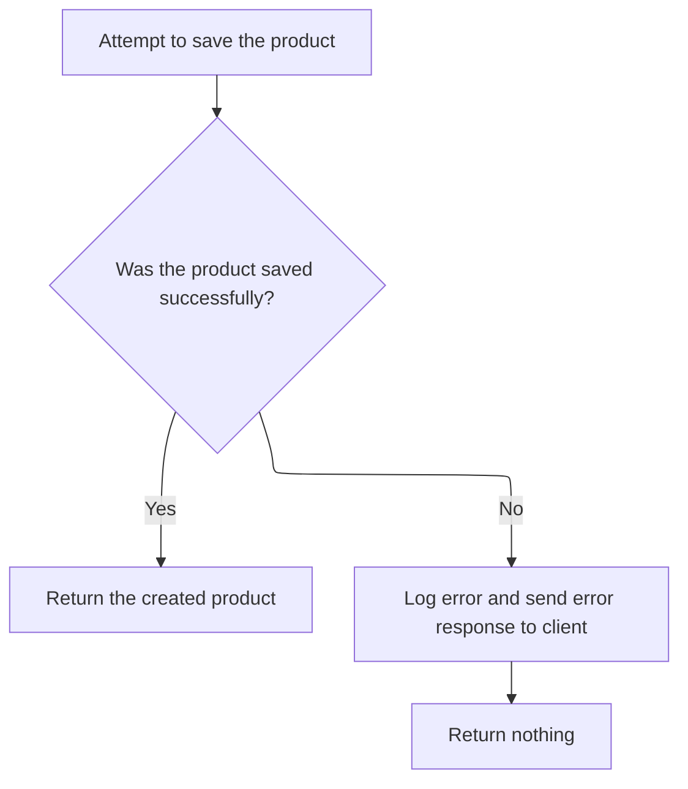

This document describes how a new product is created and associated with the correct store. The process involves mapping incoming product data, synchronizing related shopping cart information, and saving the product. The flow receives product data and a store identifier, and returns the created product or an error response.

# Validating Store Context and Preparing Product Entity

This section ensures that product creation is performed within the correct store context and that all necessary services are configured before mapping the product data. It prevents product creation if the store context is invalid and prepares the product entity for further processing.

| Category        | Rule Name                       | Description                                                                                                                                                                                                                                                                                                                                                                                                                                                                    |
| --------------- | ------------------------------- | ------------------------------------------------------------------------------------------------------------------------------------------------------------------------------------------------------------------------------------------------------------------------------------------------------------------------------------------------------------------------------------------------------------------------------------------------------------------------------ |
| Data validation | Valid Store Context Required    | Product creation must be performed within the context of a valid <SwmToken path="shopizer/sm-shop/src/main/java/com/salesmanager/web/services/controller/product/ShopProductRESTController.java" pos="115:1:1" line-data="			MerchantStore merchantStore = (MerchantStore)request.getAttribute(Constants.MERCHANT_STORE);">`MerchantStore`</SwmToken>. If the store is not found or does not match the provided store code, product creation is aborted and an error is returned. |
| Business logic  | Required Services Configuration | All required services (category, product option, product option value, manufacturer, tax class, language) must be configured before mapping the incoming product data to the Product entity.                                                                                                                                                                                                                                                                                   |
| Business logic  | Default Language Mapping        | Product entity mapping must use the default language of the <SwmToken path="shopizer/sm-shop/src/main/java/com/salesmanager/web/services/controller/product/ShopProductRESTController.java" pos="115:1:1" line-data="			MerchantStore merchantStore = (MerchantStore)request.getAttribute(Constants.MERCHANT_STORE);">`MerchantStore`</SwmToken> to ensure consistency in product data representation.                                                                            |

<SwmSnippet path="/shopizer/sm-shop/src/main/java/com/salesmanager/web/services/controller/product/ShopProductRESTController.java" line="110">

---

In <SwmToken path="shopizer/sm-shop/src/main/java/com/salesmanager/web/services/controller/product/ShopProductRESTController.java" pos="110:5:5" line-data="	public PersistableProduct createProduct(@PathVariable final String store, @Valid @RequestBody PersistableProduct product, HttpServletRequest request, HttpServletResponse response) throws Exception {">`createProduct`</SwmToken>, we start by making sure we're working with the correct <SwmToken path="shopizer/sm-shop/src/main/java/com/salesmanager/web/services/controller/product/ShopProductRESTController.java" pos="115:1:1" line-data="			MerchantStore merchantStore = (MerchantStore)request.getAttribute(Constants.MERCHANT_STORE);">`MerchantStore`</SwmToken>, either from the request or by fetching it using the store code. If it's not found, we bail out early. Next, we set up the <SwmToken path="shopizer/sm-shop/src/main/java/com/salesmanager/web/services/controller/product/ShopProductRESTController.java" pos="132:1:1" line-data="			PersistableProductPopulator populator = new PersistableProductPopulator();">`PersistableProductPopulator`</SwmToken> with all the required services to handle mapping the incoming DTO to a Product entity. This sets up all the context and dependencies needed before we move on to populating related models, which is why the next step is to call <SwmToken path="shopizer/sm-shop/src/main/java/com/salesmanager/web/populator/shoppingCart/ShoppingCartModelPopulator.java" pos="37:4:4" line-data="public class ShoppingCartModelPopulator">`ShoppingCartModelPopulator`</SwmToken>—to handle cart-related data that might be tied to the product creation.

```java
	public PersistableProduct createProduct(@PathVariable final String store, @Valid @RequestBody PersistableProduct product, HttpServletRequest request, HttpServletResponse response) throws Exception {

		
		try {
			
			MerchantStore merchantStore = (MerchantStore)request.getAttribute(Constants.MERCHANT_STORE);
			if(merchantStore!=null) {
				if(!merchantStore.getCode().equals(store)) {
					merchantStore = null;
				}
			}
			
			if(merchantStore== null) {
				merchantStore = merchantStoreService.getByCode(store);
			}
			
			if(merchantStore==null) {
				LOGGER.error("Merchant store is null for code " + store);
				response.sendError(503, "Merchant store is null for code " + store);
				return null;
			}

			PersistableProductPopulator populator = new PersistableProductPopulator();
			populator.setCategoryService(categoryService);
			populator.setProductOptionService(productOptionService);
			populator.setProductOptionValueService(productOptionValueService);
			populator.setManufacturerService(manufacturerService);
			populator.setTaxClassService(taxClassService);
			populator.setLanguageService(languageService);
			
			
			Product prod = new Product();
			populator.populate(product, prod, merchantStore, merchantStore.getDefaultLanguage());
			
```

---

</SwmSnippet>

## Syncing Shopping Cart Model with Incoming Data

```mermaid
%%{init: {"flowchart": {"defaultRenderer": "elk"}} }%%
flowchart TD
    node1["Start cart population"] --> node2{"Is cart id > 0 and code present?"}
    click node1 openCode "shopizer/sm-shop/src/main/java/com/salesmanager/web/populator/shoppingCart/ShoppingCartModelPopulator.java:85:91"
    node2 -->|"Yes"| node3["Load cart from database using cart code"]
    click node2 openCode "shopizer/sm-shop/src/main/java/com/salesmanager/web/populator/shoppingCart/ShoppingCartModelPopulator.java:91:104"
    node2 -->|"No"| node4["Create new cart with cart code and customer id"]
    click node3 openCode "shopizer/sm-shop/src/main/java/com/salesmanager/web/populator/shoppingCart/ShoppingCartModelPopulator.java:93:104"
    click node4 openCode "shopizer/sm-shop/src/main/java/com/salesmanager/web/populator/shoppingCart/ShoppingCartModelPopulator.java:106:114"
    node3 --> node5["Process each cart item"]
    node4 --> node5
    click node5 openCode "shopizer/sm-shop/src/main/java/com/salesmanager/web/populator/shoppingCart/ShoppingCartModelPopulator.java:116:176"

    subgraph loop1["For each item in cart data"]
        node5 --> node6{"Does item exist in cart?"}
        click node6 openCode "shopizer/sm-shop/src/main/java/com/salesmanager/web/populator/shoppingCart/ShoppingCartModelPopulator.java:124:160"
        node6 -->|"Yes"| node7["Update item quantity"]
        click node7 openCode "shopizer/sm-shop/src/main/java/com/salesmanager/web/populator/shoppingCart/ShoppingCartModelPopulator.java:132:132"
        node7 --> node8{"Does item have attributes?"}
        click node8 openCode "shopizer/sm-shop/src/main/java/com/salesmanager/web/populator/shoppingCart/ShoppingCartModelPopulator.java:138:155"
        node8 -->|"Yes"| node9["Update item attributes"]
        click node9 openCode "shopizer/sm-shop/src/main/java/com/salesmanager/web/populator/shoppingCart/ShoppingCartModelPopulator.java:141:152"
        node8 -->|"No"| node10["Remove all item attributes"]
        click node10 openCode "shopizer/sm-shop/src/main/java/com/salesmanager/web/populator/shoppingCart/ShoppingCartModelPopulator.java:156:157"
        node9 --> node11["Collect updated item"]
        click node11 openCode "shopizer/sm-shop/src/main/java/com/salesmanager/web/populator/shoppingCart/ShoppingCartModelPopulator.java:158:158"
        node10 --> node11
        node6 -->|"No"| node12["Add new item to cart"]
        click node12 openCode "shopizer/sm-shop/src/main/java/com/salesmanager/web/populator/shoppingCart/ShoppingCartModelPopulator.java:164:173"
        node12 --> node13["Update cart in database"]
        click node13 openCode "shopizer/sm-shop/src/main/java/com/salesmanager/web/populator/shoppingCart/ShoppingCartModelPopulator.java:174:174"
        node11 --> node5
        node13 --> node5
    end
    node5 --> node14["Return updated cart"]
    click node14 openCode "shopizer/sm-shop/src/main/java/com/salesmanager/web/populator/shoppingCart/ShoppingCartModelPopulator.java:187:188"

classDef HeadingStyle fill:#777777,stroke:#333,stroke-width:2px;

%% Swimm:
%% %%{init: {"flowchart": {"defaultRenderer": "elk"}} }%%
%% flowchart TD
%%     node1["Start cart population"] --> node2{"Is cart id > 0 and code present?"}
%%     click node1 openCode "<SwmPath>[shopizer/…/shoppingCart/ShoppingCartModelPopulator.java](shopizer/sm-shop/src/main/java/com/salesmanager/web/populator/shoppingCart/ShoppingCartModelPopulator.java)</SwmPath>:85:91"
%%     node2 -->|"Yes"| node3["Load cart from database using cart code"]
%%     click node2 openCode "<SwmPath>[shopizer/…/shoppingCart/ShoppingCartModelPopulator.java](shopizer/sm-shop/src/main/java/com/salesmanager/web/populator/shoppingCart/ShoppingCartModelPopulator.java)</SwmPath>:91:104"
%%     node2 -->|"No"| node4["Create new cart with cart code and customer id"]
%%     click node3 openCode "<SwmPath>[shopizer/…/shoppingCart/ShoppingCartModelPopulator.java](shopizer/sm-shop/src/main/java/com/salesmanager/web/populator/shoppingCart/ShoppingCartModelPopulator.java)</SwmPath>:93:104"
%%     click node4 openCode "<SwmPath>[shopizer/…/shoppingCart/ShoppingCartModelPopulator.java](shopizer/sm-shop/src/main/java/com/salesmanager/web/populator/shoppingCart/ShoppingCartModelPopulator.java)</SwmPath>:106:114"
%%     node3 --> node5["Process each cart item"]
%%     node4 --> node5
%%     click node5 openCode "<SwmPath>[shopizer/…/shoppingCart/ShoppingCartModelPopulator.java](shopizer/sm-shop/src/main/java/com/salesmanager/web/populator/shoppingCart/ShoppingCartModelPopulator.java)</SwmPath>:116:176"
%% 
%%     subgraph loop1["For each item in cart data"]
%%         node5 --> node6{"Does item exist in cart?"}
%%         click node6 openCode "<SwmPath>[shopizer/…/shoppingCart/ShoppingCartModelPopulator.java](shopizer/sm-shop/src/main/java/com/salesmanager/web/populator/shoppingCart/ShoppingCartModelPopulator.java)</SwmPath>:124:160"
%%         node6 -->|"Yes"| node7["Update item quantity"]
%%         click node7 openCode "<SwmPath>[shopizer/…/shoppingCart/ShoppingCartModelPopulator.java](shopizer/sm-shop/src/main/java/com/salesmanager/web/populator/shoppingCart/ShoppingCartModelPopulator.java)</SwmPath>:132:132"
%%         node7 --> node8{"Does item have attributes?"}
%%         click node8 openCode "<SwmPath>[shopizer/…/shoppingCart/ShoppingCartModelPopulator.java](shopizer/sm-shop/src/main/java/com/salesmanager/web/populator/shoppingCart/ShoppingCartModelPopulator.java)</SwmPath>:138:155"
%%         node8 -->|"Yes"| node9["Update item attributes"]
%%         click node9 openCode "<SwmPath>[shopizer/…/shoppingCart/ShoppingCartModelPopulator.java](shopizer/sm-shop/src/main/java/com/salesmanager/web/populator/shoppingCart/ShoppingCartModelPopulator.java)</SwmPath>:141:152"
%%         node8 -->|"No"| node10["Remove all item attributes"]
%%         click node10 openCode "<SwmPath>[shopizer/…/shoppingCart/ShoppingCartModelPopulator.java](shopizer/sm-shop/src/main/java/com/salesmanager/web/populator/shoppingCart/ShoppingCartModelPopulator.java)</SwmPath>:156:157"
%%         node9 --> node11["Collect updated item"]
%%         click node11 openCode "<SwmPath>[shopizer/…/shoppingCart/ShoppingCartModelPopulator.java](shopizer/sm-shop/src/main/java/com/salesmanager/web/populator/shoppingCart/ShoppingCartModelPopulator.java)</SwmPath>:158:158"
%%         node10 --> node11
%%         node6 -->|"No"| node12["Add new item to cart"]
%%         click node12 openCode "<SwmPath>[shopizer/…/shoppingCart/ShoppingCartModelPopulator.java](shopizer/sm-shop/src/main/java/com/salesmanager/web/populator/shoppingCart/ShoppingCartModelPopulator.java)</SwmPath>:164:173"
%%         node12 --> node13["Update cart in database"]
%%         click node13 openCode "<SwmPath>[shopizer/…/shoppingCart/ShoppingCartModelPopulator.java](shopizer/sm-shop/src/main/java/com/salesmanager/web/populator/shoppingCart/ShoppingCartModelPopulator.java)</SwmPath>:174:174"
%%         node11 --> node5
%%         node13 --> node5
%%     end
%%     node5 --> node14["Return updated cart"]
%%     click node14 openCode "<SwmPath>[shopizer/…/shoppingCart/ShoppingCartModelPopulator.java](shopizer/sm-shop/src/main/java/com/salesmanager/web/populator/shoppingCart/ShoppingCartModelPopulator.java)</SwmPath>:187:188"
%% 
%% classDef HeadingStyle fill:#777777,stroke:#333,stroke-width:2px;
```



This section governs how the <SwmToken path="shopizer/sm-shop/src/main/java/com/salesmanager/web/populator/shoppingCart/ShoppingCartModelPopulator.java" pos="85:3:3" line-data="    public ShoppingCart populate(ShoppingCartData shoppingCart,ShoppingCart cartMdel,final MerchantStore store, Language language)">`ShoppingCart`</SwmToken> model is synchronized with incoming cart data, ensuring that the cart in the system accurately reflects the user's intended cart state, including items, quantities, and attributes. It also manages cart creation or retrieval based on identifiers and handles error scenarios gracefully.

| Category       | Rule Name                      | Description                                                                                                                                                                                                                                                                                                         |
| -------------- | ------------------------------ | ------------------------------------------------------------------------------------------------------------------------------------------------------------------------------------------------------------------------------------------------------------------------------------------------------------------- |
| Business logic | Cart Retrieval or Creation     | If the incoming cart data contains a cart ID greater than 0 and a non-blank cart code, the system must attempt to retrieve the existing cart using the provided code. If no cart is found, a new cart must be created with the provided code and associated with the customer if customer information is available. |
| Business logic | Cart Association               | When creating a new cart, the cart must be associated with the provided merchant store and, if customer information is available, with the customer ID.                                                                                                                                                             |
| Business logic | Item Quantity Synchronization  | For each item in the incoming cart data, if the item already exists in the cart (matched by item ID), the system must update the item's quantity to match the incoming data.                                                                                                                                        |
| Business logic | Item Attribute Synchronization | If an existing cart item has attributes in the incoming data, only those attributes present in the incoming data should be retained; all others must be removed. If no attributes are provided, all attributes must be removed from the item.                                                                       |
| Business logic | New Item Addition              | If an item in the incoming cart data does not exist in the current cart, it must be added as a new item, including any attributes specified.                                                                                                                                                                        |

<SwmSnippet path="/shopizer/sm-shop/src/main/java/com/salesmanager/web/populator/shoppingCart/ShoppingCartModelPopulator.java" line="85">

---

In <SwmToken path="shopizer/sm-shop/src/main/java/com/salesmanager/web/populator/shoppingCart/ShoppingCartModelPopulator.java" pos="85:5:5" line-data="    public ShoppingCart populate(ShoppingCartData shoppingCart,ShoppingCart cartMdel,final MerchantStore store, Language language)">`populate`</SwmToken>, we either fetch or create the <SwmToken path="shopizer/sm-shop/src/main/java/com/salesmanager/web/populator/shoppingCart/ShoppingCartModelPopulator.java" pos="85:3:3" line-data="    public ShoppingCart populate(ShoppingCartData shoppingCart,ShoppingCart cartMdel,final MerchantStore store, Language language)">`ShoppingCart`</SwmToken> model based on the incoming data's ID and code. The function then syncs the cart's line items and their attributes with what's provided, updating quantities and attributes or creating new items as needed. The use of a hidden 'customer' object means the customer ID is set only if that object is available, which isn't obvious from the function signature.

```java
    public ShoppingCart populate(ShoppingCartData shoppingCart,ShoppingCart cartMdel,final MerchantStore store, Language language)
    {


        // if id >0 get the original from the database, override products
       try{
        if ( shoppingCart.getId() > 0  && StringUtils.isNotBlank( shoppingCart.getCode()))
        {
            cartMdel = shoppingCartService.getByCode( shoppingCart.getCode(), store );
            if(cartMdel==null){
                cartMdel=new ShoppingCart();
                cartMdel.setShoppingCartCode( shoppingCart.getCode() );
                cartMdel.setMerchantStore( store );
                if ( customer != null )
                {
                    cartMdel.setCustomerId( customer.getId() );
                }
                shoppingCartService.create( cartMdel );
            }
        }
        else
        {
            cartMdel.setShoppingCartCode( shoppingCart.getCode() );
            cartMdel.setMerchantStore( store );
            if ( customer != null )
            {
                cartMdel.setCustomerId( customer.getId() );
            }
            shoppingCartService.create( cartMdel );
        }

        List<ShoppingCartItem> items = shoppingCart.getShoppingCartItems();
        Set<com.salesmanager.core.business.shoppingcart.model.ShoppingCartItem> newItems =
            new HashSet<com.salesmanager.core.business.shoppingcart.model.ShoppingCartItem>();
        if ( items != null && items.size() > 0 )
        {
            for ( ShoppingCartItem item : items )
            {

                Set<com.salesmanager.core.business.shoppingcart.model.ShoppingCartItem> cartItems = cartMdel.getLineItems();
                if ( cartItems != null && cartItems.size() > 0 )
                {

                    for ( com.salesmanager.core.business.shoppingcart.model.ShoppingCartItem dbItem : cartItems )
                    {
                        if ( dbItem.getId().longValue() == item.getId() )
                        {
                            dbItem.setQuantity( item.getQuantity() );
                            // compare attributes
                            Set<com.salesmanager.core.business.shoppingcart.model.ShoppingCartAttributeItem> attributes =
                                dbItem.getAttributes();
                            Set<com.salesmanager.core.business.shoppingcart.model.ShoppingCartAttributeItem> newAttributes =
                                new HashSet<com.salesmanager.core.business.shoppingcart.model.ShoppingCartAttributeItem>();
                            List<ShoppingCartAttribute> cartAttributes = item.getShoppingCartAttributes();
                            if ( !CollectionUtils.isEmpty( cartAttributes ) )
                            {
                                for ( ShoppingCartAttribute attribute : cartAttributes )
                                {
                                    for ( com.salesmanager.core.business.shoppingcart.model.ShoppingCartAttributeItem dbAttribute : attributes )
                                    {
                                        if ( dbAttribute.getId().longValue() == attribute.getId() )
                                        {
                                            newAttributes.add( dbAttribute );
                                        }
                                    }
                                }
                                
                                dbItem.setAttributes( newAttributes );
                            }
                            else
                            {
                                dbItem.removeAllAttributes();
                            }
                            newItems.add( dbItem );
                        }
                    }
                }
                else
                {// create new item
                    com.salesmanager.core.business.shoppingcart.model.ShoppingCartItem cartItem =
                        createCartItem( cartMdel, item, store );
                    Set<com.salesmanager.core.business.shoppingcart.model.ShoppingCartItem> lineItems =
                        cartMdel.getLineItems();
                    if ( lineItems == null )
                    {
                        lineItems = new HashSet<com.salesmanager.core.business.shoppingcart.model.ShoppingCartItem>();
                        cartMdel.setLineItems( lineItems );
                    }
                    lineItems.add( cartItem );
                    shoppingCartService.update( cartMdel );
                }
            }// end for
```

---

</SwmSnippet>

<SwmSnippet path="/shopizer/sm-shop/src/main/java/com/salesmanager/web/populator/shoppingCart/ShoppingCartModelPopulator.java" line="176">

---

After syncing the cart model with the incoming data, the function returns the updated <SwmToken path="shopizer/sm-shop/src/main/java/com/salesmanager/web/populator/shoppingCart/ShoppingCartModelPopulator.java" pos="85:3:3" line-data="    public ShoppingCart populate(ShoppingCartData shoppingCart,ShoppingCart cartMdel,final MerchantStore store, Language language)">`ShoppingCart`</SwmToken> instance. If any error happens during the process, it throws a <SwmToken path="shopizer/sm-shop/src/main/java/com/salesmanager/web/populator/shoppingCart/ShoppingCartModelPopulator.java" pos="180:5:5" line-data="           throw new ConversionException( &quot;Unable to create cart model&quot;, se ); ">`ConversionException`</SwmToken> instead of returning a cart.

```java
            }// end for
        }// end if
       }catch(ServiceException se){
           LOG.error( "Error while converting cart data to cart model.."+se );
           throw new ConversionException( "Unable to create cart model", se ); 
       }
       catch (Exception ex){
           LOG.error( "Error while converting cart data to cart model.."+ex );
           throw new ConversionException( "Unable to create cart model", ex );  
       }

        return cartMdel;
    }
```

---

</SwmSnippet>

## Persisting Product and Handling Errors



<SwmSnippet path="/shopizer/sm-shop/src/main/java/com/salesmanager/web/services/controller/product/ShopProductRESTController.java" line="144">

---

We just got back from <SwmToken path="shopizer/sm-shop/src/main/java/com/salesmanager/web/populator/shoppingCart/ShoppingCartModelPopulator.java" pos="37:4:4" line-data="public class ShoppingCartModelPopulator">`ShoppingCartModelPopulator`</SwmToken>, so now in ShopProductRESTController.createProduct, we save the populated Product entity. If saving fails, we log the error and send a 503 response. Otherwise, we return the original <SwmToken path="shopizer/sm-shop/src/main/java/com/salesmanager/web/services/controller/product/ShopProductRESTController.java" pos="110:3:3" line-data="	public PersistableProduct createProduct(@PathVariable final String store, @Valid @RequestBody PersistableProduct product, HttpServletRequest request, HttpServletResponse response) throws Exception {">`PersistableProduct`</SwmToken> DTO.

```java
			productService.save(prod);
			
			return product;
			
		} catch (Exception e) {
			LOGGER.error("Error while saving product",e);
			try {
				response.sendError(503, "Error while saving product " + e.getMessage());
			} catch (Exception ignore) {
			}
			
			return null;
		}
		
	}
```

---

</SwmSnippet>

&nbsp;

*This is an auto-generated document by Swimm 🌊 and has not yet been verified by a human*

<SwmMeta version="3.0.0" repo-id="Z2l0aHViJTNBJTNBU2hvcGl6ZXIlM0ElM0F1bWFsaW5nYXN3YW1p" repo-name="Shopizer"><sup>Powered by [Swimm](https://app.swimm.io/)</sup></SwmMeta>
