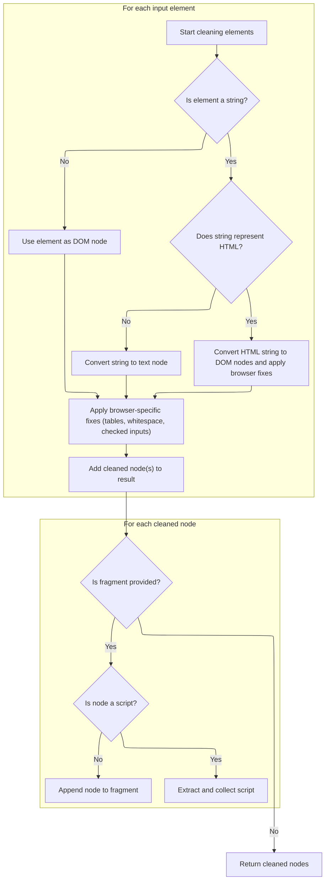

This document explains how document fragments are created from HTML strings or DOM nodes to enable dynamic content insertion in the web application. The flow optimizes performance by reusing cached fragments when possible and ensures that HTML is parsed into DOM nodes with scripts safely extracted.

# Fragment Creation and Caching Decision

This section governs the creation of document fragments from HTML strings, deciding when to use cached fragments for performance and ensuring correct parsing and handling of scripts and browser-specific issues.

| Category        | Rule Name                     | Description                                                                                                                                                                                                                 |
| --------------- | ----------------------------- | --------------------------------------------------------------------------------------------------------------------------------------------------------------------------------------------------------------------------- |
| Data validation | Fragment Cache Restrictions   | Do not cache fragments containing <object> or <embed> elements, or those affected by browser cloning issues, to avoid incorrect behavior.                                                                                   |
| Business logic  | Fragment Cache Eligibility    | If the input HTML string is less than 512 characters, starts with '<', is not marked as non-cacheable, and the document context is the main document, then the fragment is eligible for caching.                            |
| Business logic  | Cached Fragment Reuse         | If a cached fragment exists for the eligible HTML string, reuse the cached fragment instead of creating a new one.                                                                                                          |
| Business logic  | Fragment Creation and Parsing | If the input does not meet cache eligibility criteria or no cached fragment exists, create a new document fragment and parse the HTML string into DOM nodes, ensuring scripts are processed and browser quirks are handled. |

<SwmSnippet path="/shopizer/sm-shop/src/main/webapp/resources/js/bootstrap/jquery.js" line="6071">

---

In `buildFragment`, we start by figuring out which document to use based on nodes\[0\], then check if the input is a short, cacheable HTML string and if browser quirks allow caching. If a cached fragment is available, we reuse it; otherwise, we create a new fragment and call `clean` to parse and insert the HTML, handling scripts and browser-specific issues. Calling `clean` here is necessary because it actually turns the HTML string into DOM nodes and processes scripts, which is more than just a simple append.

```javascript
jQuery.buildFragment = function( args, nodes, scripts ) {
	var fragment, cacheable, cacheresults, doc,
	first = args[ 0 ];

	// nodes may contain either an explicit document object,
	// a jQuery collection or context object.
	// If nodes[0] contains a valid object to assign to doc
	if ( nodes && nodes[0] ) {
		doc = nodes[0].ownerDocument || nodes[0];
	}

	// Ensure that an attr object doesn't incorrectly stand in as a document object
	// Chrome and Firefox seem to allow this to occur and will throw exception
	// Fixes #8950
	if ( !doc.createDocumentFragment ) {
		doc = document;
	}

	// Only cache "small" (1/2 KB) HTML strings that are associated with the main document
	// Cloning options loses the selected state, so don't cache them
	// IE 6 doesn't like it when you put <object> or <embed> elements in a fragment
	// Also, WebKit does not clone 'checked' attributes on cloneNode, so don't cache
	// Lastly, IE6,7,8 will not correctly reuse cached fragments that were created from unknown elems #10501
	if ( args.length === 1 && typeof first === "string" && first.length < 512 && doc === document &&
		first.charAt(0) === "<" && !rnocache.test( first ) &&
		(jQuery.support.checkClone || !rchecked.test( first )) &&
		(jQuery.support.html5Clone || !rnoshimcache.test( first )) ) {

		cacheable = true;

		cacheresults = jQuery.fragments[ first ];
		if ( cacheresults && cacheresults !== 1 ) {
			fragment = cacheresults;
		}
	}

	if ( !fragment ) {
		fragment = doc.createDocumentFragment();
		jQuery.clean( args, doc, fragment, scripts );
	}

```

---

</SwmSnippet>

## HTML String Parsing and DOM Node Preparation



This section is responsible for parsing input elements (strings or DOM nodes), converting HTML strings to DOM nodes, normalizing them for browser compatibility, and preparing them for safe insertion into the DOM. It also extracts script nodes for separate handling.

| Category        | Rule Name                       | Description                                                                                                                                                                                             |
| --------------- | ------------------------------- | ------------------------------------------------------------------------------------------------------------------------------------------------------------------------------------------------------- |
| Data validation | Script extraction and safety    | Script nodes must be extracted from the cleaned nodes and collected separately if a scripts array is provided, ensuring only safe script types are included.                                            |
| Business logic  | Text node conversion            | If an input element is a string that does not represent HTML, it must be converted to a text node before further processing.                                                                            |
| Business logic  | HTML string normalization       | If an input string represents HTML, it must be parsed into DOM nodes, with browser-specific fixes applied (such as wrapping certain tags and removing auto-inserted <tbody> elements in tables for IE). |
| Business logic  | Leading whitespace preservation | Leading whitespace in HTML strings must be preserved in browsers that do not support leading whitespace in innerHTML operations.                                                                        |
| Business logic  | Checked input normalization     | Radio and checkbox inputs must have their defaultChecked property reset before being appended to the DOM in browsers that do not support appendChecked.                                                 |
| Business logic  | Fragment population             | All cleaned nodes must be appended to the provided fragment, except for extracted script nodes, which are handled separately.                                                                           |
| Business logic  | Cleaned node return             | If no fragment is provided, the cleaned nodes are returned as a list for further processing or insertion.                                                                                               |

<SwmSnippet path="/shopizer/sm-shop/src/main/webapp/resources/js/bootstrap/jquery.js" line="6242">

---

In `clean`, we loop through the input elements, converting strings to DOM nodes, wrapping HTML as needed for browser compatibility, and handling quirks like IE's auto-inserted <tbody> and leading whitespace. This is where the actual parsing and normalization of the HTML happens, not just a simple cleanup.

```javascript
	clean: function( elems, context, fragment, scripts ) {
		var checkScriptType;

		context = context || document;

		// !context.createElement fails in IE with an error but returns typeof 'object'
		if ( typeof context.createElement === "undefined" ) {
			context = context.ownerDocument || context[0] && context[0].ownerDocument || document;
		}

		var ret = [], j;

		for ( var i = 0, elem; (elem = elems[i]) != null; i++ ) {
			if ( typeof elem === "number" ) {
				elem += "";
			}

			if ( !elem ) {
				continue;
			}

			// Convert html string into DOM nodes
			if ( typeof elem === "string" ) {
				if ( !rhtml.test( elem ) ) {
					elem = context.createTextNode( elem );
				} else {
					// Fix "XHTML"-style tags in all browsers
					elem = elem.replace(rxhtmlTag, "<$1></$2>");

					// Trim whitespace, otherwise indexOf won't work as expected
					var tag = ( rtagName.exec( elem ) || ["", ""] )[1].toLowerCase(),
						wrap = wrapMap[ tag ] || wrapMap._default,
						depth = wrap[0],
						div = context.createElement("div");

					// Append wrapper element to unknown element safe doc fragment
					if ( context === document ) {
						// Use the fragment we've already created for this document
						safeFragment.appendChild( div );
					} else {
						// Use a fragment created with the owner document
						createSafeFragment( context ).appendChild( div );
					}

					// Go to html and back, then peel off extra wrappers
					div.innerHTML = wrap[1] + elem + wrap[2];

					// Move to the right depth
					while ( depth-- ) {
						div = div.lastChild;
					}

					// Remove IE's autoinserted <tbody> from table fragments
					if ( !jQuery.support.tbody ) {

						// String was a <table>, *may* have spurious <tbody>
						var hasBody = rtbody.test(elem),
							tbody = tag === "table" && !hasBody ?
								div.firstChild && div.firstChild.childNodes :

								// String was a bare <thead> or <tfoot>
								wrap[1] === "<table>" && !hasBody ?
									div.childNodes :
									[];

						for ( j = tbody.length - 1; j >= 0 ; --j ) {
							if ( jQuery.nodeName( tbody[ j ], "tbody" ) && !tbody[ j ].childNodes.length ) {
								tbody[ j ].parentNode.removeChild( tbody[ j ] );
							}
						}
					}

					// IE completely kills leading whitespace when innerHTML is used
					if ( !jQuery.support.leadingWhitespace && rleadingWhitespace.test( elem ) ) {
						div.insertBefore( context.createTextNode( rleadingWhitespace.exec(elem)[0] ), div.firstChild );
					}

					elem = div.childNodes;
				}
			}

			// Resets defaultChecked for any radios and checkboxes
			// about to be appended to the DOM in IE 6/7 (#8060)
			var len;
			if ( !jQuery.support.appendChecked ) {
				if ( elem[0] && typeof (len = elem.length) === "number" ) {
					for ( j = 0; j < len; j++ ) {
						findInputs( elem[j] );
					}
				} else {
					findInputs( elem );
				}
			}

			if ( elem.nodeType ) {
				ret.push( elem );
			} else {
				ret = jQuery.merge( ret, elem );
			}
		}
```

---

</SwmSnippet>

<SwmSnippet path="/shopizer/sm-shop/src/main/webapp/resources/js/bootstrap/jquery.js" line="6343">

---

Here we append the parsed nodes to the fragment, extract script tags for separate handling, and make sure only safe scripts are included. This step finalizes the DOM nodes and scripts that will be returned to the caller.

```javascript
		if ( fragment ) {
			checkScriptType = function( elem ) {
				return !elem.type || rscriptType.test( elem.type );
			};
			for ( i = 0; ret[i]; i++ ) {
				if ( scripts && jQuery.nodeName( ret[i], "script" ) && (!ret[i].type || ret[i].type.toLowerCase() === "text/javascript") ) {
					scripts.push( ret[i].parentNode ? ret[i].parentNode.removeChild( ret[i] ) : ret[i] );

				} else {
					if ( ret[i].nodeType === 1 ) {
						var jsTags = jQuery.grep( ret[i].getElementsByTagName( "script" ), checkScriptType );

						ret.splice.apply( ret, [i + 1, 0].concat( jsTags ) );
					}
					fragment.appendChild( ret[i] );
				}
			}
```

---

</SwmSnippet>

## Fragment Caching and Return

<SwmSnippet path="/shopizer/sm-shop/src/main/webapp/resources/js/bootstrap/jquery.js" line="6112">

---

Back in `buildFragment`, after returning from `clean`, we cache the fragment if it's safe and return both the fragment and a flag indicating if it was cacheable. This wraps up the process by making future calls faster if the same HTML is used again.

```javascript
	if ( cacheable ) {
		jQuery.fragments[ first ] = cacheresults ? fragment : 1;
	}

	return { fragment: fragment, cacheable: cacheable };
};
```

---

</SwmSnippet>

&nbsp;

*This is an auto-generated document by Swimm 🌊 and has not yet been verified by a human*

<SwmMeta version="3.0.0" repo-id="Z2l0aHViJTNBJTNBU2hvcGl6ZXIlM0ElM0F1bWFsaW5nYXN3YW1p" repo-name="Shopizer"><sup>Powered by [Swimm](https://app.swimm.io/)</sup></SwmMeta>
