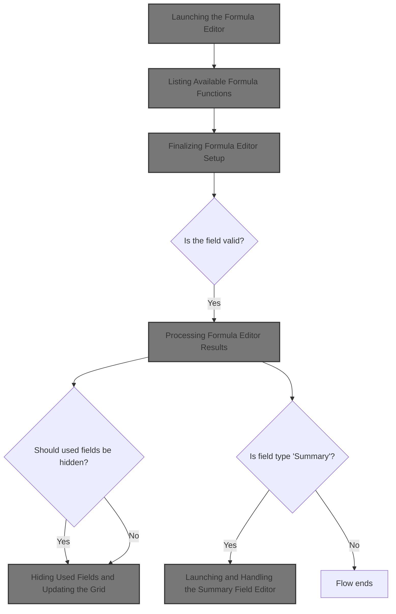
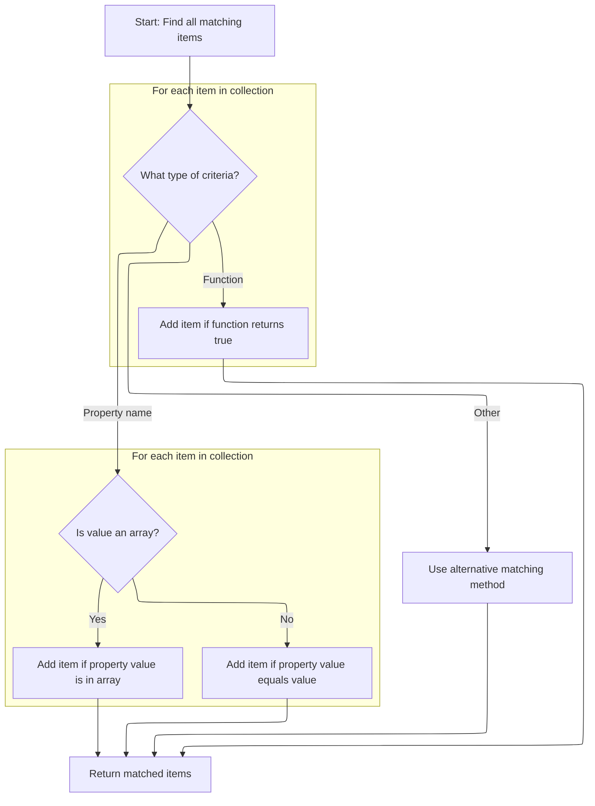
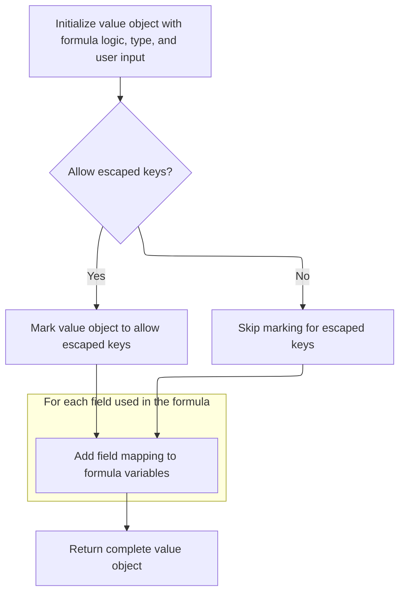
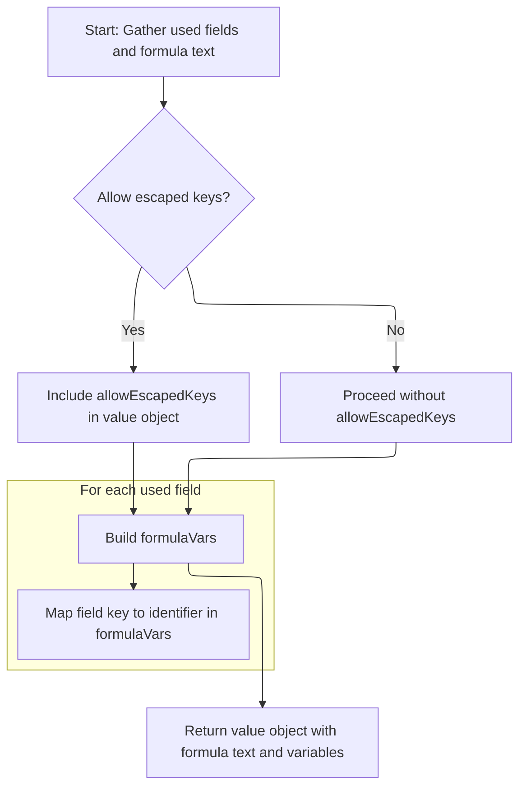
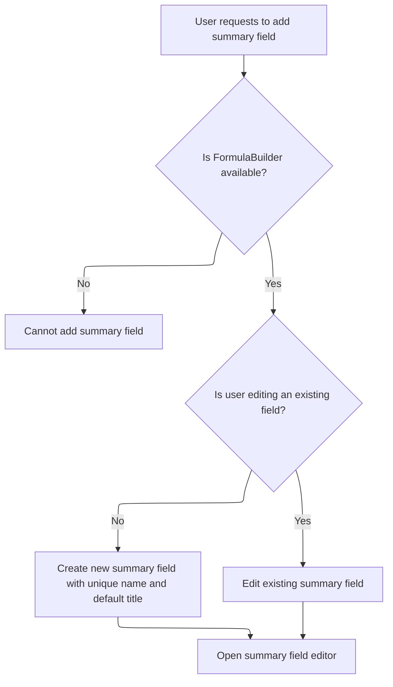

This document describes how users create or edit formula fields in the grid UI. The flow ensures only supported functions are available, enforces modal editing, validates changes, and updates the grid with complete formula metadata.



# Where is this flow used?

This flow is used multiple times in the codebase as represented in the following diagram:

(Note - these are only some of the entry points of this flow)

```mermaid
graph TD;
      fc4f97628503abd6d9e46b5d93b9e51f6cbc96244080239fc09084071b33bed4(shopizer/…/modules/ISC_Core.js::isc_Canvas_editFormulaField) --> e77c08859ad64bdd6687726cdad78ebdea5fe7791eb8ee336ae754e17e31a59a(shopizer/…/modules/ISC_Core.js::userFieldCallback):::mainFlowStyle

e77c08859ad64bdd6687726cdad78ebdea5fe7791eb8ee336ae754e17e31a59a(shopizer/…/modules/ISC_Core.js::userFieldCallback):::mainFlowStyle --> 6719f75262301d0f7dc7a94e1305a1fbdc7aacf5226b115e6fb42c53821f70f1(shopizer/…/modules/ISC_Core.js::addFormulaField):::mainFlowStyle

e77c08859ad64bdd6687726cdad78ebdea5fe7791eb8ee336ae754e17e31a59a(shopizer/…/modules/ISC_Core.js::userFieldCallback):::mainFlowStyle --> c27f2f572feee88d504c2418821ea275fdb30f43079868ab89681c4a027bfe3f(shopizer/…/modules/ISC_Core.js::addSummaryField):::mainFlowStyle

6719f75262301d0f7dc7a94e1305a1fbdc7aacf5226b115e6fb42c53821f70f1(shopizer/…/modules/ISC_Core.js::addFormulaField):::mainFlowStyle --> 30ce8498687d8b1c7da4fc5fa7615442ab2cff5c4c3722c81d4ac5d2869fe468(shopizer/…/modules/ISC_Core.js::editFormulaField):::mainFlowStyle

c27f2f572feee88d504c2418821ea275fdb30f43079868ab89681c4a027bfe3f(shopizer/…/modules/ISC_Core.js::addSummaryField):::mainFlowStyle --> 34329a9d7397905bb35bd0b749ea13123e89f4f15a50523be5af83a1d4c63174(shopizer/…/modules/ISC_Core.js::editSummaryField):::mainFlowStyle

34329a9d7397905bb35bd0b749ea13123e89f4f15a50523be5af83a1d4c63174(shopizer/…/modules/ISC_Core.js::editSummaryField):::mainFlowStyle --> e77c08859ad64bdd6687726cdad78ebdea5fe7791eb8ee336ae754e17e31a59a(shopizer/…/modules/ISC_Core.js::userFieldCallback):::mainFlowStyle

b0e1c8c1b994180c2331b9ca76168321737caf3605e18f0cd4df76813b8df301(shopizer/…/modules/ISC_Core.js::isc_Canvas_editSummaryField) --> e77c08859ad64bdd6687726cdad78ebdea5fe7791eb8ee336ae754e17e31a59a(shopizer/…/modules/ISC_Core.js::userFieldCallback):::mainFlowStyle

de5dd06c5fa1c5e292b4b3c93fda41eed12de9d01bd7e6489f634df9486fda6e(shopizer/…/modules/ISC_Core.js::fireOnClose) --> e77c08859ad64bdd6687726cdad78ebdea5fe7791eb8ee336ae754e17e31a59a(shopizer/…/modules/ISC_Core.js::userFieldCallback):::mainFlowStyle

de5dd06c5fa1c5e292b4b3c93fda41eed12de9d01bd7e6489f634df9486fda6e(shopizer/…/modules/ISC_Core.js::fireOnClose) --> e77c08859ad64bdd6687726cdad78ebdea5fe7791eb8ee336ae754e17e31a59a(shopizer/…/modules/ISC_Core.js::userFieldCallback):::mainFlowStyle

30c9533e46b53c5d33a1a2d65e212274c6d322a05e52dcb1dadde9d941eaaf0e(shopizer/…/modules/ISC_Core.js::isc_Canvas_userFieldCallback) --> 6719f75262301d0f7dc7a94e1305a1fbdc7aacf5226b115e6fb42c53821f70f1(shopizer/…/modules/ISC_Core.js::addFormulaField):::mainFlowStyle

30c9533e46b53c5d33a1a2d65e212274c6d322a05e52dcb1dadde9d941eaaf0e(shopizer/…/modules/ISC_Core.js::isc_Canvas_userFieldCallback) --> c27f2f572feee88d504c2418821ea275fdb30f43079868ab89681c4a027bfe3f(shopizer/…/modules/ISC_Core.js::addSummaryField):::mainFlowStyle


classDef mainFlowStyle color:#000000,fill:#7CB9F4
classDef rootsStyle color:#000000,fill:#00FFF4
classDef Style1 color:#000000,fill:#00FFAA
classDef Style2 color:#000000,fill:#FFFF00
classDef Style3 color:#000000,fill:#AA7CB9

%% Swimm:
%% graph TD;
%%       fc4f97628503abd6d9e46b5d93b9e51f6cbc96244080239fc09084071b33bed4(<SwmPath>[shopizer/…/modules/ISC_Core.js](shopizer/sm-shop/src/main/webapp/resources/smart-client/system/modules/ISC_Core.js)</SwmPath>::<SwmToken path="shopizer/sm-shop/src/main/webapp/resources/smart-client/system/modules/ISC_Core.js" pos="3790:9:9" line-data=",isc.A.editFormulaField=function isc_Canvas_editFormulaField(_1){if(isc.FormulaBuilder==null)return;var _2=this,_3=!_1?false:true;if(!_3){_1={name:_2.getUniqueFieldName(this.formulaFieldNamePrefix),title:&quot;New Field&quot;,width:&quot;50&quot;,canFilter:false,canExport:false,canSortClientOnly:true}}">`isc_Canvas_editFormulaField`</SwmToken>) --> e77c08859ad64bdd6687726cdad78ebdea5fe7791eb8ee336ae754e17e31a59a(<SwmPath>[shopizer/…/modules/ISC_Core.js](shopizer/sm-shop/src/main/webapp/resources/smart-client/system/modules/ISC_Core.js)</SwmPath>::<SwmToken path="shopizer/sm-shop/src/main/webapp/resources/smart-client/system/modules/ISC_Core.js" pos="3791:164:164" line-data="this.$65y=isc.Window.create({title:&quot;Formula Editor [&quot;+_1.title+&quot;]&quot;,showMinimizeButton:false,showMaximizeButton:false,isModal:true,showModalMask:true,autoSize:true,autoCenter:true,autoDraw:true,headerIconProperties:{padding:1,src:&quot;[SKINIMG]ListGrid/formula_menuItem.png&quot;},closeClick:function(){this.items.get(0).completeEditing(true);return this.Super(&#39;closeClick&#39;,arguments)},items:[isc.FormulaBuilder.create({width:300,component:_2,dataSource:_2.getDataSource(),editMode:_3,field:_1,mathFunctions:isc.MathFunction.getDefaultFunctionNames(),fireOnClose:function(){_2.userFieldCallback(this)}},this.formulaBuilderProperties)]},this.formulaBuilderProperties)}">`userFieldCallback`</SwmToken>):::mainFlowStyle
%% 
%% e77c08859ad64bdd6687726cdad78ebdea5fe7791eb8ee336ae754e17e31a59a(<SwmPath>[shopizer/…/modules/ISC_Core.js](shopizer/sm-shop/src/main/webapp/resources/smart-client/system/modules/ISC_Core.js)</SwmPath>::<SwmToken path="shopizer/sm-shop/src/main/webapp/resources/smart-client/system/modules/ISC_Core.js" pos="3791:164:164" line-data="this.$65y=isc.Window.create({title:&quot;Formula Editor [&quot;+_1.title+&quot;]&quot;,showMinimizeButton:false,showMaximizeButton:false,isModal:true,showModalMask:true,autoSize:true,autoCenter:true,autoDraw:true,headerIconProperties:{padding:1,src:&quot;[SKINIMG]ListGrid/formula_menuItem.png&quot;},closeClick:function(){this.items.get(0).completeEditing(true);return this.Super(&#39;closeClick&#39;,arguments)},items:[isc.FormulaBuilder.create({width:300,component:_2,dataSource:_2.getDataSource(),editMode:_3,field:_1,mathFunctions:isc.MathFunction.getDefaultFunctionNames(),fireOnClose:function(){_2.userFieldCallback(this)}},this.formulaBuilderProperties)]},this.formulaBuilderProperties)}">`userFieldCallback`</SwmToken>):::mainFlowStyle --> 6719f75262301d0f7dc7a94e1305a1fbdc7aacf5226b115e6fb42c53821f70f1(<SwmPath>[shopizer/…/modules/ISC_Core.js](shopizer/sm-shop/src/main/webapp/resources/smart-client/system/modules/ISC_Core.js)</SwmPath>::<SwmToken path="shopizer/sm-shop/src/main/webapp/resources/smart-client/system/modules/ISC_Core.js" pos="3789:5:5" line-data=",isc.A.addFormulaField=function isc_Canvas_addFormulaField(){this.editFormulaField()}">`addFormulaField`</SwmToken>):::mainFlowStyle
%% 
%% e77c08859ad64bdd6687726cdad78ebdea5fe7791eb8ee336ae754e17e31a59a(<SwmPath>[shopizer/…/modules/ISC_Core.js](shopizer/sm-shop/src/main/webapp/resources/smart-client/system/modules/ISC_Core.js)</SwmPath>::<SwmToken path="shopizer/sm-shop/src/main/webapp/resources/smart-client/system/modules/ISC_Core.js" pos="3791:164:164" line-data="this.$65y=isc.Window.create({title:&quot;Formula Editor [&quot;+_1.title+&quot;]&quot;,showMinimizeButton:false,showMaximizeButton:false,isModal:true,showModalMask:true,autoSize:true,autoCenter:true,autoDraw:true,headerIconProperties:{padding:1,src:&quot;[SKINIMG]ListGrid/formula_menuItem.png&quot;},closeClick:function(){this.items.get(0).completeEditing(true);return this.Super(&#39;closeClick&#39;,arguments)},items:[isc.FormulaBuilder.create({width:300,component:_2,dataSource:_2.getDataSource(),editMode:_3,field:_1,mathFunctions:isc.MathFunction.getDefaultFunctionNames(),fireOnClose:function(){_2.userFieldCallback(this)}},this.formulaBuilderProperties)]},this.formulaBuilderProperties)}">`userFieldCallback`</SwmToken>):::mainFlowStyle --> c27f2f572feee88d504c2418821ea275fdb30f43079868ab89681c4a027bfe3f(<SwmPath>[shopizer/…/modules/ISC_Core.js](shopizer/sm-shop/src/main/webapp/resources/smart-client/system/modules/ISC_Core.js)</SwmPath>::<SwmToken path="shopizer/sm-shop/src/main/webapp/resources/smart-client/system/modules/ISC_Core.js" pos="3794:5:5" line-data=",isc.A.addSummaryField=function isc_Canvas_addSummaryField(){this.editSummaryField()}">`addSummaryField`</SwmToken>):::mainFlowStyle
%% 
%% 6719f75262301d0f7dc7a94e1305a1fbdc7aacf5226b115e6fb42c53821f70f1(<SwmPath>[shopizer/…/modules/ISC_Core.js](shopizer/sm-shop/src/main/webapp/resources/smart-client/system/modules/ISC_Core.js)</SwmPath>::<SwmToken path="shopizer/sm-shop/src/main/webapp/resources/smart-client/system/modules/ISC_Core.js" pos="3789:5:5" line-data=",isc.A.addFormulaField=function isc_Canvas_addFormulaField(){this.editFormulaField()}">`addFormulaField`</SwmToken>):::mainFlowStyle --> 30ce8498687d8b1c7da4fc5fa7615442ab2cff5c4c3722c81d4ac5d2869fe468(<SwmPath>[shopizer/…/modules/ISC_Core.js](shopizer/sm-shop/src/main/webapp/resources/smart-client/system/modules/ISC_Core.js)</SwmPath>::<SwmToken path="shopizer/sm-shop/src/main/webapp/resources/smart-client/system/modules/ISC_Core.js" pos="3789:15:15" line-data=",isc.A.addFormulaField=function isc_Canvas_addFormulaField(){this.editFormulaField()}">`editFormulaField`</SwmToken>):::mainFlowStyle
%% 
%% c27f2f572feee88d504c2418821ea275fdb30f43079868ab89681c4a027bfe3f(<SwmPath>[shopizer/…/modules/ISC_Core.js](shopizer/sm-shop/src/main/webapp/resources/smart-client/system/modules/ISC_Core.js)</SwmPath>::<SwmToken path="shopizer/sm-shop/src/main/webapp/resources/smart-client/system/modules/ISC_Core.js" pos="3794:5:5" line-data=",isc.A.addSummaryField=function isc_Canvas_addSummaryField(){this.editSummaryField()}">`addSummaryField`</SwmToken>):::mainFlowStyle --> 34329a9d7397905bb35bd0b749ea13123e89f4f15a50523be5af83a1d4c63174(<SwmPath>[shopizer/…/modules/ISC_Core.js](shopizer/sm-shop/src/main/webapp/resources/smart-client/system/modules/ISC_Core.js)</SwmPath>::<SwmToken path="shopizer/sm-shop/src/main/webapp/resources/smart-client/system/modules/ISC_Core.js" pos="3794:15:15" line-data=",isc.A.addSummaryField=function isc_Canvas_addSummaryField(){this.editSummaryField()}">`editSummaryField`</SwmToken>):::mainFlowStyle
%% 
%% 34329a9d7397905bb35bd0b749ea13123e89f4f15a50523be5af83a1d4c63174(<SwmPath>[shopizer/…/modules/ISC_Core.js](shopizer/sm-shop/src/main/webapp/resources/smart-client/system/modules/ISC_Core.js)</SwmPath>::<SwmToken path="shopizer/sm-shop/src/main/webapp/resources/smart-client/system/modules/ISC_Core.js" pos="3794:15:15" line-data=",isc.A.addSummaryField=function isc_Canvas_addSummaryField(){this.editSummaryField()}">`editSummaryField`</SwmToken>):::mainFlowStyle --> e77c08859ad64bdd6687726cdad78ebdea5fe7791eb8ee336ae754e17e31a59a(<SwmPath>[shopizer/…/modules/ISC_Core.js](shopizer/sm-shop/src/main/webapp/resources/smart-client/system/modules/ISC_Core.js)</SwmPath>::<SwmToken path="shopizer/sm-shop/src/main/webapp/resources/smart-client/system/modules/ISC_Core.js" pos="3791:164:164" line-data="this.$65y=isc.Window.create({title:&quot;Formula Editor [&quot;+_1.title+&quot;]&quot;,showMinimizeButton:false,showMaximizeButton:false,isModal:true,showModalMask:true,autoSize:true,autoCenter:true,autoDraw:true,headerIconProperties:{padding:1,src:&quot;[SKINIMG]ListGrid/formula_menuItem.png&quot;},closeClick:function(){this.items.get(0).completeEditing(true);return this.Super(&#39;closeClick&#39;,arguments)},items:[isc.FormulaBuilder.create({width:300,component:_2,dataSource:_2.getDataSource(),editMode:_3,field:_1,mathFunctions:isc.MathFunction.getDefaultFunctionNames(),fireOnClose:function(){_2.userFieldCallback(this)}},this.formulaBuilderProperties)]},this.formulaBuilderProperties)}">`userFieldCallback`</SwmToken>):::mainFlowStyle
%% 
%% b0e1c8c1b994180c2331b9ca76168321737caf3605e18f0cd4df76813b8df301(<SwmPath>[shopizer/…/modules/ISC_Core.js](shopizer/sm-shop/src/main/webapp/resources/smart-client/system/modules/ISC_Core.js)</SwmPath>::<SwmToken path="shopizer/sm-shop/src/main/webapp/resources/smart-client/system/modules/ISC_Core.js" pos="3795:9:9" line-data=",isc.A.editSummaryField=function isc_Canvas_editSummaryField(_1){if(isc.FormulaBuilder==null)return;var _2=this,_3=!_1?false:true;if(isc.isA.String(_1)){_1=this.getField(_1)}">`isc_Canvas_editSummaryField`</SwmToken>) --> e77c08859ad64bdd6687726cdad78ebdea5fe7791eb8ee336ae754e17e31a59a(<SwmPath>[shopizer/…/modules/ISC_Core.js](shopizer/sm-shop/src/main/webapp/resources/smart-client/system/modules/ISC_Core.js)</SwmPath>::<SwmToken path="shopizer/sm-shop/src/main/webapp/resources/smart-client/system/modules/ISC_Core.js" pos="3791:164:164" line-data="this.$65y=isc.Window.create({title:&quot;Formula Editor [&quot;+_1.title+&quot;]&quot;,showMinimizeButton:false,showMaximizeButton:false,isModal:true,showModalMask:true,autoSize:true,autoCenter:true,autoDraw:true,headerIconProperties:{padding:1,src:&quot;[SKINIMG]ListGrid/formula_menuItem.png&quot;},closeClick:function(){this.items.get(0).completeEditing(true);return this.Super(&#39;closeClick&#39;,arguments)},items:[isc.FormulaBuilder.create({width:300,component:_2,dataSource:_2.getDataSource(),editMode:_3,field:_1,mathFunctions:isc.MathFunction.getDefaultFunctionNames(),fireOnClose:function(){_2.userFieldCallback(this)}},this.formulaBuilderProperties)]},this.formulaBuilderProperties)}">`userFieldCallback`</SwmToken>):::mainFlowStyle
%% 
%% de5dd06c5fa1c5e292b4b3c93fda41eed12de9d01bd7e6489f634df9486fda6e(<SwmPath>[shopizer/…/modules/ISC_Core.js](shopizer/sm-shop/src/main/webapp/resources/smart-client/system/modules/ISC_Core.js)</SwmPath>::<SwmToken path="shopizer/sm-shop/src/main/webapp/resources/smart-client/system/modules/ISC_Core.js" pos="3791:156:156" line-data="this.$65y=isc.Window.create({title:&quot;Formula Editor [&quot;+_1.title+&quot;]&quot;,showMinimizeButton:false,showMaximizeButton:false,isModal:true,showModalMask:true,autoSize:true,autoCenter:true,autoDraw:true,headerIconProperties:{padding:1,src:&quot;[SKINIMG]ListGrid/formula_menuItem.png&quot;},closeClick:function(){this.items.get(0).completeEditing(true);return this.Super(&#39;closeClick&#39;,arguments)},items:[isc.FormulaBuilder.create({width:300,component:_2,dataSource:_2.getDataSource(),editMode:_3,field:_1,mathFunctions:isc.MathFunction.getDefaultFunctionNames(),fireOnClose:function(){_2.userFieldCallback(this)}},this.formulaBuilderProperties)]},this.formulaBuilderProperties)}">`fireOnClose`</SwmToken>) --> e77c08859ad64bdd6687726cdad78ebdea5fe7791eb8ee336ae754e17e31a59a(<SwmPath>[shopizer/…/modules/ISC_Core.js](shopizer/sm-shop/src/main/webapp/resources/smart-client/system/modules/ISC_Core.js)</SwmPath>::<SwmToken path="shopizer/sm-shop/src/main/webapp/resources/smart-client/system/modules/ISC_Core.js" pos="3791:164:164" line-data="this.$65y=isc.Window.create({title:&quot;Formula Editor [&quot;+_1.title+&quot;]&quot;,showMinimizeButton:false,showMaximizeButton:false,isModal:true,showModalMask:true,autoSize:true,autoCenter:true,autoDraw:true,headerIconProperties:{padding:1,src:&quot;[SKINIMG]ListGrid/formula_menuItem.png&quot;},closeClick:function(){this.items.get(0).completeEditing(true);return this.Super(&#39;closeClick&#39;,arguments)},items:[isc.FormulaBuilder.create({width:300,component:_2,dataSource:_2.getDataSource(),editMode:_3,field:_1,mathFunctions:isc.MathFunction.getDefaultFunctionNames(),fireOnClose:function(){_2.userFieldCallback(this)}},this.formulaBuilderProperties)]},this.formulaBuilderProperties)}">`userFieldCallback`</SwmToken>):::mainFlowStyle
%% 
%% de5dd06c5fa1c5e292b4b3c93fda41eed12de9d01bd7e6489f634df9486fda6e(<SwmPath>[shopizer/…/modules/ISC_Core.js](shopizer/sm-shop/src/main/webapp/resources/smart-client/system/modules/ISC_Core.js)</SwmPath>::<SwmToken path="shopizer/sm-shop/src/main/webapp/resources/smart-client/system/modules/ISC_Core.js" pos="3791:156:156" line-data="this.$65y=isc.Window.create({title:&quot;Formula Editor [&quot;+_1.title+&quot;]&quot;,showMinimizeButton:false,showMaximizeButton:false,isModal:true,showModalMask:true,autoSize:true,autoCenter:true,autoDraw:true,headerIconProperties:{padding:1,src:&quot;[SKINIMG]ListGrid/formula_menuItem.png&quot;},closeClick:function(){this.items.get(0).completeEditing(true);return this.Super(&#39;closeClick&#39;,arguments)},items:[isc.FormulaBuilder.create({width:300,component:_2,dataSource:_2.getDataSource(),editMode:_3,field:_1,mathFunctions:isc.MathFunction.getDefaultFunctionNames(),fireOnClose:function(){_2.userFieldCallback(this)}},this.formulaBuilderProperties)]},this.formulaBuilderProperties)}">`fireOnClose`</SwmToken>) --> e77c08859ad64bdd6687726cdad78ebdea5fe7791eb8ee336ae754e17e31a59a(<SwmPath>[shopizer/…/modules/ISC_Core.js](shopizer/sm-shop/src/main/webapp/resources/smart-client/system/modules/ISC_Core.js)</SwmPath>::<SwmToken path="shopizer/sm-shop/src/main/webapp/resources/smart-client/system/modules/ISC_Core.js" pos="3791:164:164" line-data="this.$65y=isc.Window.create({title:&quot;Formula Editor [&quot;+_1.title+&quot;]&quot;,showMinimizeButton:false,showMaximizeButton:false,isModal:true,showModalMask:true,autoSize:true,autoCenter:true,autoDraw:true,headerIconProperties:{padding:1,src:&quot;[SKINIMG]ListGrid/formula_menuItem.png&quot;},closeClick:function(){this.items.get(0).completeEditing(true);return this.Super(&#39;closeClick&#39;,arguments)},items:[isc.FormulaBuilder.create({width:300,component:_2,dataSource:_2.getDataSource(),editMode:_3,field:_1,mathFunctions:isc.MathFunction.getDefaultFunctionNames(),fireOnClose:function(){_2.userFieldCallback(this)}},this.formulaBuilderProperties)]},this.formulaBuilderProperties)}">`userFieldCallback`</SwmToken>):::mainFlowStyle
%% 
%% 30c9533e46b53c5d33a1a2d65e212274c6d322a05e52dcb1dadde9d941eaaf0e(<SwmPath>[shopizer/…/modules/ISC_Core.js](shopizer/sm-shop/src/main/webapp/resources/smart-client/system/modules/ISC_Core.js)</SwmPath>::<SwmToken path="shopizer/sm-shop/src/main/webapp/resources/smart-client/system/modules/ISC_Core.js" pos="3798:9:9" line-data=",isc.A.userFieldCallback=function isc_Canvas_userFieldCallback(_1){if(!_1)return;var _2=this.$65y;if(_1.cancelled){_2.destroy();return}">`isc_Canvas_userFieldCallback`</SwmToken>) --> 6719f75262301d0f7dc7a94e1305a1fbdc7aacf5226b115e6fb42c53821f70f1(<SwmPath>[shopizer/…/modules/ISC_Core.js](shopizer/sm-shop/src/main/webapp/resources/smart-client/system/modules/ISC_Core.js)</SwmPath>::<SwmToken path="shopizer/sm-shop/src/main/webapp/resources/smart-client/system/modules/ISC_Core.js" pos="3789:5:5" line-data=",isc.A.addFormulaField=function isc_Canvas_addFormulaField(){this.editFormulaField()}">`addFormulaField`</SwmToken>):::mainFlowStyle
%% 
%% 30c9533e46b53c5d33a1a2d65e212274c6d322a05e52dcb1dadde9d941eaaf0e(<SwmPath>[shopizer/…/modules/ISC_Core.js](shopizer/sm-shop/src/main/webapp/resources/smart-client/system/modules/ISC_Core.js)</SwmPath>::<SwmToken path="shopizer/sm-shop/src/main/webapp/resources/smart-client/system/modules/ISC_Core.js" pos="3798:9:9" line-data=",isc.A.userFieldCallback=function isc_Canvas_userFieldCallback(_1){if(!_1)return;var _2=this.$65y;if(_1.cancelled){_2.destroy();return}">`isc_Canvas_userFieldCallback`</SwmToken>) --> c27f2f572feee88d504c2418821ea275fdb30f43079868ab89681c4a027bfe3f(<SwmPath>[shopizer/…/modules/ISC_Core.js](shopizer/sm-shop/src/main/webapp/resources/smart-client/system/modules/ISC_Core.js)</SwmPath>::<SwmToken path="shopizer/sm-shop/src/main/webapp/resources/smart-client/system/modules/ISC_Core.js" pos="3794:5:5" line-data=",isc.A.addSummaryField=function isc_Canvas_addSummaryField(){this.editSummaryField()}">`addSummaryField`</SwmToken>):::mainFlowStyle
%% 
%% 
%% classDef mainFlowStyle color:#000000,fill:#7CB9F4
%% classDef rootsStyle color:#000000,fill:#00FFF4
%% classDef Style1 color:#000000,fill:#00FFAA
%% classDef Style2 color:#000000,fill:#FFFF00
%% classDef Style3 color:#000000,fill:#AA7CB9
```

# Launching the Formula Editor

This section governs how users access and interact with the Formula Editor, ensuring that only supported math functions are available and that users can create or edit formula fields within a controlled modal environment.

| Category        | Rule Name                          | Description                                                                                                                                                                      |
| --------------- | ---------------------------------- | -------------------------------------------------------------------------------------------------------------------------------------------------------------------------------- |
| Data validation | Supported Math Functions Only      | The Formula Editor must always display only the set of supported math functions, as defined by the system, to prevent users from using unsupported operations in their formulas. |
| Business logic  | Default Formula Field Creation     | If no formula field is provided when launching the Formula Editor, a new formula field must be created with a unique name and default properties.                                |
| Business logic  | Modal Editor Enforcement           | The Formula Editor must open in a modal window, preventing interaction with other parts of the application until the editor is closed.                                           |
| Business logic  | Finalize or Discard Edits on Close | When the Formula Editor is closed, any changes made must be finalized or discarded based on user action, and the appropriate callback must be triggered to handle the result.    |

<SwmSnippet path="/shopizer/sm-shop/src/main/webapp/resources/smart-client/system/modules/ISC_Core.js" line="3790">

---

In <SwmToken path="shopizer/sm-shop/src/main/webapp/resources/smart-client/system/modules/ISC_Core.js" pos="3790:5:5" line-data=",isc.A.editFormulaField=function isc_Canvas_editFormulaField(_1){if(isc.FormulaBuilder==null)return;var _2=this,_3=!_1?false:true;if(!_3){_1={name:_2.getUniqueFieldName(this.formulaFieldNamePrefix),title:&quot;New Field&quot;,width:&quot;50&quot;,canFilter:false,canExport:false,canSortClientOnly:true}}">`editFormulaField`</SwmToken>, we kick off the formula editing flow by creating a new formula field if none is provided, then open a modal Formula Editor window. We immediately call <SwmToken path="shopizer/sm-shop/src/main/webapp/resources/smart-client/system/modules/ISC_Core.js" pos="3791:152:152" line-data="this.$65y=isc.Window.create({title:&quot;Formula Editor [&quot;+_1.title+&quot;]&quot;,showMinimizeButton:false,showMaximizeButton:false,isModal:true,showModalMask:true,autoSize:true,autoCenter:true,autoDraw:true,headerIconProperties:{padding:1,src:&quot;[SKINIMG]ListGrid/formula_menuItem.png&quot;},closeClick:function(){this.items.get(0).completeEditing(true);return this.Super(&#39;closeClick&#39;,arguments)},items:[isc.FormulaBuilder.create({width:300,component:_2,dataSource:_2.getDataSource(),editMode:_3,field:_1,mathFunctions:isc.MathFunction.getDefaultFunctionNames(),fireOnClose:function(){_2.userFieldCallback(this)}},this.formulaBuilderProperties)]},this.formulaBuilderProperties)}">`getDefaultFunctionNames`</SwmToken> to supply the editor with the set of available math functions, so users can build formulas using only supported operations.

```javascript
,isc.A.editFormulaField=function isc_Canvas_editFormulaField(_1){if(isc.FormulaBuilder==null)return;var _2=this,_3=!_1?false:true;if(!_3){_1={name:_2.getUniqueFieldName(this.formulaFieldNamePrefix),title:"New Field",width:"50",canFilter:false,canExport:false,canSortClientOnly:true}}
this.$65y=isc.Window.create({title:"Formula Editor ["+_1.title+"]",showMinimizeButton:false,showMaximizeButton:false,isModal:true,showModalMask:true,autoSize:true,autoCenter:true,autoDraw:true,headerIconProperties:{padding:1,src:"[SKINIMG]ListGrid/formula_menuItem.png"},closeClick:function(){this.items.get(0).completeEditing(true);return this.Super('closeClick',arguments)},items:[isc.FormulaBuilder.create({width:300,component:_2,dataSource:_2.getDataSource(),editMode:_3,field:_1,mathFunctions:isc.MathFunction.getDefaultFunctionNames(),fireOnClose:function(){_2.userFieldCallback(this)}},this.formulaBuilderProperties)]},this.formulaBuilderProperties)}
```

---

</SwmSnippet>

## Listing Available Formula Functions

This section provides users with a list of available formula functions, enabling them to select and use these functions when creating or editing formulas in the Shopizer editor UI.

| Category        | Rule Name              | Description                                                                                                                                   |
| --------------- | ---------------------- | --------------------------------------------------------------------------------------------------------------------------------------------- |
| Data validation | Unique function names  | The list of available function names must be unique, with no duplicate names displayed to the user.                                           |
| Data validation | Display-ready names    | Function names must be presented in a format suitable for display in the editor UI, such as plain text strings.                               |
| Business logic  | Default functions only | Only default formula functions are included in the list of available functions. Custom or user-defined functions are excluded from this list. |

<SwmSnippet path="/shopizer/sm-shop/src/main/webapp/resources/smart-client/system/modules/ISC_Core.js" line="3950">

---

<SwmToken path="shopizer/sm-shop/src/main/webapp/resources/smart-client/system/modules/ISC_Core.js" pos="3950:5:5" line-data=",isc.A.getDefaultFunctionNames=function isc_c_MathFunction_getDefaultFunctionNames(){var _1=this.getDefaultFunctions(),_2=_1.makeIndex(&quot;name&quot;,false);return isc.getKeys(_2)}">`getDefaultFunctionNames`</SwmToken> grabs all default function objects, indexes them by their 'name' property, and returns just the names. We call <SwmToken path="shopizer/sm-shop/src/main/webapp/resources/smart-client/system/modules/ISC_Core.js" pos="3950:19:19" line-data=",isc.A.getDefaultFunctionNames=function isc_c_MathFunction_getDefaultFunctionNames(){var _1=this.getDefaultFunctions(),_2=_1.makeIndex(&quot;name&quot;,false);return isc.getKeys(_2)}">`getDefaultFunctions`</SwmToken> first to get the full list, then extract the names for the editor UI.

```javascript
,isc.A.getDefaultFunctionNames=function isc_c_MathFunction_getDefaultFunctionNames(){var _1=this.getDefaultFunctions(),_2=_1.makeIndex("name",false);return isc.getKeys(_2)}
```

---

</SwmSnippet>

## Filtering and Sorting Formula Functions

This section ensures that only relevant formula functions are available for filtering and sorting in the editor by excluding hidden or special-case functions.

| Category       | Rule Name                       | Description                                                                                                                                                                                                                                                                                                                                                                                                                                                                                            |
| -------------- | ------------------------------- | ------------------------------------------------------------------------------------------------------------------------------------------------------------------------------------------------------------------------------------------------------------------------------------------------------------------------------------------------------------------------------------------------------------------------------------------------------------------------------------------------------ |
| Business logic | Exclude hidden functions        | Any formula function with a <SwmToken path="shopizer/sm-shop/src/main/webapp/resources/smart-client/system/modules/ISC_Core.js" pos="3952:30:30" line-data=",isc.A.getDefaultFunctions=function isc_c_MathFunction_getDefaultFunctions(){var _1=this.getRegisteredFunctions(),_2=_1.findAll(&quot;defaultSortPosition&quot;,-1)\|\|[];for(var i=0;i&lt;_2.length;i++){var _4=_2[i];_1.remove(_4)}">`defaultSortPosition`</SwmToken> value of -1 must be excluded from the list of available functions. |
| Business logic | Display relevant functions only | The list of available formula functions must only include functions that are intended for user selection and sorting in the editor.                                                                                                                                                                                                                                                                                                                                                                    |

<SwmSnippet path="/shopizer/sm-shop/src/main/webapp/resources/smart-client/system/modules/ISC_Core.js" line="3952">

---

In <SwmToken path="shopizer/sm-shop/src/main/webapp/resources/smart-client/system/modules/ISC_Core.js" pos="3952:5:5" line-data=",isc.A.getDefaultFunctions=function isc_c_MathFunction_getDefaultFunctions(){var _1=this.getRegisteredFunctions(),_2=_1.findAll(&quot;defaultSortPosition&quot;,-1)||[];for(var i=0;i&lt;_2.length;i++){var _4=_2[i];_1.remove(_4)}">`getDefaultFunctions`</SwmToken>, we grab all registered functions, filter out any with <SwmToken path="shopizer/sm-shop/src/main/webapp/resources/smart-client/system/modules/ISC_Core.js" pos="3952:30:30" line-data=",isc.A.getDefaultFunctions=function isc_c_MathFunction_getDefaultFunctions(){var _1=this.getRegisteredFunctions(),_2=_1.findAll(&quot;defaultSortPosition&quot;,-1)||[];for(var i=0;i&lt;_2.length;i++){var _4=_2[i];_1.remove(_4)}">`defaultSortPosition`</SwmToken> -1 using <SwmToken path="shopizer/sm-shop/src/main/webapp/resources/smart-client/system/modules/ISC_Core.js" pos="3952:27:27" line-data=",isc.A.getDefaultFunctions=function isc_c_MathFunction_getDefaultFunctions(){var _1=this.getRegisteredFunctions(),_2=_1.findAll(&quot;defaultSortPosition&quot;,-1)||[];for(var i=0;i&lt;_2.length;i++){var _4=_2[i];_1.remove(_4)}">`findAll`</SwmToken>, and prep for sorting. This keeps the editor list clean by excluding hidden or special-case functions.

```javascript
,isc.A.getDefaultFunctions=function isc_c_MathFunction_getDefaultFunctions(){var _1=this.getRegisteredFunctions(),_2=_1.findAll("defaultSortPosition",-1)||[];for(var i=0;i<_2.length;i++){var _4=_2[i];_1.remove(_4)}
```

---

</SwmSnippet>

### Flexible Array Filtering



This section provides a flexible way to filter arrays based on different types of criteria, allowing business users to select items by property value, custom logic, or more complex matchers. This enables dynamic inclusion or exclusion of items, such as formula functions, based on business needs.

| Category       | Rule Name                     | Description                                                                                                                                                                                |
| -------------- | ----------------------------- | ------------------------------------------------------------------------------------------------------------------------------------------------------------------------------------------ |
| Business logic | Property-based inclusion      | If the filter criterion is a property name (string), include an item in the output if the item's property value matches the provided value or is included in the provided array of values. |
| Business logic | Function-based inclusion      | If the filter criterion is a function, include an item in the output if the function returns true when called with the item (and optional additional argument).                            |
| Business logic | Alternative matcher inclusion | If the filter criterion is neither a property name nor a function, use an alternative matching method to determine which items to include.                                                 |

<SwmSnippet path="/shopizer/sm-shop/src/main/webapp/resources/smart-client/system/modules/ISC_Core.js" line="576">

---

<SwmToken path="shopizer/sm-shop/src/main/webapp/resources/smart-client/system/modules/ISC_Core.js" pos="576:5:5" line-data=",isc.A.findAll=function isc_Arra_findAll(_1,_2){if(_1==null)return null;if(isc.isA.String(_1)){var _3=null,l=this.length;var _5=isc.isAn.Array(_2);for(var i=0;i&lt;l;i++){var _7=this[i];if(_7&amp;&amp;(_5?_2.contains(_7[_1]):_7[_1]==_2)){if(_3==null)_3=[];_3.add(_7)}}">`findAll`</SwmToken> starts by checking the filter type—string, function, or other. If it's a string, we filter array elements by property value, supporting both direct matches and array membership. This lets us flexibly pick out items like formula functions to exclude or include.

```javascript
,isc.A.findAll=function isc_Arra_findAll(_1,_2){if(_1==null)return null;if(isc.isA.String(_1)){var _3=null,l=this.length;var _5=isc.isAn.Array(_2);for(var i=0;i<l;i++){var _7=this[i];if(_7&&(_5?_2.contains(_7[_1]):_7[_1]==_2)){if(_3==null)_3=[];_3.add(_7)}}
```

---

</SwmSnippet>

<SwmSnippet path="/shopizer/sm-shop/src/main/webapp/resources/smart-client/system/modules/ISC_Core.js" line="576">

---

After filtering by property or custom logic, we return the filtered array. If the filter is a function, we run it for each element and collect matches. If neither string nor function, we delegate to <SwmToken path="shopizer/sm-shop/src/main/webapp/resources/smart-client/system/modules/ISC_Core.js" pos="578:10:10" line-data="return _3}else{return this.findAllMatches(_1)}}">`findAllMatches`</SwmToken> for more complex criteria.

```javascript
,isc.A.findAll=function isc_Arra_findAll(_1,_2){if(_1==null)return null;if(isc.isA.String(_1)){var _3=null,l=this.length;var _5=isc.isAn.Array(_2);for(var i=0;i<l;i++){var _7=this[i];if(_7&&(_5?_2.contains(_7[_1]):_7[_1]==_2)){if(_3==null)_3=[];_3.add(_7)}}
return _3}else if(isc.isA.Function(_1)){var _3=null,l=this.length,_8=_1,_9=_2;for(var i=0;i<l;i++){var _7=this[i];if(_8(_7,_9)){if(_3==null)_3=[];_3.add(_7)}}
```

---

</SwmSnippet>

<SwmSnippet path="/shopizer/sm-shop/src/main/webapp/resources/smart-client/system/modules/ISC_Core.js" line="577">

---

We return the filtered array of elements that match the criteria—either by property, function, or other matcher. This output is used by upstream logic to decide which formula functions to show or hide.

```javascript
return _3}else if(isc.isA.Function(_1)){var _3=null,l=this.length,_8=_1,_9=_2;for(var i=0;i<l;i++){var _7=this[i];if(_8(_7,_9)){if(_3==null)_3=[];_3.add(_7)}}
return _3}else{return this.findAllMatches(_1)}}
```

---

</SwmSnippet>

### Sorting Filtered Formula Functions

<SwmSnippet path="/shopizer/sm-shop/src/main/webapp/resources/smart-client/system/modules/ISC_Core.js" line="3953">

---

Back in <SwmToken path="shopizer/sm-shop/src/main/webapp/resources/smart-client/system/modules/ISC_Core.js" pos="3950:19:19" line-data=",isc.A.getDefaultFunctionNames=function isc_c_MathFunction_getDefaultFunctionNames(){var _1=this.getDefaultFunctions(),_2=_1.makeIndex(&quot;name&quot;,false);return isc.getKeys(_2)}">`getDefaultFunctions`</SwmToken>, after filtering out unwanted functions, we sort the remaining ones by <SwmToken path="shopizer/sm-shop/src/main/webapp/resources/smart-client/system/modules/ISC_Core.js" pos="3953:6:6" line-data="_1.sortByProperties([&quot;defaultSortPosition&quot;],[&quot;true&quot;]);return _1}">`defaultSortPosition`</SwmToken>. This sets up the order for how functions are shown in the editor.

```javascript
_1.sortByProperties(["defaultSortPosition"],["true"]);return _1}
```

---

</SwmSnippet>

## Finalizing Formula Editor Setup

<SwmSnippet path="/shopizer/sm-shop/src/main/webapp/resources/smart-client/system/modules/ISC_Core.js" line="3791">

---

After getting the function names, <SwmToken path="shopizer/sm-shop/src/main/webapp/resources/smart-client/system/modules/ISC_Core.js" pos="3789:15:15" line-data=",isc.A.addFormulaField=function isc_Canvas_addFormulaField(){this.editFormulaField()}">`editFormulaField`</SwmToken> finishes setting up the Formula Editor window. When the user closes the editor, <SwmToken path="shopizer/sm-shop/src/main/webapp/resources/smart-client/system/modules/ISC_Core.js" pos="3791:164:164" line-data="this.$65y=isc.Window.create({title:&quot;Formula Editor [&quot;+_1.title+&quot;]&quot;,showMinimizeButton:false,showMaximizeButton:false,isModal:true,showModalMask:true,autoSize:true,autoCenter:true,autoDraw:true,headerIconProperties:{padding:1,src:&quot;[SKINIMG]ListGrid/formula_menuItem.png&quot;},closeClick:function(){this.items.get(0).completeEditing(true);return this.Super(&#39;closeClick&#39;,arguments)},items:[isc.FormulaBuilder.create({width:300,component:_2,dataSource:_2.getDataSource(),editMode:_3,field:_1,mathFunctions:isc.MathFunction.getDefaultFunctionNames(),fireOnClose:function(){_2.userFieldCallback(this)}},this.formulaBuilderProperties)]},this.formulaBuilderProperties)}">`userFieldCallback`</SwmToken> is triggered to handle the updated field and clean up.

```javascript
this.$65y=isc.Window.create({title:"Formula Editor ["+_1.title+"]",showMinimizeButton:false,showMaximizeButton:false,isModal:true,showModalMask:true,autoSize:true,autoCenter:true,autoDraw:true,headerIconProperties:{padding:1,src:"[SKINIMG]ListGrid/formula_menuItem.png"},closeClick:function(){this.items.get(0).completeEditing(true);return this.Super('closeClick',arguments)},items:[isc.FormulaBuilder.create({width:300,component:_2,dataSource:_2.getDataSource(),editMode:_3,field:_1,mathFunctions:isc.MathFunction.getDefaultFunctionNames(),fireOnClose:function(){_2.userFieldCallback(this)}},this.formulaBuilderProperties)]},this.formulaBuilderProperties)}
```

---

</SwmSnippet>

# Processing Formula Editor Results

```mermaid
%%{init: {"flowchart": {"defaultRenderer": "elk"}} }%%
flowchart TD
  node1["User initiates field update"]
  click node1 openCode "shopizer/sm-shop/src/main/webapp/resources/smart-client/system/modules/ISC_Core.js:3798:3799"
  node1 --> node2{"Was update cancelled?"}
  
  node2 -->|"Yes"| node6["End process"]
  click node6 openCode "shopizer/sm-shop/src/main/webapp/resources/smart-client/system/modules/ISC_Core.js:3798:3799"
  node2 -->|"No"| node3{"Is updated field valid?"}
  
  node3 -->|"No"| node6
  node3 -->|"Yes"| node4{"Should hide used fields?"}
  
  node4 -->|"No"| node7["Update field list"]
  click node7 openCode "shopizer/sm-shop/src/main/webapp/resources/smart-client/system/modules/ISC_Core.js:3801:3801"
  node4 -->|"Yes"| loop1
  subgraph loop1["For each used field"]
    node5["Extracting Basic Formula Data"]
    
  end
  loop1 --> node7
  node7 --> node8{"Is builder type Formula?"}
  click node8 openCode "shopizer/sm-shop/src/main/webapp/resources/smart-client/system/modules/ISC_Core.js:3801:3801"
  node8 -->|"Yes"| node9["Add formula field"]
  click node9 openCode "shopizer/sm-shop/src/main/webapp/resources/smart-client/system/modules/ISC_Core.js:3789:3789"
  node8 -->|"No"| node10["Add summary field"]
  click node10 openCode "shopizer/sm-shop/src/main/webapp/resources/smart-client/system/modules/ISC_Core.js:3801:3801"

classDef HeadingStyle fill:#777777,stroke:#333,stroke-width:2px;
click node2 goToHeading "Building the Updated Field Object"
node2:::HeadingStyle
click node3 goToHeading "Assembling Complete Formula Metadata"
node3:::HeadingStyle
click node4 goToHeading "Generating the Formula Function"
node4:::HeadingStyle
click node5 goToHeading "Extracting Basic Formula Data"
node5:::HeadingStyle

%% Swimm:
%% %%{init: {"flowchart": {"defaultRenderer": "elk"}} }%%
%% flowchart TD
%%   node1["User initiates field update"]
%%   click node1 openCode "<SwmPath>[shopizer/…/modules/ISC_Core.js](shopizer/sm-shop/src/main/webapp/resources/smart-client/system/modules/ISC_Core.js)</SwmPath>:3798:3799"
%%   node1 --> node2{"Was update cancelled?"}
%%   
%%   node2 -->|"Yes"| node6["End process"]
%%   click node6 openCode "<SwmPath>[shopizer/…/modules/ISC_Core.js](shopizer/sm-shop/src/main/webapp/resources/smart-client/system/modules/ISC_Core.js)</SwmPath>:3798:3799"
%%   node2 -->|"No"| node3{"Is updated field valid?"}
%%   
%%   node3 -->|"No"| node6
%%   node3 -->|"Yes"| node4{"Should hide used fields?"}
%%   
%%   node4 -->|"No"| node7["Update field list"]
%%   click node7 openCode "<SwmPath>[shopizer/…/modules/ISC_Core.js](shopizer/sm-shop/src/main/webapp/resources/smart-client/system/modules/ISC_Core.js)</SwmPath>:3801:3801"
%%   node4 -->|"Yes"| loop1
%%   subgraph loop1["For each used field"]
%%     node5["Extracting Basic Formula Data"]
%%     
%%   end
%%   loop1 --> node7
%%   node7 --> node8{"Is builder type Formula?"}
%%   click node8 openCode "<SwmPath>[shopizer/…/modules/ISC_Core.js](shopizer/sm-shop/src/main/webapp/resources/smart-client/system/modules/ISC_Core.js)</SwmPath>:3801:3801"
%%   node8 -->|"Yes"| node9["Add formula field"]
%%   click node9 openCode "<SwmPath>[shopizer/…/modules/ISC_Core.js](shopizer/sm-shop/src/main/webapp/resources/smart-client/system/modules/ISC_Core.js)</SwmPath>:3789:3789"
%%   node8 -->|"No"| node10["Add summary field"]
%%   click node10 openCode "<SwmPath>[shopizer/…/modules/ISC_Core.js](shopizer/sm-shop/src/main/webapp/resources/smart-client/system/modules/ISC_Core.js)</SwmPath>:3801:3801"
%% 
%% classDef HeadingStyle fill:#777777,stroke:#333,stroke-width:<SwmToken path="shopizer/sm-shop/src/main/webapp/resources/smart-client/system/modules/ISC_Core.js" pos="1005:95:95" line-data=",isc.A.showHiliteCanvas=function isc_c_Log_showHiliteCanvas(_1){var _2=this._hiliteCanvas;if(!_2){_2=this._hiliteCanvas=isc.Canvas.create({ID:&quot;logHiliteCanvas&quot;,autoDraw:false,overflow:&quot;hidden&quot;,hide:function(){this.Super(&quot;hide&quot;,arguments);this.resizeTo(1,1);this.setTop(-20)},border1:&quot;2px dotted red&quot;,border2:&quot;2px dotted white&quot;})}">`2px`</SwmToken>;
%% click node2 goToHeading "Building the Updated Field Object"
%% node2:::HeadingStyle
%% click node3 goToHeading "Assembling Complete Formula Metadata"
%% node3:::HeadingStyle
%% click node4 goToHeading "Generating the Formula Function"
%% node4:::HeadingStyle
%% click node5 goToHeading "Extracting Basic Formula Data"
%% node5:::HeadingStyle
```



This section governs how updates from the Formula Editor are processed, ensuring that only valid and confirmed changes are reflected in the system, and that the correct type of field (formula or summary) is added based on user input.

| Category        | Rule Name                 | Description                                                                                                                                   |
| --------------- | ------------------------- | --------------------------------------------------------------------------------------------------------------------------------------------- |
| Data validation | Field validation required | The updated field must be validated before any changes are applied. If the field is invalid, the process is stopped and no changes are made.  |
| Business logic  | Hide used fields          | If the option to hide used fields is enabled, all fields used in the formula are hidden from the available field list after the update.       |
| Business logic  | Refresh field list        | After processing the update, the field list must be refreshed to reflect the latest changes, ensuring the UI and data model are synchronized. |
| Business logic  | Field type assignment     | If the builder type is 'Formula', the updated field is added as a formula field; otherwise, it is added as a summary field.                   |

<SwmSnippet path="/shopizer/sm-shop/src/main/webapp/resources/smart-client/system/modules/ISC_Core.js" line="3798">

---

In <SwmToken path="shopizer/sm-shop/src/main/webapp/resources/smart-client/system/modules/ISC_Core.js" pos="3798:5:5" line-data=",isc.A.userFieldCallback=function isc_Canvas_userFieldCallback(_1){if(!_1)return;var _2=this.$65y;if(_1.cancelled){_2.destroy();return}">`userFieldCallback`</SwmToken>, we check if the editor was cancelled and clean up if so. Otherwise, we grab the updated field object from the editor, which is needed for updating the UI and data.

```javascript
,isc.A.userFieldCallback=function isc_Canvas_userFieldCallback(_1){if(!_1)return;var _2=this.$65y;if(_1.cancelled){_2.destroy();return}
var _3=_1.getUpdatedFieldObject();if(this.userAddedField&&this.userAddedField(_3)==false){_2.destroy();return}
```

---

</SwmSnippet>

## Building the Updated Field Object

This section is responsible for creating a unified object that represents a field, including its definition, title, and any computed formula values. This ensures that all relevant information about a field is available in one place for downstream processes.

| Category        | Rule Name                 | Description                                                                                                        |
| --------------- | ------------------------- | ------------------------------------------------------------------------------------------------------------------ |
| Data validation | Field title accuracy      | The title included in the field object must match the display name intended for end users.                         |
| Business logic  | Field object completeness | The field object must always include the field's definition, its title, and all computed formula values.           |
| Business logic  | Formula value freshness   | All computed formula values included in the field object must be up-to-date and reflect the latest available data. |

<SwmSnippet path="/shopizer/sm-shop/src/main/webapp/resources/smart-client/system/modules/ISC_Grids.js" line="4071">

---

<SwmToken path="shopizer/sm-shop/src/main/webapp/resources/smart-client/system/modules/ISC_Grids.js" pos="4071:5:5" line-data=",isc.A.getUpdatedFieldObject=function isc_FormulaBuilder_getUpdatedFieldObject(){return isc.addProperties(this.field,{title:this.getTitle()},this.getCompleteValueObject())}">`getUpdatedFieldObject`</SwmToken> combines the field definition, its title, and all computed formula values into one object. We call <SwmToken path="shopizer/sm-shop/src/main/webapp/resources/smart-client/system/modules/ISC_Grids.js" pos="4071:35:35" line-data=",isc.A.getUpdatedFieldObject=function isc_FormulaBuilder_getUpdatedFieldObject(){return isc.addProperties(this.field,{title:this.getTitle()},this.getCompleteValueObject())}">`getCompleteValueObject`</SwmToken> next to pull in all formula-related data.

```javascript
,isc.A.getUpdatedFieldObject=function isc_FormulaBuilder_getUpdatedFieldObject(){return isc.addProperties(this.field,{title:this.getTitle()},this.getCompleteValueObject())}
```

---

</SwmSnippet>

## Assembling Complete Formula Metadata



This section is responsible for building a comprehensive metadata object that represents a formula, including its logic, type, user input, and all variable mappings required for evaluation. It ensures that all necessary information for formula evaluation is captured in a single, structured object.

| Category        | Rule Name                  | Description                                                                                                                                                 |
| --------------- | -------------------------- | ----------------------------------------------------------------------------------------------------------------------------------------------------------- |
| Data validation | Complete Object Return     | The complete value object must be returned only after all required metadata, flags, and variable mappings have been assembled.                              |
| Business logic  | Formula Metadata Inclusion | The value object must include the formula logic, the formula type, and the user-provided formula input as part of its metadata.                             |
| Business logic  | Escaped Keys Flag          | If the formula allows escaped keys, the value object must be marked to indicate that escaped keys are permitted.                                            |
| Business logic  | Field Mapping Requirement  | For every field referenced in the formula, a mapping between the field's key and its identifier must be added to the formula variables in the value object. |

<SwmSnippet path="/shopizer/sm-shop/src/main/webapp/resources/smart-client/system/modules/ISC_Grids.js" line="4067">

---

<SwmToken path="shopizer/sm-shop/src/main/webapp/resources/smart-client/system/modules/ISC_Grids.js" pos="4067:5:5" line-data=",isc.A.getCompleteValueObject=function isc_FormulaBuilder_getCompleteValueObject(){var _1=this.getUsedFields(),_2=this.generateFunction(),_3={sortNormalizer:_2,$65w:_2,type:this.fieldType,userFormula:{text:this.getValue(),formulaVars:{}}},_4=this.getFieldIdProperty();if(this.allowEscapedKeys)_3.userFormula.allowEscapedKeys=true;for(var i=0;i&lt;_1.length;i++){var _6=_1.get(i);_3.userFormula.formulaVars[_6.mappingKey]=_6[_4]}">`getCompleteValueObject`</SwmToken> builds a full metadata object for the formula, including the formula string, all referenced variable mappings, and flags like <SwmToken path="shopizer/sm-shop/src/main/webapp/resources/smart-client/system/modules/ISC_Grids.js" pos="4067:78:78" line-data=",isc.A.getCompleteValueObject=function isc_FormulaBuilder_getCompleteValueObject(){var _1=this.getUsedFields(),_2=this.generateFunction(),_3={sortNormalizer:_2,$65w:_2,type:this.fieldType,userFormula:{text:this.getValue(),formulaVars:{}}},_4=this.getFieldIdProperty();if(this.allowEscapedKeys)_3.userFormula.allowEscapedKeys=true;for(var i=0;i&lt;_1.length;i++){var _6=_1.get(i);_3.userFormula.formulaVars[_6.mappingKey]=_6[_4]}">`allowEscapedKeys`</SwmToken>. We loop through used fields to populate <SwmToken path="shopizer/sm-shop/src/main/webapp/resources/smart-client/system/modules/ISC_Grids.js" pos="4067:59:59" line-data=",isc.A.getCompleteValueObject=function isc_FormulaBuilder_getCompleteValueObject(){var _1=this.getUsedFields(),_2=this.generateFunction(),_3={sortNormalizer:_2,$65w:_2,type:this.fieldType,userFormula:{text:this.getValue(),formulaVars:{}}},_4=this.getFieldIdProperty();if(this.allowEscapedKeys)_3.userFormula.allowEscapedKeys=true;for(var i=0;i&lt;_1.length;i++){var _6=_1.get(i);_3.userFormula.formulaVars[_6.mappingKey]=_6[_4]}">`formulaVars`</SwmToken> for later evaluation.

```javascript
,isc.A.getCompleteValueObject=function isc_FormulaBuilder_getCompleteValueObject(){var _1=this.getUsedFields(),_2=this.generateFunction(),_3={sortNormalizer:_2,$65w:_2,type:this.fieldType,userFormula:{text:this.getValue(),formulaVars:{}}},_4=this.getFieldIdProperty();if(this.allowEscapedKeys)_3.userFormula.allowEscapedKeys=true;for(var i=0;i<_1.length;i++){var _6=_1.get(i);_3.userFormula.formulaVars[_6.mappingKey]=_6[_4]}
return _3}
```

---

</SwmSnippet>

## Generating the Formula Function

This section is responsible for generating a formula function that can be customized by subclasses, ensuring that the function reflects the specific business logic required for different contexts within the application.

| Category        | Rule Name               | Description                                                                                                                                                                 |
| --------------- | ----------------------- | --------------------------------------------------------------------------------------------------------------------------------------------------------------------------- |
| Data validation | Used Fields Restriction | Only the fields explicitly marked as 'used' should be included in the generated formula function, preventing unnecessary or irrelevant data from affecting the calculation. |
| Data validation | Component Compatibility | The generated formula function must be compatible with the component context in which it will be used, ensuring correct integration and behavior.                           |
| Business logic  | Value Object Inclusion  | The formula function must be generated using the provided value object, ensuring that all relevant data is included in the calculation.                                     |
| Business logic  | Subclass Customization  | Subclasses must be able to override and customize the formula function generation to support different business scenarios or calculation requirements.                      |

<SwmSnippet path="/shopizer/sm-shop/src/main/webapp/resources/smart-client/system/modules/ISC_Grids.js" line="4077">

---

<SwmToken path="shopizer/sm-shop/src/main/webapp/resources/smart-client/system/modules/ISC_Grids.js" pos="4077:5:5" line-data=",isc.A.generateFunction=function isc_FormulaBuilder_generateFunction(){return this.getClass().generateFunction(this.getBasicValueObject(),this.getUsedFields(),this.component)}">`generateFunction`</SwmToken> hands off the actual function creation to the class, passing in the basic value object, used fields, and component. This keeps the logic modular and lets subclasses customize function generation.

```javascript
,isc.A.generateFunction=function isc_FormulaBuilder_generateFunction(){return this.getClass().generateFunction(this.getBasicValueObject(),this.getUsedFields(),this.component)}
```

---

</SwmSnippet>

## Extracting Basic Formula Data



This section is responsible for extracting the essential data required to evaluate a formula, including the formula text, variable mappings, and any relevant flags.

| Category        | Rule Name                     | Description                                                                                                                                                                                                                                                                                                                                                                                                                                                                                                                                                                                                                                                                                                                                                                                                                                                                                                                                                                                                                                                                                                                                                                                                                                                                                             |
| --------------- | ----------------------------- | ------------------------------------------------------------------------------------------------------------------------------------------------------------------------------------------------------------------------------------------------------------------------------------------------------------------------------------------------------------------------------------------------------------------------------------------------------------------------------------------------------------------------------------------------------------------------------------------------------------------------------------------------------------------------------------------------------------------------------------------------------------------------------------------------------------------------------------------------------------------------------------------------------------------------------------------------------------------------------------------------------------------------------------------------------------------------------------------------------------------------------------------------------------------------------------------------------------------------------------------------------------------------------------------------------- |
| Data validation | Variable mapping completeness | All fields used in the formula must be mapped to their corresponding identifiers in the variable mapping object.                                                                                                                                                                                                                                                                                                                                                                                                                                                                                                                                                                                                                                                                                                                                                                                                                                                                                                                                                                                                                                                                                                                                                                                        |
| Data validation | Output object minimalism      | The returned value object must contain only the formula text, variable mappings, and the <SwmToken path="shopizer/sm-shop/src/main/webapp/resources/smart-client/system/modules/ISC_Grids.js" pos="4067:78:78" line-data=",isc.A.getCompleteValueObject=function isc_FormulaBuilder_getCompleteValueObject(){var _1=this.getUsedFields(),_2=this.generateFunction(),_3={sortNormalizer:_2,$65w:_2,type:this.fieldType,userFormula:{text:this.getValue(),formulaVars:{}}},_4=this.getFieldIdProperty();if(this.allowEscapedKeys)_3.userFormula.allowEscapedKeys=true;for(var i=0;i&lt;_1.length;i++){var _6=_1.get(i);_3.userFormula.formulaVars[_6.mappingKey]=_6[_4]}">`allowEscapedKeys`</SwmToken> flag if applicable; no additional data should be included.                                                                                                                                                                                                                                                                                                                                                                                                                                                                                                                                        |
| Business logic  | Formula text inclusion        | The value object must always include the formula text as provided by the user or system.                                                                                                                                                                                                                                                                                                                                                                                                                                                                                                                                                                                                                                                                                                                                                                                                                                                                                                                                                                                                                                                                                                                                                                                                                |
| Business logic  | Escaped keys flag             | If the <SwmToken path="shopizer/sm-shop/src/main/webapp/resources/smart-client/system/modules/ISC_Grids.js" pos="4067:78:78" line-data=",isc.A.getCompleteValueObject=function isc_FormulaBuilder_getCompleteValueObject(){var _1=this.getUsedFields(),_2=this.generateFunction(),_3={sortNormalizer:_2,$65w:_2,type:this.fieldType,userFormula:{text:this.getValue(),formulaVars:{}}},_4=this.getFieldIdProperty();if(this.allowEscapedKeys)_3.userFormula.allowEscapedKeys=true;for(var i=0;i&lt;_1.length;i++){var _6=_1.get(i);_3.userFormula.formulaVars[_6.mappingKey]=_6[_4]}">`allowEscapedKeys`</SwmToken> option is enabled, the value object must include the <SwmToken path="shopizer/sm-shop/src/main/webapp/resources/smart-client/system/modules/ISC_Grids.js" pos="4067:78:78" line-data=",isc.A.getCompleteValueObject=function isc_FormulaBuilder_getCompleteValueObject(){var _1=this.getUsedFields(),_2=this.generateFunction(),_3={sortNormalizer:_2,$65w:_2,type:this.fieldType,userFormula:{text:this.getValue(),formulaVars:{}}},_4=this.getFieldIdProperty();if(this.allowEscapedKeys)_3.userFormula.allowEscapedKeys=true;for(var i=0;i&lt;_1.length;i++){var _6=_1.get(i);_3.userFormula.formulaVars[_6.mappingKey]=_6[_4]}">`allowEscapedKeys`</SwmToken> flag set to true. |

<SwmSnippet path="/shopizer/sm-shop/src/main/webapp/resources/smart-client/system/modules/ISC_Grids.js" line="4069">

---

We gather the formula text and variable mappings using the framework's collection.

```javascript
,isc.A.getBasicValueObject=function isc_FormulaBuilder_getBasicValueObject(){var _1=this.getUsedFields(),_2={text:this.getValue(),formulaVars:{}},_3=this.getFieldIdProperty();if(this.allowEscapedKeys)_2.allowEscapedKeys=true;for(var i=0;i<_1.length;i++){var _5=_1.get(i);_2.formulaVars[_5.mappingKey]=_5[_3]}
```

---

</SwmSnippet>

<SwmSnippet path="/shopizer/sm-shop/src/main/webapp/resources/smart-client/system/modules/ISC_Grids.js" line="4069">

---

We return an object with the formula text and all variable mappings, plus <SwmToken path="shopizer/sm-shop/src/main/webapp/resources/smart-client/system/modules/ISC_Grids.js" pos="4069:52:52" line-data=",isc.A.getBasicValueObject=function isc_FormulaBuilder_getBasicValueObject(){var _1=this.getUsedFields(),_2={text:this.getValue(),formulaVars:{}},_3=this.getFieldIdProperty();if(this.allowEscapedKeys)_2.allowEscapedKeys=true;for(var i=0;i&lt;_1.length;i++){var _5=_1.get(i);_2.formulaVars[_5.mappingKey]=_5[_3]}">`allowEscapedKeys`</SwmToken> if set. This is the core data for formula evaluation.

```javascript
,isc.A.getBasicValueObject=function isc_FormulaBuilder_getBasicValueObject(){var _1=this.getUsedFields(),_2={text:this.getValue(),formulaVars:{}},_3=this.getFieldIdProperty();if(this.allowEscapedKeys)_2.allowEscapedKeys=true;for(var i=0;i<_1.length;i++){var _5=_1.get(i);_2.formulaVars[_5.mappingKey]=_5[_3]}
return _2}
```

---

</SwmSnippet>

## Hiding Used Fields and Updating the Grid

```mermaid
%%{init: {"flowchart": {"defaultRenderer": "elk"}} }%%
flowchart TD
    node1{"Should used fields be hidden?"}
    click node1 openCode "shopizer/sm-shop/src/main/webapp/resources/smart-client/system/modules/ISC_Core.js:3800:3801"
    node1 -->|"Yes"| loop1
    node1 -->|"No"| node2{"Is field already present?"}
    subgraph loop1["For each used field"]
      node3["Hide field"]
      click node3 openCode "shopizer/sm-shop/src/main/webapp/resources/smart-client/system/modules/ISC_Core.js:3800:3801"
    end
    loop1 --> node2
    node2 -->|"Yes"| node4["Update field in list"]
    node2 -->|"No"| node5["Add field to list"]
    click node2 openCode "shopizer/sm-shop/src/main/webapp/resources/smart-client/system/modules/ISC_Core.js:3801:3801"
    node4 --> node6["Set updated fields"]
    click node4 openCode "shopizer/sm-shop/src/main/webapp/resources/smart-client/system/modules/ISC_Core.js:3801:3801"
    node5 --> node6
    click node5 openCode "shopizer/sm-shop/src/main/webapp/resources/smart-client/system/modules/ISC_Core.js:3801:3801"
    node6 --> node7["Redraw UI"]
    click node6 openCode "shopizer/sm-shop/src/main/webapp/resources/smart-client/system/modules/ISC_Core.js:3801:3801"
    node7 --> node8["Destroy previous builder"]
    click node7 openCode "shopizer/sm-shop/src/main/webapp/resources/smart-client/system/modules/ISC_Core.js:3801:3801"
    node8 --> node9{"Restart builder?"}
    click node8 openCode "shopizer/sm-shop/src/main/webapp/resources/smart-client/system/modules/ISC_Core.js:3801:3801"
    node9 -->|"Yes"| node10{"Builder type?"}
    node9 -->|"No"| node11["Done"]
    click node9 openCode "shopizer/sm-shop/src/main/webapp/resources/smart-client/system/modules/ISC_Core.js:3801:3801"
    node10 -->|"Formula"| node12["Add formula field"]
    node10 -->|"Summary"| node13["Add summary field"]
    click node10 openCode "shopizer/sm-shop/src/main/webapp/resources/smart-client/system/modules/ISC_Core.js:3789:3789"
    node12 --> node11
    click node12 openCode "shopizer/sm-shop/src/main/webapp/resources/smart-client/system/modules/ISC_Core.js:3789:3789"
    node13 --> node11
    click node13 openCode "shopizer/sm-shop/src/main/webapp/resources/smart-client/system/modules/ISC_Core.js:3801:3801"
    click node11 openCode "shopizer/sm-shop/src/main/webapp/resources/smart-client/system/modules/ISC_Core.js:3801:3801"

classDef HeadingStyle fill:#777777,stroke:#333,stroke-width:2px;

%% Swimm:
%% %%{init: {"flowchart": {"defaultRenderer": "elk"}} }%%
%% flowchart TD
%%     node1{"Should used fields be hidden?"}
%%     click node1 openCode "<SwmPath>[shopizer/…/modules/ISC_Core.js](shopizer/sm-shop/src/main/webapp/resources/smart-client/system/modules/ISC_Core.js)</SwmPath>:3800:3801"
%%     node1 -->|"Yes"| loop1
%%     node1 -->|"No"| node2{"Is field already present?"}
%%     subgraph loop1["For each used field"]
%%       node3["Hide field"]
%%       click node3 openCode "<SwmPath>[shopizer/…/modules/ISC_Core.js](shopizer/sm-shop/src/main/webapp/resources/smart-client/system/modules/ISC_Core.js)</SwmPath>:3800:3801"
%%     end
%%     loop1 --> node2
%%     node2 -->|"Yes"| node4["Update field in list"]
%%     node2 -->|"No"| node5["Add field to list"]
%%     click node2 openCode "<SwmPath>[shopizer/…/modules/ISC_Core.js](shopizer/sm-shop/src/main/webapp/resources/smart-client/system/modules/ISC_Core.js)</SwmPath>:3801:3801"
%%     node4 --> node6["Set updated fields"]
%%     click node4 openCode "<SwmPath>[shopizer/…/modules/ISC_Core.js](shopizer/sm-shop/src/main/webapp/resources/smart-client/system/modules/ISC_Core.js)</SwmPath>:3801:3801"
%%     node5 --> node6
%%     click node5 openCode "<SwmPath>[shopizer/…/modules/ISC_Core.js](shopizer/sm-shop/src/main/webapp/resources/smart-client/system/modules/ISC_Core.js)</SwmPath>:3801:3801"
%%     node6 --> node7["Redraw UI"]
%%     click node6 openCode "<SwmPath>[shopizer/…/modules/ISC_Core.js](shopizer/sm-shop/src/main/webapp/resources/smart-client/system/modules/ISC_Core.js)</SwmPath>:3801:3801"
%%     node7 --> node8["Destroy previous builder"]
%%     click node7 openCode "<SwmPath>[shopizer/…/modules/ISC_Core.js](shopizer/sm-shop/src/main/webapp/resources/smart-client/system/modules/ISC_Core.js)</SwmPath>:3801:3801"
%%     node8 --> node9{"Restart builder?"}
%%     click node8 openCode "<SwmPath>[shopizer/…/modules/ISC_Core.js](shopizer/sm-shop/src/main/webapp/resources/smart-client/system/modules/ISC_Core.js)</SwmPath>:3801:3801"
%%     node9 -->|"Yes"| node10{"Builder type?"}
%%     node9 -->|"No"| node11["Done"]
%%     click node9 openCode "<SwmPath>[shopizer/…/modules/ISC_Core.js](shopizer/sm-shop/src/main/webapp/resources/smart-client/system/modules/ISC_Core.js)</SwmPath>:3801:3801"
%%     node10 -->|"Formula"| node12["Add formula field"]
%%     node10 -->|"Summary"| node13["Add summary field"]
%%     click node10 openCode "<SwmPath>[shopizer/…/modules/ISC_Core.js](shopizer/sm-shop/src/main/webapp/resources/smart-client/system/modules/ISC_Core.js)</SwmPath>:3789:3789"
%%     node12 --> node11
%%     click node12 openCode "<SwmPath>[shopizer/…/modules/ISC_Core.js](shopizer/sm-shop/src/main/webapp/resources/smart-client/system/modules/ISC_Core.js)</SwmPath>:3789:3789"
%%     node13 --> node11
%%     click node13 openCode "<SwmPath>[shopizer/…/modules/ISC_Core.js](shopizer/sm-shop/src/main/webapp/resources/smart-client/system/modules/ISC_Core.js)</SwmPath>:3801:3801"
%%     click node11 openCode "<SwmPath>[shopizer/…/modules/ISC_Core.js](shopizer/sm-shop/src/main/webapp/resources/smart-client/system/modules/ISC_Core.js)</SwmPath>:3801:3801"
%% 
%% classDef HeadingStyle fill:#777777,stroke:#333,stroke-width:<SwmToken path="shopizer/sm-shop/src/main/webapp/resources/smart-client/system/modules/ISC_Core.js" pos="1005:95:95" line-data=",isc.A.showHiliteCanvas=function isc_c_Log_showHiliteCanvas(_1){var _2=this._hiliteCanvas;if(!_2){_2=this._hiliteCanvas=isc.Canvas.create({ID:&quot;logHiliteCanvas&quot;,autoDraw:false,overflow:&quot;hidden&quot;,hide:function(){this.Super(&quot;hide&quot;,arguments);this.resizeTo(1,1);this.setTop(-20)},border1:&quot;2px dotted red&quot;,border2:&quot;2px dotted white&quot;})}">`2px`</SwmToken>;
```



<SwmSnippet path="/shopizer/sm-shop/src/main/webapp/resources/smart-client/system/modules/ISC_Core.js" line="3800">

---

After updating fields and redrawing the UI, we check if the user wants to restart the builder. If so, <SwmToken path="shopizer/sm-shop/src/main/webapp/resources/smart-client/system/modules/ISC_Core.js" pos="3789:5:5" line-data=",isc.A.addFormulaField=function isc_Canvas_addFormulaField(){this.editFormulaField()}">`addFormulaField`</SwmToken> is called to launch the formula editor again.

```javascript
if(this.hideField&&_1.shouldHideUsedFields()){var _4=_1.getUsedFields();for(var i=0;i<_4.length;i++){var _6=_4.get(i);this.hideField(_6.name)}}
```

---

</SwmSnippet>

<SwmSnippet path="/shopizer/sm-shop/src/main/webapp/resources/smart-client/system/modules/ISC_Core.js" line="3800">

---

<SwmToken path="shopizer/sm-shop/src/main/webapp/resources/smart-client/system/modules/ISC_Core.js" pos="3801:115:115" line-data="var _7=this.getAllFields();var _8=isc.Class.getArrayItemIndex(_3.name,_7,this.fieldIdProperty);if(_8&gt;=0)_7[_8]=_3;else _7.addAt(_3,this.getFields().length);this.setFields(_7);if(this.markForRedraw)this.markForRedraw();var _9=_1.restartBuilder,_10=_1.builderTypeText;_2.destroy();if(_9){if(_10==&quot;Formula&quot;)this.addFormulaField();else this.addSummaryField()}}">`addFormulaField`</SwmToken> just calls <SwmToken path="shopizer/sm-shop/src/main/webapp/resources/smart-client/system/modules/ISC_Core.js" pos="3789:15:15" line-data=",isc.A.addFormulaField=function isc_Canvas_addFormulaField(){this.editFormulaField()}">`editFormulaField`</SwmToken> to start the formula editing UI. It's a direct handoff to keep things simple.

```javascript
if(this.hideField&&_1.shouldHideUsedFields()){var _4=_1.getUsedFields();for(var i=0;i<_4.length;i++){var _6=_4.get(i);this.hideField(_6.name)}}
var _7=this.getAllFields();var _8=isc.Class.getArrayItemIndex(_3.name,_7,this.fieldIdProperty);if(_8>=0)_7[_8]=_3;else _7.addAt(_3,this.getFields().length);this.setFields(_7);if(this.markForRedraw)this.markForRedraw();var _9=_1.restartBuilder,_10=_1.builderTypeText;_2.destroy();if(_9){if(_10=="Formula")this.addFormulaField();else this.addSummaryField()}}
```

---

</SwmSnippet>

<SwmSnippet path="/shopizer/sm-shop/src/main/webapp/resources/smart-client/system/modules/ISC_Core.js" line="3789">

---

Back in <SwmToken path="shopizer/sm-shop/src/main/webapp/resources/smart-client/system/modules/ISC_Core.js" pos="3791:164:164" line-data="this.$65y=isc.Window.create({title:&quot;Formula Editor [&quot;+_1.title+&quot;]&quot;,showMinimizeButton:false,showMaximizeButton:false,isModal:true,showModalMask:true,autoSize:true,autoCenter:true,autoDraw:true,headerIconProperties:{padding:1,src:&quot;[SKINIMG]ListGrid/formula_menuItem.png&quot;},closeClick:function(){this.items.get(0).completeEditing(true);return this.Super(&#39;closeClick&#39;,arguments)},items:[isc.FormulaBuilder.create({width:300,component:_2,dataSource:_2.getDataSource(),editMode:_3,field:_1,mathFunctions:isc.MathFunction.getDefaultFunctionNames(),fireOnClose:function(){_2.userFieldCallback(this)}},this.formulaBuilderProperties)]},this.formulaBuilderProperties)}">`userFieldCallback`</SwmToken>, if the user wants to restart and the type is 'Summary', we call <SwmToken path="shopizer/sm-shop/src/main/webapp/resources/smart-client/system/modules/ISC_Core.js" pos="3794:5:5" line-data=",isc.A.addSummaryField=function isc_Canvas_addSummaryField(){this.editSummaryField()}">`addSummaryField`</SwmToken> to launch the summary editor instead of the formula editor.

```javascript
,isc.A.addFormulaField=function isc_Canvas_addFormulaField(){this.editFormulaField()}
```

---

</SwmSnippet>

<SwmSnippet path="/shopizer/sm-shop/src/main/webapp/resources/smart-client/system/modules/ISC_Core.js" line="3801">

---

If the user switches to summary mode, we launch the summary editor next.

```javascript
var _7=this.getAllFields();var _8=isc.Class.getArrayItemIndex(_3.name,_7,this.fieldIdProperty);if(_8>=0)_7[_8]=_3;else _7.addAt(_3,this.getFields().length);this.setFields(_7);if(this.markForRedraw)this.markForRedraw();var _9=_1.restartBuilder,_10=_1.builderTypeText;_2.destroy();if(_9){if(_10=="Formula")this.addFormulaField();else this.addSummaryField()}}
```

---

</SwmSnippet>

# Launching and Handling the Summary Field Editor



This section governs the business logic for how users can add or edit summary fields in the Shopizer smart client, ensuring that only valid actions are allowed and that the summary field editor is presented in a consistent and user-friendly manner.

| Category        | Rule Name                                                                                                                                                                                                                                                                                                                                                                                                                                                                                             | Description                                                                                                                                                                                                                                                                                                                                                                                                                                                                                                                                                                                                                                                                                                                                                                                                                                                                                                                                                                                                                                                                                                               |
| --------------- | ----------------------------------------------------------------------------------------------------------------------------------------------------------------------------------------------------------------------------------------------------------------------------------------------------------------------------------------------------------------------------------------------------------------------------------------------------------------------------------------------------- | ------------------------------------------------------------------------------------------------------------------------------------------------------------------------------------------------------------------------------------------------------------------------------------------------------------------------------------------------------------------------------------------------------------------------------------------------------------------------------------------------------------------------------------------------------------------------------------------------------------------------------------------------------------------------------------------------------------------------------------------------------------------------------------------------------------------------------------------------------------------------------------------------------------------------------------------------------------------------------------------------------------------------------------------------------------------------------------------------------------------------- |
| Data validation | <SwmToken path="shopizer/sm-shop/src/main/webapp/resources/smart-client/system/modules/ISC_Core.js" pos="3790:18:18" line-data=",isc.A.editFormulaField=function isc_Canvas_editFormulaField(_1){if(isc.FormulaBuilder==null)return;var _2=this,_3=!_1?false:true;if(!_3){_1={name:_2.getUniqueFieldName(this.formulaFieldNamePrefix),title:&quot;New Field&quot;,width:&quot;50&quot;,canFilter:false,canExport:false,canSortClientOnly:true}}">`FormulaBuilder`</SwmToken> availability requirement | A summary field can only be added or edited if the <SwmToken path="shopizer/sm-shop/src/main/webapp/resources/smart-client/system/modules/ISC_Core.js" pos="3790:18:18" line-data=",isc.A.editFormulaField=function isc_Canvas_editFormulaField(_1){if(isc.FormulaBuilder==null)return;var _2=this,_3=!_1?false:true;if(!_3){_1={name:_2.getUniqueFieldName(this.formulaFieldNamePrefix),title:&quot;New Field&quot;,width:&quot;50&quot;,canFilter:false,canExport:false,canSortClientOnly:true}}">`FormulaBuilder`</SwmToken> component is available. If <SwmToken path="shopizer/sm-shop/src/main/webapp/resources/smart-client/system/modules/ISC_Core.js" pos="3790:18:18" line-data=",isc.A.editFormulaField=function isc_Canvas_editFormulaField(_1){if(isc.FormulaBuilder==null)return;var _2=this,_3=!_1?false:true;if(!_3){_1={name:_2.getUniqueFieldName(this.formulaFieldNamePrefix),title:&quot;New Field&quot;,width:&quot;50&quot;,canFilter:false,canExport:false,canSortClientOnly:true}}">`FormulaBuilder`</SwmToken> is not available, the user cannot proceed with adding or editing a summary field. |
| Business logic  | Unique summary field creation                                                                                                                                                                                                                                                                                                                                                                                                                                                                         | When creating a new summary field, the system must assign a unique name and a default title of 'New Field' to the field.                                                                                                                                                                                                                                                                                                                                                                                                                                                                                                                                                                                                                                                                                                                                                                                                                                                                                                                                                                                                  |
| Business logic  | Edit existing summary field                                                                                                                                                                                                                                                                                                                                                                                                                                                                           | If the user is editing an existing summary field, the editor must load the current field's data for modification.                                                                                                                                                                                                                                                                                                                                                                                                                                                                                                                                                                                                                                                                                                                                                                                                                                                                                                                                                                                                         |
| Business logic  | Modal summary field editor                                                                                                                                                                                                                                                                                                                                                                                                                                                                            | The summary field editor must be presented as a modal window, preventing interaction with other parts of the application until the editing is complete or cancelled.                                                                                                                                                                                                                                                                                                                                                                                                                                                                                                                                                                                                                                                                                                                                                                                                                                                                                                                                                      |
| Business logic  | Consistent editing workflow                                                                                                                                                                                                                                                                                                                                                                                                                                                                           | When the summary field editor is closed, the system must trigger a callback to handle the results of the editing session, ensuring changes are processed consistently with formula editing workflows.                                                                                                                                                                                                                                                                                                                                                                                                                                                                                                                                                                                                                                                                                                                                                                                                                                                                                                                     |

<SwmSnippet path="/shopizer/sm-shop/src/main/webapp/resources/smart-client/system/modules/ISC_Core.js" line="3794">

---

<SwmToken path="shopizer/sm-shop/src/main/webapp/resources/smart-client/system/modules/ISC_Core.js" pos="3794:15:15" line-data=",isc.A.addSummaryField=function isc_Canvas_addSummaryField(){this.editSummaryField()}">`editSummaryField`</SwmToken> sets up the summary editor window and wires up <SwmToken path="shopizer/sm-shop/src/main/webapp/resources/smart-client/system/modules/ISC_Core.js" pos="3791:164:164" line-data="this.$65y=isc.Window.create({title:&quot;Formula Editor [&quot;+_1.title+&quot;]&quot;,showMinimizeButton:false,showMaximizeButton:false,isModal:true,showModalMask:true,autoSize:true,autoCenter:true,autoDraw:true,headerIconProperties:{padding:1,src:&quot;[SKINIMG]ListGrid/formula_menuItem.png&quot;},closeClick:function(){this.items.get(0).completeEditing(true);return this.Super(&#39;closeClick&#39;,arguments)},items:[isc.FormulaBuilder.create({width:300,component:_2,dataSource:_2.getDataSource(),editMode:_3,field:_1,mathFunctions:isc.MathFunction.getDefaultFunctionNames(),fireOnClose:function(){_2.userFieldCallback(this)}},this.formulaBuilderProperties)]},this.formulaBuilderProperties)}">`userFieldCallback`</SwmToken> to run when editing is done. This keeps the workflow consistent with formula editing.

```javascript
,isc.A.addSummaryField=function isc_Canvas_addSummaryField(){this.editSummaryField()}
```

---

</SwmSnippet>

<SwmSnippet path="/shopizer/sm-shop/src/main/webapp/resources/smart-client/system/modules/ISC_Core.js" line="3795">

---

<SwmToken path="shopizer/sm-shop/src/main/webapp/resources/smart-client/system/modules/ISC_Core.js" pos="3795:5:5" line-data=",isc.A.editSummaryField=function isc_Canvas_editSummaryField(_1){if(isc.FormulaBuilder==null)return;var _2=this,_3=!_1?false:true;if(isc.isA.String(_1)){_1=this.getField(_1)}">`editSummaryField`</SwmToken> sets up the summary editor window and wires up <SwmToken path="shopizer/sm-shop/src/main/webapp/resources/smart-client/system/modules/ISC_Core.js" pos="3797:154:154" line-data="this.$65y=isc.Window.create({title:&quot;Summary Editor [&quot;+_1.title+&quot;]&quot;,showMinimizeButton:false,showMaximizeButton:false,isModal:true,showModalMask:true,autoSize:true,autoCenter:true,autoDraw:true,headerIconProperties:{padding:1,src:&quot;[SKINIMG]ListGrid/formula_menuItem.png&quot;},closeClick:function(){this.items.get(0).completeEditing(true);return this.Super(&#39;closeClick&#39;,arguments)},items:[isc.SummaryBuilder.create({width:300,component:_2,dataSource:_2.getDataSource(),editMode:_3,field:_1,fireOnClose:function(){_2.userFieldCallback(this)}},this.summaryBuilderProperties)]},this.summaryEditorProperties)}">`userFieldCallback`</SwmToken> to run when editing is done. This keeps the workflow consistent with formula editing.

```javascript
,isc.A.editSummaryField=function isc_Canvas_editSummaryField(_1){if(isc.FormulaBuilder==null)return;var _2=this,_3=!_1?false:true;if(isc.isA.String(_1)){_1=this.getField(_1)}
if(!_3){_1={name:_2.getUniqueFieldName(this.summaryFieldNamePrefix),title:"New Field",width:"50",canFilter:false,canExport:false,canSortClientOnly:true}}
this.$65y=isc.Window.create({title:"Summary Editor ["+_1.title+"]",showMinimizeButton:false,showMaximizeButton:false,isModal:true,showModalMask:true,autoSize:true,autoCenter:true,autoDraw:true,headerIconProperties:{padding:1,src:"[SKINIMG]ListGrid/formula_menuItem.png"},closeClick:function(){this.items.get(0).completeEditing(true);return this.Super('closeClick',arguments)},items:[isc.SummaryBuilder.create({width:300,component:_2,dataSource:_2.getDataSource(),editMode:_3,field:_1,fireOnClose:function(){_2.userFieldCallback(this)}},this.summaryBuilderProperties)]},this.summaryEditorProperties)}
```

---

</SwmSnippet>

&nbsp;

*This is an auto-generated document by Swimm 🌊 and has not yet been verified by a human*

<SwmMeta version="3.0.0" repo-id="Z2l0aHViJTNBJTNBU2hvcGl6ZXIlM0ElM0F1bWFsaW5nYXN3YW1p" repo-name="Shopizer"><sup>Powered by [Swimm](https://app.swimm.io/)</sup></SwmMeta>
