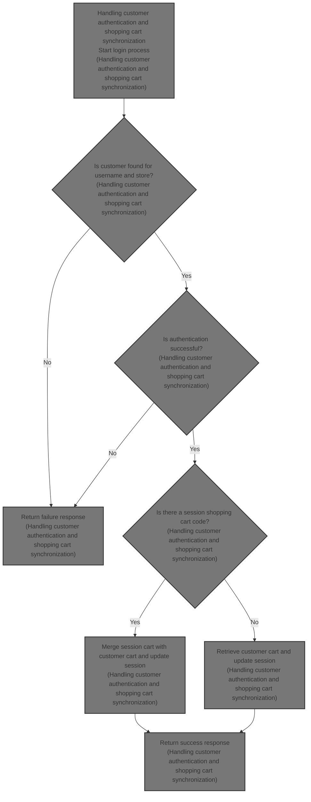

This document describes the flow of authenticating a customer using their username and password, then synchronizing their shopping cart between the session and stored data. The flow receives customer credentials and session cart information as input, and returns authentication status along with updated cart details. This ensures customers have a seamless shopping experience with their cart data preserved across sessions.



# Handling customer authentication and shopping cart synchronization

```mermaid
%%{init: {"flowchart": {"defaultRenderer": "elk"}} }%%
flowchart TD
    node1["Start login process"] --> node2{"Is customer found for username and store?"}
    click node1 openCode "shopizer/sm-shop/src/main/java/com/salesmanager/web/shop/controller/customer/CustomerLoginController.java:60:70"
    node2 -->|"No"| node3["Return failure response"]
    click node2 openCode "shopizer/sm-shop/src/main/java/com/salesmanager/web/shop/controller/customer/CustomerLoginController.java:74:78"
    node2 -->|"Yes"| node4{"Is authentication successful?"}
    click node3 openCode "shopizer/sm-shop/src/main/java/com/salesmanager/web/shop/controller/customer/CustomerLoginController.java:76:78"
    node4 -->|"No"| node3
    click node4 openCode "shopizer/sm-shop/src/main/java/com/salesmanager/web/shop/controller/customer/CustomerLoginController.java:79:81"
    node4 -->|"Yes"| node5{"Is there a session shopping cart code?"}
    click node5 openCode "shopizer/sm-shop/src/main/java/com/salesmanager/web/shop/controller/customer/CustomerLoginController.java:88:90"
    node5 -->|"Yes"| node6["Merge session cart with customer cart"]
    click node6 openCode "shopizer/sm-shop/src/main/java/com/salesmanager/web/shop/controller/customer/facade/CustomerFacadeImpl.java:173:234"
    node6 --> node7{"Is merged cart data available?"}
    click node7 openCode "shopizer/sm-shop/src/main/java/com/salesmanager/web/shop/controller/customer/CustomerLoginController.java:93:95"
    node7 -->|"Yes"| node8["Update session and response with merged cart"]
    click node8 openCode "shopizer/sm-shop/src/main/java/com/salesmanager/web/shop/controller/customer/CustomerLoginController.java:93:95"
    node7 -->|"No"| node9["Do not update cart"]
    node5 -->|"No"| node9
    node9 --> node10["Return success response"]
    click node9 openCode "shopizer/sm-shop/src/main/java/com/salesmanager/web/shop/controller/customer/CustomerLoginController.java:97:103"
    node10 -->
    click node10 openCode "shopizer/sm-shop/src/main/java/com/salesmanager/web/shop/controller/customer/CustomerLoginController.java:82:83"

classDef HeadingStyle fill:#777777,stroke:#333,stroke-width:2px;

%% Swimm:
%% %%{init: {"flowchart": {"defaultRenderer": "elk"}} }%%
%% flowchart TD
%%     node1["Start login process"] --> node2{"Is customer found for username and store?"}
%%     click node1 openCode "<SwmPath>[shopizer/…/customer/CustomerLoginController.java](shopizer/sm-shop/src/main/java/com/salesmanager/web/shop/controller/customer/CustomerLoginController.java)</SwmPath>:60:70"
%%     node2 -->|"No"| node3["Return failure response"]
%%     click node2 openCode "<SwmPath>[shopizer/…/customer/CustomerLoginController.java](shopizer/sm-shop/src/main/java/com/salesmanager/web/shop/controller/customer/CustomerLoginController.java)</SwmPath>:74:78"
%%     node2 -->|"Yes"| node4{"Is authentication successful?"}
%%     click node3 openCode "<SwmPath>[shopizer/…/customer/CustomerLoginController.java](shopizer/sm-shop/src/main/java/com/salesmanager/web/shop/controller/customer/CustomerLoginController.java)</SwmPath>:76:78"
%%     node4 -->|"No"| node3
%%     click node4 openCode "<SwmPath>[shopizer/…/customer/CustomerLoginController.java](shopizer/sm-shop/src/main/java/com/salesmanager/web/shop/controller/customer/CustomerLoginController.java)</SwmPath>:79:81"
%%     node4 -->|"Yes"| node5{"Is there a session shopping cart code?"}
%%     click node5 openCode "<SwmPath>[shopizer/…/customer/CustomerLoginController.java](shopizer/sm-shop/src/main/java/com/salesmanager/web/shop/controller/customer/CustomerLoginController.java)</SwmPath>:88:90"
%%     node5 -->|"Yes"| node6["Merge session cart with customer cart"]
%%     click node6 openCode "<SwmPath>[shopizer/…/facade/CustomerFacadeImpl.java](shopizer/sm-shop/src/main/java/com/salesmanager/web/shop/controller/customer/facade/CustomerFacadeImpl.java)</SwmPath>:173:234"
%%     node6 --> node7{"Is merged cart data available?"}
%%     click node7 openCode "<SwmPath>[shopizer/…/customer/CustomerLoginController.java](shopizer/sm-shop/src/main/java/com/salesmanager/web/shop/controller/customer/CustomerLoginController.java)</SwmPath>:93:95"
%%     node7 -->|"Yes"| node8["Update session and response with merged cart"]
%%     click node8 openCode "<SwmPath>[shopizer/…/customer/CustomerLoginController.java](shopizer/sm-shop/src/main/java/com/salesmanager/web/shop/controller/customer/CustomerLoginController.java)</SwmPath>:93:95"
%%     node7 -->|"No"| node9["Do not update cart"]
%%     node5 -->|"No"| node9
%%     node9 --> node10["Return success response"]
%%     click node9 openCode "<SwmPath>[shopizer/…/customer/CustomerLoginController.java](shopizer/sm-shop/src/main/java/com/salesmanager/web/shop/controller/customer/CustomerLoginController.java)</SwmPath>:97:103"
%%     node10 -->
%%     click node10 openCode "<SwmPath>[shopizer/…/customer/CustomerLoginController.java](shopizer/sm-shop/src/main/java/com/salesmanager/web/shop/controller/customer/CustomerLoginController.java)</SwmPath>:82:83"
%% 
%% classDef HeadingStyle fill:#777777,stroke:#333,stroke-width:2px;
```

This section handles customer authentication and synchronizes the shopping cart between the session and the customer's account to ensure a consistent shopping experience across sessions.

| Category        | Rule Name                          | Description                                                                                                                                                                          |
| --------------- | ---------------------------------- | ------------------------------------------------------------------------------------------------------------------------------------------------------------------------------------ |
| Data validation | Customer existence validation      | The system must verify that the customer exists for the given username and store before proceeding with authentication.                                                              |
| Data validation | Authentication success requirement | Authentication must succeed with the provided username and password for the customer to be logged in.                                                                                |
| Business logic  | Session cart merging               | If a session shopping cart exists, it must be merged with the customer's stored cart if the session cart is unassigned or belongs to the customer; otherwise, carts remain separate. |
| Business logic  | Cart ownership enforcement         | If the session cart belongs to another customer, the system must not merge carts and must keep them separate to maintain data security.                                              |
| Business logic  | Cart update on successful merge    | When carts are merged successfully, the session and response must be updated with the merged cart code to reflect the current shopping state.                                        |
| Business logic  | Fallback to customer cart          | If no session cart exists, the system must retrieve and use the customer's stored cart to maintain continuity.                                                                       |

<SwmSnippet path="/shopizer/sm-shop/src/main/java/com/salesmanager/web/shop/controller/customer/CustomerLoginController.java" line="60">

---

In <SwmToken path="shopizer/sm-shop/src/main/java/com/salesmanager/web/shop/controller/customer/CustomerLoginController.java" pos="60:8:8" line-data="	public @ResponseBody String logon(@ModelAttribute SecuredCustomer securedCustomer, HttpServletRequest request, HttpServletResponse response) throws Exception {">`logon`</SwmToken>, we authenticate the user and then handle shopping cart merging or retrieval by calling <SwmToken path="shopizer/sm-shop/src/main/java/com/salesmanager/web/shop/controller/customer/CustomerLoginController.java" pos="90:8:8" line-data="	            ShoppingCartData shoppingCartData= customerFacade.mergeCart( customerModel, sessionShoppingCartCode, store, language );">`mergeCart`</SwmToken> in <SwmToken path="shopizer/sm-shop/src/main/java/com/salesmanager/web/shop/controller/customer/facade/CustomerFacadeImpl.java" pos="78:4:4" line-data="public class CustomerFacadeImpl implements CustomerFacade">`CustomerFacadeImpl`</SwmToken>. This keeps the user's cart consistent across sessions, relying on store and language info already set in the request.

```java
	public @ResponseBody String logon(@ModelAttribute SecuredCustomer securedCustomer, HttpServletRequest request, HttpServletResponse response) throws Exception {
		
        AjaxResponse jsonObject=new AjaxResponse();
        

        try {

        	LOG.debug("Authenticating user " + securedCustomer.getUserName());
        	
        	//user goes to shop filter first so store and language are set
        	MerchantStore store = (MerchantStore)request.getAttribute(Constants.MERCHANT_STORE);
        	Language language = (Language)request.getAttribute("LANGUAGE");

            //check if username is from the appropriate store
            Customer customerModel = customerFacade.getCustomerByUserName(securedCustomer.getUserName(), store);
            if(customerModel==null) {
            	jsonObject.setStatus(AjaxResponse.RESPONSE_STATUS_FAIURE);
            	return jsonObject.toJSONString();
            }
            customerFacade.authenticate(customerModel, securedCustomer.getUserName(), securedCustomer.getPassword());
            //set customer in the http session
            super.setSessionAttribute(Constants.CUSTOMER, customerModel, request);
            jsonObject.setStatus(AjaxResponse.RESPONSE_STATUS_SUCCESS);


            
            
            LOG.info( "Fetching and merging Shopping Cart data" );
            final String sessionShoppingCartCode= (String)request.getSession().getAttribute( Constants.SHOPPING_CART );
            if(!StringUtils.isBlank(sessionShoppingCartCode)) {
	            ShoppingCartData shoppingCartData= customerFacade.mergeCart( customerModel, sessionShoppingCartCode, store, language );
	
	
```

---

</SwmSnippet>

<SwmSnippet path="/shopizer/sm-shop/src/main/java/com/salesmanager/web/shop/controller/customer/facade/CustomerFacadeImpl.java" line="173">

---

<SwmToken path="shopizer/sm-shop/src/main/java/com/salesmanager/web/shop/controller/customer/facade/CustomerFacadeImpl.java" pos="173:5:5" line-data="    public ShoppingCartData mergeCart( final Customer customerModel, final String sessionShoppingCartId ,final MerchantStore store,final Language language)">`mergeCart`</SwmToken> checks if the session cart belongs to the logged-in user or is unassigned, then merges or assigns carts accordingly. If the session cart belongs to someone else, it returns null to keep carts separate and secure.

```java
    public ShoppingCartData mergeCart( final Customer customerModel, final String sessionShoppingCartId ,final MerchantStore store,final Language language)
        throws Exception
    {

        LOG.debug( "Starting merge cart process" );
        if(customerModel != null){
            ShoppingCart customerCart = shoppingCartService.getByCustomer( customerModel );
            if(StringUtils.isNotBlank( sessionShoppingCartId )){
	            ShoppingCart sessionShoppingCart = shoppingCartService.getByCode( sessionShoppingCartId, store );
	            if(sessionShoppingCart != null){
	               if(customerCart == null){
	            	   if(sessionShoppingCart.getCustomerId()==null) {//saved shopping cart does not belong to a customer
		                   LOG.debug( "Not able to find any shoppingCart with current customer" );
		                   //give it to the customer
		                   sessionShoppingCart.setCustomerId( customerModel.getId() );
		                   shoppingCartService.saveOrUpdate( sessionShoppingCart );
		                   customerCart =shoppingCartService.getById( sessionShoppingCart.getId(), store );
		                   return populateShoppingCartData(customerCart,store,language);
	            	   } else {
	            		   return null;
	            	   }
	               }
	               else{
	                    if(sessionShoppingCart.getCustomerId()==null) {//saved shopping cart does not belong to a customer
	                    	//assign it to logged in user
	                    	LOG.debug( "Customer shopping cart as well session cart is available, merging carts" );
	                    	customerCart=shoppingCartService.mergeShoppingCarts( customerCart, sessionShoppingCart, store );
	                    	customerCart =shoppingCartService.getById( customerCart.getId(), store );
		                    return populateShoppingCartData(customerCart,store,language);
	                    } else {
	                    	if(sessionShoppingCart.getCustomerId().longValue()==customerModel.getId().longValue()) {
	                    		if(!customerCart.getShoppingCartCode().equals(sessionShoppingCart.getShoppingCartCode())) {
		                    		//merge carts
		                    		LOG.info( "Customer shopping cart as well session cart is available" );
		                    		customerCart=shoppingCartService.mergeShoppingCarts( customerCart, sessionShoppingCart, store );
		                    		customerCart =shoppingCartService.getById( customerCart.getId(), store );
		    	                    return populateShoppingCartData(customerCart,store,language);
	                    		} else {
	                    			return populateShoppingCartData(sessionShoppingCart,store,language);
	                    		}
	                    	} else {
	                    		//the saved cart belongs to another user
	                    		return null;
	                    	}
	                    }
	            	    
	                    
	              }
	            }
            }
            else{
                 if(customerCart !=null){
                     return populateShoppingCartData(customerCart,store,language);
                 }
                 return null;

            }
        }
        LOG.info( "Seems some issue with system, unable to find any customer after successful authentication" );
        return null;

    }
```

---

</SwmSnippet>

<SwmSnippet path="/shopizer/sm-shop/src/main/java/com/salesmanager/web/shop/controller/customer/CustomerLoginController.java" line="93">

---

Back in <SwmToken path="shopizer/sm-shop/src/main/java/com/salesmanager/web/shop/controller/customer/CustomerLoginController.java" pos="60:8:8" line-data="	public @ResponseBody String logon(@ModelAttribute SecuredCustomer securedCustomer, HttpServletRequest request, HttpServletResponse response) throws Exception {">`logon`</SwmToken>, after calling <SwmToken path="shopizer/sm-shop/src/main/java/com/salesmanager/web/shop/controller/customer/CustomerLoginController.java" pos="90:8:8" line-data="	            ShoppingCartData shoppingCartData= customerFacade.mergeCart( customerModel, sessionShoppingCartCode, store, language );">`mergeCart`</SwmToken>, we check if the returned shopping cart data is not null. If it isn't, we update the JSON response and session attributes with the cart code. If the session cart code was blank, we fetch the customer's cart directly and update the response and session accordingly. This finalizes the cart synchronization step after login.

```java
	            if(shoppingCartData !=null){
	                jsonObject.addEntry(Constants.SHOPPING_CART, shoppingCartData.getCode());
	                request.getSession().setAttribute(Constants.SHOPPING_CART, shoppingCartData.getCode());
	            }
            } else {

	            ShoppingCart cartModel = shoppingCartService.getByCustomer(customerModel);
	            if(cartModel!=null) {
	                jsonObject.addEntry( Constants.SHOPPING_CART, cartModel.getShoppingCartCode());
	                request.getSession().setAttribute(Constants.SHOPPING_CART, cartModel.getShoppingCartCode());
	            }
            
            }

            
            
            
            
        } catch (AuthenticationException ex) {
        	jsonObject.setStatus(AjaxResponse.RESPONSE_STATUS_FAIURE);
        } catch(Exception e) {
        	jsonObject.setStatus(AjaxResponse.RESPONSE_STATUS_FAIURE);
        }
		
        
        return jsonObject.toJSONString();
		
		
	}
```

---

</SwmSnippet>

&nbsp;

*This is an auto-generated document by Swimm 🌊 and has not yet been verified by a human*

<SwmMeta version="3.0.0" repo-id="Z2l0aHViJTNBJTNBU2hvcGl6ZXIlM0ElM0F1bWFsaW5nYXN3YW1p" repo-name="Shopizer"><sup>Powered by [Swimm](https://app.swimm.io/)</sup></SwmMeta>
