This document describes how customers log in and how their shopping cart is managed during the login process. When a customer submits their credentials and store information, the system verifies and authenticates them. If successful, the customer is set in the session and the system ensures their shopping cart is correctly assigned or merged, keeping the cart contents accurate for the logged-in user. The flow receives a login request and returns a response indicating success or failure, along with the updated cart state.

# Managing Customer Login and Cart State

```mermaid
%%{init: {"flowchart": {"defaultRenderer": "elk"}} }%%
flowchart TD
  node1["Customer attempts to log in (with username, store)"] --> node2{"Is username valid for store?"}
  click node1 openCode "shopizer/sm-shop/src/main/java/com/salesmanager/web/shop/controller/customer/CustomerLoginController.java:60:121"
  node2 -->|"No"| node3["Return failure response"]
  click node2 openCode "shopizer/sm-shop/src/main/java/com/salesmanager/web/shop/controller/customer/CustomerLoginController.java:74:78"
  node2 -->|"Yes"| node4{"Is authentication successful?"}
  click node3 openCode "shopizer/sm-shop/src/main/java/com/salesmanager/web/shop/controller/customer/CustomerLoginController.java:76:77"
  node4 -->|"No"| node3
  click node4 openCode "shopizer/sm-shop/src/main/java/com/salesmanager/web/shop/controller/customer/CustomerLoginController.java:79:82"
  node4 -->|"Yes"| node5["Set customer in session"]
  click node5 openCode "shopizer/sm-shop/src/main/java/com/salesmanager/web/shop/controller/customer/CustomerLoginController.java:81:82"
  node5 --> node6{"Does session have a shopping cart code?"}
  click node6 openCode "shopizer/sm-shop/src/main/java/com/salesmanager/web/shop/controller/customer/CustomerLoginController.java:88:89"
  node6 -->|"Yes"| node7{"Merged cart exists?"}
  node6 -->|"No"| node9{"Customer cart exists?"}
  click node7 openCode "shopizer/sm-shop/src/main/java/com/salesmanager/web/shop/controller/customer/CustomerLoginController.java:90:96"
  node7 -->|"Yes"| node8["Set merged cart in session (cart code)"]
  node7 -->|"No"| node9
  click node8 openCode "shopizer/sm-shop/src/main/java/com/salesmanager/web/shop/controller/customer/CustomerLoginController.java:94:95"
  node9 -->|"Yes"| node10["Set customer cart in session (cart code)"]
  node9 -->|"No"| node11["No cart set"]
  click node10 openCode "shopizer/sm-shop/src/main/java/com/salesmanager/web/shop/controller/customer/CustomerLoginController.java:101:102"
  click node11 openCode "shopizer/sm-shop/src/main/java/com/salesmanager/web/shop/controller/customer/CustomerLoginController.java:97:105"
  node8 --> node12["Return success response"]
  node10 --> node12
  node11 --> node12
  node12["Return success response"]
  click node12 openCode "shopizer/sm-shop/src/main/java/com/salesmanager/web/shop/controller/customer/CustomerLoginController.java:118:119"

classDef HeadingStyle fill:#777777,stroke:#333,stroke-width:2px;

%% Swimm:
%% %%{init: {"flowchart": {"defaultRenderer": "elk"}} }%%
%% flowchart TD
%%   node1["Customer attempts to log in (with username, store)"] --> node2{"Is username valid for store?"}
%%   click node1 openCode "<SwmPath>[shopizer/…/customer/CustomerLoginController.java](shopizer/sm-shop/src/main/java/com/salesmanager/web/shop/controller/customer/CustomerLoginController.java)</SwmPath>:60:121"
%%   node2 -->|"No"| node3["Return failure response"]
%%   click node2 openCode "<SwmPath>[shopizer/…/customer/CustomerLoginController.java](shopizer/sm-shop/src/main/java/com/salesmanager/web/shop/controller/customer/CustomerLoginController.java)</SwmPath>:74:78"
%%   node2 -->|"Yes"| node4{"Is authentication successful?"}
%%   click node3 openCode "<SwmPath>[shopizer/…/customer/CustomerLoginController.java](shopizer/sm-shop/src/main/java/com/salesmanager/web/shop/controller/customer/CustomerLoginController.java)</SwmPath>:76:77"
%%   node4 -->|"No"| node3
%%   click node4 openCode "<SwmPath>[shopizer/…/customer/CustomerLoginController.java](shopizer/sm-shop/src/main/java/com/salesmanager/web/shop/controller/customer/CustomerLoginController.java)</SwmPath>:79:82"
%%   node4 -->|"Yes"| node5["Set customer in session"]
%%   click node5 openCode "<SwmPath>[shopizer/…/customer/CustomerLoginController.java](shopizer/sm-shop/src/main/java/com/salesmanager/web/shop/controller/customer/CustomerLoginController.java)</SwmPath>:81:82"
%%   node5 --> node6{"Does session have a shopping cart code?"}
%%   click node6 openCode "<SwmPath>[shopizer/…/customer/CustomerLoginController.java](shopizer/sm-shop/src/main/java/com/salesmanager/web/shop/controller/customer/CustomerLoginController.java)</SwmPath>:88:89"
%%   node6 -->|"Yes"| node7{"Merged cart exists?"}
%%   node6 -->|"No"| node9{"Customer cart exists?"}
%%   click node7 openCode "<SwmPath>[shopizer/…/customer/CustomerLoginController.java](shopizer/sm-shop/src/main/java/com/salesmanager/web/shop/controller/customer/CustomerLoginController.java)</SwmPath>:90:96"
%%   node7 -->|"Yes"| node8["Set merged cart in session (cart code)"]
%%   node7 -->|"No"| node9
%%   click node8 openCode "<SwmPath>[shopizer/…/customer/CustomerLoginController.java](shopizer/sm-shop/src/main/java/com/salesmanager/web/shop/controller/customer/CustomerLoginController.java)</SwmPath>:94:95"
%%   node9 -->|"Yes"| node10["Set customer cart in session (cart code)"]
%%   node9 -->|"No"| node11["No cart set"]
%%   click node10 openCode "<SwmPath>[shopizer/…/customer/CustomerLoginController.java](shopizer/sm-shop/src/main/java/com/salesmanager/web/shop/controller/customer/CustomerLoginController.java)</SwmPath>:101:102"
%%   click node11 openCode "<SwmPath>[shopizer/…/customer/CustomerLoginController.java](shopizer/sm-shop/src/main/java/com/salesmanager/web/shop/controller/customer/CustomerLoginController.java)</SwmPath>:97:105"
%%   node8 --> node12["Return success response"]
%%   node10 --> node12
%%   node11 --> node12
%%   node12["Return success response"]
%%   click node12 openCode "<SwmPath>[shopizer/…/customer/CustomerLoginController.java](shopizer/sm-shop/src/main/java/com/salesmanager/web/shop/controller/customer/CustomerLoginController.java)</SwmPath>:118:119"
%% 
%% classDef HeadingStyle fill:#777777,stroke:#333,stroke-width:2px;
```



<SwmSnippet path="/shopizer/sm-shop/src/main/java/com/salesmanager/web/shop/controller/customer/CustomerLoginController.java" line="60">

---

In `CustomerLoginController.logon`, we start by authenticating the user and setting up the session with the right customer object. Right after, we check if there's a shopping cart code in the session. If there is, we need to call `CustomerFacadeImpl.mergeCart` to handle merging the session cart with the user's cart, or assign the cart if it's unclaimed. This step is needed to make sure the cart contents are correct for the logged-in user, and that nothing gets lost or mixed up between sessions. The function also expects store and language attributes to be set in the request, which are used for cart and customer operations.

```java
	public @ResponseBody String logon(@ModelAttribute SecuredCustomer securedCustomer, HttpServletRequest request, HttpServletResponse response) throws Exception {
		
        AjaxResponse jsonObject=new AjaxResponse();
        

        try {

        	LOG.debug("Authenticating user " + securedCustomer.getUserName());
        	
        	//user goes to shop filter first so store and language are set
        	MerchantStore store = (MerchantStore)request.getAttribute(Constants.MERCHANT_STORE);
        	Language language = (Language)request.getAttribute("LANGUAGE");

            //check if username is from the appropriate store
            Customer customerModel = customerFacade.getCustomerByUserName(securedCustomer.getUserName(), store);
            if(customerModel==null) {
            	jsonObject.setStatus(AjaxResponse.RESPONSE_STATUS_FAIURE);
            	return jsonObject.toJSONString();
            }
            customerFacade.authenticate(customerModel, securedCustomer.getUserName(), securedCustomer.getPassword());
            //set customer in the http session
            super.setSessionAttribute(Constants.CUSTOMER, customerModel, request);
            jsonObject.setStatus(AjaxResponse.RESPONSE_STATUS_SUCCESS);


            
            
            LOG.info( "Fetching and merging Shopping Cart data" );
            final String sessionShoppingCartCode= (String)request.getSession().getAttribute( Constants.SHOPPING_CART );
            if(!StringUtils.isBlank(sessionShoppingCartCode)) {
	            ShoppingCartData shoppingCartData= customerFacade.mergeCart( customerModel, sessionShoppingCartCode, store, language );
	
	
```

---

</SwmSnippet>

<SwmSnippet path="/shopizer/sm-shop/src/main/java/com/salesmanager/web/shop/controller/customer/facade/CustomerFacadeImpl.java" line="173">

---

<SwmToken path="shopizer/sm-shop/src/main/java/com/salesmanager/web/shop/controller/customer/facade/CustomerFacadeImpl.java" pos="173:5:5" line-data="    public ShoppingCartData mergeCart( final Customer customerModel, final String sessionShoppingCartId ,final MerchantStore store,final Language language)">`mergeCart`</SwmToken> figures out if the session cart should be assigned, merged, or ignored based on ownership, making sure the logged-in user gets the right cart data.

```java
    public ShoppingCartData mergeCart( final Customer customerModel, final String sessionShoppingCartId ,final MerchantStore store,final Language language)
        throws Exception
    {

        LOG.debug( "Starting merge cart process" );
        if(customerModel != null){
            ShoppingCart customerCart = shoppingCartService.getByCustomer( customerModel );
            if(StringUtils.isNotBlank( sessionShoppingCartId )){
	            ShoppingCart sessionShoppingCart = shoppingCartService.getByCode( sessionShoppingCartId, store );
	            if(sessionShoppingCart != null){
	               if(customerCart == null){
	            	   if(sessionShoppingCart.getCustomerId()==null) {//saved shopping cart does not belong to a customer
		                   LOG.debug( "Not able to find any shoppingCart with current customer" );
		                   //give it to the customer
		                   sessionShoppingCart.setCustomerId( customerModel.getId() );
		                   shoppingCartService.saveOrUpdate( sessionShoppingCart );
		                   customerCart =shoppingCartService.getById( sessionShoppingCart.getId(), store );
		                   return populateShoppingCartData(customerCart,store,language);
	            	   } else {
	            		   return null;
	            	   }
	               }
	               else{
	                    if(sessionShoppingCart.getCustomerId()==null) {//saved shopping cart does not belong to a customer
	                    	//assign it to logged in user
	                    	LOG.debug( "Customer shopping cart as well session cart is available, merging carts" );
	                    	customerCart=shoppingCartService.mergeShoppingCarts( customerCart, sessionShoppingCart, store );
	                    	customerCart =shoppingCartService.getById( customerCart.getId(), store );
		                    return populateShoppingCartData(customerCart,store,language);
	                    } else {
	                    	if(sessionShoppingCart.getCustomerId().longValue()==customerModel.getId().longValue()) {
	                    		if(!customerCart.getShoppingCartCode().equals(sessionShoppingCart.getShoppingCartCode())) {
		                    		//merge carts
		                    		LOG.info( "Customer shopping cart as well session cart is available" );
		                    		customerCart=shoppingCartService.mergeShoppingCarts( customerCart, sessionShoppingCart, store );
		                    		customerCart =shoppingCartService.getById( customerCart.getId(), store );
		    	                    return populateShoppingCartData(customerCart,store,language);
	                    		} else {
	                    			return populateShoppingCartData(sessionShoppingCart,store,language);
	                    		}
	                    	} else {
	                    		//the saved cart belongs to another user
	                    		return null;
	                    	}
	                    }
	            	    
	                    
	              }
	            }
            }
            else{
                 if(customerCart !=null){
                     return populateShoppingCartData(customerCart,store,language);
                 }
                 return null;

            }
        }
        LOG.info( "Seems some issue with system, unable to find any customer after successful authentication" );
        return null;

    }
```

---

</SwmSnippet>

<SwmSnippet path="/shopizer/sm-shop/src/main/java/com/salesmanager/web/shop/controller/customer/CustomerLoginController.java" line="93">

---

Back in `CustomerLoginController.logon`, after returning from <SwmToken path="shopizer/sm-shop/src/main/java/com/salesmanager/web/shop/controller/customer/CustomerLoginController.java" pos="90:8:8" line-data="	            ShoppingCartData shoppingCartData= customerFacade.mergeCart( customerModel, sessionShoppingCartCode, store, language );">`mergeCart`</SwmToken>, we update the session and response with the new cart code if merging was successful. If there was no session cart, we just fetch the customer's cart and set it. This keeps the user's cart state in sync after login.

```java
	            if(shoppingCartData !=null){
	                jsonObject.addEntry(Constants.SHOPPING_CART, shoppingCartData.getCode());
	                request.getSession().setAttribute(Constants.SHOPPING_CART, shoppingCartData.getCode());
	            }
            } else {

	            ShoppingCart cartModel = shoppingCartService.getByCustomer(customerModel);
	            if(cartModel!=null) {
	                jsonObject.addEntry( Constants.SHOPPING_CART, cartModel.getShoppingCartCode());
	                request.getSession().setAttribute(Constants.SHOPPING_CART, cartModel.getShoppingCartCode());
	            }
            
            }

            
            
            
            
        } catch (AuthenticationException ex) {
        	jsonObject.setStatus(AjaxResponse.RESPONSE_STATUS_FAIURE);
        } catch(Exception e) {
        	jsonObject.setStatus(AjaxResponse.RESPONSE_STATUS_FAIURE);
        }
		
        
        return jsonObject.toJSONString();
		
		
	}
```

---

</SwmSnippet>

&nbsp;

*This is an auto-generated document by Swimm 🌊 and has not yet been verified by a human*

<SwmMeta version="3.0.0" repo-id="Z2l0aHViJTNBJTNBU2hvcGl6ZXIlM0ElM0F1bWFsaW5nYXN3YW1p" repo-name="Shopizer"><sup>Powered by [Swimm](https://app.swimm.io/)</sup></SwmMeta>
