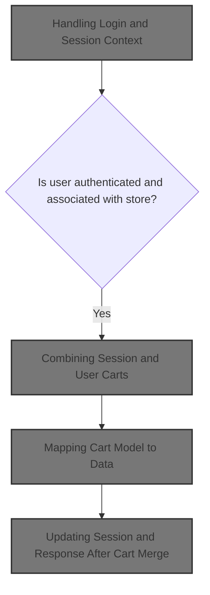
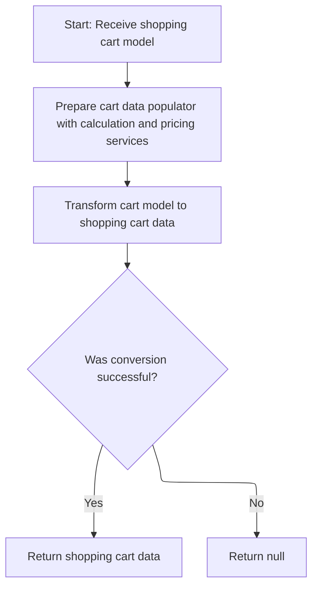
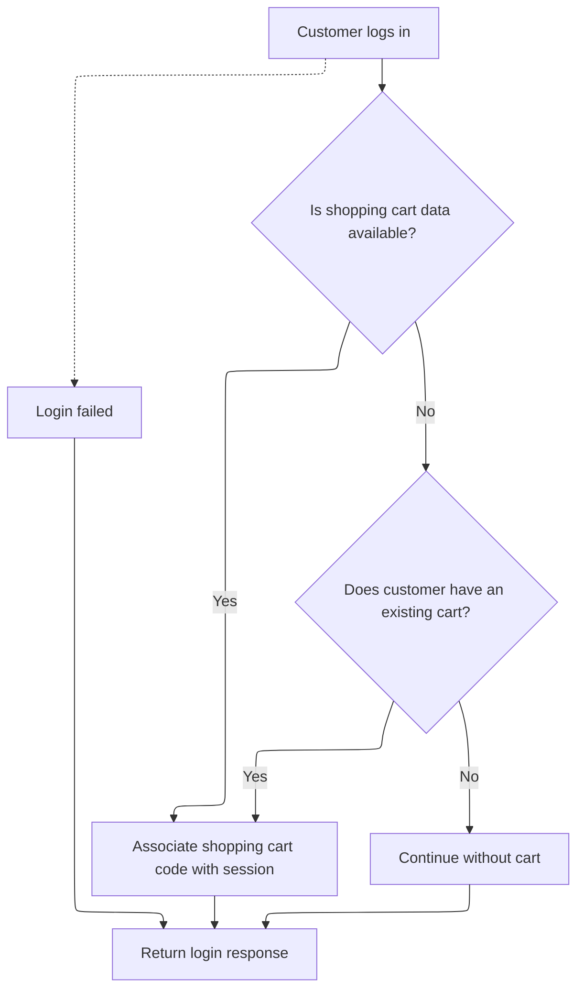

This document describes the customer login flow, which authenticates users and ensures their shopping cart is preserved and merged for a seamless shopping experience. The flow receives login credentials and any existing session cart, validates the user for the current store, merges carts if needed, and updates the session and response with the correct cart data.



# Handling Login and Session Context

This section governs how user authentication and session context are handled during login, ensuring that store and language context are respected and that the user's shopping cart is correctly merged for a seamless shopping experience.

| Category        | Rule Name                          | Description                                                                                                                                                                |
| --------------- | ---------------------------------- | -------------------------------------------------------------------------------------------------------------------------------------------------------------------------- |
| Data validation | Store-specific user authentication | User authentication must be performed using the username and password provided during login. Only users associated with the current merchant store are eligible to log in. |
| Business logic  | Session cart merge on login        | If a shopping cart exists in the user's session at login, the cart must be merged with the user's database cart to maintain cart consistency.                              |
| Business logic  | Session customer context           | Upon successful authentication, the user's customer information must be stored in the session for subsequent requests.                                                     |

<SwmSnippet path="/shopizer/sm-shop/src/main/java/com/salesmanager/web/shop/controller/customer/CustomerLoginController.java" line="60">

---

In <SwmToken path="shopizer/sm-shop/src/main/java/com/salesmanager/web/shop/controller/customer/CustomerLoginController.java" pos="60:8:8" line-data="	public @ResponseBody String logon(@ModelAttribute SecuredCustomer securedCustomer, HttpServletRequest request, HttpServletResponse response) throws Exception {">`logon`</SwmToken>, we kick off by grabbing the merchant store and language from the request attributes—these are set earlier in the flow, not passed in directly. After authenticating the user, we check if there's a shopping cart code in the session. If there is, we call <SwmToken path="shopizer/sm-shop/src/main/java/com/salesmanager/web/shop/controller/customer/CustomerLoginController.java" pos="90:6:8" line-data="	            ShoppingCartData shoppingCartData= customerFacade.mergeCart( customerModel, sessionShoppingCartCode, store, language );">`customerFacade.mergeCart`</SwmToken> to combine the session cart with the user's cart in the database, keeping the cart state consistent for the user post-login. This sets us up for the next step, which is the actual cart merge logic.

```java
	public @ResponseBody String logon(@ModelAttribute SecuredCustomer securedCustomer, HttpServletRequest request, HttpServletResponse response) throws Exception {
		
        AjaxResponse jsonObject=new AjaxResponse();
        

        try {

        	LOG.debug("Authenticating user " + securedCustomer.getUserName());
        	
        	//user goes to shop filter first so store and language are set
        	MerchantStore store = (MerchantStore)request.getAttribute(Constants.MERCHANT_STORE);
        	Language language = (Language)request.getAttribute("LANGUAGE");

            //check if username is from the appropriate store
            Customer customerModel = customerFacade.getCustomerByUserName(securedCustomer.getUserName(), store);
            if(customerModel==null) {
            	jsonObject.setStatus(AjaxResponse.RESPONSE_STATUS_FAIURE);
            	return jsonObject.toJSONString();
            }
            customerFacade.authenticate(customerModel, securedCustomer.getUserName(), securedCustomer.getPassword());
            //set customer in the http session
            super.setSessionAttribute(Constants.CUSTOMER, customerModel, request);
            jsonObject.setStatus(AjaxResponse.RESPONSE_STATUS_SUCCESS);


            
            
            LOG.info( "Fetching and merging Shopping Cart data" );
            final String sessionShoppingCartCode= (String)request.getSession().getAttribute( Constants.SHOPPING_CART );
            if(!StringUtils.isBlank(sessionShoppingCartCode)) {
	            ShoppingCartData shoppingCartData= customerFacade.mergeCart( customerModel, sessionShoppingCartCode, store, language );
	
	
```

---

</SwmSnippet>

## Combining Session and User Carts

This section ensures that when a customer logs in or interacts with their cart, any items they have added during their session are properly merged with their existing user cart, or assigned to them if they do not have a cart yet. This prevents loss of cart data and ensures a seamless shopping experience.

| Category        | Rule Name                              | Description                                                                                                                                                                                                    |
| --------------- | -------------------------------------- | -------------------------------------------------------------------------------------------------------------------------------------------------------------------------------------------------------------- |
| Data validation | Prevent cross-customer cart assignment | If the session cart is assigned to a different customer than the one currently logged in, no cart is merged or assigned, and the result is null.                                                               |
| Business logic  | Assign session cart to customer        | If a logged-in customer does not have an existing cart and there is a session cart that is not assigned to any customer, the session cart is assigned to the logged-in customer and becomes their active cart. |
| Business logic  | Merge session cart with customer cart  | If both a customer cart and a session cart exist, and the session cart is not assigned to any customer, the session cart is merged into the customer's cart, combining all items.                              |
| Business logic  | Merge duplicate customer carts         | If both carts exist and the session cart is already assigned to the logged-in customer, but the cart codes are different, the carts are merged to avoid duplicate carts for the same user.                     |
| Business logic  | Use existing customer cart             | If both carts exist and the session cart is already assigned to the logged-in customer, and the cart codes are the same, the session cart is used as the active cart without merging.                          |
| Business logic  | Use customer cart when no session cart | If no session cart exists but the customer has a cart, the customer's cart is used as the active cart.                                                                                                         |

<SwmSnippet path="/shopizer/sm-shop/src/main/java/com/salesmanager/web/shop/controller/customer/facade/CustomerFacadeImpl.java" line="173">

---

In <SwmToken path="shopizer/sm-shop/src/main/java/com/salesmanager/web/shop/controller/customer/facade/CustomerFacadeImpl.java" pos="173:5:5" line-data="    public ShoppingCartData mergeCart( final Customer customerModel, final String sessionShoppingCartId ,final MerchantStore store,final Language language)">`mergeCart`</SwmToken>, we check if the customer has a cart and if there's a session cart. Depending on ownership and existence, we either assign, merge, or ignore the session cart. After updating the cart, we call <SwmToken path="shopizer/sm-shop/src/main/java/com/salesmanager/web/shop/controller/customer/facade/CustomerFacadeImpl.java" pos="190:3:3" line-data="		                   return populateShoppingCartData(customerCart,store,language);">`populateShoppingCartData`</SwmToken> to map the merged cart to a data object for the next step.

```java
    public ShoppingCartData mergeCart( final Customer customerModel, final String sessionShoppingCartId ,final MerchantStore store,final Language language)
        throws Exception
    {

        LOG.debug( "Starting merge cart process" );
        if(customerModel != null){
            ShoppingCart customerCart = shoppingCartService.getByCustomer( customerModel );
            if(StringUtils.isNotBlank( sessionShoppingCartId )){
	            ShoppingCart sessionShoppingCart = shoppingCartService.getByCode( sessionShoppingCartId, store );
	            if(sessionShoppingCart != null){
	               if(customerCart == null){
	            	   if(sessionShoppingCart.getCustomerId()==null) {//saved shopping cart does not belong to a customer
		                   LOG.debug( "Not able to find any shoppingCart with current customer" );
		                   //give it to the customer
		                   sessionShoppingCart.setCustomerId( customerModel.getId() );
		                   shoppingCartService.saveOrUpdate( sessionShoppingCart );
		                   customerCart =shoppingCartService.getById( sessionShoppingCart.getId(), store );
		                   return populateShoppingCartData(customerCart,store,language);
	            	   } else {
	            		   return null;
	            	   }
	               }
	               else{
	                    if(sessionShoppingCart.getCustomerId()==null) {//saved shopping cart does not belong to a customer
	                    	//assign it to logged in user
	                    	LOG.debug( "Customer shopping cart as well session cart is available, merging carts" );
	                    	customerCart=shoppingCartService.mergeShoppingCarts( customerCart, sessionShoppingCart, store );
	                    	customerCart =shoppingCartService.getById( customerCart.getId(), store );
		                    return populateShoppingCartData(customerCart,store,language);
	                    } else {
	                    	if(sessionShoppingCart.getCustomerId().longValue()==customerModel.getId().longValue()) {
	                    		if(!customerCart.getShoppingCartCode().equals(sessionShoppingCart.getShoppingCartCode())) {
		                    		//merge carts
		                    		LOG.info( "Customer shopping cart as well session cart is available" );
		                    		customerCart=shoppingCartService.mergeShoppingCarts( customerCart, sessionShoppingCart, store );
		                    		customerCart =shoppingCartService.getById( customerCart.getId(), store );
		    	                    return populateShoppingCartData(customerCart,store,language);
	                    		} else {
	                    			return populateShoppingCartData(sessionShoppingCart,store,language);
	                    		}
	                    	} else {
	                    		//the saved cart belongs to another user
	                    		return null;
	                    	}
	                    }
	            	    
	                    
	              }
	            }
            }
            else{
                 if(customerCart !=null){
                     return populateShoppingCartData(customerCart,store,language);
                 }
                 return null;

            }
        }
```

---

</SwmSnippet>

### Mapping Cart Model to Data



This section governs the mapping of a shopping cart model to a data object suitable for presentation or further processing. It ensures that all necessary services are set up before conversion and handles conversion failures gracefully.

| Category       | Rule Name                               | Description                                                                                                                                                                                          |
| -------------- | --------------------------------------- | ---------------------------------------------------------------------------------------------------------------------------------------------------------------------------------------------------- |
| Business logic | Cart Model Conversion                   | If the shopping cart model is valid and all required services are available, the cart model must be converted into a shopping cart data object containing calculated totals and pricing information. |
| Business logic | Include Pricing and Calculation Details | The shopping cart data object must include all relevant pricing and calculation details as determined by the calculation and pricing services.                                                       |

<SwmSnippet path="/shopizer/sm-shop/src/main/java/com/salesmanager/web/shop/controller/customer/facade/CustomerFacadeImpl.java" line="237">

---

<SwmToken path="shopizer/sm-shop/src/main/java/com/salesmanager/web/shop/controller/customer/facade/CustomerFacadeImpl.java" pos="237:5:5" line-data="    private ShoppingCartData populateShoppingCartData(final ShoppingCart cartModel , final MerchantStore store, final Language language){">`populateShoppingCartData`</SwmToken> sets up the populator with calculation and pricing services, then delegates to `ShoppingCartDataPopulator.populate` to convert the cart model into a data object. This keeps the mapping logic out of the facade and lets us reuse the populator elsewhere.

```java
    private ShoppingCartData populateShoppingCartData(final ShoppingCart cartModel , final MerchantStore store, final Language language){

        ShoppingCartDataPopulator shoppingCartDataPopulator = new ShoppingCartDataPopulator();
        shoppingCartDataPopulator.setShoppingCartCalculationService( shoppingCartCalculationService );
        shoppingCartDataPopulator.setPricingService( pricingService );
        try
        {
            return shoppingCartDataPopulator.populate(  cartModel ,  store,  language);
        }
        catch ( ConversionException ce )
        {
           LOG.error( "Error in converting shopping cart to shopping cart data", ce );

        }
        return null;
    }
```

---

</SwmSnippet>

### Building Cart Item Data

```mermaid
%%{init: {"flowchart": {"defaultRenderer": "elk"}} }%%
flowchart TD
    node1["Start cart data population"]
    click node1 openCode "shopizer/sm-shop/src/main/java/com/salesmanager/web/populator/shoppingCart/ShoppingCartDataPopulator.java:73:76"
    node1 --> node2{"Are there items in the cart?"}
    click node2 openCode "shopizer/sm-shop/src/main/java/com/salesmanager/web/populator/shoppingCart/ShoppingCartDataPopulator.java:81:82"
    subgraph loop1["For each item in cart"]
        node2 -->|"Yes"| node3["Enrich item with product info, image, price, quantity"]
        click node3 openCode "shopizer/sm-shop/src/main/java/com/salesmanager/web/populator/shoppingCart/ShoppingCartDataPopulator.java:83:106"
        node3 --> node4{"Does item have attributes?"}
        click node4 openCode "shopizer/sm-shop/src/main/java/com/salesmanager/web/populator/shoppingCart/ShoppingCartDataPopulator.java:107:108"
        subgraph loop2["For each attribute in item"]
            node4 -->|"Yes"| node5["Enrich item with attribute name and value"]
            click node5 openCode "shopizer/sm-shop/src/main/java/com/salesmanager/web/populator/shoppingCart/ShoppingCartDataPopulator.java:110:122"
            node5 --> node6["Add attribute to item"]
            click node6 openCode "shopizer/sm-shop/src/main/java/com/salesmanager/web/populator/shoppingCart/ShoppingCartDataPopulator.java:121:124"
            node6 --> node4
        end
        node4 -->|"No"| node7["Add item to cart data"]
        click node7 openCode "shopizer/sm-shop/src/main/java/com/salesmanager/web/populator/shoppingCart/ShoppingCartDataPopulator.java:126:127"
        node6 --> node7
        node7 --> node2
    end
    node2 -->|"No"| node8["Proceed to totals"]
    click node8 openCode "shopizer/sm-shop/src/main/java/com/salesmanager/web/populator/shoppingCart/ShoppingCartDataPopulator.java:129:131"
    node7 --> node9["Calculate order summary and totals"]
    click node9 openCode "shopizer/sm-shop/src/main/java/com/salesmanager/web/populator/shoppingCart/ShoppingCartDataPopulator.java:133:137"
    subgraph loop3["For each order total"]
        node9 --> node10["Enrich cart with order total"]
        click node10 openCode "shopizer/sm-shop/src/main/java/com/salesmanager/web/populator/shoppingCart/ShoppingCartDataPopulator.java:141:146"
        node10 --> node9
    end
    node9 --> node11["Set cart summary: quantity, subtotal, total"]
    click node11 openCode "shopizer/sm-shop/src/main/java/com/salesmanager/web/populator/shoppingCart/ShoppingCartDataPopulator.java:150:153"
    node11 --> node12["Return enriched cart data"]
    click node12 openCode "shopizer/sm-shop/src/main/java/com/salesmanager/web/populator/shoppingCart/ShoppingCartDataPopulator.java:159:162"

classDef HeadingStyle fill:#777777,stroke:#333,stroke-width:2px;

%% Swimm:
%% %%{init: {"flowchart": {"defaultRenderer": "elk"}} }%%
%% flowchart TD
%%     node1["Start cart data population"]
%%     click node1 openCode "<SwmPath>[shopizer/…/shoppingCart/ShoppingCartDataPopulator.java](shopizer/sm-shop/src/main/java/com/salesmanager/web/populator/shoppingCart/ShoppingCartDataPopulator.java)</SwmPath>:73:76"
%%     node1 --> node2{"Are there items in the cart?"}
%%     click node2 openCode "<SwmPath>[shopizer/…/shoppingCart/ShoppingCartDataPopulator.java](shopizer/sm-shop/src/main/java/com/salesmanager/web/populator/shoppingCart/ShoppingCartDataPopulator.java)</SwmPath>:81:82"
%%     subgraph loop1["For each item in cart"]
%%         node2 -->|"Yes"| node3["Enrich item with product info, image, price, quantity"]
%%         click node3 openCode "<SwmPath>[shopizer/…/shoppingCart/ShoppingCartDataPopulator.java](shopizer/sm-shop/src/main/java/com/salesmanager/web/populator/shoppingCart/ShoppingCartDataPopulator.java)</SwmPath>:83:106"
%%         node3 --> node4{"Does item have attributes?"}
%%         click node4 openCode "<SwmPath>[shopizer/…/shoppingCart/ShoppingCartDataPopulator.java](shopizer/sm-shop/src/main/java/com/salesmanager/web/populator/shoppingCart/ShoppingCartDataPopulator.java)</SwmPath>:107:108"
%%         subgraph loop2["For each attribute in item"]
%%             node4 -->|"Yes"| node5["Enrich item with attribute name and value"]
%%             click node5 openCode "<SwmPath>[shopizer/…/shoppingCart/ShoppingCartDataPopulator.java](shopizer/sm-shop/src/main/java/com/salesmanager/web/populator/shoppingCart/ShoppingCartDataPopulator.java)</SwmPath>:110:122"
%%             node5 --> node6["Add attribute to item"]
%%             click node6 openCode "<SwmPath>[shopizer/…/shoppingCart/ShoppingCartDataPopulator.java](shopizer/sm-shop/src/main/java/com/salesmanager/web/populator/shoppingCart/ShoppingCartDataPopulator.java)</SwmPath>:121:124"
%%             node6 --> node4
%%         end
%%         node4 -->|"No"| node7["Add item to cart data"]
%%         click node7 openCode "<SwmPath>[shopizer/…/shoppingCart/ShoppingCartDataPopulator.java](shopizer/sm-shop/src/main/java/com/salesmanager/web/populator/shoppingCart/ShoppingCartDataPopulator.java)</SwmPath>:126:127"
%%         node6 --> node7
%%         node7 --> node2
%%     end
%%     node2 -->|"No"| node8["Proceed to totals"]
%%     click node8 openCode "<SwmPath>[shopizer/…/shoppingCart/ShoppingCartDataPopulator.java](shopizer/sm-shop/src/main/java/com/salesmanager/web/populator/shoppingCart/ShoppingCartDataPopulator.java)</SwmPath>:129:131"
%%     node7 --> node9["Calculate order summary and totals"]
%%     click node9 openCode "<SwmPath>[shopizer/…/shoppingCart/ShoppingCartDataPopulator.java](shopizer/sm-shop/src/main/java/com/salesmanager/web/populator/shoppingCart/ShoppingCartDataPopulator.java)</SwmPath>:133:137"
%%     subgraph loop3["For each order total"]
%%         node9 --> node10["Enrich cart with order total"]
%%         click node10 openCode "<SwmPath>[shopizer/…/shoppingCart/ShoppingCartDataPopulator.java](shopizer/sm-shop/src/main/java/com/salesmanager/web/populator/shoppingCart/ShoppingCartDataPopulator.java)</SwmPath>:141:146"
%%         node10 --> node9
%%     end
%%     node9 --> node11["Set cart summary: quantity, subtotal, total"]
%%     click node11 openCode "<SwmPath>[shopizer/…/shoppingCart/ShoppingCartDataPopulator.java](shopizer/sm-shop/src/main/java/com/salesmanager/web/populator/shoppingCart/ShoppingCartDataPopulator.java)</SwmPath>:150:153"
%%     node11 --> node12["Return enriched cart data"]
%%     click node12 openCode "<SwmPath>[shopizer/…/shoppingCart/ShoppingCartDataPopulator.java](shopizer/sm-shop/src/main/java/com/salesmanager/web/populator/shoppingCart/ShoppingCartDataPopulator.java)</SwmPath>:159:162"
%% 
%% classDef HeadingStyle fill:#777777,stroke:#333,stroke-width:2px;
```



This section is responsible for building the detailed data representation of the shopping cart, including all items, their attributes, images, pricing, and the overall cart summary, so that the client can display a complete and accurate cart to the user.

| Category       | Rule Name                | Description                                                                                                                                        |
| -------------- | ------------------------ | -------------------------------------------------------------------------------------------------------------------------------------------------- |
| Business logic | Cart item enrichment     | If the cart contains items, each item must be represented in the cart data with its product code, name, price, quantity, and image (if available). |
| Business logic | Attribute mapping        | Each cart item must include all associated product attributes, with both option names and values, if attributes are present.                       |
| Business logic | Order totals summary     | The cart data must include a summary of order totals, with each total represented by its code and value.                                           |
| Business logic | Cart summary calculation | The cart summary must include the overall quantity, subtotal, and total, calculated from the items and order totals.                               |

<SwmSnippet path="/shopizer/sm-shop/src/main/java/com/salesmanager/web/populator/shoppingCart/ShoppingCartDataPopulator.java" line="73">

---

In <SwmToken path="shopizer/sm-shop/src/main/java/com/salesmanager/web/populator/shoppingCart/ShoppingCartDataPopulator.java" pos="73:5:5" line-data="    public ShoppingCartData populate(final ShoppingCart shoppingCart,">`populate`</SwmToken>, we loop through each cart item, build a data object with product info, pricing, quantity, and image path, and map attributes with option names and values. This sets up the detailed item list for the cart data, but relies on all nested data being present.

```java
    public ShoppingCartData populate(final ShoppingCart shoppingCart,
                                     final ShoppingCartData cart, final MerchantStore store, final Language language) {

    	int cartQuantity = 0;
        cart.setCode(shoppingCart.getShoppingCartCode());
        Set<com.salesmanager.core.business.shoppingcart.model.ShoppingCartItem> items = shoppingCart.getLineItems();
        List<ShoppingCartItem> shoppingCartItemsList=Collections.emptyList();
        try{
            if(items!=null) {
                shoppingCartItemsList=new ArrayList<ShoppingCartItem>();
                for(com.salesmanager.core.business.shoppingcart.model.ShoppingCartItem item : items) {

                    ShoppingCartItem shoppingCartItem = new ShoppingCartItem();
                    shoppingCartItem.setCode(cart.getCode());
                    shoppingCartItem.setProductCode(item.getProduct().getSku());
                    shoppingCartItem.setProductVirtual(item.isProductVirtual());

                    shoppingCartItem.setProductId(item.getProductId());
                    shoppingCartItem.setId(item.getId());
                    shoppingCartItem.setName(item.getProduct().getProductDescription().getName());

                    shoppingCartItem.setPrice(pricingService.getDisplayAmount(item.getItemPrice(),store));
                    shoppingCartItem.setQuantity(item.getQuantity());
                    
                    
                    cartQuantity = cartQuantity + item.getQuantity();
                    
                    shoppingCartItem.setProductPrice(item.getItemPrice());
                    shoppingCartItem.setSubTotal(pricingService.getDisplayAmount(item.getSubTotal(), store));
                    ProductImage image = item.getProduct().getProductImage();
                    if(image!=null) {
                        String imagePath = ImageFilePathUtils.buildProductImageFilePath(store, item.getProduct().getSku(), image.getProductImage());
                        shoppingCartItem.setImage(imagePath);
                    }
                    Set<com.salesmanager.core.business.shoppingcart.model.ShoppingCartAttributeItem> attributes = item.getAttributes();
                    if(attributes!=null) {
                        List<ShoppingCartAttribute> cartAttributes = new ArrayList<ShoppingCartAttribute>();
                        for(com.salesmanager.core.business.shoppingcart.model.ShoppingCartAttributeItem attribute : attributes) {
                            ShoppingCartAttribute cartAttribute = new ShoppingCartAttribute();
                            cartAttribute.setId(attribute.getId());
                            cartAttribute.setAttributeId(attribute.getProductAttributeId());
                            cartAttribute.setOptionId(attribute.getProductAttribute().getProductOption().getId());
                            cartAttribute.setOptionValueId(attribute.getProductAttribute().getProductOptionValue().getId());
                            List<ProductOptionDescription> optionDescriptions = attribute.getProductAttribute().getProductOption().getDescriptionsSettoList();
                            List<ProductOptionValueDescription> optionValueDescriptions = attribute.getProductAttribute().getProductOptionValue().getDescriptionsSettoList();
                            if(!CollectionUtils.isEmpty(optionDescriptions) && !CollectionUtils.isEmpty(optionValueDescriptions)) {
                            	cartAttribute.setOptionName(optionDescriptions.get(0).getName());
                            	cartAttribute.setOptionValue(optionValueDescriptions.get(0).getName());
                            	cartAttributes.add(cartAttribute);
                            }
                        }
                        shoppingCartItem.setShoppingCartAttributes(cartAttributes);
                    }
                    shoppingCartItemsList.add(shoppingCartItem);
                }
```

---

</SwmSnippet>

<SwmSnippet path="/shopizer/sm-shop/src/main/java/com/salesmanager/web/populator/shoppingCart/ShoppingCartDataPopulator.java" line="129">

---

We calculate order totals and map them into the cart data for display.

```java
            if(CollectionUtils.isNotEmpty(shoppingCartItemsList)){
                cart.setShoppingCartItems(shoppingCartItemsList);
            }

            OrderSummary summary = new OrderSummary();
            List<com.salesmanager.core.business.shoppingcart.model.ShoppingCartItem> productsList = new ArrayList<com.salesmanager.core.business.shoppingcart.model.ShoppingCartItem>();
            productsList.addAll(shoppingCart.getLineItems());
            summary.setProducts(productsList);
            OrderTotalSummary orderSummary = shoppingCartCalculationService.calculate(shoppingCart,store, language );

            if(CollectionUtils.isNotEmpty(orderSummary.getTotals())) {
            	List<OrderTotal> totals = new ArrayList<OrderTotal>();
            	for(com.salesmanager.core.business.order.model.OrderTotal t : orderSummary.getTotals()) {
            		OrderTotal total = new OrderTotal();
            		total.setCode(t.getOrderTotalCode());
            		total.setValue(t.getValue());
            		totals.add(total);
            	}
```

---

</SwmSnippet>

<SwmSnippet path="/shopizer/sm-shop/src/main/java/com/salesmanager/web/populator/shoppingCart/ShoppingCartDataPopulator.java" line="147">

---

We return the fully populated <SwmToken path="shopizer/sm-shop/src/main/java/com/salesmanager/web/shop/controller/customer/CustomerLoginController.java" pos="90:1:1" line-data="	            ShoppingCartData shoppingCartData= customerFacade.mergeCart( customerModel, sessionShoppingCartCode, store, language );">`ShoppingCartData`</SwmToken>, which includes all items, attributes, images, totals, and summary info—ready for the client to use.

```java
            	cart.setTotals(totals);
            }
            
            cart.setSubTotal(pricingService.getDisplayAmount(orderSummary.getSubTotal(), store));
            cart.setTotal(pricingService.getDisplayAmount(orderSummary.getTotal(), store));
            cart.setQuantity(cartQuantity);
            cart.setId(shoppingCart.getId());
        }
        catch(ServiceException ex){
            LOG.error( "Error while converting cart Model to cart Data.."+ex );
            throw new ConversionException( "Unable to create cart data", ex );
        }
        return cart;


    };
```

---

</SwmSnippet>

### Finishing Cart Merge Logic

<SwmSnippet path="/shopizer/sm-shop/src/main/java/com/salesmanager/web/shop/controller/customer/facade/CustomerFacadeImpl.java" line="231">

---

We just came back from <SwmToken path="shopizer/sm-shop/src/main/java/com/salesmanager/web/shop/controller/customer/facade/CustomerFacadeImpl.java" pos="190:3:3" line-data="		                   return populateShoppingCartData(customerCart,store,language);">`populateShoppingCartData`</SwmToken> in <SwmToken path="shopizer/sm-shop/src/main/java/com/salesmanager/web/shop/controller/customer/CustomerLoginController.java" pos="90:8:8" line-data="	            ShoppingCartData shoppingCartData= customerFacade.mergeCart( customerModel, sessionShoppingCartCode, store, language );">`mergeCart`</SwmToken>. If no customer is found, we log it and return null, which tells the login flow that cart merging didn't work.

```java
        LOG.info( "Seems some issue with system, unable to find any customer after successful authentication" );
        return null;

    }
```

---

</SwmSnippet>

## Updating Session and Response After Cart Merge



<SwmSnippet path="/shopizer/sm-shop/src/main/java/com/salesmanager/web/shop/controller/customer/CustomerLoginController.java" line="93">

---

We just got back from <SwmToken path="shopizer/sm-shop/src/main/java/com/salesmanager/web/shop/controller/customer/CustomerLoginController.java" pos="90:8:8" line-data="	            ShoppingCartData shoppingCartData= customerFacade.mergeCart( customerModel, sessionShoppingCartCode, store, language );">`mergeCart`</SwmToken> in `CustomerLoginController.logon`. If cart data is returned, we update the session and response with the new cart code. If not, we fall back to the user's existing cart and set that in the session and response, making sure the cart state is always preserved for the user.

```java
	            if(shoppingCartData !=null){
	                jsonObject.addEntry(Constants.SHOPPING_CART, shoppingCartData.getCode());
	                request.getSession().setAttribute(Constants.SHOPPING_CART, shoppingCartData.getCode());
	            }
            } else {

	            ShoppingCart cartModel = shoppingCartService.getByCustomer(customerModel);
	            if(cartModel!=null) {
	                jsonObject.addEntry( Constants.SHOPPING_CART, cartModel.getShoppingCartCode());
	                request.getSession().setAttribute(Constants.SHOPPING_CART, cartModel.getShoppingCartCode());
	            }
            
            }

            
            
            
            
        } catch (AuthenticationException ex) {
        	jsonObject.setStatus(AjaxResponse.RESPONSE_STATUS_FAIURE);
        } catch(Exception e) {
        	jsonObject.setStatus(AjaxResponse.RESPONSE_STATUS_FAIURE);
        }
		
        
        return jsonObject.toJSONString();
		
		
	}
```

---

</SwmSnippet>

&nbsp;

*This is an auto-generated document by Swimm 🌊 and has not yet been verified by a human*

<SwmMeta version="3.0.0" repo-id="Z2l0aHViJTNBJTNBU2hvcGl6ZXIlM0ElM0F1bWFsaW5nYXN3YW1p" repo-name="Shopizer"><sup>Powered by [Swimm](https://app.swimm.io/)</sup></SwmMeta>
