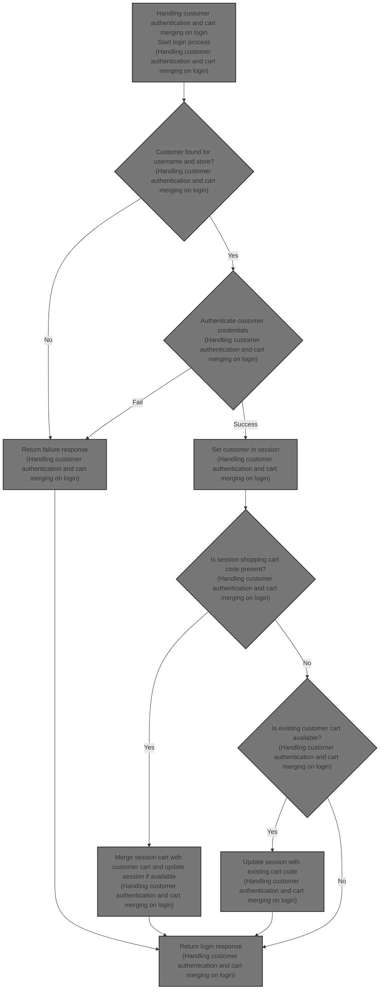

This document explains the flow of customer authentication and shopping cart merging during login. It receives customer credentials as input and returns a login response. Upon successful authentication, the customer is set in the session. The flow manages shopping cart data by merging any existing session cart with the customer's stored cart or by loading the customer's existing cart if no session cart exists, preserving the user's shopping activity.



# Handling customer authentication and cart merging on login

```mermaid
%%{init: {"flowchart": {"defaultRenderer": "elk"}} }%%
flowchart TD
    node1["Start login process"] --> node2{"Customer found for username and store?"}
    click node1 openCode "shopizer/sm-shop/src/main/java/com/salesmanager/web/shop/controller/customer/CustomerLoginController.java:60:62"
    node2 -->|"No"| node3["Return failure response"]
    click node2 openCode "shopizer/sm-shop/src/main/java/com/salesmanager/web/shop/controller/customer/CustomerLoginController.java:74:78"
    node3 --> node13["Return login response"]
    click node3 openCode "shopizer/sm-shop/src/main/java/com/salesmanager/web/shop/controller/customer/CustomerLoginController.java:76:78"
    node2 -->|"Yes"| node4{"Authenticate customer credentials"}
    click node4 openCode "shopizer/sm-shop/src/main/java/com/salesmanager/web/shop/controller/customer/CustomerLoginController.java:79:81"
    node4 -->|"Fail"| node3
    node4 -->|"Success"| node5["Set customer in session"]
    click node5 openCode "shopizer/sm-shop/src/main/java/com/salesmanager/web/shop/controller/customer/CustomerLoginController.java:81:82"
    node5 --> node6{"Is session shopping cart code present?"}
    click node6 openCode "shopizer/sm-shop/src/main/java/com/salesmanager/web/shop/controller/customer/CustomerLoginController.java:88:89"
    node6 -->|"Yes"| node7["Merge session cart with customer cart"]
    click node7 openCode "shopizer/sm-shop/src/main/java/com/salesmanager/web/shop/controller/customer/CustomerLoginController.java:90:95"
    node7 --> node8{"Is merged cart data available?"}
    click node8 openCode "shopizer/sm-shop/src/main/java/com/salesmanager/web/shop/controller/customer/CustomerLoginController.java:93:96"
    node8 -->|"Yes"| node9["Update session with merged cart code"]
    click node9 openCode "shopizer/sm-shop/src/main/java/com/salesmanager/web/shop/controller/customer/CustomerLoginController.java:94:96"
    node8 -->|"No"| node10["Skip cart update"]
    node6 -->|"No"| node11{"Is existing customer cart available?"}
    click node11 openCode "shopizer/sm-shop/src/main/java/com/salesmanager/web/shop/controller/customer/CustomerLoginController.java:99:100"
    node11 -->|"Yes"| node12["Update session with existing cart code"]
    click node12 openCode "shopizer/sm-shop/src/main/java/com/salesmanager/web/shop/controller/customer/CustomerLoginController.java:101:103"
    node11 -->|"No"| node10
    node9 --> node13
    node10 --> node13
    node12 --> node13
    node13["Return login response"]
    click node13 openCode "shopizer/sm-shop/src/main/java/com/salesmanager/web/shop/controller/customer/CustomerLoginController.java:118:119"
classDef HeadingStyle fill:#777777,stroke:#333,stroke-width:2px;

%% Swimm:
%% %%{init: {"flowchart": {"defaultRenderer": "elk"}} }%%
%% flowchart TD
%%     node1["Start login process"] --> node2{"Customer found for username and store?"}
%%     click node1 openCode "<SwmPath>[shopizer/…/customer/CustomerLoginController.java](shopizer/sm-shop/src/main/java/com/salesmanager/web/shop/controller/customer/CustomerLoginController.java)</SwmPath>:60:62"
%%     node2 -->|"No"| node3["Return failure response"]
%%     click node2 openCode "<SwmPath>[shopizer/…/customer/CustomerLoginController.java](shopizer/sm-shop/src/main/java/com/salesmanager/web/shop/controller/customer/CustomerLoginController.java)</SwmPath>:74:78"
%%     node3 --> node13["Return login response"]
%%     click node3 openCode "<SwmPath>[shopizer/…/customer/CustomerLoginController.java](shopizer/sm-shop/src/main/java/com/salesmanager/web/shop/controller/customer/CustomerLoginController.java)</SwmPath>:76:78"
%%     node2 -->|"Yes"| node4{"Authenticate customer credentials"}
%%     click node4 openCode "<SwmPath>[shopizer/…/customer/CustomerLoginController.java](shopizer/sm-shop/src/main/java/com/salesmanager/web/shop/controller/customer/CustomerLoginController.java)</SwmPath>:79:81"
%%     node4 -->|"Fail"| node3
%%     node4 -->|"Success"| node5["Set customer in session"]
%%     click node5 openCode "<SwmPath>[shopizer/…/customer/CustomerLoginController.java](shopizer/sm-shop/src/main/java/com/salesmanager/web/shop/controller/customer/CustomerLoginController.java)</SwmPath>:81:82"
%%     node5 --> node6{"Is session shopping cart code present?"}
%%     click node6 openCode "<SwmPath>[shopizer/…/customer/CustomerLoginController.java](shopizer/sm-shop/src/main/java/com/salesmanager/web/shop/controller/customer/CustomerLoginController.java)</SwmPath>:88:89"
%%     node6 -->|"Yes"| node7["Merge session cart with customer cart"]
%%     click node7 openCode "<SwmPath>[shopizer/…/customer/CustomerLoginController.java](shopizer/sm-shop/src/main/java/com/salesmanager/web/shop/controller/customer/CustomerLoginController.java)</SwmPath>:90:95"
%%     node7 --> node8{"Is merged cart data available?"}
%%     click node8 openCode "<SwmPath>[shopizer/…/customer/CustomerLoginController.java](shopizer/sm-shop/src/main/java/com/salesmanager/web/shop/controller/customer/CustomerLoginController.java)</SwmPath>:93:96"
%%     node8 -->|"Yes"| node9["Update session with merged cart code"]
%%     click node9 openCode "<SwmPath>[shopizer/…/customer/CustomerLoginController.java](shopizer/sm-shop/src/main/java/com/salesmanager/web/shop/controller/customer/CustomerLoginController.java)</SwmPath>:94:96"
%%     node8 -->|"No"| node10["Skip cart update"]
%%     node6 -->|"No"| node11{"Is existing customer cart available?"}
%%     click node11 openCode "<SwmPath>[shopizer/…/customer/CustomerLoginController.java](shopizer/sm-shop/src/main/java/com/salesmanager/web/shop/controller/customer/CustomerLoginController.java)</SwmPath>:99:100"
%%     node11 -->|"Yes"| node12["Update session with existing cart code"]
%%     click node12 openCode "<SwmPath>[shopizer/…/customer/CustomerLoginController.java](shopizer/sm-shop/src/main/java/com/salesmanager/web/shop/controller/customer/CustomerLoginController.java)</SwmPath>:101:103"
%%     node11 -->|"No"| node10
%%     node9 --> node13
%%     node10 --> node13
%%     node12 --> node13
%%     node13["Return login response"]
%%     click node13 openCode "<SwmPath>[shopizer/…/customer/CustomerLoginController.java](shopizer/sm-shop/src/main/java/com/salesmanager/web/shop/controller/customer/CustomerLoginController.java)</SwmPath>:118:119"
%% classDef HeadingStyle fill:#777777,stroke:#333,stroke-width:2px;
```



This section handles customer authentication and shopping cart merging during the login process to ensure a seamless shopping experience.

| Category        | Rule Name                          | Description                                                                                                                          |
| --------------- | ---------------------------------- | ------------------------------------------------------------------------------------------------------------------------------------ |
| Data validation | Customer existence validation      | Login fails if the customer username does not exist for the given store.                                                             |
| Data validation | Credential authentication          | Login fails if the customer's credentials (username and password) are incorrect.                                                     |
| Business logic  | Session customer setting           | Upon successful authentication, the customer is set in the session to maintain login state.                                          |
| Business logic  | Cart merging on login              | If a shopping cart code exists in the session, merge the session cart with the customer's stored cart to preserve shopping activity. |
| Business logic  | Cart session update after merge    | If cart merging produces a valid merged cart, update the session with the merged cart code.                                          |
| Business logic  | Fallback to existing customer cart | If no session cart code exists, use the customer's existing stored cart and update the session accordingly.                          |

<SwmSnippet path="/shopizer/sm-shop/src/main/java/com/salesmanager/web/shop/controller/customer/CustomerLoginController.java" line="60">

---

Here, the <SwmToken path="shopizer/sm-shop/src/main/java/com/salesmanager/web/shop/controller/customer/CustomerLoginController.java" pos="60:8:8" line-data="	public @ResponseBody String logon(@ModelAttribute SecuredCustomer securedCustomer, HttpServletRequest request, HttpServletResponse response) throws Exception {">`logon`</SwmToken> function starts the login flow by authenticating the user based on the username and password. It assumes the request already has store and language info set by a filter. After authentication, it handles shopping cart merging: if there's a cart code in the session, it merges that cart with the customer's stored cart; if not, it fetches the customer's existing cart. This keeps the user's shopping activity consistent across sessions.

```java
	public @ResponseBody String logon(@ModelAttribute SecuredCustomer securedCustomer, HttpServletRequest request, HttpServletResponse response) throws Exception {
		
        AjaxResponse jsonObject=new AjaxResponse();
        

        try {

        	LOG.debug("Authenticating user " + securedCustomer.getUserName());
        	
        	//user goes to shop filter first so store and language are set
        	MerchantStore store = (MerchantStore)request.getAttribute(Constants.MERCHANT_STORE);
        	Language language = (Language)request.getAttribute("LANGUAGE");

            //check if username is from the appropriate store
            Customer customerModel = customerFacade.getCustomerByUserName(securedCustomer.getUserName(), store);
            if(customerModel==null) {
            	jsonObject.setStatus(AjaxResponse.RESPONSE_STATUS_FAIURE);
            	return jsonObject.toJSONString();
            }
            customerFacade.authenticate(customerModel, securedCustomer.getUserName(), securedCustomer.getPassword());
            //set customer in the http session
            super.setSessionAttribute(Constants.CUSTOMER, customerModel, request);
            jsonObject.setStatus(AjaxResponse.RESPONSE_STATUS_SUCCESS);


            
            
            LOG.info( "Fetching and merging Shopping Cart data" );
            final String sessionShoppingCartCode= (String)request.getSession().getAttribute( Constants.SHOPPING_CART );
            if(!StringUtils.isBlank(sessionShoppingCartCode)) {
	            ShoppingCartData shoppingCartData= customerFacade.mergeCart( customerModel, sessionShoppingCartCode, store, language );
	
	
	            if(shoppingCartData !=null){
	                jsonObject.addEntry(Constants.SHOPPING_CART, shoppingCartData.getCode());
	                request.getSession().setAttribute(Constants.SHOPPING_CART, shoppingCartData.getCode());
	            }
            } else {

	            ShoppingCart cartModel = shoppingCartService.getByCustomer(customerModel);
	            if(cartModel!=null) {
	                jsonObject.addEntry( Constants.SHOPPING_CART, cartModel.getShoppingCartCode());
	                request.getSession().setAttribute(Constants.SHOPPING_CART, cartModel.getShoppingCartCode());
	            }
            
            }

            
            
            
            
        } catch (AuthenticationException ex) {
        	jsonObject.setStatus(AjaxResponse.RESPONSE_STATUS_FAIURE);
        } catch(Exception e) {
        	jsonObject.setStatus(AjaxResponse.RESPONSE_STATUS_FAIURE);
        }
		
        
        return jsonObject.toJSONString();
		
		
	}
```

---

</SwmSnippet>

&nbsp;

*This is an auto-generated document by Swimm 🌊 and has not yet been verified by a human*

<SwmMeta version="3.0.0" repo-id="Z2l0aHViJTNBJTNBU2hvcGl6ZXIlM0ElM0F1bWFsaW5nYXN3YW1p" repo-name="Shopizer"><sup>Powered by [Swimm](https://app.swimm.io/)</sup></SwmMeta>
