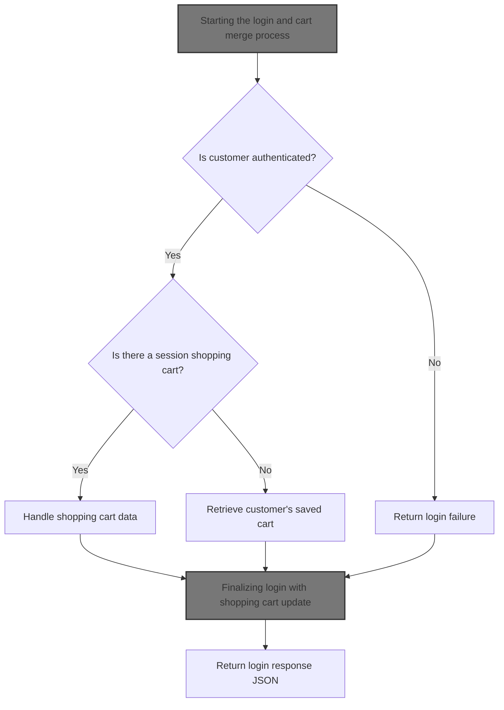
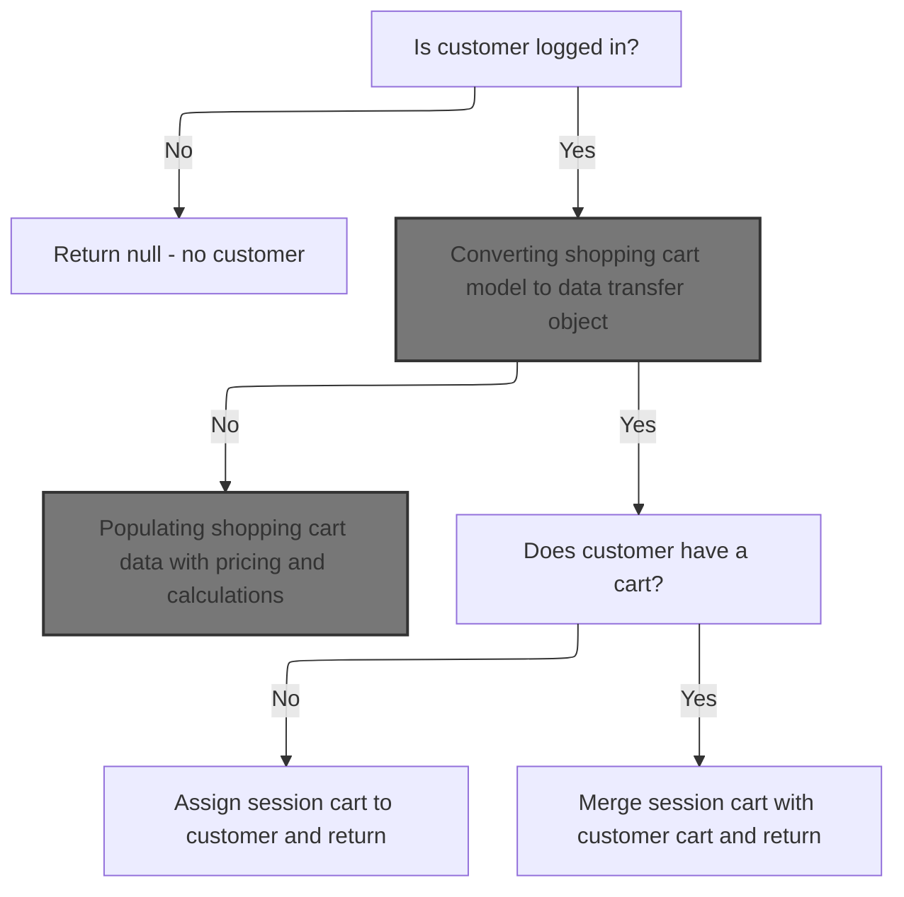
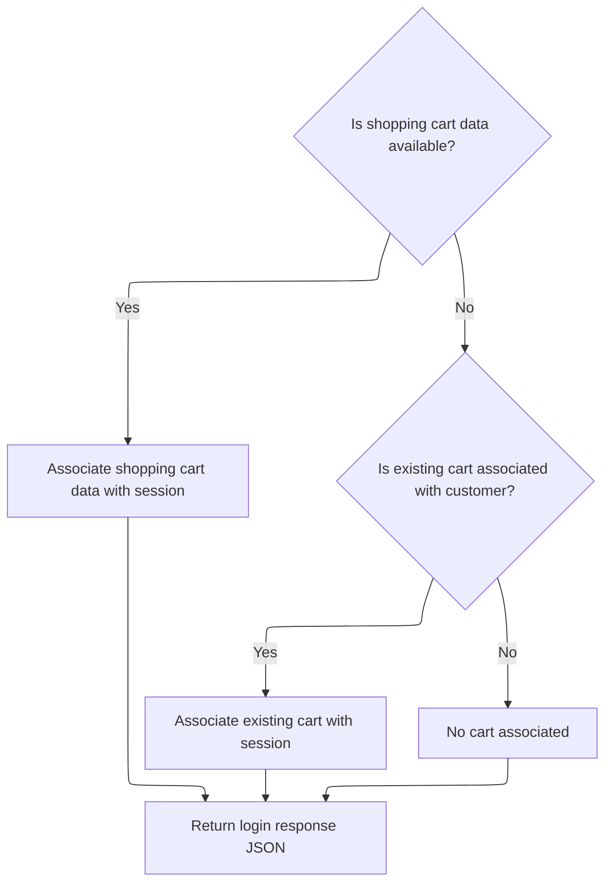

This document describes the customer login process and shopping cart management, including authentication, session assignment, and merging or retrieving shopping carts to ensure customers have the correct cart after login.



# Starting the login and cart merge process

This section handles the login process for customers and manages the merging or retrieval of shopping cart data upon successful authentication.

| Category        | Rule Name                      | Description                                                                                                                   |
| --------------- | ------------------------------ | ----------------------------------------------------------------------------------------------------------------------------- |
| Data validation | Store-specific user validation | The username must belong to the merchant store associated with the current session to proceed with authentication.            |
| Data validation | Customer authentication        | The customer must be authenticated using their username and password before any session or cart data is accessed or modified. |
| Business logic  | Session cart merge             | If a session shopping cart exists, it must be merged with the customer's saved cart to consolidate shopping data.             |
| Business logic  | Saved cart retrieval           | If no session shopping cart exists, the customer's saved cart should be retrieved and used for the session.                   |
| Business logic  | Session customer assignment    | Upon successful authentication, the customer object must be stored in the HTTP session for subsequent requests.               |

<SwmSnippet path="/shopizer/sm-shop/src/main/java/com/salesmanager/web/shop/controller/customer/CustomerLoginController.java" line="60">

---

In <SwmToken path="shopizer/sm-shop/src/main/java/com/salesmanager/web/shop/controller/customer/CustomerLoginController.java" pos="60:8:8" line-data="	public @ResponseBody String logon(@ModelAttribute SecuredCustomer securedCustomer, HttpServletRequest request, HttpServletResponse response) throws Exception {">`logon`</SwmToken> we start by authenticating the user and retrieving the merchant store and language from the request attributes, which are assumed to be set beforehand. Then we check if the username belongs to the store and authenticate the customer. After that, we handle shopping cart merging or retrieval by calling <SwmToken path="shopizer/sm-shop/src/main/java/com/salesmanager/web/shop/controller/customer/facade/CustomerFacadeImpl.java" pos="78:4:4" line-data="public class CustomerFacadeImpl implements CustomerFacade">`CustomerFacadeImpl`</SwmToken>, which manages combining the session cart with the customer's saved cart or fetching the saved cart if no session cart exists.

```java
	public @ResponseBody String logon(@ModelAttribute SecuredCustomer securedCustomer, HttpServletRequest request, HttpServletResponse response) throws Exception {
		
        AjaxResponse jsonObject=new AjaxResponse();
        

        try {

        	LOG.debug("Authenticating user " + securedCustomer.getUserName());
        	
        	//user goes to shop filter first so store and language are set
        	MerchantStore store = (MerchantStore)request.getAttribute(Constants.MERCHANT_STORE);
        	Language language = (Language)request.getAttribute("LANGUAGE");

            //check if username is from the appropriate store
            Customer customerModel = customerFacade.getCustomerByUserName(securedCustomer.getUserName(), store);
            if(customerModel==null) {
            	jsonObject.setStatus(AjaxResponse.RESPONSE_STATUS_FAIURE);
            	return jsonObject.toJSONString();
            }
            customerFacade.authenticate(customerModel, securedCustomer.getUserName(), securedCustomer.getPassword());
            //set customer in the http session
            super.setSessionAttribute(Constants.CUSTOMER, customerModel, request);
            jsonObject.setStatus(AjaxResponse.RESPONSE_STATUS_SUCCESS);


            
            
            LOG.info( "Fetching and merging Shopping Cart data" );
            final String sessionShoppingCartCode= (String)request.getSession().getAttribute( Constants.SHOPPING_CART );
            if(!StringUtils.isBlank(sessionShoppingCartCode)) {
	            ShoppingCartData shoppingCartData= customerFacade.mergeCart( customerModel, sessionShoppingCartCode, store, language );
	
	
```

---

</SwmSnippet>

## Handling shopping cart merging logic



This section handles the logic for merging shopping carts when a customer logs in, ensuring that the customer's session cart and any existing customer cart are properly combined or assigned.

| Category        | Rule Name                                        | Description                                                                                                                                                    |
| --------------- | ------------------------------------------------ | -------------------------------------------------------------------------------------------------------------------------------------------------------------- |
| Data validation | Customer login required                          | The shopping cart merging process only proceeds if the customer is logged in; otherwise, no cart is returned.                                                  |
| Data validation | Prevent cart conflicts                           | If the session cart belongs to a different customer than the logged-in user, the merge process returns null to avoid cart conflicts.                           |
| Business logic  | Assign session cart to customer                  | If the customer does not have an existing cart but there is a session cart not linked to any customer, the session cart is assigned to the logged-in customer. |
| Business logic  | Merge carts when both exist                      | If both a customer cart and a session cart exist and the session cart is not linked to another customer, the two carts are merged into one.                    |
| Business logic  | Return existing customer cart if no session cart | If there is no session cart but the customer has an existing cart, that cart is returned as the current shopping cart.                                         |

<SwmSnippet path="/shopizer/sm-shop/src/main/java/com/salesmanager/web/shop/controller/customer/facade/CustomerFacadeImpl.java" line="173">

---

In <SwmToken path="shopizer/sm-shop/src/main/java/com/salesmanager/web/shop/controller/customer/facade/CustomerFacadeImpl.java" pos="173:5:5" line-data="    public ShoppingCartData mergeCart( final Customer customerModel, final String sessionShoppingCartId ,final MerchantStore store,final Language language)">`mergeCart`</SwmToken> we start by checking if the customer has an existing cart and if there's a session cart. If the session cart isn't linked to any customer, we assign it to the logged-in customer. If both carts exist, we merge them if needed. If the session cart belongs to another user, we return null to avoid conflicts.

```java
    public ShoppingCartData mergeCart( final Customer customerModel, final String sessionShoppingCartId ,final MerchantStore store,final Language language)
        throws Exception
    {

        LOG.debug( "Starting merge cart process" );
        if(customerModel != null){
            ShoppingCart customerCart = shoppingCartService.getByCustomer( customerModel );
            if(StringUtils.isNotBlank( sessionShoppingCartId )){
	            ShoppingCart sessionShoppingCart = shoppingCartService.getByCode( sessionShoppingCartId, store );
	            if(sessionShoppingCart != null){
	               if(customerCart == null){
	            	   if(sessionShoppingCart.getCustomerId()==null) {//saved shopping cart does not belong to a customer
		                   LOG.debug( "Not able to find any shoppingCart with current customer" );
		                   //give it to the customer
		                   sessionShoppingCart.setCustomerId( customerModel.getId() );
		                   shoppingCartService.saveOrUpdate( sessionShoppingCart );
		                   customerCart =shoppingCartService.getById( sessionShoppingCart.getId(), store );
		                   return populateShoppingCartData(customerCart,store,language);
	            	   } else {
	            		   return null;
	            	   }
	               }
	               else{
	                    if(sessionShoppingCart.getCustomerId()==null) {//saved shopping cart does not belong to a customer
	                    	//assign it to logged in user
	                    	LOG.debug( "Customer shopping cart as well session cart is available, merging carts" );
	                    	customerCart=shoppingCartService.mergeShoppingCarts( customerCart, sessionShoppingCart, store );
	                    	customerCart =shoppingCartService.getById( customerCart.getId(), store );
		                    return populateShoppingCartData(customerCart,store,language);
	                    } else {
	                    	if(sessionShoppingCart.getCustomerId().longValue()==customerModel.getId().longValue()) {
	                    		if(!customerCart.getShoppingCartCode().equals(sessionShoppingCart.getShoppingCartCode())) {
		                    		//merge carts
		                    		LOG.info( "Customer shopping cart as well session cart is available" );
		                    		customerCart=shoppingCartService.mergeShoppingCarts( customerCart, sessionShoppingCart, store );
		                    		customerCart =shoppingCartService.getById( customerCart.getId(), store );
		    	                    return populateShoppingCartData(customerCart,store,language);
	                    		} else {
	                    			return populateShoppingCartData(sessionShoppingCart,store,language);
	                    		}
	                    	} else {
	                    		//the saved cart belongs to another user
	                    		return null;
	                    	}
	                    }
	            	    
	                    
	              }
	            }
            }
            else{
                 if(customerCart !=null){
                     return populateShoppingCartData(customerCart,store,language);
                 }
                 return null;

            }
        }
```

---

</SwmSnippet>

### Converting shopping cart model to data transfer object

This section describes the process of converting the internal shopping cart model into a data transfer object that includes pricing and calculation details, making it ready for client consumption.

| Category       | Rule Name                             | Description                                                                                                                                 |
| -------------- | ------------------------------------- | ------------------------------------------------------------------------------------------------------------------------------------------- |
| Business logic | Accurate pricing calculation          | The shopping cart data must include accurate pricing calculated based on the current pricing service and shopping cart calculation service. |
| Business logic | Language-specific data representation | The shopping cart data must be populated considering the language context to ensure localized content is presented to the client.           |

<SwmSnippet path="/shopizer/sm-shop/src/main/java/com/salesmanager/web/shop/controller/customer/facade/CustomerFacadeImpl.java" line="237">

---

<SwmToken path="shopizer/sm-shop/src/main/java/com/salesmanager/web/shop/controller/customer/facade/CustomerFacadeImpl.java" pos="237:5:5" line-data="    private ShoppingCartData populateShoppingCartData(final ShoppingCart cartModel , final MerchantStore store, final Language language){">`populateShoppingCartData`</SwmToken> creates a <SwmToken path="shopizer/sm-shop/src/main/java/com/salesmanager/web/shop/controller/customer/facade/CustomerFacadeImpl.java" pos="239:1:1" line-data="        ShoppingCartDataPopulator shoppingCartDataPopulator = new ShoppingCartDataPopulator();">`ShoppingCartDataPopulator`</SwmToken>, sets necessary services, and calls its populate method to convert the internal cart model into a data object with pricing and calculations ready for the client.

```java
    private ShoppingCartData populateShoppingCartData(final ShoppingCart cartModel , final MerchantStore store, final Language language){

        ShoppingCartDataPopulator shoppingCartDataPopulator = new ShoppingCartDataPopulator();
        shoppingCartDataPopulator.setShoppingCartCalculationService( shoppingCartCalculationService );
        shoppingCartDataPopulator.setPricingService( pricingService );
        try
        {
            return shoppingCartDataPopulator.populate(  cartModel ,  store,  language);
        }
        catch ( ConversionException ce )
        {
           LOG.error( "Error in converting shopping cart to shopping cart data", ce );

        }
        return null;
    }
```

---

</SwmSnippet>

### Populating shopping cart data with pricing and calculations

This section is responsible for populating shopping cart data with pricing and calculations, ensuring accurate totals and pricing details are presented to the user.

| Category       | Rule Name              | Description                                                                                                              |
| -------------- | ---------------------- | ------------------------------------------------------------------------------------------------------------------------ |
| Business logic | Item total calculation | Calculate the total price for each item by multiplying the unit price by the quantity.                                   |
| Business logic | Discount application   | Apply any applicable discounts to the item total before adding to the cart total.                                        |
| Business logic | Tax calculation        | Calculate taxes based on the applicable tax rates for the items in the cart.                                             |
| Business logic | Cart total calculation | Sum all item totals, including taxes and discounts, to produce the final cart total.                                     |
| Business logic | Dynamic pricing update | Ensure that pricing calculations are updated dynamically as items are added, removed, or quantities changed in the cart. |

See <SwmLink doc-title="Populating shopping cart data flow">[Populating shopping cart data flow](.swm%5Cpopulating-shopping-cart-data-flow.72kf3wnl.sw.md)</SwmLink>

### Handling edge cases and fallback in cart merging

<SwmSnippet path="/shopizer/sm-shop/src/main/java/com/salesmanager/web/shop/controller/customer/facade/CustomerFacadeImpl.java" line="231">

---

After trying to merge or retrieve carts, if no cart is found for the authenticated customer, we log an info message and return null to indicate no cart data is available.

```java
        LOG.info( "Seems some issue with system, unable to find any customer after successful authentication" );
        return null;

    }
```

---

</SwmSnippet>

## Finalizing login with shopping cart update



<SwmSnippet path="/shopizer/sm-shop/src/main/java/com/salesmanager/web/shop/controller/customer/CustomerLoginController.java" line="93">

---

After returning from <SwmToken path="shopizer/sm-shop/src/main/java/com/salesmanager/web/shop/controller/customer/CustomerLoginController.java" pos="90:8:8" line-data="	            ShoppingCartData shoppingCartData= customerFacade.mergeCart( customerModel, sessionShoppingCartCode, store, language );">`mergeCart`</SwmToken>, we check if a merged cart was returned. If yes, we add its code to the JSON response and session. If no session cart was present, we fetch the customer's saved cart and update the response and session accordingly. Exceptions during login set failure status in the response.

```java
	            if(shoppingCartData !=null){
	                jsonObject.addEntry(Constants.SHOPPING_CART, shoppingCartData.getCode());
	                request.getSession().setAttribute(Constants.SHOPPING_CART, shoppingCartData.getCode());
	            }
            } else {

	            ShoppingCart cartModel = shoppingCartService.getByCustomer(customerModel);
	            if(cartModel!=null) {
	                jsonObject.addEntry( Constants.SHOPPING_CART, cartModel.getShoppingCartCode());
	                request.getSession().setAttribute(Constants.SHOPPING_CART, cartModel.getShoppingCartCode());
	            }
            
            }

            
            
            
            
        } catch (AuthenticationException ex) {
        	jsonObject.setStatus(AjaxResponse.RESPONSE_STATUS_FAIURE);
        } catch(Exception e) {
        	jsonObject.setStatus(AjaxResponse.RESPONSE_STATUS_FAIURE);
        }
		
        
        return jsonObject.toJSONString();
		
		
	}
```

---

</SwmSnippet>

&nbsp;

*This is an auto-generated document by Swimm 🌊 and has not yet been verified by a human*

<SwmMeta version="3.0.0" repo-id="Z2l0aHViJTNBJTNBU2hvcGl6ZXIlM0ElM0F1bWFsaW5nYXN3YW1p" repo-name="Shopizer"><sup>Powered by [Swimm](https://app.swimm.io/)</sup></SwmMeta>
