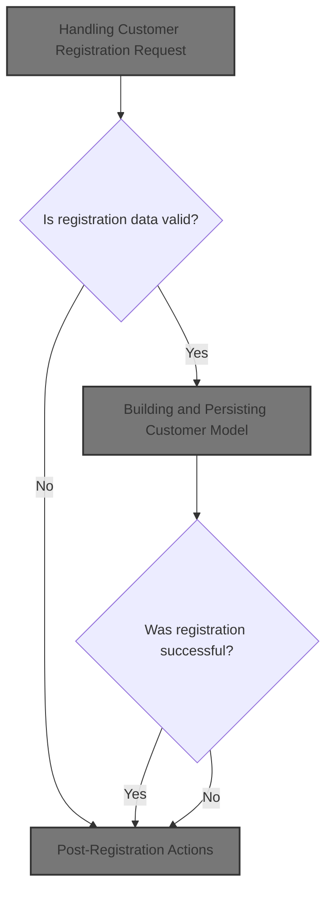
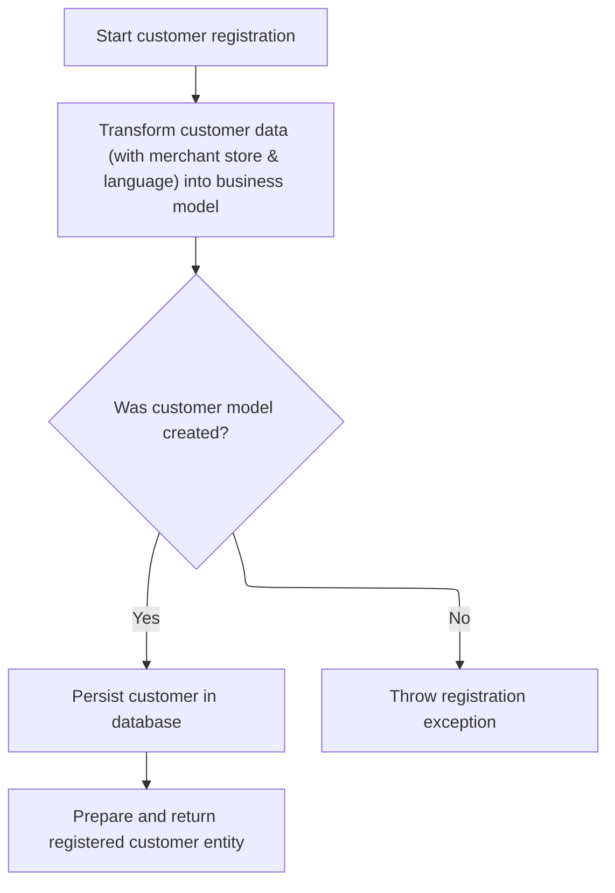
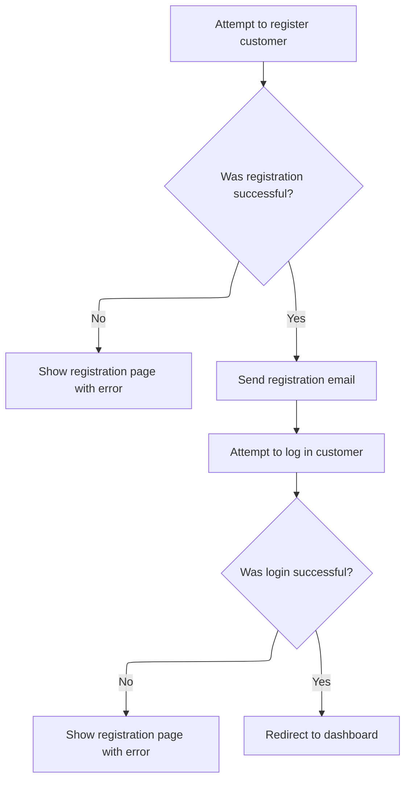

This document describes how a new customer account is registered. The flow validates user input, associates the account with the correct store and language, creates and persists the customer, sends a registration email, and logs in the user.



# Handling Customer Registration Request

This section governs the business rules for handling customer registration requests, including validation of user input, error handling, and the conditions under which a customer account is created.

| Category        | Rule Name                                | Description                                                                                                                                                                                                          |
| --------------- | ---------------------------------------- | -------------------------------------------------------------------------------------------------------------------------------------------------------------------------------------------------------------------- |
| Data validation | Captcha validation required              | A customer registration request must include a valid captcha challenge and response. If the captcha is not valid, registration is not allowed and an error message is shown.                                         |
| Data validation | Unique username per store                | A customer registration request must include a unique username for the store. If the username already exists, registration is not allowed and an error message is shown.                                             |
| Data validation | Password confirmation match              | A customer registration request must include a password and a password confirmation. Both fields must be present and match exactly. If they do not match, registration is not allowed and an error message is shown. |
| Business logic  | Create customer on successful validation | Only after all validations pass, the customer account is created and persisted using the provided store and language context.                                                                                        |

<SwmSnippet path="/shopizer/sm-shop/src/main/java/com/salesmanager/web/shop/controller/customer/CustomerRegistrationController.java" line="124">

---

In <SwmToken path="shopizer/sm-shop/src/main/java/com/salesmanager/web/shop/controller/customer/CustomerRegistrationController.java" pos="124:5:5" line-data="    public String registerCustomer( @Valid">`registerCustomer`</SwmToken>, we kick off the registration flow by grabbing store and language info, setting up captcha, validating user input (captcha, username, password), and handling errors. Once all checks pass, we call <SwmToken path="shopizer/sm-shop/src/main/java/com/salesmanager/web/shop/controller/customer/CustomerRegistrationController.java" pos="196:5:7" line-data="        	customerData = customerFacade.registerCustomer( customer, merchantStore, language );">`customerFacade.registerCustomer`</SwmToken> to actually create the customer, since that's where the persistence and model population happen.

```java
    public String registerCustomer( @Valid
    @ModelAttribute("customer") SecuredShopPersistableCustomer customer, BindingResult bindingResult, Model model,
                                    HttpServletRequest request, final Locale locale )
        throws Exception
    {
        MerchantStore merchantStore = (MerchantStore) request.getAttribute( Constants.MERCHANT_STORE );
        Language language = super.getLanguage(request);
        
        
        ReCaptchaImpl reCaptcha = new ReCaptchaImpl();
        reCaptcha.setPublicKey( coreConfiguration.getProperty( Constants.RECAPATCHA_PUBLIC_KEY ) );
        reCaptcha.setPrivateKey( coreConfiguration.getProperty( Constants.RECAPATCHA_PRIVATE_KEY ) );
        
        String userName = null;
        String password = null;
        
        model.addAttribute( "recapatcha_public_key", coreConfiguration.getProperty( Constants.RECAPATCHA_PUBLIC_KEY ) );
        
        if ( StringUtils.isNotBlank( customer.getRecaptcha_challenge_field() )
            && StringUtils.isNotBlank( customer.getRecaptcha_response_field() ) )
        {
            ReCaptchaResponse reCaptchaResponse =
                reCaptcha.checkAnswer( request.getRemoteAddr(), customer.getRecaptcha_challenge_field(),
                                       customer.getRecaptcha_response_field() );
            if ( !reCaptchaResponse.isValid() )
            {
                LOGGER.debug( "Captcha response does not matched" );
    			FieldError error = new FieldError("recaptcha_challenge_field","recaptcha_challenge_field",messages.getMessage("validaion.recaptcha.not.matched", locale));
    			bindingResult.addError(error);
            }

        }
        
        if ( StringUtils.isNotBlank( customer.getUserName() ) )
        {
            if ( customerFacade.checkIfUserExists( customer.getUserName(), merchantStore ) )
            {
                LOGGER.debug( "Customer with username {} already exists for this store ", customer.getUserName() );
            	FieldError error = new FieldError("userName","userName",messages.getMessage("registration.username.already.exists", locale));
            	bindingResult.addError(error);
            }
            userName = customer.getUserName();
        }
        
        
        if ( StringUtils.isNotBlank( customer.getPassword() ) &&  StringUtils.isNotBlank( customer.getCheckPassword() ))
        {
            if (! customer.getPassword().equals(customer.getCheckPassword()) )
            {
            	FieldError error = new FieldError("password","password",messages.getMessage("message.password.checkpassword.identical", locale));
            	bindingResult.addError(error);

            }
            password = customer.getPassword();
        }

        if ( bindingResult.hasErrors() )
        {
            LOGGER.debug( "found {} validation error while validating in customer registration ",
                         bindingResult.getErrorCount() );
            StringBuilder template =
                new StringBuilder().append( ControllerConstants.Tiles.Customer.register ).append( "." ).append( merchantStore.getStoreTemplate() );
            return template.toString();

        }

        @SuppressWarnings( "unused" )
        CustomerEntity customerData = null;
        try
        {
            //set user clear password
        	customer.setClearPassword(password);
        	customerData = customerFacade.registerCustomer( customer, merchantStore, language );
        }
```

---

</SwmSnippet>

## Building and Persisting Customer Model



This section governs the rules for building a complete customer model from incoming registration data, validating it, persisting it to the database, and returning the registered customer entity. It also handles error cases where registration cannot proceed.

| Category        | Rule Name                         | Description                                                                                                                                                            |
| --------------- | --------------------------------- | ---------------------------------------------------------------------------------------------------------------------------------------------------------------------- |
| Data validation | Merchant and Language Association | A customer registration must include a valid merchant store and language context to ensure proper localization and association.                                        |
| Data validation | Password Assignment and Encoding  | A customer must have a password assigned before registration is completed. If the password is missing in the model but present in the DTO, it must be set and encoded. |
| Business logic  | Default Property Assignment       | Default properties must be set on the customer model if they are not provided, ensuring consistency across all registered customers.                                   |
| Business logic  | Customer Persistence              | Once the customer model is validated and complete, it must be persisted in the database to finalize registration.                                                      |
| Business logic  | Return Registered Customer Entity | After successful registration, a populated customer entity must be returned to the controller for further processing or response to the user.                          |

<SwmSnippet path="/shopizer/sm-shop/src/main/java/com/salesmanager/web/shop/controller/customer/facade/CustomerFacadeImpl.java" line="299">

---

In <SwmToken path="shopizer/sm-shop/src/main/java/com/salesmanager/web/shop/controller/customer/facade/CustomerFacadeImpl.java" pos="299:5:5" line-data="    public CustomerEntity registerCustomer( final PersistableCustomer customer,final MerchantStore merchantStore, Language language )">`registerCustomer`</SwmToken>, we start by converting the incoming DTO to a full Customer model using <SwmToken path="shopizer/sm-shop/src/main/java/com/salesmanager/web/shop/controller/customer/facade/CustomerFacadeImpl.java" pos="303:6:6" line-data="        Customer customerModel= getCustomerModel(customer,merchantStore,language);">`getCustomerModel`</SwmToken>. This step is needed because the DTO doesn't have all the data or relationships required for persistence.

```java
    public CustomerEntity registerCustomer( final PersistableCustomer customer,final MerchantStore merchantStore, Language language )
        throws Exception
    {
       LOG.info( "Starting customer registration process.." );
        Customer customerModel= getCustomerModel(customer,merchantStore,language);
```

---

</SwmSnippet>

<SwmSnippet path="/shopizer/sm-shop/src/main/java/com/salesmanager/web/shop/controller/customer/facade/CustomerFacadeImpl.java" line="317">

---

GetCustomerModel sets up a <SwmToken path="shopizer/sm-shop/src/main/java/com/salesmanager/web/shop/controller/customer/facade/CustomerFacadeImpl.java" pos="321:1:1" line-data="        CustomerPopulator populator = new CustomerPopulator();">`CustomerPopulator`</SwmToken> with all the required services, then populates the Customer entity from the DTO. After that, it handles password assignment and encoding, and sets default properties if needed.

```java
    public Customer getCustomerModel(final PersistableCustomer customer,final MerchantStore merchantStore, Language language) throws Exception {
        
        LOG.info( "Starting to populate customer model from customer data" );
        Customer customerModel=null;
        CustomerPopulator populator = new CustomerPopulator();
        populator.setCountryService(countryService);
        populator.setCustomerOptionService(customerOptionService);
        populator.setCustomerOptionValueService(customerOptionValueService);
        populator.setLanguageService(languageService);
        populator.setLanguageService(languageService);
        populator.setZoneService(zoneService);


            customerModel= populator.populate( customer, merchantStore, language );
            //we are creating or resetting a customer
            if(StringUtils.isBlank(customerModel.getPassword()) && !StringUtils.isBlank(customer.getClearPassword())) {
            	customerModel.setPassword(customer.getClearPassword());
            }
			//set groups
            if(!StringUtils.isBlank(customerModel.getPassword()) && !StringUtils.isBlank(customerModel.getNick())) {
            	customerModel.setPassword(passwordEncoder.encodePassword(customer.getClearPassword(), null));
            	setCustomerModelDefaultProperties(customerModel, merchantStore);
            }
            

          return customerModel;

    }
```

---

</SwmSnippet>

<SwmSnippet path="/shopizer/sm-shop/src/main/java/com/salesmanager/web/shop/controller/customer/facade/CustomerFacadeImpl.java" line="304">

---

We just got back from <SwmToken path="shopizer/sm-shop/src/main/java/com/salesmanager/web/shop/controller/customer/facade/CustomerFacadeImpl.java" pos="303:6:6" line-data="        Customer customerModel= getCustomerModel(customer,merchantStore,language);">`getCustomerModel`</SwmToken> in CustomerFacadeImpl.registerCustomer. If the model is valid, we persist it and return a populated entity to the controller. If not, we throw an exception to halt the flow.

```java
        if(customerModel == null){
            LOG.equals( "Unable to create customer in system" );
            throw new CustomerRegistrationException( "Unable to register customer" );
        }
        
        LOG.info( "About to persist customer to database." );
        customerService.saveOrUpdate( customerModel );
        
       LOG.info( "Returning customer data to controller.." );
       return customerEntityPoulator(customerModel,merchantStore);
     }
```

---

</SwmSnippet>

## Post-Registration Actions



<SwmSnippet path="/shopizer/sm-shop/src/main/java/com/salesmanager/web/shop/controller/customer/CustomerRegistrationController.java" line="198">

---

Back in CustomerRegistrationController.registerCustomer, after <SwmToken path="shopizer/sm-shop/src/main/java/com/salesmanager/web/shop/controller/customer/CustomerRegistrationController.java" pos="196:5:7" line-data="        	customerData = customerFacade.registerCustomer( customer, merchantStore, language );">`customerFacade.registerCustomer`</SwmToken> returns, we send a registration email to the user. This step uses <SwmToken path="shopizer/sm-shop/src/main/java/com/salesmanager/web/shop/controller/customer/CustomerRegistrationController.java" pos="48:10:10" line-data="import com.salesmanager.web.utils.EmailTemplatesUtils;">`EmailTemplatesUtils`</SwmToken> to notify the user and provide their credentials.

```java
        catch ( CustomerRegistrationException cre )
        {
            LOGGER.error( "Error while registering customer.. ", cre);
        	ObjectError error = new ObjectError("registration",messages.getMessage("registration.failed", locale));
        	bindingResult.addError(error);
            StringBuilder template =
                            new StringBuilder().append( ControllerConstants.Tiles.Customer.register ).append( "." ).append( merchantStore.getStoreTemplate() );
             return template.toString();
        }
        catch ( Exception e )
        {
            LOGGER.error( "Error while registering customer.. ", e);
        	ObjectError error = new ObjectError("registration",messages.getMessage("registration.failed", locale));
        	bindingResult.addError(error);
            StringBuilder template =
                            new StringBuilder().append( ControllerConstants.Tiles.Customer.register ).append( "." ).append( merchantStore.getStoreTemplate() );
            return template.toString();
        }
              
        /**
         * Send registration email
         */
        emailTemplatesUtils.sendRegistrationEmail( customer, merchantStore, locale, request.getContextPath() );

```

---

</SwmSnippet>

<SwmSnippet path="/shopizer/sm-shop/src/main/java/com/salesmanager/web/utils/EmailTemplatesUtils.java" line="273">

---

SendRegistrationEmail builds the email template using customer billing info and clear password, then sends it out. If those fields are missing, the email won't have all the expected data.

```java
	public void sendRegistrationEmail(
		PersistableCustomer customer, MerchantStore merchantStore,
			Locale customerLocale, String contextPath) {
		   /** issue with putting that elsewhere **/ 
	       LOGGER.info( "Sending welcome email to customer" );
	       try {

	           Map<String, String> templateTokens = EmailUtils.createEmailObjectsMap(contextPath, merchantStore, messages, customerLocale);
	           templateTokens.put(EmailConstants.LABEL_HI, messages.getMessage("label.generic.hi", customerLocale));
	           templateTokens.put(EmailConstants.EMAIL_CUSTOMER_FIRSTNAME, customer.getBilling().getFirstName());
	           templateTokens.put(EmailConstants.EMAIL_CUSTOMER_LASTNAME, customer.getBilling().getLastName());
	           String[] greetingMessage = {merchantStore.getStorename(),FilePathUtils.buildCustomerUri(merchantStore,contextPath),merchantStore.getStoreEmailAddress()};
	           templateTokens.put(EmailConstants.EMAIL_CUSTOMER_GREETING, messages.getMessage("email.customer.greeting", greetingMessage, customerLocale));
	           templateTokens.put(EmailConstants.EMAIL_USERNAME_LABEL, messages.getMessage("label.generic.username",customerLocale));
	           templateTokens.put(EmailConstants.EMAIL_PASSWORD_LABEL, messages.getMessage("label.generic.password",customerLocale));
	           templateTokens.put(EmailConstants.CUSTOMER_ACCESS_LABEL, messages.getMessage("label.customer.accessportal",customerLocale));
	           templateTokens.put(EmailConstants.ACCESS_NOW_LABEL, messages.getMessage("label.customer.accessnow",customerLocale));
	           templateTokens.put(EmailConstants.EMAIL_USER_NAME, customer.getUserName());
	           templateTokens.put(EmailConstants.EMAIL_CUSTOMER_PASSWORD, customer.getClearPassword());

	           //shop url
	           String customerUrl = FilePathUtils.buildStoreUri(merchantStore, contextPath);
	           templateTokens.put(EmailConstants.CUSTOMER_ACCESS_URL, customerUrl);

	           Email email = new Email();
	           email.setFrom(merchantStore.getStorename());
	           email.setFromEmail(merchantStore.getStoreEmailAddress());
	           email.setSubject(messages.getMessage("email.newuser.title",customerLocale));
	           email.setTo(customer.getEmailAddress());
	           email.setTemplateName(EmailConstants.EMAIL_CUSTOMER_TPL);
	           email.setTemplateTokens(templateTokens);

	           LOGGER.debug( "Sending email to {} on their  registered email id {} ",customer.getBilling().getFirstName(),customer.getEmailAddress() );
	           emailService.sendHtmlEmail(merchantStore, email);

	       } catch (Exception e) {
	           LOGGER.error("Error occured while sending welcome email ",e);
	       }
		
	}
```

---

</SwmSnippet>

<SwmSnippet path="/shopizer/sm-shop/src/main/java/com/salesmanager/web/shop/controller/customer/CustomerRegistrationController.java" line="222">

---

After sending the registration email in CustomerRegistrationController.registerCustomer, we fetch the customer, authenticate them, set the session, and redirect to the dashboard. If anything fails, we show the registration view with errors.

```java
        /**
         * Login user
         */
        
        try {
        	
	        //refresh customer
	        Customer c = customerFacade.getCustomerByUserName(customer.getUserName(), merchantStore);
	        //authenticate
	        customerFacade.authenticate(c, userName, password);
	        super.setSessionAttribute(Constants.CUSTOMER, c, request);
	        
	        return "redirect:/shop/customer/dashboard.html";
        
        
        } catch(Exception e) {
        	LOGGER.error("Cannot authenticate user ",e);
        	ObjectError error = new ObjectError("registration",messages.getMessage("registration.failed", locale));
        	bindingResult.addError(error);
        }
        
        
        StringBuilder template =
                new StringBuilder().append( ControllerConstants.Tiles.Customer.register ).append( "." ).append( merchantStore.getStoreTemplate() );
        return template.toString();

    }
```

---

</SwmSnippet>

&nbsp;

*This is an auto-generated document by Swimm 🌊 and has not yet been verified by a human*

<SwmMeta version="3.0.0" repo-id="Z2l0aHViJTNBJTNBU2hvcGl6ZXIlM0ElM0F1bWFsaW5nYXN3YW1p" repo-name="Shopizer"><sup>Powered by [Swimm](https://app.swimm.io/)</sup></SwmMeta>
