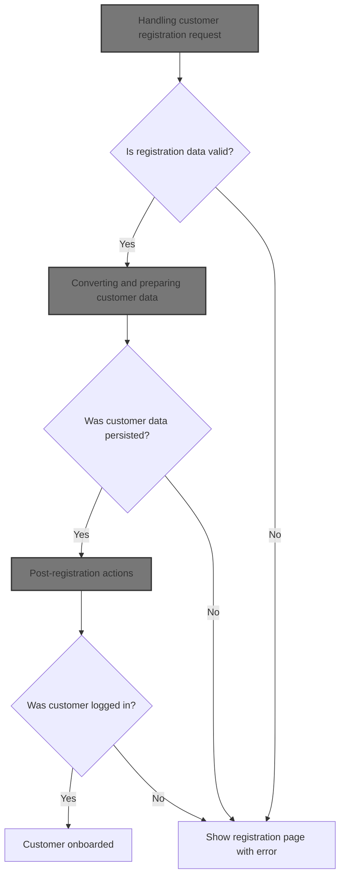
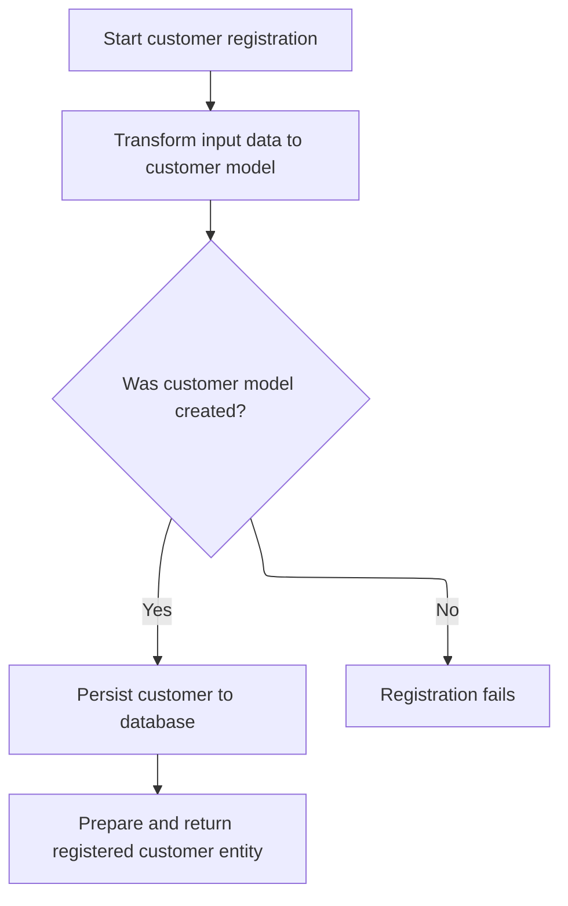
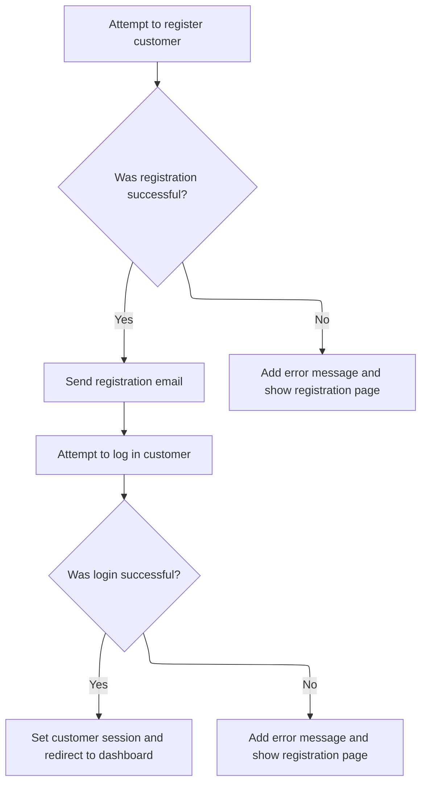

This document describes the flow for registering a new customer. When a user submits their registration details, the system validates the input, prepares and persists the customer data, sends a confirmation email, and logs the user in to complete onboarding.



# Handling customer registration request

<SwmSnippet path="/shopizer/sm-shop/src/main/java/com/salesmanager/web/shop/controller/customer/CustomerRegistrationController.java" line="124">

---

In <SwmToken path="shopizer/sm-shop/src/main/java/com/salesmanager/web/shop/controller/customer/CustomerRegistrationController.java" pos="124:5:5" line-data="    public String registerCustomer( @Valid">`registerCustomer`</SwmToken>, we start by validating the incoming customer data: captcha, username uniqueness, and password match. If any validation fails, we bail out early and return the registration page with errors. Only after passing these checks do we set the clear password and call the facade to actually register the customer, since that's where the business logic and persistence happen.

```java
    public String registerCustomer( @Valid
    @ModelAttribute("customer") SecuredShopPersistableCustomer customer, BindingResult bindingResult, Model model,
                                    HttpServletRequest request, final Locale locale )
        throws Exception
    {
        MerchantStore merchantStore = (MerchantStore) request.getAttribute( Constants.MERCHANT_STORE );
        Language language = super.getLanguage(request);
        
        
        ReCaptchaImpl reCaptcha = new ReCaptchaImpl();
        reCaptcha.setPublicKey( coreConfiguration.getProperty( Constants.RECAPATCHA_PUBLIC_KEY ) );
        reCaptcha.setPrivateKey( coreConfiguration.getProperty( Constants.RECAPATCHA_PRIVATE_KEY ) );
        
        String userName = null;
        String password = null;
        
        model.addAttribute( "recapatcha_public_key", coreConfiguration.getProperty( Constants.RECAPATCHA_PUBLIC_KEY ) );
        
        if ( StringUtils.isNotBlank( customer.getRecaptcha_challenge_field() )
            && StringUtils.isNotBlank( customer.getRecaptcha_response_field() ) )
        {
            ReCaptchaResponse reCaptchaResponse =
                reCaptcha.checkAnswer( request.getRemoteAddr(), customer.getRecaptcha_challenge_field(),
                                       customer.getRecaptcha_response_field() );
            if ( !reCaptchaResponse.isValid() )
            {
                LOGGER.debug( "Captcha response does not matched" );
    			FieldError error = new FieldError("recaptcha_challenge_field","recaptcha_challenge_field",messages.getMessage("validaion.recaptcha.not.matched", locale));
    			bindingResult.addError(error);
            }

        }
        
        if ( StringUtils.isNotBlank( customer.getUserName() ) )
        {
            if ( customerFacade.checkIfUserExists( customer.getUserName(), merchantStore ) )
            {
                LOGGER.debug( "Customer with username {} already exists for this store ", customer.getUserName() );
            	FieldError error = new FieldError("userName","userName",messages.getMessage("registration.username.already.exists", locale));
            	bindingResult.addError(error);
            }
            userName = customer.getUserName();
        }
        
        
        if ( StringUtils.isNotBlank( customer.getPassword() ) &&  StringUtils.isNotBlank( customer.getCheckPassword() ))
        {
            if (! customer.getPassword().equals(customer.getCheckPassword()) )
            {
            	FieldError error = new FieldError("password","password",messages.getMessage("message.password.checkpassword.identical", locale));
            	bindingResult.addError(error);

            }
            password = customer.getPassword();
        }

        if ( bindingResult.hasErrors() )
        {
            LOGGER.debug( "found {} validation error while validating in customer registration ",
                         bindingResult.getErrorCount() );
            StringBuilder template =
                new StringBuilder().append( ControllerConstants.Tiles.Customer.register ).append( "." ).append( merchantStore.getStoreTemplate() );
            return template.toString();

        }

        @SuppressWarnings( "unused" )
        CustomerEntity customerData = null;
        try
        {
            //set user clear password
        	customer.setClearPassword(password);
        	customerData = customerFacade.registerCustomer( customer, merchantStore, language );
        }
```

---

</SwmSnippet>

## Converting and preparing customer data



<SwmSnippet path="/shopizer/sm-shop/src/main/java/com/salesmanager/web/shop/controller/customer/facade/CustomerFacadeImpl.java" line="299">

---

In <SwmToken path="shopizer/sm-shop/src/main/java/com/salesmanager/web/shop/controller/customer/facade/CustomerFacadeImpl.java" pos="299:5:5" line-data="    public CustomerEntity registerCustomer( final PersistableCustomer customer,final MerchantStore merchantStore, Language language )">`registerCustomer`</SwmToken> (facade), we immediately convert the incoming <SwmToken path="shopizer/sm-shop/src/main/java/com/salesmanager/web/shop/controller/customer/facade/CustomerFacadeImpl.java" pos="299:10:10" line-data="    public CustomerEntity registerCustomer( final PersistableCustomer customer,final MerchantStore merchantStore, Language language )">`PersistableCustomer`</SwmToken> to a Customer model using <SwmToken path="shopizer/sm-shop/src/main/java/com/salesmanager/web/shop/controller/customer/facade/CustomerFacadeImpl.java" pos="303:6:6" line-data="        Customer customerModel= getCustomerModel(customer,merchantStore,language);">`getCustomerModel`</SwmToken>. This is needed because all further logic and persistence works with the Customer model, not the web DTO. If conversion fails, we throw an exception and stop the flow.

```java
    public CustomerEntity registerCustomer( final PersistableCustomer customer,final MerchantStore merchantStore, Language language )
        throws Exception
    {
       LOG.info( "Starting customer registration process.." );
        Customer customerModel= getCustomerModel(customer,merchantStore,language);
```

---

</SwmSnippet>

<SwmSnippet path="/shopizer/sm-shop/src/main/java/com/salesmanager/web/shop/controller/customer/facade/CustomerFacadeImpl.java" line="317">

---

<SwmToken path="shopizer/sm-shop/src/main/java/com/salesmanager/web/shop/controller/customer/facade/CustomerFacadeImpl.java" pos="317:5:5" line-data="    public Customer getCustomerModel(final PersistableCustomer customer,final MerchantStore merchantStore, Language language) throws Exception {">`getCustomerModel`</SwmToken> sets up a <SwmToken path="shopizer/sm-shop/src/main/java/com/salesmanager/web/shop/controller/customer/facade/CustomerFacadeImpl.java" pos="321:1:1" line-data="        CustomerPopulator populator = new CustomerPopulator();">`CustomerPopulator`</SwmToken> with all the needed services for country, zone, language, and customer options. It uses these to populate and validate the Customer model from the input. Then it handles password logic: sets and encodes the password if needed, and applies default properties for the merchant store.

```java
    public Customer getCustomerModel(final PersistableCustomer customer,final MerchantStore merchantStore, Language language) throws Exception {
        
        LOG.info( "Starting to populate customer model from customer data" );
        Customer customerModel=null;
        CustomerPopulator populator = new CustomerPopulator();
        populator.setCountryService(countryService);
        populator.setCustomerOptionService(customerOptionService);
        populator.setCustomerOptionValueService(customerOptionValueService);
        populator.setLanguageService(languageService);
        populator.setLanguageService(languageService);
        populator.setZoneService(zoneService);


            customerModel= populator.populate( customer, merchantStore, language );
            //we are creating or resetting a customer
            if(StringUtils.isBlank(customerModel.getPassword()) && !StringUtils.isBlank(customer.getClearPassword())) {
            	customerModel.setPassword(customer.getClearPassword());
            }
			//set groups
            if(!StringUtils.isBlank(customerModel.getPassword()) && !StringUtils.isBlank(customerModel.getNick())) {
            	customerModel.setPassword(passwordEncoder.encodePassword(customer.getClearPassword(), null));
            	setCustomerModelDefaultProperties(customerModel, merchantStore);
            }
            

          return customerModel;

    }
```

---

</SwmSnippet>

<SwmSnippet path="/shopizer/sm-shop/src/main/java/com/salesmanager/web/shop/controller/customer/facade/CustomerFacadeImpl.java" line="304">

---

Back in <SwmToken path="shopizer/sm-shop/src/main/java/com/salesmanager/web/shop/controller/customer/CustomerRegistrationController.java" pos="124:5:5" line-data="    public String registerCustomer( @Valid">`registerCustomer`</SwmToken> (facade), after getting the Customer model, we persist it with <SwmToken path="shopizer/sm-shop/src/main/java/com/salesmanager/web/shop/controller/customer/facade/CustomerFacadeImpl.java" pos="310:3:3" line-data="        customerService.saveOrUpdate( customerModel );">`saveOrUpdate`</SwmToken>. Then we convert it to a <SwmToken path="shopizer/sm-shop/src/main/java/com/salesmanager/web/shop/controller/customer/CustomerRegistrationController.java" pos="191:1:1" line-data="        CustomerEntity customerData = null;">`CustomerEntity`</SwmToken> for the controller to use. If anything fails (conversion or persistence), we throw an exception and stop the flow.

```java
        if(customerModel == null){
            LOG.equals( "Unable to create customer in system" );
            throw new CustomerRegistrationException( "Unable to register customer" );
        }
        
        LOG.info( "About to persist customer to database." );
        customerService.saveOrUpdate( customerModel );
        
       LOG.info( "Returning customer data to controller.." );
       return customerEntityPoulator(customerModel,merchantStore);
     }
```

---

</SwmSnippet>

## Building controller-facing customer entity

<SwmSnippet path="/shopizer/sm-shop/src/main/java/com/salesmanager/web/shop/controller/customer/facade/CustomerFacadeImpl.java" line="349">

---

In <SwmToken path="shopizer/sm-shop/src/main/java/com/salesmanager/web/shop/controller/customer/facade/CustomerFacadeImpl.java" pos="349:5:5" line-data="    private CustomerEntity customerEntityPoulator(final Customer customerModel,final MerchantStore merchantStore){">`customerEntityPoulator`</SwmToken>, we use <SwmToken path="shopizer/sm-shop/src/main/java/com/salesmanager/web/shop/controller/customer/facade/CustomerFacadeImpl.java" pos="350:1:1" line-data="        CustomerEntityPopulator customerPopulator=new CustomerEntityPopulator();">`CustomerEntityPopulator`</SwmToken> to convert the Customer model into a <SwmToken path="shopizer/sm-shop/src/main/java/com/salesmanager/web/shop/controller/customer/facade/CustomerFacadeImpl.java" pos="349:3:3" line-data="    private CustomerEntity customerEntityPoulator(final Customer customerModel,final MerchantStore merchantStore){">`CustomerEntity`</SwmToken>. This step is needed for the controller to get a usable customer object, and relies on the populator to handle the mapping and validation.

```java
    private CustomerEntity customerEntityPoulator(final Customer customerModel,final MerchantStore merchantStore){
        CustomerEntityPopulator customerPopulator=new CustomerEntityPopulator();
        try
        {
            CustomerEntity customerEntity= customerPopulator.populate( customerModel, merchantStore, merchantStore.getDefaultLanguage() );
```

---

</SwmSnippet>

### Populating and validating customer model

```mermaid
%%{init: {"flowchart": {"defaultRenderer": "elk"}} }%%
flowchart TD
    node1["Start populating customer data"]
    click node1 openCode "shopizer/sm-shop/src/main/java/com/salesmanager/web/populator/customer/CustomerPopulator.java:47:56"
    node1 --> node2{"Customer ID provided?"}
    click node2 openCode "shopizer/sm-shop/src/main/java/com/salesmanager/web/populator/customer/CustomerPopulator.java:58:60"
    node2 -->|"Yes"| node3["Assign customer ID"]
    click node3 openCode "shopizer/sm-shop/src/main/java/com/salesmanager/web/populator/customer/CustomerPopulator.java:59:59"
    node2 -->|"No"| node4
    node3 --> node5{"Encoded password provided?"}
    node4 --> node5
    click node5 openCode "shopizer/sm-shop/src/main/java/com/salesmanager/web/populator/customer/CustomerPopulator.java:63:66"
    node5 -->|"Yes"| node6["Set password, mark as not anonymous"]
    click node6 openCode "shopizer/sm-shop/src/main/java/com/salesmanager/web/populator/customer/CustomerPopulator.java:64:65"
    node5 -->|"No"| node7
    node6 --> node8["Set email, username, assign gender (default 'M' if missing)"]
    node7 --> node8
    click node8 openCode "shopizer/sm-shop/src/main/java/com/salesmanager/web/populator/customer/CustomerPopulator.java:68:75"
    node8 --> node9{"Billing info present?"}
    click node9 openCode "shopizer/sm-shop/src/main/java/com/salesmanager/web/populator/customer/CustomerPopulator.java:81:111"
    node9 -->|"Yes"| node10{"Billing shopizer/…/reference/zone supported?"}
    click node10 openCode "shopizer/sm-shop/src/main/java/com/salesmanager/web/populator/customer/CustomerPopulator.java:94:108"
    node10 -->|"Yes"| node11["Assign billing info"]
    click node11 openCode "shopizer/sm-shop/src/main/java/com/salesmanager/web/populator/customer/CustomerPopulator.java:109:109"
    node10 -->|"No"| node12
    node9 -->|"No"| node12
    node11 --> node12
    node12 --> node13{"Delivery info present?"}
    click node13 openCode "shopizer/sm-shop/src/main/java/com/salesmanager/web/populator/customer/CustomerPopulator.java:125:156"
    node13 -->|"Yes"| node14{"Delivery shopizer/…/reference/zone supported?"}
    click node14 openCode "shopizer/sm-shop/src/main/java/com/salesmanager/web/populator/customer/CustomerPopulator.java:140:154"
    node14 -->|"Yes"| node15["Assign delivery info"]
    click node15 openCode "shopizer/sm-shop/src/main/java/com/salesmanager/web/populator/customer/CustomerPopulator.java:155:155"
    node14 -->|"No"| node16
    node13 -->|"No"| node16
    node15 --> node16
    node16 --> node17{"Customer attributes present?"}
    click node17 openCode "shopizer/sm-shop/src/main/java/com/salesmanager/web/populator/customer/CustomerPopulator.java:172:201"
    node17 -->|"Yes"| loop1
    node17 -->|"No"| node20
    subgraph loop1["For each customer attribute"]
      loop1a["Validate attribute and add to customer if valid"]
      click loop1a openCode "shopizer/sm-shop/src/main/java/com/salesmanager/web/populator/customer/CustomerPopulator.java:173:200"
    end
    loop1 --> node20
    node20["Set default language (from source or store)"]
    click node20 openCode "shopizer/sm-shop/src/main/java/com/salesmanager/web/populator/customer/CustomerPopulator.java:204:210"
    node20 --> node21["Return populated customer"]
    click node21 openCode "shopizer/sm-shop/src/main/java/com/salesmanager/web/populator/customer/CustomerPopulator.java:221:221"

classDef HeadingStyle fill:#777777,stroke:#333,stroke-width:2px;

%% Swimm:
%% %%{init: {"flowchart": {"defaultRenderer": "elk"}} }%%
%% flowchart TD
%%     node1["Start populating customer data"]
%%     click node1 openCode "<SwmPath>[shopizer/…/customer/CustomerPopulator.java](shopizer/sm-shop/src/main/java/com/salesmanager/web/populator/customer/CustomerPopulator.java)</SwmPath>:47:56"
%%     node1 --> node2{"Customer ID provided?"}
%%     click node2 openCode "<SwmPath>[shopizer/…/customer/CustomerPopulator.java](shopizer/sm-shop/src/main/java/com/salesmanager/web/populator/customer/CustomerPopulator.java)</SwmPath>:58:60"
%%     node2 -->|"Yes"| node3["Assign customer ID"]
%%     click node3 openCode "<SwmPath>[shopizer/…/customer/CustomerPopulator.java](shopizer/sm-shop/src/main/java/com/salesmanager/web/populator/customer/CustomerPopulator.java)</SwmPath>:59:59"
%%     node2 -->|"No"| node4
%%     node3 --> node5{"Encoded password provided?"}
%%     node4 --> node5
%%     click node5 openCode "<SwmPath>[shopizer/…/customer/CustomerPopulator.java](shopizer/sm-shop/src/main/java/com/salesmanager/web/populator/customer/CustomerPopulator.java)</SwmPath>:63:66"
%%     node5 -->|"Yes"| node6["Set password, mark as not anonymous"]
%%     click node6 openCode "<SwmPath>[shopizer/…/customer/CustomerPopulator.java](shopizer/sm-shop/src/main/java/com/salesmanager/web/populator/customer/CustomerPopulator.java)</SwmPath>:64:65"
%%     node5 -->|"No"| node7
%%     node6 --> node8["Set email, username, assign gender (default 'M' if missing)"]
%%     node7 --> node8
%%     click node8 openCode "<SwmPath>[shopizer/…/customer/CustomerPopulator.java](shopizer/sm-shop/src/main/java/com/salesmanager/web/populator/customer/CustomerPopulator.java)</SwmPath>:68:75"
%%     node8 --> node9{"Billing info present?"}
%%     click node9 openCode "<SwmPath>[shopizer/…/customer/CustomerPopulator.java](shopizer/sm-shop/src/main/java/com/salesmanager/web/populator/customer/CustomerPopulator.java)</SwmPath>:81:111"
%%     node9 -->|"Yes"| node10{"Billing <SwmPath>[shopizer/…/reference/zone/](shopizer/sm-core-model/src/main/java/com/salesmanager/core/business/reference/zone/)</SwmPath> supported?"}
%%     click node10 openCode "<SwmPath>[shopizer/…/customer/CustomerPopulator.java](shopizer/sm-shop/src/main/java/com/salesmanager/web/populator/customer/CustomerPopulator.java)</SwmPath>:94:108"
%%     node10 -->|"Yes"| node11["Assign billing info"]
%%     click node11 openCode "<SwmPath>[shopizer/…/customer/CustomerPopulator.java](shopizer/sm-shop/src/main/java/com/salesmanager/web/populator/customer/CustomerPopulator.java)</SwmPath>:109:109"
%%     node10 -->|"No"| node12
%%     node9 -->|"No"| node12
%%     node11 --> node12
%%     node12 --> node13{"Delivery info present?"}
%%     click node13 openCode "<SwmPath>[shopizer/…/customer/CustomerPopulator.java](shopizer/sm-shop/src/main/java/com/salesmanager/web/populator/customer/CustomerPopulator.java)</SwmPath>:125:156"
%%     node13 -->|"Yes"| node14{"Delivery <SwmPath>[shopizer/…/reference/zone/](shopizer/sm-core-model/src/main/java/com/salesmanager/core/business/reference/zone/)</SwmPath> supported?"}
%%     click node14 openCode "<SwmPath>[shopizer/…/customer/CustomerPopulator.java](shopizer/sm-shop/src/main/java/com/salesmanager/web/populator/customer/CustomerPopulator.java)</SwmPath>:140:154"
%%     node14 -->|"Yes"| node15["Assign delivery info"]
%%     click node15 openCode "<SwmPath>[shopizer/…/customer/CustomerPopulator.java](shopizer/sm-shop/src/main/java/com/salesmanager/web/populator/customer/CustomerPopulator.java)</SwmPath>:155:155"
%%     node14 -->|"No"| node16
%%     node13 -->|"No"| node16
%%     node15 --> node16
%%     node16 --> node17{"Customer attributes present?"}
%%     click node17 openCode "<SwmPath>[shopizer/…/customer/CustomerPopulator.java](shopizer/sm-shop/src/main/java/com/salesmanager/web/populator/customer/CustomerPopulator.java)</SwmPath>:172:201"
%%     node17 -->|"Yes"| loop1
%%     node17 -->|"No"| node20
%%     subgraph loop1["For each customer attribute"]
%%       loop1a["Validate attribute and add to customer if valid"]
%%       click loop1a openCode "<SwmPath>[shopizer/…/customer/CustomerPopulator.java](shopizer/sm-shop/src/main/java/com/salesmanager/web/populator/customer/CustomerPopulator.java)</SwmPath>:173:200"
%%     end
%%     loop1 --> node20
%%     node20["Set default language (from source or store)"]
%%     click node20 openCode "<SwmPath>[shopizer/…/customer/CustomerPopulator.java](shopizer/sm-shop/src/main/java/com/salesmanager/web/populator/customer/CustomerPopulator.java)</SwmPath>:204:210"
%%     node20 --> node21["Return populated customer"]
%%     click node21 openCode "<SwmPath>[shopizer/…/customer/CustomerPopulator.java](shopizer/sm-shop/src/main/java/com/salesmanager/web/populator/customer/CustomerPopulator.java)</SwmPath>:221:221"
%% 
%% classDef HeadingStyle fill:#777777,stroke:#333,stroke-width:2px;
```



<SwmSnippet path="/shopizer/sm-shop/src/main/java/com/salesmanager/web/populator/customer/CustomerPopulator.java" line="47">

---

In <SwmToken path="shopizer/sm-shop/src/main/java/com/salesmanager/web/populator/customer/CustomerPopulator.java" pos="47:5:5" line-data="	public Customer populate(PersistableCustomer source, Customer target,">`populate`</SwmToken>, we validate all required services up front. Then we copy and validate billing and delivery addresses, checking country and zone codes against the service. For customer attributes, we fetch and validate option and value entities, making sure they belong to the current store before adding them to the customer.

```java
	public Customer populate(PersistableCustomer source, Customer target,
			MerchantStore store, Language language) throws ConversionException {

		Validate.notNull(customerOptionService, "Requires to set CustomerOptionService");
		Validate.notNull(customerOptionValueService, "Requires to set CustomerOptionValueService");
		Validate.notNull(zoneService, "Requires to set ZoneService");
		Validate.notNull(countryService, "Requires to set CountryService");
		Validate.notNull(languageService, "Requires to set LanguageService");

		try {
			
			if(source.getId() !=null && source.getId()>0){
			    target.setId( source.getId() );
			}
		    
		    
		    if(!StringUtils.isBlank(source.getEncodedPassword())) {
				target.setPassword(source.getEncodedPassword());
				target.setAnonymous(false);
			}

			target.setEmailAddress(source.getEmailAddress());
			target.setNick(source.getUserName());
			if(source.getGender()!=null && target.getGender()==null) {
				target.setGender( com.salesmanager.core.business.customer.model.CustomerGender.valueOf( source.getGender() ) );
			}
			if(target.getGender()==null) {
				target.setGender( com.salesmanager.core.business.customer.model.CustomerGender.M);
			}

			Map<String,Country> countries = countryService.getCountriesMap(language);
			
			target.setMerchantStore( store );

			Address sourceBilling = source.getBilling();
			if(sourceBilling!=null) {
				Billing billing = new Billing();
				billing.setAddress(sourceBilling.getAddress());
				billing.setCity(sourceBilling.getCity());
				billing.setCompany(sourceBilling.getCompany());
				//billing.setCountry(country);
				billing.setFirstName(sourceBilling.getFirstName());
				billing.setLastName(sourceBilling.getLastName());
				billing.setTelephone(sourceBilling.getPhone());
				billing.setPostalCode(sourceBilling.getPostalCode());
				billing.setState(sourceBilling.getStateProvince());
				Country billingCountry = null;
				if(!StringUtils.isBlank(sourceBilling.getCountry())) {
					billingCountry = countries.get(sourceBilling.getCountry());
					if(billingCountry==null) {
						throw new ConversionException("Unsuported country code " + sourceBilling.getCountry());
					}
					billing.setCountry(billingCountry);
				}
				
				if(billingCountry!=null && !StringUtils.isBlank(sourceBilling.getZone())) {
					Zone zone = zoneService.getByCode(sourceBilling.getZone());
					if(zone==null) {
						throw new ConversionException("Unsuported zone code " + sourceBilling.getZone());
					}
					billing.setZone(zone);
				}
				target.setBilling(billing);

			}
			if(target.getBilling() ==null && source.getBilling()!=null){
			    LOG.info( "Setting default values for billing" );
			    Billing billing = new Billing();
			    Country billingCountry = null;
			    if(StringUtils.isNotBlank( source.getBilling().getCountry() )) {
                    billingCountry = countries.get(source.getBilling().getCountry());
                    if(billingCountry==null) {
                        throw new ConversionException("Unsuported country code " + sourceBilling.getCountry());
                    }
                    billing.setCountry(billingCountry);
                    target.setBilling( billing );
                }
			}
			Address sourceShipping = source.getDelivery();
			if(sourceShipping!=null) {
				Delivery delivery = new Delivery();
				delivery.setAddress(sourceShipping.getAddress());
				delivery.setCity(sourceShipping.getCity());
				delivery.setCompany(sourceShipping.getCompany());
				delivery.setFirstName(sourceShipping.getFirstName());
				delivery.setLastName(sourceShipping.getLastName());
				delivery.setTelephone(sourceShipping.getPhone());
				delivery.setPostalCode(sourceShipping.getPostalCode());
				delivery.setState(sourceShipping.getStateProvince());
				Country deliveryCountry = null;
				
				
				
				if(!StringUtils.isBlank(sourceShipping.getCountry())) {
					deliveryCountry = countries.get(sourceShipping.getCountry());
					if(deliveryCountry==null) {
						throw new ConversionException("Unsuported country code " + sourceShipping.getCountry());
					}
					delivery.setCountry(deliveryCountry);
				}
				
				if(deliveryCountry!=null && !StringUtils.isBlank(sourceShipping.getZone())) {
					Zone zone = zoneService.getByCode(sourceShipping.getZone());
					if(zone==null) {
						throw new ConversionException("Unsuported zone code " + sourceShipping.getZone());
					}
					delivery.setZone(zone);
				}
				target.setDelivery(delivery);
			}
			
			if(target.getDelivery() ==null && source.getDelivery()!=null){
			    LOG.info( "Setting default value for delivery" );
			    Delivery delivery = new Delivery();
			    Country deliveryCountry = null;
                if(StringUtils.isNotBlank( source.getDelivery().getCountry() )) {
                    deliveryCountry = countries.get(source.getDelivery().getCountry());
                    if(deliveryCountry==null) {
                        throw new ConversionException("Unsuported country code " + sourceShipping.getCountry());
                    }
                    delivery.setCountry(deliveryCountry);
                    target.setDelivery( delivery );
                }
			}
			
			if(source.getAttributes()!=null) {
				for(PersistableCustomerAttribute attr : source.getAttributes()) {

					CustomerOption customerOption = customerOptionService.getById(attr.getCustomerOption().getId());
					if(customerOption==null) {
						throw new ConversionException("Customer option id " + attr.getCustomerOption().getId() + " does not exist");
					}
					
					CustomerOptionValue customerOptionValue = customerOptionValueService.getById(attr.getCustomerOptionValue().getId());
					if(customerOptionValue==null) {
						throw new ConversionException("Customer option value id " + attr.getCustomerOptionValue().getId() + " does not exist");
					}
					
					if(customerOption.getMerchantStore().getId().intValue()!=store.getId().intValue()) {
						throw new ConversionException("Invalid customer option id ");
					}
					
					if(customerOptionValue.getMerchantStore().getId().intValue()!=store.getId().intValue()) {
						throw new ConversionException("Invalid customer option value id ");
					}
					
					CustomerAttribute attribute = new CustomerAttribute();
					attribute.setCustomer(target);
					attribute.setCustomerOption(customerOption);
					attribute.setCustomerOptionValue(customerOptionValue);
					attribute.setTextValue(attr.getTextValue());
					
					target.getAttributes().add(attribute);
					
				}
```

---

</SwmSnippet>

<SwmSnippet path="/shopizer/sm-shop/src/main/java/com/salesmanager/web/populator/customer/CustomerPopulator.java" line="204">

---

Before returning the populated customer, we make sure the default language is set—either from the source or falling back to the store's default. This guarantees localization works for every customer.

```java
			if(target.getDefaultLanguage()==null) {
				Language lang = languageService.getByCode(source.getLanguage());
				if(lang==null) {
					lang = store.getDefaultLanguage();
				}
				
				target.setDefaultLanguage(lang);
			}

		
		} catch (Exception e) {
			throw new ConversionException(e);
		}
		
		
		
		
		return target;
	}
```

---

</SwmSnippet>

### Finalizing customer entity for controller

<SwmSnippet path="/shopizer/sm-shop/src/main/java/com/salesmanager/web/shop/controller/customer/facade/CustomerFacadeImpl.java" line="354">

---

We just got the populated <SwmToken path="shopizer/sm-shop/src/main/java/com/salesmanager/web/shop/controller/customer/CustomerRegistrationController.java" pos="191:1:1" line-data="        CustomerEntity customerData = null;">`CustomerEntity`</SwmToken> back from the populator. We set its ID to match the Customer model, log the result, and return it to the controller. If anything fails, we log and return null.

```java
            if(customerEntity !=null){
                customerEntity.setId( customerModel.getId() );
                LOG.info( "Retunring populated instance of customer entity" );
                return customerEntity;
            }
            LOG.warn( "Seems some issue with customerEntity populator..retunring null instance of customerEntity " );
            return null;
              
        }
        catch ( ConversionException e )
        {
           LOG.error( "Error while converting customer model to customer entity ",e );
          
        }
        return null;
    }
```

---

</SwmSnippet>

## Post-registration actions



<SwmSnippet path="/shopizer/sm-shop/src/main/java/com/salesmanager/web/shop/controller/customer/CustomerRegistrationController.java" line="198">

---

Back in <SwmToken path="shopizer/sm-shop/src/main/java/com/salesmanager/web/shop/controller/customer/CustomerRegistrationController.java" pos="124:5:5" line-data="    public String registerCustomer( @Valid">`registerCustomer`</SwmToken>, after successful registration, we send a registration email to the customer. This step uses a utility to build and send the email with all the relevant customer and store info.

```java
        catch ( CustomerRegistrationException cre )
        {
            LOGGER.error( "Error while registering customer.. ", cre);
        	ObjectError error = new ObjectError("registration",messages.getMessage("registration.failed", locale));
        	bindingResult.addError(error);
            StringBuilder template =
                            new StringBuilder().append( ControllerConstants.Tiles.Customer.register ).append( "." ).append( merchantStore.getStoreTemplate() );
             return template.toString();
        }
        catch ( Exception e )
        {
            LOGGER.error( "Error while registering customer.. ", e);
        	ObjectError error = new ObjectError("registration",messages.getMessage("registration.failed", locale));
        	bindingResult.addError(error);
            StringBuilder template =
                            new StringBuilder().append( ControllerConstants.Tiles.Customer.register ).append( "." ).append( merchantStore.getStoreTemplate() );
            return template.toString();
        }
              
        /**
         * Send registration email
         */
        emailTemplatesUtils.sendRegistrationEmail( customer, merchantStore, locale, request.getContextPath() );

```

---

</SwmSnippet>

<SwmSnippet path="/shopizer/sm-shop/src/main/java/com/salesmanager/web/utils/EmailTemplatesUtils.java" line="273">

---

<SwmToken path="shopizer/sm-shop/src/main/java/com/salesmanager/web/utils/EmailTemplatesUtils.java" pos="273:5:5" line-data="	public void sendRegistrationEmail(">`sendRegistrationEmail`</SwmToken> builds a template token map with customer and store info, assumes billing and clear password are present, and sends a localized email using repository utilities and constants.

```java
	public void sendRegistrationEmail(
		PersistableCustomer customer, MerchantStore merchantStore,
			Locale customerLocale, String contextPath) {
		   /** issue with putting that elsewhere **/ 
	       LOGGER.info( "Sending welcome email to customer" );
	       try {

	           Map<String, String> templateTokens = EmailUtils.createEmailObjectsMap(contextPath, merchantStore, messages, customerLocale);
	           templateTokens.put(EmailConstants.LABEL_HI, messages.getMessage("label.generic.hi", customerLocale));
	           templateTokens.put(EmailConstants.EMAIL_CUSTOMER_FIRSTNAME, customer.getBilling().getFirstName());
	           templateTokens.put(EmailConstants.EMAIL_CUSTOMER_LASTNAME, customer.getBilling().getLastName());
	           String[] greetingMessage = {merchantStore.getStorename(),FilePathUtils.buildCustomerUri(merchantStore,contextPath),merchantStore.getStoreEmailAddress()};
	           templateTokens.put(EmailConstants.EMAIL_CUSTOMER_GREETING, messages.getMessage("email.customer.greeting", greetingMessage, customerLocale));
	           templateTokens.put(EmailConstants.EMAIL_USERNAME_LABEL, messages.getMessage("label.generic.username",customerLocale));
	           templateTokens.put(EmailConstants.EMAIL_PASSWORD_LABEL, messages.getMessage("label.generic.password",customerLocale));
	           templateTokens.put(EmailConstants.CUSTOMER_ACCESS_LABEL, messages.getMessage("label.customer.accessportal",customerLocale));
	           templateTokens.put(EmailConstants.ACCESS_NOW_LABEL, messages.getMessage("label.customer.accessnow",customerLocale));
	           templateTokens.put(EmailConstants.EMAIL_USER_NAME, customer.getUserName());
	           templateTokens.put(EmailConstants.EMAIL_CUSTOMER_PASSWORD, customer.getClearPassword());

	           //shop url
	           String customerUrl = FilePathUtils.buildStoreUri(merchantStore, contextPath);
	           templateTokens.put(EmailConstants.CUSTOMER_ACCESS_URL, customerUrl);

	           Email email = new Email();
	           email.setFrom(merchantStore.getStorename());
	           email.setFromEmail(merchantStore.getStoreEmailAddress());
	           email.setSubject(messages.getMessage("email.newuser.title",customerLocale));
	           email.setTo(customer.getEmailAddress());
	           email.setTemplateName(EmailConstants.EMAIL_CUSTOMER_TPL);
	           email.setTemplateTokens(templateTokens);

	           LOGGER.debug( "Sending email to {} on their  registered email id {} ",customer.getBilling().getFirstName(),customer.getEmailAddress() );
	           emailService.sendHtmlEmail(merchantStore, email);

	       } catch (Exception e) {
	           LOGGER.error("Error occured while sending welcome email ",e);
	       }
		
	}
```

---

</SwmSnippet>

<SwmSnippet path="/shopizer/sm-shop/src/main/java/com/salesmanager/web/shop/controller/customer/CustomerRegistrationController.java" line="222">

---

After sending the registration email in <SwmToken path="shopizer/sm-shop/src/main/java/com/salesmanager/web/shop/controller/customer/CustomerRegistrationController.java" pos="124:5:5" line-data="    public String registerCustomer( @Valid">`registerCustomer`</SwmToken>, we try to authenticate and log in the user, set their session, and redirect them to the dashboard. If anything fails, we show the registration page again.

```java
        /**
         * Login user
         */
        
        try {
        	
	        //refresh customer
	        Customer c = customerFacade.getCustomerByUserName(customer.getUserName(), merchantStore);
	        //authenticate
	        customerFacade.authenticate(c, userName, password);
	        super.setSessionAttribute(Constants.CUSTOMER, c, request);
	        
	        return "redirect:/shop/customer/dashboard.html";
        
        
        } catch(Exception e) {
        	LOGGER.error("Cannot authenticate user ",e);
        	ObjectError error = new ObjectError("registration",messages.getMessage("registration.failed", locale));
        	bindingResult.addError(error);
        }
        
        
        StringBuilder template =
                new StringBuilder().append( ControllerConstants.Tiles.Customer.register ).append( "." ).append( merchantStore.getStoreTemplate() );
        return template.toString();

    }
```

---

</SwmSnippet>

&nbsp;

*This is an auto-generated document by Swimm 🌊 and has not yet been verified by a human*

<SwmMeta version="3.0.0" repo-id="Z2l0aHViJTNBJTNBU2hvcGl6ZXIlM0ElM0F1bWFsaW5nYXN3YW1p" repo-name="Shopizer"><sup>Powered by [Swimm](https://app.swimm.io/)</sup></SwmMeta>
