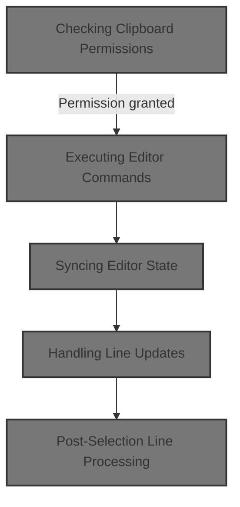
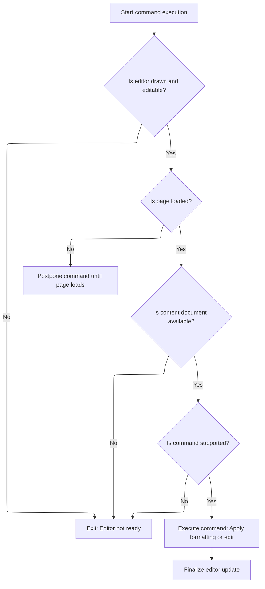
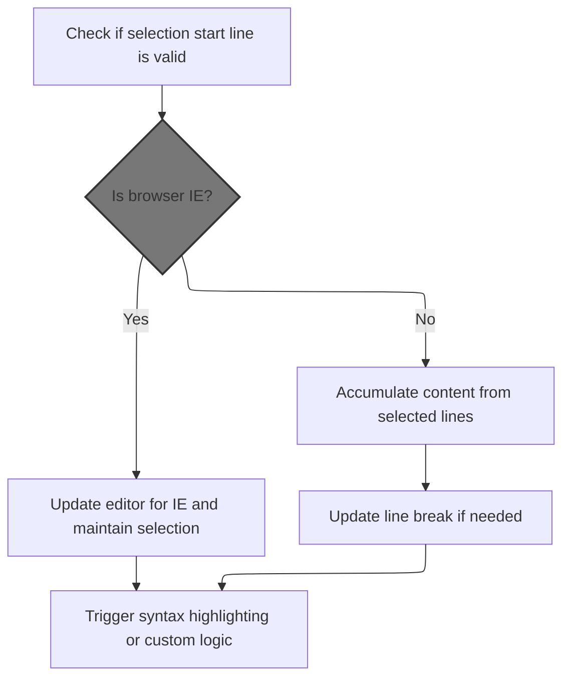
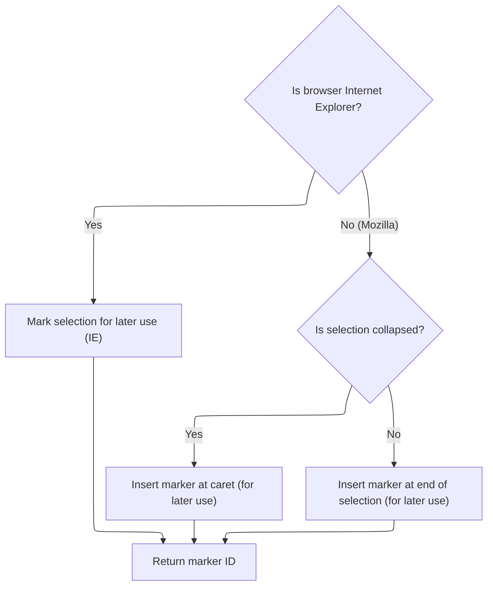
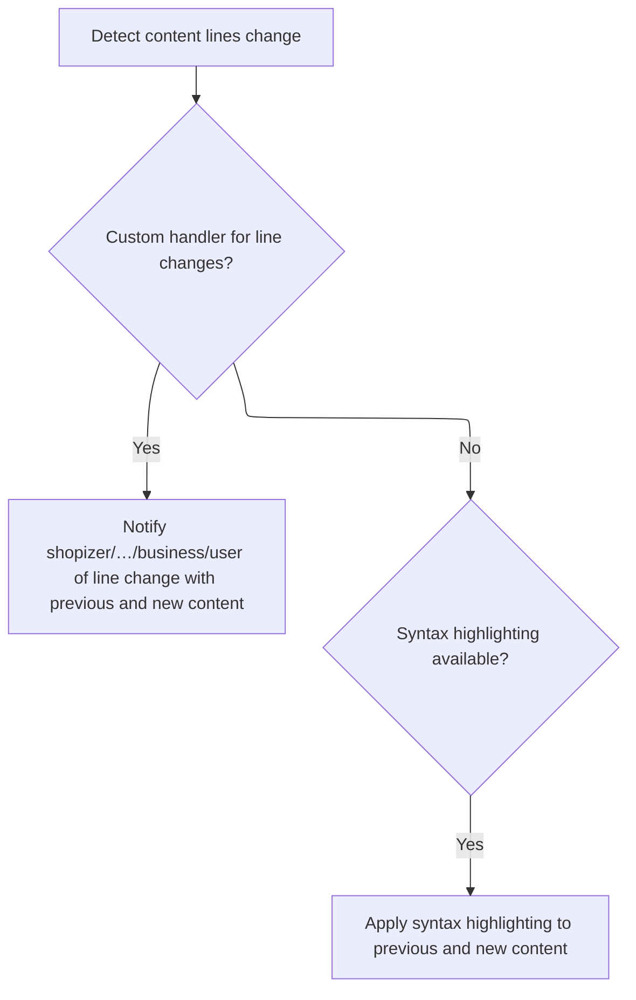
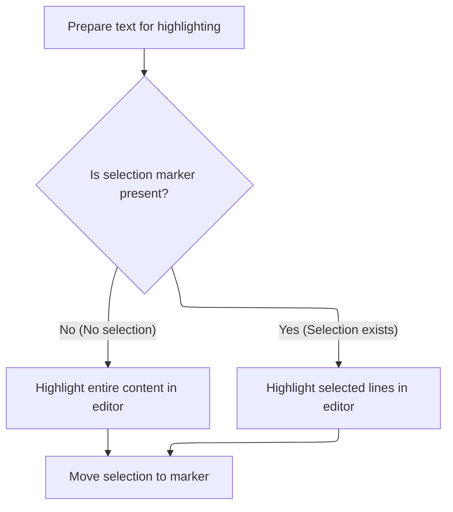

This document describes how the rich text editor enables users to cut selected content, ensuring clipboard permissions are respected and the editor remains consistent. The flow checks for permission, executes the cut, updates the editor state, manages selection, and applies syntax highlighting.



# Checking Clipboard Permissions

This section governs whether a user can perform a 'cut' operation in the rich text editor, based on clipboard permissions. It ensures that clipboard actions are only performed when permitted, and provides user feedback when they are not.

| Category        | Rule Name                       | Description                                                                                 |
| --------------- | ------------------------------- | ------------------------------------------------------------------------------------------- |
| Data validation | Clipboard Permission Validation | The 'cut' operation must only proceed if clipboard permissions explicitly allow the action. |

<SwmSnippet path="/shopizer/sm-shop/src/main/webapp/resources/smart-client/system/modules/ISC_RichTextEditor.js" line="170">

---

CutSelection kicks off the flow by checking if the 'cut' operation is allowed using $230('cut'). If not, it shows an error. We call $230 next because we need to know if the clipboard action is permitted before doing anything else. The method name is internal and not self-explanatory, so you have to know the repo to understand what it's checking.

```javascript
,isc.A.cutSelection=function isc_RichTextCanvas_cutSelection(){if(this.$230("cut")==false)this.showClipboardDisabledError();}
```

---

</SwmSnippet>

# Executing Editor Commands



This section governs how and when editor commands can be executed in the Shopizer rich text editor, ensuring that commands are only run when the editor is in a valid state and that the editor UI is updated after changes.

| Category        | Rule Name                     | Description                                                                                                                                      |
| --------------- | ----------------------------- | ------------------------------------------------------------------------------------------------------------------------------------------------ |
| Data validation | Editor readiness requirement  | Editor commands can only be executed if the editor is both drawn and editable. If either condition is not met, the command will not be executed. |
| Data validation | Content document availability | Editor commands require the content document to be available. If the content document is not accessible, the command will not be executed.       |
| Data validation | Supported command enforcement | Only supported commands can be executed. If a command is not recognized or supported by the editor, it will not be executed.                     |
| Business logic  | Page load postponement        | If the page is not fully loaded, editor commands are postponed and will be executed once the page has finished loading.                          |
| Business logic  | Editor state synchronization  | After a command is executed, the editor's state and UI must be updated to reflect the changes made by the command.                               |

<SwmSnippet path="/shopizer/sm-shop/src/main/webapp/resources/smart-client/system/modules/ISC_RichTextEditor.js" line="158">

---

$230 handles running editor commands like 'cut' after checking if the editor is ready and editable. It focuses the editor, runs the command, and then calls <SwmToken path="shopizer/sm-shop/src/main/webapp/resources/smart-client/system/modules/ISC_RichTextEditor.js" pos="77:39:40" line-data=",isc.A.$23k=function isc_RichTextCanvas__queueContentsChanged(){if(!this.$23m){this.$23m=true;if(!this.$23n)this.$23n=&quot;$23o&quot;;isc.Page.setEvent(isc.EH.IDLE,this,isc.Page.FIRE_ONCE,this.$23n)}}">`$23o`</SwmToken> to update the editor's state and UI. <SwmToken path="shopizer/sm-shop/src/main/webapp/resources/smart-client/system/modules/ISC_RichTextEditor.js" pos="77:39:40" line-data=",isc.A.$23k=function isc_RichTextCanvas__queueContentsChanged(){if(!this.$23m){this.$23m=true;if(!this.$23n)this.$23n=&quot;$23o&quot;;isc.Page.setEvent(isc.EH.IDLE,this,isc.Page.FIRE_ONCE,this.$23n)}}">`$23o`</SwmToken> is next because we need to sync the editor after making changes.

```javascript
,isc.A.$230=function isc_RichTextCanvas__execCommand(_1,_2){if(!this.isDrawn()||!this.editable)return;if(!isc.Page.isLoaded()){this.logWarn("Unsupported attempt to manipulate RichTextCanvas content style "+"before page load: postponed until the page has done loading.");isc.Page.setEvent("Load",this.getID()+".$230('"+_1+"','"+_2+"');");return}
this.focus();var _3=this.$22y(),_4=_3?this.getContentDocument():document;if(!_4)return;if(!this.$231(_1))return false;try{_4.execCommand(_1,false,_2)}catch(e){return false}
if(_3){var _5=this.getContentWindow();_5.focus()}else{this.$223()}
this.$23o()}
```

---

</SwmSnippet>

# Syncing Editor State

```mermaid
%%{init: {"flowchart": {"defaultRenderer": "elk"}} }%%
flowchart TD
  node1["Detect content change in editor"]
  click node1 openCode "shopizer/sm-shop/src/main/webapp/resources/smart-client/system/modules/ISC_RichTextEditor.js:78:78"
  node1 --> node2{"Has the editor's content changed?"}
  click node2 openCode "shopizer/sm-shop/src/main/webapp/resources/smart-client/system/modules/ISC_RichTextEditor.js:78:78"
  node2 -->|"No"| node7["Do nothing"]
  click node7 openCode "shopizer/sm-shop/src/main/webapp/resources/smart-client/system/modules/ISC_RichTextEditor.js:78:78"
  node2 -->|"Yes"| node3{"Is selection collapsed (no text selected)?"}
  click node3 openCode "shopizer/sm-shop/src/main/webapp/resources/smart-client/system/modules/ISC_RichTextEditor.js:78:78"
  node3 -->|"Yes"| node4["Update line count"]
  click node4 openCode "shopizer/sm-shop/src/main/webapp/resources/smart-client/system/modules/ISC_RichTextEditor.js:78:78"
  node3 -->|"No"| node6["Adjust editor overflow"]
  click node6 openCode "shopizer/sm-shop/src/main/webapp/resources/smart-client/system/modules/ISC_RichTextEditor.js:78:78"
  node4 --> node6
  node6 --> node8{"Is a change listener present?"}
  click node8 openCode "shopizer/sm-shop/src/main/webapp/resources/smart-client/system/modules/ISC_RichTextEditor.js:78:78"
  node8 -->|"Yes"| node9["Notify listeners of content change"]
  click node9 openCode "shopizer/sm-shop/src/main/webapp/resources/smart-client/system/modules/ISC_RichTextEditor.js:78:78"
  node8 -->|"No"| node11["Update editor contents"]
  click node11 openCode "shopizer/sm-shop/src/main/webapp/resources/smart-client/system/modules/ISC_RichTextEditor.js:78:78"
  node9 --> node11

classDef HeadingStyle fill:#777777,stroke:#333,stroke-width:2px;

%% Swimm:
%% %%{init: {"flowchart": {"defaultRenderer": "elk"}} }%%
%% flowchart TD
%%   node1["Detect content change in editor"]
%%   click node1 openCode "<SwmPath>[shopizer/…/modules/ISC_RichTextEditor.js](shopizer/sm-shop/src/main/webapp/resources/smart-client/system/modules/ISC_RichTextEditor.js)</SwmPath>:78:78"
%%   node1 --> node2{"Has the editor's content changed?"}
%%   click node2 openCode "<SwmPath>[shopizer/…/modules/ISC_RichTextEditor.js](shopizer/sm-shop/src/main/webapp/resources/smart-client/system/modules/ISC_RichTextEditor.js)</SwmPath>:78:78"
%%   node2 -->|"No"| node7["Do nothing"]
%%   click node7 openCode "<SwmPath>[shopizer/…/modules/ISC_RichTextEditor.js](shopizer/sm-shop/src/main/webapp/resources/smart-client/system/modules/ISC_RichTextEditor.js)</SwmPath>:78:78"
%%   node2 -->|"Yes"| node3{"Is selection collapsed (no text selected)?"}
%%   click node3 openCode "<SwmPath>[shopizer/…/modules/ISC_RichTextEditor.js](shopizer/sm-shop/src/main/webapp/resources/smart-client/system/modules/ISC_RichTextEditor.js)</SwmPath>:78:78"
%%   node3 -->|"Yes"| node4["Update line count"]
%%   click node4 openCode "<SwmPath>[shopizer/…/modules/ISC_RichTextEditor.js](shopizer/sm-shop/src/main/webapp/resources/smart-client/system/modules/ISC_RichTextEditor.js)</SwmPath>:78:78"
%%   node3 -->|"No"| node6["Adjust editor overflow"]
%%   click node6 openCode "<SwmPath>[shopizer/…/modules/ISC_RichTextEditor.js](shopizer/sm-shop/src/main/webapp/resources/smart-client/system/modules/ISC_RichTextEditor.js)</SwmPath>:78:78"
%%   node4 --> node6
%%   node6 --> node8{"Is a change listener present?"}
%%   click node8 openCode "<SwmPath>[shopizer/…/modules/ISC_RichTextEditor.js](shopizer/sm-shop/src/main/webapp/resources/smart-client/system/modules/ISC_RichTextEditor.js)</SwmPath>:78:78"
%%   node8 -->|"Yes"| node9["Notify listeners of content change"]
%%   click node9 openCode "<SwmPath>[shopizer/…/modules/ISC_RichTextEditor.js](shopizer/sm-shop/src/main/webapp/resources/smart-client/system/modules/ISC_RichTextEditor.js)</SwmPath>:78:78"
%%   node8 -->|"No"| node11["Update editor contents"]
%%   click node11 openCode "<SwmPath>[shopizer/…/modules/ISC_RichTextEditor.js](shopizer/sm-shop/src/main/webapp/resources/smart-client/system/modules/ISC_RichTextEditor.js)</SwmPath>:78:78"
%%   node9 --> node11
%% 
%% classDef HeadingStyle fill:#777777,stroke:#333,stroke-width:<SwmToken path="shopizer/sm-shop/src/main/webapp/resources/js/bootstrap/jquery.js" pos="1470:10:10" line-data="		div.style.width = &quot;2px&quot;;">`2px`</SwmToken>;
```



This section ensures that the editor's state remains consistent and up-to-date whenever the content changes. It manages how the editor responds to content changes, including updating line counts, handling overflow, and notifying any registered listeners.

| Category        | Rule Name                                | Description                                                                                                                                                                    |
| --------------- | ---------------------------------------- | ------------------------------------------------------------------------------------------------------------------------------------------------------------------------------ |
| Data validation | No Change, No Action                     | If the editor's content has not changed, no further action is taken and the editor state remains unchanged.                                                                    |
| Business logic  | Line Count Update on Collapsed Selection | If the editor's content has changed and the selection is collapsed (no text is selected), the editor must update the line count to reflect any changes in the number of lines. |
| Business logic  | Adjust Editor Overflow on Change         | Whenever the editor's content changes, the editor must adjust its overflow settings to ensure the content is displayed correctly within the editor boundaries.                 |
| Business logic  | Notify Change Listeners                  | If a change listener is registered, the editor must notify all listeners of the content change, providing both the previous and new content values.                            |
| Business logic  | Update Editor Content State              | If no change listener is registered, the editor must still update its internal content state to reflect the latest changes.                                                    |

<SwmSnippet path="/shopizer/sm-shop/src/main/webapp/resources/smart-client/system/modules/ISC_RichTextEditor.js" line="78">

---

<SwmToken path="shopizer/sm-shop/src/main/webapp/resources/smart-client/system/modules/ISC_RichTextEditor.js" pos="77:39:40" line-data=",isc.A.$23k=function isc_RichTextCanvas__queueContentsChanged(){if(!this.$23m){this.$23m=true;if(!this.$23n)this.$23n=&quot;$23o&quot;;isc.Page.setEvent(isc.EH.IDLE,this,isc.Page.FIRE_ONCE,this.$23n)}}">`$23o`</SwmToken> checks if the content actually changed, and if so, calls <SwmToken path="shopizer/sm-shop/src/main/webapp/resources/smart-client/system/modules/ISC_RichTextEditor.js" pos="78:57:57" line-data=",isc.A.$23o=function isc_RichTextCanvas__contentsChanged(){delete this.$23m;var _1=this.contents,_2=this.getContents();if(_1==_2)return;if(this.countLines&amp;&amp;this.selectionIsCollapsed())this.doLinesChanged(_1,_2);this.adjustOverflow(&quot;edited&quot;);if(this.changed!=null)this.changed(_1,_2);this.contents=_2}">`doLinesChanged`</SwmToken> if line tracking is enabled and the selection is collapsed. This is where we handle line-specific updates after a content change. We call <SwmToken path="shopizer/sm-shop/src/main/webapp/resources/smart-client/system/modules/ISC_RichTextEditor.js" pos="78:57:57" line-data=",isc.A.$23o=function isc_RichTextCanvas__contentsChanged(){delete this.$23m;var _1=this.contents,_2=this.getContents();if(_1==_2)return;if(this.countLines&amp;&amp;this.selectionIsCollapsed())this.doLinesChanged(_1,_2);this.adjustOverflow(&quot;edited&quot;);if(this.changed!=null)this.changed(_1,_2);this.contents=_2}">`doLinesChanged`</SwmToken> next to process any line changes that happened.

```javascript
,isc.A.$23o=function isc_RichTextCanvas__contentsChanged(){delete this.$23m;var _1=this.contents,_2=this.getContents();if(_1==_2)return;if(this.countLines&&this.selectionIsCollapsed())this.doLinesChanged(_1,_2);this.adjustOverflow("edited");if(this.changed!=null)this.changed(_1,_2);this.contents=_2}
```

---

</SwmSnippet>

# Handling Line Updates



The main product role of this section is to ensure that any changes to lines in the rich text editor are accurately reflected, regardless of browser, and that the user's selection and editor content remain consistent and correctly formatted.

| Category        | Rule Name                        | Description                                                                                                                                       |
| --------------- | -------------------------------- | ------------------------------------------------------------------------------------------------------------------------------------------------- |
| Data validation | Selection Start Line Validation  | If the selection start line is not valid, no update to the editor should occur and the process should terminate.                                  |
| Business logic  | IE Browser Quirk Handling        | If the browser is Internet Explorer, the editor must handle line updates using IE-specific logic to maintain selection and content integrity.     |
| Business logic  | Accumulate Selected Line Content | When updating lines, the editor must accumulate the content from all selected lines to ensure the displayed content matches the user's selection. |
| Business logic  | Line Break Preservation          | If a line break is needed due to the update, the editor must insert or update the line break to preserve formatting.                              |
| Business logic  | Post-Update Highlighting         | After updating lines, the editor must trigger syntax highlighting or any custom logic required to reflect the new content state.                  |

<SwmSnippet path="/shopizer/sm-shop/src/main/webapp/resources/smart-client/system/modules/ISC_RichTextEditor.js" line="82">

---

DoLinesChanged figures out which lines changed, handles IE quirks, and then calls <SwmToken path="shopizer/sm-shop/src/main/webapp/resources/smart-client/system/modules/ISC_RichTextEditor.js" pos="82:59:59" line-data=",isc.A.doLinesChanged=function isc_RichTextCanvas_doLinesChanged(_1,_2){var _3=this.getLastSelectionStartLine();if(_3==null)return;var _4=this.getLine(_3);var _5=isc.emptyString;var _6=this.markCurrentSelection();if(isc.Browser.isIE){if(!_4){this.getLineContainer().innerHTML=isc.emptyString;var _7=this.createLine();this.getLineContainer().appendChild(_7);var _8=document.selection.createRange();_8.moveToElementText(_7);_8.collapse();_8.select();_6=this.markCurrentSelection();_3=0;_4=this.getLine(0)}">`markCurrentSelection`</SwmToken> to drop a marker at the selection.

```javascript
,isc.A.doLinesChanged=function isc_RichTextCanvas_doLinesChanged(_1,_2){var _3=this.getLastSelectionStartLine();if(_3==null)return;var _4=this.getLine(_3);var _5=isc.emptyString;var _6=this.markCurrentSelection();if(isc.Browser.isIE){if(!_4){this.getLineContainer().innerHTML=isc.emptyString;var _7=this.createLine();this.getLineContainer().appendChild(_7);var _8=document.selection.createRange();_8.moveToElementText(_7);_8.collapse();_8.select();_6=this.markCurrentSelection();_3=0;_4=this.getLine(0)}
_5=_4.innerHTML}else{var _9=this.getSelectionStartLine();var _10=this.getLineNumber(_9);if(_10<_3){_4=_9;_3=_10}
var _11=_4;var _12=0;while(_11&&_11!=_9){if(_11.innerHTML){_5+=_11.innerHTML}
_12++;_11=_11.nextSibling}
```

---

</SwmSnippet>

## Marking the Selection



This section is responsible for marking the user's current selection in the rich text editor, ensuring compatibility across different browsers and selection states. The marker enables future operations on the selected text, such as formatting or manipulation.

| Category       | Rule Name                  | Description                                                                                                              |
| -------------- | -------------------------- | ------------------------------------------------------------------------------------------------------------------------ |
| Business logic | Collapsed Selection Marker | If the selection is collapsed (caret only), the marker must be inserted at the caret position.                           |
| Business logic | Range Selection Marker     | If the selection is not collapsed, the marker must be inserted at the end of the selection range.                        |
| Business logic | Unique Marker ID           | A unique marker ID must be generated and returned for each marked selection, enabling future reference and manipulation. |

<SwmSnippet path="/shopizer/sm-shop/src/main/webapp/resources/smart-client/system/modules/ISC_RichTextEditor.js" line="115">

---

MarkCurrentSelection drops a marker at the current selection using browser-specific APIs. For IE, it uses <SwmToken path="shopizer/sm-shop/src/main/webapp/resources/smart-client/system/modules/ISC_RichTextEditor.js" pos="115:62:62" line-data=",isc.A.markCurrentSelection=function isc_RichTextCanvas_markCurrentSelection(){var _1=this.$23y();var _2=this.getContentDocument();if(isc.Browser.isIE){var _3=_2.selection.createRange();_3.collapse();_3.pasteHTML(this.$23p(_1))}else if(isc.Browser.isMoz){var _4=_2.createElement(&quot;span&quot;);_4.setAttribute(&#39;isSelectionSpan&#39;,&quot;true&quot;);_4.setAttribute(&#39;id&#39;,_1);var _5=this.getContentWindow().getSelection();var _3=_5.getRangeAt(0);if(_5.isCollapsed){_3.insertNode(_4)}else{var _6=_3.cloneRange();_6.collapse(false);_6.insertNode(_4);_6.detach()}}">`pasteHTML`</SwmToken>; for Mozilla, it creates a span and inserts it at the selection. If the selection isn't collapsed, it clones and collapses the range before inserting, then detaches the range. Next up is <SwmToken path="shopizer/sm-shop/src/main/webapp/resources/js/bootstrap/jquery.js" pos="5789:10:10" line-data="			if ( !selector || jQuery.filter( selector, [ elem ] ).length ) {">`jQuery`</SwmToken>'s detach, which is used to clean up the inserted marker node if needed.

```javascript
,isc.A.markCurrentSelection=function isc_RichTextCanvas_markCurrentSelection(){var _1=this.$23y();var _2=this.getContentDocument();if(isc.Browser.isIE){var _3=_2.selection.createRange();_3.collapse();_3.pasteHTML(this.$23p(_1))}else if(isc.Browser.isMoz){var _4=_2.createElement("span");_4.setAttribute('isSelectionSpan',"true");_4.setAttribute('id',_1);var _5=this.getContentWindow().getSelection();var _3=_5.getRangeAt(0);if(_5.isCollapsed){_3.insertNode(_4)}else{var _6=_3.cloneRange();_6.collapse(false);_6.insertNode(_4);_6.detach()}}
return _1}
```

---

</SwmSnippet>

## Detaching DOM Elements

The 'Detaching DOM Elements' section allows users to remove elements from the page while preserving any associated data and event handlers. This is useful for temporarily removing elements without losing their state or event bindings.

| Category        | Rule Name              | Description                                                                                                                                                 |
| --------------- | ---------------------- | ----------------------------------------------------------------------------------------------------------------------------------------------------------- |
| Data validation | Targeted detachment    | Only the selected elements specified by the selector should be detached; no other elements should be affected.                                              |
| Business logic  | Preserve element state | When detaching an element, all associated data and event handlers must be preserved so that they can be restored if the element is reinserted into the DOM. |

<SwmSnippet path="/shopizer/sm-shop/src/main/webapp/resources/js/bootstrap/jquery.js" line="5904">

---

Detach removes the selected element from the DOM but keeps its data and events. It calls remove with <SwmToken path="shopizer/sm-shop/src/main/webapp/resources/js/bootstrap/jquery.js" pos="5787:10:10" line-data="	remove: function( selector, keepData ) {">`keepData`</SwmToken>=true. Next, we look at remove to see how the actual DOM removal and data handling works.

```javascript
	detach: function( selector ) {
		return this.remove( selector, true );
	},
```

---

</SwmSnippet>

## Removing Elements and Data

```mermaid
%%{init: {"flowchart": {"defaultRenderer": "elk"}} }%%
flowchart TD
    node1["Start removal process"]
    click node1 openCode "shopizer/sm-shop/src/main/webapp/resources/js/bootstrap/jquery.js:5787:5788"
    subgraph loop1["For each element"]
        node1 --> node2{"Matches selector or no selector?"}
        click node2 openCode "shopizer/sm-shop/src/main/webapp/resources/js/bootstrap/jquery.js:5788:5789"
        node2 -->|"Yes"| node3{"Should clean associated data?"}
        click node3 openCode "shopizer/sm-shop/src/main/webapp/resources/js/bootstrap/jquery.js:5790:5793"
        node3 -->|"Yes"| node4["Clean associated data"]
        click node4 openCode "shopizer/sm-shop/src/main/webapp/resources/js/bootstrap/jquery.js:5791:5792"
        node3 -->|"No"| node5
        node4 --> node6{"Has parent node?"}
        click node6 openCode "shopizer/sm-shop/src/main/webapp/resources/js/bootstrap/jquery.js:5795:5797"
        node5 --> node6
        node6 -->|"Yes"| node7["Remove element from page"]
        click node7 openCode "shopizer/sm-shop/src/main/webapp/resources/js/bootstrap/jquery.js:5796:5797"
        node6 -->|"No"| node1
        node2 -->|"No"| node1
        node7 --> node1
    end
    node1 --> node8["Return updated collection"]
    click node8 openCode "shopizer/sm-shop/src/main/webapp/resources/js/bootstrap/jquery.js:5801:5802"

classDef HeadingStyle fill:#777777,stroke:#333,stroke-width:2px;

%% Swimm:
%% %%{init: {"flowchart": {"defaultRenderer": "elk"}} }%%
%% flowchart TD
%%     node1["Start removal process"]
%%     click node1 openCode "<SwmPath>[shopizer/…/bootstrap/jquery.js](shopizer/sm-shop/src/main/webapp/resources/js/bootstrap/jquery.js)</SwmPath>:5787:5788"
%%     subgraph loop1["For each element"]
%%         node1 --> node2{"Matches selector or no selector?"}
%%         click node2 openCode "<SwmPath>[shopizer/…/bootstrap/jquery.js](shopizer/sm-shop/src/main/webapp/resources/js/bootstrap/jquery.js)</SwmPath>:5788:5789"
%%         node2 -->|"Yes"| node3{"Should clean associated data?"}
%%         click node3 openCode "<SwmPath>[shopizer/…/bootstrap/jquery.js](shopizer/sm-shop/src/main/webapp/resources/js/bootstrap/jquery.js)</SwmPath>:5790:5793"
%%         node3 -->|"Yes"| node4["Clean associated data"]
%%         click node4 openCode "<SwmPath>[shopizer/…/bootstrap/jquery.js](shopizer/sm-shop/src/main/webapp/resources/js/bootstrap/jquery.js)</SwmPath>:5791:5792"
%%         node3 -->|"No"| node5
%%         node4 --> node6{"Has parent node?"}
%%         click node6 openCode "<SwmPath>[shopizer/…/bootstrap/jquery.js](shopizer/sm-shop/src/main/webapp/resources/js/bootstrap/jquery.js)</SwmPath>:5795:5797"
%%         node5 --> node6
%%         node6 -->|"Yes"| node7["Remove element from page"]
%%         click node7 openCode "<SwmPath>[shopizer/…/bootstrap/jquery.js](shopizer/sm-shop/src/main/webapp/resources/js/bootstrap/jquery.js)</SwmPath>:5796:5797"
%%         node6 -->|"No"| node1
%%         node2 -->|"No"| node1
%%         node7 --> node1
%%     end
%%     node1 --> node8["Return updated collection"]
%%     click node8 openCode "<SwmPath>[shopizer/…/bootstrap/jquery.js](shopizer/sm-shop/src/main/webapp/resources/js/bootstrap/jquery.js)</SwmPath>:5801:5802"
%% 
%% classDef HeadingStyle fill:#777777,stroke:#333,stroke-width:<SwmToken path="shopizer/sm-shop/src/main/webapp/resources/js/bootstrap/jquery.js" pos="1470:10:10" line-data="		div.style.width = &quot;2px&quot;;">`2px`</SwmToken>;
```



This section governs how elements are removed from the storefront page, including whether their associated data and events are also cleaned up, ensuring the integrity of the page and preventing memory leaks.

| Category        | Rule Name                          | Description                                                                                                                                                                                                                                                                                                           |
| --------------- | ---------------------------------- | --------------------------------------------------------------------------------------------------------------------------------------------------------------------------------------------------------------------------------------------------------------------------------------------------------------------- |
| Data validation | Selector-based removal eligibility | Only elements that match the provided selector, or all elements if no selector is specified, are eligible for removal.                                                                                                                                                                                                |
| Data validation | Parent node removal condition      | Elements can only be removed from the page if they have a parent node.                                                                                                                                                                                                                                                |
| Business logic  | Data and event cleanup requirement | If the <SwmToken path="shopizer/sm-shop/src/main/webapp/resources/js/bootstrap/jquery.js" pos="5787:10:10" line-data="	remove: function( selector, keepData ) {">`keepData`</SwmToken> flag is set to false and the element is a standard HTML element, all associated data and events must be cleaned before removal. |
| Business logic  | Return updated collection          | After processing all eligible elements, the updated collection must be returned to reflect the current state of the page.                                                                                                                                                                                             |

<SwmSnippet path="/shopizer/sm-shop/src/main/webapp/resources/js/bootstrap/jquery.js" line="5787">

---

Remove loops through the elements, checks if they match the selector, and if <SwmToken path="shopizer/sm-shop/src/main/webapp/resources/js/bootstrap/jquery.js" pos="5787:10:10" line-data="	remove: function( selector, keepData ) {">`keepData`</SwmToken> is false, it calls <SwmToken path="shopizer/sm-shop/src/main/webapp/resources/js/bootstrap/jquery.js" pos="5791:3:3" line-data="					jQuery.cleanData( elem.getElementsByTagName(&quot;*&quot;) );">`cleanData`</SwmToken> to wipe out data and events before removing the node from the DOM. Next, <SwmToken path="shopizer/sm-shop/src/main/webapp/resources/js/bootstrap/jquery.js" pos="5791:3:3" line-data="					jQuery.cleanData( elem.getElementsByTagName(&quot;*&quot;) );">`cleanData`</SwmToken> does the actual data and event cleanup.

```javascript
	remove: function( selector, keepData ) {
		for ( var i = 0, elem; (elem = this[i]) != null; i++ ) {
			if ( !selector || jQuery.filter( selector, [ elem ] ).length ) {
				if ( !keepData && elem.nodeType === 1 ) {
					jQuery.cleanData( elem.getElementsByTagName("*") );
					jQuery.cleanData( [ elem ] );
				}

				if ( elem.parentNode ) {
					elem.parentNode.removeChild( elem );
				}
			}
		}

		return this;
	},
```

---

</SwmSnippet>

## Cleaning Up Data and Events

This section is responsible for ensuring that all cached data and event handlers are properly removed from DOM elements before they are discarded or reused. This is critical for preventing memory leaks and ensuring that no unwanted behavior persists after elements are removed from the DOM.

| Category        | Rule Name                                                                                                                                                                                                                      | Description                                                                                                                                                                                                                                                                                                                                                 |
| --------------- | ------------------------------------------------------------------------------------------------------------------------------------------------------------------------------------------------------------------------------ | ----------------------------------------------------------------------------------------------------------------------------------------------------------------------------------------------------------------------------------------------------------------------------------------------------------------------------------------------------------- |
| Data validation | Skip <SwmToken path="shopizer/sm-shop/src/main/webapp/resources/js/bootstrap/jquery.js" pos="6372:13:13" line-data="			if ( elem.nodeName &amp;&amp; jQuery.noData[elem.nodeName.toLowerCase()] ) {">`noData`</SwmToken> elements | DOM elements that are listed in the <SwmToken path="shopizer/sm-shop/src/main/webapp/resources/js/bootstrap/jquery.js" pos="6372:13:13" line-data="			if ( elem.nodeName &amp;&amp; jQuery.noData[elem.nodeName.toLowerCase()] ) {">`noData`</SwmToken> configuration must not have their data or events cleaned up, and should be skipped during the process. |
| Business logic  | Remove all event handlers                                                                                                                                                                                                      | All event handlers attached to a DOM element must be removed before the element is discarded or reused, to prevent memory leaks and unintended behavior.                                                                                                                                                                                                    |
| Business logic  | Special event cleanup                                                                                                                                                                                                          | If a DOM element has a special event type, the corresponding specialized removal logic must be applied to ensure proper cleanup.                                                                                                                                                                                                                            |
| Business logic  | Calendar event refresh                                                                                                                                                                                                         | Calendar-related events tied to DOM elements must be removed or refreshed after general event cleanup to ensure calendar functionality remains accurate and up-to-date.                                                                                                                                                                                     |

<SwmSnippet path="/shopizer/sm-shop/src/main/webapp/resources/js/bootstrap/jquery.js" line="6365">

---

In <SwmToken path="shopizer/sm-shop/src/main/webapp/resources/js/bootstrap/jquery.js" pos="6365:1:1" line-data="	cleanData: function( elems ) {">`cleanData`</SwmToken>, we loop through the elements, skip nodes that shouldn't have data, and use <SwmToken path="shopizer/sm-shop/src/main/webapp/resources/js/bootstrap/jquery.js" pos="6376:8:10" line-data="			id = elem[ jQuery.expando ];">`jQuery.expando`</SwmToken> to find any cached data. If there are events, we remove them, either with a shortcut or by calling <SwmToken path="shopizer/sm-shop/src/main/webapp/resources/js/bootstrap/jquery.js" pos="6388:3:3" line-data="							jQuery.removeEvent( elem, type, data.handle );">`removeEvent`</SwmToken>. Next, we go into <SwmToken path="shopizer/sm-shop/src/main/webapp/resources/js/bootstrap/jquery.js" pos="6388:3:3" line-data="							jQuery.removeEvent( elem, type, data.handle );">`removeEvent`</SwmToken> to see how event handlers are actually detached.

```javascript
	cleanData: function( elems ) {
		var data, id,
			cache = jQuery.cache,
			special = jQuery.event.special,
			deleteExpando = jQuery.support.deleteExpando;

		for ( var i = 0, elem; (elem = elems[i]) != null; i++ ) {
			if ( elem.nodeName && jQuery.noData[elem.nodeName.toLowerCase()] ) {
				continue;
			}

			id = elem[ jQuery.expando ];

			if ( id ) {
				data = cache[ id ];

				if ( data && data.events ) {
					for ( var type in data.events ) {
						if ( special[ type ] ) {
							jQuery.event.remove( elem, type );

```

---

</SwmSnippet>

<SwmSnippet path="/shopizer/sm-shop/src/main/webapp/resources/js/bootstrap/jquery.js" line="6386">

---

We just finished cleaning up data and events with <SwmToken path="shopizer/sm-shop/src/main/webapp/resources/js/bootstrap/jquery.js" pos="6386:15:15" line-data="						// This is a shortcut to avoid jQuery.event.remove&#39;s overhead">`jQuery`</SwmToken>'s <SwmToken path="shopizer/sm-shop/src/main/webapp/resources/js/bootstrap/jquery.js" pos="5791:3:3" line-data="					jQuery.cleanData( elem.getElementsByTagName(&quot;*&quot;) );">`cleanData`</SwmToken>. Now, we need to make sure any calendar-related events tied to those DOM elements are also handled, so we move to the calendar module to remove or refresh those events.

```javascript
						// This is a shortcut to avoid jQuery.event.remove's overhead
						} else {
							jQuery.removeEvent( elem, type, data.handle );
						}
					}

					// Null the DOM reference to avoid IE6/7/8 leak (#7054)
					if ( data.handle ) {
						data.handle.elem = null;
					}
				}

```

---

</SwmSnippet>

### Removing Calendar Events

```mermaid
%%{init: {"flowchart": {"defaultRenderer": "elk"}} }%%
flowchart TD
  node1["Request to remove event"] --> node2{"Is dataSource present?"}
  click node1 openCode "shopizer/sm-shop/src/main/webapp/resources/smart-client/system/modules/ISC_Calendar.js:66:71"
  node2 -->|"Yes"| node3["Remove event from dataSource"]
  click node2 openCode "shopizer/sm-shop/src/main/webapp/resources/smart-client/system/modules/ISC_Calendar.js:71:71"
  node2 -->|"No"| node4["Remove event from local data"]
  click node3 openCode "shopizer/sm-shop/src/main/webapp/resources/smart-client/system/modules/ISC_Calendar.js:71:71"
  click node4 openCode "shopizer/sm-shop/src/main/webapp/resources/smart-client/system/modules/ISC_Calendar.js:71:71"
  node3 --> node5{"Does event affect day, week, or month view?"}
  node4 --> node5
  click node5 openCode "shopizer/sm-shop/src/main/webapp/resources/smart-client/system/modules/ISC_Calendar.js:66:68"
  node5 -->|"Day"| node6["Update day view"]
  node5 -->|"Week"| node7["Update week view"]
  node5 -->|"Month"| node8["Update month view"]
  click node6 openCode "shopizer/sm-shop/src/main/webapp/resources/smart-client/system/modules/ISC_Calendar.js:66:67"
  click node7 openCode "shopizer/sm-shop/src/main/webapp/resources/smart-client/system/modules/ISC_Calendar.js:67:68"
  click node8 openCode "shopizer/sm-shop/src/main/webapp/resources/smart-client/system/modules/ISC_Calendar.js:68:68"
  node6 --> node9{"Is eventAutoArrange true?"}
  node7 --> node9
  node8 --> node9
  click node9 openCode "shopizer/sm-shop/src/main/webapp/resources/smart-client/system/modules/ISC_Calendar.js:69:69"
  node9 -->|"Yes"| node10["Auto-arrange calendar views"]
  click node10 openCode "shopizer/sm-shop/src/main/webapp/resources/smart-client/system/modules/ISC_Calendar.js:69:69"
  node9 -->|"No"| node11["Continue"]
  node10 --> node12{"Is eventRemoved callback defined?"}
  node11 --> node12
  click node12 openCode "shopizer/sm-shop/src/main/webapp/resources/smart-client/system/modules/ISC_Calendar.js:70:70"
  node12 -->|"Yes"| node13["Call eventRemoved callback"]
  click node13 openCode "shopizer/sm-shop/src/main/webapp/resources/smart-client/system/modules/ISC_Calendar.js:70:70"
  node12 -->|"No"| node14["Finish"]
  click node14 openCode "shopizer/sm-shop/src/main/webapp/resources/smart-client/system/modules/ISC_Calendar.js:71:71"
classDef HeadingStyle fill:#777777,stroke:#333,stroke-width:2px;

%% Swimm:
%% %%{init: {"flowchart": {"defaultRenderer": "elk"}} }%%
%% flowchart TD
%%   node1["Request to remove event"] --> node2{"Is <SwmToken path="shopizer/sm-shop/src/main/webapp/resources/smart-client/system/modules/ISC_Calendar.js" pos="71:14:14" line-data="if(_2)this.$53e=true;if(this.dataSource){isc.DataSource.get(this.dataSource).removeData(_1,_6,{componentId:this.ID,oldValues:_1});return}else{this.data.remove(_1);_6()}}">`dataSource`</SwmToken> present?"}
%%   click node1 openCode "<SwmPath>[shopizer/…/modules/ISC_Calendar.js](shopizer/sm-shop/src/main/webapp/resources/smart-client/system/modules/ISC_Calendar.js)</SwmPath>:66:71"
%%   node2 -->|"Yes"| node3["Remove event from <SwmToken path="shopizer/sm-shop/src/main/webapp/resources/smart-client/system/modules/ISC_Calendar.js" pos="71:14:14" line-data="if(_2)this.$53e=true;if(this.dataSource){isc.DataSource.get(this.dataSource).removeData(_1,_6,{componentId:this.ID,oldValues:_1});return}else{this.data.remove(_1);_6()}}">`dataSource`</SwmToken>"]
%%   click node2 openCode "<SwmPath>[shopizer/…/modules/ISC_Calendar.js](shopizer/sm-shop/src/main/webapp/resources/smart-client/system/modules/ISC_Calendar.js)</SwmPath>:71:71"
%%   node2 -->|"No"| node4["Remove event from local data"]
%%   click node3 openCode "<SwmPath>[shopizer/…/modules/ISC_Calendar.js](shopizer/sm-shop/src/main/webapp/resources/smart-client/system/modules/ISC_Calendar.js)</SwmPath>:71:71"
%%   click node4 openCode "<SwmPath>[shopizer/…/modules/ISC_Calendar.js](shopizer/sm-shop/src/main/webapp/resources/smart-client/system/modules/ISC_Calendar.js)</SwmPath>:71:71"
%%   node3 --> node5{"Does event affect day, week, or month view?"}
%%   node4 --> node5
%%   click node5 openCode "<SwmPath>[shopizer/…/modules/ISC_Calendar.js](shopizer/sm-shop/src/main/webapp/resources/smart-client/system/modules/ISC_Calendar.js)</SwmPath>:66:68"
%%   node5 -->|"Day"| node6["Update day view"]
%%   node5 -->|"Week"| node7["Update week view"]
%%   node5 -->|"Month"| node8["Update month view"]
%%   click node6 openCode "<SwmPath>[shopizer/…/modules/ISC_Calendar.js](shopizer/sm-shop/src/main/webapp/resources/smart-client/system/modules/ISC_Calendar.js)</SwmPath>:66:67"
%%   click node7 openCode "<SwmPath>[shopizer/…/modules/ISC_Calendar.js](shopizer/sm-shop/src/main/webapp/resources/smart-client/system/modules/ISC_Calendar.js)</SwmPath>:67:68"
%%   click node8 openCode "<SwmPath>[shopizer/…/modules/ISC_Calendar.js](shopizer/sm-shop/src/main/webapp/resources/smart-client/system/modules/ISC_Calendar.js)</SwmPath>:68:68"
%%   node6 --> node9{"Is <SwmToken path="shopizer/sm-shop/src/main/webapp/resources/smart-client/system/modules/ISC_Calendar.js" pos="69:4:4" line-data="if(_5.eventAutoArrange){if(_5.dayView)_5.dayView.refreshEvents();if(_5.weekView)_5.weekView.refreshEvents()}">`eventAutoArrange`</SwmToken> true?"}
%%   node7 --> node9
%%   node8 --> node9
%%   click node9 openCode "<SwmPath>[shopizer/…/modules/ISC_Calendar.js](shopizer/sm-shop/src/main/webapp/resources/smart-client/system/modules/ISC_Calendar.js)</SwmPath>:69:69"
%%   node9 -->|"Yes"| node10["Auto-arrange calendar views"]
%%   click node10 openCode "<SwmPath>[shopizer/…/modules/ISC_Calendar.js](shopizer/sm-shop/src/main/webapp/resources/smart-client/system/modules/ISC_Calendar.js)</SwmPath>:69:69"
%%   node9 -->|"No"| node11["Continue"]
%%   node10 --> node12{"Is <SwmToken path="shopizer/sm-shop/src/main/webapp/resources/smart-client/system/modules/ISC_Calendar.js" pos="70:4:4" line-data="if(_5.eventRemoved)_5.eventRemoved(_1)}">`eventRemoved`</SwmToken> callback defined?"}
%%   node11 --> node12
%%   click node12 openCode "<SwmPath>[shopizer/…/modules/ISC_Calendar.js](shopizer/sm-shop/src/main/webapp/resources/smart-client/system/modules/ISC_Calendar.js)</SwmPath>:70:70"
%%   node12 -->|"Yes"| node13["Call <SwmToken path="shopizer/sm-shop/src/main/webapp/resources/smart-client/system/modules/ISC_Calendar.js" pos="70:4:4" line-data="if(_5.eventRemoved)_5.eventRemoved(_1)}">`eventRemoved`</SwmToken> callback"]
%%   click node13 openCode "<SwmPath>[shopizer/…/modules/ISC_Calendar.js](shopizer/sm-shop/src/main/webapp/resources/smart-client/system/modules/ISC_Calendar.js)</SwmPath>:70:70"
%%   node12 -->|"No"| node14["Finish"]
%%   click node14 openCode "<SwmPath>[shopizer/…/modules/ISC_Calendar.js](shopizer/sm-shop/src/main/webapp/resources/smart-client/system/modules/ISC_Calendar.js)</SwmPath>:71:71"
%% classDef HeadingStyle fill:#777777,stroke:#333,stroke-width:<SwmToken path="shopizer/sm-shop/src/main/webapp/resources/js/bootstrap/jquery.js" pos="1470:10:10" line-data="		div.style.width = &quot;2px&quot;;">`2px`</SwmToken>;
```



This section governs the removal of calendar events, ensuring that events are deleted from the correct source and that all affected calendar views are updated accordingly. It also supports optional auto-arrangement and callback notification after removal.

| Category       | Rule Name                                                                                                                                                                                                                                                                                                                                             | Description                                                                                                                                                                                                                                                                                                                                                                                                                                                                                                                                                                                                                                                                                                                                                                     |
| -------------- | ----------------------------------------------------------------------------------------------------------------------------------------------------------------------------------------------------------------------------------------------------------------------------------------------------------------------------------------------------- | ------------------------------------------------------------------------------------------------------------------------------------------------------------------------------------------------------------------------------------------------------------------------------------------------------------------------------------------------------------------------------------------------------------------------------------------------------------------------------------------------------------------------------------------------------------------------------------------------------------------------------------------------------------------------------------------------------------------------------------------------------------------------------- |
| Business logic | <SwmToken path="shopizer/sm-shop/src/main/webapp/resources/smart-client/system/modules/ISC_Calendar.js" pos="71:19:19" line-data="if(_2)this.$53e=true;if(this.dataSource){isc.DataSource.get(this.dataSource).removeData(_1,_6,{componentId:this.ID,oldValues:_1});return}else{this.data.remove(_1);_6()}}">`DataSource`</SwmToken> Removal Priority | If the event is associated with a <SwmToken path="shopizer/sm-shop/src/main/webapp/resources/smart-client/system/modules/ISC_Calendar.js" pos="71:14:14" line-data="if(_2)this.$53e=true;if(this.dataSource){isc.DataSource.get(this.dataSource).removeData(_1,_6,{componentId:this.ID,oldValues:_1});return}else{this.data.remove(_1);_6()}}">`dataSource`</SwmToken>, the event must be removed from the <SwmToken path="shopizer/sm-shop/src/main/webapp/resources/smart-client/system/modules/ISC_Calendar.js" pos="71:14:14" line-data="if(_2)this.$53e=true;if(this.dataSource){isc.DataSource.get(this.dataSource).removeData(_1,_6,{componentId:this.ID,oldValues:_1});return}else{this.data.remove(_1);_6()}}">`dataSource`</SwmToken> before updating calendar views. |
| Business logic | Local Data Removal                                                                                                                                                                                                                                                                                                                                    | If the event is not associated with a <SwmToken path="shopizer/sm-shop/src/main/webapp/resources/smart-client/system/modules/ISC_Calendar.js" pos="71:14:14" line-data="if(_2)this.$53e=true;if(this.dataSource){isc.DataSource.get(this.dataSource).removeData(_1,_6,{componentId:this.ID,oldValues:_1});return}else{this.data.remove(_1);_6()}}">`dataSource`</SwmToken>, it must be removed from the local data store.                                                                                                                                                                                                                                                                                                                                                       |
| Business logic | Affected Views Update                                                                                                                                                                                                                                                                                                                                 | After removal, the calendar must update all views (day, week, month) that are affected by the event, based on the event's start and end dates.                                                                                                                                                                                                                                                                                                                                                                                                                                                                                                                                                                                                                                  |
| Business logic | Auto-Arrange After Removal                                                                                                                                                                                                                                                                                                                            | If <SwmToken path="shopizer/sm-shop/src/main/webapp/resources/smart-client/system/modules/ISC_Calendar.js" pos="69:4:4" line-data="if(_5.eventAutoArrange){if(_5.dayView)_5.dayView.refreshEvents();if(_5.weekView)_5.weekView.refreshEvents()}">`eventAutoArrange`</SwmToken> is enabled, the calendar must automatically rearrange events in the day and week views after removal.                                                                                                                                                                                                                                                                                                                                                                                            |
| Business logic | Event Removal Callback                                                                                                                                                                                                                                                                                                                                | If an <SwmToken path="shopizer/sm-shop/src/main/webapp/resources/smart-client/system/modules/ISC_Calendar.js" pos="70:4:4" line-data="if(_5.eventRemoved)_5.eventRemoved(_1)}">`eventRemoved`</SwmToken> callback is defined, it must be called after the event is removed and views are updated.                                                                                                                                                                                                                                                                                                                                                                                                                                                                               |

<SwmSnippet path="/shopizer/sm-shop/src/main/webapp/resources/smart-client/system/modules/ISC_Calendar.js" line="66">

---

RemoveEvent checks which calendar views the event belongs to using internal date checks, then removes or refreshes the event in those views. If there's a <SwmToken path="shopizer/sm-shop/src/main/webapp/resources/smart-client/system/modules/ISC_Calendar.js" pos="71:14:14" line-data="if(_2)this.$53e=true;if(this.dataSource){isc.DataSource.get(this.dataSource).removeData(_1,_6,{componentId:this.ID,oldValues:_1});return}else{this.data.remove(_1);_6()}}">`dataSource`</SwmToken>, it removes the event asynchronously and only updates the views after confirmation. Next, we look at the callback logic that actually does the view updates.

```javascript
,isc.A.removeEvent=function isc_Calendar_removeEvent(_1,_2){if(_2==null)_2=true;var _3=_1[this.startDateField],_4=_1[this.endDateField];var _5=this;var _6=function(){if(_5.$53b(_3,_4)){_5.dayView.removeEvent(_1)}
if(_5.$53c(_3,_4)){_5.weekView.removeEvent(_1)}
if(_5.$53d(_3,_4)){_5.monthView.refreshEvents()}
if(_5.eventAutoArrange){if(_5.dayView)_5.dayView.refreshEvents();if(_5.weekView)_5.weekView.refreshEvents()}
if(_5.eventRemoved)_5.eventRemoved(_1)}
if(_2)this.$53e=true;if(this.dataSource){isc.DataSource.get(this.dataSource).removeData(_1,_6,{componentId:this.ID,oldValues:_1});return}else{this.data.remove(_1);_6()}}
```

---

</SwmSnippet>

<SwmSnippet path="/shopizer/sm-shop/src/main/webapp/resources/smart-client/system/modules/ISC_Calendar.js" line="66">

---

The callback inside <SwmToken path="shopizer/sm-shop/src/main/webapp/resources/smart-client/system/modules/ISC_Calendar.js" pos="66:5:5" line-data=",isc.A.removeEvent=function isc_Calendar_removeEvent(_1,_2){if(_2==null)_2=true;var _3=_1[this.startDateField],_4=_1[this.endDateField];var _5=this;var _6=function(){if(_5.$53b(_3,_4)){_5.dayView.removeEvent(_1)}">`removeEvent`</SwmToken> uses $53b, $53c, and $53d to check which calendar views the event is in, then removes or refreshes those views. It also handles auto-arranging and calls an <SwmToken path="shopizer/sm-shop/src/main/webapp/resources/smart-client/system/modules/ISC_Calendar.js" pos="70:4:4" line-data="if(_5.eventRemoved)_5.eventRemoved(_1)}">`eventRemoved`</SwmToken> callback if present. The event object is expected to have start and end date fields matching the calendar config.

```javascript
,isc.A.removeEvent=function isc_Calendar_removeEvent(_1,_2){if(_2==null)_2=true;var _3=_1[this.startDateField],_4=_1[this.endDateField];var _5=this;var _6=function(){if(_5.$53b(_3,_4)){_5.dayView.removeEvent(_1)}
if(_5.$53c(_3,_4)){_5.weekView.removeEvent(_1)}
if(_5.$53d(_3,_4)){_5.monthView.refreshEvents()}
if(_5.eventAutoArrange){if(_5.dayView)_5.dayView.refreshEvents();if(_5.weekView)_5.weekView.refreshEvents()}
if(_5.eventRemoved)_5.eventRemoved(_1)}
```

---

</SwmSnippet>

### Finalizing Data Cleanup

<SwmSnippet path="/shopizer/sm-shop/src/main/webapp/resources/js/bootstrap/jquery.js" line="6398">

---

We just came back from the calendar's <SwmToken path="shopizer/sm-shop/src/main/webapp/resources/js/bootstrap/jquery.js" pos="6388:3:3" line-data="							jQuery.removeEvent( elem, type, data.handle );">`removeEvent`</SwmToken> logic. Now, <SwmToken path="shopizer/sm-shop/src/main/webapp/resources/js/bootstrap/jquery.js" pos="5791:3:3" line-data="					jQuery.cleanData( elem.getElementsByTagName(&quot;*&quot;) );">`cleanData`</SwmToken> finishes up by deleting the expando property and cache entry for the DOM element, making sure there's no leftover data or memory leaks after the event and its UI are gone.

```javascript
				if ( deleteExpando ) {
					delete elem[ jQuery.expando ];

				} else if ( elem.removeAttribute ) {
					elem.removeAttribute( jQuery.expando );
				}

				delete cache[ id ];
			}
		}
	}
```

---

</SwmSnippet>

## Post-Selection Line Processing



<SwmSnippet path="/shopizer/sm-shop/src/main/webapp/resources/smart-client/system/modules/ISC_RichTextEditor.js" line="86">

---

After <SwmToken path="shopizer/sm-shop/src/main/webapp/resources/smart-client/system/modules/ISC_RichTextEditor.js" pos="82:59:59" line-data=",isc.A.doLinesChanged=function isc_RichTextCanvas_doLinesChanged(_1,_2){var _3=this.getLastSelectionStartLine();if(_3==null)return;var _4=this.getLine(_3);var _5=isc.emptyString;var _6=this.markCurrentSelection();if(isc.Browser.isIE){if(!_4){this.getLineContainer().innerHTML=isc.emptyString;var _7=this.createLine();this.getLineContainer().appendChild(_7);var _8=document.selection.createRange();_8.moveToElementText(_7);_8.collapse();_8.select();_6=this.markCurrentSelection();_3=0;_4=this.getLine(0)}">`markCurrentSelection`</SwmToken>, <SwmToken path="shopizer/sm-shop/src/main/webapp/resources/smart-client/system/modules/ISC_RichTextEditor.js" pos="78:57:57" line-data=",isc.A.$23o=function isc_RichTextCanvas__contentsChanged(){delete this.$23m;var _1=this.contents,_2=this.getContents();if(_1==_2)return;if(this.countLines&amp;&amp;this.selectionIsCollapsed())this.doLinesChanged(_1,_2);this.adjustOverflow(&quot;edited&quot;);if(this.changed!=null)this.changed(_1,_2);this.contents=_2}">`doLinesChanged`</SwmToken> finishes by building up the changed lines' content, handling any trailing&nbsp;\
&nbsp;tags, and then either calls <SwmToken path="shopizer/sm-shop/src/main/webapp/resources/smart-client/system/modules/ISC_RichTextEditor.js" pos="89:4:4" line-data="if(this.linesChanged){this.linesChanged(_1,_2,_3,_12,_5,_6)}else if(this.syntaxHiliter){this.doSyntaxHilite(_1,_2,_3,_12,_5,_6)}}">`linesChanged`</SwmToken> or, if that's not set, falls back to <SwmToken path="shopizer/sm-shop/src/main/webapp/resources/smart-client/system/modules/ISC_RichTextEditor.js" pos="89:35:35" line-data="if(this.linesChanged){this.linesChanged(_1,_2,_3,_12,_5,_6)}else if(this.syntaxHiliter){this.doSyntaxHilite(_1,_2,_3,_12,_5,_6)}}">`doSyntaxHilite`</SwmToken> for syntax highlighting. We call <SwmToken path="shopizer/sm-shop/src/main/webapp/resources/smart-client/system/modules/ISC_RichTextEditor.js" pos="89:35:35" line-data="if(this.linesChanged){this.linesChanged(_1,_2,_3,_12,_5,_6)}else if(this.syntaxHiliter){this.doSyntaxHilite(_1,_2,_3,_12,_5,_6)}}">`doSyntaxHilite`</SwmToken> next if syntax highlighting is needed.

```javascript
var _13=_9.nextSibling;if(_13&&_13.tagName.toLowerCase()=="br"){_13.parentNode.removeChild(_13);_9.appendChild(_13)}
_5+=_9.innerHTML;if(!_5.replace(/\n|\r/g,isc.emptyString).match(/<br>$/i)){if(_9.nextSibling){_5+=_9.nextSibling.innerHTML;_12++}}}
if(!_1){_1=this.contents;_2=this.getContents()}
if(this.linesChanged){this.linesChanged(_1,_2,_3,_12,_5,_6)}else if(this.syntaxHiliter){this.doSyntaxHilite(_1,_2,_3,_12,_5,_6)}}
```

---

</SwmSnippet>

# Syntax Highlighting Lines



This section controls how syntax highlighting is applied in the rich text editor, ensuring that either the whole content or only the selected lines are highlighted, and that the user's selection is preserved.

| Category        | Rule Name                                  | Description                                                                                                |
| --------------- | ------------------------------------------ | ---------------------------------------------------------------------------------------------------------- |
| Data validation | Strip Markup Before Highlighting           | Markup must be stripped from the content before applying syntax highlighting.                              |
| Business logic  | Highlight Entire Content When No Selection | If no selection marker is present, the entire content in the editor must be highlighted.                   |
| Business logic  | Highlight Selected Lines Only              | If a selection marker is present, only the lines corresponding to the selection must be highlighted.       |
| Business logic  | Restore Selection After Highlighting       | After highlighting, the selection marker must be moved to its correct position to maintain user selection. |

<SwmSnippet path="/shopizer/sm-shop/src/main/webapp/resources/smart-client/system/modules/ISC_RichTextEditor.js" line="90">

---

DoSyntaxHilite strips markup, checks for a selection marker, and if it's missing, calls <SwmToken path="shopizer/sm-shop/src/main/webapp/resources/smart-client/system/modules/ISC_RichTextEditor.js" pos="90:57:57" line-data=",isc.A.doSyntaxHilite=function isc_RichTextCanvas_doSyntaxHilite(_1,_2,_3,_4,_5,_6){var _7=this.removeMarkup(_5,true);var _8=this.getSelectionMarkerIndex(_7);if(_8==-1){this.doFullSyntaxHilite();return}">`doFullSyntaxHilite`</SwmToken> to re-highlight everything. Otherwise, it highlights just the changed lines and moves the selection marker.

```javascript
,isc.A.doSyntaxHilite=function isc_RichTextCanvas_doSyntaxHilite(_1,_2,_3,_4,_5,_6){var _7=this.removeMarkup(_5,true);var _8=this.getSelectionMarkerIndex(_7);if(_8==-1){this.doFullSyntaxHilite();return}
_7=this.removeMarkup(_5);var _9=this.syntaxHiliter.hilite(_7,true,_8,this.$23p(_6));this.overwriteLines(_3,_4,_9);this.moveSelectionToMarker(_6)}
```

---

</SwmSnippet>

<SwmSnippet path="/shopizer/sm-shop/src/main/webapp/resources/smart-client/system/modules/ISC_RichTextEditor.js" line="92">

---

DoFullSyntaxHilite marks the current selection, gets the full content, strips markup, finds the selection marker, and then updates the content with new highlighting. It restores the selection and cleans up the timer at the end.

```javascript
,isc.A.doFullSyntaxHilite=function isc_RichTextCanvas_doFullSyntaxHilite(){var _1=this.markCurrentSelection();var _2=this.$23q();var _3=this.removeMarkup(_2,true);var _4=this.getSelectionMarkerIndex(_3);if(_4==-1){_4=_2.length}
_3=this.removeMarkup(_2);this.setContents(_3,true,_4,this.$23p(_1));this.moveSelectionToMarker(_1);delete this.fullHiliteTimer}
```

---

</SwmSnippet>

&nbsp;

*This is an auto-generated document by Swimm 🌊 and has not yet been verified by a human*

<SwmMeta version="3.0.0" repo-id="Z2l0aHViJTNBJTNBU2hvcGl6ZXIlM0ElM0F1bWFsaW5nYXN3YW1p" repo-name="Shopizer"><sup>Powered by [Swimm](https://app.swimm.io/)</sup></SwmMeta>
