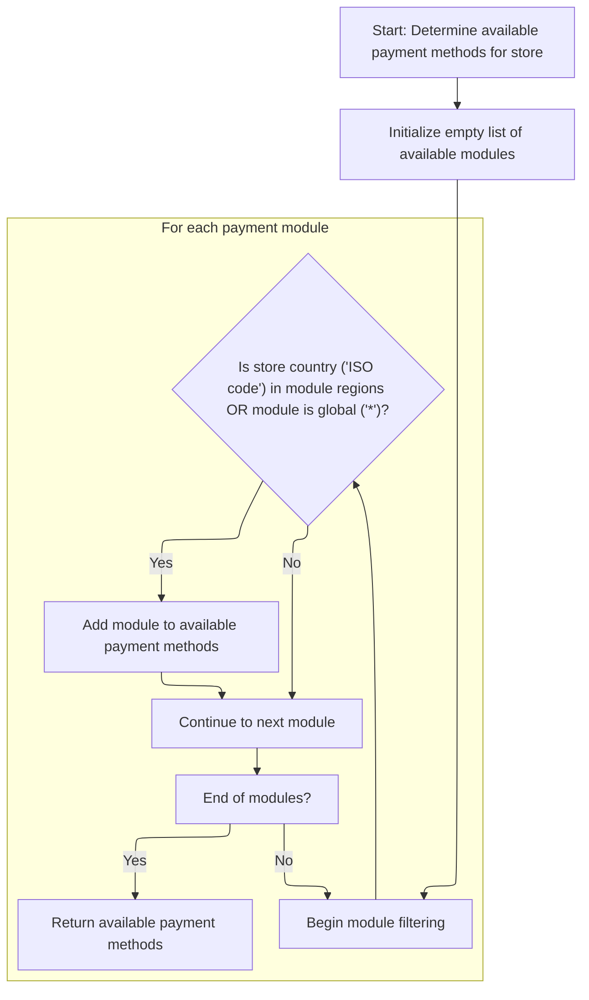

This document describes how the system determines which payment methods are available for a store, supporting the checkout experience. The process involves gathering all payment modules, identifying those that match the store's country or are available globally, and providing a tailored list of payment methods.

# Fetching and Preparing Payment Modules

<SwmSnippet path="/shopizer/sm-core/src/main/java/com/salesmanager/core/business/payments/service/PaymentServiceImpl.java" line="75">

---

In `getPaymentMethods`, we kick off by grabbing all payment modules using the module configuration service. This is necessary because the region info for each module is only available after fetching them, so we need the full list before we can filter for the store's country or wildcard. The next step is to call ModuleConfigurationServiceImpl to get those modules, which will let us check their region sets and decide which ones to keep.

```java
	public List<IntegrationModule> getPaymentMethods(MerchantStore store) throws ServiceException {
		
		List<IntegrationModule> modules =  moduleConfigurationService.getIntegrationModules(PAYMENT_MODULES);
```

---

</SwmSnippet>

## Loading and Parsing Module Configurations

```mermaid
%%{init: {"flowchart": {"defaultRenderer": "elk"}} }%%
flowchart TD
    node1["Request integration modules for a given module"]
    click node1 openCode "shopizer/sm-core/src/main/java/com/salesmanager/core/business/system/service/ModuleConfigurationServiceImpl.java:50:53"
    node1 --> node2{"Is configuration in cache?"}
    click node2 openCode "shopizer/sm-core/src/main/java/com/salesmanager/core/business/system/service/ModuleConfigurationServiceImpl.java:57:58"
    node2 -->|"Yes"| node3["Return cached modules"]
    click node3 openCode "shopizer/sm-core/src/main/java/com/salesmanager/core/business/system/service/ModuleConfigurationServiceImpl.java:57:58"
    node2 -->|"No"| node4["Load modules from database"]
    click node4 openCode "shopizer/sm-core/src/main/java/com/salesmanager/core/business/system/service/ModuleConfigurationServiceImpl.java:59:59"
    node4 --> node5["Transform modules"]
    click node5 openCode "shopizer/sm-core/src/main/java/com/salesmanager/core/business/system/service/ModuleConfigurationServiceImpl.java:61:126"
    subgraph loop1["For each module"]
        node5 --> node6{"Has regions data?"}
        click node6 openCode "shopizer/sm-core/src/main/java/com/salesmanager/core/business/system/service/ModuleConfigurationServiceImpl.java:63:71"
        node6 -->|"Yes"| node7["Parse and set regions"]
        click node7 openCode "shopizer/sm-core/src/main/java/com/salesmanager/core/business/system/service/ModuleConfigurationServiceImpl.java:65:70"
        node6 -->|"No"| node8
        node7 --> node8{"Has details data?"}
        click node8 openCode "shopizer/sm-core/src/main/java/com/salesmanager/core/business/system/service/ModuleConfigurationServiceImpl.java:74:83"
        node8 -->|"Yes"| node9["Parse and set details"]
        click node9 openCode "shopizer/sm-core/src/main/java/com/salesmanager/core/business/system/service/ModuleConfigurationServiceImpl.java:79:80"
        node8 -->|"No"| node10
        node9 --> node10{"Has configuration data?"}
        click node10 openCode "shopizer/sm-core/src/main/java/com/salesmanager/core/business/system/service/ModuleConfigurationServiceImpl.java:86:123"
        node10 -->|"Yes"| node11["Parse configuration array"]
        click node11 openCode "shopizer/sm-core/src/main/java/com/salesmanager/core/business/system/service/ModuleConfigurationServiceImpl.java:91:120"
        node10 -->|"No"| node14
        subgraph loop2["For each configuration entry"]
            node11 --> node13["Build configuration object"]
            click node13 openCode "shopizer/sm-core/src/main/java/com/salesmanager/core/business/system/service/ModuleConfigurationServiceImpl.java:97:114"
        end
        node13 --> node14["Set module configurations"]
        click node14 openCode "shopizer/sm-core/src/main/java/com/salesmanager/core/business/system/service/ModuleConfigurationServiceImpl.java:120:120"
    end
    node14 --> node15["Store modules in cache"]
    click node15 openCode "shopizer/sm-core/src/main/java/com/salesmanager/core/business/system/service/ModuleConfigurationServiceImpl.java:127:127"
    node3 --> node16["Return modules"]
    click node16 openCode "shopizer/sm-core/src/main/java/com/salesmanager/core/business/system/service/ModuleConfigurationServiceImpl.java:133:133"
    node15 --> node16

classDef HeadingStyle fill:#777777,stroke:#333,stroke-width:2px;
```



<SwmSnippet path="/shopizer/sm-core/src/main/java/com/salesmanager/core/business/system/service/ModuleConfigurationServiceImpl.java" line="50">

---

In `getIntegrationModules`, we first try to pull the module list from cache using a key with the "INTEGRATION_M)" prefix. If it's not cached, we fetch from the DAO and then parse JSON fields for regions, config details, and configuration. This parsing step turns JSON strings into usable sets, maps, and config objects for each module, prepping them for later filtering.

```java
	public List<IntegrationModule> getIntegrationModules(String module) {
		
		
		List<IntegrationModule> modules = null;
		try {
			
			//CacheUtils cacheUtils = CacheUtils.getInstance();
			modules = (List<IntegrationModule>) cache.getFromCache("INTEGRATION_M)" + module);
			if(modules==null) {
				modules = integrationModuleDao.getModulesConfiguration(module);
				//set json objects
				for(IntegrationModule mod : modules) {
					
					String regions = mod.getRegions();
					if(regions!=null) {
						Object objRegions=JSONValue.parse(regions); 
						JSONArray arrayRegions=(JSONArray)objRegions;
						Iterator i = arrayRegions.iterator();
						while(i.hasNext()) {
							mod.getRegionsSet().add((String)i.next());
						}
					}
					
					
					String details = mod.getConfigDetails();
					if(details!=null) {
						
						//Map objects = mapper.readValue(config, Map.class);

						Map<String,String> objDetails= (Map<String, String>) JSONValue.parse(details); 
						mod.setDetails(objDetails);

						
					}
					
					
					String configs = mod.getConfiguration();
					if(configs!=null) {
						
						//Map objects = mapper.readValue(config, Map.class);

						Object objConfigs=JSONValue.parse(configs); 
						JSONArray arrayConfigs=(JSONArray)objConfigs;
						
						Map<String,ModuleConfig> moduleConfigs = new HashMap<String,ModuleConfig>();
						
						Iterator i = arrayConfigs.iterator();
						while(i.hasNext()) {
							
							Map values = (Map)i.next();
							String env = (String)values.get("env");
		            		ModuleConfig config = new ModuleConfig();
		            		config.setScheme((String)values.get("scheme"));
		            		config.setHost((String)values.get("host"));
		            		config.setPort((String)values.get("port"));
		            		config.setUri((String)values.get("uri"));
		            		config.setEnv((String)values.get("env"));
		            		if((String)values.get("config1")!=null) {
		            			config.setConfig1((String)values.get("config1"));
		            		}
		            		if((String)values.get("config2")!=null) {
		            			config.setConfig1((String)values.get("config2"));
		            		}
		            		
		            		moduleConfigs.put(env, config);
		            		
		            		
							
						}
						
						mod.setModuleConfigs(moduleConfigs);
						

					}


				}
```

---

</SwmSnippet>

<SwmSnippet path="/shopizer/sm-core/src/main/java/com/salesmanager/core/business/system/service/ModuleConfigurationServiceImpl.java" line="127">

---

After parsing, we return a list of IntegrationModule objects with their regions, config details, and configuration fields populated from JSON. This assumes the input argument and JSON structures are valid, so any issues there could affect downstream logic.

```java
				cache.putInCache(modules, "INTEGRATION_M)" + module);
			}

		} catch (Exception e) {
			LOGGER.error("getIntegrationModules()", e);
		}
		return modules;
		
		
	}
```

---

</SwmSnippet>

## Filtering Modules by Store Region



<SwmSnippet path="/shopizer/sm-core/src/main/java/com/salesmanager/core/business/payments/service/PaymentServiceImpl.java" line="78">

---

Back in `getPaymentMethods`, after getting the modules from ModuleConfigurationServiceImpl, we filter them by checking if the store's country ISO code or the wildcard '\*' is in each module's regions set. Only those modules get added to the return list, so the wildcard enables global modules to be included for any store.

```java
		List<IntegrationModule> returnModules = new ArrayList<IntegrationModule>();
		
		for(IntegrationModule module : modules) {
			if(module.getRegionsSet().contains(store.getCountry().getIsoCode())
					|| module.getRegionsSet().contains("*")) {
				
				returnModules.add(module);
			}
		}
```

---

</SwmSnippet>

&nbsp;

*This is an auto-generated document by Swimm 🌊 and has not yet been verified by a human*

<SwmMeta version="3.0.0" repo-id="Z2l0aHViJTNBJTNBU2hvcGl6ZXIlM0ElM0F1bWFsaW5nYXN3YW1p" repo-name="Shopizer"><sup>Powered by [Swimm](https://app.swimm.io/)</sup></SwmMeta>
