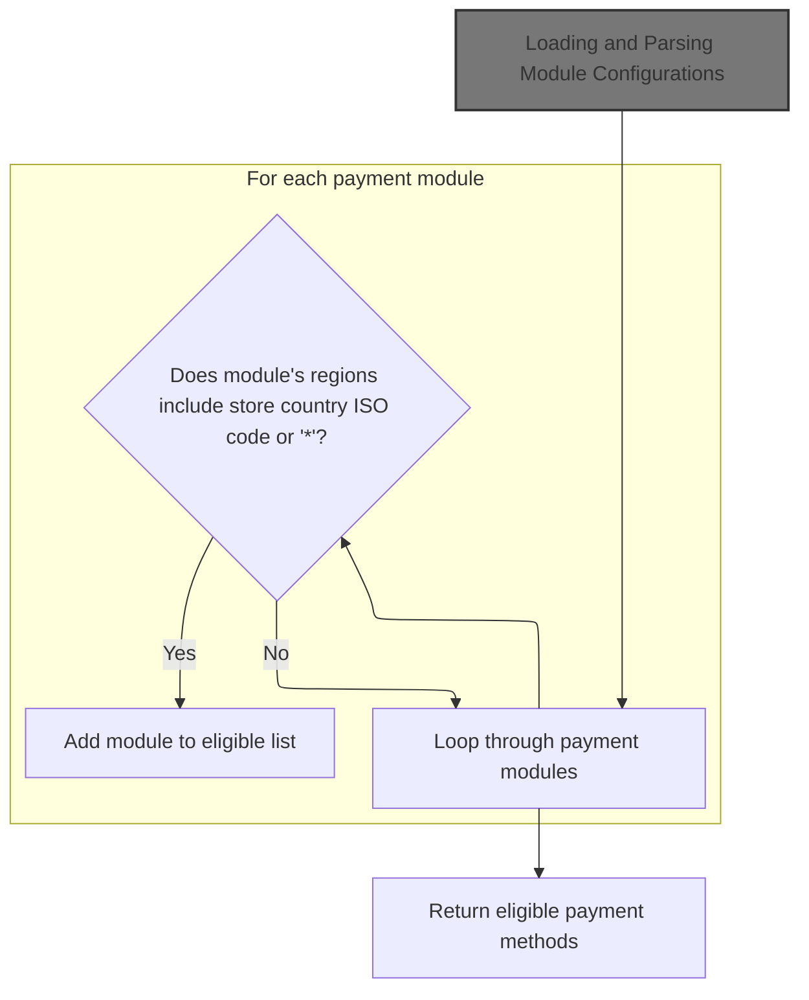
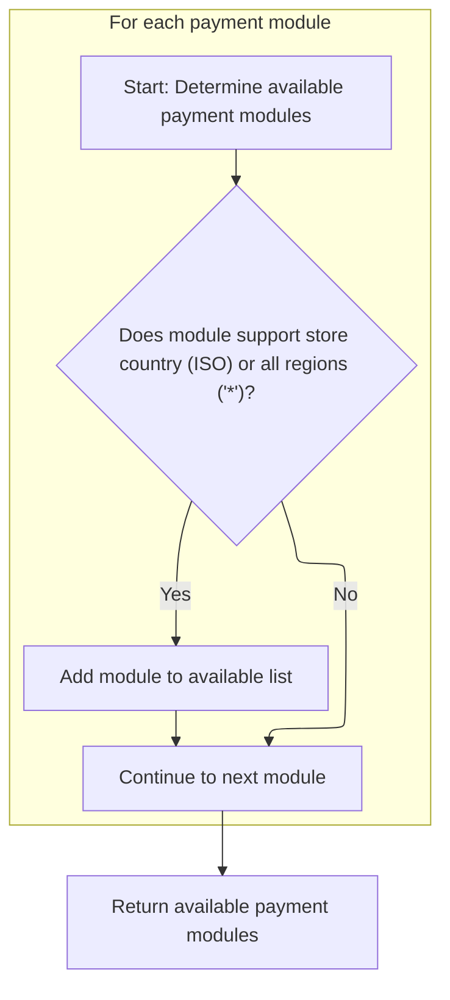

This document describes how the system determines which payment methods are available for a store. The flow loads all payment modules and their configuration data, then filters them by region to produce a list of payment methods that can be offered to customers.

# Collecting Payment Module Candidates



<SwmSnippet path="/shopizer/sm-core/src/main/java/com/salesmanager/core/business/payments/service/PaymentServiceImpl.java" line="75">

---

In `getPaymentMethods`, we kick things off by pulling all payment modules using the module configuration service. This is necessary because the region info for each module is embedded as JSON, so we have to load everything before we can filter by the store's country or wildcard region. The next step is to call ModuleConfigurationServiceImpl to get these modules with their parsed config and region data.

```java
	public List<IntegrationModule> getPaymentMethods(MerchantStore store) throws ServiceException {
		
		List<IntegrationModule> modules =  moduleConfigurationService.getIntegrationModules(PAYMENT_MODULES);
```

---

</SwmSnippet>

## Loading and Parsing Module Configurations

```mermaid
%%{init: {"flowchart": {"defaultRenderer": "elk"}} }%%
flowchart TD
    node1["Request integration modules for type"] --> node2{"Are modules in cache?"}
    click node1 openCode "shopizer/sm-core/src/main/java/com/salesmanager/core/business/system/service/ModuleConfigurationServiceImpl.java:50:53"
    node2 -->|"Yes"| node3["Return cached modules"]
    click node2 openCode "shopizer/sm-core/src/main/java/com/salesmanager/core/business/system/service/ModuleConfigurationServiceImpl.java:57:58"
    click node3 openCode "shopizer/sm-core/src/main/java/com/salesmanager/core/business/system/service/ModuleConfigurationServiceImpl.java:57:58"
    node2 -->|"No"| node4["Load modules from storage"]
    click node4 openCode "shopizer/sm-core/src/main/java/com/salesmanager/core/business/system/service/ModuleConfigurationServiceImpl.java:59:59"
    node4 --> node5["Process modules"]
    click node5 openCode "shopizer/sm-core/src/main/java/com/salesmanager/core/business/system/service/ModuleConfigurationServiceImpl.java:61:126"
    
    subgraph loop1["For each module"]
        node5 --> node6{"Does module have regions?"}
        click node6 openCode "shopizer/sm-core/src/main/java/com/salesmanager/core/business/system/service/ModuleConfigurationServiceImpl.java:63:71"
        node6 -->|"Yes"| node7["Parse and add regions"]
        click node7 openCode "shopizer/sm-core/src/main/java/com/salesmanager/core/business/system/service/ModuleConfigurationServiceImpl.java:65:70"
        node6 -->|"No"| node8
        node7 --> node8
        node8{"Does module have details?"}
        click node8 openCode "shopizer/sm-core/src/main/java/com/salesmanager/core/business/system/service/ModuleConfigurationServiceImpl.java:74:83"
        node8 -->|"Yes"| node9["Parse and set details"]
        click node9 openCode "shopizer/sm-core/src/main/java/com/salesmanager/core/business/system/service/ModuleConfigurationServiceImpl.java:79:80"
        node8 -->|"No"| node10
        node9 --> node10
        node10{"Does module have configuration?"}
        click node10 openCode "shopizer/sm-core/src/main/java/com/salesmanager/core/business/system/service/ModuleConfigurationServiceImpl.java:86:123"
        node10 -->|"Yes"| node11["Parse and set environment configs"]
        click node11 openCode "shopizer/sm-core/src/main/java/com/salesmanager/core/business/system/service/ModuleConfigurationServiceImpl.java:91:120"
        node10 -->|"No"| node12
        node11 --> node12
    end
    node12 --> node13["Store processed modules in cache"]
    click node13 openCode "shopizer/sm-core/src/main/java/com/salesmanager/core/business/system/service/ModuleConfigurationServiceImpl.java:127:127"
    node13 --> node14["Return modules"]
    click node14 openCode "shopizer/sm-core/src/main/java/com/salesmanager/core/business/system/service/ModuleConfigurationServiceImpl.java:133:134"

classDef HeadingStyle fill:#777777,stroke:#333,stroke-width:2px;
```



<SwmSnippet path="/shopizer/sm-core/src/main/java/com/salesmanager/core/business/system/service/ModuleConfigurationServiceImpl.java" line="50">

---

In `getIntegrationModules`, we first try to load the module list from cache using a key based on the module type. If it's not cached, we fetch from the DB, then parse the regions JSON into a set, config details JSON into a map, and configurations JSON into a map of ModuleConfig objects keyed by environment. All these are set into each IntegrationModule for easier access later. The code assumes the JSON structure is stable and contains all required keys.

```java
	public List<IntegrationModule> getIntegrationModules(String module) {
		
		
		List<IntegrationModule> modules = null;
		try {
			
			//CacheUtils cacheUtils = CacheUtils.getInstance();
			modules = (List<IntegrationModule>) cache.getFromCache("INTEGRATION_M)" + module);
			if(modules==null) {
				modules = integrationModuleDao.getModulesConfiguration(module);
				//set json objects
				for(IntegrationModule mod : modules) {
					
					String regions = mod.getRegions();
					if(regions!=null) {
						Object objRegions=JSONValue.parse(regions); 
						JSONArray arrayRegions=(JSONArray)objRegions;
						Iterator i = arrayRegions.iterator();
						while(i.hasNext()) {
							mod.getRegionsSet().add((String)i.next());
						}
					}
					
					
					String details = mod.getConfigDetails();
					if(details!=null) {
						
						//Map objects = mapper.readValue(config, Map.class);

						Map<String,String> objDetails= (Map<String, String>) JSONValue.parse(details); 
						mod.setDetails(objDetails);

						
					}
					
					
					String configs = mod.getConfiguration();
					if(configs!=null) {
						
						//Map objects = mapper.readValue(config, Map.class);

						Object objConfigs=JSONValue.parse(configs); 
						JSONArray arrayConfigs=(JSONArray)objConfigs;
						
						Map<String,ModuleConfig> moduleConfigs = new HashMap<String,ModuleConfig>();
						
						Iterator i = arrayConfigs.iterator();
						while(i.hasNext()) {
							
							Map values = (Map)i.next();
							String env = (String)values.get("env");
		            		ModuleConfig config = new ModuleConfig();
		            		config.setScheme((String)values.get("scheme"));
		            		config.setHost((String)values.get("host"));
		            		config.setPort((String)values.get("port"));
		            		config.setUri((String)values.get("uri"));
		            		config.setEnv((String)values.get("env"));
		            		if((String)values.get("config1")!=null) {
		            			config.setConfig1((String)values.get("config1"));
		            		}
		            		if((String)values.get("config2")!=null) {
		            			config.setConfig1((String)values.get("config2"));
		            		}
		            		
		            		moduleConfigs.put(env, config);
		            		
		            		
							
						}
						
						mod.setModuleConfigs(moduleConfigs);
						

					}


				}
```

---

</SwmSnippet>

<SwmSnippet path="/shopizer/sm-core/src/main/java/com/salesmanager/core/business/system/service/ModuleConfigurationServiceImpl.java" line="127">

---

After parsing, we return a list of IntegrationModule objects with their regions, config details, and environment configs set as Java collections. This list is also cached for future calls.

```java
				cache.putInCache(modules, "INTEGRATION_M)" + module);
			}

		} catch (Exception e) {
			LOGGER.error("getIntegrationModules()", e);
		}
		return modules;
		
		
	}
```

---

</SwmSnippet>

## Filtering Modules by Store Region



<SwmSnippet path="/shopizer/sm-core/src/main/java/com/salesmanager/core/business/payments/service/PaymentServiceImpl.java" line="78">

---

Back in `getPaymentMethods`, now that we've got modules with parsed regions and configs, we filter them by checking if the store's country ISO code or '*' is in the module's regions set. Only those modules are added to the return list. The use of '*' as a wildcard means some modules are globally available regardless of store location.

```java
		List<IntegrationModule> returnModules = new ArrayList<IntegrationModule>();
		
		for(IntegrationModule module : modules) {
			if(module.getRegionsSet().contains(store.getCountry().getIsoCode())
					|| module.getRegionsSet().contains("*")) {
				
				returnModules.add(module);
			}
		}
```

---

</SwmSnippet>

&nbsp;

*This is an auto-generated document by Swimm 🌊 and has not yet been verified by a human*

<SwmMeta version="3.0.0" repo-id="Z2l0aHViJTNBJTNBU2hvcGl6ZXIlM0ElM0F1bWFsaW5nYXN3YW1p" repo-name="Shopizer"><sup>Powered by [Swimm](https://app.swimm.io/)</sup></SwmMeta>
