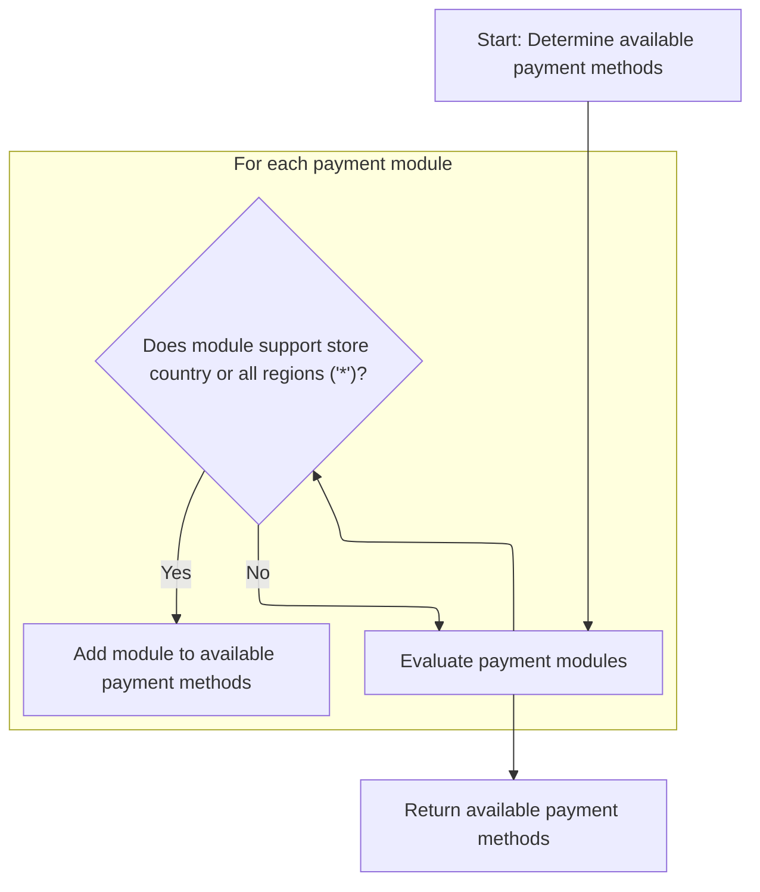

This document explains how the system determines which payment methods a store can offer to its customers. By evaluating all available payment modules and filtering them based on the store's country or global applicability, the system ensures that only relevant payment options are presented. The input is the store's information, and the output is a list of suitable payment methods.

# Starting Payment Method Retrieval

<SwmSnippet path="/shopizer/sm-core/src/main/java/com/salesmanager/core/business/payments/service/PaymentServiceImpl.java" line="75">

---

In `getPaymentMethods`, we kick off by grabbing all payment integration modules using the moduleConfigurationService. This is needed because we want the full list before we filter them by region later. The next step is to call ModuleConfigurationServiceImpl to get those modules, which handles pulling and prepping the data so we can filter by the store's country code or the wildcard '\*'.

```java
	public List<IntegrationModule> getPaymentMethods(MerchantStore store) throws ServiceException {
		
		List<IntegrationModule> modules =  moduleConfigurationService.getIntegrationModules(PAYMENT_MODULES);
```

---

</SwmSnippet>

## Loading and Parsing Module Configurations

```mermaid
%%{init: {"flowchart": {"defaultRenderer": "elk"}} }%%
flowchart TD
    node1["Request integration modules for type"]
    click node1 openCode "shopizer/sm-core/src/main/java/com/salesmanager/core/business/system/service/ModuleConfigurationServiceImpl.java:50:53"
    node1 --> node2{"Is module configuration in cache?"}
    click node2 openCode "shopizer/sm-core/src/main/java/com/salesmanager/core/business/system/service/ModuleConfigurationServiceImpl.java:57:58"
    node2 -->|"Yes"| node3["Return cached modules"]
    click node3 openCode "shopizer/sm-core/src/main/java/com/salesmanager/core/business/system/service/ModuleConfigurationServiceImpl.java:57:58"
    node2 -->|"No"| node4["Retrieve modules from database"]
    click node4 openCode "shopizer/sm-core/src/main/java/com/salesmanager/core/business/system/service/ModuleConfigurationServiceImpl.java:59:59"
    node4 --> node5["Process each module"]
    click node5 openCode "shopizer/sm-core/src/main/java/com/salesmanager/core/business/system/service/ModuleConfigurationServiceImpl.java:61:126"
    
    subgraph loop1["For each module"]
        node5 --> node6{"Does module have regions?"}
        click node6 openCode "shopizer/sm-core/src/main/java/com/salesmanager/core/business/system/service/ModuleConfigurationServiceImpl.java:63:71"
        node6 -->|"Yes"| node7["Parse and add regions"]
        click node7 openCode "shopizer/sm-core/src/main/java/com/salesmanager/core/business/system/service/ModuleConfigurationServiceImpl.java:65:70"
        node6 -->|"No"| node8
        node7 --> node8
        node8{"Does module have details?"}
        click node8 openCode "shopizer/sm-core/src/main/java/com/salesmanager/core/business/system/service/ModuleConfigurationServiceImpl.java:74:83"
        node8 -->|"Yes"| node9["Parse and set details"]
        click node9 openCode "shopizer/sm-core/src/main/java/com/salesmanager/core/business/system/service/ModuleConfigurationServiceImpl.java:79:80"
        node8 -->|"No"| node10
        node9 --> node10
        node10{"Does module have configuration?"}
        click node10 openCode "shopizer/sm-core/src/main/java/com/salesmanager/core/business/system/service/ModuleConfigurationServiceImpl.java:86:123"
        node10 -->|"Yes"| node11["Parse configuration entries"]
        click node11 openCode "shopizer/sm-core/src/main/java/com/salesmanager/core/business/system/service/ModuleConfigurationServiceImpl.java:91:120"
        node10 -->|"No"| node12
        node11 --> node12
    end
    node12 --> node13["Put modules into cache"]
    click node13 openCode "shopizer/sm-core/src/main/java/com/salesmanager/core/business/system/service/ModuleConfigurationServiceImpl.java:127:127"
    node13 --> node14["Return modules"]
    click node14 openCode "shopizer/sm-core/src/main/java/com/salesmanager/core/business/system/service/ModuleConfigurationServiceImpl.java:133:136"

classDef HeadingStyle fill:#777777,stroke:#333,stroke-width:2px;
```



<SwmSnippet path="/shopizer/sm-core/src/main/java/com/salesmanager/core/business/system/service/ModuleConfigurationServiceImpl.java" line="50">

---

In `getIntegrationModules`, we first try to grab the module configs from cache using a hardcoded key. If it's not cached, we fetch from the DAO and parse the JSON fields for regions, config details, and environment configs. This parsing turns the stored strings into usable Java objects for later filtering and logic. Note: there's a bug where config2 overwrites config1 if both exist.

```java
	public List<IntegrationModule> getIntegrationModules(String module) {
		
		
		List<IntegrationModule> modules = null;
		try {
			
			//CacheUtils cacheUtils = CacheUtils.getInstance();
			modules = (List<IntegrationModule>) cache.getFromCache("INTEGRATION_M)" + module);
			if(modules==null) {
				modules = integrationModuleDao.getModulesConfiguration(module);
				//set json objects
				for(IntegrationModule mod : modules) {
					
					String regions = mod.getRegions();
					if(regions!=null) {
						Object objRegions=JSONValue.parse(regions); 
						JSONArray arrayRegions=(JSONArray)objRegions;
						Iterator i = arrayRegions.iterator();
						while(i.hasNext()) {
							mod.getRegionsSet().add((String)i.next());
						}
					}
					
					
					String details = mod.getConfigDetails();
					if(details!=null) {
						
						//Map objects = mapper.readValue(config, Map.class);

						Map<String,String> objDetails= (Map<String, String>) JSONValue.parse(details); 
						mod.setDetails(objDetails);

						
					}
					
					
					String configs = mod.getConfiguration();
					if(configs!=null) {
						
						//Map objects = mapper.readValue(config, Map.class);

						Object objConfigs=JSONValue.parse(configs); 
						JSONArray arrayConfigs=(JSONArray)objConfigs;
						
						Map<String,ModuleConfig> moduleConfigs = new HashMap<String,ModuleConfig>();
						
						Iterator i = arrayConfigs.iterator();
						while(i.hasNext()) {
							
							Map values = (Map)i.next();
							String env = (String)values.get("env");
		            		ModuleConfig config = new ModuleConfig();
		            		config.setScheme((String)values.get("scheme"));
		            		config.setHost((String)values.get("host"));
		            		config.setPort((String)values.get("port"));
		            		config.setUri((String)values.get("uri"));
		            		config.setEnv((String)values.get("env"));
		            		if((String)values.get("config1")!=null) {
		            			config.setConfig1((String)values.get("config1"));
		            		}
		            		if((String)values.get("config2")!=null) {
		            			config.setConfig1((String)values.get("config2"));
		            		}
		            		
		            		moduleConfigs.put(env, config);
		            		
		            		
							
						}
						
						mod.setModuleConfigs(moduleConfigs);
						

					}


				}
```

---

</SwmSnippet>

<SwmSnippet path="/shopizer/sm-core/src/main/java/com/salesmanager/core/business/system/service/ModuleConfigurationServiceImpl.java" line="127">

---

After parsing and caching, we return a list of IntegrationModule objects with all their config fields parsed and ready for use.

```java
				cache.putInCache(modules, "INTEGRATION_M)" + module);
			}

		} catch (Exception e) {
			LOGGER.error("getIntegrationModules()", e);
		}
		return modules;
		
		
	}
```

---

</SwmSnippet>

## Filtering Modules by Store Region



<SwmSnippet path="/shopizer/sm-core/src/main/java/com/salesmanager/core/business/payments/service/PaymentServiceImpl.java" line="78">

---

Back in `getPaymentMethods`, after getting the parsed modules from ModuleConfigurationServiceImpl, we filter them by checking if the store's country code or '\*' is in the module's regions set. Only matching modules are added to the return list, so the store only sees payment methods relevant to its region or global ones.

```java
		List<IntegrationModule> returnModules = new ArrayList<IntegrationModule>();
		
		for(IntegrationModule module : modules) {
			if(module.getRegionsSet().contains(store.getCountry().getIsoCode())
					|| module.getRegionsSet().contains("*")) {
				
				returnModules.add(module);
			}
		}
```

---

</SwmSnippet>

&nbsp;

*This is an auto-generated document by Swimm 🌊 and has not yet been verified by a human*

<SwmMeta version="3.0.0" repo-id="Z2l0aHViJTNBJTNBU2hvcGl6ZXIlM0ElM0F1bWFsaW5nYXN3YW1p" repo-name="Shopizer"><sup>Powered by [Swimm](https://app.swimm.io/)</sup></SwmMeta>
