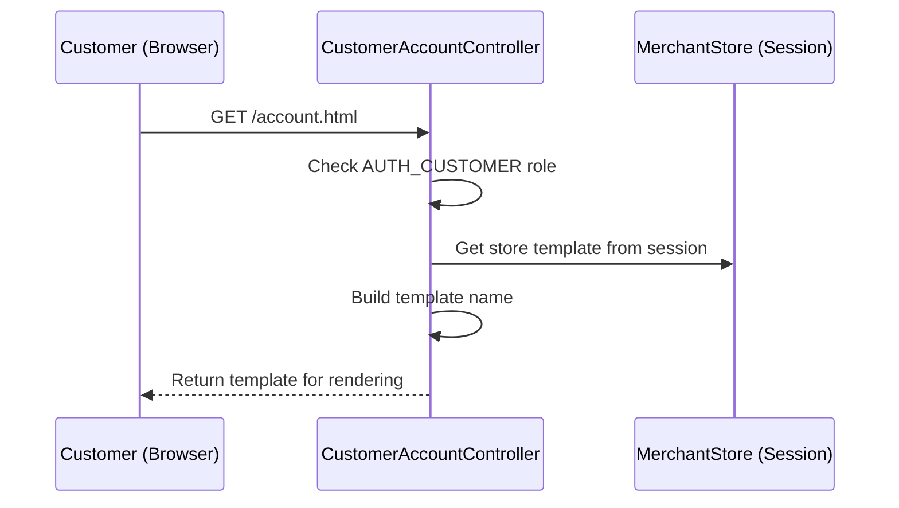

# Introduction

This document explains the flow for displaying the customer account page, focusing on the main business logic and actions, starting from the `displayCustomerAccount` function. The goal is to clarify:

1. What the controller does when handling the customer account display.
2. What main business actions are performed at each layer.
3. Why the template is selected in the way it is.


1. Ensure the user has the 'AUTH_CUSTOMER' role before proceeding.
2. Retrieve the current store's template identifier from the session.
3. Build the template name for the customer account page using the store's template.
4. Return the constructed template name for rendering the customer account view.



# Controller layer: Handling the customer account display

Main business actions performed:

<SwmSnippet path="shopizer/sm-shop/src/main/java/com/salesmanager/web/shop/controller/customer/CustomerAccountController.java" line="146" repo-id="Z2l0aHViJTNBJTNBU2hvcGl6ZXIlM0ElM0F1bWFsaW5nYXN3YW1p">

---

- Checks that the user has the `AUTH_CUSTOMER` role.
- Builds the template name for the customer account page based on the current store's template.
- Returns the template name for rendering.

```
	@PreAuthorize("hasRole('AUTH_CUSTOMER')")
	@RequestMapping(value="/account.html", method=RequestMethod.GET)
	public String displayCustomerAccount(Model model, HttpServletRequest request, HttpServletResponse response) throws Exception {
		

	    MerchantStore store = getSessionAttribute(Constants.MERCHANT_STORE, request);

		
		
		/** template **/
		StringBuilder template = new StringBuilder().append(ControllerConstants.Tiles.Customer.customer).append(".").append(store.getStoreTemplate());

		return template.toString();
		
	}
```

---

</SwmSnippet>

# Why the template is selected this way

The template name is dynamically constructed using the store's template, allowing different stores to have their own look and feel for the customer account page. This avoids hardcoding and supports multi-store theming.

No other business modifications are performed in this flow; the controller simply determines which template to render for the authenticated customer.

This is an auto-generated document by Swimm 🌊 and has not yet been verified by a human

<SwmMeta version="3.0.0"><sup>Powered by [Swimm](https://app.swimm.io/)</sup></SwmMeta>
