This document describes how the storefront displays a category page when a user requests it using a friendly URL and reference. The flow validates the input, locates the category, and prepares all relevant data for display, including subcategories, parent category (if referenced), manufacturers, breadcrumbs, and SEO meta information. Caching is used to optimize performance.

# Routing with Reference for Category Display

This section is responsible for routing requests that display a category page based on a friendly URL and a reference. It ensures that users can access category pages using user-friendly URLs and additional reference information, supporting SEO and navigation requirements.

| Category        | Rule Name                     | Description                                                                                                           |
| --------------- | ----------------------------- | --------------------------------------------------------------------------------------------------------------------- |
| Data validation | Input Validation for Routing  | The friendly URL and reference parameters must be validated to ensure they do not contain invalid or malicious input. |
| Business logic  | Category Display by Reference | A category page must be displayed when a valid friendly URL and reference are provided in the request.                |

<SwmSnippet path="/shopizer/sm-shop/src/main/java/com/salesmanager/web/shop/controller/category/ShoppingCategoryController.java" line="111">

---

<SwmToken path="shopizer/sm-shop/src/main/java/com/salesmanager/web/shop/controller/category/ShoppingCategoryController.java" pos="111:5:5" line-data="	public String displayCategoryWithReference(@PathVariable final String friendlyUrl, @PathVariable final String ref, Model model, HttpServletRequest request, HttpServletResponse response, Locale locale) throws Exception {">`displayCategoryWithReference`</SwmToken> just forwards everything to <SwmToken path="shopizer/sm-shop/src/main/java/com/salesmanager/web/shop/controller/category/ShoppingCategoryController.java" pos="115:5:5" line-data="		return this.displayCategory(friendlyUrl,ref,model,request,response,locale);">`displayCategory`</SwmToken>, so all the real work happens there.

```java
	public String displayCategoryWithReference(@PathVariable final String friendlyUrl, @PathVariable final String ref, Model model, HttpServletRequest request, HttpServletResponse response, Locale locale) throws Exception {
		
		
		
		return this.displayCategory(friendlyUrl,ref,model,request,response,locale);
	}
```

---

</SwmSnippet>

# Category Data Preparation and Manufacturer Lookup

```mermaid
%%{init: {"flowchart": {"defaultRenderer": "elk"}} }%%
flowchart TD
    node1["User requests category page"]
    click node1 openCode "shopizer/sm-shop/src/main/java/com/salesmanager/web/shop/controller/category/ShoppingCategoryController.java:136:144"
    node1 --> node2["Find category by URL"]
    click node2 openCode "shopizer/sm-shop/src/main/java/com/salesmanager/web/shop/controller/category/ShoppingCategoryController.java:144:146"
    node2 --> node3{"Is category found?"}
    click node3 openCode "shopizer/sm-shop/src/main/java/com/salesmanager/web/shop/controller/category/ShoppingCategoryController.java:148:153"
    node3 -->|"No"| node4["Show 404 page"]
    click node4 openCode "shopizer/sm-shop/src/main/java/com/salesmanager/web/shop/controller/category/ShoppingCategoryController.java:151:152"
    node3 -->|"Yes"| node5["Prepare category for display"]
    click node5 openCode "shopizer/sm-shop/src/main/java/com/salesmanager/web/shop/controller/category/ShoppingCategoryController.java:155:168"
    node5 --> node6["Collect subcategory IDs"]
    click node6 openCode "shopizer/sm-shop/src/main/java/com/salesmanager/web/shop/controller/category/ShoppingCategoryController.java:178:185"
    subgraph loop1["For each subcategory"]
      node6 --> node7["Add subcategory ID"]
      click node7 openCode "shopizer/sm-shop/src/main/java/com/salesmanager/web/shop/controller/category/ShoppingCategoryController.java:181:183"
      node7 --> node6
    end
    node6 --> node8{"Does store use cache?"}
    click node8 openCode "shopizer/sm-shop/src/main/java/com/salesmanager/web/shop/controller/category/ShoppingCategoryController.java:207:226"
    node8 -->|"Yes"| node9{"Is data in cache?"}
    click node9 openCode "shopizer/sm-shop/src/main/java/com/salesmanager/web/shop/controller/category/ShoppingCategoryController.java:210:225"
    node9 -->|"Yes"| node12["Use cached subcategories/manufacturers"]
    click node12 openCode "shopizer/sm-shop/src/main/java/com/salesmanager/web/shop/controller/category/ShoppingCategoryController.java:210:211"
    node9 -->|"No"| node10["Generate subcategories/manufacturers"]
    click node10 openCode "shopizer/sm-shop/src/main/java/com/salesmanager/web/shop/controller/category/ShoppingCategoryController.java:216:229"
    node8 -->|"No"| node10
    node12 --> node11{"Is parent category reference present and valid?"}
    node10 --> node11
    click node11 openCode "shopizer/sm-shop/src/main/java/com/salesmanager/web/shop/controller/category/ShoppingCategoryController.java:233:245"
    node11 -->|"Yes"| node13["Prepare parent category"]
    click node13 openCode "shopizer/sm-shop/src/main/java/com/salesmanager/web/shop/controller/category/ShoppingCategoryController.java:241:241"
    node11 -->|"No"| node14["Skip parent category"]
    click node14 openCode "shopizer/sm-shop/src/main/java/com/salesmanager/web/shop/controller/category/ShoppingCategoryController.java:246:246"
    node13 --> node15["Prepare manufacturers list"]
    node14 --> node15
    click node15 openCode "shopizer/sm-shop/src/main/java/com/salesmanager/web/shop/controller/category/ShoppingCategoryController.java:249:251"
    node15 --> node16["Display category page"]
    click node16 openCode "shopizer/sm-shop/src/main/java/com/salesmanager/web/shop/controller/category/ShoppingCategoryController.java:262:264"

classDef HeadingStyle fill:#777777,stroke:#333,stroke-width:2px;

%% Swimm:
%% %%{init: {"flowchart": {"defaultRenderer": "elk"}} }%%
%% flowchart TD
%%     node1["User requests category page"]
%%     click node1 openCode "<SwmPath>[shopizer/…/category/ShoppingCategoryController.java](shopizer/sm-shop/src/main/java/com/salesmanager/web/shop/controller/category/ShoppingCategoryController.java)</SwmPath>:136:144"
%%     node1 --> node2["Find category by URL"]
%%     click node2 openCode "<SwmPath>[shopizer/…/category/ShoppingCategoryController.java](shopizer/sm-shop/src/main/java/com/salesmanager/web/shop/controller/category/ShoppingCategoryController.java)</SwmPath>:144:146"
%%     node2 --> node3{"Is category found?"}
%%     click node3 openCode "<SwmPath>[shopizer/…/category/ShoppingCategoryController.java](shopizer/sm-shop/src/main/java/com/salesmanager/web/shop/controller/category/ShoppingCategoryController.java)</SwmPath>:148:153"
%%     node3 -->|"No"| node4["Show 404 page"]
%%     click node4 openCode "<SwmPath>[shopizer/…/category/ShoppingCategoryController.java](shopizer/sm-shop/src/main/java/com/salesmanager/web/shop/controller/category/ShoppingCategoryController.java)</SwmPath>:151:152"
%%     node3 -->|"Yes"| node5["Prepare category for display"]
%%     click node5 openCode "<SwmPath>[shopizer/…/category/ShoppingCategoryController.java](shopizer/sm-shop/src/main/java/com/salesmanager/web/shop/controller/category/ShoppingCategoryController.java)</SwmPath>:155:168"
%%     node5 --> node6["Collect subcategory IDs"]
%%     click node6 openCode "<SwmPath>[shopizer/…/category/ShoppingCategoryController.java](shopizer/sm-shop/src/main/java/com/salesmanager/web/shop/controller/category/ShoppingCategoryController.java)</SwmPath>:178:185"
%%     subgraph loop1["For each subcategory"]
%%       node6 --> node7["Add subcategory ID"]
%%       click node7 openCode "<SwmPath>[shopizer/…/category/ShoppingCategoryController.java](shopizer/sm-shop/src/main/java/com/salesmanager/web/shop/controller/category/ShoppingCategoryController.java)</SwmPath>:181:183"
%%       node7 --> node6
%%     end
%%     node6 --> node8{"Does store use cache?"}
%%     click node8 openCode "<SwmPath>[shopizer/…/category/ShoppingCategoryController.java](shopizer/sm-shop/src/main/java/com/salesmanager/web/shop/controller/category/ShoppingCategoryController.java)</SwmPath>:207:226"
%%     node8 -->|"Yes"| node9{"Is data in cache?"}
%%     click node9 openCode "<SwmPath>[shopizer/…/category/ShoppingCategoryController.java](shopizer/sm-shop/src/main/java/com/salesmanager/web/shop/controller/category/ShoppingCategoryController.java)</SwmPath>:210:225"
%%     node9 -->|"Yes"| node12["Use cached subcategories/manufacturers"]
%%     click node12 openCode "<SwmPath>[shopizer/…/category/ShoppingCategoryController.java](shopizer/sm-shop/src/main/java/com/salesmanager/web/shop/controller/category/ShoppingCategoryController.java)</SwmPath>:210:211"
%%     node9 -->|"No"| node10["Generate subcategories/manufacturers"]
%%     click node10 openCode "<SwmPath>[shopizer/…/category/ShoppingCategoryController.java](shopizer/sm-shop/src/main/java/com/salesmanager/web/shop/controller/category/ShoppingCategoryController.java)</SwmPath>:216:229"
%%     node8 -->|"No"| node10
%%     node12 --> node11{"Is parent category reference present and valid?"}
%%     node10 --> node11
%%     click node11 openCode "<SwmPath>[shopizer/…/category/ShoppingCategoryController.java](shopizer/sm-shop/src/main/java/com/salesmanager/web/shop/controller/category/ShoppingCategoryController.java)</SwmPath>:233:245"
%%     node11 -->|"Yes"| node13["Prepare parent category"]
%%     click node13 openCode "<SwmPath>[shopizer/…/category/ShoppingCategoryController.java](shopizer/sm-shop/src/main/java/com/salesmanager/web/shop/controller/category/ShoppingCategoryController.java)</SwmPath>:241:241"
%%     node11 -->|"No"| node14["Skip parent category"]
%%     click node14 openCode "<SwmPath>[shopizer/…/category/ShoppingCategoryController.java](shopizer/sm-shop/src/main/java/com/salesmanager/web/shop/controller/category/ShoppingCategoryController.java)</SwmPath>:246:246"
%%     node13 --> node15["Prepare manufacturers list"]
%%     node14 --> node15
%%     click node15 openCode "<SwmPath>[shopizer/…/category/ShoppingCategoryController.java](shopizer/sm-shop/src/main/java/com/salesmanager/web/shop/controller/category/ShoppingCategoryController.java)</SwmPath>:249:251"
%%     node15 --> node16["Display category page"]
%%     click node16 openCode "<SwmPath>[shopizer/…/category/ShoppingCategoryController.java](shopizer/sm-shop/src/main/java/com/salesmanager/web/shop/controller/category/ShoppingCategoryController.java)</SwmPath>:262:264"
%% 
%% classDef HeadingStyle fill:#777777,stroke:#333,stroke-width:2px;
```



This section is responsible for preparing all the data required to display a category page in the storefront. It ensures the correct category is found, gathers subcategories, manages caching for performance, and retrieves the list of manufacturers associated with products in the category and its subcategories. The output is a fully populated model for the category page, including breadcrumbs, SEO meta information, subcategories, parent category (if relevant), and manufacturers.

| Category        | Rule Name                        | Description                                                                                                                                     |
| --------------- | -------------------------------- | ----------------------------------------------------------------------------------------------------------------------------------------------- |
| Data validation | Category existence check         | If the requested category cannot be found by its URL, the system must return a 404 (not found) page to the user.                                |
| Business logic  | Category and subcategory display | The category page must always display the correct category and its subcategories, as determined by the category's lineage and ID.               |
| Business logic  | Parent category inclusion        | If a parent category reference is provided and valid, the parent category must be included in the model for breadcrumb and navigation purposes. |
| Business logic  | Relevant manufacturer filtering  | The list of manufacturers displayed must be limited to those associated with products in the current category and its subcategories.            |
| Business logic  | SEO meta information population  | SEO meta information (title, description, keywords, and friendly URL) must be set for the category page based on the category's data.           |

<SwmSnippet path="/shopizer/sm-shop/src/main/java/com/salesmanager/web/shop/controller/category/ShoppingCategoryController.java" line="136">

---

In <SwmToken path="shopizer/sm-shop/src/main/java/com/salesmanager/web/shop/controller/category/ShoppingCategoryController.java" pos="136:5:5" line-data="	private String displayCategory(final String friendlyUrl, final String ref, Model model, HttpServletRequest request, HttpServletResponse response, Locale locale) throws Exception {">`displayCategory`</SwmToken>, we grab the store and language from the request, fetch the category by its URL, and bail out with a 404 if it's missing. Then we prep the category data for the view, build breadcrumbs, and set up meta info for SEO. We also figure out the lineage for subcategory lookup, which sets up the next steps for fetching related data.

```java
	private String displayCategory(final String friendlyUrl, final String ref, Model model, HttpServletRequest request, HttpServletResponse response, Locale locale) throws Exception {

		MerchantStore store = (MerchantStore)request.getAttribute(Constants.MERCHANT_STORE);
		
		
		
		
		//get category
		Category category = categoryService.getBySeUrl(store, friendlyUrl);
		
		Language language = (Language)request.getAttribute("LANGUAGE");
		
		if(category==null) {
			LOGGER.error("No category found for friendlyUrl " + friendlyUrl);
			//redirect on page not found
			return PageBuilderUtils.build404(store);
			
		}
		
		ReadableCategoryPopulator populator = new ReadableCategoryPopulator();
		ReadableCategory categoryProxy = populator.populate(category, new ReadableCategory(), store, language);

		Breadcrumb breadCrumb = breadcrumbsUtils.buildCategoryBreadcrumb(categoryProxy, store, language, request.getContextPath());
		request.getSession().setAttribute(Constants.BREADCRUMB, breadCrumb);
		request.setAttribute(Constants.BREADCRUMB, breadCrumb);
		
		
		//meta information
		PageInformation pageInformation = new PageInformation();
		pageInformation.setPageDescription(categoryProxy.getDescription().getMetaDescription());
		pageInformation.setPageKeywords(categoryProxy.getDescription().getKeyWords());
		pageInformation.setPageTitle(categoryProxy.getDescription().getTitle());
		pageInformation.setPageUrl(categoryProxy.getDescription().getFriendlyUrl());
		
		//** retrieves category id drill down**//
		String lineage = new StringBuilder().append(category.getLineage()).append(category.getId()).append(Constants.CATEGORY_LINEAGE_DELIMITER).toString();

		
		
		request.setAttribute(Constants.REQUEST_PAGE_INFORMATION, pageInformation);
		
		//TODO add to caching
		List<Category> subCategs = categoryService.listByLineage(store, lineage);
		List<Long> subIds = new ArrayList<Long>();
		if(subCategs!=null && subCategs.size()>0) {
			for(Category c : subCategs) {
				subIds.add(c.getId());
			}
```

---

</SwmSnippet>

<SwmSnippet path="/shopizer/sm-shop/src/main/java/com/salesmanager/web/shop/controller/category/ShoppingCategoryController.java" line="185">

---

After prepping subcategories and handling caching, we check if there's a parent category reference and build its proxy if needed. Then, we call <SwmToken path="shopizer/sm-shop/src/main/java/com/salesmanager/web/shop/controller/category/ShoppingCategoryController.java" pos="249:10:10" line-data="		List&lt;ReadableManufacturer&gt; manufacturerList = getManufacturersByProductAndCategory(store,category,subIds,language);">`getManufacturersByProductAndCategory`</SwmToken> to get the list of manufacturers tied to the products in these categories, so the view can show relevant brands.

```java
		subIds.add(category.getId());


		StringBuilder subCategoriesCacheKey = new StringBuilder();
		subCategoriesCacheKey
		.append(store.getId())
		.append("_")
		.append(category.getId())
		.append("_")
		.append(Constants.SUBCATEGORIES_CACHE_KEY)
		.append("-")
		.append(language.getCode());
		
		StringBuilder subCategoriesMissed = new StringBuilder();
		subCategoriesMissed
		.append(subCategoriesCacheKey.toString())
		.append(Constants.MISSED_CACHE_KEY);
		
		List<BigDecimal> prices = new ArrayList<BigDecimal>();
		List<ReadableCategory> subCategories = null;
		Map<Long,Long> countProductsByCategories = null;

		if(store.isUseCache()) {

			//get from the cache
			subCategories = (List<ReadableCategory>) cache.getFromCache(subCategoriesCacheKey.toString());
			if(subCategories==null) {
				//get from missed cache
				//Boolean missedContent = (Boolean)cache.getFromCache(subCategoriesMissed.toString());

				//if(missedContent==null) {
					countProductsByCategories = getProductsByCategory(store, category, lineage, subCategs);
					subCategories = getSubCategories(store,category,countProductsByCategories,language,locale);
					
					if(subCategories!=null) {
						cache.putInCache(subCategories, subCategoriesCacheKey.toString());
					} else {
						//cache.putInCache(new Boolean(true), subCategoriesCacheKey.toString());
					}
				//}
			}
		} else {
			countProductsByCategories = getProductsByCategory(store, category, lineage, subCategs);
			subCategories = getSubCategories(store,category,countProductsByCategories,language,locale);
		}

		//Parent category
		ReadableCategory parentProxy  = null;
		if(!StringUtils.isBlank(ref) && ref.contains("c")) {
			try {
				//get preceding id from the reference chain
				String categoryChain = ref.substring(ref.indexOf(Constants.REF_SPLITTER)+1);
				int categoryPosition = categoryChain.indexOf(String.valueOf(category.getId()));
				String sCategoryId = categoryChain.substring(categoryPosition++,categoryPosition++);
				Long parentId = Long.parseLong(sCategoryId);
				Category parent = categoryService.getById(parentId);
				parentProxy = populator.populate(parent, new ReadableCategory(), store, language);
			} catch(Exception e) {
				LOGGER.error("Cannot parse category id to Long ",ref );
			}
		}
		
		
		//** List of manufacturers **//
		List<ReadableManufacturer> manufacturerList = getManufacturersByProductAndCategory(store,category,subIds,language);

```

---

</SwmSnippet>

<SwmSnippet path="/shopizer/sm-shop/src/main/java/com/salesmanager/web/shop/controller/category/ShoppingCategoryController.java" line="268">

---

<SwmToken path="shopizer/sm-shop/src/main/java/com/salesmanager/web/shop/controller/category/ShoppingCategoryController.java" pos="268:8:8" line-data="	private List&lt;ReadableManufacturer&gt; getManufacturersByProductAndCategory(MerchantStore store, Category category, List&lt;Long&gt; subCategoryIds, Language language) throws Exception {">`getManufacturersByProductAndCategory`</SwmToken> checks if there are subcategory IDs, builds a cache key using store ID and language, and tries to get manufacturers from cache. If not found, it fetches from the data source, and marks cache misses to avoid repeated lookups. If caching is off, it just fetches directly. The cache keys make sure manufacturer lists are scoped to the right store and language.

```java
	private List<ReadableManufacturer> getManufacturersByProductAndCategory(MerchantStore store, Category category, List<Long> subCategoryIds, Language language) throws Exception {

		List<ReadableManufacturer> manufacturerList = null;
		/** List of manufacturers **/
		if(subCategoryIds!=null && subCategoryIds.size()>0) {
			
			StringBuilder manufacturersKey = new StringBuilder();
			manufacturersKey
			.append(store.getId())
			.append("_")
			.append(Constants.MANUFACTURERS_BY_PRODUCTS_CACHE_KEY)
			.append("-")
			.append(language.getCode());
			
			StringBuilder manufacturersKeyMissed = new StringBuilder();
			manufacturersKeyMissed
			.append(manufacturersKey.toString())
			.append(Constants.MISSED_CACHE_KEY);

			if(store.isUseCache()) {

				//get from the cache
				 
				manufacturerList = (List<ReadableManufacturer>) cache.getFromCache(manufacturersKey.toString());
				

				if(manufacturerList==null) {
					//get from missed cache
					//Boolean missedContent = (Boolean)cache.getFromCache(manufacturersKeyMissed.toString());
					//if(missedContent==null) {
						manufacturerList = this.getManufacturers(store, subCategoryIds, language);
						if(CollectionUtils.isEmpty(manufacturerList)) {
							cache.putInCache(new Boolean(true), manufacturersKeyMissed.toString());
						} else {
							//cache.putInCache(manufacturerList, manufacturersKey.toString());
						}
					//}
				}
			} else {
				manufacturerList  = this.getManufacturers(store, subCategoryIds, language);
			}
		}
		return manufacturerList;
	}
```

---

</SwmSnippet>

<SwmSnippet path="/shopizer/sm-shop/src/main/java/com/salesmanager/web/shop/controller/category/ShoppingCategoryController.java" line="251">

---

We just got back from <SwmToken path="shopizer/sm-shop/src/main/java/com/salesmanager/web/shop/controller/category/ShoppingCategoryController.java" pos="249:10:10" line-data="		List&lt;ReadableManufacturer&gt; manufacturerList = getManufacturersByProductAndCategory(store,category,subIds,language);">`getManufacturersByProductAndCategory`</SwmToken>, so now in <SwmToken path="shopizer/sm-shop/src/main/java/com/salesmanager/web/shop/controller/category/ShoppingCategoryController.java" pos="115:5:5" line-data="		return this.displayCategory(friendlyUrl,ref,model,request,response,locale);">`displayCategory`</SwmToken> we add the manufacturer list, parent category, category proxy, and subcategories to the model. The template name is set based on the store, and we return it so the view can render everything, including the manufacturers we fetched.

```java
		model.addAttribute("manufacturers", manufacturerList);
		model.addAttribute("parent", parentProxy);
		model.addAttribute("category", categoryProxy);
		model.addAttribute("subCategories", subCategories);
		
		if(parentProxy!=null) {
			request.setAttribute(Constants.LINK_CODE, parentProxy.getDescription().getFriendlyUrl());
		}
		
		
		/** template **/
		StringBuilder template = new StringBuilder().append(ControllerConstants.Tiles.Category.category).append(".").append(store.getStoreTemplate());

		return template.toString();
	}
```

---

</SwmSnippet>

&nbsp;

*This is an auto-generated document by Swimm 🌊 and has not yet been verified by a human*

<SwmMeta version="3.0.0" repo-id="Z2l0aHViJTNBJTNBU2hvcGl6ZXIlM0ElM0F1bWFsaW5nYXN3YW1p" repo-name="Shopizer"><sup>Powered by [Swimm](https://app.swimm.io/)</sup></SwmMeta>
