When a user visits a category page by its URL, the system retrieves the category, prepares its details, gathers subcategories with product counts, and collects manufacturer information. This provides the user with a complete category page for browsing and shopping.

# Entry Point: Category Display Without Reference

<SwmSnippet path="/shopizer/sm-shop/src/main/java/com/salesmanager/web/shop/controller/category/ShoppingCategoryController.java" line="130">

---

<SwmToken path="shopizer/sm-shop/src/main/java/com/salesmanager/web/shop/controller/category/ShoppingCategoryController.java" pos="130:5:5" line-data="	public String displayCategoryNoReference(@PathVariable final String friendlyUrl, Model model, HttpServletRequest request, HttpServletResponse response, Locale locale) throws Exception {">`displayCategoryNoReference`</SwmToken> is just the entry point for category display when there's no reference chain. It delegates everything to <SwmToken path="shopizer/sm-shop/src/main/java/com/salesmanager/web/shop/controller/category/ShoppingCategoryController.java" pos="132:5:5" line-data="		return this.displayCategory(friendlyUrl,null,model,request,response,locale);">`displayCategory`</SwmToken>, passing 'null' for the reference, so all the actual logic happens there. This keeps the controller clean and lets us reuse the main category display logic.

```java
	public String displayCategoryNoReference(@PathVariable final String friendlyUrl, Model model, HttpServletRequest request, HttpServletResponse response, Locale locale) throws Exception {

		return this.displayCategory(friendlyUrl,null,model,request,response,locale);
	}
```

---

</SwmSnippet>

# Main Category Display and Subcategory Preparation

```mermaid
%%{init: {"flowchart": {"defaultRenderer": "elk"}} }%%
flowchart TD
    node1["Lookup category by URL"] --> node2{"Is category found?"}
    click node1 openCode "shopizer/sm-shop/src/main/java/com/salesmanager/web/shop/controller/category/ShoppingCategoryController.java:144:146"
    node2 -->|"No"| node3["Return 404 page"]
    click node2 openCode "shopizer/sm-shop/src/main/java/com/salesmanager/web/shop/controller/category/ShoppingCategoryController.java:148:153"
    click node3 openCode "shopizer/sm-shop/src/main/java/com/salesmanager/web/shop/controller/category/ShoppingCategoryController.java:151:151"
    node2 -->|"Yes"| node4["Populate category, breadcrumbs, meta info"]
    click node4 openCode "shopizer/sm-shop/src/main/java/com/salesmanager/web/shop/controller/category/ShoppingCategoryController.java:155:168"
    node4 --> node5["Collect subcategories"]
    click node5 openCode "shopizer/sm-shop/src/main/java/com/salesmanager/web/shop/controller/category/ShoppingCategoryController.java:178:185"
    subgraph loop1["For each subcategory"]
        node5 --> node6["Add subcategory ID and product count"]
        click node6 openCode "shopizer/sm-shop/src/main/java/com/salesmanager/web/shop/controller/category/ShoppingCategoryController.java:181:183"
        node6 --> node5
    end
    node5 --> node7{"Use cache for subcategories?"}
    click node7 openCode "shopizer/sm-shop/src/main/java/com/salesmanager/web/shop/controller/category/ShoppingCategoryController.java:207:226"
    node7 -->|"Yes"| node8["Load subcategories from cache"]
    click node8 openCode "shopizer/sm-shop/src/main/java/com/salesmanager/web/shop/controller/category/ShoppingCategoryController.java:210:225"
    node7 -->|"No"| node9["Generate subcategories and product counts"]
    click node9 openCode "shopizer/sm-shop/src/main/java/com/salesmanager/web/shop/controller/category/ShoppingCategoryController.java:227:229"
    node8 --> node10{"Is parent category referenced?"}
    node9 --> node10
    click node10 openCode "shopizer/sm-shop/src/main/java/com/salesmanager/web/shop/controller/category/ShoppingCategoryController.java:232:245"
    node10 -->|"Yes"| node11["Populate parent category"]
    click node11 openCode "shopizer/sm-shop/src/main/java/com/salesmanager/web/shop/controller/category/ShoppingCategoryController.java:241:241"
    node10 -->|"No"| node13["Get manufacturers"]
    node11 --> node13
    click node13 openCode "shopizer/sm-shop/src/main/java/com/salesmanager/web/shop/controller/category/ShoppingCategoryController.java:249:251"
    node13 --> node14["Return category page template"]
    click node14 openCode "shopizer/sm-shop/src/main/java/com/salesmanager/web/shop/controller/category/ShoppingCategoryController.java:262:264"
classDef HeadingStyle fill:#777777,stroke:#333,stroke-width:2px;

%% Swimm:
%% %%{init: {"flowchart": {"defaultRenderer": "elk"}} }%%
%% flowchart TD
%%     node1["Lookup category by URL"] --> node2{"Is category found?"}
%%     click node1 openCode "<SwmPath>[shopizer/…/category/ShoppingCategoryController.java](shopizer/sm-shop/src/main/java/com/salesmanager/web/shop/controller/category/ShoppingCategoryController.java)</SwmPath>:144:146"
%%     node2 -->|"No"| node3["Return 404 page"]
%%     click node2 openCode "<SwmPath>[shopizer/…/category/ShoppingCategoryController.java](shopizer/sm-shop/src/main/java/com/salesmanager/web/shop/controller/category/ShoppingCategoryController.java)</SwmPath>:148:153"
%%     click node3 openCode "<SwmPath>[shopizer/…/category/ShoppingCategoryController.java](shopizer/sm-shop/src/main/java/com/salesmanager/web/shop/controller/category/ShoppingCategoryController.java)</SwmPath>:151:151"
%%     node2 -->|"Yes"| node4["Populate category, breadcrumbs, meta info"]
%%     click node4 openCode "<SwmPath>[shopizer/…/category/ShoppingCategoryController.java](shopizer/sm-shop/src/main/java/com/salesmanager/web/shop/controller/category/ShoppingCategoryController.java)</SwmPath>:155:168"
%%     node4 --> node5["Collect subcategories"]
%%     click node5 openCode "<SwmPath>[shopizer/…/category/ShoppingCategoryController.java](shopizer/sm-shop/src/main/java/com/salesmanager/web/shop/controller/category/ShoppingCategoryController.java)</SwmPath>:178:185"
%%     subgraph loop1["For each subcategory"]
%%         node5 --> node6["Add subcategory ID and product count"]
%%         click node6 openCode "<SwmPath>[shopizer/…/category/ShoppingCategoryController.java](shopizer/sm-shop/src/main/java/com/salesmanager/web/shop/controller/category/ShoppingCategoryController.java)</SwmPath>:181:183"
%%         node6 --> node5
%%     end
%%     node5 --> node7{"Use cache for subcategories?"}
%%     click node7 openCode "<SwmPath>[shopizer/…/category/ShoppingCategoryController.java](shopizer/sm-shop/src/main/java/com/salesmanager/web/shop/controller/category/ShoppingCategoryController.java)</SwmPath>:207:226"
%%     node7 -->|"Yes"| node8["Load subcategories from cache"]
%%     click node8 openCode "<SwmPath>[shopizer/…/category/ShoppingCategoryController.java](shopizer/sm-shop/src/main/java/com/salesmanager/web/shop/controller/category/ShoppingCategoryController.java)</SwmPath>:210:225"
%%     node7 -->|"No"| node9["Generate subcategories and product counts"]
%%     click node9 openCode "<SwmPath>[shopizer/…/category/ShoppingCategoryController.java](shopizer/sm-shop/src/main/java/com/salesmanager/web/shop/controller/category/ShoppingCategoryController.java)</SwmPath>:227:229"
%%     node8 --> node10{"Is parent category referenced?"}
%%     node9 --> node10
%%     click node10 openCode "<SwmPath>[shopizer/…/category/ShoppingCategoryController.java](shopizer/sm-shop/src/main/java/com/salesmanager/web/shop/controller/category/ShoppingCategoryController.java)</SwmPath>:232:245"
%%     node10 -->|"Yes"| node11["Populate parent category"]
%%     click node11 openCode "<SwmPath>[shopizer/…/category/ShoppingCategoryController.java](shopizer/sm-shop/src/main/java/com/salesmanager/web/shop/controller/category/ShoppingCategoryController.java)</SwmPath>:241:241"
%%     node10 -->|"No"| node13["Get manufacturers"]
%%     node11 --> node13
%%     click node13 openCode "<SwmPath>[shopizer/…/category/ShoppingCategoryController.java](shopizer/sm-shop/src/main/java/com/salesmanager/web/shop/controller/category/ShoppingCategoryController.java)</SwmPath>:249:251"
%%     node13 --> node14["Return category page template"]
%%     click node14 openCode "<SwmPath>[shopizer/…/category/ShoppingCategoryController.java](shopizer/sm-shop/src/main/java/com/salesmanager/web/shop/controller/category/ShoppingCategoryController.java)</SwmPath>:262:264"
%% classDef HeadingStyle fill:#777777,stroke:#333,stroke-width:2px;
```



<SwmSnippet path="/shopizer/sm-shop/src/main/java/com/salesmanager/web/shop/controller/category/ShoppingCategoryController.java" line="136">

---

In <SwmToken path="shopizer/sm-shop/src/main/java/com/salesmanager/web/shop/controller/category/ShoppingCategoryController.java" pos="136:5:5" line-data="	private String displayCategory(final String friendlyUrl, final String ref, Model model, HttpServletRequest request, HttpServletResponse response, Locale locale) throws Exception {">`displayCategory`</SwmToken>, we grab the store and language from the request, fetch the category by its friendly URL, and set up meta info and breadcrumbs. Then we build a lineage string and use it to list subcategories, collect their IDs, and prep cache keys using repository-specific constants. If caching is enabled, we try to get subcategories from cache, otherwise we fetch product counts and subcategories directly. This sets up everything needed for the next step, which is populating readable subcategories.

```java
	private String displayCategory(final String friendlyUrl, final String ref, Model model, HttpServletRequest request, HttpServletResponse response, Locale locale) throws Exception {

		MerchantStore store = (MerchantStore)request.getAttribute(Constants.MERCHANT_STORE);
		
		
		
		
		//get category
		Category category = categoryService.getBySeUrl(store, friendlyUrl);
		
		Language language = (Language)request.getAttribute("LANGUAGE");
		
		if(category==null) {
			LOGGER.error("No category found for friendlyUrl " + friendlyUrl);
			//redirect on page not found
			return PageBuilderUtils.build404(store);
			
		}
		
		ReadableCategoryPopulator populator = new ReadableCategoryPopulator();
		ReadableCategory categoryProxy = populator.populate(category, new ReadableCategory(), store, language);

		Breadcrumb breadCrumb = breadcrumbsUtils.buildCategoryBreadcrumb(categoryProxy, store, language, request.getContextPath());
		request.getSession().setAttribute(Constants.BREADCRUMB, breadCrumb);
		request.setAttribute(Constants.BREADCRUMB, breadCrumb);
		
		
		//meta information
		PageInformation pageInformation = new PageInformation();
		pageInformation.setPageDescription(categoryProxy.getDescription().getMetaDescription());
		pageInformation.setPageKeywords(categoryProxy.getDescription().getKeyWords());
		pageInformation.setPageTitle(categoryProxy.getDescription().getTitle());
		pageInformation.setPageUrl(categoryProxy.getDescription().getFriendlyUrl());
		
		//** retrieves category id drill down**//
		String lineage = new StringBuilder().append(category.getLineage()).append(category.getId()).append(Constants.CATEGORY_LINEAGE_DELIMITER).toString();

		
		
		request.setAttribute(Constants.REQUEST_PAGE_INFORMATION, pageInformation);
		
		//TODO add to caching
		List<Category> subCategs = categoryService.listByLineage(store, lineage);
		List<Long> subIds = new ArrayList<Long>();
		if(subCategs!=null && subCategs.size()>0) {
			for(Category c : subCategs) {
				subIds.add(c.getId());
			}
```

---

</SwmSnippet>

<SwmSnippet path="/shopizer/sm-shop/src/main/java/com/salesmanager/web/shop/controller/category/ShoppingCategoryController.java" line="185">

---

After prepping cache keys and checking the cache, we call <SwmToken path="shopizer/sm-shop/src/main/java/com/salesmanager/web/shop/controller/category/ShoppingCategoryController.java" pos="217:5:5" line-data="					subCategories = getSubCategories(store,category,countProductsByCategories,language,locale);">`getSubCategories`</SwmToken> to turn raw category and product count data into readable subcategory DTOs. This step is needed to get the actual objects we use for rendering, with product counts attached.

```java
		subIds.add(category.getId());


		StringBuilder subCategoriesCacheKey = new StringBuilder();
		subCategoriesCacheKey
		.append(store.getId())
		.append("_")
		.append(category.getId())
		.append("_")
		.append(Constants.SUBCATEGORIES_CACHE_KEY)
		.append("-")
		.append(language.getCode());
		
		StringBuilder subCategoriesMissed = new StringBuilder();
		subCategoriesMissed
		.append(subCategoriesCacheKey.toString())
		.append(Constants.MISSED_CACHE_KEY);
		
		List<BigDecimal> prices = new ArrayList<BigDecimal>();
		List<ReadableCategory> subCategories = null;
		Map<Long,Long> countProductsByCategories = null;

		if(store.isUseCache()) {

			//get from the cache
			subCategories = (List<ReadableCategory>) cache.getFromCache(subCategoriesCacheKey.toString());
			if(subCategories==null) {
				//get from missed cache
				//Boolean missedContent = (Boolean)cache.getFromCache(subCategoriesMissed.toString());

				//if(missedContent==null) {
					countProductsByCategories = getProductsByCategory(store, category, lineage, subCategs);
					subCategories = getSubCategories(store,category,countProductsByCategories,language,locale);
					
					if(subCategories!=null) {
						cache.putInCache(subCategories, subCategoriesCacheKey.toString());
					} else {
						//cache.putInCache(new Boolean(true), subCategoriesCacheKey.toString());
					}
				//}
			}
		} else {
			countProductsByCategories = getProductsByCategory(store, category, lineage, subCategs);
			subCategories = getSubCategories(store,category,countProductsByCategories,language,locale);
		}

```

---

</SwmSnippet>

<SwmSnippet path="/shopizer/sm-shop/src/main/java/com/salesmanager/web/shop/controller/category/ShoppingCategoryController.java" line="367">

---

<SwmToken path="shopizer/sm-shop/src/main/java/com/salesmanager/web/shop/controller/category/ShoppingCategoryController.java" pos="367:8:8" line-data="	private List&lt;ReadableCategory&gt; getSubCategories(MerchantStore store, Category category, Map&lt;Long,Long&gt; productCount, Language language, Locale locale) throws Exception {">`getSubCategories`</SwmToken> fetches subcategories, uses a populator to convert each to a <SwmToken path="shopizer/sm-shop/src/main/java/com/salesmanager/web/shop/controller/category/ShoppingCategoryController.java" pos="367:5:5" line-data="	private List&lt;ReadableCategory&gt; getSubCategories(MerchantStore store, Category category, Map&lt;Long,Long&gt; productCount, Language language, Locale locale) throws Exception {">`ReadableCategory`</SwmToken> DTO, and sets product counts from a map if available. This gives us a list of display-ready subcategories with product info attached.

```java
	private List<ReadableCategory> getSubCategories(MerchantStore store, Category category, Map<Long,Long> productCount, Language language, Locale locale) throws Exception {
		
		
		//sub categories
		List<Category> subCategories = categoryService.listByParent(category, language);
		ReadableCategoryPopulator populator = new ReadableCategoryPopulator();
		List<ReadableCategory> subCategoryProxies = new ArrayList<ReadableCategory>();
		
		
		
		for(Category sub : subCategories) {
			ReadableCategory cProxy  = populator.populate(sub, new ReadableCategory(), store, language);
			//com.salesmanager.web.entity.catalog.Category cProxy =  catalogUtils.buildProxyCategory(sub, store, locale);
			if(productCount!=null) {
				Long total = productCount.get(cProxy.getId());
				if(total!=null) {
					cProxy.setProductCount(total.intValue());
				}
			}
			subCategoryProxies.add(cProxy);
		}
```

---

</SwmSnippet>

<SwmSnippet path="/shopizer/sm-shop/src/main/java/com/salesmanager/web/shop/controller/category/ShoppingCategoryController.java" line="231">

---

We just got back from <SwmToken path="shopizer/sm-shop/src/main/java/com/salesmanager/web/shop/controller/category/ShoppingCategoryController.java" pos="217:5:5" line-data="					subCategories = getSubCategories(store,category,countProductsByCategories,language,locale);">`getSubCategories`</SwmToken>, so now in <SwmToken path="shopizer/sm-shop/src/main/java/com/salesmanager/web/shop/controller/category/ShoppingCategoryController.java" pos="132:5:5" line-data="		return this.displayCategory(friendlyUrl,null,model,request,response,locale);">`displayCategory`</SwmToken> we parse the ref string (if present) to find and populate the parent category. This lets us set up navigation and breadcrumbs. Then we add manufacturers, parent, category, and subcategories to the model for rendering.

```java
		//Parent category
		ReadableCategory parentProxy  = null;
		if(!StringUtils.isBlank(ref) && ref.contains("c")) {
			try {
				//get preceding id from the reference chain
				String categoryChain = ref.substring(ref.indexOf(Constants.REF_SPLITTER)+1);
				int categoryPosition = categoryChain.indexOf(String.valueOf(category.getId()));
				String sCategoryId = categoryChain.substring(categoryPosition++,categoryPosition++);
				Long parentId = Long.parseLong(sCategoryId);
				Category parent = categoryService.getById(parentId);
				parentProxy = populator.populate(parent, new ReadableCategory(), store, language);
			} catch(Exception e) {
				LOGGER.error("Cannot parse category id to Long ",ref );
			}
		}
		
		
		//** List of manufacturers **//
		List<ReadableManufacturer> manufacturerList = getManufacturersByProductAndCategory(store,category,subIds,language);

		model.addAttribute("manufacturers", manufacturerList);
		model.addAttribute("parent", parentProxy);
		model.addAttribute("category", categoryProxy);
		model.addAttribute("subCategories", subCategories);
		
		if(parentProxy!=null) {
			request.setAttribute(Constants.LINK_CODE, parentProxy.getDescription().getFriendlyUrl());
		}
		
		
		/** template **/
		StringBuilder template = new StringBuilder().append(ControllerConstants.Tiles.Category.category).append(".").append(store.getStoreTemplate());

		return template.toString();
	}
```

---

</SwmSnippet>

&nbsp;

*This is an auto-generated document by Swimm 🌊 and has not yet been verified by a human*

<SwmMeta version="3.0.0" repo-id="Z2l0aHViJTNBJTNBU2hvcGl6ZXIlM0ElM0F1bWFsaW5nYXN3YW1p" repo-name="Shopizer"><sup>Powered by [Swimm](https://app.swimm.io/)</sup></SwmMeta>
