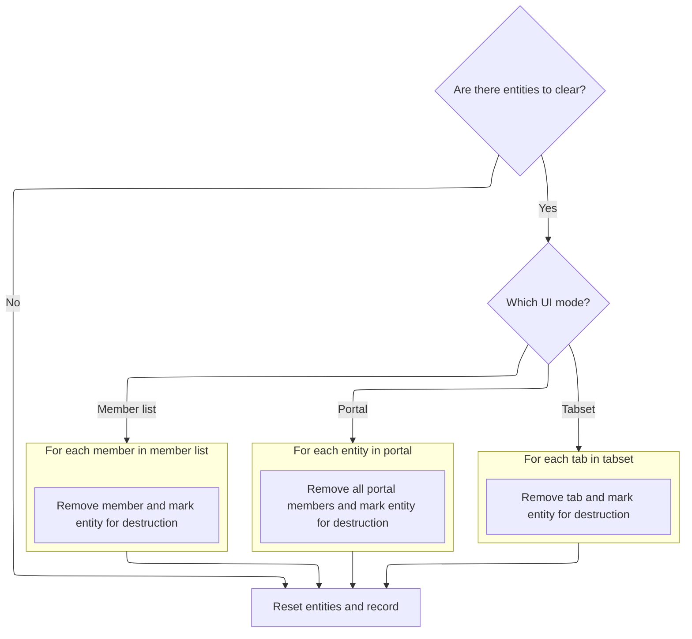
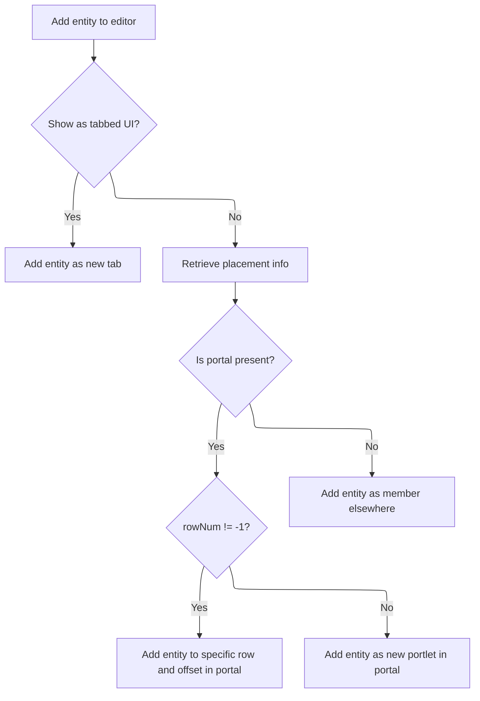

This document describes how the editor UI displays a newly fetched entity. When new entity data arrives, the system resets the UI, assigns the new record, and renders the editor interface, including any related entities or grids as configured.

# Starting the entity fetch and UI reset

This section ensures that when a new entity is fetched, the UI is reset and only the new entity's data is displayed, preventing confusion or errors from stale data.

| Category       | Rule Name             | Description                                                                                                                  |
| -------------- | --------------------- | ---------------------------------------------------------------------------------------------------------------------------- |
| Business logic | Entity UI Reset       | When a new entity record is fetched, any previous entity data and UI state must be cleared before displaying the new entity. |
| Business logic | Single Entity Display | Only the first entity record in the fetched array is displayed to the user; additional records are ignored in this context.  |

<SwmSnippet path="/shopizer/sm-shop/src/main/webapp/resources/smart-client/system/modules/ISC_Forms.js" line="3673">

---

In <SwmToken path="shopizer/sm-shop/src/main/webapp/resources/smart-client/system/modules/ISC_Forms.js" pos="3673:9:9" line-data=",isc.A.fetchDataReply=function isc_EntityEditor_fetchDataReply(_1){this.clearEntity();this.record=_1[0];this.showEntity()}">`isc_EntityEditor_fetchDataReply`</SwmToken>, we start by wiping out any previous entity state to prep for loading the new record. This avoids <SwmPath>[shopizer/…/init/data/](shopizer/sm-shop/src/main/java/com/salesmanager/web/init/data/)</SwmPath> leftovers, but assumes \_1 isn't empty.

```javascript
,isc.A.fetchDataReply=function isc_EntityEditor_fetchDataReply(_1){this.clearEntity();this.record=_1[0];this.showEntity()}
```

---

</SwmSnippet>

## Cleaning up previous entities and UI



This section ensures that all previous entities and their corresponding UI elements are properly cleared out, regardless of the UI mode in use. It prepares the system for new data by resetting the entities and record.

| Category       | Rule Name                  | Description                                                                                                                                                                                                           |
| -------------- | -------------------------- | --------------------------------------------------------------------------------------------------------------------------------------------------------------------------------------------------------------------- |
| Business logic | Reset on empty entities    | If there are no entities to clear, the entities array and record must be reset to empty values.                                                                                                                       |
| Business logic | Full entity and UI cleanup | When entities are present, all associated UI elements must be removed and each entity must be marked for destruction before resetting the entities array and record.                                                  |
| Business logic | Mode-specific cleanup      | The method of clearing entities and UI elements depends on the current UI mode: tabset, portal, or member list. Each mode requires a specific approach to ensure all entities and UI components are properly removed. |
| Business logic | Prepare for new data       | After all entities and UI elements are cleared, the entities array must be set to an empty array and the record must be set to null to prepare for new data.                                                          |

<SwmSnippet path="/shopizer/sm-shop/src/main/webapp/resources/smart-client/system/modules/ISC_Forms.js" line="3674">

---

In <SwmToken path="shopizer/sm-shop/src/main/webapp/resources/smart-client/system/modules/ISC_Forms.js" pos="3674:9:9" line-data=",isc.A.clearEntity=function isc_EntityEditor_clearEntity(){if(this.entities&amp;&amp;this.entities.length&gt;0){if(this.showTabset){for(var i=this.tabset.tabs.length-1;i&gt;=0;i--){this.entities[i].markForDestroy();this.tabset.removeTab(i)}}else if(this.portal){this.portal.members.removeAll();for(var i=this.entities.length-1;i&gt;=0;i--){this.entities[i].markForDestroy()}}else{for(var i=this.members.length-1;i&gt;=1;i--){this.removeMember(i);this.entities[i-1].markForDestroy()}}}">`isc_EntityEditor_clearEntity`</SwmToken>, we clear out entities and UI elements differently depending on the UI setup (tabset, portal, or members), making sure everything gets properly destroyed and removed.

```javascript
,isc.A.clearEntity=function isc_EntityEditor_clearEntity(){if(this.entities&&this.entities.length>0){if(this.showTabset){for(var i=this.tabset.tabs.length-1;i>=0;i--){this.entities[i].markForDestroy();this.tabset.removeTab(i)}}else if(this.portal){this.portal.members.removeAll();for(var i=this.entities.length-1;i>=0;i--){this.entities[i].markForDestroy()}}else{for(var i=this.members.length-1;i>=1;i--){this.removeMember(i);this.entities[i-1].markForDestroy()}}}
```

---

</SwmSnippet>

<SwmSnippet path="/shopizer/sm-shop/src/main/webapp/resources/smart-client/system/modules/ISC_Forms.js" line="3674">

---

After clearing out entities and UI, we blank out the entities array and record so we're ready for new data.

```javascript
,isc.A.clearEntity=function isc_EntityEditor_clearEntity(){if(this.entities&&this.entities.length>0){if(this.showTabset){for(var i=this.tabset.tabs.length-1;i>=0;i--){this.entities[i].markForDestroy();this.tabset.removeTab(i)}}else if(this.portal){this.portal.members.removeAll();for(var i=this.entities.length-1;i>=0;i--){this.entities[i].markForDestroy()}}else{for(var i=this.members.length-1;i>=1;i--){this.removeMember(i);this.entities[i-1].markForDestroy()}}}
this.entities=[];this.record=null}
```

---

</SwmSnippet>

## Assigning the new record and updating the UI

<SwmSnippet path="/shopizer/sm-shop/src/main/webapp/resources/smart-client/system/modules/ISC_Forms.js" line="3673">

---

Back in <SwmToken path="shopizer/sm-shop/src/main/webapp/resources/smart-client/system/modules/ISC_Forms.js" pos="3673:9:9" line-data=",isc.A.fetchDataReply=function isc_EntityEditor_fetchDataReply(_1){this.clearEntity();this.record=_1[0];this.showEntity()}">`isc_EntityEditor_fetchDataReply`</SwmToken>, after clearing out the old entity and setting the new record from \_1\[0\], we call <SwmToken path="shopizer/sm-shop/src/main/webapp/resources/smart-client/system/modules/ISC_Forms.js" pos="3673:31:31" line-data=",isc.A.fetchDataReply=function isc_EntityEditor_fetchDataReply(_1){this.clearEntity();this.record=_1[0];this.showEntity()}">`showEntity`</SwmToken> to actually render the editor UI for the new data. This step assumes \_1\[0\] is valid and ready to be shown.

```javascript
,isc.A.fetchDataReply=function isc_EntityEditor_fetchDataReply(_1){this.clearEntity();this.record=_1[0];this.showEntity()}
```

---

</SwmSnippet>

# Rendering the entity editor and related components

This section is responsible for rendering the entity editor interface, including the main entity and any related entities, by determining which components (editors or grids) should be displayed based on the entity relationships and configuration.

| Category        | Rule Name                                | Description                                                                                                                                                                                                                                                                                                                                                                                                                                                                                                                                                                                                                                                                                                                                                                                                                                                                                                                                                                                                                                                                                                                                                                                                                                                                                                                                                     |
| --------------- | ---------------------------------------- | --------------------------------------------------------------------------------------------------------------------------------------------------------------------------------------------------------------------------------------------------------------------------------------------------------------------------------------------------------------------------------------------------------------------------------------------------------------------------------------------------------------------------------------------------------------------------------------------------------------------------------------------------------------------------------------------------------------------------------------------------------------------------------------------------------------------------------------------------------------------------------------------------------------------------------------------------------------------------------------------------------------------------------------------------------------------------------------------------------------------------------------------------------------------------------------------------------------------------------------------------------------------------------------------------------------------------------------------------------------- |
| Data validation | Relation-driven rendering                | Only relations listed in the entityTree.relations array are eligible for rendering as related editors or grids.                                                                                                                                                                                                                                                                                                                                                                                                                                                                                                                                                                                                                                                                                                                                                                                                                                                                                                                                                                                                                                                                                                                                                                                                                                                 |
| Data validation | Conditional related entity visibility    | A related entity is only rendered if <SwmToken path="shopizer/sm-shop/src/main/webapp/resources/smart-client/system/modules/ISC_Forms.js" pos="3676:114:114" line-data=",isc.A.showEntity=function isc_EntityEditor_showEntity(){var _1=this.entityTree;if(!this.entities)this.entities=[];if(!this.entityTree)return;this.addEditor(_1);this.topLevelComponent=this.entities[0];if(_1&amp;&amp;_1.relations&amp;&amp;_1.relations.length&gt;0){for(var i=0;i&lt;_1.relations.length;i++){var _3=_1.relations[i];if(this.shouldShowEntity(_3.baseDS)){if(_3.relationArity==&quot;one&quot;){this.addEditor(_3)}else{this.addGrid(_3)}}}}}">`shouldShowEntity`</SwmToken>(<SwmToken path="shopizer/sm-shop/src/main/webapp/resources/smart-client/system/modules/ISC_Forms.js" pos="3676:118:118" line-data=",isc.A.showEntity=function isc_EntityEditor_showEntity(){var _1=this.entityTree;if(!this.entities)this.entities=[];if(!this.entityTree)return;this.addEditor(_1);this.topLevelComponent=this.entities[0];if(_1&amp;&amp;_1.relations&amp;&amp;_1.relations.length&gt;0){for(var i=0;i&lt;_1.relations.length;i++){var _3=_1.relations[i];if(this.shouldShowEntity(_3.baseDS)){if(_3.relationArity==&quot;one&quot;){this.addEditor(_3)}else{this.addGrid(_3)}}}}}">`baseDS`</SwmToken>) returns true for that entity.                               |
| Business logic  | Primary entity editor precedence         | The main entity editor must always be rendered first before any related entities or grids are considered.                                                                                                                                                                                                                                                                                                                                                                                                                                                                                                                                                                                                                                                                                                                                                                                                                                                                                                                                                                                                                                                                                                                                                                                                                                                       |
| Business logic  | Relation arity determines component type | A related entity is rendered as an editor if its <SwmToken path="shopizer/sm-shop/src/main/webapp/resources/smart-client/system/modules/ISC_Forms.js" pos="3676:126:126" line-data=",isc.A.showEntity=function isc_EntityEditor_showEntity(){var _1=this.entityTree;if(!this.entities)this.entities=[];if(!this.entityTree)return;this.addEditor(_1);this.topLevelComponent=this.entities[0];if(_1&amp;&amp;_1.relations&amp;&amp;_1.relations.length&gt;0){for(var i=0;i&lt;_1.relations.length;i++){var _3=_1.relations[i];if(this.shouldShowEntity(_3.baseDS)){if(_3.relationArity==&quot;one&quot;){this.addEditor(_3)}else{this.addGrid(_3)}}}}}">`relationArity`</SwmToken> is 'one', and as a grid if its <SwmToken path="shopizer/sm-shop/src/main/webapp/resources/smart-client/system/modules/ISC_Forms.js" pos="3676:126:126" line-data=",isc.A.showEntity=function isc_EntityEditor_showEntity(){var _1=this.entityTree;if(!this.entities)this.entities=[];if(!this.entityTree)return;this.addEditor(_1);this.topLevelComponent=this.entities[0];if(_1&amp;&amp;_1.relations&amp;&amp;_1.relations.length&gt;0){for(var i=0;i&lt;_1.relations.length;i++){var _3=_1.relations[i];if(this.shouldShowEntity(_3.baseDS)){if(_3.relationArity==&quot;one&quot;){this.addEditor(_3)}else{this.addGrid(_3)}}}}}">`relationArity`</SwmToken> is not 'one'. |

<SwmSnippet path="/shopizer/sm-shop/src/main/webapp/resources/smart-client/system/modules/ISC_Forms.js" line="3676">

---

In <SwmToken path="shopizer/sm-shop/src/main/webapp/resources/smart-client/system/modules/ISC_Forms.js" pos="3676:9:9" line-data=",isc.A.showEntity=function isc_EntityEditor_showEntity(){var _1=this.entityTree;if(!this.entities)this.entities=[];if(!this.entityTree)return;this.addEditor(_1);this.topLevelComponent=this.entities[0];if(_1&amp;&amp;_1.relations&amp;&amp;_1.relations.length&gt;0){for(var i=0;i&lt;_1.relations.length;i++){var _3=_1.relations[i];if(this.shouldShowEntity(_3.baseDS)){if(_3.relationArity==&quot;one&quot;){this.addEditor(_3)}else{this.addGrid(_3)}}}}}">`isc_EntityEditor_showEntity`</SwmToken>, we start by adding the main editor for the top-level entity using <SwmToken path="shopizer/sm-shop/src/main/webapp/resources/smart-client/system/modules/ISC_Forms.js" pos="3676:46:46" line-data=",isc.A.showEntity=function isc_EntityEditor_showEntity(){var _1=this.entityTree;if(!this.entities)this.entities=[];if(!this.entityTree)return;this.addEditor(_1);this.topLevelComponent=this.entities[0];if(_1&amp;&amp;_1.relations&amp;&amp;_1.relations.length&gt;0){for(var i=0;i&lt;_1.relations.length;i++){var _3=_1.relations[i];if(this.shouldShowEntity(_3.baseDS)){if(_3.relationArity==&quot;one&quot;){this.addEditor(_3)}else{this.addGrid(_3)}}}}}">`addEditor`</SwmToken>. This sets up the primary UI component before dealing with any related entities or grids. The function expects <SwmToken path="shopizer/sm-shop/src/main/webapp/resources/smart-client/system/modules/ISC_Forms.js" pos="3676:19:19" line-data=",isc.A.showEntity=function isc_EntityEditor_showEntity(){var _1=this.entityTree;if(!this.entities)this.entities=[];if(!this.entityTree)return;this.addEditor(_1);this.topLevelComponent=this.entities[0];if(_1&amp;&amp;_1.relations&amp;&amp;_1.relations.length&gt;0){for(var i=0;i&lt;_1.relations.length;i++){var _3=_1.relations[i];if(this.shouldShowEntity(_3.baseDS)){if(_3.relationArity==&quot;one&quot;){this.addEditor(_3)}else{this.addGrid(_3)}}}}}">`entityTree`</SwmToken> to have a relations array, which drives what gets rendered next.

```javascript
,isc.A.showEntity=function isc_EntityEditor_showEntity(){var _1=this.entityTree;if(!this.entities)this.entities=[];if(!this.entityTree)return;this.addEditor(_1);this.topLevelComponent=this.entities[0];if(_1&&_1.relations&&_1.relations.length>0){for(var i=0;i<_1.relations.length;i++){var _3=_1.relations[i];if(this.shouldShowEntity(_3.baseDS)){if(_3.relationArity=="one"){this.addEditor(_3)}else{this.addGrid(_3)}}}}}
```

---

</SwmSnippet>

## Creating and linking the main entity editor

This section is responsible for creating the main entity editor form and ensuring it is properly linked to the entities collection and user interface. The editor must be initialized with the correct data source, title, record, and relation properties, and then connected to the rest of the system for seamless entity management.

| Category        | Rule Name                          | Description                                                                                                                                      |
| --------------- | ---------------------------------- | ------------------------------------------------------------------------------------------------------------------------------------------------ |
| Data validation | Editor Initialization Requirements | The entity editor must be created with the correct data source, title, record, and relation properties as specified in the entity configuration. |
| Data validation | Editor Layout Consistency          | The entity editor must occupy 100% of the available height and width to ensure a consistent and user-friendly interface.                         |
| Business logic  | Editor Linking                     | The entity editor must be linked to the entities collection and user interface to enable seamless navigation and interaction.                    |

<SwmSnippet path="/shopizer/sm-shop/src/main/webapp/resources/smart-client/system/modules/ISC_Forms.js" line="3684">

---

<SwmToken path="shopizer/sm-shop/src/main/webapp/resources/smart-client/system/modules/ISC_Forms.js" pos="3684:9:9" line-data=",isc.A.addEditor=function isc_EntityEditor_addEditor(_1){var _2=this.createAutoChild(&quot;formEntity&quot;,{height:&quot;100%&quot;,width:&quot;100%&quot;,dataSource:_1.baseDS,title:this.getEntityTitle(_1),record:this.record,relation:_1,formProperties:this.getRelatedEditorProperties(_1.baseDS,_1.relatedFieldName)});this.addEntityLink(_2);this.logWarn(&quot;adding linked single-record entity&quot;)}">`isc_EntityEditor_addEditor`</SwmToken> creates the main form editor for the entity using <SwmToken path="shopizer/sm-shop/src/main/webapp/resources/smart-client/system/modules/ISC_Forms.js" pos="3684:20:20" line-data=",isc.A.addEditor=function isc_EntityEditor_addEditor(_1){var _2=this.createAutoChild(&quot;formEntity&quot;,{height:&quot;100%&quot;,width:&quot;100%&quot;,dataSource:_1.baseDS,title:this.getEntityTitle(_1),record:this.record,relation:_1,formProperties:this.getRelatedEditorProperties(_1.baseDS,_1.relatedFieldName)});this.addEntityLink(_2);this.logWarn(&quot;adding linked single-record entity&quot;)}">`createAutoChild`</SwmToken>, then links it to the entities collection and UI with <SwmToken path="shopizer/sm-shop/src/main/webapp/resources/smart-client/system/modules/ISC_Forms.js" pos="3684:85:85" line-data=",isc.A.addEditor=function isc_EntityEditor_addEditor(_1){var _2=this.createAutoChild(&quot;formEntity&quot;,{height:&quot;100%&quot;,width:&quot;100%&quot;,dataSource:_1.baseDS,title:this.getEntityTitle(_1),record:this.record,relation:_1,formProperties:this.getRelatedEditorProperties(_1.baseDS,_1.relatedFieldName)});this.addEntityLink(_2);this.logWarn(&quot;adding linked single-record entity&quot;)}">`addEntityLink`</SwmToken>. This step is needed to make sure the editor is both created and hooked up to the rest of the system.

```javascript
,isc.A.addEditor=function isc_EntityEditor_addEditor(_1){var _2=this.createAutoChild("formEntity",{height:"100%",width:"100%",dataSource:_1.baseDS,title:this.getEntityTitle(_1),record:this.record,relation:_1,formProperties:this.getRelatedEditorProperties(_1.baseDS,_1.relatedFieldName)});this.addEntityLink(_2);this.logWarn("adding linked single-record entity")}
```

---

</SwmSnippet>

## Linking entity editors and managing UI placement



This section governs the rules for linking entity editors and managing their placement in the Shopizer admin UI. It ensures that entity editors are added to the correct UI component (tab, portal, or container) based on the current context and configuration, providing a consistent and logical user experience.

| Category       | Rule Name                       | Description                                                                                                                                                                                                                                                                                                                                                                                                                                                                                                                                                                                                                                                                                                                                                                                                                            |
| -------------- | ------------------------------- | -------------------------------------------------------------------------------------------------------------------------------------------------------------------------------------------------------------------------------------------------------------------------------------------------------------------------------------------------------------------------------------------------------------------------------------------------------------------------------------------------------------------------------------------------------------------------------------------------------------------------------------------------------------------------------------------------------------------------------------------------------------------------------------------------------------------------------------- |
| Business logic | Tabbed UI Placement             | If the UI is configured to use a tabbed interface for entity editors, any new entity editor must be added as a new tab within the editor UI.                                                                                                                                                                                                                                                                                                                                                                                                                                                                                                                                                                                                                                                                                           |
| Business logic | Portal Placement by Data Source | If the UI is not using a tabbed interface and a portal layout is present, the system must check the data source specification for row and offset values to determine the exact placement of the entity editor within the portal.                                                                                                                                                                                                                                                                                                                                                                                                                                                                                                                                                                                                       |
| Business logic | Specific Row Placement          | If the data source specifies a valid row number (<SwmToken path="shopizer/sm-shop/src/main/webapp/resources/smart-client/system/modules/ISC_Forms.js" pos="3686:69:69" line-data=",isc.A.addEntityLink=function isc_EntityEditor_addEntityLink(_1){this.entities.add(_1);if(this.showTabset){this.addEntityTab(_1)}else{var _2=_1.relation,_3=this.getDataSourceSpec(_2.baseDS,_2.relatedFieldName),_4=(_3&amp;&amp;_3.rowNum!=null?_3.rowNum:-1),_5=(_3&amp;&amp;_3.offsetInRow!=null?_3.offsetInRow:-1);if(this.portal){if(_3&amp;&amp;_3.userHeight!=null)_1.$po=_3.userHeight;if(_4!=-1){this.portal.getColumn(0).addPortletToExistingRow(_1,_4,_5)}else{this.portal.getColumn(0).addPortlet(_1)}}">`rowNum`</SwmToken> is not -1), the entity editor must be added to the specified row and offset within the portal layout.      |
| Business logic | New Portlet Placement           | If the data source does not specify a valid row number (<SwmToken path="shopizer/sm-shop/src/main/webapp/resources/smart-client/system/modules/ISC_Forms.js" pos="3686:69:69" line-data=",isc.A.addEntityLink=function isc_EntityEditor_addEntityLink(_1){this.entities.add(_1);if(this.showTabset){this.addEntityTab(_1)}else{var _2=_1.relation,_3=this.getDataSourceSpec(_2.baseDS,_2.relatedFieldName),_4=(_3&amp;&amp;_3.rowNum!=null?_3.rowNum:-1),_5=(_3&amp;&amp;_3.offsetInRow!=null?_3.offsetInRow:-1);if(this.portal){if(_3&amp;&amp;_3.userHeight!=null)_1.$po=_3.userHeight;if(_4!=-1){this.portal.getColumn(0).addPortletToExistingRow(_1,_4,_5)}else{this.portal.getColumn(0).addPortlet(_1)}}">`rowNum`</SwmToken> is -1), the entity editor must be added as a new portlet in the portal layout, appended at the end. |
| Business logic | Fallback Member Placement       | If no portal layout is present, the entity editor must be added as a member to the default or fallback container in the UI.                                                                                                                                                                                                                                                                                                                                                                                                                                                                                                                                                                                                                                                                                                            |
| Business logic | Editor Height by Data Source    | If the data source specifies a <SwmToken path="shopizer/sm-shop/src/main/webapp/resources/smart-client/system/modules/ISC_Forms.js" pos="3686:111:111" line-data=",isc.A.addEntityLink=function isc_EntityEditor_addEntityLink(_1){this.entities.add(_1);if(this.showTabset){this.addEntityTab(_1)}else{var _2=_1.relation,_3=this.getDataSourceSpec(_2.baseDS,_2.relatedFieldName),_4=(_3&amp;&amp;_3.rowNum!=null?_3.rowNum:-1),_5=(_3&amp;&amp;_3.offsetInRow!=null?_3.offsetInRow:-1);if(this.portal){if(_3&amp;&amp;_3.userHeight!=null)_1.$po=_3.userHeight;if(_4!=-1){this.portal.getColumn(0).addPortletToExistingRow(_1,_4,_5)}else{this.portal.getColumn(0).addPortlet(_1)}}">`userHeight`</SwmToken> value, the entity editor must use this value to determine its height within the portal layout.                         |

<SwmSnippet path="/shopizer/sm-shop/src/main/webapp/resources/smart-client/system/modules/ISC_Forms.js" line="3686">

---

<SwmToken path="shopizer/sm-shop/src/main/webapp/resources/smart-client/system/modules/ISC_Forms.js" pos="3686:9:9" line-data=",isc.A.addEntityLink=function isc_EntityEditor_addEntityLink(_1){this.entities.add(_1);if(this.showTabset){this.addEntityTab(_1)}else{var _2=_1.relation,_3=this.getDataSourceSpec(_2.baseDS,_2.relatedFieldName),_4=(_3&amp;&amp;_3.rowNum!=null?_3.rowNum:-1),_5=(_3&amp;&amp;_3.offsetInRow!=null?_3.offsetInRow:-1);if(this.portal){if(_3&amp;&amp;_3.userHeight!=null)_1.$po=_3.userHeight;if(_4!=-1){this.portal.getColumn(0).addPortletToExistingRow(_1,_4,_5)}else{this.portal.getColumn(0).addPortlet(_1)}}">`isc_EntityEditor_addEntityLink`</SwmToken> adds the editor to the entities collection and then places it in the UI—either as a tab, a portlet in a specific row/column, or just as a member—based on the current UI setup and data source specs. If a portal is used and <SwmToken path="shopizer/sm-shop/src/main/webapp/resources/smart-client/system/modules/ISC_Forms.js" pos="3686:69:69" line-data=",isc.A.addEntityLink=function isc_EntityEditor_addEntityLink(_1){this.entities.add(_1);if(this.showTabset){this.addEntityTab(_1)}else{var _2=_1.relation,_3=this.getDataSourceSpec(_2.baseDS,_2.relatedFieldName),_4=(_3&amp;&amp;_3.rowNum!=null?_3.rowNum:-1),_5=(_3&amp;&amp;_3.offsetInRow!=null?_3.offsetInRow:-1);if(this.portal){if(_3&amp;&amp;_3.userHeight!=null)_1.$po=_3.userHeight;if(_4!=-1){this.portal.getColumn(0).addPortletToExistingRow(_1,_4,_5)}else{this.portal.getColumn(0).addPortlet(_1)}}">`rowNum`</SwmToken> is valid, we call <SwmToken path="shopizer/sm-shop/src/main/webapp/resources/smart-client/system/modules/ISC_Forms.js" pos="3686:139:139" line-data=",isc.A.addEntityLink=function isc_EntityEditor_addEntityLink(_1){this.entities.add(_1);if(this.showTabset){this.addEntityTab(_1)}else{var _2=_1.relation,_3=this.getDataSourceSpec(_2.baseDS,_2.relatedFieldName),_4=(_3&amp;&amp;_3.rowNum!=null?_3.rowNum:-1),_5=(_3&amp;&amp;_3.offsetInRow!=null?_3.offsetInRow:-1);if(this.portal){if(_3&amp;&amp;_3.userHeight!=null)_1.$po=_3.userHeight;if(_4!=-1){this.portal.getColumn(0).addPortletToExistingRow(_1,_4,_5)}else{this.portal.getColumn(0).addPortlet(_1)}}">`addPortletToExistingRow`</SwmToken> to position the entity precisely.

```javascript
,isc.A.addEntityLink=function isc_EntityEditor_addEntityLink(_1){this.entities.add(_1);if(this.showTabset){this.addEntityTab(_1)}else{var _2=_1.relation,_3=this.getDataSourceSpec(_2.baseDS,_2.relatedFieldName),_4=(_3&&_3.rowNum!=null?_3.rowNum:-1),_5=(_3&&_3.offsetInRow!=null?_3.offsetInRow:-1);if(this.portal){if(_3&&_3.userHeight!=null)_1.$po=_3.userHeight;if(_4!=-1){this.portal.getColumn(0).addPortletToExistingRow(_1,_4,_5)}else{this.portal.getColumn(0).addPortlet(_1)}}
else this.addMember(_1)}}
```

---

</SwmSnippet>

<SwmSnippet path="/shopizer/sm-shop/src/main/webapp/resources/smart-client/system/modules/ISC_Containers.js" line="289">

---

<SwmToken path="shopizer/sm-shop/src/main/webapp/resources/smart-client/system/modules/ISC_Containers.js" pos="289:9:9" line-data=",isc.A.addPortletToExistingRow=function isc_PortalColumn_addPortletToExistingRow(_1,_2,_3){var _4=this.rowLayout.getMembers();if(_4==null||_4.length&lt;=_2){if(this.editContext&amp;&amp;this.editNode&amp;&amp;_1.editNode){this.addNode(_1.editNode,this.editNode,_4.length)}else{this.addPortlet(_1,_4.length)}}else{var _5=this.rowLayout.getMember(_2);if(_5.editContext&amp;&amp;_5.editNode&amp;&amp;_1.editNode){_5.editContext.addNode(_1.editNode,_5.editNode,_3)}else{_5.addPortlets(_1,_3)}}}">`isc_PortalColumn_addPortletToExistingRow`</SwmToken> figures out where to add the portlet in the row layout, using editContext/editNode if available for node-based editing, or just adding the portlet directly. It handles out-of-bounds indices by defaulting to appending at the end.

```javascript
,isc.A.addPortletToExistingRow=function isc_PortalColumn_addPortletToExistingRow(_1,_2,_3){var _4=this.rowLayout.getMembers();if(_4==null||_4.length<=_2){if(this.editContext&&this.editNode&&_1.editNode){this.addNode(_1.editNode,this.editNode,_4.length)}else{this.addPortlet(_1,_4.length)}}else{var _5=this.rowLayout.getMember(_2);if(_5.editContext&&_5.editNode&&_1.editNode){_5.editContext.addNode(_1.editNode,_5.editNode,_3)}else{_5.addPortlets(_1,_3)}}}
```

---

</SwmSnippet>

## Rendering related entities and grids

```mermaid
%%{init: {"flowchart": {"defaultRenderer": "elk"}} }%%
flowchart TD
    node1["Check for entity tree"]
    click node1 openCode "shopizer/sm-shop/src/main/webapp/resources/smart-client/system/modules/ISC_Forms.js:3676:3677"
    node1 --> node2["Add main entity editor"]
    click node2 openCode "shopizer/sm-shop/src/main/webapp/resources/smart-client/system/modules/ISC_Forms.js:3677:3678"
    node2 --> node3{"Does entity have relations?"}
    click node3 openCode "shopizer/sm-shop/src/main/webapp/resources/smart-client/system/modules/ISC_Forms.js:3678:3679"
    node3 -->|"No"| node6["Finish"]
    click node6 openCode "shopizer/sm-shop/src/main/webapp/resources/smart-client/system/modules/ISC_Forms.js:3684:3685"
    node3 -->|"Yes"| node4["Process relations"]
    click node4 openCode "shopizer/sm-shop/src/main/webapp/resources/smart-client/system/modules/ISC_Forms.js:3679:3684"
    
    subgraph loop1["For each relation"]
        node4 --> node5{"Should show related entity?"}
        click node5 openCode "shopizer/sm-shop/src/main/webapp/resources/smart-client/system/modules/ISC_Forms.js:3680:3681"
        node5 -->|"No"| node4
        node5 -->|"Yes"| node7{"Relation type?"}
        click node7 openCode "shopizer/sm-shop/src/main/webapp/resources/smart-client/system/modules/ISC_Forms.js:3681:3682"
        node7 -->|"Single relation"| node8["Add editor for related entity"]
        click node8 openCode "shopizer/sm-shop/src/main/webapp/resources/smart-client/system/modules/ISC_Forms.js:3682:3683"
        node7 -->|"Multiple relation"| node9["Add grid for related entities"]
        click node9 openCode "shopizer/sm-shop/src/main/webapp/resources/smart-client/system/modules/ISC_Forms.js:3683:3684"
        node8 --> node4
        node9 --> node4
    end
    node4 --> node6["Finish"]

classDef HeadingStyle fill:#777777,stroke:#333,stroke-width:2px;

%% Swimm:
%% %%{init: {"flowchart": {"defaultRenderer": "elk"}} }%%
%% flowchart TD
%%     node1["Check for entity tree"]
%%     click node1 openCode "<SwmPath>[shopizer/…/modules/ISC_Forms.js](shopizer/sm-shop/src/main/webapp/resources/smart-client/system/modules/ISC_Forms.js)</SwmPath>:3676:3677"
%%     node1 --> node2["Add main entity editor"]
%%     click node2 openCode "<SwmPath>[shopizer/…/modules/ISC_Forms.js](shopizer/sm-shop/src/main/webapp/resources/smart-client/system/modules/ISC_Forms.js)</SwmPath>:3677:3678"
%%     node2 --> node3{"Does entity have relations?"}
%%     click node3 openCode "<SwmPath>[shopizer/…/modules/ISC_Forms.js](shopizer/sm-shop/src/main/webapp/resources/smart-client/system/modules/ISC_Forms.js)</SwmPath>:3678:3679"
%%     node3 -->|"No"| node6["Finish"]
%%     click node6 openCode "<SwmPath>[shopizer/…/modules/ISC_Forms.js](shopizer/sm-shop/src/main/webapp/resources/smart-client/system/modules/ISC_Forms.js)</SwmPath>:3684:3685"
%%     node3 -->|"Yes"| node4["Process relations"]
%%     click node4 openCode "<SwmPath>[shopizer/…/modules/ISC_Forms.js](shopizer/sm-shop/src/main/webapp/resources/smart-client/system/modules/ISC_Forms.js)</SwmPath>:3679:3684"
%%     
%%     subgraph loop1["For each relation"]
%%         node4 --> node5{"Should show related entity?"}
%%         click node5 openCode "<SwmPath>[shopizer/…/modules/ISC_Forms.js](shopizer/sm-shop/src/main/webapp/resources/smart-client/system/modules/ISC_Forms.js)</SwmPath>:3680:3681"
%%         node5 -->|"No"| node4
%%         node5 -->|"Yes"| node7{"Relation type?"}
%%         click node7 openCode "<SwmPath>[shopizer/…/modules/ISC_Forms.js](shopizer/sm-shop/src/main/webapp/resources/smart-client/system/modules/ISC_Forms.js)</SwmPath>:3681:3682"
%%         node7 -->|"Single relation"| node8["Add editor for related entity"]
%%         click node8 openCode "<SwmPath>[shopizer/…/modules/ISC_Forms.js](shopizer/sm-shop/src/main/webapp/resources/smart-client/system/modules/ISC_Forms.js)</SwmPath>:3682:3683"
%%         node7 -->|"Multiple relation"| node9["Add grid for related entities"]
%%         click node9 openCode "<SwmPath>[shopizer/…/modules/ISC_Forms.js](shopizer/sm-shop/src/main/webapp/resources/smart-client/system/modules/ISC_Forms.js)</SwmPath>:3683:3684"
%%         node8 --> node4
%%         node9 --> node4
%%     end
%%     node4 --> node6["Finish"]
%% 
%% classDef HeadingStyle fill:#777777,stroke:#333,stroke-width:<SwmToken path="shopizer/sm-shop/src/main/webapp/resources/smart-client/system/modules/ISC_Forms.js" pos="3624:96:96" line-data="if(isc.Portal){isc.defineClass(&quot;EntityEditorHeader&quot;,&quot;VLayout&quot;);isc.A=isc.EntityEditorHeader.getPrototype();isc.B=isc._allFuncs;isc.C=isc.B._maxIndex;isc.D=isc._funcClasses;isc.D[isc.C]=isc.A.Class;isc.A.height=1;isc.A.padding=10;isc.A.border=&quot;2px solid black&quot;;isc.A.headerLayoutDefaults={_constructor:&quot;VLayout&quot;,width:&quot;100%&quot;,height:1,membersMargin:5};isc.A.headerLabelTitle=&quot;&lt;B&gt;&lt;H2&gt;Editing ${entityType}&lt;/H2&gt;&lt;br&gt;&quot;+&quot;&lt;H3&gt;This UI lets you edit the entire data-structure for this Entity-type&lt;/H3&gt;&lt;/B&gt;&quot;;isc.A.headerLabelDefaults={_constructor:&quot;Label&quot;,width:&quot;100%&quot;,height:30,autoParent:&quot;headerLayout&quot;};isc.A.showDetailLabel=false;isc.A.defaultDetailLabelTitle=&quot;&lt;B&gt;&lt;H3&gt;This UI lets you edit the entire data-structure for this Entity-type&lt;/H3&gt;&lt;/B&gt;&quot;;isc.A.detailLabelTitle=&quot;&lt;B&gt;&lt;H3&gt;$entityComment&lt;/H3&gt;&lt;/B&gt;&quot;;isc.A.detailLabelDefaults={_constructor:&quot;Label&quot;,width:&quot;100%&quot;,height:20,autoParent:&quot;headerLayout&quot;};isc.A.unknownEntityTitle=&quot;[Unknown Entity-type]&quot;;isc.B.push(isc.A.initWidget=function isc_EntityEditorHeader_initWidget(){var _1=this.headerLabelTitle;var _2=this.detailLabelTitle;if(this.dataSource)this.getDataSource(this.dataSource);if(!this.entityName)this.entityName=this.getEntityName(this.dataSource);if(!this.entityComment)this.entityComment=this.getEntityComment(this.dataSource);if(this.entityName)">`2px`</SwmToken>;
```



<SwmSnippet path="/shopizer/sm-shop/src/main/webapp/resources/smart-client/system/modules/ISC_Forms.js" line="3676">

---

Back in <SwmToken path="shopizer/sm-shop/src/main/webapp/resources/smart-client/system/modules/ISC_Forms.js" pos="3676:5:5" line-data=",isc.A.showEntity=function isc_EntityEditor_showEntity(){var _1=this.entityTree;if(!this.entities)this.entities=[];if(!this.entityTree)return;this.addEditor(_1);this.topLevelComponent=this.entities[0];if(_1&amp;&amp;_1.relations&amp;&amp;_1.relations.length&gt;0){for(var i=0;i&lt;_1.relations.length;i++){var _3=_1.relations[i];if(this.shouldShowEntity(_3.baseDS)){if(_3.relationArity==&quot;one&quot;){this.addEditor(_3)}else{this.addGrid(_3)}}}}}">`showEntity`</SwmToken>, after adding the main editor, we loop through relations and call <SwmToken path="shopizer/sm-shop/src/main/webapp/resources/smart-client/system/modules/ISC_Forms.js" pos="3676:144:144" line-data=",isc.A.showEntity=function isc_EntityEditor_showEntity(){var _1=this.entityTree;if(!this.entities)this.entities=[];if(!this.entityTree)return;this.addEditor(_1);this.topLevelComponent=this.entities[0];if(_1&amp;&amp;_1.relations&amp;&amp;_1.relations.length&gt;0){for(var i=0;i&lt;_1.relations.length;i++){var _3=_1.relations[i];if(this.shouldShowEntity(_3.baseDS)){if(_3.relationArity==&quot;one&quot;){this.addEditor(_3)}else{this.addGrid(_3)}}}}}">`addGrid`</SwmToken> for those with arity not equal to 'one'. This sets up grid UIs for related entities that need to show multiple records.

```javascript
,isc.A.showEntity=function isc_EntityEditor_showEntity(){var _1=this.entityTree;if(!this.entities)this.entities=[];if(!this.entityTree)return;this.addEditor(_1);this.topLevelComponent=this.entities[0];if(_1&&_1.relations&&_1.relations.length>0){for(var i=0;i<_1.relations.length;i++){var _3=_1.relations[i];if(this.shouldShowEntity(_3.baseDS)){if(_3.relationArity=="one"){this.addEditor(_3)}else{this.addGrid(_3)}}}}}
```

---

</SwmSnippet>

<SwmSnippet path="/shopizer/sm-shop/src/main/webapp/resources/smart-client/system/modules/ISC_Forms.js" line="3685">

---

<SwmToken path="shopizer/sm-shop/src/main/webapp/resources/smart-client/system/modules/ISC_Forms.js" pos="3685:9:9" line-data=",isc.A.addGrid=function isc_EntityEditor_addGrid(_1){var _2=this.createAutoChild(&quot;gridEntity&quot;,{height:&quot;100%&quot;,width:&quot;100%&quot;,dataSource:_1.baseDS,title:this.getEntityTitle(_1),record:this.record,relation:_1,gridProperties:this.getRelatedEditorProperties(_1.baseDS,_1.relatedFieldName)});this.addEntityLink(_2);this.logWarn(&quot;added linked multiple-record entity&quot;)}">`isc_EntityEditor_addGrid`</SwmToken> builds a grid UI for related entities using <SwmToken path="shopizer/sm-shop/src/main/webapp/resources/smart-client/system/modules/ISC_Forms.js" pos="3685:20:20" line-data=",isc.A.addGrid=function isc_EntityEditor_addGrid(_1){var _2=this.createAutoChild(&quot;gridEntity&quot;,{height:&quot;100%&quot;,width:&quot;100%&quot;,dataSource:_1.baseDS,title:this.getEntityTitle(_1),record:this.record,relation:_1,gridProperties:this.getRelatedEditorProperties(_1.baseDS,_1.relatedFieldName)});this.addEntityLink(_2);this.logWarn(&quot;added linked multiple-record entity&quot;)}">`createAutoChild`</SwmToken>, then links it up with <SwmToken path="shopizer/sm-shop/src/main/webapp/resources/smart-client/system/modules/ISC_Forms.js" pos="3685:85:85" line-data=",isc.A.addGrid=function isc_EntityEditor_addGrid(_1){var _2=this.createAutoChild(&quot;gridEntity&quot;,{height:&quot;100%&quot;,width:&quot;100%&quot;,dataSource:_1.baseDS,title:this.getEntityTitle(_1),record:this.record,relation:_1,gridProperties:this.getRelatedEditorProperties(_1.baseDS,_1.relatedFieldName)});this.addEntityLink(_2);this.logWarn(&quot;added linked multiple-record entity&quot;)}">`addEntityLink`</SwmToken> so it gets managed and displayed in the right spot. This is for showing multiple records tied to the main entity.

```javascript
,isc.A.addGrid=function isc_EntityEditor_addGrid(_1){var _2=this.createAutoChild("gridEntity",{height:"100%",width:"100%",dataSource:_1.baseDS,title:this.getEntityTitle(_1),record:this.record,relation:_1,gridProperties:this.getRelatedEditorProperties(_1.baseDS,_1.relatedFieldName)});this.addEntityLink(_2);this.logWarn("added linked multiple-record entity")}
```

---

</SwmSnippet>

&nbsp;

*This is an* <SwmToken path="shopizer/sm-shop/src/main/webapp/resources/smart-client/system/modules/ISC_Forms.js" pos="1135:51:53" line-data="{this.logWarn(&quot;This form item has more than one icon with the same specified name:&quot;+_2+&quot;. Ignoring this name and using an auto-generated one instead.&quot;);_2=null}else{_1.name=_2;return _1}}">`auto-generated`</SwmToken> *document by Swimm 🌊 and has not yet been verified by a human*

<SwmMeta version="3.0.0" repo-id="Z2l0aHViJTNBJTNBU2hvcGl6ZXIlM0ElM0F1bWFsaW5nYXN3YW1p" repo-name="Shopizer"><sup>Powered by [Swimm](https://app.swimm.io/)</sup></SwmMeta>
